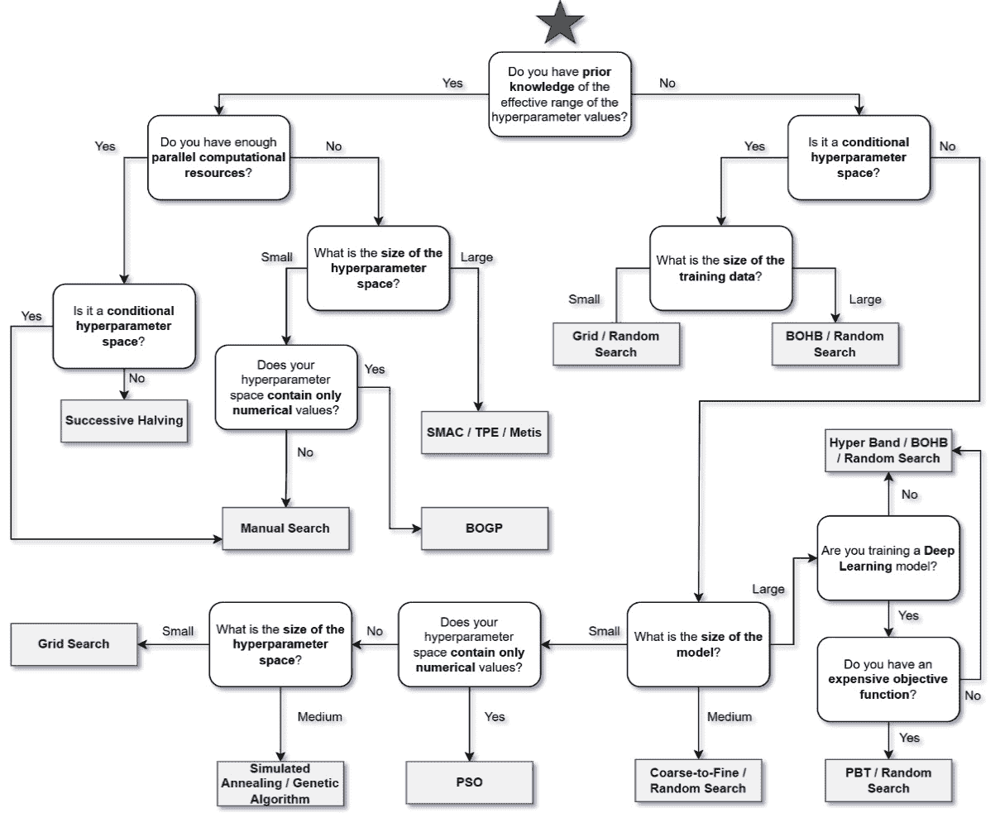

# 第十四章：*第十四章*: 结论与下一步

恭喜你完成这本书！在前面的章节中，你已经接触到了许多与超参数调整相关的有趣的概念、方法和实现。本章总结了前几章中学到的重要课程，并将介绍一些你可能从中受益的话题或实现，这些内容我们在这本书中没有涉及。

本章将讨论以下主要内容：

+   重新审视超参数调整方法和包

+   重新审视 HTDM

+   接下来是什么？

# 重新审视超参数调整方法和包

在本书中，我们讨论了四组超参数调整方法，包括穷举搜索、贝叶斯优化、启发式搜索和多保真优化。每组方法中的所有方法都具有相似的特征。例如，手动搜索、网格搜索和随机搜索，它们都是穷举搜索组的一部分，都是通过穷举搜索超参数空间来工作的，可以归类为无信息搜索方法。

贝叶斯优化超参数调整方法被归类为信息搜索方法，其中所有方法都是通过利用代理模型和获取函数来工作的。启发式搜索组中的超参数调整方法通过试错来工作。至于多保真优化组中的超参数调整方法，它们都利用整个超参数调整管道的廉价近似，这样我们就可以以更少的计算成本和更快的实验时间获得相似的性能结果。

下表总结了本书中讨论的所有超参数调整方法，以及支持的包：

.png)

.jpg)

图 14.1 – 超参数调整方法和包总结

在本节中，我们回顾了本书中讨论的所有超参数调整方法和包。在下一节中，我们将重新审视 HTDM。

# 重新审视 HTDM

**超参数调整决策图**（**HTDM**）是一个你可以用来帮助你决定在特定情况下应该采用哪种超参数调整方法的图。我们在*第十一章*，“介绍超参数调整决策图”中详细讨论了如何利用 HTDM，以及一些用例。在这里，我们只重新审视一下以下图所示的地图：

图 14.2 – HTDM

在本节中，我们回顾了 HTDM。在下一节中，我们将讨论其他你可能感兴趣的主题，以进一步加深你的超参数调优知识。

# 接下来是什么？

尽管我们已经讨论了许多超参数调优方法和它们在各种包中的实现，但还有一些重要的概念你可能需要了解，这些概念在本书中没有讨论。至于超参数调优方法，你还可以了解更多关于**CMA-ES**方法的信息，它是启发式搜索组的一部分([`cma-es.github.io/`](https://cma-es.github.io/))。你还可以了解更多关于**元学习**概念的信息，以进一步提高你的贝叶斯优化调优结果的表现([`lilianweng.github.io/posts/2018-11-30-meta-learning/`](https://lilianweng.github.io/posts/2018-11-30-meta-learning/))。还值得注意的是，我们可以将手动搜索方法与其他超参数调优方法相结合，以提高我们实验的效率，尤其是在我们已经对超参数值的良好范围有先验知识的情况下。

关于包，你还可以了解更多关于**HpBandSter**包的信息，该包实现了超带宽、BOHB 和随机搜索方法([`github.com/automl/HpBandSter`](https://github.com/automl/HpBandSter))。最后，还有一些包可以自动从非 scikit-learn 模型创建 scikit-learn 包装器。例如，你可以使用**Skorch**包从 PyTorch 模型创建 scikit-learn 包装器([`skorch.readthedocs.io/en/stable/`](https://skorch.readthedocs.io/en/stable/))。

# 摘要

在本章中，我们总结了本书所有章节中讨论的所有重要概念。你还被介绍了几种你可能想要学习以进一步加深你的超参数调优知识的新概念。从现在开始，你将拥有控制你的机器学习模型并通过超参数调优实验获得最佳模型以获得最佳结果所需的技能。

感谢你投入兴趣和时间阅读这本书。祝你在超参数调优学习之旅中好运！
