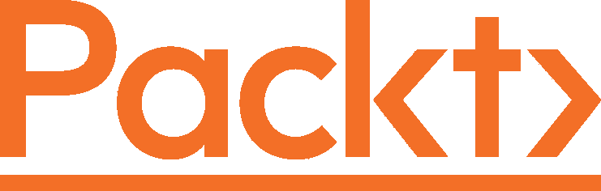

[Packt.com](http://Packt.com)

订阅我们的在线数字图书馆，全面访问超过 7,000 本书和视频，以及领先的行业工具，帮助您规划个人发展并推进您的职业生涯。更多信息，请访问我们的网站。

# 为什么订阅？

+   通过来自 4,000 多位行业专业人士的实用电子书和视频，节省学习时间，增加编码时间

+   通过为您量身定制的技能计划提高学习效果

+   每月免费获得一本电子书或视频

+   完全可搜索，便于轻松访问关键信息

+   复制粘贴、打印和收藏内容

您知道 Packt 为每本书都提供电子书版本，包括 PDF 和 ePub 文件吗？您可以在 [packt.com](http://packt.com) 升级到电子书版本，并且作为印刷书客户，您有权获得电子书副本的折扣。有关更多详情，请联系我们 [customercare@packtpub.com](http://customercare@packtpub.com)。

在 [www.packt.com](http://www.packt.com)，您还可以阅读一系列免费技术文章，订阅各种免费通讯，并享受 Packt 书籍和电子书的独家折扣和优惠。

# 您可能还会喜欢的其他书籍

如果您喜欢这本书，您可能对 Packt 的其他书籍也感兴趣：

)

**使用 Python 进行流数据机器学习**

Joos Korstanje

ISBN: 9781803248363

+   了解与流数据工作相关的挑战和优势

)

**使用 PyTorch 和 Scikit-Learn 进行机器学习**

Sebastian Raschka，Yuxi (Hayden) Liu，Vahid Mirjalili

ISBN: 9781801819312

+   探索机器从数据中“学习”的框架、模型和技术

# Packt 正在寻找像您这样的作者

如果你有兴趣成为 Packt 的作者，请访问 [authors.packtpub.com](http://authors.packtpub.com) 并今天申请。我们已经与成千上万的开发者和技术专业人士合作，就像你一样，帮助他们将见解分享给全球科技社区。你可以提交一个一般性申请，申请我们正在招募作者的特定热门话题，或者提交你自己的想法。

# 分享你的想法

现在你已经完成了 *《Python 中的超参数调优》*，我们非常想听听你的想法！如果你从亚马逊购买了这本书，[请点击此处直接跳转到该书的亚马逊评论页面](https://packt.link/r/1-803-23587-X)并分享你的反馈或在该购买网站上留下评论。

你的评论对我们和科技社区都非常重要，它将帮助我们确保我们提供的是高质量的内容。

你可能还会喜欢的其他书籍
