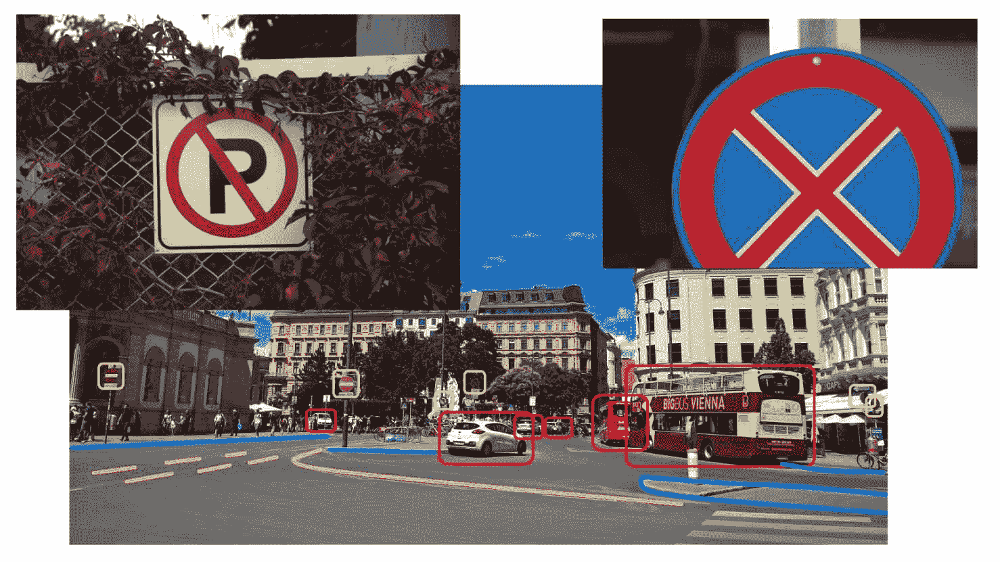
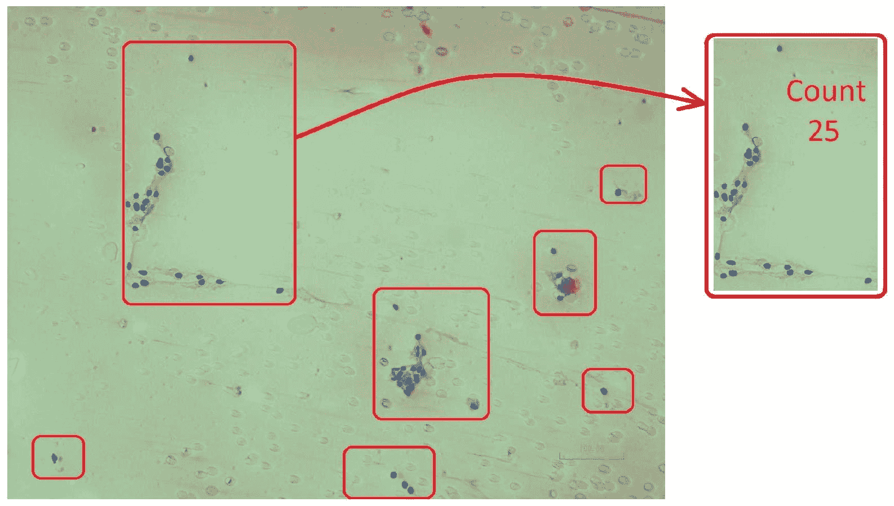
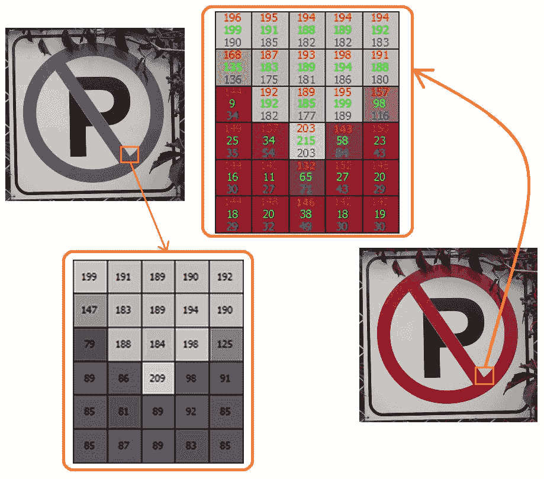
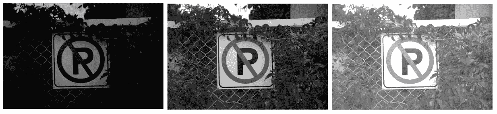
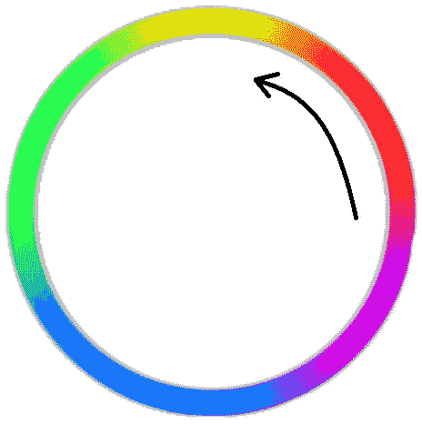
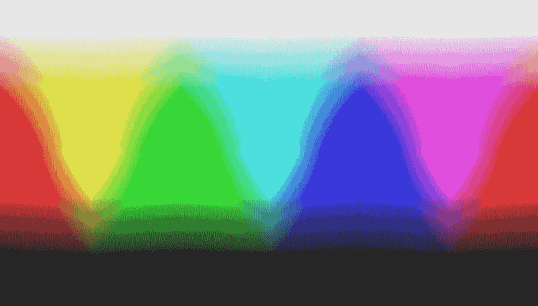

# 计算机视觉简介

毫无疑问，计算机科学，尤其是实现算法的方法，在近年来发展迅速。这得益于你的个人电脑甚至你口袋里的智能手机比它们的 predecessors 快得多，也便宜得多。受这种变化影响的最重要计算机科学领域之一是计算机视觉领域。近年来，计算机视觉算法的实现和使用方式发生了巨大的变化。本书，从这一章开始，旨在使用最新和最现代的技术来教授计算机视觉算法。

这旨在作为简要的入门章节，概述了将在许多（如果不是所有）计算机视觉算法中使用的概念基础。即使你已经熟悉计算机视觉和基础知识，如图像、像素、通道等，简要地浏览这一章也是一个好主意，以确保你理解计算机视觉的基本概念，并刷新你的记忆。

在本章中，我们将从计算机视觉领域的简要介绍开始。我们将探讨一些计算机视觉被广泛应用的最重要的行业，并举例说明。之后，我们将直接深入一些基本的计算机视觉概念，从图像开始。我们将学习在计算机视觉中图像是什么，以及它们的构建块是什么。在这个过程中，我们将涵盖像素、深度和通道等概念，这些对于理解和成功操作计算机视觉算法至关重要。

在本章结束时，你将了解以下内容：

+   什么是计算机视觉以及它在哪里被使用？

+   在计算机视觉中，图像是什么？

+   像素、深度和通道及其关系

# 技术要求

由于这是一个入门章节，我们只关注理论。因此，没有技术要求。

# 理解计算机视觉

定义计算机视觉不是一件容易的事情，计算机视觉专家在提供教科书定义时往往意见不一。这样做完全超出了本书的范围和兴趣，因此我们将专注于一个简单实用的定义，以满足我们的目的。从历史上看，计算机视觉与图像处理是同义的，本质上是指那些以图像为输入并基于该输入图像产生输出图像或一系列输出值（或测量值）的方法和技术，这些都是在执行一系列过程之后完成的。快进到现在，你会发现，当计算机视觉工程师谈论计算机视觉时，他们大多数情况下指的是与能够模仿人类视觉的概念相关的算法，例如在图像中看到（检测）物体或人。

那么，我们应该接受哪种定义呢？答案是相当简单的——两者都要。用简短的话来说，计算机视觉指的是以任何可想象的方式处理数字视觉数据（或任何可以可视化的数据）的算法、方法和技术。请注意，这里的视觉数据并不意味着只是使用传统相机拍摄的照片，但它们可能是地图上的图形表示或高程，热强度图，或任何可以无论其现实世界意义如何可视化的数据。

根据这个定义，以下所有问题——以及更多问题——都可以通过计算机视觉来解决：

+   我们如何使图像变柔和或变锐利？

+   我们如何减小图像的大小？

+   我们如何增加或减少图像的亮度？

+   我们如何检测图像中最亮的区域？

+   我们如何在视频中（或一系列连续的图像中）检测和跟踪人脸？

+   我们如何在安全摄像头的视频流中识别人脸？

+   我们如何在视频中检测运动？

在现代计算机视觉科学中，图像处理通常是计算机视觉方法和算法的一个子类别，涉及图像滤波、转换等。尽管如此，许多人还是将计算机视觉和图像处理这两个术语互换使用。

在这个时代，计算机视觉是计算机科学和软件行业中最热门的话题之一。其原因是它被用于各种方式，无论是使应用、数字设备或工业机器中的想法栩栩如生，还是处理或简化通常期望由人眼完成的广泛任务。我们提到的这些例子有很多实际应用，它们跨越了广泛的行业，包括汽车、电影、生物医学设备、国防、照片编辑和分享工具以及视频游戏行业。我们将讨论其中的一些例子，其余的留给你们去研究。

计算机视觉在汽车行业中持续使用，以提高现代车辆的安全性和功能性。车辆能够检测交通标志，警告驾驶员超速或甚至检测道路上的车道和障碍物，并通知驾驶员可能的危险。我们可以提供的关于计算机视觉如何使汽车行业现代化的实际例子是无穷无尽的——这还不包括自动驾驶汽车。主要科技公司正在投入大量资源，甚至与开源社区分享他们的一些成果。正如你在本书的最后一章中看到的，我们将利用其中的一些成果，特别是用于实时检测多种类型的多重对象。

下面的图像展示了汽车行业的一些常见物体、符号和感兴趣的区域，这些图像是通过安装在车辆上的摄像头看到的：

另一个即将迎来技术革命的行业是生物医学行业。不仅人体器官和身体部位的成像方法得到了极大的改进，而且这些图像的解释和可视化也通过计算机视觉算法得到了改善。计算机被用来在显微镜拍摄的图像中检测癌细胞组织，具有极高的精确度。还有来自能够进行手术的机器人的有希望和新兴的结果。

下面的图像是使用计算机视觉在组织扫描区域中计数特定类型的生物对象（在这种情况下是细胞）的示例，这些组织是通过数字显微镜扫描的：

除了汽车和生物医学行业，计算机视觉也被用于成千上万的移动和桌面应用程序中，以执行许多不同的任务。在你的智能手机上浏览在线应用商店，查看一些计算机视觉相关应用示例是个不错的主意。这样做，你将立即意识到，你与你的潜在计算机视觉应用想法之间，几乎只有想象力。

# 学习所有关于图像的知识

现在，是时候介绍计算机视觉的基础知识了，从图像开始。那么，究竟什么是图像呢？在计算机视觉中，图像只是一个矩阵，或者说是一个二维向量，具有有效的行数、列数等等。这种看待图像的方式不仅简化了对图像本身的描述，还简化了其所有组件的描述，这些组件如下：

+   图像的宽度对应于矩阵中的列数。

+   图像的高度是矩阵中的行数。

+   矩阵的每个元素代表一个像素，这是图像最基本的部分。**图像**是一系列像素的集合。

+   每个像素，或者矩阵中的每个元素，可以包含一个或多个与它的视觉表示（颜色、亮度等）相对应的数值。我们将在讨论计算机视觉中的颜色空间时了解更多这方面的内容。然而，重要的是要注意，与每个像素相关联的每个数值代表一个通道。例如，灰度图像中的像素通常使用一个介于 0 到 255 之间的单无符号 8 位整数值来表示；因此，灰度图像是单通道图像。在这种表示形式中，0 代表黑色，255 代表白色，而所有其他数字对应于灰度值。另一个例子是标准的 RGB 图像表示，其中每个像素由三个介于 0 到 255 之间的无符号 8 位整数值表示。RGB 图像中代表每个像素的三个通道对应于红色、蓝色和绿色的强度值，这三个值结合可以形成任何可能的颜色。这种图像被称为**三通道图像**。

以下图像展示了同一图像中同一区域的两个放大版本，一个是灰度格式，另一个是彩色（RGB）格式。注意灰度图像（左侧）中的较高值对应于较亮的值，反之亦然。同样，在彩色图像（右侧）中，你可以看到红色通道的值相当高，这与该区域的红色色调一致，以及白色通道：

除了我们之前提到的内容之外，图像还有一些额外的规格，具体如下：

+   每个像素，或者矩阵中的每个元素，可以是一个整数或浮点数。它可以是一个 8 位数字，16 位，等等。代表每个像素的数值类型以及通道数类似于图像的深度。例如，一个使用 16 位整数值来表示每个通道的四通道图像将具有 16 乘以 4 位的深度，或 64 位（或 4 字节）。

+   图像的分辨率指的是其中的像素数量。例如，宽度为 1920 像素、高度为 1080 像素（正如全高清图像的情况）的图像，其分辨率为 1920 乘以 1080，这略多于 200 万像素，或者说大约是 200 万像素。

正是因为这种图像表示形式，它才能被轻易地视为一个数学实体，这意味着可以设计出许多不同类型的算法来作用于图像。如果我们回到图像最简单的表示形式（灰度图像），通过几个简单的例子，我们可以看到大多数图片编辑软件（以及计算机视觉算法）都使用这种表示形式，以及相当简单的算法和矩阵运算来轻松地修改图像。在以下图像中，一个常数（在我们的例子中是 80）简单地加到输入图像（中间图像）的每个像素上，这使得结果图像变得更亮（右侧图像）。也可以从每个像素中减去一个数字，使结果图像变暗（左侧图像）：

现在，我们将只关注计算机视觉的基本概念，而不会深入探讨前面图像修改示例的实现细节。我们将在接下来的章节中学习关于这一点以及许多其他图像处理技术和算法。

本节中提到的图像属性（宽度、高度、分辨率、深度和通道）在计算机视觉中得到广泛使用。例如，在几种情况下，如果一个图像处理算法过于复杂且耗时，那么可以将图像调整大小以使其更小，从而减少处理所需的时间。一旦处理完毕，结果可以映射回原始图像大小并显示给用户。同样的过程也适用于深度和通道。如果一个算法只需要图像的特定通道，你可以提取并单独处理它，或者使用图像的灰度转换版本。请注意，一旦对象检测算法完成其工作，你将希望将结果显示在原始彩色图像上。对这些类型的图像属性有正确的理解将极大地帮助你在面对各种计算机视觉问题和与计算机视觉算法一起工作时。不再赘述，让我们继续讨论色彩空间。

# 色彩空间

尽管其定义可能有所不同，但通常来说，色彩空间（有时也称为色彩模型）是一种用于解释、存储和重现一组色彩的方法。让我们用一个例子来分解这一点——灰度色彩空间。在灰度色彩空间中，每个像素用一个单一的 8 位无符号整数值表示，该值对应于该像素的亮度或灰度强度。这使得存储 256 种不同的灰度级别成为可能，其中 0 对应绝对黑色，255 对应绝对白色。换句话说，像素的值越高，它就越亮，反之亦然。以下图像显示了灰度色彩空间中存在的所有可能的颜色：

另一个常用的颜色空间是 RGB，其中每个像素由三个不同的 8 位整数值表示，这些值对应于该像素的红色、绿色和蓝色强度。这种颜色空间特别因其被用于电视、LCD 和类似显示器而闻名。你可以通过放大镜观察你的显示器表面来验证这一点。它依赖于这样一个简单的事实：所有颜色都可以通过组合不同量的红色、绿色和蓝色来表示。以下图像展示了三种主要颜色（如黄色或粉色）之间所有其他颜色是如何形成的：

一个在其每个单独像素中都具有相同的 R、G 和 B 值的 RGB 图像将产生一个灰度图像。换句话说，相同的红、绿、蓝强度将产生一种灰色。

另一个在计算机视觉中广泛使用的颜色空间是**HSV**（**色调**、**饱和度**和**亮度**）颜色空间。在这个颜色空间中，每个像素由三个值表示：色调（颜色）、饱和度（颜色的强度）和亮度（它是多亮或多暗）。如以下图像所示，色调可以是 0 到 360（度）之间的值，它代表该像素的颜色。例如，0 度和附近的度数对应于红色和其他类似颜色：

这种颜色空间在基于物体颜色的计算机视觉检测和跟踪算法中特别受欢迎，正如你将在本书后面的内容中看到的。原因在于 HSV 颜色空间允许我们无论颜色有多暗或多亮都能处理颜色。使用 RGB 和类似颜色空间则难以实现这一点，因为查看单个像素通道的值并不能告诉我们它的颜色。

以下图像是 HSV 颜色空间的另一种表示，它展示了在同一图像中色调（从左到右）、饱和度和亮度值的变化，从而产生所有可能的颜色：

除了本节中提到的颜色空间外，还有很多其他的颜色空间，每个都有其特定的应用场景。例如，四通道**CMYK**颜色空间（**青色**、**朱红色**、**黄色**和**关键色/黑色**）在印刷系统中已被证明是最有效的。

请确保从互联网上了解其他流行的颜色空间以及它们可能对任何特定的计算机视觉问题有何用途。

# 输入、处理和输出

因此，既然我们知道图像基本上是具有宽度、高度、元素类型、通道、深度等基本属性的矩阵式实体，那么唯一剩下的大问题就是它们从何而来，发生了什么，又将去向何方？

让我们用一个简单的相册应用程序为例来进一步分解这个问题。很可能，你的智能手机上默认就有这样一个应用程序。相册应用程序通常允许你使用智能手机内置的相机拍摄新照片或视频，使用之前录制的文件，对图像应用过滤器，甚至通过社交媒体、电子邮件或与你的朋友和家人分享。虽然当你使用它时这个例子可能看起来很简单，但它包含了正确计算机视觉应用程序的所有关键部分。

以这个例子为前提，我们可以这样说，图像是由各种不同的输入设备根据使用案例提供的。以下是一些最常见的图像输入设备：

+   存储在磁盘、内存、网络或任何其他可访问位置的图像文件。请注意，存储的图像文件可以是原始的（包含确切的图像数据）或编码的（如 JPG）；然而，它们仍然被认为是图像文件。

+   由相机捕获的图像。请注意，这里的相机指的是个人电脑上的网络摄像头、智能手机上的相机或任何其他专业摄影设备、数字显微镜、望远镜等等。

+   存储在磁盘、内存、网络等位置的连续或非连续的视频帧。与图像文件类似，视频文件可以是编码的，在这种情况下，需要一种特殊的软件（称为**编解码器**）来在它们可以使用之前对它们进行编码。

+   来自实时视频摄像头流的连续帧。

使用输入设备读取图像后，实际的图像处理过程就开始了。这可能是你在本书中寻找的计算机视觉过程周期的一部分——而且有很好的理由。这是实际使用计算机视觉算法从图像中提取值、以某种方式修改它，或者执行任何类型的计算机视觉任务的地方。这部分通常由特定设备上的软件完成。

现在，整个过程的输出需要被创建。这部分完全取决于计算机视觉算法和计算机视觉过程运行的设备类型，但一般来说，计算机视觉算法期望以下类型的输出：

+   从处理后的图像中派生出的数字、形状、图表或其他非图像类型的输出。例如，一个计算图像中人数的算法只需要输出一个整数或一个表示从安全摄像头连续视频帧中找到的人数图表。

+   存储在磁盘、内存和类似设备上的图像或视频文件。一个典型的例子是你手机或个人电脑上的照片编辑软件，它允许你将修改后的图像保存为 JPG 或 PNG 文件。

+   在显示屏幕上绘制和渲染图像和视频帧。显示器通常由固件（可能位于操作系统上）控制，该固件控制显示在其上的内容。

与输入设备类似，对图像输出设备的略微不同解释将产生更多结果和条目（例如打印机、绘图仪、视频投影仪等）。然而，前面的列表仍然足够，因为它涵盖了我们在处理计算机视觉算法时将遇到的最基本和最重要的输出类型。

# 计算机视觉框架和库

为了构建计算机视觉应用程序，我们需要一套工具、一个框架或一个支持图像输入、输出和处理的库。选择计算机视觉库是一个非常重要的决定，因为您可能会发现自己需要完全自己“重新发明轮子”。您也可能编写占用大量资源和时间的函数和代码，例如以您所需的格式读取或写入图像。

通常，在开发计算机视觉应用程序时，您可以从两种主要的计算机视觉库中选择；它们如下：

+   **专有**: 专有计算机视觉库通常由提供它的公司提供良好的文档和支持，但它们需要付费，并且通常针对一组特定的计算机视觉问题

+   **开源**: 相反，开源库通常涵盖更广泛的与计算机视觉相关的问题，并且可以免费使用和探索

您可以在网上找到许多专有和开源计算机视觉库的示例，以便您自己进行比较。

在本书中我们将使用的库是**开源计算机视觉库**（**OpenCV**）。OpenCV 是一个具有以下特性的计算机视觉库：

+   它是开源的，并且可以免费用于学术或商业项目

+   它支持 C++、Python 和 Java 语言

+   它是跨平台的，这意味着它可以用于开发 Windows、macOS、Linux、Android 和 iOS 的应用程序

+   它以模块化方式构建，速度快，文档齐全，支持良好

值得注意的是，OpenCV 还使用一些第三方库来处理各种计算机视觉任务。例如，FFmpeg 库在 OpenCV 中被用于处理读取某些视频文件格式。

# 摘要

在本章中，我们介绍了计算机视觉科学的最基本概念。我们首先学习了计算机视觉作为一个术语及其用例，然后查看了一些广泛使用它的行业。然后，我们继续学习图像及其最重要的属性，即像素、分辨率、通道、深度等。然后，我们讨论了一些最广泛使用的颜色空间，并学习了它们如何影响图像的通道数和其他属性。之后，我们介绍了计算机视觉中常用的输入和输出设备，以及计算机视觉算法和过程如何在这两者之间进行。我们以对计算机视觉库的非常简短的讨论结束本章，并介绍了我们选择的计算机视觉库，即 OpenCV。

在下一章中，我们将介绍 OpenCV 框架，并开始一些动手的计算机视觉课程。我们将学习如何使用 OpenCV 访问输入设备，执行计算机视觉算法，以及访问输出设备以显示或记录结果。下一章将是本书中的第一个真正的动手章节，并为后续更实用的章节奠定基础。

# 问题

1.  除了本章中提到的行业外，还有哪些行业可以从计算机视觉中获得显著的好处？

1.  举例说明一个用于安全目的的计算机视觉应用？（考虑一个你可能没有遇到的应用想法。）

1.  举例说明一个用于提高生产力的计算机视觉应用？（再次，考虑一个你可能没有遇到，但怀疑可能存在的应用想法。）

1.  存储一个 1920 x 1080 像素、四通道、32 位深度的图像需要多少兆字节？

1.  超高清图像，也称为 4K 或 8K 图像，在当今相当普遍，但超高清图像包含多少百万像素？

1.  除了本章中提到的颜色空间外，还有哪些常用的颜色空间？

1.  将 OpenCV 库与 MATLAB 中的计算机视觉工具进行比较。每个工具的优缺点是什么？
