# 第三章：数组和矩阵操作

现在我们已经完成了本书的第一部分，以及计算机视觉的介绍和基本概念，我们可以开始学习 OpenCV 库提供的计算机视觉算法和函数，这些算法和函数几乎涵盖了所有可以想到的计算机视觉主题，并且有优化的实现。正如我们在前面的章节中学到的，OpenCV 使用模块化结构来分类其中包含的计算机视觉功能。我们将带着类似的思路继续本书的主题，这样学到的技能在每一章中都是相互关联的，不仅从理论角度来看，而且从实践角度来看。

在上一章中，我们学习了图像和矩阵之间的关系，并介绍了`Mat`类最关键的功能，例如使用给定的宽度、高度和类型来构建它。我们还学习了如何从磁盘、网络流、视频文件或摄像头中读取图像。在这个过程中，我们学习了如何使用各种方法访问图像中的像素。现在，我们可以开始实际进行图像和像素的修改和操作功能了。

在这个章节中，我们将学习大量用于处理图像的函数和算法，这些算法要么用于计算可能在其他过程中有用的值，要么用于直接修改图像中像素的值。本章中展示的几乎所有算法都是基于这样一个事实：图像本质上是由矩阵组成的，而且矩阵是通过数据数组实现的，因此本章的名称就是这样！

我们将从这个章节开始，介绍`Mat`类本身的功能，这些功能虽然不多，但在创建初始矩阵等方面却非常重要。然后，我们将继续学习大量的按元素（或逐元素）算法。通过许多实际案例的学习，我们将了解到这些算法对矩阵的每个单独元素执行特定操作，并且它们不关心任何其他元素（或像素）。最后，我们将学习那些不是逐元素操作的矩阵和数组操作，其结果可能取决于整个图像或元素组。随着我们在这个章节中继续学习算法，这一切都将变得清晰。需要注意的是，这个章节中所有的算法和函数都包含在 OpenCV 库的核心模块中。

到这个章节结束时，你将更好地理解以下内容：

+   `Mat`类中包含的操作

+   逐元素矩阵操作

+   矩阵和数组操作

# 技术要求

+   用于开发 C++或 Python 应用程序的 IDE

+   OpenCV 库

有关如何设置个人计算机并使其准备好使用 OpenCV 库开发计算机视觉应用程序的更多信息，请参阅第二章，*OpenCV 入门*。

您可以使用以下网址下载本章的源代码和示例：[`github.com/PacktPublishing/Hands-On-Algorithms-for-Computer-Vision/tree/master/Chapter03`](https://github.com/PacktPublishing/Hands-On-Algorithms-for-Computer-Vision/tree/master/Chapter03)

# `Mat` 类包含的操作

在本节中，我们将介绍 `Mat` 类本身包含的数学和其他操作集。尽管 `Mat` 类中的函数没有通用的使用模式，但它们大多数都与创建新矩阵有关，无论是使用现有的矩阵还是从头开始创建。所以，让我们开始吧。

在本书的整个过程中，单词图像、矩阵、`Mat` 类等将可以互换使用，并且它们都表示相同的意思，除非有明确的说明。利用这个机会，习惯于像计算机视觉专家那样从矩阵的角度思考图像。

# 克隆矩阵

您可以使用 `Mat::clone` 来创建一个完全独立的 `Mat` 对象的克隆。请注意，此函数创建了一个完整的图像副本，并在内存中为其分配了空间。以下是它的用法：

```py
Mat clone = image.clone(); 
```

您也可以使用 `copyTo` 函数来完成相同的功能，如下所示：

```py
Mat clone; 
image.copyTo(clone); 
```

在前面的两个代码示例中，`image` 是在执行克隆操作之前从图像、摄像头或以任何可能的方式产生的原始矩阵（或图像）。从现在开始，在本章和即将到来的所有章节中，除非另有说明，`image` 简单地是一个 `Mat` 对象，它是我们操作的数据源。

# 计算叉积

您可以使用 `Mat::cross` 来计算具有三个浮点元素的两个 `Mat` 对象的叉积，如下面的示例所示：

```py
Mat A(1, 1, CV_32FC3), 
   B(1, 1, CV_32FC3); 

A.at<Vec3f>(0, 0)[0] = 0; 
A.at<Vec3f>(0, 0)[1] = 1; 
A.at<Vec3f>(0, 0)[2] = 2; 

B.at<Vec3f>(0, 0)[0] = 3; 
B.at<Vec3f>(0, 0)[1] = 4; 
B.at<Vec3f>(0, 0)[2] = 5; 

Mat AxB = A.cross(B); 
Mat BxA = B.cross(A);
```

显然，在两个向量的叉积中，`AxB` 与 `BxA` 是不同的。

# 提取对角线

`Mat::diag` 可以用来从一个 `Mat` 对象中提取对角线，如下面的示例所示：

```py
int D = 0; // or +1, +2, -1, -2 and so on 
Mat dg = image.diag(D); 
```

此函数接受一个索引参数，可以用来提取主对角线以外的其他对角线，如下面的图所示：

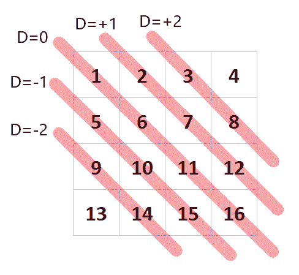

如果 **D=0**，则提取的对角线将包含 **1**、**6**、**11** 和 **16**，这是主对角线。但根据 **D** 的值，提取的对角线将位于主对角线之上或之下，如前图所示。

# 计算点积

要计算两个矩阵的点积、标量积或内积，您可以使用 `Mat::dot` 函数，如下所示：

```py
double result = A.dot(B); 
```

在这里，`A` 和 `B` 都是 OpenCV 的 `Mat` 对象。

# 学习单位矩阵

使用 OpenCV 中的 `Mat::eye` 函数创建单位矩阵。以下是一个示例：

```py
Mat id = Mat::eye(10, 10, CV_32F); 
```

如果你需要一个不同于单位矩阵对角线上的值，你可以使用一个 `scale` 参数：

```py
double scale = 0.25; 
Mat id = Mat::eye(10, 10, CV_32F) * scale; 
```

创建单位矩阵的另一种方法是使用 `setIdentity` 函数。请确保查看 OpenCV 文档以获取有关此函数的更多信息。

# 矩阵求逆

你可以使用 `Mat::inv` 函数来求逆一个矩阵：

```py
Mat inverted = m.inv(); 
```

注意，你可以向 `inv` 函数提供一个矩阵分解类型，这可以是 `cv::DecompTypes` 枚举中的一个条目。

# 元素级矩阵乘法

`Mat::mul` 可以用来执行两个 `Mat` 对象的元素级乘法。不用说，此函数也可以用于元素级除法。以下是一个示例：

```py
Mat result = A.mul(B); 
```

你还可以提供一个额外的 `scale` 参数，该参数将用于缩放结果。以下是一个另一个示例：

```py
double scale = 0.75; 
Mat result = A.mul(B, scale);
```

# 全 1 和全 0 矩阵

`Mat::ones` 和 `Mat::zeroes` 可以用来创建一个给定大小的矩阵，其中所有元素分别设置为 1 或 0。这些矩阵通常用于创建初始化矩阵。以下是一些示例：

```py
Mat m1 = Mat::zeroes(240, 320, CV_8UC1); 
Mat m2 = Mat::ones(240, 320, CV_8UC1); 
```

如果你需要创建一个填充了除了 1 以外的值的矩阵，你可以使用以下类似的方法：

```py
Mat white = Mat::ones(240, 320, CV_8UC1) * 255; 
```

# 转置矩阵

你可以使用 `Mat::t` 来转置一个矩阵。以下是一个示例：

```py
Mat transpose = image.t(); 
```

以下是一个演示图像转置的示例：

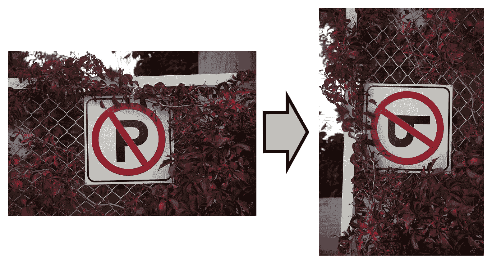

左侧的图像是原始图像，右侧的图像是原始图像的转置。正如你将在本章后面学到的那样，`transpose` 或 `Mat::t` 函数可以与 `flip` 函数结合使用，以在所有可能的方向上旋转或翻转/镜像图像。

转置一个转置矩阵与原始矩阵相同，运行以下代码将得到原始图像本身：

`Mat org = image.t().t();`

计算矩阵转置的另一种方法是使用 `transpose` 函数。以下是如何使用此函数的示例：

```py
transpose(mat, trp); 
```

在这里，`mat` 和 `trp` 都是 `Mat` 对象。

# 调整 Mat 对象的形状

可以使用 `Mat::reshape` 函数调整 `Mat` 对象的形状。请注意，在这个意义上，调整形状意味着改变图像的通道数和行数。以下是一个示例：

```py
int ch = 1; 
int rows = 200; 
Mat rshpd = image.reshape(ch, rows); 
```

注意，将通道数设置为 0 的值意味着通道数将与源保持相同。同样，将行数设置为 0 的值意味着图像的行数将保持不变。

注意，`Mat::resize`是另一个用于重塑矩阵的有用函数，但它只允许改变图像中的行数。在重塑矩阵或处理矩阵中的元素数量时，另一个有用的函数是`Mat::total`函数，它返回图像中的元素总数。

关于`Mat`类本身嵌入的功能就到这里。请确保阅读`Mat`类的文档，并熟悉你在这节中学到的方法的可能变体。

# 逐元素矩阵操作

元素级或逐元素矩阵操作是计算机视觉中的数学函数和算法，它们作用于矩阵的各个单独元素，换句话说，就是图像的像素。需要注意的是，逐元素操作可以并行化，这意味着矩阵元素的处理顺序并不重要。这个特性是本节和本章后续部分中函数和算法之间最重要的区别。

# 基本操作

OpenCV 提供了所有必要的函数和重载运算符，用于执行两个矩阵或一个矩阵与一个标量之间的所有四个基本操作：加法、减法、乘法和除法。

# 加法操作

`add`函数和`+`运算符可以用来添加两个矩阵的元素，或者一个矩阵和一个标量，如下面的例子所示：

```py
Mat image = imread("Test.png"); 
Mat overlay = imread("Overlay.png"); 
Mat result; 
add(image, overlay, result); 
```

你可以将前面代码中的最后一行替换为以下代码：

```py
result = image + overlay; 
```

以下图片展示了两个图像加法操作的结果图像：

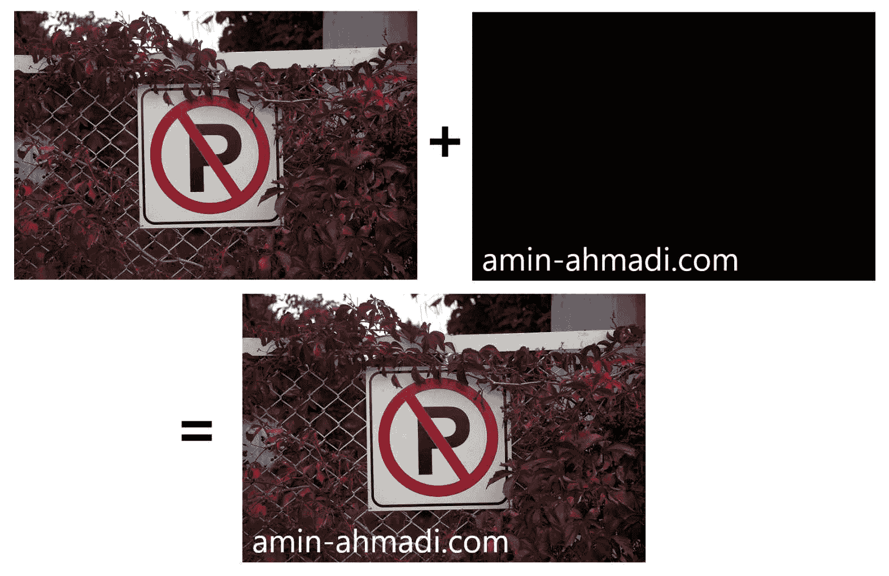

如果你想将单个标量值添加到`Mat`对象的全部元素中，你可以简单地使用以下类似的方法：

```py
result = image + 80; 
```

如果前面的代码在灰度图像上执行，结果会比源图像更亮。注意，如果图像有三个通道，你必须使用一个三项向量而不是单个值。例如，为了使 RGB 图像更亮，你可以使用以下代码：

```py
result = image + Vec3b(80, 80, 80); 
```

下面是一张图片，展示了当在它上执行前面的代码时，得到的更亮的结果图像：

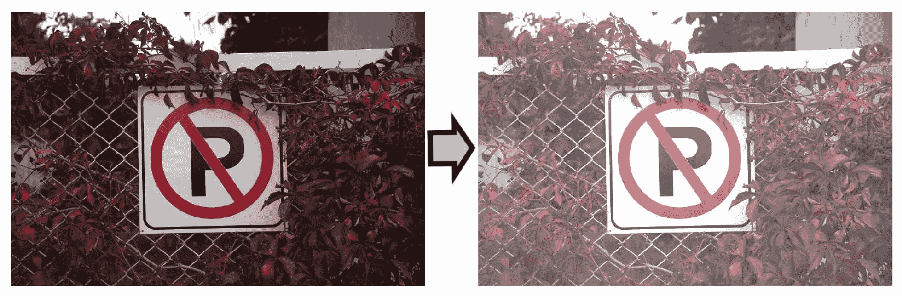

在前面的示例代码中，只需简单地增加加数值，就可以得到更亮的图像。

# 加权加法

除了简单的两个图像相加外，你还可以使用加权加法函数来考虑被加的两个图像的权重。将其视为在`add`操作中为每个参与者设置不透明度级别。要执行加权加法，你可以使用`addWeighted`函数：

```py
double alpha = 1.0; // First image weight 
double beta = 0.30; // Second image weight 
double gamma = 0.0; // Added to the sum 
addWeighted(image, alpha, overlay, beta, gamma, result); 
```

如果在上一节中的示例图片上执行加法操作，结果将类似于以下内容：

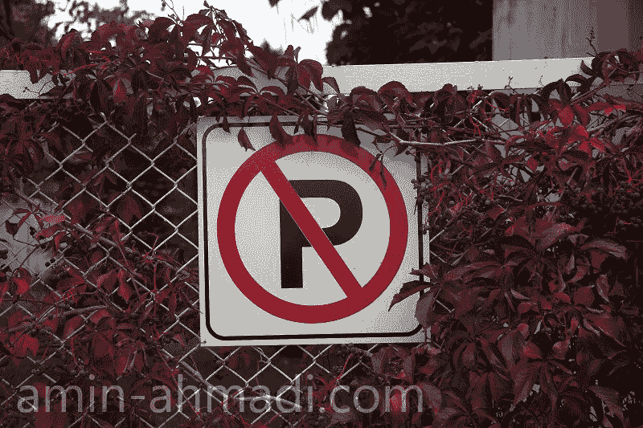

注意到与通常由照片编辑应用程序应用的水印类似的透明文本。注意代码中关于 `alpha`、`beta` 和 `gamma` 值的注释？显然，提供一个 `beta` 值为 `1.0` 将会使此示例与没有任何透明度的常规 `add` 函数完全相同。

# 减法运算

与将两个 `Mat` 对象相加类似，你也可以使用 `subtract` 函数或 `-` 运算符从一幅图像中减去另一幅图像的所有元素。以下是一个示例：

```py
Mat image = imread("Test.png"); 
Mat overlay = imread("Overlay.png"); 
Mat result; 
subtract(image, overlay, result); 
```

前面代码中的最后一行也可以替换为以下内容：

```py
result = image - overlay; 
```

如果我们使用前面示例中的相同两幅图像进行减法运算，以下是结果：

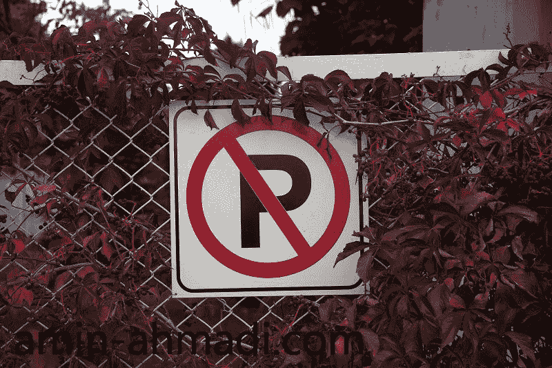

注意从源图像中减去较高像素值（较亮像素）的结果会导致叠加文本的暗色。还要注意，减法运算依赖于其操作数的顺序，这与加法不同。尝试交换操作数，看看会发生什么。

就像加法一样，你也可以将一个常数与图像的所有像素相乘。你可以猜到，从所有像素中减去一个常数将导致图像变暗（取决于减去的值），这与加法运算相反。以下是一个使用简单的减法运算使图像变暗的示例：

```py
result = image - 80;
```

如果源图像是一个三通道 RGB 图像，你需要使用一个向量作为第二个操作数：

```py
result = image - Vec3b(80, 80, 80); 
```

# 乘法和除法运算

与加法和减法类似，你也可以将一个 `Mat` 对象的所有元素与另一个 `Mat` 对象的所有元素相乘。同样，也可以进行除法运算。再次强调，这两种运算都可以使用矩阵和标量进行。乘法可以使用 OpenCV 的 `multiply` 函数（类似于 `Mat::mul` 函数）进行，而除法可以使用 `divide` 函数进行。

这里有一些示例：

```py
double scale = 1.25; 
multiply(imageA, imageB, result1, scale); 
divide(imageA, imageB, result2, scale); 
```

前面的代码中的 `scale` 是可以提供给 `multiply` 和 `divide` 函数的附加参数，用于缩放结果 `Mat` 对象中的所有元素。你还可以像以下示例中那样使用标量进行乘法或除法运算：

```py
resultBrighter = image * 5; 
resultDarker = image / 5; 
```

显然，前面的代码将生成两个图像，一个比原始图像亮五倍，另一个比原始图像暗五倍。这里需要注意的是，与加法和减法不同，生成的图像不会均匀地变亮或变暗，你会注意到较亮区域变得非常亮，反之亦然。显然，这是乘法和除法运算的效果，在这些运算中，较亮像素的值在运算后增长或下降的速度比较小的值快得多。值得注意的是，这种相同的技术在大多数照片编辑应用程序中用于调整图像的亮暗区域。

# 位运算逻辑

就像基本操作一样，您也可以对两个矩阵的所有元素或一个矩阵和一个标量的所有元素执行位逻辑运算。因此，您可以使用以下函数：

+   `bitwise_not`

+   `bitwise_and`

+   `bitwise_or`

+   `bitwise_xor`

从它们的名字就可以立即看出，这些函数可以执行 `Not`、`And`、`Or` 和 `Exclusive OR` 操作，但让我们通过一些实际示例来详细看看它们是如何使用的：

首先，`bitwise_not` 函数用于反转图像中所有像素的所有位。此函数与大多数照片编辑应用中可以找到的翻转操作具有相同的效果。以下是它的使用方法：

```py
bitwise_not(image, result); 
```

上述代码也可以替换为以下代码，它使用了 C++ 中的重载位运算 `not` 操作符 (`~`)：

```py
result = ~image; 
```

如果图像是单色黑白图像，结果将包含一个所有白色像素被替换为黑色，反之亦然的图像。如果图像是 RGB 颜色图像，结果将是反转的（在二进制像素值的意义上），以下是一个示例图像：

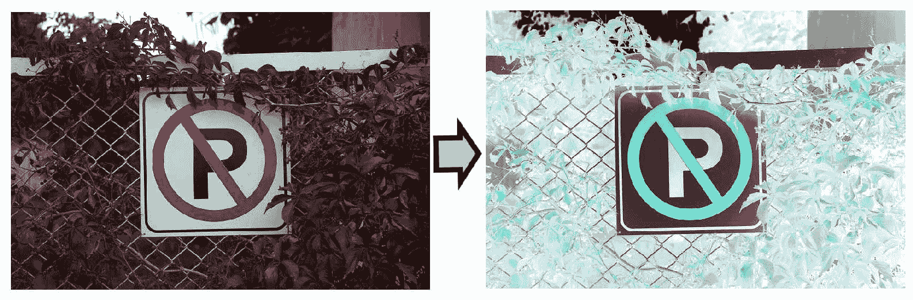

`bitwise_and` 函数，或 `&` 操作符，用于对两个图像的像素或一个图像和一个标量的像素执行位运算 `And`。以下是一个示例：

```py
bitwise_and(image, mask, result); 
```

您可以直接使用 `&` 操作符，并写成以下内容：

```py
result = image & mask; 
```

`bitwise_and` 函数可以很容易地用来遮罩和提取图像中的某些区域。例如，以下图像展示了 `bitwise_and` 如何导致一个只通过白色像素并移除黑色像素的图像：

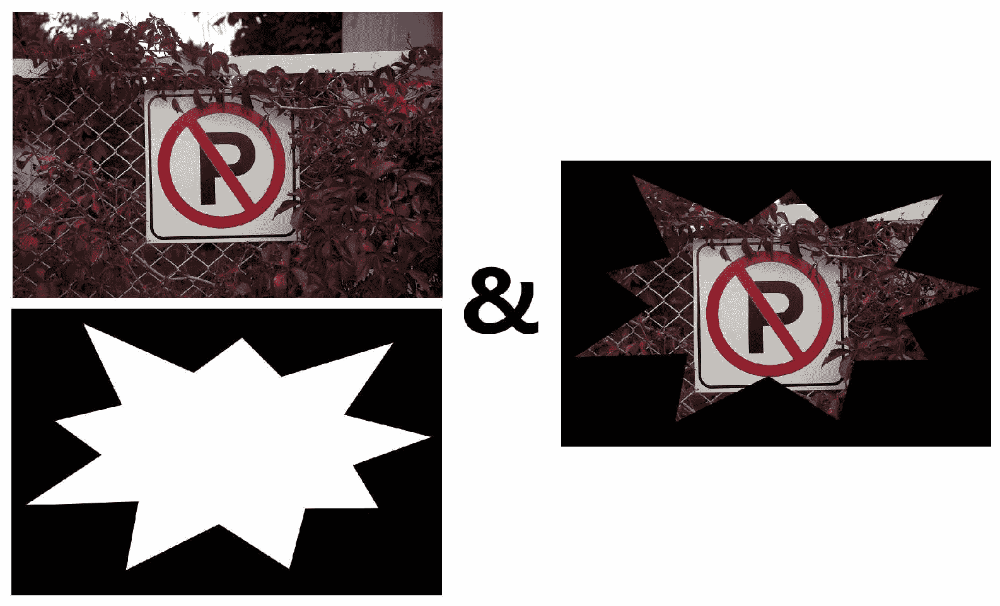

除了遮罩图像的某些区域外，位运算 `And` 还可以用来完全过滤掉一个通道。要执行此操作，您需要使用 `&` 操作符的第二种形式，它接受一个矩阵和一个标量，并对所有像素和该值执行 `And` 运算。以下是一个示例代码，可以用来遮罩（置零）RGB 颜色图像中的绿色颜色通道：

```py
result = image & Vec3b(0xFF, 0x00, 0xFF); 
```

现在，让我们继续到下一个位运算，即 `Or` 运算。`bitwise_or` 和 `|` 操作符都可以用来对两个图像或一个图像和一个标量执行位运算 `Or`。以下是一个示例：

```py
bitwise_or(image, mask, result);
```

与位运算 `And` 类似，您可以在 `Or` 运算中使用 `|` 操作符，并简单地写成以下代码代替前面的代码：

```py
result = image | mask; 
```

如果使用 `And` 运算来通过非零像素（或非黑色像素），那么可以说 `Or` 运算用于通过任何输入图像中的像素值较高的像素（或较亮的像素）。以下是执行位运算 `Or` 的前例图像的结果：

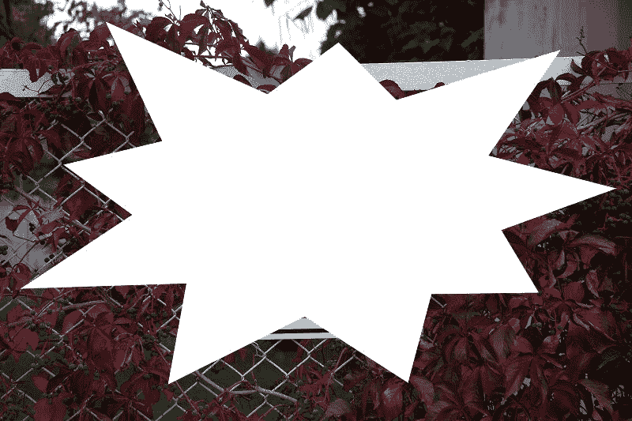

与位运算的 `And` 操作类似，你也可以使用位运算的 `Or` 操作来更新单个通道或图像的所有像素。以下是一个示例代码，展示了如何仅更新 RGB 图像中的绿色通道，使其所有像素的值达到最大可能值（即 255，或十六进制 `FF`），而其他通道保持不变：

```py
result = image | Vec3b(0x00, 0xFF, 0x00); 
```

最后，你可以使用 `bitwise_xor` 或 `^` 操作符在两个图像的像素之间，或图像与标量之间执行 `Exclusive Or` 操作。以下是一个示例：

```py
bitwise_xor(image, mask, result); 
```

或者简单地使用 `^` 操作符，并写成以下内容：

```py
result = image ^ mask;
```

如果在上一节中的示例图像上执行 `Exclusive Or` 操作，以下是结果图像：


注意这个操作如何导致掩码区域的像素反转？通过在纸上写下像素值并尝试自己计算结果来思考这个原因。如果清楚地理解其行为，`Exclusive Or` 以及所有位运算都可以用于许多其他计算机视觉任务。

# 比较操作

比较两个图像（或给定值）非常有用，特别是用于生成可以在各种其他算法中使用的掩码，无论是用于跟踪图像中的某个感兴趣对象，还是在图像的孤立（掩码）区域执行操作。OpenCV 提供了一些函数来执行逐元素比较。例如，`compare` 函数可以用于比较两个图像。以下是方法：

```py
compare(image1, image2, result, CMP_EQ); 
```

前两个参数是参与比较的第一个和第二个图像。`result` 将保存到第三个 `Mat` 对象中，最后一个参数必须是从 `CmpTypes` 枚举中的一项，用于选择比较类型，可以是以下任何一种：

+   `CMP_EQ`：表示第一个图像等于第二个图像

+   `CMP_GT`：表示第一个图像大于第二个图像

+   `CMP_GE`：表示第一个图像大于或等于第二个图像

+   `CMP_LT`：表示第一个图像小于第二个图像

+   `CMP_LE`：表示第一个图像小于或等于第二个图像

+   `CMP_NE`：表示第一个图像不等于第二个图像

注意，我们仍在讨论逐元素操作，所以当我们说“第一个图像小于或等于第二个图像”时，我们实际上是指“第一个图像中的每个单独像素的值小于或等于第二个图像中其对应像素的值”，依此类推。

注意，你还可以使用重载的 C++ 操作符来实现与 `compare` 函数相同的目标。以下是每个单独比较类型的方法：

```py
result = image1 == image2; // CMP_EQ 
result = image1 > image2; // CMP_GT 
result = image1 >= image2; // CMP_GE 
result = image1 < image2; // CMP_LT 
result = image1 <= image2; // CMP_LE 
result = image1 != image2; // CMP_NE 
```

`inRange` 函数是 OpenCV 中的另一个有用的比较函数，可以用来找到具有特定下限和上限值的像素。你可以使用任何现有的图像作为边界值矩阵，或者你可以自己创建它们。以下是一个示例代码，可以用来在灰度图像中找到介于 `0` 和 `50` 之间的像素值：

```py
Mat lb = Mat::zeros(image.rows, 
                    image.cols, 
                    image.type()); 
Mat hb = Mat::ones(image.rows, 
                   image.cols, 
                   image.type()) * 50; 
inRange(image, lb, hb, result); 
```

注意，`lb` 和 `hb` 都是与源图像大小和类型相同的 `Mat` 对象，除了 `lb` 被填充为零，而 `hb` 被填充为 `50` 的值。这样，当调用 `inRange` 时，它会检查源图像中的每个像素及其对应的 `lb` 和 `hb` 中的像素，如果值在提供的边界之间，则将结果中的对应像素设置为白色。

以下图像展示了在示例图像上执行 `inRange` 函数的结果：

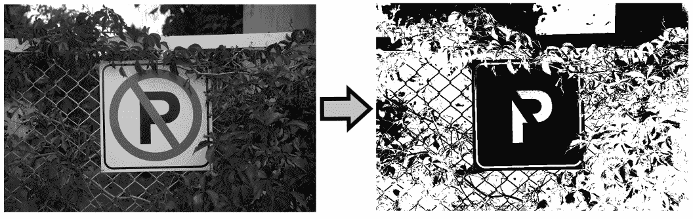

`min` 和 `max` 函数，从它们的名字可以轻易猜出，是另外两个可以用来比较两张图像（逐元素）并找出最小或最大像素值的比较函数。以下是一个示例：

```py
min(image1, image2, result); 
```

或者你可以使用 `max` 来找到最大值：

```py
max(image1, image2, result); 
```

简单来说，这两个函数比较了相同大小和类型的两张图像的像素，并将结果矩阵中对应的像素设置为输入图像中的最小或最大像素值。

# 数学运算

除了我们之前学过的函数之外，OpenCV 还提供了一些处理逐元素数学运算的函数。在本节中，我们将简要介绍它们，但你可以，也应该亲自实验它们，以确保你熟悉它们，并且可以在你的项目中舒适地使用它们。

OpenCV 中的逐元素数学函数如下：

+   可以使用 `absdiff` 函数来计算相同大小和类型的两张图像或图像和标量的像素之间的绝对差值。以下是一个示例：

```py
absdiff(image1, image2, result);
```

在前面的代码中，`image1`、`image2` 和 `result` 都是 `Mat` 对象，结果中的每个元素代表 `image1` 和 `image2` 中对应像素的绝对差值。

+   可以使用 `exp` 函数来计算矩阵中所有元素的指数：

```py
exp(mat, result); 
```

+   可以使用 `log` 函数来计算矩阵中每个元素的自然对数：

```py
log(mat, result); 
```

+   `pow` 函数可以用来将矩阵中的所有元素提升到给定的幂。此函数需要一个矩阵和一个 `double` 类型的值，该值将是幂值。以下是一个示例：

```py
pow(mat, 3.0, result); 
```

+   `sqrt` 函数用于计算矩阵中所有元素的平方根，其用法如下：

```py
sqrt(mat, result); 
```

函数如 `log` 和 `pow` 不应与标准 C++ 库中同名的函数混淆。为了提高你代码的可读性，考虑在 C++ 代码中在函数名之前使用 `cv` 命名空间。例如，你可以这样调用 `pow` 函数：

`cv::pow(image1, 3.0, result);`

# 矩阵和数组操作

与本章中我们迄今为止看到的函数和算法不同，本节中的算法对图像（或矩阵）本身执行原子和完整的操作，并且不被视为迄今为止所描述的逐元素操作。如果你还记得，逐元素操作的规则是它们可以很容易地并行化，因为结果矩阵依赖于两个图像对应的像素，而本章我们将学习的函数和算法不易并行化，或者结果像素和值可能与其对应的源像素几乎没有关系，或者恰恰相反，结果像素可能同时依赖于一些或所有输入像素。

# 为外推制作边界

正如你将在本节和即将到来的章节中看到的那样，在处理许多计算机视觉算法时，最重要的处理问题之一是外推，或者简单地说，假设图像之外的像素不存在。你可能想知道，为什么我需要考虑不存在的像素，最简单的答案是，有许多计算机视觉算法不仅与单个像素工作，还与周围的像素工作。在这种情况下，当像素位于图像中间时，没有问题。但对于图像边缘的像素（例如，在最顶行），一些周围的像素将超出图像范围。这正是你需要考虑外推和非存在像素假设的地方。你会简单地假设这些像素为零值吗？也许假设它们与边界像素具有相同的值会更好？所有这些问题都在 OpenCV 中的一个名为 `copyMakeBorder` 的函数中得到了解决。

`copyMakeBorder` 允许我们在图像外部形成边界，并提供足够的定制选项来处理所有可能的场景。让我们通过几个简单的例子来看看 `copyMakeBorder` 的用法：

```py
int top = 50; 
int bottom = 50; 
int left = 50; 
int right = 50; 
BorderTypes border = BORDER_REPLICATE; 
copyMakeBorder(image, 
               result, 
               top, 
               bottom, 
               left, 
               right, 
               border); 
```

如前例所示，`copyMakeBorder` 接受一个输入图像并生成一个 `result` 图像，就像我们迄今为止所学的 OpenCV 函数中的大多数一样。此外，此函数必须提供四个整数值，这些值代表添加到图像的 `top`（顶部）、`bottom`（底部）、`left`（左侧）和 `right`（右侧）边的像素数。然而，这里必须提供的最重要的参数是 `border` 类型参数，它必须是 `BorderTypes` 枚举的一个条目。以下是一些最常用的 `BorderType` 值：

+   `BORDER_CONSTANT`

+   `` `BORDER_REPLICATE` ``

+   `BORDER_REFLECT`

+   `BORDER_WRAP`

注意，当使用 `BORDER_CONSTANT` 作为边界类型参数时，必须向 `copyMakeBorder` 函数提供一个额外的标量参数，该参数表示创建的边界的常量颜色值。如果省略此值，则假定为零（或黑色）。以下图像显示了在执行 `copyMakeBorder` 函数时在示例图像上的输出：

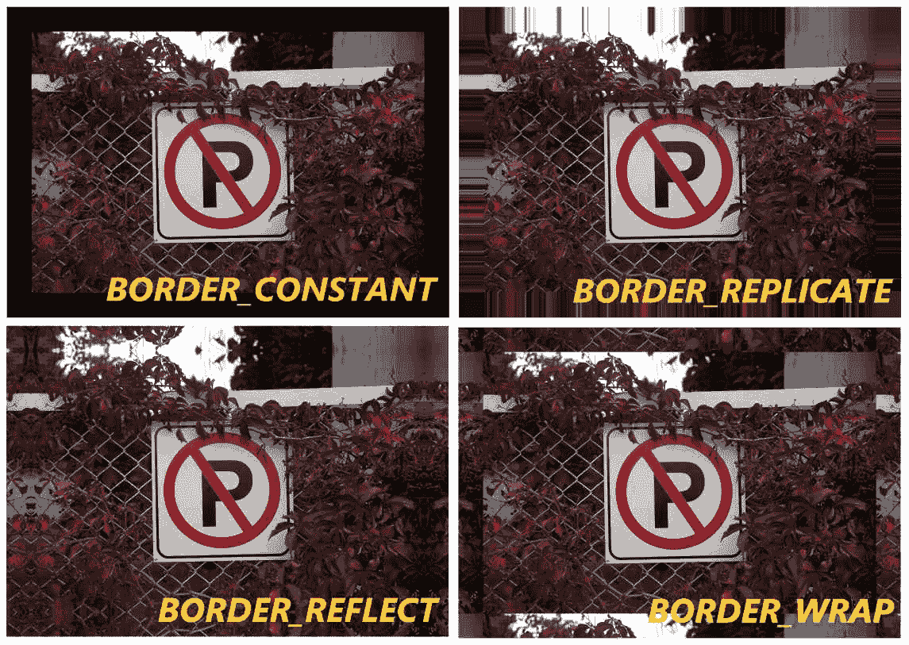

`copyMakeBorder` 以及许多其他 OpenCV 函数，在内部使用 `borderInterpolate` 函数来计算用于外推和创建非现有像素的捐赠像素的位置。您不需要直接调用此函数，所以我们将其留给您自己探索和发现。

# 翻转（镜像）和旋转图像

您可以使用 `flip` 函数翻转或镜像图像。此函数可以用于围绕 *x* 或 *y* 轴翻转图像，或者两者同时翻转，具体取决于提供的翻转 `code`。以下是此函数的使用方法：

```py
int code = +1; 
flip(image, result, code);
```

如果 `code` 为零，输入图像将垂直翻转/镜像（围绕 *x* 轴），如果 `code` 是正值，输入图像将水平翻转/镜像（围绕 *y* 轴），如果 `code` 是负值，输入图像将同时围绕 *x* 和 *y* 轴翻转/镜像。

另一方面，要旋转图像，您可以使用 `rotate` 函数。在调用 `rotate` 函数时，您需要注意提供正确的旋转标志，如下面的示例所示：

```py
RotateFlags rt = ROTATE_90_CLOCKWISE; 
rotate(image, result, rt); 
```

`RotateFlag` 枚举可以是以下自解释的常量值之一：

+   `ROTATE_90_CLOCKWISE`

+   `ROTATE_180`

+   `ROTATE_90_COUNTERCLOCKWISE`

以下图像展示了 `flip` 和 `rotate` 函数的所有可能结果。请注意，围绕两个轴翻转的结果与以下结果图像中的 180 度旋转相同：


如本章前面所述，`Mat::t`，即矩阵的转置，也可以与 `flip` 函数结合使用来旋转图像。

# 处理通道

OpenCV 提供了一些函数来处理通道，无论我们需要合并、拆分还是对它们执行各种操作。在本节中，我们将学习如何将图像拆分为其组成通道或使用多个单通道图像创建多通道图像。那么，让我们开始吧。

您可以使用 `merge` 函数合并多个单通道 `Mat` 对象并创建一个新的多通道 `Mat` 对象，如下面的示例代码所示：

```py
Mat channels[3] = {ch1, ch2, ch3}; 
merge(channels, 3, result); 
```

在前面的代码中，`ch1`、`ch2` 和 `ch3` 都是相同大小的单通道图像。结果将是一个三通道的 `Mat` 对象。

您还可以使用 `insertChannel` 函数向图像中插入新通道。以下是方法：

```py
int idx = 2; 
insertChannel(ch, image, idx); 
```

在前面的代码中，`ch`是一个单通道`Mat`对象，`image`是我们想要在其中添加额外通道的矩阵，而`idx`指的是通道将被插入的位置的零基于索引号。

可以使用`split`函数来执行与`merge`函数相反的操作，即将多通道图像分割成多个单通道图像。以下是一个示例：

```py
Mat channels[3]; 
split(image, channels); 
```

前面的代码中的`channels`数组将包含三个大小相同的单通道图像，分别对应于图像中的每个单独的通道。

要从图像中提取单个通道，可以使用`extractChannel`函数：

```py
int idx = 2; 
Mat ch; 
extractChannel(image, ch, idx); 
```

在前面的代码中，很明显，位置`idx`的通道将从图像中提取并保存到`ch`中。

即使`merge`、`split`、`insertChannel`和`extractChannel`对于大多数用例已经足够，你仍然可能需要更复杂的通道打乱、提取或操作。因此，OpenCV 提供了一个名为`mixChannels`的函数，它允许以更高级的方式处理通道。让我们通过一个示例案例来看看`mixChannels`是如何使用的。假设我们想要将图像的所有通道向右移动。为了能够执行这样的任务，我们可以使用以下示例代码：

```py
Mat image = imread("Test.png"); 
Mat result(image.rows, image.cols, image.type()); 

vector<int> fromTo = {0,1, 
                      1,2, 
                      2,0}; 
mixChannels(image, result, fromTo); 
```

在前面的示例中，唯一重要的代码片段是`fromTo`向量，它必须包含对应于源图像和目标图像中通道号的值对。通道号，如往常一样，是基于 0 的索引，所以 0, 1 表示源图像中的第一个通道将被复制到结果中的第二个通道，依此类推。

值得注意的是，本节中所有之前的函数（合并、分割等）都是`mixChannels`函数的部分情况。

# 数学函数

在本节中我们将学习的函数和算法仅用于非元素级数学计算，这与我们在本章前面所看到的不同。这包括简单的函数，如`mean`或`sum`，或更复杂的操作，如离散傅里叶变换。让我们通过一些实例来浏览其中一些最重要的函数。

# 矩阵求逆

可以使用`invert`函数来计算矩阵的逆。这不应与`bitwise_not`函数混淆，后者会反转图像像素中的每个比特。`invert`函数不是元素级函数，并且需要将反转方法作为参数传递给此函数。以下是一个示例：

```py
DecompTypes dt = DECOMP_LU; 
invert(image, result, dt); 
```

`DecompTypes`枚举包含可以在`invert`函数中用作分解类型的所有可能条目。以下是它们：

+   `DECOMP_LU`

+   `DECOMP_SVD`

+   `DECOMP_EIG`

+   `DECOMP_CHOLESKY`

+   `DECOMP_QR`

如果你对每个分解方法的详细描述感兴趣，请参阅 OpenCV 文档中的`DecompTypes`枚举。

# 元素的均值和总和

你可以使用`mean`函数来计算矩阵中元素的均值，或者说是平均值。以下是一个示例，展示了如何读取图像并计算并显示其所有单独通道的均值：

```py
Mat image = imread("Test.png"); 
Mat result; 
Scalar m = mean(image); 
cout << m[0] << endl; 
cout << m[1] << endl; 
cout << m[2] << endl; 
```

你可以使用`sum`函数以完全相同的方式，来计算矩阵中元素的求和：

```py
Scalar s = sum(image); 
```

OpenCV 还包括一个`meanStdDev`函数，可以用来同时计算矩阵中所有元素的均值和标准差。以下是一个示例：

```py
Scalar m; 
Scalar stdDev; 
meanStdDev(image, m, stdDev); 
```

与`mean`函数类似，`meanStdDev`函数也会分别计算每个单独通道的结果。

# 离散傅里叶变换

一维或二维数组的离散傅里叶变换，或者说图像的离散傅里叶变换，是计算机视觉中分析图像的许多方法之一。结果的理解完全取决于其应用的领域，而这本书中我们并不关心这一点，然而，在本节中我们将学习如何执行离散傅里叶变换。

简而言之，你可以使用`dft`函数来计算图像的傅里叶变换。然而，在安全调用`dft`函数之前，需要做一些准备工作。傅里叶变换的结果也是如此。让我们用一个示例代码来分解这个过程，并通过计算和显示之前章节中使用的示例图像的傅里叶变换来展示。

`dft`函数可以更高效地处理特定大小的矩阵（如 2 的幂，例如 2、4 和 8），这就是为什么在调用`dft`函数之前，最好将矩阵的大小增加到最接近的优化大小，并用零填充。这可以通过使用`getOptimalDFTSize`函数来完成。假设`image`是我们想要计算其离散傅里叶变换的输入图像，我们可以编写以下代码来计算并调整其大小以适应`dft`函数的优化大小：

```py
int optRows = getOptimalDFTSize( image.rows ); 
int optCols = getOptimalDFTSize( image.cols ); 

Mat resizedImg; 
copyMakeBorder(image, 
               resizedImg, 
               0, 
               optRows - image.rows, 
               0, 
               optCols - image.cols, 
               BORDER_CONSTANT, 
               Scalar::all(0)); 
```

如您所见，必须分别对行和列调用`getOptimalDFTSize`函数两次。您已经熟悉`copyMakeBorder`函数。调整图像大小并用零（或任何其他所需值）填充新像素是`copyMakeBorder`函数无数用例之一。

其余部分相当简单，我们需要形成一个双通道图像，并将其传递给`dft`函数，以在同一个矩阵中获得复数（实部和虚部）的结果。这将简化后续的显示过程。以下是具体操作方法：

```py
vector<Mat> channels = {Mat_<float>(resizedImg), 
                   Mat::zeros(resizedImg.size(), CV_32F)}; 

Mat complexImage; 
merge(channels, complexImage); 

dft(complexImage, complexImage); 
```

我们已经学习了如何使用`merge`函数。在前面的代码中需要注意的唯一重要的事情是结果被保存到了与输入相同的图像中。`complexImage`现在包含两个通道，一个用于离散傅里叶变换的实部，另一个用于虚部。就是这样！我们现在有了结果，然而，为了能够显示它，我们必须计算结果的大小。下面是如何操作的：

```py
split(complexImage, channels); 

Mat mag; 
magnitude(channels[0], channels[1], mag); 
```

在前面的代码中，我们将复数结果分解为其组成通道，然后使用`magnitude`函数计算幅度。理论上，`mag`是一个可显示的结果，但在现实中，它包含的值远高于使用 OpenCV 可显示的值，因此我们需要在显示之前进行几个转换。首先，我们需要确保结果是按对数尺度，通过执行以下转换：

```py
mag += Scalar::all(1); 
log(mag, mag); 
```

接下来，我们必须确保结果值被缩放并归一化，以便在`0.0`和`1.0`之间，以便由 OpenCV 的`imshow`函数显示。你需要使用`normalize`函数来完成这个任务：

```py
normalize(mag, mag, 0.0, 1.0, CV_MINMAX);
```

你现在可以尝试使用`imshow`函数显示结果。以下是一个显示离散傅里叶变换结果的示例：

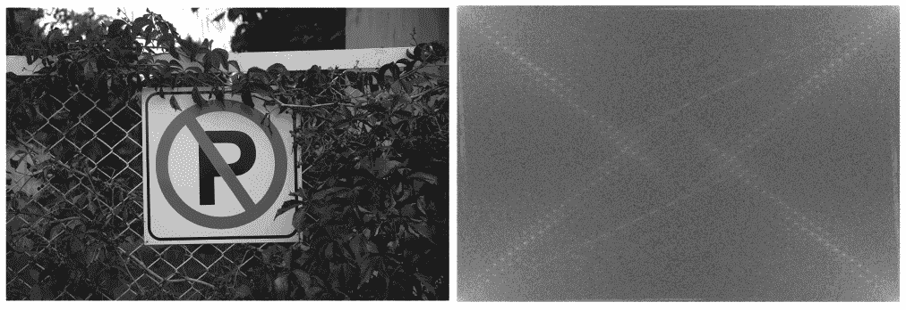

这个结果的问题在于，在结果的原点位于图像中心之前，需要交换四个象限。以下图像展示了在结果有一个位于中心的起点之前，必须如何交换四个结果象限：

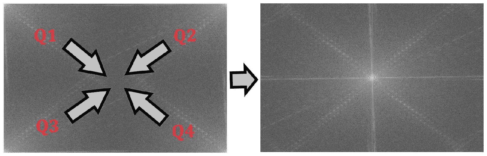

下面的代码用于交换傅里叶变换结果的四个象限。注意我们首先找到结果中心，然后创建四个**感兴趣区域**（ROI）矩阵，然后交换它们：

```py
int cx = mag.cols/2; 
int cy = mag.rows/2; 

Mat Q1(mag, Rect(0, 0, cx, cy)); 
Mat Q2(mag, Rect(cx, 0, cx, cy)); 
Mat Q3(mag, Rect(0, cy, cx, cy)); 
Mat Q4(mag, Rect(cx, cy, cx, cy)); 

Mat tmp; 
Q1.copyTo(tmp); 
Q4.copyTo(Q1); 
tmp.copyTo(Q4); 

Q2.copyTo(tmp); 
Q3.copyTo(Q2); 
tmp.copyTo(Q3); 
```

`dft`函数接受一个额外的参数，可以用来进一步自定义其行为。此参数可以是来自`DftFlags`枚举的值的组合。例如，要执行逆傅里叶变换，你需要使用`DFT_INVERSE`参数调用`dft`函数：

```py
dft(input, output, DFT_INVERSE); 
```

这也可以通过使用`idft`函数来完成：

```py
idft(input, output); 
```

确保查看`DftFlags`枚举和`dft`函数文档，以获取有关 OpenCV 中离散傅里叶变换实现方式的更多信息。

# 生成随机数

随机数生成是计算机视觉中最广泛使用的算法之一，尤其是在测试给定范围内的随机值时。当使用 OpenCV 库时，你可以使用以下函数来生成包含随机值的值或矩阵：

+   `randn`函数可以用来填充一个矩阵或数组，使其包含具有给定平均值和标准差的随机数。以下是此函数的使用方法：

```py
randn(rmat, mean, stddev); 
```

+   `randu` 函数与 `randn` 函数类似，用于用随机值填充数组，然而，这个函数使用的是下限和上限（两者都包含）来生成随机值。以下是一个示例：

```py
randu(rmat, lowBand, highBand);
```

+   `randShuffle` 函数，从其标题可以猜到，用于随机打乱数组或矩阵的内容。它就像以下示例中展示的那样简单使用：

```py
randShuffle(array); 
```

# 搜索和定位函数

当你在计算机视觉项目中工作时，你将面临无数的场景和案例，在这些场景和案例中，你需要寻找特定的像素，或者最大值（最亮点），等等。OpenCV 库包含许多可用于此目的的函数，这些函数是本节的主题。

# 定位非零元素

定位或计数非零元素可能会非常有用，尤其是在对图像进行阈值操作后寻找特定区域，或者寻找特定颜色覆盖的区域时。OpenCV 包含 `findNonZero` 和 `countNonZero` 函数，这些函数可以简单地让你找到或计数图像中具有非零（或明亮）值的像素。

下面是一个示例，展示了如何使用 `findNonZero` 函数在灰度图像中找到第一个非黑色像素并打印其位置：

```py
Mat image = imread("Test.png", IMREAD_GRAYSCALE); 
Mat result; 
vector<Point> idx; 
findNonZero(image, idx); 
if(idx.size() > 0) 
    cout << idx[0].x << "," << idx[0].y << endl; 
```

下面是另一个示例代码，展示了如何找到灰度图像中黑色像素的百分比：

```py
Mat image = imread("Test.png", IMREAD_GRAYSCALE); 
Mat result; 
int nonZero = countNonZero(image); 
float white = float(nonZero) / float(image.total()); 
float black = 1.0 - white; 
cout << black << endl;
```

# 定位最小和最大元素

在图像或矩阵中定位最亮（最大）和最暗（最小）点是计算机视觉中图像搜索的最重要类型之一，尤其是在执行某些类型的阈值算法或模板匹配函数（我们将在接下来的章节中学习）之后。OpenCV 提供以下两个函数来定位矩阵中的全局最小和最大值及其位置：

+   `minMaxIdx`

+   `minMaxLoc`

`minMaxLoc` 函数在整个图像（仅单通道图像）中搜索最亮和最暗的点，并返回最亮和最暗像素的值，以及它们的位置，而 `minMaxIdx` 函数返回找到的最小和最大位置的指针，而不是位置（带有 *x* 和 *y* 的 `Point` 对象）。以下是 `minMaxLoc` 函数的使用方法：

```py
double minVal, maxVal; 
Point minLoc, maxLoc; 
minMaxLoc(image, &minVal, &maxVal, &minLoc, &maxLoc); 
```

这是一个使用 `minMaxIdx` 函数的示例：

```py
double minVal, maxVal; 
int minIdx, maxIdx; 
minMaxIdx(image, &minVal, &maxVal, &minIdx, &maxIdx); 
```

# 查找表转换

在计算机视觉中，根据给定表中包含的所需替换值替换像素称为 **查找表转换**。一开始这可能听起来有些令人困惑，但它是一种非常强大且简单的方法，用于使用查找表修改图像。让我们通过一个实际示例来看看它是如何实现的。

假设我们有一个示例图像，我们需要将亮度像素（值大于`175`）替换为绝对白色，暗像素（值小于`125`）替换为绝对黑色，其余像素保持不变。为了执行此类任务，我们可以简单地使用查找表`Mat`对象以及 OpenCV 中的`LUT`函数：

```py
Mat lut(1, 256, CV_8UC1); 
for(int i=0; i<256; i++) 
{ 
    if(i < 125) 
        lut.at<uchar>(0, i) = 0; 
    else if(i > 175) 
        lut.at<uchar>(0, i) = 255; 
    else 
        lut.at<uchar>(0, i) = i; 
} 

Mat result; 
LUT(image, lut, result); 
```

以下图像展示了当在示例图像上执行此查找表转换时的结果。正如你所见，查找表转换可以在彩色（在右侧）和灰度（在左侧）图像上执行：


聪明地使用`LUT`函数可以为计算机视觉问题中的许多创意解决方案带来帮助，其中需要用给定值替换像素。

# 摘要

在本章中我们所看到的是使用 OpenCV 库在计算机视觉中进行矩阵和数组操作所能做到的一小部分。我们从对前几章中计算机视觉基本概念有坚实的背景知识开始，最终通过实际示例学习了大量算法和函数。我们学习了 ones、zeroes、单位矩阵、转置以及其他嵌入到`Mat`类核心中的函数。然后，我们继续学习许多逐元素算法。我们现在完全能够执行逐元素矩阵运算，如基本运算、比较和位运算。最后，我们学习了 OpenCV 核心模块中的非逐元素操作。创建边界、修改通道和离散傅里叶变换是我们在本章中学到的许多算法之一。

在下一章中，我们将学习用于过滤、绘制和其他功能的计算机视觉算法。即将到来的章节中涵盖的主题是在你步入高级计算机视觉开发世界以及用于高度复杂任务（如人脸或物体检测和跟踪）的算法之前所必需的。

# 问题

1.  哪些逐元素数学运算和位运算会产生完全相同的结果？

1.  OpenCV 中的`gemm`函数的目的是什么？使用`gemm`函数，`A*B`的等价是什么？

1.  使用`borderInterpolate`函数计算点`(-10, 50)`处不存在像素的值，边框类型为`BORDER_REPLICATE`。进行此类计算所需的函数调用是什么？

1.  创建与本章*学习单位矩阵*部分相同的单位矩阵，但使用`setIdentity`函数而不是`Mat::eye`函数。

1.  编写一个使用`LUT`函数（查找表转换）的程序，当在灰度图像和彩色（RGB）图像上执行时，与`bitwise_not`（颜色反转）执行相同的任务。

1.  除了对矩阵的值进行归一化外，`normalize`函数还可以用来调整图像的亮度或暗度。请编写所需的函数调用，使用`normalize`函数来使灰度图像变暗和变亮。

1.  使用`merge`和`split`函数从图像（使用`imread`函数创建的 BGR 图像）中移除蓝色通道（第一个通道）。
