# 反向投影和直方图

在上一章中，我们学习了众多计算机视觉算法和 OpenCV 函数，这些函数可用于准备图像以供进一步处理或以某种方式修改它们。我们学习了如何在图像上绘制文本和形状，使用平滑算法对其进行过滤，对其进行形态学变换，并计算其导数。我们还学习了图像的几何和杂项变换，并应用色图来改变图像的色调。

在本章中，我们将学习一些更多用于准备图像以供进一步处理、推理和修改的算法和函数。这一点将在本章后面进一步阐明，在我们学习了计算机视觉中的直方图之后。我们将介绍直方图的概念，然后通过实际示例代码学习它们是如何计算和利用的。本章我们将学习的另一个极其重要的概念被称为**反向投影**。我们将学习如何使用直方图的反向投影来创建原始图像的修改版本。

除了它们的常规用途外，本章我们将学习的概念和算法在处理一些最广泛使用的目标检测和跟踪算法时也是必不可少的，这些算法将在接下来的章节中学习。

在本章中，我们将涵盖以下内容：

+   理解直方图

+   直方图反向投影

+   直方图比较

+   直方图均衡化

# 技术要求

+   用于开发 C++或 Python 应用程序的 IDE

+   OpenCV 库

请参阅第二章，*使用 OpenCV 入门*，获取有关如何设置个人计算机并使其准备好使用 OpenCV 库开发计算机视觉应用程序的更多信息。

您可以使用以下 URL 下载本章的源代码和示例：

[`github.com/PacktPublishing/Hands-On-Algorithms-for-Computer-Vision/tree/master/Chapter05`](https://github.com/PacktPublishing/Hands-On-Algorithms-for-Computer-Vision/tree/master/Chapter05)

# 理解直方图

在计算机视觉中，直方图简单地说是表示像素值在像素可能接受值范围内的分布的图表，或者说，是像素的概率分布。嗯，这可能不像你期望的那样清晰，所以让我们以单通道灰度图像作为一个简单的例子来描述直方图是什么，然后扩展到多通道彩色图像等。我们已经知道，标准灰度图像中的像素可以包含 0 到 255 之间的值。考虑到这一点，一个类似于以下图表的图形，它描述了任意图像中每个可能的灰度像素值的像素数量比，就是该给定图像的直方图：

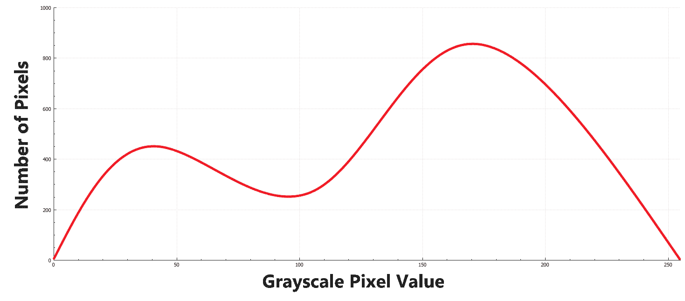

考虑到我们刚刚学到的内容，可以很容易地猜测，例如，三通道图像的直方图将是由三个图表表示的，每个通道的值分布，类似于我们刚才看到的单通道灰度图像的直方图。

您可以使用 OpenCV 库中的 `calcHist` 函数计算一个或多个图像的直方图，这些图像可以是单通道或多通道。此函数需要提供一些参数，必须仔细提供才能产生所需的结果。让我们通过几个示例来看看这个函数是如何使用的。

以下示例代码（随后是对所有参数的描述）演示了如何计算单个灰度图像的直方图：

```py
Mat image = imread("Test.png"); 
if(image.empty()) 
    return -1; 
Mat grayImg; 
cvtColor(image, grayImg, COLOR_BGR2GRAY); 

int bins = 256; 
int nimages = 1; 
int channels[] = {0}; 
Mat mask; 
int dims = 1; 
int histSize[] = { bins }; 
float rangeGS[] = {0, 256}; 
const float* ranges[] = { rangeGS }; 
bool uniform = true; 
bool accumulate = false; 
Mat histogram; 
calcHist(&grayImg, 
         nimages, 
         channels, 
         mask, 
         histogram, 
         dims, 
         histSize, 
         ranges, 
         uniform, 
         accumulate); 
```

从前面的代码中，我们可以推断出以下内容：

+   `grayImg` 是想要计算其直方图的输入灰度图像，而 `histogram` 将包含结果。

+   `nimages` 必须包含我们想要计算直方图的图像数量，在这个例子中，只有一个图像。

+   `channels` 是一个数组，它应该包含我们想要计算其直方图的每个图像中通道的零基于索引号。例如，如果我们想要计算多通道图像中第一个、第二个和第四个通道的直方图，`channels` 数组必须包含 0、1 和 3 的值。在我们的例子中，`channels` 只包含 `0`，因为我们正在计算灰度图像中唯一通道的直方图。

+   `mask`，这是许多其他 OpenCV 函数的共同参数，是一个用于屏蔽（或忽略）某些像素，或者换句话说，防止它们参与计算结果的参数。在我们的情况下，只要我们不在图像的某个部分上工作，`mask` 必须包含一个空矩阵。

+   `dims`，或维度参数，对应于我们正在计算的直方图的结果维度。它必须不大于 `CV_MAX_DIM`，在当前 OpenCV 版本中为 32。我们大多数情况下将使用 `1`，因为我们期望我们的直方图是一个简单的数组形状矩阵。因此，结果直方图中每个元素的索引号将对应于箱子号。

+   `histSize` 是一个数组，它必须包含每个维度中直方图的大小。在我们的例子中，由于维度是 `1`，`histSize` 必须包含一个单一值。在这种情况下，直方图的大小与直方图中的箱子数量相同。在前面的示例代码中，`bins` 用于定义直方图中的箱子数量，并且它也被用作单一的 `histSize` 值。将 `bins` 想象为直方图中的像素组数量。这将在稍后的示例中进一步阐明，但就目前而言，重要的是要注意，`bins` 的值为 `256` 将导致包含所有可能的单个像素值计数的直方图。

+   当计算图像的直方图时，`ranges`必须包含对应于每个可能值范围的上下限值对。在我们的示例中，这意味着单个范围（`0`, `256`）中的一个值，这是我们提供给此参数的值。

+   `uniform`参数用于定义直方图的均匀性。请注意，如果直方图是非均匀的，与我们的示例中展示的不同，则`ranges`参数必须包含所有维度的下限和上限。

+   `accumulate`参数用于决定在计算直方图之前是否应该清除它，或者将计算出的值添加到现有的直方图中。当你需要使用多张图像计算单个直方图时，这非常有用。

我们将在本章提供的示例中尽可能多地介绍这里提到的参数。然而，你也可以参考`calcHist`函数的在线文档以获取更多信息。

# 显示直方图

显然，尝试使用如`imshow`之类的函数显示结果直方图是徒劳的，因为存储的直方图的原始格式类似于一个具有`bins`行数的单列矩阵。直方图的每一行，或者说每个元素，对应于落入该特定 bin 的像素数。考虑到这一点，我们可以使用第四章，*绘图、滤波和变换*中的绘图函数绘制计算出的直方图。

下面是一个示例，展示了我们如何将前面代码样本中计算出的直方图显示为具有自定义大小和属性的图形：

```py
int gRows = 200; // height 
int gCol = 500; // width 
Scalar backGroundColor = Scalar(0, 255, 255); // yellow 
Scalar graphColor = Scalar(0, 0, 0); // black 
int thickness = 2; 
LineTypes lineType = LINE_AA; 

Mat theGraph(gRows, gCol, CV_8UC(3), backGroundColor); 

Point p1(0,0), p2(0,0); 
for(int i=0; i<bins; i++) 
{ 
    float value = histogram.at<float>(i,0); 
    value = maxVal - value; // invert 
    value = value / maxVal * theGraph.rows; // scale 
    line(theGraph, 
         p1, 
         Point(p1.x,value), 
         graphColor, 
         thickness, 
         lineType); 
    p1.y = p2.y = value; 
    p2.x = float(i+1) * float(theGraph.cols) / float(bins); 
    line(theGraph, 
         p1, p2, 
         Scalar(0,0,0)); 
    p1.x = p2.x; 
} 
```

在前面的代码中，`gRow`和`gCol`分别代表结果的图形的高度和宽度。其余参数要么是自解释的（如`backgroundColor`等），或者你在前面的章节中已经了解过它们。注意`histogram`中的每个值是如何用来计算需要绘制的线的位置的。在前面的代码中，`maxVal`简单地用于将结果缩放到可见范围。以下是`maxVal`本身是如何计算的：

```py
double maxVal = 0; 
minMaxLoc(histogram, 
          0, 
          &maxVal, 
          0, 
          0);
```

如果你需要刷新关于`minMaxLoc`函数如何使用的记忆，请参阅第三章，*数组和矩阵操作*。在我们的示例中，我们只需要直方图中最大元素的值，所以我们通过将它们传递零来忽略其余参数。

以下是前面示例代码的结果：

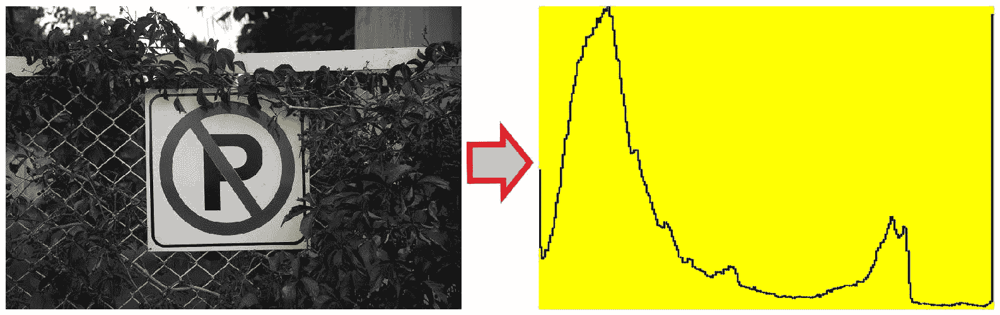

你可以通过提供的`backGroundColor`或`graphColor`参数轻松更改背景或图形颜色，或者通过更改`thickness`参数使图形更细或更粗，等等。

直方图的解释非常重要，尤其是在摄影和照片编辑应用中，因此能够可视化它们对于更容易解释结果至关重要。例如，在前例中，可以从结果直方图中轻松看出，源图像包含比亮色更多的暗色调。我们将在稍后看到更多关于暗色和亮色图像的示例，但在那之前，让我们看看改变桶数会如何影响结果。

下面的直方图是之前示例中相同图像的结果，从左到右分别使用 150、80 和 25 个桶进行柱状图可视化：

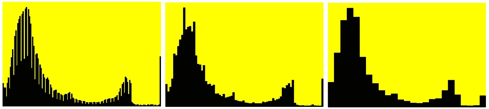

你可以很容易地注意到，桶值越低，像素越聚集在一起。尽管这看起来更像是相同数据（从左到右）的较低分辨率，但实际上使用更少的桶值将相似像素聚集在一起是更好的选择。请注意，前例中的柱状图可视化是通过将前例代码中的`for`循环替换为以下代码产生的：

```py
Point p1(0,0), p2(0, theGraph.rows-1); 
for(int i=0; i<bins; i++) 
{ 
    float value = histogram.at<float>(i,0); 
    value *= 0.95f; // 5% empty at top 
    value = maxVal - value; // invert 
    value = value / (maxVal) * theGraph.rows; // scale 
    p1.y = value; 
    p2.x = float(i+1) * float(theGraph.cols) / float(bins); 
    rectangle(theGraph, 
              p1, 
              p2, 
              graphColor, 
              CV_FILLED, 
              lineType); 
    p1.x = p2.x; 
} 
```

这两种可视化（图形或柱状图）各有其优缺点，当你尝试计算不同类型图像的直方图时，这些优缺点将更加明显。让我们尝试计算一张彩色图像的直方图。我们需要计算各个通道的直方图，正如之前提到的。以下是一个示例代码，展示了如何进行操作：

```py
Mat image = imread("Test.png"); 
if(image.empty()) 
{ 
    cout << "Empty input image!"; 
    return -1; 
} 

Mat imgChannels[3]; 
Mat histograms[3]; 
split(image, imgChannels); 

// each imgChannels element is an individual 1-channel image
CvHistGraphColor, and running it would produce a result similar to what is seen in the following diagram:
```

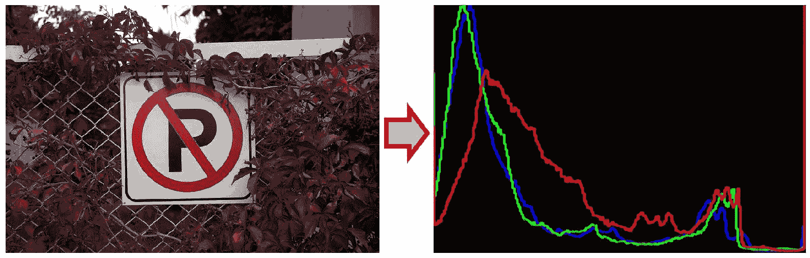

如前例代码所示，`split`函数被用来从我们的源彩色图像（默认为 BGR）中创建三个单独的图像，每个图像包含一个单独的通道。前例代码中提到的带有注释行的代码部分，实际上是一个`for`循环，它遍历`imgChannels`的元素，并使用与之前看到的完全相同的代码绘制每个图表，但每个图表都有其独特的颜色，该颜色是通过循环中的以下代码计算的：

```py
Scalar graphColor = Scalar(i == 0 ? 255 : 0, 
                           i == 1 ? 255 : 0, 
                           i == 2 ? 255 : 0); 
```

根据`i`的值，`graphColor`被设置为蓝色、绿色或红色，因此产生了之前图片中显示的直方图。

除了解释图像内容或查看像素值在图像中的分布情况外，直方图还有许多用途。在接下来的章节中，我们将学习关于反投影和其他算法，这些算法用于在我们的应用中利用直方图。

# 直方图的反投影

从上一节开头的直方图定义开始考虑，可以说图像上直方图的反向投影意味着用其每个像素的概率分布值替换它们。这在某种程度上（并不完全）是计算图像直方图的逆操作。当我们对图像上的直方图进行反向投影时，我们实际上是用直方图来修改图像。让我们首先看看如何使用 OpenCV 执行反向投影，然后深入了解其实际应用。

您可以使用 `calcBackProject` 函数来计算图像上直方图的反向投影。此函数需要与 `calcHist` 函数类似的参数集。让我们看看它是如何调用的，然后进一步分解其参数：

```py
calcBackProject(&image, 
                nimages, 
                channels, 
                histogram, 
                backProj, 
                ranges, 
                scale, 
                uniform); 
```

`calcBackProject` 函数中的 `nimages`、`channels`、`ranges` 和 `uniform` 参数的使用方式与 `calcHist` 函数中的使用方式完全相同。`image` 必须包含输入图像，而 `histogram` 需要通过先前的 `calcHist` 函数调用或任何其他方法（甚至手动）来计算。结果将通过使用 `scale` 参数进行缩放，最后将保存在 `backProj` 中。重要的是要注意，`histogram` 中的值可能超过正确的可显示范围，因此在进行反向投影后，结果 `backProj` 对象将无法正确显示。为了解决这个问题，我们需要首先确保 `histogram` 被归一化到 OpenCV 的可显示范围。以下代码必须在执行前面的 `calcBackProject` 调用之前执行，以便结果 `backProj` 可显示：

```py
normalize(histogram, 
          histogram, 
          0, 
          255, 
          NORM_MINMAX);
```

以下图像展示了使用其原始直方图（未修改的直方图）进行反向投影的结果。右侧的图像是反向投影算法的结果：

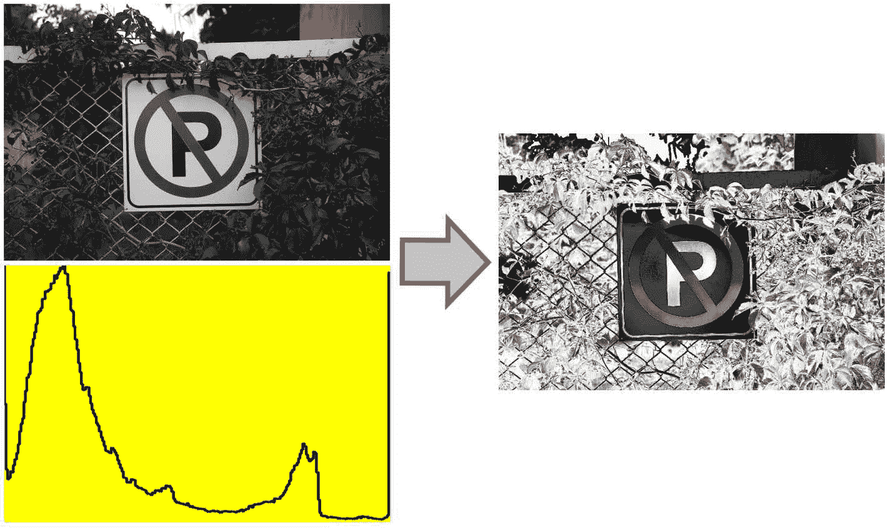

根据直方图和反向投影的定义，可以说前一个反向投影结果图像中的较暗区域包含比原始图像中更不常见的像素，反之亦然。此算法可用于（甚至滥用）使用修改后的或手动制作的直方图来改变图像。这种技术通常用于创建仅提取包含给定颜色或强度的图像部分的掩码。

下面是一个示例，演示了如何使用直方图和反向投影的概念来检测图像中位于可能像素值最亮 10% 范围内的像素：

```py
int bins = 10; // we need 10 slices 
float rangeGS[] = {0, 256}; 
const float* ranges[] = { rangeGS }; 
int channels[] = {0}; 
Mat histogram(bins, 1, CV_32FC1, Scalar(0.0)); 
histogram.at<float>(9, 0) = 255.0; 
calcBackProject(&imageGray, 
                1, 
                channels, 
                histogram, 
                backProj, 
                ranges);
```

注意，直方图是手动形成的，有 `10` 个桶，而不是从原始图像中计算得出。然后，最后一个桶，或者说直方图的最后一个元素，被设置为 `255`，这意味着绝对白色。显然，如果没有这样做，我们就需要执行归一化以确保反向投影的结果在可显示的颜色范围内。

以下图像展示了在执行上述代码片段时，在之前示例中的相同样本图像上的结果：

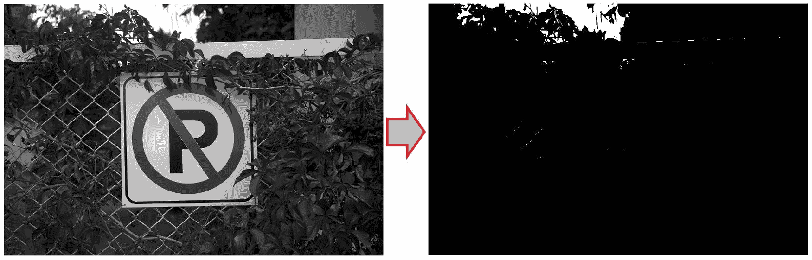

提取的掩码图像可以用于进一步修改图像，或者在具有独特颜色的对象的情况下，可以用于检测和跟踪该对象。检测和跟踪算法将在接下来的章节中详细讲解，但我们将学习如何具体使用对象的颜色。

# 学习更多关于反向投影

首先，让我们回顾一下 HSV 颜色空间在处理图像中像素的实际颜色值方面比标准的 RGB（或 BGR 等）颜色空间更适合。你可能需要回顾第一章，*计算机视觉简介*，以了解更多关于这一现象的信息。我们将利用这一简单事实来找到图像中具有特殊颜色的区域，无论其颜色强度、亮度等。因此，我们需要首先将图像转换为 HSV 颜色空间

让我们用一个示例案例来简化这一点。假设我们想要替换图像中的特定颜色，同时保留高光、亮度等。为了能够执行此类任务，我们需要能够准确检测给定的颜色，并确保我们只更改检测到的像素中的颜色，而不是它们的亮度和其他类似属性。以下示例代码演示了我们可以如何使用手动形成的色调通道直方图及其反向投影来提取具有特定颜色的像素，在这个例子中，假设颜色是蓝色：

1.  要执行此类操作，我们需要首先读取一个图像，将其转换为 HSV 颜色空间，并提取色调通道，换句话说，就是第一个通道，如下所示：

```py
Mat image = imread("Test.png"); 
if(image.empty()) 
{ 
    cout << "Empty input image!"; 
    return -1; 
} 

Mat imgHsv, hue; 
vector<Mat> hsvChannels; 
cvtColor(image, imgHsv, COLOR_BGR2HSV); 
split(imgHsv, hsvChannels); 
hue = hsvChannels[0]; 
```

1.  现在我们已经将色调通道存储在`hue`对象中，我们需要形成色调通道的适当直方图，其中只包含具有蓝色颜色的像素。色调值可以在`0`到`360`（度）之间，蓝色的色调值为`240`。因此，我们可以使用以下代码创建一个直方图，用于提取具有蓝色颜色的像素，偏移量（或阈值）为`50`像素：

```py
int bins = 360; 
int blueHue = 240; 
int hueOffset = 50; 
Mat histogram(bins, 1, CV_32FC1); 
for(int i=0; i<bins; i++) 
{ 
    histogram.at<float>(i, 0) =  
        (i > blueHue - hueOffset) 
            && 
        (i < blueHue + hueOffset) 
            ? 
        255.0 : 0.0; 
}
```

上述代码像一个简单的阈值，其中直方图中索引为`240`（加减`50`）的所有元素都被设置为`255`，其余的设置为零。

1.  通过可视化手动创建的色调通道直方图，我们可以更好地了解将要使用它提取的确切颜色。以下代码可以轻松地可视化色调直方图：

```py
double maxVal = 255.0; 

int gW = 800, gH = 100; 
Mat theGraph(gH, gW, CV_8UC3, Scalar::all(0)); 

Mat colors(1, bins, CV_8UC3); 
for(int i=0; i<bins; i++) 
{ 
    colors.at<Vec3b>(i) = 
            Vec3b(saturate_cast<uchar>( 
                      (i+1)*180.0/bins), 255, 255); 
} 
cvtColor(colors, colors, COLOR_HSV2BGR); 
Point p1(0,0), p2(0,theGraph.rows-1); 
for(int i=0; i<bins; i++) 
{ 
    float value = histogram.at<float>(i,0); 
    value = maxVal - value; // invert 
    value = value / maxVal * theGraph.rows; // scale 
    p1.y = value; 
    p2.x = float(i+1) * float(theGraph.cols) / float(bins); 
    rectangle(theGraph, 
              p1, 
              p2, 
              Scalar(colors.at<Vec3b>(i)), 
              CV_FILLED); 
    p1.x = p2.x; 
}
```

在进行下一步之前，让我们分析前面的示例代码。它几乎与可视化灰度直方图或单个红、绿或蓝通道直方图完全相同。然而，关于前面代码的有趣事实是我们在哪里形成`colors`对象。`colors`对象将是一个简单的向量，包含色调光谱中所有可能的颜色，但根据我们的 bin 数量。注意我们是如何在 OpenCV 中使用`saturate_cast`函数来确保色调值饱和到可接受的范围。S 和 V 通道简单地设置为它们可能的最大值，即 255。在`colors`对象正确创建后，我们使用了之前相同的可视化函数。然而，由于 OpenCV 默认不显示 HSV 颜色空间中的图像（你可以在大多数图像显示函数和库中预期这种行为），我们需要将 HSV 颜色空间转换为 BGR 才能正确显示颜色。

尽管色调可以取（0，360）范围内的值，但无法将其存储在单字节 C++类型（如`uchar`）中，这些类型能够存储（0，255）范围内的值。这就是为什么在 OpenCV 中，色调值被认为是在（0，180）范围内，换句话说，它们只是简单地除以二。

以下图像描述了如果我们尝试使用`imshow`函数显示`theGraph`时前面示例代码的结果：


如果我们使用其相应的直方图来计算图像的反向投影，我们将从中提取这些颜色。这个颜色范围是通过我们在形成直方图时所做的简单阈值（在循环中）创建的。显然，如果你将直方图的全部值设置为`255.0`而不是仅蓝色范围，你将得到整个颜色光谱。以下是一个简单的示例：

```py
Mat histogram(bins, 1, CV_32FC1); 
for(int i=0; i<bins; i++) 
{ 
    histogram.at<float>(i, 0) = 255.0; 
}
```

可视化输出将是以下内容：

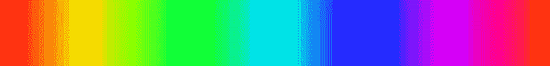

现在，让我们回到我们原始的仅蓝色直方图，并继续进行剩余的步骤。

1.  我们已经准备好计算我们示例的第一步中提取的色调通道上的直方图的反向投影。以下是操作方法：

```py
int nimages = 1; 
int channels[] = {0}; 
Mat backProject; 
float rangeHue[] = {0, 180}; 
const float* ranges[] = {rangeHue}; 
double scale = 1.0; 
bool uniform = true; 
calcBackProject(&hue, 
                nimages, 
                channels, 
                histogram, 
                backProject, 
                ranges, 
                scale, 
                uniform); 
```

这与我们创建灰度通道的反向投影非常相似，但在这个例子中，范围被调整为正确表示色调通道的可能值，即`0`到`180`。

以下图像显示了此类反向投影的结果，其中提取了蓝色像素：

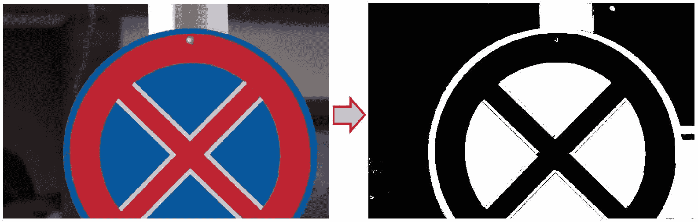

注意，具有灰度颜色（包括白色和黑色）的像素也可能具有与我们想要提取的色调值相似的价值，但由于改变它们的色调值不会对它们的颜色产生任何影响，因此我们可以在我们的示例案例中简单地忽略它们。

1.  使用`calcBackProject`函数提取像素后，我们需要调整这些像素的色调。我们只需遍历像素并将它们的第一个通道以任何期望的值进行偏移。显然，结果必须在显示之前转换为 BGR 格式。以下是具体步骤：

```py
int shift = -50; 
for(int i=0; i<imgHsv.rows; i++) 
{ 
    for(int j=0; j<imgHsv.cols; j++) 
    { 
        if(backProject.at<uchar>(i, j)) 
        { 
            imgHsv.at<Vec3b>(i,j)[0] += shift; 
        } 
    } 
} 
Mat imgHueShift; 
cvtColor(imgHsv, imgHueShift, CV_HSV2BGR);
```

在前面的示例中，我们使用了`-50`的`shift`值，这将导致蓝色像素变成绿色，同时保持其亮度，依此类推。使用不同的`shift`值会导致不同的颜色替换蓝色像素。以下是两个示例：

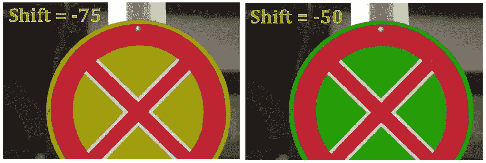

在前面的示例中，我们学到的内容是许多基于颜色的检测和跟踪算法的基础，正如我们将在接下来的章节中学习的那样。能够正确提取特定颜色的像素，无论其亮度如何变化，都非常有用。当使用色调而不是红、绿或蓝通道时，颜色的亮度变化就是当某个颜色的物体上的光照改变，或者在白天和夜晚时发生的情况。

在进入本章的最后一部分之前，值得注意的是，我们用于显示假设色调通道手动制作的直方图的完全相同的可视化方法也可以用于可视化从图像计算出的颜色直方图。让我们通过一个示例来看看如何实现。

在前面的示例中，在初始步骤之后，我们不是手动形成直方图，而是简单地使用`calcHist`算法进行计算，如下所示：

```py
int bins = 36; 
int histSize[] = {bins}; 
int nimages = 1; 
int dims = 1; 
int channels[] = {0}; 
float rangeHue[] = {0, 180}; 
const float* ranges[] = {rangeHue}; 
bool uniform = true; 
bool accumulate = false; 
Mat histogram, mask; 

calcHist(&hue, 
         nimages, 
         channels, 
         mask, 
         histogram, 
         dims, 
         histSize, 
         ranges, 
         uniform, 
         accumulate); 
```

改变 bin 大小的影响与我们在灰度图和单通道直方图中看到的影响相似，即它将附近的值分组在一起。然而，在可视化色调通道时，附近的色调值将被分组在一起，这导致色调直方图更好地表示图像中的相似颜色。以下示例图像展示了前面可视化结果，但使用了不同的`bins`值。从上到下，计算每个直方图所使用的`bins`值分别是 360、100、36 和 7。注意，随着 bins 值的减小，直方图的分辨率降低：

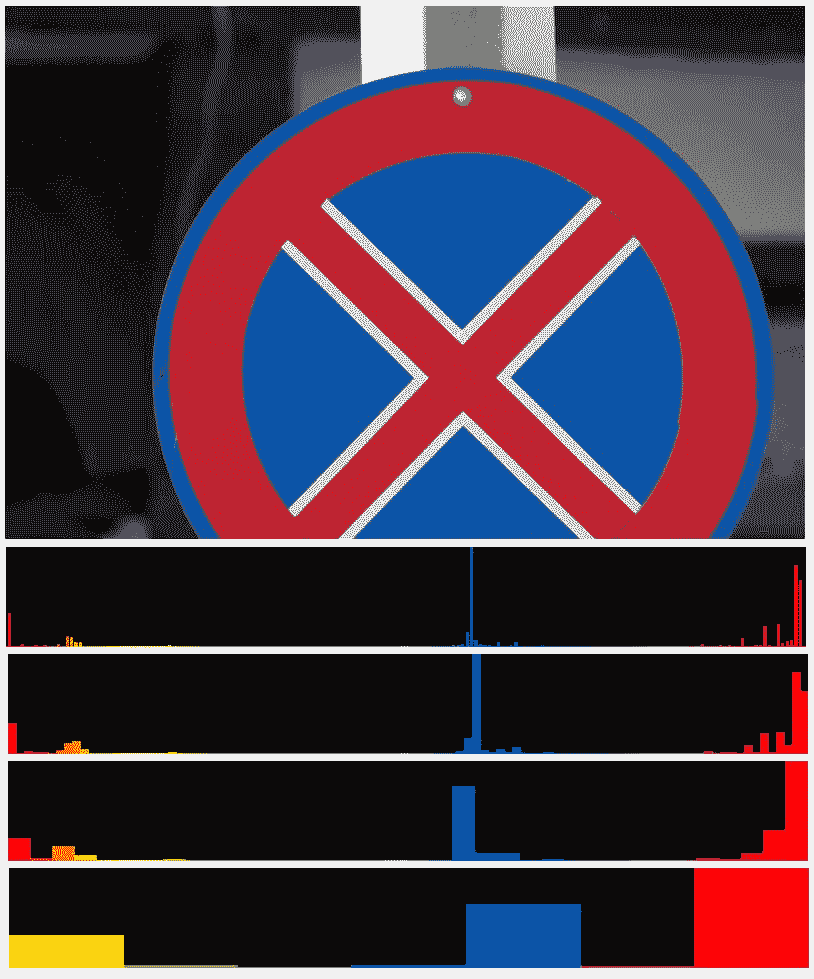

选择合适的 bins 值完全取决于你处理的对象类型以及你对相似颜色的定义。从前面的图像中可以看出，显然当我们需要至少一些相似颜色的分组时，选择一个非常高的 bin 值（例如 360）是没有用的。另一方面，选择一个非常小的 bin 大小可能会导致颜色极端分组，计算反向投影时不会产生准确的结果。请确保明智地选择 bins 值，并根据不同的主题进行变化。

# 比较直方图

可以通过比较直方图来获取对图像内容的某些洞察。OpenCV 允许使用名为`compareHist`的方法比较直方图，这需要首先设置比较方法。以下示例代码展示了如何使用此函数计算使用之前对`calcHist`函数的调用计算的两个直方图之间的比较结果：

```py
HistCompMethods method = HISTCMP_CORREL; 
double result = compareHist(histogram1, histogram2, method); 
```

在前面的例子中，`histogram1`和`histogram2`仅仅是两个不同图像的直方图，或者是一个图像的不同通道。另一方面，`method`必须包含来自`HistCompMethods`枚举的有效条目，它定义了`compareHist`函数使用的比较算法，并且可以是以下方法中的任何一个：

+   `HISTCMP_CORREL`，用于相关方法

+   `HISTCMP_CHISQR`，用于卡方方法

+   `HISTCMP_INTERSECT`，用于交集方法

+   `HISTCMP_BHATTACHARYYA`，用于 Bhattacharyya 距离方法

+   `HISTCMP_HELLINGER`，与`HISTCMP_BHATTACHARYYA`相同

+   `HISTCMP_CHISQR_ALT`，用于替代卡方方法

+   `HISTCMP_KL_DIV`，用于 Kullback-Leibler 散度方法

您可以参考最新的 OpenCV 文档以获取有关每种方法的数学细节以及它们如何以及使用哪些直方图属性的信息。同样，这也适用于任何方法的解释结果。让我们通过一个示例来看看这意味着什么。使用以下示例代码，我们可以输出所有直方图比较方法的结果：

```py
cout << "HISTCMP_CORREL: " << 
  compareHist(histogram1, histogram2, HISTCMP_CORREL) 
    << endl; 
cout << "HISTCMP_CHISQR: " << 
  compareHist(histogram1, histogram2, HISTCMP_CHISQR) 
    << endl; 
cout << "HISTCMP_INTERSECT: " << 
  compareHist(histogram1, histogram2, HISTCMP_INTERSECT) 
    << endl; 
cout << "HISTCMP_BHATTACHARYYA: " << 
  compareHist(histogram1, histogram2, HISTCMP_BHATTACHARYYA) 
    << endl; 
cout << "HISTCMP_HELLINGER: " << 
  compareHist(histogram1, histogram2, HISTCMP_HELLINGER) 
    << endl; 
cout << "HISTCMP_CHISQR_ALT: " << 
  compareHist(histogram1, histogram2, HISTCMP_CHISQR_ALT) 
    << endl; 
cout << "HISTCMP_KL_DIV: " << 
  compareHist(histogram1, histogram2, HISTCMP_KL_DIV) 
    << endl; 
```

我们使用本章中一直使用的示例图像来计算`histogram1`和`histogram2`，换句话说，如果我们比较一个直方图与一个等直方图，这里是我们会得到的结果：

```py
HISTCMP_CORREL: 1 
HISTCMP_CHISQR: 0 
HISTCMP_INTERSECT: 426400 
HISTCMP_BHATTACHARYYA: 0 
HISTCMP_HELLINGER: 0 
HISTCMP_CHISQR_ALT: 0 
HISTCMP_KL_DIV: 0
```

注意基于距离和发散的方法返回零值，而相关方法返回一值，对于完全相关。前面输出中的所有结果都表示等直方图。让我们通过计算以下两个图像的直方图来进一步说明：

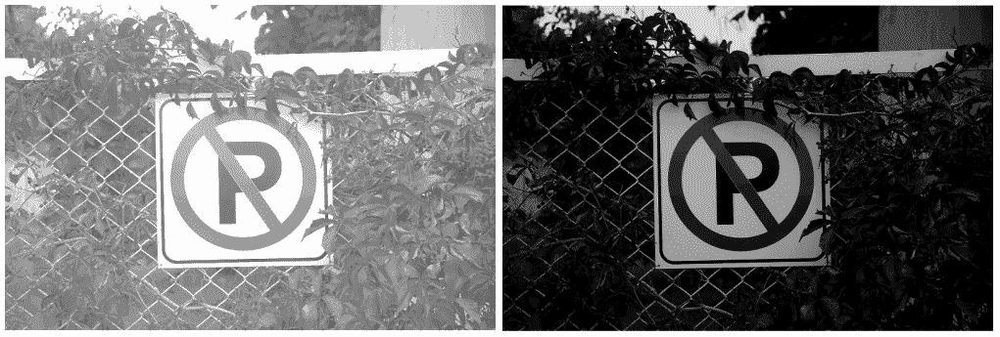

如果左边的图像用于创建`histogram1`，右边的图像用于创建`histogram2`，或者换句话说，一个任意亮图像与一个任意暗图像进行比较，以下结果将会产生：

```py
HISTCMP_CORREL: -0.0449654 
HISTCMP_CHISQR: 412918 
HISTCMP_INTERSECT: 64149 
HISTCMP_BHATTACHARYYA: 0.825928 
HISTCMP_HELLINGER: 0.825928 
HISTCMP_CHISQR_ALT: 1.32827e+06 
HISTCMP_KL_DIV: 3.26815e+06 
```

重要的是要注意，在某些情况下，传递给`compareHist`函数的直方图的顺序很重要，例如当使用`HISTCMP_CHISQR`作为方法时。以下是`histogram1`和`histogram2`以相反顺序传递给`compareHist`函数的结果：

```py
HISTCMP_CORREL: -0.0449654 
HISTCMP_CHISQR: 3.26926e+06 
HISTCMP_INTERSECT: 64149 
HISTCMP_BHATTACHARYYA: 0.825928 
HISTCMP_HELLINGER: 0.825928 
HISTCMP_CHISQR_ALT: 1.32827e+06 
HISTCMP_KL_DIV: 1.15856e+07 
```

比较直方图非常有用，尤其是在我们需要更好地了解各种图像之间的变化时。例如，比较来自摄像机的连续帧的直方图可以给我们一个关于这些连续帧之间强度变化的想法。

# 直方图均衡化

使用我们迄今为止学到的函数和算法，我们可以增强图像的强度分布，换句话说，调整过暗或过亮图像的亮度，以及其他许多操作。在计算机视觉中，直方图均衡化算法出于完全相同的原因被使用。此算法执行以下任务：

+   计算图像的直方图

+   归一化直方图

+   计算直方图的积分

+   使用更新的直方图修改源图像

除了积分部分，它只是简单地计算所有箱中值的总和之外，其余的都是在本章中以某种方式已经执行过的。OpenCV 包含一个名为 `equalizeHist` 的函数，该函数执行所有提到的操作，并生成一个具有均衡直方图的图像。让我们首先看看这个函数是如何使用的，然后尝试一个示例来看看我们自己的效果。

以下示例代码展示了如何使用 `equalizeHist` 函数，这个函数极其容易使用，并且不需要任何特殊参数：

```py
Mat equalized; 
equalizeHist(gray, equalized); 
```

让我们考虑以下图像，它极度过度曝光（或明亮），以及其直方图，如右侧所示：

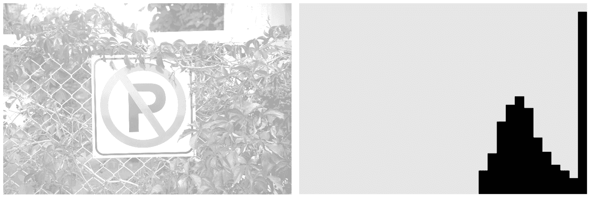

使用 `equalizeHist` 函数，我们可以得到对比度和亮度更好的图像。以下是前面示例图像在直方图均衡化后的结果图像和直方图：

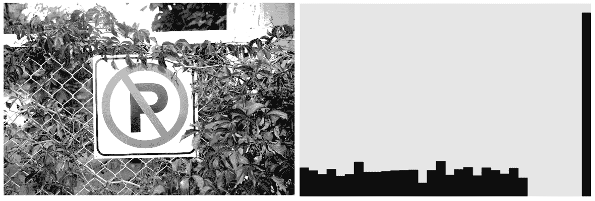

当我们不得不处理可能过度曝光（太亮）或欠曝光（太暗）的图像时，直方图均衡化非常有帮助。例如，X 射线扫描图像，其中细节只有在使用强背光增加对比度和亮度时才可见，或者当我们与可能具有强烈光线变化的视频帧一起工作时，这些都是可以使用直方图均衡化来确保其余算法始终处理相同的，或者只是略微不同的亮度对比度级别的情况。

# 摘要

我们从学习直方图开始本章，了解它们是什么，以及如何使用 OpenCV 库计算它们。我们学习了直方图的箱大小及其如何影响直方图中值的准确性或分组。我们继续学习使用我们在第四章绘图、过滤和转换中学到的函数和算法来可视化直方图。在经过各种可视化类型后，我们学习了反向投影以及如何使用直方图更新图像。我们学习了检测具有特定颜色的像素以及如何移动色调值，从而仅改变这些特定像素的颜色。在本章的最后部分，我们学习了比较直方图和直方图均衡化算法。我们进行了可能的直方图比较场景的动手示例，并增强了曝光过度的图像的对比度和亮度。

直方图及其如何通过反向投影增强和修改图像是计算机视觉主题之一，不能轻易跳过或错过，因为它构成了许多图像增强算法和照片编辑应用中的技术基础，或者，正如我们将在接下来的章节中看到的，它是某些最重要的实时检测和跟踪算法的基础。在本章中，我们学习了直方图和反向投影的一些最实用的用例，但如果你开始构建使用直方图的现实生活项目，这些算法肯定还有更多内容。

在下一章中，我们将使用在本章和前几章中学到的所有概念来处理视频和视频帧，以检测具有特定颜色的对象，实时跟踪它们，或在视频中检测运动。

# 问题

1.  计算三通道图像中第二个通道的直方图。使用可选的箱大小和 0 到 100 的范围作为第二个通道的可能值。

1.  创建一个直方图，可用于与 `calcBackProject` 函数一起使用，以从灰度图像中提取最暗的像素。考虑最暗的 25% 可能的像素值作为我们想要提取的灰度强度。

1.  在上一个问题中，如果我们需要排除而不是提取最暗和最亮的 25% 的像素，在蒙版中会怎样？

1.  红色的色调值是多少？应该移动多少才能得到蓝色？

1.  创建一个色调直方图，可用于从图像中提取红色像素。考虑将 50 作为被认为是红色的像素的偏移量。最后，可视化计算出的色调直方图。

1.  计算直方图的积分。

1.  对彩色图像执行直方图均衡化。注意，`equalizeHist` 函数仅支持单通道 8 位灰度图像的直方图均衡化。

# 进一步阅读

+   *通过示例学习 OpenCV 3.x 与 Python 第二版* ([`www.packtpub.com/application-development/opencv-3x-python-example-second-edition`](https://www.packtpub.com/application-development/opencv-3x-python-example-second-edition))

+   *使用 OpenCV 3 和 Qt5 进行计算机视觉* ([`www.packtpub.com/application-development/computer-vision-opencv-3-and-qt5`](https://www.packtpub.com/application-development/computer-vision-opencv-3-and-qt5))
