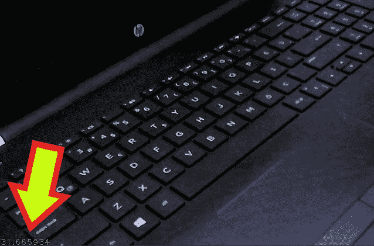
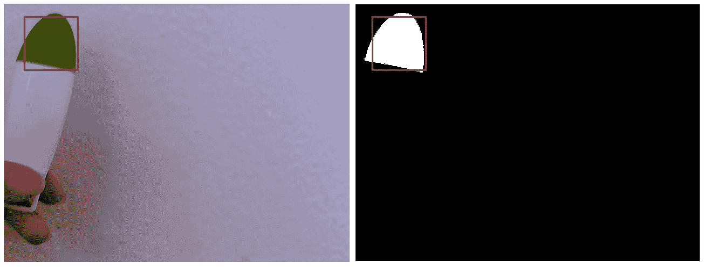
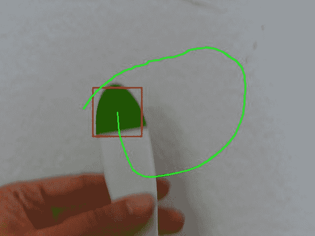
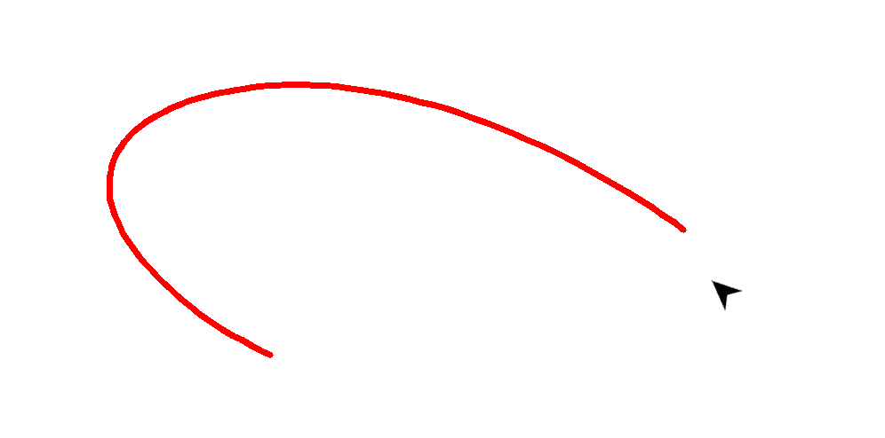
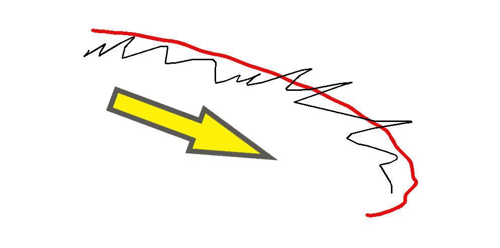

# 视频分析——运动检测和跟踪

作为一名计算机视觉开发者，你绝对无法避免处理来自存储的视频文件或摄像头以及其他类似来源的视频流。将视频帧视为单独的图像是处理视频的一种方法，令人惊讶的是，这并不需要比你所学到的更多的努力或算法知识。例如，你可以对视频应用平滑滤波器，或者说，对一组视频帧应用，就像你在对单个图像应用时一样。这里的唯一技巧是，你必须按照第二章“OpenCV 入门”中描述的方法从视频中提取每一帧。然而，在计算机视觉中，有一些算法旨在与连续的视频帧一起工作，并且它们操作的结果不仅取决于单个图像，还取决于对前一个帧进行相同操作的结果。我们刚才提到的两种算法类型将是本章的主要内容。

在上一章学习了直方图和反向投影图像之后，我们已准备好去应对用于实时检测和跟踪物体的计算机视觉算法。这些算法高度依赖于我们对第五章“反向投影和直方图”中所有主题的牢固理解。基于此，我们将从几个简单的例子开始本章，这些例子展示了如何使用我们迄今为止学到的计算机视觉算法来处理视频文件或摄像头捕获的帧，然后我们将继续学习关于两种最著名的对象检测和跟踪算法——均值漂移和 CAM 漂移算法。接着，我们将学习如何使用卡尔曼滤波器来校正我们的对象检测和跟踪算法的结果，以及如何去除结果中的噪声以获得更好的跟踪结果。本章的结尾，我们将学习运动分析和背景/前景提取。

本章将涵盖以下内容：

+   如何在视频上应用过滤器并执行此类操作

+   使用均值漂移算法检测和跟踪对象

+   使用 CAM 漂移算法检测和跟踪对象

+   使用卡尔曼滤波器提高跟踪结果并去除噪声

+   使用背景和前景提取算法

# 技术要求

+   用于开发 C++或 Python 应用程序的 IDE

+   OpenCV 库

有关如何设置个人计算机并使其准备好使用 OpenCV 库开发计算机视觉应用程序的更多信息，请参阅第二章“OpenCV 入门”。

您可以使用以下 URL 下载本章的源代码和示例：[`github.com/PacktPublishing/Hands-On-Algorithms-for-Computer-Vision/tree/master/Chapter06`](https://github.com/PacktPublishing/Hands-On-Algorithms-for-Computer-Vision/tree/master/Chapter06)。

# 处理视频

要能够在视频上使用我们迄今为止学到的任何算法，我们需要能够读取视频帧并将它们存储在`Mat`对象中。本书的前几章我们已经学习了如何处理视频文件、摄像头和 RTSP 流。因此，在此基础上，利用我们之前章节中学到的知识，我们可以使用以下类似的代码，以便将颜色图应用于计算机默认摄像头的视频流：

```py
VideoCapture cam(0); 
// check if camera was opened correctly 
if(!cam.isOpened()) 
    return -1; 
// infinite loop 
while(true) 
{ 
    Mat frame; 
    cam >> frame; 
    if(frame.empty()) 
        break; 

    applyColorMap(frame, frame, COLORMAP_JET); 

    // display the frame 
    imshow("Camera", frame); 

    // stop camera if space is pressed 
    if(waitKey(10) == ' ') 
        break; 
} 

cam.release(); 
```

正如我们在第二章“使用 OpenCV 入门”中学到的，我们只需创建一个`VideoCapture`对象，并从默认摄像头（索引为零）读取视频帧。在前面的示例中，我们添加了一行代码，用于在提取的视频帧上应用颜色图。尝试前面的示例代码，你会看到`COLORMAP_JET`颜色图被应用于摄像头的每一帧，就像我们在第四章“绘制、过滤和变换”中学到的那样，最终结果实时显示。按下空格键将停止视频处理。

同样，我们可以根据按下的特定键实时执行不同的视频处理算法。以下是一个示例，只需替换前面代码中的`for`循环，除非按下*J*或*H*键，否则将显示原始视频：

```py
int key = -1; 
while(key != ' ') 
{ 
    Mat frame; 
    cam >> frame; 
    if(frame.empty()) 
        break; 
    switch (key) 
    { 
    case 'j': applyColorMap(frame, frame, COLORMAP_JET); 
        break; 
    case 'h': applyColorMap(frame, frame, COLORMAP_HOT); 
        break; 
    } 
    imshow("Camera", frame); 
    int k = waitKey(10); 
    if(k > 0) 
        key = k; 
} 
```

除非按下提到的任何键，否则将显示摄像头的原始输出视频。按下*J*键将触发`COLORMAP_JET`，而按下*H*键将触发`COLORMAP_HOT`颜色图应用于摄像头帧。与前面的示例类似，按下空格键将停止过程。此外，按下除空格、*J*或*H*以外的任何键将导致显示原始视频。

前面示例中的`applyColorMap`函数只是一个随机算法，用于描述实时处理视频所使用的技巧。你可以使用本书中学到的任何在单个图像上执行的算法。例如，你可以编写一个程序对视频执行平滑滤波，或傅里叶变换，甚至编写一个实时显示色调通道直方图的程序。用例无限，然而，用于所有在单个图像上执行单个完整操作算法的方法几乎相同。

除了对单个视频帧执行操作外，还可以执行依赖于任意数量连续帧的操作。让我们看看如何使用一个非常简单但极其重要的用例来完成这项操作。

假设我们想要找到在任何给定时刻从摄像机读取的最后 60 帧的平均亮度。当帧的内容非常暗或非常亮时，这个值在自动调整视频亮度时非常有用。实际上，大多数数码相机的内部处理器以及您口袋里的智能手机通常会执行类似的操作。您可以尝试打开智能手机上的相机，将其对准光源，或太阳，或者进入一个非常黑暗的环境。以下代码演示了如何计算最后 60 帧的平均亮度并将其显示在视频的角落：

```py
VideoCapture cam(0); 
if(!cam.isOpened()) 
    return -1; 
vector<Scalar> avgs; 
int key = -1; 
while(key != ' ') 
{ 
    Mat frame; 
    cam >> frame; 
    if(frame.empty()) 
        break; 
    if(avgs.size() > 60) // remove the first item if more than 60 
        avgs.erase(avgs.begin()); 
    Mat frameGray; 
    cvtColor(frame, frameGray, CV_BGR2GRAY); 
    avgs.push_back( mean(frameGray) ); 
    Scalar allAvg = mean(avgs); 
    putText(frame, 
            to_string(allAvg[0]), 
            Point(0,frame.rows-1), 
            FONT_HERSHEY_PLAIN, 
            1.0, 
            Scalar(0,255,0)); 
    imshow("Camera", frame); 
    int k = waitKey(10); 
    if(k > 0) 
        key = k; 
} 
cam.release(); 
```

对于大多数情况，这个示例代码与我们本章前面看到的示例非常相似。这里的主要区别在于，我们将使用 OpenCV 的均值函数计算的最后 60 帧的平均值存储在一个`Scalar`对象的`vector`中，然后我们计算所有平均值的总平均值。然后使用`putText`函数将计算出的值绘制在输入帧上。以下图像显示了执行前面的示例代码时显示的单个帧：



注意图像左下角显示的值，当视频帧的内容变暗时，该值将开始减小，当内容变亮时，该值将增加。基于这个结果，您可以，例如，改变亮度值或警告您的应用程序用户内容太暗或太亮，等等。

本章初始部分的例子旨在教会您如何使用在前几章中学到的算法处理单个帧，以及一些简单的编程技术，这些技术用于根据连续帧计算一个值。在本章接下来的部分，我们将学习一些最重要的视频处理算法，特别是目标检测和跟踪算法，这些算法依赖于我们在本节以及本书前几章中学到的概念和技术。

# 理解均值漂移算法

均值漂移算法是一个迭代算法，可以用来找到密度函数的最大值。将前面的句子粗略地翻译成计算机视觉术语，可以表达为以下内容——均值漂移算法可以使用反向投影图像在图像中找到对象。但它是如何在实际中实现的呢？让我们一步一步地来探讨。以下是使用均值漂移算法找到对象的单个操作步骤，按顺序如下：

1.  图像的后投影是通过使用修改后的直方图来创建的，以找到最有可能包含我们的目标对象的像素。（过滤后投影图像以去除不想要的噪声也是常见的操作，但这是一种可选操作，用于提高结果。）

1.  需要一个初始搜索窗口。这个搜索窗口在经过多次迭代后，将包含我们的目标对象，这一点我们将在下一步说明。每次迭代后，搜索窗口都会通过算法进行更新。搜索窗口的更新是通过在后投影图像中计算搜索窗口的质量中心，然后将当前搜索窗口的中心点移动到窗口的质量中心来实现的。以下图片展示了搜索窗口中质量中心的概念以及移动过程：


前一张图中箭头两端的两个点对应于搜索窗口中心和质量中心。

1.  正如任何迭代算法一样，均值漂移算法需要一些终止条件来在结果符合预期或达到一个可接受的结果时停止算法。因此，迭代次数和 epsilon 值被用作终止条件。无论是达到算法中的迭代次数，还是找到一个小于给定 epsilon 值的位移距离（收敛），算法都将停止。

现在，让我们通过使用 OpenCV 库来实际看看这个算法是如何应用的。OpenCV 中的 `meanShift` 函数几乎完全按照前面步骤中描述的那样实现了均值漂移算法。这个函数需要一个后投影图像、一个搜索窗口和终止条件，并在以下示例中展示了其用法：

```py
Rect srchWnd(0, 0, 100, 100); 
TermCriteria criteria(TermCriteria::MAX_ITER 
                      + TermCriteria::EPS, 
                      20, // number of iterations 
                      1.0 // epsilon value 
                      ); 
// Calculate back-projection image 
meanShift(backProject, 
          srchWnd, 
          criteria);
```

`srchWnd` 是一个 `Rect` 对象，它只是一个必须包含初始值并随后由 `meanShift` 函数更新和使用的矩形。`backProjection` 必须包含一个适当的后投影图像，该图像可以通过我们在第五章 5.3 后投影和直方图中学习到的任何方法计算得出。`TermCriteria` 类是 OpenCV 中的一个类，它被需要类似终止条件的迭代算法使用。第一个参数定义了终止条件的类型，可以是 `MAX_ITER`（与 `COUNT` 相同）、`EPS` 或两者兼具。在前面的例子中，我们使用了 `20` 次迭代的终止条件和 `1.0` 的 epsilon 值，当然，这个值可以根据环境和应用进行更改。这里需要注意的最重要的一点是，更多的迭代次数和更低的 epsilon 值可以产生更准确的结果，但这也可能导致性能变慢，反之亦然。

上述示例只是展示了如何调用`meanShift`函数。现在，让我们通过一个完整的动手实践示例来学习我们的第一个实时目标跟踪算法：

1.  我们将要创建的跟踪示例结构与本章之前的示例非常相似。我们需要使用`VideoCapture`类在计算机上打开一个视频或摄像头，然后开始读取帧，如下所示：

```py
VideoCapture cam(0); 
if(!cam.isOpened()) 
    return -1; 

int key = -1; 
while(key != ' ') 
{ 
    Mat frame; 
    cam >> frame; 
    if(frame.empty()) 
        break; 

    int k = waitKey(10); 
    if(k > 0) 
        key = k; 
} 

cam.release(); 
```

再次，我们使用了`waitKey`函数来停止循环，如果按下空格键。

1.  我们将假设我们的目标对象是绿色的。因此，我们将形成一个只包含绿色色调的色调直方图，如下所示：

```py
int bins = 360; 
int grnHue = 120; // green color hue value 
int hueOffset = 50; // the accepted threshold 
Mat histogram(bins, 1, CV_32FC1); 
for(int i=0; i<bins; i++) 
{ 
    histogram.at<float>(i, 0) = 
            (i > grnHue - hueOffset) 
            && 
            (i < grnHue + hueOffset) 
            ? 
                255.0 : 0.0; 
} 
```

这需要在进入过程循环之前完成，因为我们的直方图将在整个过程中保持不变。

1.  在进入实际过程循环和跟踪代码之前，还有一件事需要注意，那就是终止条件，它将在整个过程中保持不变。以下是创建所需终止条件的步骤：

```py
Rect srchWnd(0,0, 100, 100); 
TermCriteria criteria(TermCriteria::MAX_ITER 
                      + TermCriteria::EPS, 
                      20, 
                      1.0); 
```

当使用 Mean Shift 算法跟踪对象时，搜索窗口的初始值非常重要，因为这个算法总是对要跟踪的对象的初始位置做出假设。这是 Mean Shift 算法的一个明显缺点，我们将在本章后面讨论 CAM Shift 算法及其在 OpenCV 库中的实现时学习如何处理它。

1.  在我们用于跟踪代码的`while`循环中读取每一帧之后，我们必须使用我们创建的绿色色调直方图来计算输入帧的后投影图像。以下是操作步骤：

```py
Mat frmHsv, hue; 
vector<Mat> hsvChannels; 
cvtColor(frame, frmHsv, COLOR_BGR2HSV); 
split(frmHsv, hsvChannels); 
hue = hsvChannels[0]; 

int nimages = 1; 
int channels[] = {0}; 
Mat backProject; 
float rangeHue[] = {0, 180}; 
const float* ranges[] = {rangeHue}; 
double scale = 1.0; 
bool uniform = true; 
calcBackProject(&hue, 
                nimages, 
                channels, 
                histogram, 
                backProject, 
                ranges, 
                scale, 
                uniform); 
```

您可以参考第五章，*后投影和直方图*，以获取更多关于计算后投影图像的详细说明。

1.  调用`meanShift`函数，使用后投影图像和提供的终止条件来更新搜索窗口，如下所示：

```py
meanShift(backProject, 
          srchWnd, 
          criteria); 
```

1.  为了可视化搜索窗口，或者说跟踪对象，我们需要在输入帧上绘制搜索窗口矩形。以下是使用矩形函数进行此操作的方法：

```py
rectangle(frame, 
          srchWnd, // search window rectangle 
          Scalar(0,0,255), // red color 
          2 // thickness 
          );
```

我们也可以对后投影图像结果做同样的事情，然而，首先我们需要将后投影图像转换为 BGR 颜色空间。请记住，后投影图像的结果包含了一个与输入图像深度相同的单通道图像。以下是我们在后投影图像上搜索窗口位置绘制红色矩形的步骤：

```py
cvtColor(backProject, backProject, COLOR_GRAY2BGR); 
rectangle(backProject, 
          srchWnd, 
          Scalar(0,0,255), 
          2); 
```

1.  使用*B*和*V*键在背投影和原始视频帧之间切换。以下是操作步骤：

```py
switch(key) 
{ 
case 'b': imshow("Camera", backProject); 
    break; 
case 'v': default: imshow("Camera", frame); 
    break; 
} 
```

让我们尝试运行我们的程序，看看它在稍微受控的环境中执行时表现如何。以下图片展示了搜索窗口的初始位置和我们的绿色目标对象，在原始帧视图和后投影视图中：



移动物体将导致`meanShift`函数更新搜索窗口，从而跟踪物体。以下是另一个结果，展示了物体被跟踪到视图的右下角：


注意到角落处可以看到的一小部分噪声，这将被`meanShift`函数处理，因为质量中心不太受其影响。然而，如前所述，对后投影图像进行某种类型的过滤以去除噪声是个好主意。例如，在噪声类似于我们在后投影图像中看到的情况下，我们可以使用`GaussianBlur`函数，或者更好的是`erode`函数，以去除后投影图像中的不需要的像素。有关如何使用过滤函数的更多信息，您可以参考第四章，*绘图、过滤和转换*。

在此类跟踪应用中，我们通常需要观察、记录或以任何方式处理在任意给定时刻之前以及所需时间段内感兴趣对象所走过的路线。这可以通过使用搜索窗口的中心点简单地实现，如下面的示例所示：

```py
Point p(srchWnd.x + srchWnd.width/2, 
        srchWnd.y + srchWnd.height/2); 
route.push_back(p); 
if(route.size() > 60) // last 60 frames 
    route.erase(route.begin()); // remove first element
```

显然，`route`是一个`Point`对象的`vector`。在调用`meanShift`函数后，需要更新`route`，然后我们可以使用以下对`polylines`函数的调用，以便在原始视频帧上绘制`route`：

```py
polylines(frame, 
          route, // the vector of Point objects 
          false, // not a closed polyline 
          Scalar(0,255,0), // green color 
          2 // thickness 
          ); 
```

以下图片展示了在从相机读取的原始视频帧上显示跟踪路线（最后 60 帧）的结果：



现在，让我们解决我们在使用`meanShift`函数时观察到的一些问题。首先，手动创建色调直方图并不方便。一个灵活的程序应该允许用户选择他们想要跟踪的对象，或者至少允许用户方便地选择感兴趣对象的颜色。同样，关于搜索窗口的大小及其初始位置也是如此。有几种方法可以处理这些问题，我们将通过一个实际示例来解决这个问题。

当使用 OpenCV 库时，您可以使用`setMouseCallback`函数来自定义输出窗口上鼠标点击的行为。这可以与一些简单的方法结合使用，例如`bitwise_not`，以模拟用户易于使用的对象选择。从其名称可以猜出，`setMouseCallback`设置一个回调函数来处理给定窗口上的鼠标点击。

以下回调函数与在此定义的变量结合使用，可以创建一个方便的对象选择器：

```py
bool selecting = false; 
Rect selection; 
Point spo; // selection point origin 

void onMouse(int event, int x, int y, int flags, void*) 
{ 
    switch(event) 
    { 
    case EVENT_LBUTTONDOWN: 
    { 
        spo.x = x; 
        spo.y = y; 
        selection.x = spo.x; 
        selection.y = spo.y; 
        selection.width = 0; 
        selection.height = 0; 
        selecting = true; 

    } break; 
    case EVENT_LBUTTONUP: 
    { 
        selecting = false; 
    } break; 
    default: 
    { 
        selection.x = min(x, spo.x); 
        selection.y = min(y, spo.y); 
        selection.width = abs(x - spo.x); 
        selection.height = abs(y - spo.y); 
    } break; 
    } 
} 
```

`event`包含来自`MouseEventTypes`枚举的一个条目，它描述了是否按下了鼠标按钮或释放了鼠标按钮。基于这样一个简单的事件，我们可以决定用户何时实际上在屏幕上选择一个可见的对象。这如下所示：

```py
if(selecting) 
{ 
    Mat sel(frame, selection); 
    bitwise_not(sel, sel); // invert the selected area 

    srchWnd = selection; // set the search window 

    // create the histogram using the hue of the selection 
} 
```

这为我们应用提供了巨大的灵活性，代码也必定能够与任何颜色的对象一起工作。请确保查看在线 Git 仓库中本章的示例代码，以获取一个完整的项目示例，该项目使用了本章迄今为止我们学到的所有主题。

在 OpenCV 库中，选择图像上的对象或区域的一种方法是使用`selectROI`和`selectROIs`函数。这些函数允许用户通过简单的鼠标点击和拖动在图像上选择矩形（或多个矩形）。请注意，`selectROI`和`selectROIs`函数比使用回调函数处理鼠标点击更容易使用，但它们提供的功能、灵活性和定制程度并不相同。

在进入下一节之前，让我们回顾一下`meanShift`不处理被跟踪对象大小的增加或减少，也不关心对象的方向。这些问题可能是导致开发更复杂版本的均值漂移算法的主要原因，这是我们将在本章接下来学习的内容。

# 使用连续自适应均值（CAM）Shift

为了克服均值漂移算法的局限性，我们可以使用其改进版本，这被称为**连续自适应均值**，或简称**CAM**算法。OpenCV 在名为`CamShift`的函数中实现了 CAM 算法，其使用方式几乎与`meanShift`函数相同。`CamShift`函数的输入参数与`meanShift`相同，因为它也使用一个反向投影图像来根据给定的终止条件更新搜索窗口。此外，`CamShift`还返回一个`RotatedRect`对象，它包含搜索窗口及其角度。

不使用返回的`RotatedRect`对象，你可以简单地用`CamShift`替换任何对`meanShift`函数的调用，唯一的区别是结果将是尺度不变的，这意味着如果对象更近（或更大），搜索窗口会变大，反之亦然。例如，我们可以将先前的均值漂移算法示例代码中对`meanShift`函数的调用替换为以下内容：

```py
CamShift(backProject, 
         srchWnd, 
         criteria); 
```

以下图像展示了在上一节示例中将`meanShift`函数替换为`CamShift`的结果：


注意，现在结果具有尺度不变性，尽管我们除了替换提到的函数外没有做任何改变。当对象远离相机或变得较小时，我们仍然使用相同的 Mean Shift 算法来计算其位置，然而，这次搜索窗口被调整大小以适应对象的精确大小，并计算了旋转，这是我们之前没有使用的。为了能够使用对象的旋转值，我们首先需要将`CamShift`函数的结果存储在`RotatedRect`对象中，如下面的示例所示：

```py
RotatedRect rotRect = CamShift(backProject, 
                               srchWnd, 
                               criteria); 
```

要绘制`RotatedRect`对象，换句话说，是一个旋转矩形，你必须使用`RotatedRect`的`points`方法首先提取旋转矩形的`4`个组成点，然后使用线函数将它们全部绘制出来，如下面的示例所示：

```py
Point2f rps[4]; 
rotRect.points(rps); 
for(int i=0; i<4; i++) 
    line(frame, 
         rps[i], 
         rps[(i+1)%4], 
         Scalar(255,0,0),// blue color 
         2); 
```

你还可以使用`RotatedRect`对象来绘制一个被旋转矩形覆盖的旋转椭圆。以下是方法：

```py
ellipse(frame, 
        rotRect, 
        Scalar(255,0,0), 
        2); 
```

以下图像显示了使用`RotatedRect`对象同时绘制旋转矩形和椭圆的结果，覆盖在跟踪对象上：


在前面的图像中，红色矩形是搜索窗口，蓝色矩形是结果旋转矩形，绿色椭圆是通过使用结果旋转矩形绘制的。

总结来说，我们可以认为`CamShift`在处理大小和旋转各不相同的目标方面比`meanShift`更适合，然而，在使用`CamShift`算法时，仍然有一些可能的改进可以实施。首先，初始窗口大小仍然需要设置，但由于`CamShift`负责处理大小变化，因此我们可以直接将初始窗口大小设置为整个图像的大小。这将帮助我们避免处理搜索窗口的初始位置和大小。如果我们还能使用磁盘上预先保存的文件或任何类似的方法来创建感兴趣对象的直方图，那么我们将拥有一个即插即用的对象检测器和跟踪器，至少对于我们的感兴趣对象与周围环境颜色明显不同的所有情况来说是这样的。

通过使用`inRange`函数对用于计算直方图的 HSV 图像的 S 和 V 通道施加阈值，可以实现对基于颜色的检测和跟踪算法的一个巨大改进。原因是，在我们的例子中，我们只是简单地使用了**色调**（或**H**，或第一个）通道，并且没有考虑到可能具有与我们的感兴趣对象相同色调的非常暗或非常亮的像素的高可能性。这可以通过在计算要跟踪的对象的直方图时使用以下代码来完成：

```py
int lbHue = 00 , hbHue = 180; 
int lbSat = 30 , hbSat = 256; 
int lbVal = 30 , hbVal = 230; 

Mat mask; 
inRange(objImgHsv, 
        Scalar(lbHue, lbSat, lbVal), 
        Scalar(hbHue, hbSat, hbVal), 
        mask); 

calcHist(&objImgHue, 
         nimages, 
         channels, 
         mask, 
         histogram, 
         dims, 
         histSize, 
         ranges, 
         uniform); 
```

在前面的示例代码中，以`lb`和`hb`开头的变量指的是允许通过`inRange`函数的值的下限和上限。`objImgHsv`显然是一个包含我们感兴趣的对象或包含我们感兴趣对象的 ROI 的`Mat`对象。`objImgHue`是`objImgHsv`的第一个通道，它是通过之前的`split`函数调用来提取的。其余的参数没有什么新东西，你已经在之前的函数调用中使用过它们了。

结合本节中描述的所有算法和技术可以帮助你创建一个对象检测器，甚至是一个可以实时工作且速度惊人的面部检测器和跟踪器。然而，你可能仍然需要考虑会干扰的噪声，尤其是在跟踪过程中，由于基于颜色或直方图跟踪器的本质，跟踪几乎是不可避免的。解决这些问题的最广泛使用的方法是本章下一节的主题。

# 使用卡尔曼滤波进行跟踪和噪声降低

卡尔曼滤波是一种流行的算法，用于降低信号的噪声，例如我们前面章节中使用的跟踪算法的结果。为了更精确，卡尔曼滤波是一种估计算法，用于根据之前的观察预测信号的下一个状态。深入探讨卡尔曼滤波的定义和细节需要单独的一章，但我们将尝试通过几个实际操作的例子来了解这个简单而极其强大的算法是如何在实际中应用的。

对于第一个例子，我们将编写一个程序来跟踪鼠标光标在画布上移动，或者 OpenCV 窗口中的移动。卡尔曼滤波是通过 OpenCV 中的`KalmanFilter`类实现的，它包括了所有（以及更多）的卡尔曼滤波实现细节，我们将在本节中讨论这些细节。

首先，`KalmanFilter`必须使用一定数量的动态参数、测量参数和控制参数进行初始化，以及卡尔曼滤波本身所使用的基础数据类型。我们将忽略控制参数，因为它们超出了我们示例的范围，所以我们将它们简单地设置为零。至于数据类型，我们将使用默认的 32 位浮点数，或者用 OpenCV 类型表示为`CV_32F`。在二维运动中，例如我们的例子，动态参数对应于以下内容：

+   *X*，或 x 方向的位置

+   *Y*，或 y 方向的位置

+   *X*'，或 x 方向的速度

+   *Y*'，或 y 方向的速度

参数的高维性也可以被使用，这会导致前面的列表后面跟着 *X*''（x 方向上的加速度）等等。

关于测量参数，我们只需有 *X* 和 *Y*，它们对应于我们第一个例子中的鼠标位置。牢记关于动态和测量参数的讨论，以下是初始化一个适合在二维空间跟踪点的 `KalmanFilter` 类实例（对象）的方法：

```py
KalmanFilter kalman(4, // dynamic parameters: X,Y,X',Y' 
                    2  // measurement parameters: X,Y 
                    ); 
```

注意，在这个例子中，控制参数和类型参数被简单地忽略，并设置为它们的默认值，否则我们就可以像下面这样编写相同的代码：

```py
KalmanFilter kalman(4, 2, 0, CV_32F); 
```

`KalmanFilter` 类在使用之前需要设置一个转换矩阵才能正确使用。这个转换矩阵用于计算（并更新）参数的估计或下一个状态。在我们的例子中，我们将使用以下转换矩阵来跟踪鼠标位置：

```py
Mat_<float> tm(4, 4); // transition matrix 
tm << 1,0,1,0, // next x = 1X + 0Y + 1X' + 0Y' 
      0,1,0,1, // next y = 0X + 1Y + 0X' + 1Y' 
      0,0,1,0, // next x'= 0X + 0Y + 1X' + 0Y 
      0,0,0,1; // next y'= 0X + 0Y + 0X' + 1Y' 
kalman.transitionMatrix =  tm; 
```

完成这个例子所需的步骤后，明智的做法是返回这里并更新转换矩阵中的值，并观察卡尔曼滤波器的行为。例如，尝试更新对应于估计的 *Y*（在注释中标记为 `next y`）的矩阵行，你会注意到跟踪的位置 *Y* 值会受到它的影响。尝试通过实验所有转换矩阵中的值来更好地理解其影响。

除了转换矩阵之外，我们还需要注意动态参数状态和测量的初始化，这些在我们的例子中是初始鼠标位置。以下是初始化这些值的方法：

```py
Mat_<float> pos(2,1); 
pos.at<float>(0) = 0; 
pos.at<float>(1) = 0; 

kalman.statePre.at<float>(0) = 0; // init x 
kalman.statePre.at<float>(1) = 0; // init y 
kalman.statePre.at<float>(2) = 0; // init x' 
kalman.statePre.at<float>(3) = 0; // init y'
```

你稍后会看到，`KalmanFilter` 类需要一个向量而不是 `Point` 对象，因为它也设计用于处理更高维度。因此，在执行任何计算之前，我们将更新前面代码片段中的 `pos` 向量，以包含最后一个鼠标位置。除了我们刚才提到的初始化之外，我们还需要初始化卡尔曼滤波器的测量矩阵。这就像下面这样完成：

```py
setIdentity(kalman.measurementMatrix); 
```

OpenCV 中的 `setIdentity` 函数简单地用于使用缩放后的单位矩阵初始化矩阵。如果只向 `setIdentity` 函数提供一个参数作为矩阵，它将被设置为单位矩阵；然而，如果还提供了一个额外的 `Scalar`，则单位矩阵的所有元素都将乘以（或缩放）给定的 `Scalar` 值。

最后一个初始化是过程噪声协方差。我们将为此使用一个非常小的值，这会导致跟踪具有自然运动感觉，尽管在跟踪时会有一点过冲。以下是初始化过程噪声协方差矩阵的方法：

```py
setIdentity(kalman.processNoiseCov, 
            Scalar::all(0.000001)); 
```

在使用 `KalmanFilter` 类之前，初始化以下矩阵也是常见的做法：

+   `controlMatrix`（如果控制参数计数为零则不使用）

+   `errorCovPost`

+   `errorCovPre`

+   `gain`

+   `measurementNoiseCov`

使用前面提到的所有矩阵将为 `KalmanFilter` 类提供大量的定制，但也需要大量关于所需噪声滤波和跟踪类型以及滤波器将实现的环境的知识。这些矩阵及其使用在控制理论和控制科学中有着深厚的根源，这是一个另一个书籍的主题。请注意，在我们的示例中，我们将简单地使用提到的矩阵的默认值，因此我们完全忽略了它们。

在我们的使用卡尔曼滤波器的跟踪示例中，接下来我们需要的是设置一个窗口，我们可以在这个窗口上跟踪鼠标移动。我们假设鼠标在窗口上的位置是检测和跟踪的对象的位置，我们将使用我们的 `KalmanFilter` 对象来预测和去噪这些检测，或者用卡尔曼滤波算法的术语来说，我们将纠正这些测量。我们可以使用 `namedWindow` 函数使用 OpenCV 创建一个窗口。因此，可以使用 `setMouseCallback` 函数为与该特定窗口的鼠标交互分配回调函数。以下是我们可以这样做的方法：

```py
string window = "Canvas"; 
namedWindow(window); 
setMouseCallback(window, onMouse); 
```

我们将`Canvas`这个词用于窗口，但显然你可以使用你喜欢的任何其他名字。`onMouse` 是将被分配以响应与该窗口的鼠标交互的回调函数。它被定义如下：

```py
void onMouse(int, int x, int y, int, void*) 
{ 
    objectPos.x = x; 
    objectPos.y = y; 
} 
Point object that is used to store the last position of the mouse on the window. It needs to be defined globally in order to be accessible by both onMouse and the main function in which we'll use the KalmanFilter class. Here's the definition:
```

```py
Point objectPos; 
```

现在，对于实际的跟踪，或者使用更准确的术语，纠正包含噪声的测量值，我们需要使用以下代码，后面将跟随必要的解释：

```py
vector<Point> trackRoute; 
while(waitKey(10) < 0) 
{ 
    // empty canvas 
    Mat canvas(500, 1000, CV_8UC3, Scalar(255, 255, 255)); 

    pos(0) = objectPos.x; 
    pos(1) = objectPos.y; 

    Mat estimation = kalman.correct(pos); 

    Point estPt(estimation.at<float>(0), 
                estimation.at<float>(1)); 

    trackRoute.push_back(estPt); 
    if(trackRoute.size() > 100) 
        trackRoute.erase(trackRoute.begin()); 

    polylines(canvas, 
              trackRoute, 
              false, 
              Scalar(0,0,255), 
              5); 

    imshow(window, canvas); 

    kalman.predict(); 
} 
```

在前面的代码中，我们使用 `trackRoute` 向量记录过去 `100` 帧的估计值。按下任何键将导致 `while` 循环，从而程序返回。在循环内部，以及我们实际使用 `KalmanFilter` 类的地方，我们简单地按以下顺序执行以下操作：

1.  创建一个空的 `Mat` 对象，用作绘制画布，以及跟踪将发生的窗口的内容

1.  读取 `objectPos`，它包含鼠标在窗口上的最后位置，并将其存储在 `pos` 向量中，该向量可用于 `KalmanFilter` 类

1.  使用 `KalmanFilter` 类的正确方法读取估计值

1.  将估计结果转换回可用于绘制的 `Point` 对象

1.  将估计点（或跟踪点）存储在 `trackRoute` 向量中，并确保 `trackRoute` 向量中的项目数量不超过 `100`，因为这是我们想要记录估计点的帧数

1.  使用多段线函数绘制路线，将路线存储为 `Point` 对象在 `trackRoute` 中

1.  使用 `imshow` 函数显示结果

1.  使用预测函数更新 `KalmanFilter` 类的内部矩阵

尝试执行跟踪程序并在显示的窗口中移动鼠标光标。你会注意到一个平滑的跟踪结果，它使用以下截图中的粗红色线条绘制：



注意到鼠标光标的位置在跟踪之前，鼠标移动的噪声几乎被完全消除。尝试可视化鼠标移动以更好地比较`KalmanFilter`结果和实际测量结果是个好主意。只需在前面代码中`trackRoute`绘制点之后添加以下代码：

```py
mouseRoute.push_back(objectPos); 
if(mouseRoute.size() > 100) 
    mouseRoute.erase(mouseRoute.begin()); 
polylines(canvas, 
          mouseRoute, 
          false, 
          Scalar(0,0,0), 
          2); 
```

显然，在进入`while`循环之前，你需要定义`mouseRoute`向量，如下所示：

```py
vector<Point> mouseRoute; 
```

让我们尝试使用这个小的更新来运行相同的应用程序，并看看结果如何相互比较。以下是另一个截图，展示了实际鼠标移动和校正后的移动（或跟踪，或滤波，具体取决于术语）在同一窗口中的结果：



在前面的结果中，箭头只是用来表示一个极其嘈杂的测量（鼠标移动或检测到的对象位置，具体取决于应用）的整体方向，它用细黑色线条绘制，而使用卡尔曼滤波算法校正的结果，在图像中用粗红色线条绘制。尝试移动鼠标并直观地比较结果。还记得我们提到的`KalmanFilter`内部矩阵以及你需要根据用例和应用设置它们的值吗？例如，更大的过程噪声协方差会导致去噪更少，从而滤波更少。让我们尝试将过程噪声协方差值设置为`0.001`，而不是之前的`0.000001`值，再次运行相同的程序，并比较结果。以下是设置过程噪声协方差的方法：

```py
setIdentity(kalman.processNoiseCov, 
            Scalar::all(0.001)); 
```

现在，再次运行程序，你可以很容易地注意到，当你将鼠标光标在窗口周围移动时，去噪现象减少：


到目前为止，你可能已经猜到，将过程噪声协方差设置得极高，其结果几乎与完全不使用滤波器相同。这就是为什么设置卡尔曼滤波算法的正确值极其重要，也是它如此依赖于应用的原因。然而，有方法可以通过编程设置大多数这些参数，甚至在跟踪过程中动态地调整以实现最佳结果。例如，使用一个能够确定任何给定时刻可能噪声量的函数，我们可以动态地将过程噪声协方差设置为高或低值，以实现更少或更多的去噪。

现在，让我们使用`KalmanFilter`来执行一个现实生活中的跟踪校正，使用`CamShift`函数对物体进行跟踪，而不是鼠标移动。需要注意的是，应用的逻辑完全相同。我们需要初始化一个`KalmanFilter`对象，并根据噪声量等设置其参数。为了简单起见，你可以从与之前示例中设置跟踪鼠标光标相同的参数集开始，然后尝试调整它们。我们需要从创建与之前章节中编写的相同跟踪程序开始。然而，在调用`CamShift`（或`meanShift`函数）来更新搜索窗口后，而不是显示结果，我们将使用`KalmanFilter`类进行校正以去噪结果。以下是使用类似示例代码的执行方式：

```py
CamShift(backProject, 
         srchWnd, 
         criteria); 

Point objectPos(srchWnd.x + srchWnd.width/2, 
                srchWnd.y + srchWnd.height/2); 

pos(0) = objectPos.x; 
pos(1) = objectPos.y; 

Mat estimation = kalman.correct(pos); 

Point estPt(estimation.at<float>(0), 
            estimation.at<float>(1)); 

drawMarker(frame, 
           estPt, 
           Scalar(0,255,0), 
           MARKER_CROSS, 
           30, 
           2); 

kalman.predict();
```

你可以参考本章在线源代码仓库中的完整示例项目，其中包含前面的代码，它与之前章节中看到的内容几乎相同，只是简单的事实是使用了`KalmanFilter`来校正检测和跟踪到的物体位置。正如你所看到的，`objectPos`，之前是从鼠标移动位置读取的，现在被设置为搜索窗口的中心点。之后，调用`correct`函数进行估计，并通过绘制绿色十字标记显示校正后的跟踪结果。除了使用卡尔曼滤波器算法的主要优势，即有助于去除检测和跟踪结果中的噪声外，它还可以帮助处理检测暂时丢失或不可能的情况。虽然从技术上讲，检测丢失是噪声的极端情况，但我们试图从计算机视觉的角度指出这种差异。

通过分析几个示例，并在自己的项目中尝试使用卡尔曼滤波器来帮助解决问题，并为其尝试不同的参数集，你将立即理解它在需要纠正测量（包含噪声）的实用算法时的长期受欢迎。在本节中我们学到的关于卡尔曼滤波器的使用是一个相当简单的情况（这对于我们的用例已经足够了），但重要的是要注意，相同的算法可以用于去噪更高维度的测量，以及具有更多复杂性的情况。

# 如何提取背景/前景

在图像中分割背景和前景内容是视频和运动分析中最重要的话题之一，在这个领域已经进行了大量的研究，以提供一些非常实用且易于使用的算法，我们将在本章的最后部分学习这些算法。当前版本的 OpenCV 包括两种背景分割算法的实现。

为了使用更简短、更清晰且与 OpenCV 函数和类更兼容的术语，我们将背景/前景提取和背景/前景分割简单地称为背景分割。

OpenCV 默认提供了以下两个算法用于背景分割：

+   `BackgroundSubtractorKNN`

+   `BackgroundSubtractorMOG2`

这两个类都是`BackgroundSubtractor`的子类，它包含了一个合适的背景分割算法所必需的所有接口，我们将在稍后讨论。这仅仅允许我们使用多态性在产生相同结果且用法非常相似的算法之间切换。`BackgroundSubtractorKNN`类实现了 K 最近邻背景分割算法，适用于前景像素计数较低的情况。另一方面，`BackgroundSubtractorMOG2`实现了基于高斯混合的背景分割算法。你可以参考 OpenCV 在线文档以获取有关这些算法内部行为和实现的详细信息。阅读这些算法的相关文章也是一个好主意，特别是如果你正在寻找自己的自定义背景分割算法的话。

除了我们之前提到的算法外，还有许多其他算法可以使用 OpenCV 进行背景分割，这些算法包含在额外的模块`bgsegm`中。我们将省略这些算法，因为它们的用法与我们将在本节中讨论的算法非常相似，而且它们在 OpenCV 中默认不存在。

# 背景分割的一个示例

让我们从`BackgroundSubtractorKNN`类和一个实际操作示例开始，看看背景分割算法是如何使用的。你可以使用`createBackgroundSubtractorKNN`函数创建一个`BackgroundSubtractorKNN`类型的对象。以下是方法：

```py
int history = 500; 
double dist2Threshold = 400.0; 
bool detectShadows = true; 
Ptr<BackgroundSubtractorKNN> bgs = 
        createBackgroundSubtractorKNN(history, 
                                      dist2Threshold, 
                                      detectShadows);
```

要理解`BackgroundSubtractorKNN`类中使用的参数，首先需要注意的是，此算法使用像素历史记录中的采样技术来创建一个采样背景图像。换句话说，`history`参数用于定义用于采样背景图像的先前帧数，而`dist2Threshold`参数是像素当前值与其在采样背景图像中对应像素值的平方距离的阈值。"detectShadows"是一个自解释的参数，用于确定在背景分割过程中是否检测阴影。

现在，我们可以简单地使用`bgs`从视频中提取前景掩码，并使用它来检测运动或物体进入场景。以下是方法：

```py
VideoCapture cam(0); 
if(!cam.isOpened()) 
    return -1; 

while(true) 
{ 
    Mat frame; 
    cam >> frame; 
    if(frame.empty()) 
        break; 

    Mat fgMask; // foreground mask 
    bgs->apply(frame, 
               fgMask); 

    Mat fg; // foreground image 
    bitwise_and(frame, frame, fg, fgMask); 

    Mat bg; // background image 
    bgs->getBackgroundImage(bg); 

    imshow("Input Image", frame); 
    imshow("Background Image", bg); 
    imshow("Foreground Mask", fgMask); 
    imshow("Foreground Image", fg); 

    int key = waitKey(10); 
    if(key == 27) // escape key 
        break; 
} 

cam.release();
```

让我们快速回顾一下之前代码中新的、可能不是那么明显的一部分。首先，我们使用 `BackgroundSubtractorKNN` 类的 `apply` 函数执行背景/前景分割操作。此函数还为我们更新了内部采样背景图像。之后，我们使用 `bitwise_and` 函数与前景掩码结合来提取前景图像的内容。要检索采样背景图像本身，我们只需使用 `getBackgroundImage` 函数。最后，我们显示所有结果。以下是一些示例结果，描述了一个场景（左上角），提取的背景图像（右上角），前景掩码（左下角），以及前景图像（右下角）：


注意，进入场景的手的阴影也被背景分割算法捕获。在我们的示例中，我们使用 `apply` 函数时省略了 `learningRate` 参数。此参数可以用来设置学习背景模型更新的速率。值为 `0` 表示模型将完全不会更新，这在背景在已知时间段内保持不变的情况下非常有用。值为 1.0 表示模型会非常快地更新。正如我们的示例中那样，我们跳过了此参数，导致它使用 -1.0，这意味着算法本身将决定学习率。另一个需要注意的重要事项是，`apply` 函数的结果可能会产生一个非常嘈杂的掩码，这可以通过使用简单的模糊函数，如 `medianBlur`，来平滑，如下所示：

```py
medianBlur(fgMask,fgMask,3); 
```

使用 `BackgroundSubtractorMOG2` 类与 `BackgroundSubtractorKNN` 类非常相似。以下是一个示例：

```py
int history = 500; 
double varThreshold = 16.0; 
bool detectShadows = true; 
Ptr<BackgroundSubtractorMOG2> bgs = 
        createBackgroundSubtractorMOG2(history, 
                                       varThreshold, 
                                       detectShadows); 
```

注意，`createBackgroundSubtractorMOG2` 函数的使用方式与我们之前看到的使用方式非常相似，用于创建 `BackgroundSubtractorMOG2` 类的实例。这里唯一的区别是 `varThreshold` 参数，它对应于用于匹配像素值和背景模型的方差阈值。使用 `apply` 和 `getBackgroundImage` 函数在这两个背景分割类中是相同的。尝试修改这两个算法中的阈值值，以了解更多关于参数视觉效果的细节。

背景分割算法在视频编辑软件中具有很大的潜力，甚至可以在背景变化不大的环境中检测和跟踪对象。尝试将它们与本章之前学到的算法结合使用，构建利用多个算法以提高结果跟踪算法。

# 摘要

OpenCV 中的视频分析模块是一系列极其强大的算法、函数和类的集合，我们在本章中已经了解到了它们。从视频处理的整体概念和基于连续视频帧内容的简单计算开始，我们继续学习了均值漂移算法及其如何通过后投影图像跟踪已知颜色和规格的对象。我们还学习了均值漂移算法的更复杂版本，称为连续自适应均值漂移，或简称 CAM Shift。我们了解到这个算法也能够处理不同尺寸的对象并确定它们的朝向。在跟踪算法的学习过程中，我们了解了强大的卡尔曼滤波器及其在去噪和校正跟踪结果中的应用。我们使用卡尔曼滤波器来跟踪鼠标移动并校正均值漂移和 CAM Shift 算法的跟踪结果。最后，我们学习了实现背景分割算法的 OpenCV 类。我们编写了一个简单的程序来使用背景分割算法并输出计算出的背景和前景图像。到目前为止，我们已经熟悉了一些最流行和最广泛使用的计算机视觉算法，这些算法允许实时检测和跟踪对象。

在下一章中，我们将学习许多特征提取算法、函数和类，以及如何使用特征根据图像的关键点和描述符检测对象或从中提取有用的信息。

# 问题

1.  本章中所有涉及摄像头的示例在出现单个失败或损坏的帧导致检测到空帧时都会返回。需要什么样的修改才能在停止过程之前允许预定义的尝试次数？

1.  我们如何调用`meanShift`函数以 10 次迭代和 0.5 的 epsilon 值执行均值漂移算法？

1.  我们如何可视化跟踪对象的色调直方图？假设使用`CamShift`进行跟踪。

1.  在`KalmanFilter`类中设置过程噪声协方差，以便滤波值和测量值重叠。假设只设置了过程噪声协方差，在所有可用的`KalmanFilter`类行为控制矩阵中。

1.  假设窗口中鼠标的*Y*位置用于描述从窗口左上角开始的填充矩形的长度，该矩形的宽度等于窗口宽度。编写一个卡尔曼滤波器，可以用来校正矩形的长度（单个值）并去除鼠标移动中的噪声，这将导致填充矩形的视觉平滑缩放。

1.  创建一个`BackgroundSubtractorMOG2`对象来提取前景图像内容，同时避免阴影变化。

1.  编写一个程序，使用背景分割算法显示*当前*（而不是采样）的背景图像。
