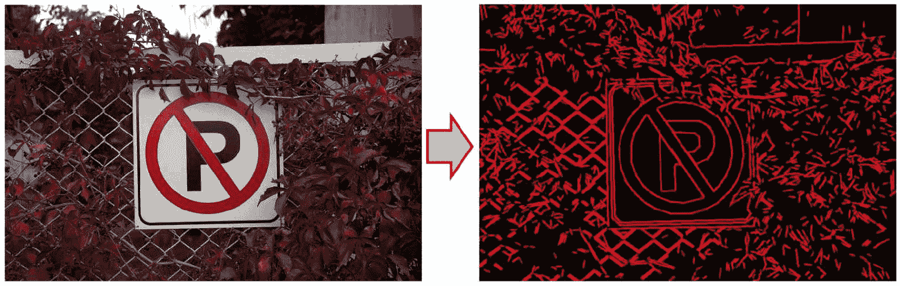

# 目标检测 – 特征和描述符

在上一章中，我们学习了视频处理以及如何将之前章节中的操作和算法应用于从摄像头或视频文件中读取的帧。我们了解到每个视频帧都可以被视为一个单独的图像，因此我们可以轻松地在视频中应用类似于图像的算法，如滤波。在了解了如何使用作用于单个帧的算法处理视频后，我们继续学习需要一系列连续视频帧来执行目标检测、跟踪等操作的视频处理算法。我们学习了如何利用卡尔曼滤波的魔法来提高目标跟踪结果，并以学习背景和前景提取结束本章。

上一章中我们学习到的目标检测（和跟踪）算法在很大程度上依赖于物体的颜色，这已被证明并不太可靠，尤其是如果我们处理的对象和环境在光照方面没有得到控制。我们都知道，在阳光、月光下，或者如果物体附近有不同颜色的光源，如红灯，物体的亮度和颜色可以轻易（有时极其）改变。这些困难是为什么当使用物体的物理形状和特征作为目标检测算法的基础时，物体的检测更加可靠。显然，图像的形状与其颜色无关。一个圆形物体在白天或夜晚都会保持圆形，因此能够提取此类物体形状的算法在检测该物体时将更加可靠。

在本章中，我们将学习如何使用计算机视觉算法、函数和类来检测和识别具有其特征的物体。我们将学习到许多可用于形状提取和分析的算法，然后我们将继续学习关键点检测和描述符提取算法。我们还将学习如何将两个图像中的描述符进行匹配，以检测图像中已知形状的物体。除了我们刚才提到的主题外，本章还将包括用于正确可视化关键点和匹配结果的所需函数。

在本章中，你将学习以下内容：

+   模板匹配用于目标检测

+   检测轮廓并用于形状分析

+   计算和分析轮廓

+   使用霍夫变换提取直线和圆

+   检测、描述和匹配特征

# 技术要求

+   用于开发 C++ 或 Python 应用的集成开发环境 (IDE)

+   OpenCV 库

请参考第二章，《使用 OpenCV 入门》，以获取更多关于如何设置个人电脑并使其准备好使用 OpenCV 库开发计算机视觉应用程序的信息。

您可以使用以下网址下载本章的源代码和示例：

[`github.com/PacktPublishing/Hands-On-Algorithms-for-Computer-Vision/tree/master/Chapter07`](https://github.com/PacktPublishing/Hands-On-Algorithms-for-Computer-Vision/tree/master/Chapter07).

# 对象检测的模板匹配

在我们开始形状分析和特征分析算法之前，我们将学习一种易于使用且功能强大的对象检测方法，称为**模板匹配**。严格来说，这个算法不属于使用任何关于对象形状知识的算法类别，但它使用了一个先前获取的对象模板图像，该图像可以用来提取模板匹配结果，从而识别出已知外观、大小和方向的对象。您可以使用 OpenCV 中的`matchTemplate`函数执行模板匹配操作。以下是一个演示`matchTemplate`函数完整使用的示例：

```py
Mat object = imread("Object.png"); 
Mat objectGr; 
cvtColor(object, objectGr, COLOR_BGR2GRAY); 
Mat scene = imread("Scene.png"); 
Mat sceneGr; 
cvtColor(scene, sceneGr, COLOR_BGR2GRAY); 

TemplateMatchModes method = TM_CCOEFF_NORMED; 

Mat result; 
matchTemplate(sceneGr, objectGr, result, method); 
```

`method`必须是从`TemplateMatchModes`枚举中的一项，可以是以下任何值：

+   `TM_SQDIFF`

+   `TM_SQDIFF_NORMED`

+   `TM_CCORR`

+   `TM_CCORR_NORMED`

+   `TM_CCOEFF`

+   `TM_CCOEFF_NORMED`

关于每种模板匹配方法的详细信息，您可以参考 OpenCV 文档。对于我们的实际示例，以及了解`matchTemplate`函数在实际中的应用，重要的是要注意，每种方法都会产生不同类型的结果，因此需要对结果进行不同的解释，我们将在本节中学习这些内容。在前面的例子中，我们试图通过使用对象图像和场景图像来检测场景中的对象。让我们假设以下图像是我们将使用的对象（左侧）和场景（右侧）：


模板匹配中的一个非常简单的想法是我们正在寻找场景图像右侧的一个点，该点有最高可能性包含左侧的图像，换句话说，就是模板图像。`matchTemplate`函数，根据所使用的方法，将提供一个概率分布。让我们可视化`matchTemplate`函数的结果，以更好地理解这个概念。另一个需要注意的重要事情是，我们只能通过使用以`_NORMED`结尾的任何方法来正确可视化`matchTemplate`函数的结果，这意味着它们包含归一化的结果，否则我们必须使用归一化方法来创建一个包含 OpenCV `imshow`函数可显示范围内的值的输出。以下是实现方法：

```py
normalize(result, result, 0.0, 1.0, NORM_MINMAX, -1); 
```

此函数调用将`result`中的所有值转换为`0.0`和`1.0`的范围，然后可以正确显示。以下是使用`imshow`函数显示的结果图像的外观：


如前所述，`matchTemplate`函数的结果及其解释完全取决于所使用的模板匹配方法。在我们使用`TM_SQDIFF`或`TM_SQDIFF_NORMED`方法进行模板匹配的情况下，我们需要在结果中寻找全局最小点（前一张图中的箭头所示），它最有可能是包含模板图像的点。以下是我们在模板匹配结果中找到全局最小点（以及全局最大点等）的方法：

```py
double minVal, maxVal; 
Point minLoc, maxLoc; 
minMaxLoc(result, &minVal, &maxVal, &minLoc, &maxLoc); 
```

由于模板匹配算法仅与固定大小和方向的物体工作，我们可以假设一个矩形，其左上角等于`minLoc`点，且大小等于模板图像，是我们对象的最佳可能边界矩形。我们可以使用以下示例代码在场景图像上绘制结果，以便更好地比较：

```py
Rect rect(minLoc.x, 
          minLoc.y, 
          object.cols, 
          object.rows); 

Scalar color(0, 0, 255); 
int thickness = 2; 
rectangle(scene, 
          rect, 
          color, 
          thickness);
```

以下图像展示了使用`matchTemplate`函数执行的对象检测操作的结果：


如果我们使用`TM_CCORR`、`TM_CCOEFF`或它们的归一化版本，我们必须使用全局最大点作为包含我们的模板图像可能性最高的点。以下图像展示了使用`matchTemplate`函数的`TM_CCOEFF_NORMED`方法的结果：


如您所见，结果图像中最亮的点对应于场景图像中模板图像的左上角。

在结束我们的模板匹配课程之前，我们也要注意，模板匹配结果的宽度和高度小于场景图像。这是因为模板匹配结果图像只能包含模板图像的左上角，因此从场景图像的宽度和高度中减去模板图像的宽度和高度，以确定模板匹配算法中结果图像的宽度和高度。

# 检测角点和边缘

并非总是可以仅仅通过像素级比较图像并决定一个物体是否存在于图像中，或者一个物体是否具有预期的形状，以及许多我们甚至无法一一列举的类似场景。这就是为什么更智能的方法是寻找图像中的有意义特征，然后根据这些特征的性质进行解释。在计算机视觉中，特征与关键点同义，所以如果我们在这本书中交替使用它们，请不要感到惊讶。实际上，关键词汇更适合描述这个概念，因为图像中最常用的特征通常是图像中的*关键点*，在这些点上颜色强度发生突然变化，这可能在图像中形状和物体的角点和边缘处发生。

在本节中，我们将了解一些最重要且最广泛使用的特征点检测算法，即角点和边缘检测算法，这些算法是我们在本章中将学习的几乎所有基于特征的物体检测算法的基础。

# 学习 Harris 角点检测算法

最著名的角点和边缘检测算法之一是 Harris 角点检测算法，该算法在 OpenCV 的`cornerHarris`函数中实现。以下是该函数的使用方法：

```py
Mat image = imread("Test.png"); 
cvtColor(image, image, COLOR_BGR2GRAY); 

Mat result; 
int blockSize = 2; 
int ksize = 3; 
double k = 1.0; 
cornerHarris(image, 
             result, 
             blockSize, 
             ksize, 
             k);
```

`blockSize`决定了 Harris 角点检测算法将计算 2 x 2 梯度协方差矩阵的正方形块的宽度和高度。`ksize`是 Harris 算法内部使用的 Sobel 算子的核大小。前一个示例演示了最常用的 Harris 算法参数集之一，但有关 Harris 角点检测算法及其内部数学的更详细信息，您可以参考 OpenCV 文档。需要注意的是，前一个示例代码中的`result`对象除非使用以下示例代码进行归一化，否则是不可显示的：

```py
normalize(result, result, 0.0, 1.0, NORM_MINMAX, -1); 
```

这里是前一个示例中 Harris 角点检测算法的结果，当使用 OpenCV 的`imshow`函数进行归一化和显示时：


OpenCV 库还包括另一个著名的角点检测算法，称为**Good Features to Track**（**GFTT**）。您可以使用 OpenCV 中的`goodFeaturesToTrack`函数来使用 GFTT 算法检测角点，如下面的示例所示：

```py
Mat image = imread("Test.png"); 
Mat imgGray; 
cvtColor(image, imgGray, COLOR_BGR2GRAY); 

vector<Point2f> corners; 
int maxCorners = 500; 
double qualityLevel = 0.01; 
double minDistance = 10; 
Mat mask; 
int blockSize = 3; 
int gradientSize = 3; 
bool useHarrisDetector = false; 
double k = 0.04; 
goodFeaturesToTrack(imgGray, 
                    corners, 
                    maxCorners, 
                    qualityLevel, 
                    minDistance, 
                    mask, 
                    blockSize, 
                    gradientSize, 
                    useHarrisDetector, 
                    k); 
```

如你所见，这个函数需要一个单通道图像，因此，在执行任何其他操作之前，我们已经将我们的 BGR 图像转换为灰度图。此外，这个函数使用`maxCorners`值来根据它们作为候选者的强度限制检测到的角点的数量，将`maxCorners`设置为负值或零意味着应返回所有检测到的角点，如果你在寻找图像中的最佳角点，这不是一个好主意，所以请确保根据你将使用它的环境设置一个合理的值。`qualityLevel`是接受检测到的角点的内部阈值值。`minDistance`是返回角点之间允许的最小距离。这是另一个完全依赖于该算法将用于的环境的参数。你已经在上一章和前一章的先前算法中看到了剩余的参数。重要的是要注意，此函数还结合了 Harris 角点检测算法，因此，通过将`useHarrisDetector`设置为`true`，结果特征将使用 Harris 角点检测算法计算。

你可能已经注意到，`goodFeaturesToTrack`函数返回一组`Point`对象（确切地说是`Point2f`对象）而不是`Mat`对象。返回的`corners`向量仅包含使用 GFTT 算法在图像中检测到的最佳可能角点，因此我们可以使用`drawMarker`函数来正确地可视化结果，如下面的例子所示：

```py
Scalar color(0, 0, 255); 
MarkerTypes markerType = MARKER_TILTED_CROSS; 
int markerSize = 8; 
int thickness = 2; 
for(int i=0; i<corners.size(); i++) 
{ 
    drawMarker(image, 
               corners[i], 
               color, 
               markerType, 
               markerSize, 
               thickness); 
}
```

这是前面例子中使用`goodFeaturesToTrack`函数检测角点得到的结果：


你也可以使用`GFTTDetector`类以与`goodFeaturesToTrack`函数类似的方式检测角点。这里的区别在于返回的类型是`KeyPoint`对象的向量。许多 OpenCV 函数和类使用`KeyPoint`类来返回检测到的关键点的各种属性，而不是仅对应于关键点位置的`Point`对象。让我们通过以下内容来看看这意味着什么：

```py
Ptr<GFTTDetector> detector =  
    GFTTDetector::create(maxCorners, 
                         qualityLevel, 
                         minDistance, 
                         blockSize, 
                         gradientSize, 
                         useHarrisDetector, 
                         k); 

vector<KeyPoint> keypoints; 
detector->detect(image, keypoints); 
```

传递给`GFTTDetector::create`函数的参数与我们使用`goodFeaturesToTrack`函数时使用的参数没有不同。你也可以省略所有给定的参数，只需简单地写下以下内容即可使用所有参数的默认和最佳值：

```py
Ptr<GFTTDetector> detector = GFTTDetector::create();
```

但让我们回到之前的例子中的`KeyPoint`类和`detect`函数的结果。回想一下，我们使用循环遍历所有检测到的点并在图像上绘制它们。如果我们使用`GFTTDetector`类，则不需要这样做，因为我们可以使用现有的 OpenCV 函数`drawKeypoints`来正确地可视化所有检测到的关键点。以下是这个函数的使用方法：

```py
Mat outImg; 
drawKeypoints(image, 
              keypoints, 
              outImg); 
```

`drawKeypoints` 函数遍历 `keypoints` 向量中的所有 `KeyPoint` 对象，并在 `image` 上使用随机颜色绘制它们，然后将结果保存到 `outImg` 对象中，我们可以通过调用 `imshow` 函数来显示它。以下图像是使用前面示例代码调用 `drawKeypoints` 函数的结果：


如果我们想使用特定颜色而不是随机颜色，可以为 `drawKeypoints` 函数提供一个额外的（可选的）颜色参数。此外，我们还可以提供一个标志参数，用于进一步增强检测到的关键点的可视化结果。例如，如果标志设置为 `DRAW_RICH_KEYPOINTS`，则 `drawKeypoints` 函数还将使用每个检测到的关键点中的大小和方向值来可视化更多关键点属性。

每个 `KeyPoint` 对象可能包含以下属性，具体取决于用于计算它的算法：

- `pt`：一个包含关键点坐标的 `Point2f` 对象。

- `size`：有意义的关键点邻域的直径。

- `angle`：关键点的方向，以度为单位，如果不适用则为 -1。

- `response`：由算法确定的关键点强度。

- `octave`：从其中提取关键点的八度或金字塔层。使用八度可以让我们处理来自同一图像但在不同尺度上的关键点。通常设置此值的算法需要输入八度参数，该参数用于定义用于提取关键点的图像的八度（或尺度）数。

- `class_id`：这个整数参数可以用来分组关键点，例如，当关键点属于单个对象时，它们可以具有相同的可选 `class_id` 值。

除了 Harris 和 GFTT 算法之外，您还可以使用 `FastFeatureDetector` 类的 FAST 角点检测算法，以及 `AgastFeatureDetector` 类的 AGAST 角点检测算法（**基于加速段测试的自适应和通用角点检测**），这与我们使用 `GFTTDetector` 类的方式非常相似。重要的是要注意，所有这些类都属于 OpenCV 库中的 `features2d` 模块，并且它们都是 `Feature2D` 类的子类，因此它们都包含一个静态的 `create` 函数，用于创建它们对应类的实例，以及一个 `detect` 函数，可以用来从图像中提取关键点。

下面是一个使用所有默认参数的 `FastFeatureDetector` 的示例代码：

```py
int threshold = 10; 
bool nonmaxSuppr = true; 
int type = FastFeatureDetector::TYPE_9_16; 
Ptr<FastFeatureDetector> fast = 
        FastFeatureDetector::create(threshold, 
                                    nonmaxSuppr, 
                                    type); 

vector<KeyPoint> keypoints; 
fast->detect(image, keypoints);
```

如果检测到太多的角点，请尝试增加 `threshold` 值。同时，请确保查看 OpenCV 文档以获取有关 `FastFeatureDetector` 类中使用的 `type` 参数的更多信息。如前所述，您可以直接省略前面示例代码中的所有参数，以使用所有参数的默认值。

使用 `AgastFeatureDetector` 类与使用 `FastFeatureDetector` 非常相似。以下是一个示例：

```py
int threshold = 10; 
bool nonmaxSuppr = true; 
int type = AgastFeatureDetector::OAST_9_16; 
Ptr<AgastFeatureDetector> agast = 
        AgastFeatureDetector::create(threshold, 
                                     nonmaxSuppr, 
                                     type); 

vector<KeyPoint> keypoints; 
agast->detect(image, keypoints); 
```

在继续学习边缘检测算法之前，值得注意的是 OpenCV 还包含 `AGAST` 和 `FAST` 函数，可以直接使用它们对应的算法，避免处理创建实例来使用它们；然而，使用这些算法的类实现具有使用多态在算法之间切换的巨大优势。以下是一个简单的示例，演示了我们可以如何使用多态从角点检测算法的类实现中受益：

```py
Ptr<Feature2D> detector; 
switch (algorithm) 
{ 

case 1: 
    detector = GFTTDetector::create(); 
    break; 

case 2: 
    detector = FastFeatureDetector::create(); 
    break; 

case 3: 
    detector = AgastFeatureDetector::create(); 
    break; 

default: 
    cout << "Wrong algorithm!" << endl; 
    return 0; 

} 

vector<KeyPoint> keypoints; 
detector->detect(image, keypoints); 
```

在前面的示例中，`algorithm` 是一个可以在运行时设置的整数值，它将改变分配给 `detector` 对象的角点检测算法的类型，该对象具有 `Feature2D` 类型，换句话说，是所有角点检测算法的基类。

# 边缘检测算法

既然我们已经了解了角点检测算法，让我们来看看边缘检测算法，这在计算机视觉中的形状分析中至关重要。OpenCV 包含了许多可以用于从图像中提取边缘的算法。我们将要学习的第一个边缘检测算法被称为 **线段检测算法**，可以通过使用 `LineSegmentDetector` 类来实现，如下面的示例所示：

```py
Mat image = imread("Test.png"); 
Mat imgGray; 
cvtColor(image, imgGray, COLOR_BGR2GRAY); 

Ptr<LineSegmentDetector> detector = createLineSegmentDetector(); 

vector<Vec4f> lines; 
detector->detect(imgGray, 
                 lines); 
```

如您所见，`LineSegmentDetector` 类需要一个单通道图像作为输入，并生成一个 `vector` 的线条。结果中的每条线都是 `Vec4f`，即代表 *x1*、*y1*、*x2* 和 *y2* 值的四个浮点数，换句话说，就是构成每条线的两个点的坐标。您可以使用 `drawSegments` 函数来可视化 `LineSegmentDetector` 类的 `detect` 函数的结果，如下面的示例所示：

```py
Mat result(image.size(), 
           CV_8UC3, 
           Scalar(0, 0, 0)); 

detector->drawSegments(result, 
                       lines); 
```

为了更好地控制结果线条的可视化，您可能需要手动绘制线条向量，如下面的示例所示：

```py
Mat result(image.size(), 
           CV_8UC3, 
           Scalar(0, 0, 0)); 

Scalar color(0,0,255); 
int thickness = 2; 
for(int i=0; i<lines.size(); i++) 
{ 
    line(result, 
         Point(lines.at(i)[0], 
            lines.at(i)[1]), 
         Point(lines.at(i)[2], 
            lines.at(i)[3]), 
         color, 
         thickness); 
} 
```

以下图像展示了前面示例代码中使用的线段检测算法的结果：



如需了解更多关于如何自定义 `LineSegmentDetector` 类的行为的详细信息，请确保查看 `createLineSegmentDetector` 的文档及其参数。在我们的示例中，我们简单地省略了所有输入参数，并使用默认值设置了 `LineSegmentDetector` 类的参数。

`LineSegmentDetector` 类的另一个功能是比较两组线条以找到非重叠像素的数量，同时将比较结果绘制在输出图像上以进行可视化比较。以下是一个示例：

```py
vector<Vec4f> lines1, lines2; 
detector->detect(imgGray1, 
                 lines1); 

detector->detect(imgGray2, 
                 lines2); 

Mat resultImg(imageSize, CV_8UC3, Scalar::all(0)); 
int result = detector->compareSegments(imageSize, 
                                       lines1, 
                                       lines2, 
                                       resultImg); 
```

在前面的代码中，`imageSize` 是一个 `Size` 对象，它包含从其中提取线条的输入图像的大小。结果是包含比较函数或 `compareSegments` 函数结果的整数值，在像素完全重叠的情况下将为零。

下一个边缘检测算法可能是计算机视觉中最广泛使用和引用的边缘检测算法之一，称为 **Canny 算法**，在 OpenCV 中具有相同名称的函数。`Canny` 函数的最大优点是其输入参数的简单性。让我们首先看看它的一个示例用法，然后详细说明其细节：

```py
Mat image = imread("Test.png"); 

double threshold1 = 100.0; 
double threshold2 = 200.0; 
int apertureSize = 3; 
bool L2gradient = false; 
Mat edges; 
Canny(image, 
      edges, 
      threshold1, 
      threshold2, 
      apertureSize, 
      L2gradient); 
```

阈值值（`threshold1` 和 `threshold2`）是用于阈值化输入图像的下限和上限值。`apertureSize` 是内部 Sobel 运算符的孔径大小，而 `L2gradient` 用于在计算梯度图像时启用或禁用更精确的 L2 范数。`Canny` 函数的结果是一个灰度图像，其中包含检测到边缘处的白色像素和其余像素的黑色像素。这使得 `Canny` 函数的结果在需要此类掩模的地方非常适合，或者，如你稍后所看到的，提取轮廓的合适点集。

以下图像描述了前面示例中使用的 `Canny` 函数的结果：


如我们之前提到的，`Canny` 函数的结果适合用作需要二值图像的算法的输入，换句话说，是一个只包含绝对黑色和绝对白色像素值的灰度图像。我们将学习下一个算法，其中必须使用先前 `Canny` 函数的结果作为输入，它被称为 **霍夫变换**。霍夫变换可以用于从图像中提取线条，并在 OpenCV 库中的 `HoughLines` 函数中实现。

下面是一个完整的示例，展示了如何在实际中使用 `HoughLines` 函数：

1.  调用 `Canny` 函数检测输入图像中的边缘，如下所示：

```py
Mat image = imread("Test.png"); 

double threshold1 = 100.0; 
double threshold2 = 200.0; 
int apertureSize = 3; 
bool L2gradient = false; 
Mat edges; 
Canny(image, 
      edges, 
      threshold1, 
      threshold2, 
      apertureSize, 
      L2gradient); 
```

1.  调用 `HoughLines` 函数从检测到的边缘中提取线条：

```py
vector<Vec2f> lines; 
double rho = 1.0; // 1 pixel, r resolution 
double theta = CV_PI / 180.0; // 1 degree, theta resolution 
int threshold = 100; // minimum number of intersections to "detect" a line 
HoughLines(edges, 
           lines, 
           rho, 
           theta, 
           threshold); 
```

1.  使用以下代码在标准坐标系中提取点，并在输入图像上绘制它们：

```py
Scalar color(0,0,255); 
int thickness = 2; 
for(int i=0; i<lines.size(); i++) 
{ 
    float rho = lines.at(i)[0]; 
    float theta = lines.at(i)[1]; 
    Point pt1, pt2; 
    double a = cos(theta); 
    double b = sin(theta); 
    double x0 = a*rho; 
    double y0 = b*rho; 
    pt1.x = int(x0 + 1000*(-b)); 
    pt1.y = int(y0 + 1000*(a)); 
    pt2.x = int(x0 - 1000*(-b)); 
    pt2.y = int(y0 - 1000*(a)); 
    line( image, pt1, pt2, color, thickness); 
} 
```

以下图像从左到右描述了前面示例的结果，首先是原始图像，然后是使用 `Canny` 函数检测到的边缘，接着是使用 `HoughLines` 函数检测到的线条，最后是输出图像：


为了避免处理坐标系统变化，你可以使用 `HoughLinesP` 函数直接提取形成每个检测到的线条的点。以下是一个示例：

```py
vector<Vec4f> lines; 
double rho = 1.0; // 1 pixel, r resolution 
double theta = CV_PI / 180.0; // 1 degree, theta resolution 
int threshold = 100; // minimum number of intersections to "detect" a line 
HoughLinesP(edges, 
            lines, 
            rho, 
            theta, 
            threshold); 

Scalar color(0,0,255); 
int thickness = 2; 
for(int i=0; i<lines.size(); i++) 
{ 
    line(image, 
         Point(lines.at(i)[0], 
            lines.at(i)[1]), 
         Point(lines.at(i)[2], 
            lines.at(i)[3]), 
         color, 
         thickness); 
} 
```

Hough 变换非常强大，OpenCV 包含更多 Hough 变换算法的变体，我们将留给您使用 OpenCV 文档和在线资源去发现。请注意，使用 Canny 算法是 Hough 变换的前提，正如您将在下一节中看到的，也是处理图像中物体形状的许多算法的前提。

# 轮廓计算和分析

图像中形状和物体的轮廓是一个重要的视觉属性，可以用来描述和分析它们。计算机视觉也不例外，因此计算机视觉中有相当多的算法可以用来计算图像中物体的轮廓或计算它们的面积等。

以下图像展示了从两个 3D 物体中提取的两个轮廓：


OpenCV 包含一个名为 `findContours` 的函数，可以用来从图像中提取轮廓。此函数必须提供一个合适的二值图像，其中包含轮廓的最佳候选像素；例如，`Canny` 函数的结果是一个不错的选择。以下示例演示了计算图像轮廓所需的步骤：

1.  使用 `Canny` 函数找到边缘，如下所示：

```py
Mat image = imread("Test.png"); 
Mat imgGray; 
cvtColor(image, imgGray, COLOR_BGR2GRAY); 

double threshold1 = 100.0; 
double threshold2 = 200.0; 
int apertureSize = 3; 
bool L2gradient = false; 
Mat edges; 
Canny(image, 
      edges, 
      threshold1, 
      threshold2, 
      apertureSize, 
      L2gradient); 
```

1.  使用 `findContours` 函数通过检测到的边缘来计算轮廓。值得注意的是，每个轮廓都是一个 `Point` 对象的 `vector`，因此所有轮廓都是一个 `vector` 的 `vector` 的 `Point` 对象，如下所示：

```py
vector<vector<Point> > contours; 
int mode = CV_RETR_TREE; 
int method = CV_CHAIN_APPROX_TC89_KCOS; 
findContours(edges, 
             contours, 
             mode, 
             method);
```

在前面的例子中，轮廓检索模式设置为 `CV_RETR_TREE`，轮廓近似方法设置为 `CV_CHAIN_APPROX_TC89_KCOS`。请确保自己查看所有可能的模式和方法的列表，并比较结果以找到最适合您用例的最佳参数。

1.  可视化检测到的轮廓的常见方法是通过使用 `RNG` 类，即随机数生成器类，为每个检测到的轮廓生成随机颜色。以下示例演示了如何结合使用 `RNG` 类和 `drawContours` 函数来正确可视化 `findContours` 函数的结果：

```py
RNG rng(12345); // any random number 

Mat result(edges.size(), CV_8UC3, Scalar(0)); 
int thickness = 2; 
for( int i = 0; i< contours.size(); i++ ) 
{ 
    Scalar color = Scalar(rng.uniform(0, 255), 
                          rng.uniform(0,255), 
                          rng.uniform(0,255) ); 

    drawContours(result, 
                 contours, 
                 i, 
                 color, 
                 thickness); 
} 
```

以下图像展示了 `Canny` 和 `findContours` 函数的结果：


注意右侧图像中的不同颜色，它们对应于使用 `findContours` 函数检测到的完整轮廓。

计算轮廓之后，我们可以使用轮廓分析函数进一步修改它们或分析图像中物体的形状。让我们从 `contourArea` 函数开始，该函数可以用来计算给定轮廓的面积。以下是该函数的使用方法：

```py
double area = contourArea(contour); 
```

你可以使用面积作为阈值来忽略不符合某些标准的检测到的轮廓。例如，在前面的示例代码中，我们使用了`drawContours`函数，我们可以去除面积小于某个预定义阈值值的轮廓。以下是一个示例：

```py
for( int i = 0; i< contours.size(); i++ ) 
{ 
    if(contourArea(contours[i]) > thresholdArea) 
    { 
        drawContours(result, 
                     contours, 
                     i, 
                     color, 
                     thickness); 
    } 
} 
```

将`contourArea`函数的第二个参数（这是一个布尔参数）设置为`true`会导致考虑轮廓的朝向，这意味着你可以根据轮廓的朝向得到正或负的面积值。

另一个非常有用的轮廓分析函数是`pointPolygonTest`函数。从其名称可以猜到，这个函数用于执行点在多边形内测试，换句话说，就是点在轮廓内测试。以下是该函数的使用方法：

```py
Point pt(x, y); 
double result = pointPolygonTest(contours[i], Point(x,y), true); 
```

如果结果是零，这意味着测试点正好在轮廓的边缘上。一个负的结果意味着测试点在轮廓外部，而一个正的结果意味着测试点在轮廓内部。这个值本身是测试点到最近的轮廓边缘的距离。

要检查一个轮廓是否是凸的，你可以使用`isContourConvex`函数，如下例所示：

```py
bool isIt = isContourConvex(contour);
```

能够比较两个轮廓是处理轮廓和形状分析时最基本的需求之一。你可以使用 OpenCV 中的`matchShapes`函数来比较并尝试匹配两个轮廓。以下是该函数的使用方法：

```py
ShapeMatchModes method = CONTOURS_MATCH_I1; 
double result = matchShapes(cntr1, cntr2, method, 0); 
```

`method`可以取以下任何值，而最后一个参数必须始终设置为零，除非使用的方法有特殊指定：

+   `CONTOURS_MATCH_I1`

+   `CONTOURS_MATCH_I2`

+   `CONTOURS_MATCH_I3`

关于前面列出的轮廓匹配方法之间的数学差异的详细信息，你可以参考 OpenCV 文档。

能够找到轮廓的边界等同于能够正确地定位它，例如，找到一个可以用于跟踪或执行其他计算机视觉算法的区域。假设我们有一个以下图像及其使用`findContours`函数检测到的单个轮廓：


有了这个轮廓，我们可以执行我们所学到的任何轮廓和形状分析算法。此外，我们可以使用许多 OpenCV 函数来定位提取的轮廓。让我们从`boundingRect`函数开始，该函数用于找到包含给定点集或轮廓的最小直立矩形（`Rect`对象）。以下是该函数的使用方法：

```py
Rect br = boundingRect(contour);
```

下图是使用前一个示例代码中的`boundingRect`函数获取的直立矩形的绘制结果：


类似地，你可以使用`minAreaRect`函数来找到包含给定点集或轮廓的最小旋转矩形。以下是一个示例：

```py
RotatedRect br = minAreaRect(contour); 
```

你可以使用以下代码来可视化结果旋转矩形：

```py
Point2f points[4]; 
br.points(points); 
for (int i=0; i<4; i++) 
    line(image, 
         points[i], 
         points[(i+1)%4], 
         Scalar(0,0,255), 
         2); 
```

您可以使用`ellipse`函数绘制椭圆，或者两者都做，结果将类似于以下内容：


除了用于寻找轮廓的最小垂直和旋转边界矩形的算法外，您还可以使用`minEnclosingCircle`和`minEnclosingTriangle`函数来找到给定点集或轮廓的最小边界圆和矩形。以下是如何使用这些函数的示例：

```py
// to detect the minimal bounding circle 
Point2f center; 
float radius; 
minEnclosingCircle(contour, center, radius); 

// to detect the minimal bounding triangle 
vector<Point2f> triangle; 
minEnclosingTriangle(contour, triangle); 
```

轮廓的可能用例清单没有尽头，但在进入下一部分之前，我们将列举其中的一些。您可以尝试将轮廓检测和形状分析算法与阈值算法或后投影图像结合使用，例如，以确保您的跟踪算法除了像素的颜色和强度值外，还使用形状信息。您还可以使用轮廓来计数和分析生产线上的物体形状，在那里背景和视觉环境更加可控。

本章的最后部分将教授您如何使用特征检测、描述符提取和描述符匹配算法来检测已知对象，但具有旋转、缩放甚至透视不变性。

# 检测、描述和匹配特征

正如我们在本章前面学到的，可以使用各种特征提取（检测）算法从图像中提取特征或关键点，其中大多数依赖于检测强度发生显著变化的点，例如角点。检测正确的关键点等同于能够正确确定哪些图像部分有助于识别它。但仅仅一个关键点，或者说图像中一个显著点的位置，本身并没有什么用处。有人可能会争辩说，图像中关键点位置的集合就足够了，但即便如此，另一个外观完全不同的物体也可能在图像中具有相同位置的关键点，比如说，偶然之间。

这就是特征描述符，或者简单地称为描述符，发挥作用的地方。从名称中你可以猜到，描述符是一种算法依赖的方法，用于描述一个特征，例如，通过使用其相邻像素值、梯度等。有许多不同的描述符提取算法，每个都有自己的优缺点，逐一研究它们并不会带来太多成果，尤其是对于一本实践性书籍来说，但值得注意的是，大多数算法只是从一组关键点中生成一个描述符向量。从一组关键点中提取了一组描述符后，我们可以使用描述符匹配算法来从两张不同的图像中找到匹配的特征，例如，一个物体的图像和该物体存在的场景图像。

OpenCV 包含大量的特征检测器、描述符提取器和描述符匹配器。OpenCV 中所有的特征检测器和描述符提取器算法都是`Feature2D`类的子类，它们位于`features2d`模块中，该模块默认包含在 OpenCV 包中，或者位于`xfeatures2d`（额外模块）模块中。您应谨慎使用这些算法，并始终参考 OpenCV 文档，因为其中一些实际上是受专利保护的，并且在使用商业项目时需要从其所有者处获得许可。以下是 OpenCV 默认包含的一些主要特征检测器和描述符提取器算法列表：

+   **BRISK**（**二值鲁棒可伸缩关键点**）

+   **KAZE**

+   **AKAZE**（**加速 KAZE**）

+   **ORB**，或**方向 BRIEF**（**二值鲁棒独立基本特征**）

所有这些算法都在 OpenCV 中实现了与标题完全相同的类，再次强调，它们都是`Feature2D`类的子类。它们的使用非常简单，尤其是在没有修改任何参数的情况下。在所有这些算法中，您只需使用静态`create`方法来创建其实例，调用`detect`方法来检测关键点，最后调用`computer`来提取检测到的关键点的描述符。

对于描述符匹配算法，OpenCV 默认包含以下匹配算法：

+   `FLANNBASED`

+   `BRUTEFORCE`

+   `BRUTEFORCE_L1`

+   `BRUTEFORCE_HAMMING`

+   `BRUTEFORCE_HAMMINGLUT`

+   `BRUTEFORCE_SL2`

您可以使用`DescriptorMatcher`类，或其子类，即`BFMatcher`和`FlannBasedMatcher`，来执行各种匹配算法。您只需使用这些类的静态`create`方法来创建其实例，然后使用`match`方法来匹配两组描述符。

让我们通过一个完整的示例来回顾本节中讨论的所有内容，因为将特征检测、描述符提取和匹配分开是不可能的，它们都是一系列过程的一部分，这些过程导致在场景中检测到具有其特征的对象：

1.  使用以下代码读取对象的图像，以及将要搜索对象的场景：

```py
Mat object = imread("object.png"); 
Mat scene = imread("Scene.png"); 
```

在以下图片中，假设左边的图像是我们正在寻找的对象，右边的图像是包含该对象的场景：


1.  从这两张图像中提取关键点，现在它们存储在`object`和`scene`中。我们可以使用上述任何一种算法进行特征检测，但让我们假设我们在这个例子中使用 KAZE，如下所示：

```py
Ptr<KAZE> detector = KAZE::create(); 
vector<KeyPoint> objKPs, scnKPs; 
detector->detect(object, objKPs); 
detector->detect(scene, scnKPs); 
```

1.  我们有了对象图像和场景图像的关键点。我们可以继续使用`drawKeypoints`函数来查看它们，就像我们在本章中之前学到的。自己尝试一下，然后使用相同的`KAZE`类从关键点中提取描述符。以下是操作方法：

```py
Mat objDesc, scnDesc; 
detector->compute(object, objKPs, objDesc); 
detector->compute(scene, scnKPs, scnDesc); 
```

1.  `objDesc`和`scnDesc`对应于从物体和场景图像中提取的关键点的描述符。如前所述，描述符是算法相关的，要解释它们中的确切值需要深入了解用于提取它们的特定算法。确保参考 OpenCV 文档以获取更多关于它们的知识，然而，在本步骤中，我们将简单地使用穷举匹配器算法来匹配从两张图像中提取的描述符。以下是操作方法：

```py
Ptr<BFMatcher> matcher = BFMatcher::create(); 
vector<DMatch> matches; 
matcher->match(objDesc, scnDesc, matches); 
```

`BFMatcher`类是`DescriptorMatcher`类的子类，实现了穷举匹配算法。描述符匹配的结果存储在一个`DMatch`对象`vector`中。每个`DMatch`对象包含匹配特征所需的所有必要信息，从物体描述符到场景描述符。

1.  您现在可以尝试使用`drawMatches`函数可视化匹配结果，如下所示：

```py
Mat result; 
drawMatches(object, 
            objKPs, 
            scene, 
            scnKPs, 
            matches, 
            result, 
            Scalar(0, 255, 0), // green for matched 
            Scalar::all(-1), // unmatched color (not used) 
            vector<char>(), // empty mask 
            DrawMatchesFlags::NOT_DRAW_SINGLE_POINTS); 
```

如您所见，一些匹配的特征显然是不正确的，一些位于场景图像的顶部，还有一些位于底部：


1.  可以通过在`DMatch`对象的`distance`值上设置阈值来过滤掉不良匹配。阈值取决于算法和图像内容类型，但在我们的示例案例中，使用 KAZE 算法，`0.1`的值似乎对我们来说足够了。以下是过滤阈值以从所有匹配中获取良好匹配的方法：

```py
vector<DMatch> goodMatches; 
double thresh = 0.1; 
for(int i=0; i<objDesc.rows; i++) 
{ 
    if(matches[i].distance < thresh) 
        goodMatches.push_back(matches[i]); 
} 

if(goodMatches.size() > 0) 
{ 
    cout << "Found " << goodMatches.size() << " good matches."; 
} 
else 
{ 
    cout << "Didn't find a single good match. Quitting!"; 
    return -1; 
} 
```

以下图像展示了在`goodMatches`向量上`drawMatches`函数的结果：


1.  显然，经过过滤的匹配结果现在要好得多。我们可以使用`findHomography`函数来找到物体图像到场景图像之间良好的匹配关键点的变换。以下是操作方法：

```py
vector<Point2f> goodP1, goodP2; 
for(int i=0; i<goodMatches.size(); i++) 
{ 
    goodP1.push_back(objKPs[goodMatches[i].queryIdx].pt); 
    goodP2.push_back(scnKPs[goodMatches[i].trainIdx].pt); 
} 
Mat homoChange = findHomography(goodP1, goodP2); 
```

1.  正如我们在前面的章节中已经看到的，`findHomography`函数的结果可以用来变换一组点。我们可以利用这个事实，使用物体图像的四个角来创建四个点，然后使用`perspectiveTransform`函数变换这些点，以获取场景图像中这些点的位置。以下是一个示例：

```py
vector<Point2f> corners1(4), corners2(4); 
corners1[0] = Point2f(0,0); 
corners1[1] = Point2f(object.cols-1, 0); 
corners1[2] = Point2f(object.cols-1, object.rows-1); 
corners1[3] = Point2f(0, object.rows-1); 
perspectiveTransform(corners1, corners2, homoChange);
```

1.  变换后的点可以用来绘制四条线，以定位场景图像中检测到的物体，如下所示：

```py
line(result, corners2[0], corners2[1], Scalar::all(255), 2); 
line(result, corners2[1], corners2[2], Scalar::all(255), 2); 
line(result, corners2[2], corners2[3], Scalar::all(255), 2); 
line(result, corners2[3], corners2[0], Scalar::all(255), 2); 
```

如果您打算在`drawMatches`图像结果上绘制定位物体的四条线，那么也很重要的是要更改结果点的*x*值，以考虑物体图像的宽度。以下是一个示例：

```py
for(int i=0; i<4; i++) 
    corners2[i].x += object.cols; 
```

以下图像展示了我们检测操作的最终结果：


确保亲自尝试其余的特征检测、描述符提取和匹配算法，并比较它们的结果。同时，尝试测量每个算法的计算时间。例如，你可能注意到 AKAZE 比 KAZE 快得多，或者 BRISK 更适合某些图像，而 KAZE 或 ORB 则更适合其他图像。如前所述，基于特征的目标检测方法在尺度、旋转甚至透视变化方面更加可靠。尝试不同视角的同一物体，以确定你自己的项目和用例的最佳参数和算法。例如，这里有一个演示 AKAZE 算法的旋转和尺度不变性的另一个示例，以及暴力匹配：


注意，生成前面输出的源代码是使用本节中我们讨论的完全相同的指令集创建的。

# 概述

我们从学习模板匹配算法和目标检测算法开始这一章，尽管它很受欢迎，但它缺乏一些适当目标检测算法的最基本方面，如尺度和旋转不变性；此外，它是一个纯像素级目标检测算法。在此基础上，我们学习了如何使用全局最大值和最小值检测算法来解释模板匹配算法的结果。然后，我们学习了关于角点和边缘检测算法，或者换句话说，检测图像中点和重要区域的算法。我们学习了如何可视化它们，然后转向学习轮廓检测和形状分析算法。本章的最后部分包括了一个完整的教程，介绍如何在图像中检测关键点，从这些关键点中提取描述符，并使用匹配器算法在场景中检测目标。我们现在熟悉了一整套算法，可以用来分析图像，不仅基于它们的像素颜色和强度值，还基于它们的内容和现有的关键点。

本书最后一章将带我们了解 OpenCV 中的计算机视觉和机器学习算法，以及它们如何被用于检测使用先前存在的一组图像来检测对象，以及其他许多有趣的人工智能相关主题。

# 问题

1.  模板匹配算法本身不具有尺度和旋转不变性。我们如何使其对于以下情况成立？a) 模板图像的尺度加倍，b) 模板图像旋转 90 度？

1.  使用`GFTTDetector`类通过 Harris 角点检测算法检测关键点。你可以为角点检测算法设置任何值。

1.  Hough 变换也可以用于检测图像中的圆，使用`HoughCircles`函数。在 OpenCV 文档中搜索它，并编写一个程序来检测图像中的圆。

1.  在图像中检测并绘制凸轮廓。

1.  使用`ORB`类在两张图像中检测关键点，提取它们的描述符，并将它们进行匹配。

1.  哪种特征描述符匹配算法与 ORB 算法不兼容，以及原因是什么？

1.  您可以使用以下 OpenCV 函数和提供的示例来计算执行任意多行代码所需的时间。用它来计算您计算机上匹配算法所需的时间：

```py
double freq = getTickFrequency(); 
double countBefore = getTickCount(); 

// your code goes here .. 

double countAfter = getTickCount(); 
cout << "Duration: " << 
          (countAfter - countBefore) / freq << " seconds"; 
```
