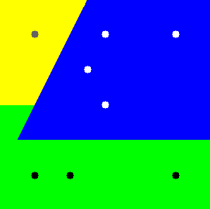
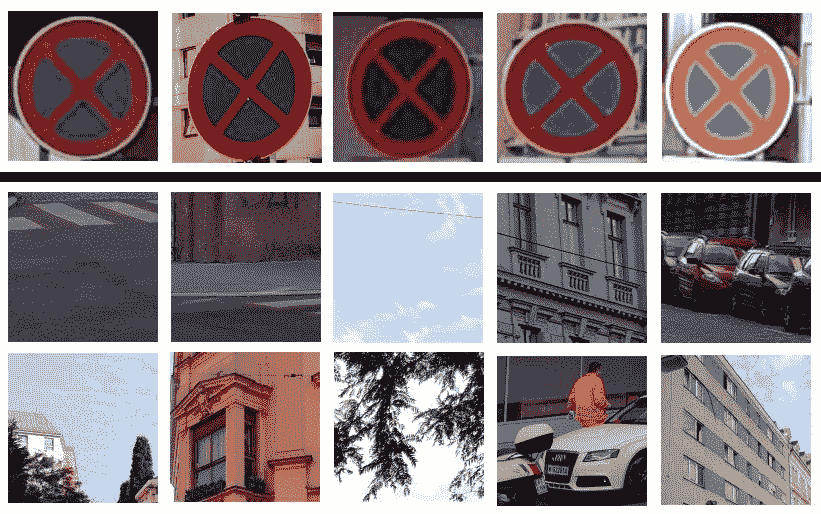
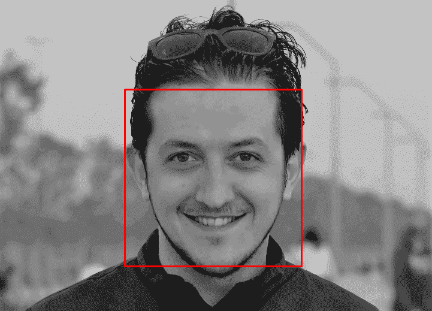
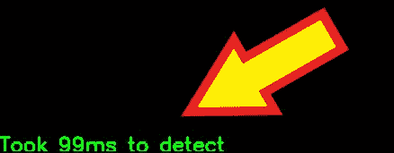
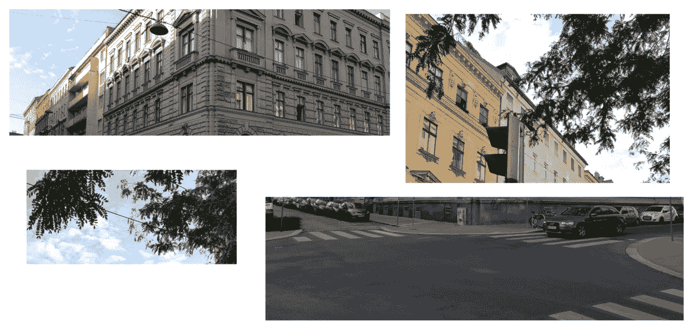
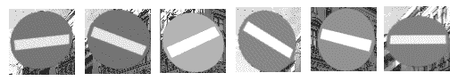
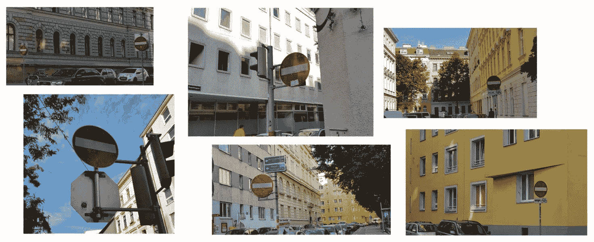
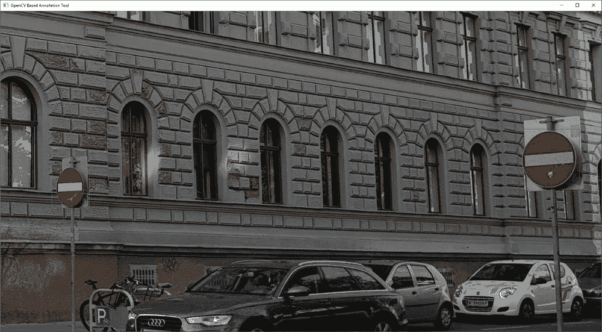
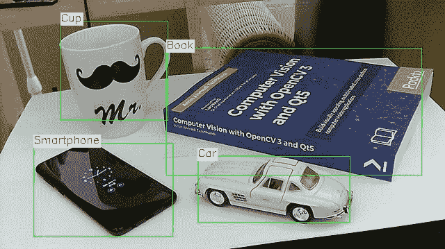

# 计算机视觉中的机器学习

在前面的章节中，我们学习了关于目标检测和跟踪的许多算法。我们学习了如何结合直方图和反向投影图像使用基于颜色的算法，如均值漂移和 CAM 漂移，以极快的速度在图像中定位目标。我们还学习了模板匹配及其如何用于在图像中找到具有已知像素模板的对象。所有这些算法都以某种方式依赖于图像属性，如亮度或颜色，这些属性很容易受到环境光照变化的影响。基于这些事实，我们继续学习基于图像中显著区域知识的算法，称为**关键点**或**特征**。我们学习了关于边缘和关键点检测算法以及如何提取这些关键点的描述符。我们还学习了描述符匹配器以及如何使用从感兴趣对象图像和搜索该对象的场景中提取的描述符的良好匹配来检测图像中的对象。

在本章中，我们将迈出一大步，学习可以用于从大量对象图像中提取模型并随后使用该模型在图像中检测对象或简单地分类图像的算法。这些算法是机器学习算法和计算机视觉算法的交汇点。任何熟悉人工智能和一般机器学习算法的人都将很容易继续本章的学习，即使他们不熟悉本章中介绍的精确算法和示例。然而，对于那些对这类概念完全陌生的人来说，可能需要再找一本书，最好是关于机器学习的，以便熟悉我们将在本章学习的算法，例如**支持向量机**（**SVM**）、**人工神经网络**（**ANN**）、级联分类和深度学习。

在本章中，我们将探讨以下内容：

+   如何训练和使用 SVM 进行分类

+   使用 HOG 和 SVM 进行图像分类

+   如何训练和使用 ANN 进行预测

+   如何训练和使用 Haar 或 LBP 级联分类器进行实时目标检测

+   如何使用第三方深度学习框架中的预训练模型

# 技术要求

+   用于开发 C++或 Python 应用程序的 IDE

+   OpenCV 库

有关如何设置个人计算机并使其准备好使用 OpenCV 库开发计算机视觉应用程序的更多信息，请参阅第二章，*OpenCV 入门*。

您可以使用此 URL 下载本章的源代码和示例：[`github.com/PacktPublishing/Hands-On-Algorithms-for-Computer-Vision/tree/master/Chapter08`](https://github.com/PacktPublishing/Hands-On-Algorithms-for-Computer-Vision/tree/master/Chapter08)。

# 支持向量机

简单来说，支持向量机（SVMs）用于从标记的训练样本集中创建一个模型，该模型可以用来预测新样本的标签。例如，假设我们有一组属于两个不同组的样本数据。我们训练数据集中的每个样本都是一个浮点数向量，它可以对应于任何东西，例如二维或三维空间中的一个简单点，并且每个样本都标记为一个数字，如 1、2 或 3。有了这样的数据，我们可以训练一个 SVM 模型，用来预测新的二维或三维点的标签。让我们再考虑另一个问题。想象一下，我们有了来自世界所有大陆城市的 365 天的温度数据，365 天的温度值向量被标记为 1 代表亚洲，2 代表欧洲，3 代表非洲等等。我们可以使用这些数据来训练一个 SVM 模型，用来预测新的温度值向量（365 天）所属的大陆，并将它们与标签关联起来。尽管这些例子在实践上可能没有用，但它们描述了 SVM 的概念。

我们可以使用 OpenCV 中的 `SVM` 类来训练和使用 SVM 模型。让我们通过一个完整的示例详细说明 `SVM` 类的使用方法：

1.  由于 OpenCV 中的机器学习算法包含在 `ml` 命名空间下，我们需要确保在我们的代码中包含这些命名空间，以便其中的类可以轻松访问，以下是如何做到这一点的代码：

```py
using namespace cv; 
using namespace ml; 
```

1.  创建训练数据集。正如我们之前提到的，训练数据集是一组浮点数向量（样本）的集合，每个向量都被标记为该向量的类别 ID 或类别。让我们从样本开始：

```py
const int SAMPLE_COUNT = 8; 
float samplesA[SAMPLE_COUNT][2] 
        = { {250, 50}, 
            {125, 100}, 
            {50, 50}, 
            {150, 150}, 
            {100, 250}, 
            {250, 250}, 
            {150, 50}, 
            {50, 250} }; 
Mat samples(SAMPLE_COUNT, 2, CV_32F, samplesA); 
```

在这个例子中，我们八个样本的数据集中的每个样本包含两个浮点值，这些值可以用图像上的一个点来表示，该点具有 *x* 和 *y* 值。

1.  我们还需要创建标签（或响应）数据，显然它必须与样本长度相同。以下是它：

```py
int responsesA[SAMPLE_COUNT] 
        = {2, 2, 2, 2, 1, 2, 2, 1}; 
Mat responses(SAMPLE_COUNT, 1, CV_32S, responsesA); 
```

如您所见，我们的样本被标记为 `1` 和 `2` 的值，因此我们期望我们的模型能够区分给定两组样本中的新样本。

1.  OpenCV 使用 `TrainData` 类来简化训练数据集的准备和使用。以下是它的使用方法：

```py
Ptr<TrainData> data; 
SampleTypes layout = ROW_SAMPLE; 
data = TrainData::create(samples, 
                         layout, 
                         responses); 
```

在前面的代码中，`layout` 被设置为 `ROW_SAMPLE`，因为我们的数据集中的每一行包含一个样本。如果数据集的布局是垂直的，换句话说，如果数据集中的每个样本是 `samples` 矩阵中的一列，我们需要将 `layout` 设置为 `COL_SAMPLE`。

1.  创建实际的`SVM`类实例。这个类在 OpenCV 中实现了各种类型的 SVM 分类算法，并且可以通过设置正确的参数来使用。在这个例子中，我们将使用`SVM`类最基本（也是最常见）的参数集，但要能够使用此算法的所有可能功能，请确保查阅 OpenCV `SVM`类文档页面。以下是一个示例，展示了我们如何使用 SVM 执行线性*n*-类分类：

```py
Ptr<SVM> svm = SVM::create(); 
svm->setType(SVM::C_SVC); 
svm->setKernel(SVM::LINEAR); 
svm->setTermCriteria( 
            TermCriteria(TermCriteria::MAX_ITER + 
                         TermCriteria::EPS, 
                         100, 
                         1e-6)); 
```

1.  使用`train`（或`trainAuto`）方法训练 SVM 模型，如下所示：

```py
if(!svm->train(data)) 
{ 
    cout << "training failed" << endl; 
    return -1; 
} 
```

根据我们训练样本数据集中的数据量，训练过程可能需要一些时间。在我们的例子中，应该足够快，因为我们只是使用了一小部分样本来训练模型。

1.  我们将使用 SVM 模型来实际预测新样本的标签。记住，我们训练集中的每个样本都是一个图像中的 2D 点。我们将找到图像中宽度为`300`像素、高度为`300`像素的每个 2D 点的标签，然后根据其预测标签是`1`还是`2`，将每个像素着色为绿色或蓝色。以下是方法：

```py
Mat image = Mat::zeros(300, 
                       300, 
                       CV_8UC3); 
Vec3b blue(255,0,0), green(0,255,0); 
for (int i=0; i<image.rows; ++i) 
{ 
    for (int j=0; j<image.cols; ++j) 
    { 
        Mat_<float> sampleMat(1,2); 
        sampleMat << j, i; 
        float response = svm->predict(sampleMat); 

        if (response == 1) 
            image.at<Vec3b>(i, j)  = green; 
        else if (response == 2) 
            image.at<Vec3b>(i, j)  = blue; 
    } 
} 
```

1.  显示预测结果，但要能够完美地可视化 SVM 算法的分类结果，最好绘制我们用来创建 SVM 模型的训练样本。让我们使用以下代码来完成它：

```py
Vec3b black(0,0,0), white(255,255,255), color; 
for(int i=0; i<SAMPLE_COUNT; i++) 
{ 
    Point p(samplesA[i][0], 
            samplesA[i][1]); 
    if (responsesA[i] == 1) 
        color = black; 
    else if (responsesA[i] == 2) 
        color = white; 
    circle(image, 
           p, 
           5, 
           color, 
           CV_FILLED); 
}
```

两种类型的样本（`1`和`2`）在结果图像上被绘制为黑色和白色的圆圈。以下图表展示了我们刚刚执行的完整 SVM 分类的结果：


这个演示非常简单，实际上，SVM 可以用于更复杂的分类问题，然而，它实际上展示了 SVM 最基本的一个方面，即分离被标记为相同的数据组。正如您在前面的图像中可以看到，将蓝色区域与绿色区域分开的线是能够最有效地分离图像上黑色点和白色点的最佳单一线。

您可以通过更新标签，或者换句话说，更新前一个示例中的响应来实验这种现象，如下所示：

```py
int responsesA[SAMPLE_COUNT] 
        = {2, 2, 2, 2, 1, 1, 2, 1}; 
```

现在尝试可视化结果会产生类似以下内容，它再次描绘了分离两组点的最有效线：


您可以非常容易地向数据添加更多类别，或者换句话说，为您的训练样本集添加更多标签。以下是一个示例：

```py
int responsesA[SAMPLE_COUNT] 
        = {2, 2, 3, 2, 1, 1, 2, 1};
```

我们可以通过添加黄色，例如，为第三类区域添加颜色，为属于该类的训练样本添加灰色点来再次尝试可视化结果。以下是使用三个类别而不是两个类别时相同 SVM 示例的结果：



如果你回想起之前的 365 天示例，很明显我们也可以向 SVM 模型添加更多的维度，而不仅仅是类别，但使用像前面示例那样的简单图像来可视化结果将是不可能的。

在继续使用 SVM 算法进行实际目标检测和图像分类之前，值得注意的是，就像任何其他机器学习算法一样，数据集中样本数量的增加将导致分类效果更好、准确率更高，但也会使模型训练所需的时间更长。

# 使用 SVM 和 HOG 进行图像分类

**方向梯度直方图**（**HOG**）是一种算法，可以用来描述图像，使用从该图像中提取的对应于方向梯度值的浮点描述符向量。HOG 算法非常流行，并且详细阅读它以了解其在 OpenCV 中的实现方法是非常有价值的，但出于本书和特别是本节的目的，我们只需提到，当从具有相同大小和相同 HOG 参数的图像中提取时，浮点描述符的数量始终相同。为了更好地理解这一点，请回忆一下，使用我们在上一章中学习的特征检测算法从图像中提取的描述符可能具有不同数量的元素。然而，HOG 算法在参数不变的情况下，对于同一大小的图像集，总是会生成相同长度的向量。

这使得 HOG 算法非常适合与 SVM 结合使用，以训练一个可以用于图像分类的模型。让我们通过一个例子来看看它是如何实现的。想象一下，我们有一组图像，其中包含一个文件夹中的交通标志图像，另一个文件夹中则包含除该特定交通标志之外的所有图像。以下图片展示了我们的样本数据集中的图像，它们之间用一条黑色线分隔：



使用与前面样本相似的图像，我们将训练 SVM 模型以检测图像是否是我们正在寻找的交通标志。让我们开始吧：

1.  创建一个`HOGDescriptor`对象。`HOGDescriptor`，或称 HOG 算法，是一种特殊的描述符算法，它依赖于给定的窗口大小、块大小以及各种其他参数；为了简化，我们将避免除窗口大小之外的所有参数。在我们的例子中，HOG 算法的窗口大小是`128`像素乘以`128`像素，如下所示：

```py
HOGDescriptor hog; 
hog.winSize = Size(128, 128); 
```

样本图像应该与窗口大小相同，否则我们需要使用`resize`函数确保它们在后续操作中调整到 HOG 窗口大小。这保证了每次使用 HOG 算法时描述符大小的一致性。

1.  正如我们刚才提到的，如果图像大小是恒定的，那么使用 `HOGDescriptor` 提取的描述符的向量长度将是恒定的，并且假设图像大小与 `winSize` 相同，你可以使用以下代码来获取描述符长度：

```py
vector<float> tempDesc; 
hog.compute(Mat(hog.winSize, CV_8UC3), 
            tempDesc); 
int descriptorSize = tempDesc.size(); 
```

我们将在读取样本图像时使用 `descriptorSize`。

1.  假设交通标志的图像存储在一个名为 `pos`（表示正面）的文件夹中，其余的图像存储在一个名为 `neg`（表示负面）的文件夹中，我们可以使用 `glob` 函数来获取这些文件夹中图像文件的列表，如下所示：

```py
vector<String> posFiles; 
glob("/pos", posFiles); 

vector<String> negFiles; 
glob("/neg", negFiles); 
```

1.  创建缓冲区以存储来自 `pos` 和 `neg` 文件夹的正负样本图像的 HOG 描述符。我们还需要一个额外的缓冲区来存储标签（或响应），如下所示：

```py
int scount = posFiles.size() + negFiles.size(); 

Mat samples(scount, 
            descriptorSize, 
            CV_32F); 

Mat responses(scount, 
              1, 
              CV_32S); 
```

1.  我们需要使用 `HOGDescriptor` 类从正图像中提取 HOG 描述符并将它们存储在 `samples` 中，如下所示：

```py
for(int i=0; i<posFiles.size(); i++) 
{ 
    Mat image = imread(posFiles.at(i)); 
    if(image.empty()) 
        continue; 
    vector<float> descriptors; 
    if((image.cols != hog.winSize.width) 
            || 
            (image.rows != hog.winSize.height)) 
    { 
        resize(image, image, hog.winSize); 
    } 
    hog.compute(image, descriptors); 
    Mat(1, descriptorSize, CV_32F, descriptors.data()) 
            .copyTo(samples.row(i)); 
    responses.at<int>(i) = +1; // positive 
} 
```

需要注意的是，我们为正样本的标签（响应）添加了 `+1`。当我们对负样本进行标记时，我们需要使用不同的数字，例如 `-1`。

1.  在正样本之后，我们将负样本及其响应添加到指定的缓冲区中：

```py
for(int i=0; i<negFiles.size(); i++) 
{ 
    Mat image = imread(negFiles.at(i)); 
    if(image.empty()) 
        continue; 
    vector<float> descriptors; 
    if((image.cols != hog.winSize.width) 
            || 
            (image.rows != hog.winSize.height)) 
    { 
        resize(image, image, hog.winSize); 
    } 
    hog.compute(image, descriptors); 
    Mat(1, descriptorSize, CV_32F, descriptors.data()) 
            .copyTo(samples.row(i + posFiles.size())); 
    responses.at<int>(i + posFiles.size()) = -1;
} 
```

1.  与上一节中的示例类似，我们需要使用 `samples` 和 `responses` 来形成一个 `TrainData` 对象，以便与 `train` 函数一起使用。以下是实现方式：

```py
Ptr<TrainData> tdata = TrainData::create(samples, 
                                         ROW_SAMPLE, 
                                         responses);
```

1.  现在，我们需要按照以下示例代码训练 SVM 模型：

```py
Ptr<SVM> svm = SVM::create(); 
svm->setType(SVM::C_SVC); 
svm->setKernel(SVM::LINEAR); 
svm->setTermCriteria( 
            TermCriteria(TermCriteria::MAX_ITER + 
                         TermCriteria::EPS, 
                         10000, 
                         1e-6)); 

svm->train(tdata); 
```

训练完成后，SVM 模型就准备好使用与 HOG 窗口大小相同的图像（在这种情况下，`128` x `128` 像素）进行分类了，使用 `SVM` 类的 `predict` 方法。以下是操作方法：

```py
Mat image = imread("image.jpg"); 

if((image.cols != hog.winSize.width) 
        || 
        (image.rows != hog.winSize.height)) 
{ 
    resize(image, image, hog.winSize); 
} 

vector<float> descs; 
hog.compute(image, descs); 
int result = svm->predict(descs); 
if(result == +1) 
{ 
    cout << "Image contains a traffic sign." << endl; 
} 
else if(result == -1) 
{ 
    cout << "Image does not contain a traffic sign." << endl; 
} 
```

在前面的代码中，我们简单地读取一个图像并将其调整到 HOG 窗口大小。然后我们使用 `HOGDescriptor` 类的 `compute` 方法，就像我们在训练模型时做的那样。但是，这次我们使用 `predict` 方法来找到新图像的标签。如果 `result` 等于 `+1`，这是我们训练 SVM 模型时为交通标志图像分配的标签，那么我们知道该图像是交通标志的图像，否则不是。

结果的准确性完全取决于你用于训练 SVM 模型的数据的数量和质量。实际上，每个机器学习算法都是如此。你训练模型越多，它就越准确。

这种分类方法假设输入图像与训练图像具有相同的特征。这意味着，如果图像包含交通标志，它将被裁剪得与用于训练模型的图像相似。例如，如果你使用包含我们正在寻找的交通标志图像的图像，但包含得更多，那么结果可能是不正确的。

随着训练集中数据量的增加，训练模型将需要更多时间。因此，每次你想使用模型时避免重新训练模型是很重要的。`SVM`类允许你使用`save`和`load`方法保存和加载 SVM 模型。以下是如何保存训练好的 SVM 模型以供以后使用并避免重新训练的方法：

```py
svm->save("trained_svm_model.xml"); 
```

文件将使用提供的文件名和扩展名（XML 或 OpenCV 支持的任何其他文件类型）保存。稍后，使用静态`load`函数，你可以创建一个包含确切参数和训练模型的 SVM 对象。以下是一个示例：

```py
Ptr<SVM> svm = SVM::load("trained_svm_model.xml "); 
```

尝试使用`SVM`类和`HOGDescriptor`来训练模型，这些模型可以使用存储在不同文件夹中的各种对象的图像检测和分类更多类型。

# 使用人工神经网络训练模型

ANN 可以使用一组样本输入和输出向量来训练模型。ANN 是一种高度流行的机器学习算法，是许多现代人工智能算法的基础，这些算法用于训练用于分类和关联的模型。特别是在计算机视觉中，ANN 算法可以与广泛的特征描述算法一起使用，以了解物体的图像，甚至不同人的面部，然后用于在图像中检测它们。

你可以使用 OpenCV 中的`ANN_MLP`类（代表**人工神经网络——多层感知器**）在你的应用程序中实现 ANN。这个类的使用方法与`SVM`类非常相似，所以我们将给出一个简单的示例来学习差异以及它在实际中的应用，其余的我们将留给你自己探索。

在 OpenCV 中，创建训练样本数据集对所有机器学习算法都是一样的，或者更准确地说，对所有`StatsModel`类的子类都是这样。`ANN_MLP`类也不例外，因此，就像`SVM`类一样，我们首先需要创建一个`TrainData`对象，该对象包含我们在训练我们的 ANN 模型时需要使用的所有样本和响应数据，如下所示：

```py
SampleTypes layout = ROW_SAMPLE; 
data = TrainData::create(samples, 
                         layout, 
                         responses); 
```

在前面的代码中，`samples`和`responses`都是`Mat`对象，它们包含的行数等于我们数据集中所有训练数据的数量。至于它们的列数，让我们回忆一下，ANN 算法可以用来学习输入和输出数据向量之间的关系。这意味着训练输入数据（或`samples`）中的列数可以不同于训练输出数据（或`responses`）中的列数。我们将`samples`中的列数称为特征数，将`responses`中的列数称为类别数。简单来说，我们将使用训练数据集来学习特征与类别之间的关系。

在处理完训练数据集之后，我们需要使用以下代码创建一个`ANN_MLP`对象：

```py
Ptr<ANN_MLP> ann = ANN_MLP::create(); 
```

我们跳过了所有自定义设置，使用了默认参数集。如果您需要使用完全自定义的`ANN_MLP`对象，您需要在`ANN_MLP`类中设置激活函数、终止标准以及各种其他参数。要了解更多信息，请确保参考 OpenCV 文档和关于人工神经网络的网络资源。

在人工神经网络（ANN）算法中设置正确的层大小需要经验和依赖具体的使用场景，但也可以通过几次试错来设置。以下是您如何设置 ANN 算法中每一层的数量和大小，特别是`ANN_MLP`类：

```py
Mat_<int> layers(4,1); 
layers(0) = featureCount;    // input layer 
layers(1) = classCount * 4;  // hidden layer 1 
layers(2) = classCount * 2;  // hidden layer 2 
layers(3) = classCount;      // output layer 
ann->setLayerSizes(layers); 
```

在前面的代码中，`layers`对象中的行数表示我们希望在 ANN 中拥有的层数。`layers`对象中的第一个元素应包含数据集中的特征数量，而`layers`对象中的最后一个元素应包含类的数量。回想一下，特征的数量等于`samples`的列数，类的数量等于`responses`的列数。`layers`对象中的其余元素包含隐藏层的尺寸。

通过使用`train`方法来训练 ANN 模型，如下面的示例所示：

```py
if(!ann->train(data)) 
{ 
    cout << "training failed" << endl; 
    return -1; 
} 
```

训练完成后，我们可以像之前看到的那样使用`save`和`load`方法，以保存模型供以后使用，或从保存的文件中重新加载它。

使用`ANN_MLP`类与`SVM`类类似。以下是一个示例：

```py
Mat_<float> input(1, featureCount); 
Mat_<float> output(1, classCount); 
// fill the input Mat 
ann->predict(input, output); 
```

为每个问题选择合适的机器学习算法需要经验和知识，了解项目将如何被使用。支持向量机（SVM）相当简单，适用于我们需要对数据进行分类以及在相似数据组的分割中，而人工神经网络（ANN）可以很容易地用来近似输入和输出向量集之间的函数（回归）。确保尝试不同的机器学习问题，以更好地理解何时以及在哪里使用特定的算法。

# 级联分类算法

级联分类是另一种机器学习算法，可以用来从许多（数百甚至数千）正负图像样本中训练模型。正如我们之前解释的，正图像指的是我们感兴趣的对象（如人脸、汽车或交通信号）中的图像，我们希望我们的模型学习并随后进行分类或检测。另一方面，负图像对应于任何不包含我们感兴趣对象的任意图像。使用此算法训练的模型被称为级联分类器。

级联分类器最重要的方面，正如其名称所暗示的，是其学习检测对象的级联性质，使用提取的特征。在级联分类器中最广泛使用的特征，以及相应的级联分类器类型，是 Haar 和**局部二进制模式**（**LBP**）。在本节中，我们将学习如何使用现有的 OpenCV Haar 和 LBP 级联分类器在实时中检测面部、眼睛等，然后学习如何训练我们自己的级联分类器以检测任何其他对象。

# 使用级联分类器进行目标检测

要在 OpenCV 中使用先前训练的级联分类器，你可以使用`CascadeClassifier`类及其提供用于从文件加载分类器或执行图像中的尺度不变检测的简单方法。OpenCV 包含许多用于实时检测面部、眼睛等对象的预训练分类器。如果我们浏览到 OpenCV 的安装（或构建）文件夹，它通常包含一个名为`etc`的文件夹，其中包含以下子文件夹：

+   `haarcascades`

+   `lbpcascades`

`haarcascades`包含预训练的 Haar 级联分类器。另一方面，`lbpcascades`包含预训练的 LBP 级联分类器。与 LBP 级联分类器相比，Haar 级联分类器通常速度较慢，但在大多数情况下也提供了更好的准确性。要了解 Haar 和 LBP 级联分类器的详细信息，请务必参考 OpenCV 文档以及关于 Haar 小波、Haar-like 特征和局部二进制模式的相关在线资源。正如我们将在下一节中学习的，LBP 级联分类器的训练速度也比 Haar 分类器快得多；只要有足够的训练数据样本，你就可以达到这两种分类器类型相似的准确性。

在我们刚才提到的每个分类器文件夹下，你可以找到许多预训练的级联分类器。你可以使用`CascadeClassifier`类的`load`方法加载这些分类器，并准备它们进行实时目标检测，如下面的示例所示：

```py
CascadeClassifier detector; 
if(!detector.load("classifier.xml")) 
{ 
    cout << "Can't load the provided cascade classifier." << endl; 
    return -1; 
} 
```

在成功加载级联分类器之后，你可以使用`detectMultiScale`方法在图像中检测对象，并返回一个包含检测到的对象边界框的向量，如下面的示例所示：

```py
vector<Rect> objects; 
detector.detectMultiScale(frame, 
                          objects); 

for(int i=0; i< objects.size(); i++) 
{ 
    rectangle(frame, 
              objects [i], 
              color, 
              thickness); 
} 
```

`color`和`thickness`之前已定义，用于影响为每个检测到的对象绘制的矩形，如下所示：

```py
Scalar color = Scalar(0,0,255); 
int thickness = 2; 
```

尝试加载`haarcascade_frontalface_default.xml`分类器，它位于`haarcascades`文件夹中，这是 OpenCV 预安装的，以测试前面的示例。尝试使用包含面部图像的图像运行前面的代码，结果将类似于以下内容：



级联分类器的准确度，就像任何其他机器学习模型一样，完全取决于训练样本数据集的质量和数量。正如之前提到的，级联分类器在实时对象检测中非常受欢迎。为了能够在任何计算机上查看级联分类器的性能，你可以使用以下代码：

```py
double t = (double)getTickCount(); 

detector.detectMultiScale(image, 
                          objects); 

t = ((double)getTickCount() - t)/getTickFrequency(); 
t *= 1000; // convert to ms 
```

上述代码的最后一行用于将时间测量的单位从秒转换为毫秒。你可以使用以下代码在输出图像上打印结果，例如在左下角：

```py
Scalar green = Scalar(0,255,0); 
int thickness = 2; 
double scale = 0.75; 
putText(frame, 
        "Took " + to_string(int(t)) + "ms to detect", 
        Point(0, frame.rows-1), 
        FONT_HERSHEY_SIMPLEX, 
        scale, 
        green, 
        thickness);
```

这将生成一个包含类似以下示例中的文本的输出图像：



尝试使用 OpenCV 附带的不同预训练级联分类器，并检查它们之间的性能。一个非常明显的观察结果是 LBP 级联分类器的检测速度显著更快。

在前面的示例中，我们只使用了`CascadeClassifier`类中`detectMultiScale`方法所需的默认参数集，然而，为了修改其行为，以及在某些情况下显著提高其性能，你将需要调整更多一些参数，如下面的示例所示：

```py
double scaleFactor = 1.1; 
int minNeighbors = 3; 
int flags = 0; // not used 
Size minSize(50,50); 
Size maxSize(500, 500); 
vector<Rect> objects; 
detector.detectMultiScale(image, 
                          objects, 
                          scaleFactor, 
                          minNeighbors, 
                          flags, 
                          minSize, 
                          maxSize); 
```

`scaleFactor`参数用于指定每次检测后图像的缩放。这意味着内部对图像进行缩放并执行检测。这实际上就是多尺度检测算法的工作方式。在对象中搜索图像，其大小通过给定的`scaleFactor`减小，然后再次进行搜索。重复进行尺寸减小，直到图像大小小于分类器大小。然后返回所有尺度中所有检测的结果。`scaleFactor`参数必须始终包含一个大于 1.0 的值（不等于且不低于）。为了在多尺度检测中获得更高的灵敏度，你可以设置一个值，如 1.01 或 1.05，这将导致检测时间更长，反之亦然。`minNeighbors`参数指的是将彼此靠近或相似的检测分组以保留检测到的`对象`。

在 OpenCV 的较新版本中，`flags`参数被简单地忽略。至于`minSize`和`maxSize`参数，它们用于指定图像中对象可能的最小和最大尺寸。这可以显著提高`detectMultiScale`函数的准确性和速度，因为不在给定尺寸范围内的检测到的对象将被简单地忽略，并且仅重新缩放直到达到`minSize`。

`detectMultiScale`还有两个其他变体，我们为了简化示例而跳过了，但你应该亲自检查它们，以了解更多关于级联分类器和多尺度检测的信息。确保还要在网上搜索其他计算机视觉开发者提供的预训练分类器，并尝试将它们用于你的应用程序中。

# 训练级联分类器

如我们之前提到的，如果你有足够的正负样本图像，你也可以创建自己的级联分类器来检测任何其他对象。使用 OpenCV 训练分类器涉及多个步骤和多个特殊的 OpenCV 应用程序，我们将在本节中介绍这些内容。

# 创建样本

首先，你需要一个名为`opencv_createsamples`的工具来准备正图像样本集。另一方面，负图像样本在训练过程中自动从包含任意图像的提供的文件夹中提取，这些图像不包含感兴趣的对象。`opencv_createsamples`应用程序可以在 OpenCV 安装的`bin`文件夹中找到。它可以用来创建正样本数据集，要么使用感兴趣对象的单个图像并对其应用扭曲和变换，要么使用之前裁剪或注释的感兴趣对象的图像。让我们首先了解前一种情况。

假设你有一个交通标志（或任何其他对象）的以下图像，并且你想使用它创建一个正样本数据集：


你还应该有一个包含负样本源的文件夹。如我们之前提到的，你需要一个包含任意图像的文件夹，这些图像不包含感兴趣的对象。让我们假设我们有一些类似于以下图像，我们将使用这些图像来创建负样本：



注意，负图像的大小和宽高比，或者使用正确的术语，背景图像的大小，并不重要。然而，它们必须至少与最小可检测对象（分类器大小）一样大，并且它们绝不能包含感兴趣对象的图像。

要训练一个合适的级联分类器，有时你需要数百甚至数千个以不同方式扭曲的样本图像，这并不容易创建。实际上，收集训练数据是创建级联分类器中最耗时的步骤之一。`opencv_createsamples`应用程序可以通过对创建分类器的对象的前一个图像应用扭曲和使用背景图像来生成正样本数据集，从而帮助解决这个问题。以下是如何使用它的一个示例：

```py
opencv_createsamples -vec samples.vec -img sign.png -bg bg.txt  
    -num 250 -bgcolor 0 -bgthresh 10 -maxidev 50 
    -maxxangle 0.7 -maxyangle 0.7 -maxzangle 0.5 
    -w 32 -h 32 
```

以下是前面命令中使用的参数描述：

+   `vec`用于指定要创建的正样本文件。在这种情况下，它是`samples.vec`文件。

+   `img`用于指定用于生成样本的输入图像。在我们的例子中，它是`sign.png`。

+   `bg` 用于指定背景的描述文件。背景的描述文件是一个简单的文本文件，其中包含所有背景图像的路径（背景描述文件中的每一行包含一个背景图像的路径）。我们创建了一个名为 `bg.txt` 的文件，并将其提供给 `bg` 参数。

+   `num` 参数确定您想使用给定的输入图像和背景生成的正样本数量；在我们的例子中是 250。当然，您可以使用更高的或更低的数字，这取决于您所需的准确性和训练时间。

+   `bgcolor` 可以用来用灰度强度定义背景颜色。正如您可以在我们的输入图像（交通标志图像）中看到的那样，背景颜色是黑色，因此此参数的值为零。

+   `bgthresh` 参数指定了接受的 `bgcolor` 参数的阈值。这在处理某些图像格式中常见的压缩伪影的情况下特别有用，可能会造成相同颜色略有不同的像素值。我们为这个参数使用了 10 的值，以允许对背景像素的一定程度的容忍度。

+   `maxidev` 可以用来设置在生成样本时前景像素值的最大强度偏差。值为 50 表示前景像素的强度可以在其原始值 +/- 50 之间变化。

+   `maxxangle`, `maxyangle`, 和 `maxzangle` 分别对应在创建新样本时在 *x*、*y* 和 *z* 方向上允许的最大旋转角度。这些值以弧度为单位，我们提供了 0.7、0.7 和 0.5。

+   `w` 和 `h` 参数定义了样本的宽度和高度。我们为它们都使用了 32，因为我们想要训练分类器的对象适合正方形形状。这些相同的值将在稍后训练分类器时使用。此外，请注意，这将是您训练的分类器中可以检测到的最小尺寸。

除了前面列表中的参数外，`opencv_createsamples` 应用程序还接受一个 `show` 参数，可以用来显示创建的样本，一个 `inv` 参数可以用来反转样本的颜色，以及一个 `randinv` 参数可以用来设置或取消样本中像素的随机反转。

执行前面的命令将通过旋转和强度变化对前景像素进行操作，从而生成指定数量的样本。以下是一些生成的样本：



现在我们有了由 `opencv_createsamples` 生成的正样本向量文件，以及包含背景图像和背景描述文件（前一个示例中的 `bg.txt`）的文件夹，我们可以开始训练我们的级联分类器了。但在那之前，让我们也了解一下创建正样本向量的第二种方法，即从包含我们感兴趣对象的各个标注图像中提取它们。

第二种方法涉及使用另一个官方 OpenCV 工具，该工具用于在图像中注释正样本。这个工具被称为 `opencv_annotation`，它可以方便地标记包含我们的正样本（换句话说，即我们打算为它们训练级联分类器的对象）的多个图像中的区域。`opencv_annotation` 工具在手动注释对象后生成一个注释文本文件，可以用 `opencv_createsamples` 工具生成适合与 OpenCV 级联训练工具一起使用的正样本向量，我们将在下一节中学习该工具。

假设我们有一个包含类似以下图片的文件夹：



所有这些图像都位于一个文件夹中，并且它们都包含我们正在寻找的交通标志（感兴趣的对象）的一个或多个样本。我们可以使用以下命令启动 `opencv_annotation` 工具并手动注释样本：

```py
opencv_annotation --images=imgpath --annotations=anno.txt 
```

在前面的命令中，`imgpath` 必须替换为包含图片的文件夹路径（最好是绝对路径，并使用正斜杠）。`anno.txt` 或任何其他提供的文件名将被填充注释结果，这些结果可以用 `opencv_createsamples` 生成正样本向量。执行前面的命令将启动 `opencv_annotation` 工具并输出以下文本，描述如何使用该工具及其快捷键：

```py
* mark rectangles with the left mouse button, 
* press 'c' to accept a selection, 
* press 'd' to delete the latest selection, 
* press 'n' to proceed with next image, 
* press 'esc' to stop.
```

在前面的输出之后，将显示一个类似于以下窗口：



你可以使用鼠标左键突出显示一个对象，这将导致绘制一个红色矩形。按下 *C* 键将完成注释，它将变成红色。继续对同一图像中的其余样本（如果有）进行此过程，然后按 *N* 键转到下一图像。在所有图像都注释完毕后，你可以通过按 *Esc* 键退出应用程序。

除了 `-images` 和 `-annotations` 参数之外，`opencv_annotation` 工具还包括一个可选参数，称为 `-maxWindowHeight`，可以用来调整大于指定尺寸的图片大小。在这种情况下，调整因子可以通过另一个名为 `-resizeFactor` 的可选参数来指定。

由 `opencv_annotation` 工具创建的注释文件将看起来像以下这样：

```py
signs01.jpg 2 145 439 105 125 1469 335 185 180 
signs02.jpg 1 862 468 906 818 
signs03.jpg 1 1450 680 530 626 
signs04.jpg 1 426 326 302 298 
signs05.jpg 0 
signs06.jpg 1 1074 401 127 147 
signs07.jpg 1 1190 540 182 194 
signs08.jpg 1 794 460 470 488
```

注释文件中的每一行都包含一个图像的路径，后面跟着该图像中感兴趣对象的数量，然后是这些对象的边界框的 *x*、*y*、宽度和高度值。你可以使用以下命令使用这个注释文本文件生成样本向量：

```py
opencv_createsamples -info anno.txt -vec samples.vec -w 32 -h 32 
```

注意这次我们使用了带有 `-info` 参数的 `opencv_createsamples` 工具，而当我们使用这个工具从图像和任意背景中生成样本时，这个参数是不存在的。我们现在已经准备好训练一个能够检测我们创建的样本的交通标志的分类器。

# 创建分类器

我们将要学习的最后一个工具叫做 `opencv_traincascade`，正如你可以猜到的，它用于训练级联分类器。如果你有足够的样本和背景图像，并且如果你已经按照前述章节描述的那样处理了样本向量，那么你唯一需要做的就是运行 `opencv_traincascade` 工具并等待训练完成。让我们看看一个示例训练命令，然后详细说明参数：

```py
opencv_traincascade -data classifier -vec samples.vec 
    -bg bg.txt -numPos 200 -numNeg 200 -w 32 -h 32 
```

这是最简单的开始训练过程的方式，并且只使用必须的参数。在这个命令中使用的所有参数都是自解释的，除了 `-data` 参数，它必须是一个现有的文件夹，该文件夹将用于在训练过程中创建所需的文件，并且最终训练好的分类器（称为 `cascade.xml`）将在这个文件夹中创建。

`numPos` 不能包含高于你的 `samples.vec` 文件中正样本数量的数字，然而，`numNeg` 可以包含基本上任何数字，因为训练过程将简单地尝试通过提取提供的背景图像的部分来创建随机负样本。

`opencv_traincascade` 工具将在设置为 `-data` 参数的文件夹中创建多个 XML 文件，这个文件夹在训练过程完成之前不得修改。以下是每个文件的简要描述：

+   `params.xml` 文件将包含用于训练分类器的参数。

+   `stage#.xml` 文件是在每个训练阶段完成后创建的检查点。如果训练过程因意外原因而终止，可以使用它们稍后继续训练。

+   `cascade.xml` 文件是训练好的分类器，并且是训练工具最后创建的文件。你可以复制这个文件，将其重命名为方便的名字（例如 `trsign_classifier.xml` 或类似的名字），然后使用我们之前章节中学到的 `CascadeClassifier` 类，来执行多尺度目标检测。

`opencv_traincascade` 是一个极其可定制和灵活的工具，你可以轻松修改其许多可选参数，以确保训练好的分类器符合你的需求。以下是其中一些最常用参数的描述：

+   可以使用 `numStages` 来设置用于训练级联分类器的阶段数。默认情况下，`numStages` 等于 20，但你可以减小这个值以缩短训练时间，同时牺牲准确性，或者相反。

+   `precalcValBufSize` 和 `precalcIdxBufSize` 参数可以用来增加或减少在级联分类器训练过程中用于各种计算的记忆量。你可以修改这些参数以确保训练过程以更高的效率进行。

+   `featureType` 是训练工具最重要的参数之一，它可以用来设置训练分类器的类型为 `HAAR`（如果忽略则为默认值）或 `LBP`。如前所述，LBP 分类器比 Haar 分类器训练得更快，它们的检测速度也显著更快，但它们缺乏 Haar 级联分类器的准确性。有了适当数量的训练样本，你可能能够训练出一个在准确性方面可以与 Haar 分类器相媲美的 LBP 分类器。

要获取参数及其描述的完整列表，请确保查阅 OpenCV 在线文档。

# 使用深度学习模型

近年来，深度学习领域取得了巨大的进步，或者更准确地说，是 **深度神经网络**（**DNN**），越来越多的库和框架被引入，它们使用深度学习算法和模型，特别是用于计算机视觉目的，如实时目标检测。你可以使用 OpenCV 库的最新版本来读取最流行的 DNN 框架（如 Caffe、Torch 和 TensorFlow）的预训练模型，并将它们用于目标检测和预测任务。

OpenCV 中的 DNN 相关算法和类都位于 `dnn` 命名空间下，因此，为了能够使用它们，你需要在你的代码中确保包含以下内容：

```py
using namespace cv; 
using namespace dnn; 
```

我们将逐步介绍在 OpenCV 中加载和使用 TensorFlow 库的预训练模型进行实时目标检测。这个例子演示了如何使用由第三方库（本例中为 TensorFlow）训练的深度神经网络模型的基礎。所以，让我们开始吧：

1.  下载一个可用于目标检测的预训练 TensorFlow 模型。对于我们的示例，请确保从搜索中下载 `ssd_mobilenet_v1_coco` 的最新版本，从官方 TensorFlow 模型在线搜索结果中下载。

注意，这个链接未来可能会发生变化（可能不会很快，但提一下是值得的），所以，如果发生这种情况，你需要简单地在网上搜索 `TensorFlow` 模型动物园，在 `TensorFlow` 的术语中，这是一个包含预训练目标检测模型的动物园。

1.  在下载`ssd_mobilenet_v1_coco`模型包文件后，您需要将其解压到您选择的文件夹中。您将得到一个名为`frozen_inference_graph.pb`的文件，以及一些其他文件。在 OpenCV 中进行实时对象检测之前，您需要从该模型文件中提取一个文本图文件。此提取可以通过使用名为`tf_text_graph_ssd.py`的脚本完成，这是一个默认包含在 OpenCV 安装中的 Python 脚本，可以在以下路径找到：

```py
opencv-source-files/samples/dnntf_text_graph_ssd.py
```

您可以使用以下命令执行此脚本：

```py
tf_text_graph_ssd.py --input frozen_inference_graph.pb 
            --output frozen_inference_graph.pbtxt 
```

注意，此脚本的正确执行完全取决于您是否在计算机上安装了正确的 TensorFlow。

1.  您应该有`frozen_inference_graph.pb`和`frozen_inference_graph.pbtxt`文件，这样我们就可以在 OpenCV 中使用它们来检测对象。因此，我们需要创建一个 DNN `Network`对象并将模型文件读入其中，如下例所示：

```py
Net network = readNetFromTensorflow( 
        "frozen_inference_graph.pb", 
        "frozen_inference_graph.pbtxt"); 
if(network.empty()) 
    { 
        cout << "Can't load TensorFlow model." << endl; 
        return -1; 
    } 
```

1.  在确保模型正确加载后，您可以使用以下代码在从摄像头读取的帧、图像或视频文件上执行实时对象检测：

```py
const int inWidth = 300; 
const int inHeight = 300; 
const float meanVal = 127.5; // 255 divided by 2 
const float inScaleFactor = 1.0f / meanVal; 
bool swapRB = true; 
bool crop = false; 
Mat inputBlob = blobFromImage(frame, 
                      inScaleFactor, 
                      Size(inWidth, inHeight), 
                      Scalar(meanVal, meanVal, meanVal), 
                      swapRB, 
                      crop); 

network.setInput(inputBlob); 

Mat result = network.forward();
```

值得注意的是，传递给`blobFromImage`函数的值完全取决于模型，如果您使用的是本例中的相同模型，则应使用完全相同的值。`blobFromImage`函数将创建一个 BLOB，适用于与深度神经网络预测函数一起使用，或者更准确地说，是与`forward`函数一起使用。

1.  在检测完成后，您可以使用以下代码提取检测到的对象及其边界矩形，所有这些都放入一个单独的`Mat`对象中：

```py
Mat detections(result.size[2], 
               result.size[3], 
               CV_32F, 
               result.ptr<float>()); 
```

1.  可以遍历`detections`对象以提取具有可接受检测置信水平的单个检测，并在输入图像上绘制结果。以下是一个示例：

```py
const float confidenceThreshold = 0.5f; 
for(int i=0; i<detections.rows; i++) 
{ 
    float confidence = detections.at<float>(i, 2); 
    if(confidence > confidenceThreshold) 
    { 
        // passed the confidence threshold 
    } 
} 
```

置信度，即`detections`对象每行的第三个元素，可以调整以获得更准确的结果，但`0.5`对于大多数情况或至少作为开始来说应该是一个合理的值。

1.  在检测通过置信度标准后，我们可以提取检测到的对象 ID 和边界矩形，并在输入图像上绘制，如下所示：

```py
int objectClass = (int)(detections.at<float>(i, 1)) - 1; 
int left = static_cast<int>( 
            detections.at<float>(i, 3) * frame.cols); 
int top = static_cast<int>( 
            detections.at<float>(i, 4) * frame.rows); 
int right = static_cast<int>( 
            detections.at<float>(i, 5) * frame.cols); 
int bottom = static_cast<int>( 
            detections.at<float>(i, 6) * frame.rows); 
rectangle(frame, Point(left, top), 
          Point(right, bottom), Scalar(0, 255, 0)); 
String label = "ID = " + to_string(objectClass); 
if(objectClass < labels.size()) 
    label = labels[objectClass]; 
int baseLine = 0; 
Size labelSize = getTextSize(label, FONT_HERSHEY_SIMPLEX, 
                             0.5, 2, &baseLine); 
top = max(top, labelSize.height); 

rectangle(frame, 
          Point(left, top - labelSize.height), 
          Point(left + labelSize.width, top + baseLine), 
          white, 
                 CV_FILLED); 

putText(frame, label, Point(left, top), 
        FONT_HERSHEY_SIMPLEX, 0.5, red); 
```

在前面的示例中，`objectClass`指的是检测到的对象的 ID，它是检测对象每行的第二个元素。另一方面，第三、第四、第五和第六个元素对应于每个检测对象边界框的左、上、右和下值。其余的代码只是绘制结果，这留下了`labels`对象。`labels`是一个`string`值的`vector`，可以用来检索每个对象 ID 的可读文本。这些标签，类似于我们在本例中使用的其余参数，是模型相关的。例如，在我们的示例案例中，标签可以在以下位置找到：

[`github.com/tensorflow/models/blob/master/research/object_detection/data/mscoco_label_map.pbtxt`](https://github.com/tensorflow/models/blob/master/research/object_detection/data/mscoco_label_map.pbtxt)

我们已经将其转换为以下标签向量，用于前面的示例：

```py
const vector<string> labels = { "person", "bicycle" ...}; 
```

以下图像展示了在 OpenCV 中使用预训练的 TensorFlow 模型进行目标检测的结果：



使用深度学习已被证明非常高效，尤其是在我们需要实时训练和检测多个对象时。确保参考 `TensorFlow` 和 OpenCV 文档以获取有关如何使用预训练模型或如何为没有已训练模型的物体训练和重新训练 DNN 模型的更多信息。

# 摘要

我们通过学习 SVM 模型及其如何训练以对相似数据组进行分类来开始这本书的最后一章。我们学习了 SVM 如何与 HOG 描述符结合使用，以了解一个或多个特定对象，然后在新的图像中检测和分类它们。在了解 SVM 模型之后，我们转向使用 ANN 模型，在输入和输出训练样本的多个列的情况下，这些模型提供了更多的功能。本章还包括了如何训练和使用 Haar 和 LBP 级联分类器的完整指南。我们现在熟悉了使用官方 OpenCV 工具从头开始准备训练数据集，然后使用该数据集训练级联分类器的方法。最后，我们通过学习在 OpenCV 中使用预训练的深度学习目标检测模型来结束这一章和这本书。

# 问题

1.  在 `SVM` 类中，`train` 和 `trainAuto` 方法之间的区别是什么？

1.  展示线性与直方图交集之间的区别。

1.  如何计算 HOG 窗口大小为 128 x 96 像素的 HOG 描述符大小（其他 HOG 参数保持不变）？

1.  如何更新现有的已训练 `ANN_MLP`，而不是从头开始训练？

1.  使用 `opencv_createsamples` 创建来自单个公司标志图像的正样本向量所需的命令是什么？假设我们想要有 1,000 个样本，宽度为 24，高度为 32，并且使用默认的旋转和反转参数。

1.  训练用于之前问题中的公司标志的 LBP 级联分类器所需的命令是什么？

1.  在 `opencv_traincascade` 中训练级联分类器的默认阶段数是多少？我们如何更改它？增加和减少阶段数远超过其默认值有什么缺点？
