# 评估

# 第一章，计算机视觉简介

1. 除了本章提到的行业外，还有哪些行业可以从计算机视觉中显著受益？

体育产业可以利用计算机视觉对比赛进行更深入的分析。

食品行业可以利用计算机视觉对产品质量进行控制。

2. 一个用于安全目的的计算机视觉应用示例是什么？（考虑一个你未曾遇到的应用想法。）

一个非常随机的例子是使用面部识别进行火车、航班等票务检查的应用程序。

3. 一个用于提高生产力的计算机视觉应用示例是什么？（再次，考虑一个你未曾遇到的应用想法，即使你可能怀疑它存在。）

一个使用其摄像头帮助视障人士的应用程序。

4. 存储一个 1920 x 1080 像素，四通道，32 位深度的图像需要多少兆字节？

大约 31.64 兆字节：

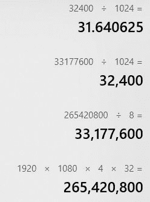

5. 超高清图像，也称为 4K 或 8K 图像，现在相当常见，但一个超高清图像包含多少兆像素？

这主要取决于长宽比。对于常见的 16:9 长宽比，以下是答案：

+   **4K**：8.3 兆像素

+   **8K**：33.2 兆像素

查看此链接获取更多信息：

[`en.wikipedia.org/wiki/Ultra-high-definition_television`](https://en.wikipedia.org/wiki/Ultra-high-definition_television)

6. 除了本章提到的颜色空间外，还有哪些常用的颜色空间？

YUV 和 LUV 颜色空间

[`en.wikipedia.org/wiki/List_of_color_spaces_and_their_uses`](https://en.wikipedia.org/wiki/List_of_color_spaces_and_their_uses)

7. 将 OpenCV 库与 MATLAB 中的计算机视觉工具进行比较。比较它们各自的优缺点。

通常，当计算机视觉应用需要模拟和原型设计时，MATLAB 是最好的选择，而当需要现实场景和需要速度和完全控制最终产品时，OpenCV 则更为直接。

# 第二章，OpenCV 入门

1. 列出三个额外的 OpenCV 模块及其用途。

可以使用`xfeatures2d`模块访问额外的特征检测算法。

可以使用`face`模块将面部分析算法包含到 OpenCV 中。

可以使用`text`模块将 OCR 功能（Tesseract OCR）添加到 OpenCV 中。

2. 打开`BUILD_opencv_world`标志构建 OpenCV 3 会有什么影响？

使用`BUILD_opencv_world`标志构建 OpenCV 3 会将所有二进制库文件，如`core`、`imcodecs`和`highgui`，合并成一个单世界库。

3. 使用本章中描述的 ROI 像素访问方法，我们如何构建一个可以访问中间像素及其所有相邻像素（另一个图像中的中间九个像素）的`Mat`类？

这里有一个示例代码可以实现这个目标：

```py
Mat image = imread("Test.png");
if(image.empty())
 {
 cout << "image empty";
 return 0;
 }
int centerRow = (image.rows / 2) - 1;
 int centerCol = (image.cols / 2) - 1;
 Mat roi(image, Rect(centerCol - 1, centerRow - 1, 3, 3));
roi = Scalar(0,0,255); // alter the pixels (make them red)
imshow("image", image);
 waitKey();
```

4. 除了本章提到的像素访问方法之外，`Mat`类还有另一种像素访问方法。

```py
Mat::row can be used to access a single row
 Mat::column can be used to access a single column
```

5. 编写一个程序，只使用`Mat`方法和`for`循环，创建三个单独的颜色图像，每个图像只包含从磁盘读取的 RGB 图像的一个通道。

```py
Mat image = imread("Test.png");
if(image.empty())
 {
 cout << "image empty";
 return 0;
 }
Mat red(image.rows, image.cols, CV_8UC3, Scalar::all(0));
 Mat green(image.rows, image.cols, CV_8UC3, Scalar::all(0));
 Mat blue(image.rows, image.cols, CV_8UC3, Scalar::all(0));
for(int i=0; i<image.rows; i++)
 {
 for(int j=0; j<image.cols; j++)
 {
 blue.at<Vec3b>(i, j)[0] = image.at<Vec3b>(i, j)[0];
 green.at<Vec3b>(i, j)[1] = image.at<Vec3b>(i, j)[1];
 red.at<Vec3b>(i, j)[2] = image.at<Vec3b>(i, j)[2];
 }
 }
imshow("Blue", blue);
 imshow("Green", green);
 imshow("Red", red);
waitKey();
```

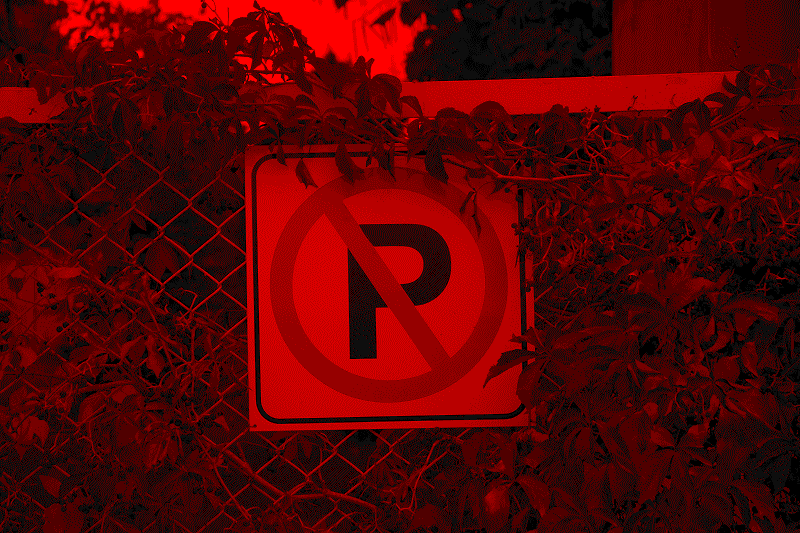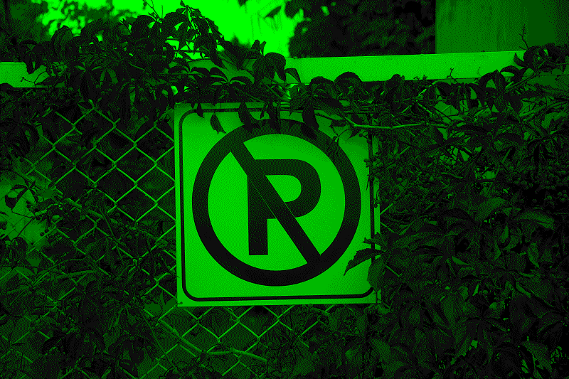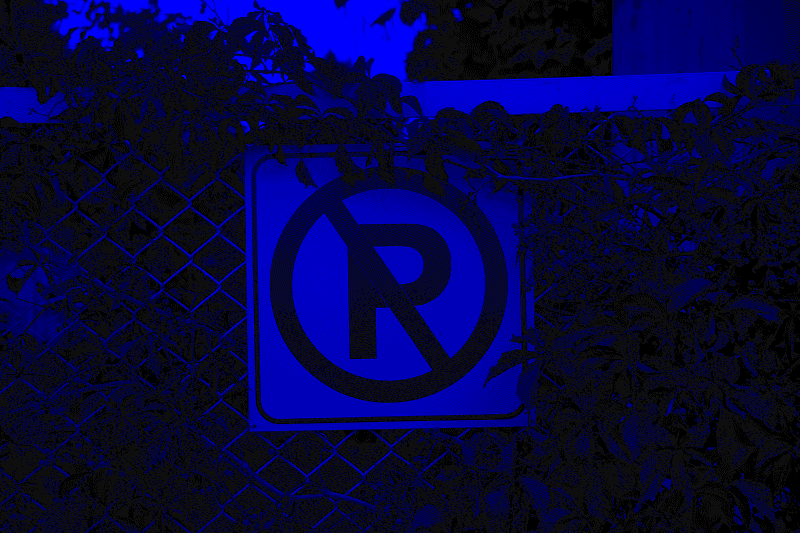

6. 使用类似 STL 的迭代器，计算灰度图像的平均像素值。

```py
Mat image = imread("Test.png", IMREAD_GRAYSCALE);
if(image.empty())
 {
 cout << "image empty";
 return 0;
 }
int sum = 0;
MatIterator_<uchar> it_begin = image.begin<uchar>();
 MatIterator_<uchar> it_end = image.end<uchar>();
 for( ; it_begin != it_end; it_begin++)
 {
 sum += (*it_begin);
 }
double average = sum / (image.cols * image.rows);
cout << "Pixel count is " << image.cols * image.rows << endl;
 cout << "Average pixel value is " << average << endl;
```

7. 编写一个程序，使用`VideoCapture`、`waitKey`和`imwrite`，在按下**S**键时显示您的网络摄像头并保存可见图像。如果按下空格键，程序将停止网络摄像头并退出。

```py
VideoCapture cam(0);
if(!cam.isOpened())
 return -1;
while(true)
 {
 Mat frame;
 cam >> frame;
 if(frame.empty())
 break;
imshow("Camera", frame);
// stop camera if space is pressed
char key = waitKey(10);
if(key == ' ')
 break;
if(key == 's')
 imwrite("d:/snapshot.png", frame);
 }
cam.release();
```

# 第三章，数组和矩阵运算

1. 哪些逐元素数学运算和位运算会产生完全相同的结果？

`bitwise_xor`和`absdiff`函数会产生相同的结果。

2. OpenCV 中的`gemm`函数的目的是什么？使用`gemm`函数，*A*x*B*的等价是什么？

`gemm`函数是 OpenCV 中的通用乘法函数。以下是与两个矩阵简单乘法等价的`gemm`函数调用：

```py
gemm(image1, image2, 1.0, noArray(), 1.0, result);
```

3. 使用`borderInterpolate`函数计算点(-10, 50)处不存在像素的值，边界类型为`BORDER_REPLICATE`。这种计算所需的函数调用是什么？

```py
Vec3b val = image.at<Vec3b>(borderInterpolate(50,
                               image.rows,
                               cv::BORDER_REFLECT_101),
                            borderInterpolate(-10,
                               image.cols,
                               cv::BORDER_WRAP));
```

4. 在本章的“单位矩阵”部分创建相同的单位矩阵，但使用`setIdentity`函数而不是`Mat::eye`函数。

```py
Mat m(10, 10, CV_32F);
setIdentity(m, Scalar(0.25));
```

5. 编写一个程序，使用`LUT`函数（查找表变换）执行与`bitwise_not`（颜色反转）相同的任务，当在灰度和颜色（RGB）图像上执行时。

```py
Mat image = imread("Test.png");

Mat lut(1, 256, CV_8UC1);

for(int i=0; i<256; i++)
{
  lut.at<uchar>(0, i) = 255 - i;
}

Mat result;
LUT(image, lut, result);
```

6. 除了归一化矩阵的值之外，`normalize`函数还可以用于调整图像的亮度或暗度。使用`normalize`函数变暗和变亮灰度图像所需的函数调用是什么。

```py
normalize(image, result, 200, 255, CV_MINMAX); // brighten
normalize(image, result, 0, 50, CV_MINMAX); // darken
```

7. 使用`merge`和`split`函数从图像中移除蓝色通道（第一个通道）。

```py
vector<Mat> channels;
split(image, channels);
channels[0] = Scalar::all(0);
merge(channels, result);
```

# 第四章，绘制、过滤和变换

1. 编写一个程序，在整张图像上绘制一个十字，厚度为 3 像素，颜色为红色。

```py
line(image,
 Point(0,0),
 Point(image.cols-1,image.rows-1),
 Scalar(0,0,255),
 3);
line(image,
 Point(0,image.rows-1),
 Point(image.cols-1,0),
 Scalar(0,0,255),
 3);
```

2. 创建一个带有滑块的窗口来改变`medianBlur`函数的`ksize`值。`kszise`值的范围应在 3 到 99 之间。

```py
Mat image;
 int ksize = 3;
 string window = "Image";
 string trackbar = "ksize";
void onChange(int ksize, void*)
 {
 if(ksize %2 == 1)
 {
 medianBlur(image,
 image,
 ksize);
 imshow(window, image);
 }
 }
int main()
 {
 image = imread("Test.png");
 namedWindow(window);
 createTrackbar(trackbar, window, &ksize, 99, onChange);
 setTrackbarMin(trackbar, window, 3);
 setTrackbarMax(trackbar, window, 99);
 onChange(3, NULL);
 waitKey();
 }
```

3. 对图像执行梯度形态学运算，考虑结构元素的核大小为 7，矩形形态学形状。

```py
int ksize = 7;
 morphologyEx(image,
 result,
 MORPH_GRADIENT,
 getStructuringElement(MORPH_RECT,
 Size(ksize,ksize)));
```

这里有一个例子：

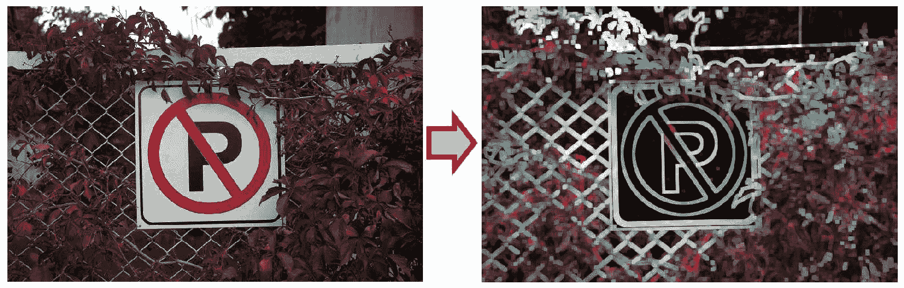

4. 使用`cvtColor`将彩色图像转换为灰度图像，并确保使用`threshold`函数过滤掉最暗的 100 种灰色阴影。确保过滤后的像素在结果图像中设置为白色，其余像素设置为黑色。

```py
Mat imageGray;
 cvtColor(image,
 imageGray,
 COLOR_BGR2GRAY);
threshold(imageGray,
 result,
 100,
 255,
 THRESH_BINARY_INV);
```

这里有一个例子：

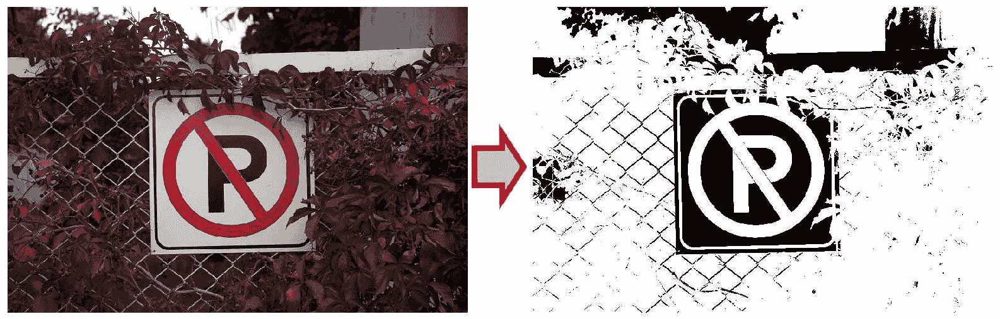

5. 使用`remap`函数将图像大小调整为原始宽度和高度的一半，从而保留原始图像的纵横比。使用默认的边界类型进行外推。

```py
Mat mapX(image.size(), CV_32FC1);
 Mat mapY(image.size(), CV_32FC1);
 for(int i=0; i<image.rows; i++)
 for(int j=0; j<image.cols; j++)
 {
 mapX.at<float>(i,j) = j*2.0;
 mapY.at<float>(i,j) = i*2.0;
 }
 InterpolationFlags interpolation = INTER_LANCZOS4;
 BorderTypes borderMode = BORDER_DEFAULT;
 remap(image,
 result,
 mapX,
 mapY,
 interpolation,
 borderMode);
```

这里有一个例子：

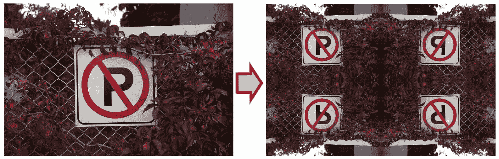

6. a) 使用色图将图像转换为灰度。b) 将图像转换为灰度并同时反转其像素怎么样？

a)

```py
Mat userColor(256, 1, CV_8UC3);
 for(int i=0; i<=255; i++)
 userColor.at<Vec3b>(i,0) = Vec3b(i, i, i);
 applyColorMap(image,
 result,
 userColor);
```

b)

```py
Mat userColor(256, 1, CV_8UC3);
 for(int i=0; i<=255; i++)
 userColor.at<Vec3b>(i,0) = Vec3b(255-i, 255-i, 255-i);
 applyColorMap(image,
 result,
 userColor);
```

7. 你是否了解透视变换函数？哪个 OpenCV 函数在一个函数中涵盖了所有类似的变换？

`findHomography`函数。

# 第五章，反向投影和直方图

1. 计算三通道图像中第二个通道的直方图。使用可选的箱大小和 0 到 100 的范围作为第二个通道的可能值。

```py
int bins = 25; // optional
 int nimages = 1;
 int channels[] = {1};
 Mat mask;
 int dims = 1;
 int histSize[] = { bins };
 float range[] = {0, 100};
 const float* ranges[] = { range };
 Mat histogram;
 calcHist(&image,
 nimages,
 channels,
 mask,
 histogram,
 dims,
 histSize,
 ranges);
```

2. 创建一个直方图，可以与`calcBackProject`函数一起使用，从灰度图像中提取最暗的像素。考虑最暗的 25%可能的像素值作为我们想要提取的灰度强度。

```py
int bins = 4;
 float rangeGS[] = {0, 256};
 const float* ranges[] = { rangeGS };
 int channels[] = {0};
 Mat histogram(bins, 1, CV_32FC1, Scalar(0.0));
 histogram.at<float>(0, 0) = 255.0;
 calcBackProject(&imageGray,
 1,
 channels,
 histogram,
 backProj,
 ranges);
```

3. 在上一个问题中，如果我们需要排除最暗和最亮的 25%，而不是在掩码中提取，会怎样？

```py
int bins = 4;
 float rangeGS[] = {0, 256};
 const float* ranges[] = { rangeGS };
 int channels[] = {0};
 Mat histogram(bins, 1, CV_32FC1, Scalar(0.0));
 histogram.at<float>(1, 0) = 255.0;
 histogram.at<float>(2, 0) = 255.0;
 calcBackProject(&imageGray,
 1,
 channels,
 histogram,
 backProj,
 ranges);
```

4. 红色的色调值是多少？需要将它调整多少才能得到蓝色？

0 和 360 是红色的色调值。调整 240 度可以得到蓝色。

5. 创建一个色调直方图，可以用来从图像中提取红色像素。考虑将 50 作为被认为是红色的像素的偏移量。最后，可视化创建的色调直方图。

```py
const int bins = 360;
 int hueOffset = 35;
 Mat histogram(bins, 1, CV_32FC1);
 for(int i=0; i<bins; i++)
 {
 histogram.at<float>(i, 0) =
 (i < hueOffset) || (i > bins - hueOffset) ? 255.0 : 0.0;
 }
double maxVal = 255.0;
int gW = 800, gH = 100;
 Mat theGraph(gH, gW, CV_8UC3, Scalar::all(0));
Mat colors(1, bins, CV_8UC3);
 for(int i=0; i<bins; i++)
 {
 colors.at<Vec3b>(i) =
 Vec3b(saturate_cast<uchar>(
 (i+1)*180.0/bins), 255, 255);
 }
 cvtColor(colors, colors, COLOR_HSV2BGR);
 Point p1(0,0), p2(0,theGraph.rows-1);
 for(int i=0; i<bins; i++)
 {
 float value = histogram.at<float>(i,0);
 value = maxVal - value; // invert
 value = value / maxVal * theGraph.rows; // scale
 p1.y = value;
 p2.x = float(i+1) * float(theGraph.cols) / float(bins);
 rectangle(theGraph,
 p1,
 p2,
 Scalar(colors.at<Vec3b>(i)),
 CV_FILLED);
 p1.x = p2.x;
 }
```

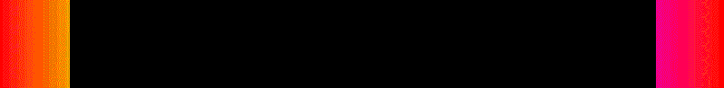

6. 计算直方图的积分。

```py
float integral = 0.0;
 for(int i=0; i<bins; i++)
 {
 integral += histogram.at<float>(i, 0);
 }
```

7. 对彩色图像执行直方图均衡化。请注意，`equalizeHist`函数仅支持单通道 8 位灰度图像的直方图均衡化。

```py
Mat channels[3], equalized[3];
 split(image, channels);
equalizeHist(channels[0], equalized[0]);
 equalizeHist(channels[1], equalized[1]);
 equalizeHist(channels[2], equalized[2]);
Mat output;
 cv::merge(equalized, 3, output);
```

# 第六章，视频分析 – 运动检测和跟踪

1. 本章中所有涉及摄像头的示例，在出现单个失败或损坏的帧导致检测到空帧时返回。需要什么样的修改才能在停止过程之前允许预定义的尝试次数？

```py
const int RETRY_COUNT = 10;
 int retries = RETRY_COUNT;
while(true)
 {
Mat frame;
 cam >> frame;
 if(frame.empty())
 {
 if(--retries < 0)
 break;
 else
 continue;
 }
 else
 {
 retries = RETRY_COUNT;
 }
// rest of the process
 }
```

2. 我们如何调用`meanShift`函数以 10 次迭代和 0.5 的 epsilon 值执行均值漂移算法？

```py
TermCriteria criteria(TermCriteria::MAX_ITER
 + TermCriteria::EPS,
 10,
 0.5);
meanShift(backProject,
 srchWnd,
 criteria);
```

3. 如何可视化跟踪对象的色调直方图？假设使用`CamShift`进行跟踪。

```py
Having the following function:
 void visualizeHue(Mat hue)
 {
 int bins = 36;
 int histSize[] = {bins};
 int nimages = 1;
 int dims = 1;
 int channels[] = {0};
 float rangeHue[] = {0, 180};
 const float* ranges[] = {rangeHue};
 bool uniform = true;
 bool accumulate = false;
 Mat histogram, mask;
calcHist(&hue,
 nimages,
 channels,
 mask,
 histogram,
 dims,
 histSize,
 ranges,
 uniform,
 accumulate);
double maxVal;
 minMaxLoc(histogram,
 0,
 &maxVal,
 0,
 0);
int gW = 800, gH = 100;
 Mat theGraph(gH, gW, CV_8UC3, Scalar::all(0));
Mat colors(1, bins, CV_8UC3);
 for(int i=0; i<bins; i++)
 {
 colors.at<Vec3b>(i) =
 Vec3b(saturate_cast<uchar>(
 (i+1)*180.0/bins), 255, 255);
 }
 cvtColor(colors, colors, COLOR_HSV2BGR);
 Point p1(0,0), p2(0,theGraph.rows-1);
 for(int i=0; i<bins; i++)
 {
 float value = histogram.at<float>(i,0);
 value = maxVal - value; // invert
 value = value / maxVal * theGraph.rows; // scale
 p1.y = value;
 p2.x = float(i+1) * float(theGraph.cols) / float(bins);
 rectangle(theGraph,
 p1,
 p2,
 Scalar(colors.at<Vec3b>(i)),
 CV_FILLED);
 p1.x = p2.x;
 }
imshow("Graph", theGraph);
 }
```

我们可以在`CamShift`函数调用后立即调用以下代码来可视化检测到的对象的色调：

```py
CamShift(backProject,
 srchWnd,
 criteria);
visualizeHue(Mat(hue, srchWnd));
```

4. 在`KalmanFilter`类中设置过程噪声协方差，以便过滤值和测量值重叠。假设只设置了所有可用的矩阵中`KalmanFilter`类行为控制的过程噪声协方差。

```py
setIdentity(kalman.processNoiseCov,
 Scalar::all(1.0));
```

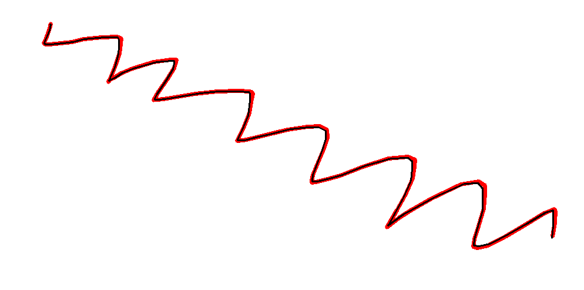

5. 假设窗口中鼠标的*Y*位置用于描述从窗口左上角开始的填充矩形的长度，其宽度等于窗口的宽度。编写一个卡尔曼滤波器，可以用来校正矩形的长度（单个值）并去除鼠标移动中的噪声，从而实现填充矩形的视觉平滑缩放。

```py
int fillHeight = 0;
void onMouse(int, int, int y, int, void*)
 {
 fillHeight = y;
 }
int main()
 {
 KalmanFilter kalman(2,1);
Mat_<float> tm(2, 2); // transition matrix
 tm << 1,0,
 0,1;
kalman.transitionMatrix = tm;
 Mat_<float> h(1,1);
 h.at<float>(0) = 0;
kalman.statePre.at<float>(0) = 0; // init x
 kalman.statePre.at<float>(1) = 0; // init x'
setIdentity(kalman.measurementMatrix);
setIdentity(kalman.processNoiseCov,
 Scalar::all(0.001));
string window = "Canvas";
 namedWindow(window);
 setMouseCallback(window, onMouse);
while(waitKey(10) < 0)
 {
 // empty canvas
 Mat canvas(500, 500, CV_8UC3, Scalar(255, 255, 255));
h(0) = fillHeight;
Mat estimation = kalman.correct(h);
float estH = estimation.at<float>(0);
rectangle(canvas,
 Rect(0,0,canvas.cols, estH),
 Scalar(0),
 FILLED);
imshow(window, canvas);
kalman.predict();
 }
 return 0;
}
```

6. 创建一个`BackgroundSubtractorMOG2`对象，以提取前景图像的内容，同时避免阴影变化。

```py
Ptr<BackgroundSubtractorMOG2> bgs =
 createBackgroundSubtractorMOG2(500, // hist
 16, // thresh
 false // no shadows
 );
```

7. 编写一个程序，使用背景分割算法显示当前（而不是采样）的背景图像。

```py
VideoCapture cam(0);
 if(!cam.isOpened())
 return -1;
Ptr<BackgroundSubtractorKNN> bgs =
 createBackgroundSubtractorKNN();
while(true)
 {
Mat frame;
 cam >> frame;
 if(frame.empty())
 break;
Mat mask;
 bgs->apply(frame,
 mask);
bitwise_not(mask, mask);
Mat bg;
 bitwise_and(frame, frame, bg, mask);
imshow("bg", bg);
int key = waitKey(10);
 if(key == 27) // escape key
 break;
 }
cam.release();

```

# 第七章，目标检测 - 特征和描述符

1. 模板匹配算法本身不具有尺度不变性和旋转不变性。我们如何使其对于以下情况成立）模板图像的尺度加倍，以及 b）模板图像的 90 度旋转版本？

a) 使用`resize`函数缩放模板图像，然后调用`matchTemplate`函数：

```py
resize(templ, templ, Size(), 2.0, 2.0);
 matchTemplate(image, templ, TM_CCOEFF_NORMED);
```

b) 将模板旋转 90 度，然后调用`matchTemplate`函数：

```py
rotate(templ, templ, ROTATE_90_CLOCKWISE);
 matchTemplate(image, templ, TM_CCOEFF_NORMED);
```

2. 使用`GFTTDetector`类通过 Harris 角点检测算法检测关键点。你可以为角点检测算法设置任何值。

```py
Mat image = imread("Test.png");
 Ptr<GFTTDetector> detector =
 GFTTDetector::create(500,
 0.01,
 1,
 3,
 true);
vector<KeyPoint> keypoints;
 detector->detect(image, keypoints);
drawKeypoints(image,
 keypoints,
 image);
```

3. Hough 变换也可以通过`HoughCircles`函数在图像中检测圆。在 OpenCV 文档中搜索它，并编写一个程序来检测图像中的圆。

```py
Mat image = imread("Test.png");
 cvtColor(image, image, COLOR_BGR2GRAY);
 vector<Vec3f> circles;
 HoughCircles(image,
 circles,
 HOUGH_GRADIENT,
 2,
 image.rows/4);
 for(int i=0; i<circles.size(); i++)
 {
 Point center(cvRound(circles[i][0]),
 cvRound(circles[i][1]));
 int radius = cvRound(circles[i][2]);
circle( image, center, radius, Scalar(0,0,255));
 }
```

4. 在图像中检测并绘制凸轮廓。

```py
Mat image = imread("Test.png");
 Mat imgGray;
 cvtColor(image, imgGray, COLOR_BGR2GRAY);
double threshold1 = 100.0;
 double threshold2 = 200.0;
 int apertureSize = 3;
 bool L2gradient = false;
 Mat edges;
 Canny(image,
 edges,
 threshold1,
 threshold2,
 apertureSize,
 L2gradient);
vector<vector<Point> > contours;
 int mode = CV_RETR_TREE;
 int method = CV_CHAIN_APPROX_TC89_KCOS;
 findContours(edges,
 contours,
 mode,
 method);
Mat result(image.size(), CV_8UC3, Scalar::all(0));
 for( int i = 0; i< contours.size(); i++ )
 {
 if(isContourConvex(contours[i]))
 {
 drawContours(result,
 contours,
 i,
 Scalar(0, 255, 0),
 2);
 }
 }
```

5. 使用`ORB`类在两个图像中检测关键点，提取它们的描述符，并匹配它们。

```py
Mat object = imread("Object.png");
 Mat scene = imread("Scene.png");
Ptr<ORB> orb = ORB::create();
 vector<KeyPoint> objKPs, scnKPs;
 Mat objDesc, scnDesc;
 orb->detectAndCompute(object,
 Mat(),
 objKPs,
 objDesc);
 orb->detectAndCompute(scene,
 Mat(),
 scnKPs,
 scnDesc);
Ptr<BFMatcher> matcher = BFMatcher::create();
vector<DMatch> matches;
 matcher->match(objDesc, scnDesc, matches);
Mat result;
 drawMatches(object,
 objKPs,
 scene,
 scnKPs,
 matches,
 result);
 imshow("image", result);
```

6. 哪个特征描述符匹配算法与 ORB 算法不兼容，为什么？

你不能使用基于 FLANN 的匹配算法与具有位串类型的描述符，如 ORB。

7. 你可以使用以下 OpenCV 函数和示例来计算运行任何数量代码所需的时间。使用它来计算你计算机上匹配算法所需的时间。

```py
double freq = getTickFrequency();
 double countBefore = getTickCount();
// your code goes here ..
double countAfter = getTickCount();
 cout << "Duration: " <<
 (countAfter - countBefore) / freq << " seconds";
```

# 第八章，计算机视觉中的机器学习

1. 在`SVM`类中，`train`方法和`trainAuto`方法有什么区别？

`trainAuto`方法选择 SVM 参数的最佳值，如`C`、`Gamma`等，并训练模型，而`train`方法只是使用任何给定的参数。（阅读`SVM`类文档以获取更多关于`trainAuto`函数的详细信息以及优化是如何发生的。）

2. 展示线性与直方图交点之间的区别。

我们可以使用以下代码将核类型设置为`LINEAR`：

```py
svm->setKernel(SVM::LINEAR);
```

如果我们显示了黑色、白色和灰色点的组，这里是分类（分割）的结果：

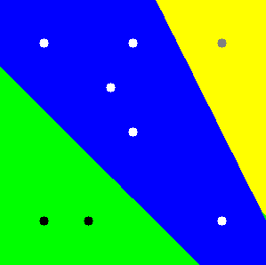

类似地，我们可以使用以下代码将核类型设置为直方图交点：

```py
svm->setKernel(SVM::INTER);
```

这里是使用直方图交点核对相同数据进行分割的结果：

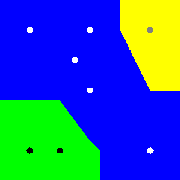

3. 如何计算 HOG 窗口大小为 128x96 像素的 `HOGdescriptor` 的大小？（其他 HOG 参数保持不变。）

```py
HOGDescriptor hog;
hog.winSize = Size(128, 128);
vector<float> tempDesc;
hog.compute(Mat(hog.winSize, CV_8UC3),
       tempDesc);
int descriptorSize = tempDesc.size();

```

4. 如何更新现有的已训练的 `ANN_MLP`，而不是从头开始训练？

你可以通过在训练过程中设置 `UPDATE_WEIGHTS` 标志来实现这一点。以下是一个示例：

```py
ann->train(trainData, UPDATE_WEIGHTS);
```

5. 使用 `opencv_createsamples` 命令创建来自单个公司标志图像的正样本向量所需的命令是什么？假设你想要 1,000 个样本，宽度为 24 像素，高度为 32 像素，并且使用默认的旋转和反转参数。

```py
opencv_createsamples -vec samples.vec -img sign.png -bg bg.txt    
  -num 1000 -w 24 -h 32
```

6. 训练用于之前问题中公司标志的 LBP 级联分类器所需的命令是什么？

```py
opencv_traincascade -data classifier -vec samples.vec
  -bg bg.txt -numPos 1000 -numNeg 1000 -w 24 -h 32
   -featureType LBP
```

7. 在 `opencv_traincascade` 中训练级联分类器时的默认阶段数是多少？我们如何更改它？将阶段数增加到或减少到远低于默认值有什么缺点？

训练分类器时的默认阶段数是 20，这对于大多数用例来说已经足够了。你可以通过使用 `numStages` 参数将其设置为任何你想要的值。过多地增加阶段数可能会导致分类器过拟合，并且训练它所需的时间会更长，反之亦然。
