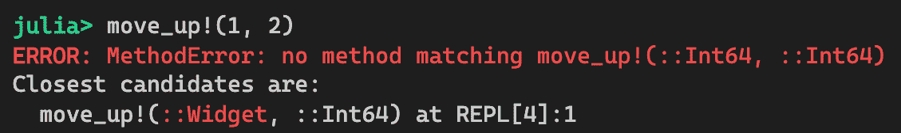
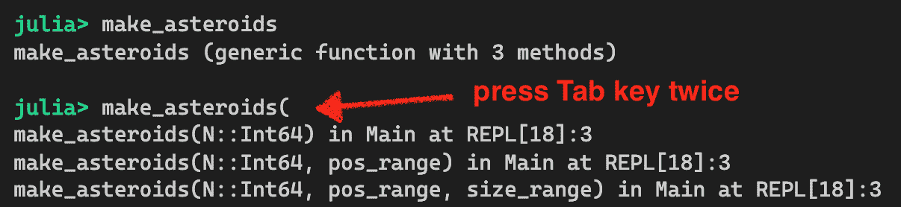
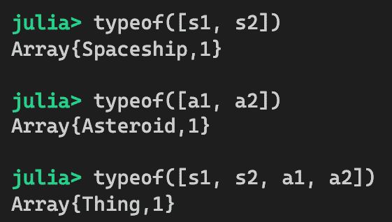

# 设计函数和接口

本章将继续探讨 Julia 的基本概念。我们在这里选择的主题将为 Julia 编程的关键概念提供一个坚实的基础。特别是，我们将讨论与函数和接口相关的核心 Julia 编程技术。函数是软件的基本构建块。接口是软件不同组件之间的契约关系。有效地使用函数和接口对于构建健壮的应用程序是必不可少的。

本章将涵盖以下主题：

+   函数

+   多重分派

+   参数化方法

+   接口

作为学习过程的一部分，我们将回顾一个游戏设计的用例。更具体地说，我们将假装我们正在构建一个包含太空战游戏板、飞船和陨石部件的游戏。我们将构建移动游戏部件的函数，并为飞船配备武器以摧毁物体。

到本章结束时，你将具备设计和开发函数所需的知识。通过使用多重分派和参数化方法，你的应用程序将变得更加可扩展。一旦你学会了这些技术，你也应该能够设计一个包含可插拔组件的系统，基于接口。

我已经迫不及待了。让我们开始吧！

# 技术要求

示例源代码位于 [`github.com/PacktPublishing/Hands-on-Design-Patterns-and-Best-Practices-with-Julia/tree/master/Chapter03`](https://github.com/PacktPublishing/Hands-on-Design-Patterns-and-Best-Practices-with-Julia/tree/master/Chapter03)。

代码在 Julia 1.3.0 环境中进行了测试。

# 设计函数

函数是 Julia 定义应用程序行为的核心结构。实际上，与面向对象编程语言相比，Julia 更像是一种过程式/函数式编程语言。在面向对象编程中，你专注于构建类并为这些类定义函数。在 Julia 中，你专注于构建在数据类型或数据结构上操作的功能。

在本节中，我们将展示如何定义函数以及函数带来的强大功能。

# 我们的用例 - 太空战游戏

在本章中，我们将通过构建太空战游戏的部分来阐述编程概念。游戏的设计非常简单直接。它由散布在二维网格上的游戏部件（如飞船和陨石）组成。在我们的程序中，这些游戏部件被称为小部件。

让我们先定义以下数据类型：

```py
# Space war game!

mutable struct Position
    x::Int
    y::Int
end

struct Size
    width::Int
    height::Int
end

struct Widget
    name::String
    position::Position
    size::Size
end
```

由于数据类型是我们设计的关键，这需要更多的解释：

+   `Position` 类型用于存储游戏部件的坐标。它由两个整数表示：`x` 和 `y`。

+   `Size` 类型用于存储游戏部件的大小。它由两个整数表示：`width` 和 `height`。

+   `Widget` 类型用于存储单个游戏部件。它由一个 `name`、`position` 和 `size` 表示。

注意，`Position` 类型是可变的，因为我们期望我们的游戏部件通过更新它们的坐标来移动。

接下来，我们将讨论与函数定义相关的一些主题。

# 定义函数

实际上，我们可以使用两种不同的语法来定义函数：

+   第一种方法是一个简单的单行代码，其中包含函数的签名和主体。

+   第二种方法使用 `function` 关键字和签名，然后是代码块和 `end` 关键字。

如果函数足够简单——例如，如果它只有一条指令——那么通常更倾向于将其写在一行中。这种函数定义风格在科学计算项目中非常常见，因为许多函数只是模仿相应的数学公式。

对于我们的游戏，我们可以简单地编写四个函数来在棋盘上移动游戏部件，通过修改部件的坐标：

```py
# single-line functions
move_up!(widget, v)    = widget.position.y -= v
move_down!(widget, v)  = widget.position.y += v
move_left!(widget, v)  = widget.position.x -= v
move_right!(widget, v) = widget.position.x += v
```

在 Julia 中编写单行函数确实非常地道。来自不同背景的人可能会觉得以下更冗长的形式更直观。这并没有什么问题；这两种形式都运行得很好：

```py
# long version
function move_up!(widget, v)
    widget.position.y -= v
end
```

在编写这些函数时，有几个要点需要注意：

+   **下划线使用**：前面的函数名使用下划线来分隔单词。根据官方 Julia 手册，惯例是直接将单词组合在一起，除非变得过于混乱或难以阅读。我个人认为，对于多词函数名，应该始终使用下划线，因为它增强了可读性，并使代码更加一致。

+   **感叹号使用**：前面的函数名包含感叹号，以表示该函数会改变传入函数的对象的状态。这是一个好习惯，因为它提醒开发者调用函数时会有副作用。

+   **鸭子类型**：你可能想知道为什么函数参数没有标注任何类型信息。在 `move_up!` 函数中，尽管我们没有类型注解，但我们期望当函数被使用时，`widget` 参数具有 `Widget` 类型，而 `v` 具有整数 `Int` 类型。这是一个有趣的话题，我们将在下一节中进一步讨论。

如你所见，定义函数是一项相当直接的任务，Julia 处理函数参数的方式非常有趣。我们将在下一节中讨论这一点。

# 函数参数注解

在没有任何多态性的静态类型语言中，例如 C 或 Fortran，每个参数都必须使用确切的类型进行指定。然而，Julia 是动态类型，并支持鸭子类型——*如果它像鸭子走路，像鸭子叫，那么它就是一只鸭子*。源代码中根本不需要类型信息。相反，编译器会查看传递给函数的运行时类型，并为这些类型编译适当的方法。根据参数类型在整个方法体中进行类型推断的过程称为**类型推断**。

因此，根本不需要用类型信息注解函数参数。有时人们会有这样的印象，在他们所有的 Julia 代码中添加类型注解会提高性能。这通常不是情况。对于方法签名，类型对性能没有影响：它们仅用于控制调度。

那么，你会选择什么？给参数添加类型注解还是不添加？

# 无类型参数

当函数参数没有使用类型信息进行注解时，函数实际上更加灵活。为什么？那是因为它可以与传递给函数的任何类型一起工作。让我们假设，在未来，坐标系从`Int`变为`Float64`。当这种情况发生时，函数不需要进行任何更改：它只需正常工作！

相反，保持所有内容无类型可能也不是最好的主意，因为函数实际上不能与世界上定义的任何可能的数据类型一起工作。此外，它经常会导致晦涩的异常信息，并使程序更难调试。例如，如果我们不小心将`Int`值作为`Widget`参数传递给`move_up!`函数，那么它将抱怨类型没有`position`字段：


错误信息相当晦涩。我们是否可以做一些事情来使调试稍微容易一些？答案是，我们可以提供函数参数的类型。让我们看看这是如何实现的。

# 带类型参数

我们知道我们的`move`函数实现包含一些隐式的设计假设：

+   `v`的值应该是一个数值，正如`+`或`-`运算符所暗示的。

+   `widget`必须是一个`Widget`对象，或者至少包含一个`Position`对象，正如访问`position`字段所暗示的。

因此，通常更安全的是定义具有一些类型信息的函数。话虽如此，`move_up!`函数可以被重新定义为以下内容：

```py
move_up!(widget::Widget, v::Int) = widget.position.y -= v
```

如果我们只是以相同的方式定义所有的`move`函数，那么调试就会变得更容易。假设我们像前面代码中那样犯了一个错误，即把一个整数作为第一个参数传递：我们现在将收到一个更合理的错误信息：



因此，而不是试图运行函数并因未知效果而失败，Julia 编译器现在会告诉我们，对于我们传递给函数的参数类型，不存在该方法。

在我们继续下一个主题之前，至少让我们玩一小会儿这个游戏。为了在 Julia REPL 中更优雅地显示这些对象，我们可以定义一些 `show` 函数，如下所示：

```py
# Define pretty print functions
Base.show(io::IO, p::Position) = print(io, "(", p.x, ",", p.y, ")")
Base.show(io::IO, s::Size) = print(io, s.width, " x ", s.height)
Base.show(io::IO, w::Widget) = print(io, w.name, " at ", w.position, " size ", w.size)
```

这些 `Base.show` 函数提供了当 `Position`、`Size` 或 `Widget` 对象需要在特定的 I/O 设备（如 REPL）上显示时的实现。通过定义这些函数，我们得到了一个更优雅的输出。

注意，`Widget` 类型的 `show` 函数会打印出小部件的名称、位置和大小。`Position` 和 `Size` 类型的相应 `show` 函数将由 `print` 函数调用。

`show` 函数还有一个形式，即 `show(io, mime, x)`，这样 `x` 值就可以以不同的格式显示不同的 MIME 类型。

MIME 代表多用途互联网邮件扩展。它也被称为媒体类型。这是一个用于指定数据流类型的标准。例如，`text/plain` 代表纯文本流，而 `text/html` 代表包含 HTML 内容的文本流。

`show` 函数的默认 MIME 类型是 `text/plain`，这本质上是我们用于 Julia REPL 环境的类型。如果我们使用 Julia 在笔记本环境中，例如 Jupyter，那么我们可以提供一个 `show` 函数，该函数使用 `text/html` MIME 类型提供额外的 HTML 格式化。

最后，让我们来试驾一下。我们可以通过调用各种 `move` 函数来移动小行星游戏部件，如下所示：

```py
# let's test these functions
w = Widget("asteroid", Position(0, 0), Size(10, 20))
move_up!(w, 10)
move_down!(w, 10)
move_left!(w, 20)
move_right!(w, 20)

# should be back to position (0,0)
print(w) 
```

结果如下。请注意，小行星小部件的输出格式与我们编码的完全一致：


使用类型参数定义函数通常被认为是一种良好的实践，因为函数只能与参数的具体数据类型一起工作。此外，从客户端使用角度来看，你只需查看函数定义就可以清楚地看到函数需要什么。

有时定义一个具有无类型参数的函数更有益。例如，标准的 `print` 函数有一个看起来像 `print(io::IO, x)` 的函数签名。其意图是 `print` 函数保证能够与所有可能的数据类型一起工作。

一般而言，这应该是一个例外而不是常态。在大多数情况下，使用类型参数更有意义。

接下来，我们将讨论如何为参数提供默认值。

# 处理可选参数

有时，我们不想在函数中硬编码任何值。一般的解决方案是提取硬编码的值并将它们整合到函数参数中。在 Julia 中，我们还可以为参数提供默认值。当我们有默认值时，参数就变成了可选的。

为了说明这个概念，让我们编写一个创建一系列小行星的函数：

```py
# Make a bunch of asteroids
function make_asteroids(N::Int, pos_range = 0:200, size_range = 10:30)
    pos_rand() = rand(pos_range)
    sz_rand() = rand(size_range)
    return [Widget("Asteroid #$i", 
                Position(pos_rand(), pos_rand()), 
                Size(sz_rand(), sz_rand())) 
        for i in 1:N]
end
```

该函数接受一个名为`N`的参数，表示小行星的数量。它还接受位置范围`pos_range`和大小范围`size_range`，用于创建随机大小的小行星，这些小行星随机放置在我们的游戏地图上。您可能会注意到，我们还在`make_asteroid`函数体内直接定义了两个单行函数`pos_rand`和`sz_rand`。这些函数仅存在于函数的作用域内。

让我们尝试不指定`pos_range`或`size_range`的任何值：


但它们是可选的，这也允许我们提供自定义值。例如，我们可以通过指定一个更窄的范围来使小行星彼此更近：


魔法从何而来？如果您在 REPL 中输入`make_asteroid`函数时按下*Tab*键，您可能会注意到单个函数定义最终有三个方法。

函数和方法是什么？

函数在 Julia 中是*通用的*。这意味着我们可以通过定义具有相同名称但接受不同类型参数的各种方法来扩展函数的目的。

因此，Julia 中的每个函数都可以关联到一个或多个相关方法。

内部，Julia 自动为每个签名创建这三个方法：



另一种找到函数方法的方式是使用来自 Julia `Base`包的`methods`函数：


当然，我们可以完全指定所有参数，如下所示：


如您所见，为位置参数提供默认值非常方便。如果默认值通常被接受，调用函数会变得更简单，因为它不需要指定所有参数。

虽然这里感觉有点奇怪——代码变得越来越难以阅读：`make_asteroids(5, 100:5:200, 200:10:500)`。`5`、`100:5:200`和`200:10:500`代表什么？这些参数看起来相当晦涩，程序员可能需要查看源代码或手册才能记住它们的含义。必须有一种更好的方法！接下来，我们将检查如何使用关键字参数解决这个问题。

# 使用关键字参数

可选参数的缺点是它们必须按照定义的顺序排列。当有更多参数时，从调用点绑定到哪个参数的值并不容易阅读。在这种情况下，我们可以使用关键字参数来提高可读性。

让我们按照以下方式重新定义`make_asteroid`函数：

```py
function make_asteroids2(N::Int; pos_range = 0:200, size_range = 10:30)
    pos_rand() = rand(pos_range)
    sz_rand() = rand(size_range)
    return [Widget("Asteroid #$i", 
                Position(pos_rand(), pos_rand()), 
                Size(sz_rand(), sz_rand())) 
        for i in 1:N]
end
```

这个函数与上一节中的函数之间的唯一区别只是一个字符。位置参数（在这种情况下，`N`）和关键字参数（`pos_range`和`size_range`）只需要用分号（`;`）字符分隔。

从调用者的角度来看，关键字参数必须按照参数的名称传递：


使用关键字参数使代码的阅读性大大提高！实际上，关键字参数甚至不需要按照它们在函数中定义的顺序传递：


另一个酷炫的功能是关键字参数不需要携带任何默认值。例如，我们可以定义一个相同的函数，其中第一个参数`N`成为一个强制关键字参数：

```py
function make_asteroids3(; N::Int, pos_range = 0:200, size_range = 10:30)
    pos_rand() = rand(pos_range)
    sz_rand() = rand(size_range)
    return [Widget("Asteroid #$i", 
                Position(pos_rand(), pos_rand()), 
                Size(sz_rand(), sz_rand())) 
        for i in 1:N]
end
```

在这一点上，我们只需指定`N`来调用函数：


使用关键字参数是编写自文档代码的好方法。一些开源包，如 Plots，广泛使用关键字参数。当函数需要许多参数时，它工作得非常好。

虽然在这个例子中我们为关键字参数指定了默认值，但它们实际上并不是必需的。在没有默认值的情况下，当函数被调用时，关键字参数变为强制性的。

另一个酷炫的功能是我们可以向函数传递任意数量的参数。我们将在下一节中探讨这一点。

# 接受可变数量的参数

有时，如果函数可以接受任意数量的参数会更方便。在这种情况下，我们可以在函数参数中添加三个点`...`，Julia 会自动将所有传递的参数滚成一个单一的变量。这个功能被称为**吸入**。

这里有一个例子：

```py
# Shoot any number of targets
function shoot(from::Widget, targets::Widget...)
    println("Type of targets: ", typeof(targets))
    for target in targets
        println(from.name, " --> ", target.name)
    end
end
```

在`shoot`函数中，我们首先打印`targets`变量的类型，然后打印每发射击。让我们首先设置游戏元素：

```py
spaceship = Widget("Spaceship", Position(0, 0), Size(30,30))
target1 = asteroids[1]
target2 = asteroids[2]
target3 = asteroids[3]
```

现在我们可以开始射击了！首先通过传递一个目标来调用`shoot`函数，然后再次通过传递三个目标来执行：


结果表明，参数被简单地组合成一个元组，并绑定到一个单一的`targets`变量。在这种情况下，我们只是迭代这个元组并对它们中的每一个执行操作。

吸入是一种将函数参数组合在一起并统一处理它们的绝佳方式。这使得可以以任意数量的参数调用函数。

接下来，我们将了解一个类似的功能，称为展开（splatting），它本质上执行的是吸入（slurping）的相反功能。

# 展开参数

Slurping 本身非常有用，但三点的表示法实际上还有第二个用途。在调用点，当一个变量后面跟着三个点时，该变量将被自动分配为多个函数参数。这个特性被称为**展开**。实际上，这个机制与 slurping 非常相似，只是它执行的是相反的操作。我们将通过一个例子来看看。

假设我们已经编写了一个函数来安排几艘太空船在特定的队形中：

```py
# Special arrangement before attacks
function triangular_formation!(s1::Widget, s2::Widget, s3::Widget)
    x_offset = 30
    y_offset = 50
    s2.position.x = s1.position.x - x_offset
    s3.position.x = s1.position.x + x_offset
    s2.position.y = s3.position.y = s1.position.y - y_offset
    (s1, s2, s3)
end
```

我们还在太空战之前构建了几艘太空船：


我们现在可以使用展开技术调用 `triangular_formation!` 函数，这涉及到在函数参数后附加三个点：


在这种情况下，`spaceships` 向量中的三个元素被分配到三个参数中，正如 `triangular_formation!` 函数所期望的那样。

Splatting 可以在技术上与任何集合类型一起工作——向量（vector）和元组（tuple）。只要被展开的变量支持通用迭代接口，它就应该可以工作。

此外，你可能想知道当变量中的元素数量与函数中定义的参数数量不相等时会发生什么。

鼓励你将这种行为作为练习进行检查。

展开是构建函数参数并直接将它们传递给函数的好方法，而无需将它们拆分成单独的参数。因此，它非常方便。

接下来，我们将讨论如何传递函数以提供高级编程功能。

# 理解一等函数

当函数可以被分配给变量或结构体字段、传递给函数、从函数返回等时，我们称其为**一等函数**。它们被当作一等公民对待，就像常规数据类型一样。我们现在将看看函数如何像常规数据值一样被传递。

让我们设计一个新的函数，该函数可以使太空船向随机方向跳跃随机距离。你可能还记得，在本章的开头我们已经定义了四个 `move` 函数——`move_up!`、`move_down!`、`move_left!` 和 `move_right!`。以下是我们的策略：

1.  创建一个 `random_move` 函数，该函数返回可能的 `move` 函数之一。这为选择方向提供了基础。

1.  创建一个 `random_leap!` 函数，该函数使用指定的 `move` 函数和跳跃距离来移动太空船。

代码如下：

```py
function random_move()
    return rand([move_up!, move_down!, move_left!, move_right!])
end

function random_leap!(w::Widget, move_func::Function, distance::Int)
    move_func(w, distance)
    return w
end
```

如你所见，`random_move` 函数返回一个函数，该函数是从 `move` 函数数组中随机选择的。`random_leap!` 函数接受一个 `move` 函数，`move_func`，作为参数，然后它只是用小部件和距离进行调用。现在让我们测试 `random_leap!` 函数：


我们已经成功调用了随机选择的`move`函数。所有这些都可以轻松完成，因为我们可以将函数存储得就像它们是常规变量一样。一等性质使其非常方便。

接下来，我们将学习匿名函数。匿名函数在 Julia 程序中很常见，因为它们是快速创建函数并将其传递给其他函数的好方法。

# 开发匿名函数

有时候，我们只想创建一个简单的函数，并在不为其指定名称的情况下传递它。这种编程风格在函数式编程语言中实际上相当常见。我们可以用一个例子来说明它的用法。

假设我们想要引爆所有的小行星。一种方法是为它定义一个`explode`函数，并将其作为参数传递给`foreach`函数，如下所示：

```py
function explode(x)
    println(x, " exploded!")
end

function clean_up_galaxy(asteroids)
    foreach(explode, asteroids)
end
```

结果看起来不错：


如果我们只是将匿名函数传递给`foreach`，我们也可以达到相同的效果：

```py
function clean_up_galaxy(asteroids)
    foreach(x -> println(x, " exploded!"), asteroids)
end
```

匿名函数的语法包括参数变量，后面跟着细箭头`->`和函数体。在这种情况下，我们只有一个参数。如果我们有更多的参数，我们可以将它们写成括号内的元组。匿名函数也可以被分配给变量并传递。假设我们还想引爆宇宙飞船：

```py
function clean_up_galaxy(asteroids, spaceships)
    ep = x -> println(x, " exploded!")
    foreach(ep, asteroids)
    foreach(ep, spaceships)
end
```

我们可以看到，使用匿名函数有一些优点：

+   没有必要想出一个函数名并污染模块的命名空间。

+   匿名函数的逻辑在调用位置可用，这使得代码更容易阅读。

+   代码稍微紧凑一些。

到目前为止，我们已经讨论了如何定义和使用函数的大部分相关细节。下一个主题，do-语法，与匿名函数密切相关。这是一种提高代码可读性的好方法。

# 使用 do-语法

当与匿名函数一起工作时，我们可能会得到一个位于函数调用中间的代码块，这使得代码更难阅读。do-语法是解决这个问题的好方法，可以产生清晰、易于阅读的代码。

为了说明这个概念，让我们为我们的战斗舰队构建一个新的用例。特别是，我们将增强我们的宇宙飞船以发射导弹的能力。我们还希望支持这样的要求：发射武器需要宇宙飞船处于健康状态。

我们可以定义一个`fire`函数，它接受一个`launch`函数和一个宇宙飞船。只有当宇宙飞船处于健康状态时，`launch`函数才会被执行。我们为什么想要将函数作为参数传递？因为我们想要使其灵活，以便以后可以使用相同的`fire`函数来发射激光束和其他可能的武器：

```py
# Random healthiness function for testing
healthy(spaceship) = rand(Bool)

# make sure that the spaceship is healthy before any operation 
function fire(f::Function, spaceship::Widget)
    if healthy(spaceship)
        f(spaceship)
    else
        println("Operation aborted as spaceship is not healthy")
    end
    return nothing
end
```

让我们尝试使用匿名函数来发射导弹：


到目前为止一切顺利。但如果我们需要更复杂的程序来发射导弹怎么办？例如，假设我们希望在发射前将宇宙飞船向上移动，发射后再将其降回原位：

```py
fire(s -> begin
        move_up!(s, 100)
        println(s, " launched missile!")
        move_down!(s, 100)
    end, spaceship)
```

现在的语法看起来相当丑陋。幸运的是，我们可以使用 do 语法重写代码，使其更易读：

```py
fire(spaceship) do s
    move_up!(s, 100)
    println(s, " launched missile!")
    move_down!(s, 100)
end
```

它是如何工作的？好吧，语法被转换，使得 do 块变成了一个匿名函数，然后它被作为函数的第一个参数插入。

Julia 的 `open` 函数中可以找到一个有趣的 do 语法的用法。因为读取文件涉及到打开和关闭文件句柄，所以 `open` 函数被设计成接受一个接受 `IOStream` 并对其执行某些操作的匿名函数，而打开/关闭的维护工作则由 `open` 函数本身处理。

这个想法很简单，所以让我们用我们自己的 `process_file` 函数来复制它：

```py
function process_file(func::Function, filename::AbstractString)
    ios = nothing
    try
        ios = open(filename)
        func(ios)
    finally
        close(ios)
    end
end
```

使用 do 语法，我们可以专注于开发文件处理的逻辑，而无需担心诸如打开和关闭文件等维护工作。考虑以下代码：


正如你所见，do 语法可以在两种方式下发挥作用：

+   它通过将匿名函数参数重新排列成块格式，使代码更易读。

+   它允许匿名函数被包裹在一个上下文中，可以在函数执行前后执行额外的逻辑。

接下来，我们将探讨多重分派，这是在面向对象语言中不常见的一种独特特性。

# 理解多重分派

多重分派是 Julia 编程语言中最独特的特性之一。它们在 Julia Base 库、`stdlib` 以及许多开源包中被广泛使用。在本节中，我们将探讨多重分派是如何工作的，以及如何有效地利用它们。

# 什么是分派？

分派是选择执行函数的过程。你可能想知道为什么在执行哪个函数上会有争议。当我们开发一个函数时，我们给它一个名字，一些参数，以及它应该执行的代码块。如果我们为系统中的所有函数想出独特的名字，那么就不会有歧义。然而，很多时候我们想要重用相同的函数名，并将其应用于不同数据类型的类似操作。

Julia 的 Base 库中有许多例子。例如，`isascii` 函数有三个方法，每个方法都接受不同的参数类型：

```py
isascii(c::Char) 
isascii(s::AbstractString) 
isascii(c::AbstractChar) 
```

根据参数的类型，将分派并执行适当的方法。当我们用`Char`对象调用`isascii`函数时，将分派第一个方法。同样，当我们用`String`对象调用它时，该对象是`AbstractString`的子类型，那么将分派第二个方法。有时，传递给方法的参数类型直到运行时才知道，在这种情况下，将根据传递的具体值立即分派适当的方法。这种行为称为**动态分发**。

分发是一个会反复出现的关键概念。了解与被分发的函数相关的规则非常重要。我们将在下面进行讲解。

# 匹配最窄类型

如同在第二章“模块、包和数据类型概念”中讨论的那样，我们可以定义接受抽象类型作为参数的函数。当涉及到分发时，Julia 将找到与参数中最窄类型匹配的方法。

为了说明这个概念，让我们回到本章中关于飞船和陨石的最喜欢的例子！实际上，我们将改进我们的数据类型如下：

```py
# A thing is anything that exist in the universe.
# Concrete type of Thing should always have the following fields:
#     1\. position
#     2\. size
abstract type Thing end

# Functions that are applied for all Thing's
position(t::Thing) = t.position
size(t::Thing) = t.size
shape(t::Thing) = :unknown
```

在这里，我们定义了一个抽象类型`Thing`，它可以代表宇宙中存在的任何事物。当我们设计这个类型时，我们期望它的具体子类型将具有标准的`position`和`size`字段。因此，我们愉快地为`Thing`定义了`position`和`size`函数。默认情况下，我们不希望假设任何事物的形状，所以`Thing`的`shape`函数只返回一个`:unknown`符号。

为了使事情更有趣，我们将为我们的飞船配备两种类型的武器——激光和导弹。在 Julia 中，我们可以方便地将它们定义为**枚举**：

```py
# Type of weapons
@enum Weapon Laser Missile
```

在这里，`@enum`宏定义了一个名为`Weapon`的新类型。`Weapon`类型的唯一值是`Laser`和`Missile`。枚举是定义类型常量的好方法。内部，它们为每个常量定义了数值，因此应该相当高效。

现在，我们可以定义`Spaceship`和`Asteroid`具体类型如下：

```py
# Spaceship 
struct Spaceship <: Thing
    position::Position
    size::Size
    weapon::Weapon
end
shape(s::Spaceship) = :saucer

# Asteroid 
struct Asteroid <: Thing
    position::Position
    size::Size
end
```

注意，`Spaceship`和`Asteroid`都包含`position`和`size`字段作为我们的设计契约的一部分。此外，我们为`Spaceship`类型添加了一个`weapon`字段。因为我们设计了我们最先进的飞船，如飞碟，所以我们为`Spaceship`类型定义了`shape`函数。让我们来测试一下：


我们现在已经创建了两个飞船和两个陨石。让我们暂时关注一下前面`shape`函数调用的结果。当它用飞船对象`s1`调用时，它被分派到`shape(s::Spaceship)`并返回`:saucer`。当它用陨石对象调用时，它被分派到`shape(t::Thing)`，因为没有其他匹配`Asteroid`对象的匹配项。

总结一下，Julia 的分发机制始终寻找参数中最窄类型的函数。在`shape(s::Spaceship)`和`shape(t:Thing)`之间进行判断时，它将选择为`Spaceship`参数执行`shape(s::Spaceship)`。

你熟悉多重分发吗？如果不熟悉，不要担心。在下一节中，我们将深入探讨多重分发在 Julia 中的工作原理。

# 带有多个参数的分发

到目前为止，我们只看到了接受单个参数的方法的分发示例。我们可以将相同的概念扩展到多个参数，这简单地称为多重分发。

当涉及多个参数时，它是如何工作的呢？让我们假设我们继续开发我们的太空战游戏，使其能够检测不同对象之间的碰撞。为了详细查看这一点，我们将通过一个示例实现来探讨。

首先，定义可以检查两个矩形是否重叠的函数：

```py
struct Rectangle
    top::Int
    left::Int
    bottom::Int
    right::Int
    # return two upper-left and lower-right points of the rectangle
    Rectangle(p::Position, s::Size) = 
        new(p.y+s.height, p.x, p.y, p.x+s.width)
end

# check if the two rectangles (A & B) overlap
function overlap(A::Rectangle, B::Rectangle)
    return A.left < B.right && A.right > B.left &&
        A.top > B.bottom && A.bottom < B.top
end
```

然后，我们可以定义一个函数，当两个`Thing`对象发生碰撞时返回`true`。这个函数可以为任何组合的`Spaceship`和`Asteroid`对象调用：

```py
function collide(A::Thing, B::Thing)
    println("Checking collision of thing vs. thing")
    rectA = Rectangle(position(A), size(A))
    rectB = Rectangle(position(B), size(B))
    return overlap(rectA, rectB)
end
```

当然，这是一个非常天真的想法，因为我们知道飞船和陨石有不同的形状，可能是非矩形的。尽管如此，这并不是一个坏的选择性实现。

在我们继续前进之前，让我们先进行一个快速测试。请注意，我故意抑制了返回值的输出，因为它们对我们这里的讨论并不重要：


知道碰撞检测逻辑可能根据对象类型的不同而不同，我们可以进一步定义这些方法：

```py
function collide(A::Spaceship, B::Spaceship)
    println("Checking collision of spaceship vs. spaceship")
    return true   # just a test
end 
```

使用这种方法，基于最窄类型的选择过程，我们可以安全地处理飞船-飞船的碰撞检测。让我们用与前面代码相同的测试来证明我的说法：


看起来不错。如果我们继续定义其余的函数，那么一切都将被涵盖，并且完美无缺！

多重分发确实是一个简单的概念。本质上，当 Julia 试图确定需要分发哪个函数时，会考虑所有函数参数。同样的规则适用——最窄类型总是获胜！

不幸的是，有时不清楚需要分发哪个函数。接下来，我们将探讨这种情况是如何发生的以及如何解决这个问题。

# 分发过程中的可能歧义

当然，我们可以始终定义所有可能的方法，使用具体的类型参数；然而，在设计软件时，这可能不是最理想的选择。为什么？因为它在参数类型中的组合数量可能非常庞大，而且通常没有必要列举所有这些类型。在我们的游戏示例中，我们只需要检测两种类型——`spaceship`和`asteroid`之间的碰撞。所以我们只需要定义 2 x 2 = 4 种方法；然而，想象一下当我们有 10 种对象类型时我们会做什么。我们那时将不得不定义 100 种方法！

抽象类型的概念可以帮我们。让我们假设我们确实需要支持 10 个具体数据类型。如果其他八个数据类型具有相似的结构，那么我们可以通过接受一个抽象类型作为参数之一来大大减少方法的数量。如何？让我们看看：

```py
function collide(A::Asteroid, B::Thing)
    println("Checking collision of asteroid vs. thing")
    return true
end

function collide(A::Thing, B::Asteroid)
    println("Checking collision of thing vs. asteroid")
    return false
end
```

这两个函数提供了检测 `Asteroid` 与任何 `Thing` 之间碰撞的默认实现。第一个方法可以处理第一个参数是 `Asteroid` 而第二个参数是 `Thing` 的任何子类型的情况。如果我们总共有 10 个具体类型，这个单一的方法就可以处理 10 种情况。同样，第二个方法可以处理其他 10 种情况。让我们快速检查一下：


太好了！这两个调用都运行得很好。让我们完成我们的测试：


但是等等，当我们尝试检查两颗小行星之间的碰撞时发生了什么？嗯，Julia 运行时在这里检测到了歧义。当我们传递两个 `Asteroid` 参数时，不清楚我们是要执行 `collide(A::Thing, B::Asteroid)` 还是 `collide(A::Asteroid, B::Thing)`。这两种方法似乎都能完成任务，但它们的签名没有一个比另一个更窄，所以它就放弃了并抛出了错误。

幸运的是，它实际上在错误信息中建议了一个修复方案。一个可能的修复方法是定义一个新的方法，`collide(::Asteroid, ::Asteroid)`，如下所示：

```py
function collide(A::Asteroid, B::Asteroid)
    println("Checking collision of asteroid vs. asteroid")
    return true # just a test
end
```

因为它有最窄的签名，所以当将两颗小行星传递给 `collide` 函数时，Julia 可以正确地调度到这个新方法。一旦这个方法被定义，就不会再有歧义。让我们再试一次。结果是以下这样：


如您所见，当您遇到多态的歧义时，可以通过创建具有更具体类型的参数的函数来轻松解决。Julia 运行时不会尝试猜测您想要做什么。作为开发者，我们需要向计算机提供清晰的指示。

然而，仅从代码中看可能不会很明显地发现歧义。为了减少在运行时遇到问题的风险，我们可以主动检测代码的哪个部分可能引入这种歧义。幸运的是，Julia 已经提供了一个方便的工具来识别歧义。我们将在下一节中查看它。

# 检测歧义

找到歧义的方法通常很难，直到你在运行时偶然遇到一个特定的用例。这并不好。我不知道你，但像我这样的软件工程师不喜欢在生产环境中遇到惊喜！

幸运的是，Julia 在 `Test` 包中提供了一个用于检测歧义的功能。我们可以使用类似的测试来尝试这个功能。考虑以下代码：


我们在 REPL 中创建了一个小模块，它定义了三个`foo`方法。这是一个典型的模糊方法示例——如果我们传递两个整数参数，那么不清楚是应该执行第二个还是第三个`foo`方法。现在，让我们使用`detect_ambiguities`函数来看看它是否能检测到这个问题：


结果告诉我们，`foo(x::Integer, y)`和`foo(x, y::Integer)`函数是模糊的。正如我们已经学到了如何解决这个问题，我们可以这样做并再次测试：


实际上，当你有扩展其他模块中函数的函数时，`detect_ambiguities`函数更加有用。在这种情况下，你可以将你想要检查的所有模块一起传递给`detect_ambiguities`函数。以下是传递两个模块时的工作方式：


在这个假设的例子中，`Foo4`模块导入了`Foo2.foo`函数并扩展了它，添加了一个新方法。`Foo2`模块本身是模糊的，但结合这两个模块可以解决模糊性问题。

因此，我们应该何时使用这个伟大的侦探函数呢？一种好的做法是在模块的自动化测试套件中添加`detect_ambiguities`测试，以便在每次构建的持续集成管道中执行。

现在我们知道了如何使用这个模糊性检测工具，我们可以放心地使用多重分派！在下一节中，我们将讨论分派的另一个方面，称为动态分派。

# 理解动态分派

Julia 的分派机制之所以独特，不仅因为它具有多重分派功能，还因为它在决定分派位置时动态处理函数参数的方式。

假设我们想要随机选择两个对象并检查它们是否发生碰撞。我们可以定义如下函数：

```py
# randomly pick two things and check
function check_randomly(things)
    for i in 1:5
        two = rand(things, 2)
        collide(two...)
    end
end
```

让我们运行它看看会发生什么：


我们可以看到，根据`two`变量中传递的参数类型，会调用不同的`collide`方法。

这种动态行为在面向对象编程语言中可以找到，作为多态。主要区别在于 Julia 支持多重分派，在运行时利用所有参数进行分派。相比之下，在 Java 中，只有被调用的对象用于动态分派。一旦确定了分派的正确类，当有多个重载方法具有相同名称时，方法参数将用于静态分派。

多重分派是一个强大的特性。当与自定义数据类型结合使用时，它允许开发者控制在不同场景下调用哪些方法。如果你对多重分派更感兴趣，可以在 YouTube 上观看一个标题为 *多重分派的不可思议有效性* 的视频。这是 Stefan Karpinski 在 2019 年 JuliaCon 会议上的演讲。

接下来，我们将探讨如何对函数参数进行参数化，以增加额外的灵活性和表现力。

# 利用参数化方法

Julia 的类型系统和多重分派特性为编写可扩展的代码提供了强大的基础。实际上，我们还可以在函数参数中使用参数化类型。我们可以调用这些参数化方法。参数化方法提供了一种有趣的方式来表达在分派过程中可能匹配的数据类型。

在接下来的几节中，我们将介绍如何在我们的游戏中利用参数化方法。

# 使用类型参数

在定义函数时，我们有选项为每个参数注解类型信息。参数的类型可以是常规的抽象类型、具体类型或参数化类型。让我们考虑这个用于爆炸游戏组件数组的示例函数：

```py
# explode an array of objects
function explode(things::AbstractVector{Any})
    for t in things
        println("Exploding ", t)
    end
end
```

`things` 参数被注解为 `AbstractVector{Any}`，这意味着它可以包含任何 `AbstractVector` 类型，该类型包含任何 `Any` 的子类型（实际上就是所有东西）。为了使方法参数化，我们可以简单地用 `T` 类型参数重写它，如下所示：

```py
# explode an array of objects (parametric version)
function explode(things::AbstractVector{T}) where {T}
    for t in things
        println("Exploding ", t)
    end
end
```

在这里，`explode` 函数可以接受任何带有参数 `T` 的 `AbstractVector`，其中 `T` 可以是 `Any` 的任何子类型。因此，如果我们只传递一个 `Asteroid` 对象的向量——即 `Vector{Asteroid}`——它应该可以正常工作。如果我们传递一个符号的向量——即 `Vector{Symbol}`——它也可以正常工作。让我们试一试：


注意，`Vector{Asteroid}` 实际上是 `AbstractVector{Asteroid}` 的子类型。一般来说，我们可以这样表述：当 `SomeType{T}` 是 `SomeOtherType{T}` 的子类型时，`SomeType{T}` 就是 `SomeOtherType{T}` 的子类型。但是，如果我们不确定，很容易进行检查：


也许我们并不真的想让 `explode` 函数接受任何类型的向量。由于这个函数是为我们的太空战游戏编写的，我们可以将函数限制为只接受任何类型的 `Thing` 子类型的向量。这可以很容易地实现，如下所示：

```py
# Same function with a more narrow type
function explode(things::AbstractVector{T}) where {T <: Thing}
    for t in things
        println("Exploding thing => ", t)
    end
end
```

`where` 语法用于进一步用超类信息限定参数。每当在函数签名中使用类型参数时，我们必须为相同的参数（s）提供 `where` 子句。

函数参数中的类型参数允许我们指定一个符合 `where` 子句中指示的约束的数据类型类。前面的 `explode` 函数可以接受包含 `Thing` 的任何子类型的向量。这意味着该函数是通用的，因为它可以用无限数量的类型进行分发，只要它满足约束。

接下来，我们将探讨使用抽象类型作为指定函数参数的替代方法。乍一看，它似乎与使用参数类型相当相似；然而，存在一个细微的差别，我们将在下一节中解释。

# 将抽象类型替换为类型参数

通常，我们可以在函数签名中将任何抽象类型替换为类型参数。当我们这样做时，我们将得到一个与原始方法具有相同语义的参数化方法。

这是一个重要的观察结果。让我们看看我们能否通过一个例子来演示这种行为。

假设我们正在构建一个 `tow` 函数，以便宇宙中的太空船可以拖走一些东西，如下所示：

```py
# specifying abstract/concrete types in method signature
function tow(A::Spaceship, B::Thing)
    "tow 1"
end
```

`tow` 函数当前使用具体的 `Spaceship` 类型和一个抽象的 `Thing` 类型参数。如果我们想查看为此函数定义的方法，我们可以使用 `methods` 函数来显示存储在 Julia 的方法表中的内容：


如预期的那样，返回了相同的方法签名。

现在，让我们定义一个参数化方法，其中我们使用类型参数作为参数 `B`：

```py
# equivalent of parametric type 
function tow(A::Spaceship, B::T) where {T <: Thing}
    "tow 2"
end
```

我们现在已经定义了一个具有不同签名语法的新的方法。但这真的是一个不同的方法吗？让我们检查一下：


我们可以看到，方法列表仍然只有一个条目，这意味着新的方法定义已经替换了原始的方法。这并不令人惊讶。新方法签名虽然看起来与之前的不同，但确实具有与原始方法相同的含义。最终，第二个参数 `B` 仍然接受任何是 `Thing` 子类型的类型。

那么，我们为什么要费这么大的劲来做这件事呢？嗯，在这种情况下，没有必要将此方法转换为参数化方法。但请看下一节，你将看到为什么这样做可能是有用的。

# 在使用参数强制类型一致性

使用类型参数最有用的特性之一是它们可以用来强制类型一致性。

假设我们想要创建一个新的函数，将两个 `Thing` 对象组合在一起。由于我们并不真正关心传递的具体类型是什么，我们可以只写一个执行这项工作的单个函数：

```py
function group_anything(A::Thing, B::Thing)
    println("Grouped ", A, " and ", B)
end
```

我们还可以快速运行一些简单的测试，以确保太空船和陨石的所有四种组合都正常工作：


你可能会想知道我们是如何得到关于特定武器的如此好的输出的。正如我们之前所学的，我们可以通过我们的类型扩展 Base 包中的 `show` 函数。你可以在本书的 GitHub 仓库中找到我们对 `show` 函数的实现。

现在，一切看起来都很顺利，但随后我们意识到要求与我们最初的想法略有不同。而不是将任何类型的对象分组，该函数应该只能将相同类型的对象分组——也就是说，将飞船与飞船、小行星与小行星分组是可以的，但不能将飞船与小行星分组。那么我们在这里能做什么呢？一个简单的解决方案就是在方法签名中添加一个类型参数：

```py
function group_same_things(A::T, B::T) where {T <: Thing}
    println("Grouped ", A, " and ", B)
end
```

在这个函数中，我们已将两个参数都注解为类型 `T`，并指定 `T` 必须是 `Thing` 的子类型。因为两个参数使用了相同的类型，我们现在指示系统只有在两个参数类型相同时才调用此方法。现在我们可以尝试与之前相同的四个测试用例，如下面的代码所示：


事实上，我们现在可以确保只有在参数类型相同时才会调用该方法。这是使用类型参数作为函数参数的一个很好的理由。

接下来，我们将讨论使用类型参数的另一个原因——从方法签名中提取类型信息。

# 从方法签名中提取类型信息

有时，我们想在方法体中找出参数类型。这实际上是非常容易做到的。事实上，所有参数都被绑定为一个变量，我们可以在方法体本身中访问它。标准 `eltype` 函数的实现提供了这样一个用例的好例子：

```py
eltype(things::AbstractVector{T}) where {T <: Thing} = T
```

我们可以看到类型参数 `T` 在方法体中被引用。让我们看看它是如何工作的：


在第一次调用中，因为数组中所有对象都具有 `Spaceship` 类型，所以返回 `Spaceship` 类型，同样，在第二次调用中返回 `Asteroid`。第三次调用返回 `Thing`，因为我们有一个混合的 `Spaceship` 和 `Asteroid` 对象。这些类型可以进一步检查如下：



总结来说，我们可以通过在函数定义中使用类型参数来构建更灵活的函数。从表达性的角度来看，每个类型参数可以覆盖整个数据类型类别。我们还可以在多个参数中使用相同的类型参数来强制类型一致性。最后，我们可以轻松地从方法签名中直接提取类型信息。

现在，让我们继续讨论本章的最后一个主题——接口。

# 与接口一起工作

在本节中，我们将探讨如何在 Julia 中设计和使用接口。与其他主流编程语言不同，Julia 没有正式定义接口的方法。这种非正式性可能会让一些人感到些许不安。尽管如此，接口确实存在，并且在许多 Julia 程序中被广泛使用。

# 设计和开发接口

接口是行为合同。一种行为由一组操作一个或多个特定对象的函数定义。在 Julia 中，合同完全是约定俗成的，并没有正式规定。为了说明这个概念，让我们创建一个包含将物体从银河系任何地方带走的逻辑的模块。

# 定义车辆接口

我们首先创建一个名为 `Vehicle` 的模块。这个模块的目的是实现我们的太空旅行逻辑。由于我们希望保持这个模块的通用性，我们将设计一个任何对象都可以实现的接口，以便参与我们的太空旅行程序。

模块的结构由以下嵌入的注释所示，分为四个部分：

```py
module Vehicle
# 1\. Export/Imports
# 2\. Interface documentation
# 3\. Generic definitions for the interface
# 4\. Game logic 
end # module
```

让我们看看模块中实际的代码是如何写的：

1.  第一部分导出了一个名为 `go!` 的单个函数：

```py
# 1\. Export/Imports
export go!
```

1.  第二段代码仅是文档说明：

```py
# 2\. Interface documentation
# A vehicle (v) must implement the following functions:
#
# power_on!(v) - turn on the vehicle's engine
# power_off!(v) - turn off the vehicle's engine
# turn!(v, direction) - steer the vehicle to the specified direction 
# move!(v, distance) - move the vehicle by the specified distance
# position(v) - returns the (x,y) position of the vehicle
```

1.  第三段代码包含函数的通用定义：

```py
# 3\. Generic definitions for the interface
function power_on! end
function power_off! end
function turn! end
function move! end
function position end
```

1.  最后，最后一段代码包含太空旅行的逻辑：

```py
# 4\. Game logic 

# Returns a travel plan from current position to destination
function travel_path(position, destination)
    return round(π/6, digits=2), 1000 # just a test
end

# Space travel logic
function go!(vehicle, destination) 
    power_on!(vehicle)
    direction, distance = travel_path(position(vehicle), destination)
    turn!(vehicle, direction)
    move!(vehicle, distance)
    power_off!(vehicle)
    nothing
end
```

`travel_path` 函数计算从当前位置到最终目的地行驶的方向和距离。它预期返回一个元组。为了测试目的，我们只是返回硬编码的值。

`go!` 函数期望第一个参数传入的车辆对象是一种太空船。此外，逻辑还期望车辆表现出某些行为，例如能够启动引擎、朝正确方向转向、移动一定距离等。

如果客户端程序想要调用 `go!` 函数，它必须传递一个实现了该逻辑期望的接口的类型。但如何知道要实现哪些函数呢？嗯，它被定义为文档的一部分，如 *接口文档* 代码段中的注释所述：

```py
# A vehicle must implement the following functions:

# power_on!(v) - turn on the vehicle's engine
# power_off!(v) - turn off the vehicle's engine
# turn!(v, direction) - steer the vehicle to the specified direction 
# move!(v, distance) - move the vehicle by the specified distance
# position(v) - returns the (x,y) position of the vehicle
```

另一个线索是，所需的函数在之前的代码中被定义为空的通用函数——即没有签名或主体的函数：

```py
function power_on! end
function power_off! end
function turn! end
function move! end
function position end
```

到目前为止，我们已经在代码中用注释的形式写下了接口的合同要求。通常，最好用 Julia 的文档字符串来做这件事，这样要求就可以生成并发布到在线网站或打印成硬拷贝。我们可以为接口中指定的每个函数做类似的事情：

```py
"""
Power on the vehicle so it is ready to go.
"""
function power_on! end
```

`Vehicle` 模块现在已经完成，作为源代码的一部分，我们已经设定了一些期望。如果任何对象想要参与我们的太空旅行程序，它必须实现五个函数——`power_on!`、`power_off!`、`turn!`、`move!` 和 `position`。

接下来，我们将为太空旅行项目设计一条新的战斗机生产线！

# 实现`FighterJet`

现在我们已经了解了`Vehicle`接口的预期，我们可以开发一些真正实现该接口的东西。我们将创建一个新的`FighterJets`模块，并定义`FighterJet`数据类型如下：

```py
"FighterJet is a very fast vehicle with powerful weapons."
mutable struct FighterJet

    "power status: true = on, false = off"
    power::Bool 

    "current direction in radians"
    direction::Float64

    "current position coordinate (x,y)"
    position::Tuple{Float64, Float64} 

end
```

为了符合之前定义的`Vehicle`接口，我们首先需要从`Vehicle`模块导入泛型函数，然后实现`FighterJet`车辆的逻辑。以下是`power_on`和`power_off`函数的代码：

```py
# Import generic functions
import Vehicle: power_on!, power_off!, turn!, move!, position

# Implementation of Vehicle interface
function power_on!(fj::FighterJet)
    fj.power = true
    println("Powered on: ", fj)
    nothing
end

function power_off!(fj::FighterJet)
    fj.power = false
    println("Powered off: ", fj)
    nothing
end
```

当然，一个真正的战斗机可能比仅仅设置一个布尔字段为`true`或`false`要复杂得多。为了测试目的，我们还会在控制台打印一些信息，以便我们知道发生了什么。让我们也定义一个控制方向的函数：

```py
function turn!(fj::FighterJet, direction)
    fj.direction = direction
    println("Changed direction to ", direction, ": ", fj)
    nothing
end
```

再次强调，`turn!`函数的逻辑这里非常简单，就是改变方向字段并在控制台打印一些文本。而`move!`函数则稍微有趣一些：

```py
function move!(fj::FighterJet, distance) 
    x, y = fj.position
    dx = round(distance * cos(fj.direction), digits = 2)
    dy = round(distance * sin(fj.direction), digits = 2)
    fj.position = (x + dx, y + dy)
    println("Moved (", dx, ",", dy, "): ", fj)
    nothing
end
```

在这里，我们使用了三角函数`sin`和`cos`来计算战斗机将要飞往的新位置。最后，我们必须实现`position`函数，该函数返回战斗机的当前位置：

```py
function position(fj::FighterJet)
    fj.position
end
```

现在，`FighterJet`类型完全实现了接口，我们可以利用预期的游戏逻辑。让我们通过创建一个新的`FighterJet`对象并调用`go!`函数来试一试：


简而言之，实现一个接口是一个相当简单的任务。关键是理解实现接口所需的函数，并确保自定义数据类型可以支持这些函数。作为一名专业开发者，我们应该清楚地记录接口函数，以确保没有关于需要实现什么的混淆。

到目前为止，我们可以将我们刚刚设计的接口视为**硬合同**。它们之所以被称为硬合同，是因为我们接口中指定的所有函数都必须由任何参与我们太空旅行项目的对象实现。在下一节中，我们将讨论**软合同**，它们对应于可能可选的接口函数。

# 处理软合同

有时，当接口可以假定默认行为时，某些接口合同并不是绝对必要的。那些不是强制性的函数可能被称为软合同。

假设我们想要添加一个新的函数来降落车辆。大多数车辆都有轮子，但有些没有，尤其是高科技的！因此，作为降落程序的一部分，我们只有在必要时才需要启动轮子。

我们如何设计接口的软合约？在这种情况下，我们可以假设大多数未来的车辆都没有轮子，因此默认行为不需要驱动轮子。在这里，在`Vehicle`模块中，我们可以添加`engage_wheel!`函数以进行文档记录并提供默认实现，如下所示：

```py
# 2\. Interface documentation
# A vehicle (v) must implement the following functions:
#
# power_on!(v) - turn on the vehicle's engine
# power_off!(v) - turn off the vehicle's engine
# turn!(v, direction) - steer the vehicle to the specified direction 
# move!(v, distance) - move the vehicle by the specified distance
# position(v) - returns the (x,y) position of the vehicle
# engage_wheels!(v) - engage wheels for landing. Optional.

# 3\. Generic definitions for the interface
# hard contracts
# ...
# soft contracts
engage_wheels!(args...) = nothing
```

文档明确指出`engage_wheels!`函数是可选的。因此，我们不是提供一个空的通用函数，而是实现了一个实际的`engage_wheel!`函数，它什么也不做，只是返回一个`nothing`值。着陆逻辑随后编写如下：

```py
# Landing
function land!(vehicle)
    engage_wheels!(vehicle)
    println("Landing vehicle: ", vehicle)
end
```

现在，如果调用者提供了一个实现了`engage_wheels!`函数的车辆类型，那么它将被使用；否则，调用`engage_wheels!`将调用通用函数并且不会做任何事情。

我将把这个练习留给读者来完成，方法是创建另一个实现`engage_wheel!`函数的车辆类型。（抱歉：你开发的车辆可能不是非常*高科技*，因为它有轮子。）

软合约是一种为可选接口函数提供默认实现的方法。接下来，我们将探讨一种稍微正式的方法来声明数据类型是否支持某些接口元素。我们将它们称为*特性*。

# 使用接口特性

有时，你可能会遇到需要确定数据类型是否实现接口的情况。关于数据类型是否表现出某些行为的信息也称为特性。

我们如何实现接口的特性？在`Vehicle`模块中，我们可以添加一个新函数，如下所示：

```py
# trait
has_wheels(vehicle) = error("Not implemented.")
```

这个默认实现简单地引发一个错误，这是故意的。这个特性函数预期将由任何车辆数据类型实现。在接口代码中，着陆函数可以利用特性函数来实现更精细的逻辑：

```py
# Landing (using trait)
function land2!(vehicle)
    has_wheels(vehicle) && engage_wheels!(vehicle)
    println("Landing vehicle: ", vehicle)
end
```

通常，特性函数只需要返回一个二元答案，`true`或`false`；然而，开发者如何设计特性完全取决于开发者。例如，定义特性函数使其返回起落架的类型——`:wheels`、`:slider`或`:none`是完全可以接受的。

定义特性尽可能简单是一个好主意。如您所回忆的，我们在上一节中为我们的战斗机实现的接口需要五个函数——`power_on!`、`power_off!`、`move!`、`turn!`和`position`。从设计角度来看，我们可以创建不同的特性：

+   `has_power()`: 如果车辆需要打开/关闭电源则返回`true`

+   `can_move()`: 如果车辆能够移动则返回`true`

+   `can_turn()`: 如果车辆能够向任何方向转向则返回`true`

+   `location_aware()`: 如果车辆能够跟踪其位置则返回`true`

一旦我们有了这些小的构建块，我们就可以定义更复杂的特性，这些特性由这些简单的特性组成。例如，我们可以定义一个名为 `smart_vehicle` 的特性，它支持我们列出的所有四个特性。此外，我们还可以定义一个 `solar_vehicle` 特性，它用于依赖太阳能的车辆，并且始终处于开启状态。

使用特性是建模对象行为的一种非常强大的技术。有一些模式是围绕如何在实践中实现特性构建的。我们将在第五章 可重用性模式中更深入地讨论这些内容。

到目前为止，你应该对在 Julia 中设计接口感到更加舒适。它们相对简单易懂且易于开发。虽然 Julia 不提供任何正式的接口规范语法，但我们可以轻松地制定自己的约定。借助特性的帮助，我们甚至可以为我们的对象实现更动态的行为。

我们现在已经完成了本章的所有主题。

# 摘要

在本章中，我们通过讨论如何定义函数以及使用各种类型的函数参数（如位置参数、关键字参数和可变参数）开始了我们的旅程。我们讨论了如何使用 splatting 自动将数组或元组的元素分配给函数参数。我们通过将它们分配给变量并在函数调用中传递它们来探索了一等函数。我们学习了如何创建匿名函数，并使用 do 语法使代码更易读。

然后，我们讨论了 Julia 的分派机制，并介绍了多重分派的概念。我们意识到可能存在歧义，因此我们回顾了检测歧义的标准工具。我们已经了解到分派在本质上是动态的。我们研究了参数化方法以及它们在几个用例中的有用性，例如强制类型一致性和从类型参数中提取类型信息。

我们学习了如何设计接口。我们意识到 Julia 中没有正式的语言语法来定义接口，但我们认识到定义接口是直接且容易实现的。我们了解到有时可以接受软合同，这样开发者就不必实现所有接口函数。最后，我们通过特性及其在查询数据类型是否实现特定接口方面的有用性来结束讨论。

在下一章中，我们将讨论 Julia 语言中的两个主要特性——宏和元编程。宏在创建新的语法，使代码整洁且易于维护方面非常有用。深呼吸，继续前进吧！

# 问题

1.  位置参数与关键字参数有何不同？

1.  splatting 和 slurping 之间有什么区别？

1.  使用 do 语法的目的何在？

1.  有哪些工具可以用于检测与多重分派相关的方法歧义？

1.  你如何确保在参数方法中传递给函数的是相同的具体类型？

1.  如何在不使用任何正式语言语法的情况下实现接口？

1.  你如何实现特性，特性有哪些用途？
