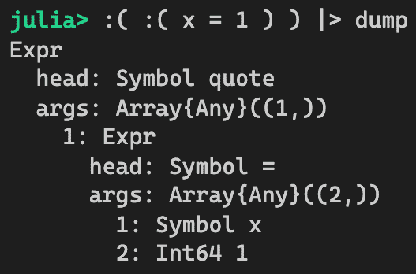
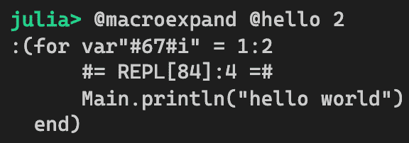
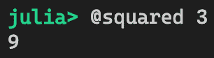

# 第四章：宏和元编程技术

本章将讨论 Julia 编程语言中最强大的两个功能：宏和元编程。

简而言之，元编程是一种编写生成代码的代码的技术——这就是为什么它有前缀*meta*。这可能听起来很神秘，但它是今天许多编程语言中相当常见的实践。例如，C 编译器使用预处理器来读取源代码并生成新的源代码，然后新的源代码被编译成二进制可执行文件。例如，你可以定义一个`MAX`宏，如下所示`#define MAX(a,b) ((a) > (b) ? (a) : (b))`，这意味着每次我们使用`MAX(a,b)`时，它都会被替换为`((a) > (b) ? (a) : (b))`。请注意，`MAX(a,b)`比更长的形式更容易阅读。

元编程的历史相当悠久。早在 20 世纪 70 年代，它就已经在 LISP 编程语言社区中流行起来。有趣的是，LISP 语言的设计方式使得源代码的结构类似于数据——例如，LISP 中的函数调用看起来像`(sumprod x y z)`，其中第一个元素是函数的名称，其余的是参数。由于它实际上只是一个包含四个符号的列表——`sumprod`、`x`、`y`和`z`——我们可以以任何方式操作这段代码——例如，我们可以扩展它以计算数字的和与积，因此生成的代码变为`(list (+ x y z) (* x y z))`。

你可能会想知道我们是否可以只为这个目的编写一个函数。答案是，是的：在我们刚刚查看的两个例子中，没有必要使用元编程技术。这些例子只是为了说明元编程是如何工作的。一般来说，我们可以这样说，99%的时间不需要元编程；然而，仍然有那剩下的 1%的情况，元编程会非常有用。第一部分将探讨我们想要使用元编程的场景。

在本章中，我们将学习 Julia 语言中的几个元编程功能。特别是以下内容将被涵盖：

+   理解元编程的需求

+   与表达式一起工作

+   开发宏

+   使用生成的函数

# 技术要求

示例源代码位于[`github.com/PacktPublishing/Hands-on-Design-Patterns-and-Best-Practices-with-Julia/tree/master/Chapter04`](https://github.com/PacktPublishing/Hands-on-Design-Patterns-and-Best-Practices-with-Julia/tree/master/Chapter04)。

代码在 Julia 1.3.0 环境中进行了测试。

# 理解元编程的需求

在本章的开头，我们大胆地宣称 99%的时间不需要元编程。这确实不是一个虚构的数字。在 2019 年的 JuliaCon 会议中，麻省理工学院的史蒂文·约翰逊教授就元编程发表了主题演讲。他对 Julia 语言的源代码进行了一些研究。从他的研究中，Julia 版本 1.1.0 包含了 37,000 个方法，138 个宏（0.4%），以及 14 个生成函数（0.04%）。因此，元编程代码仅占 Julia 自身实现的不到 1%。虽然这只是元编程在一种语言中作用的例子，但它足以说明即使是最高明的软件工程师也不会经常使用元编程。

所以下一个问题是：何时需要使用元编程技术？一般来说，使用这些技术有几个原因：

1.  它们可能允许以更简洁和更易于理解的方式表达解决方案。如果不使用元编程编写代码，代码看起来会很丑陋，难以理解。

1.  它可能会减少开发时间，因为源代码可以生成而不是手动编写；尤其是样板代码可以被消除。

1.  它可能会提高性能，因为代码是直接编写的而不是通过其他高级编程结构（如循环）执行。

我们现在将看看一些在现实世界中如何使用元编程的例子。

# 使用 @time 宏来衡量性能

Julia 内置了一个有用的宏 `@time`，它可以测量执行代码所需的时间。例如，为了测量计算一千万个随机数之和所需的时间，我们可以这样做：


宏通过在要测量的代码周围插入代码来工作。生成的代码可能看起来像以下这样：

```py
begin
    t1 = now()
    result = sum(rand(10_000_000))
    t2 = now()
    elapsed = t2 - t1
    println("It took ", elapsed)
    result
end
```

新代码使用 `now()` 函数来获取当前时间。然后，它执行用户提供的代码并捕获结果。它再次获取当前时间，计算经过的时间，将计时信息打印到控制台，然后返回结果。

这是否可以不使用元编程来完成？也许我们可以尝试一下。让我们定义一个名为 `timeit` 的函数，如下所示：

```py
function timeit(func)
    t1 = now()
    result = func()
    t2 = now()
    elapsed = t2 - t1
    println("It took ", elapsed)
    result
end
```

要使用这个计时功能，我们需要将表达式包裹在一个函数中。


这个函数工作得相当好，但问题是我们在测量其性能之前必须将代码包裹在一个单独的函数中，这是一件非常不方便的事情。正因为如此，我们可以得出结论，拥有一个 `@time` 宏更为合适。

# 展开循环

宏的另一个用途是将循环展开成重复的代码片段。循环展开是一种性能优化技术。其背后的前提是执行循环代码总是需要一些开销。原因是，每次迭代完成后，循环必须检查条件并决定是否应该退出或继续下一次迭代。现在，如果我们确切知道循环需要运行多少次代码，那么我们可以通过以重复的方式编写代码来*展开*它。

考虑一个简单的循环如下：

```py
for i in 1:3
    println("hello: ", i)
end
```

我们可以将循环展开成三行代码，它们执行完全相同的工作：

```py
println("hello: ", 1)
println("hello: ", 2)
println("hello: ", 3)
```

但手动展开循环将是一项相当无聊和枯燥的任务。此外，工作量会随着循环中所需的迭代次数线性增长。借助`Unroll.jl`，我们可以使用`@unroll`宏定义一个函数，如下所示：

```py
using Unrolled

@unroll function hello(xs)
    @unroll for i in xs
        println("hello: ", i)
    end
end
```

代码看起来像应该的那样干净，`@unroll`宏被插入到函数以及`for`循环之前。首先，我们应该检查代码是否正常工作：


现在，我们应该质疑`@unroll`宏是否真的做了什么。检查循环是否展开的一个好方法是使用`@code_lowered`宏：


降低后的代码明显包含三个`println`语句，而不是一个单独的`for`循环。

什么是降低后的代码？Julia 编译器在将源代码编译成二进制文件之前必须经过一系列的过程。第一步是将代码解析成**抽象语法树**（**AST**）格式，我们将在下一节中学习。之后，它通过*降低*过程来展开宏并将代码转换为具体的执行步骤。

现在我们已经看到了一些示例并了解了元编程的力量，我们将继续学习如何自己创建这些宏。

# 处理表达式

Julia 将任何可运行的程序的源代码表示为树结构。这被称为**抽象语法树**（**AST**）。它被称为*抽象的*，因为树只捕获代码的结构而不是真正的语法。

例如，表达式`x + y`可以用一个树来表示，其中父节点标识自己为函数调用，子节点包括运算符函数`+`和`x`、`y`参数。以下是其实现：


略微复杂一些的表达式`x + 2y + 1`看起来如下所示。虽然它使用了两个加法运算符，但表达式被解析为对`+`函数的单个函数调用，它接受三个参数——`x`、`2y`和`1`。因为`2y`本身也是一个表达式，它可以看作是主抽象语法树的子树：


Julia 编译器必须首先将源代码解析成抽象语法树，然后才能执行额外的转换和分析，例如宏展开、类型检查、类型推断，最终将代码转换成机器码。

# 尝试解析器

因为抽象语法树只是一个数据结构，我们可以在 Julia 的 REPL 环境中直接检查它。让我们从一个简单的表达式开始：`x + y`：


在 Julia 中，每个表达式都表示为一个`Expr`对象。我们可以通过使用`Meta.parse`函数解析一个字符串来创建一个`Expr`对象。

这里，表达式对象以类似于原始源代码的语法显示，以便更容易阅读。我们可以确认该对象具有`Expr`类型如下：


为了查看抽象语法树，我们可以使用`dump`函数来打印结构：


在 Julia 中，每个表达式都由一个头节点和参数数组表示。

在这种情况下，头节点只包含一个`call`符号。`args`数组包含`+`运算符和两个变量，`x`和`y`。请注意，这里的一切都是一个符号——这是可以的，因为我们正在检查源代码本身，它本质上只是一个符号的树。

由于我们在这里玩得很开心，让我们尝试几个其他的表达式。

# 单变量表达式

其中一个最简单的表达式只是一个变量的引用。你可以尝试解析一个数字或字符串字面量，看看它返回什么：


# 带关键字参数的函数调用

让我们尝试一个稍微复杂一些的例子。我们将检查一个函数调用，它接受一个位置参数和两个关键字参数。在这里，我们使用三引号包围代码，以便正确处理其中的双引号：


注意，函数调用以`call`符号作为表达式的头节点。此外，关键字参数表示为子表达式，每个子表达式都有一个头节点`kw`和一个包含参数名称和值的两个元素数组。

# 嵌套函数

我们可能会好奇当函数嵌套时，Julia 是如何解析代码的。这里我们可以选择一个简单的例子，它计算`x+1`的正弦值，然后计算结果的余弦值。抽象语法树如下所示：


这里，我们可以清楚地看到树结构。最外层的函数`cos`包含一个参数，它是一个调用`sin`函数的表达式节点。这个表达式反过来包含一个参数，它是一个调用带有两个参数的`+`运算符函数的表达式节点——`x`变量和值为`1`。现在，让我们继续我们的表达式工作。

# 手动构建表达式对象

由于表达式只是一个数据结构，我们可以很容易地通过编程方式构建它们。理解如何做到这一点对于元编程至关重要，元编程涉及在运行时创建新的代码结构。

`Expr`构造函数有以下签名：

```py
Expr(head::Symbol, args...)
```

头部节点总是携带一个符号。参数只包含头部节点期望的内容——例如，简单的表达式`x + y`可以创建如下：


当然，如果我们想的话，我们总是可以创建一个嵌套表达式：


到这个时候，你可能想知道是否有更简单的方法来创建表达式，而无需手动构建`Expr`对象。当然，可以像下面这样做到：


基本上，我们可以用左边的`:(`和右边的`)`将任何表达式包裹起来。代码块内的代码将不会被评估，而是被解析为一个表达式对象；然而，这种引用方式只适用于单个表达式——如果你尝试用多个表达式这样做，将会显示错误，如下面的代码所示：


这是不行的，因为多个表达式应该用`begin`和`end`关键字包裹。所以如果我们输入以下代码块会更好：


结果有点有趣。正如你所见，代码现在被包裹在一个`quote/end`块中，而不是`begin/end`块中。这实际上是有道理的，因为显示的是引用的表达式而不是原始源代码。记住，这是抽象语法树而不是原始代码。

结果表明`quote/end`可以直接用来创建表达式：


我们现在已经学会了如何将源代码解析为表达式对象。接下来，我们将探讨更复杂的表达式，以便我们更熟悉 Julia 程序的基本代码结构。

# 玩转更复杂的表达式

正如我们之前所说的，任何有效的 Julia 程序都可以表示为一个抽象语法树。现在我们已经有了创建表达式对象的构建块，让我们考察一些更多的结构，看看更复杂程序的表达式对象是什么样的。

# 赋值

我们首先看看赋值是如何工作的。考虑以下代码：


从前面的代码中，我们可以看到变量赋值有一个`=`的头部节点和两个参数——要赋值的变量（在这个例子中是`x`）和另一个表达式对象。

# 代码块

代码块由`begin`和`end`关键字包围。让我们看看抽象语法树是什么样子的。


头节点只包含一个 `block` 符号。当块中有多行时，抽象语法树也包括行号节点。在这个例子中，有一个 `LineNumberNode` 在 `println` 的第一次调用之前，行号为 2。同样，还有一个 `LineNumberNode` 在 `println` 的第二次调用之前，行号为 3。`LineNumberNode` 节点不做任何事情，但它们对于堆栈跟踪和调试很有用。

# 条件

接下来，我们将探索条件结构，如 `if-else-end`。参考以下代码：


头节点包含 `if` 符号。有三个参数——一个表示条件的表达式，一个当条件满足时的块表达式，以及一个当条件不满足时的另一个块表达式。

# 循环

我们现在将转向循环结构。考虑一个简单的 `for` 循环，如下所示：


头节点包含 `for` 符号。有两个参数：第一个包含关于循环的表达式，第二个包含一个块表达式。

# 函数定义

接下来，我们将看到函数定义的结构。考虑以下代码：


头节点包含 `function` 符号。然后，第一个参数包含一个带有参数的 `call` 表达式。第二个参数只是一个块表达式。

调用表达式可能看起来有点奇怪，因为我们之前在函数被调用时见过类似的表达式对象。这是正常的，因为我们目前处于语法层面。函数定义的语法确实与函数调用本身非常相似。

到现在为止，我们已经看到了足够的例子。显然，还有许多我们没有探索的代码结构。我们鼓励您使用相同的技巧来检查其他代码结构。理解抽象语法树的结构对于编写良好的元编程代码至关重要。接下来，我们将看到如何评估这些表达式。

# 评估表达式

我们已经详细地探讨了创建表达式对象的过程。但它们有什么用呢？记住，表达式对象只是 Julia 程序的抽象语法树表示。在这个阶段，我们可以要求编译器继续将表达式转换为可执行代码，然后运行程序。

表达式对象可以通过调用 `eval` 函数来评估。本质上，Julia 编译器将完成剩余的编译过程并运行程序。现在，让我们启动一个新的、全新的 REPL 并运行以下代码：


显然，这只是一个简单的赋值操作。我们可以看到，`x` 变量现在在当前环境中被定义了：


注意，表达式的评估实际上是在全局范围内进行的。我们可以通过在函数内部运行 `eval` 来证明这一点：


这不是一项无关紧要的观察！乍一看，我们可能预计 `y` 变量将在 `foo` 函数内部被分配；然而，变量分配实际上是在全局范围内发生的，因此 `y` 变量作为副作用在当前环境中被定义。

更确切地说，表达式是在当前模块中评估的。由于我们在 REPL 中进行测试，评估是在名为 `Main` 的当前模块中完成的。表达式被设计成这样，因为 `eval` 通常用于代码生成，这在定义模块内的变量或函数时可能很有用。

接下来，我们将学习如何更轻松地创建表达式对象。

# 表达式中的变量插值

从引号块中构造表达式非常简单。但如果我们想动态创建表达式怎么办？这可以通过 *插值* 实现，它允许我们使用简单的语法将变量值插入到表达式对象中。表达式中的插值与变量可以在字符串中插值的方式非常相似。下面的截图显示了示例：


如预期的那样，`2` 的值在表达式中被正确替换。请注意，`splatting` 也得到了支持，如下所示：


我们必须确保包含散列操作符的变量在这种情况下被插值。如果我们忘记在 `v...` 周围放置括号，那么我们会得到一个非常不同的结果：


在这里，散列操作实际上并没有在表达式插值过程中发生。相反，散列操作符现在成为表达式的一部分，因此散列操作将不会发生，直到表达式被评估。

在如 `$v...` 这样的表达式中，优先级顺序有些不清楚。`v` 变量是在散列操作之前还是之后绑定到插值操作的？在这种情况下，最好在我们想要插值的内容周围使用括号。因为我们希望插值完全发生，语法应该是 `$(v...)`。在需要运行时进行散列操作的情况下，我们可以写成 `$(v)...`。

插值是编写宏的重要概念。我们将在本章后面看到更多关于它的用法。接下来，我们将看到如何处理具有符号值的表达式。

# 使用 QuoteNode 为符号构造表达式

符号在表达式中出现时非常特殊。它们可能出现在表达式对象的头部节点中——例如，变量赋值表达式中的 `=` 符号。它们也可能出现在表达式对象的参数中，在这种情况下，它们将代表一个变量：


由于符号已经用来表示变量，我们如何将一个实际的符号赋给一个变量呢？为了弄清楚这是如何工作的，我们可以使用我们迄今为止学到的一个技巧——使用 `dump` 函数来检查表达式对象中的此类语句：


正如我们所见，一个实际的符号必须被包含在 `QuoteNode` 对象中。现在我们知道了需要什么，我们应该尝试将一个实际的符号插值到表达式对象中。实现这一目标的方法是手动创建一个 `QuoteNode` 对象，并像往常一样使用插值技术：


一个常见的错误是忘记创建 `QuoteNode`。在这种情况下，表达式对象将错误地解释符号，并将其视为变量引用。显然，结果非常不同，并且它将无法正常工作：


不使用 `QuoteNode` 会生成将一个变量的值赋给另一个变量的代码。在这种情况下，变量 `x` 将被赋予来自变量 `hello` 的一个值。

理解 `QuoteNode` 的工作原理对于动态创建表达式至关重要。程序员将符号插值到现有表达式中是很常见的。因此，接下来我们将探讨如何处理嵌套表达式。

# 在嵌套表达式中进行插值

有可能存在一个包含另一个引用表达式的引用表达式。除非程序员需要编写元元程序，否则这不是一个常见的做法。尽管如此，我们仍然应该了解如何在这样的情况下进行插值。

首先，让我们回顾一下单层表达式的样子：


我们可以通过将引用表达式包裹在另一个引用块中来查看嵌套表达式的结构：



现在，让我们尝试在这样的表达式中进行插值：


正如我们所见，`2` 值并没有进入表达式。表达式的结构也完全不同于我们预期的。解决方案是只需通过使用两个 `$` 符号将变量插值两次：


通常，插值超过一层深度可能不是很有趣，因为逻辑变得难以处理。然而，如果你需要为宏生成代码，这可能是有用的。我绝对不建议你超过两层深度并编写元元元程序！

到现在为止，你应该对表达式更加熟悉，并且能够舒适地与之工作。从 Julia 的 REPL 中，很容易看到表达式是如何作为`Expr`对象来表示的结构的。你应该能够构造新的表达式并在其中插值值；这些是进行元编程所必需的基本技能。

在下一节中，我们将探讨 Julia 中一个强大的元编程特性——宏。

# 开发宏

现在我们已经理解了源代码是如何表示为抽象语法树的，我们可以通过编写宏来开始做一些更有趣的事情。在本节中，我们将学习宏是什么以及如何与之工作。

# 宏是什么？

宏是接受表达式、操作它们并返回新表达式的函数。这最好通过一个图表来理解：


如我们所知，表达式只是源代码的抽象语法树表示。因此，Julia 中的宏功能允许你取任何源代码并生成新的源代码。然后，生成的表达式就像源代码直接在原地编写一样被执行。

在这一点上，你可能想知道为什么我们不能使用常规函数来实现相同的事情。为什么我们不能编写一个接受表达式、生成新表达式然后执行结果的函数？

有两个主要原因：

+   宏扩展发生在编译期间。这意味着宏只从它被使用的地方执行一次——例如，当宏从一个函数中调用时，宏是在函数定义时执行的，以便函数可以被编译。

+   宏生成的表达式可以在当前作用域内执行。在运行时，由于函数本身已经编译，没有其他方法可以在函数内部执行任何动态代码。所以，评估任何表达式的唯一方法是在全局作用域内进行。

到本章结束时，你应该对宏的工作原理以及它们与函数的不同之处有更好的理解。

既然我们现在已经理解了宏是什么，我们将继续我们的旅程，编写我们的第一个宏。

# 编写我们的第一个宏

宏的定义方式与函数的定义方式类似，只是使用`macro`关键字而不是`function`关键字。

我们还应该记住，一个宏必须返回表达式。让我们创建我们的第一个宏。这个宏返回一个包含`for`循环的表达式对象，如下所示：

```py
macro hello()
    return :(
    for i in 1:3
        println("hello world")
    end
    )
end
```

调用宏就像用`@`前缀调用它一样简单。请参考以下代码：


与函数不同，宏可以在不使用括号的情况下调用。所以我们可以这样做：


*太棒了!* 我们现在已经编写了我们的第一个宏。虽然它看起来并不非常令人兴奋，因为生成的代码只是一段静态的代码，但我们已经学会了如何定义宏并运行它们。

接下来，我们将学习如何向宏传递参数。

# 传递字面量参数

就像函数一样，宏也可以接受参数。实际上，接受参数是宏最常见的用法。最简单的参数类型是字面量，例如数字、符号和字符串。

为了在返回的表达式中利用这些参数，我们可以使用我们在上一节中学到的插值技术。考虑以下代码：

```py
macro hello(n)
    return :(
    for i in 1:$n
        println("hello world")
    end
    )
end
```

`hello`宏接受一个参数，`n`，当宏运行时，这个参数会被插入到表达式中。像之前一样，我们可以这样调用宏：


如我们之前所学的，括号不是必需的，因此我们也可以这样调用宏：


你可以用字符串或符号参数尝试类似的练习。传递字面量很容易理解，因为它与函数的工作方式相同。但宏和函数之间确实存在细微的差别，我们将在下一节中详细讨论。

# 传递表达式参数

重要的是要强调，宏参数是以表达式而不是值的形式传递的。对于初学者来说，这可能会看起来有些混乱，因为宏的调用方式与函数相似，但行为完全不同。

让我们确保我们完全理解这意味着什么。当用一个变量调用一个函数时，变量的值会被传递到函数中。考虑以下`showme`函数的示例代码：


现在，让我们创建一个`@showme`宏，它除了在控制台显示参数外，不做任何事情。然后我们可以将结果与前面的代码进行比较：


如我们所见，运行宏的结果与调用函数得到的结果完全不同。函数参数`x`实际上只看到了宏被调用处的表达式。从本节开头的图中，我们可以看到宏应该接受表达式并返回一个单一的表达式作为结果。它们在语法层面上工作，不知道参数的值。

如我们在下一节中将要看到的，当宏运行时，表达式甚至可以被操作。让我们开始吧！

# 理解宏展开过程

按照惯例，每个宏都必须返回一个表达式。从一个或多个表达式取值并返回一个新的表达式的过程被称为**宏展开**。有时，看到返回的表达式而不实际运行代码是有帮助的。我们可以使用`@macroexpand`宏来达到这个目的。让我们尝试使用它来处理我们在这节中之前定义的`@hello`宏：



从这个输出中，有几个需要注意的事项：

+   `i`变量被非常奇怪地重命名为`#67#i`。这是 Julia 编译器为了确保*卫生性*而做的，我们将在本章后面讨论。宏的卫生性是一个需要记住的重要特性，以确保生成的代码不会与其他代码冲突。

+   在包含源文件和行号信息的循环中插入了一条注释。当使用调试器时，这是表达式的一个有用部分。

+   对`println`的函数调用绑定到当前环境中的`Main`。这很有意义，因为`println`是`Core`包的一部分，并且对于每个 Julia 程序都会自动引入作用域。

因此，宏展开何时发生？让我们接下来讨论这个问题。

# 宏展开的时机

在 REPL 中，任何宏在我们调用它时都会立即展开。有趣的是，当定义包含宏的函数时，宏作为函数定义过程的一部分被展开。

我们可以通过开发一个简单的返回传递给它的任何表达式的`@identity`宏来看到这一点。在表达式返回之前，我们只是将对象`dump`到屏幕上。`@identity`宏的代码如下：

```py
macro identity(ex)
    dump(ex)
    return ex
end
```

由于这个宏返回了传递给它的相同的表达式，它最终应该执行宏后面的原始源代码。

现在，让我们定义一个使用`@identity`宏的函数：


显然，编译器已经发现宏被用于`foo`函数的定义中，为了编译`foo`函数，它必须理解`@identity`宏的作用。因此，它展开了宏，并将其嵌入到函数定义中。在宏展开过程中，表达式被显示出来。

如果我们对`foo`函数使用`@code_lowered`宏，我们可以看到展开的代码现在位于`foo`函数的主体中：


在开发过程中，程序员可能会频繁地更改函数、宏等的定义。因为宏在定义函数时会被展开，所以如果使用的任何宏被更改，重新定义函数就很重要；否则，函数可能会继续使用先前宏定义生成的代码。

`@macroexpand`实用工具是开发宏不可或缺的工具，特别是对于调试目的非常有用。

接下来，我们将尝试通过在宏中操作表达式来更加有创意。

# 操作表达式

宏之所以强大，是因为它们允许在宏展开过程中操作表达式。这是一种非常有用的技术，尤其是在代码生成和设计领域特定语言时。让我们通过一些示例来了解可能实现的内容。

# 示例 1 – 创建新的表达式

让我们从简单的开始。假设我们想要创建一个名为 `@squared` 的宏，它接受一个表达式并将其平方。换句话说，如果我们运行 `@squared(x)`，那么它应该被翻译成 `x * x`：

```py
macro squared(ex)
    return :($(ex) * $(ex))
end
```

初看起来，当我们从 REPL 运行它时，它似乎工作得很好：



但这个宏在执行上下文方面存在问题。最好的说明问题的方式是定义一个使用该宏的函数。所以让我们定义一个 `foo` 函数，如下所示：

```py
function foo()
    x = 2
    return @squared x
end
```

现在，当我们调用该函数时，我们得到以下错误：


为什么会这样？这是因为，在宏展开期间，`x` 符号指的是模块中的变量，而不是 `foo` 函数中的局部变量。我们可以通过使用 `@code_lowered` 宏来确认这一点：


显然，我们的意图是平方局部 `x` 变量，而不是 `Main.x`。解决这个问题的一个简单方法是，在插值时使用 `esc` 函数，以便将表达式直接放入语法树中，而不让编译器解析它。以下是如何做到这一点的方法：

```py
macro squared(ex)
    return :($(esc(ex)) * $(esc(ex)))
end
```

由于宏是在 `foo` 定义之前展开的，我们需要再次定义 `foo` 函数，如下所示，以便这个更新的宏生效。或者，您也可以启动一个新的 REPL，并再次定义 `@squared` 宏和 `foo` 函数。下面是操作步骤：


现在 `foo` 函数工作正常了。

从这个例子中，我们学习了如何使用插值技术创建新的表达式。我们还了解到，插值变量需要使用 `esc` 函数进行转义，以避免编译器将其解析为全局作用域。

# 示例 2 - 调整抽象语法树

假设我们想要设计一个名为 `@compose_twice` 的宏，它接受一个简单的函数调用表达式，并再次以结果调用相同的函数——例如，如果我们运行 `@compose_twice sin(x)`，那么它应该被翻译成 `sin(sin(x))`。

在我们编写宏之前，让我们首先熟悉一下表达式的抽象语法树：


`sin(sin(x))` 的样子如何？请参考以下内容：


没有惊喜。顶层调用的第二个参数只是另一个看起来与我们之前看到的样子一样的表达式。

我们可以按照以下方式编写宏：

```py
macro compose_twice(ex)
    @assert ex.head == :call
    @assert length(ex.args) == 2
    me = copy(ex)
    ex.args[2] = me
    return ex
end
```

前两个 `@assert` 语句用于确保表达式代表一个接受单个参数的函数调用。由于我们想用类似的表达式替换参数，我们只需复制当前表达式对象并将其分配给 `ex.args[2]`。然后宏返回用于评估的结果表达式。

我们可以验证宏是否工作正常：


如你所见，我们可以通过直接操作抽象语法树来转换源代码，而不是将变量插值到看起来很棒的表达式中。

到现在为止，你可能已经体会到了元编程的强大之处。与使用插值相比，直接操作表达式并不容易理解，因为生成的表达式并没有在代码中表示；然而，操作表达式的能力为转换源代码提供了最大的灵活性。

接下来，我们将介绍元编程的一个重要特性——宏的卫生性。

# 理解宏的卫生性

宏的卫生性指的是保持宏生成代码清洁的能力。它被称为卫生性，因为生成的代码不会受到其他代码部分的影响。

注意到许多其他编程语言并不提供这样的保证。以下是一个包含名为`SWAP`的宏的 C 程序，该宏用于交换两个变量的值：

```py
#include <stdio.h>

#define SWAP(a,b) temp=a; a=b; b=temp;

int main(int argc, char *argv[])
{
    int a = 1;
    int temp = 2;

    SWAP(a,temp);
    printf("a=%d, temp=%d\n", a, temp);
}
```

然而，运行这个 C 程序会产生一个错误的结果：


它没有正确地交换`a`和`temp`变量，因为`temp`变量也在宏的主体中用作临时变量。

让我们回到 Julia。考虑以下宏，它只是运行一个`ex`表达式，并重复`n`次：

```py
macro ntimes(n, ex)
    quote
        times = $(esc(n))
        for i in 1:times
            $(esc(ex))
        end
    end
end
```

由于`times`变量用于返回的表达式中，如果调用点已经使用了相同的变量名，会发生什么？让我们尝试以下示例代码，它在宏调用之前定义了一个`times`变量，并在宏调用之后打印相同变量的值：

```py
function foo()
    times = 0
    @ntimes 3 println("hello world")
    println("times = ", times)
end
```

如果宏展开器将其字面地处理，那么在宏调用之后`times`变量将被修改为`3`；然而，我们可以在以下代码中看到它正常工作：


它之所以能工作，是因为宏系统能够通过将`times`变量重命名为不同的名称来保持卫生性，从而避免冲突。魔法在哪里？让我们通过使用`@macroexpand`查看展开的代码：


在这里，我们可以看到`times`变量已经变成了`#44#times`。循环变量`i`也变成了`#45#i`。这些变量名是由编译器动态生成的，以确保宏生成的代码不会与其他用户编写的代码冲突。

宏的卫生性是宏正确运行的一个基本特性。程序员不需要做任何事情：Julia 自动提供保证。

接下来，我们将探讨一种不同类型的宏，它为非标准字符串字面量提供动力。

# 开发非标准字符串字面量

有一种特殊的宏用于定义非标准字符串字面量，它们看起来像字面量字符串，但在引用时实际上会调用一个宏。

一个好例子是 Julia 的正则表达式字面量——例如，`r"^hello"`。由于双引号前的 `r` 前缀，它不是一个标准的字符串字面量。让我们首先检查这种字面量的数据类型。我们可以看到，从字符串创建了一个 `Regex` 对象：


我们还可以创建自己的非标准字符串字面量。让我们在这里一起尝试一个有趣的例子。

假设，为了开发目的，我们想要方便地创建具有不同类型列的样本数据帧。这样做的方法有点繁琐：


想象一下，我们偶尔需要创建具有不同数据类型的数十列。创建此类数据帧的代码会非常长，作为一个程序员，我会在输入所有这些时感到极其无聊。因此，我们可以设计一个字符串字面量，使其包含构建此类数据帧的规范——让我们称它为 `ndf`（数值数据帧）字面量。

`ndf` 的规范只需编码所需的行数和列类型。例如，字面量 `ndf"100000:f64,i16"` 可以用来表示前面的样本数据帧，其中需要 100,000 行，有两列分别标记为 `Float64` 和 `Int16` 列。

要实现这个功能，我们只需定义一个名为 `@ndf_str` 的宏。该宏接受一个字符串字面量并相应地创建所需的数据帧。以下是一种实现宏的方法：

```py
macro ndf_str(s)
    nstr, spec = split(s, ":")
    n = parse(Int, nstr) # number of rows
    types = split(spec, ",") # column type specifications

    num_columns = length(types)

    mappings = Dict(
    "f64"=>Float64, "f32"=>Float32,
    "i64"=>Int64, "i32"=>Int32, "i16"=>Int16, "i8"=>Int8)

    column_types = [mappings[t] for t in types]
    column_names = [Symbol("x$i") for i in 1:num_columns]

    DataFrame([column_names[i] => rand(column_types[i], n)
        for i in 1:num_columns]...) 
end
```

前几行解析字符串并确定行数（`n`），以及列的类型（`types`）。然后，创建一个名为 `mappings` 的字典来将缩写映射到相应的数值类型。列名和类型从类型和映射数据生成。最后，它调用 `DataFrame` 构造函数并返回结果。

现在我们已经定义了宏，我们可以轻松地创建新的数据帧，如下所示：


非标准字符串字面量在特定情况下非常有用。我们可以将字符串规范视为编码在字符串中的迷你领域特定语言。只要字符串规范定义良好，它可以使代码更短、更简洁。

你可能已经注意到，`ndf_str` 宏返回一个常规的 `DataFrame` 对象，而不是通常宏会返回的表达式对象。这是完全可以的，因为最终的 `DataFrame` 对象将按原样返回。你可能认为常量的评估只是常量本身。我们在这里可以只返回一个值而不是表达式，因为返回的值不涉及调用点或模块中的任何变量。

一个好奇的头脑可能会问——为什么我们不能只为这个例子创建一个常规函数呢？我们当然可以为此虚拟示例做这件事。然而，使用字符串字面量在某些情况下可能会提高性能。

例如，当我们在一个函数中使用正则表达式字符串字面量时，`Regex`对象是在编译时创建的，因此它只执行一次。如果我们使用`Regex`构造函数，那么对象会在每次函数调用时创建。

我们现在已经结束了关于宏的主题。我们学习了如何通过取表达式并生成一个新的表达式来创建宏。我们使用了`@macroexpand`宏来调试宏展开过程。我们还学习了如何处理宏的卫生问题。最后，我们查看了一下非标准字符串字面量，并使用宏创建了我们的自定义字符串字面量。

接下来，我们将探讨另一个元编程功能，称为生成函数，它可以用来解决常规宏无法处理的不同类型的问题。

# 使用生成函数

到目前为止，我们已经解释了如何创建返回表达式对象的宏。由于宏在语法级别工作，它们只能通过检查代码的外观来操作代码。然而，Julia 是一个在运行时确定数据类型的动态系统。因此，Julia 提供了创建**生成函数**的能力，这允许你检查函数调用的数据类型并返回一个表达式，就像宏一样。当表达式返回时，它将在调用位置被评估。

要理解为什么需要生成函数，让我们回顾一下宏是如何工作的。假设我们创建了一个宏，它将它的参数值加倍。它看起来会像以下这样：

```py
macro doubled(ex)
    return :( 2 * $(esc(ex)))
end
```

无论我们传递给这个宏的什么表达式，它都会盲目地重写代码，使其加倍原始表达式。假设有一天，开发了一个超级无敌的软件，可以让我们快速计算浮点数的两倍。在这种情况下，我们可能希望系统只为浮点数切换到该函数，而不是使用标准的乘法运算符。

因此，我们的第一次尝试可能是尝试以下内容：

```py
# This code does not work. Don't try it.
macro doubled(ex)
    if typeof(ex) isa AbstractFloat
        return :( double_super_duper($(esc(ex))) )
    else
        return :( 2 * $(esc(ex)))
    end
end
```

但不幸的是，宏无法做到这一点。为什么？再次，宏只能访问抽象语法树。这是编译管道的早期部分，没有类型信息可用。前面代码中的`ex`变量仅仅是一个表达式对象。这个问题可以通过生成函数来解决。继续阅读！

# 定义生成函数

**生成函数**是在函数定义前带有`@generated`前缀的函数。这些函数可以返回表达式对象，就像宏一样。例如，我们可以定义`doubled`函数如下：

```py
@generated function doubled(x)
    return :( 2 * x )
end
```

让我们快速运行一个测试，确保它工作：


代码运行得非常完美，正如预期的那样。

因此，定义生成函数与定义宏非常相似。在两种情况下，我们都可以创建一个表达式对象并返回它，并且我们可以期望表达式被正确评估。

然而，我们还没有充分发挥生成函数的全部威力。接下来，我们将探讨如何使数据类型信息可用，以及如何在生成函数中使用它。

# 检查生成函数参数

需要记住的一个重要观点是，生成函数的参数包含数据类型，而不是实际值。以下是如何生成函数工作的视觉表示：


这与接受作为值的参数的函数形成鲜明对比。它也与接受作为表达式的参数的宏不同。在这里，生成函数接受参数作为数据类型。这可能会显得有些奇怪，但让我们做一个简单的实验来确认这确实如此。

对于这个实验，我们将再次通过在返回表达式之前在屏幕上显示参数来定义`doubled`函数。

```py
@generated function doubled(x)
    @show x
    return :( 2 * x )
end
```

让我们再次测试这个函数。


如所示，在生成函数执行过程中，参数`x`的值是`Int64`而不是`2`。此外，当函数再次被调用时，它不再显示`x`的值。这是因为函数现在在第一次调用后被编译。

现在，让我们看看如果我们用不同的类型再次运行会发生什么：


编译器再次启动，并基于`Float64`的类型编译了一个新版本。从技术上讲，我们现在为每种参数类型都有两个版本的`doubled`函数。

您可能已经意识到，生成函数在专业化方面与常规函数的行为相似。区别在于我们有在编译发生之前操作抽象语法树的机会。

使用这个新的生成函数，我们现在可以利用假设的超级软件，通过切换到更快的`double_super_duper`函数来利用它，只要参数的数据类型是`AbstractFloat`的子类型，如下面的代码所示：

```py
@generated function doubled(x)
    if x <: AbstractFloat
        return :( double_super_duper(x) )
    else
        return :( 2 * x )
    end
 end
```

使用生成函数，我们可以根据参数的类型来专门化函数。当类型是`AbstractFloat`时，函数将回退到`double_super_duper(x)`而不是`2 *x`表达式。

如官方 Julia 语言参考手册中所述，在开发生成函数时必须谨慎。确切的限制超出了本书的范围。如果您需要为您的软件编写生成函数，强烈建议您查阅手册。

生成函数是处理宏无法处理的案例的有用工具。具体来说，在宏展开过程中，没有关于参数类型的信息。生成函数使我们能够更接近编译过程的核心。有了关于参数类型的额外知识，我们在处理不同情况时更加灵活。

作为元编程工具，宏的使用比生成函数广泛得多。然而，了解这两种工具都可用是很好的。

# 摘要

在本章中，我们学习了 Julia 如何将表达式解析为抽象语法树结构。我们了解到表达式可以通过编程方式创建和评估。我们还学习了如何将变量插入到引号表达式。

然后，我们转向了宏的主题，宏用于动态创建新代码。我们了解到宏参数是表达式而不是值，并学习了如何从宏中创建新表达式。我们享受着创建宏来操作抽象语法树以处理一些有趣的用例。

最后，我们探讨了生成函数，这些函数可以根据函数参数的类型生成代码。我们学习了生成函数在假设用例中的有用之处。

现在我们已经完成了关于 Julia 编程语言入门部分的书籍。在下一章，我们将开始探讨与代码重用相关的设计模式。

# 问题

1.  我们可以使用哪两种方式来引用表达式，以便稍后可以操作代码？

1.  在什么环境下`eval`函数执行代码？

1.  你如何将物理符号插入到引号表达式中，以便它们不会被误解释为源代码？

1.  定义非标准字符串字面量的宏的命名约定是什么？

1.  你在什么时候使用`esc`函数？

1.  生成函数与宏有什么不同？

1.  你如何调试宏？
