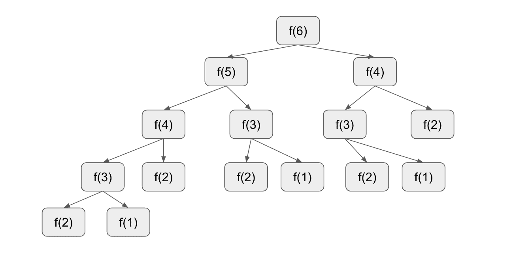
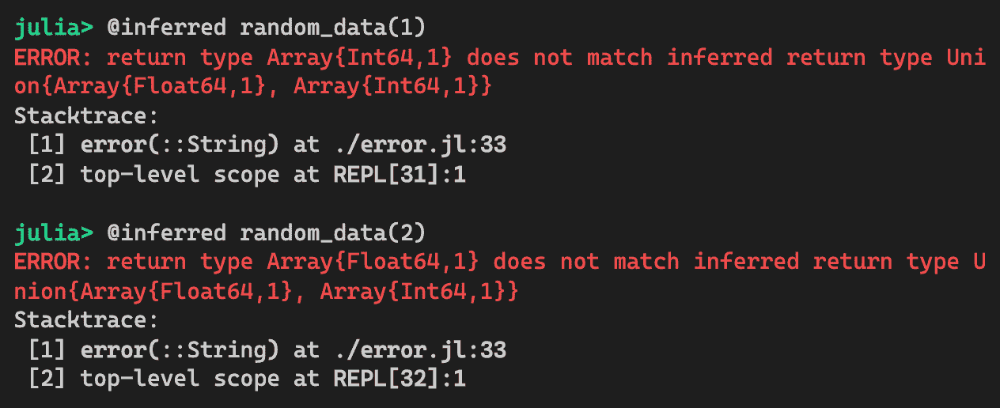

# 性能模式

本章包括与提高系统性能相关的模式。高性能是科学计算、人工智能、机器学习和大数据处理的主要要求。为什么是这样？

在过去十年中，由于云的可扩展性，数据几乎呈指数级增长。想想看**物联网**（**IoT**）。传感器无处不在——家庭安全系统、个人助理，甚至是室温控制都在持续收集大量数据。此外，收集到的数据被希望构建更智能产品的公司存储和分析。这样的用例需要更多的计算能力和速度。

我曾经与一位同事就使用云计算技术来解决计算密集型问题进行了辩论。云计算中确实有计算资源，但它们不是免费的。因此，设计计算机程序以更加高效和优化，以避免在云中产生不必要的成本，这一点非常重要。

幸运的是，Julia 编程语言允许我们轻松地充分利用 CPU 资源。只要遵循一些规则，让事情变得快速并不困难。在线的 Julia 参考手册已经包含了一些技巧。本章提供了由经验丰富的 Julia 开发者广泛使用的进一步模式，以提升性能。

我们将探讨以下设计模式：

+   全局常量

+   数组结构

+   共享数组

+   缓存

+   障碍函数

让我们开始吧！

# 技术要求

示例源代码位于[`github.com/PacktPublishing/Hands-on-Design-Patterns-and-Best-Practices-with-Julia/tree/master/Chapter06`](https://github.com/PacktPublishing/Hands-on-Design-Patterns-and-Best-Practices-with-Julia/tree/master/Chapter06)。

代码在 Julia 1.3.0 环境中进行了测试。

# 全局常量模式

全局变量通常被认为是有害的。我不是在开玩笑——它们确实是有害的。如果你不相信我，只需在谷歌上搜索一下。它们之所以不好，有很多原因，但在 Julia 语言中，它们也可能成为应用性能不佳的诱因。

我们为什么要使用全局变量？在 Julia 语言中，变量要么在全局作用域，要么在局部作用域。例如，模块顶层所有的变量赋值都被认为是全局的。出现在函数内部的变量是局部的。考虑一个连接外部系统的应用程序——在连接时通常会创建一个句柄对象。这样的句柄对象可以保存在全局变量中，因为模块中的所有函数都可以访问这个变量，而无需将其作为函数参数传递。这就是便利性因素。此外，这个句柄对象只需要创建一次，然后可以在后续操作中随时使用。

不幸的是，全局变量也伴随着成本。一开始可能不明显，但它确实会影响性能——在某些情况下，影响相当严重。在本节中，我们将讨论全局变量如何影响性能，以及如何通过使用全局常量来解决这个问题。

# 使用全局变量进行性能基准测试

有时，使用全局变量很方便，因为它们可以从代码的任何地方访问。然而，当使用全局变量时，应用程序的性能可能会受到影响。让我们一起找出性能受到了多么严重的影响。这是一个非常简单的函数，它只是将两个数字相加：

```py
variable = 10

function add_using_global_variable(x)
    return x + variable
end
```

为了基准测试这段代码，我们将使用伟大的`BenchmarkTools.jl`包，它可以多次运行代码并报告一些性能统计数据。让我们开始吧：


对于仅仅加两个数字来说，这似乎有点慢。让我们去掉全局变量，只使用两个函数参数来加这些数字。我们可以定义新的函数如下：

```py
function add_using_function_arg(x, y)
    return x + y
end
```

让我们来基准测试这个新函数：


这真是太令人难以置信了！移除对全局变量的引用使函数的速度提高了近 900 倍。为了了解性能下降的原因，我们可以使用 Julia 的内置内省工具来查看生成的 LLVM 代码。

这是更快版本的生成代码。它很干净，只包含一个`add`指令：


另一方面，使用全局变量的函数生成了以下丑陋的代码：


为什么会这样？编译器不应该更聪明吗？答案是编译器实际上无法假设全局变量总是整数。因为它是一个变量，这意味着它可以随时更改，编译器必须生成能够处理任何数据类型的代码，以确保安全。好吧，这种额外的灵活性在这种情况下引入了巨大的开销。

# 享受全局常量的速度

为了提高性能，让我们使用`const`关键字创建一个全局常量。然后，我们可以定义一个新的函数来访问这个常量，如下所示：

```py
const constant = 10

function add_using_global_constant(x)
    return constant + x
end
```

让我们现在基准测试它的性能：


*这是完美的!* 如果我们再次内省这个函数，我们得到以下整洁的代码：


接下来，我们将讨论如何使用全局变量（不是常量）并使其稍微好一些。

# 使用类型信息注释变量

当我们只需使用全局常量时，这是最好的。但如果变量在应用程序的生命周期中确实需要更改呢？例如，它可能是一个全局计数器，用于跟踪网站上的访问者数量。

起初，我们可能会想这样做，但很快我们就意识到 Julia 不支持用类型信息注释全局变量：


相反，我们可以做的是在函数内部注释变量类型，如下所示：

```py
function add_using_global_variable_typed(x)
    return x + variable::Int
end
```

让我们看看它的性能如何：


与未类型化的 31 纳秒版本相比，这已经是一个相当大的速度提升了！然而，它仍然远远落后于全局常量解决方案。

# 理解常数如何帮助性能

由于以下原因，编译器在处理常数时拥有更多的自由度：

+   值不会改变。

+   常数的类型不会改变。

在我们查看一些简单的例子之后，这会变得清楚。

让我们看看以下函数：

```py
function constant_folding_example()
    a = 2 * 3
    b = a + 1
    return b > 1 ? 10 : 20
end
```

如果我们只遵循逻辑，那么不难看出它总是返回值为`10`。让我们快速展开它：

+   `a`变量有一个值为`6`。

+   `b`变量有一个值为`a + 1`，即`7`。

+   因为`b`变量大于`1`，它返回`10`。

从编译器的角度来看，`a`变量可以被推断为常数，因为它被赋值但从未改变，同样对于`b`变量也是如此。

我们可以看看 Julia 为这个生成的代码：


Julia 编译器会经过几个阶段。在这种情况下，我们可以使用`@code_typed`宏，它显示了所有类型信息都已解决的生成的代码。

*哇!* 编译器已经全部弄明白了，并只为这个函数返回了一个值为`10`。

我们意识到这里发生了一些事情：

+   当编译器看到两个常数值的乘法（`2 * 3`）时，它计算了`a`的最终值为`6`。这个过程被称为**常数折叠**。

+   当编译器推断出`a`的值为`6`时，它计算出`b`的值为`7`。这个过程被称为**常数传播**。

+   当编译器推断出`b`的值为`7`时，它从`if-then-else`操作中剪除了`else`分支。这个过程被称为**死代码消除**。

Julia 的编译器优化真正是处于一流水平。这些只是我们可以自动获得性能提升的一些例子，而无需重构大量代码。

# 将全局变量作为函数参数传递

另一种解决全局变量问题的方法是，在一个性能敏感的函数中，而不是直接访问全局变量，我们可以将全局变量作为参数传递给函数。

让我们通过添加第二个参数来重构本节中较早的代码，如下所示：

```py
function add_by_passing_global_variable(x, v)
    return x + v
end
```

现在，我们可以通过传递变量来调用函数。让我们按照以下方式基准测试代码：


*太棒了!* 它的速度和将其视为常量一样快。魔法在哪里？实际上，Julia 的编译器会根据其参数的类型自动生成专门的函数。在这种情况下，当我们以整数值传递变量时，函数被编译为最优化版本，因为参数的类型是已知的。它现在之所以快，是因为和用常量一样的原因。

当然，你可能会争辩说这违背了使用全局变量的初衷。然而，这种灵活性确实存在，并且在你真正需要获得最佳性能时可以加以利用。

当使用`BenchmarkTools.jl`宏时，我们必须使用美元符号前缀来插值全局变量。否则，引用全局变量所需的时间将包括在性能测试中。

# 在全局常量中隐藏变量

在我们结束本节之前，还有一个替代方案可以在不损失太多性能的情况下保持全局变量的灵活性。我们可以称之为**全局变量占位符**。

到现在为止，你可能已经清楚，Julia 可以在编译时知道变量类型的情况下生成高度优化的代码。因此，解决这个问题的方法之一是创建一个常量占位符并在其中存储值。

考虑以下代码：

```py
# Initialize a constant Ref object with the value of 10
const semi_constant = Ref(10)

function add_using_global_semi_constant(x)
    return x + semi_constant[]
end
```

全局常量被分配了一个`Ref`对象。在 Julia 中，`Ref`对象不过是一个占位符，其中包含的对象类型是已知的。你可以在 Julia REPL 中尝试这个操作：


如我们所见，根据类型签名`Base.RefValue{Int64}`，`Ref(10)`内部的值类型为`Int64`。同样，`Ref("abc")`内部的值类型为`String`。

要获取`Ref`对象内部的值，我们可以使用不带参数的索引运算符。因此，在前面的代码中，我们使用了`semi_constant[]`。

这种额外的间接引用会增加多少性能开销？让我们像往常一样对代码进行基准测试：


这并不坏。虽然它的性能远未达到使用全局常量的最优性能，但它仍然比使用普通全局变量快大约 15 倍。

因为`Ref`对象只是一个占位符，所以底层值也可以被赋值：


总结来说，使用`Ref`允许我们在不牺牲太多性能的情况下模拟全局变量。

# 转向一些现实生活中的例子

在 Julia 包中，全局常量非常常见。这并不令人惊讶，因为常量也用于避免在函数中直接硬编码值。

# 示例 1 – SASLib.jl 包

在`SASLib.jl`包中，大多数常量都定义在位于[`github.com/tk3369/SASLib.jl/blob/master/src/constants.jl`](https://github.com/tk3369/SASLib.jl/blob/master/src/constants.jl)的`constants.jl`文件中。

下面是代码片段：

```py
# default settings
const default_chunk_size = 0
const default_verbose_level = 1 

const magic = [
         b"\x00\x00\x00\x00\x00\x00\x00\x00" ;
         b"\x00\x00\x00\x00\xc2\xea\x81\x60" ;
         b"\xb3\x14\x11\xcf\xbd\x92\x08\x00" ;
         b"\x09\xc7\x31\x8c\x18\x1f\x10\x11" ]

const align_1_checker_value = b"3"
const align_1_offset = 32
const align_1_length = 1
const align_1_value = 4
```

使用这些常量可以使文件读取函数表现良好。

# 示例 2 – PyCall.jl 包

`PyCall.jl`包的文档建议用户使用全局变量占位符技术存储 Python 对象。以下摘录可以在其文档中找到：

“对于类型稳定的全局常量，在顶层将常量初始化为`PyNULL()`，然后在模块的`__init__`函数中使用`copy!`函数将其修改为其实际值。”

类型稳定的全局常量通常是高性能代码所希望的。基本上，当模块初始化时，这个全局常量可以用`PyNULL()`的值初始化。这个常量实际上只是一个占位符对象，稍后可以用实际值修改。

这种技术与在*隐藏全局常量中的变量*部分中提到的使用`Ref`类似。

# 考虑事项

如果一个全局变量可以被替换为全局常量，那么它应该始终这样做。这样做的原因不仅仅是性能。常量有一个很好的特性，即保证它们在整个应用程序生命周期中的值保持不变。一般来说，全局状态变化越少，程序越健壮。修改状态是传统上难以发现的错误来源。

有时，我们可能会遇到不得不使用全局变量的情况。这很糟糕。然而，在我们为此感到悲伤之前，我们也可以检查系统性能是否受到了实质性影响。

在先前的加法示例中，访问全局变量成本相对较高，因为实际操作非常简单和高效。因此，在获取全局变量的访问方面做了更多的工作。另一方面，如果我们有一个更复杂的函数，耗时更长，比如 500 纳秒，那么额外的 25 纳秒开销就变得不那么重要了。在这种情况下，我们可以忽略这个问题，因为开销变得微不足道。

最后，我们应该始终注意当使用过多的全局变量时。当使用更多全局变量时，问题会成倍增加。多少算太多？这完全取决于你的情况，但思考应用程序设计和问自己应用程序是否设计得当是有益的。

在下一节中，我们将讨论一种通过在内存中不同布局数据来提高系统性能的模式。

# 数组结构模式

近年来，为了满足今天的需要，现代 CPU 架构变得更加复杂。由于各种物理限制，达到更高的处理器速度变得更加困难。许多英特尔处理器现在支持一种称为**单指令多数据**（**SIMD**）的技术。通过利用**流式 SIMD 扩展**（**SSE**）和**高级向量扩展**（**AVX**）寄存器，可以在单个 CPU 周期内执行多个数学运算。

这很好，但使用这些花哨的 CPU 指令的一个先决条件是确保数据最初位于连续的内存块中。这把我们带到了这里的话题。我们如何将数据定位在连续的内存块中？你可能会在这个部分找到解决方案。

# 与业务领域模型一起工作

在设计应用程序时，我们通常会创建一个对象模型，该模型模仿业务领域概念。目的是以对程序员来说最自然的形式清晰地阐述数据。

假设我们需要从关系型数据库中检索客户数据。客户记录可能存储在 `CUSTOMER` 表中，每个客户作为表中的一行存储。当我们从数据库中检索客户数据时，我们可以构建一个 `Customer` 对象并将其推入一个数组。同样，当我们与 NoSQL 数据库一起工作时，我们可能会以 JSON 文档的形式接收数据，并将它们放入对象数组中。在这两种情况下，我们可以看到数据被表示为对象的数组。应用程序通常被设计成使用 `struct` 语句定义的对象进行操作。

让我们看看分析来自纽约市出租车数据的用例。这些数据作为几个 CSV 文件公开可用。为了说明目的，我们已经下载了 2018 年 12 月的数据，并将其截断到 100,000 条记录。

完整的数据文件可以从 [`data.cityofnewyork.us/Transportation/2018-Yellow-Taxi-Trip-Data/t29m-gskq`](https://data.cityofnewyork.us/Transportation/2018-Yellow-Taxi-Trip-Data/t29m-gskq) 下载。

为了方便起见，一个包含 100,000 条记录的小文件可以从我们的 GitHub 网站获取，网址为 [`github.com/PacktPublishing/Hands-On-Design-Patterns-with-Julia-1.0/raw/master/Chapter06/StructOfArraysPattern/yellow_tripdata_2018-12_100k.csv`](https://github.com/PacktPublishing/Hands-On-Design-Patterns-with-Julia-1.0/raw/master/Chapter06/StructOfArraysPattern/yellow_tripdata_2018-12_100k.csv)。

首先，我们定义一个名为 `TripPayment` 的类型，如下所示：

```py
struct TripPayment
    vendor_id::String
    tpep_pickup_datetime::String
    tpep_dropoff_datetime::String
    passenger_count::Int
    trip_distance::Float64
    fare_amount::Float64
    extra::Float64
    mta_tax::Float64
    tip_amount::Float64
    tolls_amount::Float64
    improvement_surcharge::Float64
    total_amount::Float64
end
```

为了将数据读入内存，我们将利用 `CSV.jl` 包。让我们定义一个函数来将文件读入一个向量：

```py
function read_trip_payment_file(file)
    f = CSV.File(file, datarow = 3)
    records = Vector{TripPayment}(undef, length(f))
    for (i, row) in enumerate(f)
        records[i] = TripPayment(row.VendorID,
                                 row.tpep_pickup_datetime,
                                 row.tpep_dropoff_datetime,
                                 row.passenger_count,
                                 row.trip_distance,
                                 row.fare_amount,
                                 row.extra,
                                 row.mta_tax,
                                 row.tip_amount,
                                 row.tolls_amount,
                                 row.improvement_surcharge,
                                 row.total_amount)
    end
    return records
end
```

现在，当我们获取数据时，我们最终得到一个数组。在这个例子中，我们下载了 100,000 条记录，如下面的截图所示：


现在，假设我们需要分析这个数据集。在许多数据分析用例中，我们只是计算支付记录中某些属性的统计信息。例如，我们可能想找到平均车费金额，如下所示：


这应该是一个相当快的操作，因为它使用了生成器语法并避免了分配。

一些 Julia 函数接受生成器语法，可以像数组推导式一样编写，无需使用方括号。因为它避免了为中间对象分配内存，所以它非常节省内存。

唯一需要注意的是，它需要为每条记录访问`fare_amount`字段。如果我们对函数进行基准测试，它将显示以下结果：


我们如何知道它是否以最佳速度运行？除非我们尝试以不同的方式做，否则我们不知道。因为我们所做的只是计算 10 万个浮点数的平均值，我们可以很容易地用简单的数组来复制这个操作。让我们在单独的数组中复制数据：

```py
fare_amounts = [r.fare_amount for r in records];
```

然后，我们可以通过直接传递数组来基准测试`mean`函数：


*哇!* 这里发生了什么？它的速度比之前快了 24 倍。

在这种情况下，编译器能够利用更高级的 CPU 指令。因为 Julia 数组是密集数组，也就是说数据紧凑地存储在连续的内存块中，这使得编译器能够完全优化操作。

将数据转换为数组似乎是一个不错的解决方案。然而，想象一下，你必须为每个单独的字段创建这些临时数组。这样做不再有趣，因为有可能在这个过程中遗漏一个字段。有没有更好的方法来解决这个问题？

# 使用不同的数据布局来提高性能

我们刚才看到的问题是由使用结构数组引起的。我们真正想要的是数组结构。注意结构数组与数组结构的区别？

在结构数组中，为了访问对象的字段，程序必须首先索引到对象，然后通过内存中的预定偏移量找到字段。例如，`TripPayment`对象中的`passenger_count`字段是结构中的第四个字段，前面的三个字段是`Int64`、`String`和`String`类型。因此，第四个字段的偏移量是 24。结构数组具有行导向的布局，因为每一行都存储在连续的内存块中。

我们现在介绍数组结构的概念。在数组结构中，我们采用列导向的方法。在这种情况下，我们只为整个数据集维护一个单一的对象。在对象内部，每个字段代表原始记录中特定字段的数组。例如，`fare_amount`字段将在这个对象中以票价金额的数组形式存储。列导向的格式针对高性能计算进行了优化，因为数组中的数据值都具有相同的类型。此外，它们在内存中也更加紧凑。

在 64 位系统中，结构通常被对齐到 8 字节内存块。例如，只包含两个字段`Int32`和`Int16`类型的结构仍然消耗 8 字节，尽管只需要 6 字节来存储数据。额外的两个字节用于填充数据结构以达到 8 字节的边界。

在接下来的章节中，我们将探讨如何实现这种模式，并确认性能是否有所提高。

# 构建数组结构

构造数组结构既简单又直接。毕竟，我们之前能够快速为一个单个字段做到这一点。为了完整性，这是我们可以设计的新数据类型，用于以列格式存储相同的行程付款数据。以下代码显示这种模式有助于提高性能：

```py
struct TripPaymentColumnarData
    vendor_id::Vector{Int}
    tpep_pickup_datetime::Vector{String}
    tpep_dropoff_datetime::Vector{String}
    passenger_count::Vector{Int}
    trip_distance::Vector{Float64}
    fare_amount::Vector{Float64}
    extra::Vector{Float64}
    mta_tax::Vector{Float64}
    tip_amount::Vector{Float64}
    tolls_amount::Vector{Float64}
    improvement_surcharge::Vector{Float64}
    total_amount::Vector{Float64}
end
```

注意，每个字段都已转换为 `Vector{T}`，其中 `T` 是特定字段的原始数据类型。这看起来相当丑陋，但我们愿意为了性能牺牲这一点。

一般原则是，我们应该**保持简单**（**KISS**）。在特定情况下，当我们确实需要更高的运行时性能时，我们可以稍微弯曲一下。

现在，尽管我们有一个更优化性能的数据类型，但我们仍然需要用数据填充它以进行测试。在这种情况下，可以使用数组推导语法轻松实现：

```py
columar_records = TripPaymentColumnarData(
    [r.vendor_id for r in records],
    [r.tpep_pickup_datetime for r in records],
    [r.tpep_dropoff_datetime for r in records],
    [r.passenger_count for r in records],
    [r.trip_distance for r in records],
    [r.fare_amount for r in records],
    [r.extra for r in records],
    [r.mta_tax for r in records],
    [r.tip_amount for r in records],
    [r.tolls_amount for r in records],
    [r.improvement_surcharge for r in records],
    [r.total_amount for r in records]
);
```

当我们完成时，我们可以证明给自己，新的对象结构确实得到了优化：


是的，它现在具有我们预期的出色性能。

# 使用 StructArrays 包

前一列结构的不美观让我们感到非常不满意。我们不仅需要创建一个包含大量 `Vector` 字段的新数据类型，还必须创建一个构造函数来将我们的结构体数组转换为新的类型。

当我们使用 Julia 生态系统中的强大包时，我们可以认识到 Julia 的强大之处。为了完全实现这种模式，我们将引入 `StructArrays.jl` 包，该包自动处理将结构体数组转换为数组结构的大部分繁琐任务。

实际上，`StructArrays` 的使用非常简单：

```py
using StructArrays
sa = StructArray(records)
```

让我们快速查看其内容。首先，我们可以像处理原始数组一样处理 `sa`——例如，我们可以像以前一样取数组的头三个元素：


如果我们只选择一条记录，它将返回原始的 `TripPayment` 对象：


为了确保没有错误，我们还可以检查第一条记录的类型：


因此，新的 `sa` 对象仍然像以前一样工作。现在，当我们需要从单个字段访问所有数据时，差异就出现了。例如，我们可以如下获取 `fare_amount` 字段：


因为类型已经作为 *密集数组* 实现了，所以我们可以在进行数值或统计分析时期待该字段有出色的性能，如下所示：


什么是 `DenseArray`？它实际上是一个抽象类型，其中数组的所有元素都分配在连续的内存块中。`DenseArray` 是数组的超类型。

Julia 默认支持动态数组，这意味着当我们向数组中推送更多数据时，数组的大小可以增长。当它分配更多内存时，它会将现有数据复制到新的内存位置。

为了避免过多的内存重新分配，当前实现使用了一种复杂的算法来增加内存分配的大小——足够快以避免过多的重新分配，但足够保守以避免过度分配内存。

# 理解空间与时间的权衡

`StructArrays.jl`包提供了一个方便的机制，可以快速将结构数组转换为数组结构。我们必须认识到我们付出的代价是在内存中数据的额外副本。因此，我们再次陷入了计算中的经典空间与时间的权衡。

让我们再次快速查看我们的用例。我们可以在 Julia REPL 中使用`Base.summarysize`函数来查看内存占用：


`Base.summarysize`函数返回对象的字节数。我们将数字`1024`除以两次，得到兆字节单位。有趣的是，数组结构`sa`比原始结构数组`records`更节省内存。然而，我们在内存中有两个数据副本。

幸运的是，如果我们想节省内存，我们确实有一些选择。首先，如果我们不再需要该结构中的数据，我们可以简单地丢弃`records`变量中的原始数据。我们甚至可以强制垃圾收集器运行，如下所示：


其次，当我们完成计算后，我们可以丢弃`sa`变量。

# 处理嵌套对象结构

上述示例案例适用于任何平面数据结构。如今，设计包含其他复合类型的类型并不罕见。让我们深入探讨一下，看看我们如何处理这种嵌套结构。

首先，假设我们想要将与票价相关的字段分离到单独的复合数据类型中：

```py
struct TripPayment
    vendor_id::String
    tpep_pickup_datetime::String
    tpep_dropoff_datetime::String
    passenger_count::Int
    trip_distance::Float64
    fare::Fare
end

struct Fare
    fare_amount::Float64
    extra::Float64
    mta_tax::Float64
    tip_amount::Float64
    tolls_amount::Float64
    improvement_surcharge::Float64
    total_amount::Float64
end
```

我们可以稍微调整文件读取器：

```py
function read_trip_payment_file(file)
    f = CSV.File(file, datarow = 3)
    records = Vector{TripPayment}(undef, length(f))
    for (i, row) in enumerate(f)
        records[i] = TripPayment(row.VendorID,
                                 row.tpep_pickup_datetime,
                                 row.tpep_dropoff_datetime,
                                 row.passenger_count,
                                 row.trip_distance,
                                 Fare(row.fare_amount,
                                      row.extra,
                                      row.mta_tax,
                                      row.tip_amount,
                                      row.tolls_amount,
                                      row.improvement_surcharge,
                                      row.total_amount))
    end
    return records
end
```

在我们读取数据后，行程支付数据的数组将如下所示：


如果我们像以前一样只创建`StructArray`，我们就无法提取`fare_amount`字段：


为了在更深层次上达到相同的结果，我们可以使用`unwrap`选项：


`unwrap`关键字参数的值基本上是一个接受特定字段数据类型的函数。如果函数返回`true`，则该特定字段将使用嵌套`StructArray`构建。

我们现在可以通过另一层间接访问`fare_amount`字段，如下所示：


使用 `unwrap` 关键字参数，我们可以轻松地遍历整个数据结构，并创建一个允许我们访问紧凑数组结构中任何数据元素的 `StructArray` 对象。从这一点开始，应用性能可以得到提升。

# 考虑事项

在设计应用程序时，我们应该确定用户最重视的是什么。同样，在从事数据分析或数据科学项目时，我们应该考虑我们最关心的是什么。在任何决策过程中，以客户为中心的方法都是至关重要的。

假设我们的优先级是实现更好的性能。那么，下一个问题是系统的哪个部分需要优化？如果部分由于使用结构体数组而变慢，我们采用结构体数组模式时能获得多少速度提升？性能提升是否明显——是按毫秒、分钟、小时还是天数来衡量的？

此外，我们还需要考虑系统限制。我们喜欢认为天空是极限。但回到现实中，我们在系统资源方面到处受限——CPU 核心数、可用内存和磁盘空间，以及其他系统管理员强加的限制，例如，最大打开文件数和进程数。

虽然 struct of arrays 可以提高性能，但为新数组分配内存会有开销。如果数据量很大，分配和数据复制操作也会花费一些时间。

在下一节中，我们将探讨另一种有助于节省内存并允许分布式计算的模式——共享数组。

# 共享数组模式

现代操作系统可以处理许多并发进程并充分利用所有处理器核心。当涉及到分布式计算时，通常将更大的任务分解成更小的任务，以便多个进程可以并发执行任务。有时，这些个别执行的结果可能需要合并或汇总以供最终交付。这个过程被称为**归约**。

这个概念以各种形式重生。例如，在函数式编程中，通常使用 map-reduce 来实现数据处理。映射过程将列表应用于每个元素，而归约过程则合并结果。在大数据处理中，Hadoop 使用类似的 map-reduce 形式，但它在集群中的多台机器上运行。`DataFrames` 包含执行 Split-Apply-Combine 模式的函数。这些都基本上是相同的概念。

有时，并行工作进程需要相互通信。通常，进程可以通过某种形式的**进程间通信**（**IPC**）相互交谈。有很多种方法可以做到这一点——套接字、Unix 域套接字、管道、命名管道、消息队列、共享内存和内存映射。

Julia 附带一个名为`SharedArrays`的标准库，该库与操作系统的共享内存和内存映射接口进行交互。这种设施允许 Julia 进程通过共享中央数据源相互通信。

在本节中，我们将探讨如何使用`SharedArrays`进行高性能计算。

# 介绍风险管理用例

在风险管理用例中，我们想要使用蒙特卡洛模拟过程来估计投资组合收益的波动性。概念相当简单。首先，我们根据历史数据开发一个风险模型。其次，我们使用该模型以 10,000 种方式预测未来。最后，我们查看投资组合中证券收益的分布，并评估在每种情景下投资组合的收益或损失。

投资组合通常与基准进行比较。例如，股票投资组合可能以标准普尔 500 指数为基准。原因是投资组合经理通常因获得*alpha*而获得奖励，alpha 是描述超过基准收益的超额收益的术语。换句话说，投资组合经理因其在挑选正确股票方面的技能而获得奖励。

在固定收益市场中，问题要稍微复杂一些。与股市不同，典型的固定收益基准规模相当大，高达 10,000 个债券。在评估投资组合风险时，我们通常想要分析收益的来源。投资组合的价值上升是因为它在牛市中乘风破浪，还是因为大家都开始抛售而下降？与市场波动相关的风险被称为**系统性风险**。收益的另一个来源与个别债券有关。例如，如果债券发行商经营良好，盈利丰厚，那么债券的风险就会降低，价格也会上涨。这种由于特定个别债券引起的波动被称为**特定风险**。对于全球投资组合，一些债券还面临着**汇率风险**。从计算复杂性的角度来看，为了估计 10,000 个基准指数的收益，我们必须进行*10,000 个未来情景 x 10,000 个证券 x 3 个收益来源 = 3 亿*次定价计算。

回到我们的模拟示例，我们可以生成 10,000 种可能的投资组合未来情景，结果基本上是一组所有这些情景的收益数据。收益数据存储在磁盘上，现在已准备好进行进一步分析。然而，问题来了——资产管理员必须分析超过 1,000 个投资组合，每个投资组合可能需要访问 10,000 到 50,000 个债券的收益数据，具体取决于基准指数的大小。不幸的是，生产服务器内存有限，但 CPU 资源充足。我们如何充分利用我们的硬件，尽可能快地完成分析？

让我们快速总结一下我们的问题：

+   硬件：

    +   16 个 vCPU

    +   32 GB RAM

+   安全收益数据：

    +   存储在 100,000 个单独的文件中

    +   每个文件包含一个 10,000 x 3 的矩阵（10,000 个未来状态和 3 个回报来源）

    +   总内存占用约为 ~22 GB

+   任务：

    +   对 10,000 个未来状态中的所有证券回报计算统计指标（标准差、偏度和峰度）。

    +   尽快完成这项工作！

最简单的方法就是按顺序加载所有文件。不用说，无论文件多小，逐个加载 100,000 个文件都不会很快。我们将使用 Julia 分布式计算功能来完成这项工作。

# 准备示例数据

要遵循后续代码中的此模式，我们可以准备一些测试数据。在运行这里的代码之前，请确保你有足够的磁盘空间来存储测试数据。你需要大约 22 GB 的空闲空间。

而不是将 100,000 个文件放在单个目录中，我们可以将它们分成 100 个子目录。所以，让我们首先创建这些目录。为此创建了一个简单的函数：

```py
function make_data_directories()
    for i in 0:99 
        mkdir("$i") 
    end
end
```

我们可以假设每个证券都有一个介于 1 和 100,000 之间的数值索引。让我们定义一个函数来生成查找文件的路径：

```py
function locate_file(index)
    id = index - 1
    dir = string(id % 100)
    joinpath(dir, "sec$(id).dat")
end
```

该函数被设计为将文件哈希到 100 个子目录之一。让我们看看它是如何工作的：

```py
julia> locate_file.(vcat(1:2, 100:101))
4-element Array{String,1}:
 "0/sec0.dat"
 "1/sec1.dat"
 "99/sec99.dat"
 "0/sec100.dat"
```

因此，前 100 个证券位于名为 `0`、`1`、...、`99` 的目录中。第 101 个证券开始循环并回到目录 `0`。出于一致性原因，文件名包含证券索引减 1。

现在我们已经准备好生成测试数据。让我们定义一个如下所示的功能：

```py
function generate_test_data(nfiles)
    for i in 1:nfiles
        A = rand(10000, 3)
        file = locate_file(i)
        open(file, "w") do io
            write(io, A)
        end
    end
end
```

要生成所有测试文件，我们只需通过传递 `nfiles` 参数值为 100,000 调用此函数。在这个练习结束时，你应该会在所有 100 个子目录中散布着测试文件。请注意，`generate_test_data` 函数生成所有测试数据需要几分钟时间。我们现在就来做这件事：


当它完成时，让我们快速查看终端中的数据文件：


现在我们准备使用共享数组模式来解决这个问题。让我们开始吧。

# 高性能解决方案概述

`SharedArrays` 的美妙之处在于数据保持为单个副本，并且多个进程可以同时具有读写访问权限。这是我们问题的完美解决方案。

在这个解决方案中，我们将执行以下操作：

1.  主程序创建一个共享数组。

1.  使用分布式 `for` 循环，主程序命令工作进程将每个单独的文件读入数组的特定段。

1.  再次，使用分布式 `for` 循环，主程序命令工作进程执行统计分析。

由于我们有 16 个 vCPU，我们可以利用它们全部。

在实践中，我们可能应该使用更少的 vCPUs，这样我们就可以为操作系统本身留出一些空间。你的使用情况可能会根据同一服务器上运行的其他内容而有所不同。最佳方法是测试各种配置并确定最佳设置。

# 在共享数组中填充数据

安全返回文件分布在 100 个不同的目录中。它们存储的位置基于一个简单的公式：*文件索引 **modulus** 100*，其中*文件索引*是每个安全的数值标识符，编号在 1 到 100,000 之间。

每个数据文件都采用简单的二进制格式。上游进程已经为 10,000 个未来状态计算了 3 个源返回，就像一个 10,000 x 3 的矩阵。布局是列导向的，这意味着前 10,000 个数字用于第一个返回源，接下来的 10,000 个数字用于第二个返回源，依此类推。

在我们开始使用分布式计算函数之前，我们必须启动工作进程。Julia 提供了一个方便的命令行选项（`-p`），用户可以事先指定工作进程的数量，如下所示：


当 REPL 启动时，我们已经有 16 个进程正在运行并准备就绪。`nworkers`函数确认所有 16 个工作进程都是可用的。

现在我们来看看代码。首先，我们必须加载`Distributed`和`SharedArrays`包：

```py
using Distributed
using SharedArrays
```

为了确保工作进程知道在哪里找到文件，我们必须在它们中更改目录：

```py
@everywhere cd(joinpath(ENV["HOME"], "julia_book_ch06_data"))
```

`@everywhere` 宏会在所有工作进程中执行该语句。

主程序看起来是这样的：

```py
nfiles = 100_000
nstates = 10_000
nattr = 3
valuation = SharedArray{Float64}(nstates, nattr, nfiles)
load_data!(nfiles, valuation)
```

在这种情况下，我们正在创建一个三维共享数组。然后，我们调用`load_data!`函数来读取所有 100,000 个文件并将数据推入估值矩阵。`load_data!`函数是如何工作的？让我们看看：

```py
function load_data!(nfiles, dest)
    @sync @distributed for i in 1:nfiles
        read_val_file!(i, dest)
    end
end
```

这是一个非常简单的`for`循环，它只是用索引号调用`read_val_file!`函数。注意这里使用了两个宏——`@distributed`和`@sync`。首先，`@distributed`宏通过将`for`循环的主体发送到工作进程来实现魔法。一般来说，这里的 master 程序不会等待工作进程返回。然而，`@sync`宏会阻塞，直到所有作业都完全完成。

它实际上是如何读取二进制文件的？让我们看看：

```py
# Read a single data file into a segment of the shared array `dest`
# The segment size is specified as in `dims`. 
@everywhere function read_val_file!(index, dest)
    filename = locate_file(index)
    (nstates, nattrs) = size(dest)[1:2]
    open(filename) do io
        nbytes = nstates * nattrs * 8
        buffer = read(io, nbytes)
        A = reinterpret(Float64, buffer)
        dest[:, :, index] = A
    end
end
```

在这里，函数首先定位数据文件的位置。然后，它打开文件并将所有二进制数据读取到一个字节数组中。由于数据只是 64 位浮点数，我们使用`reinterpret`函数将数据解析为一个`Float64`值的数组。我们预计每个文件中都有 30,000 个`Float64`值，代表 10,000 个未来状态和 3 个源返回。当数据准备好后，我们只需将它们保存到特定索引的数组中。

我们还使用`@everywhere`宏来确保函数被定义并可供所有工作进程使用。`locate_file`函数稍微有点无趣。它被包含在这里以示完整性：

```py
@everywhere function locate_file(index)
    id = index - 1
    dir = string(id % 100)
    return joinpath(dir, "sec$(id).dat")
end
```

为了并行加载数据文件，我们可以定义一个`load_data!`函数，如下所示：

```py
function load_data!(nfiles, dest)
    @sync @distributed for i in 1:nfiles
        read_val_file!(i, dest)
    end
end
```

在这里，我们只是在`for`循环前放置了`@sync`和`@distributed`宏。Julia 会自动调度并将调用分配给所有工作进程。现在一切准备就绪，我们可以运行程序：

```py
nfiles = 100_000
nstates = 10_000
nattr = 3
valuation = SharedArray{Float64}(nstates, nattr, nfiles)
```

我们简单地创建一个估值`SharedArray`对象。然后，我们将其传递给`load_data!`函数进行处理：


仅需大约三分钟，就使用 16 个并行进程将 10 万个文件加载到内存中。*这相当不错！*

如果你尝试在自己的环境中运行程序但遇到错误，那可能是因为系统限制。请参考后面的部分，*配置系统设置以使用共享内存*，获取更多信息。

结果表明，这个练习仍然是 I/O 受限的。在加载过程中，CPU 利用率始终在 5%左右。如果问题需要增量计算，我们可能可以通过启动其他异步进程来利用剩余的 CPU 资源，这些进程在数据被加载到内存后操作数据。

# 在共享数组上直接分析数据

使用共享数组允许我们在单个内存空间上对数据进行并行操作。只要我们不修改数据，这些操作就可以独立运行，不会发生冲突。这种类型的问题被称为*令人尴尬的并行*。

为了说明多进程的强大功能，我们先对一个非常简单的函数进行基准测试，该函数计算所有证券的回报率的标准差：

```py
using Statistics: std

# Find standard deviation of each attribute for each security
function std_by_security(valuation)
    (nstates, nattr, n) = size(valuation)
    result = zeros(n, nattr)
    for i in 1:n
        for j in 1:nattr
            result[i, j] = std(valuation[:, j, i])
        end
    end
    return result
end
```

`n`的值代表证券的数量。`nattr`的值代表回报来源的数量。让我们看看单个进程需要多少时间。最佳时间记录为 5.286 秒：


`@benchmark`宏提供了一些关于性能基准的统计数据。有时，查看分布并了解 GC 对性能的影响是有用的。

`seconds=30`参数被指定是因为这个函数需要秒来运行。默认参数值是 5 秒，这不会允许基准测试收集足够的样本以进行报告。

我们现在可以并行运行程序了。首先，我们需要确保所有子进程都已加载了依赖的包：

```py
@everywhere using Statistics: std
```

然后，我们可以定义一个分布式函数，如下所示：

```py
function std_by_security2(valuation)
    (nstates, nattr, n) = size(valuation)
    result = SharedArray{Float64}(n, nattr)
    @sync @distributed for i in 1:n
        for j in 1:nattr
            result[i, j] = std(valuation[:, j, i])
        end
    end
    return result
end
```

这个函数看起来与上一个非常相似，有一些例外：

1.  我们已经分配了一个新的共享数组`result`来存储计算数据。这个数组是二维的，因为我们把第三维减少到一个标准差值。这个数组可以被所有工作进程访问。

1.  在 `for` 循环前面的 `@distributed` 宏用于自动将工作（换句话说，`for` 循环的主体）分布到工作进程中。

1.  在 `for` 循环前面的 `@sync` 宏使得系统等待直到所有工作完成。

我们现在可以使用相同的 16 个工作进程来基准测试这个新函数的性能：


与单个进程的性能相比，这比之前快了大约 6 倍。

# 理解并行处理的开销

你有没有注意到这里有什么有趣的地方？由于我们有 16 个工作进程，我们本期望并行处理函数的速度接近 16 倍。但结果只达到了大约 6 倍，这比我们预期的要少。为什么？

答案是这只是规模问题。使用并行处理设施会有一些性能开销。通常，这种开销可以忽略不计，因为它与正在执行的工作量相比微不足道。在这个特定的例子中，计算标准差是一项非常简单的计算。因此，从相对意义上讲，协调远程函数调用和收集结果的开销超过了实际工作本身。

也许我们应该证明这一点。让我们再做一些工作，除了计算标准差之外，还要计算偏度和峰度：

```py
using Statistics: std, mean, median
using StatsBase: skewness, kurtosis

function stats_by_security(valuation, funcs)
    (nstates, nattr, n) = size(valuation)
    result = zeros(n, nattr, length(funcs))
    for i in 1:n
        for j in 1:nattr
            for (k, f) in enumerate(funcs)
                result[i, j, k] = f(valuation[:, j, i])
            end
        end
    end
    return result
end
```

并行处理版本类似：

```py
@everywhere using Statistics: std, mean, median
@everywhere using StatsBase: skewness, kurtosis

function stats_by_security2(valuation, funcs)
    (nstates, nattr, n) = size(valuation)
    result = SharedArray{Float64}((n, nattr, length(funcs)))
    @sync @distributed for i in 1:n
        for j in 1:nattr
            for (k, f) in enumerate(funcs)
                result[i, j, k] = f(valuation[:, j, i])
            end
        end
    end
    return result
end
```

让我们现在比较一下它们的性能：


如前所述，并行处理现在快了 9 倍。

# 配置系统设置以使用共享内存

`SharedArrays` 的魔法来自于操作系统中对内存映射和共享内存功能的利用。当处理大量数据时，我们可能需要配置系统以处理数据量。

# 调整系统内核参数

Linux 操作系统对共享内存的大小有限制。要找出这个限制是多少，我们可以使用 `ipcs` 命令：


`E` 单位可能看起来有些不熟悉。它是以艾字节为单位的，基本上意味着 18 个零：`kilo`、`mega`、`giga`、`tera`、`peta` 和 `exa`。明白了吗？所以，我们很幸运，因为限制如此之高，我们可能永远也达不到。然而，如果你看到一个很小的数字，那么你可能需要重新配置系统。三个内核参数如下：

+   最大段数（SHMMNI）

+   最大段大小（SHMMAX）

+   最大总共享内存（SHMALL）

我们可以使用 `sysctl` 命令找到实际值：


为了调整值，我们再次可以使用 `sysctl` 命令。例如，要将最大段大小（`shmmax`）设置为 128 GiB，我们可以这样做：


我们可以看到内核设置已经更新。

# 配置共享内存设备

仅如前所述更改系统限制是不够的。实际上，Linux 内核将`/dev/shm`设备用作共享内存的内存后端存储。我们可以使用常规的`df`命令来找出设备的大小：


在当前状态下，如前所述，`/dev/shm`设备未被使用。整个块设备的大小为 16 GiB。作为一个练习，现在让我们打开一个 Julia REPL 并创建`SharedArray`：


重新运行`df`命令，我们可以看到`/dev/shm`现在正在使用：


既然我们知道`SharedArray`使用的是`/dev/shm`设备，我们该如何增加其大小以适应我们的问题，该问题需要超过 22 GiB 的空间？可以使用带有新大小的`mount`命令来实现：


`/dev/shm`的大小现在清楚地显示为`28G`。

# 调试共享内存大小问题

如果我们忘记按照前面描述的方式增加大小，而超出了共享内存设备的大小，会发生什么？比如说，我们需要分配 20 GiB，但只有 16 GiB：


即使超出了限制，我们也没有错误！我们是不是在免费乘坐？答案是，不是。实际上，Julia 并不知道限制已被违反。我们甚至可以与 16 GiB 标记附近的数组进行“亲密接触”：


前面的代码只是将前 15 GiB 的内存设置为`0x01`。到目前为止没有显示错误。回到 shell 中，我们再次检查`/dev/shm`的大小。显然，15 GiB 正在使用中：


现在，如果我们继续给数组后部分赋值，我们会得到一个难看的总线错误和长长的堆栈跟踪：


你可能会想知道为什么 Julia 不能更聪明一些，提前告诉你没有足够的共享内存空间。实际上，如果你使用了底层操作系统的`mmap`函数，也会有同样的行为。坦白说，Julia 对系统约束没有任何更多信息。

有时候，一个 C 函数的手册页可能会有用，并提供一些提示。例如，关于`mmap`调用的文档表明，当程序尝试访问内存缓冲区中不可达的部分时，将会抛出一个 SIGBUS 信号。手册页可以在[`linux.die.net/man/2/mmap`](https://linux.die.net/man/2/mmap)找到。

# 确保工作进程可以访问代码和数据

在开发并行计算时，初学者经常会遇到以下问题：

+   **工作者进程中未定义的函数**：这可能表明库包未加载，或者一个仅在当前进程中定义但未在工作者进程中定义的函数。这两个问题都可以通过使用前面示例中显示的 `@everywhere` 宏来解决。

+   **工作者进程中不可用的数据**：这可能表明数据作为变量存储在当前进程中，但没有传递给工作者进程。`SharedArray` 非常方便，因为它会自动提供给工作者进程。对于其他情况，程序员通常有两个选择：

    +   明确通过函数参数传递数据。

    +   如果数据存储在全局变量中，则可以使用 `@everywhere` 宏进行传输，如下所示：

```py
@everywhere my_global_var = whatever_value
```

对于更高级的使用案例，`ParallelDataTransfer.jl` 包提供了一些有用的函数，以促进主进程和工作者进程之间的数据传输。

# 避免并行过程中的竞态条件

`SharedArrays` 提供了一种简单的方法，可以在多个进程之间共享数据。同时，`SharedArray` 按设计是所有工作者进程的全局变量。对于每个并行程序，通常的规则是，在数组被变异时应该给予极大的关注。如果需要多个进程写入相同的内存地址，那么这些操作必须同步，否则程序可能会轻易崩溃。

最佳选择是尽可能避免变异。

另一种选择是为每个工作者分配数组中互斥的槽位，这样他们就不会相互冲突。

# 与共享数组的约束一起工作

`SharedArray` 中的元素必须是*位类型*。这意味着什么？位类型的正式定义可以总结如下：

+   类型是不可变的。

+   该类型只包含原始类型或其他位类型。

以下 `OrderItem` 类型是位类型，因为所有字段都是原始类型：

```py
struct OrderItem
    order_id::Int
    item_id::Int
    price::Float64
    quantity::Int
end
```

以下 `Customer` 类型不是位类型，因为它包含对 `String` 的引用，而 `String` 既不是原始类型也不是位类型：

```py
struct Customer
    name::String
    age::Int
end
```

让我们尝试为位类型创建 `SharedArray`。以下代码确认它工作正常：


如果我们尝试使用非位类型（如可变结构类型）创建 `SharedArray`，则会导致错误：


总结来说，Julia 的共享数组是向多个并行进程分配数据以进行高性能计算的好方法。编程接口也非常易于使用。

在下一节中，我们将探讨一种通过利用时空权衡来提高性能的模式。

# 缓存模式

在 1968 年，发表了一篇有趣的文章——它设想计算机应该在执行过程中从经验中学习并提高自己的效率。

在软件开发过程中，我们经常面临执行速度受多种因素限制的情况。可能是一个函数需要从磁盘（也称为 I/O 绑定）读取大量历史数据。或者，一个函数只需要执行一些耗时较多的复杂计算（也称为 CPU 绑定）。当这些函数被反复调用时，应用程序的性能可能会受到严重影响。

记忆化是一个强大的概念，用于解决这些问题。近年来，随着函数式编程变得越来越主流，它变得越来越流行。这个想法真的很简单。当一个函数第一次被调用时，其返回值被存储在缓存中。如果函数再次以与之前完全相同的参数被调用，我们可以从缓存中查找该值并立即返回结果。

如您在本节后面将看到的，记忆化是一种特定的缓存形式，其中函数调用的返回数据根据传递给函数的参数进行缓存。

# 引入斐波那契函数

在函数式编程中，递归是计算中的一种常见技术。有时，我们可能无意中陷入性能陷阱。一个经典的例子是生成斐波那契序列，它被定义为如下：


它在函数式编程中效果很好，但效率不高。为什么？因为它是以递归方式定义的函数，并且多次以相同的参数调用相同的函数。让我们看看寻找第六个斐波那契数时的计算图，其中每个`f(n)`节点代表对`fib`函数的调用：



如您所见，函数被多次调用，尤其是那些位于序列开头部分的函数。为了计算`fib(6)`，我们最终调用了该函数 15 次！而且这就像一个雪球，迅速恶化。

# 提高斐波那契函数的性能

首先，让我们通过修改函数以跟踪执行次数来分析性能有多糟糕。代码如下：

```py
function fib(n)
    if n < 3
        return (result = 1, counter = 1)
    else
        result1, counter1 = fib(n - 1)
        result2, counter2 = fib(n - 2)
        return (result = result1 + result2, counter = 1 + counter1 + counter2)
    end
end
```

每次调用`fib`函数时，它都会跟踪一个计数器。如果`n`的值小于`3`，则返回`1`的计数以及结果。如果`n`是一个更大的数字，则从对`fib`函数的递归调用中聚合计数。

让我们用不同的输入值运行它几次：


这个简单的例子仅仅说明了当计算机没有关于之前做了什么的记忆时，它会如何迅速变成灾难。一个高中生只需用 18 次加法就能手动计算`fib(20)`，不考虑序列的前两个数字。我们这个不错的小函数会调用自己超过 13,000 次！

现在，让我们恢复原始代码并基准测试该函数。为了说明问题，我将从`fib(40)`开始：


对于这个任务，函数应该立即返回。430 毫秒在计算机时间上感觉就像永恒！

我们可以使用缓存来解决这个问题。这是我们的第一次尝试：

```py
const fib_cache = Dict()

_fib(n) = n < 3 ? 1 : fib(n-1) + fib(n-2)

function fib(n)
    if haskey(fib_cache, n)
        return fib_cache[n]
    else
        value = _fib(n)
        fib_cache[n] = value
        return value
    end
end
```

首先，我们创建了一个名为`fib_cache`的字典对象来存储之前计算的结果。然后，斐波那契数列的核心逻辑被捕获在这个私有函数`_fib`中。

`fib`函数通过首先从`fib_cache`字典中查找输入参数来工作。如果找到值，则返回该值。否则，它调用私有函数`_fib`，并在返回值之前更新缓存。

性能应该会更好。让我们快速测试一下：


到现在为止，我们应该对性能结果感到非常满意。

我们在这里使用了一个`Dict`对象来缓存计算结果，以供演示。实际上，我们可以通过使用数组作为缓存来进一步优化它。从数组中查找应该比字典键查找快得多。

注意，数组缓存对于`fib`函数来说效果很好，因为它接受一个正整数参数。对于更复杂的函数，使用`Dict`缓存会更合适。

# 自动化构建缓存

虽然我们对前面实现的结果相当满意，但它感觉有点不满意，因为我们每次需要缓存新函数时都必须编写相同的代码。如果缓存可以自动维护，那不是很好吗？现实情况下，我们只需要为每个想要缓存函数的函数维护一个缓存。

所以，让我们稍微改变一下方法。想法是，我们应该能够构建一个高阶函数，它接受一个现有函数并返回其缓存版本。在我们到达那里之前，让我们首先将我们的`fib`函数重新定义为匿名函数，如下所示：

```py
fib = n -> begin
    println("called")
    return n < 3 ? 1 : fib(n-1) + fib(n-2)
end
```

目前，我们添加了一个`println`语句，只是为了验证我们实现的正确性。如果它工作正常，`fib`不应该被调用数百万次。继续前进，我们可以定义一个`memoize`函数，如下所示：

```py
function memoize(f)
    memo = Dict()
    x -> begin
        if haskey(memo, x)
            return memo[x]
        else
            value = f(x)
            memo[x] = value
            return value
        end
    end
end
```

`memoize`函数首先创建一个名为`memo`的局部变量来存储之前的返回值。然后，它返回一个捕获`memo`变量的匿名函数，执行缓存查找，并在需要时调用`f`函数。这种在匿名函数中捕获变量的编码风格称为**闭包**。现在，我们可以使用`memoize`函数来构建一个缓存感知的`fib`函数：

```py
fib = memoize(fib)
```

让我们也证明它不会调用原始的`fib`函数太多次。例如，运行`fib(6)`应该不超过 6 次调用：


这看起来很令人满意。如果我们再次运行函数，并使用任何小于或等于 6 的输入，那么原始逻辑根本不应该被调用，所有结果都应该直接从缓存中返回。然而，如果输入大于 6，那么它将计算大于 6 的数值。现在让我们试试看：


在我们对新代码进行基准测试之前，我们不能断定我们所做的是否足够好。现在让我们来做：


原始函数计算`fib(400)`花费了 433 毫秒。这个缓存的版本只用了 50 纳秒。这是一个巨大的差异。

# 理解通用函数的约束

前述方法的缺点之一是我们必须将原始函数定义为匿名函数而不是通用函数。这似乎是一个主要的限制。问题是为什么它不能与通用函数一起工作？

让我们通过启动一个新的 Julia REPL，再次定义原始的`fib`函数，并用相同的`memoize`函数包装它来进行快速测试：


问题在于`fib`已经被定义为通用函数，并且不能绑定到一个新的匿名函数上，这正是`memoize`函数返回的内容。为了解决这个问题，我们可能会想将缓存的函数赋予一个新的名称：

```py
fib_fast = memoize(fib)
```

然而，这实际上并没有起作用，因为原始的`fib`函数是对自身进行递归调用，而不是对新缓存的版本进行调用。为了更清楚地看到这一点，我们可以展开调用如下：

1.  将函数调用为`fib_fast(6)`。

1.  在`fib_fast`函数中，它检查缓存是否包含一个等于 6 的键。

1.  答案是否定的，所以它调用`fib(5)`。

1.  在`fib`函数中，由于`n`是`5`并且大于`3`，它递归地调用`fib(4)`和`fib(3)`。

如您所见，原始的`fib`函数被调用，而不是缓存的版本，所以我们回到了之前的问题。因此，如果被缓存的函数使用递归，那么我们必须将函数写成匿名函数。否则，可以创建一个带有新名称的缓存的函数。

# 支持接受多个参数的函数

在实践中，我们可能会遇到比这更复杂的函数。例如，需要加速的函数可能需要多个参数，以及可能的键控参数。我们之前章节中的`memoize`函数假设只有一个参数，所以它可能不会正常工作。

修复这个问题的一个简单方法如下所示：

```py
function memoize(f)
    memo = Dict()
    (args...; kwargs...) -> begin
        x = (args, kwargs)
        if haskey(memo, x)
            return memo[x]
        else
            value = f(args...; kwargs...)
            memo[x] = value
            return value
        end
    end
end
```

现在返回的匿名函数覆盖了任何数量的位置参数和关键字参数，正如在展开参数`args...`和`kwargs...`中指定的那样。我们可以用一个虚拟函数快速测试这一点如下：

```py
# Simulate a slow function with positional arguments and keyword arguments
slow_op = (a, b = 2; c = 3, d) -> begin
    sleep(2)
    a + b + c + d
end
```

然后，我们可以创建快速版本如下：

```py
op = memoize(slow_op)
```

让我们用几个不同的案例来测试缓存的函数：


它运行得很好！

# 处理参数中的可变数据类型

到目前为止，我们没有过多关注传递给函数的参数或关键字参数。当这些参数中的任何一个可变时，必须小心处理。为什么？因为我们的当前实现使用参数作为字典缓存的键。如果我们更改字典的键，可能会导致意外的结果。

假设我们有一个运行需要 2 秒的函数：

```py
# This is a slow implementation
slow_sum_abs = (x::AbstractVector{T} where {T <: Real}) -> begin
    sleep(2)
    sum(abs(v) for v in x)
end
```

知道它相当慢，我们很高兴地像往常一样进行备忘录：

```py
sum_abs = memoize(slow_sum_abs)
```

初始时，它似乎工作得完美，因为它一直是这样的：


然而，我们对以下观察感到震惊：


*糟糕！* 它返回的不是`21`的值，而是像没有向数组中插入`-6`一样返回了之前的结果。出于好奇，让我们向数组中再推入一个值并再次尝试：


它又正常工作了。为什么会这样呢？为了理解这一点，让我们回顾一下`memoize`函数是如何编写的：

```py
function memoize(f)
    memo = Dict()
    (args...; kwargs...) -> begin
        x = (args, kwargs)
        if haskey(memo, x)
            return memo[x]
...
```

如您所见，我们正在使用`(args, kwargs)`元组作为字典对象的键来缓存数据。问题是传递给备忘录`sum_abs`函数的参数是一个可变对象。当键被更改时，字典对象会变得*困惑*。在这种情况下，它可能不再定位到键。

当我们将`-6`添加到数组中时，它在字典中找到了相同的对象并返回了缓存的值。当我们向数组中添加`7`时，它找不到对象。因此，该函数并不总是 100%有效。

为了解决这个问题，我们需要确保考虑的是参数的内容，而不仅仅是容器的内存地址。一个常见的做法是将我们希望用作字典键的东西应用一个`hash`函数。以下是一个实现示例：

```py
function hash_all_args(args, kwargs)
    h = 0xed98007bd4471dc2
    h += hash(args, h)
    h += hash(kwargs, h)
    return h
end
```

`h`变量的初始值是随机选择的。在 64 位系统上，我们可以通过调用`rand(UInt64)`来生成它。`hash`函数是在`Base`模块中定义的通用函数。为了说明目的，我们将保持这里的简单性。实际上，一个更好的实现将支持 32 位系统。

现在，`memoize`函数可以被重写以利用这种哈希方案：


我们可以更广泛地测试它。让我们再次使用新的`memoize`函数重新定义`sum_abs`函数。然后，我们运行一个循环并捕获计算结果和计时。

结果如下所示：


*太棒了！* 即使输入数据已经更改，它现在也能返回正确的结果。

# 使用宏备忘录通用函数

之前，我们讨论了泛型函数不能由 `memoize` 函数支持。如果在定义函数时就能将其标记为记忆化的，那将是最棒的。例如，语法将如下所示：

```py
@memoize fib(n) = n < 3 ? 1 : fib(n-1) + fib(n-2)
```

结果表明，已经有一个名为 `Memoize.jl` 的出色包可以完成完全相同的功能。这确实非常方便：


在这里，我们可以观察到以下情况：

1.  `fib(40)` 的第一次调用已经非常快了，这表明缓存已经被利用。

1.  `fib(40)` 的第二次调用几乎是瞬间的，这意味着结果只是缓存查找。

1.  `fib(39)` 的第三次调用几乎是瞬间的，这意味着结果只是缓存查找。

应该提醒您，`Memoize.jl` 也不支持可变数据作为参数。它携带了我们在上一节中描述的相同问题，因为它使用对象的内存地址作为字典的键。

# 转到现实生活中的例子

记忆化在有些开源包中被使用。在私有应用程序和数据分析中，实际使用可能更为常见。在接下来的几节中，我们将看看记忆化的使用案例。

# Symata.jl

`Symata.jl` 包提供了对斐波那契多项式的支持。正如我们可能已经意识到的，斐波那契多项式的实现也像我们在本节前面讨论的斐波那契序列问题一样是递归的。`Symata.jl` 使用 `Memoize.jl` 包创建 `_fibpoly` 函数，如下所示：

```py
fibpoly(n::Int) = _fib_poly(n)

let myzero = 0, myone = 1, xvar = Polynomials.Poly([myzero,myone]), zerovar = Polynomials.Poly([myzero]), onevar = Polynomials.Poly([myone])
    global _fib_poly
    @memoize function _fib_poly(n::Int)
        if n == 0
            return zerovar
        elseif n == 1
            return onevar
        else
            return xvar * _fib_poly(n-1) + _fib_poly(n-2)
        end
    end
end
```

# Omega.jl

`Omega.jl` 包实现了它自己的记忆化缓存。有趣的是，它使用 `Core.Compiler.return_type` 函数确保从缓存查找中返回正确的返回类型。这样做是为了避免类型不稳定性问题。在本章后面的“**屏障函数模式**”部分，我们将更详细地讨论类型不稳定性问题以及如何处理这个问题。查看以下代码示例：

```py
@inline function memapl(rv::RandVar, mω::TaggedΩ)
  if dontcache(rv)
    ppapl(rv, proj(mω, rv))
  elseif haskey(mω.tags.cache, rv.id)
    mω.tags.cache[rv.id]::(Core.Compiler).return_type(rv, typeof((mω.taggedω,)))
  else
    mω.tags.cache[rv.id] = ppapl(rv, proj(mω, rv))
  end
end
```

# 注意事项

记忆化只能应用于 *纯* 函数。

什么是纯函数？当一个函数对于相同的输入总是返回相同的值时，我们称之为纯函数。对于每个函数都按这种方式行为可能看起来很直观，但在实践中，这并不那么简单。有些函数由于以下原因不是纯函数：

+   一个函数使用随机数生成器，并期望返回随机结果。

+   一个函数依赖于来自外部源的数据，该数据在不同时间产生不同的数据。

因为记忆化模式使用函数参数作为内存缓存的键，所以对于相同的键，它总是会返回相同的结果。

另一个考虑因素是我们应该意识到由于使用缓存而导致的额外内存开销。对于特定的用例，选择正确的缓存失效策略非常重要。典型的缓存失效策略包括 **最近最少使用**（**LRU**）、**先进先出**（**FIFO**）和基于时间的过期。

# 利用 Caching.jl 包

有几个包可以使记忆化更容易。其中一些在此处被提及：

+   `Memoize.jl` 提供了一个 `@memoize` 宏。它非常容易使用。

+   `Anamnesis.jl` 提供了一个 `@anamnesis` 宏。它比 `Memoize.jl` 具有更多的功能。

+   `Caching.jl` 是带着提供更多功能如持久化到磁盘、压缩和缓存大小管理的雄心创建的。

在这里，我们可以看看 `Caching.jl`，因为它最近开发出来，并且具有许多优秀特性。

让我们按照以下方式构建一个记忆化的 CSV 文件读取器：


`@cache` 宏创建了一个 `read_csv` 函数的记忆化版本。为了确认文件只被读取了一次，我们插入了一个 `println` 语句并计时文件读取操作。

为了演示目的，我们已经从纽约市下载了一份电影许可文件的副本。该文件可在 [`catalog.data.gov/dataset/film-permits`](https://catalog.data.gov/dataset/film-permits) 获取。现在让我们读取数据文件：


在这里，我们可以看到文件只被读取了一次。如果我们再次使用相同的文件名调用 `read_csv`，那么相同的对象会立即返回。

我们可以检查缓存。在这样做之前，让我们看看 `read_csv` 支持哪些属性：


不看手册，我们可以猜测 `cache` 属性代表缓存。让我们快速看一下：


我们还可以将缓存持久化到磁盘。让我们检查缓存文件的名字和大小：


缓存文件的存储位置可以在 `filename` 属性中找到。文件在未使用 `@persist!` 宏将数据持久化到磁盘之前不存在。我们也可以通过仅检查从 REPL 的函数 `itself` 来查看内存或磁盘上存在多少对象：


`@empty!` 宏可以用来清除内存中的缓存：


有趣的是，因为磁盘上的缓存仍然存在，我们仍然可以不重新填充内存缓存来利用它：


最后，我们可以同步内存和磁盘缓存：


`Caching.jl` 包具有更多在此处未展示的功能。希望我们已经对它的能力有了基本的了解。

接下来，我们将探讨一种可以用来解决类型不稳定性问题（这是一个常见的导致性能问题的原因）的模式。

# 障碍函数模式

虽然 Julia 被设计为一种动态语言，但它也旨在实现高性能。其魔力来自于其最先进的编译器。当函数中变量的类型已知时，编译器可以生成高度优化的代码。然而，当变量的类型不稳定时，编译器必须编译更通用的代码，这些代码可以与任何数据类型一起工作。在某种程度上，Julia 可以宽恕——即使它对运行时性能有所牺牲，它也不会让你失败。

什么使得变量的类型*不稳定*？这意味着在某些情况下，变量可能是一种类型，而在其他情况下，它可能是另一种类型。本节将讨论这种类型不稳定性问题，它可能如何产生，以及我们可以做些什么。

障碍函数模式是一种可以用来解决由于类型不稳定性引起的性能问题的模式。那么，让我们看看如何实现这一点。

# 识别类型不稳定的函数

在 Julia 中，没有必要指定变量的类型。更准确地说，变量是没有类型的。变量仅仅是与值绑定的，而值是有类型的。这就是 Julia 程序动态性的原因。然而，这种灵活性是有代价的。因为编译器必须生成支持在运行时可能出现的所有可能类型的代码，因此它无法生成优化代码。

考虑一个简单的函数，它只返回一个随机数数组：

```py
random_data(n) = isodd(n) ? rand(Int, n) : rand(Float64, n)
```

如果`n`参数是奇数，则返回一个随机的`Int`值数组。否则，返回一个随机的`Float64`值数组。

这个看似无辜的函数实际上是类型不稳定的。我们可以使用`@code_warntype`功能进行检查：


`@code_warntype`宏显示了代码的**中间表示**（**IR**）。编译器在理解了代码中每一行的流程和数据类型后，会生成一个 IR。对于我们这里的用途，我们不需要理解屏幕上打印出的所有内容，但我们可以关注与代码生成数据类型相关的突出文本。一般来说，当你看到红色文本时，它也会是一个红色的警告标志。

在这种情况下，编译器已经推断出这个函数的结果可以是一个`Float64`类型的数组或一个`Int64`类型的数组。因此，返回类型只是`Union{Array{Float64,1}, Array{Int64,1}}`。

通常，`@code_warntype`输出的红色标志越多，代码中的类型不稳定性问题就越多。

函数确实做了我们想要做的事情。但是当它在另一个函数的主体中使用时，类型不稳定性问题进一步影响了运行时性能。我们可以使用一个障碍函数来解决这个问题。

# 理解性能影响

当一个函数被调用时，其参数的类型是已知的，然后函数会根据其参数的确切数据类型进行编译。这被称为*专业化*。那么什么是屏障函数呢？它只是简单地利用 Julia 的函数专业化来*稳定*变量类型，作为函数调用的一部分。我们将继续前面的例子来说明这项技术。

首先，让我们创建一个简单的函数，该函数使用前面提到的类型不稳定的函数：

```py
function double_sum_of_random_data(n)
    data = random_data(n)
    total = 0
    for v in data
        total += 2 * v
    end
    return total
end
```

`double_sum_of_random_data` 函数只是一个简单的函数，它返回由 `random_data` 函数生成的双倍随机数的和。如果我们只用奇数或偶数参数来基准测试这个函数，它将返回以下结果：


当输入值为 `100001` 时，调用时间更好，这很可能是由于 `Int` 的随机数生成器比 `Float64` 的更好。让我们看看 `@code_warntype` 对这个函数的反馈：


如您所见，周围有很多红色标记。单个函数的类型不稳定性问题对其使用的其他函数影响更大。

# 开发屏障函数

屏障函数涉及将现有函数中的一段逻辑重构到一个新的、独立的函数中。完成之后，所有需要的新函数的数据都将作为函数参数传递。继续前面的例子，我们可以将计算数据双倍和的逻辑提取出来如下：

```py
function double_sum(data)
    total = 0
    for v in data
    total += 2 * v
    end
    return total
end
```

然后，我们只需修改原始函数以利用这个函数：

```py
function double_sum_of_random_data(n)
    data = random_data(n)
    return double_sum(data)
end
```

它真的提高了性能吗？让我们运行测试：


对于 `Float64` 的情况，这显示出巨大的差异——经过时间从 347 纳秒减少到 245 纳秒。比较浮点数求和与整数求和的情况，结果也完全合理，因为通常整数求和比浮点数求和更快。

# 处理类型不稳定的输出变量

我们还没有注意到另一个与累加器相关的类型不稳定性问题。在前面的例子中，`double_sum` 函数有一个 `total` 变量，用于跟踪双倍数字。问题是该变量被定义为整数，但数组可能包含浮点数。这个问题可以通过对两种情况运行 `@code_warntype` 来轻松揭示。

当将整数数组传递到函数中时，`@code_warntype` 的输出如下：


与传递 `Float64` 数组时的输出进行比较：


如果我们用一个整数数组调用该函数，那么类型是稳定的。如果我们用一个浮点数数组调用该函数，那么我们会看到类型不稳定性问题。

我们该如何解决这个问题呢？嗯，有标准的 `Base` 函数可以创建类型稳定的零或一。例如，我们不必将 `total` 的初始值硬编码为整数零，而是可以这样做：

```py
function double_sum(data)
    total = zero(eltype(data))
    for v in data
        total += 2 * v
    end
    return total
end
```

如果我们查看 `double_sum_of_random_data` 函数的 `@code_warntype` 输出，它比之前好得多。我将让你做这个练习，并将 `@code_warntype` 输出与之前的一个进行比较。

类似的解决方案使用了参数化方法：

```py
function double_sum(data::AbstractVector{T}) where {T <: Number}
    total = zero(T)
    for v in data
        total += v
    end
    return total
end
```

类型参数 `T` 用于将 `total` 变量初始化为正确的零值类型。

这种性能问题有时很难捕捉到。为了确保生成优化的代码，始终使用以下函数作为累加器或存储输出值的数组是一个好习惯：

+   `zero` 和 `zeros` 为所需类型创建一个 0 或 0 的数组。

+   `one` 和 `ones` 为所需类型创建一个 1 或 1 的数组。

+   `similar` 创建一个与数组参数具有相同类型的数组。

例如，我们可以为任何数值类型创建一个 0 或 0 的数组，如下所示：


同样，`one` 和 `ones` 函数以相同的方式工作：


如果我们想要创建一个看起来像另一个数组（换句话说，具有相同的类型、形状和大小）的数组，那么我们可以使用 `similar` 函数：


注意，`similar` 函数不会将数组的内容清零。

当我们需要创建一个与另一个数组具有相同维度的零数组时，`axes` 函数可能很有用：


接下来，我们将探讨一种调试类型不稳定性问题的方法。

# 使用 @inferred 宏

Julia 在 `Test` 包中提供了一个方便的宏，可以用来检查函数的返回类型是否与函数的 *推断* 返回类型匹配。推断的返回类型简单地是我们从 `@code_warntype` 输出中看到的类型。

例如，我们可以检查本节开头的臭名昭著的 `random_data` 函数：



该宏在实际返回类型与推断返回类型不同时报告错误。它可以作为一个有用的工具，作为持续集成管道中自动化测试套件的一部分来验证类型不稳定性问题。

使用屏障函数的主要原因是提高存在类型不稳定性问题的性能。如果我们更深入地思考，它还有副作用，即迫使我们创建更小的函数。较小的函数更容易阅读和调试，并且性能更好。

我们现在已经总结了本章的所有模式。

# 摘要

在本章中，我们探讨了与性能相关的几个模式。

首先，我们讨论了全局变量如何影响性能以及全局常量模式的技术。我们研究了编译器如何通过常数折叠、常数传播和死分支消除来优化性能。我们还学习了如何创建一个常数占位符来包装全局变量。

我们讨论了如何利用数组结构模式将结构体数组转换为数组结构体。这种数据结构的新布局允许更好的 CPU 优化，从而提高性能。我们利用了一个非常有用的包`StructArrays`来自动化这种数据结构转换。我们回顾了一个金融服务用例，其中需要将大量数据加载到内存中并由多个并行进程使用。我们实现了共享数组模式，并介绍了一些在操作系统中正确配置共享内存的技巧。

我们学习了记忆化模式用于缓存函数调用结果。我们使用字典缓存进行了一个示例实现，使其能够与接受各种参数和关键字参数的函数一起工作。我们还找到了一种支持可变对象作为函数参数的方法。最后，我们讨论了屏障函数模式。我们看到了类型不稳定的变量如何降低性能。我们了解到将逻辑拆分到单独的函数中可以让编译器生成更优化的代码。

在下一章中，我们将探讨几个提高系统可维护性的模式。

# 问题

1.  为什么全局变量的使用会影响性能？

1.  当全局变量不能被常数替换时，使用什么作为替代方案？

1.  为什么数组结构比结构体数组表现更好？

1.  `SharedArray`有哪些局限性？

1.  使用并行进程之外，多核计算的替代方案是什么？

1.  使用记忆化模式时需要注意哪些事项？

1.  提高性能的屏障函数背后的魔法是什么？
