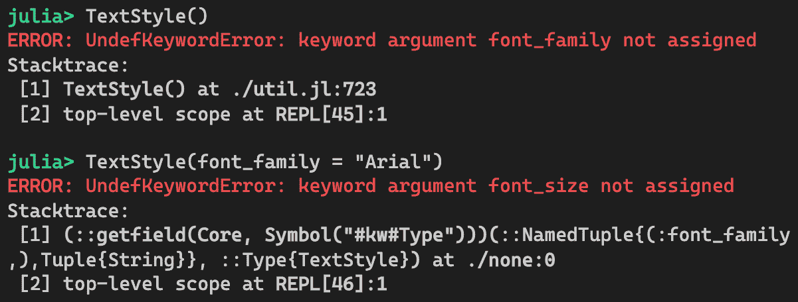
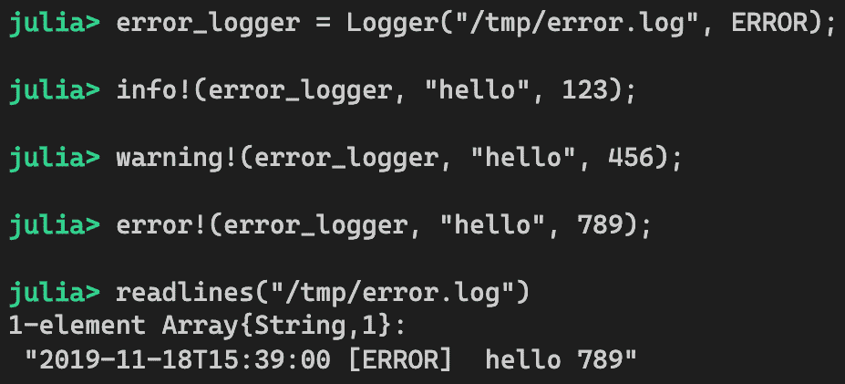

# 可维护性模式

本章将介绍与提高代码可读性和易于维护相关的几种模式。这些方面有时会被忽视，因为程序员总是认为他们知道自己在做什么。实际上，程序员并不总是编写其他人可读的代码。有时，代码可能过于杂乱，难以跟随，或者文件可能没有很好地组织。这些问题通常可以通过重构来缓解。

元编程可以是一个进一步提高可读性和可维护性的好方法。在某些情况下，我们可以利用今天现有的宏。如果我们不探索这样的机会，那将是一件遗憾的事情。我们知道优秀的程序员总是有着不懈的追求卓越的渴望，因此学习这些技术将是一项有益的练习。在接下来的章节中，我们将探讨以下模式：

+   子模块模式

+   关键字定义模式

+   代码生成模式

+   领域特定语言模式

到本章结束时，你将学会如何更好地组织你的代码。你将能够减少杂乱，并编写非常简洁的代码。此外，如果你正在处理一个具有特定行业领域的难题，你可以构建自己的**领域特定语言**（**DSL**）来进一步清晰地用你自己的语法表达你的问题。

*让我们开始吧！*

# 技术要求

示例源代码位于[`github.com/PacktPublishing/Hands-on-Design-Patterns-and-Best-Practices-with-Julia/tree/master/Chapter07`](https://github.com/PacktPublishing/Hands-on-Design-Patterns-and-Best-Practices-with-Julia/tree/master/Chapter07)。

代码在 Julia 1.3.0 环境中进行测试。

# 子模块模式

当一个模块变得太大时，它可能难以管理和理解。通常，当程序员不断地向应用程序添加更多功能时，这种情况会自然发生。那么，多大才算太大？这很难说，因为它因编程语言、问题领域以及应用程序维护者的技能集而异。尽管如此，专业人士普遍认为，较小的模块更容易管理，尤其是在代码由多个开发者维护的情况下。

在本节中，我们将探讨将大型模块的源代码拆分为单独管理的子模块的想法。我们将讨论如何做出这个决定以及如何正确地执行。作为我们旅程的一部分，我们将查看一些示例，并看看其他专家如何在他们的包中这样做。

# 理解何时需要子模块

我们应该在什么时候考虑创建子模块？有几个因素需要考虑：

+   首先，我们可以考虑应用程序的大小。大小是一个抽象概念，可以通过多种方式来衡量，其中一些方式在这里被提及：

    +   **代码行数**：这是理解应用程序大小的最简单方法。源文件中的代码行数越多，应用程序就越大。这类似于一本书的页数。一本书的页数越多，你阅读和理解内容所需的时间就越长。

    +   **函数数量**：当单个模块中有太多函数时，理解和学习所有这些函数会更加困难。当函数数量过多时，函数之间的交互数量自然增加，使得应用程序更容易出现混乱的意大利面代码。

    +   **数据类型数量**：每种数据类型都代表一种对象。对于开发者来说，理解作用于大量数据类型的所有函数是比较困难的，因为人脑不能同时处理太多概念。

+   我们还应该考虑关注点的分离。当我们查看由各种组件组成的应用程序时，我们可能会逻辑上认为它们是独立的事物，可以独立管理。人类是一种优秀的物种，知道如何处理小而有序的项目。

+   最后，我们可以考虑物质复杂性。有时候，你看一下源代码，会发现逻辑难以理解。这可能是因为领域知识。或者，它可能是一个复杂的算法。尽管应用程序的大小并不大，但将代码物理上拆分成单独的文件仍然是有意义的。

到目前为止，我们还没有为任何先前的因素设定任何具体的阈值。这是因为判断某事物是否庞大或复杂是非常主观的。一个常见的方法是让几位软件工程师进行讨论，并做出集体决定。这样做可以帮助我们克服*原始开发者偏见*，即某人已经对一切了如指掌，因此，这个人可能会倾向于认为应用程序既不太大也不太复杂。

假设你已经准备好跳入水中，将部分代码拆分成子模块。接下来的挑战是如何正确地做到这一点。这项工作既需要艺术也需要科学。为了将源代码拆分成子模块的过程形式化，我们首先将讨论耦合的概念。

# 理解输入和输出耦合

在将代码拆分成单独的组件之前，第一步是分析现有的代码结构。是否存在任何独立存在的高级领域概念？例如，一个银行应用程序可能涉及账户管理、存款/取款、转账、客户通知等。这些领域概念中的每一个都可能被拆分成单独的组件。

我们还必须了解组件之间是如何相互作用的。在这里，我们将讨论起源于面向对象编程的两个概念：

+   输入耦合 - 依赖于当前实体的外部实体数量

+   输出耦合 - 当前实体所依赖的外部实体的数量

让我们看看这个图：


在这个例子中，我们可以得出以下观察结果：

+   组件 A 有两个输出耦合。

+   组件 B 有一个输入耦合和一个输出耦合。

+   组件 C 有一个输出耦合。

+   组件 D 有三个输入耦合。

因此，如果一个组件被许多外部组件*使用*，那么这个组件就有高输入耦合。另一方面，如果一个组件*使用*许多外部组件，那么它就有高输出耦合。

这些耦合特性帮助我们理解组件的稳定性要求。具有高输入耦合的组件需要尽可能稳定，因为在这个组件中做出更改可能具有更高的风险，会破坏其他组件。在前面例子中的组件 D 就是这种情况。

同样，具有高输出耦合的组件可能由于它所依赖的组件的许多可能变化而更加不稳定。前面例子中的组件 A 就是这种情况。因此，尽可能减少耦合是最佳选择，无论是输入耦合还是输出耦合。解耦系统通常具有最少数量的输入和输出耦合。

设计子模块时也适用相同的概念。当我们把代码分成独立的子模块时，如果输入/输出耦合最小化，那就最理想了。现在，我们将首先看看组织子模块文件的最佳实践。

# 组织子模块

组织子模块文件通常有两种模式。让我们看看每种模式：

+   第一种情况涉及一个更简单的情况，即每个子模块完全包含在一个源文件中，如下所示：

```py
module MyPackage
include("sub_module1.jl")
include("sub_module2.jl")
include("sub_module3.jl")
end
```

+   第二种情况涉及较大的子模块，其中每个子模块可能有几个源文件。在这种情况下，子模块的源代码位于子目录中：

```py
# MyPackage.jl
module MyPackage
include("sub_module1/sub_module1.jl")
include("sub_module2/sub_module2.jl")
include("sub_module3.jl")
end
```

+   当然，子模块的目录可能包含多个文件。在前面例子中，`sub_module1`可能包含更多源文件，这些文件在下面的代码片段中显示：

```py
# sub_module1.jl
module SubModule1
include("file1.jl")
include("file2.jl")
include("file3.jl")
end
```

接下来，我们将探讨如何在模块和这些子模块之间引用符号和函数。

# 在模块和子模块之间引用符号和函数

模块可以使用常规的`using`或`import`语句访问其子模块。实际上，子模块与外部包的工作方式没有区别，只是引用方式不同。

也许我们可以回忆起第二章中的例子，*模块、包和类型概念*。当时，我们创建了一个`Calculator`模块，它定义了两个与利率相关的函数和一个`Mortgage`子模块，该子模块定义了一个支付计算器函数。`Calculator`模块文件具有以下源代码：

```py
# Calculator.jl
module Calculator

include("Mortgage.jl")

export interest, rate

function interest(amount, rate)
    return amount * (1 + rate)
end

function rate(amount, interest)
    return interest / amount
end

end # module
```

此外，子模块包含以下代码：

```py
# Mortgage.jl
module Mortgage

function payment(amount, rate, years)
    # TODO code to calculate monthly payment for the loan
    return 100.00
end 

end # module
```

让我们来看看如何从子模块引用函数和符号，反之亦然。

# 从子模块引用定义的符号

首先，我们可以通过`payment`函数的真实实现来完成`Mortgage`子模块的实现。

让我们看看这是如何工作的：

1.  `payment`函数接受贷款金额、年利率、贷款年数，并计算贷款的月付款额，如下面的代码所示：

```py
# Mortgage.jl
module Mortgage

function payment(amount, rate, years)
    monthly_rate = rate / 12.0
    factor = (1 + monthly_rate) ^ (years * 12.0)
    return amount * (monthly_rate * factor / (factor - 1))
end 

end # module
```

1.  到目前为止，`Calculator`模块应该能够像使用另一个模块一样使用`Mortgage`子模块，只是访问子模块的表示法需要一个以点表示法为前缀的相对路径：

```py
# Calculator.jl
module Calculator

# include sub-modules
include("Mortgage.jl")
using .Mortgage: payment

# functions for the main module
include("funcs.jl")

end # module
```

这里，我们通过`using .Mortgage: payment`将`payment`函数引入了子模块的当前作用域。

1.  为了更好地组织我们的代码，我们还把函数移动到了一个名为`funcs.jl`的单独文件中。代码如下：

```py
# funcs.jl - common calculation functions

export interest, rate, mortgage

function interest(amount, rate)
    return amount * (1 + rate)
end

function rate(amount, interest)
    return interest / amount
end

# uses payment function from Mortgage.jl
function mortgage(home_price, down_payment, rate, years)
    return payment(home_price - down_payment, rate, years)
end
```

如我们所见，新的`mortgage`函数现在可以使用来自 Mortgage 子模块的`payment`函数。

# 从父模块引用符号

如果子模块需要访问父模块中的任何符号，那么子模块可以在添加`..`作为父模块名称的前缀的同时使用`import`或`using`语句。以下代码展示了这一点：

```py
# Mortgage.jl
module Mortgage

# access to parent module's variable
using ..Calculator: days_per_year

end # module  
```

现在，`Mortgage`子模块可以访问父模块中的`days_per_year`常量。

能够在模块和子模块之间引用符号和函数，使我们能够将代码重新组织到各种子模块中，同时保持其原有的工作状态。然而，最初将代码分离到子模块中的原因是为了让开发者能够独立地在每个模块中工作。此外，双向引用可能会导致混淆和混乱的意大利面条式代码。

接下来，我们将讨论如何减少模块和子模块之间的这种耦合。

# 移除双向耦合

当一个模块（或子模块）引用另一个子模块，反之亦然时，会增加这些组件之间的耦合。一般来说，最好避免父模块和子模块之间的双向依赖，因为它引入了紧密耦合，使得代码难以理解和调试。我们该如何解决这个问题？让我们接下来探讨这个问题。

# 将数据作为函数参数传递

第一种解决方案是将所需数据作为函数参数传递。假设`Mortgage`子模块中的`payment`函数可以接受一个名为`days_per_year`的关键字参数，那么`Calculator`模块可以按如下方式传递值：

```py
# Calculator.jl
module Calculator

const days_per_year = 365

include("Mortgage.jl")
using .Mortgage: payment

function do_something()
    return payment(1000.00, 3.25, 5; days_per_year = days_per_year)
end

end # module
```

因此，`Mortgage`子模块实际上不再需要从`Calculator`引用`days_per_year`符号，从而减少了任何不必要的依赖。

# 将通用代码作为另一个子模块进行因式分解

另一个解决方案是将依赖成员拆分到单独的子模块中，并让两个现有模块都依赖于这个新的子模块。

假设我们已经以它们相互使用函数的方式设置了两个子模块。考虑以下图中描述的场景：


来自第一个子模块的`func1`函数使用了来自其他子模块的`func6`。此外，来自其他子模块的`func4`函数需要调用第一个模块中的`func3`函数。显然，这两个模块之间存在高度的耦合。

考虑这些模块之间的依赖关系，看起来像是一个循环，因为第一个子模块依赖于第二个子模块，反之亦然。为了解决这个问题，我们可以引入一个新的子模块来打破这个循环，如下所示：


打破循环的好处是拥有更清晰的依赖图。它也使代码更容易理解。

# 考虑拆分为顶层模块

如果我们已经在考虑创建子模块，那么可能是时候考虑将代码拆分为顶层模块了。这些顶层模块可以组合成独立的 Julia 包。

让我们来看看创建新的顶层模块的好处和潜在问题：

拥有独立顶层模块的好处如下：

+   每个包都可以有自己的发布生命周期和版本。可以修改包并仅发布该部分。

+   Julia 的`Pkg`系统强制执行版本兼容性。一个包的新版本可能被发布，并且只要包版本兼容，它就可以被另一个包使用。

+   包更可重用，因为它们可以被其他应用程序使用。

顶层模块的潜在问题如下：

+   由于每个包都将独立维护和发布，因此管理开销更大。

+   部署可能更困难，因为必须安装多个包，并且相互依赖的包必须遵守版本兼容性要求。

# 理解使用子模块的反驳意见

建议在以下条件下避免此模式：

+   当现有的代码库不够大时，过早地将代码拆分为子模块会阻碍开发速度。我们应该避免过早地进行此操作。

+   当源代码中存在高度耦合时，拆分代码可能很困难。在这种情况下，尝试重构代码以减少耦合，然后稍后再重新考虑将代码拆分为子模块。

创建子模块的想法确实迫使程序员思考代码依赖关系。当应用程序最终变得更大时，这是一个必要的步骤。

接下来，我们将讨论关键字定义模式，它允许我们用更易读的代码构建对象。

# 关键字定义模式

在 Julia 中，你可以使用默认构造函数创建一个对象，该构造函数接受为结构体中定义的每个字段提供一个位置参数列表。对于小型对象，这应该是简单直接的。对于大型对象，这会变得令人困惑，因为不参考结构体定义就很难记住哪个参数对应哪个字段，每次编写创建此类对象的代码时都需要这样做。

在 1956 年，心理学家乔治·米勒发表了一项研究，研究一个人在任何时候能记住多少随机数字，这样贝尔系统就可以决定电话号码格式的数字使用数量。他发现，大多数人一次只能记住五到九个数字。

如果记住数字已经足够困难，那么记住具有不同名称和类型的字段应该更加困难。

我们将讨论如何减少在编写 Julia 代码时产生的这种压力，以及如何使用`@kwdef`宏来实现，这样代码就易于阅读和维护。

# 重新审视结构体定义和构造函数

让我们先看看结构体是如何定义的，以及提供了什么构造函数。考虑文本编辑应用程序中文本样式配置的使用案例。

我们可以这样定义一个结构体：

```py
struct TextStyle
    font_family
    font_size
    font_weight
    foreground_color
    background_color
    alignment
    rotation
end
```

默认情况下，Julia 提供了一个构造函数，它为结构体中定义的所有字段提供位置参数，顺序与它们在结构体中定义的顺序相同。因此，创建`TextStyle`对象的唯一方法是执行以下操作：

```py
style = TextStyle("Arial", 11, "Bold", "black", "white", "left", 0)
```

这里没有错误，但我们可以说代码的可读性并不高。每次我们编写代码来创建一个`TextStyle`对象时，我们必须确保所有参数都按正确的顺序指定。特别是，作为一个开发者，我必须记住前三个参数代表字体设置，然后是两个颜色，其中前景色在前，以此类推。最后，我只好放弃，重新回到结构体定义中去。

另一个问题是我们可能希望某些字段有默认值。例如，我们希望`alignment`字段默认值为`"left"`，而`rotation`字段默认为`0`。默认构造函数并没有提供一种简单的方式来做到这一点。

创建具有许多参数的对象的更合理的语法是在构造函数中使用关键字参数。让我们尝试实现这一点。

# 在构造函数中使用关键字参数

我们可以始终添加新的构造函数，使其更容易创建对象。使用关键字参数解决了以下两个问题：

+   代码可读性

+   指定默认值的能力

让我们继续定义一个新的构造函数，如下所示：

```py
function TextStyle(;
        font_family,
        font_size,
        font_weight = "Normal",
        foreground_color = "black",
        background_color = "white", 
        alignment = "left",
        rotation = 0)
    return TextStyle(
        font_family,
        font_size,
        font_weight,
        foreground_color,
        background_color,
        alignment,
        rotation)
end
```

在这里，我们选择为大多数字段提供默认值，除了 `font_family` 和 `font_size`。它被简单地定义为一个函数，为结构体中的所有字段提供关键字参数。创建 `TextStyle` 对象变得更加容易，代码现在也更易读。事实上，我们获得了额外的好处，即参数可以按任何顺序指定，如下所示：

```py
style = TextStyle(
    alignment = "left",
    font_family = "Arial",
    font_weight = "Bold",
    font_size = 11)
```

这确实是一个非常简单的配方。我们只需为每个结构体创建这种构造函数，问题就解决了。对吗？好吧，是的，也有不是的。虽然创建这些构造函数相当容易，但要在每个结构体上这样做确实很麻烦。

此外，构造函数定义必须在函数参数中指定所有字段名称，并且这些字段在函数体中重复。因此，开发和维护变得相当困难。接下来，我们将介绍一个宏来简化我们的代码。

# 使用 @kwdef 宏简化代码

由于关键字定义模式解决了一个相当常见的用例，Julia 已经提供了一个宏来帮助定义接受关键字参数的构造函数的结构体。该宏目前尚未导出，但您可以直接使用如下所示：

```py
Base.@kwdef struct TextStyle
    font_family
    font_size
    font_weight = "Normal"
    foreground_color = "black"
    background_color= "white"
    alignment = "center"
    rotation = 0
end
```

基本上，我们只需在类型定义前放置 `Base.@kwdef` 宏。作为类型定义的一部分，我们还可以提供默认值。该宏会自动定义结构体以及相应的带关键字参数的构造函数。我们可以通过以下方式看到：


从输出中，我们可以看到第一个方法是接受关键字参数的方法。第二个方法是默认构造函数，它需要位置参数。现在，创建新对象就像我们希望的那样方便：


我们应该注意，前面的定义没有为 `font_family` 和 `font_size` 指定任何默认值。因此，在创建 `TextStyle` 对象时，这些字段是必需的：



使用这个宏可以极大地简化对象构造，并使代码更易读。没有理由不将其用于所有地方。

截至 Julia 版本 1.3，`@kwdef` 宏尚未导出。有一个功能请求导出它。如果您觉得使用未导出的功能不舒服，请考虑使用 `Parameters.jl` 包。

接下来，我们将讨论代码生成模式，它允许我们动态创建新函数，从而避免编写重复的样板代码。

# 代码生成模式

新的 Julia 程序员常常对语言的简洁性感到惊讶。令人惊讶的是，一些非常流行的 Julia 包是用非常少的代码编写的。这有多个原因，但一个主要的贡献因素是 Julia 能够动态生成代码。

在某些用例中，代码生成可以非常有帮助。在本节中，我们将探讨一些代码生成示例，并尝试解释如何正确地完成它。

# 介绍文件记录器用例

让我们考虑一个构建文件记录功能的用例。

假设我们想要提供一个基于一组日志级别的日志消息到文件的 API。默认情况下，我们将支持三个级别：info、warning 和 error。提供了一个记录器设施，以便只要消息带有足够高的日志级别，它就会被导向文件。

功能需求可以总结如下：

+   一个 info 级别的记录器接受带有 info、warning 或 error 级别的消息。

+   警告级别记录器只接受带有 warning 或 error 级别的消息。

+   错误级别记录器只接受具有错误级别的消息。

要实现文件记录器，我们首先为三个日志级别定义一些常量：

```py
const INFO    = 1
const WARNING = 2
const ERROR   = 3
```

这些常量被设计成按数字顺序排列，这样我们就可以很容易地确定消息的日志级别是否高于记录器可以接受的水平。接下来，我们按照以下方式定义`Logger`设施：

```py
struct Logger
    filename   # log file name
    level      # minimum level acceptable to be logged
    handle     # file handle
end
```

`Logger`对象携带日志文件的文件名、记录器可以接受消息的最小级别以及用于保存数据的文件句柄。我们可以为`Logger`提供一个构造函数如下：

```py
Logger(filename, level) = Logger(filename, level, open(filename, "w"))
```

构造函数会自动打开指定的文件以进行写入。现在，我们可以开发第一个用于 info 级别消息的日志函数：

```py
using Dates

function info!(logger::Logger, args...)
    if logger.level <= INFO
        let io = logger.handle
            print(io, trunc(now(), Dates.Second), " [INFO] ")
            for (idx, arg) in enumerate(args)
                idx > 0 && print(io, " ")
                print(io, arg)
            end
            println(io)
            flush(io)
        end
    end
end
```

此函数旨在仅在`INFO`级别足够高以被记录器接受时将消息写入文件。它还使用`now()`函数和日志文件中的`[INFO]`标签打印当前时间。然后，它将所有参数通过空格分隔并最终刷新 I/O 缓冲区。

我们可以快速测试到目前为止的代码。首先，我们将使用`info_logger`：


消息被正确地记录在`/tmp/info.log`文件中。如果我们向错误级别记录器发送 info 级别的消息会发生什么？让我们看看：


现在，这有点更有趣。正如预期的那样，因为错误级别记录器只接受具有`ERROR`级别或更高级别的消息，它没有捕获 info 级别的消息。

在这一点上，我们可能会想快速完成另外两个函数：`warning!`和`error!`，然后结束。如果我们决心这样做，`warning!`函数将看起来就像`info!`，只是做了一些小的改动：


这两个日志函数之间有什么区别？让我们看看：

+   函数名不同：`info!`与`warning!`。

+   日志级别常量不同：`INFO`与`WARNING`。

+   标签不同：`[INFO]`与`[WARNING]`。

除了这些，两个函数共享了完全相同的代码。当然，我们可以继续进行，通过以相同的方式编写`error!`来结束项目。然而，这并不是最好的解决方案。想象一下，如果核心日志逻辑需要更改，例如，日志消息的格式，那么我们必须在三个不同的函数中进行相同的更改。更糟糕的是，如果我们忘记修改所有这些函数，那么我们最终会得到不一致的日志格式。毕竟，我们已经违反了**不要重复自己**（**DRY**）原则。

# 函数定义的代码生成

如前所述，代码生成是解决此问题的一种方法。我们将构建定义函数的语法，然后将它放入循环中以定义所有三个日志函数。以下是代码可能的样子：

```py
for level in (:info, :warning, :error)
    lower_level_str = String(level)
    upper_level_str = uppercase(lower_level_str)
    upper_level_sym = Symbol(upper_level_str)

    fn = Symbol(lower_level_str * "!")
    label = " [" * upper_level_str * "] "

    @eval function $fn(logger::Logger, args...)
        if logger.level <= $upper_level_sym
            let io = logger.handle
                print(io, trunc(now(), Dates.Second), $label)
                for (idx, arg) in enumerate(args)
                    idx > 0 && print(io, " ")
                    print(io, arg)
                end
                println(io)
                flush(io)
            end
        end
    end
end
```

上述代码的解释如下：

+   由于我们需要为三个日志级别定义函数，我们创建了一个循环，遍历以下符号列表：`:info`、`:warning`和`:error`。

+   在循环内部，我们可以看到函数名为`fn`，标签为`label`，以及用于日志级别比较的常量（如`INFO`、`WARN`或`ERROR`）为`upper_level_sym`。

+   我们使用`@eval`宏来定义日志函数，其中`fn`变量、`label`和`upper_level_sym`被插入到函数体中。

在 Julia REPL 中运行代码后，应该已经定义了三个函数：`info!`、`warning!`和`error!`。为了测试，我们可以使用三种不同的日志记录器调用这些函数。

让我们先试一下`info_logger`：


如预期，所有消息都被记录到文件中，因为`info_logger`可以接受任何级别的消息。接下来，让我们测试`error_logger`：



在这种情况下，只有错误级别的消息被写入日志文件。`error_logger`代码有效地过滤掉了任何低于错误级别的消息。

虽然我们对生成的代码相当满意，但我们是否知道幕后实际发生了什么？我们如何调试我们甚至看不到的代码？让我们看看下一个例子。

# 调试代码生成

由于代码是在幕后生成的，当我们甚至看不到生成的代码将是什么样子时，可能会感觉有点尴尬。我们如何保证在所有变量的插值之后生成的代码确实是我们预期的？

幸运的是，有一个名为`CodeTracking`的包可以使调试代码生成更容易。我们将在这里看看它是如何工作的。

在上一节中，我们应该已经生成了三个函数：`info!`、`warning!`和`error!`。由于这些被定义为通用函数，我们可以检查每个函数定义了哪些方法。以`error!`为例：


在这种情况下，我们只有一个方法。我们可以使用`first`函数来获取方法对象本身：


一旦我们有了方法对象的引用，我们就可以依靠`CodeTracking`来揭示生成函数的源代码。特别是，我们可以使用`definition`函数，它接受一个方法对象并返回一个表达式对象。为了使用此函数，我们还需要加载`Revise`包。话不多说，让我们尝试以下操作：


在这里，我们可以清楚地看到变量被正确地插值；`logger.level`变量与`ERROR`常量进行比较，日志标签正确地包含了`[ERROR]`字符串。

我们还可以看到行号包含在输出中。由于我们从 REPL 定义了函数，行号就不是很有用。如果我们从存储在文件中的模块生成函数，文件名和行号信息就会更有趣。

然而，这里的行号节点似乎有点分散注意力。我们可以很容易地使用`MacroTools`包中的`rmlines`函数来移除它们：


`MacroTools.postwalk`函数用于将`rmlines`函数应用于抽象语法树中的每个节点。`postwalk`函数是必要的，因为`rmlines`函数只与当前节点一起工作。

现在我们已经了解了如何正确地进行代码生成，让我们反过来问自己——代码生成真的必要吗？还有其他替代方案吗？让我们在下一节中看看。

# 考虑除了代码生成以外的选项

在本节中，我们一直专注于代码生成技术。前提是我们可以轻松地添加一个新函数，它的工作方式与现有函数类似，但略有不同。在实践中，代码生成并不是我们手头唯一的选项。

让我们用相同的例子继续我们的讨论。正如我们回忆的那样，我们想在定义`info!`逻辑之后添加`warning!`和`error!`函数。如果我们退一步，我们可以泛化`info!`函数，使其能够处理不同的日志级别。这可以按以下方式完成：

```py
function logme!(level, label, logger::Logger, args...)
    if logger.level <= level
        let io = logger.handle
            print(io, trunc(now(), Dates.Second), label)
            for (idx, arg) in enumerate(args)
                idx > 0 && print(io, " ")
                print(io, arg)
            end
            println(io)
            flush(io)
        end
    end
end
```

`logme!`函数看起来与`info!`完全一样，除了它还接受两个额外的参数：`level`和`label`。这些变量在函数体中被获取和使用。现在我们可以定义所有三个日志函数如下：

```py
info!   (logger::Logger, msg...) = logme!(INFO,    " [INFO] ",    logger, msg...)
warning!(logger::Logger, msg...) = logme!(WARNING, " [WARNING] ", logger, msg...)
error!  (logger::Logger, msg...) = logme!(ERROR,   " [ERROR] ",   logger, msg...)
```

如我们所见，我们已经使用常规的结构化编程技术解决了原始问题，并尽可能减少了重复代码。

在这种情况下，这些函数之间唯一的区别是简单类型：一个常量和一个字符串。在另一种情况下，我们可能需要在函数体内部调用不同的函数。这也是可以的，因为在 Julia 中函数是一等公民，所以我们只需传递函数的引用。

我们能做得更好吗？是的。可以使用闭包技术稍微简化代码。为了说明这个概念，让我们定义一个新的`make_log_func`函数如下：

```py
function make_log_func(level, label)
    (logger::Logger, args...) -> begin
        if logger.level <= level
            let io = logger.handle
                print(io, trunc(now(), Dates.Second), " [", label, "] ")
                for (idx, arg) in enumerate(args)
                    idx > 0 && print(io, " ")
                    print(io, arg)
                end
                println(io)
                flush(io)
            end
        end
    end
end
```

此函数接受`level`和`label`参数，并返回一个包含主要日志逻辑的匿名函数。`level`和`label`参数在闭包中被捕获并在匿名函数中使用。因此，我们现在可以更容易地定义日志函数，如下所示：

```py
info!    = make_log_func(INFO,    "INFO")
warning! = make_log_func(WARNING, "WARNING")
error!   = make_log_func(ERROR,   "ERROR")
```

因此，这里定义了三个匿名函数：`info!`、`warning!`和`error!`，它们都同样有效。

在计算机科学术语中，闭包是一等函数，它从封装环境中捕获变量。

从技术角度讲，结构化编程解决方案与闭包之间有一个非平凡的差异。前者技术定义了通用函数，这些函数是在模块内命名的函数，可以扩展。相比之下，匿名函数是独特的，不能扩展。

在本节中，我们学习了如何在 Julia 中进行代码生成以及如何调试此代码。我们还讨论了如何重构代码以实现相同的效果，而无需使用代码生成技术。两种选择都是可用的。

接下来，我们将讨论领域特定语言（DSL），这是一种为特定领域使用构建语法的技巧，从而使代码更容易阅读和编写。

# 领域特定语言模式

Julia 是一种通用编程语言，可以有效地用于任何领域问题。然而，Julia 也是少数允许开发者构建适合特定领域使用的新的语法的编程语言之一。

因此，领域特定语言（DSL）是**结构化查询语言**（SQL）的一个例子。SQL 被设计用来处理二维表结构中的数据。它非常强大，但只有在需要处理表格数据时才适用。

Julia 生态系统中有几个显著的领域广泛使用了 DSL。其中最突出的是`DifferentialEquations`包，它允许你以非常接近原始数学符号的形式编写微分方程。例如，考虑以下洛伦兹系统方程：


定义这些方程的代码可以写成如下形式：

```py
@ode_def begin
  dx = σ * (y - x)
  dy = x * (ρ - z) - y
  dz = x * y - β * z
end σ ρ β
```

正如我们所见，语法几乎与数学方程式相匹配。

在此之后，在下一节中，我们将探讨如何构建用于计算机图形学中实际用例的 L-System 的自己的领域特定语言（DSL）。

# 介绍 L-System

**L-System**，也称为**林德曼系统**，是一种用于描述生物体如何通过简单模式进化的形式语法。它最初由匈牙利生物学家和植物学家 Aristid Lindenmayer 于 1968 年提出。L-System 可以生成有趣的模式，这些模式模仿现实生活中的形状和形式。一个著名的例子是特定藻类的生长，它可以如下建模：

```py
Axiom: A
  Rule: A -> AB
  Rule: B -> A
```

这是它的工作原理。我们始终从公理开始，在这个例子中，是字符`A`。对于每一代，我们将规则应用于字符串中的每个字符。如果字符是 A，则将其替换为`AB`。同样，如果字符是`B`，则将其替换为 A。让我们通过前五次迭代来操作：

+   `A`

+   `AB`

+   `ABA`

+   `ABAAB`

+   `ABAABABA`

你可能会想知道，它怎么会看起来像藻类呢？以下是从第一代到第五代生长的可视化：


有许多软件可以根据 L-Systems 生成有趣的图形可视化。一个例子是我开发的 iOS 应用**My Graphics**。该应用可以生成多种模式，例如前面的藻类示例。一个有趣的样本称为**科赫曲线**，如下所示：


话已说尽。从我们目前所知的情况来看，这个概念相当简单。我们接下来要做的是为 L-System 设计一个 DSL。

# 为 L-System 设计 DSL

DSL 的特点是源代码应该看起来像领域概念的原始表示。在这种情况下，领域概念是由一个公理和一组规则来描述的。以藻类生长的例子来说，它应该看起来像以下这样：

```py
Axiom: A
  Rule: A -> AB
  Rule: B -> A
```

如果我们尝试用纯 Julia 语言来编写它们，我们可能会得到如下代码：

```py
model = LModel("A")
add_rule!(model, "A", "AB")
add_rule!(model, "B", "A")
```

如我们所见，这并不理想。虽然代码既不长也不难读，但它看起来没有 L-System 语法那么整洁。我们真正想要的是构建一个 DSL，让我们能够如下指定模型：

```py
model = @lsys begin
    axiom : A
    rule  : A → AB
    rule  : B → A
end
```

这将是我们的 DSL 的目标语法。

# 审查 L-System 核心逻辑

作为这个例子的一部分，我们将一起开发一个 L-System 包。在我们深入到 DSL 实现之前，让我们先快速了解一下核心逻辑是如何工作的。对 API 的了解使我们能够正确地设计和测试 DSL。

# 开发 LModel 对象

要开发`LModel`对象，请执行以下步骤：

1.  让我们首先创建一个名为`LModel`的类型来跟踪公理和规则集。结构可以定义如下：

```py
struct LModel
    axiom
    rules
end
```

1.  然后，我们可以添加一个构造函数来填充`axiom`字段并初始化`rules`字段：

```py
"Create a L-system model."
LModel(axiom) = LModel([axiom], Dict())
```

1.  设计上，公理是一个单元素数组。规则被捕获在一个字典中，以便快速查找。还编写了一个`add_rule!`函数来向模型中添加新规则：

```py
"Add rule to a model."
function add_rule!(model::LModel, left::T, right::T) where {T <: AbstractString}
    model.rules[left] = split(right, "")
    return nothing
end
```

我们已经使用了`split`函数将字符串转换成一个单字符字符串的数组。

1.  最后，我们添加一个`Base.show`函数，以便我们可以在终端上优雅地显示模型：

```py
"Display model nicely."
function Base.show(io::IO, model::LModel)
    println(io, "LModel:")
    println(io, " Axiom: ", join(model.axiom))
    for k in sort(collect(keys(model.rules)))
        println(io, " Rule: ", k, " → ", join(model.rules[k]))
    end
end
```

定义了这些函数后，我们可以快速验证我们的代码如下：


接下来，我们将致力于核心逻辑，该逻辑接受一个模型并跟踪迭代的当前状态。

# 开发状态对象

为了模拟 L-System 模型的增长，我们可以开发一个`LState`类型，它跟踪增长当前状态。这是一个简单的类型，它只保留对模型的引用、当前增长的迭代次数和当前结果。为此，考虑以下代码：

```py
struct LState
    model
    current_iteration
    result
end
```

构造函数只需要接受模型作为唯一参数。它默认`current_iteration`为`1`，默认`result`为模型的公理，如下所示：

```py
"Create a L-system state from a `model`."
LState(model::LModel) = LState(model, 1, model.axiom)
```

我们需要一个函数来推进到增长的下一个阶段。所以我们只提供了一个`next`函数：

```py
function next(state::LState)
    new_result = []
    for el in state.result
        # Look up `el` from the rules dictionary and append to `new_result`.
        # Just default to the element itself when it is not found
        next_elements = get(state.model.rules, el, el)
        append!(new_result, next_elements)
    end
    return LState(state.model, state.current_iteration + 1, new_result)
end
```

基本上，给定当前状态，它迭代当前结果的全部元素，并使用模型中的规则扩展每个元素。`get`函数在字典中查找元素。如果没有找到，它默认为自身。扩展的元素只是追加到`new_results`数组中。

最后，创建一个新的`LState`对象，带有下一个迭代次数和新结果。为了在终端中更好地显示，我们可以为`LState`添加一个`Base.show`方法，如下所示：

```py
"Compact the result suitable for display"
result(state::LState) = join(state.result)

Base.show(io::IO, s::LState) = 
    print(io, "LState(", s.current_iteration, "): ", result(s))
```

`result`函数只是将数组的所有元素组合成一个单一的字符串。`show`函数显示当前迭代次数和结果字符串。

我们现在应该有一个完全功能性的系统。让我们尝试模拟藻类的生长：


*太棒了!* 现在功能已经构建完成，我们可以继续本章的有趣部分——如何使用 L-System 语法创建一个领域特定语言（DSL）。

# 实现 L-System 的领域特定语言（DSL）

回想一下上一节，我们想要有一个干净的语法来定义 L-System 模型。从元编程的角度来看，我们只需要将代码从一棵抽象语法树翻译到另一棵。以下图表直观地显示了所需的翻译类型：


结果表明，翻译相当直接。当我们遇到公理时，我们将代码翻译成构建一个新的`LModel`对象。当我们遇到规则时，我们将代码翻译成`add_rule!`函数调用。

虽然看起来很简单，但这类源到源翻译可以通过使用现有的工具大大简化。特别是，MacroTools 包包含一些非常实用的宏和函数，用于处理这些情况。让我们首先了解这个工具，然后我们可以在开发我们的 DSL 时利用它们。

# 使用@capture 宏

`MacroTools`包提供了一个名为`@capture`的宏，可以用来将表达式与模式匹配。作为匹配过程的一部分，它还为开发者希望捕获匹配值的变量分配变量。

`@capture`宏接受两个参数；第一个是需要匹配的表达式，第二个是用于匹配的模式。考虑以下示例：


当模式可以匹配时，宏返回`true`，否则它只返回`false`。当模式匹配时，以下划线结尾的变量将在当前环境中分配，并将下划线从变量名称中删除。在先前的例子中，因为`x = 1`与`x = val_`匹配，所以它返回了`true`：


因为模式匹配成功，所以还分配了一个`val`变量，其值为`1`。

# 匹配公理和规则语句

我们可以使用同样的技巧从公理和规则语句中提取有用的信息。让我们对由单词 axiom、冒号和符号组成的`axiom`语句进行快速实验：


匹配`rule`语句同样简单。唯一的区别是我们想要匹配原始符号和相应的替换符号，如下所示：


匹配后，`original`和`replacement`变量被分配了规则中的相应符号。我们还可以观察到匹配的变量是符号而不是字符串。由于`LModel`编程接口需要字符串，我们将在*开发 DSL 的宏*部分中展示从`walk`函数中的符号进行额外的数据转换。

# 使用 postwalk 函数

为了遍历整个抽象语法树，我们可以使用 MacroTool 的`postwalk`函数。为了理解它是如何工作的，我们可以通过以下步骤进行一个简单的示例：

1.  让我们创建一个表达式对象，如下所示：


在这里，我们使用了`rmlines`函数来删除行号节点，因为我们在这个练习中不需要它们。

1.  然后，我们可以使用`postwalk`函数遍历树并显示它所遇到的一切：


`postwalk`函数接受一个函数作为其第一个参数和一个表达式作为第二个参数。在遍历树的过程中，它使用正在访问的子表达式调用该函数。我们可以看到它考虑了每个单个叶子节点（例如，`:x`）以及表达式中的每个子树，例如`:(x = 1)`。它还包括顶层表达式，正如我们在输出底部所看到的。

如果我们稍微注意一下遍历的顺序，我们会意识到 `postwalk` 函数是从下往上工作的，从叶节点开始。

MacroTools 还提供了一个 `prewalk` 函数，它也可以遍历树。`prewalk` 和 `postwalk` 的区别在于 `prewalk` 将从上往下工作，而不是从下往上。鼓励大家尝试一下，并了解它们之间的区别。

对于我们的用例，我们可以使用任何一个。

现在我们知道了如何匹配表达式和遍历树，我们的工具箱中已经拥有了所有东西来开发我们的 DSL。这是最有意思的部分。*让我们开始吧！*

# 开发 DSL 的宏

为了支持 `LModel` 语法，我们必须匹配公理和规则语句，使其与模型中的写法相匹配。

让我们从创建 `lsys` 宏开始，如下所示：

```py
macro lsys(ex)
    return MacroTools.postwalk(walk, ex)
end
```

宏简单地使用 `postwalk` 遍历抽象语法树。返回的表达式原样返回。主要的翻译逻辑实际上位于以下 `walk` 函数中：

```py
function walk(ex)

    match_axiom = @capture(ex, axiom : sym_)
    if match_axiom
        sym_str = String(sym)
        return :( model = LModel($sym_str) )
    end

    match_rule = @capture(ex, rule : original_ → replacement_)
    if match_rule
        original_str = String(original)
        replacement_str = String(replacement)
        return :(
            add_rule!(model, $original_str, $replacement_str)
        )
    end

    return ex
end
```

让我们逐部分分析前面的代码。

`walk` 函数使用 `@capture` 宏来匹配 `axiom` 和 `rule` 模式。当匹配成功时，相应的符号会被转换成字符串，然后插入到相应的表达式中，并返回最终的表达式。考虑以下这段代码：

```py
match_axiom = @capture(ex, axiom : sym_)
```

`@capture` 宏调用试图匹配表达式与 `axiom : sym_` 模式，这是一个 `axiom` 符号，后面跟着一个冒号，然后是另一个符号。由于 `sym_` 目标符号以下划线结尾，如果匹配成功，`sym` 变量将被分配匹配的值。在 *开发状态对象* 部分的 *藻类模型* 示例中，我们期望 `sym` 被分配为 `:A` 符号。一旦匹配成功，以下代码将被执行：

```py
    if match_axiom
        sym_str = String(sym)
        return :( model = LModel($sym_str) )
    end
```

目标表达式简单地构建一个 `LModel` 对象，并将其分配给 `model` 变量。使用藻类模型，我们可以期望翻译后的表达式看起来像这样：

```py
model = LModel("A")
```

同样，可以使用以下模式匹配 `rule` 语句：

```py
    match_rule = @capture(ex, rule : original_ → replacement_)
```

`original` 和 `replacement` 变量被分配，转换为字符串，并插入到目标表达式的 `add_rule!` 语句中。

从 `lsys` 宏中，`walk` 函数被 `postwalk` 函数多次调用——每次调用针对抽象语法树的每个节点和子树。要查看 `postwalk` 如何生成代码，我们可以从 REPL 进行测试：


实际上，我们还没有完全完成，因为翻译后的语句位于一个 `quote` 块内，而块的返回值将来自块的最后一个表达式，由于 `add_rule!` 函数没有返回任何有意义的值，所以这个值是零。

这个最后的改变实际上是简单的部分。让我们再次修改 `@lsys` 宏，如下所示：

```py
macro lsys(ex)
    ex = MacroTools.postwalk(walk, ex)
    push!(ex.args, :( model ))
    return ex
end
```

使用了`push!`函数在块的末尾添加了`:( model )`表达式。让我们测试宏展开，看看它看起来像什么：


现在好了！终于，我们可以直接使用宏如下：


*太棒了！*现在，我们可以使用我们的小 DSL 来构建`algae_model`示例。事实证明，开发 DSL 根本不难。有了像 MacroTools 这样的优秀工具，我们可以快速提出一系列转换模式，并将抽象语法树操纵成我们想要的任何形式。

DSL 是一种简化代码并使其更容易维护的绝佳方式。它在特定的领域区域中非常有用。

# 摘要

在本章中，我们探讨了与提高应用程序可读性和可维护性相关的几种模式。

首先，我们学习了当模块变得太大时以及何时应该考虑对其进行重新组织。我们意识到，在将代码拆分为单独的模块时，耦合是一个重要的考虑因素。接下来，我们讨论了构建具有许多字段的对象的问题。我们确定使用基于关键字的构造函数可以使代码更易读，并提供额外的灵活性，以支持默认值。我们了解到，Julia Base 模块已经提供了一个宏。

然后，我们探讨了如何进行代码生成，这是一种方便的技术，可以在不重复代码的情况下动态定义许多类似的功能。我们从`CodeTracking`中选取了一个实用工具来审查生成的源代码。

最后，我们详细讨论了如何开发 DSL。这是一种通过模仿领域概念的原生形式来简化代码的好方法。我们以 L-System 为例来开发 DSL。我们从 MacroTools 包中选取了几个实用工具，通过匹配模式来转换我们的源代码。我们学习了如何使用`postwalk`函数来检查和转换源代码。而且，令人愉快的是，我们用很少的代码就完成了练习。

在下一章中，我们将讨论与代码安全性相关的一系列模式。*享受阅读！*

# 问题

1.  输入耦合和输出耦合之间的区别是什么？

1.  从可维护性的角度来看，为什么双向依赖是坏的？

1.  有什么简单的方法可以即时生成代码？

1.  代码生成的替代方案是什么？

1.  在什么情况下以及为什么你应该考虑构建一个 DSL？

1.  可用于开发领域特定语言（DSL）的工具有哪些？
