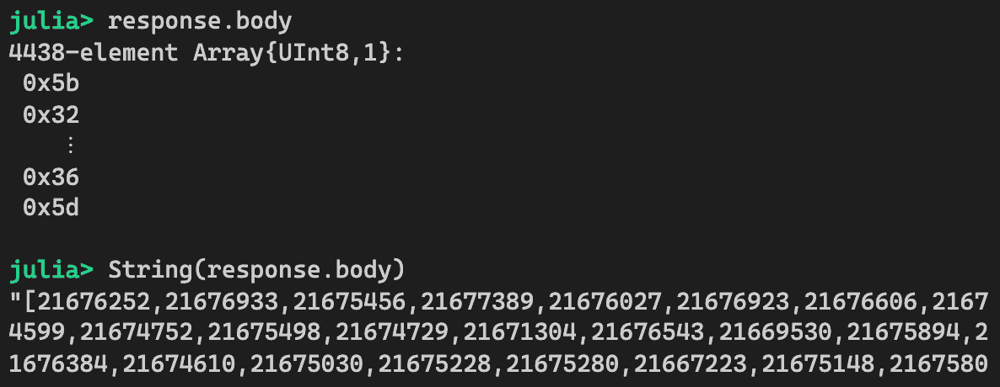
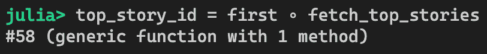

# 其他模式

本章将介绍一些在构建大型应用程序中非常有用的其他设计模式。这些模式提供了额外的工具，我们可以利用这些工具来补充之前章节中看到的重大模式。简而言之，我们将探索以下三个模式：

+   单例类型分派模式

+   模拟/存根模式

+   函数管道模式

单例类型分派模式利用了 Julia 的多重分派特性，这使得你可以在不修改现有代码的情况下添加新功能。

模拟/存根模式可以用来单独测试软件组件。也有可能在不实际使用它们的情况下测试外部依赖。这使得自动化测试变得容易得多。

函数管道模式利用管道操作符来表示执行流程的线性流。这是一种在许多数据处理管道中采用的编程方式。有些人认为这种线性执行的概念更直观。我们将探讨一些关于它们如何使用此模式的好例子。

*让我们开始吧！*

# 技术要求

本章的示例源代码位于[`github.com/PacktPublishing/Hands-on-Design-Patterns-and-Best-Practices-with-Julia/tree/master/Chapter09`](https://github.com/PacktPublishing/Hands-on-Design-Patterns-and-Best-Practices-with-Julia/tree/master/Chapter09)。

本章中的代码已在 Julia 1.3.0 环境中进行了测试。

# 单例类型分派模式

Julia 支持动态分派，这是其多重分派系统的一个特定特性。动态分派允许程序在运行时根据函数参数的类型分派到适当的函数。如果你熟悉面向对象编程语言中的多态，那么这个概念是相似的。在本节中，我们将解释什么是单例类型以及它们如何用于实现动态分派。

首先，让我们考虑一个桌面应用程序用例，其中系统响应用户点击事件。以下是**图形用户界面**（**GUI**）可能的样子：


我们将首先尝试用简单的逻辑实现处理函数，然后看看如何使用单例类型分派模式来改进它。

# 开发命令处理器

我们第一次尝试实现一个可能看起来类似的命令处理过程：

```py
function process_command(command::String, args)
    if command == "open"
        # open a file
    elseif command == "close"
        # close current file
    elseif command == "exit"
        # exit program
    elseif command == "help"
        # pops up a help dialog
    else
        error("bug - this should have never happened.")
    end
end
```

`process_command`函数简单地接受命令作为字符串。然后，根据字符串的值，它将调用相应的函数。`args`参数可能由 GUI 代码传递以提供更多信息；例如，正在打开或关闭的文件路径。

从逻辑角度来看，这段代码没有问题，但可以按照以下方式改进：

+   代码包含一系列 if-then-else 语句。在这个例子中，我们只需要支持四个函数。在实践中，我们可能需要处理更多的函数。拥有这样一个大的 if-then-else 块会使代码非常丑陋且难以维护。

+   每当我们需要添加一个新命令时，我们必须修改这个函数以包含一个新条件。

幸运的是，我们可以通过使用单例类型和动态分派来使其变得更好。我们将在下一节中介绍这一点。

# 理解单例类型

单例类型只是一个设计为具有单个实例的数据类型。在 Julia 中，可以通过定义一个没有任何字段的类型来轻松实现：

```py
struct OpenCommand end
```

要创建此类数据类型的一个单例实例，我们可以使用以下默认构造函数：

```py
OpenCommand()
```

与某些面向对象编程语言不同，这个构造函数在多次调用时返回的实例完全相同。换句话说，它已经是一个单例。我们可以这样证明：


创建了两个`OpenCommand`实例之后，我们使用`===`运算符比较它们，这告诉我们这两个实例确实指向同一个对象。因此，我们已经实现了单例的创建。

接下来，我们可以采取相同的方法，为每个命令创建一个单例类型，即`CloseCommand`、`ExitCommand`、`HelpCommand`等。此外，我们还可以创建一个新的抽象类型`AbstractCommand`，它可以作为所有这些命令类型的超类型。

每个命令都创建一个新类型似乎非常冗长。处理这种情况的更好方法是使用参数化类型。由于这是一个相当常见的用例，Julia 预定义了一个名为`Val`的类型。让我们看看它。

# 使用 Val 参数化数据类型

`Val`是一个在 Julia Base 包中定义的参数化数据类型。它的目的是为我们提供一个使用单例类型进行分派的简单方法。`Val`类型定义如下：

```py
struct Val{x} end
```

我们如何创建一个单例对象？我们可以使用`Val`构造函数并传递任何值。例如，我们可以创建一个包含值为 1 的单例类型，如下所示：


让我们确认这样一个对象的数据类型：


在这里，我们可以看到`Val(1)`和`Val(2)`有自己的类型——分别是`Val{1}`和`Val{2}`。有趣的是，传递给构造函数的值最终出现在类型签名中。同样，我们可以通过调用两次`Val`构造函数并比较它们的身份来证明这些确实是单例：


如您所见，`Val`构造函数也可以接受一个符号作为参数。请注意，`Val`只能接受位类型的数据，因为它会传递到类型签名。大多数用例涉及在类型参数中使用整数和符号的`Val`类型。如果我们尝试使用非位类型创建新的`Val`对象，那么我们会得到一个错误，如下所示：


你可能想知道为什么我们要花费这么多时间去讨论单例类型。这是因为单例类型可以用于动态调度。现在我们已经知道了如何创建单例，让我们学习如何利用它们进行调度。

# 使用单例类型和动态调度

在 Julia 中，当函数被调用时，函数调用是根据参数的类型来调度的。为了快速介绍这个机制，请参阅第三章，*设计函数和接口*。

让我们回顾一下本章前面提到的关于命令处理器函数的使用案例。使用原始实现，我们有一个大的 if-then-else 块，根据命令字符串调度到不同的函数。让我们尝试使用单例类型实现相同的功能。

对于每个命令，我们可以定义一个接受单例类型的函数。例如，`Open`和`Close`事件的函数签名如下：

```py
function process_command(::Val{:open}, filename) 
    println("opening file $filename")
end

function process_command(::Val{:close}, filename) 
    println("closing file $filename")
end
```

我们不需要为第一个参数指定任何名称，因为我们不需要使用它。然而，我们指定第一个参数的类型为`Val{:open}`或`Val{:close}`。给定这样的函数签名，我们可以处理`Open`事件，如下所示：


基本上，我们创建一个单例并将其传递给函数。因为类型签名匹配，Julia 将会调度到我们在上一张截图中所定义的函数。现在，假设我们已经定义了所有其他函数，我们可以编写主调度器的代码如下：

```py
function process_command(command::String, args...)
    process_command(Val(Symbol(command)), args...)
end
```

在这里，我们只是将命令转换为符号，然后通过传递给`Val`构造函数来创建单例类型对象。在运行时，相应的`process_command`函数将被调度。让我们快速测试一下：


*太棒了!* 现在，让我们暂停一下，思考一下我们刚刚取得的成就。特别是，我们可以做出以下两个观察：

+   上一张截图中的主调度器函数不再有 if-then-else 块。它只是利用动态调度来确定调用哪个底层函数。

+   每当我们需要添加一个新的命令时，我们只需定义一个新的带有新`Val`单例的`process_command`函数。主调度器函数不再有任何变化。

有可能创建自己的参数化类型，而不是使用标准的`Val`类型。这可以非常简单地实现，如下所示：

```py
# A parametric type that represents a specific command
struct Command{T} end

# Constructor function to create a new Command instance from a string
Command(s::AbstractString) = Command{Symbol(s)}()
```

构造函数接受一个字符串，并创建一个具有`Symbol`类型参数的`Command`单例对象，该参数从字符串转换而来。有了这样的单例类型，我们可以定义我们的调度函数和相应的操作如下：

```py
# Dispatcher function
function process_command(command::String, args...)
    process_command(Command(command), args...)
end

# Actions
function process_command(::Command{:open}, filename) 
    println("opening file $filename")
end

function process_command(::Command{:close}, filename) 
    println("closing file $filename")
end
```

这种代码风格在 Julia 编程中相当常见——由于它被函数调度所取代，因此不再有条件分支。此外，你还可以通过定义新函数来扩展系统的功能，而无需修改任何现有代码。当我们需要从第三方库扩展函数时，这是一个相当有用的特性。

接下来，我们将进行一些实验并测量动态调度的性能。

# 理解调度的性能优势

使用单例类型很棒，因为我们可以避免编写条件分支。另一个副作用是性能可以大大提高。一个有趣的例子可以在 Julia 的 Base 包中的`ntuple`函数中找到。

`ntuple`函数用于通过在 1 到 N 的序列上应用函数来创建 N 个元素的元组。例如，我们可以创建一个偶数元组如下：


第一个参数是一个匿名函数，它将值加倍。由于我们在第二个参数中指定了 10，它映射了从 1 到 10 的范围，并给出了 2，4，6，... 20。如果我们查看源代码，我们会发现这个有趣的定义：

```py
function ntuple(f::F, n::Integer) where F
    t = n == 0 ? () :
        n == 1 ? (f(1),) :
        n == 2 ? (f(1), f(2)) :
        n == 3 ? (f(1), f(2), f(3)) :
        n == 4 ? (f(1), f(2), f(3), f(4)) :
        n == 5 ? (f(1), f(2), f(3), f(4), f(5)) :
        n == 6 ? (f(1), f(2), f(3), f(4), f(5), f(6)) :
        n == 7 ? (f(1), f(2), f(3), f(4), f(5), f(6), f(7)) :
        n == 8 ? (f(1), f(2), f(3), f(4), f(5), f(6), f(7), f(8)) :
        n == 9 ? (f(1), f(2), f(3), f(4), f(5), f(6), f(7), f(8), f(9)) :
        n == 10 ? (f(1), f(2), f(3), f(4), f(5), f(6), f(7), f(8), f(9), f(10)) :
        _ntuple(f, n)
    return t
end
```

虽然代码缩进得相当好，但我们清楚地看到它通过使用`?`和`:`三联运算符硬编码短路分支来支持最多 10 个元素。如果超过 10 个，则调用另一个函数来创建元组：

```py
function _ntuple(f, n)
    @_noinline_meta
    (n >= 0) || throw(ArgumentError(string("tuple length should be ≥ 0, got ", n)))
    ([f(i) for i = 1:n]...,)
end
```

这个`_ntuple`函数预计会表现不佳，因为它使用列表推导创建一个数组，然后将结果展开到一个新的元组中。当我们比较创建一个 10 个元素的元组与一个 11 个元素的元组的性能基准测试结果时，你可能会非常惊讶：


`ntuple`函数旨在在元素数量较少时表现最佳，即 10 个或更少的元素。理论上，我们可以将`ntuple`函数更改为硬编码更多的内容，但这将非常繁琐，并且生成的代码将非常丑陋。

可能更令人惊讶的是，当使用`Val`单例类型时，Julia 实际上还提供了同一函数的另一种变体，如下面的截图所示：


10 个和 11 个元素之间实际上没有区别。事实上，即使有 100 个元素，性能也非常合理（17 纳秒），与非`Val`版本（820 纳秒）相比。让我们看看它是如何实现的。以下是从 Julia 源代码中摘录的：

```py
# Using singleton type dynamic dispatch
# inferrable ntuple (enough for bootstrapping)
ntuple(f, ::Val{0}) = ()
ntuple(f, ::Val{1}) = (@_inline_meta; (f(1),))
ntuple(f, ::Val{2}) = (@_inline_meta; (f(1), f(2)))
ntuple(f, ::Val{3}) = (@_inline_meta; (f(1), f(2), f(3)))

@inline function ntuple(f::F, ::Val{N}) where {F,N}
    N::Int
    (N >= 0) || throw(ArgumentError(string("tuple length should be ≥ 0, got ", N)))
    if @generated
        quote
            @nexprs $N i -> t_i = f(i)
            @ncall $N tuple t
        end
    else
        Tuple(f(i) for i = 1:N)
    end
end
```

从前面的代码中，我们可以看到定义了一些用于元素少于四个的元组的函数。之后，该函数使用元编程技术即时生成代码。在这种情况下，它使用一个特殊的结构，允许编译器在代码生成和其通用实现之间进行选择，通用实现用代码中的 if 块和 else 块表示。关于 `@generated`、`@nexprs` 和 `@ncalls` 宏的工作原理超出了本节的范围，但鼓励您从 Julia 参考手册中了解更多信息。

根据我们之前的性能测试，使用 `Val(100)` 调用 `ntuple` 非常快，因此看起来编译器已经选择了代码生成路径。

总结一下，我们已经学习了如何使用参数化类型来创建新的单例（singletons）并创建由这些单例类型调用的函数。我们可以在需要处理此类条件分支时应用此模式。

接下来，我们将学习如何有效地使用存根和模拟来开发自动化测试代码。

# Stubbing/Mocking 模式

Julia 提供了构建自动化单元测试的优秀工具。当程序员遵循良好的设计模式和最佳实践时，软件很可能会由许多可以单独测试的小函数组成。

不幸的是，某些测试用例处理起来比较困难。它们通常涉及测试具有特定依赖项的组件，这些依赖项难以包含在自动化测试中。常见问题包括以下内容：

+   **性能**：依赖项可能是一个耗时的过程。

+   **成本**：依赖项每次被调用时可能会产生财务成本。

+   **随机性**：依赖项每次被调用时可能会产生不同的结果。

Stubbing/Mocking 是解决这些问题的常用策略。在本节中，我们将探讨如何在测试 Julia 代码时应用存根（stubs）和模拟（mocks）。

# 测试替身是什么？

在我们深入探讨存根/模拟的具体内容之前，回顾一些行业标准术语会有所帮助。首先，有 *测试替身（testing doubles）* 的概念。有趣的是，这个术语来源于与特技拍摄相关的电影制作技术。当表演危险动作时，特技演员会代替演员或女演员来完成工作。从观众的角度来看，这会让人误以为原演员或女演员在表演。测试替身在此意义上是相同的，即在测试中使用一个假组件来代替真实组件。

测试替身有多种类型，但最有用的是 *存根（stubs）* 和 *模拟（mocks）*，我们将在本节中重点关注。在面向对象编程中，这些概念用类和对象来表示。在 Julia 中，我们将使用相同的术语来表示函数。与函数一起工作的一个好处是我们可以将所有精力集中在测试单一事物上。

**存根**是一个模仿真实函数的假函数，也称为*协作函数*。根据测试目标的要求，它们可以非常简单，总是返回相同的结果，或者它们可以稍微聪明一些，根据输入参数返回不同的值。无论它们有多聪明，出于一致性的原因，返回值几乎总是硬编码的。在测试期间，当**被测试函数**（**FUT**）被调用时，存根会替换协作函数。当 FUT 完成执行后，我们可以确定返回值的正确性。这被称为*状态验证*。这些函数之间的交互可以表示如下：


**模拟**也是一个模仿协作函数的假函数。与存根（stubs）相比，模拟关注行为验证。而不是仅仅检查 FUT 的状态，模拟会跟踪所有被调用的函数。它可以用来验证行为，例如模拟预期被调用的次数、模拟期望传递的参数的类型和值等。这被称为*行为验证*。在它们的执行结束时，我们可以进行状态验证和行为验证。如下所示：


在接下来的章节中，我们将重点介绍如何在测试中应用存根和模拟。

# 介绍信用审批用例

在本节中，我们将介绍一个与信用审批相关的示例用例。假设你正在开发一个系统，该系统能够在背景调查成功后为客户开设新的信用卡账户。你可以创建一个具有以下结构的 Julia 模块：

```py
module CreditApproval

# primary function to open an account
function open_account(first_name, last_name, email) end

# supportive functions 
function check_background(first_name, last_name) end
function create_account(first_name, last_name, email) end
function notify_downstream(account_number) end

end
```

现在，让我们实现每个函数。我们将从 `check_background` 函数开始，该函数只是记录事件并返回 true，表示背景调查成功。考虑以下代码：

```py
# Background check. 
# In practice, we would call a remote service for this.
# For this example, we just return true.
function check_background(first_name, last_name)
    println("Doing background check for $first_name $last_name")
    return true
end
```

`create_account` 函数与此类似。在这种情况下，预期的行为是返回一个账户号，即一个整数值，它指的是刚刚创建的账户。对于这个例子，我们只返回一个硬编码的值 1，如下所示：

```py
# Create an account.
# In practice, we would actually create a record in database.
# For this example, we return an account number of 1.
function create_account(first_name, last_name, email)
    println("Creating an account for $first_name $last_name")
    return 1
end
```

`notify_customer` 函数的目的是向客户发送电子邮件。出于测试目的，我们只需记录事件；不需要返回任何内容：

```py
# Notify downstream system by sending a message.
# For this example, we just print to console and returns nothing.
function notify_downstream(account_number)
    println("Notifying downstream system about new account $account_number")
    return nothing
end
```

最后，`open_account` 函数如下：

```py
# Open a new account. 
# Returns `:success` if account is created successfully.
# Returns `:failure` if background check fails.
function open_account(first_name, last_name, email)
    check_background(first_name, last_name) || return :failure
    account_number = create_account(first_name, last_name, email)
    notify_downstream(account_number)
    return :success
end
```

这是我们示例中的 FUT。逻辑涉及检查客户的背景，并在背景调查成功时创建账户，并通知下游关于新账户的信息。

让我们思考如何测试 `open_account` 函数。需要我们注意的明显事情是背景检查代码。更具体地说，我们期望有两个可能的执行路径——当背景检查成功和当背景检查失败时。如果我们需要覆盖这两个案例，那么我们需要能够模拟 `check_background` 函数的不同返回值。我们将使用存根来实现这一点。

# 使用存根执行状态验证

我们的目标是测试 `open_account` 函数的两个场景，其中 `check_background` 函数返回 true 或 false。当背景检查成功时，我们期望 `open_account` 返回 `:success`。否则，它应该返回 `:failure`。

使用我们的术语，`open_account` 是被测试的函数，而 `check_background` 是协作函数。我们无法真正控制协作函数的行为，这有点不幸。实际上，这个函数甚至可能调用背景检查服务，而我们对此几乎没有影响力。事实上，我们不想在每次测试我们的软件时都调用远程服务。

现在我们已经将原始的 `CreditApproval` 模块复制到一个名为 `CreditApprovalStub` 的新模块中，我们可以继续下一步。

由于我们是聪明的程序员，我们可以创建一个存根来替换协作函数。由于在 Julia 中函数是一等公民，我们可以重构 `open_account` 函数，使其能够接受任何来自关键字参数的背景检查函数，如下所示：

```py
function open_account(first_name, last_name, email; checker = check_background)
    checker(first_name, last_name) || return :failure
    account_number = create_account(first_name, last_name, email)
    notify_downstream(account_number)
    return :success
end
```

新的 `checker` 关键字参数接受一个用于为客户执行背景检查的函数。我们已将其默认值设置为原始的 `check_background` 函数，因此它应该与之前的行为相同。现在，函数更容易进行测试。

在我们的测试套件中，我们现在可以练习两个执行路径，如下所示：

```py
@testset "CreditApprovalStub.jl" begin

# stubs
check_background_success(first_name, last_name) = true
check_background_failure(first_name, last_name) = false

# testing
let first_name = "John", last_name = "Doe", email = "jdoe@julia-is-awesome.com"
    @test open_account(first_name, last_name, email, checker = check_background_success) == :success
    @test open_account(first_name, last_name, email, checker = check_background_failure) == :failure
end
```

在这里，我们为背景检查创建了两个存根：`check_background_success` 和 `check_background_failure`。它们分别返回 true 和 false 来模拟成功和失败的背景检查。然后，当我们需要测试 `open_account` 函数时，我们只需通过 `checker` 关键字参数传递这些存根函数。

现在我们来运行测试：


到目前为止，我们仅在 `open_account` 函数中为存根启用了 `check_background` 函数。如果我们想对 `create_account` 和 `notify_downstream` 函数做同样的事情怎么办？如果我们创建了两个额外的关键字参数并完成它，这将会同样简单。这不是一个坏选项。然而，你可能对我们的代码需要不断更改以进行新测试的事实不太满意。此外，这些关键字参数仅仅是为了测试而添加的，而不是调用接口的一部分。

在下一节中，我们将探讨 Mocking 包的使用，这是一个在源代码上改动不大的优秀工具，用于应用占位符和模拟。

# 使用 Mocking 包实现占位符

实现占位符的一个很好的替代方案是 Mocking 包。这个包使用起来相当简单。我们将快速概述如何使用 Mocking 来应用之前应用过的相同占位符。

为了跟随这个练习，你可以将 `CreditApproval` 模块中的代码复制到一个名为 `CreditApprovalMockingStub` 的新模块中。现在，按照以下步骤操作：

1.  首先，确保 Mocking 包已安装。然后，修改测试函数，如下所示：

```py
using Mocking

function open_account(first_name, last_name, email)
    @mock(check_background(first_name, last_name)) || return :failure
    account_number = create_account(first_name, last_name, email)
    notify_downstream(account_number)
    return :success
end 
```

`@mock` 宏创建了一个注入点，在这里可以应用占位符，替换现有的协作函数调用，即 `check_background`。在正常执行条件下，`@mock` 宏简单地调用协作函数。

1.  然而，在测试期间，可以应用占位符。为了实现这种行为，我们需要在测试脚本顶部激活模拟，如下所示：

```py
using Mocking
Mocking.activate()
```

1.  接下来，我们可以使用 `@patch` 宏来定义占位符函数：

```py
check_background_success_patch = 
    @patch function check_background(first_name, last_name)
        println("check_background stub ==> simulating success")
        return true
    end

check_background_failure_patch =
    @patch function check_background(first_name, last_name)
        println("check_background stub ==> simulating failure")
        return false
    end
```

`@patch` 宏可以直接放在函数定义的前面。函数名必须与原始协作函数名匹配。同样，函数参数也应该匹配。

1.  `@patch` 宏返回一个匿名函数，可以应用到 FUT（Future of the Under Test）中的调用位置。要应用补丁，我们使用 `apply` 函数，如下所示：

```py
# test background check failure case
apply(check_background_failure_patch) do 
    @test open_account("john", "doe", "jdoe@julia-is-awesome.com") == :failure
end

# test background check successful case
apply(check_background_success_patch) do 
    @test open_account("peter", "doe", "pdoe@julia-is-awesome.com") == :success
end
```

1.  `apply` 函数接受一个占位符并将其应用到测试函数中由 `@mock` 宏标识的协作函数被调用之处。让我们从交互式解释器（REPL）中运行这个测试：


1.  现在，让我们确保在正常执行条件下不会应用占位符。从交互式解释器（REPL）中，我们可以直接调用该函数：


*太棒了!* 从前面的输出中，我们可以看到原始的协作函数 `check_background` 被调用了。

接下来，我们将扩展同样的想法，并将多个占位符应用到同一个函数上。

# 将多个占位符应用到同一个函数上

在我们的例子中，`open_account` 函数调用几个依赖函数。它为客户执行背景检查，创建账户，并通知下游系统。实际上，我们可能想要为所有这些函数创建占位符。我们如何应用多个占位符？Mocking 包支持这个功能。

通常情况下，我们需要为想要应用到占位符中的每个函数用 `@mock` 宏进行装饰。以下代码展示了这一点：

```py
function open_account(first_name, last_name, email)
    @mock(check_background(first_name, last_name)) || return :failure
    account_number = @mock(create_account(first_name, last_name, email))
    @mock(notify_downstream(account_number))
    return :success
end
```

现在，我们已经准备好创建更多的占位符。为了演示目的，我们将为 `create_account` 函数定义另一个占位符，如下所示：

```py
create_account_patch = 
    @patch function create_account(first_name, last_name, email)
        println("create_account stub is called")
        return 314
    end
```

作为其设计的一部分，这个存根函数必须返回一个账户号码。因此，我们只是返回一个假的值 314。为了测试同时应用`check_background_success_patch`和`create_account_patch`的场景，我们可以将它们作为数组传递给`apply`函数：

```py
apply([check_background_success_patch, create_account_patch]) do
    @test open_account("peter", "doe", "pdoe@julia-is-awesome.com") == :success
end
```

注意，我们没有为`notify_downstream`函数提供任何存根。当没有提供存根时，将使用原始的协作函数。因此，我们在测试套件中应用存根函数时拥有所有想要的灵活性。在`open_account`函数中，由于我们在三个不同的注入点放置了`@mock`，我们可以从技术上测试八个不同的场景，对于每个场景，每个存根都是启用或禁用的。

FUT（Future of Testing）测试的复杂性会随着函数内部使用的分支和函数数量的指数级增长。这也是我们想要编写小函数的原因之一。因此，将大函数分解成较小的函数是一个好主意，这样它们就可以独立进行测试。

使用存根，我们可以轻松验证函数的预期返回值。另一种方法是模拟，它将重点放在验证 FUT 及其协作函数的行为上。我们将在下一节中探讨这一点。

# 使用模拟对象进行行为验证

模拟对象与存根对象不同——我们不仅仅测试函数的返回值，而是从协作函数的角度来测试期望。协作函数期望进行哪些活动？以下是一些针对我们用例的示例：

+   从`check_background`函数的角度来看，它是否在每次`open_account`调用时只被调用一次？

+   从`create_account`函数的角度来看，当背景检查成功时，它是否被调用？

+   从`create_account`函数的角度来看，当背景检查失败时，它是否没有被调用？

+   从`notify_account`函数的角度来看，它是否被调用，并且账户号码大于 0？

设置模拟对象启用测试的过程涉及四个主要步骤：

1.  设置测试期间将使用的模拟函数。

1.  为协作函数建立期望。

1.  运行测试。

1.  验证我们之前设置的期望。

现在，让我们尝试开发自己的模拟测试。在这里，我们将练习为新账户打开的成功路径。在这种情况下，我们可以期望`check_background`、`create_account`和`notify_downstream`函数被精确地调用一次。此外，我们还可以期望传递给`notify_downstream`函数的账户号码应该是一个大于 1 的数字。记住这些信息，我们将创建一个带有绑定变量的 let-block 来跟踪我们想要测试的所有期望：

```py
let check_background_call_count  = 0,
    create_account_call_count    = 0,
    notify_downstream_call_count = 0,
    notify_downstream_received_proper_account_number = false

    # insert more code here...
end
```

前三个变量将用于跟踪即将创建的三个模拟的调用次数。最后一个变量将用于记录在测试期间`notify_downstream`函数是否收到了正确的账户号码。在这个 let 块中，我们将实现之前概述的四个步骤。让我们首先定义模拟函数：

```py
check_background_success_patch = 
    @patch function check_background(first_name, last_name)
        check_background_call_count += 1
        println("check_background mock is called, simulating success")
        return true
    end
```

在这里，我们只是在模拟函数中增加`check_background_call_count`计数器，以便我们可以跟踪模拟函数被调用的次数。同样，我们可以以相同的方式定义`create_account_patch`模拟函数：

```py
create_account_patch = 
    @patch function create_account(first_name, last_name, email)
        create_account_call_count += 1
        println("create account_number mock is called")
        return 314
    end
```

最后一个模拟函数`notify_downstream_patch`覆盖了两个期望。它不仅跟踪调用次数，还验证传递的账户号码是否正确，如果是，则更新布尔标志。以下代码展示了这一点：

```py
notify_downstream_patch = 
    @patch function notify_downstream(account_number)
        notify_downstream_call_count += 1
        if account_number > 0
            notify_downstream_received_proper_account_number = true
        end
        println("notify downstream mock is called")
        return nothing
    end
```

第二步是正式建立我们的期望。这可以定义为以下简单函数：

```py
function verify()
    @test check_background_call_count  == 1
    @test create_account_call_count    == 1
    @test notify_downstream_call_count == 1
    @test notify_downstream_received_proper_account_number
end
```

`verify`函数包含一系列期望，正式定义为常规 Julia 测试。现在，我们已经准备好通过应用所有三个模拟函数来执行我们的测试：

```py
apply([check_background_success_patch, create_account_patch, notify_downstream_patch]) do
    @test open_account("peter", "doe", "pdoe@julia-is-awesome.com") == :success
end
```

最后，作为最后一步，我们将针对我们的期望进行测试。这只是一个调用我们之前定义的`verify`函数：

```py
verify()
```

现在，我们已经准备好运行模拟测试。相应的结果如下：


结果统计显示总共有五个测试用例，并且所有测试都通过了。其中四个测试来自`verify`函数的行为验证，而另一个测试来自对`open_account`函数返回值的`state verification`。

如您所见，模拟与存根有很大不同，因为它们用于执行行为和状态验证。

接下来，我们将探讨一个与如何更直观地构建数据管道相关的模式。

# 功能管道模式

有时，在构建应用程序时，我们会遇到需要复杂计算和数据转换的大问题。使用结构化编程技术，我们通常可以将大问题分解为中等规模的问题，然后再进一步将这些中等规模的问题分解为小规模的问题。当问题足够小的时候，我们可以编写函数来单独处理每个问题。

当然，这些函数并不是独立工作的——更有可能的是，一个函数的结果会输入到另一个函数中。在本节中，我们将探讨功能管道模式，它允许数据在数据管道中无缝传递。这在函数式编程语言中并不罕见，但在 Julia 中却较少见。尽管如此，我们仍将探讨它，看看它是如何实现的。

首先，我们将回顾一个与下载最近 Hacker News 故事进行分析相关的示例用例。然后，我们将逐步重构代码以使用功能管道模式。让我们开始吧！

# 介绍 Hacker News 分析用例

Hacker News 是一个流行的在线论坛，被软件开发者所使用。这个论坛上的主题通常与技术相关，但并不总是如此。故事根据用户投票数、相关时效性和其他因素进行排名。每个故事都有一个与之相关的评分。

在本节中，我们将开发一个程序，用于从 Hacker News 检索顶级故事并计算这些故事的平均评分。有关 Hacker News API 的更多信息，请参阅以下 GitHub 仓库：[`github.com/HackerNews/API`](https://github.com/HackerNews/API)。在这里，您可以快速了解检索故事和每个故事详情的过程。

# 获取 Hacker News 上的顶级故事 ID

首先，我们将创建一个名为`HackerNewsAnalysis`的模块。第一个函数将用于从 Hacker News 检索顶级故事。该代码如下：

```py
using HTTP
using JSON3

function fetch_top_stories()
    url = "https://hacker-news.firebaseio.com/v0/topstories.json"
    response = HTTP.request("GET", url)
    return JSON3.read(String(response.body))
end
```

它是如何工作的？让我们试试看：


让我们分几个步骤来剖析这个函数的逻辑。顶级故事可以从一个固定的 URL 中检索。在这里，我们使用了 HTTP 包从网络服务中获取数据。如果`HTTP.request`函数调用成功，它将返回一个`HTTP.Message.Response`对象。这很容易在 REPL 中验证：


那么，我们如何从`Response`对象中获取内容呢？它可以从`body`字段中获取。实际上，`body`字段只是一个字节数组。为了理解这些数据的意义，我们可以将其转换为`String`，如下所示：



从输出中可以看出，它是以 JSON 格式。我们也可以通过在浏览器中访问网络 URL 来验证这一点。从 API 文档中，我们知道这些数字代表 Hacker News 的故事 ID。为了将数据解析为可用的 Julia 数据类型，我们可以利用`JSON3`包：


`JSON3.Array`对象是数组的懒加载版本。按照设计，JSON3 不会提取值，直到你请求它。我们可以将其用作普通的 Julia 数组。有关更多信息，请访问 GitHub 上的 JSON3 文档：[`github.com/quinnj/JSON3.jl/blob/master/README.md`](https://github.com/quinnj/JSON3.jl/blob/master/README.md)。

现在我们有了故事 ID 数组，我们将开发一个用于检索 Hacker News 故事详细信息的函数。

# 获取故事详情

给定一个故事 ID，我们可以使用 Hacker News API 的`item`端点检索关于该故事的信息。在我们编写函数之前，让我们定义一个类型来存储数据：

```py
struct Story
    by::String
    descendants::Union{Nothing,Int}
    score::Int
    time::Int
    id::Int
    title::String
    kids::Union{Nothing,Vector{Int}}
    url::Union{Nothing,String}
end
```

`Story`的字段是根据 Hacker News API 网站上的 JSON 模式设计的。有时，某些字段可能对某些故事类型不可用，在这种情况下，我们将它们在对象中留为`nothing`。这些可选字段包括`descendants`、`kids`和`url`。最后，每篇故事都有一个唯一的标识符`id`。

我们需要一个构造函数来创建`Story`对象。因为 JSON3 返回一个类似字典的对象，我们可以直接提取单个字段并将它们传递给构造函数。构造函数的函数可以定义为以下内容：

```py
# Construct a Story from a Dict (or Dict-compatible) object
function Story(obj)
    value = (x) -> get(obj, x, nothing)
    return Story(
        obj[:by], 
        value(:descendants), 
        obj[:score], 
        obj[:time],
        obj[:id], 
        obj[:title], 
        value(:kids), 
        value(:url))
end
```

通常，我们可以使用索引操作符（方括号）从`Dict`对象中提取字段。然而，我们需要处理某些字段可能不在对象中的事实。为了避免意外的`KeyError`，我们可以定义一个名为`value`的闭包函数来提取字段，或者在键不在对象中时返回`nothing`。

现在，让我们看看获取单个故事详情的函数：

```py
function fetch_story(id)
    url = "https://hacker-news.firebaseio.com/v0/item/$(id).json"
    response = HTTP.request("GET", url)
    return Story(JSON3.read(response.body))
end
```

再次，我们使用`HTTP.request`检索数据。在收到响应后，我们可以使用 JSON3 解析数据并相应地构建一个`Story`对象。以下是它是如何工作的：


接下来，我们将介绍计算 Hacker News 前 N 篇故事平均分数的主程序。

# 计算前 N 篇故事的平均分数

现在我们有了找到前 N 篇故事并检索每篇故事详情的能力，我们可以创建一个新的函数来计算前 N 篇故事的平均分数。

`average_score`函数如下：

```py
using Statistics: mean

function average_score(n = 10)
    story_ids = fetch_top_stories()
    println(now(), " Found ", length(story_ids), " stories")

    top_stories = [fetch_story(id) for id in story_ids[1:min(n,end)]]
    println(now(), " Fetched ", n, " story details")

    avg_top_scores = mean(s.score for s in top_stories)
    println(now(), " Average score = ", avg_top_scores)

    return avg_top_scores
end
```

这个函数有三个部分：

1.  第一部分使用`fetch_top_stories`函数找到前 N 篇故事的 ID。

1.  然后，它使用`fetch_story`函数检索前`n`个故事的详情。

1.  最后，它只从这些故事中计算平均分数。然后，将平均分数返回给调用者。

为了获取前`n`个故事 ID，我们选择使用索引操作符和范围`1:min(n,end)`。`min`函数用于处理`n`大于数组大小的情况。

让我们运行这个函数看看会发生什么：


从结果中，我们可以看到 Hacker News 的前`n`篇故事平均得分为 125.4。请注意，你可能得到不同的结果，因为这个数字会随着 Hacker News 用户对他们的最爱故事进行投票而实时变化。

现在用例已经确定，我们将跃进并尝试用不同的方式编写相同的程序。我们称这种编程风格为*函数式管道*。

# 理解函数式管道

在 Julia 中，有一个管道操作符可以用来从一个函数传递数据到另一个函数。这个概念非常简单。首先，让我们看看一些例子。

在上一节中，我们开发了一个`fetch_top_stories`函数，用于从 Hacker News 获取当前的热门故事。返回值是一个看起来像整数数组的`JSON3.Array`对象。假设我们想从数组中找到第一个故事 ID。为此，我们可以创建一个管道操作，如下所示：


管道操作符`|>`实际上在 Julia 中被定义为一个常规函数，就像`+`被定义为一个函数一样。请注意，前面的代码在语法上等同于以下代码：


此外，我们可以在表达式中使用多个管道操作符。例如，我们可以通过在管道末尾附加`fetch_story`函数来检索第一个故事的详细信息：


由于数据自然地从左到右流动，这被称为函数管道模式。这可以在以下图中看到：


注意，每个跟随管道操作符的函数都必须接受单个参数。在前面的例子中，我们可以看到以下内容：

+   `first`函数接受一个数组并返回第一个元素。

+   `fetch_story`函数接受一个故事 ID 的整数并返回一个`Story`对象。

这是一个非常重要的观点，所以让我再说一遍——*函数管道只向单参数函数提供数据*。

我们将在稍后学习如何处理这个限制。现在，我们将讨论一个与函数管道语法相反的类似模式。这个概念被称为可组合性，是一种导致高度可重用代码的设计技术。

# 设计可组合函数

有时候，你可能会听到其他 Julia 程序员谈论可组合性。那是什么意思？

可组合性用来描述函数如何以不同的方式轻松组装以实现不同的结果。让我们来看一个类比。我会说乐高有一个高度可组合的设计。这是因为几乎每一块乐高都可以与其他任何一块乐高组合，即使它们的形状不同。因此，任何孩子都可以用乐高搭建几乎任何可以想象的东西。

当谈到系统设计时，我们也可以考虑可组合性。如果我们能构建我们的函数，使它们可以轻松组合，那么我们就有了构建许多不同事物的灵活性。在 Julia 中，我们可以非常容易地组合函数。

让我们使用上一节中的相同示例。我们将创建一个新的函数`top_story_id`，用于从 Hacker News 获取第一个故事 ID：



从前面的代码中，我们可以看到 `top_story_id` 函数被定义为匿名函数。Unicode 圆形符号（`∘`，输入为 `\circ`）是 Julia 中的组合操作符。与管道操作符不同，我们是从右到左读取组合函数的顺序。在这种情况下，我们首先应用 `fetch_top_stories` 函数，然后应用 `first` 函数。直观上，我们可以像通常一样使用 `top_story_id` 函数：


我们也可以组合多个函数。为了获取最上面的故事详情，我们可以组合一个新的函数，称为 `top_story`，如下所示：


*太棒了!* 我们拿出了三个随机的乐高积木，用它们搭建了一个新的事物。`top_story`函数是一个由三个较小的积木组成的新事物：


让我们更进一步，创建一个新的函数来检索最上面的故事标题。现在，我们遇到了一点麻烦。还没有定义从 `Story` 对象返回故事标题的函数。然而，我们可以通过利用我们在第八章中描述的访问器模式来解决此问题，*鲁棒性模式*。

让我们定义一个标题字段的访问器，然后组合一个新的 `top_story_title` 函数，如下所示：


这个新函数工作得非常好，正如预期的那样：


组合操作符允许我们创建一个由多个其他函数组成的新函数。在某种程度上，它比管道操作符更方便，因为组合函数不需要立即执行。

与功能管道类似，组合操作符也期望单参数函数。话虽如此，这也是为什么单参数函数更易于组合的原因。

接下来，我们将回到 Hacker News 的 `average_score` 函数，看看我们如何可以将代码重构为功能管道风格。

# 开发用于平均分数函数的功能管道

首先，让我们回顾一下 `average_score` 函数是如何编写的：

```py
function average_score(n = 10)
    story_ids = fetch_top_stories()
    println(now(), " Found ", length(story_ids), " stories")

    top_stories = [fetch_story(id) for id in story_ids[1:min(n,end)]]
    println(now(), " Fetched ", n, " story details")

    avg_top_scores = mean(s.score for s in top_stories)
    println(now(), " Average score = ", avg_top_scores)

    return avg_top_scores
end
```

虽然代码看起来相当整洁且易于理解，但让我指出一些潜在的问题：

+   最上面的故事是通过数组推导语法检索的。逻辑有点复杂，我们将无法独立于`average_score`函数测试这段代码。

+   `println` 函数用于日志记录，但看起来我们似乎在复制代码来显示当前的时间戳。

现在，我们将重构代码。逻辑基本上是线性的，这使得它成为功能管道的良好候选者。从概念上讲，这是我们关于计算的想法：


设计一个像这样工作的函数会很好：

```py
average_score2(n = 10) = 
    fetch_top_stories() |> 
    take(n) |> 
    fetch_story_details |> 
    calculate_average_score
```

这是该函数的第二个版本，所以我们将其命名为 `average_score2`。

现在，我们只是忽略日志记录方面，以保持简单。我们稍后会回到这一点。由于我们已定义了 `fetch_top_stories` 函数，我们只需开发其他三个函数，如下所示：

```py
take(n::Int) = xs -> xs[1:min(n,end)]

fetch_story_details(ids::Vector{Int}) = fetch_story.(ids)

calculate_average_score(stories::Vector{Story}) = mean(s.score for s in stories)
```

从前面的代码中，我们可以看到以下内容：

+   `take` 函数接收一个整数 `n`，并返回一个匿名函数，该函数从数组中返回前 `n` 个元素。

+   `min` 函数用于确保它不会超过数组的实际大小。

+   `fetch_story_details` 函数接收一个故事 ID 数组，并使用点符号广播 `fetch_story` 函数。

+   `calculate_average_score` 函数接收一个 `Story` 对象数组，并计算分数的平均值。

作为快速提醒，所有这些函数都接受单个参数作为输入，这样它们就可以参与函数式管道操作。

现在，让我们回到日志记录。在函数式管道中，日志记录扮演着有趣的角色。它被设计用来产生副作用，并且不会影响计算结果。在某种意义上，它是“滑稽”的，因为它只是返回从输入接收到的相同数据。由于标准的 `println` 函数不返回任何内容，我们无法直接在管道操作中使用它。相反，我们必须创建一个足够聪明的日志函数，它能够打印我们想要的内容，同时返回传递给它的相同数据。

此外，我们还想能够使用通过系统传递的数据来格式化输出。为此，我们可以利用 `Formatting` 包。它包含一个灵活且高效的格式化工具。让我们构建自己的日志函数，如下所示：

```py
using Formatting: printfmtln

logx(fmt::AbstractString, f::Function = identity) = x -> begin
    let y = f(x)
        print(now(), " ")
        printfmtln(fmt, y)
    end
    return x
end
```

`logx` 函数接收一个格式字符串和一个可能的转换函数 `f`。它返回一个匿名函数，该函数将转换后的值传递给 `printfmln` 函数。它还自动在日志前加上当前的时间戳。最重要的是，这个匿名函数返回参数的原始值。

要查看这个日志函数是如何工作的，我们可以尝试一些示例：


在前一个截图所示的第一例中，`logx` 函数仅使用一个格式字符串被调用，因此通过管道传入的输入将直接用于日志。第二个例子将 `length` 函数作为 `logx` 的第二个参数传递。然后，`length` 函数被用来转换用于日志记录的输入值。

将所有这些放在一起，我们可以在新的 `average_score3` 函数中引入日志记录，如下所示：

```py
average_score3(n = 10) = 
    fetch_top_stories()                        |> 
    logx("Number of top stories = {}", length) |>
    take(n)                                    |> 
    logx("Limited number of stories = $n")     |>
    fetch_story_details                        |> 
    logx("Fetched story details")              |>
    calculate_average_score                    |> 
    logx("Average score = {}")
```

有时，函数式管道可以使代码更容易理解。因为管道操作不允许使用条件语句，所以逻辑总是线性的。

你可能想知道如何在函数式管道设计中处理条件逻辑。我们将在下一节中学习这一点。

# 在函数式管道中实现条件逻辑

由于逻辑流程相当线性，我们如何处理条件逻辑？

假设我们想要通过检查平均分数与阈值的比较来确定热门新闻的热度。如果平均分数高于 100，则被认为是高热度；否则，被认为是低热度。因此，字面上，我们需要一个 if 语句来决定接下来执行什么。

我们可以使用动态调度来解决此问题。我们将自下而上构建此函数，如下所示。

1.  创建`hotness`函数，它通过分数确定 Hacker News 网站的热度。它返回`Val{:high}`或`Val{:low}`参数类型的一个实例。内置的`Val`数据类型是创建可用于调度目的的新参数类型的一种方便方式：

```py
hotness(score) = score > 100 ? Val(:high) : Val(:low)
```

1.  根据参数类型`Val`创建两个`celebrate`函数。它们简单地使用`logx`函数来打印一些文本。我们通过传递`v`的值来调用它，这样在庆祝之后如果我们想要做更多的工作，热度的参数就可以向下传递：

```py
celebrate(v::Val{:high}) = logx("Woohoo! Lots of hot topics!")(v)
celebrate(v::Val{:low}) = logx("It's just a normal day...")(v)
```

1.  构建`check_hotness`函数，它使用函数式管道模式。它使用`average_score3`函数来计算平均分数。然后，它使用`hotness`函数来确定如何改变执行路径。最后，它通过多态调度机制调用`celebrate`函数：

```py
check_hotness(n = 10) =
    average_score3(n) |> hotness |> celebrate
```

让我们来测试一下：


这个简单的例子演示了如何在函数式管道设计中实现条件逻辑。当然，在现实中，我们的逻辑会比仅仅在屏幕上打印一些内容要复杂得多。

一个重要的观察是，函数式管道只处理线性执行。因此，每当执行条件分支时，我们就会为每个可能的路径创建一个新的管道。以下图表展示了如何使用函数式管道设计执行路径。每个执行分支的分裂都是由对单个参数类型的调度来实现的：


从概念上看，函数式管道看起来相当简单和直接。然而，它们有时因为需要在管道的每个组件之间传递中间数据而被批评，这会导致不必要的内存分配和速度减慢。在下一节中，我们将介绍如何使用广播来克服这个问题。

# 沿着函数式管道进行广播

在数据处理管道中，我们可能会遇到一种情况，即函数可以融合成一个单一的循环。这被称为*广播*，并且可以通过使用点符号方便地启用。使用广播可能会对数据密集型应用程序的性能产生巨大影响。

考虑以下场景，其中已经定义了两个向量化函数，如下所示：

```py
add1v(xs) = [x + 1 for x in xs]
mul2v(xs) = [2x for x in xs]
```

`add1v`函数接受一个向量并将所有元素加 1。同样，`mul2v`函数接受一个向量并将每个元素乘以 2。现在，我们可以组合这些函数来创建一个新的函数，它接受一个向量并将其传递到管道中的`add1v`和随后的`mul2v`：

```py
add1mul2v(xs) = xs |> add1v |> mul2v
```

然而，从性能角度来看，`add1mul2v`函数并不最优。原因是每个操作必须完全完成然后传递到下一个函数。虽然中间结果只需要临时存储，但必须在内存中分配：


如前图所示，除了输入向量和输出向量外，还必须分配一个中间向量来存储`add1v`函数的结果。

为了避免分配中间结果，我们可以利用广播。让我们创建另一组函数，这些函数操作单个元素而不是数组，如下所示：

```py
add1(x) = x + 1
mul2(x) = 2x
```

我们原始的问题仍然需要取出一个向量，对每个元素加 1，然后乘以 2。因此，我们可以使用点符号定义这样的函数，如下所示：

```py
add1mul2(xs) = xs .|> add1 .|> mul2
```

在管道操作符之前的点字符表示`xs`中的元素将被广播到`add1`和`mul2`函数，将整个操作融合成一个循环。数据流现在看起来更像是以下这样：


在这里，中间结果变成一个单独的整数，消除了对临时数组的需要。为了欣赏我们从广播中获得性能提升，我们可以运行两个函数的性能基准测试，如下面的截图所示：


如您所见，在这种情况下，广播版本比矢量化版本快了两倍。

在下一节中，我们将回顾一些关于使用功能管道的注意事项。

# 关于使用功能管道的注意事项

在您对功能管道过于兴奋之前，让我们确保我们理解使用功能管道的优缺点。

从可读性的角度来看，功能管道可能会使代码更容易阅读和跟踪。这是因为逻辑必须是线性的。相反，有些人可能会觉得它不太直观，更难阅读，因为与嵌套函数调用相比，计算的方向是相反的。

功能管道需要单参数函数，它们可以很容易地与其他函数组合。当涉及到需要多个参数的函数时，一般的解决方案是创建*柯里化函数*——一种固定一个参数的高阶函数。之前，我们定义了一个`take`函数，它从一个集合中取出前几个元素：

```py
take(n::Int) = xs -> xs[1:min(n,end)]
```

`take` 函数是由 `getindex` 函数（使用方便的方括号语法）构成的柯里化函数。`getindex` 函数接受两个参数：一个集合和一个范围。由于参数数量已减少到 1，它现在可以参与功能管道。

从另一方面来看，我们不能为单参数函数使用多重分派。当你处理需要考虑多个参数的逻辑时，这可能会是一个巨大的缺点。

虽然函数只能接受单个参数，但可以通过使用元组来解决这个问题。元组具有复合类型签名，可用于分派。然而，不推荐这样做，因为定义只接受单个元组参数的函数而不是多个参数的函数相当尴尬。

然而，在某些情况下，函数式管道可以是一个有用的模式。任何适合线性过程风格的数据处理任务都可能是一个很好的匹配。

# 摘要

在本章中，我们学习了在应用设计中可能非常有用的几种模式。

我们从单例类型分发模式开始。通过使用命令处理器示例，我们成功地将代码重构为从使用 if-then-else 条件语句到利用动态分发的形式。我们学习了如何使用标准的 `Val` 类型或自己实现参数化类型来创建新的单例类型。

然后，我们转换了话题，讨论了如何有效地使用存根/模拟模式来实现自动化测试。我们以一个简单的信用审批流程为例，并尝试了一种简单的方法来使用关键字参数注入存根。我们对需要更改 API 以进行测试的需求并不满意，因此我们依赖于 Mocking 包来实现更流畅的方法。然后我们学习了如何在测试套件中用存根和模拟替换函数调用，以及它们如何不同工作。

最后，我们学习了功能管道模式以及它如何使代码更容易阅读和跟踪。我们学习了组合性以及组合操作符如何与管道操作符类似工作。我们讨论了如何使用功能管道和广播来开发高效的代码。最后，我们讨论了使用功能管道的优缺点以及其他相关考虑因素。

在下一章中，我们将转过头来探讨一些 Julia 编程的反模式。

# 问题

1.  可以使用什么预定义的数据类型方便地创建新的单例类型？

1.  使用单例类型分发的优点是什么？

1.  为什么我们要创建存根？

1.  模拟和存根之间的区别是什么？

1.  组合性意味着什么？

1.  使用功能管道的主要约束是什么？

1.  函数式管道有什么用途？
