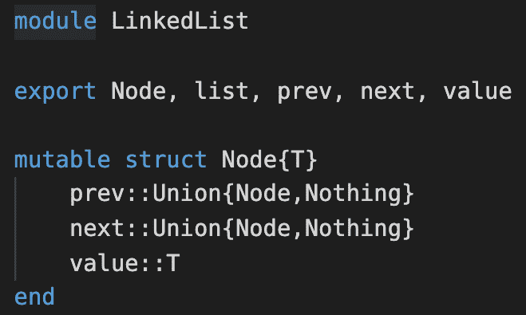

# 传统面向对象模式

到目前为止，我们已经学习了成为一名有效的 Julia 程序员所需了解的许多设计模式。前几章中提出的案例包括了我们可以通过编写*惯用*的 Julia 代码解决的问题。有些人可能会问，经过这么多年，我已经学习和适应了**面向对象编程**（**OOP**）范式；我如何在 Julia 中应用同样的概念？一般的回答是，你不会以同样的方式解决问题。用 Julia 编写的解决方案将看起来不同，反映了不同的编程范式。尽管如此，思考如何在 Julia 中采用一些 OOP 技术仍然是一个有趣的练习。

在本章中，我们将涵盖经典《**四人帮**》（**GoF**）《*设计模式*》书中所有的 23 种设计模式。我们将保持传统，以下章节中组织主题：

+   创建型模式

+   行为模式

+   结构模式

到本章结束时，你将了解这些模式如何在 Julia 中应用，与面向对象方法相比。

# 技术要求

示例源代码位于[`github.com/PacktPublishing/Hands-on-Design-Patterns-and-Best-Practices-with-Julia/tree/master/Chapter11`](https://github.com/PacktPublishing/Hands-on-Design-Patterns-and-Best-Practices-with-Julia/tree/master/Chapter11)。

代码在 Julia 1.3.0 环境中进行了测试。

# 创建型模式

**创建型**模式指的是构建和实例化对象的各种方式。由于 OOP 将数据和操作组合在一起，并且由于一个类可能从祖先类继承结构和行为，因此在构建大型系统时涉及额外的复杂性。设计上，Julia 已经通过不允许在抽象类型中声明字段和不允许从具体类型创建新子类型来解决了许多问题。尽管如此，在某些情况下，这些模式可能有所帮助。

创建型模式包括工厂方法、抽象工厂、单例、建造者和原型模式。我们将在以下章节中详细讨论它们。

# 工厂方法模式

**工厂方法**模式的想法是提供一个单一接口来创建符合接口的不同类型的对象，同时隐藏实际实现细节。这种抽象将客户端与功能提供者的底层实现解耦。

例如，一个程序可能需要在输出中格式化一些数字。在 Julia 中，我们可能想使用`Printf`包来格式化数字，如下所示：


也许我们不想与 `Printf` 包耦合，因为我们希望在将来能够切换并使用不同的格式化包。为了使应用程序更加灵活，我们可以设计一个接口，其中数字可以根据它们的类型进行格式化。以下接口在文档字符串中描述：

```py
"""
 format(::Formatter, x::T) where {T <: Number}

Format a number `x` using the specified formatter.
Returns a string.
"""
function format end
```

`format` 函数接受一个 `formatter` 和一个数值 `x`，并返回一个格式化的字符串。`Formatter` 类型定义如下：

```py
abstract type Formatter end
struct IntegerFormatter <: Formatter end
struct FloatFormatter <: Formatter end
```

然后，工厂方法基本上创建用于调度的单例类型：

```py
formatter(::Type{T}) where {T <: Integer} = IntegerFormatter()
formatter(::Type{T}) where {T <: AbstractFloat} = FloatFormatter()
formatter(::Type{T}) where T = error("No formatter defined for type $T")
```

默认实现可能如下所示，利用 `Printf` 包：

```py
using Printf
format(nf::IntegerFormatter, x) = @sprintf("%d", x)
format(nf::FloatFormatter, x) = @sprintf("%.2f", x)
```

将所有内容放入 `FactoryExample` 模块中，我们可以运行以下测试代码：

```py
function test()
    nf = formatter(Int)
    println(format(nf, 1234))
    nf = formatter(Float64)
    println(format(nf, 1234))
end
```

输出如下：


如果我们未来想要更改格式化器，我们只需提供一个新实现，其中定义了我们要支持的数值类型的格式化函数。当我们有很多数字格式化代码时，这很有用。切换到不同的格式化器实际上只需要两行代码的改变（在这个例子中）。

让我们看看抽象工厂模式。

# 抽象工厂模式

**抽象工厂**模式用于通过一组工厂方法创建对象，这些方法从具体实现中抽象出来。抽象工厂模式可以看作是工厂的工厂。

我们可以探索构建一个支持 Microsoft Windows 和 macOS 的多平台 GUI 库的例子。由于我们想要开发跨平台的代码，我们可以利用这个设计模式。这种设计在以下 UML 图中描述：


简而言之，我们在这里展示了两种类型的 GUI 对象：`Button` 和 `Label`。对于 Microsoft Windows 和 macOS 平台，概念是相同的。客户端不关心这些对象是如何实例化的；相反，它要求一个抽象工厂 `GUIFactory` 返回支持多个工厂方法的工厂（即 `MacOSFactory` 或 `WindowsFactory`），以创建平台相关的 GUI 对象。

Julia 的实现可以通过适当的抽象和具体类型简单地建模。让我们从操作系统级别开始：

```py
abstract type OS end
struct MacOS <: OS end
struct Windows <: OS end
```

我们原本打算使用 `MacOS` 和 `Windows` 作为后续调度目的的单例类型。现在，让我们继续并定义抽象类型 `Button` 和 `Label`，如下所示。此外，我们分别为每种类型定义了 `show` 方法：

```py
abstract type Button end
Base.show(io::IO, x::Button) = 
    print(io, "'$(x.text)' button")

abstract type Label end
Base.show(io::IO, x::Label) = 
    print(io, "'$(x.text)' label")
```

我们确实需要为这些 GUI 对象提供具体实现。现在让我们定义它们：

```py
# Buttons
struct MacOSButton <: Button
    text::String
end

struct WindowsButton <: Button
    text::String
end

# Labels
struct MacOSLabel <: Label
    text::String
end

struct WindowsLabel <: Label
    text::String
end
```

为了简单起见，我们只保留一个文本字符串，无论是按钮还是标签。由于工厂方法是平台相关的，我们可以利用 OS 特性和多重分派来调用正确的 `make_button` 或 `make_label` 函数：

```py
# Generic implementation using traits
current_os() = MacOS() # should get from system
make_button(text::String) = make_button(current_os(), text)
make_label(text::String) = make_label(current_os(), text)
```

为了测试，我们硬编码了`current_os`函数以返回`MacOS()`。实际上，这个函数应该通过检查适当的系统变量来返回`MacOS()`或`Windows()`以识别平台。最后，我们需要按如下方式实现每个平台的具体函数：

```py
# MacOS implementation
make_button(::MacOS, text::String) = MacOSButton(text)
make_label(::MacOS, text::String) = MacOSLabel(text)

# Windows implementation
make_button(::Windows, text::String) = WindowsButton(text)
make_label(::Windows, text::String) = WindowsLabel(text)
```

我们简单的测试只是调用`make_button`函数：


通过多态，我们可以轻松扩展到新的平台或新的 GUI 对象，只需为特定的操作系统定义新函数即可。

接下来，我们将探讨单例模式。

# 单例模式

单例模式用于创建对象的单个实例并在任何地方重用它。单例对象通常在应用程序启动时构建，或者可以在对象首次使用时懒加载创建。对于多线程应用程序，单例模式有一个有趣的要求，即单例对象的实例化只能发生一次。如果对象创建函数从多个线程中懒加载，这可能会成为一个挑战。

假设我们想要创建一个名为`AppKey`的单例，该单例用于应用程序中的加密：

```py
# AppKey contains an app id and encryption key
struct AppKey
    appid::String
    value::UInt128
end
```

初始时，我们可能会倾向于使用全局变量。鉴于我们已经了解了全局变量的性能影响，我们可以应用在第六章“性能模式”中学到的全局常量模式。本质上，创建了一个`Ref`对象作为占位符，如下所示：

```py
# placeholder for AppKey object. 
const appkey = Ref{AppKey}()
```

`appkey`全局常量最初创建时没有分配任何值，但随后可以在单例实例化时更新。单例的构建可以按如下方式进行：

```py
function construct()
    global appkey
    if !isassigned(appkey)
        ak = AppKey("myapp", rand(UInt128))
        println("constructing $ak")
        appkey[] = ak
    end
    return nothing
end
```

当只有一个线程时，此代码运行正常。如果我们用多个线程测试它，那么`isassigned`检查就成问题了。例如，两个线程可能会同时检查密钥是否已分配，并且两个线程都可能会认为需要实例化单例对象。在这种情况下，我们最终会构建单例两次。

测试代码如下所示：

```py
function test_multithreading()
    println("Number of threads: ", Threads.nthreads())
    global appkey
    Threads.@threads for i in 1:8
        construct()
    end
end
```

我们可以演示以下问题。让我们用四个线程启动 Julia REPL：


然后，我们可以运行测试代码：


如您所见，这里的单例被构建了两次。

那么，我们该如何解决这个问题呢？我们可以使用锁来同步单例构造逻辑。让我们首先创建另一个全局常量来持有锁：

```py
const appkey_lock = Ref(ReentrantLock())
```

要使用锁，我们可以按如下方式修改`construct`函数：


在检查`appkey[]`是否已经被分配之前，我们必须首先获取锁。当我们完成单例对象的构建（或者如果它已经被创建，则跳过它）后，我们释放锁。请注意，我们将代码的关键部分包裹在一个`try`块中，并将`unlock`函数放在`finally`块中。这样做是为了确保无论单例对象的构建是否成功，锁都会被释放。

我们的新测试显示单例对象只被构建一次：


当我们需要保持一个单一对象时，单例模式很有用。实际的应用场景包括数据库连接或其他外部资源的引用。接下来，我们将探讨建造者模式。

# 建造者模式

**建造者模式**用于通过逐步构建更简单的部分来构建复杂对象。我们可以想象工厂装配线将以类似的方式工作。在这种情况下，产品将逐步组装，越来越多地添加部件，并在装配线末端，产品完成并准备好。

这种模式的优点之一是建造者代码看起来像线性数据流，对于某些人来说更容易阅读。在 Julia 中，我们可能想要编写如下内容：

```py
car = Car() |>
    add(Engine("4-cylinder 1600cc Engine")) |>
    add(Wheels("4x 20-inch wide wheels")) |>
    add(Chassis("Roadster Chassis"))
```

实质上，这正是第九章中描述的精确功能管道模式，*杂项模式*。对于这个例子，我们可以为构建每个部分（如轮子、引擎和底盘）开发高阶函数。以下代码演示了如何创建一个用于创建轮子的 curry（高阶）函数：

```py
function add(wheels::Wheels)
    return function (c::Car)
        c.wheels = wheels
        return c
    end
end
```

`add`函数只是返回一个匿名函数，该函数接受一个`Car`对象作为输入并返回一个增强的`Car`对象。同样，我们可以为`Engine`和`Chassis`类型开发类似的功能。一旦这些函数准备就绪，我们只需通过链式调用这些函数来构建一辆车。

接下来，我们将讨论原型模式。

# 原型模式

**原型模式**通过从现有对象或原型对象克隆字段来创建新对象。其理念是，某些对象难以构建或构建耗时，因此制作一个对象的副本并进行少量修改将其称为新对象会很有用。

由于 Julia 将数据和逻辑分开，复制对象实际上等同于复制内容。这听起来很简单，但我们不应忽视浅拷贝和深拷贝之间的区别。

对象的**浅拷贝**仅仅是一个从另一个对象复制所有字段的简单对象。对象的**深拷贝**是通过递归进入对象的字段并复制它们的底层字段来创建的。因此，浅拷贝可能不是理想的选择，因为某些数据可能与原始对象共享。

为了说明这一点，让我们考虑以下银行账户示例的结构定义：

```py
mutable struct Account
    id::Int
    balance::Float64
end

struct Customer
    name::String
    savingsAccount::Account
    checkingAccount::Account
end
```

现在，假设我们有一个从该函数返回的`Customer`对象数组：

```py
function sample_customers()
    a1 = Account(1, 100.0)
    a2 = Account(2, 200.0)
    c1 = Customer("John Doe", a1, a2)

    a3 = Account(3, 300.0)
    a4 = Account(4, 400.0)
    c2 = Customer("Brandon King", a3, a4)

    return [c1, c2]
end
```

`sample_customer`函数返回两个客户的数组。为了测试目的，让我们构建一个测试框架来更新第一个客户的余额，如下所示：

```py
function test(copy_function::Function)
    println("--- testing ", string(copy_function), " ---")
    customers = sample_customers()
    c = copy_function(customers)
    c[1].checkingAccount.balance += 500
    println("orig: ", customers[1].checkingAccount.balance)
    println("new: ", c[1].checkingAccount.balance)
end
```

如果我们使用内置的`copy`和`deepcopy`函数对测试框架进行练习，我们会得到以下结果：


意外地，我们在`orig`输出中得到了错误的结果，因为我们本应该给新客户增加$500。为什么原始客户记录和新客户记录的余额相同呢？这是因为当使用`copy`函数时，从客户数组中创建了一个浅拷贝。当这种情况发生时，客户记录在原始数组和新数组之间实际上是共享的。这意味着修改新记录也会影响原始记录。

在结果的第二部分中，只有客户记录的新副本被更改。这是因为使用了`deepcopy`函数。根据定义，原型模式要求对副本进行修改。如果应用此模式，进行深拷贝可能更安全。

我们已经涵盖了所有五个创建型模式。这些模式允许我们以有效的方式构建新对象。

接下来，我们将介绍一组行为设计模式。

# 行为模式

**行为**模式指的是对象如何被设计来相互协作和通信。从面向对象范式中有 11 个 GoF 模式。我们将在这里通过一些有趣的动手示例涵盖所有这些模式。

# 责任链模式

**责任链**（**CoR**）模式用于使用请求处理链来处理请求，其中每个处理程序都有自己的独特和独立的责任。

这种模式在许多应用中都很常见。例如，Web 服务器通常使用所谓的中间件来处理 HTTP 请求。每个中间件部分负责执行特定的任务——例如，验证请求、维护 cookie、验证请求和执行业务逻辑。关于责任链模式的一个特定要求是，链的任何部分都可以在任何时候被打破，从而导致过程的早期退出。在前面的 Web 服务器示例中，认证中间件可能已经决定用户未通过认证，因此用户应该被重定向到另一个网站进行登录。这意味着除非用户通过了认证步骤，否则将跳过其余的中间件。

我们如何在 Julia 中设计这样的东西？让我们看看一个简单的例子：

```py
mutable struct DepositRequest
    id::Int
    amount::Float64
end
```

`DepositRequest`对象包含客户想要存入其账户的金额。我们的营销部门希望我们如果存款金额超过$100,000，就向客户提供感谢信。为了处理此类请求，我们设计了三个函数，如下所示：

```py
@enum Status CONTINUE HANDLED

function update_account_handler(req::DepositRequest) 
    println("Deposited $(req.amount) to account $(req.id)")
    return CONTINUE
end

function send_gift_handler(req::DepositRequest)
    req.amount > 100_000 && 
        println("=> Thank you for your business")
    return CONTINUE
end

function notify_customer(req::DepositRequest)
    println("deposit is finished")
    return HANDLED
end
```

这些函数的职责是什么？

+   `update_account_handler`函数负责使用新的存款更新账户。

+   `send_gift_handler`函数负责向客户发送感谢信，以感谢其大额存款。

+   `notify_customer`函数负责在存款完成后通知客户。

这些函数也返回一个枚举值，要么是`CONTINUE`，要么是`HANDLED`，以指示在当前处理程序完成后是否应将请求传递给下一个处理程序。

应该很清楚，这些函数以特定的顺序运行。特别是，`notify_customer`函数应在交易结束时运行。因此，我们可以建立一个函数数组：

```py
handlers = [
    update_account_handler, 
    send_gift_handler,
    notify_customer
]
```

我们还可以有一个函数来按顺序执行这些处理程序：

```py
function apply(req::DepositRequest, handlers::AbstractVector{Function})
    for f in handlers
        status = f(req)
        status == HANDLED && return nothing
    end
end
```

作为这个设计的一部分，如果任何处理程序返回`HANDLED`值，循环将立即结束。我们用于测试向 VIP 客户发送感谢信功能的测试代码如下所示：

```py
function test()
    println("Test: customer depositing a lot of money")
    amount = 300_000
    apply(DepositRequest(1, amount), handlers)

    println("\nTest: regular customer")
    amount = 1000
    apply(DepositRequest(2, amount), handlers)
end
```

运行测试给出以下结果：


我将把这个任务留给你，在链中构建另一个函数以执行早期退出。但到目前为止，让我们继续到下一个模式——中介者模式。

# 中介者模式

**中介者模式**用于促进应用程序中不同组件之间的通信。这样做的方式是使各个组件相互解耦。在大多数应用程序中，一个组件的变化可能会影响另一个组件。有时，也会有级联效应。中介者可以承担在组件发生变化时被通知的责任，并且它可以通知其他组件关于该事件的详细信息，以便进行进一步的下游更新。

例如，我们可以考虑**图形用户界面**（**GUI**）的使用案例。假设我们有一个屏幕，其中包含三个字段，用于我们的最喜欢的银行应用程序：

+   **金额**：账户中的当前余额。

+   **利率**：以百分比表示的当前利率。

+   **利息金额**：利息金额。这是一个只读字段。

它们是如何相互作用的？如果金额发生变化，那么利息金额需要更新。同样，如果利率发生变化，那么利息金额也需要更新。

为了模拟 GUI，我们可以为屏幕上的单个 GUI 对象定义以下类型：

```py
abstract type Widget end

mutable struct TextField <: Widget
    id::Symbol
    value::String
end
```

`Widget` 是一个抽象类型，它可以作为所有 GUI 对象的超类型。这个应用程序只需要文本字段，所以我们只定义了一个 `TextField` 小部件。文本字段通过 `id` 来标识，并包含一个 `value`。为了从文本字段小部件中提取和更新值，我们可以定义如下函数：

```py
# extract numeric value from a text field
get_number(t::TextField) = parse(Float64, t.value)

# set text field from a numeric value
function set_number(t::TextField, x::Real)
    println("* ", t.id, " is being updated to ", x)
    t.value = string(x)
    return nothing
end
```

从前面的代码中，我们可以看到 `get_number` 函数从文本字段小部件中获取值，并将其作为浮点数返回。`set_number` 函数使用提供的数值填充文本字段小部件。现在，我们还需要创建应用程序，所以我们方便地定义了一个结构体如下：

```py
Base.@kwdef struct App
    amount_field::TextField
    interest_rate_field::TextField
    interest_amount_field::TextField
end
```

对于这个例子，我们将实现一个 `notify` 函数来模拟用户输入值后发送到文本字段小部件的事件。在现实中，GUI 平台通常会执行这个功能。让我们称它为 `on_change_event`，如下所示：

```py
function on_change_event(widget::Widget)
    notify(app, widget)
end
```

`on_change_event` 函数除了向中介（应用程序）传达这个小部件刚刚发生了某些事情之外，没有做其他任何事情。至于应用程序本身，以下是它处理通知的方式：

```py
# Mediator logic - handling changes to the widget in this app
function notify(app::App, widget::Widget)
    if widget in (app.amount_field, app.interest_rate_field)
        new_interest = get_number(app.amount_field) * get_number(app.interest_rate_field)/100
        set_number(app.interest_amount_field, new_interest)
    end
end
```

如您所见，它只是检查正在更新的小部件是否是金额或利率字段。如果是，它计算新的利息金额，并用新值填充利息金额字段。让我们快速测试一下：

```py
function test()
    # Show current state before testing
    print_current_state()

    # double principal amount from 100 to 200
    set_number(app.amount_field, 200)
    on_change_event(app.amount_field)
    print_current_state()
end
```

`test` 函数显示应用程序的初始状态，更新金额字段，并显示新状态。为了简洁起见，这里没有显示 `print_current_state` 函数的源代码，但可以在本书的 GitHub 网站上找到。测试程序的输出如下所示：


使用 2 中介模式的优点是每个对象都可以专注于自己的职责，而不用担心下游的影响。一个中心的中介承担组织活动和处理事件以及通信的责任。

接下来，我们将探讨备忘录模式。

# 备忘录模式

备忘录模式是一种状态管理技术，您可以在需要时将工作恢复到先前的状态。一个常见的例子是文字处理应用程序的撤销功能。在做出 10 次更改后，我们总是可以撤销先前的操作，并返回到这 10 次更改之前的原始状态。同样，一个应用程序可能会记住最近打开的文件，并提供一个选择菜单，以便用户可以快速重新打开之前打开的文件。

在 Julia 中实现备忘录模式非常简单。我们只需将先前状态存储在数组中，在做出更改时，我们可以将新状态推送到数组中。当我们想要撤销操作时，我们可以通过从数组中弹出来恢复先前的状态。为了说明这个想法，让我们考虑一个博客文章编辑应用程序的案例。我们可以定义数据类型如下：

```py
struct Post
    title::String
    content::String
end

struct Blog
    author::String
    posts::Vector{Post}
    date_created::DateTime
end
```

如您所见，一个`Blog`对象包含一个`Post`对象的数组。按照惯例，数组中的最后一个元素是博客文章的当前版本。如果数组中有五个帖子，那么这意味着已经进行了四次更改。创建一个新的博客就像以下代码所示：

```py
function Blog(author::String, post::Post)
    return Blog(author, [post], now())
end
```

默认情况下，一个新的博客对象只包含一个版本。随着用户进行更改，数组将增长。为了方便，我们可以提供一个`version_count`函数，该函数返回用户迄今为止所做的修订次数。

```py
version_count(blog::Blog) = length(blog.posts)
```

要获取当前帖子，我们可以简单地取数组的最后一个元素：

```py
current_post(blog::Blog) = blog.posts[end]
```

现在，当我们需要更新博客时，我们必须将新版本推送到数组中。以下是用来用新标题或内容更新博客的函数：

```py
function update!(blog::Blog; 
                 title = nothing, 
                 content = nothing)
    post = current_post(blog)
    new_post = Post(
        something(title, post.title),
        something(content, post.content)
    )
    push!(blog.posts, new_post)
    return new_post
end
```

`update!`函数接受一个`Blog`对象，并且可以可选地接受更新后的`title`、`content`或两者。基本上，它创建一个新的`Post`对象并将其推入`posts`数组。撤销操作如下：

```py
function undo!(blog::Blog)
    if version_count(blog) > 1
        pop!(blog.posts)
        return current_post(blog)
    else
        error("Cannot undo... no more previous history.")
    end
end
```

我们可以用以下`test`函数来测试它：

```py
function test()
    blog = Blog("Tom", Post("Why is Julia so great?", "Blah blah."))
    update!(blog, content = "The reasons are...")

    println("Number of versions: ", version_count(blog))
    println("Current post")
    println(current_post(blog))

    println("Undo #1")
    undo!(blog)
    println(current_post(blog))

    println("Undo #2") # expect failure
    undo!(blog)
    println(current_post(blog))
end
```

输出如下所示：


如您所见，实现备忘录模式相当简单。我们将在下一节介绍观察者模式。

# 观察者模式

**观察者**模式对于将观察者注册到对象中非常有用，以便在该对象中所有状态变化都会触发向观察者发送通知。在支持一等函数的语言中——例如，Julia——可以通过维护一个在对象状态变化前后可以调用的函数列表来轻松实现此类功能。有时，这些函数被称为**钩子**。

Julia 中观察者模式的实现可能包括两个部分：

1.  扩展对象的`setproperty!`函数以监控状态变化并通知观察者。

1.  维护一个可以用来查找要调用的函数的字典。

对于这个演示，我们将再次使用银行账户示例：

```py
mutable struct Account
    id::Int
    customer::String
    balance::Float64
end
```

这是维护观察者的数据结构：

```py
const OBSERVERS = IdDict{Account,Vector{Function}}();
```

在这里，我们选择使用`IdDict`而不是常规的`Dict`对象。`IdDict`是一种特殊类型，它使用 Julia 的内部对象 ID 作为字典的键。为了注册观察者，我们提供了以下函数：

```py
function register(a::Account, f::Function)
    fs = get!(OBSERVERS, a, Function[])
    println("Account $(a.id): registered observer function $(Symbol(f))")
    push!(fs, f)
end
```

现在，让我们扩展`setproperty!`函数：

```py
function Base.setproperty!(a::Account, field::Symbol, value)
    previous_value = getfield(a, field)
    setfield!(a, field, value)
    fs = get!(OBSERVERS, a, Function[])
    foreach(f -> f(a, field, previous_value, value), fs)
end
```

这个新的`setproperty!`函数不仅更新了对象的字段，而且在字段更新后还调用观察者函数，传递了前一个状态和当前状态。为了测试目的，我们将创建一个观察者函数如下：

```py
function test_observer_func(a::Account, field::Symbol, previous_value, current_value)
    println("Account $(a.id): $field was changed from $previous_value to $current_value")
end
```

我们的`test`函数编写如下：

```py
function test()
    a1 = Account(1, "John Doe", 100.00)
    register(a1, test_observer_func)
    a1.balance += 10.00
    a1.customer = "John Doe Jr."
    return nothing
end
```

当运行测试程序时，我们得到以下输出：


从输出中，我们可以看到每次属性更新时都会调用`test_observer_func`函数。观察者模式是一个容易开发的东西。接下来，我们将探讨状态模式。

# 状态模式

**状态模式**用于对象根据其内部状态表现出不同行为的情况。网络服务是一个很好的例子。一个基于网络服务的典型实现是监听特定的端口号。当远程进程连接到服务时，它会建立连接，并且它们使用它进行通信，直到会话结束。当网络服务当前处于监听状态时，它应该允许打开新的连接；然而，在连接打开之前不应允许任何数据传输。然后，在连接打开后，我们应该能够发送数据。相比之下，如果连接已经关闭，则不应允许通过网络连接发送任何数据。

在 Julia 中，我们可以使用多重分派来实现状态模式。让我们首先定义以下对网络连接有意义的类型：

```py
abstract type AbstractState end

struct ListeningState <: AbstractState end
struct EstablishedState <: AbstractState end
struct ClosedState <: AbstractState end

const LISTENING = ListeningState()
const ESTABLISHED = EstablishedState()
const CLOSED = ClosedState()
```

在这里，我们利用了单例类型模式。至于网络连接本身，我们可以定义类型如下：

```py
struct Connection{T <: AbstractState,S}
    state::T
    conn::S
end
```

现在，让我们开发一个`send`函数，它用于通过连接发送消息。在我们的实现中，`send`函数除了收集连接的当前状态并将调用转发到特定状态`send`函数之外，不做任何事情：

```py
# Use multiple dispatch 
send(c::Connection, msg) = send(c.state, c.conn, msg)

# Implement `send` method for each state
send(::ListeningState, conn, msg) = error("No connection yet")
send(::EstablishedState, conn, msg) = write(conn, msg * "\n")
send(::ClosedState, conn, msg) = error("Connection already closed")
```

你可能认识这是神圣的特质模式。对于单元测试，我们可以为创建具有指定消息的新`Connection`和向`Connection`对象发送消息开发一个`test`函数：

```py
function test(state, msg)
    c = Connection(state, stdout)
    try 
        send(c, msg)
    catch ex
        println("$(ex) for message '$msg'")
    end
    return nothing
end
```

然后，测试代码简单地运行了三次`test`函数，每次对应一个可能的状态：

```py
function test()
    test(LISTENING, "hello world 1")
    test(CLOSED, "hello world 2")
    test(ESTABLISHED, "hello world 3")
end
```

当运行`test`函数时，我们得到以下输出：


只有第三条消息成功发送，因为连接处于`ESTABLISHED`状态。现在，让我们看看策略模式。

# **策略模式**

**策略模式**允许客户端在运行时选择最佳的算法。而不是将客户端与预定义的算法耦合，当需要时，客户端可以配置为特定的算法（策略）。此外，有时算法的选择不能提前确定，因为决策可能取决于输入数据、环境或其他因素。

在 Julia 中，我们可以使用多重分派来解决这个问题。让我们考虑斐波那契数列生成器的例子。正如我们从第六章，“性能模式”中学到的，当我们递归实现时，计算第*n*个斐波那契数可能很棘手，因此我们的第一个算法（策略）可能是记忆化。此外，我们还可以使用不使用任何递归的迭代算法来解决这个问题。

为了支持记忆化和迭代算法，让我们创建以下一些新类型：

```py
abstract type Algo end
struct Memoized <: Algo end
struct Iterative <: Algo end
```

`Algo` 抽象类型是所有斐波那契算法的超类型。目前，我们只有两种算法可供选择：`Memoized` 或 `Iterative`。现在，我们可以定义 `fib` 函数的备忘录版本如下：

```py
using Memoize
@memoize function _fib(n)
    n <= 2 ? 1 : _fib(n-1) + _fib(n-2)
end

function fib(::Memoized, n)
    println("Using memoization algorithm")
    _fib(n)
end
```

首先定义一个备忘录函数 `_fib`。然后定义一个包装函数 `fib`，它将 `Memoized` 对象作为第一个参数。相应的迭代算法可以如下实现：

```py
function fib(algo::Iterative, n) 
    n <= 2 && return 1
    prev1, prev2 = 1, 1
    local curr
    for i in 3:n
        curr = prev1 + prev2
        prev1, prev2 = curr, prev1
    end
    return curr
end
```

在这次讨论中，算法的实际工作方式并不重要。由于第一个参数是 `Iterative` 对象，我们知道这个函数将被相应地调度。

从客户端的角度来看，它可以选择备忘录版本或迭代函数，具体取决于其需求。由于备忘录版本以 O(1) 的速度运行，当 `n` 较大时应该更快；然而，对于 `n` 的较小值，迭代版本会更好。我们可以以下列方式调用 `fib` 函数：

```py
fib(Memoized(), 10)
fib(Iterative(), 10)
```

如果客户端选择实现算法选择过程，可以很容易地做到，如下所示：

```py
function fib(n)
    algo = n > 50 ? Memoized() : Iterative()
    return fib(algo, n)
end
```

成功的测试结果如下所示：


如您所见，实现策略模式相当简单。*多分派的不合理有效性再次拯救了！* 接下来，我们将讨论另一个称为模板方法的行性行为模式。

# 模板方法模式

模板方法模式用于创建一个定义良好的过程，可以使用不同类型的算法或操作。作为一个模板，它可以根据客户端的需求定制任何算法或函数。

在这里，我们将探讨如何在机器学习（ML）管道用例中利用模板方法模式。对于那些不熟悉 ML 管道的人来说，以下是数据科学家可能采取的简化版本：


首先，将数据集分成两个单独的数据集，用于训练和测试。训练数据集被输入到一个过程中，将数据拟合到统计模型中。然后，`validate` 函数使用该模型来预测测试集（也称为目标）变量中的响应变量。最后，它将预测值与实际值进行比较，以确定模型的准确性。

假设我们已经将管道设置为如下所示：

```py
function run(data::DataFrame, response::Symbol, predictors::Vector{Symbol})
    train, test = split_data(data, 0.7)
    model = fit(train, response, predictors)
    validate(test, model, response)
end
```

为了简洁起见，具体的函数 `split_data`、`fit` 和 `validate` 在这里没有展示；如果您想查看它们，可以在本书的 GitHub 网站上查找。然而，管道概念在前面的逻辑中得到了演示。让我们快速尝试预测波士顿房价：


在这个例子中，响应变量是 `:MedV`，我们将基于 `:Rm`、`:Tax` 和 `:Crim` 建立一个统计模型。

波士顿住房数据集包含美国人口普查局收集的有关马萨诸塞州波士顿地区住房的数据。它在大量统计分析教育文献中被广泛使用。我们在这个例子中使用到的变量有：

`MedV`: 房主自住房屋的中位数（单位：千美元）

`Rm`: 每套住宅的平均房间数

`Tax`: 每$10,000 的完整价值财产税率

`Crim`: 每镇的人均犯罪率

模型的准确性由`rmse`变量（表示均方根误差）捕捉。默认实现使用线性回归作为拟合函数。

要实现模板方法模式，我们应该允许客户端插入过程的任何部分。因此，我们可以通过关键字参数修改函数：

```py
function run2(data::DataFrame, response::Symbol, predictors::Vector{Symbol};
            fit = fit, split_data = split_data, validate = validate)
    train, test = split_data(data, 0.7)
    model = fit(train, response, predictors)
    validate(test, model, response)
end
```

在这里，我们添加了三个关键字参数：`fit`、`split_data`和`validate`。函数被命名为`run2`以避免混淆，因此客户端应该能够通过传递自定义函数来自定义任何一个参数。为了说明它是如何工作的，让我们创建一个新的`fit`函数，该函数使用**广义线性模型**（**GLM**）：

```py
using GLM

function fit_glm(df::DataFrame, response::Symbol, predictors::Vector{Symbol})
    formula = Term(response) ~ +(Term.(predictors)...)
    return glm(formula, df, Normal(), IdentityLink())
end
```

现在我们已经自定义了拟合函数，我们可以通过传递`fit`关键字参数来重新运行程序：


如您所见，客户端可以通过传递函数来轻松自定义管道。这是可能的，因为 Julia 支持一等函数。

在下一节中，我们将回顾一些其他传统的行为模式。

# 命令、解释器、迭代器和访问者模式

**命令**、**解释器**和**访问者**模式被归入本节，仅仅是因为我们已经在本书的早期部分讨论了它们的使用案例。

**命令**模式用于参数化将要执行的操作。在第九章*杂项模式*部分中的*单例类型分派模式*部分，我们探讨了 GUI 调用不同命令并响应用户请求的特定操作的使用案例。通过定义单例类型，我们可以利用 Julia 的多分派机制来执行适当的函数。我们可以通过简单地添加接受新单例类型的新函数来扩展到新的命令。

**解释器**模式用于为特定领域模型建模抽象语法树。结果证明，我们已经在第七章中这样做过，即*可维护性模式*部分中的*领域特定语言*部分。每个 Julia 表达式都可以被建模为抽象语法树，而无需任何额外的工作，因此我们可以使用常规元编程设施（如宏和生成函数）来开发领域特定语言（DSL）。

**迭代器**模式用于使用标准协议遍历一组对象。在 Julia 中，已经有一个官方建立的迭代接口，任何集合框架都可以实现。只要为自定义对象定义了一个`iterate`函数，对象中的元素就可以作为任何循环结构的一部分进行迭代。更多信息可以在官方 Julia 参考手册中找到。

最后，**访问者**模式用于在面向对象范式中扩展现有类的功能。在 Julia 中，通过泛型函数的扩展，可以轻松地向现有系统添加新功能。例如，Julia 生态系统中有许多类似数组的包，如`OffsetArrays`、`StridedArrays`和`NamedArrays`。所有这些都是对现有的`AbstractArray`框架的扩展。

我们现在已经完成了行为模式。让我们继续前进，看看最后一组——结构模式。

# 结构模式

**结构设计**模式用于将对象组合在一起以形成更大的东西。随着你继续开发系统并添加功能，其大小和复杂性也在增长。我们不仅想要将组件集成在一起，同时我们也希望尽可能多地重用组件。通过学习本节中描述的结构模式，我们在项目中遇到类似情况时有一个遵循的模板。

在本节中，我们将回顾传统的面向对象模式，包括适配器、桥接、组合、装饰器、外观、享元和代理模式。让我们从适配器模式开始。

# 适配器模式

**适配器**模式用于使一个对象与另一个对象协同工作。比如说，我们需要集成两个子系统，但它们不能相互通信，因为接口要求没有得到满足。在现实生活中，你可能遇到过去不同国家旅行麻烦的情况，因为电源插头不同。为了解决这个问题，你可能需要带一个通用电源适配器，它作为中介使你的设备能够与外国的电源插座工作。同样，通过使用适配器，不同的软件可以被制作成相互兼容。

只要与子系统交互的接口是清晰的，那么创建适配器就可以是一个直接的任务。在 Julia 中，我们可以使用委托模式来包装一个对象，并提供符合所需接口的附加功能。

让我们想象一下，我们正在使用一个执行计算并返回链表的库。链表是一个方便的数据结构，它支持非常快的 O(1)速度的插入。现在，假设我们想要将数据传递给另一个需要我们符合`AbstractArray`接口的子系统。在这种情况下，我们不能直接传递链表，因为它不合适！

我们如何解决这个问题？首先，让我介绍一下`LinkedList`的实现：



这是一个相当标准的双向链表设计。每个节点包含一个数据值，同时也维护对前一个和后一个节点的引用。这种链表的典型用法如下所示：


通常，我们可以通过使用`prev`和`next`函数来遍历链表。当我们插入`3`的值时需要调用`next(LL)`的原因是我们希望将其插入到第二个节点之后。

由于使用链表没有实现`AbstractArray`接口，我们实际上无法通过索引引用任何元素，也无法确定元素的数量：


在这种情况下，我们可以构建一个符合`AbstractArray`接口的包装器（或称为适配器）。首先，让我们创建一个新的类型，并使其成为`AbstractArray`的子类型：

```py
struct MyArray{T} <: AbstractArray{T,1}
    data::Node{T}
end
```

由于我们只需要支持单维数组，我们已将超类型定义为`AbstractArray{T,1}`。底层数据只是对链表`Node`对象的引用。为了符合`AbstractArray`接口，我们应该实现`Base.size`和`Base.getindex`函数。下面是`size`函数的样子：

```py
function Base.size(ar::MyArray) 
    n = ar.data
    count = 0
    while next(n) !== nothing
        n = next(n)
        count += 1
    end
    return (1 + count, 1)
end
```

该函数通过使用`next`函数遍历链表来确定数组的长度。为了支持索引元素，我们可以定义`getindex`函数如下：

```py
function Base.getindex(ar::MyArray, idx::Int)
    n = ar.data
    for i in 1:(idx-1)
        next_node = next(n)
        next_node === nothing && throw(BoundsError(n.data, idx))
        n = next_node
    end
    return value(n)
end
```

这就是我们需要为包装器做的所有事情。现在让我们试运行一下：


现在我们已经在链表之上有了可索引的数组，我们可以将其传递给任何期望数组作为输入的库。

在需要数组变动的情形下，我们只需实现`Base.setindex!`函数即可。或者，我们可以将链表物理地转换为数组。数组具有 O(1)快速索引的性能特征，但在插入时相对较慢。

使用适配器使我们更容易使组件相互通信。接下来，我们将讨论组合模式。

# 组合模式

**组合**模式用于模拟可以组合在一起同时又能像单个对象一样被处理的对象。这种情况并不少见——例如，在一个绘图应用程序中，我们可能能够绘制不同类型的形状，如圆形、矩形和三角形。每个形状都有一个位置和大小，因此我们可以确定它们在屏幕上的位置以及它们的大小。当我们把几个形状组合在一起时，我们仍然可以确定组合后的大对象的位姿。此外，还可以对单个形状对象以及组合对象应用调整大小、旋转和其他变换功能。

在投资组合管理中也会出现类似的情况。我有一个由多个共同基金组成的退休投资账户。每个共同基金可能投资于股票、债券或两者兼有。然后，一些基金也可能投资于其他共同基金。从会计角度来看，我们可以始终确定股票、债券、股票基金、债券基金和基金组合的市场价值。在 Julia 中，我们可以通过为不同类型的工具实现`market_value`函数来解决这个问题，无论是股票、债券还是基金。现在让我们看看一些代码。

假设我们为股票/债券持仓定义了以下类型：

```py
struct Holding
    symbol::String
    qty::Int
    price::Float64
end
```

`Holding`类型包含交易符号、数量和当前价格。我们可以定义投资组合如下：

```py
struct Portfolio
    symbol::String
    name::String
    stocks::Vector{Holding}
    subportfolios::Vector{Portfolio}
end
```

投资组合由一个符号、一个名称、一个持仓数组和一个`subportfolios`数组来标识。为了测试，我们可以创建一个示例投资组合：

```py
function sample_portfolio()
    large_cap = Portfolio("TOMKA", "Large Cap Portfolio", [
        Holding("AAPL", 100, 275.15), 
        Holding("IBM", 200, 134.21), 
        Holding("GOOG", 300, 1348.83)])

    small_cap = Portfolio("TOMKB", "Small Cap Portfolio", [
        Holding("ATO", 100, 107.05), 
        Holding("BURL", 200, 225.09), 
        Holding("ZBRA", 300, 257.80)])

    p1 = Portfolio("TOMKF", "Fund of Funds Sleeve", [large_cap, small_cap])
    p2 = Portfolio("TOMKG", "Special Fund Sleeve", [Holding("C", 200, 76.39)])
    return Portfolio("TOMZ", "Master Fund", [p1, p2])
end
```

从缩进输出的结构中可以更清楚地可视化：


由于我们希望支持在任何级别计算市场价值的能力，我们只需要为每种类型定义`market_value`函数。最简单的一个是对于持仓：

```py
market_value(s::Holding) = s.qty * s.price
```

市场价值不过是数量乘以价格。计算投资组合的市场价值稍微复杂一些：

```py
market_value(p::Portfolio) = 
    mapreduce(market_value, +, p.stocks, init = 0.0) +
    mapreduce(market_value, +, p.subportfolios, init = 0.0)
```

在这里，我们使用`mapreduce`函数来计算单个股票（或`subportfolios`）的市场价值，并将它们加起来。由于一个投资组合可能包含多个持仓和多个`subportfolios`，我们需要对两者都进行计算并将它们相加。由于每个子投资组合也是一个`portfolio`对象，这段代码自然会递归地深入到子-`subportfolios`，依此类推。

复合体并没有什么特别之处。因为 Julia 支持泛型函数，所以我们可以为单个对象以及分组对象提供实现。

我们将在下一节讨论飞点模式。

# 飞点模式

**飞点模式**用于通过共享相似/相同对象的内存来有效地处理大量细粒度对象。

处理字符串的一个很好的例子涉及字符串。在数据科学领域，我们经常需要读取和分析以表格格式表示的大量数据。在许多情况下，某些列可能包含大量重复的字符串。例如，人口普查调查可能有一个表示性别的列，因此它将包含`Male`或`Female`。

与其他一些编程语言不同，Julia 中的字符串不会被内部化。这意味着`Male`这个词的 10 个副本将被反复存储，占用 10 倍于单个`Male`字符串的内存空间。我们可以很容易地从 REPL 中看到这个效果，如下所示：


因此，存储 100,000 个`Male`字符串副本大约占用 800 KB 的内存。这相当浪费内存。解决这个问题的常见方法是通过维护一个池化数组。我们不需要存储 100,000 个字符串，而只需编码数据并存储 100,000 字节，这样`0x01`对应男性，`0x00`对应女性。我们可以通过以下方式将内存占用减少八倍：


你可能会想知道为什么报告了额外的 40 字节。这 40 字节实际上是数组容器使用的。现在，鉴于性别列在这种情况下是二进制的，我们实际上可以通过存储位而不是字节来进一步压缩它，如下所示：


再次强调，我们通过使用`BitArray`来存储性别值，将内存使用量大约减少了八倍（从 1 字节减少到 1 位）。这是一种对内存使用的激进优化。但是，我们仍然需要将`Male`和`Female`字符串存储在某个地方，对吧？这是一个简单的任务，因为我们知道它们可以在任何数据结构中追踪，例如字典：


总结来说，我们现在能够在 12,568 + 370 = 12,938 字节内存中存储 100,000 个性别值。与直接存储字符串的原始笨拙方式相比，我们节省了超过 98%的内存消耗！我们是如何实现如此巨大的节省的呢？因为所有记录都共享相同的两个字符串。我们唯一需要维护的是指向那些字符串的引用数组。

因此，这就是享元模式的概念。同样的技巧在许多地方被反复使用。例如，`CSV.jl`包使用一个名为`CategoricalArrays`的包，它提供了本质上相同类型的内存优化。

接下来，我们将回顾最后几个传统模式——桥接模式、装饰器模式和外观模式。

# 桥接模式、装饰器模式和外观模式

让我解释一下桥接模式、装饰器模式和外观模式是如何工作的。在这个阶段，我们不会为这些模式提供更多的代码示例，仅仅是因为它们相对容易实现，因为你已经从之前的设计模式章节中获得了许多想法。也许不会太令人惊讶，你迄今为止学到的一些技巧——委托、单例类型、多重分派、一等函数、抽象类型和接口——都是你可以用来解决任何类型问题的。

**桥接模式**用于解耦抽象与其实现，以便它们可以独立演变。在 Julia 中，我们可以为实施者构建一个抽象类型的层次结构，他们可以开发符合这些接口的软件。

Julia 的数值类型是这样一个系统如何设计的良好例子。有许多抽象类型可供选择，例如`Integer`、`AbstractFloat`和`Real`。然后，还有由`Base`包提供的具体实现，如`Int`和`Float64`。这种抽象设计得如此之好，以至于人们可以提供数字的替代实现。例如，`SaferInteger`包为整数提供了一个更安全的实现，避免了数值溢出。

**装饰器**模式也易于实现。它可以用来增强现有对象的新功能，因此得名*装饰器*。假设我们购买了一个第三方库，但我们并不完全满意其功能。使用装饰器模式，我们可以通过用新函数包装现有库来增加价值。

这可以通过委托模式自然地完成。通过用新类型包装现有类型，我们可以通过委托到基础对象来重用现有功能。然后，我们可以在新类型中添加新函数以获得新能力。我们看到这个模式被反复使用。

**外观**模式用于封装复杂的子系统，并为客户端提供一个简化的接口。在 Julia 中我们如何做到这一点？到目前为止，我们应该已经一次又一次地看到了这个模式；我们所需做的只是创建一个新的类型，并提供一个简单的 API 来操作这个新类型。我们可以使用委托模式将请求转发到其他封装的类型。

现在我们已经审视了所有传统的面向对象模式。你可能已经注意到，许多用例可以用这本书中描述的标准 Julia 特性和模式来解决。这不是巧合——这只是处理 Julia 中的复杂问题如此简单。

# 摘要

在本章中，我们广泛地讨论了传统的面向对象设计模式。我们从这样一个谦卑的信念开始，即面向对象编程中的相同模式通常需要在 Julia 编程中应用。

我们开始回顾创建型设计模式，包括工厂方法、抽象工厂、单例、建造者和原型模式。这些模式涉及创建对象的各种技术。当涉及到 Julia 时，我们可以主要使用抽象类型、接口和多重分派来解决这些问题。

我们还投入了大量精力研究行为设计模式。这些模式旨在处理应用程序组件之间的协作和通信。我们研究了 11 个模式：责任链、中介者、备忘录、观察者、状态、策略、模板方法、命令、解释器、迭代器和访问者。这些模式可以使用特性、接口、多重分派和一等函数在 Julia 中实现。

最后，我们回顾了几个结构化设计模式。这些模式通过复用现有组件来构建更大的组件。这包括适配器、组合、享元、桥接、装饰器和外观模式。在 Julia 中，它们可以通过抽象类型、接口和委托设计模式来处理。

我希望你们已经相信，构建软件并不一定困难。尽管面向对象编程让我们相信我们需要所有这些复杂性来设计软件，但这并不意味着我们在 Julia 中必须这样做。本章中提出的问题的解决方案大多需要你在本书中找到的基本软件设计技能和模式。

在下一章中，我们将深入探讨有关数据类型和分发的更高级主题。*准备好迎接挑战！*

# 问题

1.  我们可以使用什么技术来实现抽象工厂模式？

1.  我们如何防止在多线程应用程序中多次初始化单例？

1.  Julia 中实现观察者模式的关键特性是什么？

1.  我们如何使用模板方法模式来自定义一个操作？

1.  我们如何制作一个适配器来实现目标接口？

1.  享元模式的好处是什么？我们可以使用什么策略来实现它？

1.  我们可以使用 Julia 的哪个特性来实现策略模式？
