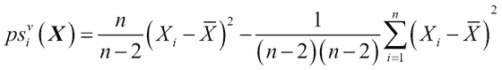
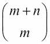
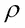
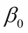

# 第二章. 自举

如前一章所见，统计推断在计算能力的帮助下得到了极大的增强。我们还探讨了排列检验的过程，其中相同的检验被多次应用于给定数据的重采样（在零假设下）。重采样方法背后的原理也类似；我们相信，如果样本确实是随机的，并且观测是从相同的相同分布中生成的，我们就有一个有效的理由用替换的方式重采样同一组观测。这是因为任何观测都可能多次发生，而不是作为一个单独的实例。

本章将从重采样的正式定义开始，接着探讨删层技术。这将被应用于多个问题，尽管相对较简单，我们首先将查看伪值的定义。由 Efron 发明的自举方法可能是最有用的重采样方法。我们将彻底研究这个概念，并将应用从简单案例扩展到回归模型。

本章将涵盖以下内容：

+   **删层技术**：我们的第一个重采样方法，能够减少偏差

+   **自举**：一种统计方法，也是删层方法的推广

+   **boot 包**：自举方法的主要 R 包

+   **自举和假设检验**：使用自举方法进行假设检验

+   **自举回归模型**：将自举方法应用于一般回归模型

+   **自举生存模型**：应用自举方法处理生存数据

+   **自举时间序列模型**：时间序列数据的自举方法——这里的观测是相关的

# 技术要求

在本章中，我们将使用以下库：

+   `ACSWR`

+   `boot`

+   `car`

+   `gee`

+   `mvtnorm`

+   `pseudo`

+   `RSADBE`

+   `survival`

# 删层技术

Quenouille（1949 年）发明了删层技术。其目的是通过有系统地查看多个数据样本来减少偏差。删层技术的名字似乎是由著名的统计学家 John W. Tukey 提出的。主要由于计算能力的缺乏，删层方法的进步和实用性受到了限制。Efron 在 1979 年发明了自举方法（参见下文的应用），并建立了与删层方法之间的联系。实际上，这两种方法有很多共同之处，通常被归类为*重采样方法*。

假设我们从概率分布*F*中抽取一个大小为*n*的随机样本，并用表示感兴趣的参数。令为的估计量，在此我们并没有给定的概率分布。当概率分布未知时，重采样方法有助于进行统计推断。有必要对这个概念给出一个正式的定义。

定义：**重采样方法**是估计估计量的偏差和方差的途径，它使用基于可用观测值的子样本的值。

**Jackknife 技术**是一种重采样方法，我们将在接下来的讨论中阐述其一般步骤。如前所述，是的估计量。为了简化，我们定义给定观测值的向量为。设置此程序的重要量是**伪值**，我们将在下文中对其进行数学定义。

**定义**：令，即是去掉第*i*个观测值的向量。的第*i*个伪值定义为以下内容：


可以从数学上证明**伪值**等同于以下内容：


因此，**伪值**被视为的偏差校正版本。这里定义的伪值也被称为**删除一个**的 Jackknife。Jackknife 方法将伪值视为具有均值的独立观测值，然后应用**中心极限定理**进行统计推断。伪值的均值和（抽样）方差如下所示：


## 均值和方差的 Jackknife 方法

假设概率分布是未知的，直方图和其他可视化技术表明正态分布的假设不合适。然而，我们也没有足够的信息来为手头的问题制定一个合理的概率模型。在这里，我们可以充分利用 Jackknife 技术。

我们将均值和方差估计量定义为如下：


与和相关的伪值分别在以下表达式中给出：



的均值将是样本均值，而的均值将是样本方差。然而，杰克 knife 方法的应用在于细节。仅基于估计的均值，我们无法推断关于总体均值的信息，仅基于样本方差，我们无法精确推断关于总体方差的信息。为了了解这些伪值公式的具体情况以及它们的方差如何有用，我们将在下一个优雅的 R 程序中设置。

我们将从具有一些规模和形状参数的威布尔分布中模拟 *n = 1000* 个观测值。在标准文献中，我们将能够找到这两个参数的估计值。然而，从业者很少对这些参数感兴趣，他们更愿意推断寿命的均值和方差。密度函数是一个复杂的形式。此外，从规模和形状参数的角度来看，威布尔随机变量的理论均值和方差很容易发现过于复杂，涉及伽马积分的表达式并不能进一步帮助这个案例。如果读者试图在搜索引擎中搜索字符串 *威布尔分布均值的统计推断*，结果将不会令人满意，而且进一步推进不会很容易，除非是数学上熟练的人。在这个复杂的场景中，我们将探讨杰克 knife 方法是如何为我们解围的。

在我们继续之前，有一个注意事项。读者可能会想，“在这个强大的超级计算机器时代，谁会在乎威布尔分布呢？”然而，任何可靠性工程师都会证实寿命分布的有用性，而威布尔是这个类别中的重要成员。第二点可能是，对于大样本，正态近似将很好地成立。然而，当我们有适中的样本进行推断时，对于像威布尔这样高度偏斜的分布的正态近似可能会失去测试的力度和信心。此外，问题是，如果我们坚信基础分布是威布尔（没有参数），那么获得威布尔分布的均值和方差的精确分布仍然是一个巨大的数学任务。

R 程序将实现针对给定原始数据的均值和方差的杰克 knife 技术：

```py
> # Simulating observations from Weibull distribution
> set.seed(123)
> sr <- rweibull(1000,0.5,15)
> mean(sr); sd(sr); var(sr)
[1] 30.41584
[1] 69.35311
[1] 4809.854
```

如前所述的模拟场景中提到的，我们播种是为了可重复的结果。`rweibull`函数有助于执行从威布尔分布模拟观察值的任务。我们计算样本的均值、标准差和方差。接下来，我们定义`pv_mean`函数，它将使计算均值和方差的`伪值`成为可能：

```py
> # Calculating the pseudovalues for the mean
> pv_mean <- NULL; n <- length(sr)
> for(i in 1:n)
+   pv_mean[i] <- sum(sr)- (n-1)*mean(sr[-i])
> head(sr,20)
 [1]  23.29756524   0.84873231  11.99112962   0.23216910   0.05650965
 [6] 143.11046494   6.11445277   0.19432310   5.31450418   9.21784734
[11]   0.02920662   9.38819985   2.27263386   4.66225355  77.54961762
[16]   0.16712791  29.48688494 150.60696742  18.64782005   0.03252283
> head(pv_mean,20)
 [1]  23.29756524   0.84873231  11.99112962   0.23216910   0.05650965
 [6] 143.11046494   6.11445277   0.19432310   5.31450418   9.21784734
[11]   0.02920662   9.38819985   2.27263386   4.66225355  77.54961762
[16]   0.16712791  29.48688494 150.60696742  18.64782005   0.03252283
> mean(pv_mean); sd(pv_mean)
[1] 30.41584
[1] 69.35311
```

注意，对于所有观察值，平均值和`伪值`的值与观察值的值相同。实际上，这是预期的，因为我们正在查看的统计量是平均值，它只是平均。从其他观察值的平均中减去应该会得到该值。因此，`伪值`的平均值和样本平均值也将相同。然而，这并不意味着努力是徒劳的。我们将继续对方差项进行以下计算：

```py
> # Calculating the pseudovalues for the variance
> pv_var <- NULL
> pseudo_var <- function(x,i){
+   n = length(x)
+   psv <- (n/(n-2))*(x[i]-mean(x))²-(1/(n-1)*(n-2))*sum(x-mean(x))²
+   return(psv)
+ }
> pv_var <- NULL
> for(i in 1:n)
+   pv_var[i] <- pseudo_var(sr,i)
> head(pv_var)
[1]    50.77137   875.96574   340.15022   912.87970   923.53596 12725.52973
> var(sr); mean(pv_var)
[1] 4809.854
[1] 4814.673
> sd(pv_var)
[1] 35838.59
```

现在，实际数据中没有观察到的`伪值`的对应物。在这里，`伪值`的平均值将大约等于样本方差。这是标准差`sd(pv_var)`，它将有助于进行与方差或标准差相关的推断。

我们已经看到夹具在推断均值和方差方面的有用性。在本节下一部分，我们将看到`伪值`如何在生存回归问题的背景下解决问题。

## 生存数据的伪值方法

原始的胆汁性肝硬化数据，`pbc`，在第一章，*集成技术简介*，第二部分中被引入，我们做了笔记，指出这些数据是特殊的，因为它是生存数据，感兴趣的时间变量可能受到截尾，这增加了进一步分析复杂性。处理生存数据的专用方法将在第十章，*集成生存模型*中讨论。这些专用方法包括风险回归，协变量的影响是在风险率上而不是在寿命上测量的。观察到从业者发现这些概念有点难以理解，因此我们将简要讨论基于伪值的替代方法。

安德森和克莱因在一系列论文中有效地使用了伪值的概念来解决各种问题：

```py
> library(survival)
> library(pseudo)
> library(gee)
> data(pbc)
> time_pseudo <- pseudomean(time=pbc$time,event=pbc$status==2)
> pbc_gee <- gee(time_pseudo ~ trt + age + sex + ascites + hepato +
+                  spiders + edema + bili + chol + albumin + copper + 
+                  alk.phos + ast + trig + platelet + protime + stage,
+                id=1:nrow(pbc), family="gaussian",
+                data=pbc)
Beginning Cgee S-function, @(#) geeformula.q 4.13 98/01/27
running glm to get initial regression estimate
 (Intercept)          trt          age         sexf      ascites       hepato 
5901.1046673  115.5247130  -23.6893551  233.0351191 -251.2292823  -63.1776549 
     spiders        edema         bili         chol      albumin       copper 
-264.2063329 -441.2298926  -67.7863015   -0.5739644  438.5953357   -2.3704801 
    alk.phos          ast         trig     platelet      protime        stage 
  -0.0619931   -1.1273468    0.2317984   -0.4243154 -160.6784722 -292.9838866 
> summary(pbc_gee)

 GEE:  GENERALIZED LINEAR MODELS FOR DEPENDENT DATA
 gee S-function, version 4.13 modified 98/01/27 (1998) 

Model:
 Link:                      Identity 
 Variance to Mean Relation: Gaussian 
 Correlation Structure:     Independent 

Call:
gee(formula = time_pseudo ~ trt + age + sex + ascites + hepato + 
    spiders + edema + bili + chol + albumin + copper + alk.phos + 
    ast + trig + platelet + protime + stage, id = 1:nrow(pbc), 
    data = pbc, family = "gaussian")

Summary of Residuals:
       Min         1Q     Median         3Q        Max 
-3515.1303  -792.8410   112.1563   783.9519  3565.1490 

Coefficients:
                Estimate   Naive S.E.    Naive z  Robust S.E.   Robust z
(Intercept) 5901.1046673 1.524661e+03  3.8704367 1.470722e+03  4.0123856
trt          115.5247130 1.616239e+02  0.7147750 1.581686e+02  0.7303895
age          -23.6893551 8.507630e+00 -2.7844835 8.204491e+00 -2.8873643
sexf         233.0351191 2.701785e+02  0.8625227 3.215865e+02  0.7246421
ascites     -251.2292823 4.365874e+02 -0.5754387 5.133867e+02 -0.4893568
hepato       -63.1776549 1.884840e+02 -0.3351885 1.786614e+02 -0.3536166
spiders     -264.2063329 1.986929e+02 -1.3297220 2.045738e+02 -1.2914962
edema       -441.2298926 4.155360e+02 -1.0618331 4.850261e+02 -0.9097034
bili         -67.7863015 2.651543e+01 -2.5564852 2.009844e+01 -3.3727151
chol          -0.5739644 4.117889e-01 -1.3938317 3.929789e-01 -1.4605475
albumin      438.5953357 2.321347e+02  1.8894000 2.156405e+02  2.0339196
copper        -2.3704801 1.120153e+00 -2.1162114 1.102365e+00 -2.1503594
alk.phos      -0.0619931 3.932052e-02 -1.5766092 4.571919e-02 -1.3559535
ast           -1.1273468 1.640940e+00 -0.6870130 1.797116e+00 -0.6273089
trig           0.2317984 1.416552e+00  0.1636356 1.375674e+00  0.1684980
platelet      -0.4243154 9.348907e-01 -0.4538663 9.106646e-01 -0.4659403
protime     -160.6784722 9.139593e+01 -1.7580484 9.254740e+01 -1.7361749
stage       -292.9838866 1.137951e+02 -2.5746618 1.025891e+02 -2.8558966

Estimated Scale Parameter:  1675818
Number of Iterations:  1
Working Correlation
     [,1]
[1,]    1
```

# 自举 – 一种统计方法

在本节中，我们将探讨复杂的统计函数。两个随机变量之间的相关性的统计分布是什么？如果多元数据的正态性假设不成立，那么获得标准误差和置信区间的替代方法是什么？Efron（1979）发明了*自助法*（bootstrap technique），它提供了解决与复杂统计函数相关的统计推断问题的方法。在第一章《集成技术介绍》中，介绍了**排列检验**，它反复抽取给定样本的样本，并对每个重采样进行测试。从理论上讲，排列检验需要数量的重采样，其中*m*和*n*是两个样本中的观测数，尽管在获得足够多的重采样后，人们会稍微放松一些。自助法以类似的方式工作，并且是一种重要的重采样方法。

设是从概率分布 F 中独立抽取的随机样本，感兴趣的参数为，参数的估计值用表示。如果参数的概率分布要么是未知的，要么是不可处理的，那么关于参数的统计推断就无法进行。因此，我们需要一种通用的技术来帮助进行推断。

Efron 的方法如下展开。由提供的估计值是一个单一值。给定数据并基于我们有一个独立同分布（IID）样本的假设，自助法（bootstrap method）探索了任何观察到的值与任何其他观察到的值一样可能性的可能性。因此，随机抽取的样本大小为*n*，且是**有放回地**抽取的，直观上期望它携带与实际样本相同的信息，我们可以根据这个样本获得参数的估计值。然后，这一步骤可以重复进行多次，我们将产生参数的多个估计值。使用这个估计值的分布，然后可以进行统计推断。这种方法的一个正式描述是必要的。

从  中随机抽取带替换的样本大小 *n*，并用  表示。这个样本  被称为 *第一个 bootstrap 样本*。计算这个样本  的估计值 ，并用  表示。重复执行步骤多次，并得到 。然后， 的推断可以基于 bootstrap 估计值 。我们可以将这个描述以算法的形式表示：

1.  给定数据 ，感兴趣的参数 ，计算估计值 。

1.  从  中随机抽取带替换的样本大小 *n*，并用  表示。

1.  计算 bootstrap 样本的统计量 。

1.  重复执行 *重复步骤 2 和 3 'B – 1'* 的次数以生成 。

1.  使用  来执行与  相关的统计推断。

这里的 *步骤 5* 传达了什么？我们使用每个  的值来估计感兴趣的参数 *B*，估计值要精确。由于估计（基于样本）是 ，我们（直观上）预期 bootstrap 估计值的平均值  将非常接近 ，因此 bootstrap 估计值的标准差也提供了对估计值方差的“良好”度量。然后计算 bootstrap 均值和标准差如下：


使用  和 ，我们可以对  进行推断。

应该注意的是，bootstrap 方法是一个非常通用的算法，这里的执行示例是为了说明面对某些有趣问题时的情况。

需要在此阐明有放回抽样的概念。为了简化，假设我们只有五个观测值，例如。现在，当我们用 5 个有放回样本的大小抽取第一个自助样本时，我们可能会得到标签*2*、*4*、*4*、*1*、*3*。这意味着，从原始样本中，我们选择了，因此标签为*2*、*1*和*3*的观测值各被选中一次，而*4*被选中两次。这与相同。在自助法符号中，它将是。第二个自助样本可能是，第三个可能是，依此类推。

接下来，我们将阐述这一技术并阐明其实现方法。我们将应用自助法解决两个问题：

+   相关系数的标准误差

+   协方差/相关矩阵的特征值

## 相关系数的标准误差

考虑一个假设场景，我们试图研究两个变量之间的关系。历史信息、直觉和散点图都一致，表明两个变量之间存在线性关系，唯一的问题是每个变量的直方图都呈现出非钟形形状。换句话说，正态分布的假设看起来非常不可能，并且由于它在单变量情况（每个变量）中失败，分析师对两个变量的联合双变量正态性持怀疑态度。

设为*n*对观测值。样本相关系数可以通过以下公式轻松计算：


这里我们有 。如果我们无法进行相关的统计推断，任何参数的估计都是没有用的。一个置信区间就足以提供相关结果以进行统计推断。我们将学习如何通过自助法帮助我们做到这一点。我们将使用向量符号来保持一致性，并为此定义 ，即  现在是一个向量。第一个自助样本是通过随机选择 n 对观测值并重复选择得到的，我们将第一个自助样本表示为 。现在，使用自助样本，我们将通过  来估计相关系数。重复获取自助样本的过程 *B – 1* 更多次，我们将计算相关系数 。

这里使用的是法学院数据，来自 Efron 和 Tibshirani (1990, p.19) 的第 3.1 表。在这项研究中，从 82 所法学院中随机选择了 15 所学校。对学校测量的两个变量包括班级在国家法律考试（LSAT）上的平均分数和平均本科成绩点（GPA）。我们首先从 CSV 文件导入数据，显示它，然后可视化两个变量的直方图以及散点图：

```py
> LS <- read.csv("../Data/Law_School.csv",header=TRUE)
> LS
   School LSAT  GPA
1       1  576 3.39
2       2  635 3.30
3       3  558 2.81

13     13  545 2.76
14     14  572 2.88
15     15  594 2.96
> windows(height=100,width=100)
> layout(matrix(c(1,2,3,3),byrow=TRUE, nrow=2))
> hist(LS$LSAT,xlab="LSAT",main="Histogram of LSAT")
> hist(LS$GPA,xlab="GPA",main="Histogram of GPA")
> plot(LS[,2:3],main="Scatter plot between LSAT and GPA")
```

我们首先查看代码。`read.csv` 文件有助于从章节的 `Data` 文件夹导入数据集，该数据集已从代码包中解压并存储在 `LS` 对象中。然后 `LS` 在控制台中显示。在这里，我们给出前三个和最后三个观测值。`windows` 函数创建一个具有指定 `height` 和 `weight` 的新图形设备。请注意，此函数仅在 Windows 操作系统上工作。接下来，我们指定图形设备的 `layout`。为了确认其工作状态，在 R 终端运行 `matrix(c(1,2,3,3),byrow=TRUE, nrow=2)` 行会得到以下结果：

```py
> matrix(c(1,2,3,3),byrow=TRUE, nrow=2)
     [,1] [,2]
[1,]    1    2
[2,]    3    3
```

这意味着运行任何产生图形的代码后的第一个图形输出显示在设备的区域 1（左上角）。第二个图形输出显示在右上部分，而第三个将分布在下半部分。这对于视觉显示来说是一种方便的操作。两个变量的直方图并不表明呈正态分布，尽管可能会争辩说观测数量要少得多；在这种情况下是十五。然而，散点图表明，随着`LSAT`的增加，`GPA`也增加。因此，相关系数是衡量两个变量之间线性关系的有意义的度量。然而，正态分布的假设在这里不适用，或者至少我们需要更多的观测数据，而这些数据目前尚未获得，因此进行统计推断仍然是一个挑战。为了克服这一点，我们将使用自举技术。看看下面的图：


图 1：LSAT 和 GPA 变量可视化

模仿 Efron 和 Tibshirani 的插图，我们将自举样本的数量固定在 3200，我们将对自举样本数量为 25、50、100、200、400、800、1600 和 3200 的情况感兴趣。R 程序方法如下：

+   在找到观测数量、固定自举样本数量和感兴趣的样本之后，我们将初始化自举均值和标准向量。

+   为了复制结果，我们将初始种子值固定为 54321。种子值将增加 1 以获得自举样本，这将确保所有自举样本都是不同的。

+   计算了每个自举样本的相关系数值，因此我们将有 B = 3200 个相关系数。

+   计算了达到所需自举样本数量的相关系数的均值和标准差。

+   为了与 Efron 和 Tibshirani（1990，第 50 页）进行比较，报告了 25、50、100、200、400、800、1600 和 3200 个自举样本的结果。

下文给出了 R 程序及其输出：

```py
> n <- nrow(LS)
> B <- 3200
> TB <- c(25,50,100,200,400,800,1600,3200)
> seB <- NULL
> tcorr <- NULL
> myseed <- 54321
> for(i in 1:B){
+   myseed <- myseed+1
+   set.seed(myseed)
+   tcorr[i] <- as.numeric(cor(LS[sample(1:n,n,replace=TRUE),2:3])[1,2])
+ }
> for(j in 1:length(TB)) seB[j] <- sd(tcorr[1:TB[j]])
> round(seB,3)
[1] 0.141 0.124 0.115 0.135 0.133 0.132 0.133 0.131
> for(j in 2:B){
+   corrB[j] <- mean(tcorr[1:j])
+   seB[j] <- sd(tcorr[1:j])
+   }
> round(corrB[TB],3)
[1] 0.775 0.787 0.793 0.777 0.782 0.773 0.771 0.772
> round(seB[TB],3)
[1] 0.141 0.124 0.115 0.135 0.133 0.132 0.133 0.131
> plot.ts(seB,xlab="Number of Bootstrap Samples",
+         ylab="Bootstrap Standard Error of Correlation")
```

时间序列图如下所示：


图 2：相关系数的非参数自举标准误差

相关系数的标准误差可以看到稳定在大约`0.13`。最后，为了进行统计推断，我们可以使用自举置信区间。一种`天真`的方法是简单地从自举样本中获得相关系数估计的 95%覆盖范围。这在软件中很容易实现。我们将使用分位数函数来实现结果，如下所示：

```py
> for(i in 1:length(TB)) print(quantile(tcorr[1:TB[i]],c(0.025,0.975)))
     2.5%     97.5% 
0.5225951 0.9481351 
     2.5%     97.5% 
0.5205679 0.9399541 
     2.5%     97.5% 
0.5429510 0.9513826 
     2.5%     97.5% 
0.4354776 0.9588759 
     2.5%     97.5% 
0.4662406 0.9668964 
     2.5%     97.5% 
0.4787843 0.9667736 
     2.5%     97.5% 
0.4614067 0.9621344 
     2.5%     97.5% 
0.4609731 0.9606689 
```

我们已经学会了如何使用自举技术进行统计推断。

在这里执行引导方法的一个主要原因是，我们不能假设 LSAT 和 GPA 变量服从双变量正态分布。现在，如果我们被告知 LSAT 和 GPA 的历史分布遵循双变量正态分布，那么从技术上讲，可以推导出样本相关系数  的概率分布。然而，作为一个从业者，假设你无法推导出样本相关系数的概率分布。那么你将如何进行统计推断？使用此处讨论的相同技术可能看起来很有吸引力。我们将在下一小节继续探讨这个问题。

## 参数引导

如前一小节所述，执行常规的 *非参数* 引导方法可能很有吸引力。然而，非参数方法与参数方法相比，传统上被认为效率较低。我们现在将探讨这两种方法的混合。

我们已经看到，引导方法在很大程度上依赖于重采样。因此，引导样本及其后续估计预计将符合真实的潜在概率分布。然而，我们可能偶尔会更多地了解潜在概率分布的形状，除了几个参数之外。混合这两种方法的方法需要修改。参数引导方法设置和运行如下：

+   令  为来自  的独立同分布样本，令  表示基于适当方法的参数估计器，例如最大似然估计或矩估计法。

+   从  模拟大小为 *n* 的第一个引导样本 ，并使用与上一步相同的估计技术，基于  获得第一个引导估计 。

+   重复执行上一步 *B – 1* 次以分别获得 ，基于引导样本 。

+   基于参数 *B* 的引导估计  进行推断。

参数自举技术将通过先前的`LSAT`和`GPA`变量的例子来展示。对于二元正态分布，均值向量是总体均值的估计量，它具有无偏估计量和 MLE 的统计特性。同样，样本方差-协方差矩阵也给出了对总体方差-协方差矩阵的重要估计。在数据框上应用`colMeans`以获得向量均值，并使用`var`函数来计算样本方差-协方差矩阵。R 代码块很容易跟随：

```py
> LS_mean <- colMeans(LS[,2:3])
> LS_var<- var(LS[,2:3])
> LS_mean; LS_var
      LSAT        GPA 
600.266667   3.094667 
            LSAT       GPA
LSAT 1746.780952 7.9015238
GPA     7.901524 0.0592981
```

因此，我们有了均值和方差-协方差矩阵估计量。现在我们来看参数自举的计算。现在，使用`mvtnorm`包中的`rmvnorm`函数，我们能够从多变量（二元）正态分布中模拟观测值。有了（参数）自举样本，程序和结论的其余部分是相似的。完整的 R 程序和结果图如下：

```py
> TB <- c(25,50,100,200,400,800,1600,3200)
> ptcorr <- NULL
> ptcorrB <- NULL
> pseB <- NULL
> myseed <- 54321
> for(i in 1:B){
+   myseed <- myseed+1
+   set.seed(myseed)
+   temp <- rmvnorm(n,LS_mean,LS_var)
+   ptcorr[i] <- as.numeric(cor(temp)[1,2])
+ }
> for(j in 2:B){
+   ptcorrB[j] <- mean(ptcorr[1:j])
+   pseB[j] <- sd(ptcorr[1:j])
+ }
> round(ptcorrB[TB],3)
[1] 0.760 0.782 0.772 0.761 0.766 0.763 0.762 0.766
> round(pseB[TB],3)
[1] 0.129 0.114 0.109 0.129 0.118 0.117 0.120 0.120
> windows(height=100,width=100)
> plot.ts(pseB,xlab="Number of Bootstrap Samples",
+         ylab="Parametric Bootstrap Standard Error of Correlation")
> for(i in 1:length(TB)) print(quantile(ptcorr[1:TB[i]],c(0.025,0.975)))
     2.5%     97.5% 
0.4360780 0.9048064 
     2.5%     97.5% 
0.5439972 0.9211768 
     2.5%     97.5% 
0.5346929 0.9200953 
     2.5%     97.5% 
0.4229031 0.9179324 
     2.5%     97.5% 
0.4650078 0.9194452 
     2.5%     97.5% 
0.4747372 0.9214653 
     2.5%     97.5% 
0.4650078 0.9245066 
     2.5%     97.5% 
0.4662502 0.9241084 
```

参数自举和非参数自举之间的差异很容易看出。置信区间非常短，随着自举样本数量的增加，标准误差降低到零。尽管有优势，但我们通常在参数方法失败时需要自举方法。看看下面的图：


图 3：相关系数的参数自举标准误差

接下来，我们将考虑一个稍微复杂的问题，用于自举方法的应用。

## 特征值

多变量统计是统计学的一个分支，它处理随机变量的向量。在先前的例子中，我们有二元数据，其中为十五所学校获得了 LSAT 和 GPA 分数。现在我们将考虑另一个例子，其中我们有多于两个变量；也就是说，这里有五个观测值。描述和自举技术相关的细节来自 Efron 和 Tibshirani (1990)的《一般集成技术》第七章，第七章，该章节讨论了 Mardia, Kent, 和 Bibby (1979)的经典多变量书籍中的得分数据。

符号的简要说明如下。我们将用表示随机变量的向量，对于第*i*个观测值，向量将是。在这里，每个分量*Xi*被假定为连续随机变量。通常，出于实际和理论目的，我们假设随机向量遵循具有均值向量和方差-协方差矩阵的多变量正态分布。由于在这里无法详细介绍多变量统计，感兴趣的读者可以简单地查阅 Mardia, Kent, 和 Bibby (1979)的著作。

在这个例子中，*n = 88*名学生的五门科目（力学、向量、代数、分析和统计学）的分数被记录下来，并且测试的一个进一步差异是，前两门科目（力学和向量）是闭卷考试，而代数、分析和统计学是开卷考试。我们首先在这里执行一个简单的初步任务，即计算均值向量、方差-协方差矩阵和相关性矩阵：

```py
> OC <- read.csv("../Data/OpenClose.csv")
> pairs(OC)
> OC_xbar <- colMeans(OC)
> OC_xbar
      MC       VC       LO       NO       SO 
38.95455 50.59091 50.60227 46.68182 42.30682 
> OC_Cov <- cov(OC)
> OC_Cov
         MC        VC        LO        NO        SO
MC 305.7680 127.22257 101.57941 106.27273 117.40491
VC 127.2226 172.84222  85.15726  94.67294  99.01202
LO 101.5794  85.15726 112.88597 112.11338 121.87056
NO 106.2727  94.67294 112.11338 220.38036 155.53553
SO 117.4049  99.01202 121.87056 155.53553 297.75536
> OC_Cor <- cor(OC)
> OC_Cor
          MC        VC        LO        NO        SO
MC 1.0000000 0.5534052 0.5467511 0.4093920 0.3890993
VC 0.5534052 1.0000000 0.6096447 0.4850813 0.4364487
LO 0.5467511 0.6096447 1.0000000 0.7108059 0.6647357
NO 0.4093920 0.4850813 0.7108059 1.0000000 0.6071743
SO 0.3890993 0.4364487 0.6647357 0.6071743 1.0000000
```

在这里，数据是从`.csv`文件导入的，通过使用`colMeans`、`cov`和`cor`函数，我们得到了均值向量、方差-协方差矩阵和相关性矩阵。显然，我们可以从相关性矩阵的输出中看到，所有变量之间存在强烈的关联。数据的可视化描述是通过`pairs`函数获得的，它给我们提供了一个散点图的矩阵。这个图如下所示：


图 4：五门科目分数的散点图矩阵

维度降低是多变量统计的一个目标。给定大量变量，维度降低的目的是找到一组变量，这些变量将解释整体数据中的大部分变异性。一种维度降低的方法是*主成分分析*。在这里，我们试图找到一个新随机向量，这是一个*主成分向量*。这个新随机向量的每个分量都是原始变量的某种线性组合，这将实现两个目标：(a)这些特征值将按顺序排列，即第一个分量的方差将大于第二个，第二个大于第三个，依此类推；(b)每个主成分与其他主成分不相关。主成分的核心工作与方差-协方差矩阵或相关性矩阵的`eigen`值相关联。方差-协方差矩阵的`eigen`值表示相关主成分的重要性。因此，如果有 p 个相关随机变量，并且估计的方差-协方差矩阵不是奇异的，那么归一化的 p 个`eigen`值将给出由主成分解释的变异性分数。对于数据的目的，我们在这里解释这一点：

```py
> OC_eigen <- eigen(OC_Cov)
> OC_eigen$values
[1] 686.98981 202.11107 103.74731  84.63044  32.15329
> OC_eigen$vectors
           [,1]        [,2]       [,3]         [,4]        [,5]
[1,] -0.5054457  0.74874751 -0.2997888  0.296184264 -0.07939388
[2,] -0.3683486  0.20740314  0.4155900 -0.782888173 -0.18887639
[3,] -0.3456612 -0.07590813  0.1453182 -0.003236339  0.92392015
[4,] -0.4511226 -0.30088849  0.5966265  0.518139724 -0.28552169
[5,] -0.5346501 -0.54778205 -0.6002758 -0.175732020 -0.15123239
> OC_eigen$values/sum(OC_eigen$values)
[1] 0.61911504 0.18214244 0.09349705 0.07626893 0.02897653
```

第一个特征值是`686.9898`，第二个是`202.1111`，依此类推。现在，这些值除以它们的累积和给出了由主成分解释的数据变异性百分比。因此，第一个主成分解释的数据总变异性为 61.91%，而第二个主成分解释了 18.21%。那么，接下来重要的问题是：我们如何进行与这个数量相关的统计推断？自然地，我们将使用自助法来提供答案：

```py
> thetaB <- NULL; sethetaB <- NULL
> B <- 500
> n <- nrow(OC)
> myseed <- 54321
> for(i in 1:B){
+   myseed <- myseed+1
+   set.seed(myseed)
+   OCt <- OC[sample(1:n,n,replace=TRUE),]
+   OCt_eigen <- eigen(cov(OCt))
+   thetaB[i] <- max(OCt_eigen$values)/sum(OCt_eigen$values)
+ }
> for(j in 2:B){
+   thetaB[j] <- mean(thetaB[1:j])
+   sethetaB[j] <- sd(thetaB[1:j])
+ }
> plot.ts(sethetaB,xlab="Number of Bootstrap Samples",
+         ylab="Bootstrap Standard Error for First Principal Component")
```


图 5：第一主成分解释的方差 bootstrap 标准误差

95%的 bootstrap 置信区间通常获得：

```py
> TB <- seq(50,500,50)
> for(i in 1:length(TB)) print(quantile(thetaB[1:TB[i]],c(0.025,0.975)))
     2.5%     97.5% 
0.6300403 0.6478871 
     2.5%     97.5% 
0.6330791 0.6424721 
     2.5%     97.5% 
0.6342183 0.6401195 
     2.5%     97.5% 
0.6348247 0.6394432 
     2.5%     97.5% 
0.6348774 0.6392892 
     2.5%     97.5% 
0.6352836 0.6391456 
     2.5%     97.5% 
0.6357643 0.6390937 
     2.5%     97.5% 
0.6360647 0.6388585 
     2.5%     97.5% 
0.6360818 0.6387047 
     2.5%     97.5% 
0.6361244 0.6386785 
```

### 经验法则

通常，B = 25 的 bootstrap 重复次数就足够了，很少需要超过`200`次重复。有关更多信息，请参阅 Efron 和 Tibshirani（1990，第 52 页）。

到目前为止，我们已经使用了模拟、重采样和循环来进行 bootstrap 推断。然而，在章节的早期，我们提到了`boot`包。在下一节中，我们将使用该包进行一些样本，并说明其用法。

# boot 包

`boot`包是 R 的核心包之一，它针对 bootstrap 方法的实现进行了优化。在前面的例子中，我们主要使用循环来进行重采样技术。在这里，我们将看看如何使用`boot` R 包。

boot 函数的主要结构如下：

```py
boot(data, statistic, R, sim = "ordinary", stype = c("i", "f", "w"), 
     strata = rep(1,n), L = NULL, m = 0, weights = NULL, 
     ran.gen = function(d, p) d, mle = NULL, simple = FALSE, ...,
     parallel = c("no", "multicore", "snow"),
     ncpus = getOption("boot.ncpus", 1L), cl = NULL)
```

函数的核心参数是`data`、`statistic`、`R`和`stype`。`data`参数是标准的，就像大多数 R 函数一样。`statistic`是实现`boot`函数最重要的参数，它将对从数据框中获得的 bootstrap 样本应用此函数。参数`R`（而不是软件）用于指定要抽取的 bootstrap 样本数量，而`stype`将指示`statistic`的第二个参数。要使用`boot`函数完成任何推断，关键任务是定义统计量的函数。我们将继续使用早期示例进行说明。

在研究`LSAT`和`GPA`变量之间的相关性时，技巧是定义一个函数，该函数将包括相关系数函数和以指定方式包含索引的数据，这将给我们提供 bootstrap 样本。在声明用于计算 bootstrap 样本相关系数的函数后，我们使用 boot 函数，引入该函数，并指定所需的 bootstrap 样本重采样类型。现在`boot`函数将开始工作：

```py
> corx <- function(data,i) cor(data[i,1],data[i,2])
> corboot <- boot(data=LS[,2:3],statistic=corx,R=200,stype="i")
> corboot
ORDINARY NONPARAMETRIC BOOTSTRAP
Call:
boot(data = LS[, 2:3], statistic = corx, R = 200, stype = "i")
Bootstrap Statistics :
     original      bias    std. error
t1* 0.7763745 -0.01791293   0.1357282
```

相关函数通过`corx`定义，并在数据框`LS`上应用 boot 函数。bootstrap 样本的数量为`200`，并且重采样将在下一次迭代之前发生。从前面的输出中，我们可以获得统计量的值为`0.7763745`，偏差为`-0.01791293`，bootstrap 标准误差为`0.1357282`。但偏差如何呢？到目前为止，我们在讨论中几乎没有提到偏差。为了理解 bootstrap 偏差是什么，我们首先将查看拟合的`corboot boot`对象组成部分。统计量的值，即这里的相关系数，存储为`t0`，bootstrap 样本估计值（其中`R`个）存储在`t`中，使用这两个数量我们将找到偏差：

```py
> corboot$t0
[1] 0.7763745
> corboot$t
            [,1]
  [1,] 0.8094277
  [2,] 0.7251170
  [3,] 0.7867994
  [4,] 0.7253745
  [5,] 0.7891611

[196,] 0.9269368
[197,] 0.8558334
[198,] 0.4568741
[199,] 0.6756813
[200,] 0.7536155
> mean(corboot$t)-corboot$t0
[1] -0.01791293
```

我们可以看到`boot`函数在应用中的实用性。可以通过将`confint`函数应用到`corboot`对象上来获得自举置信区间：

```py
> confint(corboot)
Bootstrap quantiles, type =  bca 
      2.5 %    97.5 %
1 0.3294379 0.9441656
```

接下来，我们将应用`boot`函数来解决问题，即获得第一主成分解释的变异的置信区间。为此，我们首先创建必要的`R`函数，该函数可以提供给`boot`函数：

```py
> Eigen_fn <- function(data,i)  {
+  eig <- eigen(cov(data[i,]))
+  val <- max(eig$values)/sum(eig$values)
+  val
+ }
> eigenboot <- boot(data=OC,statistic = Eigen_fn,R=200,stype = "i")
> eigenboot
ORDINARY NONPARAMETRIC BOOTSTRAP
Call:
boot(data = OC, statistic = Eigen_fn, R = 200, stype = "i")
Bootstrap Statistics :
    original        bias    std. error
t1* 0.619115 -0.0002657842   0.0488226
> confint(eigenboot)
Bootstrap quantiles, type =  bca 
      2.5 %    97.5 %
1 0.5242984 0.7130783
```

因此，无需编写循环即可有效地使用 boot 包。我们使用自举方法的主要目的是估计参数及其函数。接下来将介绍基于自举的假设检验。

# 自举与假设检验

我们从 t 检验来比较均值和 F 检验来比较方差的自举假设检验问题开始。理解到，由于我们假设比较的两个总体是正态分布，因此测试统计量的分布特性是已知的。为了执行基于 t 检验的 t 统计量的非参数自举，我们首先定义函数，然后运行 Galton 数据集上的 bootstrap 函数。Galton 数据集可在`RSADBE`包的`galton data.frame`中找到。`galton`数据集由`928`对观测值组成，每对观测值由父母的身高和孩子的身高组成。首先，我们定义`t2`函数，加载 Galton 数据集，并按照以下步骤运行 boot 函数：

```py
> t2 <- function(data,i) {
+   p <- t.test(data[i,1],data[i,2],var.equal=TRUE)$statistic
+   p
+ }
> data(galton)
> gt <- boot(galton,t2,R=100)
> gt
ORDINARY NONPARAMETRIC BOOTSTRAP
Call:
boot(data = galton, statistic = t2, R = 100)
Bootstrap Statistics :
     original     bias    std. error
t1* -2.167665 0.03612774   0.6558595
> confint(gt)
Bootstrap quantiles, type =  percent 
      2.5 %     97.5 %
1 -3.286426 -0.5866314
Warning message:
In confint.boot(gt) :
  BCa method fails for this problem.  Using 'perc' instead
> t.test(galton[,1],galton[,2],var.equal=TRUE)
	Two Sample t-test
data:  galton[, 1] and galton[, 2]
t = -2.1677, df = 1854, p-value = 0.03031
alternative hypothesis: true difference in means is not equal to 0
95 percent confidence interval:
 -0.41851632 -0.02092334
sample estimates:
mean of x mean of y 
 68.08847  68.30819 
```

读者应比较自举置信区间和由 t 统计量给出的置信区间。

接下来，我们将对方差进行自举假设检验。方差函数是为`var.test`函数定义的，然后它将被用于`boot`函数中：

```py
> v2 <- function(data,i) {
+   v <- var.test(data[i,1],data[i,2])$statistic
+   v
+ }
> gv <- boot(galton,v2,R=100)
> gv
ORDINARY NONPARAMETRIC BOOTSTRAP
Call:
boot(data = galton, statistic = v2, R = 100)
Bootstrap Statistics :
    original       bias    std. error
t1* 1.984632 -0.002454309   0.1052697
> confint(gv)
Bootstrap quantiles, type =  percent 
     2.5 %   97.5 %
1 1.773178 2.254586
Warning message:
In confint.boot(gv) :
  BCa method fails for this problem.  Using 'perc' instead
> var.test(galton[,1],galton[,2])
	F test to compare two variances
data:  galton[, 1] and galton[, 2]
F = 1.9846, num df = 927, denom df = 927, p-value < 2.2e-16
alternative hypothesis: true ratio of variances is not equal to 1
95 percent confidence interval:
 1.744743 2.257505
sample estimates:
ratio of variances 
          1.984632 
```

读者可以通过比较置信区间和自举置信区间来比较。自举方法已在不同的估计和假设检验场景中得到了演示。在接下来的部分，我们将考虑一些回归模型，在这些模型中，我们关于解释变量的观测有额外的信息。

# 自举回归模型

在第一章中引入的`US Crime`数据集，*集成技术简介*，是线性回归模型可能是一个好选择的一个例子。在这个例子中，我们感兴趣的是理解犯罪率（R）作为平均年龄、南方州指标等十三个相关变量的函数。从数学上讲，线性回归模型如下：


这里，是 p 协变量，是截距项，是回归系数，而是假设服从正态分布的误差项。协变量可以写成向量形式，第*i*个观测值可以总结为，其中。*n*个观测值被假设为随机独立。线性回归模型已在许多经典回归书籍中详细阐述；例如，参见 Draper 和 Smith（1999）。最近一本书详细介绍了在 R 中实现线性回归模型的方法是 Ciaburro（2018）。正如读者可能已经猜到的，我们现在将拟合一个线性回归模型到美国犯罪数据集上，以开启讨论：

```py
> data(usc)
> usc_Formula <- as.formula("R~.")
> usc_lm <- lm(usc_Formula,usc)
> summary(usc_lm)
Call:
lm(formula = usc_Formula, data = usc)
Residuals:
    Min      1Q  Median      3Q     Max 
-34.884 -11.923  -1.135  13.495  50.560 

Coefficients:
              Estimate Std. Error t value Pr(>|t|)    
(Intercept) -6.918e+02  1.559e+02  -4.438 9.56e-05 ***
Age          1.040e+00  4.227e-01   2.460  0.01931 *  
S           -8.308e+00  1.491e+01  -0.557  0.58117    
Ed           1.802e+00  6.496e-01   2.773  0.00906 ** 
Ex0          1.608e+00  1.059e+00   1.519  0.13836    
Ex1         -6.673e-01  1.149e+00  -0.581  0.56529    
LF          -4.103e-02  1.535e-01  -0.267  0.79087    
M            1.648e-01  2.099e-01   0.785  0.43806    
N           -4.128e-02  1.295e-01  -0.319  0.75196    
NW           7.175e-03  6.387e-02   0.112  0.91124    
U1          -6.017e-01  4.372e-01  -1.376  0.17798    
U2           1.792e+00  8.561e-01   2.093  0.04407 *  
W            1.374e-01  1.058e-01   1.298  0.20332    
X            7.929e-01  2.351e-01   3.373  0.00191 ** 
---
Signif. codes:  0 '***' 0.001 '**' 0.01 '*' 0.05 '.' 0.1 ' ' 1

Residual standard error: 21.94 on 33 degrees of freedom
Multiple R-squared:  0.7692,	Adjusted R-squared:  0.6783 
F-statistic: 8.462 on 13 and 33 DF,  p-value: 3.686e-07
```

从`summary`输出中可以看出，拟合的线性回归模型显示了很多信息。从输出中，我们可以在`Estimate`中找到估计的回归系数。这些估计量的标准误差在`Std.Error`中，t 统计量的对应值在`t value`中，以及`Pr(>|t|)`中的 p 值。我们还可以进一步估计残差标准差在`Residual standard error`中。同样，我们可以在`Multiple R-squared`和`Adjusted R-squared`中获得相应的多重和调整 R 平方值，在`F-statistic`中获得整体 F 统计量，最后在`p-value`中获得模型 p 值。许多这些统计数据/数量/摘要具有清晰的统计特性，因此可以就参数进行精确的统计推断。然而，对于其中的一些，情况并非如此。例如，如果要求调整 R 平方值的置信区间，作者无法回忆起相应的统计分布。因此，利用 bootstrap 技术的便利性，我们可以获得调整 R 平方的 bootstrap 置信区间。寻求调整 R 平方的置信区间的理由是，它对解释 Y 的方差有很好的解释。让我们看看它在 R 软件中的实现。

对于复杂问题，可能会有许多解决方案，但没有一个在理论上优于其他方案。尽管如此，我们有两种主要的方法来对线性回归模型进行自助： (i) 对残差进行自助，和 (ii) 对观测值进行自助。这两种方法也可以适用于任何一般的回归场景。在我们描述这两种方法之前，让  表示  的最小二乘估计，拟合的模型如下：


因此，我们还将有一个误差分布方差项的估计，并用  表示。定义残差向量为 。然后按照以下步骤进行 **残差自助**：

1.  从  中有放回地抽取大小为 *n* 的样本，并用  表示。

1.  对于重新采样的 ，使用  获取新的回归量。也就是说， 是（第一个）自助样本 **Y** 值。

1.  使用  和协变量矩阵 ，获得回归系数向量  的第一个自助估计。

1.  重复这个过程很多次，比如说 *B* 次。

对观测值进行自助是通常的自助方法，不需要进一步解释。然而， 的秩可能会受到影响，特别是如果协变量是离散变量且只选择了一个因素时。因此，对于任何回归问题，对残差进行自助是最佳方法。

常规的 `boot` 包将不会很有用，我们将改用 `car` 包中的 `Boot` 函数来对线性回归模型进行自助分析。`Boot` 函数还需要是一个指定的函数，其输出将给出所需统计量的值。因此，我们首先定义一个函数 `f`，它将返回调整后的 R 平方值：

```py
> f <- function(obj) summary(obj)$adj.r.squared
> usc_boot <- Boot(usc_lm,f=f,R=100)
> summary(usc_boot)
     R original bootBias   bootSE bootMed
V1 100  0.67833 0.096618 0.089858 0.79162
> confint(usc_boot)
Bootstrap quantiles, type =  bca 

       2.5 %    97.5 %
V1 0.5244243 0.7639986
Warning message:
In norm.inter(t, adj.alpha) : extreme order statistics used as endpoints
```

因此，调整后的 R 平方值的 95% 自助置信区间为 `(0.5244243, 0.7639986)`。同样，可以使用自助技术进行与线性回归模型中任何其他参数相关的推断。

# 自助生存模型*

在第一部分，我们探讨了伪值在执行与生存数据相关的推断中的作用。使用伪值的主要思想是用适当的（期望的）值替换不完整的观察值，然后使用广义估计方程的灵活框架。生存分析和与之相关的专用方法将在本书的第十章 Chapter 10，*集成生存模型*中详细说明。在此，我们将简要介绍所需的符号，以设置参数。让*T*表示生存时间，或感兴趣事件发生的时间，我们自然有，这是一个连续随机变量。假设寿命的累积分布是 F，相关的密度函数是*f*。由于某些观察值的寿命是不完整的并且受到截尾的影响，我们将无法正确推断关于平均生存时间或中位生存时间等有趣参数。由于截尾存在额外的复杂性，这里只需指出，我们将大量借鉴第十章，*集成生存模型*中的材料。

### 提示

* 在第一次阅读时，可以省略带星号的部分，或者如果你已经熟悉相关概念和术语，也可以继续阅读。

`boot`包中的`censboot`函数是为了处理生存数据而开发的。在`pbc`数据集中，感兴趣事件发生的时间是名为`time`的变量，而观察的完整性由`status==2`表示。需要`survival`包来创建可以处理生存数据的`Surv`对象。然后`survfit`函数将给出生存函数的估计，这是累积分布函数 1-F 的补数。众所周知，连续非负随机变量的平均值是，中位生存时间是满足条件的时间点 u。由于`survfit`对象的`summary`可以用来获得所需时间的生存概率，我们将使用它来找到中位生存时间。所有这些参数都内置在`Med_Surv`函数中，它将返回中位生存时间。

使用`Med_Surv`函数作为`censboot`函数的公式/统计量，我们将能够获得中位生存时间的自助估计；随后，使用自助估计，我们可以获得中位生存时间的置信区间。R 程序和输出如下：

```py
> Med_Surv <- function(data){
+   s2 <- survfit(Surv(time,status==2)~1,data=data)
+   s2s <- summary(s2)
+   s2median <- s2s$time[which.min(s2s$surv>0.5)]
+   s2median
+ }
> pbc2 <- pbc[,2:3]
> pbc_median_boot <- censboot(data=pbc2,statistic=Med_Surv,R=100)
> pbc_median_boot
CASE RESAMPLING BOOTSTRAP FOR CENSORED DATA
Call:
censboot(data = pbc2, statistic = Med_Surv, R = 100)

Bootstrap Statistics :
    original  bias    std. error
t1*     3395   21.36    198.2795
> pbc_median_boot$t
       [,1]
  [1,] 3282
  [2,] 3358
  [3,] 3574
  [4,] 3358
  [5,] 3244

 [96,] 3222
 [97,] 3445
 [98,] 3222
 [99,] 3282
[100,] 3222
> confint(pbc_median_boot)
Bootstrap quantiles, type =  percent 
  2.5 % 97.5 %
1  3090   3853
Warning message:
In confint.boot(pbc_median_boot) :
  BCa method fails for this problem.  Using 'perc' instead
```

对于实际数据，估计的中位生存时间为`3395`天。中位生存时间的 95%自举置信区间为`(3090, 3853)`。

为了对平均生存时间进行推断，我们需要使用来自`survival`包的`survmean`函数，并适当地提取估计的平均生存时间。`Mean_Surv`函数执行这一任务。以下是 R 程序及其输出：

```py
> Mean_Surv <- function(data,time){
+   s2 <- survfit(Surv(time,status==2)~1,data=data)
+   smean <- as.numeric(
+     survival:::survmean(s2,rmean=time)[[1]]["*rmean"])
+   smean
+ }
> censboot(data=pbc2,time=2000,statistic=Mean_Surv,R=100)
CASE RESAMPLING BOOTSTRAP FOR CENSORED DATA
Call:
censboot(data = pbc2, statistic = Mean_Surv, R = 100, time = 2000)
Bootstrap Statistics :
    original    bias    std. error
t1* 1659.415 -3.582645    25.87415
```

读者需要完成的任务是获取平均生存时间的自举置信区间。下一节将讨论使用自举方法对时间序列数据进行处理。

# 时间序列模型的自举方法*

时间序列数据的一个例子可以在第一章中找到，即`New Zealand Overseas`数据集中的*集成技术简介*。参见 Tattar 等人（2016 年）的第十章，*集成生存模型*。时间序列的独特之处在于观测值彼此之间不是随机独立的。例如，一天的最高温度很可能与前一天的最高温度不独立。然而，我们可能会相信，过去十天的最高温度块与六个月前十天的温度块大部分是独立的。因此，`bootstrap`方法被修改为`block bootstrap`方法。`boot`包中的`tsboot`函数对自举时间序列数据很有用。`tsboot`函数的主要结构如下：

```py
tsboot(tseries, statistic, R, l = NULL, sim = "model",
       endcorr = TRUE, n.sim = NROW(tseries), orig.t = TRUE,
       ran.gen, ran.args = NULL, norm = TRUE, ...,
       parallel = c("no", "multicore", "snow"),
       ncpus = getOption("boot.ncpus", 1L), cl = NULL)
```

在这里，`statistic`和`tseries`是时间序列数据，这是我们通常感兴趣的功能。`R`是自举重复的次数，`l`是从时间序列数据中抽取的块长度。现在，我们考虑估计自回归（AR）时间序列模型的方差问题，并将考虑 AR 模型的最大阶数`order.max`为 25。`Var.fun`函数将拟合最佳 AR 模型并获得方差。然后，该函数将被输入到`tsboot`中，并使用为每个自举样本计算的统计量，我们将获得 95%的自举置信区间：

```py
> Var.fun <- function(ts) {
+   ar.fit <- ar(ts, order.max = 25)
+   ar.fit$var
+ }
> ?AirPassengers
> AP_Boot <- tsboot(AirPassengers,Var.fun,R=999,l=20,sim="fixed")
> AP_Boot
BLOCK BOOTSTRAP FOR TIME SERIES
Fixed Block Length of 20 
Call:
tsboot(tseries = AirPassengers, statistic = Var.fun, R = 999, 
    l = 20, sim = "fixed")
Bootstrap Statistics :
    original   bias    std. error
t1* 906.1192 2080.571    1111.977
> quantile(AP_Boot$t,c(0.025,0.975))
    2.5%    97.5% 
1216.130 5357.558 
```

因此，我们已经能够应用自举方法对时间序列数据进行处理。

# 摘要

详细处理自助法的主要目的是为其在重采样方法中的应用奠定基础。我们本章从一种非常早期的重采样方法开始：Jackknife 方法。该方法被用于多个场景的说明，包括生存数据，其本质上很复杂。自助法从看似简单的问题开始，然后我们立即将其应用于复杂问题，例如主成分和回归数据。对于回归数据，我们还展示了自助法在生存数据和时序数据中的应用。在下一章中，我们将探讨自助法在重采样决策树中扮演的核心角色，这是一种典型的机器学习工具。
