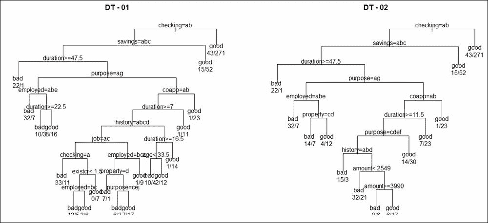
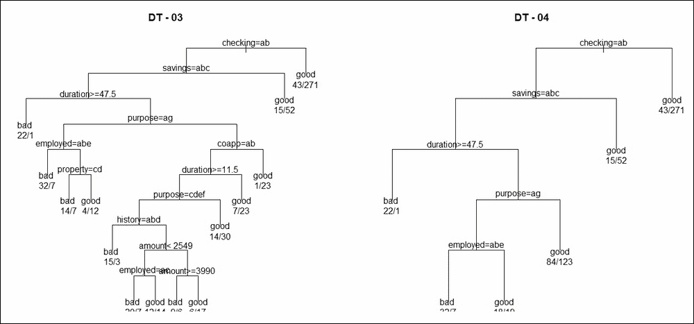
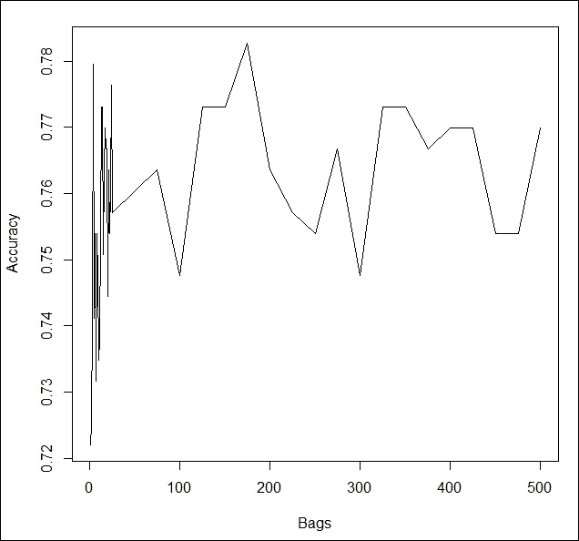
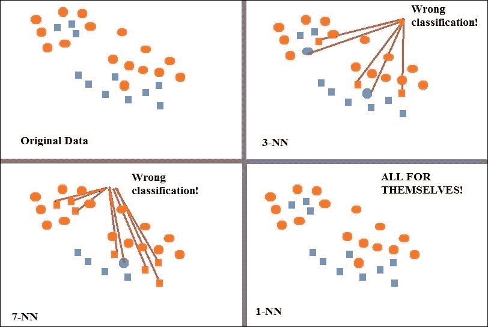
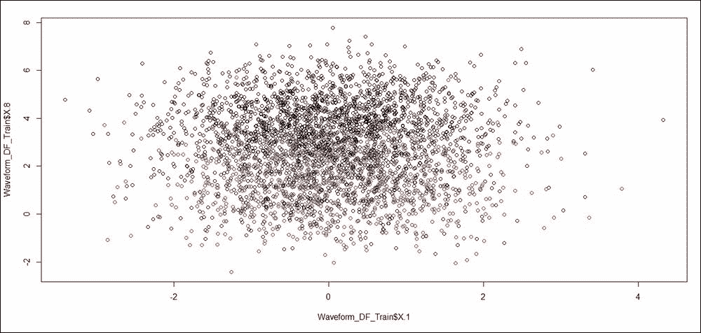
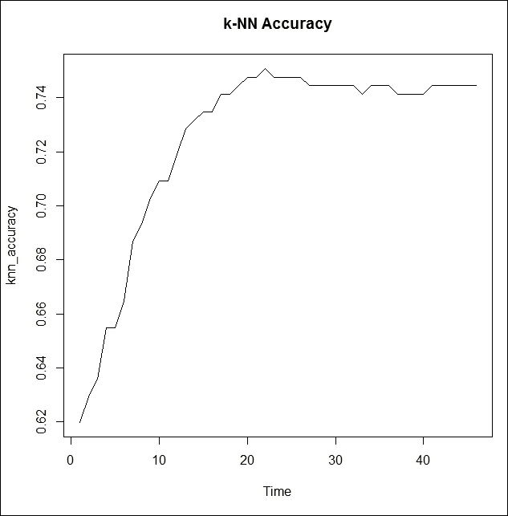

# 第三章。Bagging

决策树在第一章，*集成技术介绍*中介绍，然后应用于五个不同的分类问题。在这里，可以看到它们在某些数据库上的表现比其他数据库更好。我们在构建决策树时几乎只使用了`default`设置。这一章将从探索一些可能提高决策树性能的选项开始。上一章介绍了`bootstrap`方法，主要用于统计方法和模型。在这一章中，我们将使用它来构建树。这种方法通常被视为一种机器学习技术。决策树的 bootstrapping 方法通常被称为*bagging*。类似的一种分类方法是 k-最近邻分类，简称*k*-NN。我们将在第三部分介绍这种方法，并在本章的最后一部分应用 bagging 技术。

在本章中，我们将涵盖以下内容：

+   分类树和相关剪枝/改进方法

+   Bagging 分类树

+   *k*-NN 分类器的介绍和应用

+   *k*-NN bagging 扩展

# 技术要求

本章我们将使用以下库：

+   `class`

+   `FNN`

+   `ipred`

+   `mlbench`

+   `rpar`

# 分类树和剪枝

分类树是决策树的一种特定类型，其主要关注分类问题。Breiman 等人（1984 年）发明了决策树，Quinlan（1984 年）独立地引入了 C4.5 算法。这两者有很多共同之处，但我们将重点关注 Breiman 的决策树学派。Hastie 等人（2009 年）对决策树进行了全面论述，Zhang 和 Singer（2010 年）对递归分割方法进行了论述。Tattar（2017 年）的*集成回归模型*第九章中可以找到对树的一个直观和系统的 R 程序开发。

一个分类树有许多参数可以调整以改善性能。然而，我们首先将使用默认设置简单地构建分类树并可视化树。`rpart`包中的`rpart`函数可以创建分类、回归以及生存树。该函数首先检查 regress 是否为分类、数值或生存对象，并相应地设置相应的分类、回归或生存树，同时使用相关的分割函数。

加载了**德国信用**数据集，并按照早期设置执行了将数据分为训练和测试部分的操作：

```py
> load("../Data/GC2.RData")
> set.seed(12345)
> Train_Test <- sample(c("Train","Test"),nrow(GC2),replace = TRUE,
+    prob = c(0.7,0.3))
> GC2_Train <- GC2[Train_Test=="Train",]
> GC2_TestX <- within(GC2[Train_Test=="Test",],rm(good_bad))
> GC2_TestY <- GC2[Train_Test=="Test","good_bad"]
> nte <- nrow(GC2_TestX)
> GC2_Formula <- as.formula("good_bad~.")
```

您可以参考第一章，*集成技术简介*，了解 R 代码是如何执行的。现在，使用训练数据集和选定的公式，我们将创建第一个分类树。将`rpart`函数应用于公式和数据集将创建一个分类树。使用`plot`函数可视化树，`uniform=TRUE`选项确保显示正确对齐分割的层次级别。此外，文本函数将在分割点显示变量名，`use.n=TRUE`将给出节点 Y 的分布。最后，使用拟合的分类树对测试数据集的贷款好坏进行预测，对测试样本进行比较，我们发现树的准确率为 70.61%，与第一章，*集成技术简介*中的相同：

```py
> DT_01 <- rpart(GC2_Formula,GC2_Train)
> windows(height=200,width=200)
> par(mfrow=c(1,2))
> plot(DT_01,uniform=TRUE,main="DT - 01"); text(DT_01,use.n=TRUE)
> DT_01_predict <- predict(DT_01,newdata = GC2_TestX,type="class")
> DT_01_Accuracy <- sum(DT_01_predict==GC2_TestY)/nte
> DT_01_Accuracy
[1] 0.7060703
> DT_01$variable.importance
checking duration  savings  purpose employed  history   amount    coapp 
 38.5358  19.6081  15.6824  12.8583  12.5501   9.2985   8.9475   8.1326 
     age  existcr property      job resident telephon  housing  depends 
  7.3921   6.0250   5.5503   5.2012   2.6356   1.6327   1.3594   0.6871 
 marital installp  foreign 
  0.6871   0.4836   0.2045 
```

前一段代码的图示是下一张图的左侧树形图，`DT-01`。从显示中可以看出，终端节点太多，似乎也有很多分割，这意味着我们可能过度拟合了数据。一些终端节点只有七个观测值，而许多终端节点的观测值少于 20 个。因此，还有改进的空间。

在决策树的下一个迭代中，我们要求树算法在节点`(minsplit=30)`的观测值少于 30 个时不要进一步分割，并且最小桶大小`(minbucket=15)`必须至少为 15。这个更改应该会改善树`DT_01`。对于新树，我们再次检查准确率的变化：

```py
> DT_02 <- rpart(GC2_Formula,GC2_Train,minsplit=30,minbucket=15)
> plot(DT_02,uniform=TRUE,main="DT - 02"); text(DT_02,use.n=TRUE)
> DT_02_predict <- predict(DT_02,newdata = GC2_TestX,type="class")
> DT_02_Accuracy <- sum(DT_02_predict==GC2_TestY)/nte
> DT_02_Accuracy
[1] 0.7252396
> DT_02$variable.importance
checking duration  savings  purpose  history   amount    coapp employed 
 35.2436  15.5220  15.3025  11.6655   7.8141   7.5564   7.1990   5.6960 
property  existcr      age resident  foreign  depends  marital      job 
  3.7257   1.7646   1.3781   1.1833   0.7883   0.6871   0.6871   0.5353 
 housing installp 
  0.5072   0.4581 
```



图 1：德国数据的分类树

`DT-02`树看起来比`DT-01`更干净，每个终端节点的观测值数量也相当好。重要的是，准确率提高了`0.7252 - 0.7061 = 0.0191`，即大约 2%，这是一个改进。

**复杂度参数**，**Cp**，是树的一个重要方面，我们现在将使用它来改进分类树。使用`cp=0.005`参数以及`minsplit`和`minbucket`，我们将尝试提高树的表现：

```py
> DT_03 <- rpart(GC2_Formula,GC2_Train,minsplit=30,minbucket=15,
+                cp=0.005)
> plot(DT_03,uniform=TRUE,main="DT - 03"); text(DT_03,use.n=TRUE)
> DT_03_predict <- predict(DT_03,newdata = GC2_TestX,type="class")
> DT_03_Accuracy <- sum(DT_03_predict==GC2_TestY)/nte
> DT_03_Accuracy
[1] 0.7316294
> DT_03$variable.importance
checking duration  savings  purpose  history employed   amount    coapp 
 35.7201  15.5220  15.3025  11.6655   7.8141   7.7610   7.5564   7.1990 
property      age  existcr resident  marital  foreign installp  depends 
  3.7257   1.8547   1.7646   1.5010   1.0048   0.7883   0.7758   0.6871 
     job  housing 
  0.5353   0.5072
```

性能现在已从`0.7252`提高到`0.7316`，这又是一个改进。在`DT-03`中，即下一张图的左侧树中，树复杂度结构似乎没有太大变化。我们现在同时进行两个更改。首先，我们将分割标准从 Gini 改为信息，然后添加一个错误矩阵以处理误分类。

什么是误分类的损失矩阵？如果模型以这种方式将一笔好贷款识别或预测为好贷款，则没有误分类。此外，如果将一笔坏贷款分类为坏贷款，这也是算法识别出的正确决策。将一笔好贷款误分类为坏贷款的后果与将坏贷款分类为好贷款的后果不同。例如，如果向一个坏客户发放贷款，损失将是四到六位数的收入损失，而一个被拒绝贷款的好客户可能在三个月后再次申请。如果你运行`matrix(c(0,200,500,0), byrow = TRUE, nrow=2)`，输出将是以下内容：

```py
> matrix(c(0,200,500,0),byrow = TRUE,nrow=2)
     [,1] [,2]
[1,]    0  200
[2,]  500    0
```

这意味着将一笔好贷款误分类为坏贷款的惩罚是 200，而将一笔坏贷款误分类为好贷款的惩罚是 500。惩罚在很大程度上有助于并给分类问题增加了权重。使用此选项和分割标准，我们设置了下一个分类树：

```py
> DT_04 <- rpart(GC2_Formula,GC2_Train,minsplit=30,minbucket=15,
+                parms = list(split="information",
+                             loss=matrix(c(0,200,500,0),byrow = TRUE,nrow=2)))
> plot(DT_04,uniform=TRUE,main="DT - 04"); text(DT_04,use.n=TRUE)
> DT_04_predict <- predict(DT_04,newdata = GC2_TestX,type="class")
> DT_04_Accuracy <- sum(DT_04_predict==GC2_TestY)/nte
> DT_04_Accuracy
[1] 0.7380192
> DT_04$variable.importance
checking  savings duration  purpose employed  history   amount  existcr 
 26.0182  10.4096  10.2363   5.0949   5.0434   2.1544   1.5439   0.9943 
resident      age  depends  marital property 
  0.9648   0.7457   0.6432   0.6432   0.5360 

```



图 2：具有更多选项的分类树

注意，决策树`DT-04`似乎比`DT-01-03`有更少的分割，并且看起来没有过度训练数据。

在这里，我们可以看到许多可以用来调整决策树的选项，其中一些仅适用于分类树。然而，调整一些参数可能需要专业知识，尽管了解这些选项是很好的。注意变量重要性在不同决策树之间的变化顺序。给定数据和树结构，我们如何可靠地确定给定变量的变量重要性？这个问题将在下一节中讨论。接下来还将探讨提高决策树性能的一般方法。

# Bagging

**Bagging**代表**B**oostap **AGG**regat**ING**。这是由 Breiman（1994 年）发明的。Bagging 是**同质集成**的一个例子，这是因为基础学习算法仍然是分类树。在这里，每个自助树将是一个基础学习器。这也意味着当我们对第二章中的线性回归模型进行自助时，*自助*，我们实际上在那里执行了一个集成。关于结合多棵树的结果的一些评论也是必要的。

集成方法结合了多个模型（也称为基学习器）的输出，并产生一个单一的结果。这种方法的一个好处是，如果每个基学习器都具备*所需属性*，那么组合结果将具有更高的稳定性。如果某个基学习器在协变量空间的一个特定区域过度训练，其他基学习器将消除这种不希望的预测。集成方法期望的是更高的稳定性，多次带包装有助于提高给定模型集的拟合值性能。Berk（2016）、Seni 和 Elder（2010）、Hastie 等人（2009）可以参考以获取更多详细信息。

*一个基本结果!* 如果从*N*个单位中用放回抽样方法抽取*N*个观测值，那么平均有 37%的观测值被排除在外。

这个结果非常重要。由于我们将执行一个 bootstrap 方法，这意味着平均每个树，我们将有一个 37%的保留样本。一个简短的模拟程序将为我们计算概率。对于*N*值从 11 到 100 的范围，我们将进行放回抽样，找出有多少索引被排除，然后将该数字除以*N*以获得从*N*个单位中放回抽取的*N*个单位的模拟中未排除单位的经验概率。经验概率是通过*B = 100,000*多次获得，并将该平均值报告为在*N*个单位的放回抽取中未选中任何单个单位的概率：

```py
> N <- 11:100
> B <- 1e5
> Prob_Avg <- NULL
> for(i in N){
+   set <- 1:i
+   leftout <- 0
+   for(j in 1:B){
+     s1 <- sample(set,i,replace=TRUE)
+     leftout <- leftout+(i-length(unique(s1)))/i
+   }
+   Prob_Avg[i-10] <- leftout/B
+ }
> Prob_Avg
 [1] 0.3504 0.3517 0.3534 0.3549 0.3552 0.3563 0.3571 0.3574 0.3579 0.3585
[11] 0.3585 0.3594 0.3594 0.3601 0.3604 0.3606 0.3610 0.3612 0.3613 0.3614
[21] 0.3620 0.3622 0.3625 0.3622 0.3626 0.3627 0.3627 0.3626 0.3631 0.3634
[31] 0.3635 0.3637 0.3636 0.3638 0.3639 0.3638 0.3640 0.3641 0.3641 0.3641
[41] 0.3644 0.3642 0.3645 0.3643 0.3645 0.3647 0.3645 0.3646 0.3649 0.3649
[51] 0.3648 0.3650 0.3648 0.3650 0.3651 0.3653 0.3649 0.3649 0.3653 0.3653
[61] 0.3654 0.3654 0.3654 0.3654 0.3653 0.3655 0.3654 0.3655 0.3655 0.3657
[71] 0.3657 0.3657 0.3655 0.3658 0.3658 0.3660 0.3656 0.3658 0.3658 0.3658
[81] 0.3658 0.3658 0.3660 0.3658 0.3659 0.3659 0.3662 0.3660 0.3661 0.3661
```

因此，我们可以看到，从*N*个单位的放回抽取中抽取的样本中，大约有 0.37 或 37%的观测值未被选中。

带包装算法如下：

+   从由*N*个观测值组成的数据中抽取一个大小为*N*的随机样本，并放回。所选的随机样本称为**bootstrap 样本***.*

+   从 bootstrap 样本中构建一个分类树。

+   将每个终端节点分配一个类别，并存储每个观测值的预测类别。

+   重复步骤 1-3 多次，例如，*B*。

+   通过对树集进行多数投票，将每个观测值分配给一个最终类别。

带包装过程的主要目的是减少不稳定性，这主要通过`bootstrap`方法实现。如前所述，并通过模拟程序证明，当我们从*N*个观测值中用放回抽样方法抽取*N*个观测值时，平均而言，37%的观测值将被排除在样本之外。`bagging`方法利用这种放回抽样的技术，我们将未选择的观测值称为**袋外**（**OOB**）观测值。与`bootstrap`方法一样，重抽样技术为我们提供了不同参数的多个估计值，利用这种抽样分布，我们可以进行适当的统计推断。为了更严格地证明这种技术，原始的 Breiman（1996）论文值得一读。

### 注意

**注意事项**：假设一个观测值在 271 棵树中有 100 次是袋外观测值。在第 100 次标记为测试目的时，该观测值可能被分类为 `TRUE` 的有 70 次。因此，对于该观测值，可能会得出结论 *P(TRUE) = 70/100 = 0.7*。这种解释可能会误导，因为袋中的样本不是独立的。

在我们进行软件实现之前，Hastie 等人（2009 年）提出了两个重要的评论。首先，bagging 技术有助于减少估计预测函数的方差，并且它也适用于高方差、低偏差的模型，如树模型。其次，bagging 在聚合中的核心目标是平均许多无偏的噪声模型，因此随后方差减少。与自助法一样，bagging 作为一种平滑方法，可以减少偏差。现在，我们将使用德国信贷数据来阐述 bagging 方法。

来自 `ipred` 包的 `bagging` 函数将有助于设置程序：

```py
> B <- 500
> GC2_Bagging <- bagging(GC2_Formula,data=GC2_Train,coob=FALSE,
+                        nbagg=B,keepX=TRUE)
> GC2_Margin <- predict(GC2_Bagging,newdata = GC2_TestX,
+                       aggregation="weighted",type="class")
> sum(GC2_Margin==GC2_TestY)/nte
[1] 0.7795527
```

聚合在这里通过显著提高准确性有所帮助。请注意，每次运行 bagging 方法都会得到不同的答案。这主要是因为每棵树都是使用不同的样本设置的，并且允许生成随机样本的种子动态变化。到目前为止，已经尝试将种子固定在某个特定数值以重现结果。向前看，种子很少会被固定。作为一个测试你知识的练习，找出 bagging 函数中指定的 `keepx` 和 `coob` 选项的含义。通过使用 `?bagging` 来完成这个练习。

回到德国信贷问题！我们已经创建了 *B = 500* 棵树，出于某种疯狂的原因，我们想查看所有这些树。当然，Packt（本书的出版商）可能会对作者坚持打印所有 500 棵树感到有些恼火，而且，由于这些树没有经过修剪，它们看起来会很丑。程序必须符合书籍大小的限制。考虑到这一点，让我们从以下代码开始：

```py
> pdf("../Output/GC2_Bagging_Trees.pdf")
> for(i in 1:B){
+   tt <- GC2_Bagging$mtrees[[i]]
+   plot(tt$btree)
+   text(tt$btree,use.n=TRUE)
+ }
> dev.off()
pdf 
  2 
```

以下步骤在先前的代码中已执行：

1.  我们首先将调用 PDF 设备。

1.  然后，在 `Output` 文件夹中创建了一个新文件。

1.  接下来，我们从 `1` 到 `B` 开始一个循环。`bagging` 对象由 `B = 500` 棵树组成，在一个临时对象 `tt` 中，我们存储第 i 棵树的细节。

1.  然后，我们使用 `plot` 函数绘制该树，通过从 `tt` 中提取树细节，并添加与该树的节点和分割相关的相关文本。

1.  循环完成后，运行 `dev.off` 行，这将保存 `GC2_Bagging_Trees.pdf` 文件。这个便携式文档文件将包含 500 棵树。

关于自举法的益处已经有很多讨论，并且在上一章中也进行了很多说明。然而，除了在许多博客和参考资料中展示的常规优势之外，我们在这里还将展示如何获得变量重要性的可靠推断。很容易看出，变量重要性在树之间有很大的差异。但这并不是问题。当我们被问到每个变量的决策树中变量重要性的整体可靠性时，我们现在可以查看它们在树中的值并执行推断：

```py
> VI <- data.frame(matrix(0,nrow=B,ncol=ncol(GC2)-1))
> vnames <- names(GC2)[-20]
> names(VI) <- vnames
> for(i in 1:B){
+   VI[i,] <- GC2_Bagging$mtrees[[i]]$btree$variable.importance[vnames]
+ }
> colMeans(VI)
checking duration  history  purpose   amount  savings employed installp 
  50.282   58.920   33.540   48.301   74.721   30.838   32.865   18.722 
 marital    coapp resident property      age  housing  existcr      job 
  17.424    8.795   18.171   20.591   51.611    9.756   11.433   14.015 
 depends telephon  foreign 
      NA       NA       NA 
```

上述程序需要解释。回想一下，`variable.importance`是按降序显示的。如果你已经看过`GC2_Bagging_Trees.pdf`文件（即使是粗略地看），你会看到不同的树有不同的主要分割变量，因此变量的重要性顺序也会不同。因此，我们首先将需要的变量顺序保存在`vnames`对象中，然后按照`vnames`中的顺序对每个树的`variable.importance[vnames]`进行排序。循环中的每个树都通过`$mtrees`和`$btree$variable.importance`提取出来以完成所需操作。因此，`VI data.frame`对象现在由自举过程设置的 500 棵树的变量重要性组成。`colMeans`给出了 500 棵树的重要性汇总，通过查看`VI`框架中的详细信息可以进行所需的统计推断。请注意，最后三个变量在汇总平均值中有`NA`。`NA`结果的原因是在某些分类树中，这些变量根本没有任何增益，甚至不在任何替代分割中。我们可以快速发现有多少棵树没有这些三个变量的重要性信息，然后使用`na.rm=TRUE`选项重复计算`colMeans`：

```py
> sapply(VI,function(x) sum(is.na(x)))
checking duration  history  purpose   amount  savings employed installp 
       0        0        0        0        0        0        0        0 
 marital    coapp resident property      age  housing  existcr      job 
       0        0        0        0        0        0        0        0 
 depends telephon  foreign 
       9       35       20 
> colMeans(VI,na.rm=TRUE)
checking duration  history  purpose   amount  savings employed installp 
  50.282   58.920   33.540   48.301   74.721   30.838   32.865   18.722 
 marital    coapp resident property      age  housing  existcr      job 
  17.424    8.795   18.171   20.591   51.611    9.756   11.433   14.015 
 depends telephon  foreign 
   6.345    5.167    3.200 
```

在上一节中，我们探索了`minsplit`、`minbucket`、`split`和`loss`参数的各种选项。自举法能否包含这些指标？使用`bagging`函数的`control`参数，我们现在将对之前的结果进行改进。附加参数的选择与之前保持一致。在拟合自举对象后，我们检查准确性，然后将分类树写入`GC2_Bagging_Trees_02.pdf`文件。显然，这个文件中的树比`GC2_Bagging_Trees.pdf`文件中的树更容易阅读，这是预料之中的。以下代码也获得了`B = 500`棵树的变量信息表：

```py
> GC2_Bagging_02 <- bagging(GC2_Formula,data=GC2_Train,coob=FALSE,
+                        nbagg=B,keepX=TRUE,
+                        control=rpart.control(minsplit=30,minbucket=15,
+split="information",loss=matrix(c(0,200,500,0), byrow = TRUE, nrow=2)))
> GC2_Margin_02 <- predict(GC2_Bagging_02,newdata = GC2_TestX,
+                       aggregation="weighted",type="class")
> sum(GC2_Margin_02==GC2_TestY)/nte
[1] 0.7604
> pdf("../Output/GC2_Bagging_Trees_02.pdf")
> for(i in 1:B){
+   tt <- GC2_Bagging_02$mtrees[[i]]
+   plot(tt$btree)
+   text(tt$btree,use.n=TRUE)
+ }
> dev.off()
null device 
          1 
> VI_02 <- data.frame(matrix(0,nrow=B,ncol=ncol(GC2)-1))
> names(VI_02) <- vnames
> for(i in 1:B){
+   VI_02[i,] <- GC2_Bagging_02$mtrees[[i]]$btree$variable.importance[vnames]
+ }
> colMeans(VI_02,na.rm=TRUE)
checking duration  history  purpose   amount  savings employed installp 
 38.3075  18.9377  11.6756  19.1818  18.4385  16.1309   9.6110   3.6417 
 marital    coapp resident property      age  housing  existcr      job 
  4.3520   4.4913   3.4810   6.5278  10.0255   3.3401   3.1011   4.5115 
 depends telephon  foreign 
  1.6432   2.5535   0.9193 
```

Bagging 的树的数量已被任意选择为 500。没有特别的原因。我们现在将看到测试数据的准确率如何随着树的数量而变化。检查将在树的数量从 1 到 25，每次增加 1 的情况下进行，然后增加 25 到 50，75，……，475，500。读者需要自己理解这个图。同时，以下程序很简单，不需要进一步解释：

```py
> Bags <- c(1:24,seq(25,B,25))
> Bag_Acc <- NULL
> for(i in 1:length(Bags)){
+   TBAG <- bagging(GC2_Formula,data=GC2_Train,coob=FALSE,
+                       nbagg=i,keepX=TRUE,
+                       control=rpart.control(minsplit=30,minbucket=15,
+                                             split="information",
+                                             loss=matrix(c(0,200,500,0),
+                                                         byrow = TRUE,
+                                                         nrow=2)))
+   GC2_Margin_TBAG <- predict(TBAG,newdata = GC2_TestX,
+                            aggregation="weighted",type="class")
+   Bag_Acc[i] <- sum(GC2_Margin_TBAG==GC2_TestY)/nte
+   print(Bags[i])
+ }
[1] 1
[1] 2
[1] 3
[1] 4
[1] 5

[1] 23
[1] 24
[1] 25
[1] 50
[1] 75

[1] 475
[1] 500
> plot(Bags,Bag_Acc,"l",ylab="Accuracy")
```

以下是由以下生成的输出：



图 3：Bagging 准确率与树的数量

分析技术不属于炼金术的范畴。如果发明了这样的程序，我们就不必担心建模了。下一个例子将表明，Bagging 也可能出错。

**Bagging 不是一个保证的食谱！**

在他的书的第一个版本中，Berk（2016）警告读者不要成为新发明方法宣称的优越性的牺牲品。回想一下在第一章中引入的皮马印第安人糖尿病问题，“集成技术简介”。那里的准确率表显示决策树给出了`0.7588`的准确率。我们现在应用 Bagging 方法对同一分区进行计算，并计算准确率如下：

```py
> data("PimaIndiansDiabetes")
> set.seed(12345)
> Train_Test <- sample(c("Train","Test"),nrow(PimaIndiansDiabetes),replace = TRUE,prob = c(0.7,0.3))
> head(Train_Test)
[1] "Test"  "Test"  "Test"  "Test"  "Train" "Train"
> PimaIndiansDiabetes_Train <- PimaIndiansDiabetes[Train_Test=="Train",]
> PimaIndiansDiabetes_TestX <- within(PimaIndiansDiabetes[Train_Test=="Test",],
+                                     rm(diabetes))
> PimaIndiansDiabetes_TestY <- PimaIndiansDiabetes[Train_Test=="Test","diabetes"]
> PID_Formula <- as.formula("diabetes~.")
> PID_Bagging <- bagging(PID_Formula,data=PimaIndiansDiabetes_Train,coob=FALSE,
+                        nbagg=1000,keepX=TRUE)
> PID_Margin <- predict(PID_Bagging,newdata = PimaIndiansDiabetes_TestX,
+                       aggregation="weighted",type="class")
> sum(PID_Margin==PimaIndiansDiabetes_TestY)/257
[1] 0.7548638
```

这里的总体准确率是`0.7548`，而单个树分类模型的准确率是`0.7588`，这意味着 Bagging 降低了准确率。如果理解了 Bagging 的目的，这并不是一个担忧。目的始终是增加预测的稳定性，因此我们宁愿接受 Bagging 会降低方差项。

Bagging 是一个非常重要的技术，你不需要仅将其限制在分类树上，而应该继续探索其他回归方法，例如神经网络和支持向量机。在下一节中，我们将介绍 k 最近邻（*k*-NN）的不同方法。

# *k*-NN 分类器

在第一章中，我们熟悉了各种分类模型。一些读者可能已经熟悉了*k*-NN 模型。*k*-NN 分类器是最简单、最直观和非假设性的模型之一。模型的名字本身就暗示了它可能的工作方式——最近的邻域！而且这还伴随着*k*！因此，如果我们有一个研究中的*N*个点，我们就会找到邻域中的*k*个最近点，然后记录下 k 个邻居的类别。然后，将 k 个邻居的多数类别分配给单元。在回归的情况下，将邻居的平均值分配给单元。以下是对*k*-NN 的视觉描述：



图 4：*k*-NN 的可视化表示

*k*-NN 的可视化表示的左上部分显示了 27 个观察值的散点图，其中 16 个是圆圈，剩下的 11 个是正方形。圆圈用橙色标记 ，而正方形用蓝色标记 。假设我们选择基于 k = 3 个邻居来设置一个分类器。然后，对于每个点，我们找到它的三个邻居，并将大多数颜色分配给它。因此，如果一个圆圈保持橙色，它已经被正确识别，同样，如果一个正方形被正确识别，它的颜色将保持蓝色。然而，如果一个圆圈点有三个最近的邻居中有两个或更多是正方形，它的颜色将变为蓝色，这将被标记为 。同样，一个错误分类的正方形的颜色将变为橙色 。在前面的图的右上块中，我们有 3-NN 的预测，而 7-NN 的预测可以在图的左下角找到。注意，在 3-NN 中，我们有五个错误分类，而在 7-NN 中，我们有七个。因此，增加最近邻居的数量并不意味着准确率会增加。

右下角的图是 1-NN，它总是给出完美的分类。然而，它就像一个每天只准确显示两次时间的坏钟。

## 分析波形数据

接下来，我们将对波形数据进行分析。重复 第一章 中的代码，即 *集成技术简介*，以获取波形数据，然后将其分为训练和测试部分：

```py
> set.seed(123)
> Waveform <- mlbench.waveform(5000)
> Waveform$classes <- ifelse(Waveform$classes!=3,1,2)
> Waveform_DF <- data.frame(cbind(Waveform$x,Waveform$classes)) # Data Frame
> names(Waveform_DF) <- c(paste0("X",".",1:21),"Classes")
> Waveform_DF$Classes <- as.factor(Waveform_DF$Classes)
> set.seed(12345)
> Train_Test <- sample(c("Train","Test"),nrow(Waveform_DF),replace = TRUE,
+    prob = c(0.7,0.3))
> Waveform_DF_Train <- Waveform_DF[Train_Test=="Train",]
> Waveform_DF_TestX <- within(Waveform_DF[Train_Test=="Test",],rm(Classes))
> Waveform_DF_TestY <- Waveform_DF[Train_Test=="Test","Classes"]
> Waveform_DF_Formula <- as.formula("Classes~.")
> plot(Waveform_DF_Train$X.1,Waveform_DF_Train$X.8,col=Waveform_DF_Train$Classes)
```

下图展示了两个变量 `X.1` 和 `X.8` 通过类别进行的一个简单的散点图显示。在显示中可以看到很多颜色的交互，看起来任何形式的逻辑回归模型或决策树都不会帮助这种情况。可能 *k*-NN 在这种情况下会有所帮助：



图 5：波形数据的散点图

对于 `k = 10`，我们首先为波形数据建立了一个 *k*-NN 模型。这里使用了 `class` 包中的 `knn` 函数：

```py
> WF_knn <- knn(train=Waveform_DF_Train[,-22],test=Waveform_DF_TestX,
+               cl=Waveform_DF_Train$Classes,k=10)
> sum(Waveform_DF_TestY==WF_knn)/nrow(Waveform_DF_TestX)
[1] 0.903183
```

90.32% 的准确率看起来很有希望，并且优于 第一章 中考虑的所有模型，即 *集成技术简介*，除了支持向量机。我们将扩大 k 的搜索范围，从 2 到 50：

```py
> k <- c(2:15,seq(20,50,5))
> knn_accuracy <- NULL
> for(i in 1:length(k)){
+   WF_temp_knn <- knn(train=Waveform_DF_Train[,-22],test=Waveform_DF_TestX,
+                 cl=Waveform_DF_Train$Classes,k=k[i])
+   knn_accuracy <- c(knn_accuracy,sum(Waveform_DF_TestY==WF_temp_knn)/
+                       nrow(Waveform_DF_TestX))
+ }
> knn_accuracy
 [1] 0.8561 0.8919 0.8893 0.8886 0.8932 0.8985 0.8972 0.8992 0.9012 0.9025
[11] 0.9032 0.9058 0.9105 0.9019 0.8999 0.9072 0.9065 0.9098 0.9118 0.9085
[21] 0.9072
```

注意，对于 k = 40，我们得到了最大的准确率。为什么？我们将在下一节中将 *k*-NN 放入一个袋中。

# *k*-NN 袋装

在上一节中，*k*-NN 分类器引入了一个分类模型。我们可以使用自助法使其更加稳健。更广泛的算法保持不变。与典型的自助法一样，我们可以始终编写一个由循环组成的程序，根据所需的 bootstrap 样本数或袋数，控制可以很容易地指定。然而，这里我们将使用 `FNN` R 包中的一个函数。`ownn` 函数对于在 *k*-NN 分类器上执行袋装方法非常有用。

`ownn` 函数要求数据集中的所有变量都必须是数值型。然而，我们确实有很多是因子变量的。因此，我们需要调整数据，以便可以使用 `ownn` 函数。首先，使用 `rbind` 函数将训练集和测试集的协变量数据合并在一起。使用 `model.matrix` 函数和公式 `~.-1`，我们将所有因子变量转换为数值变量。这里的关键问题是 `model.matrix` 函数是如何工作的？为了使解释简单，如果一个因子变量有 m 个水平，它将创建 m - 1 个新的二元变量，这些变量将跨越 *m* 维度。我们之所以将训练集和测试集的协变量合并在一起，是因为如果任何因子在任何分区中的水平较少，变量的数量将不相等，我们就无法在测试集上采用基于训练集构建的模型。在获得所有数值变量的协变量矩阵后，我们再次将协变量分为训练和测试区域，使用 `ownn` 函数指定 *k*-NN 设置，并预测使用袋装方法的准确度。程序如下：

```py
> All_Cov <- rbind(GC2_Train[,-20],GC2_TestX)
> All_CovX <- model.matrix(~.-1,All_Cov)
> GC2_Train_Cov <- All_CovX[1:nrow(GC2_Train),]
> GC2_Test_Cov <- All_CovX[(nrow(GC2_Train)+1):nrow(All_CovX),]
> k <- seq(5,50,1)
> knn_accuracy <- NULL
> for(i in 1:length(k)){
+   GC2_knn_Bagging <- ownn(train=GC2_Train_Cov, test=GC2_Test_Cov,
+                           cl=GC2_Train$good_bad,testcl=GC2_TestY,k=k[i])
+  knn_accuracy[i] <- GC2_knn_Bagging$accuracy[3]
+ }
> knn_accuracy
 [1] 0.6198083 0.6293930 0.6357827 0.6549521 0.6549521 0.6645367 0.6869010
 [8] 0.6932907 0.7028754 0.7092652 0.7092652 0.7188498 0.7284345 0.7316294
[15] 0.7348243 0.7348243 0.7412141 0.7412141 0.7444089 0.7476038 0.7476038
[22] 0.7507987 0.7476038 0.7476038 0.7476038 0.7476038 0.7444089 0.7444089
[29] 0.7444089 0.7444089 0.7444089 0.7444089 0.7412141 0.7444089 0.7444089
[36] 0.7444089 0.7412141 0.7412141 0.7412141 0.7412141 0.7444089 0.7444089
[43] 0.7444089 0.7444089 0.7444089 0.7444089
> windows(height=100,width=100)
> plot.ts(knn_accuracy,main="k-NN Accuracy")
```

`train`、`test`、`cl` 和 `testcl` 参数很容易理解；请参阅 `ownn`，我们将在一个 5-50 的网格上改变邻居的数量。我们是否指定了袋数或 bootstrap 样本数？现在，袋装操作已完成，并给出了袋装预测。看起来估计可能存在近似，因为包和函数明确表示预测是基于 bagging 的：

```py
> GC2_knn_Bagging$accuracy
      knn      ownn       bnn 
0.7444089 0.7444089 0.7444089 
> GC2_knn_Bagging$bnnpred
  [1] good good good good good good good good good good good good good
 [14] good good good good good good good good good bad  good good good
 [27] good good good good good good good good good good bad  good good

[274] good good good good good good good good good good good good good
[287] good good good good good good good good good bad  bad  good good
[300] good good good good good good good good good good good good good
[313] good
Levels: bad good
```

下面的准确度图显示，模型准确度在大约 20 个邻域后趋于稳定。因此，我们已经执行了 *k*-NN 袋装技术：



图 6：*k*-NN 袋装方法的准确度

# 摘要

Bagging 本质上是一种集成学习方法，由同质的基本学习器组成。Bagging 作为一种自助聚合方法被引入，我们在第二章中看到了自助方法的一些优点，*自助聚合*。Bagging 方法的优点是预测的稳定性。本章从对分类树的修改开始，我们看到了改进决策树性能的不同方法，以便树不会过度拟合数据。决策树的 Bagging 和相关技巧在下一节中介绍。然后我们介绍了*k*-NN 作为重要的分类器，并用一个简单的例子进行了说明。本章以*k*-NN 分类器的 Bagging 扩展结束。

Bagging 有助于减少决策树的方差。然而，由于许多共同观察结果生成它们，两个自助样本的树是相关的。在下一章中，我们将探讨创新的重新采样，这将使两个决策树不相关。
