# 第五章. 简洁的增强算法

我们所说的简洁的增强算法是什么意思？增强算法（及其变体）可以说是机器学习工具箱中最重要的算法之一。任何数据分析师都需要了解这个算法，并且最终追求更高的准确率不可避免地会推动对增强技术的需求。据报道，在[www.kaggle.org](http://www.kaggle.org)论坛上，复杂和大量数据的增强算法运行了数周，而且大多数获奖方案都是基于这个算法。此外，这些算法在现代图形设备机器上运行。

考虑到其重要性，我们将在下面详细研究增强算法。*简洁的*当然不是增强算法的变体。由于增强算法是非常重要且关键的算法之一，我们将首先陈述该算法并以最基本的方式实现它，这将展示算法的每个步骤是如何运作的。

我们将从自适应增强算法开始——通常被称为**AdaBoost**算法——并使用非常简单和原始的代码，我们将展示其在分类问题中的应用。该说明是在一个`toy`数据集上进行的，以便读者可以清楚地跟随步骤。

在下一节中，我们将扩展分类增强算法到回归问题。对于这个问题，增强变体是著名的**梯度增强算法**。通过一系列具有单个分割的基本决策树，即所谓的**树桩**，将创建一个有趣的非线性回归问题。我们将通过平方误差损失函数的选择来展示梯度增强算法。对于增强方法，我们将阐明变量重要性计算。本章的倒数第二节将讨论`gbm`包的细节。结论部分将对垃圾邮件数据集的袋装、随机森林和增强方法进行比较。本章包括以下主题：

+   通用增强算法

+   自适应提升

+   梯度提升

    +   基于树桩的梯度提升

    +   基于平方误差损失的梯度提升

+   增强技术中的变量重要性

+   使用 gbm 包

+   袋装、随机森林和增强算法的比较

# 技术要求

在本章中，我们将使用以下库：

+   `rpart`

+   `gbm`

# 通用增强算法

在前几章中介绍的基于树的集成方法，*Bagging* 和 *随机森林*，是决策树的重要扩展。然而，虽然 Bagging 通过平均多个决策树提供了更大的稳定性，但偏差仍然存在。这种局限性促使 Breiman 在每个分割点采样协变量以生成一组“独立”的树，并为随机森林奠定了基础。随机森林中的树可以像 Bagging 一样并行开发。在多个树上进行平均的想法是为了确保偏差和方差权衡之间的平衡。提升是决策树的第三大扩展，也可能是最有效的一种。它同样基于集成同质基学习器（在这种情况下，是树），就像 Bagging 和随机森林一样。提升算法的设计完全不同。它是一种*顺序*集成方法，因为在算法的下一个运行中，前一个学习者的残差/误分类点被改进。

通用提升技术包括一系列算法，这些算法将弱学习器转换为最终强学习器。在分类问题的背景下，弱学习器是一种比随机猜测更好的技术。该方法将弱学习算法转换为更好的算法，这就是它被称为 *提升* 的原因。提升技术旨在提供一种接近完美分类器的强学习器。

| 分类器 | 子空间 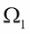 | 子空间 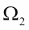 | 子空间 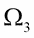 | 子空间  | 准确率 |
| --- | --- | --- | --- | --- | --- |
| 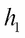 | R | R | R | Q | 0.75 |
| 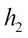 | R | R | Q | R | 0.75 |
| 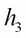 | R | Q | R | R | 0.75 |
| 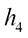 | Q | R | R | R | 0.75 |

表 1 简单分类器场景

通过一个简单的例子可以更广泛地理解提升的动机。假设从样本空间 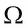 中抽取大小为 *n* 的随机样本，作为独立同分布（IID）的样本。随机样本的分布假设为 D。假设在 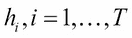 中有 *T=4* 个分类器，分类器用于真值函数 *f*。

考虑一个假设场景，其中样本空间  在 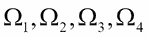 中由四个部分组成，四个分类器按前表所示执行。提升方法背后的思想是以顺序方式改进分类器。也就是说，分类器是一个接一个地组合，而不是同时全部组合。现在，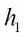 的错误将被纠正到一个新的分布 D'，其中分类器在区域  的错误将给予更多权重，导致分布 D''。提升方法将继续对剩余的分类器进行过程，并给出一个总的组合/集成。Zhou（2012）的伪提升算法（见第二章）总结如下：

1.  步骤 0：初始样本分布是 D，并设置 D1 = D

1.  步骤 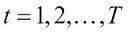：

    +   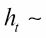 Dt

    +   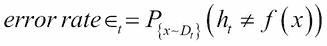

    +   *Dt+1 = 改进分布 (Dt,*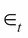*)*

1.  最后一步：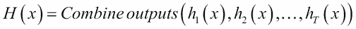

算法中的两个步骤*改进分布*和*组合输出*显然需要可执行的操作。在下一节中，我们将通过清晰的数值说明来开发自适应提升方法。

## 自适应提升

Schapire 和 Freund 发明了自适应提升方法。**Adaboost**是这个技术的流行缩写。

通用自适应提升算法如下：

+   均匀初始化观测权重：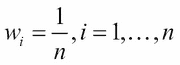

+   对于 *m*，分类器 *hm* 从 *1* 到 *m* 对数据进行多次遍历，执行以下任务：

    +   使用权重  对训练数据拟合分类器 *hm*。

    +   计算每个分类器的误差如下：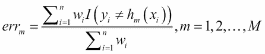

    +   计算分类器 *hm* 的*投票权重*：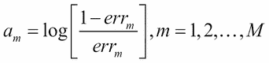

    +   设置 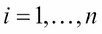 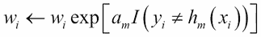

+   输出：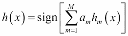

简而言之，算法展开如下：

1.  初始时，我们对所有观测值使用均匀权重 。

1.  在下一步中，我们计算考虑的每个分类器的加权误差 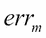。

1.  分类器（通常是树桩，或单分支的决策树）需要被选择，通常的做法是选择具有最大准确率的分类器。

1.  在*改进分布和组合输出*的情况下，如果有准确率相同的分类器，则选择任意一个。

1.  接下来，错误分类的观察值被赋予更多的权重，而正确分类的值被降低权重。这里需要记录一个重要点：

### 注意

在权重更新步骤中，正确分类为观察值的权重之和将等于错误分类的观察值的权重之和。

从计算分类器的误差到权重更新步骤的步骤会重复 M 次，从而获得每个分类器的投票权重。对于任何给定的观察值，我们然后使用 M 个分类器的预测，这些预测根据各自的投票权重加权，并使用算法中指定的符号函数进行预测。

尽管算法可能很简单，但通过玩具数据集来执行自适应提升方法的工作是一个有用的练习。数据和计算方法取自 Jessica Noss 的视频，可在[`www.youtube.com/watch?v=gmok1h8wG-Q`](https://www.youtube.com/watch?v=gmok1h8wG-Q)找到。自适应提升算法的说明现在开始。

考虑一个包含五个三元点的玩具数据集：两个解释变量和一个二元输出值。变量和数据可以用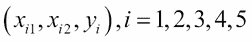来总结，这里的数据点有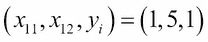、、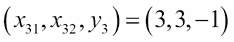、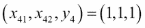和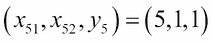。数据首先输入到 R 中，然后作为初步步骤进行可视化：

```py
> # ADAPTIVE BOOSTING with a Toy Dataset
> # https://www.youtube.com/watch?v=gmok1h8wG-Q 
> # Jessica Noss
> # The Toy Data
> x1 <- c(1,5,3,1,5)
> x2 <- c(5,5,3,1,1)
> y <- c(1,1,-1,1,1)
> plot(x1,x2,pch=c("+","+","-","+","+"),cex=2,
+      xlim=c(0,6),ylim=c(0,6),
+      xlab=expression(x[1]),ylab=expression(x[2]),
+      main="The TOY Data Depiction")
> text(x1,x2,labels=names(y),pos=1)
```

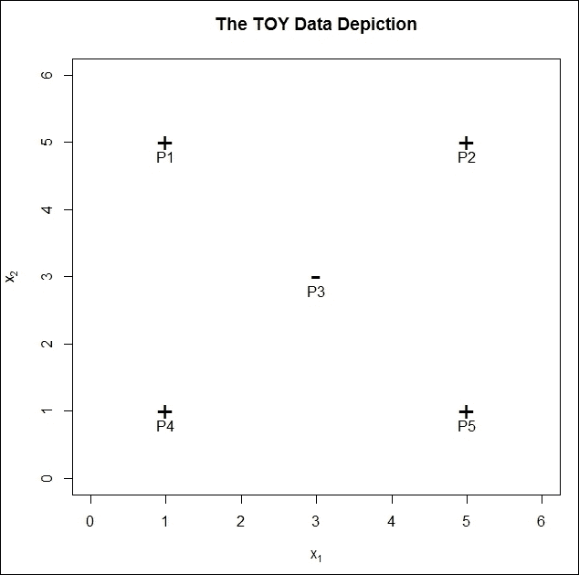

图 1：玩具数据集的简单表示

树桩是决策树的一种特殊情况，已在讨论中提到。在这里，我们将使用树桩作为基学习器。简单看一下前面的图可以帮助我们轻松找到准确率高于随机猜测的树桩。

例如，我们可以在处放置一个树桩，并将左侧的所有观察值标记为正，右侧的观察值标记为负。在以下程序中，绿色阴影区域的点被树桩预测为正，而红色阴影区域的点被预测为负。同样，我们可以在和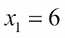处使用额外的树桩。通过`symmetry()`函数，我们还可以交换相同树桩的预测。因此，我们之前将绿色阴影区域放在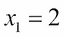的左侧，并预测值为正，通过反转顺序，树桩右侧的区域将被标记为正。对负值也进行类似的分类。在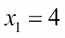和处重复此任务。使用`par`、`plot`、`text`和`rect`图形函数，我们在以下内容中展示这些基学习器的可视化表示：

```py
> # Visualizing the stump models
> windows(height=200,width=300)
> par(mfrow=c(2,3))
> plot(x1,x2,pch=c("+","+","-","+","+"),cex=2,
+      xlim=c(0,6),ylim=c(0,6),
+      xlab=expression(x[1]),ylab=expression(x[2]),
+      main="Classification with Stump X1<2")
> text(x1,x2,labels=names(y),pos=1)
> plim <- par("usr")
> rect(xleft=2,ybottom = plim[3],xright = plim[2],ytop = plim[4],
+      border = "red",col="red",density=20 )
> rect(xleft=plim[1],ybottom = plim[3],xright = 2,ytop = plim[4],
+      border = "green",col="green",density=20 )
> plot(x1,x2,pch=c("+","+","-","+","+"),cex=2,
+      xlim=c(0,6),ylim=c(0,6),
+      xlab=expression(x[1]),ylab=expression(x[2]),
+      main="Classification with Stump X1<4")
> text(x1,x2,labels=names(y),pos=1)
> rect(xleft=4,ybottom = plim[3],xright = plim[2],ytop = plim[4],
+      border = "red",col="red",density=20 )
> rect(xleft=plim[1],ybottom = plim[3],xright = 4,ytop = plim[4],
+      border = "green",col="green",density=20 )
> plot(x1,x2,pch=c("+","+","-","+","+"),cex=2,
+      xlim=c(0,6),ylim=c(0,6),
+      xlab=expression(x[1]),ylab=expression(x[2]),
+      main="Classification with Stump X1<6")
> text(x1,x2,labels=names(y),pos=1)
> rect(xleft=6,ybottom = plim[3],xright = plim[2],ytop = plim[4],
+      border = "red",col="red",density=20 )
> rect(xleft=plim[1],ybottom = plim[3],xright = 6,ytop = plim[4],
+      border = "green",col="green",density=20 )
> plot(x1,x2,pch=c("+","+","-","+","+"),cex=2,
+      xlim=c(0,6),ylim=c(0,6),
+      xlab=expression(x[1]),ylab=expression(x[2]),
+      main="Classification with Stump X1>2")
> text(x1,x2,labels=names(y),pos=1)
> rect(xleft=2,ybottom = plim[3],xright = plim[2],ytop = plim[4],
+      border = "green",col="green",density=20 )
> rect(xleft=plim[1],ybottom = plim[3],xright = 2,ytop = plim[4],
+      border = "red",col="red",density=20 )
> plot(x1,x2,pch=c("+","+","-","+","+"),cex=2,
+      xlim=c(0,6),ylim=c(0,6),
+      xlab=expression(x[1]),ylab=expression(x[2]),
+      main="Classification with Stump X1>4")
> text(x1,x2,labels=names(y),pos=1)
> rect(xleft=4,ybottom = plim[3],xright = plim[2],ytop = plim[4],
+      border = "green",col="green",density=20 )
> rect(xleft=plim[1],ybottom = plim[3],xright = 4,ytop = plim[4],
+      border = "red",col="red",density=20 )
> plot(x1,x2,pch=c("+","+","-","+","+"),cex=2,
+      xlim=c(0,6),ylim=c(0,6),
+      xlab=expression(x[1]),ylab=expression(x[2]),
+      main="Classification with Stump X1>6")
> text(x1,x2,labels=names(y),pos=1)
> rect(xleft=6,ybottom = plim[3],xright = plim[2],ytop = plim[4],
+      border = "green",col="green",density=20 )
> rect(xleft=plim[1],ybottom = plim[3],xright = 6,ytop = plim[4],
+      border = "red",col="red",density=20 )
```

前面 R 程序的结果如下所示：

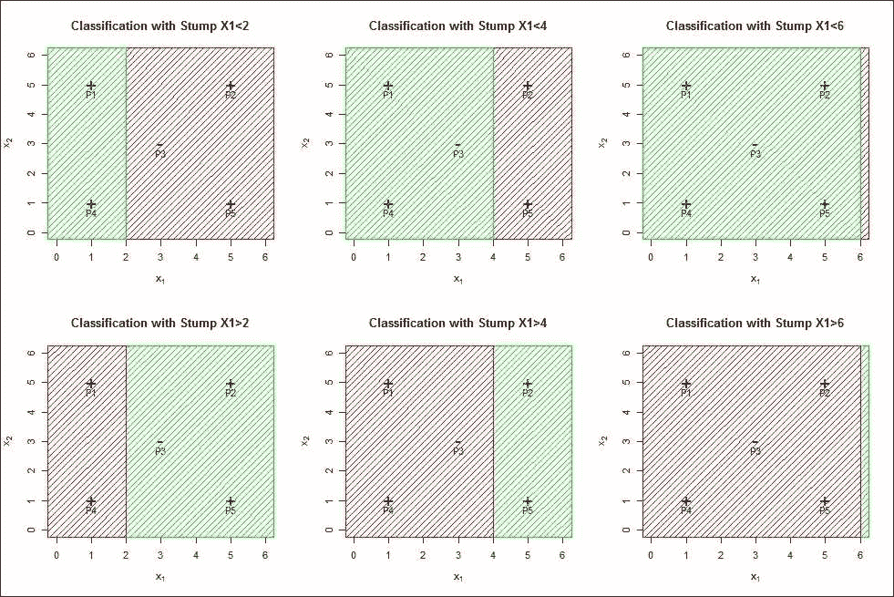

图 2：基于 X1 的树桩分类器

注意，在点 2、4 和 6 处，对于变量可以获得类似的分类。尽管不需要给出基于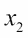的树桩的完整 R 程序，我们只需在以下图表中生成输出。程序可在代码包中找到。在接下来的讨论中，将忽略基于的树桩：

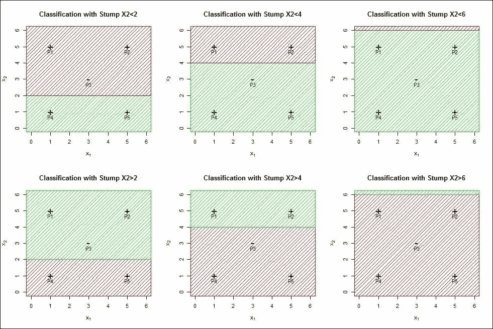

图 3：基于 X2 的树桩分类器

基于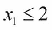选择的树桩导致了一些误分类，我们可以看到观察点 P1、P4 和 P3 被正确分类，而 P2 和 P5 被误分类。基于这个树桩的预测可以表示为（1，-1，-1，1，-1）。基于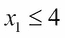的树桩正确分类了点 P1 和 P4，而 P2、P3 和 P5 被误分类，这里的向量预测为（1，-1，1，1，-1）。这里考虑的六个模型在 R 程序中用 M1、M2、…、M6 表示，根据前面指定的算法，我们有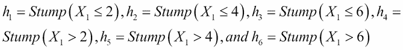。同样，我们还有其他四个树桩的预测，并将它们输入到 R 中，如下所示：

```py
> # The Simple Stump Models
> M1 <- c(1,-1,-1,1,-1)   # M1 = X1<2 predicts 1, else -1
> M2 <- c(1,-1,1,1,-1)    # M2 = X1<4 predicts 1, else -1
> M3 <- c(1,1,1,1,1)      # M3 = X1<6 predicts 1, else -1
> M4 <- c(-1,1,1,-1,1)    # M4 = X1>2 predicts 1, else -1;M4=-1*M1
> M5 <- c(-1,1,-1,-1,1)   # M5 = X1>4 predicts 1, else -1;M5=-1*M2
> M6 <- c(-1,-1,-1,-1,-1) # M6 = X1>6 predicts 1, else -1;M6=-1*M3
```

使用六个模型`M1-M6`给出的预测，我们可以将它们与`y`中的真实标签进行比较，以查看在每个模型中哪些观察值被误分类：

```py
> # Stem Model Errors
> Err_M1 <- M1!=y
> Err_M2 <- M2!=y
> Err_M3 <- M3!=y
> Err_M4 <- M4!=y
> Err_M5 <- M5!=y
> Err_M6 <- M6!=y
> # Their Misclassifications
> rbind(Err_M1,Err_M2,Err_M3,Err_M4,Err_M5,Err_M6)
          P1    P2    P3    P4    P5
Err_M1 FALSE  TRUE FALSE FALSE  TRUE
Err_M2 FALSE  TRUE  TRUE FALSE  TRUE
Err_M3 FALSE FALSE  TRUE FALSE FALSE
Err_M4  TRUE FALSE  TRUE  TRUE FALSE
Err_M5  TRUE FALSE FALSE  TRUE FALSE
Err_M6  TRUE  TRUE FALSE  TRUE  TRUE
```

因此，`TRUE`的值表示在名为模型的行中，名为点的列被误分类。初始化权重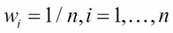，并在以下 R 代码块中计算每个模型的加权误差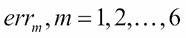：

```py
> # ROUND 1
> # Weighted Error Computation
> weights_R1 <- rep(1/length(y),length(y)) #Initializaing the weights
> Err_R1 <- rbind(Err_M1,Err_M2,Err_M3,Err_M4,Err_M5,Err_M6)%*%
+   weights_R1
> Err_R1 # Error rate
       [,1]
Err_M1  0.4
Err_M2  0.6
Err_M3  0.2/
Err_M4  0.6
Err_M5  0.4
Err_M6  0.8
```

由于对应模型 3，或 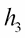 的误差是最小的，我们首先选择它，并按照以下方式计算分配给它的投票权重 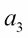：

```py
> # The best classifier error rate
> err_rate_r1 <- min(Err_R1)
> alpha_3 <- 0.5*log((1-err_rate_r1)/err_rate_r1)
> alpha_3
[1] 0.6931472
```

因此，提升算法步骤表明 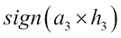 给出了所需的预测：

```py
> alpha_3*M3
[1] 0.6931472 0.6931472 0.6931472 0.6931472 0.6931472
> sign(alpha_3*M3)
[1] 1 1 1 1 1
```

中心观察点 `P3` 仍然被错误分类，所以我们继续到下一步。

现在我们需要更新权重 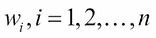，对于分类问题，简化形式的规则如下：

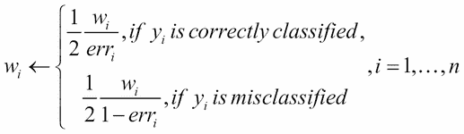

因此，我们需要一个函数，它将接受前一次运行的权重、错误率和模型错误分类作为输入，然后返回包含先前公式的更新权重。我们定义这样的函数如下：

```py

> # Weights Update Formula and Function
> Weights_update <- function(weights,error,error_rate){
+   weights_new <- NULL
+   for(i in 1:length(weights)){
+     if(error[i]==FALSE) weights_new[i] <- 0.5*weights[i]/(1-error_rate)
+     if(error[i]==TRUE) weights_new[i] <- 0.5*weights[i]/error_rate
+   }
+   return(weights_new)
+ }
```

现在，我们将更新权重并计算六个模型中的每个模型的误差：

```py
> # ROUND 2
> # Update the weights and redo the analyses
> weights_R2 <- Weights_update(weights=weights_R1,error=Err_M3,
+                              error_rate=err_rate_r1)
> Err_R2 <- rbind(Err_M1,Err_M2,Err_M3,Err_M4,Err_M5,Err_M6)%*%
+   weights_R2
> Err_R2 # Error rates
       [,1]
Err_M1 0.25
Err_M2 0.75
Err_M3 0.50
Err_M4 0.75
Err_M5 0.25
Err_M6 0.50
```

在这里，模型 `M1` 和 `M5` 使用新的权重具有相等的错误率，我们简单地选择模型 1，计算其投票权重，并基于更新后的模型进行预测：

```py
> err_rate_r2 <- min(Err_R2)
> alpha_1 <- 0.5*log((1-err_rate_r2)/err_rate_r2)
> alpha_1
[1] 0.5493061
> alpha_3*M3+alpha_1*M1
[1] 1.242453 0.143841 0.143841 1.242453 0.143841
> sign(alpha_3*M3+alpha_1*M1)
[1] 1 1 1 1 1
```

由于点 `P3` 仍然被错误分类，我们继续迭代并再次应用循环：

```py
> # ROUND 3
> # Update the weights and redo the analyses
> weights_R3 <- Weights_update(weights=weights_R2,error=Err_M1,
+                              error_rate=err_rate_r2)
> Err_R3 <- rbind(Err_M1,Err_M2,Err_M3,Err_M4,Err_M5,Err_M6)%*%
+   weights_R3
> Err_R3 # Error rates
            [,1]
Err_M1 0.5000000
Err_M2 0.8333333
Err_M3 0.3333333
Err_M4 0.5000000
Err_M5 0.1666667
Err_M6 0.6666667
> err_rate_r3 <- min(Err_R3)
> alpha_5 <- 0.5*log((1-err_rate_r3)/err_rate_r3)
> alpha_5
[1] 0.804719
> alpha_3*M3+alpha_1*M1+alpha_5*M5
[1]  0.4377344  0.9485600 -0.6608779  0.4377344  0.9485600
> sign(alpha_3*M3+alpha_1*M1+alpha_5*M5)
[1]  1  1 -1  1  1
```

现在分类是完美的，经过三次迭代后，我们没有任何错误分类或错误。本节编程的目的是以基本的方式展示自适应提升算法的步骤。在下一节中，我们将探讨 *梯度提升* 技术。

## 梯度提升

自适应提升方法不能应用于回归问题，因为它旨在解决分类问题。梯度提升方法可以使用适当的损失函数来解决分类和回归问题。实际上，梯度提升方法的应用不仅限于这两个标准问题。这项技术起源于 Breiman 的一些观察，并由 Friedman（2000）发展成回归问题。在下一节中，我们将对基本代码进行解释，而无需展示算法。在设置清楚之后，我们将在下一个小节中正式陈述针对平方误差损失函数的提升算法，并创建一个新的函数来实现该算法。

下面的图示是标准正弦波函数的描述。很明显，这是一个非线性关系。在不显式使用正弦变换的情况下，我们将看到使用提升算法来学习这个函数。当然，我们需要简单的回归树桩，我们从一个简单的函数 `getNode` 开始，它将给出我们想要的分割：

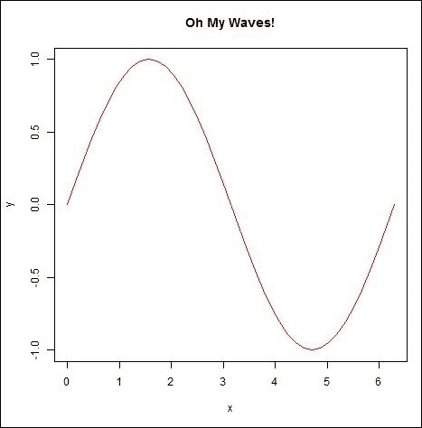

图 4：提升算法能否用于非线性正弦数据？

### 从头开始构建

在上一节中，我们使用了简单的分类树桩。在那个例子中，简单的视觉检查就足以识别树桩，我们很快获得了 12 个分类树桩。对于回归问题，我们首先定义一个`getNode`函数，这是对 Tattar（2017）第九章中定义的函数的轻微修改。首先设置所需的符号。

假设我们有一对 n 个数据点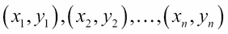，我们正在尝试学习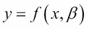之间的关系，其中*f*的形式对我们来说完全未知。

对于回归树，分割标准相当直接。对于按 x 值分割的数据，我们计算每个分割部分的*ys*的平均差平方和，然后将它们加起来。分割标准被选为那个 x 值。这最大化了感兴趣变量中的平均差平方和。R 函数`getNode`实现了这种思考：

```py
> getNode <- function(x,y)	{
+   xu <- sort(unique(x),decreasing=TRUE)
+   ss <- numeric(length(xu)-1)
+   for(i in 1:length(ss))	{
+     partR <- y[x>xu[i]]
+     partL <- y[x<=xu[i]]
+     partRSS <- sum((partR-mean(partR))²)
+     partLSS <- sum((partL-mean(partL))²)
+     ss[i] <- partRSS + partLSS
+   }
+   xnode <- xu[which.min(ss)]
+   minss <- min(ss)
+   pR <- mean(y[x>xnode])
+   pL <- mean(y[x<=xnode])
+   return(list(xnode=xnode,yR=pR,yL=pL))
+ }
```

`getNode`函数的第一步是找到`x`的唯一值，然后按降序排序。对于唯一值，我们通过 for 循环计算平方和。循环的第一步是将数据分割成左右两部分。

对于每个特定唯一值，在每个分区中计算平均差平方和，然后将它们加起来以得到总的残差平方和。

然后，我们获取`x`的值，它导致最小的残差平方和。在分割区域中的预测是该区域 y 值的平均值。

`getNode`函数通过返回`x`的分割值和左右分区的预测值来结束。我们现在可以创建回归树桩。

正弦波数据首先很容易创建，我们允许 x 值在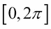区间内变化。y 值是简单地将正弦函数应用于 x 向量：

```py
> # Can Boosting Learn the Sine Wave!
> x <- seq(0,2*pi,pi/20)
> y <- sin(x)
> windows(height=300,width=100)
> par(mfrow=c(3,1))
> plot(x,y,"l",col="red",main="Oh My Waves!")
```

前面的显示结果将是**图 1**。我们继续获取数据的第一次分割，并在图上显示左右分区的平均值。残差将来自正弦波，它们也将放在同一显示中，如下所示：

```py
> first_split <- getNode(x,y)
> first_split
$xnode
[1] 3.141593
$yR
[1] -0.6353102
$yL
[1] 0.6050574
```

现在，我们的第一个分割点发生在`x`值为，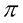这里，`3.141593`。分割点右侧的预测值为`-0.6353102`，左侧的预测值为`0.6050574`。预测值使用`segments`函数在同一显示上绘制：

```py
> segments(x0=min(x),y0=first_split$yL,
+          x1=first_split$xnode,y1=first_split$yL)
> segments(x0=first_split$xnode,y0=first_split$yR,
+          x1=max(x),y1=first_split$yR)
```

现在，预测很容易获得，简单的`ifelse`函数有助于计算它们。与正弦波之间的偏差是残差，我们计算第一组残差和`summary`函数给出了残差值的简要概述：

```py
> yfit1 <- ifelse(x<first_split$xnode,first_split$yL,first_split$yR)
> GBFit <- yfit1
> segments(x0=x,x1=x,y0=y,y1=yfit1)
> first_residuals <- y-yfit1
> summary(first_residuals)
    Min.  1st Qu.   Median     Mean  3rd Qu.     Max. 
-0.60506 -0.25570  0.04752  0.03025  0.32629  0.63531 
```

预测的第一步被保存在`GBFit`对象中，拟合与预测之间的差异在`first_residuals`向量中找到。这完成了梯度提升算法的第一轮迭代。第一轮迭代的残差将成为第二轮迭代的回归因变量/输出变量。使用`getNode`函数，我们执行第二轮迭代，这模仿了早期的代码集：

```py
> second_split <- getNode(x,first_residuals)
> plot(x,first_residuals,"l",col="red",main="The Second Wave!")
> segments(x0=min(x),y0=second_split$yL,
+          x1=second_split$xnode,y1=second_split$yL)
> segments(x0=second_split$xnode,y0=second_split$yR,
+          x1=max(x),y1=second_split$yR)
> yfit2 <- ifelse(x<second_split$xnode,second_split$yL,second_split$yR)
> GBFit <- GBFit+yfit2
> segments(x0=x,x1=x,y0=first_residuals,y1=yfit2)
> second_residuals <- first_residuals-yfit2
> summary(second_residuals)
    Min.  1st Qu.   Median     Mean  3rd Qu.     Max. 
-0.51678 -0.24187 -0.02064 -0.01264  0.25813  0.56715 
```

这里的一个重要区别是我们通过累加而不是平均来更新预测。请注意，我们正在模拟第一步的残差，因此下一个拟合所解释的残差剩余部分需要累加而不是平均。残差的范围是多少？建议读者将残差值与早期迭代进行比较。对第三次迭代执行类似的扩展：

```py
> third_split <- getNode(x,second_residuals)
> plot(x,second_residuals,"l",col="red",main="The Third Wave!")
> segments(x0=min(x),y0=third_split$yL,
+          x1=third_split$xnode,y1=third_split$yL)
> segments(x0=third_split$xnode,y0=third_split$yR,
+          x1=max(x),y1=third_split$yR)
> yfit3 <- ifelse(x<third_split$xnode,third_split$yL,third_split$yR)
> GBFit <- GBFit+yfit3
> segments(x0=x,x1=x,y0=second_residuals,y1=yfit3)
> third_residuals <- second_residuals-yfit3
> summary(third_residuals)
    Min.  1st Qu.   Median     Mean  3rd Qu.     Max. 
-0.47062 -0.27770 -0.03927 -0.01117  0.18196  0.61331 
```

所有的可视化显示在以下图中：


图 5：梯度提升算法的三次迭代

显然，我们不可能每次都进行详细的执行迭代，循环是非常重要的。代码被保存在一个块中，并执行了 22 次更多迭代。每次迭代的输出在图中展示，我们将它们全部放入一个外部文件，`Sine_Wave_25_Iterations.pdf`：

```py
> pdf("Sine_Wave_25_Iterations.pdf")
> curr_residuals <- third_residuals
> for(j in 4:25){
+   jth_split <- getNode(x,curr_residuals)
+   plot(x,curr_residuals,"l",col="red",main=paste0(c("The ", j, "th Wave!")))
+   segments(x0=min(x),y0=jth_split$yL,
+            x1=jth_split$xnode,y1=jth_split$yL)
+   segments(x0=jth_split$xnode,y0=jth_split$yR,
+            x1=max(x),y1=jth_split$yR)
+   yfit_next <- ifelse(x<jth_split$xnode,jth_split$yL,jth_split$yR)
+   GBFit <- GBFit+yfit_next
+   segments(x0=x,x1=x,y0=curr_residuals,y1=yfit_next)
+   curr_residuals <- curr_residuals-yfit_next
+ }
> dev.off()
> summary(curr_residuals)
     Min.   1st Qu.    Median      Mean   3rd Qu.      Max. 
-0.733811 -0.093432  0.008481 -0.001632  0.085192  0.350122 
```

经过 25 次迭代后，我们在`GBFit`中有一个整体拟合，我们可以将其与实际的 y 值进行比较，以查看梯度提升算法的表现如何：

```py
> plot(y,GBFit,xlab="True Y",ylab="Gradient Boosting Fit")
```


图 6：梯度拟合与实际正弦数据

对于非线性模型来说，拟合是相当好的。这种方法是为了清楚地理解梯度提升算法。在下一小节中讨论和开发了提升算法的更一般形式。

### 平方误差损失函数

用  表示数据，并将迭代/树的数量固定为一个数字 *B*。选择一个收缩因子  和树深度 *d*。基于平方误差损失函数的梯度提升算法在此简要说明。参见 Efron 和 Hastie（2016）的第 17.2 算法，如下：

+   初始化残差  和梯度提升预测 

+   对于 ：

    +   为数据  拟合深度为 *d* 的回归树

    +   获得预测值 

    +   通过  更新提升预测

    +   更新残差 

+   返回函数序列 

现在，我们将定义一个名为`GB_SqEL`的函数，该函数将实现由平方误差损失函数驱动的梯度提升算法。该函数必须提供五个参数：`y`和`x`将构成数据，`depth`将指定树的深度（即回归树中的分割数），`iter`表示迭代次数，`shrinkage`是因子。`GB_SqEL`函数的设置如下：

```py
> # Gradiend Boosting Using the Squared-error Loss Function
> GB_SqEL <- function(y,X,depth,iter,shrinkage){
+   curr_res <- y
+   GB_Hat <- data.frame(matrix(0,nrow=length(y),ncol=iter))
+   fit <- y*0
+   for(i in 1:iter){
+     tdf <- cbind(curr_res,X)
+     tpart <- rpart(curr_res~.,data=tdf,maxdepth=depth)
+     gb_tilda <- predict(tpart)
+     gb_hat <- shrinkage*gb_tilda
+     fit <- fit+gb_hat
+     curr_res <- curr_res-gb_hat
+     GB_Hat[,i] <- fit
+   }
+   return(list(GB_Hat = GB_Hat))
+ }
```

初始化发生在参数设置中，行`fit <- y*0`。算法的深度参数在行`maxdepth=depth`中指定，使用`rpart`函数创建所需深度的树。`predict`函数在每次迭代时提供的值，而`fit+gb_hat`执行必要的更新。请注意，`GB_Hat[,i]`包含每个迭代结束时的预测值。

我们将以 Efron 和 Hastie（2016）的例子来说明算法。考虑的数据与 Lu Gerig 的疾病，或**肌萎缩侧索硬化症**（**ALS**）有关。数据集包含有关 1,822 名患有 ALS 疾病的人的信息。目标是预测功能评分的进展率`dFRS`。研究有关于 369 个预测因子/协变量的信息。在这里，我们将使用`GB_SqEL`函数来拟合梯度提升技术，并随着迭代次数的增加分析均方误差。详细信息和数据可以从[`web.stanford.edu/~hastie/CASI/data.html`](https://web.stanford.edu/~hastie/CASI/data.html)的源文件中获得。现在，我们将平方误差损失函数驱动的提升方法付诸实践：

```py
> als <- read.table("../Data/ALS.txt",header=TRUE)
> alst <- als[als$testset==FALSE,-1]
> temp <- GB_SqEL(y=alst$dFRS,X=alst[,-1],depth=4,
+                 iter=500,shrinkage = 0.02)
> MSE_Train <- 0
> for(i in 1:500){
+   MSE_Train[i] <- mean(temp$GB_Hat[,i]-alst$dFRS)²
+ }
> windows(height=100,width=100)
> plot.ts(MSE_Train)
```

使用`read.table`函数，我们将代码包中的数据导入到`als`对象中。数据以`.txt`格式从源文件中提供。列`testset`表示观察值是为了训练目的还是为了测试。我们选择了训练观察值，并删除了第一个变量`testset`，将其存储在对象`alst`中。对`alst`对象应用了`GB_SqEL`函数，并指定了适当的参数。

每次迭代之后，我们计算均方误差并将其存储在`GB_Hat`中，如前所述。从以下图中我们可以看出，随着迭代次数的增加，均方误差逐渐减小。在这里，算法在接近 200 次迭代后稳定下来：


图 7：梯度提升和迭代均方误差

在下一节中，我们将看到两个强大 R 包的使用。

## 使用 adabag 和 gbm 包

将提升方法作为集成技术确实非常有效。算法从头开始展示了分类和回归问题。一旦我们清楚地理解了算法，我们就可以使用 R 包来提供未来的结果。有许多包可用于实现提升技术。然而，在本节中，我们将使用两个最受欢迎的包`adabag`和`gbm`。首先，我们需要查看这两个函数的选项。名称很明显，`adabag`实现了自适应提升方法，而`gbm`处理梯度提升方法。首先，我们查看以下代码中这两个函数可用的选项：


提升和 gbm 函数

公式是常规的参数。在`adabag`中的`mfinal`参数和`gbm`中的`n.trees`参数允许指定树的数量或迭代次数。提升函数提供了`boos`选项，这是使用每个观测值的权重在该迭代中抽取的培训集的 bootstrap 样本。梯度提升是一个更通用的算法，能够处理比回归结构更多的内容。它可以用于分类问题。`gbm`函数中的`distribution`选项提供了这些选项。同样，在这里可以看到`gbm`函数提供了许多其他选项。我们既不会承担解释所有这些选项的艰巨任务，也不会将它们应用于复杂的数据集。用于解释和阐述自适应和梯度提升算法的两个数据集将使用`boosting`和`gbm`函数继续进行。

需要更改玩具数据集，我们将多次复制它们，以便我们有足够的观测值来运行`boosting`和`gbm`函数：

```py
> # The adabag and gbm Packages
> x1 <- c(1,5,3,1,5)
> x1 <- rep(x1,times=10)
> x2 <- c(5,5,3,1,1)
> x2 <- rep(x2,times=10)
> y <- c(1,1,0,1,1)
> y <- rep(y,times=10)
> toy <- data.frame(x1=x1,x2=x2,y=y)
> toy$y <- as.factor(toy$y)
> AB1 <- boosting(y~.,data=toy,boos=TRUE,mfinal = 10,
+                 maxdepth=1,minsplit=1,minbucket=1)
> predict.boosting(AB1,newdata=toy[,1:2])$class
 [1] "1" "1" "0" "1" "1" "1" "1" "0" "1" "1" "1" "1" "0" "1" "1" "1" "1" "0"
[19] "1" "1" "1" "1" "0" "1" "1" "1" "1" "0" "1" "1" "1" "1" "0" "1" "1" "1"
[37] "1" "0" "1" "1" "1" "1" "0" "1" "1" "1" "1" "0" "1" "1"
```

`maxdepth=1`函数确保我们只使用树桩作为基础分类器。很容易看出提升函数工作得非常完美，因为所有观测都被正确分类。

与`boosting`函数一样，我们需要更多的数据点。我们通过`seq`函数增加这些数据点，并使用`distribution="gaussian"`选项，要求`gbm`函数拟合回归提升技术：

```py
> x <- seq(0,2*pi,pi/200)
> y <- sin(x)
> sindata <- data.frame(cbind(x,y))
> sin_gbm <- gbm(y~x,distribution="gaussian",data=sindata,
+                n.trees=250,bag.fraction = 0.8,shrinkage = 0.1)
> par(mfrow=c(1,2))
> plot.ts(sin_gbm$fit, main="The gbm Sine Predictions")
> plot(y,sin_gbm$fit,main="Actual vs gbm Predict")
```

使用绘图函数，我们比较了梯度提升方法的拟合情况。以下图表表明拟合是适当的。然而，图表也显示故事中有些地方不太对劲。提升方法在和处的函数近似留下了很多遗憾，实际与预测的图表表明在 0 处存在不连续/性能不佳的问题。然而，我们不会对这些问题深入探讨：


图 8：使用 gbm 函数进行的正弦波近似

接下来，我们将讨论变量重要性的概念。

## 变量重要性

提升方法本质上使用树作为基学习器，因此变量重要性的概念在这里与树、袋装和随机森林相同。我们只需像在袋装或随机森林中那样，将变量在树之间的重要性相加。

对于来自`adabag`包的提升拟合对象，变量重要性提取如下：

```py
> AB1$importance
 x1  x2 
100   0 
```

这意味着提升方法根本未使用`x2`变量。对于梯度提升对象，变量重要性由`summary`函数给出：

```py
> summary(sin_gbm)
  var rel.inf
x   x     100
```

现在很明显，我们只有一个变量，因此解释回归因变量很重要，我们当然不需要某些软件来告诉我们。当然，在复杂情况下是有用的。比较是基于树的集成方法的。让我们继续下一节。

## 比较袋装、随机森林和提升

在前一章中，我们进行了袋装和随机森林方法的比较。现在，我们使用`gbm`函数将提升准确率添加到早期分析中：

```py
> data("spam")
> set.seed(12345)
> Train_Test <- sample(c("Train","Test"),nrow(spam),replace = TRUE,
+ prob = c(0.7,0.3))
> head(Train_Test)
[1] "Test"  "Test"  "Test"  "Test"  "Train" "Train"
> spam_Train <- spam[Train_Test=="Train",]
> spam_TestX <- within(spam[Train_Test=="Test",],
+                      rm(type))
> spam_TestY <- spam[Train_Test=="Test","type"]
> spam_Formula <- as.formula("type~.")
> spam_rf <- randomForest(spam_Formula,data=spam_Train,coob=TRUE,
+                         ntree=500,keepX=TRUE,mtry=5)
> spam_rf_predict <- predict(spam_rf,newdata=spam_TestX,type="class")
> rf_accuracy <- sum(spam_rf_predict==spam_TestY)/nrow(spam_TestX)
> rf_accuracy
[1] 0.9436117
> spam_bag <- randomForest(spam_Formula,data=spam_Train,coob=TRUE,
+                          ntree=500,keepX=TRUE,mtry=ncol(spam_TestX))
> spam_bag_predict <- predict(spam_bag,newdata=spam_TestX,type="class")
> bag_accuracy <- sum(spam_bag_predict==spam_TestY)/nrow(spam_TestX)
> bag_accuracy
[1] 0.9350464
> spam_Train2 <- spam_Train
> spam_Train2$type <- ifelse(spam_Train2$type=="spam",1,0)
> spam_gbm <- gbm(spam_Formula,distribution="bernoulli",data=spam_Train2,
+                 n.trees=500,bag.fraction = 0.8,shrinkage = 0.1)
> spam_gbm_predict <- predict(spam_gbm,newdata=spam_TestX,
+                             n.trees=500,type="response")
> spam_gbm_predict_class <- ifelse(spam_gbm_predict>0.5,"spam","nonspam")
> gbm_accuracy <- sum(spam_gbm_predict_class==spam_TestY)/nrow(spam_TestX)
> gbm_accuracy
[1] 0.945753
> summary(spam_gbm)
                                var      rel.inf
charExclamation     charExclamation 21.985502703
charDollar               charDollar 18.665385239
remove                       remove 11.990552362
free                           free  8.191491706
hp                               hp  7.304531600

num415                       num415  0.000000000
direct                       direct  0.000000000
cs                               cs  0.000000000
original                   original  0.000000000
table                         table  0.000000000
charHash                   charHash  0.000000000
```

提升准确率`0.9457`高于随机森林准确率`0.9436`。进一步的微调，将在下一章中探讨，将有助于提高准确率。变量重要性也可以通过`summary`函数轻松获得。

# 摘要

提升是决策树的另一种推论。它是一种迭代技术，通过更无顾忌地针对前一次迭代的误差。我们从重要的自适应提升算法开始，并使用非常简单的玩具数据来说明其基础。然后，该方法被扩展到回归问题，我们通过两种不同的方法说明了梯度提升方法。对`adabag`和`gbm`这两个包进行了简要阐述，并再次强调了变量重要性的概念。对于垃圾邮件数据集，我们通过提升方法获得了更高的准确率，因此提升算法的讨论特别有用。

本章考虑了提升算法的不同变体。然而，我们没有讨论它为什么有效。在下一章中，这些方面将更详细地介绍。
