# 第七章. 通用集成技术

前四章讨论了决策树的集成技术。在这些章节中讨论的每个主题中，基础学习器都是决策树，因此我们深入研究了同质集成技术。在本章中，我们将展示基础学习器可以是任何统计或机器学习技术，并且它们的集成将提高预测的精度。一个重要要求是基础学习器应该比随机猜测更好。通过 R 程序，我们将讨论和阐明集成将有效的情况。投票是分类器的一个重要特性——我们将陈述两种不同的方法，并在 bagging 和随机森林集成器的情况下进行说明。平均技术是回归变量的集成器，它将遵循分类方法的讨论。本章将以对第一章中非正式介绍的堆叠方法的详细讨论结束，*集成技术简介*。主题流程如下：

+   集成为什么有效？

+   通过投票进行集成

+   通过平均进行集成

+   栈集成

# 技术要求

本章将使用以下库：

+   `rpart`

+   `randomForest`

# 集成为什么有效？

当使用 bagging 方法时，我们将许多决策树的结果结合起来，通过多数计数来生成单个输出/预测。在不同的采样机制下，随机森林的结果被结合起来生成单个预测。在决策树的顺序误差减少方法下，提升方法也提供了改进的答案。尽管我们处理的是不确定数据，这涉及到概率，但我们不打算有那种给出黑盒结果且行为不一致的方法论。一个理论应该解释其工作原理，我们需要保证结果的一致性，并且对此没有神秘之处。任意和不确定的答案是完全不受欢迎的。在本节中，我们将探讨集成解决方案如何工作以及它们不工作的场景。

集成方法有强大的数学和统计基础，解释了为什么它们能给出这样的解决方案。我们首先考虑分类问题。我们将从一个简化的设置开始，并假设我们有*T*个相互独立的分类器，并且每个分类器相关的准确率与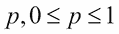相同。这是一个最简单的情况，我们稍后会推广这个场景。现在，如果我们有*T*个分类器，并且每个分类器对+1 或-1 等观察进行投票，这就引出了一个问题，整体准确率会是什么？由于*T*个分类器的正确分类数量必须超过错误分类数量，我们需要至少个分类器来投票正确的结果。在这里，表示小于给定分数的最大整数。只要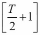或更多数量的分类器为正确的类别投票，多数分类就是正确的。

为了澄清，重要的是要注意，当我们说一个分类器的准确率是*p*时，我们并不是指分类器将观察标记为+1 的概率是*p*。相反，我们在这里的意思是，如果分类器做出 100 次预测，预测可以是+1 和-1 的任何组合；100*p*次预测被分类器正确识别。准确率与+1 和-1 在人群中的分布无关。

在这种设置下，分类器标记正确观察的概率遵循参数为*n = T*和概率*p*的二项分布。因此，多数投票得到正确预测的概率如下：

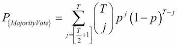

既然我们已经提到分类器必须比随机猜测更好，我们就需要分类器的准确率超过 0.5。然后我们将逐步增加准确率，并观察分类器数量的增加如何影响多数投票的概率：

```py
> source("Utilities.R")
> windows(height=100,width=100)
> # Ensembling in Classification
> # Illustrating the ensemble accuracy with same accuracy for each classifier
> # Different p's and T's with p > 0.5
> classifiers <- seq(9,45,2) # Number of classifiers 
> accuracy <- seq(0.55,0.85,.05)
> plot(0,type='n',xlim=range(classifiers),ylim=c(0.6,1),
+      xlab="Number of Classifiers",ylab="Probability of Majority Voting")
> for(i in 1:length(accuracy)){
+   Prob_MV <- NULL
+   for(j in 1:length(classifiers)){
+     Prob_MV[j] <- sum(dbinom(floor(classifiers[j]/2+1):classifiers[j],
+        prob=accuracy[i],size=classifiers[j]))
+   }
+   points(classifiers,Prob_MV,col=i,"l")
+ }
> title("Classifiers with Accuracy Better Than Random Guess")
```

`seq`函数设置了一个奇数序列，表示`classifiers R`数值向量中分类器的数量。准确率百分比在`accuracy`向量中从`0.55`到`0.85`不等。为了启动这个过程，我们设置了一个带有适当的*x*和*y*轴标签的空`plot`。现在，对于每个准确率值，我们将计算范围`floor(classifiers[j]/2+1):classifiers[j]`内多数投票的概率。`floor(./2+1)`确保我们选择了正确的起点。例如，如果分类器的数量是九个，那么`floor(./2+1)`的值是`5`。此外，当我们有九个分类器时，我们需要至少五个赞成事件发生的投票。另一方面，对于偶数个分类器（例如，八个）`floor(./2+1)`的值也是`5`。`dbinom`函数计算给定大小和概率的特定值的概率。在`floor(classifiers[j]/2+1): classifiers[j]`的范围内，它给出了多数投票的概率，或者多数投票的准确率。前面代码的输出在*图 1*中展示。我们可以从结果中看到，随着分类器数量的增加（每个分类器具有相同的准确率且优于随机猜测），多数投票的准确率也在增加：

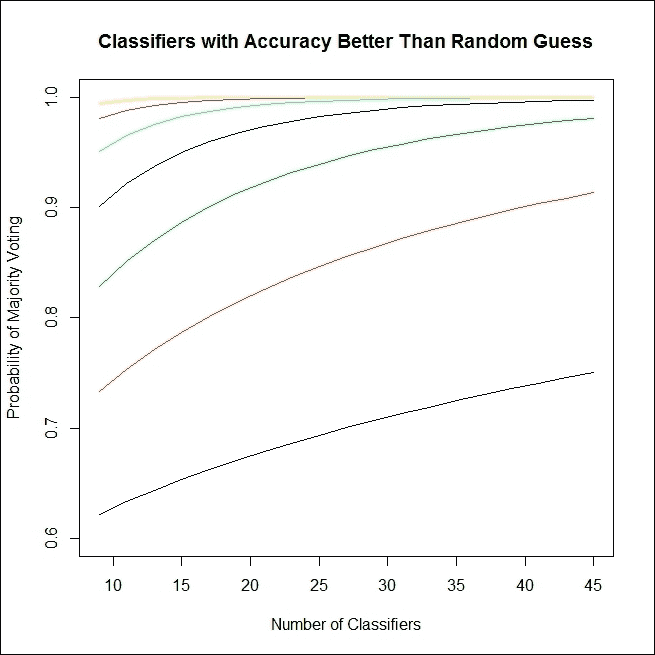

图 1：为什么集成方法应该有效？

这将帮助我们看到某个准确率选择下的`Prob_MV`值——例如，0.65。我们将分别对`prob=0.65`运行循环，观察随着分类器数量的增加，多数投票的准确率是如何提高的：

```py
> Prob_MV <- NULL
> for(j in 1:length(classifiers)){
+   Prob_MV[j] <- sum(dbinom(floor(classifiers[j]/2+1):classifiers[j],
+                            prob=0.65,size=classifiers[j]))
+ }
> Prob_MV
 [1] 0.8282807 0.8513163 0.8705318 0.8867689 0.9006211 0.9125264 0.9228185
 [8] 0.9317586 0.9395551 0.9463770 0.9523633 0.9576292 0.9622714 0.9663716
[15] 0.9699991 0.9732133 0.9760651 0.9785984 0.9808513
```

因此，随着具有相同准确率的分类器数量的增加，我们可以看到多数投票的准确率也在增加。值得注意的是，尽管我们每个分类器的准确率仅为`0.65`，但集成方法的准确率要高得多，几乎成为了一个完美的分类器。这就是集成方法的主要优势。

集成方法是否对任何类型的分类器都有帮助？如果我们有准确率低于随机猜测（即小于`0.5`）的分类器，那么我们将以与之前相同的方式进行搜索。对于许多准确率低于`0.5`的分类器，我们将计算多数投票分类器的准确率：

```py
> # When p < 0.5, ensemble accuracy goes to zero
> classifiers <- seq(6,50,2)
> accuracy <- seq(0.45,0.05,-0.05)
> plot(0,type='n',xlim=range(classifiers),ylim=c(0,0.3),
+      xlab="Number of Classifiers",ylab="Probability of Majority Voting")
> for(i in 1:length(accuracy)){
+   Prob_MV <- NULL
+   for(j in 1:length(classifiers)){
+     Prob_MV[j] <- sum(dbinom(floor(classifiers[j]/2+1):classifiers[j],
+                              prob=accuracy[i],size=classifiers[j]))
+   }
+   points(classifiers,Prob_MV,col=i,"l")
+   }
> title("Classifiers with Accuracy Worse Than Random Guess")
```

前面 R 程序的结果显示在 *图 2* 中。现在，第一个观察结果是，无论准确率是接近 `0.5` 还是接近 `0`，多数投票分类器的概率/准确率都在下降，这不利于性能。在所有情况下，我们都看到准确率最终会接近零。R 代码块中的变化是分类器序列 `seq(6,50,2)`，准确率水平从 `0.45` 下降到 `0.05`，在 `seq(0.45,0.05,-0.05)` 中。现在，考虑准确率略小于 `0.5` 的情况。例如，让我们将其保持在 `0.4999`。我们现在会幸运地看到性能改进吗？

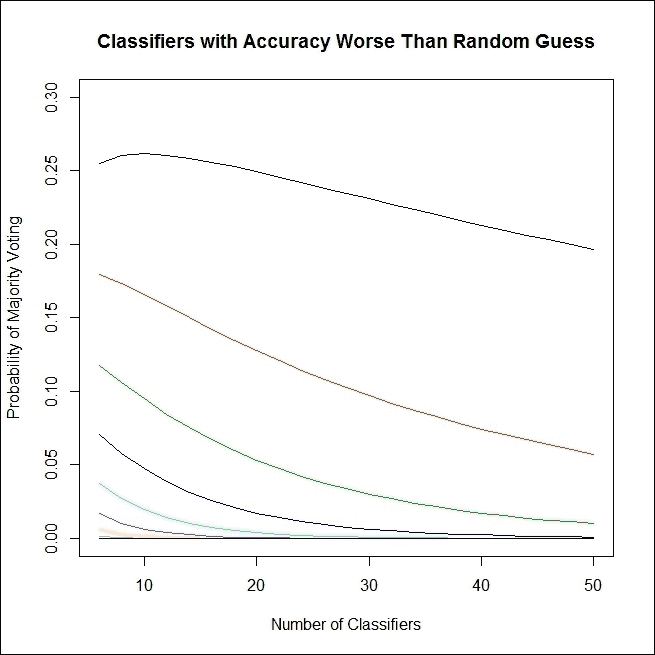

图 2：集成不是炼金术！

```py
> classifiers <- seq(10,200,10)
> Prob_MV <- NULL
> for(j in 1:length(classifiers)){
+   Prob_MV[j] <- sum(dbinom(floor(classifiers[j]/2+1):classifiers[j],
+                            prob=0.4999,size=classifiers[j]))
+ }
> Prob_MV
 [1] 0.3767071 0.4115491 0.4273344 0.4368132 0.4433011 0.4480955 0.4518222
 [8] 0.4548247 0.4573097 0.4594096 0.4612139 0.4627854 0.4641698 0.4654011
[15] 0.4665053 0.4675025 0.4684088 0.4692370 0.4699975 0.4706989
```

再次，我们发现我们无法匹配单个分类器的准确率。因此，我们有一个重要且关键的条件，即分类器必须比随机猜测更好。那么随机猜测本身呢？假装我们有一系列都是随机猜测的分类器并不困难。如果集成随着随机猜测的性能提高，我们通常不需要构建任何统计或机器学习技术。给定一组随机猜测，我们总能提高准确率。让我们来看看。

有两种情况——分类器数量为奇数和偶数——我们为这两种情况都提供了程序：

```py
> accuracy <- 0.5
> classifiers <- seq(5,45,2)
> Prob_MV <- NULL
> for(j in 1:length(classifiers)){
+   Prob_MV[j] <- sum(dbinom(floor(classifiers[j]/2+1):classifiers[j],
+                            prob=accuracy,size=classifiers[j]))
+   }
> Prob_MV
 [1] 0.5 0.5 0.5 0.5 0.5 0.5 0.5 0.5 0.5 0.5 0.5 0.5 0.5 0.5 0.5 0.5 0.5 0.5
[19] 0.5 0.5 0.5
> classifiers <- seq(10,50,2)
> Prob_MV <- NULL
> for(j in 1:length(classifiers)){
+   Prob_MV[j] <- (sum(dbinom(floor(classifiers[j]/2):classifiers[j],
+                             prob=accuracy,size=classifiers[j]))+
+                    sum(dbinom(floor(classifiers[j]/2+1):classifiers[j],
+                               prob=accuracy,size=classifiers[j])))/2
+   }
> Prob_MV
 [1] 0.5 0.5 0.5 0.5 0.5 0.5 0.5 0.5 0.5 0.5 0.5 0.5 0.5 0.5 0.5 0.5 0.5 0.5
[19] 0.5 0.5 0.5
```

这很有趣！无论分类器的数量如何，随机猜测的集成保持不变。在这里，既没有改进也没有恶化。因此，为了集成目的，我们总是需要比随机猜测更好的分类器。

在理解集成如何工作时，遵循你的直觉是很好的。我们从一个所有模型都具有相同准确率的过度简化假设开始，但如果我们处理具有不同准确率的模型，这样的假设就不适用了。因此，我们需要考虑可能对不同分类器有不同的准确率的情况。我们首先考虑每个分类器的准确率都高于 0.5，或者每个分类器都比随机猜测更好的情况。找到多数投票准确率的方法是评估分类器结果的每种可能组合的概率。我们考虑分类器数量为奇数时的简单情况。

假设我们拥有 *T* 个分类器，每个分类器的准确率如 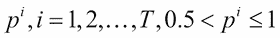 所示。请注意 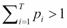，因为这些对应于不同的度量。

评估具有不等准确率的多数投票概率所涉及步骤如下：

+   列出所有可能的基本事件。如果每个分类器对一个给定案例投票为真或假，这意味着它有两种可能的结果，以及 *T* 个分类器。列出 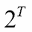 可能的结果：

    +   示例：如果我们有三个分类器，那么会有八种可能的情况，如下所示：

        | 分类器 1 | 分类器 2 | 分类器 3 |
        | --- | --- | --- |
        | 真 | 真 | 真 |
        | 假 | 真 | 真 |
        | 真 | 假 | 真 |
        | 假 | 假 | 真 |
        | 真 | 真 | 假 |
        | 假 | 真 | 假 |
        | 真 | 假 | 假 |
        | 假 | 假 | 假 |

+   计算每个可能事件的概率。由于每个分类器的准确度不同，因此每个可能结果的概率也会不同：

    +   示例：如果三个分类器（对于真）的准确度分别为 0.6、0.7 和 0.8，那么假的概率分别为 0.4、0.3 和 0.2，前表中的概率如下：

        | 分类器 1 | 分类器 2 | 分类器 3 |
        | --- | --- | --- |
        | 0.6 | 0.7 | 0.8 |
        | 0.4 | 0.7 | 0.8 |
        | 0.6 | 0.3 | 0.8 |
        | 0.4 | 0.3 | 0.8 | 0.336 |
        | 0.6 | 0.7 | 0.2 |
        | 0.4 | 0.7 | 0.2 |
        | 0.6 | 0.3 | 0.2 |
        | 0.4 | 0.3 | 0.2 |

+   在下一步中，获取基本事件的概率，这将是每列数字的乘积：

    | 分类器 1 | 分类器 2 | 分类器 3 | 概率 |
    | --- | --- | --- | --- |
    | 0.6 | 0.7 | 0.8 | 0.336 |
    | 0.4 | 0.7 | 0.8 | 0.224 |
    | 0.6 | 0.3 | 0.8 | 0.144 |
    | 0.4 | 0.3 | 0.8 | 0.096 |
    | 0.6 | 0.7 | 0.2 | 0.084 |
    | 0.4 | 0.7 | 0.2 | 0.056 |
    | 0.6 | 0.3 | 0.2 | 0.036 |
    | 0.4 | 0.3 | 0.2 | 0.024 |

+   找出具有多数计数的事件。在这种情况下，这指的是大于或等于 2 的总和：

    | 分类器 1 | 分类器 2 | 分类器 3 | 投票数 |
    | --- | --- | --- | --- |
    | 真 | 真 | 真 | 3 |
    | 假 | 真 | 真 | 2 |
    | 真 | 假 | 真 | 2 |
    | 假 | 假 | 真 | 1 |
    | 真 | 真 | 假 | 2 |
    | 假 | 真 | 假 | 1 |
    | 真 | 假 | 假 | 1 |
    | 假 | 假 | 假 | 0 |

+   多数投票的概率然后就是投票数大于或等于 2 的情况的概率之和。这是概率列中第 1、2、3 和 5 行条目的总和，即 0.336 + 0.224 + 0.144 + 0.084 = 0.788。

我们需要在这里定义一个名为 `Get_Prob` 的函数，如下所示：

```py
> Get_Prob <- function(Logical,Probability){
+   return(t(ifelse(Logical,Probability,1-Probability)))
+ }
```

给定一个逻辑向量和相应的概率向量，`Get_Prob` 函数将返回一个向量，该向量包含逻辑条件为 `真` 的概率。如果逻辑值为 `假`，则返回补数（1 – 概率）。

上述步骤被放入 R 程序中，如下所示：

```py
> # Different accuracies T's illustration
> # For simplicity, we set the number of classifiers at odd number
> # Each p_i's greater than 0.5
> accuracy <- c(0.5,0.55,0.6,0.65,0.7,0.75,0.8,0.85,0.9)
> NT <- length(accuracy) # Number of classifiers 
> APC <- expand.grid(rep(list(c(TRUE,FALSE)),NT)) # All possible combinations
> head(APC)
   Var1  Var2  Var3 Var4 Var5 Var6 Var7 Var8 Var9
1  TRUE  TRUE  TRUE TRUE TRUE TRUE TRUE TRUE TRUE
2 FALSE  TRUE  TRUE TRUE TRUE TRUE TRUE TRUE TRUE
3  TRUE FALSE  TRUE TRUE TRUE TRUE TRUE TRUE TRUE
4 FALSE FALSE  TRUE TRUE TRUE TRUE TRUE TRUE TRUE
5  TRUE  TRUE FALSE TRUE TRUE TRUE TRUE TRUE TRUE
6 FALSE  TRUE FALSE TRUE TRUE TRUE TRUE TRUE TRUE
> Elements_Prob <- t(apply(APC,1,Get_Prob,Probability=accuracy))
> head(Elements_Prob)
     [,1] [,2] [,3] [,4] [,5] [,6] [,7] [,8] [,9]
[1,]  0.5 0.55  0.6 0.65  0.7 0.75  0.8 0.85  0.9
[2,]  0.5 0.55  0.6 0.65  0.7 0.75  0.8 0.85  0.9
[3,]  0.5 0.45  0.6 0.65  0.7 0.75  0.8 0.85  0.9
[4,]  0.5 0.45  0.6 0.65  0.7 0.75  0.8 0.85  0.9
[5,]  0.5 0.55  0.4 0.65  0.7 0.75  0.8 0.85  0.9
[6,]  0.5 0.55  0.4 0.65  0.7 0.75  0.8 0.85  0.9
> Events_Prob <- apply(Elements_Prob,1,prod)
> Majority_Events <- (rowSums(APC)>NT/2)
> sum(Events_Prob*Majority_Events)
[1] 0.9112646
```

给定一个名为 `accuracy` 的包含准确率的数值向量，其中分类器的数量为奇数，我们首先使用 `length` 函数找到其中的分类器数量，并将其存储在 `NT` 中。然后使用 `expand.grid` 函数生成所有可能的 `APC` 组合，其中 `rep` 函数将向量 `(TRUE, FALSE) NT` 重复 `NT` 次。`APC` 对象的每一列将生成一个列，其中 `TRUE` 和 `FALSE` 条件将使用 `Get_Prob` 函数替换为相应的分类器准确率以及适当的补数。由于我们考虑的是奇数个分类器，当该基本事件中的 `TRUE` 数量大于分类器数量的 50%（即大于 `NT/2`）时，才会进行多数投票。其余的计算比较容易理解。如果九个分类器的准确率分别为 0.5、0.55、0.6、0.65、0.7、0.75、0.8、0.85 和 0.9，那么计算表明集成准确率为 0.9113，高于这里最准确的分类器，即 0.9。然而，我们必须记住，八个分类器中的每一个的准确率都低于 0.9。尽管如此，集成准确率仍然高于我们手头上的最高分类器。为了验证计算是否正常工作，我们将这种方法应用于周（2012）第 74 页上的示例，并确认最终多数投票概率为 0.933：

```py
> accuracy <- c(0.7,0.7,0.7,0.9,0.9)
> NT <- length(accuracy) # Number of classifiers
> APC <- expand.grid(rep(list(c(TRUE,FALSE)),NT)) # All possible combinations
> Elements_Prob <- t(apply(APC,1,Get_Prob,Probability=accuracy))
> Events_Prob <- apply(Elements_Prob,1,prod)
> Majority_Events <- (rowSums(APC)>NT/2)
> sum(Events_Prob*Majority_Events)
[1] 0.93268
```

当每个分类器都不如随机猜测时会发生什么？我们将简单地输出九个分类器场景的准确率，并重复程序以获得以下答案：

```py
> # Each p_i's lesser than 0.5
> accuracy <- 1-c(0.5,0.55,0.6,0.65,0.7,0.75,0.8,0.85,0.9)
> NT <- length(accuracy) # Number of classifiers
> APC <- expand.grid(rep(list(c(TRUE,FALSE)),NT)) # All possible combinations
> head(APC)
   Var1  Var2  Var3 Var4 Var5 Var6 Var7 Var8 Var9
1  TRUE  TRUE  TRUE TRUE TRUE TRUE TRUE TRUE TRUE
2 FALSE  TRUE  TRUE TRUE TRUE TRUE TRUE TRUE TRUE
3  TRUE FALSE  TRUE TRUE TRUE TRUE TRUE TRUE TRUE
4 FALSE FALSE  TRUE TRUE TRUE TRUE TRUE TRUE TRUE
5  TRUE  TRUE FALSE TRUE TRUE TRUE TRUE TRUE TRUE
6 FALSE  TRUE FALSE TRUE TRUE TRUE TRUE TRUE TRUE
> Elements_Prob <- t(apply(APC,1,Get_Prob,Probability=accuracy))
> head(Elements_Prob)
     [,1] [,2] [,3] [,4] [,5] [,6] [,7] [,8] [,9]
[1,]  0.5 0.45  0.4 0.35  0.3 0.25  0.2 0.15  0.1
[2,]  0.5 0.45  0.4 0.35  0.3 0.25  0.2 0.15  0.1
[3,]  0.5 0.55  0.4 0.35  0.3 0.25  0.2 0.15  0.1
[4,]  0.5 0.55  0.4 0.35  0.3 0.25  0.2 0.15  0.1
[5,]  0.5 0.45  0.6 0.35  0.3 0.25  0.2 0.15  0.1
[6,]  0.5 0.45  0.6 0.35  0.3 0.25  0.2 0.15  0.1
> Events_Prob <- apply(Elements_Prob,1,prod)
> Majority_Events <- (rowSums(APC)>NT/2)
> sum(Events_Prob*Majority_Events)
[1] 0.08873544
```

当每个分类器都不如随机猜测时，在集成的情况下，多数投票分类器会给出可怕的结果。这让我们面临最后一个情况。如果我们有一组分类器，其中一些比随机猜测分类器好，而一些比随机猜测分类器差呢？我们将计算代码块放入一个名为 `Random_Accuracy` 的函数中。然后，分类器中的准确率变成了单位区间内随机生成的数字。`Random_Accuracy` 函数随后运行十次，生成以下输出：

```py
> # Mixture of p_i's, some > 0.5, and some < 0.5
> Random_Accuracy <- function() {
+   accuracy <- runif(9)
+   NT <- length(accuracy) 
+   APC <- expand.grid(rep(list(c(TRUE,FALSE)),NT)) 
+   Elements_Prob <- t(apply(APC,1,Get_Prob,Probability=accuracy))
+   Events_Prob <- apply(Elements_Prob,1,prod)
+   Majority_Events <- (rowSums(APC)>NT/2)
+   return(sum(Events_Prob*Majority_Events))
+ }
> Random_Accuracy()
[1] 0.3423631
> Random_Accuracy()
[1] 0.3927145
> Random_Accuracy()
[1] 0.5341844
> Random_Accuracy()
[1] 0.1624876
> Random_Accuracy()
[1] 0.4065803
> Random_Accuracy()
[1] 0.4687087
> Random_Accuracy()
[1] 0.7819835
> Random_Accuracy()
[1] 0.3124515
> Random_Accuracy()
[1] 0.6842173
> Random_Accuracy()
[1] 0.2531727
```

结果参差不齐。因此，如果我们需要从集成方法中获得合理的准确性和性能，确保每个分类器都比随机猜测要好是至关重要的。到目前为止，我们分析的一个核心假设是分类器之间是相互独立的。在实际设置中，这个假设很少成立，因为分类器是使用相同的训练集构建的。然而，这个话题将在下一章中讨论。

我们现在将转向投票集成的问题。

# 投票集成

通过投票集成可以有效地用于分类问题。我们现在有一组分类器，我们需要使用它们来预测未知案例的类别。分类器预测的组合可以以多种方式进行。我们将考虑的两个选项是多数投票和加权投票。

## 多数投票

通过使用决策树作为基础学习器构建的集成，我们可以通过投票相关的想法进行说明，正如在开发袋装和随机森林时使用的那样。首先，我们将使用 `randomForest` 函数创建 500 个基础学习器，并重复第一个块中的程序，如第四章中所示，*随机森林*。集成已经在那一章中完成，我们将在这里详细说明那些步骤。首先，给出设置随机森林的代码块：

```py
> load("../Data/GC2.RData")
> set.seed(12345)
> Train_Test <- sample(c("Train","Test"),nrow(GC2),
+ replace = TRUE,prob = c(0.7,0.3))
> GC2_Train <- GC2[Train_Test=="Train",]
> GC2_TestX <- within(GC2[Train_Test=="Test",],rm(good_bad))
> GC2_TestY <- GC2[Train_Test=="Test","good_bad"]
> GC2_Formula <- as.formula("good_bad~.")
> # RANDOM FOREST ANALYSIS
> GC2_RF <- randomForest(GC2_Formula,data=GC2_Train,keep.inbag=TRUE,
+                        ntree=500)
```

接下来，我们将使用标准的 `predict` 函数来预测 `GC2_TestX` 数据的类别，然后，使用 `predict.all=TRUE` 选项，获取随机森林中生成的每个树的预测结果：

```py
> # New data voting
> GC2_RF_Test_Margin <- predict(GC2_RF,newdata = GC2_TestX,
+                          type="class")
> GC2_RF_Test_Predict <- predict(GC2_RF,newdata=GC2_TestX,
+                           type="class",predict.all=TRUE
+                           )
```

预测的 `GC2_RF_Test_Predict` 对象将包含进一步的 `individual` 对象，这些对象将包含每个决策树的预测。我们首先定义一个名为 `Row_Count_Max` 的函数，该函数将返回森林中计数最大的预测。然后，基本的投票方法将在以下代码块中与 `predict` 函数的结果进行比较：

```py
> Row_Count_Max <- function(x) names(which.max(table(x))) 
> # Majority Voting
> Voting_Predict <- apply(GC2_RF_Test_Predict$individual,1,
+ Row_Count_Max)
> head(Voting_Predict);tail(Voting_Predict)
     1      2      3      4      9     10 
"good"  "bad" "good"  "bad" "good"  "bad" 
   974    980    983    984    988    996 
 "bad"  "bad" "good" "good" "good" "good" 
> all(Voting_Predict==GC2_RF_Test_Predict$aggregate)
[1] TRUE
> all(Voting_Predict==GC2_RF_Test_Margin)
[1] TRUE
> sum(Voting_Predict==GC2_TestY)/313
[1] 0.7795527
```

因此，我们可以看到 `predict` 函数实现了多数计数技术。接下来，我们将快速说明加权投票背后的思想和思考。

## 加权投票

在简单投票的使用中存在的一个隐含假设是所有分类器都是同样准确的，或者所有分类器都有相同的投票权。考虑一个更简单的情况，我们有五个分类器，其中三个的准确率为 0.51，剩下的两个准确率为 0.99。如果准确度较低的分类器将观察结果投票为负案例(-1)，而两个更准确的分类器将其投票为正案例(+1)，那么简单的投票方法将把观察结果标记为(-1)。在这种投票模式中，观察结果为-1 的概率是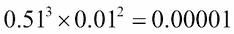，而为+1 的概率是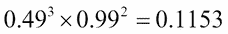。因此，我们不能假装所有分类器都应该有相同的投票权。这就是我们将充分利用加权投票方法的地方。

在这次分析中，我们将使用训练数据集上分类器的准确率作为权重。我们将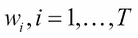视为与相关的权重。权重的一个重要特征是它们应该是非负的，并且它们的总和应该是 1，即。我们将归一化分类器的准确率以满足这一约束。

我们将继续使用德国信用数据集进行分析。首先，我们将获得训练数据集上 500 棵树的预测，然后获得准确率：

```py
> # Analyzing Accuracy of Trees of the Fitted Forest
> GC2_RF_Train_Predict <- predict(GC2_RF,newdata=GC2_Train[,-20],
+                                 type="class",predict.all=TRUE)
> head(GC2_RF_Train_Predict$individual[,c(1:5,496:500)])  
   [,1]   [,2]   [,3]   [,4]   [,5]   [,6]   [,7]   [,8]   [,9]   [,10] 
5  "bad"  "bad"  "bad"  "bad"  "good" "bad"  "bad"  "bad"  "bad"  "bad" 
6  "good" "good" "good" "good" "good" "good" "bad"  "bad"  "bad"  "good"
7  "good" "good" "good" "good" "good" "good" "good" "good" "good" "good"
8  "good" "good" "good" "good" "good" "bad"  "good" "bad"  "good" "good"
11 "bad"  "bad"  "bad"  "bad"  "bad"  "bad"  "bad"  "bad"  "bad"  "bad" 
12 "good" "bad"  "bad"  "bad"  "bad"  "good" "bad"  "bad"  "bad"  "bad" 
> RF_Tree_Train_Accuracy <- NULL
> for(i in 1:GC2_RF$ntree){
+   RF_Tree_Train_Accuracy[i] <- sum(GC2_RF_Train_Predict$individual[,i]==
+                                   GC2_Train$good_bad)/nrow(GC2_Train)
+ }
> headtail(sort(RF_Tree_Train_Accuracy),10)
 [1] 0.8340611 0.8369723 0.8384279 0.8398836 0.8398836 0.8413392 0.8413392
 [8] 0.8413392 0.8413392 0.8427948 0.8908297 0.8908297 0.8908297 0.8908297
[15] 0.8922853 0.8922853 0.8937409 0.8937409 0.8966521 0.8981077
```

`headtail`函数是什么？它在`Utilities.R`文件中可用。以下是对`bagging`集成器进行重复分析：

```py
> # Bagging ANALYSIS
> GC2_Bagg <- randomForest(GC2_Formula,data=GC2_Train,keep.inbag=TRUE,
+                          mtry=ncol(GC2_TestX),ntree=500)
> GC2_Bagg_Test_Predict <- predict(GC2_Bagg,newdata=GC2_TestX,
+                                 type="class",predict.all=TRUE)
> GC2_Bagg_Train_Predict <- predict(GC2_Bagg,newdata=GC2_Train[,-20],
+                                 type="class",predict.all=TRUE)
> Bagg_Tree_Train_Accuracy <- NULL
> for(i in 1:GC2_Bagg$ntree){
+   Bagg_Tree_Train_Accuracy[i] <- sum(GC2_Bagg_Train_Predict$individual[,i]==
+                                   GC2_Train$good_bad)/nrow(GC2_Train)
+ }
> headtail(sort(Bagg_Tree_Train_Accuracy),10)
 [1] 0.8369723 0.8384279 0.8413392 0.8457060 0.8457060 0.8471616 0.8471616
 [8] 0.8471616 0.8471616 0.8486172 0.8966521 0.8966521 0.8966521 0.8966521
[15] 0.8966521 0.8981077 0.8995633 0.8995633 0.9024745 0.9097525
```

接下来，我们将归一化权重并计算测试样本中观测值的加权投票，如下所示：

```py
> # Weighted Voting with Random Forest
> RF_Weights <- RF_Tree_Train_Accuracy/sum(RF_Tree_Train_Accuracy)
> Bagg_Weights <- Bagg_Tree_Train_Accuracy/sum(Bagg_Tree_Train_Accuracy)
> RF_Weighted_Vote <- data.frame(matrix(0,nrow(GC2_TestX),ncol=3))
> names(RF_Weighted_Vote) <- c("Good_Weight","Bad_Weight","Prediction")
> for(i in 1:nrow(RF_Weighted_Vote)){
+   RF_Weighted_Vote$Good_Weight[i] <- 
+     sum((GC2_RF_Test_Predict$individual[i,]=="good")*RF_Weights)
+   RF_Weighted_Vote$Bad_Weight[i] <- 
+     sum((GC2_RF_Test_Predict$individual[i,]=="bad")*RF_Weights)
+   RF_Weighted_Vote$Prediction[i] <- c("good","bad")[which.max(RF_Weighted_Vote[i,1:2])]
+ }
> head(RF_Weighted_Vote,10)
   Good_Weight Bad_Weight Prediction
1    0.8301541 0.16984588       good
2    0.3260033 0.67399668        bad
3    0.8397035 0.16029651       good
4    0.4422527 0.55774733        bad
5    0.9420565 0.05794355       good
6    0.2378956 0.76210442        bad
7    0.4759756 0.52402435        bad
8    0.7443038 0.25569624       good
9    0.8120180 0.18798195       good
10   0.7799587 0.22004126       good
```

如下所示，对`bagging`对象重复进行加权投票分析：

```py
> # Weighted Voting with Bagging
> Bagg_Weights <- Bagg_Tree_Train_Accuracy/sum(Bagg_Tree_Train_Accuracy)
> Bagg_Weights <- Bagg_Tree_Train_Accuracy/sum(Bagg_Tree_Train_Accuracy)
> Bagg_Weighted_Vote <- data.frame(matrix(0,nrow(GC2_TestX),ncol=3))
> names(Bagg_Weighted_Vote) <- c("Good_Weight","Bad_Weight","Prediction")
> for(i in 1:nrow(Bagg_Weighted_Vote)){
+   Bagg_Weighted_Vote$Good_Weight[i] <- 
+     sum((GC2_Bagg_Test_Predict$individual[i,]=="good")*Bagg_Weights)
+   Bagg_Weighted_Vote$Bad_Weight[i] <- 
+     sum((GC2_Bagg_Test_Predict$individual[i,]=="bad")*Bagg_Weights)
+   Bagg_Weighted_Vote$Prediction[i] <- c("good","bad")[which.max(Bagg_Weighted_Vote[i,1:2])]
+ }
> head(Bagg_Weighted_Vote,10)
   Good_Weight Bad_Weight Prediction
1    0.9279982 0.07200181       good
2    0.1634505 0.83654949        bad
3    0.8219618 0.17803818       good
4    0.4724477 0.52755226        bad
5    0.9619528 0.03804725       good
6    0.1698628 0.83013718        bad
7    0.4540574 0.54594265        bad
8    0.7883772 0.21162281       good
9    0.8301772 0.16982283       good
10   0.7585720 0.24142804       good
```

现在，随着投票机制的问题解决，我们将注意力转向回归问题。

# 通过平均进行集成

在回归模型的背景下，预测是感兴趣变量的数值。结合由于各种集成器导致的输出预测相对简单；由于集成机制，我们只需将集成器之间预测值的平均值解释为预测值。在分类问题的背景下，我们可以进行简单的平均和加权平均。在前一节中，集成器具有同质的基础学习器。然而，在本节中，我们将处理异质的基础学习器。

现在，我们将考虑一个在第八章《集成诊断》中详细处理的回归问题。问题是基于超过 60 个解释变量的房价预测。我们拥有训练和测试数据集，并将它们加载以启动过程：

```py
> # Averaging for Regression Problems
> load("../Data/ht_imp_author.Rdata") # returns ht_imp object
> load("../Data/htest_imp_author.Rdata") # returns htest_imp
> names(ht_imp)[69] <- "SalePrice"
> dim(ht_imp)
[1] 1460   69
> dim(htest_imp)
[1] 1459   68
```

因此，我们有大量观测数据来构建我们的模型。`SalePrice`是这里感兴趣的变量。首先，我们创建一个`公式`并构建一个线性模型；四个不同深度的回归树；四个具有不同隐藏神经元的神经网络；以及以下代码块中的支持向量机模型：

```py
> hf <- as.formula("SalePrice~.")
> SP_lm <- lm(hf,data=ht_imp)
> SP_rpart2 <- rpart(hf,data=ht_imp,maxdepth=2)
> SP_rpart4 <- rpart(hf,data=ht_imp,maxdepth=4)
> SP_rpart6 <- rpart(hf,data=ht_imp,maxdepth=6)
> SP_rpart8 <- rpart(hf,data=ht_imp,maxdepth=8)
> SP_nn2 <- nnet(hf,data=ht_imp,size=2,linout=TRUE)
# weights:  267
initial  value 56996872361441.906250 
final  value 9207911334609.976562 
converged
> SP_nn3 <- nnet(hf,data=ht_imp,size=3,linout=TRUE)
# weights:  400
initial  value 56997125121706.257812 
final  value 9207911334609.960938 
converged
> SP_nn4 <- nnet(hf,data=ht_imp,size=4,linout=TRUE)
# weights:  533
initial  value 56996951452602.304687 
iter  10 value 19328028546738.226562
iter  20 value 19324281941793.617187
final  value 9080312934601.205078 
converged
> SP_nn5 <- nnet(hf,data=ht_imp,size=5,linout=TRUE)
# weights:  666
initial  value 56997435951836.507812 
final  value 9196060713131.609375 
converged
> SP_svm <- svm(hf,data=ht_imp)
```

我们已经有了考虑异质集成的所需设置。

## 简单平均

我们使用训练数据集构建了十个模型，现在我们将使用`predict`函数在这些模型上对训练数据集进行预测，如下所示：

```py
> # Simple Averaging
> SP_lm_pred <- predict(SP_lm,newdata=htest_imp)
Warning message:
In predict.lm(SP_lm, newdata = htest_imp) :
  prediction from a rank-deficient fit may be misleading
> SP_rpart2_pred <- predict(SP_rpart2,newdata=htest_imp)
> SP_rpart4_pred <- predict(SP_rpart4,newdata=htest_imp)
> SP_rpart6_pred <- predict(SP_rpart6,newdata=htest_imp)
> SP_rpart8_pred <- predict(SP_rpart8,newdata=htest_imp)
> SP_nn2_pred <- predict(SP_nn2,newdata=htest_imp)
> SP_nn3_pred <- predict(SP_nn3,newdata=htest_imp)
> SP_nn4_pred <- predict(SP_nn4,newdata=htest_imp)
> SP_nn5_pred <- predict(SP_nn5,newdata=htest_imp)
> SP_svm_pred <- predict(SP_svm,newdata=htest_imp)
```

当涉及到分类问题时，预测要么基于类别标签，要么基于感兴趣类别的概率。因此，在预测的幅度方面，我们不会遇到*不良预测*，尽管我们至少需要检查预测是否给出+1 和-1 的混合。如果分类器只预测+1 或-1，那么这样的分类器可以被从进一步的分析中丢弃。对于回归问题，我们需要看看模型是否能在幅度上做出合理的预测，我们将简单地获得预测幅度的图，如下所示：

```py
> windows(height=300,width=400)
> par(mfrow=c(2,5))
> plot.ts(SP_lm_pred,col=1)
> plot.ts(SP_rpart2_pred,col=2)
> plot.ts(SP_rpart4_pred,col=3)
> plot.ts(SP_rpart6_pred,col=4)
> plot.ts(SP_rpart8_pred,col=5)
> plot.ts(SP_nn2_pred,col=6)
> plot.ts(SP_nn3_pred,col=7)
> plot.ts(SP_nn4_pred,col=8)
> plot.ts(SP_nn5_pred,col=9)
> plot.ts(SP_svm_pred,col=10)
```

前一个代码块的结果如下所示：


图 3：十个异构基学习器的预测简单图

我们可以看到，与具有两个或三个隐藏神经元的神经网络模型相关的预测没有产生预测上的变化。因此，我们将这两个模型从进一步的分析中删除。集成预测只是剩余八个模型预测的平均值：

```py
> Avg_Ensemble_Prediction <- rowMeans(cbind(SP_lm_pred,SP_rpart2_pred,
+     SP_rpart4_pred,SP_rpart6_pred,
+                SP_rpart8_pred,SP_nn4_pred,SP_nn5_pred,SP_svm_pred))
> plot.ts(Avg_Ensemble_Prediction)
```

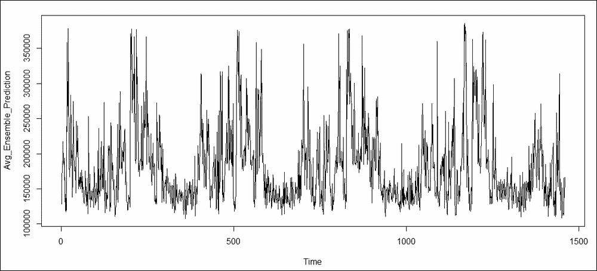

图 4：住房数据集的集成预测

正如将简单投票扩展到加权投票一样，我们现在将探讨加权平均。

## 权重平均

在分类器的情况下，权重是从训练数据集的分类器的准确性中选择的。在这种情况下，我们需要像这样的统一度量。如果回归模型具有更小的残差方差，则更倾向于选择回归模型，我们将选择方差作为准确性的度量。假设弱基模型*i*的估计残差方差为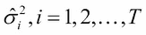。在集成神经网络的情况下，Perrone 和 Cooper（1993）声称可以使用以下方程获得*i*个弱基模型的最佳权重：

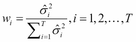

由于比例常数无关紧要，我们将简单地用残差平方的平均值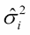来代替。在这个方向上，我们将首先通过简单地计算简单平均情况下考虑的八个模型的`mean(residuals(model)²)`来获得（加上一个常数），如下所示：

```py
> # Weighted Averaging
> SP_lm_sigma <- mean(residuals(SP_lm)²)
> SP_rp2_sigma <- mean(residuals(SP_rpart2)²)
> SP_rp4_sigma <- mean(residuals(SP_rpart4)²)
> SP_rp6_sigma <- mean(residuals(SP_rpart6)²)
> SP_rp8_sigma <- mean(residuals(SP_rpart8)²)
> SP_nn4_sigma <- mean(residuals(SP_nn4)²)
> SP_nn5_sigma <- mean(residuals(SP_nn5)²)
> SP_svm_sigma <- mean(residuals(SP_svm)²)
```

接下来，我们简单地实现权重公式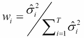，如下所示：

```py
> sigma_sum <- SP_lm_sigma + SP_rp2_sigma + SP_rp4_sigma +
+   SP_rp6_sigma + SP_rp8_sigma + SP_nn4_sigma +
+   SP_nn5_sigma + SP_svm_sigma
> sigma_sum
[1] 20727111061
> SP_lm_wts <- SP_lm_sigma/sigma_sum
> SP_rp2_wts <- SP_rp2_sigma/sigma_sum
> SP_rp4_wts <- SP_rp4_sigma/sigma_sum
> SP_rp6_wts <- SP_rp6_sigma/sigma_sum
> SP_rp8_wts <- SP_rp8_sigma/sigma_sum
> SP_nn4_wts <- SP_nn4_sigma/sigma_sum
> SP_nn5_wts <- SP_nn5_sigma/sigma_sum
> SP_svm_wts <- SP_svm_sigma/sigma_sum
```

`rowMeans`和`cbind`函数简单地给出了加权平均预测：

```py
> Weighted_Ensemble_Prediction <- rowMeans(cbind(SP_lm_wts*SP_lm_pred,
+                                           SP_rp2_wts*SP_rpart2_pred,
+                                           SP_rp4_wts*SP_rpart4_pred,
+                                           SP_rp6_wts*SP_rpart6_pred,
+                                           SP_rp8_wts*SP_rpart8_pred,
+                                           SP_nn4_wts*SP_nn4_pred,
+                                           SP_nn5_wts*SP_nn5_pred,
+                                           SP_svm_wts*SP_svm_pred))
> plot.ts(Weighted_Ensemble_Prediction)
```

前一个代码的输出如下所示：

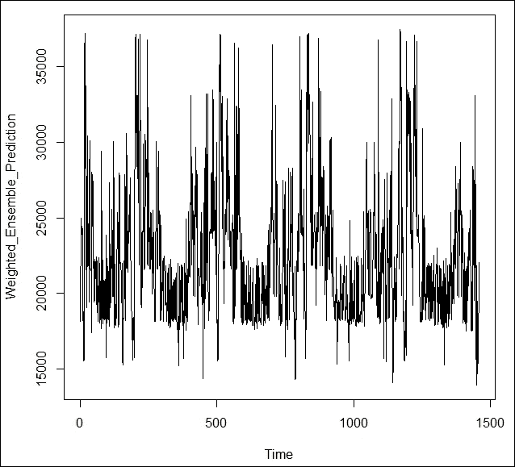

图 5：住房价格的加权平均预测

# 堆叠集成

在第一章中提供了一个堆叠回归的入门和激励示例，*集成技术简介*。在这里，我们将继续讨论一个尚未开发的回归问题的堆叠集成。

在堆叠集成中，几个弱模型的输出作为输入变量，以及用于构建早期模型的协变量，来构建一个堆叠模型。堆叠模型的形式可能是以下之一，或者可以是不同的模型。在这里，我们将简单地使用前几节中使用的八个回归模型作为弱模型。堆叠回归模型被选为梯度提升模型，并将给出原始输入变量和新模型的预测，如下所示：

```py
> SP_lm_train <- predict(SP_lm,newdata=ht_imp)
Warning message:
In predict.lm(SP_lm, newdata = ht_imp) :
  prediction from a rank-deficient fit may be misleading
> SP_rpart2_train <- predict(SP_rpart2,newdata=ht_imp)
> SP_rpart4_train <- predict(SP_rpart4,newdata=ht_imp)
> SP_rpart6_train <- predict(SP_rpart6,newdata=ht_imp)
> SP_rpart8_train <- predict(SP_rpart8,newdata=ht_imp)
> SP_nn4_train <- predict(SP_nn4,newdata=ht_imp)
> SP_nn5_train <- predict(SP_nn5,newdata=ht_imp)
> SP_svm_train <- predict(SP_svm,newdata=ht_imp)
> 
> ht_imp2 <- cbind(ht_imp[,-69],SP_lm_train,SP_rpart2_train,SP_rpart4_train,
+                           SP_rpart6_train,SP_rpart8_train,SP_nn4_train,SP_nn5_train,
+                           SP_svm_train,ht_imp[,69])
> names(ht_imp2)[77] <- "SalePrice"
> SP_gbm <- gbm(hf,data=ht_imp2,distribution = "gaussian",n.trees=200)
> headtail(predict(SP_gbm,n.trees=100),20)
 [1] 180260.6 177793.3 181836.9 177793.3 191927.7 177793.3 191927.7 182237.3
 [9] 177793.3 177793.3 177793.3 191927.7 177793.3 187520.7 177793.3 177793.3
[17] 177793.3 177793.3 177793.3 177793.3 177908.2 177793.3 191927.7 177793.3
[25] 177793.3 177793.3 177793.3 191927.7 177793.3 177793.3 177793.3 191927.7
[33] 177793.3 177793.3 177793.3 177793.3 179501.7 191927.7 177793.3 177793.3
```

这结束了我们对堆叠集成回归的简单讨论。

# 摘要

在本章中，我们探讨了在分类问题背景下集成为什么有效。一系列详细程序说明了每个分类器必须比随机猜测更好的观点。我们考虑了所有分类器具有相同准确度、不同准确度和最后是完全任意准确度的场景。在随机森林和袋装方法背景下说明了多数和加权投票。对于回归问题，我们使用了不同的基学习器选择，并允许它们是异质的。在住房销售价格数据相关方面，我们展示了简单和加权平均方法。堆叠回归的简单说明最终结束了本章的技术部分。

在下一章中，我们将探讨集成诊断。
