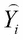
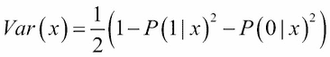

# 第八章. 集合诊断

在前面的章节中，我们发现集合方法非常有效。在前一章中，我们探讨了集合方法如何提高预测的整体准确性的场景。之前一直假设不同的基学习器之间是相互独立的。然而，除非我们有非常大的样本，并且基模型是使用一组不同观察值的学习者，否则这样的假设是非常不切实际的。即使我们有足够大的样本，相信分区是非重叠的，每个基模型都是建立在不同的分区上，每个分区都携带与任何其他分区相同的信息。然而，测试此类验证是困难的，因此我们需要采用各种技术来验证同一数据集上基模型的独立性。为此，我们将探讨各种不同的方法。本章将简要讨论集合诊断的必要性，并在下一节中介绍基模型多样性的重要性。对于分类问题，可以将分类器相互比较。然后我们可以进一步评估集合的相似性和准确性。在第三部分将介绍实现这一任务的统计测试。最初，将比较一个基学习器与另一个基学习器，然后我们将一次性查看集合中的所有模型。

本章将涵盖以下主题：

+   集合诊断

+   集合多样性

+   配对比较

+   评分者间一致性

# 技术要求

我们将在本章中使用以下库：

+   `rpart`

# 什么是集合诊断？

集成方法的力量在前几章中得到了展示。由决策树组成的集成是一个同质集成，这是第三章*Bagging*到第六章*Boosting Refinements*的主要内容。在第一章*集成技术介绍*和第七章*通用集成技术*中，我们简要介绍了堆叠集成。集成的一个中心假设是模型之间相互独立。然而，这个假设很少成立，我们知道相同的数据分区被反复使用。这并不意味着集成是坏的；我们有充分的理由在使用集成的同时预览集成应用中的担忧。因此，我们需要了解基础模型在预测上的相似程度以及整体上的相似程度。如果预测彼此很接近，那么我们可能需要在集成中使用这些基础模型。在这里，我们将为德国信用数据集构建逻辑回归、朴素贝叶斯、SVM 和决策树作为基础模型。分析和程序在这里略有重复，因为它是从早期章节继承过来的： 

```py
> load("../Data/GC2.RData")
> table(GC2$good_bad)
 bad good 
 300  700 
> set.seed(12345)
> Train_Test <- sample(c("Train","Test"),nrow(GC2),replace = 
+ TRUE,prob = c(0.7,0.3))
> head(Train_Test)
[1] "Test"  "Test"  "Test"  "Test"  "Train" "Train"
> GC2_Train <- GC2[Train_Test=="Train",]
> GC2_TestX <- within(GC2[Train_Test=="Test",],rm(good_bad))
> GC2_TestY <- GC2[Train_Test=="Test","good_bad"]
> GC2_TestY_numeric <- as.numeric(GC2_TestY)
> GC2_Formula <- as.formula("good_bad~.")
> p <- ncol(GC2_TestX)
> ntr <- nrow(GC2_Train) 
> nte <- nrow(GC2_TestX) 
> # Logistic Regression
> LR_fit <- glm(GC2_Formula,data=GC2_Train,family = binomial())
> LR_Predict_Train <- predict(LR_fit,newdata=GC2_Train,
+ type="response")
> LR_Predict_Train <- as.factor(ifelse(LR_Predict_Train>0.5,
+ "good","bad"))
> LR_Accuracy_Train <- sum(LR_Predict_Train==GC2_Train$good_bad)/
+ ntr
> LR_Accuracy_Train
[1] 0.78
> LR_Predict_Test <- predict(LR_fit,newdata=GC2_TestX,
+ type="response")
> LR_Predict_Test_Bin <- ifelse(LR_Predict_Test>0.5,2,1)
> LR_Accuracy_Test <- sum(LR_Predict_Test_Bin==
+ GC2_TestY_numeric)/nte
> LR_Accuracy_Test
[1] 0.757
> # Naive Bayes
> NB_fit <- naiveBayes(GC2_Formula,data=GC2_Train)
> NB_Predict_Train <- predict(NB_fit,newdata=GC2_Train)
> NB_Accuracy_Train <- sum(NB_Predict_Train==
+ GC2_Train$good_bad)/ntr
> NB_Accuracy_Train
[1] 0.767
> NB_Predict_Test <- predict(NB_fit,newdata=GC2_TestX)
> NB_Accuracy_Test <- sum(NB_Predict_Test==GC2_TestY)/nte
> NB_Accuracy_Test
[1] 0.808
> # Decision Tree
> CT_fit <- rpart(GC2_Formula,data=GC2_Train)
> CT_Predict_Train <- predict(CT_fit,newdata=GC2_Train,
+ type="class")
> CT_Accuracy_Train <- sum(CT_Predict_Train==
+ GC2_Train$good_bad)/ntr
> CT_Accuracy_Train
[1] 0.83
> CT_Predict_Test <- predict(CT_fit,newdata=GC2_TestX,
+ type="class")
> CT_Accuracy_Test <- sum(CT_Predict_Test==GC2_TestY)/nte
> CT_Accuracy_Test
[1] 0.706
> # Support Vector Machine
> SVM_fit <- svm(GC2_Formula,data=GC2_Train)
> SVM_Predict_Train <- predict(SVM_fit,newdata=GC2_Train,
+ type="class")
> SVM_Accuracy_Train <- sum(SVM_Predict_Train==
+ GC2_Train$good_bad)/ntr
> SVM_Accuracy_Train
[1] 0.77
> SVM_Predict_Test <- predict(SVM_fit,newdata=GC2_TestX,
+ type="class")
> SVM_Accuracy_Test <- sum(SVM_Predict_Test==GC2_TestY)/nte
> SVM_Accuracy_Test
[1] 0.754
```

在下一节中，我们将强调在集成中多样性的必要性。

# 集成多样性

在一个集成中，我们有许多基础模型——比如说有*L*个。对于分类问题，我们有基础模型作为分类器。如果我们有一个回归问题，我们有基础模型作为学习器。由于诊断仅在训练数据集上执行，我们将放弃训练和验证分区这一惯例。为了简单起见，在接下来的讨论中，我们将假设我们有*N*个观测值。*L*个模型意味着对于*N*个观测值中的每一个，我们都有*L*个预测，因此预测的数量是。我们正是在这些预测中试图找到集成的多样性。集成的多样性取决于我们处理的问题类型。首先，我们将考虑回归问题。

## 数值预测

在回归问题的情况下，观测值的预测值可以直接与它们的实际值进行比较。我们可以很容易地看到哪个基础模型的预测值更接近观测的实际值，哪个离它更远。如果所有预测值都彼此接近，则基础模型不具有多样性。在这种情况下，任何一个预测可能就足够了。如果预测值表现出一些变化，通过使用平均值组合它们可能提供稳定性。在评估多样性时，了解集成预测与真实观测值有多接近也是非常重要的。

让我们考虑一个假设场景，在这个场景中我们有六个观测值，它们的实际值，三个基础学习器，学习器的预测，以及集成预测。以下表格提供了一个示例数据集，有助于您理解集成多样性的复杂性：

| 观测编号 | 实际值 | E1 | E2 | E3 | EP |
| --- | --- | --- | --- | --- | --- |
| 1 | 30 | 15 | 20 | 25 | 20 |
| 2 | 30 | 40 | 50 | 60 | 50 |
| 3 | 30 | 25 | 30 | 35 | 30 |
| 4 | 30 | 28 | 30 | 32 | 30 |
| 5 | 30 | 20 | 30 | 40 | 30 |
| 6 | 30 | 10 | 15 | 65 | 30 |

> 表 1：六个观测值、三个基础学习器和集成

为了便于比较，*表 1*中所有观测值的真实值都保持在 30。六个观测/案例的集成预测范围从 10 到 65，而集成预测——基础学习器预测的平均值——范围从 20 到 50。为了理解特定观测值及其相关预测的集成多样性，我们将使用以下程序块可视化数据：

```py
> DN <- read.csv("../Data/Diverse_Numeric.csv")
> windows(height=100,width=100)
> plot(NULL,xlim=c(5,70),ylim=c(0,7),yaxt='n',xlab="X-values",ylab="")
> points(DN[1,2:6],rep(1,5),pch=c(19,1,1,1,0),cex=2)
> points(DN[2,2:6],rep(2,5),pch=c(19,1,1,1,0),cex=2)
> points(DN[3,2:6],rep(3,5),pch=c(19,1,1,1,0),cex=2)
> points(DN[4,2:6],rep(4,5),pch=c(19,1,1,1,0),cex=2)
> points(DN[5,2:6],rep(5,5),pch=c(19,1,1,1,0),cex=2)
> points(DN[6,2:6],rep(6,5),pch=c(19,1,1,1,0),cex=2)
> legend(x=45,y=7,c("Actual","Model","Ensemble"),pch=c(19,1,0))
> axis(2,at=1:6,labels=paste("Case",1:6),las=1)
```

程序的解释在这里。代码的第一行从代码包文件夹中导入`Diverse_Numeric.csv`数据。`windows (X11)`函数在 Windows（Ubuntu）操作系统中设置一个新的图形设备。然后`plot`函数设置一个空白的绘图，并通过`xlim`和`ylim`指定坐标轴的范围。使用绘图和`points`函数将*表 1*中的每一行数据突出显示。选择`pch`需要进一步说明。如果我们选择`pch`为，例如，`19`、`1`和`0`，那么这意味着我们选择了填充的圆圈、圆圈和正方形。这三种形状分别表示实际值、模型预测和集成预测。轴命令帮助我们获得正确的标签显示。前面 R 代码块的结果是以下绘图：


图 1：理解回归问题中的集成多样性

我们有六个观察结果，每个都被标记为**案例**。首先考虑**案例 1**。每个观察结果的实心圆圈表示实际值——在这种情况下是**30**，这在整个数据集中都是相同的。对于这个观察结果，集成预测是**20**。空白圆圈中描绘的是三个基础模型的预测值**15**、**20**和**25**。集成预测——基础学习器预测的平均值——是**20**，并用空白正方形表示。现在，这三个值分布得不太分散，这被解释为表明对于这个观察结果，集成多样性较低。因此，这是一个**低多样性-低估计**的例子。

在**表 1**的第二种情况下，三个预测值分布得很好，具有很高的多样性。然而，**50**的集成估计值与实际值**30**相差太远，我们将这种情况称为**高多样性-低估计**。**案例 3**和**案例 4**因此被视为**低多样性-高估计**，因为集成预测与实际值相符，且三个集成预测值彼此接近。**案例 5**在多样性和准确性之间取得了良好的平衡，因此我们可以将其标记为**高多样性-高估计**的例子。最后一种情况准确性良好，尽管多样性过高，以至于集成预测并不好。你可以参考 Kuncheva (2014)了解更多关于集成学习器多样性-准确性困境的细节。

我们将在下一节考虑分类问题的多样性-准确性问题。

### 类别预测

上一节讨论了回归问题中的多样性-准确性问题。在分类问题的案例中，我们可以清楚地标记分类器的预测是否与实际输出/标签匹配。此外，我们只有两种可能的预测：0 或 1。因此，我们可以比较两个分类器在所有观察结果上的接近程度。例如，对于分类器的两个可能结果和的两个可能结果，对于给定的观察结果有四种可能的场景：

+   预测标签为 1；预测为 1

+   预测标签为 1；预测为 0

+   预测标签为 0；预测为 1

+   预测标签为 0；预测为 0

在情景 1 和 4 中，两个分类器*同意*彼此，而在 2 和 3 中，它们*不同意*。如果我们有*N*个观测，每个观测用两个模型预测将落入上述四种情景之一。在我们考虑两个或更多模型的正式一致性或不一致性度量之前，我们将在接下来的讨论中考虑两个更简单的案例。

有一个流行的说法，如果两个人总是同意，其中一个人是不必要的。这与分类器工作的方式相似。同样，假设一对鹅被认为是非常忠诚的；它们彼此相伴，共同面对问题。现在，如果我们有两个模型在所有观测中都以与这些鹅相同的方式表现，那么多样性就会永远丧失。因此，在任何给定的集成情景中，我们需要消除鹅对，只保留其中之一。假设我们有一个*L*预测的矩阵，其中列对应分类器，行对应*N*个观测。在这种情况下，我们将定义一个名为`GP`的函数，以及鹅对的缩写，它将告诉我们哪些分类器有一个鹅对分类器在所有观测中与它们一致：

```py
> # Drop the Geese Pair
>GP<- function(Pred_Matrix) {
+   L<- ncol(Pred_Matrix) # Number of classifiers
+   N<- nrow(Pred_Matrix)
+   GP_Matrix <- matrix(TRUE,nrow=L,ncol=L)
+   for(i in 1:(L-1)){
+     for(j in (i+1):L){
+       GP_Matrix[i,j] <- ifelse(sum(Pred_Matrix[,i]==Pred_Matrix[,j])==N,
+                                TRUE,FALSE)
+       GP_Matrix[j,i] <- GP_Matrix[i,j]
+     }
+   }
+   return(GP_Matrix)
+ }
```

鹅对`GP`函数是如何工作的？我们向这个函数输入一个`矩阵`预测作为输入，其中列对应分类器，行对应观测。这个函数首先创建一个逻辑矩阵，其阶数为，默认逻辑值为`TRUE`。由于一个分类器显然会与自己一致，我们接受默认值。此外，由于分类器与在相同的方式上同意/不同意，我们利用这一事实通过对称关系计算下矩阵。在两个嵌套循环中，我们比较一个分类器的预测与另一个分类器的预测。`ifelse`函数检查一个分类器的所有预测是否与另一个分类器匹配，如果对于单个观测条件不成立，我们说正在考虑的两个分类器不是鹅对，或者它们至少在某个场合上不同意：

接下来，将`GP`函数应用于为分类问题设置的 500 个分类器。`CART_Dummy`数据集来自`RSADBE`包。`CART_DUMMY`数据集和相关问题描述可以在 Tattar（2017）的第九章中找到。我们从这个相同的来源改编了代码和结果输出：

```py
> data(CART_Dummy)
> CART_Dummy$Y <- as.factor(CART_Dummy$Y)
> attach(CART_Dummy)
> windows(height=100,width=200)
> par(mfrow=c(1,2))
> plot(c(0,12),c(0,10),type="n",xlab="X1",ylab="X2")
> points(X1[Y==0],X2[Y==0],pch=15,col="red")
> points(X1[Y==1],X2[Y==1],pch=19,col="green")
> title(main="A Difficult Classification Problem")
> plot(c(0,12),c(0,10),type="n",xlab="X1",ylab="X2")
> points(X1[Y==0],X2[Y==0],pch=15,col="red")
> points(X1[Y==1],X2[Y==1],pch=19,col="green")
> segments(x0=c(0,0,6,6),y0=c(3.75,6.25,2.25,5),
+          x1=c(6,6,12,12),y1=c(3.75,6.25,2.25,5),lwd=2)
> abline(v=6,lwd=2)
> title(main="Looks a Solvable Problem Under Partitions")
```

如程序所示，我们这里有三个变量：`X1`、`X2`和`Y`。由`Y`表示的变量是一个二元变量——一个类别用绿色表示，另一个用红色表示。使用`X1`和`X2`变量提供的信息，目标是预测`Y`的类别。红色和绿色点交织在一起，因此单一线性分类器不足以在这里将红色和绿色分开。然而，如果我们通过`X1`和`X2`递归地划分数据空间，如图 2 右侧的最终图所示，那么红色和绿色看起来是可分离的。前面的 R 代码块产生以下图表：


图 2：一个典型的分类问题

为`CART_DUMMY`数据集设置了包含`500`棵树的随机森林。固定的种子确保了在任何执行中输出的可重复性。使用拟合的随机森林，我们接下来使用`500`棵树预测所有观测值的输出。`type="class"`和`predict.all=TRUE`选项是此代码块的核心。然后，将`GP`函数应用于`500`棵树的预测矩阵。请注意，`GP`矩阵的对角元素始终为`TRUE`。因此，如果有任何分类器与所有观测值完全一致，该单元格的值将是`TRUE`。如果行和超过计数 2，则该分类器有鹅分类器。以下代码捕获了整个计算过程：

```py
> CD <- CART_Dummy 
> CD$Y <- as.factor(CD$Y)
> set.seed(1234567)
> CD_RF <- randomForest(Y~.,data=CD,ntree=500)
> CD_RF_Predict <- predict(CD_RF,newdata=CD,
+                           type="class",predict.all=TRUE)
> CD_RF_Predict_Matrix <- CD_RF_Predict$individual
> CD_GP <- GP(CD_RF_Predict_Matrix)
> CD_GP[1:8,1:8]
      [,1]  [,2]  [,3]  [,4]  [,5]  [,6]  [,7]  [,8]
[1,]  TRUE FALSE FALSE FALSE FALSE FALSE FALSE FALSE
[2,] FALSE  TRUE FALSE FALSE FALSE FALSE FALSE FALSE
[3,] FALSE FALSE  TRUE FALSE FALSE FALSE FALSE FALSE
[4,] FALSE FALSE FALSE  TRUE FALSE FALSE FALSE FALSE
[5,] FALSE FALSE FALSE FALSE  TRUE FALSE FALSE FALSE
[6,] FALSE FALSE FALSE FALSE FALSE  TRUE FALSE FALSE
[7,] FALSE FALSE FALSE FALSE FALSE FALSE  TRUE FALSE
[8,] FALSE FALSE FALSE FALSE FALSE FALSE FALSE  TRUE
> rowSums(CD_ST)
  [1] 1 1 1 1 1 1 1 1 1 1 1 1 1 1 1 1 1 1 1 1 2 1 1 1 1 1 1 1 1 1 1 1 1 1 1 1 1
 [38] 1 1 1 1 2 1 1 1 1 1 1 1 1 1 1 1 1 1 1 1 1 1 1 1 1 1 1 1 1 1 1 1 1 1 1 1 1

 [149] 1 1 1 1 1 1 1 1 1 1 1 1 1 1 1 1 1 1 1 1 1 1 1 1 1 1 1 2 1 1 1 1 1 1 1 1 1
[186] 1 1 2 1 1 1 1 1 1 1 1 1 1 1 1 1 1 1 1 1 2 1 1 1 1 1 1 1 1 1 1 1 1 1 1 2 1
[223] 1 1 1 1 1 1 1 1 1 1 1 1 1 1 1 1 1 1 1 1 1 1 1 1 1 1 1 1 1 1 1 1 1 2 1 1 1
[260] 1 1 1 1 1 1 1 1 1 1 1 1 1 1 1 1 1 1 2 1 1 1 1 1 1 1 1 1 1 1 2 1 1 1 1 1 1
[297] 1 1 1 1 1 1 1 1 1 1 1 1 1 1 1 1 1 1 1 1 1 1 1 1 1 1 1 1 1 1 1 1 1 1 1 1 1
[334] 1 1 1 1 1 1 1 1 1 1 1 1 1 1 1 1 1 1 1 1 1 1 1 1 1 1 1 1 1 2 1 2 1 1 1 1 1
[371] 1 1 1 1 1 1 1 1 1 1 1 1 1 1 2 1 1 1 1 1 1 1 1 1 1 1 1 1 1 1 1 1 1 1 1 1 1
[408] 1 1 1 1 1 1 1 1 1 1 1 1 1 1 1 1 2 1 1 1 1 1 1 1 1 1 1 1 1 1 1 1 1 1 2 1 1

[482] 1 1 1 1 1 1 1 1 1 1 1 1 1 1 1 1 1 1 1
```

读者应注意的是，前面输出中 2 的粗体和较大字体不是由 R 给出的。这是由处理文本内容的软件修改的。因此，我们有很多具有鹅分类器的分类器，它们与各自的预测相匹配。使用`which`函数，我们首先找到所有满足条件的分类器索引，然后，通过应用`which`函数到`CD_GP`矩阵的行，我们得到相关的鹅分类器：

```py
> which(rowSums(CD_GP)>1)
 [1]  21  42 176 188 206 221 256 278 290 363 365 385 424 442
> which(CD_GP[21,]==TRUE)
[1]  21 188
> which(CD_GP[42,]==TRUE)
[1]  42 290
> which(CD_GP[176,]==TRUE)
[1] 176 363
> which(CD_GP[206,]==TRUE)
[1] 206 256
> which(CD_GP[221,]==TRUE)
[1] 221 278
> which(CD_GP[365,]==TRUE)
[1] 365 424
> which(CD_GP[385,]==TRUE)
[1] 385 442
```

运行前面的代码后，我们能够识别与分类器关联的鹅分类器。我们可以选择移除鹅对中的任何一个成员。在下一个示例中，我们将应用此方法到德国信用数据。程序尝试以下方式识别鹅分类器：

```py
> set.seed(12345)
> GC2_RF3 <- randomForest(GC2_Formula,data=GC2_Train,mtry=10,
+                         parms = list(split="information",
+                                      loss=matrix(c(0,1,1000,0),byrow = TRUE,nrow=2)),
+                         ntree=1000)
> GC2_RF_Train_Predict <- predict(GC2_RF3,newdata=GC2_Train,
+                                 type="class",predict.all=TRUE)
> GC2_RF_Train_Predict_Matrix <- GC2_RF_Train_Predict$individual
> GC2_GP <- GP(GC2_RF_Train_Predict_Matrix)
> rowSums(GC2_GP)
   [1] 1 1 1 1 1 1 1 1 1 1 1 1 1 1 1 1 1 1 1 1 1 1 1 1 1 1 1 1 1 1 1 1 1 1 1 1
  [37] 1 1 1 1 1 1 1 1 1 1 1 1 1 1 1 1 1 1 1 1 1 1 1 1 1 1 1 1 1 1 1 1 1 1 1 1

[973] 1 1 1 1 1 1 1 1 1 1 1 1 1 1 1 1 1 1 1 1 1 1 1 1 1 1 1 1
> which(rowSums(GC2_GP)>1)
integer(0)
```

由于没有分类器有对应的鹅分类器，我们不需要消除任何树。

在 Kuncheva (2014)，第 112 页，有一个有用的度量标准，称为*神谕输出*。接下来，我们正式定义这个量。记住，我们有*L*个分类器和*N*个观测值。标签的原始/实际值用表示。我们将使用分类器 j 表示第 i 个预测值，用表示。

**Oracle 输出**：如果预测值等于，则 Oracle 输出被定义为**1**；否则，它被定义为**0**。用数学术语来说，Oracle 输出使用以下数学表达式给出：


那么，Oracle 输出和预测之间有什么区别？预测包括数据的标签，标签可能是 1/0、GOOD/BAD、+1/-1、YES/NO 或其他二进制标签对。此外，在二进制标签的情况下，预测为 1 并不一定意味着原始值是 1；它也可能是 0。如果预测 1 为 1 或 0 为 0，Oracle 输出取值为 1；否则，它取值为 0。使用 Oracle 输出的一个后果是，分类器中 1 的比例将给我们提供分类器的准确度。

我们现在将创建一个名为`Oracle`的 R 函数，该函数在预测矩阵和实际标签作为输入时将给出 Oracle 输出。之后，我们将计算分类器的准确度：

```py
> # Oracle Output
> Oracle <- function(PM,Actual){
+   # PM = Prediction Matrix, Actual = the true Y's
+   OM <- matrix(0,nrow=nrow(PM),ncol=ncol(PM))
+   for(i in 1:ncol(OM)) {
+     OM[,i] <- as.numeric(PM[,i]==Actual)
+   }
+   return(OM)
+ }
> GC_Oracle <- Oracle(PM=GC2_RF_Train_Predict$individual,
+                     Actual=GC2_Train$good_bad)
> colSums(GC_Oracle)/nrow(GC_Oracle)
   [1] 0.872 0.884 0.859 0.869 0.866 0.878 0.888 0.872 0.869 0.875 0.885 0.869
  [13] 0.881 0.866 0.879 0.856 0.870 0.869 0.857 0.870 0.878 0.868 0.886 0.892
  [25] 0.881 0.863 0.866 0.856 0.886 0.876 0.873 0.879 0.875 0.885 0.872 0.872

[973] 0.860 0.873 0.869 0.888 0.863 0.879 0.882 0.865 0.891 0.863 0.878 0.879
 [985] 0.878 0.869 0.856 0.872 0.889 0.881 0.868 0.881 0.884 0.854 0.882 0.882
 [997] 0.862 0.884 0.873 0.885
```

Oracle 矩阵帮助我们获得分类器的准确度。在下一节中，我们将讨论一些有助于我们了解分类器之间距离的度量。

## 配对度量

在本节中，我们将提出一些度量两个分类器之间一致性的方法。目的是固定两个分类器之间的一致性/不一致性概念，然后在下一节中将该概念应用到集成分类器的整体分类器中。如果和是具有预测的分类器模型，那么我们可以获得一个表格，它给出以下内容：

+   预测为 1；预测它为 1

+   预测为 1；预测它为 0

+   预测为 0；预测它为 1

+   预测为 0；预测它为 0

在*N*个观测值中的信息可以以表格形式表示，如下所示：

|   | M1 预测 1 | M1 预测 0 |
| --- | --- | --- |
| M2 预测 1 | n11 | n10 |
| M2 预测 0 | n01 | n00 |

表 2：两个分类器/评分者的列联表

前一个表的对角线元素显示两个模型/分类器之间的一致性，而离对角线元素显示不一致性。这些模型有时被称为*评分者*。频率表也被称为**列联表**。使用这种设置，我们现在将讨论一些有用的*一致性*度量。比较被称为成对度量，因为我们只分析了一对分类器。

## 不一致性度量

两个分类器/评分者之间的一致性度量定义为以下公式：


我们现在将定义一个`DM`函数，该函数接受两个分类器的预测。该函数首先为预测准备列联表。不一致性度量的计算是直接的，如下代码块所示：

```py
> # Disagreement Measure
> DM <- function(prediction1,prediction2){
+   tp <- table(prediction1,prediction2)
+   Diss <- (tp[1,2]+tp[2,1])/length(prediction1)
+   return(Diss)
+ }
```

在第一部分，我们根据逻辑回归模型、朴素贝叶斯、SVM 和分类树对德国信用数据进行了预测。现在我们将 DM 函数应用于这些预测，看看这些分类器之间有多大的不一致性：

```py
> DM(LR_Predict_Train,NB_Predict_Train)
[1] 0.121
> DM(LR_Predict_Train,CT_Predict_Train)
[1] 0.154
> DM(LR_Predict_Train,SVM_Predict_Train)
[1] 0.153
> DM(NB_Predict_Train,CT_Predict_Train)
[1] 0.179
> DM(NB_Predict_Train,SVM_Predict_Train)
[1] 0.154
> DM(CT_Predict_Train,SVM_Predict_Train)
[1] 0.167
```

由于我们有四个分类器，因此将会有 3 + 2 + 1 = 6 个成对比较。朴素贝叶斯和分类树之间的不一致性最大，而逻辑回归和朴素贝叶斯分类器之间的一致性最小。可以使用 DM 度量来轻松地获得两个模型的不一致性。

## Yule 或 Q 统计量

Yule 系数是一致性的度量，当其值接近于零时，它将给出两个评分者之间的一致性。Yule 度量使用以下公式给出：


Q 统计量的值在相关系数的范围内——即。因此，如果 Q 值接近于 1，这意味着两个度量几乎总是相互一致，而接近于-1 的值意味着两个模型预测的是相反的。当 Q 值接近于 0 时，这意味着两个评分者之间有非常弱的相关性。以下代码块创建并应用了一个`Yule`函数，用于不同的模型预测：

```py
> # Q-statistic 
> Yule <- function(prediction1,prediction2){
+   tp <- table(prediction1,prediction2)
+   Yu <- (tp[1,1]*tp[2,2]-tp[1,2]*tp[2,1])/(tp[1,1]*tp[2,2]+tp[1,2]*tp[2,1])
+   return(Yu)
+ }
> Yule(LR_Predict_Train,NB_Predict_Train)
[1] 0.949
> Yule(LR_Predict_Train,CT_Predict_Train)
[1] 0.906
> Yule(LR_Predict_Train,SVM_Predict_Train)
[1] 0.98
> Yule(NB_Predict_Train,CT_Predict_Train)
[1] 0.865
> Yule(NB_Predict_Train,SVM_Predict_Train)
[1] 0.985
> Yule(CT_Predict_Train,SVM_Predict_Train)
[1] 0.912
```

朴素贝叶斯预测和 SVM 预测之间的一致性最高。请注意，如果我们取不一致性度量的补数并使用以下代码轻松执行，我们得到以下一致性的度量：

```py
> 1-DM(LR_Predict_Train,NB_Predict_Train)
[1] 0.879
> 1-DM(LR_Predict_Train,CT_Predict_Train)
[1] 0.846
> 1-DM(LR_Predict_Train,SVM_Predict_Train)
[1] 0.847
> 1-DM(NB_Predict_Train,CT_Predict_Train)
[1] 0.821
> 1-DM(NB_Predict_Train,SVM_Predict_Train)
[1] 0.846
> 1-DM(CT_Predict_Train,SVM_Predict_Train)
[1] 0.833
```

然而，这项分析表明，逻辑回归和朴素贝叶斯评分者之间的一致性最高。因此，我们注意到输出和比较可能会导致不同的结论。也可以计算两个评分者之间的相关系数；我们将在下一部分介绍。

## 相关系数度量

两个数值变量之间的相关系数非常直观，当它们之间存在线性关系时，它也是一个非常有用的关系度量。如果两个变量在本质上都是分类的，那么我们仍然可以获取它们之间的相关系数。对于两个评分者，相关系数使用以下公式计算：


我们将定义一个`SS_Cor`函数，它将执行必要的计算并返回相关系数：

```py
> # Correlation coefficient 
> # Sneath and Sokal, 1973
> SS_Cor <- function(prediction1, prediction2){
+   tp <- table(prediction1,prediction2)
+   a <- tp[1,1]; b <- tp[2,1]; c <- tp[1,2]; d <- tp[2,2]
+   SS <- (a*d-b*c)/sqrt(exp(log(a+b)+log(a+c)+log(c+d)+log(b+d)))
+   return(SS)
+ }
```

现在将相关系数函数应用于预测，如前例所示：

```py
> SS_Cor(LR_Predict_Train,NB_Predict_Train)
[1] 0.69
> SS_Cor(LR_Predict_Train,CT_Predict_Train)
[1] 0.593
> SS_Cor(LR_Predict_Train,SVM_Predict_Train)
[1] 0.584
> SS_Cor(NB_Predict_Train,CT_Predict_Train)
[1] 0.531
> SS_Cor(NB_Predict_Train,SVM_Predict_Train)
[1] 0.587
> SS_Cor(CT_Predict_Train,SVM_Predict_Train)
[1] 0.493
```

结果表明，逻辑回归和朴素贝叶斯预测比任何其他组合都更一致。相关性测试可以用来检查分类器的预测是否相互独立。

**练习**：应用`chisq.test`来检查各种分类器预测的独立性。

## 科亨统计量

科亨统计量首次出现在 1960 年。它基于两个评分者因偶然或巧合而达成一致的概率。两个评分者达成一致的概率如下所示：


然而，随机或偶然达成一致的概率如下所示：


使用和的定义，科亨统计量如下定义：


科亨的 Kappa 值也可以是负数。如果其值为 1，这意味着评分者完全一致。0 的值表示一致仅是偶然的，负值表示偶然的一致性低于预期。首先，在以下代码中创建了 R 函数`Kappa`：

```py
> # Kappa-statistic 
> # Cohen's Statistic
> Kappa <- function(prediction1, prediction2){
+   tp <- table(prediction1,prediction2)
+   a <- tp[1,1]; b <- tp[2,1]; c <- tp[1,2]; d <- tp[2,2]
+   n <- length(prediction1)
+   theta1 <- (a+d)/n
+   theta2 <- (((a+b)*(a+c))+((c+d)*(b+d)))/n²
+   kappa <- (theta1-theta2)/(1-theta2)
+   return(kappa)
+ }
```

编码部分是公式的清晰实现，对`a`、`b`、`c`、`d`、`theta1`和`theta2`的选择已经做出，以便代码易于理解和遵循。接下来，我们将预测应用于德语训练数据集：

```py
> Kappa(LR_Predict_Train,NB_Predict_Train)
[1] 0.69
> Kappa(LR_Predict_Train,CT_Predict_Train)
[1] 0.592
> Kappa(LR_Predict_Train,SVM_Predict_Train)
[1] 0.524
> Kappa(NB_Predict_Train,CT_Predict_Train)
[1] 0.53
> Kappa(NB_Predict_Train,SVM_Predict_Train)
[1] 0.525
> Kappa(CT_Predict_Train,SVM_Predict_Train)
[1] 0.453
```

再次，逻辑回归和朴素贝叶斯预测的一致性是最高的。我们现在转向最终的分歧度量。

## 双误度量

在网球中，双误指的是发球失败的情况。发球者有两个机会发球正确，如果他们没有做到，则该分被判给对手。双误度量发生在两个分类器都做出错误预测时：


显然，我们需要 DF 尽可能低，接近 0。这个函数易于理解，因此这将被留给读者作为练习来跟随。以下代码给出了双误度量的 R 函数及其应用：

```py
> # Double-fault Measure
> Double_Fault <- function(prediction1,prediction2,actual){
+   DF <- sum((prediction1!=actual)*(prediction2!=actual))/
+         length(actual)
+   return(DF)
+ }
> Double_Fault(LR_Predict_Train,NB_Predict_Train,
+ GC2_Train$good_bad)
[1] 0.166
> Double_Fault(LR_Predict_Train,CT_Predict_Train,
+ GC2_Train$good_bad)
[1] 0.118
> Double_Fault(LR_Predict_Train,SVM_Predict_Train,
+ GC2_Train$good_bad)
[1] 0.148
> Double_Fault(NB_Predict_Train,CT_Predict_Train,
+ GC2_Train$good_bad)
[1] 0.709
> Double_Fault(NB_Predict_Train,SVM_Predict_Train,
+ GC2_Train$good_bad)
[1] 0.154
> Double_Fault(CT_Predict_Train,SVM_Predict_Train,
+ GC2_Train$good_bad)
[1] 0.116
```

读者应使用双重错误度量来识别最佳一致性。

**练习**：在多标签（超过两个类别）的情况下，本节讨论的度量扩展变得繁琐。相反，可以使用 Oracle 矩阵并重复这些度量。读者应将这些措施应用于 Oracle 输出。

到目前为止讨论的方法仅适用于一对分类器。在下一节中，我们将测量集成中所有分类器的多样性。

# 交互一致性

在前节讨论的集成分类器度量简单扩展是计算所有可能的集成对度量，然后简单地平均这些值。这项任务构成了下一个练习。

**练习**：对于所有可能的集成对组合，计算不一致度量、Yule 统计量、相关系数、Cohen's kappa 和双重错误度量。完成这些后，获得比较的平均值，并将它们报告为集成多样性。

在这里，我们将提出多样性的替代度量，并使用熵度量启动讨论。在本节的所有讨论中，我们将使用 Oracle 输出。

## 熵度量

你可能记得，我们根据来表示 Oracle 输出。对于特定实例，如果错误分类该实例的分类器数量为，则集成具有最大多样性。这意味着的值为 0，其余的、、的值为 1。然后，**集成熵度量**定义为以下：


熵度量 E 的值位于单位区间内。如果 E 值接近 0，这意味着集成中没有多样性，而接近 1 的值意味着多样性达到最高可能水平。给定 Oracle 矩阵，我们可以轻松地计算熵度量，如下所示：

```py
> # Entropy Measure
> # Page 250 of Kuncheva (2014)
> Entropy_Measure <- function(OM){
+   # OM = Oracle Matrix
+   N <- nrow(OM); L <- ncol(OM)
+   E <- 0
+   for(i in 1:N){
+     E <- E+min(sum(OM[i,]),L-sum(OM[i,]))
+   }
+   E <- 2*E/(N*(L-1))
+   return(E)
+ }
> Entropy_Measure(GC_Oracle)
[1] 0.255
```

通过在德国信用数据集的集成上应用`Entropy_Measure`，我们可以看到熵度量值为`0.255`。由于熵度量值没有接近 0，随机森林集成表现出多样性。然而，它也远离 1，这表明存在多样性。然而，没有临界值或测试来解释多样性是否太低，甚至太高。

## Kohavi-Wolpert 度量

Kohavi-Wolpert 度量基于预测的方差为 1 或 0。它基于分类器错误率的分解公式。对于二元问题或使用 Oracle 输入时，方差与 Gini 指数相同。这如下公式给出：



Kohavi-Wolpert 度量是所有观察到的方差的平均值。通过使用 Oracle 矩阵给出的预测概率，或者作为拟合对象的副产品，我们可以获得方差，然后对观察到的方差进行平均。现在创建了一个 R 函数，并将其应用于德国信用数据的一些预测，如下所示：

```py
> # Kohavi-Wolpert variance 
> # Using the predicted probability
> KW <- function(Prob){
+   N <- nrow(Prob)
+   kw <- mean(1-Prob[,1]²-Prob[,2]²)/2
+   return(kw)
+ }
> GC2_RF_Train_Predict_Prob <- predict(GC2_RF3,newdata=GC2_Train,
+                                 type="prob",predict.all=TRUE)
> GC2_RF_Train_Prob <- GC2_RF_Train_Predict_Prob$aggregate
> KW(GC2_RF_Train_Prob)
[1] 0.104
```

Kohavi-Wolpert 度量也可以通过 Oracle 输出获得。我们定义一个数学实体，用来计算正确分类观察到的分类器的数量如下：


被正确预测的概率如下：


使用这些概率，我们可以获得方差如下：


此方法通过以下代码使用`KW_OM`函数实现：

```py
> # Using the Oracle matrix
> KW_OM<- function(OM){
+   # OM is the oracle matrix
+   N <- nrow(OM); L <- ncol(OM)
+   kw <- 0
+   for(i in 1:N){
+     lz <- sum(OM[i,])
+     kw <- kw + lz*(L-lz)
+   }
+   kw <- kw/(N*L²)
+   return(kw)
+ }
> KW_OM(GC_Oracle)
[1] 0.104
```

从这里我们可以看出，这两种方法给出了相同的结果。很明显，在随机森林构建之后，我们没有看到太多的多样性。

## 集成不一致度量

两个分类器之间的不一致度量可以定义为以下：


集成的不一致度量如下所示：


Kohavi-Wolpert 度量与不一致度量之间的关系如下：


下一个 R 代码块展示了使用 Oracle 输出实现 Kohavi-Wolper 度量的方法如下：

```py
> # Disagreement Measure OVerall on Oracle Matrix
> DMO <- function(OM){
+   # OM is the oracle matrix
+   N <- nrow(OM); L <- ncol(OM)
+   dmo <- 0
+   for(i in 1:L){
+     for(j in c(c(1:L)[c(1:L)!=i])){
+       dmo <- dmo + sum((OM[,i]-OM[,j])²)/N
+     }
+   }
+   dmo <- dmo/(L*(L-1))
+   return(dmo)
+ }
> DM_GC <- DMO(OM=GC_Oracle)
> DM_GC
[1] 0.208
> KW(GC_Oracle)
[1] 0.104
> DM_GC*999/2000
[1] 0.104
```

再次，我们没有看到在集成中表现出太多的多样性。现在我们将继续探讨集成多样性的最终度量。

## 评分者间一致性度量

在对 Oracle 输出介绍的讨论中，我们展示了如何轻松地使用它来获取分类器的准确率。分类器准确率的平均值定义为平均个体分类准确率，并用表示。评分者间一致性的度量由以下定义：


此度量与 Kohavi-Wolpert 度量相关，如下所示：


通过以下代码块，我们可以理解前面关系的实现：

```py
> Avg_Ensemble_Acc <- function(Oracle){
+   return(mean(colSums(GC_Oracle)/nrow(GC_Oracle)))
+ }
> Avg_Ensemble_Acc(GC_Oracle)
[1] 0.872
> Kappa <- function(Oracle){
+   pbar <- Avg_Ensemble_Acc(Oracle)
+   AvgL <- 0
+   N <- nrow(Oracle); L <- ncol(Oracle)
+   for(i in 1:N){
+     lz <- sum(Oracle[i,])
+     AvgL <- AvgL + lz*(L-lz)
+   }
+   Avgl <- AvgL/L
+   kappa <- 1-Avgl/(N*(L-1)*pbar*(1-pbar))
+   return(kappa)
+ }
> Kappa(GC_Oracle)
[1] 0.0657
> 1-DM_GC/(2*Avg_Ensemble_Acc(GC_Oracle)*(1-
+ Avg_Ensemble_Acc(GC_Oracle)))
[1] 0.0657
```

这就结束了我们对集成一致性的讨论。

# 摘要

集成方法被发现对于分类、回归和其他相关问题是十分有效的。任何统计和机器学习方法都必须始终伴随着适当的诊断。所有基础模型之间相互独立这一假设是集成方法成功的关键。然而，这种独立性条件很少得到满足，尤其是因为基础模型是建立在相同的数据集之上的。我们以最简单的度量方法——鹅对法——开始了这一章节。通过这种方法，我们实际上是在寻找在所有时刻都达成一致的模型。如果这样的模型存在于集成中，那么移除其中之一会更安全。在拥有大量数据集和高数量变量的情况下，确实可能没有任何基础模型与其他模型使用相同的语言。然而，我们仍然需要检查它们是否相等。考虑到这一点，我们首先提出了仅比较两个基础模型的措施。不同的措施可能导致相互矛盾的结论。然而，这通常并不是问题。随后，我们将成对比较的概念扩展到了整个集成基础模型。虽然我们发现我们的基础模型并不太多样化，但在此也要注意，大多数值都远离边界值 0。当我们对集成进行诊断并发现值等于零时，那么很明显，基础模型并没有提供任何形式的多样性。在下一章中，我们将探讨回归数据的专门主题。
