# 第十章：集成生存模型

原始的胆汁性肝硬化数据在前两章中使用了 Jackknife 方法进行介绍。临床试验中的观察结果通常会受到截尾的影响，而 Jackknife 方法通过伪值的概念帮助完成不完整的观察。由于伪值很可能会相互依赖，广义估计方程框架使得在感兴趣的时间点估计十二个协变量的影响成为可能。伪值的概念和广义估计方程框架使得从业者更容易解释结果。然而，如果截尾观察的数量异常高，这种方法可能并不适用。此外，也 preferable to have statistical methods that preserve the incompleteness of the observations and yet make good use of them. 在常规回归框架中，可以将以时间为因变量，误差项遵循适当的生存分布的（线性）回归框架建立起来。然而，事实证明这种方法并不可靠，在许多情况下，它被认为是不可靠的，或者收敛根本不发生。在《回归模型与生命表》（[`www.stat.cmu.edu/~ryantibs/journalclub/cox_1972.pdf`](http://www.stat.cmu.edu/~ryantibs/journalclub/cox_1972.pdf)）中，Cox（1972）在提出比例风险模型时，在生存数据的回归建模方面取得了突破。那么，什么是风险模型？

本章将首先介绍核心生存分析概念，如风险率、累积风险函数和生存函数。还将讨论和通过 R 程序可视化一些参数生存模型。对于给定的数据，我们将研究如何通过非参数方法进行寿命分布的推断。然后，对于`pbc`数据集中的感兴趣事件时间，将展示生存函数和累积风险函数的估计。通过 logrank 检验对不同段落的`pbc`数据进行假设检验。回归模型将从参数回归模型的一个简单示例开始，以指数分布为例。众所周知，参数模型对于临床试验数据并不非常有效。这导致 Cox 比例风险回归模型的一个重要变体，即半参数模型，在这种模型中，基线风险率被完全未指定，协变量的影响通过风险率上的指数线性项进行建模。

生存树是决策树在生存数据上的一个重要变体，其分裂标准基于**logrank**检验。自然地，我们将对生存数据的集成方法感兴趣，因此我们在最后一节中开发了生存随机森林。

本章我们将涵盖以下主题：

+   生存分析的基本概念，如风险率、累积风险函数和生存函数

+   Nelson-Aalen 和 Kaplan-Meier 估计量分别作为累积风险函数和生存函数的估计量

+   Logrank 测试用于比较生存曲线

+   参数和半参数方法分析独立协变量对风险率的影响

+   基于 Logrank 测试的生存树

+   随机森林作为生存数据的集成方法

# 生存分析的核心概念

生存分析处理截尾数据，在临床试验中观察到寿命时，参数模型通常不适用。

用 *T* 表示生存时间，或感兴趣的事件发生的时间，我们自然有，这是一个连续随机变量。假设寿命累积分布为 *F*，相关的密度函数为 *f*。我们将定义进一步分析所需的重要概念。我们将探讨生存函数的概念。

假设 *T* 是寿命的连续随机变量，相关的累积分布函数为 *F*。在时间 *t* 的生存函数是观察到的时间点仍然存活的可能性，它由以下定义：

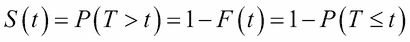

生存函数可以采取不同的形式。让我们通过每个分布的例子来了解生存函数之间的差异，以获得更清晰的图像。

**指数分布**：假设一个电子元件的寿命分布遵循指数分布，其速率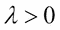。那么，其密度函数如下：

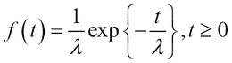

累积分布函数如下：

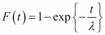

指数分布的均值和方差分别为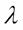和。指数分布的生存函数如下：

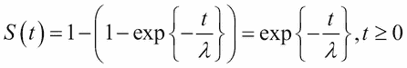

指数分布的均值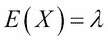。指数分布由单个参数驱动，并且它还享有一种优雅的性质，称为无记忆性质（参见第六章，Tattar 等人，2016 年）。

**伽马分布**：如果寿命随机变量的概率密度函数 `f` 具有以下形式，我们说其遵循速率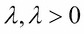和形状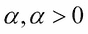的伽马分布：

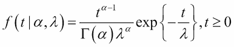

均值和方差分别为 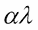 和 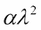。累积分布函数的闭式形式，因此生存函数也不存在。

**威布尔分布**：如果一个寿命随机变量遵循具有率  和形状 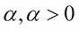 的威布尔分布，那么其概率密度函数 `f` 的形式如下：

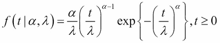

威布尔分布的累积分布函数如下所示：

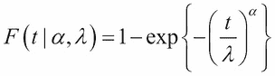

生存函数如下：

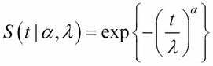

接下来，我们将定义风险率的概念，它也被称为瞬时故障率。

用 *T* 表示寿命随机变量，用 *F* 表示相关的累积分布函数，那么在时间 `t` 的风险率定义为以下：

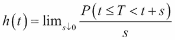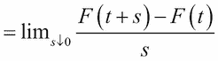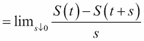

估计风险率的问题与密度函数的问题一样困难，因此累积函数的概念将是有用的。

用 *T* 表示寿命随机变量，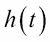 表示相关风险率，那么累积风险函数的定义如下：

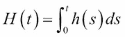

这三个量之间存在以下关系：

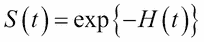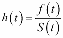

期望值与生存函数的关系如下：

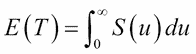

在下一个 R 程序中，我们将可视化三个概率分布的三个生存量。首先，我们将使用`par`和`mfrow`函数设置九个图的图形设备。程序以指数分布为例进行解释。考虑时间区间 0-100，并在程序中创建一个名为`Time`的数值对象。我们将从使用`dexp`函数计算`Time`对象的密度函数值开始。这意味着`dexp(Time)`将为 0-100 之间的每个点计算密度函数*f(t)*的值。由于生存函数与累积分布函数通过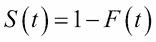相关联，而`pexp`给出了时间点*t*处的*F*值，因此指数分布的生存函数计算为*1-pexp()*。危险率、密度函数和生存函数通过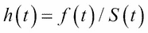相关联，并且可以轻松获得。通过使用生存函数的值和以下关系，可以获得累积危险函数：

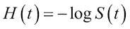

程序随后将重复用于伽马分布和威布尔分布，并对适当的参数进行更改，如下面的代码所示：

```py
> par(mfrow=c(3,3))
> Time <- seq(0,100,1)
> lambda <- 1/20
> expdens <- dexp(Time,rate=lambda)
> expsurv <- 1-pexp(Time,rate=lambda)
> exphaz <- expdens/expsurv
> expcumhaz <- -log(expsurv)
> plot(Time,exphaz,"l",xlab="Time",ylab="Hazard Rate",ylim=c(0,0.1))
> plot(Time,expcumhaz,"l",xlab="Time",ylab="Cumulative Hazard Function")
> mtext("Exponential Distribution")
> plot(Time,expsurv,"l",xlab="Time",ylab="Survival Function")
> 
> # Gamma Distribution
> lambda <- 1/10; k <- 2
> gammadens <- dgamma(Time,rate=lambda,shape=k)
> gammasurv <- 1-pgamma(Time,rate=lambda,shape=k)
> gammahaz <- gammadens/gammasurv
> gammacumhaz <- -log(gammasurv)
> plot(Time,gammahaz,"l",xlab="Time",ylab="Hazard Rate")
> plot(Time,gammacumhaz,"l",xlab="Time",ylab="Cumulative Hazard Function")
> mtext("Gamma Distribution")
> plot(Time,gammasurv,"l",xlab="Time",ylab="Survival Function")
> 
> # Weibull Distribution
> lambda <- 25; k <- 2
> Weibulldens <- dweibull(Time,scale=lambda,shape=k)
> Weibullsurv <- 1-pweibull(Time,scale=lambda,shape=k)
> Weibullhaz <- Weibulldens/Weibullsurv
> Weibullcumhaz <- -log(Weibullsurv)
> plot(Time,Weibullhaz,"l",xlab="Time",ylab="Hazard Rate")
> plot(Time,Weibullcumhaz,"l",xlab="Time",ylab="Cumulative Hazard Function")
> mtext("Weibull Distribution")
> plot(Time,Weibullsurv,"l",xlab="Time",ylab="Survival Function")
```

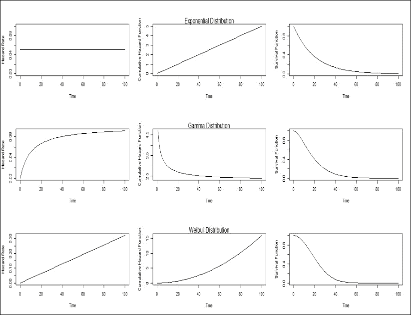

图 1：指数、伽马和威布尔分布的危脸率、累积危脸函数和生存函数

重复前面的程序，使用不同的参数值，并为危险函数、累积危险函数和生存函数的变化准备观察总结。分别总结指数、伽马和威布尔分布的观察结果。

现在，我们需要查看模型与`pbc`数据集的拟合程度。在这里，我们将指数、伽马和威布尔分布拟合到`pbc`数据集中感兴趣的生命周期。请注意，由于我们有截尾数据，不能简单地丢弃不完整的观察值，因为 418 个中有 257 个是不完整的观察值。虽然我们不能深入探讨生存数据的最大似然估计的数学原理，但在此处重要的是要注意，完整观察对似然函数的贡献是*f(t)*，如果它是不完整/截尾的，则是*S(t)*。因此，对于软件来说，知道哪个观察值是完整的，哪个是不完整的非常重要。在这里，我们将使用`survival`包中的`Surv`函数来指定这一点，然后使用`flexsurv`包中的`flexsurvreg`函数来拟合适当的生命周期分布。`dist`选项有助于设置适当的分布，如下面的程序所示：

```py
> pbc <- survival::pbc
> Surv(pbc$time,pbc$status==2)
  [1]  400  4500+ 1012  1925  1504+ 2503  1832+ 2466  2400    51  3762 
 [12]  304  3577+ 1217  3584  3672+  769   131  4232+ 1356  3445+  673  

 [397] 1328+ 1375+ 1260+ 1223+  935   943+ 1141+ 1092+ 1150+  703  1129+
[408] 1086+ 1067+ 1072+ 1119+ 1097+  989+  681  1103+ 1055+  691+  976+
> pbc_exp <- flexsurvreg(Surv(time,status==2)~1,data=pbc,dist="exponential")
> pbc_exp
Call:
flexsurvreg(formula = Surv(time, status == 2) ~ 1, data = pbc, 
    dist = "exponential")

Estimates: 
      est       L95%      U95%      se      
rate  2.01e-04  1.72e-04  2.34e-04  1.58e-05

N = 418,  Events: 161,  Censored: 257
Total time at risk: 801633
Log-likelihood = -1531.593, df = 1
AIC = 3065.187

> windows(height=100,width=100)
> plot(pbc_exp,ylim=c(0,1),col="black")
> pbc_gamma <- flexsurvreg(Surv(time,status==2)~1,data=pbc,dist="gamma")
> pbc_gamma
Call:
flexsurvreg(formula = Surv(time, status == 2) ~ 1, data = pbc, 
    dist = "gamma")

Estimates: 
       est       L95%      U95%      se      
shape  1.10e+00  9.21e-01  1.30e+00  9.68e-02
rate   2.33e-04  1.70e-04  3.21e-04  3.78e-05

N = 418,  Events: 161,  Censored: 257
Total time at risk: 801633
Log-likelihood = -1531.074, df = 2
AIC = 3066.147

> plot(pbc_gamma,col="blue",add=TRUE)
> pbc_Weibull <- flexsurvreg(Surv(time,status==2)~1,data=pbc,dist="weibull")
> pbc_Weibull
Call:
flexsurvreg(formula = Surv(time, status == 2) ~ 1, data = pbc, 
    dist = "weibull")

Estimates: 
       est       L95%      U95%      se      
shape  1.08e+00  9.42e-01  1.24e+00  7.48e-02
scale  4.71e+03  3.96e+03  5.59e+03  4.13e+02

N = 418,  Events: 161,  Censored: 257
Total time at risk: 801633
Log-likelihood = -1531.017, df = 2
AIC = 3066.035

> plot(pbc_Weibull,col="orange",add=TRUE)
> legend(3000,1,c("Exponential","Gamma","Weibull"),
+        col=c("black","blue","orange"),merge=TRUE,lty=2)
```

结果图如下所示：

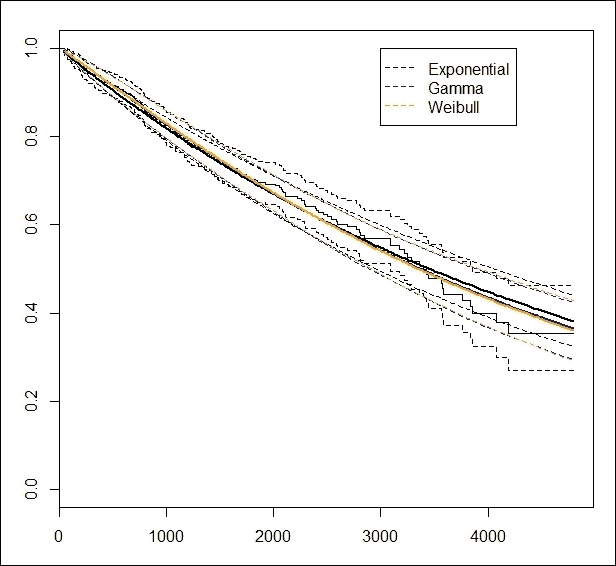

图 2：对截尾数据进行指数、伽马和威布尔分布的拟合

拟合的指数模型的 AIC 值是 3065.187，拟合的伽马模型的 AIC 值是 3066.147，而韦伯尔分布的 AIC 值是 3066.035。标准越低越好。因此，根据 AIC 标准，指数模型是最好的拟合。然后是韦伯尔分布和伽马分布。在这里，单参数的指数分布比更复杂的伽马和韦伯尔模型拟合得更好。

现在需要对 R 程序进行一些解释。`pbc`数据集通过`survival::pbc`加载，因为 R 包`randomForestSRC`也有一个同名数据集，它是稍有不同的版本。因此，`survival::pbc`代码确保我们继续加载`pbc`数据集，就像我们在早期实例中所做的那样。对我们来说，感兴趣的事件由`status==2`和`Surv(pbc$time,pbc$status==2)`指示，它创建了一个包含在数值对象中的完整观察值的生存对象。如果`status`不是`2`，则观察值是删失的，这由跟在`+`号后面的数字表示。`Surv(time,status==2)~1`代码创建必要的公式，这对于应用生存函数很有用。`dist="exponential"`选项确保在生存数据上拟合指数分布。当在控制台上运行拟合模型`pbc_exp`时，我们得到拟合模型的摘要，并返回模型参数的估计值、95%置信区间和参数估计的标准误差。我们还得到完整和删失观察值的数量、所有患者的总风险时间、似然函数值和 AIC。注意三个拟合分布的自由度是如何变化的。

这里详细描述的参数模型给出了生存概念的一个概念。当我们没有足够的证据来构建一个参数模型时，我们求助于非参数和半参数模型来进行统计推断。在下一节中，我们将继续分析`pbc`数据。

# 非参数推断

生存数据会受到删失的影响，我们需要引入一个新的量来捕捉这个信息。假设我们有一个来自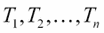的独立同分布的寿命随机变量的*n*样本，并且我们知道感兴趣的事件可能已经发生，或者它将在未来的某个时间发生。通过克罗内克指示变量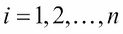捕捉了额外的信息：

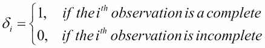

因此，我们在 *Ts* 和 s，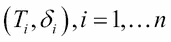 中有 n 对随机观测值。为了获得累积风险函数和生存函数的估计值，我们需要额外的符号。让  表示 Ts 中事件发生时的唯一时间点。接下来，我们用 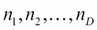 表示在时间 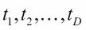 和 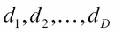 之前处于风险中的观测值数量，而  表示在该时间发生的事件数量。使用这些量，我们现在提出使用以下方法来估计累积风险函数：

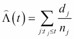

估计量 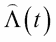 是著名的 Nelson-Aalen 估计量。Nelson-Aalen 估计量具有统计性质，包括（i）它是累积风险函数的非参数最大似然估计量，以及（ii）它遵循渐近正态分布。生存函数的估计量如下：

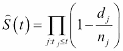

估计量 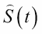 是著名的 Kaplan-Meier 估计量。通过应用函数-Δ定理，Nelson-Aalen 估计量的性质被传递到 Kaplan-Meier 估计量。需要注意的是，Kaplan-Meier 估计量再次是非参数最大似然估计量，并且渐近地遵循正态分布。我们现在将探讨如何使用 R 软件获取给定数据集的估计值。

我们已经使用 `Surv(pbc$time, pbc$status==2)` 代码创建了生存对象。现在，在生存对象上应用 `survfit` 函数，我们在 `pbc_sf survfit` 对象中设置了 Kaplan-Meier 估计器：

```py
> pbc_sf <- survfit(Surv(time,status==2)~1,pbc)
> pbc_sf
Call: survfit(formula = Surv(time, status == 2) ~ 1, data = pbc)
      n  events  median 0.95LCL 0.95UCL 
    418     161    3395    3090    3853 
```

输出结果显示我们共有 `418` 个观测值。其中，`161` 个经历了感兴趣的事件。我们希望获取不同时间点的生存函数。中位生存时间为 `3395`，该点估计值的置信区间为 `3090` 至 `3853`。然而，如果你找到整体时间的平均值，完整观测值的平均时间，以及截尾观测值的平均时间，这些值都不会接近显示的 `3395` 值。一段快速代码显示了以下结果：

```py
> median(pbc$time)
[1] 1730
> median(pbc$time[pbc$status==2])
[1] 1083
> median(pbc$time[pbc$status!=2])
[1] 2157
```

你可能会问自己，为什么估计的中位生存时间与这些中位数之间有如此大的差异？答案很快就会变得清晰。

我们将使用 `summary` 函数来获取这个答案。对于观察到的十个时间分位数，包括截尾时间，我们将获得 Kaplan-Meier 估计值及其相关的 95% 置信区间，该置信区间基于方差估计，而方差估计又基于 Greenwood 公式：

```py
> summary(pbc_sf,times=as.numeric(quantile(pbc$time,seq(0,1,0.1))))
Call: survfit(formula = Surv(time, status == 2) ~ 1, data = pbc)

 time n.risk n.event survival std.err lower 95% CI upper 95% CI
   41    418       2    0.995 0.00338        0.989        1.000
  607    376      39    0.902 0.01455        0.874        0.931
  975    334      31    0.827 0.01860        0.791        0.864
 1218    292      19    0.778 0.02061        0.738        0.819
 1435    251       8    0.755 0.02155        0.714        0.798
 1730    209      13    0.713 0.02323        0.669        0.760
 2107    167      12    0.668 0.02514        0.621        0.719
 2465    126       9    0.628 0.02702        0.577        0.683
 2852     84      10    0.569 0.03032        0.512        0.632
 3524     42      10    0.478 0.03680        0.411        0.556
 4795      1       8    0.353 0.04876        0.270        0.463
```

我们现在已经得到了每个十分位时间点的 Kaplan-Meier 估计值、每个点的标准误差和置信区间。使用`plot`函数，我们现在将可视化`pbc`数据集的拟合 Kaplan-Meier 估计值：

```py
> plot(pbc_sf,xlab="Time",ylab="Survival Function Confidence Bands")
```

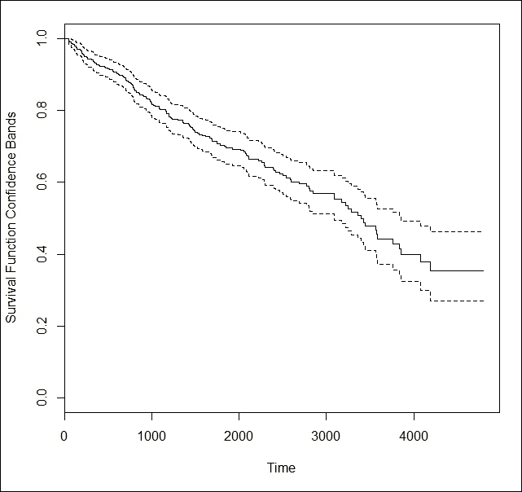

图 3：PBC 数据集的 Kaplan-Meier 估计值

现在，如果你观察生存时间接近 0.5 的时间点，中位生存时间 3395 的早期答案就足够清晰了。接下来，我们来看累积风险函数。

要获得累积风险函数，我们将对生存对象应用`coxph`函数，并使用`basehaz`函数获取基线累积风险函数，如下面的代码所示：

```py
> pbc_na <- basehaz(coxph(Surv(time,status==2)~1,pbc))
> pbc_na
         hazard time
1   0.004790426   41
2   0.007194272   43
3   0.009603911   51
4   0.012019370   71

396 1.030767970 4509
397 1.030767970 4523
398 1.030767970 4556
399 1.030767970 4795
```

我们将使用以下代码创建 Nelson-Aalen 估计值的可视化表示：

```py
> plot(pbc_na$time,pbc_na$hazard,"l",xlab="Time",ylab="Cumulative Hazard Function")
```

下面的图表说明了 Nelson-Aalen 估计值：

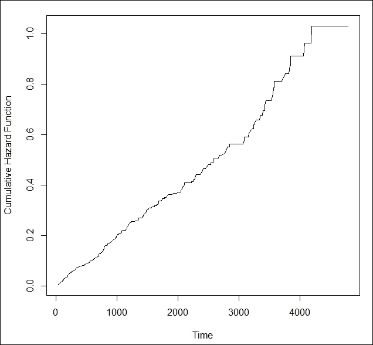

图 4：累积风险函数的 Nelson-Aalen 估计值

注意，有人可能会倾向于使用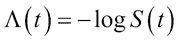关系来获得 Kaplan-Meier 估计值，或者反之亦然。让我们使用以下代码来检查一下：

```py
> str(exp(-pbc_na$hazard))
 num [1:399] 0.995 0.993 0.99 0.988 0.986 ...
> str(summary(pbc_sf,times=pbc_na$time)$surv)
 num [1:399] 0.995 0.993 0.99 0.988 0.986 ...
```

这里似乎一切正常，所以让我们全面检查一下：

```py
> round(exp(-pbc_na$hazard),4)==round(summary(pbc_sf,
+ times=pbc_na$time)$surv,4)
  [1]  TRUE  TRUE  TRUE FALSE FALSE  TRUE  TRUE  TRUE  TRUE  TRUE  TRUE
 [12]  TRUE  TRUE FALSE FALSE FALSE FALSE FALSE  TRUE  TRUE  TRUE FALSE
 [23] FALSE FALSE FALSE FALSE FALSE FALSE FALSE FALSE  TRUE FALSE FALSE
 [34] FALSE FALSE FALSE FALSE FALSE FALSE FALSE FALSE FALSE FALSE FALSE

[375] FALSE FALSE FALSE FALSE FALSE FALSE FALSE FALSE FALSE FALSE FALSE
[386] FALSE FALSE FALSE FALSE FALSE FALSE FALSE FALSE FALSE FALSE FALSE
[397] FALSE FALSE FALSE
```

经过一段时间后，估计值会有很大差异，因此我们分别计算这两个量。接下来，我们将探讨如何进行统计检验以比较生存曲线的相等性。

如前所述，我们将公式输入到`survfit`函数中。它出现在`Surv`公式中的额外指定`'~1'`。由于公式对于生存数据的进一步分析至关重要，我们现在可以很好地利用这个框架。如果我们用 1 替换为一个分类变量，如性别，那么我们将为分类变量的每个水平获得生存曲线。对于`pbc`数据，我们将绘制生存曲线。分别对男性和女性的 Kaplan-Meier 估计值进行绘图。

```py
>plot(survfit(Surv(time,status==2)~sex,pbc),conf.int=TRUE,xlab="Time",+      ylab="Survival Probability", col=c("red","blue"))
```

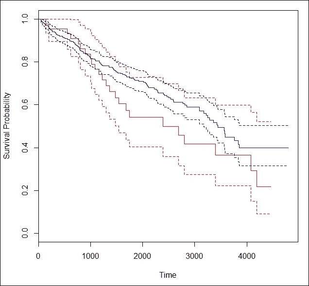

图 5：PBC 数据的性别生存曲线比较

生存曲线（用蓝色和红色连续线表示）清楚地显示了差异，我们需要评估观察到的差异是否具有统计学意义。为此，我们应用`survdiff`函数并检查差异是否显著，如下面的代码所示：

```py
> survdiff(Surv(time,status==2)~sex,pbc)
Call:
survdiff(formula = Surv(time, status == 2) ~ sex, data = pbc)

        N Observed Expected (O-E)²/E (O-E)²/V
sex=m  44       24     17.3     2.640      2.98
sex=f 374      137    143.7     0.317      2.98
 Chisq= 3  on 1 degrees of freedom, p= 0.0845 
```

p 值为`0.0845`，因此如果选择的显著性水平是 95%，我们得出结论，差异不显著。

读者注意：显著性水平是预先确定的。如果你在进行分析之前将其固定在 95%，然后查看 p 值发现它在 0.05 和 0.10 之间，不要改变水平。坚持之前达成的协议。

在到目前为止的分析中，我们考虑了参数和非参数方法，现在我们需要开发一个更大的框架。需要明确评估协变量的影响，我们将在下一节探讨这个主题。

# 回归模型 – 参数和 Cox 比例风险模型

你可能还记得，生存数据包括完整的以及截尾的观测值，我们看到了对于 `pbc` 数据集，寿命看起来像是 400，4500+，1012，1925，1504+，……。尽管寿命是连续的随机变量，但形式为 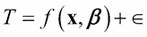 的回归模型在这里并不合适。事实上，在 20 世纪 70 年代，有许多尝试修正和改进这种形式的模型，而且结果往往是有害的。我们将一个通用的**风险回归模型**定义为以下形式：

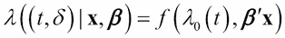

在这里，*t* 是寿命，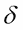 是寿命指标， 是协变量向量， 是回归系数向量，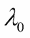 是基线风险率。一个特别感兴趣的相对风险模型如下：

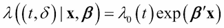

我们将专注于这一类模型。首先，考虑参数风险回归。这意味着我们将通过参数模型指定风险率 ，例如，通过指数分布。但这意味着什么呢？这意味着基线风险函数具有以下形式：

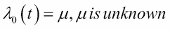

因此，风险回归模型如下：


然后估计问题就是找到  和 。`flexsurv` 包中的 R 函数 `survreg` 将有助于拟合参数风险回归模型。它将在 `pbc` 数据集上展示连续性。`survival` 公式将被扩展以包括模型中的所有协变量，如下面的代码所示：

```py
> pbc_Exp <- survreg(Surv(time,status==2)~trt + age + sex + ascites 
+                      hepato + spiders + edema + bili + chol + albumin
+                      copper + alk.phos + ast + trig + platelet + 
+                      protime + stage,
+                    dist="exponential", pbc)
> pbc_Exp_summary <- summary(pbc_Exp)
> pbc_Exp_summary
Call:
survreg(formula = Surv(time, status == 2) ~ trt + age + sex + 
    ascites + hepato + spiders + edema + bili + chol + albumin + 
    copper + alk.phos + ast + trig + platelet + protime + stage, 
    data = pbc, dist = "exponential")
                Value Std. Error      z        p
(Intercept)  1.33e+01   1.90e+00  7.006 2.46e-12
trt          6.36e-02   2.08e-01  0.305 7.60e-01
age         -2.81e-02   1.13e-02 -2.486 1.29e-02
sexf         3.42e-01   3.00e-01  1.140 2.54e-01
ascites     -1.01e-01   3.70e-01 -0.273 7.85e-01
hepato      -7.76e-02   2.43e-01 -0.320 7.49e-01
spiders     -1.21e-01   2.36e-01 -0.513 6.08e-01
edema       -8.06e-01   3.78e-01 -2.130 3.32e-02
bili        -4.80e-02   2.49e-02 -1.929 5.37e-02
chol        -4.64e-04   4.35e-04 -1.067 2.86e-01
albumin      4.09e-01   2.87e-01  1.427 1.54e-01
copper      -1.63e-03   1.11e-03 -1.466 1.43e-01
alk.phos    -4.51e-05   3.81e-05 -1.182 2.37e-01
ast         -3.68e-03   1.92e-03 -1.917 5.52e-02
trig         1.70e-04   1.37e-03  0.124 9.01e-01
platelet    -2.02e-04   1.16e-03 -0.174 8.62e-01
protime     -2.53e-01   9.78e-02 -2.589 9.61e-03
stage       -3.66e-01   1.66e-01 -2.204 2.75e-02
Scale fixed at 1 

Exponential distribution
Loglik(model)= -984.1   Loglik(intercept only)= -1054.6
Chisq= 141.17 on 17 degrees of freedom, p= 0 
Number of Newton-Raphson Iterations: 5 
n=276 (142 observations deleted due to missingness)
```

在这里，迭代五次后收敛。p 值几乎等于零，这意味着拟合的模型是显著的。然而，并非所有与协变量相关的 p 值都表明显著性。我们将使用以下代码来查找：

```py
> round(pbc_Exp_summary$table[,4],4)
(Intercept)         trt         age        sexf     ascites      hepato 
     0.0000      0.7601      0.0129      0.2541      0.7846      0.7491 
    spiders       edema        bili        chol     albumin      copper 
     0.6083      0.0332      0.0537      0.2859      0.1536      0.1426 
   alk.phos         ast        trig    platelet     protime       stage 
     0.2372      0.0552      0.9010      0.8621      0.0096      0.0275
> AIC(pbc_exp)
[1] 3065.187
```

AIC 值也非常高，我们试图看看是否可以改进。因此，我们将`step`函数应用于拟合的指数风险回归模型，并消除不显著的协变量，如下面的代码所示：

```py
> pbc_Exp_eff <- step(pbc_Exp)
Start:  AIC=2004.12
Surv(time, status == 2) ~ trt + age + sex + ascites + hepato + 
    spiders + edema + bili + chol + albumin + copper + alk.phos + 
    ast + trig + platelet + protime + stage

           Df    AIC
- ascites   1 2002.2
- trt       1 2002.2
- hepato    1 2002.2
- spiders   1 2002.4
- chol      1 2003.2
- sex       1 2003.4
- alk.phos  1 2003.4
- albumin   1 2004.1
<none>        2004.1
- ast       1 2005.5
- bili      1 2005.5
- edema     1 2006.5
- stage     1 2007.2
- protime   1 2008.0
- age       1 2008.3
- trig      1 2020.4
- copper    1 2020.7
- platelet  1 2021.8

Step:  AIC=2002.19
Surv(time, status == 2) ~ trt + age + sex + hepato + spiders + 
    edema + bili + chol + albumin + copper + alk.phos + ast + 
    trig + platelet + protime + stage

Step:  AIC=1994.61
Surv(time, status == 2) ~ age + edema + bili + albumin + copper + 
    ast + trig + platelet + protime + stage

           Df    AIC
<none>        1994.6
- albumin   1 1995.5
- edema     1 1996.3
- ast       1 1996.9
- bili      1 1998.8
- protime   1 1999.2
- stage     1 1999.7
- age       1 2000.9
- platelet  1 2012.1
- copper    1 2014.9
- trig      1 2198.7
There were 50 or more warnings (use warnings() to see the first 50)
> pbc_Exp_eff_summary <- summary(pbc_Exp_eff)
> round(pbc_Exp_eff_summary$table[,4],4)
(Intercept)         age       edema        bili     albumin      copper 
     0.0000      0.0037      0.0507      0.0077      0.0849      0.0170 
        ast        trig    platelet     protime       stage 
     0.0281      0.9489      0.7521      0.0055      0.0100 
> AIC(pbc_Exp_eff)
[1] 1994.607
```

我们在这里看到，当前模型中的所有协变量都是显著的，除了`trig`和`platelet`变量。AIC 值也急剧下降。

在生命科学中，参数模型通常不可接受。的灵活框架是著名的 Cox 比例风险模型。它是一个半参数回归模型，因为基线风险函数是完全未指定的。Cox（1972）提出了这个模型，这是统计学中最重要的模型之一。基线风险函数的唯一要求是它必须是非负的，并且与之相关的概率分布必须是*合适的*概率分布。在这个模型中，回归系数向量通过将基线风险函数视为一个干扰因素来估计。其推断基于部分似然函数的重要概念；有关完整细节，请参阅 Cox（1975）。在这里，我们只指定 Cox 比例风险模型的形式，并将感兴趣的读者指引到 Kalbfleisch 和 Prentice（2002）：


我们将使用`survival`包中的`coxph`函数来拟合比例风险回归模型。由于某些技术原因，我们必须从`pbc`数据集中省略所有包含缺失值的行，并且剩余步骤与指数风险回归模型的拟合平行：

```py
> pbc2 <- na.omit(pbc)
> pbc_coxph <- coxph(Surv(time,status==2)~trt + age + sex + ascites 
+                      hepato + spiders + edema + bili + chol + albumin 
+                      copper + alk.phos + ast + trig + platelet + 
+                      protime + stage,                   pbc2)
> pbc_coxph_summary <- summary(pbc_coxph)
> pbc_coxph_summary
Call:
coxph(formula = Surv(time, status == 2) ~ trt + age + sex + ascites + 
    hepato + spiders + edema + bili + chol + albumin + copper + 
    alk.phos + ast + trig + platelet + protime + stage, data = pbc2)

  n= 276, number of events= 111 

               coef  exp(coef)   se(coef)      z Pr(>|z|)   
trt      -1.242e-01  8.832e-01  2.147e-01 -0.579  0.56290   
age       2.890e-02  1.029e+00  1.164e-02  2.482  0.01305 * 
sexf     -3.656e-01  6.938e-01  3.113e-01 -1.174  0.24022   
ascites   8.833e-02  1.092e+00  3.872e-01  0.228  0.81955   
hepato    2.552e-02  1.026e+00  2.510e-01  0.102  0.91900   
spiders   1.012e-01  1.107e+00  2.435e-01  0.416  0.67760   
edema     1.011e+00  2.749e+00  3.941e-01  2.566  0.01029 * 
bili      8.001e-02  1.083e+00  2.550e-02  3.138  0.00170 **
chol      4.918e-04  1.000e+00  4.442e-04  1.107  0.26829   
albumin  -7.408e-01  4.767e-01  3.078e-01 -2.407  0.01608 * 
copper    2.490e-03  1.002e+00  1.170e-03  2.128  0.03337 * 
alk.phos  1.048e-06  1.000e+00  3.969e-05  0.026  0.97893   
ast       4.070e-03  1.004e+00  1.958e-03  2.078  0.03767 * 
trig     -9.758e-04  9.990e-01  1.333e-03 -0.732  0.46414   
platelet  9.019e-04  1.001e+00  1.184e-03  0.762  0.44629   
protime   2.324e-01  1.262e+00  1.061e-01  2.190  0.02850 * 
stage     4.545e-01  1.575e+00  1.754e-01  2.591  0.00958 ** ---
Signif. codes:  0 '***' 0.001 '**' 0.01 '*' 0.05 '.' 0.1 ' ' 1

         exp(coef) exp(-coef) lower .95 upper .95
trt         0.8832     1.1323    0.5798    1.3453
age         1.0293     0.9715    1.0061    1.0531
sexf        0.6938     1.4414    0.3769    1.2771
ascites     1.0924     0.9155    0.5114    2.3332
hepato      1.0259     0.9748    0.6273    1.6777
spiders     1.1066     0.9037    0.6865    1.7835
edema       2.7487     0.3638    1.2697    5.9505
bili        1.0833     0.9231    1.0305    1.1388
chol        1.0005     0.9995    0.9996    1.0014
albumin     0.4767     2.0977    0.2608    0.8714
copper      1.0025     0.9975    1.0002    1.0048
alk.phos    1.0000     1.0000    0.9999    1.0001
ast         1.0041     0.9959    1.0002    1.0079
trig        0.9990     1.0010    0.9964    1.0016
platelet    1.0009     0.9991    0.9986    1.0032
protime     1.2617     0.7926    1.0247    1.5534
stage       1.5754     0.6348    1.1170    2.2219

Concordance= 0.849  (se = 0.031 )
Rsquare= 0.455   (max possible= 0.981 )
Likelihood ratio test= 167.7  on 17 df,   p=0
Wald test            = 174.1  on 17 df,   p=0
Score (logrank) test = 283.7  on 17 df,   p=0

> round(pbc_coxph_summary$coefficients[,5],4)
     trt      age     sexf  ascites   hepato  spiders    edema     bili 
  0.5629   0.0131   0.2402   0.8195   0.9190   0.6776   0.0103   0.0017 
    chol  albumin   copper alk.phos      ast     trig platelet  protime 
  0.2683   0.0161   0.0334   0.9789   0.0377   0.4641   0.4463   0.0285 
   stage 
  0.0096
> AIC(pbc_coxph)
[1] 966.6642
```

由于我们发现许多变量不显著，我们将尝试通过使用`step`函数并计算改进的 AIC 值来改进它，如下面的代码所示：

```py
> pbc_coxph_eff <- step(pbc_coxph)
Start:  AIC=966.66
Surv(time, status == 2) ~ trt + age + sex + ascites + hepato + 
    spiders + edema + bili + chol + albumin + copper + alk.phos + 
    ast + trig + platelet + protime + stage
           Df    AIC
- alk.phos  1 964.66
- hepato    1 964.67
- ascites   1 964.72
- spiders   1 964.84
- trt       1 965.00
- trig      1 965.22
- platelet  1 965.24
- chol      1 965.82
- sex       1 965.99
<none>        966.66
- ast       1 968.69
- copper    1 968.85
- protime   1 968.99
- albumin   1 970.35
- age       1 970.84
- edema     1 971.00
- stage     1 971.83
- bili      1 973.34

Step:  AIC=952.58
Surv(time, status == 2) ~ age + edema + bili + albumin + copper + 
    ast + protime + stage

          Df    AIC
<none>       952.58
- protime  1 955.06
- ast      1 955.79
- edema    1 955.95
- albumin  1 957.27
- copper   1 958.18
- age      1 959.97
- stage    1 960.11
- bili     1 966.57
> pbc_coxph_eff_summary <- summary(pbc_coxph_eff)
> pbc_coxph_eff_summary
Call:
coxph(formula = Surv(time, status == 2) ~ age + edema + bili + 
    albumin + copper + ast + protime + stage, data = pbc2)
  n= 276, number of events= 111 
              coef  exp(coef)   se(coef)      z Pr(>|z|)    
age      0.0313836  1.0318812  0.0102036  3.076  0.00210 ** 
edema    0.8217952  2.2745795  0.3471465  2.367  0.01792 *  
bili     0.0851214  1.0888492  0.0193352  4.402 1.07e-05 ***
albumin -0.7185954  0.4874364  0.2724486 -2.638  0.00835 ** 
copper   0.0028535  1.0028576  0.0009832  2.902  0.00370 ** 
ast      0.0043769  1.0043865  0.0018067  2.423  0.01541 *  
protime  0.2275175  1.2554794  0.1013729  2.244  0.02481 *  
stage    0.4327939  1.5415584  0.1456307  2.972  0.00296 ** 
---
Signif. codes:  0 '***' 0.001 '**' 0.01 '*' 0.05 '.' 0.1 ' ' 1

        exp(coef) exp(-coef) lower .95 upper .95
age        1.0319     0.9691    1.0114    1.0527
edema      2.2746     0.4396    1.1519    4.4915
bili       1.0888     0.9184    1.0484    1.1309
albumin    0.4874     2.0515    0.2858    0.8314
copper     1.0029     0.9972    1.0009    1.0048
ast        1.0044     0.9956    1.0008    1.0079
protime    1.2555     0.7965    1.0292    1.5314
stage      1.5416     0.6487    1.1588    2.0508

Concordance= 0.845  (se = 0.031 )
Rsquare= 0.448   (max possible= 0.981 )
Likelihood ratio test= 163.8  on 8 df,   p=0
Wald test            = 176.1  on 8 df,   p=0
Score (logrank) test = 257.5  on 8 df,   p=0
> round(pbc_coxph_eff_summary$coefficients[,5],4)
    age   edema    bili albumin  copper     ast protime   stage 
 0.0021  0.0179  0.0000  0.0084  0.0037  0.0154  0.0248  0.0030 
> AIC(pbc_coxph_eff)
[1] 952.5814
```

我们现在可以看到，`pbc_coxph_eff`模型中的几乎所有变量都是显著的。AIC 值也与其早期值相比有所下降。

在大多数生存数据分析中，目的是找到有效的协变量及其对风险率的影响。在生存数据的情况下，不存在像 AUC 这样的分类问题准确度度量。在类似（尽管重要）的方面，对于给定协变量选择的寿命预测可能不再重要。在第二章中，我们探讨了伪值方法和 Jackknife 方法的应用，这些方法提供了易于解释的便利。在下一节中，我们将探讨不同的方法。

# 生存树

参数风险回归模型有时被从业者视为一种限制性模型类别，Cox 比例风险回归有时比其参数对应物更受欢迎。与参数模型相比，解释有时会丢失，常规从业者发现很难与风险回归模型联系起来。当然，一个替代方案是在伪观察值上构建生存树。这种尝试可以在 Tattar（2016）未发表的论文中看到。Gordon 和 Olshen（1985）首次尝试构建生存树，许多科学家继续构建它。LeBlanc 和 Crowley（1992）是建立生存树的重要贡献者之一。Zhang 和 Singer（2010）也对相关方法进行了系统发展，他们书中第 7-10 章讨论了生存树。基本前提保持不变，我们需要好的分割标准来创建生存树。

LeBlanc 和 Crowley 提出了基于饱和模型对数似然与最大对数似然之间的节点偏差度量的分割标准，然后通过用 Nelson-Aalen 估计器估计的基线累积风险函数替换，来近似未知的完整似然。正如 Hamad 等人（2011）所建议的，请注意，这种方法的优势在于任何能够执行泊松树实现的软件都能够创建生存树。这种方法在 Therneau 和 Atkinson（2017）创建的`rpart`R 包中被利用。生存树的终端节点可以通过属于该节点的观察值的 Kaplan-Meier 生存函数来总结。

我们现在将使用`rpart`库为`pbc`数据集设置生存树：

```py
> pbc_stree <- rpart(Surv(time,status==2)~trt + age + sex + ascites + 
+                      hepato + spiders + edema + bili + chol + albumin + 
+                      copper + alk.phos + ast + trig + platelet + 
+                      protime + stage,
+                    pbc)
> pbc_stree
n= 418 

node), split, n, deviance, yval
      * denotes terminal node

 1) root 418 555.680700 1.0000000  
   2) bili< 2.25 269 232.626500 0.4872828  
     4) age< 51.24162 133  76.376990 0.2395736  
       8) alk.phos< 1776 103  30.340440 0.1036750 *
       9) alk.phos>=1776 30  33.092480 0.6135695 *
     5) age>=51.24162 136 136.800300 0.7744285  
      10) protime< 10.85 98  80.889260 0.5121123 *
      11) protime>=10.85 38  43.381670 1.4335430  
        22) age< 65.38125 26  24.045820 0.9480269  
          44) bili< 0.75 8   5.188547 0.3149747 *
          45) bili>=0.75 18  12.549130 1.3803650 *
        23) age>=65.38125 12   8.392462 3.2681510 *
   3) bili>=2.25 149 206.521900 2.6972690  
     6) protime< 11.25 94  98.798830 1.7717830  
      12) stage< 3.5 57  56.734150 1.2620350  
        24) age< 43.5332 25  16.656000 0.6044998 *
        25) age>=43.5332 32  32.986760 1.7985470 *
      13) stage>=3.5 37  32.946240 2.8313470 *
     7) protime>=11.25 55  76.597760 5.1836880  
      14) ascites< 0.5 41  52.276360 4.1601690  
        28) age< 42.68172 7   6.829564 1.4344660 *
        29) age>=42.68172 34  37.566600 5.1138380 *
      15) ascites>=0.5 14  17.013010 7.9062910 *
```

通过在控制台运行`pbc_stree`，显示生存树的文本表示。节点`yval`末尾的星号（`*`）表示删失。

我们现在将查看与生存树相关的`cptable`和变量重要性，如下程序所示：

```py
> pbc_stree$cptable
           CP nsplit rel error    xerror       xstd
1  0.20971086      0 1.0000000 1.0026398 0.04761402
2  0.05601298      1 0.7902891 0.8179390 0.04469359
3  0.03500063      2 0.7342762 0.8198147 0.04731189
4  0.02329408      3 0.6992755 0.8247148 0.04876085
5  0.02254786      4 0.6759815 0.8325230 0.05132829
6  0.01969366      5 0.6534336 0.8363125 0.05160507
7  0.01640950      6 0.6337399 0.8373375 0.05268262
8  0.01366665      7 0.6173304 0.8336743 0.05406099
9  0.01276163      9 0.5899971 0.8209714 0.05587843
10 0.01135209     10 0.5772355 0.8248827 0.05612403
11 0.01000000     11 0.5658834 0.8255873 0.05599763
> pbc_stree$variable.importance
      bili    protime        age    albumin      edema      stage 
138.007841  70.867308  54.548224  32.239919  25.576170  15.231256 
   ascites   alk.phos   platelet        sex     copper        ast 
 14.094208  13.440866  10.017966   2.452776   2.114888   1.691910 
```

变量重要性显示，`bili`变量是最重要的，其次是`protime`和`age`。我们用以下代码的视觉表示来结束本节：

```py
> windows(height=100,width=60)
> plot(pbc_stree,uniform = TRUE)
> text(pbc_stree,use.n=TRUE)
```


图 6：PBC 数据集的生存树

就像单个树模型中存在的过拟合问题一样，我们需要考虑生存树集成的重要替代方法。

# 集成生存模型

随机森林包`randomForestSRC`将继续用于创建与生存数据相关的随机森林。实际上，包名中的`SRC`的`S`代表生存！`rfsrc`函数的使用方法与前面章节相同，现在我们将提供一个`Surv`对象，如下面的代码所示：

```py
> pbc_rf <- rfsrc(Surv(time,status==2)~trt + age + sex + ascites + 
+                 hepato + spiders + edema + bili + chol + albumin+
+                 copper + alk.phos + ast +trig + platelet + protime+
+                 stage, ntree=500, tree.err = TRUE, pbc)
```

我们将找到设置此随机森林的一些基本设置：

```py
> pbc_rf$splitrule
[1] "logrankCR"
> pbc_rf$nodesize
[1] 6
> pbc_rf$mtry
[1] 5
```

因此，分裂标准基于 log-rank 检验，终端节点中的最小观测数是六个，每个分裂考虑的变量数是五个。

接下来，我们将找到两个事件的变量重要性，并应用我们在前面章节中使用的`var.select`函数。然后，我们将展示迭代运行的一部分，如下面的代码所示：

```py
> vimp(pbc_rf)$importance
               event.1      event.2
trt       0.0013257796 0.0002109143
age       0.0348848966 0.0166352983
sex       0.0007755091 0.0004011303
ascites   0.0008513276 0.0107212361
hepato    0.0050666763 0.0015445001
spiders  -0.0001136547 0.0003552415
edema     0.0006227470 0.0147982184
bili      0.0696654202 0.0709713627
chol      0.0002483833 0.0107024051
albumin  -0.0106392917 0.0115188264
copper    0.0185417386 0.0255099568
alk.phos  0.0041407841 0.0022297323
ast       0.0029317937 0.0063469825
trig     -0.0040190463 0.0014371745
platelet  0.0021021396 0.0002388797
protime   0.0057968358 0.0133710339
stage    -0.0023944666 0.0042808034
> var.select(pbc_rf, method = "vh.vimp", nrep = 50)
---------------------  Iteration: 1   ---------------------
 selecting variables using Variable Hunting (VIMP) ...
 PE: 38.8889      dim: 2                                        
---------------------  Iteration: 2   ---------------------
 selecting variables using Variable Hunting (VIMP) ...
 PE: 23.6842      dim: 2                                        
---------------------  Iteration: 3   ---------------------
 selecting variables using Variable Hunting (VIMP) ...
 PE: 50.6667      dim: 1                                  

---------------------  Iteration: 48   ---------------------
 selecting variables using Variable Hunting (VIMP) ...
 PE: 38.3562      dim: 2                                        
---------------------  Iteration: 49   ---------------------
 selecting variables using Variable Hunting (VIMP) ...
 PE: 19.4737      dim: 2                                        
---------------------  Iteration: 50   ---------------------
 selecting variables using Variable Hunting (VIMP) ...
 PE: 55.914      dim: 2                                         
fitting forests to final selected variables ...

-----------------------------------------------------------
family             : surv-CR 
var. selection     : Variable Hunting (VIMP) 
conservativeness   : medium 
dimension          : 17 
sample size        : 276 
K-fold             : 5 
no. reps           : 50 
nstep              : 1 
ntree              : 500 
nsplit             : 10 
mvars              : 4 
nodesize           : 2 
refitted forest    : TRUE 
model size         : 2.16 +/- 0.6809 
PE (K-fold)        : 43.3402 +/- 17.7472 

Top variables:
       rel.freq
bili         28
hepato       24
ast          24
-----------------------------------------------------------
```

接下来，随着树的数量增加，错误率图将使用以下代码进行展示：

```py
> plot(pbc_rf,plots.one.page = TRUE)
```


图 7：两个事件的随机森林错误率

因此，我们现在已经看到了生存数据的随机森林构建和设置。

# 摘要

生存数据与典型的回归数据不同，不完整的观测值构成了挑战。由于数据结构完全不同，我们需要专门的技巧来处理不完整的观测值，为此，我们介绍了核心生存概念，如风险率和生存函数。然后，我们介绍了参数生存模型，这让我们对寿命分布的形状有一个大致的了解。我们甚至将这些寿命分布拟合到 pbc 数据集中。

我们还了解到参数设置可能非常严格，因此考虑了生存量估计的非参数方法。我们还展示了 Nelson-Aalen 估计量、Kaplan-Meier 生存函数和对数秩检验的实用性。参数风险回归模型以 Cox 比例风险回归模型为支持，并应用于 pbc 数据集。logrank 检验也可以帮助确定分裂标准，它也被视为随机森林的标准。生存树在前面章节中已展示。

在下一章中，我们将探讨另一种数据结构：时间序列数据。读者不需要熟悉时间序列分析，就可以理解其中应用的集成方法。
