# 第十一章. 时间序列模型的集成

本书迄今为止开发的模型都处理了观测值相互独立的情况。海外游客的例子解释了一个时间序列，其中观测值依赖于先前观测到的数据。在简要讨论这个例子时，我们确定有必要开发时间序列模型。由于时间序列具有序列性质，时间戳可能以纳秒、秒、分钟、小时、天或月为单位显示。

本章将首先简要回顾时间序列自相关和偏自相关函数的重要概念，以及拟合模型评估指标。与分类和回归模型类似，有许多方法可用于分析时间序列数据。季节分解中的时间序列模型的一个重要类别包括 LOESS（STL）、指数平滑状态空间模型（ets）、Box-Jenkins（ARIMA）模型和自回归神经网络模型。这些将在下一节中进行讨论和说明。本章的最后部分将展示时间序列模型的集成。

本章将涵盖以下主要内容：

+   时间序列数据集

+   时间序列可视化

+   核心概念

+   时间序列模型

+   时间序列的 Bagging

+   集成时间序列模型

# 技术要求

在本章中，我们将使用以下 R 库：

+   `forecast`

+   `forecastHybrid`

# 时间序列数据集

时间序列数据在结构上与之前讨论的数据不同。在第一章的*海外游客*部分 1 中，以及[第一章](https://wiki.example.org/feynmans_learning_method)的*集成技术简介*中，我们看到了时间序列数据的一瞥。在第二章的*重抽样*中，时间序列模型的重抽样被简要提及。分析时间序列数据时产生的复杂性在于，观测值不是独立的，因此我们需要指定依赖关系。Box 等人（2015 年）的《时间序列统计分析基准书》首次于 1970 年出版。Box 和 Jenkins 发明并普及的模型类别是流行的自回归积分移动平均，通常缩写为 ARIMA。这也常被称为 Box-Jenkins 模型。

*表 1*总结了二十一个时间序列数据集。长度列给出了序列的观测值/数据点的数量，而频率列给出了时间序列的周期性，其余六列是通过对数值对象应用汇总函数得到的总结。第一列，当然，给出了数据集在 R 中的名称，因此我们没有改变大小写。数据集中的观测值数量从 19 到 7980 不等。

但频率或周期性究竟是什么意思呢？在一个包含周期性的数据集中，相关的时间索引会被重复。例如，我们可能会有年度、季度、月度或周度数据，因此，在后两种情况下，频率将分别是**4**和**12**。频率不一定是整数，也可以是分数值。例如，致癌性测试将具有纳秒值。时间序列数据的总结就是将汇总函数应用于数值数据集的结果。因此，我们隐含地假设时间序列数据是数值的。总结中看到的变异也表明，不同的数据集将需要不同的处理。Tattar 等人（2017）的第十章中可以找到时间序列应用的简要介绍。

本章所使用的数据集的描述可以在下表中找到：

| Dataset | Length | Frequency | Minimum | Q1 | Median | Mean | Q3 | Maximum |
| --- | --- | --- | --- | --- | --- | --- | --- | --- |
| `AirPassengers` | 144 | 12 | 104.00 | 180.00 | 265.50 | 280.30 | 360.50 | 622.00 |
| `BJsales` | 150 | 1 | 198.60 | 212.58 | 220.65 | 229.98 | 254.68 | 263.30 |
| `JohnsonJohnson` | 84 | 4 | 0.44 | 1.25 | 3.51 | 4.80 | 7.13 | 16.20 |
| `LakeHuron` | 98 | 1 | 575.96 | 578.14 | 579.12 | 579.00 | 579.88 | 581.86 |
| `Nile` | 100 | 1 | 456.00 | 798.50 | 893.50 | 919.35 | 1032.50 | 1370.00 |
| `UKgas` | 108 | 4 | 84.80 | 153.30 | 220.90 | 337.63 | 469.90 | 1163.90 |
| `UKDriverDeaths` | 192 | 12 | 1057.00 | 1461.75 | 1631.00 | 1670.31 | 1850.75 | 2654.00 |
| `USAccDeaths` | 72 | 12 | 6892.00 | 8089.00 | 8728.50 | 8788.79 | 9323.25 | 11317.00 |
| `WWWusage` | 100 | 1 | 83.00 | 99.00 | 138.50 | 137.08 | 167.50 | 228.00 |
| `airmiles` | 24 | 1 | 412.00 | 1580.00 | 6431.00 | 10527.83 | 17531.50 | 30514.00 |
| `austres` | 89 | 4 | 13067.30 | 14110.10 | 15184.20 | 15273.45 | 16398.90 | 17661.50 |
| `co2` | 468 | 12 | 313.18 | 323.53 | 335.17 | 337.05 | 350.26 | 366.84 |
| `discoveries` | 100 | 1 | 0.00 | 2.00 | 3.00 | 3.10 | 4.00 | 12.00 |
| `lynx` | 114 | 1 | 39.00 | 348.25 | 771.00 | 1538.02 | 2566.75 | 6991.00 |
| `nhtemp` | 60 | 1 | 47.90 | 50.58 | 51.20 | 51.16 | 51.90 | 54.60 |
| `nottem` | 240 | 12 | 31.30 | 41.55 | 47.35 | 49.04 | 57.00 | 66.50 |
| `presidents` | 120 | 4 | 23.00 | 46.00 | 59.00 | 56.31 | 69.00 | 87.00 |
| `treering` | 7980 | 1 | 0.00 | 0.84 | 1.03 | 1.00 | 1.20 | 1.91 |
| `气体` | 476 | 12 | 1646.00 | 2674.75 | 16787.50 | 21415.27 | 38628.50 | 66600.00 |
| `uspop` | 19 | 0.1 | 3.93 | 15.00 | 50.20 | 69.77 | 114.25 | 203.20 |
| `太阳黑子` | 2820 | 12 | 0.00 | 15.70 | 42.00 | 51.27 | 74.93 | 253.80 |

> 表 1：R 中的时间序列数据集

### AirPassengers

`AirPassengers`数据集包含 1949 年至 1960 年每月的国际航空公司乘客总数。每月计数数字以千为单位。在十二年的时间里，每月数据累积了 144 个观测值。由于我们在多年的月份中有多于一个的观测值，因此可以从数据中捕捉到旅客计数的季节性方面。这在 Box 等人（2015）中得到了普及。

### 二氧化碳

`二氧化碳`时间序列数据与大气中二氧化碳的浓度相关。浓度以百万分之一（ppm）表示，该数据集报告在 1997 年 SIO 压力计摩尔分数初步尺度上。这个时间序列在 1959-97 年期间按月捕捉。在`co2`的帮助页面上，指出 1964 年 2 月、3 月和 4 月的缺失值是通过在 1964 年 1 月和 5 月之间的值进行线性插值获得的。

### uspop

美国人口普查（以百万为单位），`uspop`，在 1790 年至 1970 年间的十年人口普查中被记录。这些数据以小时间序列数据集的形式提供，因此它只包含 19 个数据点。该数据集未捕捉到季节性。

### 气体

`气体`时间序列数据包含澳大利亚每月的天然气产量。这里提供的数据是 1956-95 年期间的数据。因此，我们有 476 个观测值。这个数据集来自`forecast`包。

### 汽车销售

`汽车销售`数据来自亚伯拉罕和莱德尔特（1983）。更多信息，请参阅书中第 68 页的表 2.7。销售和广告数据可用期为 36 个月。在这里，我们还有每周广告支出金额的额外信息。这是额外变量可用性的第一个实例，需要专门处理，我们将在本章后面进一步探讨。数据可在`Car_Sales.csv`文件中找到，并在代码包中提供。

### austres

`austres`时间序列数据集包括 1971 年 3 月至 1994 年 3 月期间澳大利亚居民的季度数据。

### WWW 使用情况

`WWWusage`时间序列数据集包括通过服务器连接到互联网的用户数量。数据以一分钟的时间间隔收集。时间序列值收集了 100 个观测值。

可视化提供了宝贵的见解，我们将绘制一些时间序列。

## 时间序列可视化

时间序列数据的主要特征是观测值是在固定的时间间隔内进行的。时间序列值（*y*轴）与时间本身（*x*轴）的图表非常重要，并提供了许多结构性的见解。时间序列图不仅仅是带有时间作为*x*轴的散点图。时间是单调递增的，因此在时间序列图中比散点图中的*x*轴有更多的意义和重要性。例如，线条可以连接时间序列图中的点，这将指示时间序列的路径，而在散点图中这样的连接是没有意义的，因为它们会散布在各个地方。路径通常表示趋势，并表明序列将向哪个方向移动。时间序列的变化很容易在图表中描绘出来。我们现在将可视化不同的时间序列。

`plot.ts`函数是这里可视化方案的核心。首先使用`windows`函数调用一个适当大小的外部图形设备。在 Ubuntu/Linux 中可以使用`X11`函数。接下来，我们在`AirPassengers`数据集上运行`plot.ts`函数：

```py
> windows(height=100,width=150)
> plot.ts(AirPassengers)
```

以下图表显示了多年间每月乘客数量的增加，平均情况如下：

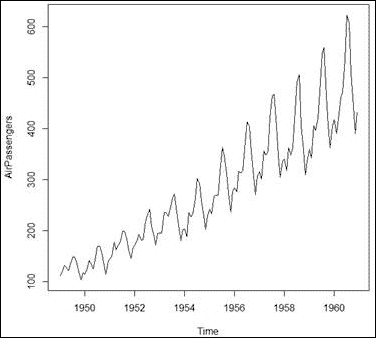

图 1：每月航空公司乘客计数

我们可以看到，在 12 个月的周期之后，似乎有一个模式在重复，这表明了月份间的季节性趋势。如果能得到一个图表，我们选择第一年，查看月份的图表，然后转到下一年，并展示下一年每月的数据并可视化，以此类推，直到显示完整的数据集，那就太好了。一个名为`plotts`的函数实现了这种描述的图表，其结构在*图 3*中给出：

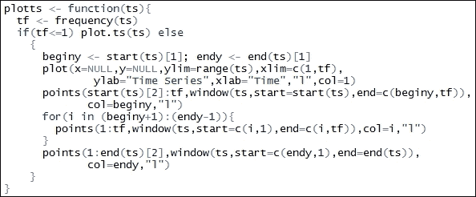

图 2：时间序列频率图函数

`plotts`函数现在被应用于`AirPassengers`数据集。该函数位于配套章节代码包的`Utilities.R`文件中，并在`C11.R`文件的开始处使用`source`命令调用。数据包含 12 年的数据，因此结果的时间序列图将包含 12 条曲线。图表的`legend`需要比通常的区域更大，因此我们将它绘制在图表的右侧。所需的操作通过`par`、`mar`和`legend`函数完成，如下所示：

```py
> par(mar=c(5.1, 4.1, 4.1, 8.1), xpd=TRUE)
> plotts(AirPassengers)
> legend("topright", inset=c(-0.2,0), "-",
+        legend=c(start(AirPassengers)[1]:end(AirPassengers)[1]),
+        col=start(AirPassengers)[1]:end(AirPassengers)[1],lty=2)
```

我们现在可以清楚地看到以下图中的季节性影响：

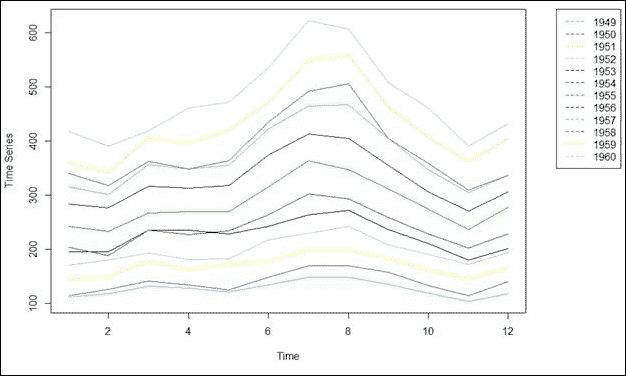

图 3：`AirPassengers`数据集的季节性图

每月乘客计数在二月和十一月达到低点。从二月到七月，每月乘客计数稳步增加，八月保持在相似的水平，然后急剧下降至十一月。十二月和一月可以看到轻微的增加。因此，季节性图提供了更多的见解，它们应该与 `plot.ts` 函数互补使用。Hyndman 的预测包包含一个名为 `seasonalplot` 的函数，它实现了与这里定义的 `plotts` 函数相同的结果。

澳大利亚居民数据集 `austres` 将在下一部分进行介绍。我们将使用 `plotts` 函数和图例来增强显示效果：

```py
>plot.ts(austres)
>windows(height=100,width=150)
>par(mar=c(5.1, 4.1, 4.1, 8.1), xpd=TRUE)
>plotts(austres)
>legend("topright", inset=c(-0.2,0), "-",
+        legend=c(start(austres)[1]:end(austres)[1]),
+        col=start(austres)[1]:end(austres)[1],lty=2)
```

下面的图是澳大利亚居民数量的季度时间序列：

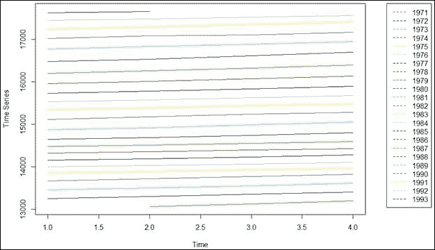

图 4：澳大利亚居民数量的季度时间序列

图 4 和图 5 的季节性图有什么不同？当然，我们寻找的是除了平凡的月度和季度周期性之外的不同之处。在图 5 中，我们可以看到，尽管月度居民数量在季度中有所增加，但这几乎不是一个季节性因素；它似乎更多的是趋势因素而不是季节性因素。因此，与 `AirPassengers` 数据集相比，季节性贡献似乎较小。

接下来将可视化二氧化碳浓度的时序图。我们在 `co2` 数据集上使用 `plot.ts` 函数：

```py
>plot.ts(co2)
```

运行 `plot.ts` 函数的结果是下一个输出：

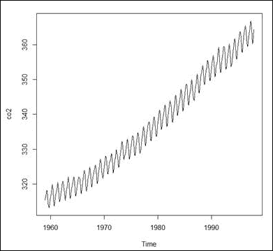

图 5：莫纳罗亚大气二氧化碳浓度可视化

在二氧化碳浓度的时序图中，季节性影响很容易看到。季节性图可能提供更多的见解，我们将在下一步使用 `plotts` 函数：

```py
>windows(height=100,width=150)
>par(mar=c(5.1, 4.1, 4.1, 8.1), xpd=TRUE)
>plotts(co2)
>legend("topright",inset=c(-0.2,0),
+        "-",
+        legend=c(c(start(co2)[1]:(start(co2)[1]+3)),". . . ",
+                 c((end(co2)[1]-3):end(co2)[1])),
+        col=c(c(start(co2)[1]:(start(co2)[1]+3)),NULL,
+              c((end(co2)[1]-3):end(co2)[1])),lty=2)
```

`plotts` 和 `legend` 函数的使用方式与之前相同。程序的结果显示在 *图 7* 中，我们可以清楚地看到时间序列显示中的季节性影响：

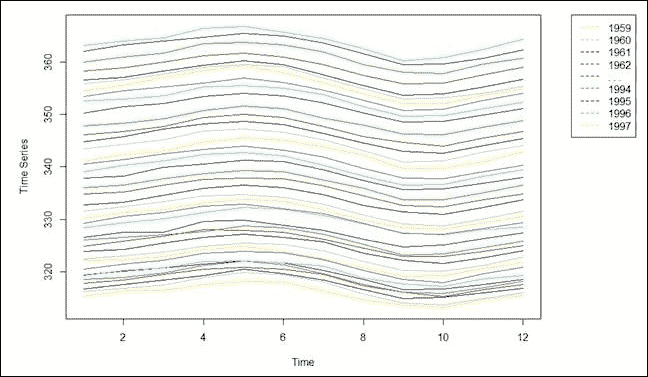

图 6：莫纳罗亚大气二氧化碳浓度的季节性图

**练习**：使用 `forecast` 包中的 `seasonalplot` 函数复制季节性图。这里有什么不同吗？

季节性是时间序列的一个重要方面。及早识别它对于选择适当的时间序列分析模型非常重要。我们将可视化另外三个时间序列数据集，`UKDriverDeaths`、`gas` 和 `uspop`：

```py
>windows(height=100,width=300)
>par(mfrow=c(1,3))
>plot.ts(UKDriverDeaths,main="UK Driver Deaths")
>plot.ts(gas,main="Australian monthly gas production")
>plot.ts(uspop,main="Populations Recorded by the US Census")
```

*图 7*中的三个显示与迄今为止所见的不同。看起来之前拟合良好的模型在这里可能不会表现相似。我们看到`UKDriverDeaths`和`gas`数据集有很多可变性。对于`UKDriverDeaths`，看起来在 1983 年之后，死亡人数有所下降。对于`gas`数据集，我们可以看到在 1970 年之前有一个规律的季节性影响，在那之后，`gas`的生产力急剧上升。这可能是一些技术突破或其他现象性变化的迹象。可变性也增加了，并且几乎在整个时间范围内都不稳定。`uspop`显示出指数增长。

**练习**：视觉检查`UKDriverDeaths`和`gas`数据集是否存在季节性影响：

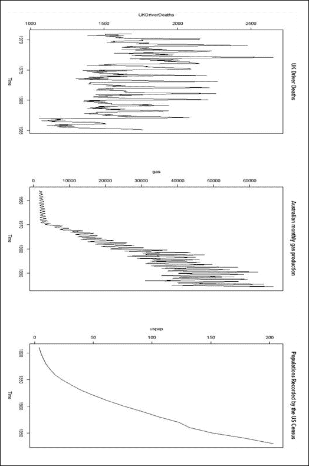

图 7：三个时间序列图：UKDriverDeaths、gas 和 uspop

## 核心概念和指标

时间序列数据的可视化在所有示例中都传达了类似的故事，从*图 1*到*图 7*。观察到的趋势和季节性表明，时间序列的未来值依赖于当前值，因此我们不能假设观察值之间是独立的。但这意味着什么呢？为了重申这一点，考虑更简单的`uspop`（美国人口）数据集，*图 7*的第三右面板显示。在这里，我们没有季节性影响。现在，考虑 1900 年的普查年份。下一次普查的人口肯定不会少于 1890 年，也不会远低于同年的同一数量。对于大多数时间序列也是如此；例如，如果我们正在记录一天的最高温度。在这里，如果今天的最高温度是 42°C，那么第二天最高温度将高度受这个数字的影响，并且几乎可以肯定地说，第二天的最高温度不会是 55°C 或 25°C。虽然很容易看出观察值是相互依赖的，但正式的规范本身也是一个挑战。让我们正式介绍时间序列。

我们将用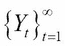表示在时间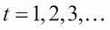观察到的时序。对于观察到时间 T 的时序，另一种表示方法是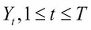。时序可以被视为在时间 t=1, 2, 3, …观察到的随机过程 Y。与时序过程相关的是误差过程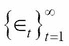。误差过程通常假设为具有零均值和一些常数方差的白噪声过程。误差过程通常被称为创新过程。请注意，时序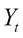可能依赖于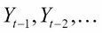过程中的过去值，以及误差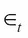的值和误差过程的过去值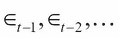。值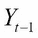也被称为的第一滞后值，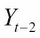是的第二滞后值，依此类推。现在，如果观测值相互依赖，那么它们之间关系的指定就是最大的挑战。当然，我们无法在这里详细说明。然而，如果我们认为一阶滞后项是相关的，那么这里必须存在某种关系，我们可以获得一个散点图，其中的观测值位于 y 轴上，一阶滞后项位于 x 轴上。`AirPassengers`数据集的一阶滞后散点图如下获得：

```py
>plot(AirPassengers[1:143],AirPassengers[2:144],
+      xlab="Previous Observation",
+      ylab="Current Observation")
```

使用索引将时序对象的类别更改为数值对象：

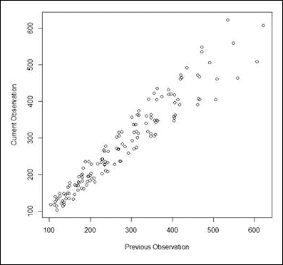

图 8：`AirPassengers`数据集的滞后图

在先前的图形显示中，我们可以清楚地看到滞后观测值之间存在（几乎）线性关系，因此模型可能的形式为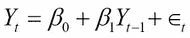。散点图能否帮助确定依赖的阶数？几乎不能！我们将获得`WWWusage`数据集的下一个图，并查看滞后图：

```py
>windows(height=200,width=200)
>par(mfrow=c(2,2))
>plot.ts(WWWusage)
>plot(WWWusage[1:99],WWWusage[2:100],
+      xlab="Previous Observation",
+      ylab="Current Observation",main="Lag-1 Plot"
+      )
>plot(WWWusage[1:98],WWWusage[3:100],
+      xlab="Previous Observation",
+      ylab="Current Observation",main="Lag-2 Plot"
+      )
>plot(WWWusage[1:97],WWWusage[4:100],
+      xlab="Previous Observation",
+      ylab="Current Observation",main="Lag-3 Plot"
+      )
```

以下是`WWWUsage`的滞后图：

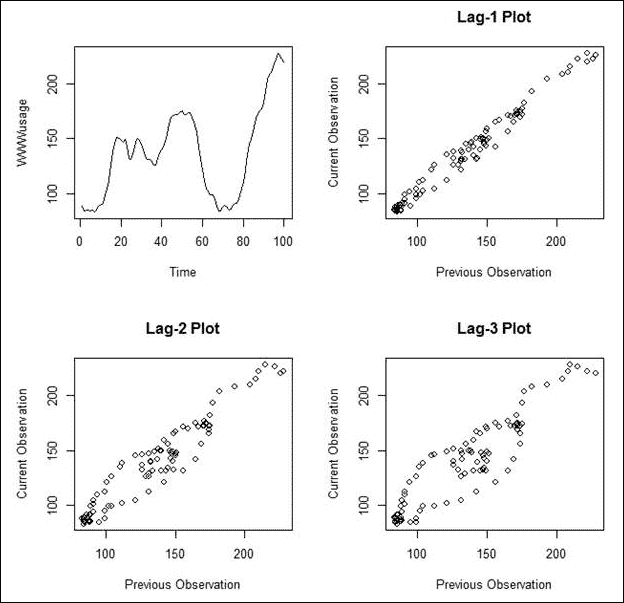

图 9：`WWWUsage`的滞后图

第一阶滞后图可能会给人留下观测值相关的印象。然而，更高阶的滞后图几乎没有任何意义，回到第一阶滞后图只会造成更多的困惑。因此，我们需要一种更正式的方法来获得滞后阶数上的洞察。

对于理解时间序列数据中依赖性的本质，有两个有用的度量：**自相关函数**（**ACF**）和**偏自相关函数**（**PACF**）。正如其名称所示，ACF 是时间序列与其滞后值之间的相关性。PACF 的偏命名法解释了从滞后值中去除中间变量的影响。简单来说，滞后 3 的 PACF 将只包括第一个 ；第三个滞后变量 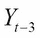 和 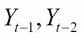 变量不允许影响 PACF。滞后-k ACF 定义为随机变量*Y* *t*与第 k 滞后变量*Y* *t-k*之间的相关性：

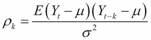

其中 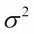 是时间序列的方差。时间序列的偏自相关函数 PACF 是*Yt*与其第 k 滞后*Yt-k*之间的偏相关。无法深入探讨 PACF 概念的数学细节；读者可以参考 Box 等人（2015）以获取更多信息。基于*n*个观察值的样本 ACF 公式如下：

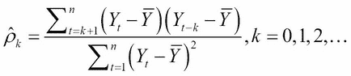

对于 PACF 的显式公式，我们建议读者参考网络上可用的文档，网址为[`mondi.web.elte.hu/spssdoku/algoritmusok/acf_pacf.pdf`](http://mondi.web.elte.hu/spssdoku/algoritmusok/acf_pacf.pdf)。

尽管公式看起来令人畏惧，但我们可以通过在两个数据集`austres`和`uspop`上简单地使用`acf`和`pacf`函数来轻松地解决这个问题：

```py
>jpeg("ACF_PACF_Plots.jpeg")
>par(mfrow=c(2,2))
>acf(austres,main="ACF of Austres Data")
>pacf(austres,main="PACF of Austres Data")
>acf(uspop,main="ACF of US Population")
>pacf(uspop,main="PACF of US Population")
>dev.off()
RStudioGD 
        2 
```

我们将保持 ACF 和 PACF 图的解释更加简单。在 ACF 和 PACF 图中，重要的指导原则是水平蓝色线条。任何超出两条线的滞后 ACF 和 PACF 图都是显著的，而那些在限制范围内的则是无关紧要的：

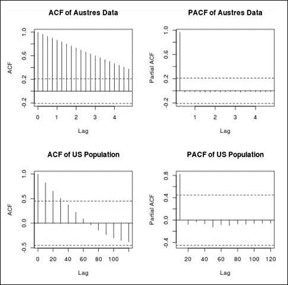

图 10：austres 和 uspop 数据集的 ACF 和 PACF 图

从*图 10*中我们可以看到，对于`austres`时间序列，我们需要扩展 ACF 图以包括更多的滞后。这是因为所有绘制的滞后都超出了水平蓝色线条。对于`uspop`时间序列，第一个时间序列的前四个滞后是显著的，其余的都在水平蓝色线条内。PACF 图可以以类似的方式进行解释。

ACF 和 PACF 图在 ARMA 模型识别中起着重要作用。即使对于 AR 的情况，这些图揭示了滞后信息，也可以用来指定时间序列作为神经网络输入向量的前几个值。

在许多实际问题中，我们还有额外的变量，我们可能将这些称为协变量时间序列或外生变量。让我们用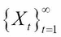表示协变量时间序列，其中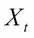可能是一个标量或向量时间序列。我们采用惯例，只有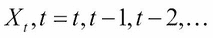的当前和过去值会影响，而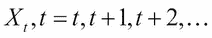的未来值不会以任何方式影响。也就是说，只有协变量的滞后值会有影响，而不是它们的先行值。在 `Car Sales` 数据集中，销售是我们感兴趣的时间序列，我们认为广告方面影响了销售；销售不可能解释广告金额！`ccf` 函数用于以下方式获取交叉相关系数：

```py
>CarSales <- read.csv("../Data/Car_Sales.csv")
>summary(CarSales)
     Sales       Advertising  
 Min.   :12.0   Min.   : 1.0  
 1st Qu.:20.3   1st Qu.:15.8  
 Median :24.2   Median :23.0  
 Mean   :24.3   Mean   :28.5  
 3rd Qu.:28.6   3rd Qu.:41.0  
 Max.   :36.5   Max.   :65.0  
>jpeg("CCF_Car_Sales_Advertising.jpeg")
>ccf(x=CarSales$Advertising,y=CarSales$Sales,
+     main="Cross Correlation Between Sales and Advertising")
>dev.off()
RStudioGD 
        2 
```

下图展示了销售和广告之间的交叉相关性：

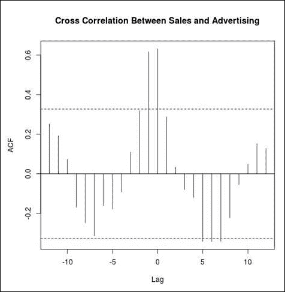

图 11：广告支出和汽车销售的交叉相关系数

我们应该关注正滞后值还是负滞后值？请注意，`ccf` 图并不是对称的，因此我们不能因为忽略了滞后值的符号而免责。在 R 终端运行 `?ccf`，我们得到 `ccf(x, y)` 返回的滞后 k 值来自帮助文件，该文件估计了 x[t+k] 和 y[t] 之间的相关性。因此，正滞后是先行指标，而负滞后对我们来说更有兴趣。在这个例子中，只有的前置滞后（即和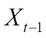）是显著的。

我们在本节结束时简要讨论了准确度测量。与早期学习问题一样，我们将有一系列模型可供我们选择。这是下一节讨论的主题，我们需要相应地定义某些评估指标。让表示时间序列，由于使用某种模型，拟合值将是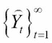。我们可以通过各种方法访问模型的准确性；一些准确性测量包括以下内容：

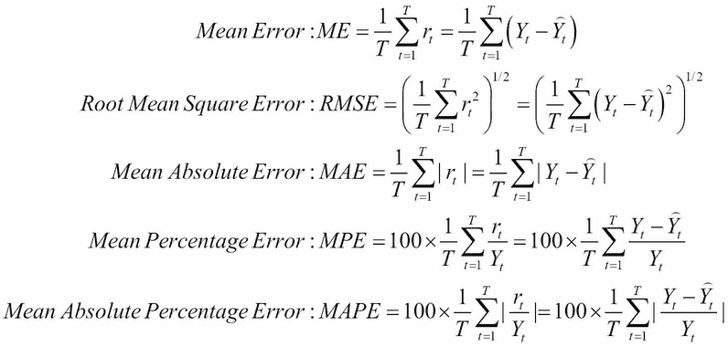

目前，我们不会关注模型。相反，我们将使用它作为主要工具来提取拟合值并帮助获取定义的指标。使用 `subset` 函数，我们将定义训练数据集，并使用 `forecast` 包中的 `auto.arima` 函数拟合模型。然后，使用 `accuracy` 和 `forecast` 函数，我们将获得不同的准确性：

```py
>co2_sub <- subset(co2,start=1,end=443)
>co2_arima <- auto.arima(co2_sub)
>accuracy(forecast(co2_arima,h=25),x=co2[444:468])
                  ME  RMSE   MAE      MPE   MAPE  MASE   ACF1
Training set  0.0185 0.283 0.225  0.00541 0.0672 0.211 0.0119
Test set     -0.0332 0.349 0.270 -0.00912 0.0742 0.252     NA
```

`forecast`函数是一个非常重要的函数。给定一个拟合的时序，它将提供所需未来期间的预测，并且准确度函数计算了七个不同标准所需的准确度。平均误差标准通常是无用的，对于几乎无偏的模型，其数值将接近 0。RMSE、MAE、MPE 和 MAPE 指标通常很有用，它们的值越低，模型拟合得越好。此外，训练集误差和测试集误差必须可以比较。如果它们彼此差异很大，那么该模型对预测来说就没有用了。在下一节中，我们将回顾一类有用的时序模型。

## 重要的时序模型

我们已经遇到了不同回归模型的一系列模型。时间序列数据带来了额外的复杂性，因此我们有更多的模型可供选择（或者更确切地说，是从中集成）。这里提供了一个重要模型的快速回顾。这里讨论的大多数模型都处理单变量时间序列，我们需要更多专业化的模型和方法来包含。我们将从最简单可能的时间序列模型开始，然后逐步过渡到神经网络实现。

### 简单预测

假设我们拥有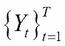的数据，并且我们需要预测下一个*h*个时间点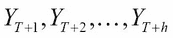。简单预测模型不需要任何建模练习或计算，它只是简单地返回当前值作为未来的预测，因此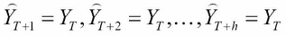。就这么简单。即使是这个简单的任务，我们也会使用 forecast 包中的简单函数，并要求它提供下一个`25`个观察值的预测，其中`h=25`：

```py
>co2_naive <- naive(co2_sub,h=25,level=c(90,95))
>summary(co2_naive)

Forecast method: Naive method

Model Information:
Call: naive(y = co2_sub, h = 25, level = c(90, 95)) 

Residual sd: 1.1998 

Error measures:
              ME RMSE  MAE   MPE  MAPE  MASE  ACF1
Training set 0.1  1.2 1.07 0.029 0.319 0.852 0.705

Forecasts:
         Point Forecast Lo 90 Hi 90 Lo 95 Hi 95
Dec 1995            360   358   362   357   362
Jan 1996            360   357   362   356   363
Feb 1996            360   356   363   356   364

Oct 1997            360   350   369   348   371
Nov 1997            360   350   369   348   371
Dec 1997            360   350   370   348   371
```

如预期的那样，预测值在整个期间保持不变。它们可以很容易地可视化，准确度也可以很容易地按以下方式计算：

```py
>plot(co2_naive) # Output suppressed
>accuracy(forecast(co2_naive,h=25),x=co2[444:468])
               ME RMSE  MAE   MPE  MAPE MASE  ACF1
Training set 0.10 1.20 1.07 0.029 0.319 1.00 0.705
Test set     3.54 4.09 3.55 0.972 0.974 3.32    NA
```

自然会出现的疑问是简单预测是否有效。对此的回答可以通过其他方式提供。复杂和精密的模型总是声称具有优势。模型确实可能具有优势，但参考和基准应该是清晰的。简单预测提供了这个重要的基准。请注意，对于训练期，简单预测的准确度值是不同的，并且重要的是所提出的模型至少要比简单预测的指标更好。这就是简单预测的主要目的。

### 季节性、趋势和局部加权回归拟合

季节、趋势和局部加权回归是三个技术术语的组合，形成了 stl 模型。之前，我们在时间序列的视觉显示中看到，其中一些描绘了季节性效应，一些显示了趋势，一些显示了季节性和趋势的组合，还有一些是简单的非规律性时间序列。这些显示因此表明了底层现象的具体性质的存在或不存在。在本节中，我们将探讨如何利用时间序列的季节性和趋势部分。在 loess 中的 stl 模型的第三个组成部分完全没有解释。局部加权回归是一种非参数回归技术，代表局部多项式回归，它将加权最小二乘准则推广到 p 次多项式。局部加权回归方法还包括一个称为核的重要组件。核是一种平滑方法，但我们将不会对此进行过多细节的讨论。

Cleveland 等人（1990 年）提出了基于局部加权回归的季节性-趋势分解，该过程的全部细节可以从以下来源获得：[`www.scb.se/contentassets/ca21efb41fee47d293bbee5bf7be7fb3/stl-a-seasonal-trend-decomposition-procedure-based-on-loess.pdf`](http://www.scb.se/contentassets/ca21efb41fee47d293bbee5bf7be7fb3/stl-a-seasonal-trend-decomposition-procedure-based-on-loess.pdf)。这篇论文易于阅读，直观且富有洞察力，读者应该真正地跟随它。stl 模型是一种分解季节性时间序列的滤波方法，分为三个部分：趋势、季节性和剩余部分。设为时间序列，我们用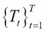、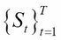和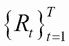分别表示趋势、季节性和剩余部分；那么我们将有如下：

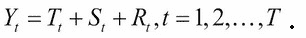

请参阅 Cleveland 等人发表的论文以获取完整细节。

使用`stats`包中的`stl`函数，我们将`AirPassengers`数据分解如下：

```py
>AP_stl <- stl(AirPassengers,s.window=frequency(AirPassengers))
>summary(AP_stl)
 Call:
 stl(x = AirPassengers, s.window = frequency(AirPassengers))

 Time.series components:
    seasonal         trend       remainder    
 Min.   :-73.3   Min.   :123   Min.   :-36.2  
 1st Qu.:-25.1   1st Qu.:183   1st Qu.: -6.4  
 Median : -5.5   Median :260   Median :  0.3  
 Mean   :  0.1   Mean   :280   Mean   : -0.2  
 3rd Qu.: 20.4   3rd Qu.:375   3rd Qu.:  5.9  
 Max.   : 94.8   Max.   :497   Max.   : 48.6  
 IQR:
     STL.seasonal STL.trend STL.remainder data 
      46          192        12           180  
   %  25.2        106.4       6.8         100.0

 Weights: all == 1

 Other components: List of 5
 $ win  : Named num [1:3] 12 21 13
 $ deg  : Named int [1:3] 0 1 1
 $ jump : Named num [1:3] 2 3 2
 $ inner: int 2
 $ outer: int 0
>jpeg("STL_Decompose_AirPassengers.jpeg")
>plot(AP_stl)
>dev.off()
windows 
      2 
>accuracy(forecast(AP_stl))
                  ME RMSE  MAE    MPE MAPE  MASE     ACF1
Training set 0.00498 11.2 8.29 -0.129 3.29 0.259 0.000898
```

执行前面的代码后，可以得到以下图形：


图 12：AirPassengers 的 STL 分解

在`stl`函数中通过`s.window`选项指定季节性是很重要的。从季节性图中，我们可以看到每个成分随时间增加。然而，我们可以清楚地看到乘客数量随时间变化的各个组成部分。尽管季节性部分在幅度上增加，但整个期间的模式保持不变。趋势显示线性增加，这表明序列前进的方向。很明显，季节性在这个背景下起着重要作用。

**练习**：之前已经提到，季节性似乎不是`austres`数据集分析中的一个有用的因素。使用`stl`分解并检查这一观察结果是否成立。

接下来将考虑一个更参数化的模型，形式为指数平滑模型。

### 指数平滑状态空间模型

基本指数平滑模型可以明确定义。用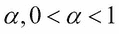表示平滑因子，并初始化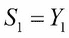。基本指数平滑模型定义为以下：

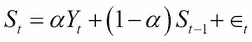

指数模型的详细信息可以在[`labs.omniti.com/people/jesus/papers/holtwinters.pdf`](https://labs.omniti.com/people/jesus/papers/holtwinters.pdf)找到。一个更通用的模型形式是**指数平滑状态空间模型**。在这里，模型在三个方面被指定，就像 stl 模型一样：误差成分、趋势成分，第三个是季节成分。在 forecast 包的`ets`函数中，成分可以具有**加性**效应，用**A**表示，它可以具有**乘性**效应，用 M 表示，或者可能要求自动选择（Z），并且这种指定适用于每个成分。效应可以指定为既不是加性的也不是乘性的，用字母 N 表示。因此，`ets`函数中的模型是用第一个字母表示误差成分，第二个字母表示趋势成分，第三个字母表示季节成分来指定的。因此，表示`model="ZZZ"`意味着三个成分都是自动选择的。`model="AMZ"`意味着误差成分是加性的，趋势是乘性的，季节成分是自动选择的，等等。Hyndman 等人（2008 年）提供了指数平滑方法详细情况的全面概述。接下来，我们将使用`forecast`包中的`ets`函数来拟合指数平滑模型：

```py
>uspop_sub <- subset(uspop,start=1,end=15)
>USpop_ets <- ets(uspop_sub)
>summary(USpop_ets)
ETS(A,A,N) 

Call:
 ets(y = uspop_sub) 

  Smoothing parameters:
    alpha = 0.8922 
    beta  = 0.8922 

  Initial states:
    l = 2.3837 
    b = 1.7232 

  sigma:  1.68

 AIC AICc  BIC 
66.2 72.8 69.7 

Training set error measures:
               ME RMSE MAE  MPE MAPE   MASE  ACF1
Training set 1.11 1.68 1.4 3.26  4.6 0.0318 -0.28
```

`ets`函数为误差和趋势成分拟合了加性误差，而选择不对季节因子添加任何内容。这是有意义的，因为`uspop`数据集没有季节成分。使用这个拟合模型，我们将预测 1940-70 年间的美国人口，使用`accuracy`函数计算训练和测试数据集的准确性，并与`naive`预测进行比较：

```py
>forecast(USpop_ets,h=4)
     Point Forecast Lo 80 Hi 80 Lo 95 Hi 95
1940            139   137   141   136   142
1950            156   151   160   149   162
1960            172   165   180   161   183
1970            189   178   200   173   205
>plot(forecast(USpop_ets,h=4))
>accuracy(forecast(USpop_ets,h=4),x=uspop[16:19])
               ME RMSE  MAE   MPE MAPE  MASE  ACF1
Training set 1.11 1.68 1.40 3.259 4.60 0.165 -0.28
Test set     2.33 9.02 8.26 0.578 4.86 0.973    NA
>accuracy(forecast(naive(uspop_sub),h=4),x=uspop[16:19])
                ME  RMSE   MAE  MPE MAPE MASE  ACF1
Training set  8.49  9.97  8.49 21.7 21.7 1.00 0.778
Test set     43.58 51.35 43.58 24.2 24.2 5.13    NA
```

下图展示了美国人口数据的指数平滑：

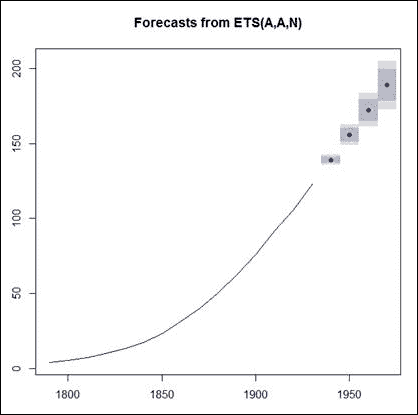

图 13：美国人口数据的指数平滑

准确性比较是与简单预测进行的，我们发现`ets`预测有显著的改进。因此，`ets`预测是有用的，我们可以使用它们进行未来预测。

接下来，我们将继续介绍流行的 Box-Jenkins/ARIMA 模型。

### 自回归积分移动平均（ARIMA）模型

Box 和 Jenkins 使用 ARIMA 模型对时间序列的分析和预测方法产生了变化。ARIMA 模型是更一般线性过程模型的一个特例，对于具有创新过程  的时间序列 ，其表达式如下：

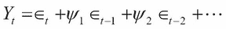

在这里，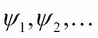 是线性过程的系数。请注意，对创新过程的滞后值没有限制，我们确实意味着在这个线性过程模型中有无限项。在流行的自回归 AR(p)模型中，p 是 AR 模型的阶数。这可以用以下方式表示：

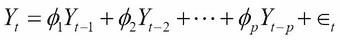

AR 模型可以证明是线性过程模型的一个特例。当时间序列用创新过程表示时，另一个有用的模型是阶数为 q 的移动平均 MA(q) 模型：

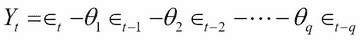

时间序列可能不仅依赖于过去值，还依赖于过去的误差，这种结构依赖性在自回归移动平均 `ARMA(p,q)` 模型中得以捕捉，其阶数为 `(p,q)`：

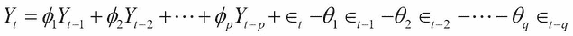

*p* 和 *q* 的阶数可以通过 *表 2* 中 ACF 和 PACF 相关的经验规则来确定：


表 2：ARMA 模型的 ACF 和 PACF

ARMA 模型与平稳时间序列数据配合良好，这里的平稳大致意味着序列的变异性在整个过程中保持恒定。这是一个限制性假设，对于许多时间序列现象，这个假设并不成立。在许多实际场景中，通过差分序列  可以获得平稳性，也就是说，我们可以考虑差分 。差分  是一阶差分，有时可能需要更高阶的差分。在大多数实际场景中，差分到 4 阶已被证明可以带来平稳性。差分的阶数通常用字母 d 表示，将 ARMA 模型应用于差分被称为自回归积分移动平均模型，或 ARIMA 模型。简写为 `ARIMA(p,d,q)`。

在本章中，我们多次遇到了季节成分，它通过季节 ARIMA 模型在 ARIMA 中得到解决。有动机的读者可以通过 Tattar 等人（2017）的第十章了解更多细节。我们在这里简单地补充说，我们还有大写字母（P, D, Q）的进一步符号表示季节参数，以及频率项。我们现在能够理解上一节末尾拟合的模型。`co2_arima`的准确性已经评估，我们现在将查看摘要：

```py
>summary(co2_arima)
Series: co2_sub 
ARIMA(2,1,2)(1,1,2)[12] 

Coefficients:
        ar1    ar2     ma1     ma2    sar1   sma1    sma2
      0.033  0.250  -0.369  -0.246  -0.828  0.014  -0.750
s.e.  0.341  0.122   0.342   0.197   0.230  0.210   0.173

sigma² estimated as 0.0837:  log likelihood=-73.4
AIC=163   AICc=163   BIC=195

Training set error measures:
                 ME  RMSE   MAE     MPE   MAPE  MASE   ACF1
Training set 0.0185 0.283 0.225 0.00541 0.0672 0.179 0.0119
```

最佳拟合的 ARIMA 模型阶数是`(2,1,2)(1,1,2)[12]`，这意味着季节频率为`12`（这是我们已知的事情），季节阶数（P,D,Q）为`(1,1,2)`，ARIMA 阶数（p,d,q）为`(2,1,2)`。正是这种差分阶数实现了平稳性。预测结果已获得并进行了可视化：

```py
>jpeg("CO2_Forecasts.jpeg")
>plot(forecast(co2_arima,h=25))
```

下图显示了输出：


图 14：二氧化碳浓度预测

因此，我们已经为二氧化碳浓度水平拟合了 ARIMA 模型。

接下来，我们将探讨非线性神经网络时间序列模型。

### 自回归神经网络

神经网络之前已被用于分类以及回归问题。由于时间序列是依赖性观测值，我们需要调整神经网络的架构以包含这种依赖性。调整是为了允许时间序列的滞后值作为输入层的成员。其余的架构遵循与常规神经网络相同的结构。`forecast`中的`nnetar`函数代表神经网络自回归，`p=`选项允许时间序列的滞后值，我们将这些值应用于`gas`问题：

```py
>gas_sub <- subset(gas,start=1,end=450)
>gas_nnetar <- nnetar(gas_sub,p=25,P=12,size=10,repeats=10)
>plot(forecast(gas_nnetar,h=26))
>accuracy(forecast(gas_nnetar,h=26),x=gas[451:476])
               ME RMSE  MAE    MPE  MAPE  MASE    ACF1
Training set    2  318  237 -0.127  1.78 0.148 -0.0879
Test set     5033 6590 5234 10.566 10.94 3.276      NA
```


图 15：使用自回归神经网络的气体预测

我们现在已经看到了自回归神经网络的实际应用。

### 一团糟

我们在本章开头简要介绍了七个数据集，并在*表 1*中提到了 21 个数据集。数据可视化提供了适度的洞察力，而准确度指标有助于分析模型的有用性。到目前为止，本节已经介绍了一系列模型，现在我们将把一切都搞乱。定义了一个`get_Accuracy`函数，该函数将拟合六个不同的时间序列模型。代表**线性模型**的**LM**尚未解释；TBATS 模型也没有解释。线性模型非常简单，因为时间索引被用作协变量。一般来说，如果一个时间序列有 T 个观测值，协变量向量简单地由值 1，2，3，…，T 组成。我们预计线性模型的表现会不佳。TBATS 模型在此不再详细解释，因此建议阅读一些额外的资料以获取更多相关信息。`get_Accuracy`模型将每个模型拟合到 21 个数据集，命名模型，并列出其在整个数据集上的性能。以下程序得到所需的结果：

```py
>get_Accuracy<- function(ts){
+   tsname <- deparse(substitute(ts))
+   Acc_Mat <- data.frame(TSName = rep(tsname,6),Models=c(
+               "ETS","STL","LM","ARIMA","NNETAR","TBATS"),
+                ME=numeric(6),RMSE=numeric(6),MAE=numeric(6),
+                MPE=numeric(6), MAPE=numeric(6),MASE=numeric(6))
+   for(i in 1:nrow(Acc_Mat)){
+     Acc_Mat[1,3:8] <- accuracy(ets(ts)$fitted,ts)[1:6]
+     if(frequency(ts)>1) Acc_Mat[2,3:8] <- accuracy(ts-stl(ts,
+            frequency(ts))$time.series[,3],ts)[1:6] else
+       Acc_Mat[2,3:8] <- NA
+     Acc_Mat[3,3:8] <- accuracy(fitted(lm(ts~I(1:length(ts)))),ts)[1:6]
+     Acc_Mat[4,3:8] <- accuracy(auto.arima(ts)$fitted,ts)[1:6]
+     Acc_Mat[5,3:8] <- accuracy(fitted(nnetar(ts)),ts)[1:6]
+     Acc_Mat[6,3:8] <- accuracy(fitted(tbats(ts)),ts)[1:6]
+   }
+   Acc_Mat
+ }
> TSDF <- data.frame(TSName=character(0),Models=character(0),
+ Accuracy=numeric(0))
> TSDF <- rbind(TSDF,get_Accuracy(AirPassengers))
> TSDF <- rbind(TSDF,get_Accuracy(BJsales))
> TSDF <- rbind(TSDF,get_Accuracy(JohnsonJohnson))
> TSDF <- rbind(TSDF,get_Accuracy(LakeHuron))
> TSDF <- rbind(TSDF,get_Accuracy(Nile))
> TSDF <- rbind(TSDF,get_Accuracy(UKgas))
> TSDF <- rbind(TSDF,get_Accuracy(UKDriverDeaths))
> TSDF <- rbind(TSDF,get_Accuracy(USAccDeaths))
> TSDF <- rbind(TSDF,get_Accuracy(WWWusage))
> TSDF <- rbind(TSDF,get_Accuracy(airmiles))
> TSDF <- rbind(TSDF,get_Accuracy(austres))
> TSDF <- rbind(TSDF,get_Accuracy(co2))
> TSDF <- rbind(TSDF,get_Accuracy(discoveries))
> TSDF <- rbind(TSDF,get_Accuracy(lynx))
> TSDF <- rbind(TSDF,get_Accuracy(nhtemp))
> TSDF <- rbind(TSDF,get_Accuracy(nottem))
> TSDF <- rbind(TSDF,get_Accuracy(presidents))
In addition: Warning message:
In ets(ts) :
  Missing values encountered. Using longest contiguous portion of time series
> TSDF <- rbind(TSDF,get_Accuracy(treering))
> TSDF <- rbind(TSDF,get_Accuracy(gas))
> TSDF <- rbind(TSDF,get_Accuracy(uspop))
> TSDF <- rbind(TSDF,get_Accuracy(sunspots))
> write.csv(TSDF,"../Output/TS_All_Dataset_Accuracies.csv",row.names=F)
```

前述代码块输出的表格如下：

| TSName | Model | ME | RMSE | MAE | MPE | MAPE | MASE |
| --- | --- | --- | --- | --- | --- | --- | --- |
| `AirPassengers` | ETS | 1.5807 | 10.6683 | 7.7281 | 0.4426 | 2.8502 | 0.0164 |
| `AirPassengers` | STL | -0.1613 | 11.9379 | 8.5595 | -0.0662 | 3.4242 | 0.5515 |
| `AirPassengers` | LM | 0.0000 | 45.7362 | 34.4055 | -1.2910 | 12.3190 | 0.7282 |
| `AirPassengers` | ARIMA | 1.3423 | 10.8462 | 7.8675 | 0.4207 | 2.8005 | -0.0012 |
| `AirPassengers` | NNETAR | -0.0118 | 14.3765 | 11.4899 | -0.2964 | 4.2425 | 0.5567 |
| `AirPassengers` | TBATS | 0.4655 | 10.6614 | 7.7206 | 0.2468 | 2.8519 | 0.0215 |
| `BJsales` | ETS | 0.1466 | 1.3272 | 1.0418 | 0.0657 | 0.4587 | -0.0110 |
| `BJsales` | STL | NA | NA | NA | NA | NA | NA |
| `BJsales` | LM | 0.0000 | 9.1504 | 7.1133 | -0.1563 | 3.1686 | 0.9872 |
| `BJsales` | ARIMA | 0.1458 | 1.3281 | 1.0447 | 0.0651 | 0.4601 | -0.0262 |
| `BJsales` | NNETAR | -0.0001 | 1.4111 | 1.0849 | -0.0040 | 0.4798 | 0.2888 |
| `BJsales` | TBATS | 0.1622 | 1.3566 | 1.0666 | 0.0732 | 0.4712 | -0.0113 |
| `JohnsonJohnson` | ETS | 0.0495 | 0.4274 | 0.2850 | 1.0917 | 7.0339 | -0.2948 |
| `JohnsonJohnson` | STL | -0.0088 | 0.1653 | 0.1080 | -0.5953 | 2.8056 | -0.4155 |
| `JohnsonJohnson` | LM | 0.0000 | 1.6508 | 1.3287 | 22.6663 | 66.3896 | 0.6207 |
| `JohnsonJohnson` | ARIMA | 0.0677 | 0.4074 | 0.2676 | 2.0526 | 6.5007 | 0.0101 |
| `JohnsonJohnson` | NNETAR | 0.0003 | 0.3501 | 0.2293 | -0.6856 | 5.8778 | -0.0347 |
| `JohnsonJohnson` | TBATS | 0.0099 | 0.4996 | 0.3115 | 0.9550 | 7.5277 | -0.1084 |
| `sunspots` | ETS | -0.0153 | 15.9356 | 11.2451 | #NAME? | Inf | 0.0615 |
| `sunspots` | STL | 0.0219 | 12.2612 | 8.7973 | NA | Inf | 0.18 |
| `sunspots` | LM | 0 | 42.9054 | 34.1212 | #NAME? | Inf | 0.9196 |
| `sunspots` | ARIMA | -0.0267 | 15.6006 | 11.0258 | NA | Inf | -0.0106 |
| `太阳黑子` | NNETAR | -0.0672 | 10.3105 | 7.6878 | NA | Inf | 0.0108 |
| `太阳黑子` | TBATS | -0.0514 | 15.5788 | 11.0119 | NA | Inf | -0.0013 |

表 3：21 个数据集上六个模型的准确度

整体信息与分类问题介绍章节中得到的结果相同。由于我们并不总是能够持续进行结果检查，因此将多个模型的结果结合起来，以传达一个更准确的整体故事是很有吸引力的。我们从这个简单的想法开始，即对指数时间序列模型进行袋装。

## 袋装和时间序列

在本节中，我们只将说明袋装技术用于 ETS 模型。袋装的主要目的是稳定预测或预报。在这里，我们将基于 Box-Cox 和基于 Loess 的分解进行袋装。使用 500 个这样的自助样本，我们将获得 ETS 的袋装模型：

```py
>uspop_bagg_ets <- baggedETS(uspop_sub,bootstrapped_series = 
+                               bld.mbb.bootstrap(uspop_sub, 500))
>forecast(uspop_bagg_ets,h=4);subset(uspop,start=16,end=19)
     Point Forecast Lo 100 Hi 100
1940            141    136    145
1950            158    150    165
1960            175    164    184
1970            193    178    204
Time Series:
Start = 1940 
End = 1970 
Frequency = 0.1 
[1] 132 151 179 203
>plot(forecast(uspop_bagg_ets,h=4))
```

使用袋装方法是否有优势？我们可以通过置信区间快速检查这一点：

```py
>forecast(uspop_bagg_ets,h=4)
     Point Forecast Lo 100 Hi 100
1940            141    136    145
1950            158    150    165
1960            175    164    184
1970            193    178    204
>forecast(USpop_ets,h=4,level=99.99)
     Point Forecast Lo 99.99 Hi 99.99
1940            139      133      146
1950            156      142      169
1960            172      150      194
1970            189      157      221
```

袋装 ETS 的置信区间明显更短，因此反映了方差的减少，这是袋装的主要目的：


图 16：美国人口袋装预测

准确度比较也容易在这里进行：

```py
>accuracy(forecast(USpop_ets,h=4),x=uspop[16:19])
               ME RMSE  MAE   MPE MAPE  MASE  ACF1
Training set 1.11 1.68 1.40 3.259 4.60 0.165 -0.28
Test set     2.33 9.02 8.26 0.578 4.86 0.973    NA
>accuracy(forecast(uspop_bagg_ets,h=4),x=subset(uspop,start=16,end=19))
                 ME RMSE  MAE    MPE MAPE   MASE  ACF1 Theil's U
Training set  1.137 1.44 1.24  2.226 4.48 0.0283 0.563        NA
Test set     -0.359 7.87 7.48 -0.995 4.63 0.1700 0.296     0.299
```

这里清楚地显示了集成同质基学习者的优势。接下来，我们将转向异质基学习者和它们的集成。

## 集成时间序列模型

`forecastHybrid` R 包提供了一个平台来集成异构时间序列模型。实现这一任务的主要功能是 `hybridModel` 函数。核心函数提供了称为 `models` 的选项。它接受一个最多六个字符的字符串，这些字符是模型的代表：`a` 代表 `auto.arima` 模型，`e` 代表 `ets`，`f` 代表 `thetam`，`n` 表示 `nnetar`，`s` 代表 `stlm`，最后，`t` 代表 `tbats`。因此，如果我们给 `models` 一个 `ae` 字符串，它将结合 ARIMA 和 ets 模型的结果。这可以在 `co2` 数据集上对不同时间序列模型的组合进行说明：

```py
>accuracy(forecast(co2_arima,h=25),x=co2[444:468])
                  ME  RMSE   MAE      MPE   MAPE  MASE   ACF1
Training set  0.0185 0.283 0.225  0.00541 0.0672 0.211 0.0119
Test set     -0.0332 0.349 0.270 -0.00912 0.0742 0.252     NA
>AP_Ensemble_02 <- hybridModel(co2_sub,models="ae")
Fitting the auto.arima model
Fitting the ets model
>accuracy(AP_Ensemble_02,h=25,x=co2[444:468])
             ME  RMSE   MAE     MPE   MAPE    ACF1 Theil's U
Test set 0.0258 0.271 0.219 0.00755 0.0653 0.00289     0.226
>AP_Ensemble_03 <- hybridModel(co2_sub,models="aen")
Fitting the auto.arima model
Fitting the ets model
Fitting the nnetar model
>accuracy(AP_Ensemble_03,h=25,x=co2[444:468])
            ME  RMSE   MAE    MPE  MAPE  ACF1 Theil's U
Test set 0.017 0.304 0.245 0.0049 0.073 0.282      0.25
>AP_Ensemble_04 <- hybridModel(co2_sub,models="aens")
Fitting the auto.arima model
Fitting the ets model
Fitting the nnetar model
Fitting the stlm model
>accuracy(AP_Ensemble_04,h=25,x=co2[444:468])
             ME  RMSE   MAE     MPE  MAPE  ACF1 Theil's U
Test set 0.0165 0.275 0.221 0.00478 0.066 0.209     0.226
>AP_Ensemble_05 <- hybridModel(co2_sub,models="aenst")
Fitting the auto.arima model
Fitting the ets model
Fitting the nnetar model
Fitting the stlm model
Fitting the tbats model
>accuracy(AP_Ensemble_05,h=25,x=co2[444:468])
             ME  RMSE   MAE     MPE   MAPE  ACF1 Theil's U
Test set 0.0123 0.267 0.216 0.00348 0.0645 0.153      0.22
```

虽然这里的集成讨论非常简短，但时间序列文献最近才开始适应集成技术。

**练习**：`weights` 和 `errorMethod` 选项对于将不同的时间序列模型组合在一起至关重要。探索章节中介绍和讨论的不同数据集的这些选项。

# 摘要

时间序列数据带来了新的挑战和复杂性。本章从介绍重要且流行的数据集开始。我们探讨了不同的时间序列及其复杂性。时间序列的可视化提供了深刻的洞察，时间序列图以及季节性图互补地用于清晰的想法和特定实施。时间序列的准确度指标各不相同，我们探讨了其中的一些。自相关函数（ACF）和偏自相关函数（PACF）的概念在模型识别中至关重要，季节性成分对于时间序列建模也同样重要。我们还看到，不同的模型可以表达不同的数据集，变化的程度类似于常规回归问题。时间序列的袋装（仅 ets）减少了预测的方差。在结论部分讨论了结合异构基学习器。下一章是结论章节。我们将总结前十一章的主要收获，并概述一些不足和进一步的研究范围。
