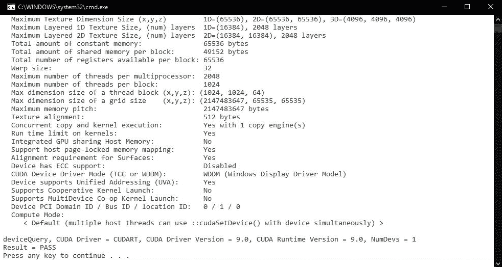
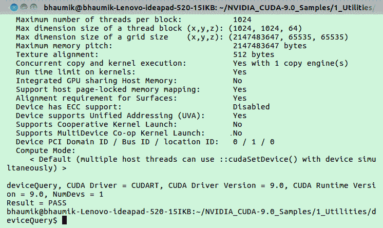
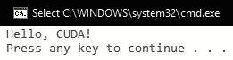
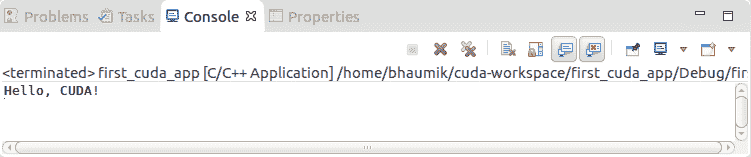

# 第一章：介绍 CUDA 并开始使用 CUDA

本章为您简要介绍了 CUDA 架构及其如何重新定义了 GPU 的并行处理能力。本章将演示 CUDA 架构在实际场景中的应用。对于想要通过使用通用 GPU 和 CUDA 来加速其应用程序的软件开发人员，本章将作为入门指南。本章描述了用于 CUDA 应用程序开发的开发环境，以及如何在所有操作系统上安装 CUDA 工具包。它涵盖了如何使用 CUDA C 开发基本代码，并在 Windows 和 Ubuntu 操作系统上执行。

本章将涵盖以下主题：

+   介绍 CUDA

+   CUDA 的应用

+   CUDA 开发环境

+   在 Windows、Linux 和 macOS 上安装 CUDA 工具包

+   开发简单代码，使用 CUDA C

# 技术要求

本章要求您熟悉基本的 C 或 C++ 编程语言。本章中使用的所有代码都可以从以下 GitHub 链接下载：[`github.com/bhaumik2450/Hands-On-GPU-Accelerated-Computer-Vision-with-OpenCV-and-CUDA/Chapter1`](https://github.com/PacktPublishing/Hands-On-GPU-Accelerated-Computer-Vision-with-OpenCV-and-CUDA/). 代码可以在任何操作系统上执行，尽管它仅在 Windows 10 和 Ubuntu 16.04 上进行了测试。

查看以下视频，了解代码的实际应用：

[`bit.ly/2PTQMUk`](http://bit.ly/2PTQMUk) [](http://bit.ly/2PTQMUk)

# 介绍 CUDA

**统一计算设备架构**（**CUDA**）是由 NVIDIA 开发的一个非常流行的并行计算平台和编程模型。它仅支持 NVIDIA GPU。OpenCL 用于为其他类型的 GPU（如 AMD 和 Intel）编写并行代码，但它比 CUDA 复杂。CUDA 允许通过简单的编程 API 在 **图形处理单元**（**GPU**s）上创建大规模并行应用程序。使用 C 和 C++ 的软件开发人员可以通过使用 CUDA C 或 C++ 来加速他们的软件应用程序，并利用 GPU 的强大功能。用 CUDA 编写的程序与简单的 C 或 C++ 程序类似，只是增加了用于利用 GPU 并行性的关键字。CUDA 允许程序员指定 CUDA 代码的哪一部分将在 CPU 上执行，哪一部分将在 GPU 上执行。

下一节将详细描述并行计算的需求以及 CUDA 架构如何利用 GPU 的强大功能。

# 并行处理

近年来，消费者对单一手持设备的功能需求越来越多。因此，需要在小面积上封装越来越多的晶体管，以便快速工作并消耗最小的功率。我们需要一个高速处理器，它可以在高时钟速度、小面积和最小功耗的情况下执行多个任务。在几十年的时间里，晶体管尺寸逐渐减小，使得在单个芯片上可以封装越来越多的晶体管成为可能。这导致了时钟速度的持续提升。然而，在过去的几年里，这种情况发生了变化，时钟速度大致保持不变。那么，这是为什么？晶体管停止变得更小了吗？答案是否定的。时钟速度保持不变的主要原因是在高时钟速率下的高功耗。在小型区域内紧密排列并高速工作的小型晶体管会消耗大量功率，因此很难保持处理器的冷却。随着时钟速度在开发方面趋于饱和，我们需要一种新的计算范式来提高处理器的性能。让我们通过一个小型的现实生活例子来理解这个概念。

假设你被告知在很短的时间内挖一个非常大的洞。你有以下三种选择来按时完成这项工作：

+   你可以挖得更快。

+   你可以购买一把更好的铲子。

+   你可以雇佣更多的挖掘工，他们可以帮助你完成工作。

如果我们能在本例与计算范式之间建立类比，那么第一种选择类似于拥有更快的时钟。第二种选择类似于拥有更多晶体管，每个时钟周期可以完成更多的工作。但是，正如我们在上一段中讨论的，功率限制对这些两个步骤都施加了限制。第三种选择类似于拥有许多小型且简单的处理器，它们可以并行执行任务。GPU 遵循这种计算范式。它不是拥有一个能够执行复杂任务的大而强大的处理器，而是拥有许多小型且简单的处理器，它们可以并行完成工作。GPU 架构的细节将在下一节中解释。

# 介绍 GPU 架构和 CUDA

GeForce 256 是 NVIDIA 在 1999 年开发的第一个 GPU。最初，GPU 仅用于在显示器上渲染高端图形。它们仅用于像素计算。后来，人们意识到如果 GPU 能够进行像素计算，那么它们也能够进行其他数学计算。如今，GPU 被用于许多除了渲染图形之外的应用。这类 GPU 被称为**通用型 GPU**（**GPGPU**）。

可能接下来出现在你脑海中的问题是，CPU 和 GPU 的硬件架构差异，这使它们能够执行并行计算。CPU 拥有复杂的控制硬件和较少的数据计算硬件。复杂的控制硬件使 CPU 在性能上具有灵活性，并提供了简单的编程接口，但从功耗角度来看是昂贵的。另一方面，GPU 拥有简单的控制硬件和更多用于数据计算硬件，这使得它能够进行并行计算。这种结构使其更加节能。缺点是它有一个更加限制性的编程模型。在 GPU 计算的早期阶段，图形 API，如 OpenGL 和 DirectX，是唯一与 GPU 交互的方式。这对不熟悉 OpenGL 或 DirectX 的普通程序员来说是一个复杂的任务。这导致了 CUDA 编程架构的发展，它提供了一种简单高效的方式与 GPU 交互。关于 CUDA 架构的更多细节将在下一节中给出。

通常，任何硬件架构的性能都是通过延迟和吞吐量来衡量的。*延迟* 是完成给定任务所需的时间，而 *吞吐量* 是在给定时间内完成的任务量。这些概念并不矛盾。大多数情况下，提高一个会提高另一个。从某种意义上说，大多数硬件架构都是为了提高延迟或吞吐量而设计的。例如，假设你正在邮局排队。你的目标是尽可能快地完成工作，所以你想要提高延迟，而坐在邮局窗口的员工则希望每天看到越来越多的客户。因此，员工的目标是增加吞吐量。提高一个将导致另一个的提高，在这种情况下，但双方看待这种提高的方式是不同的。

同样，普通的顺序 CPU 是为了优化延迟而设计的，而 GPU 是为了优化吞吐量而设计的。CPU 是为了以最短的时间执行所有指令，而 GPU 是为了在给定时间内执行更多的指令。这种 GPU 的设计概念使它们在图像处理和计算机视觉应用中非常有用，这是我们在这本书中要针对的应用，因为我们不介意单个像素的处理延迟。我们想要的更多是，在给定时间内处理更多的像素，这可以在 GPU 上完成。

因此，总结来说，如果我们想在相同的时钟速度和功耗下提高计算性能，就需要并行计算。GPU 通过拥有大量并行工作的简单计算单元来提供这种能力。现在，为了与 GPU 交互并利用其并行计算能力，我们需要一个简单的并行编程架构，这正是 CUDA 提供的。

# CUDA 架构

本节涵盖了在 GPU 架构中进行的硬件修改以及使用 CUDA 开发的软件程序的一般结构。我们目前不会讨论 CUDA 程序的语法，但我们将介绍编写代码的步骤。本节还将涵盖一些将在整本书中使用的术语。

CUDA 架构包括专为在 GPU 上进行通用计算而设计的几个新组件，这些组件在早期架构中并不存在。它包括统一的舍入流水线，该流水线允许 GPU 芯片上所有的 **算术** **逻辑单元**（**ALU**s）由单个 CUDA 程序进行调度。这些 ALU 也被设计为符合 IEEE 浮点单精度和双精度标准，以便在通用应用程序中使用。指令集也针对通用计算进行了定制，而不是针对像素计算。它还允许对内存进行任意的读写访问。这些特性使得 CUDA GPU 架构在通用应用程序中非常有用。

所有 GPU 都有许多称为 *核心* 的并行处理单元。在硬件方面，这些核心被分为流处理器和 **流多处理器**（**SM**s）。GPU 有一个由这些流多处理器组成的网格。在软件方面，CUDA 程序作为一系列并行运行的多个线程执行。每个线程在不同的核心上执行。GPU 可以看作是许多块的组合，每个块可以执行许多线程。每个块绑定到 GPU 上的不同 SM。块与 SM 之间的映射方式对 CUDA 程序员来说是未知的，但这是由调度器知道并完成的。来自同一块的所有线程可以相互通信。GPU 有一个处理线程之间通信的分层内存结构，包括一个块内和多个块之间的通信。这将在接下来的章节中详细介绍。

作为一名程序员，你可能想知道 CUDA 中的编程模型是什么，代码将如何理解它应该在 CPU 还是 GPU 上执行。对于这本书，我们将假设我们有一个由 CPU 和 GPU 组成的计算平台。我们将把 CPU 及其内存称为 *主机*，把 GPU 及其内存称为 *设备*。CUDA 代码包含主机和设备的代码。主机代码由常规的 C 或 C++ 编译器在 CPU 上编译，设备代码由 GPU 编译器在 GPU 上编译。主机代码通过所谓的 *内核调用* 来调用设备代码。它将在设备上并行启动许多线程。要启动的线程数量将由程序员提供。

现在，你可能会问这种设备代码与普通 C 代码有何不同。答案是，它与普通的顺序 C 代码相似。只是这种代码是在更多的核心上并行执行的。然而，为了使此代码工作，它需要在设备内存上的数据。因此，在启动线程之前，主机将数据从主机内存复制到设备内存。线程在设备内存上的数据上工作，并将结果存储在设备内存中。最后，这些数据被复制回主机内存以进行进一步处理。总之，开发 CUDA C 程序的基本步骤如下：

1.  在主机和设备内存中为数据分配内存。

1.  将数据从主机内存复制到设备内存。

1.  通过指定并行度来启动内核。

1.  在所有线程完成后，将数据从设备内存复制回主机内存。

1.  释放主机和设备上使用的所有内存。

# CUDA 应用

在过去十年中，CUDA 经历了前所未有的增长。它被用于各种领域的大量应用中。它已经改变了多个领域的研究。在本节中，我们将探讨一些这些领域以及 CUDA 如何加速每个领域的增长：

+   **计算机视觉应用**: 计算机视觉和图像处理算法计算密集。随着越来越多的摄像头以高清格式捕捉图像，需要实时处理这些大图像。通过这些算法的 CUDA 加速，图像分割、目标检测和分类等应用可以实现每秒超过 30 帧的实时帧率性能。CUDA 和 GPU 允许更快地训练深度神经网络和其他深度学习算法；这已经改变了计算机视觉的研究。NVIDIA 正在开发多个硬件平台，如 Jetson TX1、Jetson TX2 和 Jetson TK1，这些平台可以加速计算机视觉应用。NVIDIA 驱动平台也是为自动驾驶应用而设计的平台之一。

+   **医学成像**: 医学成像领域正在广泛使用 GPU 和 CUDA 进行 MRI 图像和**计算机断层扫描**（**CT**）图像的重建和处理。这极大地缩短了这些图像的处理时间。如今，有几种设备配备了 GPU，并且有几个库可用于使用 CUDA 加速处理这些图像。

+   **金融计算**: 所有金融公司都需要在较低的成本下进行更好的数据分析，这将有助于做出明智的决策。它包括复杂的风险评估和初始及终身保证金计算，这些必须在实时完成。GPU 帮助金融公司实时进行这些类型的分析，而不会增加太多的开销成本。

+   **生命科学、生物信息学和计算化学**：模拟 DNA 基因、测序和蛋白质对接是计算密集型任务，需要高计算资源。GPU 有助于这种分析和模拟。GPU 可以比普通 CPU 快五倍以上运行常见的分子动力学、量子化学和蛋白质对接应用程序。

+   **气象研究和预报**：与 CPU 相比，几个天气预报应用程序、海洋模拟技术和海啸预测技术利用 GPU 和 CUDA 进行更快的计算和模拟。

+   **电子设计自动化（EDA）**：由于 VLSI 技术和半导体制造工艺的日益复杂，EDA 工具的性能落后于这种技术进步。这导致模拟不完整和遗漏功能错误。因此，EDA 行业一直在寻求更快的模拟解决方案。GPU 和 CUDA 加速正在帮助这个行业加快计算密集型 EDA 模拟，包括功能模拟、布局和布线、信号完整性与电磁学、SPICE 电路模拟等。

+   **政府和军事**：GPU 和 CUDA 加速也广泛应用于政府和军队。航空航天、国防和情报行业正在利用 CUDA 加速将大量数据转换为可操作信息。

# CUDA 开发环境

要开始使用 CUDA 开发应用程序，您需要为其设置开发环境。设置 CUDA 开发环境有一些先决条件。这些包括以下内容：

+   支持 CUDA 的 GPU

+   NVIDIA 显卡驱动程序

+   标准 C 编译器

+   CUDA 开发套件

如何检查这些先决条件并安装它们将在以下子节中讨论。

# 支持 CUDA 的 GPU

如前所述，CUDA 架构仅支持 NVIDIA GPU。它不支持 AMD 和 Intel 等其他 GPU。过去十年中几乎所有的 NVIDIA GPU 都支持 CUDA 架构，可以用于开发和执行 CUDA 应用程序。CUDA 支持的 GPU 详细列表可以在 NVIDIA 网站上找到：[`developer.nvidia.com/cuda-gpus`](https://developer.nvidia.com/cuda-gpus)。如果您能在列表中找到您的 GPU，您将能够在您的 PC 上运行 CUDA 应用程序。

如果您不知道您的 PC 上安装了哪种 GPU，可以通过以下步骤找到它：

+   **在 Windows 上**：

    1.  在开始菜单中，键入*设备管理器*并按*Enter*。

    1.  在设备管理器中展开显示适配器。在那里，您将找到您的 NVIDIA GPU 的名称。

+   **在 Linux 上**：

    1.  打开终端。

    1.  运行`sudo lshw -C video`。

这将列出有关您的显卡的信息，通常包括其制造商和型号。

+   **在 macOS 上**：

    1.  前往苹果菜单 | 关于本机 | 更多信息。

    1.  在内容列表下选择“图形/显示”。在那里，你可以找到你的 NVIDIA GPU 名称。

如果你有一个启用了 CUDA 的 GPU，那么你可以继续下一步。

# NVIDIA 显卡驱动程序

如果你想要与 NVIDIA GPU 硬件进行通信，那么你需要为其安装系统软件。NVIDIA 提供了一个用于与 GPU 硬件通信的设备驱动程序。如果 NVIDIA 显卡安装正确，那么这些驱动程序会自动与你的 PC 一起安装。然而，定期从 NVIDIA 网站检查驱动程序更新是一个好习惯：[`www.nvidia.in/Download/index.aspx?lang=en-in`](http://www.nvidia.in/Download/index.aspx?lang=en-in)。你可以通过此链接选择你的显卡和操作系统来下载驱动程序。

# 标准 C 编译器

每当你运行 CUDA 应用程序时，它将需要两个编译器：一个用于 GPU 代码，另一个用于 CPU 代码。GPU 代码的编译器将随 CUDA 工具包的安装一起提供，这将在下一节中讨论。你还需要安装一个标准的 C 编译器来执行 CPU 代码。根据操作系统，有不同的 C 编译器：

+   **在 Windows 上**：对于所有 Microsoft Windows 版本，建议使用 Microsoft Visual Studio C 编译器。它包含在 Microsoft Visual Studio 中，并且可以从其官方网站下载：[`www.visualstudio.com/downloads/`](https://www.visualstudio.com/downloads/)。

商业应用的精简版需要购买，但在非商业应用中你可以免费使用社区版。为了运行 CUDA 应用程序，请安装带有 Microsoft Visual Studio C 编译器的 Microsoft Visual Studio。不同的 CUDA 版本支持不同的 Visual Studio 版本，因此你可以参考 NVIDIA CUDA 网站以了解 Visual Studio 版本支持情况。

+   **在 Linux 上**：大多数 Linux 发行版都自带标准的 **GNU C 编译器**（**GCC**），因此它可以用来编译 CUDA 应用程序的 CPU 代码。

+   **在 Mac 上**：在 Mac 操作系统上，你可以通过下载和安装 macOS 的 Xcode 来安装 GCC 编译器。它是免费提供的，可以从苹果的网站下载：

[`developer.apple.com/xcode/`](https://developer.apple.com/xcode/)

# CUDA 开发套件

CUDA 需要一个 GPU 编译器来编译 GPU 代码。这个编译器包含在 CUDA 开发工具包中。如果你有一个带有最新驱动程序更新的 NVIDIA GPU，并且已经为你的操作系统安装了标准的 C 编译器，那么你可以继续到最后一步，安装 CUDA 开发工具包。下一节将讨论安装 CUDA 工具包的逐步指南。

# 在所有操作系统上安装 CUDA 工具包

本节涵盖了如何在所有支持的平台上安装 CUDA 的说明。它还描述了验证安装的步骤。在安装 CUDA 时，您可以选择网络安装程序或离线本地安装程序。网络安装程序具有较小的初始下载大小，但在安装过程中需要互联网连接。本地离线安装程序具有较大的初始下载大小。本书中讨论的步骤适用于本地安装。可以从以下链接下载适用于 Windows、Linux 和 macOS 的 CUDA 工具包，包括 32 位和 64 位架构：[`developer.nvidia.com/cuda-downloads`](https://developer.nvidia.com/cuda-downloads)。

下载安装程序后，根据您的特定操作系统参考以下步骤。步骤中使用 CUDAx.x 作为表示法，其中 x.x 表示您已下载的 CUDA 版本。

# Windows

本节涵盖了在 Windows 上安装 CUDA 的步骤，如下所示：

1.  双击安装程序。它将要求您选择临时安装文件将被提取的文件夹。选择您选择的文件夹。建议保持默认设置。

1.  然后，安装程序将检查系统兼容性。如果您的系统兼容，您可以按照屏幕提示安装 CUDA。您可以选择快速安装（默认）或自定义安装。自定义安装允许您选择要安装的 CUDA 功能。建议选择快速默认安装。

1.  安装程序还将安装 CUDA 示例程序和 CUDA Visual Studio 集成。

在运行此安装程序之前，请确保您已安装 Visual Studio。

为了确认安装成功，以下方面应得到保证：

1.  如果您选择了默认安装路径，所有 CUDA 示例都将位于 `C:\ProgramData\NVIDIA Corporation\CUDA Samples\vx.x`。

1.  要检查安装，您可以运行任何项目。

1.  我们使用位于 `C:\ProgramData\NVIDIA Corporation\CUDA Samples\vx.x\1_Utilities\deviceQuery` 的设备查询项目。

1.  双击您 Visual Studio 版本的 `*.sln` 文件。它将在 Visual Studio 中打开此项目。

1.  然后，您可以在 Visual Studio 中点击本地 Windows 调试器。如果构建成功并显示以下输出，则表示安装完成：



# Linux

本节涵盖了在 Linux 发行版上安装 CUDA 的步骤。在本节中，使用特定于发行版的软件包或使用 `apt-get` 命令（仅适用于 Ubuntu）讨论了在流行的 Linux 发行版 Ubuntu 中的 CUDA 安装。

使用从 CUDA 网站下载的 `*.deb` 安装程序安装 CUDA 的步骤如下：

1.  打开终端并运行 `dpkg` 命令，该命令用于在基于 Debian 的系统中安装软件包：

```py
sudo dpkg -i cuda-repo-<distro>_<version>_<architecture>.deb
```

1.  使用以下命令安装 CUDA 公共 GPG 密钥：

```py
sudo apt-key add /var/cuda-repo-<version>/7fa2af80.pub
```

1.  然后，使用以下命令更新 `apt` 仓库缓存：

```py
sudo apt-get update
```

1.  然后，您可以使用以下命令安装 CUDA：

```py
sudo apt-get install cuda
```

1.  使用以下命令在 PATH 环境变量中包含 CUDA 安装路径：

如果您没有在默认位置安装 CUDA，您需要更改路径以指向您的安装位置。

```py
 export PATH=/usr/local/cuda-x.x/bin${PATH:+:${PATH}}
```

1.  设置 `LD_LIBRARY_PATH` 环境变量：

```py
export LD_LIBRARY_PATH=/usr/local/cuda-x.x/lib64\
${LD_LIBRARY_PATH:+:${LD_LIBRARY_PATH}}
```

您还可以通过使用 Ubuntu OS 中的 `apt-get` 软件包管理器来安装 CUDA 工具包。您可以在终端中运行以下命令：

```py
sudo apt-get install nvidia-cuda-toolkit
```

要检查 CUDA GPU 编译器是否已安装，您可以从终端运行 `nvcc -V` 命令。它调用 GCC 编译器来编译 C 代码，以及 NVIDIA PTX 编译器来编译 CUDA 代码。

您可以使用以下命令安装 NVIDIA Nsight Eclipse 插件，它将为执行 CUDA 程序提供 GUI 集成开发环境：

```py
sudo apt install nvidia-nsight
```

安装完成后，您可以在 `~/NVIDIA_CUDA-x.x_Samples` 位置运行 `deviceQuery` 项目。如果 CUDA 工具包已正确安装和配置，`deviceQuery` 的输出应类似于以下内容：



# Mac

本节介绍了在 macOS 上安装 CUDA 的步骤。需要从 CUDA 网站下载的 `*.dmg` 安装程序。下载安装程序后的安装步骤如下：

1.  启动安装程序，按照屏幕上的提示完成安装。它将安装所有先决条件、CUDA、工具包和 CUDA 示例。

1.  然后，您需要使用以下命令设置环境变量，以指向 CUDA 安装位置：

如果您没有在默认位置安装 CUDA，您需要更改路径以指向您的安装位置。

```py
 export PATH=/Developer/NVIDIA/CUDA-x.x/bin${PATH:+:${PATH}}
 export DYLD_LIBRARY_PATH=/Developer/NVIDIA/CUDA-x.x/lib\
 ${DYLD_LIBRARY_PATH:+:${DYLD_LIBRARY_PATH}}
```

1.  运行脚本：`cuda-install-samples-x.x.sh`。它将以写权限安装 CUDA 示例。

1.  完成后，您可以去 `bin/x86_64/darwin/release` 并运行 `deviceQuery` 项目。如果 CUDA 工具包已正确安装和配置，它将显示您的 GPU 的设备属性。

# CUDA C 中的基本程序

在本节中，我们将通过编写一个非常基础的 CUDA C 程序来开始学习 CUDA 编程。我们将从编写一个 `Hello, CUDA!` 程序开始，并执行它。在深入代码细节之前，您应该记住的是，主机代码由标准 C 编译器编译，而设备代码由 NVIDIA GPU 编译器执行。一个 NVIDIA 工具将主机代码传递给标准 C 编译器，例如 Windows 的 Visual Studio 和 Ubuntu 的 GCC 编译器，并使用 macOS 来执行。还重要的是要注意，GPU 编译器可以在没有任何设备代码的情况下运行 CUDA 代码。所有 CUDA 代码都必须以 `*.cu` 扩展名保存。

以下为 `Hello, CUDA!` 的代码：

```py
#include <iostream>
 __global__ void myfirstkernel(void) {
 }
int main(void) {
  myfirstkernel << <1, 1 >> >();
  printf("Hello, CUDA!\n");
  return 0;
}
```

如果你仔细查看代码，它看起来会非常类似于为 CPU 执行编写的简单 `Hello, CUDA!` C 程序。这段代码的功能也是相似的。它只是在终端或命令行上打印 `Hello, CUDA!`。所以，应该出现在你脑海中的两个问题是：这段代码有什么不同，CUDA C 在这段代码中扮演什么角色？这些问题的答案可以通过仔细查看代码来给出。与简单 C 编写的代码相比，它有两个主要的不同点：

+   带有 `__global__` 前缀的空函数 `myfirstkernel`

+   使用 `<< <1,1> >>` 调用 `myfirstkernel` 函数

`__global__` 是 CUDA C 添加到标准 C 中的一个限定符。它告诉编译器，此限定符之后的功能定义应该被编译在设备上运行，而不是在主机上。因此，在前面的代码中，`myfirstkernel` 将在设备上运行而不是在主机上，尽管在这个代码中它是空的。

那么，主函数将在哪里运行？NVCC 编译器会将此函数传递给宿主 C 编译器，因为它没有被 `global` 关键字装饰，因此 `main` 函数将在宿主上运行。

代码中的第二个不同点是调用空的 `myfirstkernel` 函数，并带有一些尖括号和数字值。这是从宿主代码调用设备代码的 CUDA C 技巧。这被称为 *kernel* 调用。kernel 调用的细节将在后面的章节中解释。尖括号内的值表示我们希望在运行时从宿主传递到设备的参数。基本上，它表示将在设备上并行运行的块和线程的数量。因此，在这个代码中，`<< <1,1> >>` 表示 `myfirstkernel` 将在设备上的一个块和一个线程或块上运行。尽管这不是设备资源的最佳使用，但它是一个理解在宿主上执行和在设备上执行的代码之间差异的好起点。

再次，为了回顾和修改 `Hello, CUDA!` 代码，`myfirstkernel` 函数将在一个块和一个线程或块上运行在设备上。它将通过在主函数内部的宿主代码中调用一种称为 **kernel launch** 的方法来启动。 

编写代码后，你将如何执行此代码并查看输出？下一节将描述在 Windows 和 Ubuntu 上编写和执行 `Hello, CUDA!` 代码的步骤。

# 在 Windows 上创建 CUDA C 程序的步骤

本节描述了在 Windows 上使用 Visual Studio 创建和执行基本 CUDA C 程序的步骤。步骤如下：

1.  打开 Microsoft Visual Studio。

1.  前往文件 | 新建 | 工程。

1.  选择 NVIDIA | CUDA 9.0 | CUDA 9.0 Runtime。

1.  给项目命名你想要的名称，然后点击确定。

1.  它将创建一个包含示例 `kernel.cu` 文件的工程。现在通过双击它来打开此文件。

1.  从文件中删除现有的代码，并写入之前给出的代码。

1.  从“构建”选项卡构建项目，并按 *Ctrl* + *F5* 调试代码。如果一切正常，你将在命令行看到 `Hello, CUDA!` 如此显示：



# 在 Ubuntu 上创建 CUDA C 程序的步骤

本节描述了在 Ubuntu 上使用 Nsight Eclipse 插件创建和执行基本 CUDA C 程序的步骤。步骤如下：

1.  通过在终端中打开终端并输入 nsight 来打开 Nsight。

1.  前往文件 | 新建 | CUDA C/C++ 项目。

1.  给项目起一个你喜欢的名字，然后点击确定。

1.  它将创建一个带有示例文件的项目。现在通过双击它来打开此文件。

1.  从文件中删除现有的代码，并写入之前给出的代码。

1.  通过按播放按钮运行代码。如果一切正常，你将在终端看到 `Hello, CUDA!` 如此显示：



# 摘要

总结来说，在本章中，你被介绍了 CUDA 并简要介绍了并行计算的重要性。详细讨论了 CUDA 和 GPU 在各个领域的应用。本章描述了在个人电脑上执行 CUDA 应用所需的硬件和软件设置。它提供了一个逐步的过程，用于在本地电脑上安装 CUDA。

最后一节通过开发一个简单的程序并在 Windows 和 Ubuntu 上执行它，为 CUDA C 应用程序开发提供了一个入门指南。

在下一章中，我们将基于 CUDA C 编程的知识来构建。你将通过几个实际示例了解如何使用 CUDA C 进行并行计算，以展示它相对于常规编程的快速性。你还将了解线程和块的概念以及如何在多个线程和块之间进行同步。

# 问题

1.  解释三种提高计算硬件性能的方法。哪种方法用于开发 GPU？

1.  正误判断：提高延迟将提高吞吐量。

1.  填空：CPU 设计用于提高 ___，而 GPU 设计用于提高 ___。

1.  以从一个地方到另一个地方旅行为例，距离为 240 公里。你可以选择一辆可以容纳五人的汽车，速度为 60 公里/小时，或者一辆可以容纳 40 人的公共汽车，速度为 40 公里/小时。哪种选项将提供更好的延迟，哪种选项将提供更好的吞吐量？

1.  解释使 GPU 和 CUDA 在计算机视觉应用中特别有用的原因。

1.  正误判断：CUDA 编译器不能编译没有设备代码的代码。

1.  在本章讨论的 `Hello, CUDA!` 示例中，`printf` 语句将由主机还是设备执行？
