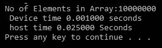

# 第二章：使用 CUDA C 进行并行编程

在上一章中，我们看到了安装 CUDA 和使用它的程序是多么容易。尽管示例并不令人印象深刻，但它被用来向您证明开始使用 CUDA 非常容易。在本章中，我们将在此基础上进行构建。它详细介绍了如何使用 CUDA 为 GPU 编写高级程序。它从一个变量加法程序开始，然后逐步构建到 CUDA C 中的复杂向量操作示例。它还涵盖了内核的工作原理以及如何在 CUDA 程序中使用设备属性。本章讨论了在 CUDA 程序中如何操作向量，以及与 CUDA 编程相关的术语。

本章将涵盖以下主题：

+   内核调用的概念

+   在 CUDA 中创建内核函数并将参数传递给它

+   配置 CUDA 程序的内核参数和内存分配

+   CUDA 程序中的线程执行

+   从 CUDA 程序中访问 GPU 设备属性

+   在 CUDA 程序中处理向量

+   并行通信模式

# 技术要求

本章需要熟悉基本的 C 或 C++ 编程语言，特别是动态内存分配函数。本章中使用的所有代码都可以从以下 GitHub 链接下载：[`github.com/PacktPublishing/Hands-On-GPU-Accelerated-Computer-Vision-with-OpenCV-and-CUDA`](https://github.com/PacktPublishing/Hands-On-GPU-Accelerated-Computer-Vision-with-OpenCV-and-CUDA)。代码可以在任何操作系统上执行，尽管它只在 Windows 10 和 Ubuntu 16.04 上进行了测试。

查看以下视频以查看代码的实际运行情况：

[`bit.ly/2PQmu4O`](http://bit.ly/2PQmu4O)

# CUDA 程序结构

我们之前已经看到了一个非常简单的 `Hello, CUDA!` 程序，它展示了与 CUDA 程序相关的一些重要概念。CUDA 程序是由在主机或 GPU 设备上执行的功能组合而成。不显示并行性的功能在 CPU 上执行，而显示数据并行的功能在 GPU 上执行。GPU 编译器在编译过程中将这些功能分开。正如前一章所看到的，用于在设备上执行的功能使用 `__global__` 关键字定义，并由 NVCC 编译器编译，而正常的 C 主机代码由 C 编译器编译。CUDA 代码基本上是相同的 ANSI C 代码，增加了用于利用数据并行的某些关键字。

因此，在本节中，我们通过一个简单的双变量加法程序来解释与 CUDA 编程相关的重要概念，例如内核调用、从主机到设备传递内核函数的参数、内核参数的配置、用于利用数据并行的 CUDA API，以及主机和设备上的内存分配是如何进行的。

# CUDA C 中的双变量加法程序

在第一章中看到的简单 `Hello, CUDA!` 代码，*介绍 CUDA 和开始使用 CUDA*，设备函数是空的。它没有任何作用。本节解释了一个简单的加法程序，该程序在设备上执行两个变量的加法。尽管它没有利用设备的任何数据并行性，但它对于展示 CUDA C 的重要编程概念非常有用。首先，我们将看到如何编写一个用于加法两个变量的内核函数。

内核函数的代码如下所示：

```py
include <iostream>
#include <cuda.h>
#include <cuda_runtime.h>
//Definition of kernel function to add two variables
__global__ void gpuAdd(int d_a, int d_b, int *d_c) 
{
   *d_c = d_a + d_b;
}
```

`gpuAdd` 函数看起来与在 ANSI C 中实现的正常 `add` 函数非常相似。它接受两个整数变量 `d_a` 和 `d_b` 作为输入，并将加法存储在由第三个整数指针 `d_c` 指示的内存位置。设备函数的返回值是 void，因为它将答案存储在设备指针指向的内存位置，而不是显式返回任何值。现在我们将看到如何编写此代码的主函数。主函数的代码如下所示：

```py

 int main(void) 
{
 //Defining host variable to store answer
   int h_c;
 //Defining device pointer
   int *d_c;
 //Allocating memory for device pointer
   cudaMalloc((void**)&d_c, sizeof(int));
 //Kernel call by passing 1 and 4 as inputs and storing answer in d_c
 //<< <1,1> >> means 1 block is executed with 1 thread per block
   gpuAdd << <1, 1 >> > (1, 4, d_c);
 //Copy result from device memory to host memory
   cudaMemcpy(&h_c, d_c, sizeof(int), cudaMemcpyDeviceToHost);
   printf("1 + 4 = %d\n", h_c);
 //Free up memory
   cudaFree(d_c);
   return 0;
}
```

在 `main` 函数中，前两行定义了主机和设备的变量。第三行使用 `cudaMalloc` 函数在设备上为 `d_c` 变量分配内存。`cudaMalloc` 函数与 C 中的 `malloc` 函数类似。在主函数的第四行中，`gpuAdd` 被调用，使用 `1` 和 `4` 作为两个输入变量，以及 `d_c`，这是一个设备内存指针，作为输出指针变量。`gpuAdd` 函数的奇怪语法，也称为内核调用，将在下一节中解释。如果需要将 `gpuAdd` 的答案用于主机，则必须通过 `cudaMemcpy` 函数将其从设备的内存复制到主机的内存。然后，使用 `printf` 函数打印此答案。最后一行使用 `cudafree` 函数释放设备上使用的内存。显式释放程序中使用的所有设备内存非常重要；否则，你可能会在某个时刻耗尽内存。以 `//` 开头的行是用于提高代码可读性的注释，这些行被编译器忽略。

双变量加法程序有两个函数，`main` 和 `gpuAdd`。正如你所见，`gpuAdd` 是通过使用 `__global__` 关键字定义的，因此它旨在在设备上执行，而主函数将在主机上执行。该程序在设备上添加两个变量，并在命令行上打印输出，如下所示：


在本书中，我们将使用一个约定，即主机变量将以前缀 `h_` 开头，设备变量将以前缀 `d_` 开头。这不是强制性的；这只是为了让读者能够轻松理解概念，而不会在主机和设备之间产生混淆。

所有 CUDA API，如 `cudaMalloc`、`cudaMemcpy` 和 `cudaFree`，以及其他重要的 CUDA 编程概念，如内核调用、向内核传递参数和内存分配问题，将在接下来的章节中讨论。

# 内核调用

使用 ANSI C 关键字以及 CUDA 扩展关键字编写的设备代码被称为 **内核**。它通过一种称为 **内核调用** 的方法从主机代码中启动。基本上，内核调用的意义是我们从主机代码中启动设备代码。内核调用通常会产生大量的块和线程，以在 GPU 上利用数据并行性。内核代码与普通 C 函数非常相似；只是这些代码是由多个线程并行执行的。它有一个非常奇怪的语法，如下所示：

```py
kernel << <number of blocks, number of threads per block, size of shared memory > >> (parameters for kernel)
```

它以我们想要启动的内核的名称开始。你应该确保这个内核是用 `__global__` 关键字定义的。然后，它有 `<< < > >>` 内核启动运算符，其中包含内核的配置参数。它可以包含三个用逗号分隔的参数。第一个参数表示你想要执行的块的数量，第二个参数表示每个块将有多少线程。因此，内核启动启动的总线程数将是这两个数字的乘积。第三个参数，指定内核使用的共享内存的大小，是可选的。在变量加法程序中，内核启动的语法如下：

```py
gpuAdd << <1,1> >> (1 , 4, d_c)
```

在这里，`gpuAdd` 是我们想要启动的内核的名称，而 `<<<1,1>>>` 表示我们想要每个块有一个线程，这意味着我们只启动了一个线程。圆括号中的三个参数是传递给内核的参数。在这里，我们传递了两个常量，`1` 和 `4`。第三个参数是指向设备内存 `d_c` 的指针。它指向内核在加法操作后将在设备内存中存储答案的位置。程序员必须注意的一点是，传递给内核的指针应该只指向设备内存。如果它指向主机内存，可能会使你的程序崩溃。内核执行完成后，设备指针指向的结果可以被复制回主机内存以供进一步使用。在设备上仅启动一个线程进行执行并不是设备资源的最佳使用方式。假设你想要并行启动多个线程；你需要在内核调用的语法中进行哪些修改？这将在下一节中讨论，并被称为“配置内核参数”。

# 配置内核参数

为了在设备上并行启动多个线程，我们不得不在内核调用中配置参数，这些参数被写入内核启动操作符内部。它们指定了每个块中的线程数和块的数量。我们可以通过每个块中的多个线程并行启动多个块。通常，每个块中的线程数限制为 512 或 1,024。每个块在流式多处理器上运行，一个块中的线程可以通过共享内存相互通信。程序员无法选择哪个多处理器将执行特定的块，以及块或线程执行的顺序。

假设你想并行启动 500 个线程；你可以对之前显示的内核启动语法进行哪些修改？一个选项是通过以下语法启动一个包含 500 个线程的块：

```py
gpuAdd<< <1,500> >> (1,4, d_c)
```

我们也可以启动 500 个每个线程的块或 250 个线程的 2 个块。相应地，你必须修改内核启动操作符中的值。程序员必须小心，确保每个块中的线程数不超过 GPU 设备的最大支持限制。在这本书中，我们针对计算机视觉应用，需要处理二维和三维图像。在这里，如果块和线程不是一维的，而是更多维的，将有助于更好的处理和可视化。

GPU 支持三维块网格和三维线程块。它具有以下语法：

```py
mykernel<< <dim3(Nbx, Nby,Nbz), dim3(Ntx, Nty,Ntz) > >> ()  
```

这里 `N[bx]`、`N[by]` 和 `N[bz]` 分别表示在 *x*、*y* 和 *z* 轴方向上的网格中的块数。同样，`N[t][x]`、`N[ty]` 和 `N[tz]` 表示在 *x*、*y* 和 *z* 轴方向上的块中的线程数。如果 *y* 和 *z* 维度未指定，则默认为 `1`。例如，为了处理图像，你可以启动一个 16 x 16 的块网格，所有块都包含 16 x 16 的线程。语法如下：

```py
mykernel << <dim3(16,16),dim3(16,16)> >> ()
```

总结来说，在启动内核时配置块和线程的数量非常重要。应根据我们正在处理的应用程序和 GPU 资源进行适当的考虑。下一节将解释一些在常规 ANSI C 函数之上添加的重要 CUDA 函数。

# CUDA API 函数

在变量加法程序中，我们遇到了一些对常规 C 或 C++程序员来说不熟悉的函数或关键字。这些关键字和函数包括 `__global__`、`cudaMalloc`、`cudaMemcpy` 和 `cudaFree`。因此，在本节中，我们将逐一详细解释这些函数：

+   **__global__**：这是三个限定符关键字之一，与 `__device__` 和 `__host__` 一起。此关键字表示一个函数被声明为设备函数，当从主机调用时将在设备上执行。请注意，此函数只能从主机调用。如果您想使您的函数在设备上执行并从设备函数调用，那么您必须使用 `__device__` 关键字。`__host__` 关键字用于定义只能从其他主机函数调用的主机函数。这类似于正常的 C 函数。默认情况下，程序中的所有函数都是主机函数。`__host__` 和 `__device__` 可以同时使用来定义任何函数。它将生成相同函数的两个副本。一个将在主机上执行，另一个将在设备上执行。

+   **cudaMalloc**：它类似于 C 中用于动态内存分配的 `Malloc` 函数。此函数用于在设备上分配特定大小的内存块。以下是一个 `cudaMalloc` 的语法示例：

```py
cudaMalloc(void ** d_pointer, size_t size)
Example: cudaMalloc((void**)&d_c, sizeof(int));
```

如前一个示例代码所示，它分配了一个与一个整型变量大小相等的内存块，并返回指向该内存位置的指针 `d_c`。

+   **cudaMemcpy**：此函数类似于 C 中的 `Memcpy` 函数。它用于将一块内存从一个主机或设备上的其他块复制。它具有以下语法：

```py
cudaMemcpy ( void * dst_ptr, const void * src_ptr, size_t size, enum cudaMemcpyKind kind )
Example: cudaMemcpy(&h_c, d_c, sizeof(int), cudaMemcpyDeviceToHost);
```

此函数有四个参数。前两个参数是目标指针和源指针，它们指向主机或设备内存位置。第三个参数指示复制的尺寸，最后一个参数指示复制的方向。可以是主机到设备、设备到设备、主机到主机或设备到主机。但请注意，您必须将此方向与前两个参数中的适当指针匹配。如示例所示，我们通过指定设备指针 `d_c` 为源，主机指针 `h_c` 为目标，将一个整型变量的块从设备复制到主机。

+   **cudaFree**：它类似于 C 中可用的 `free` 函数。`cudaFree` 的语法如下：

```py
cudaFree ( void * d_ptr )
Example: cudaFree(d_c)
```

它释放由 `d_ptr` 指向的内存空间。在示例代码中，它释放了由 `d_c` 指向的内存位置。请确保使用 `cudaMalloc` 分配了 `d_c` 的内存，然后使用 `cudaFree` 释放它。

在 CUDA 中，除了现有的 ANSI C 函数之外，还有很多其他关键字和函数可用。我们将经常使用这三个函数，因此它们在本节中进行了讨论。更多详情，您可以随时访问 CUDA 编程指南。

# 向 CUDA 函数传递参数

变量加法程序的 `gpuAdd` 内核函数与正常的 C 函数非常相似。因此，像正常的 C 函数一样，内核函数也可以按值或按引用传递参数。因此，在本节中，我们将看到传递 CUDA 内核参数的两种方法。

# 按值传递参数

如果你还记得，在 `gpuAdd` 程序中，调用内核的语法如下：

```py
gpuAdd << <1,1> >>(1,4,d_c)
```

另一方面，`gpuAdd` 函数在定义中的签名如下：

```py
__global__  gpuAdd(int d_a, int d_b, int *d_c) 
```

因此，你可以看到我们在调用内核时传递了 `d_a` 和 `d_b` 的值。首先，参数 `1` 将被复制到 `d_a`，然后参数 `4` 将在调用内核时复制到 `d_b`。加法操作后的答案将存储在设备内存中由 `d_c` 指向的地址。我们也可以直接将值 `1` 和 `4` 作为内核的输入，如下所示：

```py
gpuAdd << <1,1> >>(a,b,d_c)
```

在这里，`a` 和 `b` 是可以包含任何整数值的整型变量。按值传递参数不建议使用，因为它会在程序中造成不必要的混淆和复杂化。最好是通过引用传递参数。

# 按引用传递参数

现在我们将看到如何通过引用传递参数来编写相同的程序。为此，我们首先需要修改用于两个变量加法的内核函数。按引用传递参数的修改后的内核如下所示：

```py
#include <iostream>
#include <cuda.h>
#include <cuda_runtime.h>
//Kernel function to add two variables, parameters are passed by reference
 __global__ void gpuAdd(int *d_a, int *d_b, int *d_c) 
{
  *d_c = *d_a + *d_b;
}
```

在将整数变量 `d_a` 和 `d_b` 作为内核的输入时，我们取这些变量在设备上的指针 `*d_a` 和 `*d_b` 作为输入。加法操作后的答案将存储在由第三个整数指针 `d_c` 指向的内存位置。传递给这个设备函数的指针应该使用 `cudaMalloc` 函数分配内存。此代码的主函数如下所示：

```py
int main(void) 
{
  //Defining host and variables
  int h_a,h_b, h_c;
  int *d_a,*d_b,*d_c;
  //Initializing host variables
  h_a = 1;
  h_b = 4;
  //Allocating memory for Device Pointers
  cudaMalloc((void**)&d_a, sizeof(int));
  cudaMalloc((void**)&d_b, sizeof(int));
  cudaMalloc((void**)&d_c, sizeof(int));
  //Coping value of host variables in device memory
  cudaMemcpy(d_a, &h_a, sizeof(int), cudaMemcpyHostToDevice);
  cudaMemcpy(d_b, &h_b, sizeof(int), cudaMemcpyHostToDevice);
  //Calling kernel with one thread and one block with parameters passed by reference
  gpuAdd << <1, 1 >> > (d_a, d_b, d_c);
  //Coping result from device memory to host
  cudaMemcpy(&h_c, d_c, sizeof(int), cudaMemcpyDeviceToHost);
  printf("Passing Parameter by Reference Output: %d + %d = %d\n", h_a, h_b, h_c);
  //Free up memory
  cudaFree(d_a);
  cudaFree(d_b);
  cudaFree(d_c);
  return 0;
 }
```

`h_a`、`h_b` 和 `h_c` 是主机内存中的变量。它们像正常的 C 代码一样定义。另一方面，`d_a`、`d_b` 和 `d_c` 是位于主机内存中的指针，它们指向设备内存。它们通过使用 `cudaMalloc` 函数从主机分配内存。`h_a` 和 `h_b` 的值通过使用 `cudaMemcpy` 函数复制到由 `d_a` 和 `d_b` 指向的设备内存中，数据传输方向是从主机到设备。然后，在内核调用中，这三个设备指针作为参数传递给内核。内核执行加法操作并将结果存储在由 `d_c` 指向的内存位置。结果再次通过 `cudaMemcpy` 复制回主机内存，但这次数据传输方向是从设备到主机。程序输出如下：


程序结束时使用 `cudaFree` 释放三个设备指针使用的内存。主机和设备上的示例内存映射将类似于以下内容：

| **主机内存（CPU）** | **设备内存（GPU）** |
| --- | --- |
| 地址 | 值 | 地址 | 值 |
| #01 | h_a=1 | #01 | 1 |
| #02 | h_b=4 | #02 | 4 |
| #03 | h_c=5 | #03 | 5 |
| #04 | d_a=#01 | #04 |  |
| #05 | d_b=#02 | #05 |  |
| #06 | d_c=#03 | #06 |  |

从表中可以看出，`d_a`、`d_b`和`d_c`位于主机上，并指向设备内存中的值。在通过引用传递参数给内核时，你应该注意所有指针都只指向设备内存。如果不是这样，程序可能会崩溃。

在使用设备指针并将它们传递给内核时，程序员必须遵循一些限制。使用`cudaMalloc`分配内存的设备指针只能用于从设备内存中读取或写入。它们可以作为参数传递给设备函数，但不应用于从主机函数中读取和写入内存。为了简化，设备指针应用于从设备函数中读取和写入设备内存，而主机指针应用于从主机函数中读取和写入主机内存。因此，在本书中，你将始终在内核函数中看到以`d_`为前缀的设备指针。

总结来说，在本节中，通过以两个变量的附加程序为例，详细解释了与 CUDA 编程相关的概念。在本节之后，你应该熟悉基本的 CUDA 编程概念以及与 CUDA 程序相关的术语。在下一节中，你将学习如何在设备上执行线程。

# 在设备上执行线程

我们已经看到，在配置内核参数时，我们可以并行启动多个块和多个线程。那么，这些块和线程的启动和完成执行的顺序是怎样的呢？如果我们想在其他线程中使用一个线程的输出，了解这一点很重要。为了理解这一点，我们修改了第一章节中看到的`hello,CUDA!`程序中的内核，通过在内核调用中包含一个打印语句来打印块号。修改后的代码如下：

```py
#include <iostream>
#include <stdio.h>
__global__ void myfirstkernel(void) 
{
  //blockIdx.x gives the block number of current kernel
   printf("Hello!!!I'm thread in block: %d\n", blockIdx.x);
}
int main(void) 
{
   //A kernel call with 16 blocks and 1 thread per block
   myfirstkernel << <16,1>> >();

   //Function used for waiting for all kernels to finish
   cudaDeviceSynchronize();

   printf("All threads are finished!\n");
   return 0;
}
```

从代码中可以看出，我们正在并行启动一个内核，有 16 个块，每个块有一个线程。在内核代码中，我们正在打印内核执行的块 ID。我们可以认为 16 个相同的`myfirstkernel`副本并行开始执行。每个副本都将有一个唯一的块 ID，可以通过`blockIdx.x CUDA`指令访问，以及一个唯一的线程 ID，可以通过`threadIdx.x`访问。这些 ID 将告诉我们哪个块和线程正在执行内核。当你多次运行程序时，你会发现，每次块执行的顺序都不同。一个示例输出如下所示：


您应该问的一个问题是，前面的程序将产生多少种不同的输出模式？正确的答案是 16！它将产生*n*阶乘数量的输出，其中*n*表示并行启动的块的数量。因此，每次在 CUDA 中编写程序时，您都应该小心，确保块以随机顺序执行。

此程序还包含一个额外的 CUDA 指令：`cudaDeviceSynchronize()`。为什么使用它？这是因为内核启动是一个异步过程，这意味着在内核完成执行之前，它会立即将控制权返回给启动 GPU 进程之前的 CPU 线程。在前面的代码中，CPU 线程的下一行是`print`，应用程序退出将在内核完成执行之前终止控制台。因此，如果我们不包括此指令，您将看不到任何内核执行的打印语句。内核随后生成的输出将无处可去，您将看不到它。为了看到内核生成的输出，我们将包括此指令，这确保了内核在应用程序被允许退出之前完成，并且内核的输出将找到**等待的标准输出队列**。

# 从 CUDA 程序中访问 GPU 设备属性

CUDA 提供了一个简单的接口来查找信息，例如确定哪些 CUDA 启用型 GPU 设备（如果有）存在以及每个设备支持哪些功能。首先，重要的是要获取系统上 CUDA 启用型设备数量的统计，因为一个系统可能包含多个启用 GPU 的设备。这个数量可以通过 CUDA API `cudaGetDeviceCount()` 来确定。获取系统上 CUDA 启用型设备数量的程序如下所示：

```py
#include <memory>
#include <iostream>
#include <cuda_runtime.h>
// Main Program 
int main(void)
{
  int device_Count = 0;
  cudaGetDeviceCount(&device_Count);
  // This function returns count of number of CUDA enable devices and 0 if there are no CUDA capable devices.
  if (device_Count == 0)
  {
     printf("There are no available device(s) that support CUDA\n");
  }
  else
  {
     printf("Detected %d CUDA Capable device(s)\n", device_Count);
  }
}
```

通过查询`cudaDeviceProp`结构可以找到每个设备的相关信息，该结构返回所有设备属性。如果您有多个 CUDA 能力型设备，则可以启动一个 for 循环来遍历所有设备属性。以下部分包含设备属性列表，分为不同的集合以及用于从 CUDA 程序中访问它们的简短代码片段。这些属性由 CUDA 9 运行时中的`cudaDeviceProp`结构提供。

如需了解 CUDA 不同版本中属性的相关详细信息，您可以查看特定版本的编程指南。

# 通用设备属性

`cudaDeviceProp`提供了几个属性，可用于识别设备和正在使用的版本。它提供了一个`name`属性，该属性以字符串形式返回设备名称。我们还可以通过查询`cudaDriverGetVersion`和`cudaRuntimeGetVersion`属性来获取设备使用的驱动程序和运行时引擎的版本。有时，如果您有多个设备，您可能希望使用具有更多多处理器的设备。`multiProcessorCount`属性返回设备上多处理器的数量。通过使用`clockRate`属性可以获取 GPU 的时钟速度，它以千赫兹为单位返回时钟频率。以下代码片段展示了如何从 CUDA 程序中使用这些属性：

```py
cudaDeviceProp device_Property;
cudaGetDeviceProperties(&device_Property, device);
printf("\nDevice %d: \"%s\"\n", device, device_Property.name);
cudaDriverGetVersion(&driver_Version);
cudaRuntimeGetVersion(&runtime_Version);
printf(" CUDA Driver Version / Runtime Version %d.%d / %d.%d\n", driver_Version / 1000, (driver_Version % 100) / 10, runtime_Version / 1000, (runtime_Version % 100) / 10);
printf( " Total amount of global memory: %.0f MBytes (%llu bytes)\n",
 (float)device_Property.totalGlobalMem / 1048576.0f, (unsigned long long) device_Property.totalGlobalMem);
 printf(" (%2d) Multiprocessors", device_Property.multiProcessorCount );
printf("  GPU Max Clock rate: %.0f MHz (%0.2f GHz)\n", device_Property.clockRate * 1e-3f, device_Property.clockRate * 1e-6f);
```

# 与内存相关的属性

GPU 上的内存具有分层架构。它可以按 L1 缓存、L2 缓存、全局内存、纹理内存和共享内存来划分。`cudaDeviceProp`提供了许多属性，有助于识别设备上可用的内存。`memoryClockRate`和`memoryBusWidth`分别提供内存的时钟频率和总线宽度。内存的速度非常重要，它会影响您程序的整体速度。`totalGlobalMem`返回设备上可用的全局内存大小。`totalConstMem`返回设备上可用的总常量内存。`sharedMemPerBlock`返回设备中可以使用的总共享内存。每个块可用的寄存器总数可以通过使用`regsPerBlock`来识别。L2 缓存的大小可以通过`l2CacheSize`属性来识别。以下代码片段展示了如何从 CUDA 程序中使用内存相关的属性：

```py
printf( " Total amount of global memory: %.0f MBytes (%llu bytes)\n",
(float)device_Property.totalGlobalMem / 1048576.0f, (unsigned long long) device_Property.totalGlobalMem);
printf(" Memory Clock rate: %.0f Mhz\n", device_Property.memoryClockRate * 1e-3f);
printf(" Memory Bus Width: %d-bit\n", device_Property.memoryBusWidth);
if (device_Property.l2CacheSize)
{
    printf(" L2 Cache Size: %d bytes\n", device_Property.l2CacheSize);
}
printf(" Total amount of constant memory: %lu bytes\n",         device_Property.totalConstMem);
printf(" Total amount of shared memory per block: %lu bytes\n", device_Property.sharedMemPerBlock);
printf(" Total number of registers available per block: %d\n", device_Property.regsPerBlock);
```

# 与线程相关的属性

如前几节所示，块和线程可以是多维的。因此，了解每个维度中可以并行启动多少线程和块将很有帮助。每个多处理器和每个块的线程数量也有上限。这个数量可以通过使用`maxThreadsPerMultiProcessor`和`maxThreadsPerBlock`来找到。这在内核参数配置中非常重要。如果您在每个块中启动的线程数超过了每个块可能的最大线程数，则您的程序可能会崩溃。每个维度中每个块的最大线程数可以通过`maxThreadsDim`来识别。同样，每个维度中每个网格的最大块数可以通过使用`maxGridSize`来识别。这两个属性都返回一个包含三个值的数组，分别表示*x*、*y*和*z*维度上的最大值。以下代码片段展示了如何从 CUDA 代码中使用线程相关的属性：

```py
printf(" Maximum number of threads per multiprocessor: %d\n",              device_Property.maxThreadsPerMultiProcessor);
printf(" Maximum number of threads per block: %d\n",         device_Property.maxThreadsPerBlock);
printf(" Max dimension size of a thread block (x,y,z): (%d, %d, %d)\n",
    device_Property.maxThreadsDim[0],
    device_Property.maxThreadsDim[1],
    device_Property.maxThreadsDim[2]);
printf(" Max dimension size of a grid size (x,y,z): (%d, %d, %d)\n",
    device_Property.maxGridSize[0],
    device_Property.maxGridSize[1],
    device_Property.maxGridSize[2]);
```

在`cudaDeviceProp`结构体中还有许多其他属性可用。您可以查阅 CUDA 编程指南以获取其他属性的详细信息。以下是在 NVIDIA Geforce 940MX GPU 和 CUDA 9.0 上执行并组合所有先前代码段输出的结果：


你可能会问的一个问题是，为什么你应该对了解设备属性感兴趣。答案是，这将帮助你在存在多个 GPU 设备的情况下选择具有更多多处理器的 GPU 设备。如果您的应用程序中的内核需要与 CPU 进行紧密交互，那么您可能希望内核在共享系统内存的集成 GPU 上运行。这些属性还将帮助您找到设备上可用的块数和每个块中的线程数。这将帮助您配置内核参数。为了向您展示设备属性的一个用途，假设您有一个需要双精度浮点运算的应用程序。并非所有 GPU 设备都支持此操作。为了知道您的设备是否支持双精度浮点运算，并将该设备设置为您的应用程序，可以使用以下代码：

```py
#include <memory>
#include <iostream>
#include <cuda_runtime.h>
// Main Program
int main(void)
{
int device;
cudaDeviceProp device_property;
cudaGetDevice(&device);
printf("ID of device: %d\n", device);
memset(&device_property, 0, sizeof(cudaDeviceProp));
device_property.major = 1;
device_property.minor = 3;
cudaChooseDevice(&device, &device_property);
printf("ID of device which supports double precision is: %d\n", device);
cudaSetDevice(device);
}
```

此代码使用了`cudaDeviceprop`结构中可用的两个属性，这些属性有助于确定设备是否支持双精度运算。这两个属性是主版本号和次版本号。CUDA 文档告诉我们，如果主版本号大于 1 且次版本号大于 3，则该设备将支持双精度运算。因此，程序中的`device_property`结构被填充了这两个值。CUDA 还提供了`cudaChooseDevice` API，该 API 有助于选择具有特定属性的设备。此 API 用于当前设备，以确定它是否包含这两个属性。如果包含属性，则使用`cudaSetDevice` API 选择该设备用于您的应用程序。如果系统中存在多个设备，则此代码应编写在一个循环中，以便遍历所有设备。

虽然很简单，但这一部分对于您了解哪些应用程序可以由您的 GPU 设备支持以及哪些不支持非常重要。

# CUDA 中的向量运算

到目前为止，我们看到的程序都没有利用 GPU 设备的并行处理能力。它们只是编写来让您熟悉 CUDA 中的编程概念。从本节开始，我们将通过在 GPU 上执行向量或数组运算来利用 GPU 的并行处理能力。

# 两个向量加法程序

要理解 GPU 上的向量运算，我们首先将在 CPU 上编写一个向量加法程序，然后修改它以利用 GPU 的并行结构。我们将取两个数字数组，并将逐元素加法的结果存储在第三个数组中。CPU 上的向量加法函数如下所示：

```py
#include "stdio.h"
#include<iostream>
 //Defining Number of elements in Array
#define N 5
 //Defining vector addition function for CPU
void cpuAdd(int *h_a, int *h_b, int *h_c) 
{
     int tid = 0;
     while (tid < N)
     {
         h_c[tid] = h_a[tid] + h_b[tid];
         tid += 1;
     }
 }
```

`cpuAdd` 应该非常容易理解。你可能觉得难以理解的是 `tid` 的使用。它被包含进来是为了使程序与 GPU 程序相似，其中 `tid` 表示特定的线程 ID。在这里，如果你有一个多核 CPU，那么你可以为每个核心初始化 `tid` 为 0 和 1，然后在循环中将其加 2，这样其中一个 CPU 将对偶数元素进行求和，而另一个 CPU 将对奇数元素进行加法。代码的 `main` 函数如下所示：

```py
int main(void) 
{
   int h_a[N], h_b[N], h_c[N];
   //Initializing two arrays for addition
   for (int i = 0; i < N; i++) 
   {
     h_a[i] = 2 * i*i;
     h_b[i] = i;
     }
   //Calling CPU function for vector addition
   cpuAdd (h_a, h_b, h_c);
   //Printing Answer
   printf("Vector addition on CPU\n");
   for (int i = 0; i < N; i++) 
   {
     printf("The sum of %d element is %d + %d = %d\n", i, h_a[i], h_b[i],             h_c[i]);
   }
   return 0;
 }
```

程序中有两个函数：`main` 和 `cpuAdd`。在 `main` 函数中，我们首先定义了两个数组来存储输入，并将其初始化为一些随机数。然后，我们将这两个数组作为输入传递给 `cpuAdd` 函数。`cpuAdd` 函数将答案存储在第三个数组中。然后，我们在控制台上打印这个答案，如下所示：


使用 `tid in cpuadd` 函数的解释可能给你一些如何为 GPU 执行编写相同函数的思路，因为 GPU 可以并行处理多个核心。如果我们用那个核心的 ID 来初始化这个加法函数，那么我们就可以并行地对所有元素进行加法运算。因此，GPU 上加法操作的修改后的内核函数如下所示：

```py
#include "stdio.h"
#include<iostream>
#include <cuda.h>
#include <cuda_runtime.h>
 //Defining number of elements in Array
#define N 5
 //Defining Kernel function for vector addition
__global__ void gpuAdd(int *d_a, int *d_b, int *d_c) 
{
 //Getting block index of current kernel
     int tid = blockIdx.x; // handle the data at this index
     if (tid < N)
     d_c[tid] = d_a[tid] + d_b[tid];
 }
```

在 `gpuAdd` 内核函数中，`tid` 被初始化为当前内核执行的块的块 ID。所有内核都将添加由该块 ID 索引的数组元素。如果块的数量等于数组中的元素数量，那么所有加法操作都将并行执行。接下来将解释如何从 `main` 函数中调用这个内核。`main` 函数的代码如下：

```py
int main(void) 
{
 //Defining host arrays
 int h_a[N], h_b[N], h_c[N];
 //Defining device pointers
 int *d_a, *d_b, *d_c;
 // allocate the memory
 cudaMalloc((void**)&d_a, N * sizeof(int));
 cudaMalloc((void**)&d_b, N * sizeof(int));
 cudaMalloc((void**)&d_c, N * sizeof(int));
 //Initializing Arrays
 for (int i = 0; i < N; i++) 
    {
     h_a[i] = 2*i*i;
     h_b[i] = i ;
     }

// Copy input arrays from host to device memory
 cudaMemcpy(d_a, h_a, N * sizeof(int), cudaMemcpyHostToDevice);
 cudaMemcpy(d_b, h_b, N * sizeof(int), cudaMemcpyHostToDevice);

//Calling kernels with N blocks and one thread per block, passing device pointers as parameters
gpuAdd << <N, 1 >> >(d_a, d_b, d_c);
 //Copy result back to host memory from device memory
cudaMemcpy(h_c, d_c, N * sizeof(int), cudaMemcpyDeviceToHost);
printf("Vector addition on GPU \n");
 //Printing result on console
for (int i = 0; i < N; i++) 
{
     printf("The sum of %d element is %d + %d = %d\n", i, h_a[i], h_b[i],             h_c[i]);
}
 //Free up memory
 cudaFree(d_a);
 cudaFree(d_b);
 cudaFree(d_c);
 return 0;
}
```

GPU 的 `main` 函数具有本章第一部分所述的已知结构：

+   它从定义主机和设备的数组和指针开始。使用 `cudaMalloc` 函数为设备指针分配内存。

+   要传递给内核的数组通过使用 `cudaMemcpy` 函数从主机内存复制到设备内存。

+   内核是通过将设备指针作为参数传递给它来启动的。如果你看到内核启动操作符内的值，它们是 *N* 和 *1*，这表示我们正在启动 *N* 个块，每个块有一个线程。

+   内核在设备内存中存储的答案通过再次使用 `cudaMemcpy` 被复制回主机内存，但这次数据传输的方向是从设备到主机。

+   最后，使用 `cudaFree` 函数释放分配给三个设备指针的内存。程序的输出如下：


所有 CUDA 程序都遵循之前显示的相同模式。我们在并行启动 N 个块。这意味着我们同时启动了 N 个相同的内核副本。你可以通过一个现实生活中的例子来理解这一点：假设你想要将五个大箱子从一个地方运到另一个地方。在第一种方法中，你可以通过雇佣一个人来完成这个任务，这个人从一处运到另一处，然后重复五次。这个选项会花费时间，这类似于向量在 CPU 上是如何加的。现在，假设你雇佣了五个人，每个人携带一个箱子。他们每个人也知道他们携带的箱子的 ID。这个选项将比之前的选项快得多。他们每个人只需要被告知他们必须携带一个特定 ID 的箱子从一处运到另一处。

这正是内核在设备上定义和执行的方式。每个内核副本都知道自己的 ID。这可以通过`blockIdx.x`命令来知道。每个副本在其 ID 索引的数组元素上工作。所有副本并行地添加所有元素，这显著减少了整个数组的处理时间。所以，从某种意义上说，我们通过在 CPU 的顺序执行上并行执行操作来提高吞吐量。CPU 代码和 GPU 代码之间的吞吐量比较将在下一节中解释。

# 比较 CPU 和 GPU 代码之间的延迟

CPU 和 GPU 的加法程序以模块化的方式编写，这样你可以玩转 N 的值。如果 N 很小，那么你不会注意到 CPU 和 GPU 代码之间有显著的时间差异。但是，如果你 N 足够大，那么你将注意到相同向量加法中 CPU 执行时间和 GPU 执行时间的显著差异。可以通过在现有代码中添加以下行来测量特定块的执行时间：

```py
clock_t start_d = clock();
printf("Doing GPU Vector add\n");
gpuAdd << <N, 1 >> >(d_a, d_b, d_c);
cudaThreadSynchronize();
clock_t end_d = clock();
double time_d = (double)(end_d - start_d) / CLOCKS_PER_SEC;
printf("No of Elements in Array:%d \n Device time %f seconds \n host time %f Seconds\n", N, time_d, time_h);
```

时间是通过计算执行特定操作所花费的总时钟周期数来衡量的。这可以通过使用`clock()`函数测量的开始和结束的时钟滴答计数之差来完成。这个差值除以每秒的时钟周期数，以得到执行时间。当在 CPU 和 GPU 之前的向量加法程序中将 N 设置为 10,000,000 并同时执行时，输出如下：



从输出中可以看出，当相同的函数在 GPU 上实现时，执行时间或吞吐量从 25 毫秒提高到了几乎 1 毫秒。这证明了我们在理论中之前看到的事实，即在 GPU 上并行执行代码有助于提高吞吐量。CUDA 提供了一个高效且准确的方法来测量 CUDA 程序的性能，使用 CUDA 事件，这将在后面的章节中解释。

# CUDA 中向量的逐元素平方

现在，你可以问的一个问题是，既然我们正在每个块中用一个线程并行启动 N 个块，我们能否以相反的方式工作？答案是 *是的*。我们可以并行地只启动一个包含 N 个线程的块。为了展示这一点并让你更熟悉在 CUDA 中围绕向量工作，我们以数组中数字逐元素平方的第二个例子为例。我们取一个数字数组，并返回一个包含这些数字平方的数组。用于找到逐元素平方的内核函数如下所示：

```py
#include "stdio.h"
#include<iostream>
#include <cuda.h>
#include <cuda_runtime.h>
 //Defining number of elements in Array
#define N 5
//Kernel function for squaring number
__global__ void gpuSquare(float *d_in, float *d_out) 
{
     //Getting thread index for current kernel
     int tid = threadIdx.x; // handle the data at this index
     float temp = d_in[tid];
     d_out[tid] = temp*temp;
 }
```

`gpuSquare` 内核函数有两个数组的指针作为参数。第一个指针 `d_in` 指向存储输入数组的内存位置，而第二个指针 `d_out` 指向存储输出的内存位置。在这个程序中，我们不想并行启动多个块，而是想并行启动多个线程，因此使用 `threadIdx.x` 初始化 `tid` 为特定的线程 ID。这个程序的主函数如下所示：

```py
int main(void) 
{
 //Defining Arrays for host
     float h_in[N], h_out[N];
     float *d_in, *d_out;
// allocate the memory on the cpu
     cudaMalloc((void**)&d_in, N * sizeof(float));
     cudaMalloc((void**)&d_out, N * sizeof(float));
 //Initializing Array
     for (int i = 0; i < N; i++) 
    {
         h_in[i] = i;
     }
 //Copy Array from host to device
     cudaMemcpy(d_in, h_in, N * sizeof(float), cudaMemcpyHostToDevice);
 //Calling square kernel with one block and N threads per block
     gpuSquare << <1, N >> >(d_in, d_out);
 //Coping result back to host from device memory
     cudaMemcpy(h_out, d_out, N * sizeof(float), cudaMemcpyDeviceToHost);
 //Printing result on console
     printf("Square of Number on GPU \n");
     for (int i = 0; i < N; i++) 
     {
         printf("The square of %f is %f\n", h_in[i], h_out[i]);
     }
 //Free up memory
     cudaFree(d_in);
     cudaFree(d_out);
     return 0;
 }
```

这个主函数遵循与向量加法程序相似的结构。你在这里会看到的一个区别是，我们正在并行地启动一个包含 N 个线程的单个块。程序输出如下：


每次你使用这种方式并行启动 N 个线程时，你应该注意每个块的最大线程数限制为 512 或 1,024。因此，N 的值应该小于这个值。如果你的设备每个块的最大线程数是 512，而 N 是 2,000，那么你不能写 `<< <1,2000 > >>`。相反，你应该使用类似 `<< <4,500> >>` 这样的东西。应该明智地选择块的数量和每个块中线程的数量。

总结一下，我们学习了如何处理向量，以及我们如何并行地启动多个块和多个线程。我们还看到，通过在 GPU 上执行向量操作，与在 CPU 上执行相同的操作相比，它提高了吞吐量。在本章的最后部分，我们将讨论线程并行执行时遵循的各种并行通信模式。

# 并行通信模式

当多个线程并行执行时，它们遵循一定的通信模式，这表明它们在哪里获取输入以及在内存中写入输出。我们将逐一讨论每种通信模式。这将帮助你识别与你的应用程序相关的通信模式以及如何编写相应的代码。

# 映射

在这种通信模式中，每个线程或任务取单个输入并产生单个输出。基本上，它是一个一对一的操作。前面章节中看到的向量加法程序和逐元素平方程序是映射模式的例子。映射模式的代码如下所示：

```py
d_out[i] = d_in[i] * 2
```

# Gather

在这种模式中，每个线程或任务有多个输入，并且它产生一个输出，该输出将被写入内存中的单个位置。假设你想编写一个程序来找到三个数的移动平均值；这是一个收集操作的例子。它从内存中获取三个输入，并将单个输出写入内存。因此，在输入端有数据重用。这基本上是一个多对一的操作。收集模式的代码如下所示：

```py
out[i] = (in [i-1] + in[i] + in[i+1])/3
```

# 散列

在散列模式中，一个线程或任务取单个输入并计算在内存中应该写入输出的位置。数组排序是一个散列操作的例子。它也可以是一对多操作。散列模式的代码如下所示：

```py
out[i-1] += 2 * in[i] and out[i+1] += 3*in[i]  
```

# 模板

当线程或任务从一个数组的固定邻域集合中读取输入时，这被称为**模板****通信模式**。它在图像处理示例中非常有用，我们在 3x3 或 5x5 邻域窗口上工作。它是一种特殊的收集操作形式，因此代码语法与之相似。

# 转置

当输入以行主序矩阵的形式存在，而我们希望输出以列主序形式时，我们必须使用这种转置通信模式。如果你有一个数组结构并且想要将其转换为结构数组的形式，这尤其有用。它也是一种一对一操作。转置模式的代码如下所示：

```py
out[i+j*128] = in [j +i*128]
```

在本节中，讨论了 CUDA 编程遵循的各种通信模式。找到与你的应用程序相关的通信模式并使用该模式的代码语法（如示例所示）是有用的。

# 摘要

总结来说，在本章中，你被介绍了 CUDA C 的编程概念以及如何使用 CUDA 进行并行计算。展示了 CUDA 程序可以高效且并行地运行在任何 NVIDIA GPU 硬件上。因此，CUDA 既高效又可扩展。详细讨论了在并行数据计算中需要的超出现有 ANSI C 函数的 CUDA API 函数。还通过一个简单的两个变量加法示例讨论了如何通过内核调用从主机代码调用设备代码、配置内核参数以及向内核传递参数。还展示了 CUDA 不保证块或线程的运行顺序以及哪个块被分配到哪个多处理器。此外，还讨论了利用 GPU 和 CUDA 的并行处理能力进行的向量操作。可以看出，通过在 GPU 上执行向量操作，与 CPU 相比，可以显著提高吞吐量。在最后一节中，详细讨论了并行编程中遵循的各种常见通信模式。然而，我们还没有讨论内存架构以及线程如何在 CUDA 中相互通信。如果一个线程需要其他线程的数据，那么可以做什么也没有讨论。因此，在下一章中，我们将详细讨论内存架构和线程同步。 

# 问题

1.  编写一个 CUDA 程序来减去两个数字。在内核函数中通过值传递参数。

1.  编写一个 CUDA 程序来乘以两个数字。在内核函数中通过引用传递参数。

1.  假设你想要并行启动 5,000 个线程。以三种不同的方式配置内核参数来完成此操作。每个块最多可以有 512 个线程。

1.  对或错：程序员可以决定在设备上块将按何种顺序执行，以及块将被分配到哪个流多处理器？

1.  编写一个 CUDA 程序以找出你的系统包含一个主次版本为 5.0 或更高版本的 GPU 设备。

1.  编写一个 CUDA 程序来找到一个包含从 0 到 49 的数字的向量的立方。

1.  对于以下应用，哪种通信模式是有用的？

    1.  图像处理

    1.  移动平均

    1.  按升序排序数组

    1.  在数组中查找数字的立方
