# 第三章：线程、同步和内存

在上一章中，我们看到了如何编写 CUDA 程序，通过并行执行多个线程和块来利用 GPU 的处理能力。在所有程序中，直到上一章，所有线程都是相互独立的，并且多个线程之间没有通信。大多数现实生活中的应用程序需要中间线程之间的通信。因此，在本章中，我们将详细探讨如何在不同线程之间进行通信，并解释在处理相同数据的多线程之间的同步。我们将检查 CUDA 的分层内存架构以及如何使用不同的内存来加速 CUDA 程序。本章的最后部分解释了 CUDA 在向量点积和矩阵乘法中的一个非常有用应用，使用我们之前覆盖的所有概念。

本章将涵盖以下主题：

+   线程调用

+   CUDA 内存架构

+   全局、局部和缓存内存

+   共享内存和线程同步

+   原子操作

+   常量和纹理内存

+   点积和矩阵乘法示例

# 技术要求

本章要求熟悉基本的 C 或 C++编程语言以及前几章中解释的代码。本章中使用的所有代码都可以从以下 GitHub 链接下载：[`GitHub.com/PacktPublishing/Hands-On-GPU-Accelerated-Computer-Vision-with-OpenCV-and-CUDA`](https://github.com/PacktPublishing/Hands-On-GPU-Accelerated-Computer-Vision-with-OpenCV-and-CUDA)。代码可以在任何操作系统上执行，尽管它只在 Windows 10 上进行了测试。

查看以下视频以查看代码的实际运行情况：

[`bit.ly/2prnGAD`](http://bit.ly/2prnGAD)

# 线程

CUDA 在并行执行方面具有分层架构。内核执行可以在多个块上并行进行。每个块进一步分为多个线程。在上一章中，我们看到了 CUDA 运行时可以通过多次启动内核的相同副本来执行并行操作。我们看到了两种方法：要么并行启动多个块，每个块一个线程，要么启动单个块，并行启动多个线程。所以，你可能会有两个问题，我应该在我的代码中使用哪种方法？以及，并行启动的块和线程数量有什么限制？

这些问题的答案至关重要。正如我们将在本章后面看到的那样，同一块中的线程可以通过共享内存相互通信。因此，并行启动一个包含许多线程的块是有优势的，这样它们就可以相互通信。在上一章中，我们也看到了`maxThreadPerBlock`属性，它限制了每个块可以启动的线程数。对于最新的 GPU，其值为 512 或 1,024。同样，在第二种方法中，并行启动的最大块数限制为 65,535。

理想情况下，我们不是在每个单独的块中启动多个线程，或者不是在单个线程中启动多个块，而是在并行中启动多个块，每个块都有多个线程（可以等于`maxThreadPerBlock`）。所以，假设你想要在向量加法示例中并行启动 N = 50,000 个线程，这是我们上一章看到的。内核调用如下：

`gpuAdd<< <((N +511)/512),512 > >>(d_a,d_b,d_c)`

每个块的线程数最大为 512，因此总块数是通过将总线程数（N）除以 512 来计算的。但如果 N 不是 512 的准确倍数，那么 N 除以 512 可能会给出错误的块数，这个块数比实际数量少一个。因此，为了得到块数的下一个最高整数值，将 511 加到 N 上，然后再除以 512。这基本上是对除法进行**向上取整**操作。

现在，问题是，这对所有 N 的值都适用吗？答案是，很遗憾，不适用。从前面的讨论中可以看出，总块数不能超过 65,535。因此，在前面提到的内核调用中，如果`(N+511)/512`超过 65,535，那么代码将再次失败。为了克服这个问题，通过在内核代码中做一些修改，启动了少量块和线程，我们将在重写向量加法程序内核时进一步看到，如第二章中所述，*使用 Cuda C 进行并行编程*：

```py
#include "stdio.h"
#include<iostream>
#include <cuda.h>
#include <cuda_runtime.h>
//Defining number of elements in array
#define N 50000
__global__ void gpuAdd(int *d_a, int *d_b, int *d_c)
{
    //Getting index of current kernel
  int tid = threadIdx.x + blockIdx.x * blockDim.x; 

  while (tid < N)
    {
       d_c[tid] = d_a[tid] + d_b[tid];
       tid += blockDim.x * gridDim.x;
    }
}
```

这个内核代码与我们上一章中写的类似。它有两个修改。一个修改是在线程 ID 的计算中，第二个修改是在内核函数中包含`while`循环。线程 ID 计算的变化是由于并行启动多个线程和块。可以通过将块和线程视为一个二维矩阵来理解这个计算，其中块的数量等于行数，列数等于每个块的线程数。以下是一个例子，有三个块和三个线程/块，如下表所示：

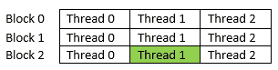

我们可以通过使用`blockIdx.x`获取每个块的 ID，通过`threadIdx.x`命令获取当前块中每个线程的 ID。因此，对于显示为绿色的线程，块 ID 将是 2，线程 ID 将是 1。但如果我们想要一个在所有线程中唯一的索引呢？这可以通过将其块 ID 乘以每个块的总线程数（由`blockDim.x`给出）来计算，然后加上其线程 ID。这可以用以下数学公式表示：

```py
tid = threadIdx.x + blockIdx.x * blockDim.x; 
```

例如，在绿色部分，`threadIdx.x = 1`，`blockIdx.x = 2`，`blockDim.x = 3` 等于 `tid = 7`。这个计算非常重要，因为它将在你的代码中被广泛使用。

`while`循环被包含在代码中，因为当 N 非常大时，由于前面描述的限制，总线程数不能等于 N。因此，一个线程必须执行多个操作，这些操作由启动的总线程数分隔。这个值可以通过将`blockDim.x`乘以`gridDim.x`来计算，这分别给出了块和网格的维度。在`while`循环内部，线程 ID 通过这个偏移值增加。现在，这段代码将对任何 N 值都有效。为了完成程序，我们将为这段代码编写以下主函数：

```py
int main(void) 
{
    //Declare host and device arrays
  int h_a[N], h_b[N], h_c[N];
  int *d_a, *d_b, *d_c;

    //Allocate Memory on Device
  cudaMalloc((void**)&d_a, N * sizeof(int));
  cudaMalloc((void**)&d_b, N * sizeof(int));
  cudaMalloc((void**)&d_c, N * sizeof(int));
    //Initialize host array
  for (int i = 0; i < N; i++) 
  {
    h_a[i] = 2 * i*i;
    h_b[i] = i;
  }

  cudaMemcpy(d_a, h_a, N * sizeof(int), cudaMemcpyHostToDevice);
  cudaMemcpy(d_b, h_b, N * sizeof(int), cudaMemcpyHostToDevice);
    //Kernel Call
  gpuAdd << <512, 512 >> >(d_a, d_b, d_c);

  cudaMemcpy(h_c, d_c, N * sizeof(int), cudaMemcpyDeviceToHost);
    //This ensures that kernel execution is finishes before going forward
  cudaDeviceSynchronize();
  int Correct = 1;
  printf("Vector addition on GPU \n");
  for (int i = 0; i < N; i++) 
  {
    if ((h_a[i] + h_b[i] != h_c[i]))
      { Correct = 0; }
  }
  if (Correct == 1)
  { 
    printf("GPU has computed Sum Correctly\n"); 
  }
  else
  { 
    printf("There is an Error in GPU Computation\n");
  }
    //Free up memory
  cudaFree(d_a);
  cudaFree(d_b);
   cudaFree(d_c);
  return 0;
}

```

再次强调，主要功能与我们上次写的内容非常相似。唯一的变化在于我们如何启动核函数。核函数以 512 个块的方式启动，每个块包含 512 个并行线程。这将解决 N 值较大的问题。我们不再打印一个非常长的向量的加法，而只打印一条指示计算结果是否正确的打印语句。代码的输出将如下所示：

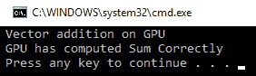

本节解释了 CUDA 中的分层执行概念。下一节将进一步解释这个概念，通过解释分层内存架构。

# 内存架构

在 GPU 上执行代码被分配到流多处理器、块和线程中。GPU 有几个不同的内存空间，每个空间都有特定的特性和用途，以及不同的速度和范围。这个内存空间被分层划分为不同的部分，如全局内存、共享内存、局部内存、常量内存和纹理内存，并且它们可以从程序的不同点访问。这个内存架构在先前的图中显示：


如图中所示，每个线程都有自己的本地内存和寄存器文件。与处理器不同，GPU 核心拥有大量的寄存器来存储本地数据。当线程的数据不适合寄存器文件时，会使用本地内存。这两者都是每个线程独有的。寄存器文件是最快的内存。同一块中的线程共享内存，可以被该块中的所有线程访问。它用于线程间的通信。存在一个全局内存，可以被所有块和所有线程访问。全局内存具有较大的内存访问延迟。存在一种缓存的概念来加速这一操作。L1 和 L2 缓存如以下表格所示。存在一个只读的常量内存，用于存储常量和内核参数。最后，存在一个纹理内存，可以利用不同的二维或三维访问模式。

所有内存的特性总结在以下表格中：

| **内存** | **访问模式** | **速度** | **缓存？** | **作用域** | **生命周期** |
| --- | --- | --- | --- | --- | --- |
| 全局 | 读写 | 慢 | 是 | 主机和所有线程 | 整个程序 |
| 本地 | 读写 | 慢 | 是 | 每个线程 | 线程 |
| 寄存器 | 读写 | 快 | - | 每个线程 | 线程 |
| 共享 | 读写 | 快 | 否 | 每个块 | 块 |
| 常量 | 只读 | 慢 | 是 | 主机和所有线程 | 整个程序 |
| 纹理 | 只读 | 慢 | 是 | 主机和所有线程 | 整个程序 |

上述表格描述了所有内存的重要特性。作用域定义了程序可以使用此内存的部分，生命周期定义了该内存中的数据对程序可见的时间。除此之外，L1 和 L2 缓存也适用于 GPU 程序以实现更快的内存访问。

总结来说，所有线程都有一个寄存器文件，这是最快的。同一块中的多个线程有共享内存，比全局内存快。所有块都可以访问全局内存，这将是最慢的。常量和纹理内存用于特殊目的，将在下一节讨论。内存访问是程序快速执行中的最大瓶颈。

# 全局内存

所有块都可以读写全局内存。这种内存较慢，但可以从设备代码的任何地方访问。使用缓存的概念来加速对全局内存的访问。使用`cudaMalloc`分配的所有内存都将是一个全局内存。以下简单示例演示了您如何从程序中使用全局内存：

```py
#include <stdio.h>
#define N 5

__global__ void gpu_global_memory(int *d_a)
{
  d_a[threadIdx.x] = threadIdx.x;
}

int main(int argc, char **argv)
{
  int h_a[N]; 
  int *d_a; 

  cudaMalloc((void **)&d_a, sizeof(int) *N);
  cudaMemcpy((void *)d_a, (void *)h_a, sizeof(int) *N, cudaMemcpyHostToDevice);

  gpu_global_memory << <1, N >> >(d_a); 
  cudaMemcpy((void *)h_a, (void *)d_a, sizeof(int) *N, cudaMemcpyDeviceToHost);

  printf("Array in Global Memory is: \n");
  for (int i = 0; i < N; i++) 
  {
    printf("At Index: %d --> %d \n", i, h_a[i]);
  }
  return 0;
}
```

此代码演示了您如何从设备代码写入全局内存。内存是通过主机代码中的`cudaMalloc`分配的，并将指向此数组的指针作为参数传递给内核函数。内核函数用线程 ID 的值填充这个内存块。然后将其复制回主机内存以打印。结果如下所示：

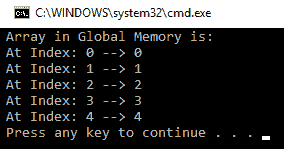

由于我们使用的是全局内存，这个操作将会较慢。有一些高级概念可以加快这个操作，稍后将会解释。在下一节中，我们将解释所有线程独有的局部内存和寄存器。

# 局部内存和寄存器

局部内存和寄存器文件是每个线程独有的。寄存器文件是每个线程可用的最快内存。当内核的变量不适合寄存器文件时，它们会使用局部内存。这被称为**寄存器溢出**。基本上，局部内存是全局内存的一部分，对每个线程来说是唯一的。与寄存器文件相比，访问局部内存会较慢。尽管局部内存被缓存在 L1 和 L2 缓存中，但寄存器溢出可能不会对程序产生负面影响。

下面是一个简单的程序，用于说明如何使用局部内存：

```py
#include <stdio.h>
#define N 5

__global__ void gpu_local_memory(int d_in)
{
  int t_local; 
  t_local = d_in * threadIdx.x; 
  printf("Value of Local variable in current thread is: %d \n", t_local);
}
int main(int argc, char **argv)
{
  printf("Use of Local Memory on GPU:\n");
  gpu_local_memory << <1, N >> >(5); 
  cudaDeviceSynchronize();
  return 0;
}
```

`t_local`变量将属于每个线程，并存储在寄存器文件中。当这个变量在内核函数中进行计算时，计算将是最快的。前述代码的输出如下所示：


# 缓存内存

在最新的 GPU 上，每个多处理器都有一个 L1 缓存和一个 L2 缓存，这些缓存是所有多处理器共享的。全局和局部内存都使用这些缓存。由于 L1 缓存靠近线程执行，因此它非常快。如前所述的内存架构图所示，L1 缓存和共享内存使用相同的 64 KB。它们都可以配置为使用 64 KB 中的多少字节。所有全局内存访问都通过 L2 缓存进行。纹理内存和常量内存有自己的单独缓存。

# 线程同步

到目前为止，我们在这本书中看到的例子中，所有线程都是相互独立的。但在现实生活中，很少能找到线程在操作数据并终止时没有将结果传递给其他线程的例子。因此，线程之间必须有一些通信机制，这就是为什么在本节中解释了共享内存的概念。当许多线程并行工作并操作相同的数据或从相同的内存位置读取和写入时，所有线程之间必须进行同步。因此，本节还解释了线程同步。本节的最后部分解释了原子操作，这在读取-修改-写入条件下非常有用。

# 共享内存

共享内存位于芯片上，因此它比全局内存快得多。共享内存的延迟大约是全球未缓存内存延迟的 100 倍低。来自同一块的线程都可以访问共享内存。这在许多需要线程之间共享结果的程序中非常有用。然而，如果不进行同步，它也可能导致混乱或错误的结果。如果一个线程在另一个线程写入之前从内存中读取数据，可能会导致错误的结果。因此，内存访问应该得到适当的控制或管理。这是通过`__syncthreads()`指令完成的，它确保在程序前进之前所有对内存的`write`操作都已完成。这也被称为**屏障**。屏障的含义是所有线程都将到达这一行并等待其他线程完成。在所有线程都到达这个屏障之后，它们可以继续前进。为了演示共享内存和线程同步的使用，我们取了一个移动平均的例子。该内核函数如下所示：

```py
#include <stdio.h>
__global__ void gpu_shared_memory(float *d_a)
{
  int i, index = threadIdx.x;
  float average, sum = 0.0f;
  //Defining shared memory
  __shared__ float sh_arr[10];

  sh_arr[index] = d_a[index];
 // This directive ensure all the writes to shared memory have completed

  __syncthreads();  
  for (i = 0; i<= index; i++) 
  { 
    sum += sh_arr[i]; 
  }
  average = sum / (index + 1.0f);
  d_a[index] = average;

    //This statement is redundant and will have no effect on overall code execution  
  sh_arr[index] = average;
}
```

移动平均操作不过是找到数组中所有元素的平均值，直到当前元素。许多线程将需要数组中的相同数据来进行计算。这是使用共享内存的理想情况，它将提供比全局内存更快的速度。这将减少每个线程的全局内存访问次数，从而降低程序的延迟。共享内存位置是通过`__shared__`指令定义的。在这个例子中，定义了十个浮点元素的共享内存。通常，共享内存的大小应该等于每个块中的线程数。在这里，我们正在处理一个包含 10 个元素的数组，因此我们采用了这个大小的共享内存。

下一步是将数据从全局内存复制到共享内存。所有线程将根据其线程 ID 索引的元素复制到共享数组。现在，这是一个共享内存写操作，在下一行中，我们将从这个共享数组中读取。因此，在继续之前，我们应该确保所有共享内存写操作都已完成。因此，让我们引入`__synchronizethreads()`屏障。

接下来，`for`循环使用共享内存中的值计算所有元素的平均值，并将结果存储在全局内存中，全局内存是通过当前线程 ID 索引的。最后一行也将计算出的值复制到共享内存中。这一行对代码的整体执行没有影响，因为共享内存的寿命直到当前块执行结束，这是块的最后一行。它只是用来演示这个关于共享内存的概念。现在，我们将尝试编写这个代码的主函数如下：

```py
int main(int argc, char **argv)
{
   float h_a[10]; 
   float *d_a; 

      //Initialize host Array
   for (int i = 0; i < 10; i++) 
   {
     h_a[i] = i;
   }

    // allocate global memory on the device
    cudaMalloc((void **)&d_a, sizeof(float) * 10);

    // copy data from host memory  to device memory 
    cudaMemcpy((void *)d_a, (void *)h_a, sizeof(float) * 10,         cudaMemcpyHostToDevice);
    gpu_shared_memory << <1, 10 >> >(d_a);

    // copy the modified array back to the host
    cudaMemcpy((void *)h_a, (void *)d_a, sizeof(float) * 10, cudaMemcpyDeviceToHost);
    printf("Use of Shared Memory on GPU: \n");

    for (int i = 0; i < 10; i++) 
    {
      printf("The running average after %d element is %f \n", i, h_a[i]);
    }
    return 0;
}
```

在`main`函数中，在为宿主和设备数组分配内存之后，宿主数组被填充了从零到九的值。这些值被复制到设备内存中，在那里计算移动平均值，并将结果存储起来。设备内存中的结果被复制回宿主内存，然后打印到控制台。控制台上的输出如下所示：


本节演示了当多个线程使用同一内存位置的数据时共享内存的使用。下一节将演示使用`atomic`操作，这在读取-修改-写入操作中非常重要。

# 原子操作

考虑这样一种情况：大量线程试图修改内存的一小部分。这是一个经常发生的情况。当我们尝试执行读取-修改-写入操作时，这会引发更多的问题。这种操作的例子是`d_out[i] ++,`其中首先从内存中读取`d_out[i]`，然后增加，并写回内存。然而，当多个线程在相同的内存位置执行此操作时，可能会得到错误的结果。

假设一个内存位置的初始值为六，线程 p 和 q 都试图增加这个内存位置，那么最终的答案应该是八。但在执行时，可能会发生 p 和 q 线程同时读取这个值的情况，那么它们都会得到六这个值。它们将这个值增加到七，并将这个七存储在内存中。所以，最终答案不是八，而是七，这是错误的。这种错误可能带来的危险可以通过 ATM 取款的一个例子来理解。假设你在账户中有 5,000 卢比。你有两张相同的账户 ATM 卡。你和你的朋友同时去两个不同的 ATM 机取款 4,000 卢比。你们同时刷卡；所以，当 ATM 检查余额时，两个 ATM 都会显示 5,000 卢比的余额。当你们两人都取款 4,000 卢比时，那么两个机器都会查看初始余额，即 5,000 卢比。要取的金额小于余额，因此两个机器都会给出 4,000 卢比。尽管你的余额是 5,000 卢比，但你得到了 8,000 卢比，这是危险的。为了演示这种现象，我们取了一个大量线程尝试访问小数组的例子。这个例子的内核函数如下所示：

```py
include <stdio.h>

#define NUM_THREADS 10000
#define SIZE 10

#define BLOCK_WIDTH 100

__global__ void gpu_increment_without_atomic(int *d_a)
{
  int tid = blockIdx.x * blockDim.x + threadIdx.x;

  // Each thread increment elements which wraps at SIZE
  tid = tid % SIZE;
  d_a[tid] += 1;
}

```

内核函数只是在`d_a[tid] +=1`行中增加内存位置。问题是这个内存位置增加了多少次。线程总数是 10,000，而数组的大小只有 10。我们通过将线程 ID 与数组大小进行`取模`操作来索引数组。因此，1,000 个线程将尝试增加相同的内存位置。理想情况下，数组的每个位置都应该增加 1,000 次。但正如我们将在输出中看到的，情况并非如此。在查看输出之前，我们将尝试编写`main`函数：

```py
int main(int argc, char **argv)
{
  printf("%d total threads in %d blocks writing into %d array elements\n",
  NUM_THREADS, NUM_THREADS / BLOCK_WIDTH, SIZE);

  // declare and allocate host memory
  int h_a[SIZE];
  const int ARRAY_BYTES = SIZE * sizeof(int);
  // declare and allocate GPU memory
  int * d_a;
  cudaMalloc((void **)&d_a, ARRAY_BYTES);

  // Initialize GPU memory with zero value.
  cudaMemset((void *)d_a, 0, ARRAY_BYTES);
  gpu_increment_without_atomic << <NUM_THREADS / BLOCK_WIDTH, BLOCK_WIDTH >> >(d_a);

  // copy back the array of sums from GPU and print
  cudaMemcpy(h_a, d_a, ARRAY_BYTES, cudaMemcpyDeviceToHost);

  printf("Number of times a particular Array index has been incremented without atomic add is: \n");
  for (int i = 0; i < SIZE; i++)
  {
    printf("index: %d --> %d times\n ", i, h_a[i]);
  }
  cudaFree(d_a);
  return 0;
}
```

在`main`函数中，设备数组被声明并初始化为零。在这里，使用特殊的`cudaMemSet`函数在设备上初始化内存。这作为参数传递给内核，它增加这 10 个内存位置。在这里，总共启动了 10,000 个线程，分为 1,000 个块，每个块 100 个线程。内核执行后在设备上存储的答案被复制回主机，每个内存位置的价值在控制台上显示。

输出如下：

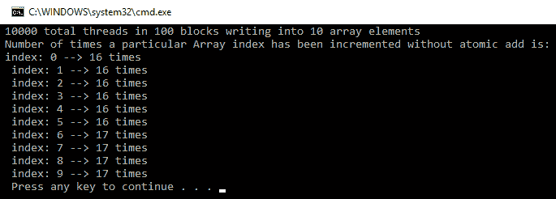

如前所述，理想情况下，每个内存位置应该增加 1,000 次，但大多数内存位置的价值为 16 和 17。这是因为许多线程同时读取相同的地址，因此增加相同的值并将其存储在内存中。由于线程执行的时机超出了程序员的控制，因此无法知道同时发生内存访问的次数。如果你再次运行你的程序，你的输出会与第一次相同吗？你的输出可能看起来像以下这样：

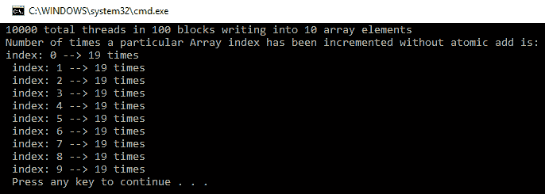

如你所猜，每次运行你的程序时，内存位置可能具有不同的值。这是因为设备上所有线程的随机执行导致的。

为了解决这个问题，CUDA 提供了一个名为`atomicAdd`操作的 API。这是一个`阻塞`操作，这意味着当多个线程试图访问相同的内存位置时，一次只能有一个线程可以访问该内存位置。其他线程必须等待这个线程完成并在内存上`写入`其答案。使用`atomicAdd`操作的内核函数如下所示：

```py
#include <stdio.h>
#define NUM_THREADS 10000
#define SIZE 10
#define BLOCK_WIDTH 100

__global__ void gpu_increment_atomic(int *d_a)
{
  // Calculate thread index 
  int tid = blockIdx.x * blockDim.x + threadIdx.x;

  // Each thread increments elements which wraps at SIZE
  tid = tid % SIZE;
  atomicAdd(&d_a[tid], 1);
}

```

`kernel`函数与之前看到的非常相似。不是使用`+=`运算符增加内存位置，而是使用`atomicAdd`函数。它接受两个参数。第一个是我们想要增加的内存位置，第二个是这个位置需要增加的值。在这段代码中，1,000 个线程将再次尝试访问相同的位置；因此，当一个线程使用这个位置时，其他 999 个线程必须等待。这将增加执行时间方面的成本。使用`atomic`操作增加的`main`函数如下所示：

```py
int main(int argc, char **argv)
{
  printf("%d total threads in %d blocks writing into %d array elements\n",NUM_THREADS, NUM_THREADS / BLOCK_WIDTH, SIZE);

  // declare and allocate host memory
  int h_a[SIZE];
  const int ARRAY_BYTES = SIZE * sizeof(int);

  // declare and allocate GPU memory
  int * d_a;
  cudaMalloc((void **)&d_a, ARRAY_BYTES);

   // Initialize GPU memory withzero value
  cudaMemset((void *)d_a, 0, ARRAY_BYTES);

  gpu_increment_atomic << <NUM_THREADS / BLOCK_WIDTH, BLOCK_WIDTH >> >(d_a);
    // copy back the array from GPU and print
  cudaMemcpy(h_a, d_a, ARRAY_BYTES, cudaMemcpyDeviceToHost);

  printf("Number of times a particular Array index has been incremented is: \n");
  for (int i = 0; i < SIZE; i++) 
  { 
     printf("index: %d --> %d times\n ", i, h_a[i]); 
  }

  cudaFree(d_a);
  return 0;
}
```

在`main`函数中，包含 10 个元素的数组被初始化为零值并传递给内核。但现在，内核将执行`atomic add`操作。因此，这个程序的输出应该是准确的。数组中的每个元素应该增加 1,000 次。以下将是输出结果：

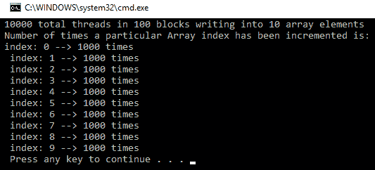

如果你使用原子操作来测量程序的执行时间，它可能比使用全局内存的简单程序花费更长的时间。这是因为许多线程在原子操作中等待内存访问。使用共享内存可以帮助加快操作。此外，如果相同数量的线程访问更多的内存位置，那么原子操作将产生较少的时间开销，因为需要等待内存访问的线程数量更少。

在本节中，我们了解到原子操作有助于避免内存操作中的竞态条件，并使代码编写和理解更加简单。在下一节中，我们将解释两种特殊的内存类型，即常量和纹理内存，它们有助于加速某些类型的代码。

# 常量内存

CUDA 语言为程序员提供了一种另一种类型的内存，称为**常量**内存。NVIDIA 硬件提供了 64 KB 的这种常量内存，用于存储在整个内核执行过程中保持不变的数据。这种常量内存被缓存到芯片上，因此使用常量内存而不是全局内存可以加快执行速度。使用常量内存还将减少设备全局内存的带宽。在本节中，我们将了解如何在 CUDA 程序中使用常量内存。以执行简单数学运算`a*x + b`的简单程序为例，其中`a`和`b`是常量。该程序的`kernel`函数代码如下所示：

```py
#include "stdio.h"
#include<iostream>
#include <cuda.h>
#include <cuda_runtime.h>

//Defining two constants
__constant__ int constant_f;
__constant__ int constant_g;
#define N 5

//Kernel function for using constant memory 
__global__ void gpu_constant_memory(float *d_in, float *d_out) 
{
  //Getting thread index for current kernel
  int tid = threadIdx.x; 
  d_out[tid] = constant_f*d_in[tid] + constant_g;
}

```

常量内存变量使用`__constant__`关键字定义。在前面的代码中，两个浮点变量`constant_f`和`constant_g`被定义为在整个内核执行过程中不会改变常量。第二点要注意的是，一旦变量被定义为常量，就不应该在内核函数中再次定义。内核函数使用这两个常量计算一个简单的数学运算。常量变量从`main`函数复制到内存中有一个特殊的方法。以下代码展示了这一点：

```py
int main(void) 
{
  //Defining Arrays for host
  float h_in[N], h_out[N];
  //Defining Pointers for device
  float *d_in, *d_out;
  int h_f = 2;
  int h_g = 20;

  // allocate the memory on the cpu
  cudaMalloc((void**)&d_in, N * sizeof(float));
  cudaMalloc((void**)&d_out, N * sizeof(float));

  //Initializing Array
  for (int i = 0; i < N; i++) 
  {
    h_in[i] = i;
  }

  //Copy Array from host to device
  cudaMemcpy(d_in, h_in, N * sizeof(float), cudaMemcpyHostToDevice);
  //Copy constants to constant memory
  cudaMemcpyToSymbol(constant_f, &h_f, sizeof(int),0,cudaMemcpyHostToDevice);
  cudaMemcpyToSymbol(constant_g, &h_g, sizeof(int));

  //Calling kernel with one block and N threads per block
  gpu_constant_memory << <1, N >> >(d_in, d_out);

  //Coping result back to host from device memory
  cudaMemcpy(h_out, d_out, N * sizeof(float), cudaMemcpyDeviceToHost);

  //Printing result on console
  printf("Use of Constant memory on GPU \n");
  for (int i = 0; i < N; i++) 
  {
    printf("The expression for index %f is %f\n", h_in[i], h_out[i]);
  }

  cudaFree(d_in);
  cudaFree(d_out);
  return 0;
}
```

在`main`函数中，`h_f`和`h_g`常量在主机上定义并初始化，这些常量将被复制到常量内存中。使用`cudaMemcpyToSymbol`指令将这些常量复制到常量内存中以便内核执行。它有五个参数。第一个是目标，使用`__constant__`关键字定义。第二个是主机地址，第三个是传输的大小，第四个是内存偏移量，这里取为零，第五个是数据传输的方向，这里取为主机到设备。最后两个参数是可选的，因此在`cudaMemcpyToSymbol`指令的第二次调用中省略了它们。

代码的输出如下所示：

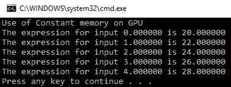

有一个需要注意的事项是常量内存是`只读`内存。这个例子只是用来解释从 CUDA 程序中使用常量内存。这不是常量内存的最佳使用。如前所述，常量内存有助于节省全局内存的内存带宽。要理解这一点，你必须理解 warp 的概念。一个 warp 是一组 32 个线程交织在一起并同步执行的集合。从常量内存的单次读取可以广播到半 warp，这可以减少多达 15 次内存事务。此外，常量内存被缓存，因此对附近位置的内存访问不会产生额外的内存事务。当每个包含 16 个线程的半 warp 在相同的内存位置上操作时，使用常量内存可以节省大量的执行时间。还应该注意的是，如果半 warp 线程使用完全不同的内存位置，那么使用常量内存可能会增加执行时间。因此，应该谨慎使用常量内存。

# 纹理内存

**纹理**内存是另一种只读内存，可以在以特定模式读取数据时加速程序并减少内存带宽。像常量内存一样，它也缓存于芯片上。这种内存最初是为渲染图形而设计的，但它也可以用于通用计算应用。当应用具有大量空间局部性的内存访问时，它非常有效。空间局部性的意义是每个线程很可能从其他附近线程读取的附近位置读取。这在图像处理应用中非常好，我们在其中处理 4 点连通性和 8 点连通性。线程通过访问内存位置进行二维空间局部性访问可能看起来像这样：

| 线程 0 | 线程 2 |
| --- | --- |
| 线程 1 | 线程 3 |

通用全局内存缓存将无法捕捉这种空间局部性，从而导致大量的内存流量到全局内存。纹理内存是为这种访问模式设计的，因此它只会从内存中读取一次，然后将其缓存起来，从而使执行速度大大加快。纹理内存支持一维和二维的`fetch`操作。在您的 CUDA 程序中使用纹理内存并不简单，尤其是对于那些不是编程专家的人来说。在本节中，解释了如何使用纹理内存复制数组值的简单示例。使用纹理内存的`kernel`函数解释如下：

```py
#include "stdio.h"
#include<iostream>
#include <cuda.h>
#include <cuda_runtime.h>

#define NUM_THREADS 10
#define N 10

//Define texture reference for 1-d access
texture <float, 1, cudaReadModeElementType> textureRef;

__global__ void gpu_texture_memory(int n, float *d_out)
{
    int idx = blockIdx.x*blockDim.x + threadIdx.x;
    if (idx < n) {
      float temp = tex1D(textureRef, float(idx));
      d_out[idx] = temp;
    }
}
```

应该被读取的纹理内存部分由纹理引用定义。在代码中，它使用纹理 API 定义。它有三个参数。第一个参数指示纹理元素的数据类型。在这个例子中，它是一个`float`。第二个参数指示纹理引用的类型，可以是单维、二维等。在这里，它是一个单维引用。第三个参数指定读取模式，它是一个可选参数。请确保将此纹理引用声明为静态全局变量，并且它不应作为任何函数的参数传递。在内核函数中，存储在线程 ID 中的数据从这个纹理引用中读取，并复制到`d_out`全局内存指针。在这里，我们没有使用任何空间局部性，因为这个例子只是为了向您展示如何从 CUDA 程序中使用纹理内存。空间局部性将在下一章中解释，当我们看到一些使用 CUDA 的图像处理应用时。此例的`main`函数如下所示：

```py
int main()
{
  //Calculate number of blocks to launch
  int num_blocks = N / NUM_THREADS + ((N % NUM_THREADS) ? 1 : 0);
  float *d_out;
  // allocate space on the device for the results
  cudaMalloc((void**)&d_out, sizeof(float) * N);
  // allocate space on the host for the results
  float *h_out = (float*)malloc(sizeof(float)*N);
  float h_in[N];
  for (int i = 0; i < N; i++) 
  {
    h_in[i] = float(i);
  }
  //Define CUDA Array
  cudaArray *cu_Array;
  cudaMallocArray(&cu_Array, &textureRef.channelDesc, N, 1);

  cudaMemcpyToArray(cu_Array, 0, 0, h_in, sizeof(float)*N, cudaMemcpyHostToDevice);

  // bind a texture to the CUDA array
  cudaBindTextureToArray(textureRef, cu_Array);

  gpu_texture_memory << <num_blocks, NUM_THREADS >> >(N, d_out);

  // copy result to host
  cudaMemcpy(h_out, d_out, sizeof(float)*N, cudaMemcpyDeviceToHost);
  printf("Use of Texture memory on GPU: \n");
  // Print the result
  for (int i = 0; i < N; i++) 
  {
    printf("Average between two nearest element is : %f\n", h_out[i]);
  }
  free(h_out);
  cudaFree(d_out);
  cudaFreeArray(cu_Array);
  cudaUnbindTexture(textureRef);
}
```

在`main`函数中，在声明和为主机和设备数组分配内存之后，主机数组使用从零到九的值进行初始化。在这个例子中，您将看到 CUDA 数组的首次使用。它们类似于普通数组，但它们是专门用于纹理的。它们对内核函数是只读的，可以通过使用`cudaMemcpyToArray`函数从主机写入设备内存，如前述代码所示。该函数中的第二个和第三个参数是宽度和高度偏移量，取值为 0，0，这意味着我们从左上角开始。它们是针对纹理内存读取优化的不透明内存布局。

`cudaBindTextureToArray`函数将纹理引用绑定到这个 CUDA 数组。这意味着，它从左上角开始将这个数组复制到纹理引用。绑定纹理引用后，调用内核，该内核使用这个纹理引用并计算要存储在设备内存上的数组。内核完成后，输出数组被复制回主机以在控制台上显示。当使用纹理内存时，我们必须使用`cudaUnbindTexture`函数从我们的代码中解除纹理的绑定。`cudaFreeArray`函数用于释放 CUDA 数组使用的内存。程序在控制台上显示的输出如下：

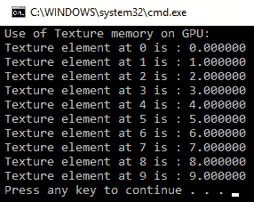

本节结束了我们对 CUDA 内存架构的讨论。当您根据您的应用程序合理地使用 CUDA 中可用的内存时，它可以极大地提高程序的性能。您需要仔细查看您应用程序中所有线程的内存访问模式，然后选择您应该为您的应用程序使用的内存。本章的最后一节简要描述了使用我们到目前为止所使用的所有概念的复杂 CUDA 程序。

# 点积和矩阵乘法示例

到目前为止，我们几乎已经学习了所有与 CUDA 基本并行编程相关的重要概念。在本节中，我们将向您展示如何编写 CUDA 程序来执行像点积和矩阵乘法这样的重要数学运算，这些运算几乎在所有应用中都会用到。这将利用我们之前看到的所有概念，并帮助您为您的应用程序编写代码。

# 点积

两个向量的点积是一个重要的数学运算。它还将解释 CUDA 编程中的一个重要概念，称为**归约**操作。两个向量的点积可以定义为如下：

```py
(x1,x1,x3) . (y1,y2,y3) = x1y1 + x2y2 +x3y3
```

现在，如果您看到这个操作，它与向量上的逐元素加法操作非常相似。除了加法之外，您必须执行逐元素乘法。所有线程还必须继续运行它们所执行的乘法总和，因为所有单个乘法都需要相加以得到点积的最终答案。点积的答案将是一个单一的数字。在 CUDA 中，最终答案是原始两个数组的归约版本的操作称为**归约**操作。它在许多应用中非常有用。要在 CUDA 中执行此操作，我们将首先编写一个内核函数，如下所示：

```py
#include <stdio.h>
#include<iostream>
#include <cuda.h>
#include <cuda_runtime.h>
#define N 1024
#define threadsPerBlock 512

__global__ void gpu_dot(float *d_a, float *d_b, float *d_c) 
{
  //Define Shared Memory
  __shared__ float partial_sum[threadsPerBlock];
  int tid = threadIdx.x + blockIdx.x * blockDim.x;
  int index = threadIdx.x;

  float sum = 0;
  while (tid < N) 
  {
    sum += d_a[tid] * d_b[tid];
    tid += blockDim.x * gridDim.x;
  }

  // set the partial sum in shared memory
  partial_sum[index] = sum;

  // synchronize threads in this block
  __syncthreads();

  //Calculate Patial sum for a current block using data in shared memory
  int i = blockDim.x / 2;
  while (i != 0) {
    if (index < i)
      {partial_sum[index] += partial_sum[index + i];}
    __syncthreads();
    i /= 2;
  }
  //Store result of partial sum for a block in global memory
  if (index == 0)
    d_c[blockIdx.x] = partial_sum[0];
}

```

`kernel` 函数接受两个输入数组作为输入，并将最终的局部和在第三个数组中存储。共享内存被定义为存储部分答案的中间答案。共享内存的大小等于每个块中的线程数，因为所有单独的块都将有这个共享内存的单独副本。之后，计算两个索引；第一个索引，用于计算唯一的线程 ID，类似于我们在向量加法示例中所做的。第二个索引用于在共享内存中存储部分乘积答案。同样，每个块都有一个单独的共享内存副本，所以只有用于索引共享内存的线程 ID 是给定块的。

`while` 循环将对由线程 ID 索引的元素执行逐元素乘法。它还将对偏移总线程数到当前线程 ID 的元素进行乘法。该元素的局部和存储在共享内存中。我们将使用这些来自共享内存的结果来计算单个块的局部和。因此，在读取这个共享内存块之前，我们必须确保所有线程都已经完成了对这个共享内存的写入。这通过使用 `__syncthreads()` 指令来确保。

现在，获取点积答案的一种方法是一个线程遍历所有这些部分和以获得最终答案。一个线程可以执行归约操作。这将需要 N 次操作来完成，其中 N 是要添加以获得最终答案的部分和的数量（等于每个块中的线程数）。

问题是，我们能否并行执行这个归约操作？答案是肯定的。想法是每个线程将添加两个部分和的元素并将答案存储在第一个元素的位置。由于每个线程结合了一个条目，所以操作可以在一半的条目中完成。现在，我们将重复这个操作，直到我们得到最终的答案，这个答案计算了整个块的局部和。这个操作的复杂度是 `log2` ，这比一个线程执行归约操作的复杂度 N 要好得多。

解释的操作是通过以 `while (i != 0)` 开始的块来计算的。该块将当前线程的局部答案和偏移 `blockdim/2` 的线程的局部答案相加。它继续进行这种加法，直到我们得到一个最终的单一答案，这是给定块中所有部分乘积的总和。最终的答案存储在全局内存中。每个块都将有一个单独的答案存储在全局内存中，以便通过块 ID 索引，每个块都有一个唯一的块 ID。尽管如此，我们还没有得到最终的答案。这可以在 `device` 函数或 `main` 函数中执行。

通常，在归约操作的最后几个加法中需要的资源非常少。大部分 GPU 资源都处于空闲状态，这不是 GPU 的最佳使用。因此，单个块的各个部分的总和的最终加法操作是在`main`函数中完成的。`main`函数如下：

```py
int main(void) 
{
  float *h_a, *h_b, h_c, *partial_sum;
  float *d_a, *d_b, *d_partial_sum;

  //Calculate number of blocks and number of threads
  int block_calc = (N + threadsPerBlock - 1) / threadsPerBlock;
  int blocksPerGrid = (32 < block_calc ? 32 : block_calc);
  // allocate memory on the cpu side
  h_a = (float*)malloc(N * sizeof(float));
  h_b = (float*)malloc(N * sizeof(float));
  partial_sum = (float*)malloc(blocksPerGrid * sizeof(float));

  // allocate the memory on the gpu
  cudaMalloc((void**)&d_a, N * sizeof(float));
  cudaMalloc((void**)&d_b, N * sizeof(float));
  cudaMalloc((void**)&d_partial_sum, blocksPerGrid * sizeof(float));

  // fill in the host mempory with data
  for (int i = 0; i<N; i++) {
    h_a[i] = i;
    h_b[i] = 2;
  }

  // copy the arrays to the device
  cudaMemcpy(d_a, h_a, N * sizeof(float), cudaMemcpyHostToDevice);
  cudaMemcpy(d_b, h_b, N * sizeof(float), cudaMemcpyHostToDevice);

  gpu_dot << <blocksPerGrid, threadsPerBlock >> >(d_a, d_b, d_partial_sum);

  // copy the array back to the host
  cudaMemcpy(partial_sum, d_partial_sum, blocksPerGrid * sizeof(float), cudaMemcpyDeviceToHost);

  // Calculate final dot prodcut
  h_c = 0;
  for (int i = 0; i<blocksPerGrid; i++) 
 {
    h_c += partial_sum[i];
  }

}
```

定义了三个数组，并为主机和设备分配了内存以存储输入和输出。两个主机数组在`for`循环内部初始化。一个数组初始化为从`0`到`N`，另一个数组初始化为常数`2`。计算网格中的块数和块中的线程数也已完成。这与我们在本章开头所做的是类似的。请注意，您也可以将这些值作为常数保留，就像我们在本章的第一个程序中所做的那样，以避免复杂性。

这些数组被复制到设备内存，并作为参数传递给`kernel`函数。`kernel`函数将返回一个数组，该数组包含由其块 ID 索引的各个块的乘积答案。这个数组被复制回主机到`partial_sum`数组中。点积的最终答案通过遍历这个`partial_sum`数组，使用从零开始的`for`循环到每个网格的块数来计算。最终的点积存储在`h_c`中。为了检查计算出的点积是否正确，可以在`main`函数中添加以下代码：

```py
printf("The computed dot product is: %f\n", h_c);
#define cpu_sum(x) (x*(x+1))
  if (h_c == cpu_sum((float)(N - 1)))
  {
    printf("The dot product computed by GPU is correct\n");
  }
  else
  {
    printf("Error in dot product computation");
  }
  // free memory on the gpu side
  cudaFree(d_a);
  cudaFree(d_b);
  cudaFree(d_partial_sum);
  // free memory on the cpu side
  free(h_a);
  free(h_b);
  free(partial_sum);
```

答案通过数学计算的结果进行验证。在两个输入数组中，如果一个数组有从`0`到`N-1`的值，而第二个数组有一个常数值`2`，那么点积将是`N*(N+1)`。我们打印出数学计算出的点积答案，以及是否计算正确。最后释放主机和设备内存。程序的输出如下：

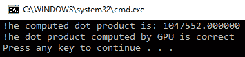

# 矩阵乘法

在使用 CUDA 在 GPU 上执行的第二重要的数学操作是矩阵乘法。当矩阵的大小非常大时，这是一个非常复杂的数学操作。应记住，对于矩阵乘法，第一个矩阵的列数应等于第二个矩阵的行数。矩阵乘法不是一个累积操作。为了避免复杂性，在这个例子中，我们取了一个相同大小的方阵。如果您熟悉矩阵乘法的数学，那么您可能会回忆起第一个矩阵的每一行将与第二个矩阵的所有列相乘。这将对第一个矩阵的所有行重复进行。如下所示：

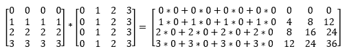

同样的数据被多次重用，因此这是使用共享内存的理想情况。在本节中，我们将制作两个分别使用和不使用共享内存的单独的`kernel`函数。你可以比较两个内核的执行来了解共享内存如何提高程序的性能。我们首先从编写一个不使用共享内存的`kernel`函数开始：

```py

#include <stdio.h>
#include<iostream>
#include <cuda.h>
#include <cuda_runtime.h>
#include <math.h>

//This defines size of a small square box or thread dimensions in one block
#define TILE_SIZE 2

//Matrix multiplication using non shared kernel
__global__ void gpu_Matrix_Mul_nonshared(float *d_a, float *d_b, float *d_c, const int size)
{
  int row, col;
  col = TILE_SIZE * blockIdx.x + threadIdx.x;
  row = TILE_SIZE * blockIdx.y + threadIdx.y;

  for (int k = 0; k< size; k++)
  {
    d_c[row*size + col] += d_a[row * size + k] * d_b[k * size + col];
  }
}

```

矩阵乘法使用二维线程执行。如果我们使用二维线程启动，每个线程执行输出矩阵的单个元素，那么最多可以乘以 16 x 16 的矩阵。如果大小大于这个值，那么计算将需要超过 512 个线程，这在大多数 GPU 上是不可能的。因此，我们需要启动多个块，每个块包含少于 512 个线程。为了实现这一点，输出矩阵被分成小正方形块，这两个方向上的维度都是`TILE_SIZE`。块中的每个线程将计算这个正方形块的元素。矩阵乘法的总块数将通过将矩阵的大小除以由`TILE_SIZE`定义的小正方形的大小来计算。

如果你理解了这一点，那么计算输出矩阵的行和列索引将会非常容易。这与我们到目前为止所做的是类似的，其中`blockdim.x`等于`TILE_SIZE`。现在，输出矩阵中的每个元素都将是一个矩阵第一行和一个矩阵第二列的点积。两个矩阵具有相同的大小，因此必须对等于大小变量的元素数量执行点积。因此，`kernel`函数中的`for`循环从`0`运行到`size`。

要计算两个矩阵的单独索引，考虑这个矩阵以行主序方式存储在系统内存中作为一个线性数组。这意味着第一行中的所有元素都放置在连续的内存位置，然后依次放置行，如下所示：

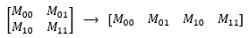

线性数组的索引可以通过其行 ID 乘以矩阵的大小加上其列 ID 来计算。因此，*M[1,0]*的索引将是 2，因为其行 ID 是 1，矩阵大小是 2，列 ID 是 0。这种方法用于计算两个矩阵中的元素索引。

要计算结果矩阵中`[row, col]`位置的元素，第一个矩阵中的索引将等于`row*size + k`，而对于第二个矩阵，它将是`k*size + col`。这是一个非常简单的`kernel`函数。在矩阵乘法中有大量的数据重用。这个函数没有利用共享内存的优势。因此，我们将尝试修改利用共享内存的`kernel`函数。修改后的`kernel`函数如下所示：

```py
// shared
__global__ void gpu_Matrix_Mul_shared(float *d_a, float *d_b, float *d_c, const int size)
{
  int row, col;

  __shared__ float shared_a[TILE_SIZE][TILE_SIZE];

  __shared__ float shared_b[TILE_SIZE][TILE_SIZE];

  // calculate thread id
  col = TILE_SIZE * blockIdx.x + threadIdx.x;
  row = TILE_SIZE * blockIdx.y + threadIdx.y;

  for (int i = 0; i< size / TILE_SIZE; i++) 
  {
    shared_a[threadIdx.y][threadIdx.x] = d_a[row* size + (i*TILE_SIZE + threadIdx.x)];
    shared_b[threadIdx.y][threadIdx.x] = d_b[(i*TILE_SIZE + threadIdx.y) * size + col];
    }
    __syncthreads(); 

    for (int j = 0; j<TILE_SIZE; j++)
      d_c[row*size + col] += shared_a[threadIdx.x][j] * shared_b[j][threadIdx.y];
    __syncthreads(); // for synchronizing the threads

  }
}
```

定义了一个大小等于小方块块大小的两个共享内存，即`TILE_SIZE`，用于存储可重复使用的数据。行和列索引的计算方式与之前相同。首先，在第一个`for`循环中填充这个共享内存。之后，包含`__syncthreads()`，以确保只有当所有线程都完成写入后，才从共享内存中读取内存。最后一个`for`循环再次计算点积。由于这仅通过使用共享内存来完成，这大大减少了全局内存的内存流量，从而提高了程序在大矩阵维度上的性能。该程序的`main`函数如下所示：

```py
int main()
{
   //Define size of the matrix
  const int size = 4;
   //Define host and device arrays
  float h_a[size][size], h_b[size][size],h_result[size][size];
  float *d_a, *d_b, *d_result; // device array
  //input in host array
  for (int i = 0; i<size; i++)
  {
    for (int j = 0; j<size; j++)
    {
      h_a[i][j] = i;
      h_b[i][j] = j;
    }
  }

  cudaMalloc((void **)&d_a, size*size*sizeof(int));
  cudaMalloc((void **)&d_b, size*size * sizeof(int));
  cudaMalloc((void **)&d_result, size*size* sizeof(int));
  //copy host array to device array
  cudaMemcpy(d_a, h_a, size*size* sizeof(int), cudaMemcpyHostToDevice);
  cudaMemcpy(d_b, h_b, size*size* sizeof(int), cudaMemcpyHostToDevice);
  //calling kernel
  dim3 dimGrid(size / TILE_SIZE, size / TILE_SIZE, 1);
  dim3 dimBlock(TILE_SIZE, TILE_SIZE, 1);

  gpu_Matrix_Mul_nonshared << <dimGrid, dimBlock >> > (d_a, d_b, d_result, size);
  //gpu_Matrix_Mul_shared << <dimGrid, dimBlock >> > (d_a, d_b, d_result, size);

  cudaMemcpy(h_result, d_result, size*size * sizeof(int), cudaMemcpyDeviceToHost);

  return 0;
}
```

在定义和分配主机和设备数组的内存之后，主机数组被填充了一些随机值。这些数组被复制到设备内存中，以便可以将其传递给`kernel`函数。使用`dim3`结构定义了网格块的数量和块线程的数量，其维度等于之前计算的值。您可以调用任何内核。将计算出的答案复制回主机内存。为了在控制台上显示输出，以下代码被添加到`main`函数中：

```py
printf("The result of Matrix multiplication is: \n");

  for (int i = 0; i< size; i++)
  {
    for (int j = 0; j < size; j++)
    {
      printf("%f ", h_result[i][j]);
    }
    printf("\n");
  }
cudaFree(d_a)
cudaFree(d_b)
cudaFree(d_result)
```

用于在设备内存上存储矩阵的内存也被释放。控制台输出如下：

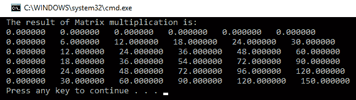

本节演示了在广泛应用的数学运算中使用的两个重要 CUDA 程序。它还解释了共享内存和多维线程的使用。

# 摘要

本章解释了多个块的启动，每个块都有来自内核函数的多个线程。它展示了选择大量线程的两个参数的方法。它还解释了 CUDA 程序可以使用的分层内存架构。最接近正在执行的线程的内存速度快，随着我们远离它，内存速度变慢。当多个线程想要相互通信时，CUDA 提供了使用共享内存的灵活性，使得同一块的线程可以相互通信。当多个线程使用相同的内存位置时，应该在内存访问之间进行同步；否则，最终结果将不会如预期。我们还看到了使用原子操作来完成这种同步的方法。如果某些参数在整个内核执行过程中保持不变，则可以将其存储在常量内存中以提高速度。当 CUDA 程序表现出某种通信模式，如空间局部性时，应使用纹理内存来提高程序的性能。总之，为了提高 CUDA 程序的性能，我们应该减少慢速内存的内存流量。如果这样做效率高，程序的性能可以得到显著提高。

在下一章中，我们将讨论 CUDA 流的概念，它与 CPU 程序中的多任务类似。我们还将讨论如何衡量 CUDA 程序的性能。它还将展示 CUDA 在简单的图像处理应用中的使用。

# 问题

1.  假设你想要并行启动 100,000 个线程。在网格中块的数量和每个块中的线程数量最佳选择是什么，为什么？

1.  编写一个 CUDA 程序，找出数组中每个元素的立方值，当数组中的元素数量为 100,000 时。

1.  判断以下陈述是对还是错，并给出理由：局部变量之间的赋值运算符将比全局变量之间的赋值运算符更快。

1.  注册溢出是什么？它如何损害你的 CUDA 程序的性能？

1.  判断以下代码行是否会给出所需输出：`d_out[i]` = `d_out[i-1]`。

1.  判断以下陈述是对还是错，并给出理由：原子操作会增加 CUDA 程序的执行时间。

1.  在你的 CUDA 程序中使用纹理内存的理想通信模式有哪些？

1.  在 if 语句中使用 `__syncthreads` 指令会有什么影响？
