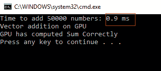
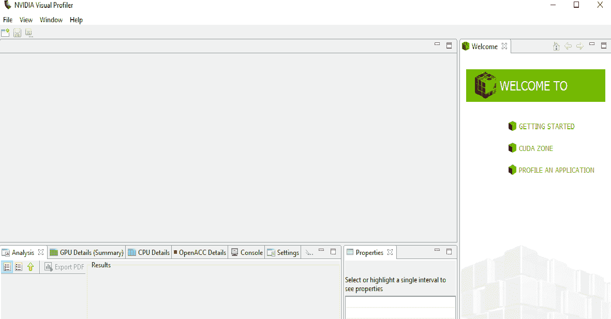
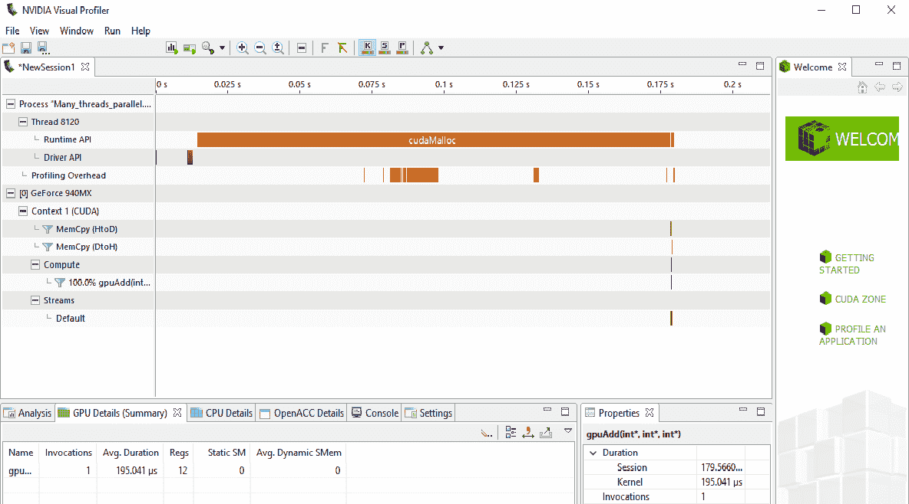
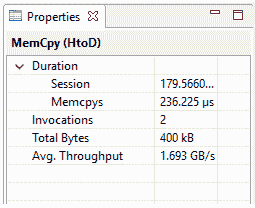
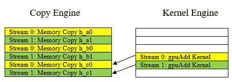
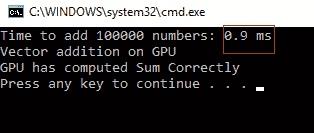
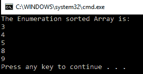
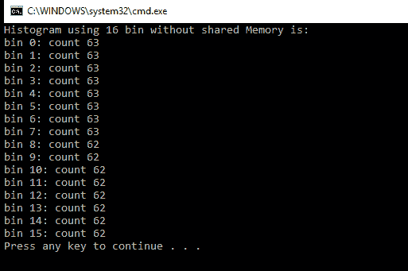
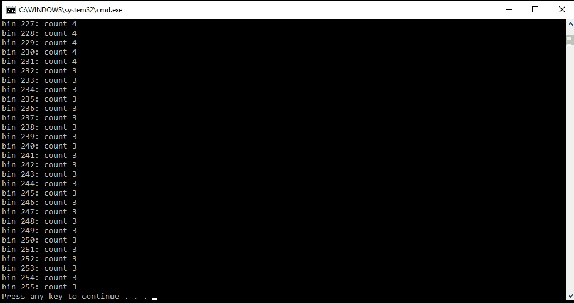

# 第四章：CUDA 的高级概念

在上一章中，我们探讨了 CUDA 的内存架构，并看到了如何有效地使用它来加速应用程序。到目前为止，我们还没有看到一种测量 CUDA 程序性能的方法。在本章中，我们将讨论如何使用 CUDA 事件来做到这一点。还将讨论 Nvidia Visual Profiler，以及如何在 CUDA 代码内部和调试工具中使用它来解决 CUDA 程序中的错误。我们还将讨论如何提高 CUDA 程序的性能。本章将描述如何使用 CUDA 流进行多任务处理，以及如何使用它们来加速应用程序。你还将学习如何使用 CUDA 加速数组排序算法。图像处理是一个需要在大约很短的时间内处理大量数据的领域，因此 CUDA 可以成为这类应用中操纵图像像素值的理想选择。本章描述了使用 CUDA 加速一个简单且广泛使用的图像处理函数——直方图计算。

本章将涵盖以下主题：

+   CUDA 中的性能测量

+   CUDA 中的错误处理

+   CUDA 程序的性能改进

+   CUDA 流及其如何用于加速应用程序

+   使用 CUDA 加速排序算法

+   使用 CUDA 介绍图像处理应用

# 技术要求

本章要求熟悉基本的 C 或 C++编程语言以及前几章中解释的所有代码示例。本章中使用的所有代码都可以从以下 GitHub 链接下载：[`github.com/PacktPublishing/Hands-On-GPU-Accelerated-Computer-Vision-with-OpenCV-and-CUDA`](https://github.com/PacktPublishing/Hands-On-GPU-Accelerated-Computer-Vision-with-OpenCV-and-CUDA)。代码可以在任何操作系统上执行，尽管它只在 Windows 10 和 Ubuntu 上进行了测试。查看以下视频以查看代码的实际运行情况：

[`bit.ly/2Nt4DEy`](http://bit.ly/2Nt4DEy)

# CUDA 程序的性能测量

到目前为止，我们还没有明确确定 CUDA 程序的性能。在本节中，我们将看到如何使用 CUDA 事件来测量 CUDA 程序的性能，并使用 Nvidia Visual Profiler 来可视化性能。这在 CUDA 中是一个非常重要的概念，因为它将允许你从许多选项中选择特定应用程序的最佳性能算法。首先，我们将使用 CUDA 事件来测量性能。

# CUDA 事件

我们可以使用 CPU 计时器来测量 CUDA 程序的性能，但它不会给出准确的结果。它将包括线程延迟开销和操作系统的调度，以及其他许多因素。使用 CPU 测量的时间也将取决于高精度 CPU 计时器的可用性。很多时候，当 GPU 内核运行时，主机正在执行异步计算，因此 CPU 计时器可能无法给出内核执行的正确时间。所以，为了测量 GPU 内核的计算时间，CUDA 提供了一个事件 API。

CUDA 事件是在您的 CUDA 程序中指定点记录的 GPU 时间戳。在这个 API 中，GPU 记录时间戳，消除了使用 CPU 计时器测量性能时存在的问题。使用 CUDA 事件测量时间有两个步骤：创建事件和记录事件。我们将记录两个事件，一个在代码的开始处，一个在结束处。然后，我们将尝试计算这两个事件之间时间差，这将给出代码的整体性能。

在您的 CUDA 代码中，您可以通过包含以下行来使用 CUDA 事件 API 来测量性能：

```py
cudaEvent_t e_start, e_stop;
cudaEventCreate(&e_start);
cudaEventCreate(&e_stop);
cudaEventRecord(e_start, 0);
//All GPU code for which performance needs to be measured allocate the memory
cudaMalloc((void**)&d_a, N * sizeof(int));
cudaMalloc((void**)&d_b, N * sizeof(int));
cudaMalloc((void**)&d_c, N * sizeof(int));

  //Copy input arrays from host to device memory
cudaMemcpy(d_a, h_a, N * sizeof(int), cudaMemcpyHostToDevice);
cudaMemcpy(d_b, h_b, N * sizeof(int), cudaMemcpyHostToDevice);

gpuAdd << <512, 512 >> >(d_a, d_b, d_c);
//Copy result back to host memory from device memory
cudaMemcpy(h_c, d_c, N * sizeof(int), cudaMemcpyDeviceToHost);
cudaDeviceSynchronize();
cudaEventRecord(e_stop, 0);
cudaEventSynchronize(e_stop);
float elapsedTime;
cudaEventElapsedTime(&elapsedTime, e_start, e_stop);
printf("Time to add %d numbers: %3.1f ms\n",N, elapsedTime);
```

我们将创建两个事件，`e_start`和`e_stop`，用于开始和结束代码。`cudaEvent_t`用于定义事件对象。要创建一个事件，我们将使用`cudaEventCreate` API。我们可以将事件对象作为参数传递给此 API。在代码的开始处，我们将记录 GPU 时间戳在`e_start`事件中；这将通过`cudaEventRecord` API 来完成。此函数的第二个参数是零，它表示 CUDA 流号，我们将在本章后面讨论。

在记录开始时的时间戳后，您可以开始编写您的 GPU 代码。在代码结束时，我们将在`e_stop`事件中再次记录时间。这将通过`cudaEventRecord(e_stop, 0)`行来完成。一旦我们记录了开始和结束时间，它们之间的差异应该会给我们代码的实际性能。但在这两个事件之间直接计算时间差仍然存在一个问题。

正如我们在前面的章节中讨论的那样，CUDA C 中的执行可以是异步的。当 GPU 执行内核时，CPU 可能会执行我们的代码的下一行，直到 GPU 完成其执行。所以，如果不同步 GPU 和 CPU 就直接测量时间可能会得到错误的结果。`CudaEventRecord()`会在其调用之前的所有 GPU 指令完成时记录一个时间戳。我们不应该在 GPU 上的先前工作完成之前读取`e_stop`事件。因此，为了同步 CPU 操作与 GPU，我们将使用`cudaEventSynchronize(e_stop)`。这确保了在`e_stop`事件中记录了正确的时间戳。

现在，为了计算这两个时间戳之间的差异，CUDA 提供了一个名为`cudaEventElapsedTime`的 API。它有三个参数。第一个是我们想要存储差异的变量，第二个是开始事件，第三个是结束事件。计算完这个时间后，我们将在下一行将其打印到控制台。我们将此性能测量代码添加到上一章中看到的向量加法代码中，使用了多个线程和块。添加这些行后的输出如下：



在 GPU 上添加 50,000 个元素所需的时间大约为 0.9 毫秒。此输出将取决于您的系统配置，因此您可能在红色框中得到不同的输出。因此，您可以将此性能测量代码包含在本书中看到的所有代码示例中，以测量它们的性能。您还可以通过使用此事件 API 来量化使用常量和纹理内存的性能提升。

应当记住，CUDA 事件只能用来测量设备代码块的执行时间。这仅包括内存分配、内存复制和内核执行。它不应用于测量主机代码的执行时间。因为 GPU 在事件 API 中记录时间，使用它来测量主机代码的性能可能会得到错误的结果。

# Nvidia 视觉分析器

我们现在知道 CUDA 提供了一个有效的方法来提高并行计算应用程序的性能。然而，有时，即使将 CUDA 集成到您的应用程序中，代码的性能也可能不会提高。在这种情况下，可视化代码中哪个部分花费了最多时间完成是非常有用的。这被称为**内核执行代码分析**。Nvidia 提供了一个用于此的工具，并且它包含在标准的 CUDA 安装中。这个工具被称为**Nvidia 视觉分析器**。在 Windows 10 上的标准 CUDA 9.0 安装中，它可以在以下路径找到：`C:\Program Files\NVIDIA GPU Computing Toolkit\CUDA\v9.0\libnvvp`。您可以在该路径上运行`nvvp`应用程序，这将打开 Nvidia 视觉分析工具，如下所示：



此工具将执行您的代码，并根据您的 GPU 性能，为您提供每个内核的执行时间、代码中每个操作的详细时间戳、代码使用的内存以及内存带宽等详细信息。要为任何您开发的应用程序可视化和获取详细报告，您可以转到文件 -> 新会话。选择应用程序的`.exe`文件。我们选择了上一章中看到的向量加法示例。结果如下：



结果显示了程序中所有操作的计时。可以看到，`cudaMalloc`操作完成所需时间最长。它还显示了你的代码中每个操作执行的顺序。它显示内核只被调用了一次，平均需要 192.041 微秒来执行。内存复制操作的详细信息也可以可视化。从主机到设备的内存复制操作属性如下所示：



可以看到，当我们从主机复制两个数组到设备时，内存复制操作被调用了两次。总共复制的字节数为 400 KB，吞吐量为 1.693 GB/s。这个工具在内核执行分析中非常重要。它也可以用来比较两个内核的性能。它将显示导致你的代码性能下降的确切操作。

总结来说，在本节中，我们看到了两种测量和分析 CUDA 代码的方法。CUDA 事件是一个用于测量设备代码时序的效率 API。Nvidia Visual Profiler 提供了对 CUDA 代码的详细分析和性能分析，可用于性能分析。在下一节中，我们将看到如何处理 CUDA 代码中的错误。

# CUDA 中的错误处理

我们还没有检查 CUDA 程序中 GPU 设备和内存的可用性。可能发生的情况是，当你运行 CUDA 程序时，GPU 设备不可用或内存不足。在这种情况下，你可能难以理解程序终止的原因。因此，在 CUDA 程序中添加错误处理代码是一个好习惯。在本节中，我们将尝试了解如何将此错误处理代码添加到 CUDA 函数中。当代码没有给出预期输出时，逐行检查代码的功能或通过在程序中添加断点来检查是有用的。这被称为**调试**。CUDA 提供了可以帮助的调试工具。因此，在接下来的部分，我们将看到 Nvidia 与 CUDA 一起提供的某些调试工具。

# 代码中的错误处理

当我们在第二章中讨论 CUDA API 函数时，*使用 CUDA C 进行并行编程*，我们看到了它们也返回一个标志，表示操作是否成功完成。这可以用来在 CUDA 程序中处理错误。当然，这不会帮助解决错误，但它会指示哪个 CUDA 操作导致了错误。将错误处理代码包装在 CUDA 函数中是一个非常良好的实践。以下是一个`cudaMalloc`函数的示例错误处理代码：

```py
cudaError_t cudaStatus;
cudaStatus = cudaMalloc((void**)&d_a, sizeof(int));
if (cudaStatus != cudaSuccess) {
        fprintf(stderr, "cudaMalloc failed!");
        goto Error;
}
```

`cudaError_t` API 用于创建一个错误对象，该对象将存储所有 CUDA 操作的返回值。因此，`cudaMalloc` 函数的输出被分配给这个错误对象。如果错误对象不等于 `cudaSuccess`，则表示在设备上分配内存时出现了错误。这通过一个 `if` 语句来处理。它将在控制台上打印错误并跳转到程序的末尾。以下是一个在内存复制操作期间进行错误处理的包装代码示例：

```py
cudaStatus = cudaMemcpy(d_a,&h_a, sizeof(int), cudaMemcpyHostToDevice);
if (cudaStatus != cudaSuccess) {
  fprintf(stderr, "cudaMemcpy failed!");
  goto Error;
  }
```

再次强调，它与 `cudaMalloc` 的错误处理代码具有类似的结构。以下是一个内核调用包装代码的示例：

```py
gpuAdd<<<1, 1>>>(d_a, d_b, d_c);
// Check for any errors launching the kernel
cudaStatus = cudaGetLastError();
if (cudaStatus != cudaSuccess) {
  fprintf(stderr, "addKernel launch failed: %s\n", cudaGetErrorString(cudaStatus));
  goto Error;
}
```

内核调用不返回表示成功或失败的标志，因此它不会直接分配给错误对象。相反，如果在内核的启动过程中出现任何错误，则可以使用 `cudaGetLastError()` API 获取它，该 API 用于处理内核调用期间的错误。它被分配给 `cudaStatus` 错误对象，如果它不等于 `cudaSuccess`，它将在控制台上打印错误并跳转到程序的末尾。所有错误处理代码都会跳转到由 `Error` 标签定义的代码部分。它可以定义如下：

```py
Error:
    cudaFree(d_a);
```

无论在程序中遇到任何错误，我们都会跳转到这个部分。我们将释放设备上分配的内存，然后退出 `main` 函数。这是一种编写 CUDA 程序的非常有效的方法。我们建议您使用这种方法来编写您的 CUDA 代码。之前没有解释这一点是为了避免在代码示例中引入不必要的复杂性。在 CUDA 程序中添加错误处理代码会使它们变得更长，但它能够确定是哪个 CUDA 操作在代码中引起问题。

# 调试工具

在编程中，我们可能会遇到两种类型的错误：**语法**错误和**语义**错误。语法错误可以通过编译器处理，但语义错误很难找到和调试。语义错误会导致程序出现意外的行为。当您的 CUDA 程序没有按预期工作，就需要逐行执行代码以可视化每行后的输出。这被称为**调试**。这对于任何类型的编程来说都是一个非常重要的操作。CUDA 提供了调试工具，有助于解决这类错误。

对于基于 Linux 的系统，Nvidia 提供了一个非常有用的调试器，称为 **CUDA-GDB**。它具有与用于 C 代码的正常 GDB 调试器类似的界面。它通过设置断点、检查 GPU 内存、检查块和线程等功能，帮助您在 GPU 上直接调试内核。它还提供了一个内存检查器来检查非法内存访问。

对于基于 Windows 的系统，Nvidia 提供了与 Microsoft Visual Studio 集成的 Nsight 调试器。同样，它具有在程序中添加断点和检查块或线程执行的功能。可以从 Visual Studio 内存界面查看设备的全局内存。

总结来说，在本节中，我们看到了两种处理 CUDA 中错误的方法。一种方法有助于解决与 GPU 硬件相关的错误，例如设备或内存不可用等 CUDA 程序中的错误。第二种使用调试的方法有助于当程序不符合预期时。在下一节中，我们将看到一些可以帮助提高 CUDA 程序性能的高级概念。

# CUDA 程序的性能提升

在本节中，我们将看到一些基本指南，我们可以遵循这些指南来提高 CUDA 程序的性能。这些将逐一解释。

# 使用最佳数量的块和线程

我们在内核调用过程中看到了两个需要指定的参数：每个块的数量和每个块中的线程数。在内核调用期间，GPU 资源不应空闲；只有这样，它才能提供最佳性能。如果资源保持空闲，则可能会降低程序的性能。每个块和每个块中的线程数有助于保持 GPU 资源忙碌。研究表明，如果块的数量是 GPU 上多处理器数量的两倍，将提供最佳性能。GPU 上多处理器的总数可以通过使用设备属性找到，如第二章中所述，*使用 CUDA C 进行并行编程*。同样，每个块的最大线程数应等于`maxThreadperblock`设备属性。这些值仅作为指导。您可以通过调整这两个参数来获得应用程序中的最佳性能。

# 最大化算术效率

**算术效率**定义为数学运算次数与内存访问操作次数的比率。算术效率的值应尽可能高以获得良好的性能。可以通过最大化每个线程的运算次数和最小化每个线程在内存上的时间来实现。有时，最大化每个线程的运算次数的机会有限，但当然，您可以减少在内存上的时间。您可以通过将频繁访问的数据存储在快速内存中来最小化它。

我们在上一章中看到，局部内存和寄存器文件是 GPU 上可用的最快内存类型。因此，它们可以用来存储需要频繁访问的数据。我们还看到了使用共享内存、常量内存和纹理内存来提高性能。缓存也有助于减少内存访问时间。最终，如果我们减少全局内存的带宽，我们可以减少在内存上的时间。在提高 CUDA 程序性能方面，有效的内存使用非常重要，因为内存带宽是快速执行中的最大瓶颈。

# 使用归一化或步进内存访问

合并内存访问意味着每个线程都读取或写入连续的内存位置。当使用这种内存访问方法时，GPU 效率最高。如果线程使用偏移量为常数的内存位置，则这被称为**步进内存访问**。它仍然比随机内存访问有更好的性能。因此，如果您在程序中尝试使用合并内存访问，它可以显著提高性能。以下是一些这些内存访问模式的示例：

```py
Coalesce Memory Access: d_a[i] = a
Strided Memory Access: d_a[i*2] = a 
```

# 避免线程发散

当内核中的所有线程调用不同的执行路径时，会发生线程发散。它可以在以下内核代码场景中发生：

```py
Thread divergence by way of branching
tid = ThreadId
if (tid%2 == 0)
{ 
  Some Branch code;
}
else
{
  Some other code; 
}
Thread divergence by way of looping 
Pre-loop code
for (i=0; i<tid;i++)
{
  Some loop code;
}
Post loop code;
```

在第一个代码片段中，由于`if`语句中的条件，存在针对奇数和偶数线程的单独代码。这使得奇数和偶数线程遵循不同的执行路径。在`if`语句之后，这些线程将再次合并。这将产生时间开销，因为快速线程将不得不等待慢速线程。

在第二个示例中，使用`for`循环，每个线程运行`for`循环的迭代次数不同，因此所有线程完成所需的时间不同。`循环后的代码`必须等待所有这些线程完成。这将产生时间开销。因此，尽可能避免在您的代码中这种类型的线程发散。

# 使用页面锁定主机内存

在此之前的每个示例中，我们使用`malloc`函数在主机上分配内存，这在主机上分配标准可分页内存。CUDA 提供了一个名为`cudaHostAlloc()`的另一个 API，它分配页面锁定主机内存或有时称为固定内存。它保证操作系统永远不会将此内存从磁盘页出，并且它将保留在物理内存中。因此，任何应用程序都可以访问缓冲区的物理地址。这种属性有助于 GPU 通过**直接内存访问（DMA）**将数据从主机复制到主机，而无需 CPU 干预。这有助于提高内存传输操作的性能。但是，应该小心使用固定内存，因为这种内存不会被换出到磁盘；您的系统可能耗尽内存。它可能影响系统上运行的其他应用程序的性能。您可以使用此 API 分配用于通过`Memcpy`操作将数据传输到设备的内存。使用此 API 的语法如下：

```py
Allocate Memory: cudaHostAlloc ( (void **) &h_a, sizeof(*h_a), cudaHostAllocDefault);
Free Memory: cudaFreeHost(h_a); 

```

`cudaHostAlloc`的语法类似于简单的`malloc`函数。最后一个参数，`cudaHostAllocDefault`，是一个用于修改固定内存行为的标志。`cudaFreeHost`用于释放使用`cudaHostAlloc`函数分配的内存。

# CUDA 流

我们已经看到，当单个指令对多个数据项进行操作时，GPU 在数据并行性方面提供了极大的性能提升。我们还没有看到任务并行性，其中多个相互独立的内核函数并行运行。例如，一个函数可能正在计算像素值，而另一个函数正在从互联网上下载某些内容。我们知道 CPU 提供了非常灵活的方法来处理这种类型的任务并行性。GPU 也提供了这种能力，但它的灵活性不如 CPU。这种任务并行性是通过使用 CUDA 流实现的，我们将在本节中详细探讨。

CUDA 流实际上是一个 GPU 操作的队列，这些操作按特定顺序执行。这些函数包括内核函数、内存复制操作和 CUDA 事件操作。它们被添加到队列中的顺序将决定它们的执行顺序。每个 CUDA 流可以被视为一个单独的任务，因此我们可以启动多个流以并行执行多个任务。我们将在下一节中查看 CUDA 中多个流的工作方式。

# 使用多个 CUDA 流

我们将通过在上一章开发的向量加法程序中使用多个 CUDA 流来理解 CUDA 流的工作原理。这个内核函数如下所示：

```py
#include "stdio.h"
#include<iostream>
#include <cuda.h>
#include <cuda_runtime.h>
//Defining number of elements in Array
#define N 50000

//Defining Kernel function for vector addition
__global__ void gpuAdd(int *d_a, int *d_b, int *d_c) {
  //Getting block index of current kernel

  int tid = threadIdx.x + blockIdx.x * blockDim.x;
  while (tid < N)
  {
    d_c[tid] = d_a[tid] + d_b[tid];
    tid += blockDim.x * gridDim.x;
  }
}
```

`内核`函数与我们之前开发的类似。它只是多个流将并行执行这个内核。需要注意的是，并非所有 GPU 设备都支持 CUDA 流。支持`deviceOverlap`属性的 GPU 设备可以同时执行内存传输操作和内核执行。这个属性将在 CUDA 流中用于任务并行。在继续此代码之前，请确保您的 GPU 设备支持此属性。您可以使用第二章中的代码，*使用 CUDA C 进行并行编程*，来验证此属性。我们将使用两个并行流，它们将并行执行此内核，并对输入数据的一半进行操作。我们将在主函数中首先创建这两个流，如下所示：

```py
int main(void) {
  //Defining host arrays
  int *h_a, *h_b, *h_c;
  //Defining device pointers for stream 0
  int *d_a0, *d_b0, *d_c0;
  //Defining device pointers for stream 1
 int *d_a1, *d_b1, *d_c1;
 cudaStream_t stream0, stream1;
 cudaStreamCreate(&stream0);
 cudaStreamCreate(&stream1);

cudaEvent_t e_start, e_stop;
 cudaEventCreate(&e_start);
  cudaEventCreate(&e_stop);
  cudaEventRecord(e_start, 0);

```

使用`cudaStream_t`和`cudaStreamCreate` API 定义了两个流对象，`stream 0`和`stream 1`。我们还定义了主机指针和两组设备指针，它们将分别用于每个流。我们定义并创建了两个事件来测量此程序的性能。现在，我们需要为这些指针分配内存。代码如下：

```py
  //Allocate memory for host pointers
  cudaHostAlloc((void**)&h_a, 2*N* sizeof(int),cudaHostAllocDefault);
 cudaHostAlloc((void**)&h_b, 2*N* sizeof(int), cudaHostAllocDefault);
 cudaHostAlloc((void**)&h_c, 2*N* sizeof(int), cudaHostAllocDefault);
  //Allocate memory for device pointers
  cudaMalloc((void**)&d_a0, N * sizeof(int));
  cudaMalloc((void**)&d_b0, N * sizeof(int));
  cudaMalloc((void**)&d_c0, N * sizeof(int));
  cudaMalloc((void**)&d_a1, N * sizeof(int));
  cudaMalloc((void**)&d_b1, N * sizeof(int));
  cudaMalloc((void**)&d_c1, N * sizeof(int));
  for (int i = 0; i < N*2; i++) {
    h_a[i] = 2 * i*i;
    h_b[i] = i;
  }
```

CUDA 流在进行内存复制操作时需要访问页锁定内存，因此我们使用`cudaHostAlloc`函数而不是简单的`malloc`来定义主机内存。我们在上一节中看到了页锁定内存的优势。使用`cudaMalloc`分配了两组设备指针的内存。需要注意的是，主机指针持有全部数据，因此其大小为`2*N*sizeof(int)`，而每个设备指针只操作一半的数据元素，因此其大小仅为`N*sizeof(int)`。我们还用一些随机值初始化了主机数组以进行加法操作。现在，我们将尝试在两个流中同时排队内存复制操作和内核执行操作。相应的代码如下：

```py
//Asynchrnous Memory Copy Operation for both streams
cudaMemcpyAsync(d_a0, h_a , N * sizeof(int), cudaMemcpyHostToDevice, stream0);
cudaMemcpyAsync(d_a1, h_a+ N, N * sizeof(int), cudaMemcpyHostToDevice, stream1);
cudaMemcpyAsync(d_b0, h_b , N * sizeof(int), cudaMemcpyHostToDevice, stream0);
cudaMemcpyAsync(d_b1, h_b + N, N * sizeof(int), cudaMemcpyHostToDevice, stream1);

//Kernel Call     
gpuAdd << <512, 512, 0, stream0 >> > (d_a0, d_b0, d_c0);
gpuAdd << <512, 512, 0, stream1 >> > (d_a1, d_b1, d_c1);

//Copy result back to host memory from device memory
cudaMemcpyAsync(h_c , d_c0, N * sizeof(int), cudaMemcpyDeviceToHost, stream0);
cudaMemcpyAsync(h_c + N, d_c1, N * sizeof(int), cudaMemcpyDeviceToHost, stream0);
```

我们不是使用简单的`cudaMemcpy` API，而是使用`cudaMemcpyAsync` API，它用于异步内存传输。它将一个内存复制操作的请求排队到由函数的最后一个参数指定的给定流中。当这个函数返回时，内存复制操作可能还没有开始，因此它被称为异步操作。它只是将内存复制的请求放入队列中。正如我们可以在内存复制操作中看到的那样，`stream0`操作从`0`到`N`的数据，而`stream 1`操作从`N+1`到`2N`的数据。

在流操作中，操作顺序很重要，因为我们希望内存复制操作与内核执行操作重叠。因此，我们不是先排队所有`stream0`操作，然后排队`stream 1`操作，而是首先在两个流中排队内存复制操作，然后排队内核计算操作。这将确保内存复制和内核计算相互重叠。如果这两个操作花费相同的时间，我们可以实现两倍的速度提升。我们可以通过查看以下图表来更好地了解操作顺序：



时间从上到下增加。我们可以看到，在同一时间段内执行了两个内存复制操作和内核执行操作，这将加速你的程序。我们还看到，由`cudaMemcpyAsync`定义的内存复制操作是异步的；因此，当一个流返回时，内存复制操作可能还没有开始。如果我们想使用最后一个内存复制操作的结果，那么我们必须等待两个流完成它们的队列操作。这可以通过使用以下代码来确保：

```py
cudaDeviceSynchronize();
cudaStreamSynchronize(stream0);
cudaStreamSynchronize(stream1);
```

`cudaStreamSynchronize`确保在继续到下一行之前，流中的所有操作都已完成。为了测量代码的性能，我们插入以下代码：

```py
cudaEventRecord(e_stop, 0);
cudaEventSynchronize(e_stop);
float elapsedTime;
cudaEventElapsedTime(&elapsedTime, e_start, e_stop);
printf("Time to add %d numbers: %3.1f ms\n",2* N, elapsedTime);
```

它将记录停止时间，并根据开始和停止时间之间的差异，计算该程序的总体执行时间，并在控制台上打印输出。为了检查程序是否计算了正确的输出，我们将插入以下代码进行验证：

```py
int Correct = 1;
printf("Vector addition on GPU \n");
//Printing result on console
for (int i = 0; i < 2*N; i++) 
{
  if ((h_a[i] + h_b[i] != h_c[i]))
  {
    Correct = 0;
  }
}

if (Correct == 1)
{
  printf("GPU has computed Sum Correctly\n");
}
else
{
  printf("There is an Error in GPU Computation\n");
}
//Free up memory
cudaFree(d_a0);
cudaFree(d_b0);
cudaFree(d_c0);
cudaFree(d_a0);
cudaFree(d_b0);
cudaFree(d_c0);
cudaFreeHost(h_a);
cudaFreeHost(h_b);
cudaFreeHost(h_c);
return 0;
}
```

验证代码与我们之前看到的类似。使用`cudaFree`释放设备上分配的内存，使用`cudaHostAlloc`在主机上分配的内存使用`cudaFreeHost`函数释放。这是强制性的，否则您的系统可能会很快耗尽内存。程序输出如下所示：



如前一个截图所示，需要 0.9 毫秒来添加 100,000 个元素，这是在没有流的情况下代码的两倍增加，如本章第一部分所示，添加 50,000 个数字需要 0.9 毫秒。

总结来说，在本节中我们看到了 CUDA 流，它有助于在 GPU 上实现任务并行。在流中排队操作的顺序对于使用 CUDA 流实现加速非常重要。

# 使用 CUDA 加速排序算法

排序算法在许多计算应用中被广泛使用。有许多排序算法，例如枚举或排名排序、冒泡排序和归并排序。所有算法都有不同的复杂度级别，因此对给定数组进行排序所需的时间不同。对于大型数组，所有算法都需要很长时间才能完成。如果可以使用 CUDA 进行加速，那么它将对任何计算应用都有很大帮助。

为了展示 CUDA 如何加速不同的排序算法，我们将实现一个排名排序算法。

# 枚举或排名排序算法

在这个算法中，我们计算数组中的每个元素，以找出数组中有多少元素小于当前元素。从那里，我们可以得到当前元素在排序数组中的位置。然后，我们将此元素放在那个位置。我们重复这个过程，直到数组中的所有元素，以得到一个排序数组。这被实现为`kernel`函数，如下所示：

```py
#include "device_launch_parameters.h"
#include <stdio.h>

#define arraySize 5
#define threadPerBlock 5
//Kernel Function for Rank sort
__global__ void addKernel(int *d_a, int *d_b)
{
  int count = 0;
  int tid = threadIdx.x;
  int ttid = blockIdx.x * threadPerBlock + tid;
  int val = d_a[ttid];
  __shared__ int cache[threadPerBlock];
  for (int i = tid; i < arraySize; i += threadPerBlock) {
    cache[tid] = d_a[i];
    __syncthreads();
    for (int j = 0; j < threadPerBlock; ++j)
      if (val > cache[j])
        count++;
        __syncthreads();
  }
  d_b[count] = val;
}
```

`Kernel`函数接受两个数组作为参数。`d_a`是输入数组，`d_b`是输出数组。`count`变量被取用，它存储当前元素在排序数组中的位置。当前线程在块中的索引存储在`tid`中，所有块中唯一的线程索引存储在`ttid`中。使用共享内存来减少从全局内存访问数据的时间。共享内存的大小等于块中线程的数量，如前所述。`value`变量持有当前元素。共享内存被填充为全局内存中的值。这些值与`value`变量进行比较，并将小于的值的数量存储在`count`变量中。这会一直持续到数组中的所有元素都与`value`变量进行比较。循环结束后，`count`变量有元素在排序数组中的位置，并将当前元素存储在输出数组`d_b`中的那个位置。

该代码的`main`函数如下：

```py
int main()
{
    //Define Host and Device Array
  int h_a[arraySize] = { 5, 9, 3, 4, 8 };
  int h_b[arraySize];
  int *d_a, *d_b;

    //Allocate Memory on the device 
  cudaMalloc((void**)&d_b, arraySize * sizeof(int));
  cudaMalloc((void**)&d_a, arraySize * sizeof(int));

    // Copy input vector from host memory to device memory.
  cudaMemcpy(d_a, h_a, arraySize * sizeof(int), cudaMemcpyHostToDevice);

    // Launch a kernel on the GPU with one thread for each element.
  addKernel<<<arraySize/threadPerBlock, threadPerBlock>>>(d_a, d_b);

    //Wait for device to finish operations
  cudaDeviceSynchronize();
    // Copy output vector from GPU buffer to host memory.
  cudaMemcpy(h_b, d_b, arraySize * sizeof(int), cudaMemcpyDeviceToHost);
  printf("The Enumeration sorted Array is: \n");
  for (int i = 0; i < arraySize; i++) 
  {
    printf("%d\n", h_b[i]);
  }
    //Free up device memory
  cudaFree(d_a);
  cudaFree(d_b);
  return 0;
}
```

`main` 函数你现在应该已经很熟悉了。我们正在定义主机和设备数组，并在设备上为设备数组分配内存。主机数组使用一些随机值初始化，并将其复制到设备的内存中。通过传递设备指针作为参数来启动内核。内核通过排名排序算法计算排序后的数组，并将其返回到主机。这个排序后的数组如下所示在控制台上打印：



这是一个非常简单的情况，你可能看不到 CPU 和 GPU 之间有任何性能提升。但是，如果你继续增加 `arraySize` 的值，那么 GPU 将会极大地提高这个算法的性能。对于大小等于 15,000 的数组，它可以实现百倍的性能提升。

排名排序是可用的最简单的排序算法。这次讨论将帮助你开发其他排序算法的代码，例如冒泡排序和归并排序。

# 使用 CUDA 进行图像处理

现在，我们生活在一个高清摄像头传感器时代，它可以捕捉高分辨率的图像。一个图像可以达到 1920 x 1920 像素的大小。因此，在计算机上实时处理这些像素需要每秒执行数十亿次的浮点运算。即使是速度最快的 CPU 也难以做到这一点。GPU 可以在这种情况下提供帮助。它提供了高计算能力，这可以通过 CUDA 在你的代码中利用。

在计算机中，图像以多维数组的形式存储，灰度图像有两个维度，彩色图像有三个维度。CUDA 也支持多维网格块和线程。因此，我们可以通过启动多维块和线程来处理图像，就像之前看到的那样。块和线程的数量可以取决于图像的大小。它也将取决于你的 GPU 规格。如果它支持每个块 1,024 个线程，那么可以启动每个块 32 x 32 个线程。块的数量可以通过将图像大小除以这些线程的数量来确定。正如之前多次讨论的那样，参数的选择会影响你代码的性能。因此，它们应该被适当地选择。

将用 C 或 C++ 开发的简单图像处理代码转换为 CUDA 代码非常容易。即使是不经验验的程序员也可以通过遵循一个固定的模式来完成。图像处理代码有一个固定的模式，如下面的代码所示：

```py
for (int i=0; i < image_height; i++)
{
   for (int j=0; j < image_width; j++)
   {
      //Pixel Processing code for pixel located at (i,j)
   }
}
```

图像不过是存储在计算机上的多维矩阵，因此从图像中获取单个像素值需要使用嵌套的 `for` 循环来遍历所有像素。为了将此代码转换为 CUDA，我们希望启动与图像中像素数量相等的线程数量。在 `kernel` 函数中，可以通过以下代码在线程中获取像素值：

```py
int i = blockIdx.y * blockDim.y + threadIdx.y;
int j = blockIdx.x * blockDim.x + threadIdx.x;

```

`i`和`j`值可以用作图像数组的索引来查找像素值。所以，如前述代码所示，通过将`for`循环转换为线程索引的简单转换过程，我们可以编写 CUDA 程序的设备代码。从下一节开始，我们将使用`OpenCV`库开发许多图像处理应用程序。在本章中，我们不会涵盖实际的图像操作，但我们将通过开发一个用于计算直方图这一重要统计操作的 CUDA 程序来结束本章。直方图计算对于图像处理应用程序也非常重要。

# 使用 CUDA 在 GPU 上计算直方图

直方图是一个非常重要的统计概念，在机器学习、计算机视觉、数据科学和图像处理等多种应用中使用。它表示给定数据集中每个元素频率的计数。它显示了哪些数据项出现频率最高，哪些出现频率最低。你也可以通过查看直方图的值来了解数据的分布。在本节中，我们将开发一个算法，用于计算给定数据分布的直方图。

我们将首先在 CPU 上计算直方图，这样你可以了解如何计算直方图。假设我们有一组包含 1,000 个元素的数，每个元素的价值在 0 到 15 之间。我们想要计算这个分布的直方图。在 CPU 上计算这个计算的示例代码如下：

```py
int h_a[1000] = Random values between 0 and 15

int histogram[16];
for (int i = 0; i<16; i++)
{ 
   histogram[i] = 0;
}
for (i=0; i < 1000; i++)
{
   histogram[h_a[i]] +=1;
} 
```

我们有 1,000 个数据元素，它们存储在`h_a`中。`h_a`数组包含`0`到`15`之间的值；它有 16 个不同的值。因此，bin 的数量，即需要计算直方图的唯一值的数量，是 16。因此，我们定义了一个大小等于 bin 数量的直方图数组，用于存储最终的直方图。这个数组需要初始化为零，因为它将在每次发生时递增。这是在从`0`到 bin 数量的第一个`for`循环中完成的。

对于直方图的计算，我们需要遍历`h_a`中的所有元素。在`h_a`中找到的任何值，都需要增加该直方图数组中特定索引的值。这是通过第二个`for`循环完成的，该循环从`0`到数组大小运行，并增加由`h_a`中找到的值索引的直方图数组。在`for`循环完成后，直方图数组将包含`0`到`15`之间每个元素的频率。

现在，我们将为 GPU 开发相同的代码。我们将尝试使用三种不同的方法来开发这个代码。前两种方法的内核代码如下：

```py
#include <stdio.h>
#include <cuda_runtime.h>

#define SIZE 1000
#define NUM_BIN 16

__global__ void histogram_without_atomic(int *d_b, int *d_a)
{
  int tid = threadIdx.x + blockDim.x * blockIdx.x;
  int item = d_a[tid];
  if (tid < SIZE)
  {
    d_b[item]++;
  }
 }

__global__ void histogram_atomic(int *d_b, int *d_a)
{
  int tid = threadIdx.x + blockDim.x * blockIdx.x;
  int item = d_a[tid];
  if (tid < SIZE)
  {
    atomicAdd(&(d_b[item]), 1);
  }
}
```

第一个函数是直方图计算的最简单内核函数。每个线程都在操作一个数据元素。使用线程 ID 作为索引从输入数组中获取数据元素的值。这个值被用作`d_b`输出数组的索引，该数组被递增。`d_b`数组应该包含输入数据中每个值（`0`到`15`）的频率。但如果你回想一下第三章，*线程、同步和内存*，这可能不会给你一个正确答案，因为许多线程正在同时尝试修改相同的内存位置。在这个例子中，1,000 个线程正在同时尝试修改 16 个内存位置。我们需要在这种情况下使用原子的`add`操作。

第二个设备函数是使用原子`add`操作开发的。这个内核函数将给出正确答案，但完成所需的时间会更长，因为原子操作是一个阻塞操作。当有一个线程正在使用特定的内存位置时，所有其他线程都必须等待。因此，这个第二个内核函数将增加开销时间，使其比 CPU 版本还要慢。为了完成代码，我们将尝试按照以下方式编写它的`main`函数：

```py
int main()
{

  int h_a[SIZE];
  for (int i = 0; i < SIZE; i++) {

  h_a[i] = i % NUM_BIN;
  }
  int h_b[NUM_BIN];
  for (int i = 0; i < NUM_BIN; i++) {
    h_b[i] = 0;
  }

  // declare GPU memory pointers
  int * d_a;
  int * d_b;

  // allocate GPU memory
  cudaMalloc((void **)&d_a, SIZE * sizeof(int));
  cudaMalloc((void **)&d_b, NUM_BIN * sizeof(int));

  // transfer the arrays to the GPU
  cudaMemcpy(d_a, h_a, SIZE * sizeof(int), cudaMemcpyHostToDevice);
  cudaMemcpy(d_b, h_b, NUM_BIN * sizeof(int), cudaMemcpyHostToDevice);

  // launch the kernel

  //histogram_without_atomic << <((SIZE+NUM_BIN-1) / NUM_BIN), NUM_BIN >> >(d_b, d_a);
  histogram_atomic << <((SIZE+NUM_BIN-1) / NUM_BIN), NUM_BIN >> >(d_b, d_a);

  // copy back the sum from GPU
  cudaMemcpy(h_b, d_b, NUM_BIN * sizeof(int), cudaMemcpyDeviceToHost);
  printf("Histogram using 16 bin without shared Memory is: \n");
  for (int i = 0; i < NUM_BIN; i++) {
    printf("bin %d: count %d\n", i, h_b[i]);
  }

  // free GPU memory allocation
  cudaFree(d_a);
  cudaFree(d_b);
  return 0;
}
```

我们通过定义主机和设备数组并为它们分配内存来启动了`main`函数。在第一个`for`循环中，`h_a`输入数据数组被初始化为从`0`到`15`的值。我们使用了取模运算，因此 1,000 个元素将均匀地分配到`0`到`15`的值之间。第二个数组，用于存储直方图，被初始化为零。这两个数组被复制到设备内存中。内核将计算直方图并将其返回到主机。我们将在控制台上打印这个直方图。输出如下所示：



当我们尝试使用原子操作来测量这段代码的性能并与 CPU 性能进行比较时，对于大型数组，它比 CPU 慢。这引发了一个问题：我们应该使用 CUDA 进行直方图计算，还是有可能使这种计算更快？

这个问题的答案是：*是*。如果我们为给定的块计算直方图使用共享内存，然后将这个块直方图添加到全局内存上的整体直方图中，那么可以加快操作速度。这是因为加法是一个累积操作。以下是用共享内存进行直方图计算的内核代码：

```py
#include <stdio.h>
#include <cuda_runtime.h>
#define SIZE 1000
#define NUM_BIN 256
__global__ void histogram_shared_memory(int *d_b, int *d_a)
{
  int tid = threadIdx.x + blockDim.x * blockIdx.x;
  int offset = blockDim.x * gridDim.x;
  __shared__ int cache[256];
  cache[threadIdx.x] = 0;
  __syncthreads();

  while (tid < SIZE)
  {
    atomicAdd(&(cache[d_a[tid]]), 1);
    tid += offset;
  }
  __syncthreads();
  atomicAdd(&(d_b[threadIdx.x]), cache[threadIdx.x]);
}
```

在此代码中，桶的数量为 256 而不是 16，以提供更大的容量。我们定义的共享内存大小等于一个块中的线程数，即 256 个桶。我们将计算当前块的直方图，因此共享内存初始化为零，并按前面讨论的方式计算此块的直方图。但是，这次结果存储在共享内存中，而不是全局内存中。在这种情况下，只有 256 个线程试图访问共享内存中的 256 个内存元素，而不是像前一个代码中的 1,000 个元素。这将有助于减少原子操作中的时间开销。最后一行的最终原子`add`操作将一个块的直方图添加到整体直方图值中。由于加法是一个累积操作，我们不必担心每个块执行的顺序。此`main`函数与前面的函数类似。

这个`内核`函数的输出如下：



如果你测量前面程序的性能，它将击败没有共享内存的 GPU 版本和大型数组大小的 CPU 实现。你可以通过将 GPU 计算的直方图结果与 CPU 计算结果进行比较来检查 GPU 计算的直方图是否正确。

本节演示了在 GPU 上实现直方图的过程。它还强调了在 CUDA 程序中使用共享内存和原子操作的重要性。它还展示了 CUDA 在图像处理应用中的帮助以及将现有 CPU 代码转换为 CUDA 代码的简便性。

# 摘要

在本章中，我们看到了一些 CUDA 的高级概念，这些概念可以帮助我们使用 CUDA 开发复杂的应用程序。我们看到了测量设备代码性能的方法，以及如何使用 Nvidia Visual Profiler 工具查看内核函数的详细配置文件。这有助于我们识别降低程序性能的操作。我们看到了从 CUDA 代码本身处理硬件操作错误的方法，以及使用某些工具调试代码的方法。CPU 提供了有效的任务并行性，其中两个完全不同的函数可以并行执行。我们还看到 GPU 也通过 CUDA 流提供这种功能，并在相同的向量加法程序中使用 CUDA 流实现了两倍的速度提升。

然后，我们看到了使用 CUDA 加速排序算法的例子，这是构建复杂计算应用时需要理解的重要概念。图像处理是一个计算密集型任务，需要实时执行。几乎所有的图像处理算法都可以利用 GPU 和 CUDA 的并行性。因此，在最后一节中，我们看到了 CUDA 在加速图像处理应用中的应用，以及如何将现有的 C++代码转换为 CUDA 代码。我们还开发了用于直方图计算的 CUDA 代码，这是一个重要的图像处理应用。

本章也标志着与 CUDA 编程相关概念的结束。从下一章开始，我们将开始使用 OpenCV 库开发计算机视觉应用，该库利用了我们到目前为止所看到的 CUDA 加速概念。从下一章开始，我们将处理真实图像而不是矩阵。

# 问题

1.  为什么不使用 CPU 计时器来衡量内核函数的性能？

1.  尝试使用 Nvidia Visual Profiler 工具可视化上一章中实现的矩阵乘法代码的性能。

1.  给出程序中遇到的不同语义错误示例。

1.  内核函数中线程发散的缺点是什么？请用例子解释。

1.  使用`cudahostAlloc`函数在主机上分配内存的缺点是什么？

1.  证明以下陈述的正确性：CUDA 流中的操作顺序对于提高程序性能非常重要。

1.  为了在 CUDA 中实现良好的性能，对于 1024 x 1024 的图像，应该启动多少个块和线程？
