# 使用 CUDA 支持的 OpenCV 入门

到目前为止，我们已经看到了所有与使用 CUDA 进行并行编程相关的概念，以及它是如何利用 GPU 进行加速的。从本章开始，我们将尝试使用 CUDA 中的并行编程概念来应用于计算机视觉应用。虽然我们已经处理过矩阵，但我们还没有处理过实际图像。基本上，处理图像类似于二维矩阵的操作。我们不会从头开始为 CUDA 中的计算机视觉应用开发整个代码，但我们将使用名为 OpenCV 的流行计算机视觉库。尽管这本书假设读者对使用 OpenCV 有一些熟悉，但本章回顾了在 C++中使用 OpenCV 的概念。本章描述了在 Windows 和 Ubuntu 上安装支持 CUDA 的 OpenCV 库。然后它描述了如何测试此安装并运行一个简单的程序。本章通过为它开发简单的代码来描述使用 OpenCV 处理图像和视频。本章还将比较具有 CUDA 支持的程序与没有 CUDA 支持的程序的性能。

本章将涵盖以下主题：

+   图像处理和计算机视觉简介

+   支持 CUDA 的 OpenCV 简介

+   在 Windows 和 Ubuntu 上安装支持 CUDA 的 OpenCV

+   使用 OpenCV 处理图像

+   使用 OpenCV 处理视频

+   图像上的算术和逻辑运算

+   颜色空间转换和图像阈值

+   CPU 和 GPU OpenCV 程序的性能比较

# 技术要求

本章需要具备图像处理和计算机视觉的基本理解。它需要熟悉基本的 C 或 C++编程语言以及前几章中解释的所有代码示例。本章中使用的所有代码都可以从以下 GitHub 链接下载：[`github.com/PacktPublishing/Hands-On-GPU-Accelerated-Computer-Vision-with-OpenCV-and-CUDA`](https://github.com/PacktPublishing/Hands-On-GPU-Accelerated-Computer-Vision-with-OpenCV-and-CUDA)。代码可以在任何操作系统上执行，尽管它只在 Ubuntu 16.04 上进行了测试。

查看以下视频以查看代码的实际运行情况：

[`bit.ly/2xF5cQV`](http://bit.ly/2xF5cQV)

# 图像处理和计算机视觉简介

世界上的图像和视频数据量每天都在不断增加。随着移动设备用于捕捉图像和互联网用于发布图像的日益普及，每天都会产生大量的视频和图像数据。图像处理和计算机视觉在各个领域的许多应用中都得到了应用。医生使用 MRI 和 X 射线图像进行医学诊断。空间科学家和化学工程师使用图像进行太空探索和分子水平上各种基因的分析。图像可以用于开发自动驾驶车辆和视频监控应用。它们还可以用于农业应用和制造过程中的故障产品识别。所有这些应用都需要在计算机上以高速处理图像。我们不会探讨图像是如何通过相机传感器捕捉并转换为计算机存储的数字图像的。在这本书中，我们只涵盖计算机上的图像处理，假设它已经存储好了。

许多人将**图像处理**和**计算机视觉**这两个术语互换使用。然而，这两个领域之间是有区别的。图像处理关注通过修改像素值来提高图像的视觉质量，而计算机视觉关注从图像中提取重要信息。因此，在图像处理中，输入和输出都是图像，而在计算机视觉中，输入是图像，但输出是从该图像中提取的信息。两者都有广泛的应用，但图像处理主要在计算机视觉应用的预处理阶段使用。

图像以多维矩阵的形式存储。因此，在计算机上处理图像不过是操作这个矩阵。我们在前面的章节中看到了如何在 CUDA 中处理矩阵。在 CUDA 中读取、操作和显示图像的代码可能会变得非常长、繁琐且难以调试。因此，我们将使用一个包含所有这些功能 API 的库，并且可以利用 CUDA-GPU 加速处理图像的优势。这个库被称为 OpenCV，它是“开放计算机视觉”的缩写。在下一节中，我们将详细介绍这个库。

# OpenCV 简介

OpenCV 是一个以计算效率为前提，并专注于实时性能的计算机视觉库。它用 C/C++编写，包含超过一百个有助于计算机视觉应用的功能。OpenCV 的主要优势是它是开源的，并且根据伯克利软件发行许可（BSD 许可）发布，这允许在研究和商业应用中免费使用 OpenCV。这个库提供了 C、C++、Java 和 Python 语言的接口，并且可以在所有操作系统上使用，如 Windows、Linux、macOS 和 Android，而无需修改任何一行代码。

这个库还可以利用多核处理、OpenGL 和 CUDA 进行并行处理。由于 OpenCV 轻量级，它也可以在树莓派等嵌入式平台上使用。这使得它在现实场景中部署计算机视觉应用到嵌入式系统中变得理想。我们将在接下来的几章中探讨这一点。这些特性使 OpenCV 成为计算机视觉开发者的默认选择。它拥有广泛的开发者和用户社区，不断帮助改进这个库。OpenCV 的下载量以百万计，并且每天都在增加。另一个流行的计算机视觉和图像处理工具是 MATLAB，因此你可能会想知道使用 OpenCV 而不是 MATLAB 的优势。以下表格显示了这两个工具的比较：

| **参数** | **OpenCV** | **MATLAB** |
| --- | --- | --- |
| 程序速度 | 由于它是用 C/C++开发的，所以速度更快 | 低于 OpenCV |
| 资源需求 | OpenCV 是一个轻量级库，因此在硬盘和 RAM 方面都消耗很少的内存。一个普通的 OpenCV 程序将需要少于 100MB 的 RAM。 | MATLAB 非常庞大。最新版本的 MATLAB 安装可能需要在硬盘上占用超过 15GB 的空间，并且在使用时需要大量的 RAM（超过 1GB）。 |
| 可移植性 | OpenCV 可以在所有可以运行 C 语言的操作系统上运行。 | MATLAB 只能在 Windows、Linux 和 MAC 上运行。 |
| 成本 | 在商业或学术应用中使用 OpenCV 是完全免费的。 | MATLAB 是许可软件，因此你必须支付一大笔钱才能在学术或商业应用中使用它。 |
| 易用性 | 与其较少的文档和难以记忆的语法相比，OpenCV 相对较难使用。它也没有自己的开发环境。 | MATLAB 有自己的集成开发环境，内置帮助资源，这使得新程序员容易使用。 |

MATLAB 和 OpenCV 都有自己的优缺点。但当我们想在嵌入式应用中使用计算机视觉并利用并行处理时，OpenCV 是理想的选择。因此，在这本书中，我们将描述如何使用 GPU 和 CUDA 加速计算机视觉应用。OpenCV 提供了 C、C++、Python 和 Java 的 API。它是用 C/C++编写的，因此这些语言的 API 将是最快的。此外，CUDA 加速在 C/C++ API 中支持得更好，所以在这本书中，我们将使用 OpenCV 的 C/C++ API。在下一节中，我们将看到如何在各种操作系统上安装 OpenCV。

# 支持 CUDA 的 OpenCV 安装

使用 CUDA 安装 OpenCV 并不像你想象中那么简单。它涉及许多步骤。在本节中，我们将通过截图详细解释在 Windows 和 Ubuntu 上安装 OpenCV 的所有步骤，以便你可以轻松地设置你的环境。

# 在 Windows 上安装 OpenCV

本节解释了在 Windows 操作系统上安装带有 CUDA 的 OpenCV 所需的步骤。这些步骤在 Windows 10 操作系统上执行，但它们可以在任何 Windows 操作系统上工作。

# 使用预构建的二进制文件

对于 OpenCV，有一些预构建的二进制文件可供下载并直接用于您的程序中。它没有充分利用 CUDA，因此不建议在本书中使用。以下步骤描述了在 Windows 上不使用 CUDA 支持安装 OpenCV 的过程：

1.  确保已安装 Microsoft Visual Studio 以编译 C 程序。

1.  从[`sourceforge.net/projects/opencvlibrary/files/opencv-win/`](https://sourceforge.net/projects/opencvlibrary/files/opencv-win/)下载 OpenCV 的最新版本。

1.  双击下载的`.exe`文件，并将其提取到您选择的文件夹中。在这里，我们将其提取到`C://opencv`文件夹。

1.  通过右键单击我的电脑 | 高级设置 | 环境变量 | 新建来设置环境变量`OPENCV_DIR`。将其值设置为`C:\opencv\build\x64\vc14`，如下截图所示。这里`vc14`将取决于 Microsoft Visual Studio 的版本：

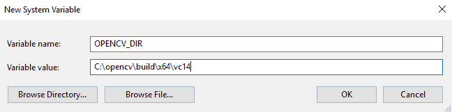

现在，您可以使用此安装为 OpenCV 应用程序使用 C/C++。

# 从源代码构建库

如果您想编译带有 CUDA 支持的 OpenCV，请按照以下步骤进行安装：

1.  OpenCV 带有 CUDA 将需要一个 C 编译器和 GPU 编译器。它需要 Microsoft Visual Studio 和最新的 CUDA 安装。安装它们的步骤在第一章，*介绍 CUDA 和 CUDA 入门*中有所介绍。因此，在继续之前，请检查它们是否已正确安装。

1.  通过访问链接下载 OpenCV 最新版本的源代码：[`github.com/opencv/opencv/.`](https://github.com/opencv/opencv/)

1.  有些额外的模块不包括在 OpenCV 中，但它们可以在名为`opencv_contrib`的额外模块中找到，这个模块可以与 OpenCV 一起安装。此模块中可用的功能不稳定；一旦它们变得稳定，它们就会被移动到实际的 OpenCV 源中。如果您想安装此模块，请从[`github.com/opencv/opencv_contrib`](https://github.com/opencv/opencv_contrib)下载。

1.  从以下链接安装`cmake`：[`cmake.org/download/`](https://cmake.org/download/)。它是编译 OpenCV 库所需的。

1.  将`opencv`和`opencv_contrib`的 ZIP 文件提取到任何文件夹中。在这里，它们被提取到`C://opencv`和`C://opencv_contrib`文件夹中。

1.  打开 CMake 以编译 OpenCV。在 CMake 中，您需要选择 OpenCV 源代码的路径，并选择此源代码将被构建的文件夹。如下截图所示：

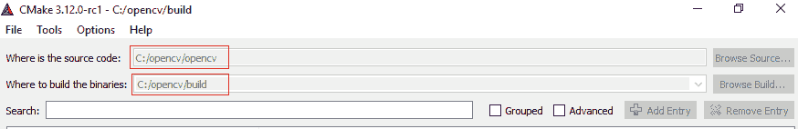

1.  然后点击配置。它将开始配置源。CMake 将尝试根据系统变量的路径设置定位尽可能多的包。配置过程如下面的截图所示：

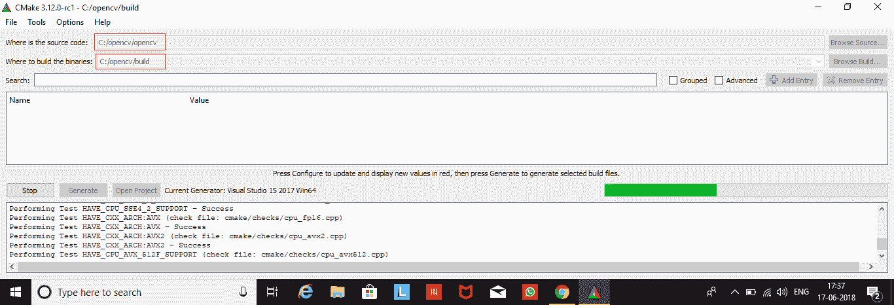

1.  如果某些包没有找到，您可以手动定位它们。为了配置具有 CUDA 支持的 OpenCV 安装，您必须检查如下截图所示的`WITH_CUDA`变量，然后再次点击配置：


1.  配置完成后，点击生成。这将根据您选择的 Visual Studio 版本创建 Visual Studio 项目文件。当生成完成后，窗口应该类似于以下截图：

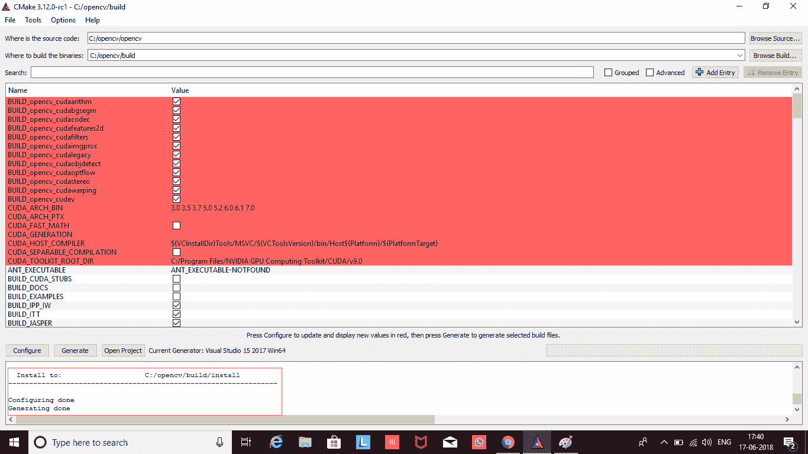

1.  前往`opencv`文件夹的构建目录，并找到名为`OpenCV.sln`的 Visual Studio 项目，如下面的截图所示：

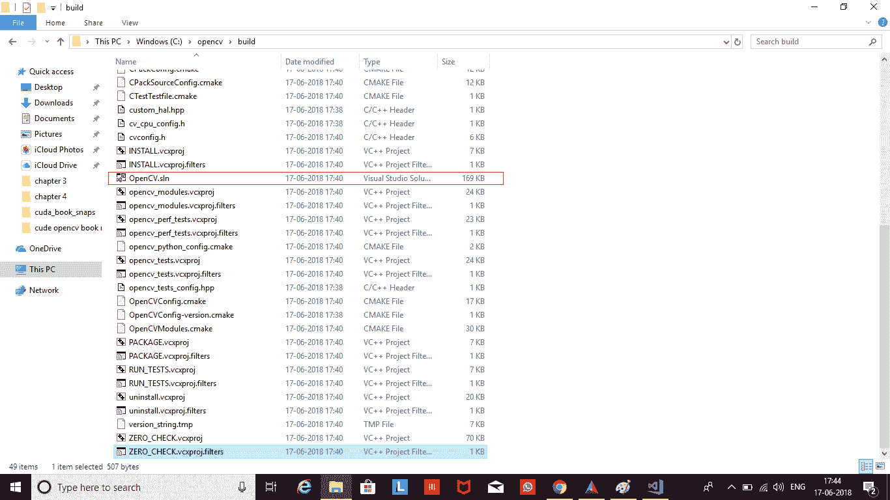

1.  这将在 Microsoft Visual Studio 中打开项目。在解决方案资源管理器中，找到名为`ALL_BUILD`的项目。右键单击它并构建。在 Visual Studio 中为调试和发布选项构建此项目。如下面的截图所示：

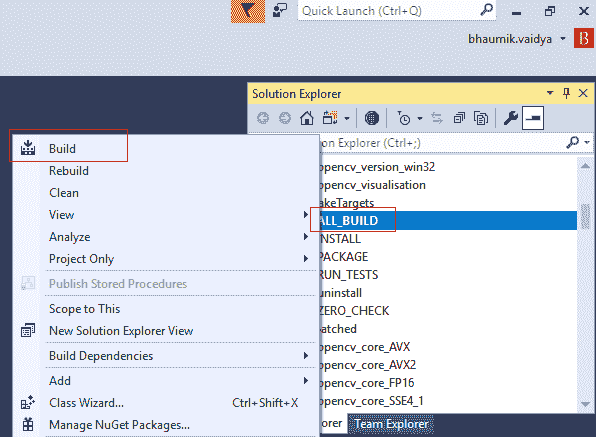

1.  构建整个项目可能需要很长时间，尽管这会根据您的处理器和 Visual Studio 版本而有所不同。在构建操作成功完成后，您就可以在 C/C++项目中使用 OpenCV 库了。

1.  通过右键单击我的电脑 | 高级系统设置 | 环境变量 | 新建来设置环境变量`OPENCV_DIR`。将其值设置为`C:\opencv\build\x64\vc14`。在这里，`vc14`将取决于您使用的 Microsoft Visual Studio 版本：

    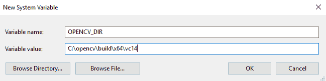

您可以通过访问`C://opencv/build/bin/Debug`目录并运行任何.exe 应用程序来检查安装情况。

# 在 Linux 上安装具有 CUDA 支持的 OpenCV

本节涵盖了在 Linux 操作系统上安装具有 CUDA 支持的 OpenCV 的步骤。这些步骤已在 Ubuntu 16.04 上测试，但它们应该适用于任何 Unix 发行版：

1.  具有 CUDA 的 OpenCV 将需要最新的 CUDA 安装。安装它的过程在第一章，*介绍 CUDA 和 CUDA 入门*中有所覆盖。所以在继续之前，请检查它是否已正确安装。您可以通过执行`nvidia-smi`命令来检查 CUDA 工具包和 Nvidia 设备驱动程序的安装情况。如果您的安装正常工作，您应该看到如下类似的输出：

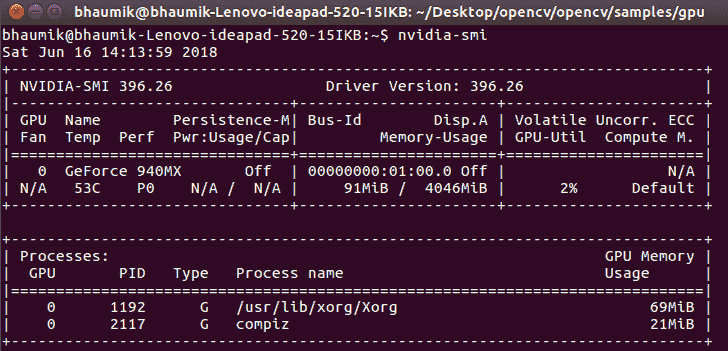

1.  通过访问链接下载 OpenCV 最新版本的源代码：[`github.com/opencv/opencv/`](https://github.com/opencv/opencv/)。将其解压到`opencv`文件夹中。

1.  有一些额外的模块不包括在 OpenCV 中，但它们在名为`opencv_contrib`的额外模块中可用，可以与 OpenCV 一起安装。此模块中提供的函数是不稳定的；一旦它们变得稳定，它们就会被移动到实际的 OpenCV 源中。如果您想安装此模块，可以从[`github.com/opencv/opencv_contrib`](https://github.com/opencv/opencv_contrib)下载它。将其提取到与`opencv`文件夹相同的目录中的`opencv_contrib`文件夹。

1.  打开`opencv`文件夹并创建一个构建目录。然后进入这个新创建的`build`目录。这些步骤可以通过在命令提示符中执行以下命令来完成：

```py
$ cd opencv
$ mkdir build
$ cd build 
```

1.  `cmake`命令用于编译具有 CUDA 支持的`opencv`。确保在此命令中将`WITH_CUDA`标志设置为 ON，并指定一个适当的路径，用于存储在`opencv_contrib`目录中下载并保存的额外模块。完整的`cmake`命令如下所示：

```py
cmake -D CMAKE_BUILD_TYPE=RELEASE CMAKE_INSTALL_PREFIX=/usr/local WITH_CUDA=ON  ENABLE_FAST_MATH=1 CUDA_FAST_MATH=1 -D WITH_CUBLAS=1 OPENCV_EXTRA_MODULES_PATH=../../opencv_contrib/modules BUILD_EXAMPLES=ON ..
```

它将开始配置和创建`makefile`。它将根据系统路径中的值定位所有额外模块。以下截图显示了具有所选 CUDA 安装的`cmake`命令的输出：

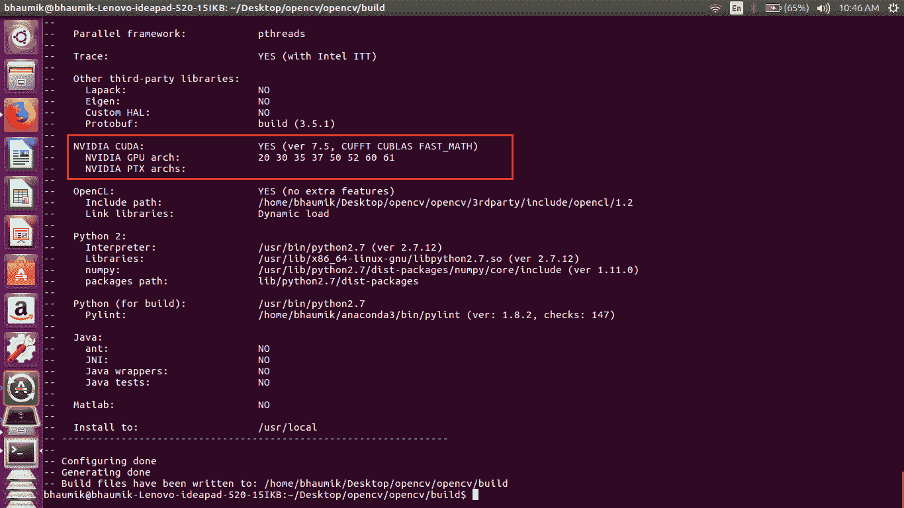

1.  在配置成功后，CMake 将在构建目录中创建一个 makefile。要使用此 makefile 编译 OpenCV，请在命令窗口中执行命令`make -j8`，如下所示：

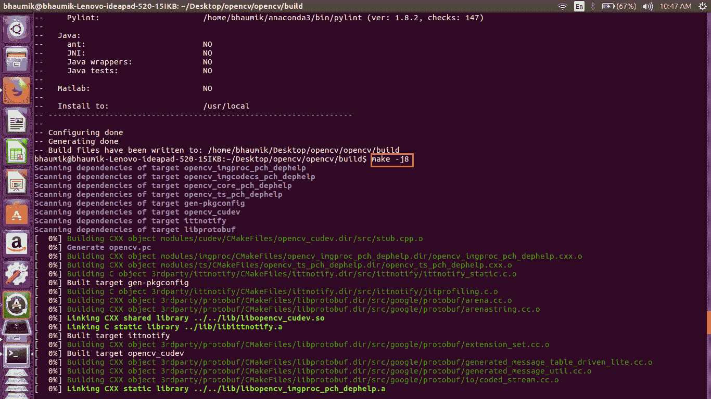

1.  编译成功后，要安装 OpenCV，您必须从命令行执行命令`sudo make install`。以下是该命令的输出：

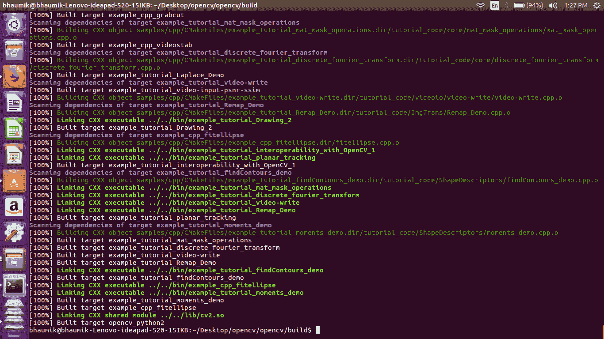

1.  运行`sudo ldconfig`命令以完成安装。它创建了必要的链接和缓存到`opencv`库。

1.  您可以通过运行`opencv/samples/gpu`文件夹中的任何示例来检查安装。

要在程序中使用 OpenCV，您必须包含`opencv2/opencv.hpp`头文件。此头文件将包含程序所需的全部其他头文件。因此，所有 OpenCV 程序都必须在顶部包含此头文件。

# 在 OpenCV 中处理图像

现在 OpenCV 已安装在系统上，我们可以开始使用它来处理图像。在本节中，我们将学习 OpenCV 中图像的表示方式，开发读取图像、显示图像和将图像保存到磁盘的程序。我们还将了解在 OpenCV 中创建合成图像的方法。我们还将使用 OpenCV 在图像上绘制不同的形状。此外，还将解释 OpenCV 的重要语法和功能。

# OpenCV 中的图像表示

如前所述，图像不过是二维数组，因此它们应该在计算机内部以数组的形式存储以供处理。OpenCV 提供了一个 `Mat` 类，它实际上是一个用于存储图像的图像容器。`Mat` 对象可以通过以下两行分别创建并分配给图像：

```py
Mat img;
img= imread("cameraman.tif");
```

在创建对象时，也可以定义图像的数据类型和二维数组的大小。图像的数据类型非常重要，因为它表示了指定单个像素值所使用的通道数和位数。灰度图像只有一个通道，而彩色图像是三个独立通道的组合：红色、绿色和蓝色。

单个像素使用的位数指定了离散灰度级别值的数量。一个 8 位图像可以具有介于 0 到 255 之间的灰度级别，而 16 位图像可以具有介于 0 到 65,535 之间的灰度级别。OpenCV 支持许多数据类型，默认为 `CV_8U`，表示单通道的 8 位无符号图像。它等同于 `CV_8UC1`。彩色图像可以指定为 `CV_8UC3`，表示具有三个通道的 8 位无符号图像。OpenCV 支持多达 512 个通道。五个或更多通道必须用圆括号定义，例如，`CV_8UC(5)` 表示具有五个通道的 8 位图像。OpenCV 还支持有符号数，因此数据类型也可以是 `CV_16SC3`，表示具有三个通道的 16 位有符号图像。

`Mat` 对象可以用来定义图像的大小。这也被称为图像的分辨率。它表示水平和垂直方向上的像素数量。通常，图像的分辨率是以宽度 `x` 高度来定义的。而在 `Mat` 对象中的数组大小应该以行 `x` 列数来定义。以下是一些使用 `Mat` 定义图像容器的示例：

```py
Mat img1(6,6,CV_8UC1); 
//This defines img1 object with size of 6x6, unsigned 8-bit integers and single channel.

Mat img2(256,256, CV_32FC1)
//This defines img2 object with size of 256x256, 32 bit floating point numbers and single channel.

Mat img3(1960,1024, CV_64FC3)
//This defines img3 object with size of 1960x1024, 64 bit floating point numbers and three channels.
```

图像的分辨率和大小将决定在磁盘上保存图像所需的空间。假设一个具有三个通道的彩色图像的大小为 1024 x 1024，那么它将占用 3 x 1024 x 1024 字节 = 3 MB 的磁盘空间。在下一节中，我们将看到如何使用这个 `Mat` 对象和 OpenCV 读取和显示图像。

# 读取和显示图像

在本节中，我们将尝试使用 C++ 和 OpenCV 开发读取和显示图像的代码。整个代码如下，然后逐行进行解释：

```py
#include <opencv2/opencv.hpp>
#include <iostream>

using namespace cv;
using namespace std;

int main(int argc, char** argv)
{
  // Read the image 
  Mat img = imread("images/cameraman.tif",0);

  // Check for failure in reading an Image
  if (img.empty()) 
  {
    cout << "Could not open an image" << endl;
    return -1;
  }
  //Name of the window
  String win_name = "My First Opencv Program"; 

  // Create a window
  namedWindow(win_name); 

  // Show our image inside the created window.
  imshow(win_name, img); 

  // Wait for any keystroke in the window 
  waitKey(0); 

  //destroy the created window
  destroyWindow(win_name); 

  return 0;
}
```

程序从包含标准输入输出和图像处理的头文件开始。

程序中使用来自 `std` 命名空间的功能，如 `cout` 和 `endl`，因此添加了 `std` 命名空间。所有 OpenCV 类和函数都是使用 `cv` 命名空间定义的。因此，为了使用 `cv` 命名空间中定义的函数，我们指定了 `using namespace cv` 这一行。如果省略该行，那么在 `cv` 命名空间中的每个函数都必须以下述方式使用：

```py
Mat img = cv::imread("cameraman.tif")
```

`main`函数包含读取和显示图像的代码。在 OpenCV 中使用`imread`命令读取图像。它返回一个`Mat`对象。`imread`命令有两个参数。第一个参数是图像的名称及其路径。路径可以有两种指定方式。您可以在 PC 上指定图像的完整路径，或者从您的代码文件中指定图像的相对路径。在上面的示例中，使用了相对路径，其中图像位于与代码文件相同的目录下的 images 文件夹中。

第二个参数是可选的，用于指定图像是要以灰度图像还是彩色图像读取。如果图像要以彩色图像读取，则指定`IMREAD_COLOR`或`1`。如果图像要以灰度图像读取，则指定`IMREAD_GRAYSCALE`或`0`。如果要以保存的格式读取图像，则将`IMREAD_UNCHANGED`或`-1`作为第二个参数。如果图像作为彩色图像读取，`imread`命令将返回三个通道，从**蓝色、绿色**和**红色**（**BGR**格式）开始。如果第二个参数未提供，则默认值为`IMREAD_COLOR`，它将图像作为彩色图像读取。

如果图像无法读取或磁盘上不可用，则`imread`命令将返回一个`Null Mat`对象。如果发生这种情况，无需继续执行进一步图像处理代码，我们可以在此时通过通知用户关于错误来退出。这由`if`循环内的代码处理。

应创建一个用于显示图像的窗口。OpenCV 提供了一个名为`namedWindow`的函数来实现这一功能。它需要两个参数。第一个参数是窗口的名称，它必须是一个字符串。第二个参数指定要创建的窗口的大小。它可以取两个值：`WINDOW_AUTOSIZE`或`WINDOW_NORMAL`。如果指定了`WINDOW_AUTOSIZE`，则用户将无法调整窗口大小，图像将以原始大小显示。如果指定了`WINDOW_NORMAL`，则用户可以调整窗口大小。此参数是可选的，如果未指定，其默认值为`WINDOW_AUTOSIZE`。

要在创建的窗口中显示图像，使用`imshow`命令。此命令需要两个参数。第一个参数是使用`namedWindow`命令创建的窗口名称，第二个参数是要显示的图像变量。此变量必须是一个`Mat`对象。要显示多个图像，必须创建具有唯一名称的单独窗口。窗口的名称将作为图像窗口的标题出现。

`imshow` 函数应该有足够的时间在创建的窗口中显示一张图片。这是通过使用 `waitKey` 函数来实现的。因此，在所有 OpenCV 程序中，`imshow` 函数后面都应该跟 `waitkey` 函数，否则图片将不会显示。`waitKey` 是一个键盘绑定函数，它接受一个参数，即以毫秒为单位的时间。它将在指定的时间内等待按键，然后移动到下一行代码。如果没有指定参数或指定为 0，它将无限期地等待按键。只有在键盘上按下任何键时，它才会移动到下一行。我们还可以检测是否按下了特定的键，并根据按下的键做出某些决定。我们将在本章后面使用这个功能。

在程序终止之前，需要关闭为显示窗口创建的所有窗口。这可以通过使用 `destroyAllWindows` 函数来完成。它将关闭程序中通过 `namedWindow` 函数创建的所有窗口。有一个名为 `destroyWindow` 的函数，可以关闭特定的窗口。应将窗口名称作为参数提供给 `destroyWindow` 函数。

对于程序的执行，只需将代码复制并粘贴到 Windows 上的 Visual Studio 中，或者如果你在 Ubuntu 上使用，可以创建一个 `cpp` 文件。构建方法与 Visual Studio 中的正常 `cpp` 应用程序类似，所以这里不再重复。要在 Ubuntu 上执行，请在保存 `cpp` 文件的文件夹中从命令提示符执行以下命令：

```py
For compilation:
$ g++ -std = c++11 image_read.cpp 'pkg_config --libs --cflags opencv' -o image_read 
For execution:
$./image_read
```

前面程序的输出如下：

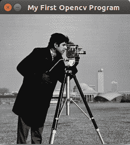

# 读取和显示彩色图像

在前面的程序中，`imread` 的第二个参数被指定为 `0`，这意味着它将以灰度图像的形式读取图像。假设你想读取任何彩色图像。为此，你可以按以下方式更改 `imread` 命令：

```py
Mat img = imread("images/autumn.tif",1);
```

第二个参数被指定为 `1`，这意味着它将以 BGR 格式读取图像。重要的是要注意，OpenCV 的 `imread` 和 `imshow` 使用 BGR 格式来处理彩色图像，这与 MATLAB 和其他图像处理工具使用的 RGB 格式不同。更改 `imread` 后的输出如下：

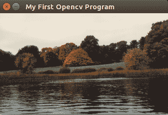

即使是彩色图像，也可以通过将第二个参数指定为 `0` 来将其读取为灰度图像。这将隐式地将图像转换为灰度并读取。图像将看起来如下：

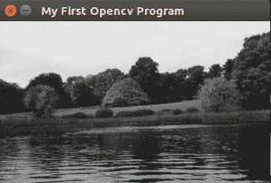

记住如何使用 `imread` 函数读取图像非常重要，因为它将影响你程序中的其他图像处理代码。

总结来说，在本节中，我们看到了如何使用 OpenCV 读取图像并显示它。在这个过程中，我们还了解了一些 OpenCV 中可用的重要函数。在下一节中，我们将看到如何使用 OpenCV 创建合成图像。

# 使用 OpenCV 创建图像

有时，我们可能需要创建自己的图像或在现有图像上绘制一些形状。或者，我们可能想在检测到的对象周围绘制边界框或在图像上显示标签。因此，在本节中，我们将看到如何创建空白灰度和彩色图像。我们还将看到在图像上绘制线条、矩形、椭圆、圆和文本的函数。

要创建一个大小为 256 x 256 的空黑色图像，可以使用以下代码：

```py
#include <opencv2/opencv.hpp>
#include <iostream>

using namespace cv;
using namespace std;

int main(int argc, char** argv)
{
  //Create blank black grayscale Image with size 256x256
  Mat img(256, 256, CV_8UC1, Scalar(0)); 
  String win_name = "Blank Image"; 
  namedWindow(win_name); 
  imshow(win_name, img); 
  waitKey(0); 
  destroyWindow(win_name); 
  return 0;
}
```

代码与用于读取图像的代码大致相似，但在这里不是使用 `imread` 命令，而是仅使用 `Mat` 类的构造函数来创建图像。如前所述，我们可以在创建 `Mat` 对象时提供大小和数据类型。因此，在创建 `img` 对象时，我们提供了四个参数。前两个参数指定了图像的大小，第一个参数定义了行数（高度），第二个参数定义了列数（宽度）。第三个参数定义了图像的数据类型。我们使用了 `CV_8UC1`，这意味着一个单通道的 8 位无符号整数图像。最后一个参数指定了数组中所有像素的初始化值。

这里我们使用了 0，这是黑色的值。当程序执行时，它将创建一个大小为 256 x 256 的黑色图像，如下所示：


可以使用类似的代码创建任何颜色的空白图像，如下所示：

```py
#include <opencv2/opencv.hpp>
#include <iostream>

using namespace cv;
using namespace std;

int main(int argc, char** argv)
{
  //Create blank blue color Image with size 256x256
  Mat img(256, 256, CV_8UC3, Scalar(255,0,0)); 
  String win_name = "Blank Blue Color Image"; 
  namedWindow(win_name); 
  imshow(win_name, img); 
  waitKey(0); 
  destroyWindow(win_name); 
  return 0;
}

```

在创建 `Mat` 对象时，不是使用 `CV_8UC1` 数据类型，而是使用 `CV_8UC3`，它指定了一个具有三个通道的 8 位图像。因此，单个像素有 24 位。第四个参数指定了起始像素值。它使用标量关键字和一个包含所有三个通道起始值的元组来指定。在这里，蓝色通道初始化为 255，绿色通道初始化为 0，红色通道初始化为 0。这将创建一个大小为 256 x 256 的蓝色图像。元组中值的组合将创建不同的颜色。前述程序的输出如下：

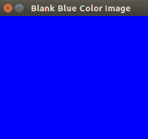

# 在空白图像上绘制形状

要开始在图像上绘制不同的形状，我们将首先使用以下命令创建一个任意大小的空白黑色图像：

```py
Mat img(512, 512, CV_8UC3, Scalar(0,0,0)); 
```

此命令将创建一个大小为 512 x 512 的黑色图像。现在，我们将开始在这个图像上绘制不同的形状。

# 绘制线条

一条线可以通过两个点来指定：起点和终点。要在图像上绘制线条，必须指定这两个点。在图像上绘制线条的函数如下：

```py
line(img,Point(0,0),Point(511,511),Scalar(0,255,0),7);
```

线函数有五个参数。第一个参数指定需要绘制线的图像，第二个和第三个参数分别定义起点和终点。这些点使用 `Point` 类构造函数定义，该构造函数以图像的 *x* 和 *y* 坐标为参数。第四个参数指定线的颜色。它指定为 B、G 和 R 值的元组。这里，取值为 `(0,255,0)`，指定绿色。第五个参数是线的厚度。其值被设置为 7 像素宽。此函数还有一个可选的 `linetype` 参数。前面的函数将绘制一个从 `(0,0)` 到 `(511,511)` 的对角线绿色线，宽度为 7 像素。

# 绘制矩形

矩形可以使用两个极端对角点来指定。OpenCV 提供了一个在图像上绘制矩形的函数，其语法如下：

```py
rectangle(img,Point(384,0),Point(510,128),Scalar(255,255,0),5);
```

矩形函数有五个参数。第一个参数是需要绘制矩形的图像。第二个参数是矩形的左上角点。第三个参数是矩形的右下角点。第四个参数指定边框的颜色。它指定为 `(255,255,0)`，是蓝色和绿色的混合，产生青色。第五个参数是边框的厚度。如果第五个参数被指定为 `-1`，则形状将被填充。因此，前面的函数将使用两个极端点 `(384,0)` 和 `(510,128)`，以青色绘制一个边框厚度为 5 像素的矩形。

# 绘制圆

圆可以通过中心和半径来指定。OpenCV 提供了一个在图像上绘制圆的函数，其语法如下：

```py
circle(img,Point(447,63), 63, Scalar(0,0,255), -1);
```

圆函数有五个参数。第一个参数是需要绘制圆的图像。第二个参数指定该圆的中心点，第三个参数指定半径。第四个参数指定圆的颜色。取值为 `(0,0,255)`，表示红色。第五个参数是边框的厚度。这里，它被设置为 `-1`，意味着圆将被红色填充。

# 绘制椭圆

OpenCV 提供了一个在图像上绘制椭圆的函数，其语法如下：

```py
ellipse(img,Point(256,256),Point(100,100),0,0,180,255,-1);
```

椭圆函数有许多参数。第一个参数指定需要绘制椭圆的图像。第二个参数指定椭圆的中心。第三个参数指定椭圆将要绘制的框的大小。第四个参数指定椭圆需要旋转的角度。它被设置为 `0` 度。第五个和第六个参数指定椭圆需要绘制的角度范围。它被设置为 `0` 到 `180` 度。因此，只会绘制椭圆的一半。下一个参数指定椭圆的颜色，它被指定为 `255.` 它与 `(255,0,0)` 相同，表示蓝色。最后一个参数指定边框的粗细。它被设置为 `-1`，因此椭圆将被蓝色填充。

# 在图像上写文本

OpenCV 提供了一个在图像上写文本的函数，即 `putText`。该函数的语法如下：

```py
putText( img, "OpenCV!", Point(10,500), FONT_HERSHEY_SIMPLEX, 3,Scalar(255, 255, 255), 5, 8 );
```

`putText` 函数有许多参数。第一个参数是要在图像上写文本的图像。第二个参数是作为字符串数据类型的文本，我们想要在图像上写的内容。第三个参数指定文本的左下角。第四个参数指定字体类型。OpenCV 中有许多可用的字体类型，你可以查看 OpenCV 文档。第五个参数指定字体的缩放比例。第六个参数是文本的颜色。它被设置为 `(255,255,255)`，表示白色。第七个参数是文本的粗细，它被设置为 `5`，最后一个参数指定线型，它被设置为 `8`。

我们已经看到了在空黑图像上绘制形状的单独函数。以下代码显示了之前讨论的所有函数的组合：

```py
#include <opencv2/opencv.hpp>
#include <iostream>

using namespace cv;
using namespace std;

int main(int argc, char** argv)
{

  Mat img(512, 512, CV_8UC3, Scalar(0,0,0)); 
  line(img,Point(0,0),Point(511,511),Scalar(0,255,0),7);
  rectangle(img,Point(384,0),Point(510,128),Scalar(255,255,0),5);
  circle(img,Point(447,63), 63, Scalar(0,0,255), -1);
  ellipse(img,Point(256,256),Point(100,100),0,0,180,255,-1);
  putText( img, "OpenCV!", Point(10,500), FONT_HERSHEY_SIMPLEX, 3,Scalar(255, 255,  255), 5, 8 );
  String win_name = "Shapes on blank Image"; 
  namedWindow(win_name); 
  imshow(win_name, img); 
  waitKey(0); 
  destroyWindow(win_name); 
  return 0;
}
```

上一段代码的输出图像如下：

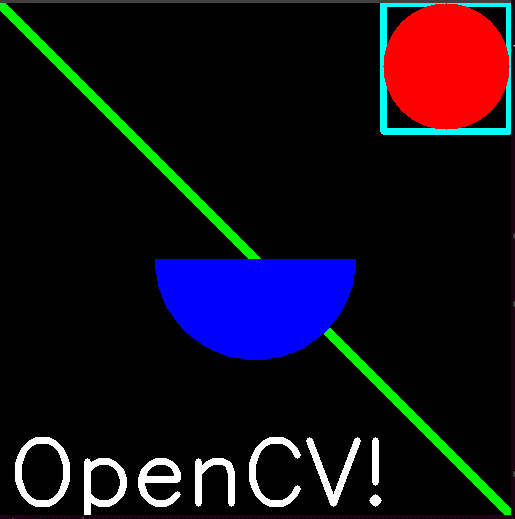

# 将图像保存到文件

图像也可以从 OpenCV 程序保存到磁盘。当我们想要将处理后的图像存储到计算机上的磁盘时，这很有用。OpenCV 提供了 `imwrite` 函数来完成此操作。此函数的语法如下：

```py
bool flag = imwrite("images/save_image.jpg", img);
```

`imwrite` 函数接受两个参数。第一个参数是你想要保存的文件名及其路径。第二个参数是你想要保存的 `img` 变量。此函数返回一个布尔值，表示文件是否成功保存到磁盘上。

在本节中，我们使用 OpenCV 处理了图像。在下一节中，我们将使用 OpenCV 处理视频，视频不过是图像的序列。

# 在 OpenCV 中处理视频

本节将展示使用 OpenCV 从文件和摄像头读取视频的过程。它还将描述将视频保存到文件的过程。这也可以与连接到计算机的 USB 摄像头一起工作。视频不过是图像的序列。尽管 OpenCV 不是针对视频处理应用程序优化的，但它在这方面做得相当不错。OpenCV 无法捕获音频，因此我们必须使用其他一些与 OpenCV 一起使用的工具来捕获音频和视频。

# 在计算机上处理视频

本节描述了读取存储在计算机上的视频文件的过程。在所有使用 OpenCV 的视频处理应用程序中，视频的所有帧将逐个读取、处理并在屏幕上显示。

以下代码用于读取和显示视频——随后将逐行解释：

```py
#include <opencv2/opencv.hpp>
#include <iostream>
using namespace cv;
using namespace std;
int main(int argc, char* argv[])
{
  //open the video file from PC
  VideoCapture cap("images/rhinos.avi"); 
  // if not success, exit program
  if (cap.isOpened() == false) 
  {
    cout << "Cannot open the video file" << endl;
    return -1;
  }
  cout<<"Press Q to Quit" << endl;
  String win_name = "First Video";
  namedWindow(win_name); 
  while (true)
  {
    Mat frame;
    // read a frame
    bool flag = cap.read(frame); 

    //Breaking the while loop at the end of the video
    if (flag == false) 
    {
      break;
    }
    //display the frame 
    imshow(win_name, frame);
    //Wait for 100 ms and key 'q' for exit
    if (waitKey(100) == 'q')
    {
      break;
    }
  }
  destroyWindow(win_name);
  return 0;
}
```

在包含库之后，在主函数中处理视频的第一件事是创建一个`VideoCapture`对象。`VideoCapture`类提供了许多构造函数，可用于处理视频。当我们想要处理存储在计算机上的视频文件时，我们需要在创建`VideoCapture`对象时将视频的名称及其路径作为参数传递给构造函数。

此对象提供了许多方法和属性，可以提供与视频相关的信息。我们将根据需要查看它们。它提供了`isopened`属性，该属性指示对象创建是否成功以及视频是否可用。它返回一个布尔值。如果`cap.isopened`为`false`，则视频不可用，因此无需在程序中进一步操作。这通过一个`if`循环处理，当视频不可用时，会通知用户并退出程序。

`VideoCapture`类提供了一个读取方法，可以逐个捕获帧。为了处理整个视频，我们必须启动一个连续的循环，该循环一直运行到视频的末尾。无限`while`循环可以完成这项工作。在`while`循环内部，使用读取方法读取第一帧。此方法有一个参数。它是一个 Mat 对象，我们希望在其中存储帧。它返回一个布尔值，指示帧是否已成功读取。当循环到达视频的末尾时，此布尔值将返回`false`，表示没有可用的帧。这个标志在循环中持续检查视频的结束；如果检测到，我们将使用`break`语句退出`while`循环。

帧是单个图像，因此显示该帧的过程与之前看到的是相同的。在上面的代码中，`waitKey`函数在`if`语句中使用。它会在每个帧之后等待 100 毫秒以获取按键。`if`语句正在检查按键是否为`q`。如果是`q`，则表示用户想要退出视频，因此在`if`中包含了 break 语句。

此代码将在整个视频播放完毕或用户在键盘上按下`q`键时终止视频显示。在整个本书中，我们将使用这种编码实践来处理视频。前一个程序的输出如下。截图是视频的一帧：


我们在每帧之间使用了 100 毫秒的延迟。当你将这个值减少到，比如，10 毫秒时，你认为会发生什么？答案是，每帧将显示得更快。这并不意味着视频的帧率改变了。这只是意味着帧之间的延迟减少了。如果你想看到视频的实际帧率，可以使用`cap`对象的`CAP_PROP_FPS`属性。它可以使用以下代码显示：

```py
double frames_per_second = cap.get(CAP_PROP_FPS); 
cout << "Frames per seconds of the video is : " << frames_per_second ;
```

`cap`对象还具有其他属性，例如`CAP_PROP_FRAME_WIDTH`和`CAP_PROP_FRAME_HEIGHT`，它们表示帧的宽度和高度。这些属性也可以通过`get`方法获取。这些属性可以通过使用 cap 对象的`set`方法来设置。`set`方法有两个参数。第一个参数是属性的`name`，第二个参数是我们想要设置的`value`。

本节描述了从文件中读取视频的方法。下一节将展示从网络摄像头或 USB 摄像头处理视频的过程。

# 处理网络摄像头视频

本节描述了从连接到计算机的网络摄像头或 USB 摄像头捕获视频的过程。OpenCV 的好处是，相同的代码将适用于笔记本电脑和任何可以运行 C/C++的嵌入式系统。这有助于在任意硬件平台上部署计算机视觉应用。捕获视频并显示的代码如下：

```py
#include <opencv2/opencv.hpp>
#include <iostream>

using namespace cv;
using namespace std;

int main(int argc, char* argv[])
{
  //open the Webcam
  VideoCapture cap(0); 
  // if not success, exit program
  if (cap.isOpened() == false) 
  {
    cout << "Cannot open Webcam" << endl;
    return -1;
  }
  //get the frames rate of the video from webcam
  double frames_per_second = cap.get(CAP_PROP_FPS); 
  cout << "Frames per seconds : " << frames_per_second << endl;
  cout<<"Press Q to Quit" <<endl;
  String win_name = "Webcam Video";
  namedWindow(win_name); //create a window
  while (true)
  {
    Mat frame;
    bool flag = cap.read(frame); // read a new frame from video 
    //show the frame in the created window
    imshow(win_name, frame);
    if (waitKey(1) == 'q')
    {
      break;
    }
  }
  return 0;
}
```

在从网络摄像头或 USB 摄像头捕获视频时，需要将那个摄像头的设备 ID 作为`VideoCapture`对象构造函数的参数提供。连接的主摄像头将具有设备 ID 零。笔记本电脑的网络摄像头或 USB 摄像头（当没有网络摄像头时）将具有设备 ID 零。如果有多个摄像头连接到设备，它们的设备 ID 将是`(0,1)`，依此类推。在前面的代码中，零表示代码将使用主摄像头来捕获视频。

另一段代码与从文件读取视频的代码大致相似。在这里，视频的帧率也被获取并显示。帧将以每 1 毫秒的间隔逐个读取，并在创建的窗口中显示。您必须按`q`键来终止操作。使用网络摄像头捕获的视频输出如下：

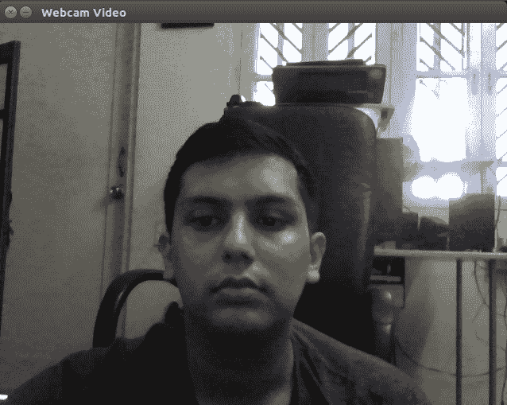

# 将视频保存到磁盘

要从 OpenCV 程序保存视频，我们需要创建`VideoWriter`类的对象。将视频保存到文件的代码如下：

```py
Size frame_size(640, 640);
int frames_per_second = 30;

VideoWriter v_writer("images/video.avi", VideoWriter::fourcc('M', 'J', 'P', 'G'), frames_per_second, frame_size, true); 

//Inside while loop
v_writer.write(frame); 

//After finishing video write
v_writer.release();

```

在创建`VideoWriter`类的对象时，构造函数接受五个参数。第一个参数是你想要保存的视频文件名及其绝对或相对路径。第二个参数是用于视频编解码器的四个字符代码。它是通过`VideoWriter::fourcc`函数创建的。在这里，我们使用运动 JPEG 编解码器，因此它的四个字符代码是`'M'`、`'J'`、`'P'`和`'G'`。根据你的需求和操作系统，可以使用其他编解码器。第三个参数是每秒帧数。它可以指定为一个之前定义的整数变量或直接在函数中的整数值。在前面的代码中，使用了每秒`30`帧。第四个参数是帧的大小。它使用`size`关键字和两个参数`frame_width`和`frame_height`定义。在前面的代码中，它被定义为 640 x 640。第五个参数指定要存储的帧是彩色还是灰度。如果是真的，帧将以彩色帧保存。

要开始使用`VideoWriter`对象写入帧，OpenCV 提供了一个`write`方法。此方法用于逐个将帧写入视频，因此它包含在一个无限`while`循环中。此方法仅接受一个参数，即帧变量的名称。帧的大小应与创建`VideoWriter`对象时指定的相同。在写入完成后，重要的是刷新并关闭创建的视频文件。这可以通过使用`release`方法释放创建的`VideoWriter`对象来完成。

总结来说，在本节中，我们探讨了从设备上的文件或摄像头读取视频的过程。我们还看到了将视频写入文件的代码。从下一节开始，我们将看到如何使用 CUDA 加速的 OpenCV 在图像或视频上操作。

# 使用 OpenCV CUDA 模块的基本计算机视觉应用

在前面的章节中，我们了解到 CUDA 提供了一个优秀的接口，可以充分利用 GPU 的并行计算能力来加速复杂的计算应用。在本节中，我们将看到如何利用 CUDA 的能力与 OpenCV 一起用于计算机视觉应用。

# OpenCV CUDA 模块简介

OpenCV 有一个 CUDA 模块，它包含数百个可以利用 GPU 能力的函数。它仅支持 Nvidia GPU，因为它在后台使用 Nvidia CUDA 运行时。为了使用 CUDA 模块，OpenCV 必须编译时设置`WITH_CUDA`标志为 ON。

使用 OpenCV CUDA 模块的亮点之一是它提供了一个与常规 OpenCV API 相似的 API。它也不需要详细了解 CUDA 编程，尽管了解 CUDA 和 GPU 架构不会有害。研究人员已经表明，使用具有 CUDA 加速的函数可以比类似的 CPU 函数提供 5x-100x 的速度提升。

在下一节中，我们将看到如何使用 CUDA 模块与 OpenCV 结合，在各种计算机视觉和图像处理应用中使用，这些应用在图像的各个像素上操作。

# 图像上的算术和逻辑运算

在本节中，我们将看到如何在图像上执行各种算术和逻辑运算。我们将使用 OpenCV CUDA 模块中定义的函数来执行这些操作。

# 两个图像的相加

当两个图像大小相同时，可以执行两个图像的相加。OpenCV 在`cv::cuda`命名空间内提供了一个`add`函数用于加法操作。它执行两个图像的逐像素相加。假设在两个图像中，`(0,0)`处的像素强度值分别为 100 和 150。结果图像中的强度值将是 250，这是两个强度值的相加。OpenCV 的加法是一个饱和操作，这意味着如果加法的结果超过 255，它将被饱和到 255。执行加法的代码如下：

```py
#include <iostream>
#include "opencv2/opencv.hpp"

int main (int argc, char* argv[])
{
  //Read Two Images 
  cv::Mat h_img1 = cv::imread("images/cameraman.tif");
  cv::Mat h_img2 = cv::imread("images/circles.png");
  //Create Memory for storing Images on device
  cv::cuda::GpuMat d_result1,d_img1, d_img2;
  cv::Mat h_result1;
  //Upload Images to device     
  d_img1.upload(h_img1);
  d_img2.upload(h_img2);

  cv::cuda::add(d_img1,d_img2, d_result1);
  //Download Result back to host
  d_result1.download(h_result1);
  cv::imshow("Image1 ", h_img1);
  cv::imshow("Image2 ", h_img2);
  cv::imshow("Result addition ", h_result1);
  cv::imwrite("images/result_add.png", h_result1);
  cv::waitKey();
  return 0;
}
```

当任何计算机视觉操作需要在 GPU 上执行时，图像必须存储在设备内存中。为此内存的分配可以使用`gpumat`关键字，它与用于主机内存的 Mat 类型相似。图像的读取方式与之前相同。读取两个图像用于相加，并存储在主机内存中。这些图像使用设备`memory`变量的`upload`方法复制到设备内存。主机图像变量作为参数传递给此方法。

GPU CUDA 模块中的函数定义在`cv::cuda`命名空间中。它需要设备内存中的图像作为其参数。CUDA 模块中的 add 函数用于图像相加。它需要三个参数。前两个参数是要相加的两个图像，最后一个参数是结果将存储的目标。所有三个变量都应该使用`gpumat`定义。

使用设备变量的`download`方法将结果图像复制回主机。将结果复制的`img`主机变量作为参数传递给`download`方法。然后使用上一节中解释的相同函数显示和存储此图像。程序的输出如下：

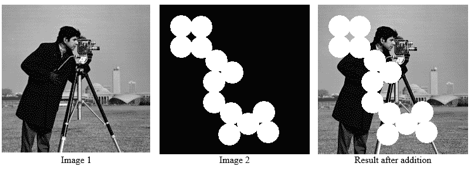

# 从两个图像中减去

使用 OpenCV 和 CUDA 可以在图像上执行其他算术运算。OpenCV 提供了`subtract`函数来减去两个图像。它也是一个饱和操作，这意味着当减法的结果低于零时，它将被饱和到零。`subtract`命令的语法如下：

```py
//d_result1 = d_img1 - d_img2
cv::cuda::subtract(d_img1, d_img2,d_result1);
```

再次，两个要减去的图像作为前两个参数提供，结果图像作为第三个参数提供。两个图像之间的减法结果如下：

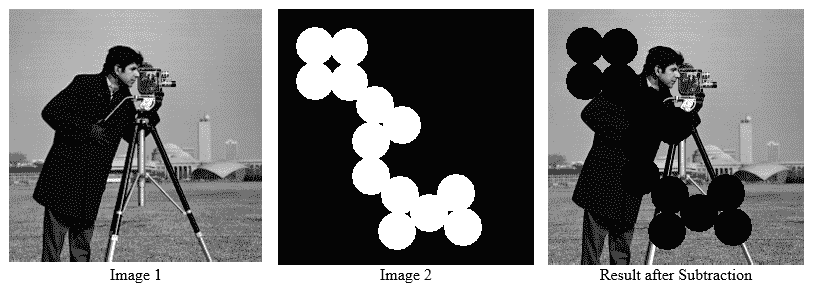

# 图像混合

有时需要以不同的比例混合两个图像，而不是直接将两个图像相加。图像混合可以用以下方程式表示：

```py
result = α * img1 + β * img2 + γ 
```

这可以通过 OpenCV 中的`addWeighted`函数轻松实现。该函数的语法如下：

```py
cv::cuda::addWeighted(d_img1,0.7,d_img2,0.3,0,d_result1)
```

该函数有六个参数。第一个参数是第一个源图像，第二个参数是第一个图像的混合权重，第三个参数是第二个源图像，第四个参数是第二个图像的混合权重，第五个参数是在混合时需要添加的常数伽玛，最后一个参数指定结果需要存储的目标位置。该函数将`img1`的 70%和`img2`的 30%用于混合。该函数的输出如下：

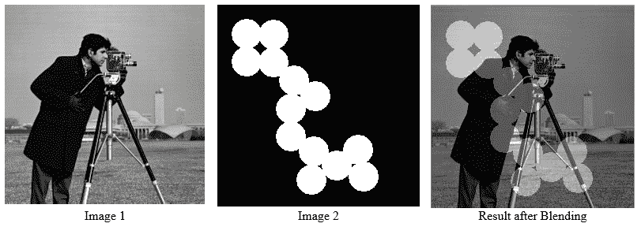

# 图像反转

除了算术运算外，OpenCV 还提供了对单个位进行操作的布尔运算。它包括 AND、OR、NOT 等。AND 和 OR 在掩码操作中非常有用，我们将在后面看到。NOT 操作用于反转图像，其中黑色转换为白色，白色转换为黑色。它可以表示为以下方程式：

```py
result_image = 255 - input_image
```

在方程式中，`255`表示 8 位图像的最大强度值。进行图像反转的程序如下：

```py
#include <iostream>
#include "opencv2/opencv.hpp"

int main (int argc, char* argv[])
{
  cv::Mat h_img1 = cv::imread("images/circles.png");
  //Create Device variables
  cv::cuda::GpuMat d_result1,d_img1;
  cv::Mat h_result1;     
  //Upload Image to device
  d_img1.upload(h_img1);

  cv::cuda::bitwise_not(d_img1,d_result1);

  //Download result back  to host
  d_result1.download(h_result1);
  cv::imshow("Result inversion ", h_result1);
  cv::imwrite("images/result_inversion.png", h_result1);
  cv::waitKey();
  return 0;
}
```

该程序与算术运算程序类似。使用`bitwise_not`函数进行图像反转。图像应该是灰度图像。它接受两个参数。第一个参数指示要反转的源图像，第二个参数指示反转图像要存储的目标位置。`bitwise_not`操作的输出如下：

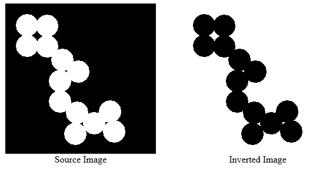

如所示，通过反转，白色转换为黑色，黑色转换为白色。

总结来说，在本节中，我们看到了使用 OpenCV 和 CUDA 的各种算术和逻辑操作。在下一节中，我们将看到一些在计算机视觉应用中广泛使用的计算机视觉操作。

# 改变图像的色彩空间

如前所述，OpenCV 可以以灰度图像或彩色图像的形式读取图像，彩色图像具有三个通道：绿色、蓝色和红色，这种格式称为 BGR 格式。其他图像处理软件和算法在 RGB 图像上工作，其中红色通道后面是绿色和蓝色。还有许多其他颜色格式可以用于特定应用。这些包括 HSV 颜色空间，其中三个通道是色调、饱和度和亮度。色调代表颜色值，饱和度表示颜色的灰度级别，亮度代表颜色的亮度。另一个颜色空间是 YCrCb，它也非常有用。这个系统用图像中的一个亮度分量：亮度(Y)，和两个色度分量：色度(Cb 和 Cr)来表示颜色。

OpenCV 支持许多其他颜色空间，例如 XYZ、HLS、Lab 等。OpenCV 支持超过 150 种颜色转换方法。使用 OpenCV 中的`cvtColor`函数可以将一种颜色空间转换为另一种颜色空间。以下是一个使用此函数在不同颜色空间之间转换的示例：

```py
#include <iostream>
#include "opencv2/opencv.hpp"

int main (int argc, char* argv[])
{
  cv::Mat h_img1 = cv::imread("images/autumn.tif");
  //Define device variables
  cv::cuda::GpuMat d_result1,d_result2,d_result3,d_result4,d_img1;
  //Upload Image to device
  d_img1.upload(h_img1);

  //Convert image to different color spaces
  cv::cuda::cvtColor(d_img1, d_result1,cv::COLOR_BGR2GRAY);
  cv::cuda::cvtColor(d_img1, d_result2,cv::COLOR_BGR2RGB);
  cv::cuda::cvtColor(d_img1, d_result3,cv::COLOR_BGR2HSV);
  cv::cuda::cvtColor(d_img1, d_result4,cv::COLOR_BGR2YCrCb);

  cv::Mat h_result1,h_result2,h_result3,h_result4;
  //Download results back to host
  d_result1.download(h_result1);
  d_result2.download(h_result2);
  d_result3.download(h_result3);
  d_result4.download(h_result4);

  cv::imshow("Result in Gray ", h_result1);
  cv::imshow("Result in RGB", h_result2);
  cv::imshow("Result in HSV ", h_result3);
  cv::imshow("Result in YCrCb ", h_result4);

  cv::waitKey();
  return 0;
}
```

`imshow`函数期望以 BGR 颜色格式传递彩色图像，因此使用`imshow`显示其他颜色格式的输出可能不会很吸引人。以下是在不同颜色格式下使用相同图像的前一个程序的输出：

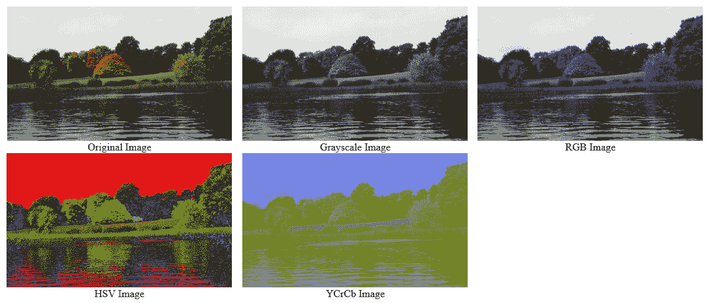

# 图像阈值化

图像阈值化是一种非常简单的图像分割技术，用于根据某些强度值从灰度图像中提取重要区域。在这种技术中，如果像素值大于某个阈值值，则分配一个值，否则分配另一个值。

OpenCV 和 CUDA 中用于图像阈值化的函数是`cv::cuda::threshold`。此函数有许多参数。第一个参数是源图像，它应该是一个灰度图像。第二个参数是结果要存储的目标。第三个参数是阈值值，它用于分割像素值。第四个参数是`maxVal`常量，它表示如果像素值超过阈值值时赋予的值。OpenCV 提供不同类型的阈值化技术，由函数的最后一个参数决定。以下是一些阈值化类型：

+   `cv:.THRESH_BINARY`：如果像素的强度大于阈值，则将该像素强度设置为`maxVal`常量。否则将该像素强度设置为零。

+   `cv::THRESH_BINARY_INV`：如果像素的强度大于阈值，则将该像素强度设置为零。否则将该像素强度设置为`maxVal`常量。

+   `cv::THRESH_TRUNC`：这基本上是一个截断操作。如果像素的强度大于阈值，则将该像素强度设置为阈值。否则，保持强度值不变。

+   `cv::THRESH_TOZERO`：如果像素的强度大于阈值，则保持像素强度不变。否则将该像素强度设置为零。

+   `cv::THRESH_TOZERO_INV`：如果像素的强度大于阈值，则将该像素强度设置为零。否则保持像素强度不变。

实现所有这些阈值技术使用 OpenCV 和 CUDA 的程序如下：

```py
#include <iostream>
#include "opencv2/opencv.hpp"

int main (int argc, char* argv[])
{
  cv::Mat h_img1 = cv::imread("images/cameraman.tif", 0);
  //Define device variables
  cv::cuda::GpuMat d_result1,d_result2,d_result3,d_result4,d_result5, d_img1;
  //Upload image on device
  d_img1.upload(h_img1);

  //Perform different thresholding techniques on device
  cv::cuda::threshold(d_img1, d_result1, 128.0, 255.0, cv::THRESH_BINARY);
  cv::cuda::threshold(d_img1, d_result2, 128.0, 255.0, cv::THRESH_BINARY_INV);
  cv::cuda::threshold(d_img1, d_result3, 128.0, 255.0, cv::THRESH_TRUNC);
  cv::cuda::threshold(d_img1, d_result4, 128.0, 255.0, cv::THRESH_TOZERO);
  cv::cuda::threshold(d_img1, d_result5, 128.0, 255.0, cv::THRESH_TOZERO_INV);

  cv::Mat h_result1,h_result2,h_result3,h_result4,h_result5;
  //Copy results back to host
  d_result1.download(h_result1);
  d_result2.download(h_result2);
  d_result3.download(h_result3);
  d_result4.download(h_result4);
  d_result5.download(h_result5);
  cv::imshow("Result Threshhold binary ", h_result1);
  cv::imshow("Result Threshhold binary inverse ", h_result2);
  cv::imshow("Result Threshhold truncated ", h_result3);
  cv::imshow("Result Threshhold truncated to zero ", h_result4);
  cv::imshow("Result Threshhold truncated to zero inverse ", h_result5);
  cv::waitKey();

  return 0;
}
```

在所有阈值技术的`cv::cuda::threshold`函数中，128 被用作像素强度的阈值，这是黑色（0）和白色（255）之间的中点。`maxVal`常量被设置为 255，当像素强度超过阈值时将用于更新像素强度。其他程序与之前看到的其他 OpenCV 程序类似。

程序的输出如下，显示了输入图像以及所有五种阈值技术的输出：

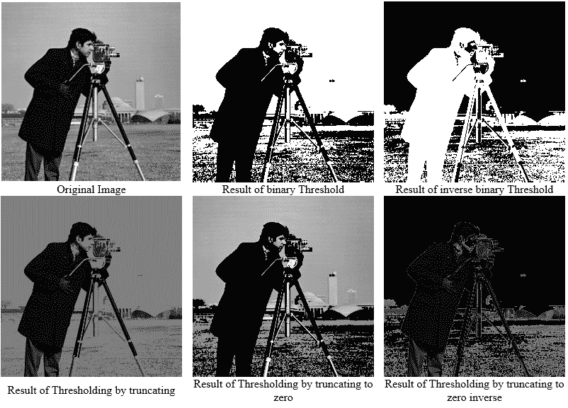

# 带有和没有 CUDA 支持的 OpenCV 应用程序的性能比较

可以通过处理单个图像所需的时间来衡量图像处理算法的性能。当算法在视频上工作时，性能是通过每秒帧数来衡量的，这表示它在一秒内可以处理的帧数。当算法每秒可以处理超过 30 帧时，它可以被认为是实时工作的。我们还可以衡量在 OpenCV 中实现的算法的性能，这将在本节中讨论。

如我们之前讨论的，当 OpenCV 与 CUDA 兼容性构建时，它可以显著提高算法的性能。OpenCV 在 CUDA 模块中的函数被优化以利用 GPU 并行处理能力。OpenCV 还提供了仅在 CPU 上运行的类似函数。在本节中，我们将比较上一节中构建的带有和不使用 GPU 的阈值操作的性能。我们将从处理一张图像所需的时间和每秒帧数来比较阈值操作的性能。以下是在 CPU 上实现阈值并测量性能的代码：

```py
#include <iostream>
#include "opencv2/opencv.hpp"
using namespace cv;
using namespace std;

int main (int argc, char* argv[])
{
  cv::Mat src = cv::imread("images/cameraman.tif", 0);
  cv::Mat result_host1,result_host2,result_host3,result_host4,result_host5;

  //Get initial time in miliseconds
  int64 work_begin = getTickCount(); 
  cv::threshold(src, result_host1, 128.0, 255.0, cv::THRESH_BINARY);
  cv::threshold(src, result_host2, 128.0, 255.0,   cv::THRESH_BINARY_INV);
  cv::threshold(src, result_host3, 128.0, 255.0, cv::THRESH_TRUNC);
  cv::threshold(src, result_host4, 128.0, 255.0, cv::THRESH_TOZERO);
  cv::threshold(src, result_host5, 128.0, 255.0, cv::THRESH_TOZERO_INV);

  //Get time after work has finished     
  int64 delta = getTickCount() - work_begin;
  //Frequency of timer
  double freq = getTickFrequency();
  double work_fps = freq / delta;
  std::cout<<"Performance of Thresholding on CPU: " <<std::endl;
  std::cout <<"Time: " << (1/work_fps) <<std::endl;
  std::cout <<"FPS: " <<work_fps <<std::endl;
  return 0;
}
```

在前面的代码中，使用了来自 `cv` 命名空间的阈值函数，该函数仅使用 CPU 进行执行，而不是 `cv::cuda` 模块。算法的性能使用 `gettickcount` 和 `gettickfrequency` 函数进行测量。`gettickcount` 函数返回自系统启动后经过的毫秒数。我们测量了在图像操作代码执行前后的时间滴答。时间滴答之间的差异表示算法执行过程中处理图像所经过的滴答数。这个时间被测量在 `delta` 变量中。`gettickfrequncy` 函数返回计时器的频率。处理图像所需的总时间可以通过将时间滴答除以计时器频率来测量。这个时间的倒数表示 **每秒帧数** （**FPS**）。这两个性能指标都打印在控制台上，用于 CPU 上的阈值应用。控制台输出如下：

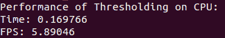

如输出所示，CPU 处理一个图像需要 `0.169766` 秒，相当于 `5.89046` FPS。现在我们将同样的算法实现到 GPU 上，并尝试测量代码的性能。根据之前的讨论，这应该会极大地提高算法的性能。GPU 实现的代码如下：

```py
#include <iostream>
#include "opencv2/opencv.hpp"

int main (int argc, char* argv[])
{
  cv::Mat h_img1 = cv::imread("images/cameraman.tif", 0);
  cv::cuda::GpuMat d_result1,d_result2,d_result3,d_result4,d_result5, d_img1;
  //Measure initial time ticks
  int64 work_begin = getTickCount(); 
  d_img1.upload(h_img1);
  cv::cuda::threshold(d_img1, d_result1, 128.0, 255.0,   cv::THRESH_BINARY);
  cv::cuda::threshold(d_img1, d_result2, 128.0, 255.0,   cv::THRESH_BINARY_INV);
  cv::cuda::threshold(d_img1, d_result3, 128.0, 255.0, cv::THRESH_TRUNC);
  cv::cuda::threshold(d_img1, d_result4, 128.0, 255.0, cv::THRESH_TOZERO);
  cv::cuda::threshold(d_img1, d_result5, 128.0, 255.0, cv::THRESH_TOZERO_INV);

  cv::Mat h_result1,h_result2,h_result3,h_result4,h_result5;
  d_result1.download(h_result1);
  d_result2.download(h_result2);
  d_result3.download(h_result3);
  d_result4.download(h_result4);
  d_result5.download(h_result5);
  //Measure difference in time ticks
  int64 delta = getTickCount() - work_begin;
  double freq = getTickFrequency();
  //Measure frames per second
  double work_fps = freq / delta;
  std::cout <<"Performance of Thresholding on GPU: " <<std::endl;
  std::cout <<"Time: " << (1/work_fps) <<std::endl;
  std::cout <<"FPS: " <<work_fps <<std::endl;
  return 0;
}
```

在代码中，使用了来自 `cv::cuda` 模块的函数，该模块针对 GPU 并行处理能力进行了优化。图像被复制到设备内存，在 GPU 上进行操作，然后复制回主机。性能指标以类似的方式计算，并在控制台上打印。程序输出如下：

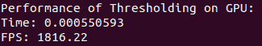

如所示，GPU 实现仅需要 `0.55` 毫秒来处理单个图像，相当于 `1816` FPS。这比 CPU 实现有显著改进，尽管必须记住这是一个非常简单的应用，并不适合于 CPU 和 GPU 之间的性能比较。这个应用仅展示如何测量 OpenCV 中任何代码的性能。

通过运行 OpenCV 安装在 `samples/gpu` 目录中的示例代码，可以更真实地比较 CPU 和 GPU 的性能。其中一个代码，`hog.cpp`，从图像中计算 **方向直方图** （**HoG**）特征，并使用 **支持向量机** （**SVM**）进行分类。尽管算法的细节超出了本书的范围，但它给你一个关于使用 GPU 实现时性能改进的想法。在摄像头视频上的性能比较如下：

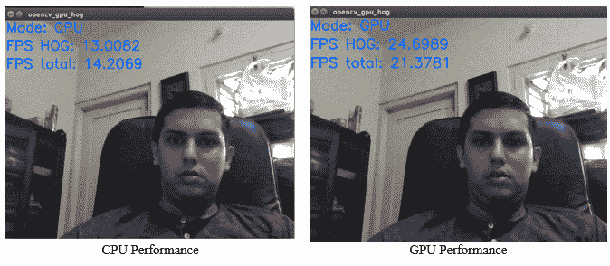

如所见，当我们仅使用 CPU 时，代码的性能大约为 13 FPS，如果我们使用 GPU，则性能提升至 24 FPS，这几乎是 CPU 性能的两倍。这会让你对使用 CUDA 与 OpenCV 结合的重要性有所了解。

总结来说，在本节中，我们比较了使用 CUDA（GPU）和不使用 CUDA（CPU）时 OpenCV 的性能。这再次强调了使用 CUDA 将极大地提高计算机视觉应用性能的观点。

# 摘要

在本章中，我们首先介绍了计算机视觉和图像处理。我们描述了 OpenCV 库，它专门为计算机视觉应用而设计，以及它与其他计算机视觉软件的不同之处。OpenCV 可以通过使用 CUDA 利用 GPU 的并行处理能力。我们查看在所有操作系统上安装具有 CUDA 的 OpenCV 的安装过程。我们描述了从磁盘读取图像、在屏幕上显示它以及将其保存回磁盘的过程。视频不过是图像的序列。我们学习了如何处理来自磁盘的视频以及从摄像头捕获的视频。我们开发了几个图像处理应用程序，对图像执行不同的操作，例如算术运算、逻辑运算、颜色空间转换和阈值处理。在最后一节中，我们比较了相同算法在 CPU 和 GPU 上的性能，包括处理图像所需的时间和 FPS。因此，在本章结束时，你对 OpenCV 与 CUDA 在计算机视觉应用中的有用性以及如何使用它编写简单代码有了了解。在下一章中，我们将在此基础上尝试开发更多有用的计算机视觉应用，例如使用 OpenCV 进行滤波、边缘检测和形态学操作。 

# 问题

1.  说明计算机视觉和图像处理这两个术语之间的区别

1.  为什么 OpenCV 非常适合在嵌入式系统上部署计算机视觉应用

1.  编写一个 OpenCV 命令，以红色初始化 1960 x 1960 彩色图像

1.  编写一个程序，从网络摄像头捕获帧并将其保存到磁盘

1.  OpenCV 用于读取和显示彩色图像的颜色格式是什么

1.  编写一个程序，从网络摄像头捕获视频，将其转换为灰度并显示在屏幕上

1.  编写一个程序来测量 GPU 上加法和减法操作的性能

1.  编写一个程序进行图像的位与和或操作，并解释它如何用于遮罩
