# 使用 OpenCV 和 CUDA 的基本计算机视觉操作

上一章描述了使用 OpenCV 和 CUDA 处理图像和视频的过程。我们查看了一些基本的图像和视频处理应用的代码，并比较了带有和没有 CUDA 加速的 OpenCV 代码的性能。在这一章中，我们将在此基础上构建知识，并尝试使用 OpenCV 和 CUDA 开发一些更多的计算机视觉和图像处理应用。这一章描述了在彩色和灰度图像中访问单个像素强度的方法。直方图是图像处理中的一个非常有用的概念。这一章描述了计算直方图的方法以及直方图均衡化如何提高图像的视觉效果。这一章还将描述如何使用 OpenCV 和 CUDA 执行不同的几何变换。图像滤波是一个非常重要的概念，它在图像预处理和特征提取中非常有用。这一章将详细描述这一点。本章的最后部分将描述不同的形态学操作，如腐蚀、膨胀、开运算和闭运算。

本章将涵盖以下主题：

+   在 OpenCV 中访问单个像素强度

+   直方图计算和直方图均衡化

+   图像变换

+   图像的滤波操作

+   图像的形态学操作

# 技术要求

本章需要具备图像处理和计算机视觉的基本理解。它需要熟悉基本的 C 或 C++ 编程语言、CUDA 以及前几章中解释的所有示例代码。本章中使用的所有代码都可以从以下 GitHub 链接下载：[`github.com/PacktPublishing/Hands-On-GPU-Accelerated-Computer-Vision-with-OpenCV-and-CUDA`](https://github.com/PacktPublishing/Hands-On-GPU-Accelerated-Computer-Vision-with-OpenCV-and-CUDA)。代码可以在任何操作系统上执行，尽管它只在 Ubuntu 16.04 上进行了测试。

查看以下视频以查看代码的实际效果：

[`bit.ly/2xERUDL`](http://bit.ly/2xERUDL)

# 访问图像的单个像素强度

当我们处理图像时，有时需要访问特定位置的像素强度值。当我们想要改变一组像素的亮度或对比度，或者想要执行其他像素级操作时，这非常有用。对于一个 8 位灰度图像，该点的强度值将在 0 到 255 的范围内，而对于彩色图像，将会有三个不同的强度值，分别对应蓝色、绿色和红色通道，所有这些通道的值都在 0 到 255 之间。

OpenCV 提供了一个`cv::Mat::at<>`方法来访问任何通道图像在特定位置的强度值。它需要一个参数，即要访问强度值的位置。该点通过`Point`类传递，行和列值作为参数。对于灰度图像，该方法将返回一个标量对象，而对于彩色图像，它将返回一个包含三个强度的向量。访问灰度图像以及彩色图像在特定位置的像素强度的代码如下：

```py
#include <iostream>
#include "opencv2/opencv.hpp"
int main ()
{
  //Gray Scale Image
  cv::Mat h_img1 = cv::imread("images/cameraman.tif",0);
  cv::Scalar intensity = h_img1.at<uchar>(cv::Point(100, 50));
  std::cout<<"Pixel Intensity of gray scale Image at (100,50) is:"  <<intensity.val[0]<<std::endl;
  //Color Image
  cv::Mat h_img2 = cv::imread("images/autumn.tif",1);
  cv::Vec3b intensity1 = h_img1.at<cv::Vec3b>(cv::Point(100, 50));
  std::cout<<"Pixel Intensity of color Image at (100,50) is:"<<intensity1<<std::endl;
  return 0;
}
```

灰度图像首先被读取，然后在这个图像对象上调用`at`方法。强度值在`(100,50)`点被测量，这表示第 100 行和第 50 列的像素。它返回一个标量，存储在强度变量中。该值被打印在控制台上。对于彩色图像，遵循相同的程序，但返回值将是一个包含三个强度的向量，存储在`Vec3b`对象中。强度值被打印在控制台上。上述程序的输出如下：

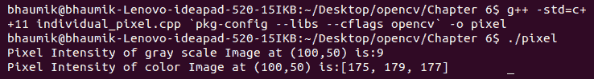

如所示，灰度图像在`(100,50)`处的像素强度为`9`，而对于彩色图像则是`[175,179,177]`，这表示蓝色强度为`175`，绿色强度为`179`，红色强度为`177`。同样的方法用于修改特定位置的像素强度。假设你想将`(100,50)`位置的像素强度改为`128`，则可以编写如下代码：

```py
h_img1.at<uchar>(100, 50) = 128;
```

总结来说，在本节中我们看到了一种访问和改变特定位置强度值的方法。在下一节中，我们将看到在 OpenCV 中计算直方图的方法。

# OpenCV 中的直方图计算和平滑

直方图是图像的一个重要属性，因为它提供了该图像外观的全局描述。可以从直方图中获得大量信息。它代表了图像中灰度级别的相对出现频率。它基本上是在 X 轴上灰度级别和 Y 轴上每个灰度级别的像素数的图表。如果直方图集中在左侧，则图像会非常暗；如果集中在右侧，则图像会非常亮。为了获得良好的图像视觉质量，它应该均匀分布。

以下图像展示了暗、亮和正常图像的直方图：

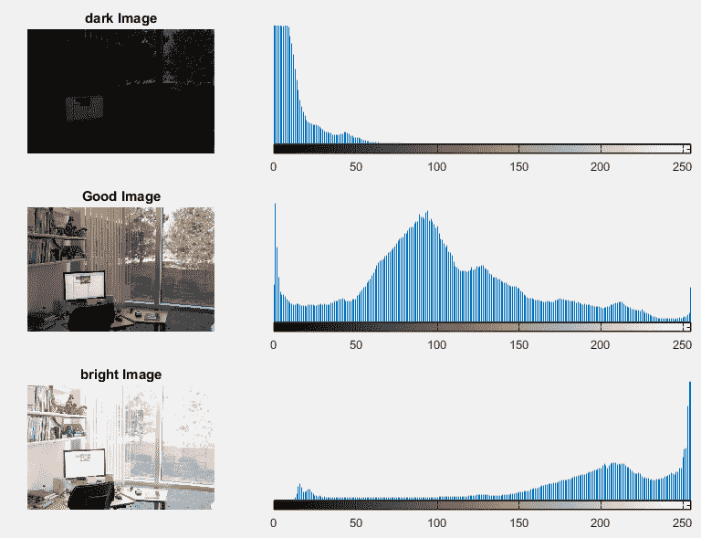

OpenCV 提供了一个函数来计算图像的直方图。该函数的语法如下：

```py
void cv::cuda::calcHist ( InputArray src, OutputArray hist)
```

函数需要两个数组作为参数。第一个数组是需要计算直方图的输入图像。第二个参数是输出数组，其中将存储直方图。输出可以绘制成直方图，如图像前面的截图所示。如前所述，平坦的直方图可以提高图像的视觉质量。OpenCV 和 CUDA 提供了一个函数来平坦直方图，这在下一节中将有描述。

# 直方图均衡化

完美的图像在其所有灰度级别中像素数量相等。因此，直方图应该具有大的动态范围和整个范围内的像素数量相等。这可以通过一种称为直方图均衡化的技术来实现。它是任何计算机视觉应用中非常重要的预处理步骤。在本节中，我们将看到如何使用 OpenCV 和 CUDA 对灰度图像和彩色图像进行直方图均衡化。

# 灰度图像

灰度图像通常是 8 位单通道图像，具有 256 个不同的灰度级别。如果直方图分布不均匀，图像可能太暗或太亮，此时应进行直方图均衡化以改善图像的视觉质量。以下代码描述了在灰度图像上进行直方图均衡化的过程：

```py
#include <iostream>
#include "opencv2/opencv.hpp"
int main ()
{
  cv::Mat h_img1 = cv::imread("images/cameraman.tif",0);
  cv::cuda::GpuMat d_img1,d_result1;
  d_img1.upload(h_img1);
  cv::cuda::equalizeHist(d_img1, d_result1);
  cv::Mat h_result1;
  d_result1.download(h_result1);
  cv::imshow("Original Image ", h_img1);
  cv::imshow("Histogram Equalized Image", h_result1);
  cv::waitKey();
  return 0;
}
```

读取的图像被上传到设备内存以进行直方图均衡化。这是一个计算密集型的步骤，因此 CUDA 加速将有助于提高程序的性能。OpenCV 提供了`equalizeHist`函数用于直方图均衡化。它需要两个参数。第一个参数是源图像，第二个参数是目标图像。目标图像被下载回主机并在控制台上显示。直方图均衡化后的输出如下：

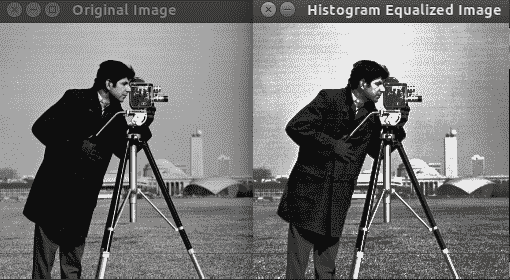

如所见，直方图均衡化后的图像在视觉质量上优于原始图像。接下来将描述对彩色图像进行相同操作的过程。

# 彩色图像

直方图均衡化也可以应用于彩色图像。它必须在单独的通道上执行。因此，彩色图像必须分成三个通道。每个通道的直方图独立均衡，然后合并通道以重建图像。以下是对彩色图像进行直方图均衡化的代码：

```py
#include <iostream>
#include "opencv2/opencv.hpp"
int main ()
{
  cv::Mat h_img1 = cv::imread("images/autumn.tif");
  cv::Mat h_img2,h_result1;
  cvtColor(h_img1, h_img2, cv::COLOR_BGR2HSV);
  //Split the image into 3 channels; H, S and V channels respectively and store it in a std::vector
  std::vector< cv::Mat > vec_channels;
  cv::split(h_img2, vec_channels); 
  //Equalize the histogram of only the V channel 
  cv::equalizeHist(vec_channels[2], vec_channels[2]);
  //Merge 3 channels in the vector to form the color image in HSV color space.
  cv::merge(vec_channels, h_img2); 
  //Convert the histogram equalized image from HSV to BGR color space again
  cv::cvtColor(h_img2,h_result1, cv::COLOR_HSV2BGR);
  cv::imshow("Original Image ", h_img1);
  cv::imshow("Histogram Equalized Image", h_result1);
  cv::waitKey();
  return 0;
}
```

在 BGR 颜色空间中，直方图通常不进行均衡化；使用 HSV 和 YCrCb 颜色空间进行均衡化。因此，在代码中，将 BGR 颜色空间转换为 HSV 颜色空间。然后，使用`split`函数将其拆分为三个独立的通道。现在，色调和饱和度通道包含颜色信息，因此没有必要均衡这些通道。直方图均衡化仅在值通道上执行。使用`merge`函数将三个通道合并回重建彩色图像。使用`imshow`将 HSV 彩色图像转换回 BGR 颜色空间进行显示。程序的输出如下：

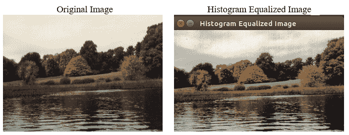

总结来说，直方图均衡化可以提升图像的视觉效果，因此它是任何计算机视觉应用中非常重要的预处理步骤。下一节将描述图像的几何变换。

# 图像的几何变换

有时，在更大的计算机视觉应用中，需要缩放图像、平移图像和旋转图像。本节将解释这类几何变换。

# 图像缩放

在某些计算机视觉应用中，图像需要具有特定的尺寸。因此，需要将任意大小的图像转换为特定尺寸。OpenCV 提供了一个用于缩放图像的函数。图像缩放的代码如下：

```py
#include <iostream>
#include "opencv2/opencv.hpp"
int main ()
{
  cv::Mat h_img1 = cv::imread("images/cameraman.tif",0);
  cv::cuda::GpuMat d_img1,d_result1,d_result2;
  d_img1.upload(h_img1);
  int width= d_img1.cols;
  int height = d_img1.size().height;
  cv::cuda::resize(d_img1,d_result1,cv::Size(200, 200),   cv::INTER_CUBIC);
  cv::cuda::resize(d_img1,d_result2,cv::Size(0.5*width, 0.5*height),   cv::INTER_LINEAR); 
  cv::Mat h_result1,h_result2;
  d_result1.download(h_result1);
  d_result2.download(h_result2);
  cv::imshow("Original Image ", h_img1);
  cv::imshow("Resized Image", h_result1);
  cv::imshow("Resized Image 2", h_result2);
  cv::waitKey();
  return 0;
}
```

可以使用两个不同的函数获取图像的高度和宽度，如代码所示。`Mat`对象的`rows`和`cols`属性分别描述图像的`height`和`width`。`Mat`对象还有一个`size()`方法，它具有`height`和`width`属性，用于查找图像的大小。图像以两种方式缩放。在第一种方式中，图像被缩放为特定的`(200,200)`大小，在第二种方式中，它被缩放为其原始尺寸的一半。OpenCV 提供了`resize`函数来执行此操作。它有四个参数。

前两个参数分别是源图像和目标图像。第三个参数是目标图像的大小。它使用`Size`对象定义。当图像缩放时，必须从源图像对目标图像上的像素值进行插值。有各种插值方法可供使用，例如双线性插值、双三次插值和面积插值。这些插值方法作为`resize`函数的第四个参数提供。它可以设置为`cv::INTER_LINEAR (双线性)`、`cv::INTER_CUBIC (双三次)`或`cv::INTER_AREA (面积)`。图像缩放的代码输出如下：

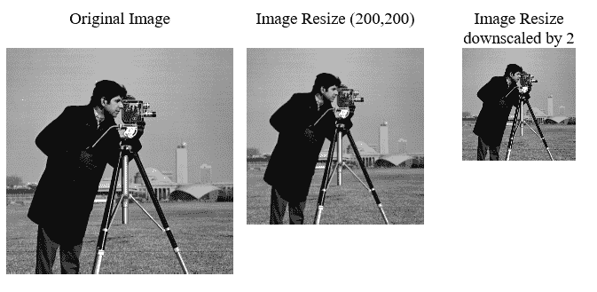

# 图像平移和旋转

图像平移和旋转是某些计算机视觉应用中需要的重要几何变换。OpenCV 提供了一个简单的 API 来在图像上执行这些变换。执行平移和旋转的代码如下：

```py
#include <iostream>
#include "opencv2/opencv.hpp"

int main ()
{
  cv::Mat h_img1 = cv::imread("images/cameraman.tif",0);
  cv::cuda::GpuMat d_img1,d_result1,d_result2;
  d_img1.upload(h_img1);
  int cols= d_img1.cols;
  int rows = d_img1.size().height;
  //Translation
  cv::Mat trans_mat = (cv::Mat_<double>(2,3) << 1, 0, 70, 0, 1, 50);
  cv::cuda::warpAffine(d_img1,d_result1,trans_mat,d_img1.size());
  //Rotation
  cv::Point2f pt(d_img1.cols/2., d_img1.rows/2.); 
  cv::Mat rot_mat = cv::getRotationMatrix2D(pt, 45, 1.0);
  cv::cuda::warpAffine(d_img1, d_result2, rot_mat, cv::Size(d_img1.cols, d_img1.rows));
  cv::Mat h_result1,h_result2;
  d_result1.download(h_result1);
  d_result2.download(h_result2);
  cv::imshow("Original Image ", h_img1);
  cv::imshow("Translated Image", h_result1);
  cv::imshow("Rotated Image", h_result2);
  cv::waitKey();
  return 0;
}
```

需要创建一个平移矩阵，该矩阵指定了图像在水平和垂直方向上的平移。它是一个 2 x 3 的矩阵，如下所示：

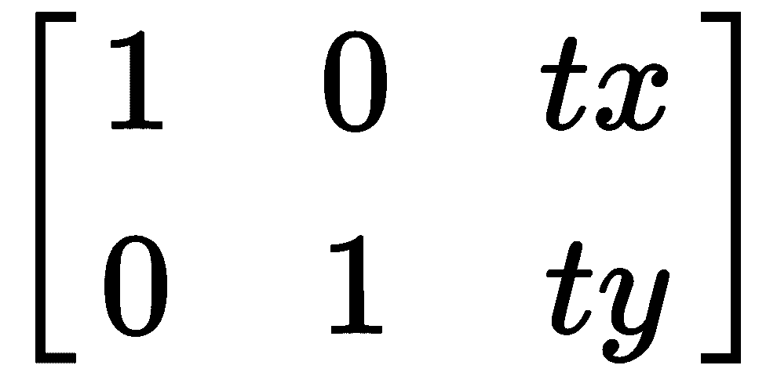

`tx` 和 `ty` 是沿 *x* 和 *y* 方向的平移偏移。在代码中，这个矩阵使用 `Mat` 对象创建，其中 *X*-方向的偏移量为 70，*Y*-方向的偏移量为 50。这个矩阵作为参数传递给 `warpAffine` 函数以实现图像平移。`warpAffine` 函数的其他参数分别是源图像、目标图像和输出图像的大小。

应该创建一个旋转矩阵，用于在特定点以特定角度旋转图像。OpenCV 提供了 `cv::getRotationMatrix2D` 函数来构建这个旋转矩阵。它需要三个参数。第一个参数是旋转点；在这种情况下使用图像的中心。第二个参数是旋转角度，指定为 45 度。最后一个参数是缩放比例，指定为 1。构建的旋转矩阵再次作为参数传递给 `warpAffine` 函数以实现图像旋转。

图像平移和图像旋转代码的输出如下：

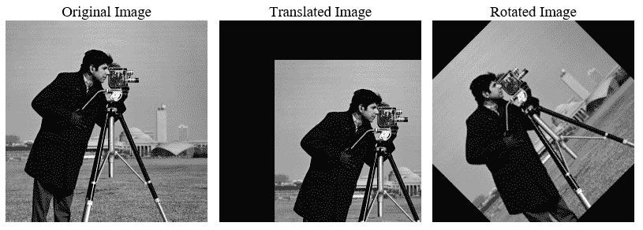

总结来说，本节描述了使用 OpenCV 和 CUDA 实现的各种几何变换，如图像缩放、图像平移和图像旋转。

# 图像上的滤波操作

到目前为止描述的方法都是针对单个像素强度进行的，被称为点处理方法。有时查看像素的邻域而不是仅查看单个像素强度是有帮助的。这些被称为邻域处理技术。邻域可以是 3 x 3、5 x 5、7 x 7 等等，并且以特定像素为中心。图像滤波是邻域处理中的一个重要技术。

过滤是信号处理中的一个重要概念，其中我们拒绝一定频率范围的信号，并允许一定频率范围的信号通过。图像中是如何测量频率的？如果一个区域的灰度值变化缓慢，那么它是一个低频区域。如果灰度值变化剧烈，那么它是一个高频区域。通常，图像的背景被认为是低频区域，而边缘是高频区域。卷积是邻域处理和图像滤波中的一个非常重要的数学概念。它将在下一节中解释。

# 图像上的卷积操作

卷积的基本思想源于生物学中类似的概念，称为感受野，其中对图像中的某些部分敏感，而对其他部分不敏感。它可以用以下方式数学表示：

*g(x,y)=f(x,y)*h(x,y)= ∑∑f(n,m)h(x-n,y-m)*

简化形式下，此方程是滤波器*h*与图像的子图像*f*（以*(x,y)*点为中心）的点积。此乘积的答案是图像中的*(x,y)*点*g*。为了说明卷积操作在图像上的工作原理，以下图显示了将 3 x 3 滤波器应用于 6 x 6 大小图像的示例：

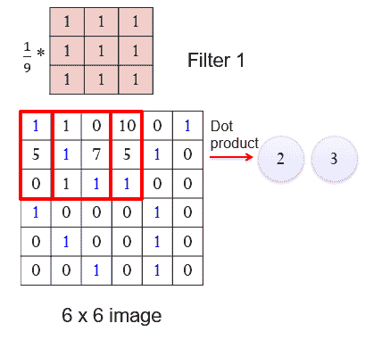

通过将最左侧的红色窗口与滤波器进行点积，以找到目标图像中的一个点。点积的答案将是 *2 ((1*1 + 1*1 + 1*0 + 1*5 + 1*1 +1*7 +1*0 +1*1 + 1*1)/9)*。将此窗口向右移动 1 个像素后，重复相同的操作，答案将是 *3*。这将对图像中的所有窗口重复进行，以构建目标图像。通过改变 3 x 3 滤波器矩阵的值，可以构建不同的低通和高通滤波器。这将在下一两节中解释。

# 图像上的低通滤波

低通滤波器从图像中移除高频内容。通常，噪声被认为是高频内容，因此低通滤波器从图像中移除噪声。有许多类型的噪声，如高斯噪声、均匀噪声、指数噪声和盐和胡椒噪声，这些都会影响图像。低通滤波器用于消除这类噪声。有许多类型的低通滤波器可用：

+   平均或箱式滤波器

+   高斯滤波器

+   中值滤波器

本节解释了这些滤波器及其使用 OpenCV 的实现。

# 平均滤波器

平均滤波器，正如其名所示，对邻域像素执行平均操作。如果图像中存在高斯噪声，则可以使用低通平均滤波器来去除噪声。由于平均操作，它还会模糊图像的边缘。邻域可以是 3 x 3、5 x 5、7 x 7 等。滤波器窗口的尺寸越大，图像的模糊程度就越高。3 x 3 和 5 x 5 平均掩模如下：

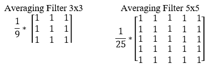

OpenCV 提供了一个简单的接口，可以在图像上应用许多类型的滤波器。以下代码演示了如何使用不同掩模应用平均滤波器：

```py
#include <iostream>
#include "opencv2/opencv.hpp"
int main ()
{
  cv::Mat h_img1 = cv::imread("images/cameraman.tif",0);
  cv::cuda::GpuMat d_img1,d_result3x3,d_result5x5,d_result7x7;
  d_img1.upload(h_img1);
  cv::Ptr<cv::cuda::Filter> filter3x3,filter5x5,filter7x7;
  filter3x3 = cv::cuda::createBoxFilter(CV_8UC1,CV_8UC1,cv::Size(3,3));
  filter3x3->apply(d_img1, d_result3x3);
  filter5x5 = cv::cuda::createBoxFilter(CV_8UC1,CV_8UC1,cv::Size(5,5));
  filter5x5->apply(d_img1, d_result5x5);
  filter7x7 = cv::cuda::createBoxFilter(CV_8UC1,CV_8UC1,cv::Size(7,7));
  filter7x7->apply(d_img1, d_result7x7);

  cv::Mat h_result3x3,h_result5x5,h_result7x7;
  d_result3x3.download(h_result3x3);
  d_result5x5.download(h_result5x5);
  d_result7x7.download(h_result7x7);
  cv::imshow("Original Image ", h_img1);
  cv::imshow("Blurred with kernel size 3x3", h_result3x3);
  cv::imshow("Blurred with kernel size 5x5", h_result5x5);
  cv::imshow("Blurred with kernel size 7x7", h_result7x7);
  cv::waitKey();
  return 0;
}
```

`cv::Ptr`是一个用于智能指针的模板类，用于存储`cv::cuda::Filter`类型的过滤器。然后，使用`createBoxFilter`函数创建不同窗口大小的平均滤波器。它需要三个必选参数和三个可选参数。第一个和第二个参数是源图像和目标图像的数据类型。它们被假定为`CV_8UC1`，表示 8 位无符号灰度图像。第三个参数定义了滤波器窗口的大小。它可以是一个 3 x 3、5 x 5、7 x 7 等。第四个参数是锚点，其默认值为(-1,-1)，表示锚点位于核的中心点。最后两个可选参数与像素插值方法和边界值相关，这里省略。

创建的过滤器指针有一个应用方法，该方法用于将创建的过滤器应用于任何图像。它有三个参数。第一个参数是源图像，第二个参数是目标图像，第三个可选参数是 CUDA 流，它用于多任务处理，如本书前面所述。在代码中，对图像应用了不同大小的三个平均滤波器。结果如下：

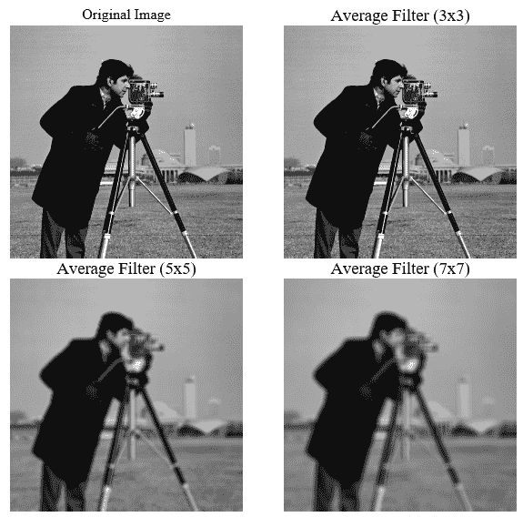

从输出中可以看出，随着滤波器大小的增加，用于平均的像素更多，这会在图像上引入更多的模糊。尽管大滤波器可以消除更多的噪声。

# 高斯滤波器

高斯滤波器使用具有高斯分布的掩码来过滤图像，而不是简单的平均掩码。此滤波器还引入了图像上的平滑模糊，并且广泛用于从图像中消除噪声。一个 5 x 5 的高斯滤波器，其标准差约为 1，如下所示：

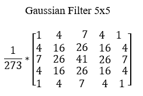

OpenCV 提供了一个实现高斯滤波器的函数。其代码如下：

```py
#include <iostream>
#include "opencv2/opencv.hpp"

int main ()
{
  cv::Mat h_img1 = cv::imread("images/cameraman.tif",0);
  cv::cuda::GpuMat d_img1,d_result3x3,d_result5x5,d_result7x7;
  d_img1.upload(h_img1);
  cv::Ptr<cv::cuda::Filter> filter3x3,filter5x5,filter7x7;
  filter3x3 = cv::cuda::createGaussianFilter(CV_8UC1,CV_8UC1,cv::Size(3,3),1);
  filter3x3->apply(d_img1, d_result3x3);
  filter5x5 = cv::cuda::createGaussianFilter(CV_8UC1,CV_8UC1,cv::Size(5,5),1);
  filter5x5->apply(d_img1, d_result5x5);
  filter7x7 = cv::cuda::createGaussianFilter(CV_8UC1,CV_8UC1,cv::Size(7,7),1);
  filter7x7->apply(d_img1, d_result7x7);

  cv::Mat h_result3x3,h_result5x5,h_result7x7;
  d_result3x3.download(h_result3x3);
  d_result5x5.download(h_result5x5);
  d_result7x7.download(h_result7x7);
  cv::imshow("Original Image ", h_img1);
  cv::imshow("Blurred with kernel size 3x3", h_result3x3);
  cv::imshow("Blurred with kernel size 5x5", h_result5x5);
  cv::imshow("Blurred with kernel size 7x7", h_result7x7);
  cv::waitKey();
  return 0;
}
```

`createGaussianFilter`函数用于创建高斯滤波器的掩码。源图像和目标图像的数据类型、滤波器大小以及水平方向的标准差作为参数提供给函数。我们还可以提供一个垂直方向的标准差作为参数；如果没有提供，则其默认值等于水平方向的标准差。使用`apply`方法将不同大小的创建的高斯掩码应用于图像。程序输出如下：

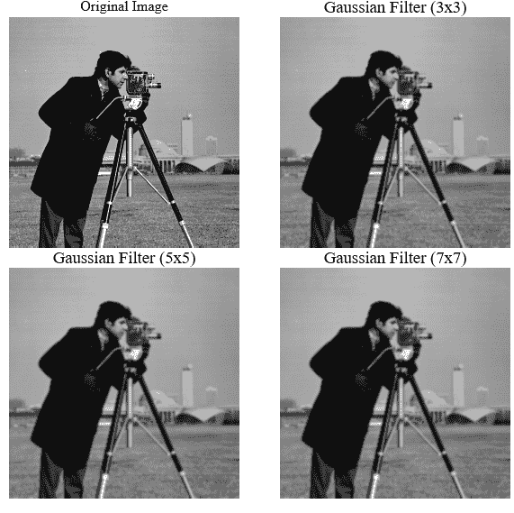

同样，随着高斯滤波器大小的增加，图像中引入了更多的模糊。高斯滤波器用于消除噪声并在图像上引入平滑的模糊。

# 中值滤波

当图像受到椒盐噪声的影响时，它不会被平均或高斯滤波器消除。它需要一个非线性滤波器。在邻域中进行中值运算而不是平均可以帮助消除椒盐噪声。在这个滤波器中，邻域中 9 个像素值的中值放置在中心像素上。它将消除由椒盐噪声引入的极端高或低值。尽管 OpenCV 和 CUDA 提供了一个中值滤波函数，但它的速度比 OpenCV 中的常规函数慢，因此使用以下代码实现中值滤波：

```py
#include <iostream>
#include "opencv2/opencv.hpp"

int main ()
{
  cv::Mat h_img1 = cv::imread("images/saltpepper.png",0);
  cv::Mat h_result;
  cv::medianBlur(h_img1,h_result,3);
  cv::imshow("Original Image ", h_img1);
  cv::imshow("Median Blur Result", h_result);
  cv::waitKey();
  return 0;
}
```

OpenCV 中的`medianBlur`函数用于实现中值滤波。它需要三个参数。第一个参数是源图像，第二个参数是目标图像，第三个参数是中值操作的窗口大小。中值滤波的输出如下：

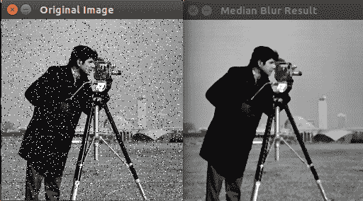

源图像受到椒盐噪声的影响，如图中的截图所示。这种噪声通过 3x3 大小的中值滤波器完全消除，而没有引入极端的模糊。因此，中值滤波是图像应用受到椒盐噪声影响时的一个非常重要的预处理步骤。

总结一下，我们看到了三种类型的低通滤波器，它们在各种计算机视觉应用中得到了广泛使用。平均滤波器和高斯滤波器用于消除高斯噪声，但它们也会模糊图像的边缘。中值滤波器用于去除椒盐噪声。

# 图像的高通滤波

高通滤波器从图像中移除低频分量并增强高频分量。因此，当高通滤波器应用于图像时，它会移除背景，因为它是低频区域，并增强边缘，这些是高频分量。因此，高通滤波器也可以称为边缘检测器。滤波器的系数将改变，否则它与上一节中看到的滤波器相似。有许多高通滤波器可用，如下所示：

+   Sobel 滤波器

+   Scharr 滤波器

+   拉普拉斯滤波器

在本节中，我们将分别看到它们中的每一个。

# Sobel 滤波器

Sobel 算子或 Sobel 滤波器是一种广泛用于边缘检测应用的图像处理和计算机视觉算法。它是一个 3 x 3 的滤波器，用于近似图像强度函数的梯度。它提供了一个单独的滤波器来计算水平和垂直方向的梯度。该滤波器以与本章前面所述类似的方式与图像卷积。水平和垂直的 3 x 3 Sobel 滤波器如下：

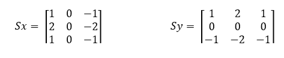

实现此 Sobel 滤波器的代码如下：

```py
#include <iostream>
#include "opencv2/opencv.hpp"

int main ()
{
  cv::Mat h_img1 = cv::imread("images/blobs.png",0);
  cv::cuda::GpuMat d_img1,d_resultx,d_resulty,d_resultxy;
  d_img1.upload(h_img1);
  cv::Ptr<cv::cuda::Filter> filterx,filtery,filterxy;
  filterx = cv::cuda::createSobelFilter(CV_8UC1,CV_8UC1,1,0);
  filterx->apply(d_img1, d_resultx);
  filtery = cv::cuda::createSobelFilter(CV_8UC1,CV_8UC1,0,1);
  filtery->apply(d_img1, d_resulty);
  cv::cuda::add(d_resultx,d_resulty,d_resultxy); 
  cv::Mat h_resultx,h_resulty,h_resultxy;
  d_resultx.download(h_resultx);
  d_resulty.download(h_resulty);
  d_resultxy.download(h_resultxy);
  cv::imshow("Original Image ", h_img1);
  cv::imshow("Sobel-x derivative", h_resultx);
  cv::imshow("Sobel-y derivative", h_resulty);
  cv::imshow("Sobel-xy derivative", h_resultxy);
  cv::waitKey();
  return 0;
}
```

OpenCV 提供了`createSobelFilter`函数来实现 Sobel 滤波器。它需要许多参数。前两个参数是源图像和目标图像的数据类型。第三个和第四个参数分别是`x`和`y`导数的阶数。对于计算`x`导数或垂直边缘，提供 1 和 0，而对于计算`y`导数或水平边缘，提供 0 和 1。第五个参数表示核的大小，是可选的。默认值是 3。也可以提供导数的比例。

要同时看到水平和垂直边缘，需要将`x`导数和`y`导数的结果相加。结果如下：

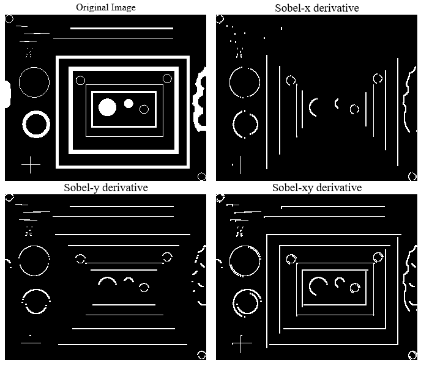

Sobel 算子提供了非常不精确的导数近似，但仍然在计算机视觉应用中的边缘检测方面非常有用。它没有旋转对称性；为了克服这一点，使用了 Scharr 算子。

# Scharr 滤波器

由于 Sobel 没有提供旋转对称性，因此使用不同的滤波器掩码来克服这一点，如下所示：

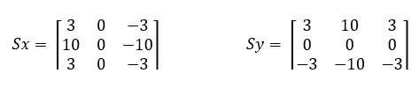

从掩码中可以看出，Scharr 算子更重视中间行或中间列以找到边缘。实现 Scharr 滤波器的程序如下：

```py
#include <iostream>
#include "opencv2/opencv.hpp"
int main ()
{
  cv::Mat h_img1 = cv::imread("images/blobs.png",0);
  cv::cuda::GpuMat d_img1,d_resultx,d_resulty,d_resultxy;
  d_img1.upload(h_img1);
  cv::Ptr<cv::cuda::Filter> filterx,filtery;
  filterx = cv::cuda::createScharrFilter(CV_8UC1,CV_8UC1,1,0);
  filterx->apply(d_img1, d_resultx);
  filtery = cv::cuda::createScharrFilter(CV_8UC1,CV_8UC1,0,1);
  filtery->apply(d_img1, d_resulty);
  cv::cuda::add(d_resultx,d_resulty,d_resultxy); 
  cv::Mat h_resultx,h_resulty,h_resultxy;
  d_resultx.download(h_resultx);
  d_resulty.download(h_resulty);
  d_resultxy.download(h_resultxy);
  cv::imshow("Original Image ", h_img1);
  cv::imshow("Scharr-x derivative", h_resultx);
  cv::imshow("Scharr-y derivative", h_resulty);
  cv::imshow("Scharr-xy derivative", h_resultxy);
  cv::waitKey();
    return 0;
}
```

OpenCV 提供了`createScharrFilter`函数来实现 Scharr 滤波器。它需要许多参数。前两个参数是源图像和目标图像的数据类型。第三个和第四个参数分别是`x`和`y`导数的阶数。对于计算`x`导数或垂直边缘，提供 1 和 0，而对于计算`y`导数或水平边缘，提供 0 和 1。第五个参数，表示核的大小，是可选的。默认值是 3。

要同时看到水平和垂直边缘，需要将`x`导数和`y`导数的结果相加。结果如下：

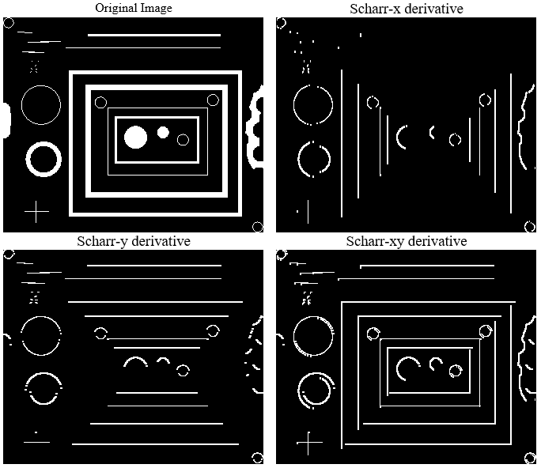

# Laplacian 滤波器

Laplacian 滤波器也是一种导数算子，用于在图像中找到边缘。不同之处在于 Sobel 和 Scharr 是一阶导数算子，而 Laplacian 是二阶导数算子。它也同时找到水平和垂直方向的边缘，这与 Sobel 和 Scharr 算子不同。Laplacian 滤波器计算二阶导数，因此对图像中的噪声非常敏感，在应用 Laplacian 滤波器之前最好对图像进行模糊处理以去除噪声。实现 Laplacian 滤波器的代码如下：

```py
#include <iostream>
#include "opencv2/opencv.hpp"

int main ()
{
  cv::Mat h_img1 = cv::imread("images/blobs.png",0);
  cv::cuda::GpuMat d_img1,d_result1,d_result3;
  d_img1.upload(h_img1);
  cv::Ptr<cv::cuda::Filter> filter1,filter3;
  filter1 = cv::cuda::createLaplacianFilter(CV_8UC1,CV_8UC1,1);
  filter1->apply(d_img1, d_result1);
  filter3 = cv::cuda::createLaplacianFilter(CV_8UC1,CV_8UC1,3);
  filter3->apply(d_img1, d_result3);
  cv::Mat h_result1,h_result3;
  d_result1.download(h_result1);
  d_result3.download(h_result3);
  cv::imshow("Original Image ", h_img1);
  cv::imshow("Laplacian filter 1", h_result1);
  cv::imshow("Laplacian filter 3", h_result3);
  cv::waitKey();
  return 0;
}
```

使用`createLaplacianFilter`函数在图像上应用了两个核大小为 1 和 3 的 Laplacian 滤波器。除了核的大小外，该函数还需要作为参数提供源图像和目标图像的数据类型。创建的 Laplacian 滤波器通过`apply`方法应用于图像。Laplacian 滤波器的输出如下：

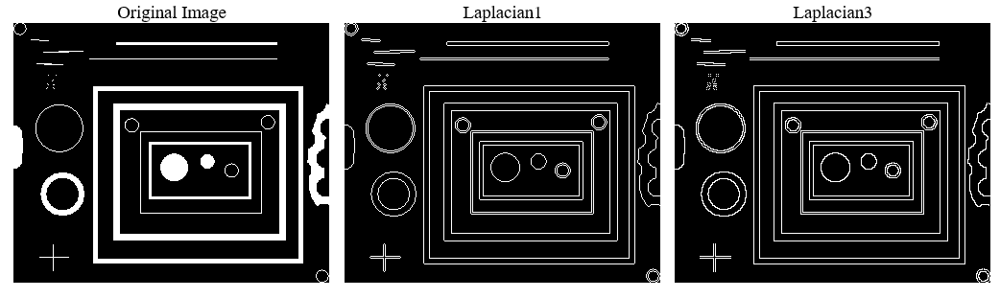

总结来说，在本节中，我们描述了不同的高通滤波器，如 Sobel、Scharr 和 Laplacian 滤波器。Sobel 和 Scharr 是一阶导数算子，用于计算边缘，它们对噪声的敏感性较低。Laplacian 是一个二阶导数算子，用于计算边缘，它对噪声非常敏感。

# 图像的形态学操作

图像形态学处理图像的区域和形状。它用于提取对表示形状和区域有用的图像成分。图像形态学将图像视为集合的总和，这与之前看到的其他图像处理操作不同。图像与一个小模板相互作用，该模板称为结构元素，它定义了图像形态学中的感兴趣区域或邻域。本节中解释了可以在图像上执行的各种形态学操作，将逐一进行说明。

+   **腐蚀**：腐蚀将中心像素设置为邻域内所有像素的最小值。邻域由结构元素定义，它是一个由 1s 和 0s 组成的矩阵。腐蚀用于扩大物体中的孔洞，缩小边界，消除岛屿，并去除可能存在于图像边界上的狭窄半岛。

+   **膨胀**：膨胀将中心像素设置为邻域内所有像素的最大值。膨胀增加了白色块的大小，减少了黑色区域的大小。它用于填充物体中的孔洞并扩展物体的边界。

+   **开运算**：图像开运算基本上是腐蚀和膨胀的组合。图像开运算定义为腐蚀后跟膨胀。这两个操作都使用相同的结构元素执行。它用于平滑图像的轮廓，破坏狭窄的桥梁并隔离相互接触的物体。它在分析发动机油中的磨损颗粒、回收纸中的墨水颗粒等方面得到应用。

+   **闭运算**：图像闭运算定义为膨胀后跟腐蚀。这两个操作都使用相同的结构元素执行。它用于融合狭窄的裂缝并消除小孔。

形态学算子可以通过将它们应用于仅包含黑白两色的二值图像来轻松理解。OpenCV 和 CUDA 提供了一个简单的 API 来在图像上应用形态学变换。相应的代码如下：

```py
#include <iostream>
#include "opencv2/opencv.hpp"
int main ()
{
  cv::Mat h_img1 = cv::imread("images/blobs.png",0);
  cv::cuda::GpuMat d_img1,d_resulte,d_resultd,d_resulto, d_resultc;
  cv::Mat element = cv::getStructuringElement(cv::MORPH_RECT,cv::Size(5,5)); 
  d_img1.upload(h_img1);
  cv::Ptr<cv::cuda::Filter> filtere,filterd,filtero,filterc;
  filtere = cv::cuda::createMorphologyFilter(cv::MORPH_ERODE,CV_8UC1,element);
  filtere->apply(d_img1, d_resulte);
  filterd = cv::cuda::createMorphologyFilter(cv::MORPH_DILATE,CV_8UC1,element);
  filterd->apply(d_img1, d_resultd);
  filtero = cv::cuda::createMorphologyFilter(cv::MORPH_OPEN,CV_8UC1,element);
  filtero->apply(d_img1, d_resulto);
  filterc = cv::cuda::createMorphologyFilter(cv::MORPH_CLOSE,CV_8UC1,element);
  filterc->apply(d_img1, d_resultc);

  cv::Mat h_resulte,h_resultd,h_resulto,h_resultc;
  d_resulte.download(h_resulte);
  d_resultd.download(h_resultd);
  d_resulto.download(h_resulto);
  d_resultc.download(h_resultc);
  cv::imshow("Original Image ", h_img1);
  cv::imshow("Erosion", h_resulte);
  cv::imshow("Dilation", h_resultd);
  cv::imshow("Opening", h_resulto);
  cv::imshow("closing", h_resultc);
  cv::waitKey();
  return 0;
}
```

首先需要创建一个定义形态学操作邻域的结构元素。这可以通过使用 OpenCV 中的`getStructuringElement`函数来完成。需要将结构元素的形状和尺寸作为参数传递给此函数。在代码中，定义了一个 5 x 5 大小的矩形结构元素。

形态学操作的过滤器是通过使用`createMorphologyFilter`函数创建的。它需要三个必填参数。第一个参数定义要执行的操作。`cv::MORPH_ERODE`用于腐蚀，`cv::MORPH_DILATE`用于膨胀，`cv::MORPH_OPEN`用于开运算，`cv::MORPH_CLOSE`用于闭运算。第二个参数是图像的数据类型，第三个参数是之前创建的结构元素。使用`apply`方法将这些过滤器应用于图像。

图像上形态学操作的输出如下：

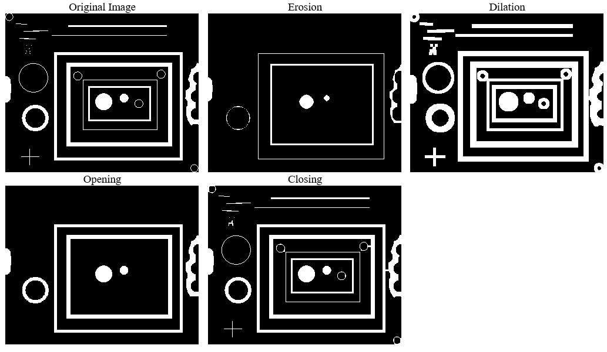

从输出结果可以看出，腐蚀操作会减小物体的边界，而膨胀操作则会使其变厚。我们将白色部分视为物体，黑色部分则是背景。开运算可以平滑图像的轮廓。闭运算可以消除图像中的小孔。如果将结构元素的尺寸从 5 x 5 增加到 7 x 7，那么在腐蚀操作中边界腐蚀会更加明显，而在膨胀操作中边界会变得更厚。在 5 x 5 腐蚀图像中可见的左侧的小圆圈，在用 7 x 7 尺寸腐蚀时会被移除。

使用 7 x 7 结构元素的形态学操作的输出如下：

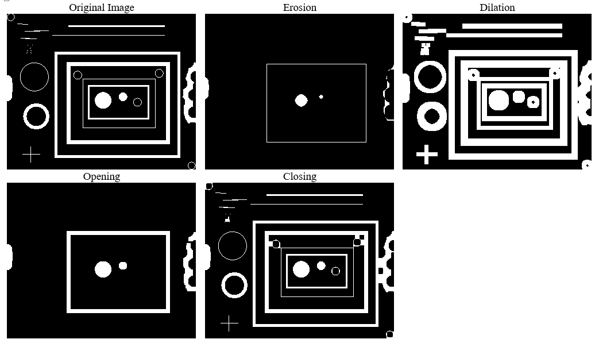

总结来说，形态学操作对于找出定义图像形状和区域的组件非常重要。它可以用来填充图像中的孔洞并平滑图像的轮廓。

# 摘要

本章介绍了在图像中特定位置访问像素强度的方法。当我们对图像进行逐点操作时，这非常有用。直方图是描述图像的一个非常重要的全局特征。本章介绍了计算直方图和直方图均衡化的方法，这可以提高图像的视觉效果。详细解释了各种几何变换，如图像缩放、旋转和平移。图像滤波是一种有用的邻域处理技术，用于消除噪声和提取图像的边缘特征，并进行了详细描述。低通滤波器用于去除噪声，但它也会模糊图像的边缘。高通滤波器去除背景，这是一个低频区域，同时增强边缘，这些是高频区域。本章的最后部分介绍了不同的形态学操作，如腐蚀、膨胀、开运算和闭运算，这些可以用来描述图像的形状并填充图像中的空洞。在下一章中，我们将使用这些概念，结合 OpenCV 和 CUDA 构建一些有用的计算机视觉应用。

# 问题

1.  编写一个 OpenCV 函数，在控制台打印任何彩色图像在位置（200,200）的像素强度。

1.  编写一个 OpenCV 函数，将图像调整到（300,200）像素大小。使用双线性插值方法。

1.  编写一个 OpenCV 函数，通过 2 倍上采样图像。使用面积插值方法。

1.  判断对错：随着平均滤波器大小的增加，模糊程度降低。

1.  判断对错：中值滤波器可以去除高斯噪声。

1.  可以采取哪些步骤来降低拉普拉斯算子的噪声敏感性？

1.  编写一个 OpenCV 函数来实现顶帽和黑帽形态学操作。
