# 使用 OpenCV 和 CUDA 进行目标检测和跟踪

上一章描述了使用 OpenCV 和 CUDA 的基本计算机视觉操作。在这一章中，我们将看到如何使用这些基本操作以及 OpenCV 和 CUDA 来开发复杂的计算机视觉应用。我们将使用目标检测和跟踪的例子来展示这个概念。目标检测和跟踪是计算机视觉中一个非常活跃的研究领域。它涉及在图像中识别物体的位置并在一系列帧中跟踪它。基于颜色、形状和图像的其他显著特征，已经提出了许多用于此任务的方法。在这一章中，这些算法使用 OpenCV 和 CUDA 实现。我们首先解释基于颜色的物体检测，然后描述检测特定形状物体的方法。所有物体都有显著的特性，可以用来检测和跟踪物体。本章描述了不同特征检测算法的实现以及如何使用它们来检测物体。本章的最后部分将演示使用背景减除技术，该技术将前景与背景分离以进行目标检测和跟踪。

本章将涵盖以下主题：

+   目标检测和跟踪简介

+   基于颜色的目标检测和跟踪

+   基于形状的目标检测和跟踪

+   基于特征的物体检测

+   使用 Haar 级联的目标检测

+   背景减除方法

# 技术要求

本章需要具备良好的图像处理和计算机视觉理解。它还需要一些关于用于目标检测和跟踪的算法的基本知识。需要熟悉基本的 C 或 C++编程语言、CUDA 以及前几章中解释的所有代码。本章中使用的所有代码都可以从以下 GitHub 链接下载：[`github.com/PacktPublishing/Hands-On-GPU-Accelerated-Computer-Vision-with-OpenCV-and-CUDA`](https://github.com/PacktPublishing/Hands-On-GPU-Accelerated-Computer-Vision-with-OpenCV-and-CUDA)。代码可以在任何操作系统上执行，尽管它只在 Ubuntu 16.04 上进行了测试。

查看以下视频以查看代码的实际应用：

[`bit.ly/2PSRqkU`](http://bit.ly/2PSRqkU)

# 目标检测和跟踪简介

目标检测和跟踪是计算机视觉领域的一个活跃的研究课题，它通过一系列帧努力检测、识别和跟踪物体。已经发现，视频序列中的目标检测和跟踪是一个具有挑战性的任务，并且是一个非常耗时的过程。目标检测是构建更大计算机视觉系统的第一步。可以从检测到的物体中推导出大量信息，如下所示：

+   检测到的目标可以被分类到特定的类别

+   可以在图像序列中进行跟踪

+   可以从检测到的对象中获取更多关于场景或其他对象推断的信息

目标跟踪被定义为在视频的每一帧中检测对象，并建立从一帧到另一帧检测到的对象的对应关系。

# 目标检测与跟踪的应用

目标检测与跟踪可用于开发视频监控系统以跟踪可疑活动、事件和人员。它可以用于开发智能交通系统以跟踪车辆和检测交通违规行为。在自动驾驶汽车中，目标检测对于提供周围环境信息和规划导航至关重要。它对于自动驾驶员辅助系统中的行人检测或车辆检测也非常有用。它可用于医疗领域的应用，如乳腺癌检测或脑瘤检测等。它可用于面部和手势识别。它在工业装配和生产线的质量控制中具有广泛的应用。对于搜索引擎中的图像检索和照片管理也非常重要。

# 目标检测的挑战

目标检测是一个具有挑战性的任务，因为现实生活中的图像会受到噪声、光照变化、动态背景、阴影效果、相机抖动和运动模糊的影响。当要检测的对象旋转、缩放或被遮挡时，目标检测变得困难。许多应用需要检测多个对象类别。如果检测的类别数量很大，那么处理速度就成为一个重要问题，同时系统在处理这些类别时，如何不损失准确性也是一个关键问题。

有许多算法可以克服这些挑战中的一些。这些算法在本章中进行了讨论。本章没有详细描述这些算法，但更侧重于如何使用 CUDA 和 OpenCV 来实现它们。

# 基于颜色的目标检测与跟踪

一个对象有许多全局特征，如颜色和形状，这些特征描述了对象的整体。这些特征可以用于在一系列帧中检测对象并跟踪它。在本节中，我们将使用颜色作为特征来检测具有特定颜色的对象。当要检测的对象是特定颜色且与背景颜色不同时，这种方法很有用。如果对象和背景颜色相同，则这种检测方法将失败。在本节中，我们将尝试使用 OpenCV 和 CUDA 从网络摄像头流中检测任何蓝色对象。

# 蓝色目标检测与跟踪

第一个问题可能是应该使用哪种颜色空间来分割蓝色。**红绿蓝**（**RGB**）颜色空间没有将颜色信息与强度信息分开。将颜色信息与强度信息分开的颜色空间，如**色调饱和度值**（HSV）和**YCrCb**（其中 Y′是亮度分量，CB 和 CR 是蓝差和红差色度分量），对于这类任务非常理想。每种颜色在色调通道中都有一个特定的范围，可以用来检测该颜色。以下是从开始摄像头、捕获帧到上传设备内存以进行 GPU 操作的样板代码：

```py
#include <iostream>
#include "opencv2/opencv.hpp"

using namespace cv;
using namespace std;

int main()
{
  VideoCapture cap(0); //capture the video from web cam
  // if webcam is not available then exit the program
  if ( !cap.isOpened() ) 
  {
    cout << "Cannot open the web cam" << endl;
    return -1;
  }
  while (true)
  {
    Mat frame;
    // read a new frame from webcam
    bool flag = cap.read(frame); 
    if (!flag) 
    {
      cout << "Cannot read a frame from webcam" << endl;
      break;
    }

    cuda::GpuMat d_frame, d_frame_hsv,d_intermediate,d_result;
    cuda::GpuMat d_frame_shsv[3];
    cuda::GpuMat d_thresc[3];
    Mat h_result;
    d_frame.upload(frame);

    d_result.download(h_result);
    imshow("Thresholded Image", h_result); 
    imshow("Original", frame); 

    if (waitKey(1) == 'q') 
    {
      break; 
    }
  }
  return 0;
}
}
```

要检测蓝色，我们需要在 HSV 颜色空间中找到蓝色颜色的范围。如果范围准确，则检测将准确。蓝色颜色在三个通道（色调、饱和度和值）中的范围如下：

```py
lower_range = [110,50,50]
upper_range = [130,255,255]
```

这个范围将被用来在特定通道中对图像进行阈值处理，以创建蓝色颜色的掩码。如果这个掩码再次与原始帧进行 AND 操作，那么结果图像中就只会剩下蓝色对象。以下是这个操作的代码：

```py
//Transform image to HSV
cuda::cvtColor(d_frame, d_frame_hsv, COLOR_BGR2HSV);

//Split HSV 3 channels
cuda::split(d_frame_hsv, d_frame_shsv);

//Threshold HSV channels for blue color according to range
cuda::threshold(d_frame_shsv[0], d_thresc[0], 110, 130, THRESH_BINARY);
cuda::threshold(d_frame_shsv[1], d_thresc[1], 50, 255, THRESH_BINARY);
cuda::threshold(d_frame_shsv[2], d_thresc[2], 50, 255, THRESH_BINARY);

//Bitwise AND the channels
cv::cuda::bitwise_and(d_thresc[0], d_thresc[1],d_intermediate);
cv::cuda::bitwise_and(d_intermediate, d_thresc[2], d_result);
```

摄像头捕获的帧被转换为 HSV 颜色空间。蓝色在这三个通道中具有不同的范围，因此每个通道都需要单独进行阈值处理。使用`split`方法将通道分割，并使用`threshold`函数进行阈值处理。每个通道的最小和最大范围用作下限和上限阈值。在此范围内的通道值将被转换为白色，其他则转换为黑色。这三个阈值通道通过逻辑 AND 操作得到一个用于蓝色颜色的最终掩码。这个掩码可以用来从视频中检测和跟踪具有蓝色颜色的对象。

两个帧的输出，一个没有蓝色对象，另一个有蓝色对象，如下所示：

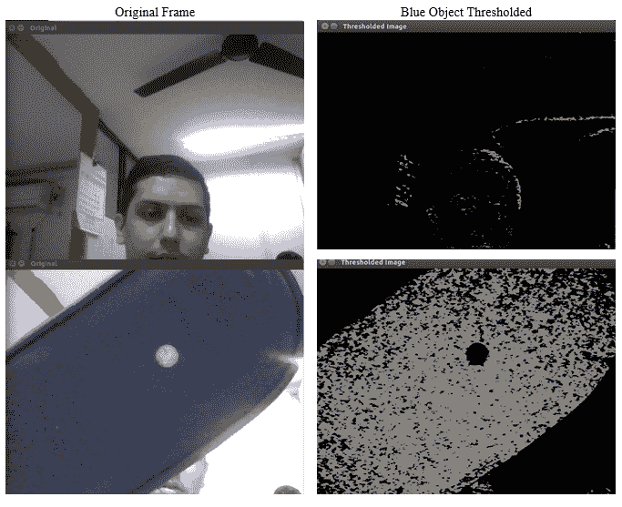

从结果可以看出，当帧中不包含任何蓝色对象时，掩码几乎为黑色；而在下面的帧中，当蓝色对象进入画面时，该部分变为白色。这种方法仅在背景不包含对象颜色时才会有效。

# 基于形状的对象检测与跟踪

对象的形状也可以作为全局特征来检测具有独特形状的对象。这个形状可以是直线、多边形、圆形或任何其他不规则形状。对象边界、边缘和轮廓可以用来检测具有特定形状的对象。在本节中，我们将使用 Canny 边缘检测算法和 Hough 变换来检测两个规则形状，即直线和圆形。

# Canny 边缘检测

在上一章中，我们看到了各种高通滤波器，这些滤波器可以用作边缘检测器。在本节中，我们使用 OpenCV 和 CUDA 实现了结合高斯滤波、梯度查找、非极大值抑制和阈值滞后的 Canny 边缘检测算法。正如上一章所解释的，高通滤波器对噪声非常敏感。在 Canny 边缘检测中，在检测边缘之前先进行高斯平滑，这使得它对噪声的敏感性降低。它还在检测边缘后有一个非极大值抑制阶段，以从结果中去除不必要的边缘。

Canny 边缘检测是一个计算密集型任务，难以用于实时应用。算法的 CUDA 版本可以用来加速它。实现 Canny 边缘检测算法的代码描述如下：

```py
#include <cmath>
#include <iostream>
#include "opencv2/opencv.hpp"

using namespace std;
using namespace cv;
using namespace cv::cuda;

int main()
{
  Mat h_image = imread("images/drawing.JPG",0);
  if (h_image.empty())
  {
    cout << "can not open image"<< endl;
    return -1;
  }
  GpuMat d_edge,d_image;
  Mat h_edge;
  d_image.upload(h_image);
  cv::Ptr<cv::cuda::CannyEdgeDetector> Canny_edge = cv::cuda::createCannyEdgeDetector(2.0, 100.0, 3, false);
  Canny_edge->detect(d_image, d_edge);
  d_edge.download(h_edge);
  imshow("source", h_image);
  imshow("detected edges", h_edge);
  waitKey(0);

  return 0;
}
```

OpenCV 和 CUDA 提供了`createCannyEdgeDetector`类用于 Canny 边缘检测。创建此类的对象时，可以传递许多参数。前两个参数是阈值滞后的低阈值和高阈值。如果某一点的强度梯度大于最大阈值，则将其分类为边缘点。如果梯度小于低阈值，则该点不是边缘点。如果梯度在阈值之间，则根据连通性决定该点是否为边缘点。第三个参数是边缘检测器的孔径大小。最后一个参数是布尔参数，表示是否使用`L2_norm`或`L1_norm`进行梯度幅度计算。`L2_norm`计算成本较高，但更准确。真值表示使用`L2_norm`。代码的输出如下所示：

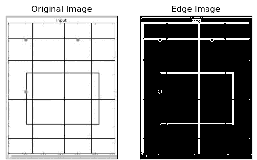

您可以调整下限和上限阈值，以更准确地检测给定图像的边缘。边缘检测是许多计算机视觉应用的重要预处理步骤，Canny 边缘检测被广泛用于此目的。

# 使用霍夫变换进行直线检测

在许多计算机视觉应用中，如车道检测，检测直线非常重要。它还可以用来检测其他规则形状的一部分直线。霍夫变换是计算机视觉中用于检测直线的流行特征提取技术。我们不会详细介绍霍夫变换如何检测直线，但我们将看到它如何在 OpenCV 和 CUDA 中实现。实现霍夫变换进行直线检测的代码如下：

```py
#include <cmath>
#include <iostream>
#include "opencv2/opencv.hpp"

using namespace std;
using namespace cv;
using namespace cv::cuda;

int main()
{
  Mat h_image = imread("images/drawing.JPG",0);
  if (h_image.empty())
  {
    cout << "can not open image"<< endl;
    return -1;
  }

  Mat h_edge;
  cv::Canny(h_image, h_edge, 100, 200, 3);

  Mat h_imagec;
  cv::cvtColor(h_edge, h_imagec, COLOR_GRAY2BGR);
  Mat h_imageg = h_imagec.clone();
  GpuMat d_edge, d_lines;
  d_edge.upload(h_edge);
  {
    const int64 start = getTickCount();
    Ptr<cuda::HoughSegmentDetector> hough = cuda::createHoughSegmentDetector(1.0f, (float) (CV_PI / 180.0f), 50, 5);
    hough->detect(d_edge, d_lines);

    const double time_elapsed = (getTickCount() - start) / getTickFrequency();
    cout << "GPU Time : " << time_elapsed * 1000 << " ms" << endl;
    cout << "GPU FPS : " << (1/time_elapsed) << endl;
  }
  vector<Vec4i> lines_g;
  if (!d_lines.empty())
  {
    lines_g.resize(d_lines.cols);
    Mat h_lines(1, d_lines.cols, CV_32SC4, &lines_g[0]);
    d_lines.download(h_lines);
  }
  for (size_t i = 0; i < lines_g.size(); ++i)
  {
    Vec4i line_point = lines_g[i];
    line(h_imageg, Point(line_point[0], line_point[1]), Point(line_point[2], line_point[3]), Scalar(0, 0, 255), 2, LINE_AA);
  }

  imshow("source", h_image);
  imshow("detected lines [GPU]", h_imageg);
  waitKey(0);
  return 0;
}
```

OpenCV 提供了`createHoughSegmentDetector`类用于实现霍夫变换。它需要一个图像的边缘图作为输入。因此，使用 Canny 边缘检测器从图像中检测边缘。Canny 边缘检测器的输出上传到设备内存以进行 GPU 计算。正如上一节所讨论的，边缘也可以在 GPU 上计算。

创建了`createHoughSegmentDetector`对象。它需要许多参数。第一个参数表示在霍夫变换中使用的参数`r`的分辨率，通常取 1 像素。第二个参数是参数 theta 的弧度分辨率，通常取 1 弧度或π/180。第三个参数是需要形成线条的最小点数，通常取 50 像素。最后一个参数是考虑为同一直线的两个点之间的最大间隔，通常取 5 像素。

创建的对象的检测方法用于检测直线。它需要两个参数。第一个参数是要检测边缘的图像，第二个参数是存储检测到的线条点的数组。该数组包含检测到的线条的起始和结束(x,y)点。使用 OpenCV 的线条函数通过`for`循环迭代该数组，在图像上绘制单个线条。最终图像使用`imshow`函数显示。

霍夫变换是一个数学密集型步骤。为了展示 CUDA 的优势，我们将实现 CPU 和 CUDA 的相同算法，并比较它们的性能。以下是对 CPU 霍夫变换的代码：

```py
Mat h_imagec; 
vector<Vec4i> h_lines;
{
  const int64 start = getTickCount();
  HoughLinesP(h_edge, h_lines, 1, CV_PI / 180, 50, 60, 5);
  const double time_elapsed = (getTickCount() - start) / getTickFrequency();
  cout << "CPU Time : " << time_elapsed * 1000 << " ms" << endl;
  cout << "CPU FPS : " << (1/time_elapsed) << endl;
}

for (size_t i = 0; i < h_lines.size(); ++i)
{
  Vec4i line_point = h_lines[i];
  line(h_imagec, Point(line_point[0], line_point[1]), Point(line_point[2], line_point[3]), Scalar(0, 0, 255), 2, LINE_AA);
}
imshow("detected lines [CPU]", h_imagec);
```

使用`HoughLinesP`函数在 CPU 上通过概率霍夫变换检测线条。前两个参数是源图像和存储输出线条点的数组。第三个和第四个参数是`r`和 theta 的分辨率。第五个参数是表示线条的最小交点数的阈值。第六个参数表示形成线条所需的最小点数。最后一个参数表示考虑在相同线条上的点的最大间隔。

函数返回的数组使用`for`循环迭代，以在原始图像上显示检测到的线条。GPU 和 CPU 函数的输出如下：

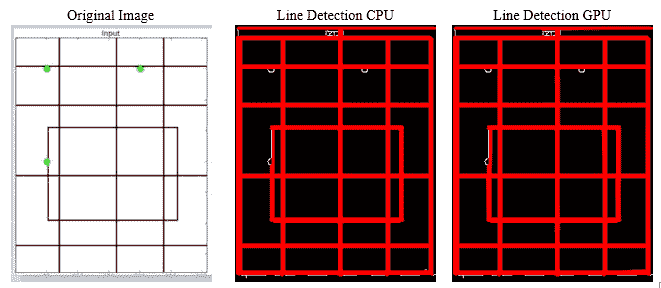

以下截图显示了 GPU 和 CPU 代码在霍夫变换性能上的比较：

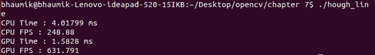

在 CPU 上处理单个图像大约需要 4 毫秒，在 GPU 上需要 1.5 毫秒，这在 CPU 上相当于 248 FPS，在 GPU 上相当于 632 FPS，几乎是 GPU 上 2.5 倍的提升。

# 圆检测

霍夫变换也可以用于圆检测。它可以用于许多应用，如球检测和跟踪以及硬币检测等，在这些应用中，对象是圆形的。OpenCV 和 CUDA 提供了一个类来实现这一点。以下是用霍夫变换进行硬币检测的代码：

```py
#include "opencv2/opencv.hpp"
#include <iostream>

using namespace cv;
using namespace std;

int main(int argc, char** argv)
{
  Mat h_image = imread("images/eight.tif", IMREAD_COLOR);
  Mat h_gray;
  cvtColor(h_image, h_gray, COLOR_BGR2GRAY);
  cuda::GpuMat d_gray,d_result;
  std::vector<cv::Vec3f> d_Circles;
cv::Ptr<cv::cuda::HoughCirclesDetector> detector = cv::cuda::createHoughCirclesDetector(1, 100, 122, 50, 1, max(h_image.size().width, h_image.size().height));
  d_gray.upload(h_gray);
  detector->detect(d_gray, d_result);
  d_Circles.resize(d_result.size().width);
  if (!d_Circles.empty())
    d_result.row(0).download(cv::Mat(d_Circles).reshape(3, 1));

  cout<<"No of circles: " <<d_Circles.size() <<endl;
  for( size_t i = 0; i < d_Circles.size(); i++ )
  {
    Vec3i cir = d_Circles[i];
    circle( h_image, Point(cir[0], cir[1]), cir[2], Scalar(255,0,0), 2, LINE_AA);
  }
  imshow("detected circles", h_image);
  waitKey(0);

  return 0;
}
```

有一个`createHoughCirclesDetector`类用于检测圆形物体。创建了该类的对象。在创建该类的对象时可以提供许多参数。第一个参数是`dp`，表示累加器分辨率与图像分辨率的倒数，通常取为 1。第二个参数是检测到的圆心之间的最小距离。第三个参数是 Canny 阈值，第四个参数是累加器阈值。第五和第六个参数是要检测的圆的最小和最大半径。

圆心之间的最小距离取为`100`像素。您可以尝试调整这个值。如果这个值减小，那么原始图像上会错误地检测到许多圆，而如果这个值增加，那么一些真正的圆可能会被错过。最后两个参数，即最小和最大半径，如果不知道确切的尺寸，可以取为`0`。在前面的代码中，它被设置为`1`和图像的最大尺寸，以检测图像中的所有圆。程序输出如下：

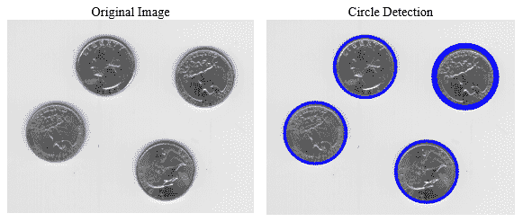

Hough 变换对高斯噪声和椒盐噪声非常敏感。因此，在应用 Hough 变换之前，有时最好先使用高斯和中值滤波器对图像进行预处理。这将给出更准确的结果。

总结来说，我们使用了 Hough 线变换和圆变换来检测具有规则形状的物体。轮廓和凸性也可以用于形状检测。这些功能在 OpenCV 中可用，但 CUDA 实现中不可用。您将不得不开发这些函数的自己的版本。

# 关键点检测器和描述符

到目前为止，我们使用了全局特征，如颜色和形状来检测物体。这些特征易于计算，快速，并且需要的内存量小，但它们只能在已有关于物体的某些信息的情况下使用。如果没有这些信息，则使用局部特征，这些特征需要更多的计算和内存，但它们更准确。在本节中，解释了寻找局部特征的多种算法。它们也被称为关键点检测器。关键点是表征图像的点，可以用来精确地定义一个物体。

# 来自加速区域测试（FAST）特征检测器的特征

FAST 算法用于从图像中检测角点作为关键点。它通过对每个像素应用段测试来检测角点。它考虑像素周围的 16 像素圆。如果在半径为 16 的圆中有连续的*n*个点，其强度大于*Ip+t*或小于*Ip-t*，则该像素被认为是角点。*Ip*是像素*p*的强度，*t*是选定的阈值。

有时，不是检查半径内的所有点，而是检查几个选定的点以确定强度值来决定角落点。这加速了 FAST 算法的性能。FAST 提供了可以作为关键点利用的角落点来检测对象。它是旋转不变的，因为即使对象旋转，对象的角落也会保持不变。FAST 不是尺度不变的，因为尺寸的增加可能会导致强度值的平滑过渡，而不是在角落处的尖锐过渡。

OpenCV 和 CUDA 提供了一个高效实现 FAST 算法的方法。以下是用 FAST 算法检测关键点的程序：

```py
#include <iostream>
#include "opencv2/opencv.hpp"

using namespace cv;
using namespace std;

int main()
{
  Mat h_image = imread( "images/drawing.JPG", 0 );

  //Detect the key-points using FAST Detector
  cv::Ptr<cv::cuda::FastFeatureDetector> detector = cv::cuda::FastFeatureDetector::create(100,true,2);
  std::vector<cv::key point> key-points;
  cv::cuda::GpuMat d_image;
  d_image.upload(h_image);
  detector->detect(d_image, key-points);
  cv::drawkey-points(h_image,key-points,h_image);
  //Show detected key-points
  imshow("Final Result", h_image );
  waitKey(0);
  return 0;
}
```

OpenCV 和 CUDA 提供了一个`FastFeatureDetector`类来实现 FAST 算法。这个类的对象是通过类的 create 方法创建的。它需要三个参数。第一个参数是要用于 FAST 算法的强度阈值。第二个参数指定是否使用非最大抑制。它是一个布尔值，可以指定为`true`或`false`。第三个参数表示用于计算邻域的 FAST 方法。有三个方法，`cv2.FAST_FEATURE_DETECTOR_TYPE_5_8`、`cv2.FAST_FEATURE_DETECTOR_TYPE_7_12`和`cv2.FAST_FEATURE_DETECTOR_TYPE_9_16`，可以作为标志`0`、`1`或`2`指定。

创建的对象的 detect 方法用于检测关键点。它需要一个输入图像和一个存储关键点的向量作为参数。可以使用`drawkey-points`函数在原始图像上绘制计算出的关键点。它需要源图像、关键点的向量和目标图像作为参数。

可以改变强度阈值以检测不同数量的关键点。如果阈值低，则更多的关键点会通过分割测试并被归类为关键点。随着阈值的增加，检测到的关键点数量将逐渐减少。同样，如果非最大抑制是假的，则在单个角落点可能会检测到多个关键点。以下是代码的输出：

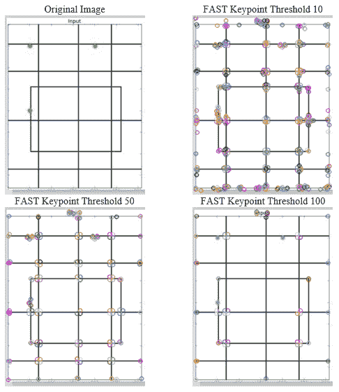

从输出结果可以看出，随着阈值从 10 增加到 50 和 100，关键点的数量减少。这些关键点可以用于检测查询图像中的对象。

# 定向 FAST 和旋转 BRIEF (ORB) 特征检测

ORB 是一个非常高效的特徵检测和描述算法。它是特征检测的 FAST 算法和特征描述的**二进制鲁棒独立基本特征**（**BRIEF**）算法的组合。它为广泛用于对象检测的 SURF 和 SIFT 算法提供了一个高效的替代方案。由于它们是专利的，使用它们需要付费。ORB 在无需付费的情况下匹配 SIFT 和 SURF 的性能。

OpenCV 和 CUDA 提供了一个易于实现的 ORB 算法的 API。实现 ORB 算法的代码如下：

```py
#include <iostream>
#include "opencv2/opencv.hpp"

using namespace cv;
using namespace std;

int main()
{
  Mat h_image = imread( "images/drawing.JPG", 0 );
  cv::Ptr<cv::cuda::ORB> detector = cv::cuda::ORB::create();
  std::vector<cv::key point> key-points;
  cv::cuda::GpuMat d_image;
  d_image.upload(h_image);
  detector->detect(d_image, key-points);
  cv::drawkey-points(h_image,key-points,h_image);
  imshow("Final Result", h_image );
  waitKey(0);
  return 0;
}
```

`ORB`类的对象是通过`create`方法创建的。此方法的所有参数都是可选的，因此我们使用了它的默认值。创建的对象的`detect`方法用于从图像中检测关键点。它需要一个输入图像和关键点向量的向量，输出将存储在这些参数中。使用`drawkey-points`函数在图像上绘制检测到的关键点。前述代码的输出如下：

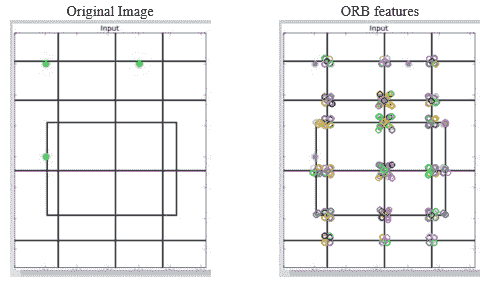

`ORB`类还提供了一个方法来计算所有关键点的描述符。这些描述符可以准确地描述对象，并可用于从图像中检测对象。这些描述符也可以用于对对象进行分类。

# 加速鲁棒特征检测和匹配

SURF 通过基于简单二维盒滤波器的计算来近似高斯拉普拉斯。使用积分图像可以轻松计算与盒滤波器的卷积，这提高了算法的性能。SURF 依赖于 Hessian 矩阵的行列式来处理尺度和位置。Hessian 矩阵的近似行列式可以表示为：

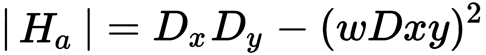

其中，*w*是滤波器响应的相对权重，用于平衡行列式的表达式。*Dx*、*Dy*是拉普拉斯算子在*X*和*Y*方向的结果。

SURF 在水平和垂直方向上使用小波响应，使用积分图像方法进行方向分配。还应用了适当的 Gaussian 权重。通过计算角度为 60 度的滑动方向窗口内所有响应的总和来估计主导方向。

对于特征描述，SURF 在水平和垂直方向上使用 Haar 小波响应。这是对图像中的所有子区域进行计算的结果，从而得到一个具有 64 个维度的 SURF 特征描述符。维度越低，计算和匹配的速度越快。为了提高精度，SURF 特征描述符还有一个扩展的 128 维版本。SURF 是旋转不变和尺度不变的。

与使用 128 维特征向量的 SIFT 相比，SURF 具有更高的处理速度，因为它使用 64 方向的特性向量。SURF 擅长处理模糊和旋转的图像，但不擅长处理视点和光照变化。

OpenCV 和 CUDA 提供了一个 API 来计算 SURF 关键点和描述符。我们还将看到如何使用这些 API 在查询图像中检测对象。SURF 特征检测和匹配的代码如下：

```py
#include <stdio.h>
#include <iostream>
#include "opencv2/opencv.hpp"
#include "opencv2/features2d.hpp"
#include "opencv2/xfeatures2d.hpp"
#include "opencv2/xfeatures2d/nonfree.hpp"
#include "opencv2/xfeatures2d/cuda.hpp"

using namespace cv;
using namespace cv::xfeatures2d;
using namespace std;

int main( int argc, char** argv )
{
  Mat h_object_image = imread( "images/object1.jpg", 0 ); 
  Mat h_scene_image = imread( "images/scene1.jpg", 0 );
  cuda::GpuMat d_object_image;
  cuda::GpuMat d_scene_image;
  cuda::GpuMat d_key-points_scene, d_key-points_object; 
  vector< key point > h_key-points_scene, h_key-points_object;
  cuda::GpuMat d_descriptors_scene, d_descriptors_object;
  d_object_image.upload(h_object_image);
  d_scene_image.upload(h_scene_image);
  cuda::SURF_CUDA surf(150);
  surf( d_object_image, cuda::GpuMat(), d_key-points_object, d_descriptors_object );
surf( d_scene_image, cuda::GpuMat(), d_key-points_scene, d_descriptors_scene );

Ptr< cuda::DescriptorMatcher > matcher = cuda::DescriptorMatcher::createBFMatcher();
vector< vector< DMatch> > d_matches;
matcher->knnMatch(d_descriptors_object, d_descriptors_scene, d_matches, 3);
surf.downloadkey-points(d_key-points_scene, h_key-points_scene);
surf.downloadkey-points(d_key-points_object, h_key-points_object);
std::vector< DMatch > good_matches;
for (int k = 0; k < std::min(h_key-points_object.size()-1, d_matches.size()); k++)
{
  if ( (d_matches[k][0].distance < 0.75*(d_matches[k][1].distance)) &&
      ((int)d_matches[k].size() <= 2 && (int)d_matches[k].size()>0) )
  {
    good_matches.push_back(d_matches[k][0]);
  }
}
std::cout << "size:" <<good_matches.size();
Mat h_image_result;
drawMatches( h_object_image, h_key-points_object, h_scene_image, h_key-points_scene,
      good_matches, h_image_result, Scalar::all(-1), Scalar::all(-1),
      vector<char>(), DrawMatchesFlags::DEFAULT );
imshow("Good Matches & Object detection", h_image_result);
waitKey(0);
return 0;
}
```

从磁盘读取两张图像。第一张图像包含要检测的对象。第二张图像是要搜索对象的查询图像。我们将从这两张图像中计算 SURF 特征，然后匹配这些特征以从查询图像中检测对象。

OpenCV 提供了用于计算 SURF 特征的 `SURF_CUDA` 类。该类的对象被创建。它需要一个 Hessian 阈值作为参数。这里取值为 `150`。这个阈值决定了 Hessian 行列式计算输出的点必须有多大，才能被认为是关键点。更大的阈值值将导致更少但更显著的兴趣点，而较小的值将导致更多但不太显著的点。可以根据应用来选择。

这个 `surf` 对象用于从对象和查询图像中计算关键点和描述符。图像、图像的数据类型、存储关键点的向量以及描述符作为参数传递。为了匹配查询图像中的对象，需要匹配两张图像中的描述符。OpenCV 提供了不同的匹配算法来实现这个目的，如 Brute-Force 匹配器和 **快速近似最近邻库**（**FLANN**）匹配器。

程序中使用的是 Brute-Force 匹配器；这是一个简单的方法。它使用某种距离计算方法，将对象中与查询图像中所有其他特征匹配的特征描述符取出来。它返回最佳匹配关键点，或使用最近邻算法通过 `matcher` 类的 `knnMatch` 方法返回最佳 `k` 个匹配。`knnMatch` 方法需要两组描述符以及最近邻的数量。在代码中取值为 `3`。

从 `knnMatch` 方法返回的匹配点中提取出良好的匹配关键点。这些良好的匹配是通过使用原始论文中描述的比率测试方法找到的。这些良好的匹配用于从场景中检测对象。

使用 `drawMatches` 函数在两张图像的匹配良好点之间画线。它需要许多参数。第一个参数是源图像，第二个参数是源图像的关键点，第三个参数是第二张图像，第四个参数是第二张图像的关键点，第五个参数是输出图像。第六个参数是线条和关键点的颜色。这里取值为 `Scalar::all(-1)`，表示将随机选择颜色。第七个参数是关键点的颜色，这些关键点没有匹配。它也取值为 `Scalar::all(-1)`，表示将随机选择颜色。最后两个参数指定了绘制匹配的掩码和标志设置。使用空掩码，以便绘制所有匹配。

这些匹配可以用来在检测到的物体周围绘制边界框，这将定位场景中的物体。绘制边界框的代码如下：

```py
std::vector<Point2f> object;
std::vector<Point2f> scene;
for (int i = 0; i < good_matches.size(); i++) {
  object.push_back(h_key-points_object[good_matches[i].queryIdx].pt);
  scene.push_back(h_key-points_scene[good_matches[i].trainIdx].pt);
}
Mat Homo = findHomography(object, scene, RANSAC);
std::vector<Point2f> corners(4);
std::vector<Point2f> scene_corners(4);
corners[0] = Point(0, 0);
corners[1] = Point(h_object_image.cols, 0);
corners[2] = Point(h_object_image.cols, h_object_image.rows);
corners[3] = Point(0, h_object_image.rows);
perspectiveTransform(corners, scene_corners, Homo);
line(h_image_result, scene_corners[0] + Point2f(h_object_image.cols, 0),scene_corners[1] + Point2f(h_object_image.cols, 0), Scalar(255, 0, 0), 4);
line(h_image_result, scene_corners[1] + Point2f(h_object_image.cols, 0),scene_corners[2] + Point2f(h_object_image.cols, 0),Scalar(255, 0, 0), 4);
line(h_image_result, scene_corners[2] + Point2f(h_object_image.cols, 0),scene_corners[3] + Point2f(h_object_image.cols, 0),Scalar(255, 0, 0), 4);
line(h_image_result, scene_corners[3] + Point2f(h_object_image.cols, 0),scene_corners[0] + Point2f(h_object_image.cols, 0),Scalar(255, 0, 0), 4);
```

OpenCV 提供了`findHomography`函数，用于根据良好的匹配搜索场景中物体的位置、方向和比例。前两个参数是从物体和场景图像中提取的良好匹配的关键点。**随机样本一致性**（**RANSAC**）方法作为参数之一传递，用于找到最佳平移矩阵。

找到这个平移矩阵后，使用`perspectiveTransform`函数来找到物体。它需要一个四角点和平移矩阵作为参数。这些变换点用于在检测到的物体周围绘制边界框。用于查找特征和匹配物体的 SURF 程序的输出如下：

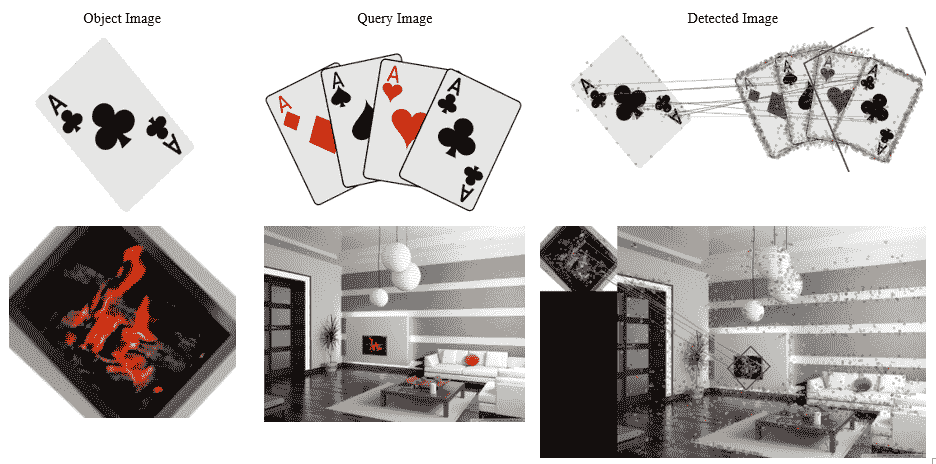

该图包含物体图像、查询图像和检测图像。从前面的图像可以看出，SURF 可以准确地确定物体的位置，即使物体被旋转。尽管有时它可能会检测到错误特征。可以通过改变 Hessian 阈值和测试比率来找到最佳匹配。

因此，总结一下，在本节中，我们看到了 FAST、ORB 和 SURF 关键点检测算法。我们还看到了如何使用这些点通过使用 SURF 特征作为示例来匹配和定位图像中的物体。您也可以尝试使用 FAST 和 ORB 特征来完成相同的工作。在下一节中，我们将详细讨论用于从图像中检测面部和眼睛的 Haar 级联。

# 使用 Haar 级联进行物体检测

Haar 级联使用矩形特征来检测物体。它使用不同大小的矩形来计算不同的线和边缘特征。矩形包含一些黑白区域，如图所示，它们在图像中的不同位置居中：

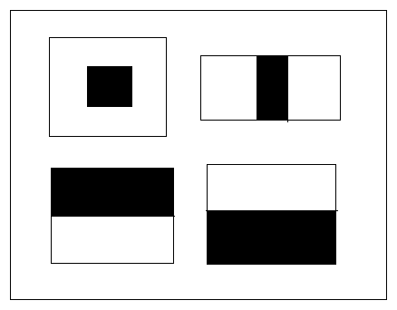

Haar-like 特征选择算法背后的思想是计算矩形内部白色像素总和与黑色像素总和之间的差异。

这种方法的主要优势是使用积分图像快速进行求和计算。这使得 Haar 级联非常适合实时物体检测。它处理图像所需的时间比之前描述的 SURF 等算法少。由于计算量较小且内存占用较少，该算法也可以在嵌入式系统（如 Raspberry Pi）上实现。它被称为 Haar-like，因为它基于与 Haar 小波相同的原理。Haar 级联在人体检测中广泛使用，包括面部和眼部检测等部分。它还可以用于表情分析。Haar 级联可用于检测车辆等物体。

在本节中，描述了使用 Haar 级联从图像和摄像头中检测人脸和眼睛的方法。Haar 级联是一种机器学习算法，需要对其进行训练以执行特定任务。对于特定应用从头开始训练 Haar 级联是困难的，因此 OpenCV 提供了一些训练好的 XML 文件，可用于检测对象。这些 XML 文件位于 OpenCV 或 CUDA 安装的`opencv\data\haarcascades_cuda`文件夹中。

# 使用 Haar 级联进行人脸检测

在本节中，我们将使用 Haar 级联从图像和实时摄像头中检测人脸。使用 Haar 级联从图像中检测人脸的代码如下：

```py
#include "opencv2/objdetect/objdetect.hpp"
#include "opencv2/highgui/highgui.hpp"
#include "opencv2/imgproc/imgproc.hpp"
#include "opencv2/cudaobjdetect.hpp" 
#include <iostream>
#include <stdio.h>

using namespace std;
using namespace cv;

int main( )
{
  Mat h_image;
  h_image = imread("images/lena_color_512.tif", 0); 
  Ptr<cuda::CascadeClassifier> cascade = cuda::CascadeClassifier::create("haarcascade_frontalface_alt2.xml");
  cuda::GpuMat d_image;
  cuda::GpuMat d_buf;
  d_image.upload(h_image);
  cascade->detectMultiScale(d_image, d_buf);
  std::vector<Rect> detections;
  cascade->convert(d_buf, detections);
  if (detections.empty())
    std::cout << "No detection." << std::endl;
  cvtColor(h_image,h_image,COLOR_GRAY2BGR);
  for(int i = 0; i < detections.size(); ++i)
  {
    rectangle(h_image, detections[i], Scalar(0,255,255), 5);
  }
  imshow("Result image", h_image);
  waitKey(0); 
  return 0;
}
```

OpenCV 和 CUDA 提供了`CascadeClassifier`类，可用于实现 Haar 级联。使用 create 方法创建该类的对象。它需要加载训练好的 XML 文件的文件名。创建的对象有`detectMultiScale`方法，可以从图像中检测到多个尺度的对象。它需要一个图像文件和一个`Gpumat`数组作为参数来存储输出结果。使用`CascadeClassifier`对象的 convert 方法将此`gpumat`向量转换为标准矩形向量。此转换向量包含绘制检测到的对象矩形坐标。

`detectMultiScale`函数有许多参数可以在调用函数之前修改。这些包括用于指定每次图像缩放时图像大小将减少多少的`scaleFactor`，以及指定每个矩形应保留的最小邻居数`minNeighbors`；`minSize`指定最小对象大小，`maxSize`指定最大对象大小。所有这些参数都有默认值，所以在正常情况下通常不需要修改。如果我们想更改它们，那么在调用`detectMultiscale`函数之前可以使用以下代码：

```py
cascade->setMinNeighbors(0);
cascade->setScaleFactor(1.01);
```

第一个函数将设置最小邻居数为`0`，第二个函数将在每次缩放后通过一个因子`1.01`减小图像大小。缩放因子对于检测不同大小物体的检测非常重要。如果它很大，则算法完成所需时间会更短，但可能有些面部无法检测到。如果它很小，则算法完成所需时间会更长，并且会更准确。前述代码的输出如下：

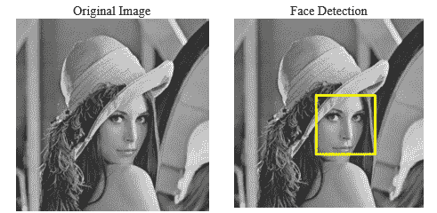

# 从视频中

Haar 级联的相同概念可以用于从视频中检测人脸。检测人脸的代码包含在`while`循环中，以便在视频的每一帧中检测到人脸。从摄像头进行人脸检测的代码如下：

```py
#include <iostream>
#include <opencv2/opencv.hpp>
using namespace cv;
using namespace std;

int main()
{
  VideoCapture cap(0);
  if (!cap.isOpened()) {
    cerr << "Can not open video source";
    return -1;
  }
  std::vector<cv::Rect> h_found;
  cv::Ptr<cv::cuda::CascadeClassifier> cascade = cv::cuda::CascadeClassifier::create("haarcascade_frontalface_alt2.xml");
  cv::cuda::GpuMat d_frame, d_gray, d_found;
  while(1)
  {
    Mat frame;
    if ( !cap.read(frame) ) {
      cerr << "Can not read frame from webcam";
      return -1;
    }
    d_frame.upload(frame);
    cv::cuda::cvtColor(d_frame, d_gray, cv::COLOR_BGR2GRAY);

    cascade->detectMultiScale(d_gray, d_found);
    cascade->convert(d_found, h_found);

    for(int i = 0; i < h_found.size(); ++i)
    {
      rectangle(frame, h_found[i], Scalar(0,255,255), 5);
    }

    imshow("Result", frame);
    if (waitKey(1) == 'q') {
      break;
    }
  }

  return 0;
}
```

初始化摄像头并逐个捕获摄像头帧。此帧上传到设备内存中进行 GPU 处理。通过使用类的`create`方法创建`CascadeClassifier`类的对象。创建对象时提供面部检测的 XML 文件作为参数。在`while`循环内部，对每个帧应用`detectMultiscale`方法，以便在每帧中检测不同大小的面部。使用`convert`方法将检测到的位置转换为矩形向量。然后使用`for`循环迭代此向量，以便使用`rectangle`函数在所有检测到的面部上绘制边界框。程序输出如下：

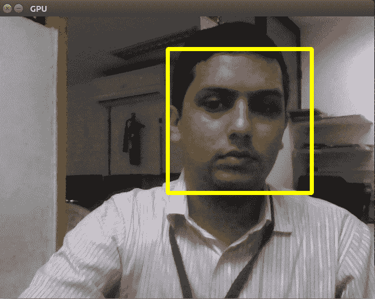

# 使用 Haar 级联进行眼睛检测

本节将描述在检测人类眼睛中使用 Haar 级联的方法。用于眼睛检测的已训练 Haar 级联的 XML 文件位于 OpenCV 安装目录中。此文件用于检测眼睛。其代码如下：

```py
#include <iostream>
#include <stdio.h>
 #include <opencv2/opencv.hpp>

using namespace std;
using namespace cv;

int main( )
{
  Mat h_image;
  h_image = imread("images/lena_color_512.tif", 0); 
  Ptr<cuda::CascadeClassifier> cascade = cuda::CascadeClassifier::create("haarcascade_eye.xml");
  cuda::GpuMat d_image;
  cuda::GpuMat d_buf;
  d_image.upload(h_image);
  cascade->setScaleFactor(1.02);
  cascade->detectMultiScale(d_image, d_buf);
  std::vector<Rect> detections;
  cascade->convert(d_buf, detections);
  if (detections.empty())
    std::cout << "No detection." << std::endl;
    cvtColor(h_image,h_image,COLOR_GRAY2BGR);
    for(int i = 0; i < detections.size(); ++i)
    {
      rectangle(h_image, detections[i], Scalar(0,255,255), 5);
    }

    imshow("Result image", h_image);

    waitKey(0); 
    return 0;
  }
}
```

代码与面部检测的代码类似。这是使用 Haar 级联的优势。如果给定对象的已训练 Haar 级联的 XML 文件可用，则相同的代码可以在所有应用中工作。只需在创建`CascadeClassifier`类的对象时更改 XML 文件的名称。在前面的代码中，使用了用于眼睛检测的已训练 XML 文件`haarcascade_eye.xml`。其他代码是自解释的。缩放因子设置为`1.02`，以便在每次缩放时图像大小将减少`1.02`。

眼睛检测程序的输出如下：

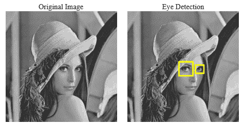

由于捕获图像时采用的角度不同，眼睛的大小各不相同，但 Haar 级联仍然能够有效地定位两只眼睛。代码的性能也可以进行测量，以查看其工作速度有多快。

总结来说，在本节中，我们展示了使用 Haar 级联进行面部和眼睛检测的应用。一旦有了训练文件，实现起来非常简单，它是一个非常强大的算法。它在内存和处理能力有限的嵌入式或移动环境中被广泛使用。

# 使用背景减法进行对象跟踪

背景减法是从一系列视频帧中分离前景对象与背景的过程。它在对象检测和跟踪应用中被广泛使用，以去除背景部分。背景减法分为四个步骤：

1.  图像预处理

1.  背景建模

1.  前景检测

1.  数据验证

图像预处理始终执行以去除图像中存在的任何类型的噪声。第二步是建模背景，以便它可以与前景分离。在某些应用中，视频的第一帧被用作背景，并且不进行更新。通过计算每一帧与第一帧之间的绝对差值来分离前景和背景。

在其他技术中，背景是通过取算法看到的所有帧的平均值或中值来建模的，并且该背景与前景分离。这种方法对于光照变化将更加稳健，并且会产生比第一种方法更动态的背景。还可以使用更统计密集的模型，如使用帧历史记录的高斯模型和支持向量模型来建模背景。

第三步是通过计算当前帧与背景之间的绝对差值来将前景从建模的背景中分离出来。这个绝对差值与设定的阈值进行比较，如果它大于阈值，则认为物体是移动的；如果它小于阈值，则认为物体是静止的。

# 高斯混合（MoG）方法

MoG 是一种广泛使用的背景减法方法，用于根据高斯混合将前景从背景中分离出来。背景从帧序列中持续更新。使用 K 个高斯分布的混合来分类像素为前景或背景。帧的时间序列也被加权以改进背景建模。持续变化的强度被分类为前景，而静态的强度被分类为背景。

OpenCV 和 CUDA 提供了一个简单的 API 来实现 MoG 背景减法。相应的代码如下：

```py
#include <iostream>
#include <string>
#include "opencv2/opencv.hpp"
using namespace std;
using namespace cv;
using namespace cv::cuda;
int main()
{
  VideoCapture cap("abc.avi");
  if (!cap.isOpened())
  {
    cerr << "can not open camera or video file" << endl;
    return -1;
  }
  Mat frame;
  cap.read(frame);
  GpuMat d_frame;
  d_frame.upload(frame);
  Ptr<BackgroundSubtractor> mog = cuda::createBackgroundSubtractorMOG();
  GpuMat d_fgmask,d_fgimage,d_bgimage;
  Mat h_fgmask,h_fgimage,h_bgimage;
  mog->apply(d_frame, d_fgmask, 0.01);
  while(1)
  {
    cap.read(frame);
    if (frame.empty())
      break;
    d_frame.upload(frame);
    int64 start = cv::getTickCount();
    mog->apply(d_frame, d_fgmask, 0.01);
    mog->getBackgroundImage(d_bgimage);
    double fps = cv::getTickFrequency() / (cv::getTickCount() - start);
    std::cout << "FPS : " << fps << std::endl;
    d_fgimage.create(d_frame.size(), d_frame.type());
    d_fgimage.setTo(Scalar::all(0));
    d_frame.copyTo(d_fgimage, d_fgmask);
    d_fgmask.download(h_fgmask);
    d_fgimage.download(h_fgimage);
    d_bgimage.download(h_bgimage);
    imshow("image", frame);
    imshow("foreground mask", h_fgmask);
    imshow("foreground image", h_fgimage);
    imshow("mean background image", h_bgimage);
    if (waitKey(1) == 'q')
      break;
  }

  return 0;
}
```

使用`createBackgroundSubtractorMOG`类来创建用于 MoG 实现的对象。在创建对象时可以提供一些可选参数。这些参数包括`history`、`nmixtures`、`backgroundRatio`和`noiseSigma`。`history`参数表示用于建模背景的先前帧的数量。其默认值是 200。`nmixture`参数指定用于分离像素的高斯混合的数量。其默认值是 5。您可以根据应用程序的需要调整这些值。

创建的对象的`apply`方法用于从第一帧创建前景掩码。它需要一个输入图像和一个图像数组作为输入来存储前景掩码和学习率。在`while`循环的每一帧之后，都会持续更新前景掩码和背景图像。`getBackgroundImage`函数用于获取当前的背景模型。

前景掩码用于创建一个前景图像，指示哪些对象目前正在移动。它基本上是逻辑的，在原始帧和前景掩码之间操作。前景掩码、前景图像和建模的背景在每帧之后下载到主机内存，以便在屏幕上显示。

MoG 模型应用于 PETS 2009 数据集的视频，该数据集广泛用于行人检测。它具有静态背景，视频中有人员在移动。视频的两个不同帧的输出如下：

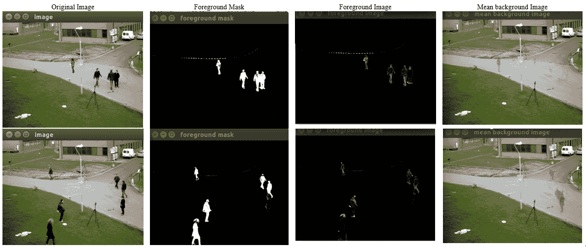

如所示，MoG 非常有效地建模背景。只有移动的人存在于前景掩码和前景图像中。此前景图像可用于检测到的对象的进一步处理。如果一个人停止行走，那么他将成为背景的一部分，如第二帧的结果所示。因此，此算法只能用于检测移动对象。它不会考虑静态对象。MoG 在帧率方面的性能如下：

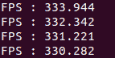

每帧更新帧率。可以看出，它大约是每秒 330 帧，这非常高，易于用于实时应用。OpenCV 和 CUDA 还提供了 MoG 的第二版本，可以通过`createBackgroundSubtractorMOG2`类调用。

# GMG 用于背景减法

GMG 算法的名称 GMG 来源于提出该算法的发明者的首字母。该算法是背景估计和每像素贝叶斯分割的组合。它使用贝叶斯推理将背景与前景分开。它还使用帧的历史记录来建模背景。它再次根据帧的时间序列进行加权。新的观测值比旧的观测值加权更多。

OpenCV 和 CUDA 为 GMG 算法的实现提供了与 MoG 类似的 API。实现背景减法的 GMG 算法的代码如下：

```py
#include <iostream>
#include <string>
#include "opencv2/opencv.hpp"
#include "opencv2/core.hpp"
#include "opencv2/core/utility.hpp"
#include "opencv2/cudabgsegm.hpp"
#include "opencv2/cudalegacy.hpp"
#include "opencv2/video.hpp"
#include "opencv2/highgui.hpp"

using namespace std;
using namespace cv;
using namespace cv::cuda;

int main()
{
  VideoCapture cap("abc.avi");
  if (!cap.isOpened())
  {
    cerr << "can not open video file" << endl;
    return -1;
  }
  Mat frame;
  cap.read(frame);
  GpuMat d_frame;
  d_frame.upload(frame);
  Ptr<BackgroundSubtractor> gmg = cuda::createBackgroundSubtractorGMG(40);
  GpuMat d_fgmask,d_fgimage,d_bgimage;
  Mat h_fgmask,h_fgimage,h_bgimage;
  gmg->apply(d_frame, d_fgmask);
  while(1)
  {
    cap.read(frame);
    if (frame.empty())
      break;
    d_frame.upload(frame);
    int64 start = cv::getTickCount();
    gmg->apply(d_frame, d_fgmask, 0.01);
    double fps = cv::getTickFrequency() / (cv::getTickCount() - start);
    std::cout << "FPS : " << fps << std::endl;
    d_fgimage.create(d_frame.size(), d_frame.type());
    d_fgimage.setTo(Scalar::all(0));
    d_frame.copyTo(d_fgimage, d_fgmask);
    d_fgmask.download(h_fgmask);
    d_fgimage.download(h_fgimage);
    imshow("image", frame);
    imshow("foreground mask", h_fgmask);
    imshow("foreground image", h_fgimage);
    if (waitKey(30) == 'q')
      break;
  }
  return 0;
}
```

使用`createBackgroundSubtractorGMG`类创建用于 GMG 实现的对象。在创建对象时可以提供两个参数。第一个参数是用于建模背景的先前帧数。在上述代码中取为`40`。第二个参数是决策阈值，用于将像素分类为前景。其默认值为 0.8。

创建的对象的`apply`方法用于第一帧以创建前景掩码。通过使用帧的历史记录，前景掩码和前景图像在`while`循环内部持续更新。前景掩码用于以类似于 MoG 所示的方式创建前景图像。GMG 算法在相同视频和两个帧上的输出如下：

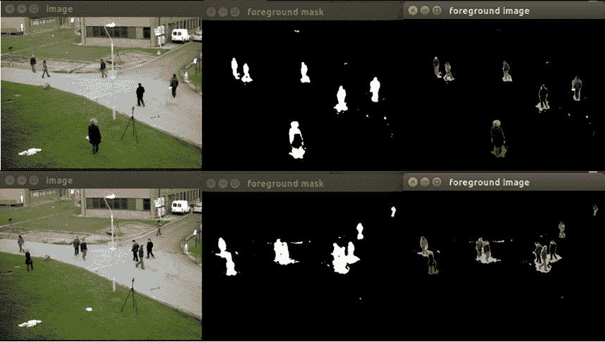

与 MoG 相比，GMG 的输出噪声更大。可以对 GMG 的结果应用形态学开闭操作，以去除结果中存在的阴影噪声。GMG 算法在 FPS 方面的性能如下：

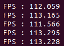

由于它比 MoG 计算量更大，帧率较低，但仍然达到 120 FPS，这比实时性能所需的 30 FPS 要高。

总结来说，在本节中我们看到了两种背景建模和背景减法的方法。与 GMG 算法相比，MoG 算法更快且噪声更少。GMG 算法需要形态学操作来去除结果中存在的噪声。

# 摘要

本章描述了 OpenCV 和 CUDA 在实时目标检测和跟踪应用中的作用。它从目标检测和跟踪的介绍开始，包括在这个过程中遇到的问题和它的应用。不同的特征，如颜色、形状、直方图和其他独特的关键点，如角点，可以用来检测和跟踪图像中的对象。基于颜色的目标检测更容易实现，但要求对象与背景有明显的颜色差异。对于基于形状的目标检测，已经描述了 Canny 边缘检测技术来检测边缘，以及 Hough 变换用于直线和圆的检测。它有许多应用，如土地检测、球跟踪等。颜色和形状是全局特征，更容易计算且需要的内存较少。它们更容易受到噪声的影响。其他算法如 FAST、ORB 和 SURF 已经详细描述，这些算法可以用来从图像中检测关键点，这些关键点可以用来准确描述图像，进而可以用来检测图像中的对象。ORB 是开源的，并且无需成本就能提供与 SURF 相当的结果。SURF 是专利的，但它更快，具有尺度不变性和旋转不变性。已经描述了 Haar 级联，这是一个简单的算法，用于从图像中检测对象，如人脸、眼睛和人体。它可以用于嵌入式系统中的实时应用。本章的最后部分详细描述了背景减法算法，如 MoG 和 GMG，这些算法可以将前景与背景分离。这些算法的输出可以用于目标检测和跟踪。下一章将描述如何将这些应用部署在嵌入式开发板上。

# 问题

1.  编写一个 OpenCV 代码，用于从视频中检测黄色对象。

1.  在哪些情况下，使用颜色进行的目标检测会失败？

1.  为什么 Canny 边缘检测算法比上一章中看到的其他边缘检测算法更好？

1.  可以采取什么措施来降低 Hough 变换的噪声敏感性？

1.  在 FAST 关键点检测器中，阈值的重要性是什么？

1.  在 SURF 检测器中，Hessian 阈值的重要性是什么？

1.  如果 Haar 级联中的尺度因子从 1.01 变为 1.05，那么它将对输出产生什么影响？

1.  比较 MoG 和 GMG 背景减法方法。如何从 GMG 输出中去除噪声？
