# Jetson TX1 开发板简介及在 Jetson TX1 上安装 OpenCV

上一章介绍了使用 OpenCV 和 CUDA 的各种计算机视觉应用。当这些应用需要在实际场景中部署时，就需要一个嵌入式开发板，能够通过利用 OpenCV 和 CUDA 高速处理图像。Nvidia 提供了多个基于 GPU 的开发板，如 Jetson TK1、TX1 和 TX2，它们非常适合高端计算任务，如计算机视觉。本章将介绍其中一个开发板，即 Jetson TX1。还将详细讨论该板可用的特性和应用。CUDA 和 OpenCV 对于计算机视觉应用至关重要，因此本章将详细讨论在 Jetson TX1 上安装它们的步骤。

本章将涵盖以下主题：

+   Jetson TX1 开发板简介

+   Jetson TX1 开发板的特性和应用

+   基本要求和在 Jetson TX1 开发板上安装 JetPack 的步骤

# 技术要求

本章要求对 Linux 操作系统（OS）和网络有良好的理解。它还需要任何 Nvidia GPU 开发板，例如 Jetson TK1、TX1 或 TX2。本章中使用的 JetPack 安装文件可以从以下链接下载：[`developer.nvidia.com/embedded/jetpack`](https://developer.nvidia.com/embedded/jetpack)。

# Jetson TX1 简介

当高端视觉计算和计算机视觉应用需要在实际场景中部署时，就需要嵌入式开发平台，这些平台能够高效地执行计算密集型任务。例如，Raspberry Pi 可以使用 OpenCV 进行计算机视觉应用和摄像头接口功能，但对于实时应用来说非常慢。专注于 GPU 制造的 Nvidia 开发了用于计算密集型任务的模块，这些模块可用于在嵌入式平台上部署计算机视觉应用，包括 Jetson TK1、Jetson TX1 和 Jetson TX2。

Jetson TK1 是一个初步的板，包含 192 个 CUDA 核心，配备 Nvidia Kepler GPU。它是三者中最便宜的。Jetson TX1 在处理速度方面处于中等水平，拥有 256 个 CUDA 核心，采用 Maxwell 架构，运行频率为 998 MHz，同时配备 ARM CPU。Jetson TX2 在处理速度和价格方面都是最高的。它包含 256 个 CUDA 核心，采用 Pascal 架构，运行频率为 1,300 MHz。本章将详细介绍 Jetson TX1。

Jetson TX1 是专为要求较高的嵌入式应用开发的小型模块化系统。它是基于 Linux 的，提供具有万亿次浮点运算性能的超高性能，可用于计算机视觉和深度学习应用。以下照片展示了 Jetson TX1 模块：

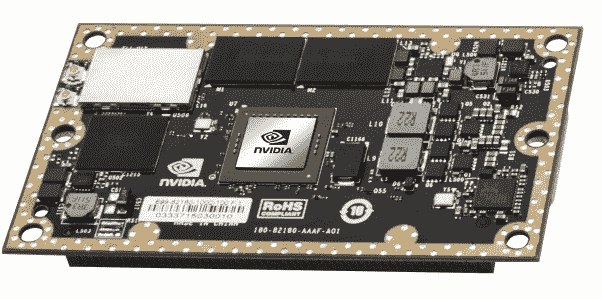

该模块的尺寸为 50 x 87 mm，这使得它很容易集成到任何系统中。Nvidia 还提供了 Jetson TX1 开发板，该板可以快速用于原型设计应用，并包含此 GPU。以下照片展示了整个开发套件：

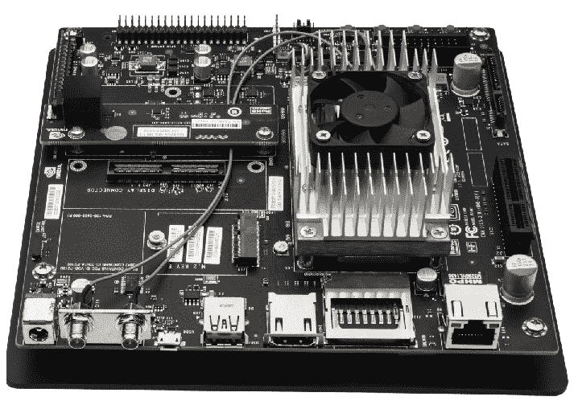

如照片所示，除了 GPU 模块外，开发套件还包含摄像头模块、USB 端口、以太网端口、散热器、风扇和天线。它支持包括 JetPack、Linux for Tegra、CUDA Toolkit、cuDNN、OpenCV 和 VisionWorks 在内的软件生态系统。这使得它非常适合进行深度学习和计算机视觉研究的开发者进行快速原型设计。以下章节将详细介绍 Jetson TX1 开发套件的功能。

# Jetson TX1 的重要特性

Jetson TX1 开发套件具有许多特性，使其非常适合超级计算任务：

+   它是采用 20 nm 技术构建的系统级芯片，包含一个 1.73 GHz 的 ARM Cortex A57 四核 CPU 和一个 998 MHz 的 256 核心 Maxwell GPU。

+   它配备了 4 GB 的 DDR4 内存，数据总线为 64 位，工作速度为 1,600 MHz，相当于 25.6 GB/s。

+   它包含一个 500 万像素的 MIPI CSI-2 摄像头模块。它支持高达六路双通道或三路四通道摄像头，速度为 1,220 MP/s。

+   开发套件还包含一个标准 USB 3.0 类型 A 端口和微型 USB 端口，用于将鼠标、键盘和 USB 摄像头连接到板上。

+   它还配备了以太网端口和 Wi-Fi 连接，用于网络连接。

+   它可以通过 HDMI 端口连接到 HDMI 显示设备。

+   该套件包含一个散热器和风扇，用于在 GPU 设备达到峰值性能时进行冷却。

+   在空闲状态下，它仅消耗 1 瓦特的电力，在正常负载下大约为 8-10 瓦，当模块完全使用时可达 15 瓦。在 5.7 瓦的功耗下，它可以每秒处理 258 张图像，相当于性能/瓦特值为 45。一个普通的 i7 CPU 处理器在 62.5 瓦的功耗下，每秒可以处理 242 张图像，相当于性能/瓦特值为 3.88。因此，Jetson TX1 比 i7 处理器好 11.5 倍。

# Jetson TX1 的应用

Jetson TX1 可用于许多需要计算密集型任务的深度学习和计算机视觉应用。以下是一些 Jetson TX1 可以使用的领域和应用：

+   它可用于构建各种计算密集型任务的自主机器和自动驾驶汽车。

+   它可用于各种计算机视觉应用，如目标检测、分类和分割。它还可以用于医学成像，分析 MRI 图像和**计算机断层扫描（CT）**图像。

+   它可以用来构建智能视频监控系统，这些系统能够帮助进行犯罪监控或交通监控。

+   它可以用于生物信息学和计算化学，用于模拟 DNA 基因、测序、蛋白质对接等。

+   它可以用于需要快速计算的各种防御设备。

# 在 Jetson TX1 上安装 JetPack

当 TX1 首次启动时，应该安装预装的 Linux 操作系统。以下命令可以完成安装：

```py
cd ${HOME}/NVIDIA-INSTALLER
sudo ./installer.sh
```

在执行这两个命令后重启 TX1，将启动带有用户界面的 Linux 操作系统。Nvidia 提供了一套**软件开发工具包（SDK）**，其中包含构建计算机视觉和深度学习应用所需的所有软件，以及用于闪存开发板的目标操作系统。这个 SDK 被称为**JetPack**。最新的 JetPack 包含 Linux for Tegra (L4T)板支持包；TensorRT，用于计算机视觉应用中的深度学习推理；最新的 CUDA 工具包，cuDNN，这是一个 CUDA 深度神经网络库；VisionWorks，它也用于计算机视觉和深度学习应用；以及 OpenCV。

当你安装 JetPack 时，所有这些包都将默认安装。本节描述了在板上安装 JetPack 的步骤。这个过程很长、繁琐，对于一个 Linux 新手来说有点复杂。所以，请仔细遵循以下章节中给出的步骤和截图。

# 安装的基本要求

在 TX1 上安装 JetPack 有一些基本要求。JetPack 不能直接在板上安装，因此需要一个运行 Ubuntu 14.04 的 PC 或虚拟机作为宿主机。安装过程不使用最新的 Ubuntu 版本，但你可以在它上面自由尝试。Jetson TX1 板需要一些外围设备，如鼠标、键盘和显示器，这些可以通过 USB 和 HDMI 端口连接。Jetson TX1 板应通过以太网线连接到与宿主机相同的路由器。安装还需要一根 micro USB 到 USB 线，用于通过串行传输将板与 PC 连接，以便在板上传输软件包。通过检查路由器配置来记录板的 IP 地址。如果所有要求都得到满足，则转到以下章节进行 JetPack 的安装。

# 安装步骤

本节描述了安装最新 JetPack 版本的步骤，并附有截图。所有步骤都需要在运行 Ubuntu 14.04 的宿主机上执行：

1.  通过以下链接从官方 Nvidia 网站下载最新的 JetPack 版本，[`developer.nvidia.com/embedded/jetpack`](https://developer.nvidia.com/embedded/jetpack)，并点击下载按钮，如图所示：

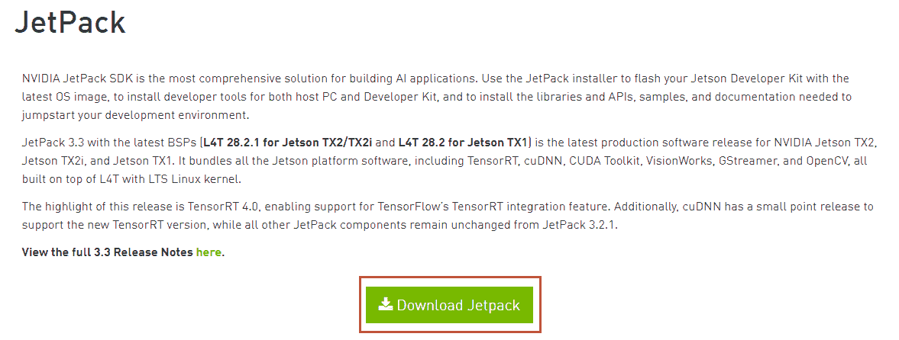

1.  在本书撰写时，使用的最新版本是 JetPack 3.3。它用于演示安装过程。下载文件的名称是 JetPack-L4T-3.3-linux-x64_b39.run。

1.  在桌面上创建一个名为 jetpack 的文件夹，并将此文件复制到该文件夹中，如图所示：

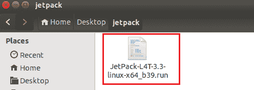

1.  通过右键单击并选择“打开”选项在该文件夹中启动一个终端。该文件需要执行，因此它应该具有执行权限。如果不是这种情况，请更改权限，然后启动安装程序，如图所示：

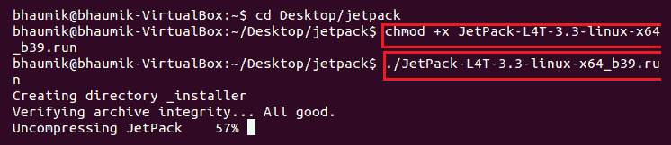

1.  系统将启动 JetPack 3.3 的安装向导，如图所示。只需在此窗口中点击“下一步”：

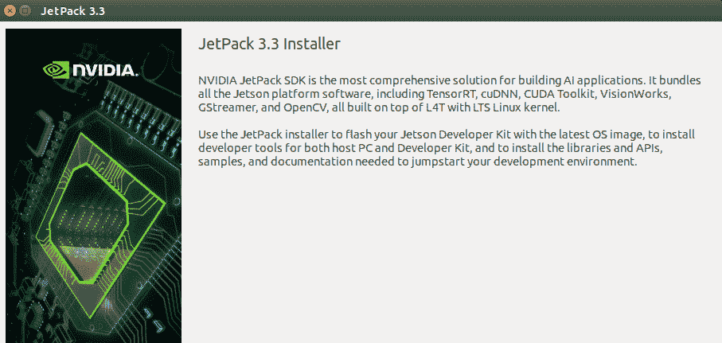

1.  向导将询问要下载和安装软件包的目录。您可以选择当前目录进行安装，并在该目录中创建一个新文件夹以保存下载的软件包，如图所示。然后点击“下一步”：

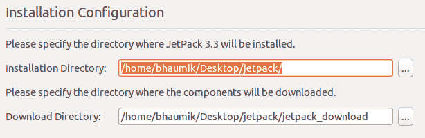

1.  安装向导将要求您选择要安装 JetPack 软件包的开发板。选择 Jetson TX1，如图所示，然后点击“下一步”：

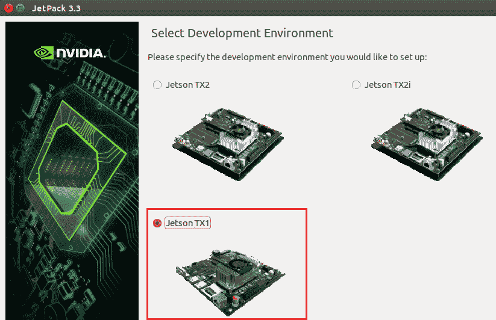

1.  组件管理器窗口将显示，显示哪些软件包将被下载和安装。它将显示 CUDA Toolkit、cuDNN、OpenCV 和 VisionWorks 等软件包，以及操作系统镜像，如图所示：

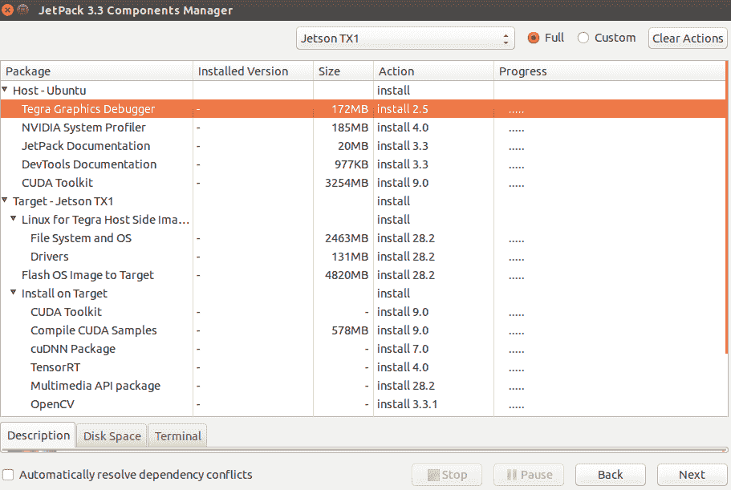

1.  系统将要求您接受许可协议。因此，点击“接受所有”，如图所示，然后点击“下一步”：

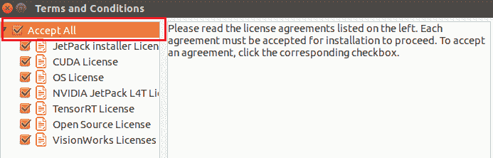

1.  系统将开始下载软件包，如图所示：

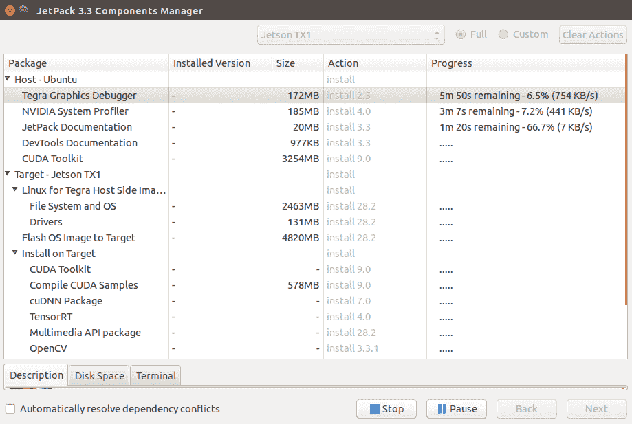

1.  当所有软件包都下载并安装完成后，点击“下一步”以在主机上完成安装。它将显示以下窗口：

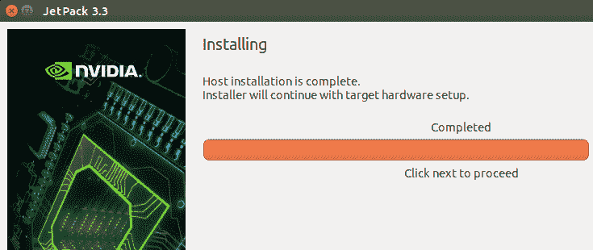

1.  系统将要求您选择网络布局，即如何将板连接到主机 PC。板和主机 PC 连接到同一路由器，因此选择第一个选项，该选项指示设备通过同一路由器或交换机访问互联网，如图所示，然后点击“下一步”：

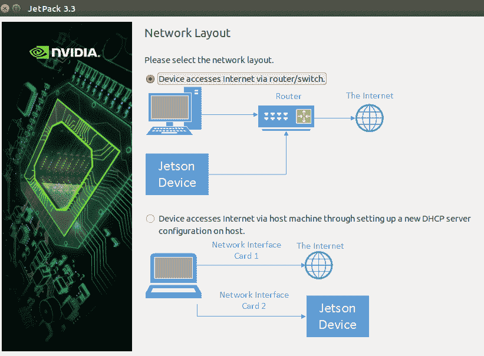

1.  系统将询问用于将板连接到网络的接口。我们必须使用以太网线将路由器连接到板，因此我们将选择 eth0 接口，如图所示：

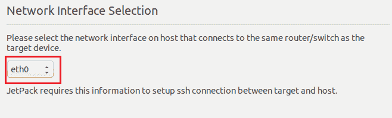

1.  这将完成主机上的安装，并显示将要传输和安装到板上的包的摘要。当您在窗口中点击“下一步”时，它将显示通过微型 USB 到 USB 线将板连接到 PC 以及以强制 USB 恢复模式启动板的步骤。以下窗口显示了这些步骤：

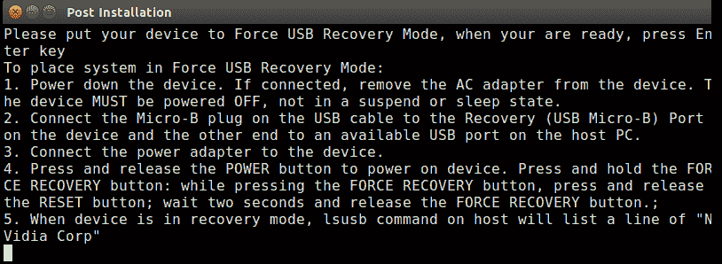

1.  要进入强制恢复模式，在按下电源按钮后，按下强制恢复按钮，同时按下并释放重置按钮。然后释放强制恢复按钮。设备将以强制恢复模式启动。

1.  在窗口中输入**lsusb**命令；如果连接正确，它将开始将包传输到设备。如果您使用的是虚拟机，那么您必须从虚拟机的 USB 设置中启用设备。如果尚未选择，请选择 USB 3.0 控制器。在输入**lsusb**命令后启动的过程如下所示：

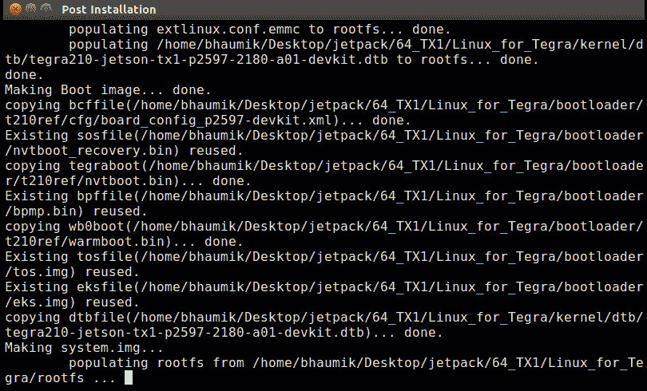

1.  该过程将在设备上刷新操作系统。这个过程可能需要很长时间，最长可达一小时才能完成。刷新完成后，会要求重置设备以获取**ssh**的 IP 地址。写下之前记录的 IP 地址，以及默认的用户名和密码，即`ubuntu`，然后点击“下一步”。之后的窗口如下所示：

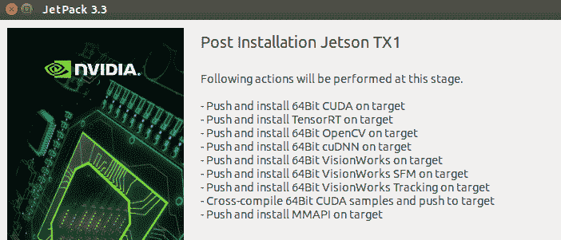

1.  点击“下一步”，它将所有包，如 CUDA Toolkit、VisionWorks、OpenCV 和多媒体，推送到设备。以下窗口将显示：

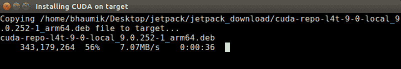

1.  在过程完成后，会询问是否要删除在过程中下载的所有包。如果您想删除，则勾选复选框或保持原样，如下面的截图所示：

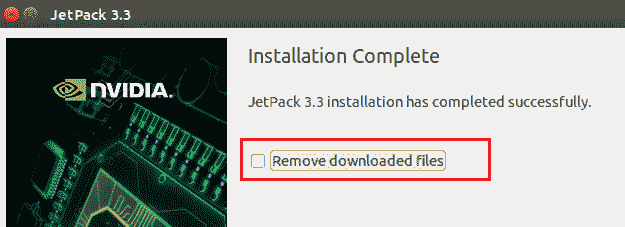

1.  点击“下一步”，安装过程将完成。

1.  重启 Jetson TX1 开发板，它将以正常的 Ubuntu OS 启动。您还将观察到已安装的所有包的示例。我们将在下一章中看到如何在板上使用 CUDA 和 OpenCV。

# 摘要

本章介绍了用于在嵌入式平台上部署计算机视觉和深度学习应用的 Jetson TX1 开发板。它是一个小型信用卡大小的模块，可用于计算密集型应用。它的每瓦性能比最新的 i7 处理器更好。它可用于许多领域，在这些领域中，计算机视觉和深度学习被用于性能提升和嵌入式部署。Nvidia 提供了一套开发套件，其中包含此模块以及其他外围设备，可用于所有应用的快速原型设计。Nvidia 还提供了一套名为 JetPack 的 SDK，它是一系列软件包的集合，例如`OpenCV`、`CUDA`和`Visionworks`。本章详细描述了在 Jetson TX1 上安装 JetPack 的过程。下一章将描述使用 OpenCV 和 CUDA 在 Jetson TX1 上部署计算机视觉应用的过程。

# 问题

1.  使用 Jetson TX1 而不是 Raspberry Pi 的优势是什么？

1.  可以与 Jetson TX1 接口连接多少个摄像头？

1.  如何连接超过两个 USB 设备到 Jetson TX1？

1.  对或错：Jetson TX1 在功耗方面比最新的 i7 处理器有更好的性能。

1.  对或错：Jetson TX1 不包含 CPU。

1.  当 Jetson TX1 预装了 Ubuntu 操作系统时，JetPack 的安装要求是什么？
