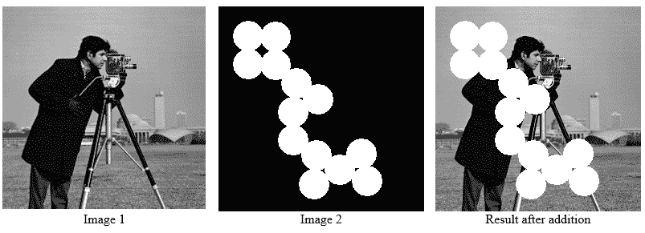
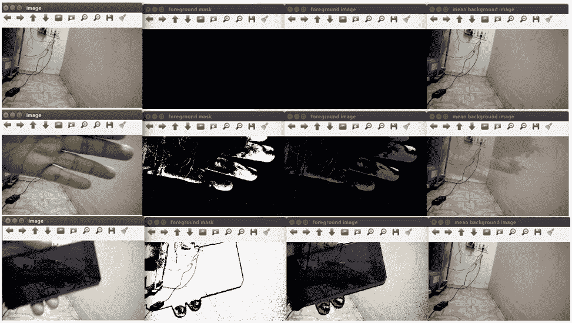

# 在 Jetson TX1 上部署计算机视觉应用

上一章介绍了在 Jetson TX1 开发板上安装 OpenCV 和 CUDA 的过程。本章将描述如何使用这些功能。将详细描述 Jetson TX1 GPU 的属性，这些属性使其适用于并行处理。本章还将描述如何在我们这本书中之前看到的 CUDA 和 C++代码在 Jetson TX1 上执行。它还将展示 Jetson TX1 GPU 在执行 CUDA 代码时的性能。本章的主要动机将是展示如何使用 Jetson TX1 部署图像和视频处理应用。以基本的图像处理应用，如图像读取、显示、加法、阈值和滤波为例，来展示如何使用 Jetson TX1 进行计算机视觉应用。此外，摄像头接口对于在实际场景中部署该板非常重要。本章将描述使用板载摄像头或 USB 摄像头进行视频捕获和处理应用的步骤。本章的最后部分将解释如何部署一些高级应用，如人脸检测和背景减法。

本章将涵盖以下主题：

+   Jetson TX1 板的设备属性

+   在 Jetson TX1 板上运行 CUDA 程序

+   在 Jetson TX1 板上进行图像处理

+   将摄像头与 Jetson TX1 开发板连接

+   在 Jetson TX1 开发板上执行高级应用，如人脸检测、眼检测和背景减法

# 技术要求

本章需要具备对 OpenCV、CUDA 和任何编程语言的良好理解。它还需要任何 Nvidia GPU 开发板，如 Jetson TK1、TX1 或 TX2。本章使用的代码文件可以从以下 GitHub 链接下载：[`github.com/PacktPublishing/Hands-On-GPU-Accelerated-Computer-Vision-with-OpenCV-and-CUDA`](https://github.com/PacktPublishing/Hands-On-GPU-Accelerated-Computer-Vision-with-OpenCV-and-CUDA)。

观看以下视频以查看代码的实际运行情况：

[`bit.ly/2xDtHhm`](http://bit.ly/2xDtHhm)

# Jetson TX1 GPU 的设备属性

CUDA 提供了一个简单的接口来确定 GPU 设备的性能，这是 Jetson TX1 板上存在的 Tegra X1。了解设备的属性对于编写针对它的优化程序非常重要。查找设备属性的程序包含在 JetPack 安装的 CUDA 示例程序中，位于主文件夹中。您还可以运行我们在第二章中开发的程序来查找设备属性。

程序在 Nvidia Tegra X1 GPU 上的输出如下：


JetPack 3.3 安装了 CUDA 9.0 运行时版本。GPU 设备的全局内存大约为 4 GB，GPU 时钟速度约为 1 GHz。这个时钟速度比本书前面提到的 GeForce 940 GPU 慢。内存时钟速度仅为 13 MHz，而 GeForce 940 为 2.505 GHz，这使得 Jetson TX1 较慢。与 GeForce 940 的 1 MB 相比，L2 缓存为 256 KB。大多数其他属性与 GeForce 940 相似。

在 X、Y 和 Z 方向上，每个块可以启动的最大线程数分别为 1,024、1,024 和 64。在确定从程序中启动的并行线程数量时，应使用这些数字。在启动每个网格的并行块数量时，也应采取相同的谨慎措施。

总结来说，我们已经看到了 Jetson TX1 开发板上可用的 Tegra X1 GPU 的设备属性。它是一个嵌入式板，因此内存可用，时钟速度相对于笔记本电脑中配备的 GPU 设备（如 GeForce 940）较慢。然而，它比 Arduino 和 Raspberry Pi 等嵌入式平台快得多。它可以很容易地用于部署需要高性能计算能力的计算机视觉应用。现在我们已经看到了设备属性，我们将从在 Jetson TX1 上使用 CUDA 开发第一个程序开始。

# 基于 Jetson TX1 的 CUDA 基础程序

在本节中，我们通过添加两个大数组的示例来展示使用 Jetson TX1 开发板执行 CUDA 程序。程序的性能也使用 CUDA 事件进行了测量。

添加具有 50,000 个元素的两个大数组的内核函数如下：

```py

#include<iostream>
#include <cuda.h>
#include <cuda_runtime.h>
//Defining number of elements in Array
#define N 50000
//Defining Kernel function for vector addition
__global__ void gpuAdd(int *d_a, int *d_b, int *d_c) {
 //Getting Thread index of current kernel
 int tid = threadIdx.x + blockIdx.x * blockDim.x;
 while (tid < N)
 {
 d_c[tid] = d_a[tid] + d_b[tid];
 tid += blockDim.x * gridDim.x;
 }
}
```

内核函数接收两个设备指针，这些指针指向输入数组作为输入，以及一个设备指针，该指针指向设备内存中输出数组的参数。计算当前内核执行的线程 ID，并由内核将线程索引索引的数组元素相加。如果启动的内核数量少于数组元素数量，则相同的内核将在`while`循环中添加由块维度偏移的`Array`元素。添加两个数组的`main`函数如下：

```py
int main(void) 
{
 //Defining host arrays
 int h_a[N], h_b[N], h_c[N];
 //Defining device pointers
 int *d_a, *d_b, *d_c;
 cudaEvent_t e_start, e_stop;
 cudaEventCreate(&e_start);
 cudaEventCreate(&e_stop);
 cudaEventRecord(e_start, 0);
 // allocate the memory
 cudaMalloc((void**)&d_a, N * sizeof(int));
 cudaMalloc((void**)&d_b, N * sizeof(int));
 cudaMalloc((void**)&d_c, N * sizeof(int));
 //Initializing Arrays
 for (int i = 0; i < N; i++) {
 h_a[i] = 2 * i*i;
 h_b[i] = i;
 }
 // Copy input arrays from host to device memory
 cudaMemcpy(d_a, h_a, N * sizeof(int), cudaMemcpyHostToDevice);
 cudaMemcpy(d_b, h_b, N * sizeof(int), cudaMemcpyHostToDevice);
 //Calling kernels passing device pointers as parameters
 gpuAdd << <1024, 1024 >> >(d_a, d_b, d_c);
 //Copy result back to host memory from device memory
 cudaMemcpy(h_c, d_c, N * sizeof(int), cudaMemcpyDeviceToHost);
 cudaDeviceSynchronize();
 cudaEventRecord(e_stop, 0);
 cudaEventSynchronize(e_stop);
 float elapsedTime;
 cudaEventElapsedTime(&elapsedTime, e_start, e_stop);
 printf("Time to add %d numbers: %3.1f ms\n",N, elapsedTime);

```

定义了两个主机数组，并使用`cudaMalloc`函数为它们分配内存。它们被初始化为一些随机值，并上传到设备内存。创建了两个 CUDA 事件来测量 CUDA 程序的性能。内核以并行方式启动了 1,024 个块，每个块有 1,024 个线程。这些数字来自设备属性，如上一节所述。内核函数的结果被传输到主机内存。内核函数的时间由`e_start`和`e_stop`事件在内核启动前后记录。函数所花费的时间显示在控制台上。

以下代码被添加以验证由 GPU 计算的结果的正确性，并清理程序使用的内存：

```py
 int Correct = 1;
 printf("Vector addition on GPU \n");
 //Printing result on console
 for (int i = 0; i < N; i++) {
 if ((h_a[i] + h_b[i] != h_c[i]))
 {
  Correct = 0;
 }

 }
 if (Correct == 1)
 {
 printf("GPU has computed Sum Correctly\n");
 }
 else
 {
 printf("There is an Error in GPU Computation\n");
 }
 //Free up memory
 cudaFree(d_a);
 cudaFree(d_b);
 cudaFree(d_c);
 return 0;
}
```

在 CPU 上执行相同的数组加法操作，并与从 GPU 获得的结果进行比较，以验证 GPU 是否正确计算了结果。这也在控制台上显示。通过使用`cudaFree`函数释放程序使用的所有内存。

需要从终端运行以下两个命令来执行程序。程序应位于当前工作目录中：

```py
$ nvcc 01_performance_cuda_events.cu -o gpu_add
$ ./gpu_add
```

使用`nvcc`命令通过 Nvidia CUDA 编译器编译 CUDA 代码。文件名作为命令的参数传递。编译器将创建的目标文件名通过`-o`选项指定。此文件名将用于执行程序。这是通过第二个命令完成的。程序输出如下：


从结果可以看出，Jetson TX1 计算包含 50,000 个元素的两个数组的和需要`3.4ms`，这比本书第三章中使用的 GeForce 940 慢，但仍然比 CPU 上的顺序执行快。

总结来说，本节展示了在执行 CUDA 程序中使用 Jetson TX1 开发板的方法。语法与我们在这本书中之前看到的相同。因此，书中之前开发的全部 CUDA 程序都可以在 Jetson TX1 上执行，无需太多修改。程序执行的步骤也进行了描述。下一节将描述使用 Jetson TX1 进行图像处理应用的方法。

# 在 Jetson TX1 上进行的图像处理

本节将展示在部署图像处理应用中使用 Jetson TX1 的方法。我们还将再次使用 OpenCV 和 CUDA 来加速 Jetson TX1 上的计算机视觉应用。在上一章中，我们看到了包含 OpenCV 和 CUDA 的 JetPack 3.3 的安装过程。但在最新的 JetPack 中，OpenCV 没有编译带有 CUDA 支持，也没有 GStreamer 支持，这是从代码中访问摄像头所必需的。因此，删除 JetPack 附带的 OpenCV 安装，并编译带有 CUDA 和 GStreamer 支持的 OpenCV 新版本是一个好主意。下一节将展示如何执行此过程。

# （编译带有 CUDA 支持的 OpenCV，如果需要）

尽管 JetPack 附带的 OpenCV 可以与新安装的 OpenCV 一起工作，但先删除旧安装然后开始新的安装是一个好主意。这将避免不必要的混淆。为了完成这个任务，必须执行以下步骤：

1.  从终端运行以下命令：

```py
$ sudo apt-get purge libopencv*
```

1.  确保安装的所有软件包都是最新版本。如果不是这样，可以通过运行以下两个命令来更新它们：

```py
$ sudo apt-get update
$ sudo apt-get dist-upgrade
```

1.  编译从源代码编译 OpenCV 需要最新的 cmake 和 gcc 编译器版本，因此可以通过运行以下两个命令来安装：

```py
$ sudo apt-get install --only-upgrade gcc-5 cpp-5 g++-5
$ sudo apt-get install build-essential make cmake cmake-curses-gui libglew-dev libgtk2.0-dev
```

1.  需要安装一些依赖项以编译支持 GStreamer 的 OpenCV。这可以通过以下命令完成：

```py
sudo apt-get install libdc1394-22-dev libxine2-dev libgstreamer1.0-dev libgstreamer-plugins-base1.0-dev
```

1.  通过执行以下命令下载 OpenCV 最新版本的源代码，并将其提取到一个文件夹中：

```py
$ wget https://github.com/opencv/opencv/archive/3.4.0.zip -O opencv.zip
$ unzip opencv.zip
```

1.  现在，进入 `opencv` 文件夹，创建 `build` 目录。然后进入这个新创建的 `build` 目录。这些可以通过从命令提示符执行以下命令来完成。

```py
$ cd opencv
$ mkdir build
$ cd build 
```

1.  `cmake` 命令用于编译具有 CUDA 支持的 `opencv`。确保在此命令中将 `WITH_CUDA` 标志设置为 `ON`。注意，对于 Jetson TX1 开发板，`CUDA_ARCH_BIN` 应设置为 `5.3`，对于 Jetson TX2，应设置为 `6.2`。示例没有构建以节省时间和空间。整个 `cmake` 命令如下：

```py
cmake -D CMAKE_BUILD_TYPE=RELEASE -D CMAKE_INSTALL_PREFIX=/usr/local \
 -D WITH_CUDA=ON -D CUDA_ARCH_BIN="5.3" -D CUDA_ARCH_PTX="" \
 -D WITH_CUBLAS=ON -D ENABLE_FAST_MATH=ON -D CUDA_FAST_MATH=ON \
 -D ENABLE_NEON=ON -D WITH_LIBV4L=ON -D BUILD_TESTS=OFF \
 -D BUILD_PERF_TESTS=OFF -D BUILD_EXAMPLES=OFF \
 -D WITH_QT=ON -D WITH_OPENGL=ON ..
```

1.  它将启动配置和创建 `makefile` 的过程。在配置成功后，`cmake` 命令将在 `build` 目录中创建 `makefile`。

1.  要使用 `makefile` 编译 OpenCV，请在命令窗口中执行 `make -j4` 命令。

1.  编译成功后，您必须从命令行执行 `sudo make install` 命令来安装 OpenCV。

如果这些步骤执行成功，则 OpenCV 3.4.0 将在 Jetson TX1 上安装，并支持 CUDA 和 GStreamer，使用 OpenCV 制作的任何计算机视觉应用都可以部署到它上面。下一节将演示在板上进行简单的图像处理操作。

# 读取和显示图像

对于任何计算机视觉应用，所需的基本操作之一是读取和显示存储在磁盘上的图像。本节将演示一个简单的代码，在 Jetson TX1 上执行此操作。当我们从计算机上的 GPU 移动到 Jetson TX1 开发板时，OpenCV 语法不会改变太多。将有一些小的变化。在 Jetson TX1 上读取和显示图像的代码如下：

```py
#include <opencv2/opencv.hpp>
#include <iostream>

using namespace cv;
using namespace std;

int main()
{
 Mat img = imread("images/cameraman.tif",0);
 if (img.empty()) 
 {
 cout << "Could not open an image" << endl;
 return -1;
 }
 imshow("Image Read on Jetson TX1"; , img); 
 waitKey(0); 
 return 0;
}
```

必要的 OpenCV 库包含在代码中。图像是通过 `Main` 函数内的 `imread` 函数读取的。由于 `imread` 命令的第二个参数指定为 `0`，因此图像被读取为灰度图像。要将图像读取为彩色图像，可以指定为 `1`。`if` 语句检查图像是否被读取，如果没有，则在控制台上显示错误后终止代码。当图像名称不正确或图像未存储在指定的路径时，可能会发生读取图像的错误。这个错误由 `if` 语句处理。图像是通过 `imshow` 命令显示的。`waitKey` 函数用于显示图像，直到按下键盘上的任何键。

所示的前面代码可以保存为`image_read.cpp`文件，并使用以下命令从终端执行。请确保程序文件存储在终端的当前工作目录中：

```py
For compilation:
$ g++ -std = c++11 image_read.cpp 'pkg_config --libs --cflags opencv' -o image_read
For execution:
$./image_read
```

程序的输出如下：


本节演示了在 Jetson TX1 上读取和显示图像的步骤。在下节中，我们将看到一些更多的图像处理操作，并尝试测量它们在 Jetson TX1 上的性能。

# 图像加法

本节将演示使用 Jetson TX1 进行简单的图像处理应用，如图像加法。在加法后，相同位置的像素强度被相加以构建新的图像。假设在两个图像中，(0,0)位置的像素强度值分别为 50 和 150，那么结果图像中的强度值将是 200，这是两个强度值的和。OpenCV 的加法操作是饱和操作，这意味着如果加法的结果超过 255，则将饱和在 255。在 Jetson TX1 上执行加法的代码如下：

```py
#include <iostream>
#include "opencv2/opencv.hpp"
#include "opencv2/core/cuda.hpp"

int main (int argc, char* argv[])
{
 //Read Two Images 
 cv::Mat h_img1 = cv::imread("images/cameraman.tif");
 cv::Mat h_img2 = cv::imread("images/circles.png");
 int64 work_begin = cv::getTickCount(); 
 //Create Memory for storing Images on device
 cv::cuda::GpuMat d_result1,d_img1, d_img2;
 cv::Mat h_result1;
 //Upload Images to device 
 d_img1.upload(h_img1);
 d_img2.upload(h_img2);

 cv::cuda::add(d_img1,d_img2, d_result1);
 //Download Result back to host
 d_result1.download(h_result1);
 cv::imshow("Image1 ", h_img1);
 cv::imshow("Image2 ", h_img2);
 cv::imshow("Result addition ", h_result1);
 int64 delta = cv::getTickCount() - work_begin;
 //Frequency of timer
 double freq = cv::getTickFrequency();
 double work_fps = freq / delta;
 std::cout<<"Performance of Addition on Jetson TX1: " <<std::endl;
 std::cout <<"Time: " << (1/work_fps) <<std::endl;
 std::cout <<"FPS: " <<work_fps <<std::endl;

 cv::imshow("result_add.png", h_result1);
 cv::waitKey();
 return 0;
}
```

在进行图像加法时需要注意的一点是，两个图像应该具有相同的大小。如果不是这种情况，那么在加法之前应该将它们调整大小。在前面代码中，从磁盘读取了两个相同大小的图像，并将它们上传到设备内存中进行 GPU 上的加法。使用`cv::cuda`模块中的`add`函数在设备上执行图像加法。结果图像被下载到主机并在控制台上显示。

程序的输出如下：



使用`cv::getTickCount()`和`cv::getTickFrequency()`函数也测量了图像加法的性能。加法操作所需的时间显示在下面的屏幕截图上：


如前述屏幕截图所示，在 Jetson TX1 上添加两个大小为 256 x 256 的图像大约需要`0.26ms`。这对于嵌入式平台来说是一个非常不错的性能。需要注意的是，在测量加法操作的准确时间之前，应该测量`imshow`函数。`imshow`函数显示图像需要更多的时间，因此测量的时间不会是加法操作所需时间的准确估计。

# 图像阈值化

本节将演示使用 Jetson TX1 进行更复杂的计算机视觉应用，如图像阈值化。图像阈值化是一种非常简单的图像分割技术，用于根据某些强度值从灰度图像中提取重要区域。在这种技术中，如果像素值大于某个阈值值，则分配一个值，否则分配另一个值。

OpenCV 提供了不同类型的阈值技术，这由函数的最后一个参数决定。这些阈值类型包括：

+   `cv:.THRES H_BINARY`: 如果像素的强度大于阈值，则将像素强度设置为等于`maxVal`常量，否则将像素强度设置为等于零。

+   `cv::THRESH_BINARY_INV`: 如果像素的强度大于阈值，则将像素强度设置为等于零，否则将像素强度设置为`maxVal`常量。

+   `cv::THRESH_TRUNC`: 这基本上是一个截断操作。如果像素的强度大于阈值，则将像素强度设置为等于阈值，否则保持强度值不变。

+   `cv::THRESH_TOZERO`: 如果像素的强度大于阈值，则保持像素强度不变，否则将像素强度设置为等于零。

+   `cv::THRESH_TOZERO_INV`: 如果像素的强度大于阈值，则将该像素强度设置为等于零，否则保持像素强度不变。

在 Jetson TX1 上使用 OpenCV 和 CUDA 实现所有这些阈值技术的程序如下所示：

```py
#include <iostream>
#include "opencv2/opencv.hpp"
using namespace cv;
int main (int argc, char* argv[])
{
 cv::Mat h_img1 = cv::imread("images/cameraman.tif", 0);
 cv::cuda::GpuMat d_result1,d_result2,d_result3,d_result4,d_result5, d_img1;
 //Measure initial time ticks
 int64 work_begin = getTickCount(); 
 d_img1.upload(h_img1);
 cv::cuda::threshold(d_img1, d_result1, 128.0, 255.0, cv::THRESH_BINARY);
 cv::cuda::threshold(d_img1, d_result2, 128.0, 255.0, cv::THRESH_BINARY_INV);
 cv::cuda::threshold(d_img1, d_result3, 128.0, 255.0, cv::THRESH_TRUNC);
 cv::cuda::threshold(d_img1, d_result4, 128.0, 255.0, cv::THRESH_TOZERO);
 cv::cuda::threshold(d_img1, d_result5, 128.0, 255.0, cv::THRESH_TOZERO_INV);

 cv::Mat h_result1,h_result2,h_result3,h_result4,h_result5;
 d_result1.download(h_result1);
 d_result2.download(h_result2);
 d_result3.download(h_result3);
 d_result4.download(h_result4);
 d_result5.download(h_result5);
 //Measure difference in time ticks
 int64 delta = getTickCount() - work_begin;
 double freq = getTickFrequency();
 //Measure frames per second
 double work_fps = freq / delta;
 std::cout <<"Performance of Thresholding on GPU: " <<std::endl;
 std::cout <<"Time: " << (1/work_fps) <<std::endl;
 std::cout <<"FPS: " <<work_fps <<std::endl;
 return 0;
}
```

在 OpenCV 和 CUDA 的 GPU 上用于图像阈值化的函数是`cv::cuda::threshold`。此函数有许多参数。第一个参数是源图像，它应该是一个灰度图像。第二个参数是结果要存储的目标位置。第三个参数是阈值值，用于分割像素值。第四个参数是`maxVal`常量，表示如果像素值超过阈值值时赋予的值。最后一个参数是前面讨论过的阈值方法。以下程序显示了原始图像和五种阈值技术输出的输出：


使用`cv::getTickCount()`和`cv::getTickFrequency()`函数测量图像阈值化的性能。五个阈值操作所需的时间显示在控制台上，如下面的截图所示：


在 Jetson TX1 上执行五个阈值操作需要`0.32ms`，这对于嵌入式平台上的图像分割任务来说，性能非常好。下一节将描述 Jetson TX1 上的滤波操作。

# Jetson TX1 上的图像滤波

图像滤波是图像预处理和特征提取中的一个非常重要的步骤。低通滤波器，如平均、高斯和中值滤波器，用于去除图像中的不同类型的噪声，而高通滤波器，如 Sobel、Scharr 和 Laplacian，用于检测图像中的边缘。边缘是重要的特征，可用于计算机视觉任务，如目标检测和分类。本书中已详细解释了图像滤波。

本节描述了在 Jetson TX1 上对图像应用低通和高通滤波器的步骤。相应的代码如下：

```py
#include <iostream>
#include <string>
#include "opencv2/opencv.hpp"

using namespace std;
using namespace cv;
using namespace cv::cuda;

int main()
{
 Mat h_img1;
 cv::cuda::GpuMat d_img1,d_blur,d_result3x3;
 h_img1 = imread("images/blobs.png",1);

 int64 start = cv::getTickCount();
 d_img1.upload(h_img1);
 cv::cuda::cvtColor(d_img1,d_img1,cv::COLOR_BGR2GRAY);
 cv::Ptr<cv::cuda::Filter> filter3x3;
 filter3x3 = cv::cuda::createGaussianFilter(CV_8UC1,CV_8UC1,cv::Size(3,3),1);
 filter3x3->apply(d_img1, d_blur);

 cv::Ptr<cv::cuda::Filter> filter1;
 filter1 = cv::cuda::createLaplacianFilter(CV_8UC1,CV_8UC1,1);
 filter1->apply(d_blur, d_result3x3);

 cv::Mat h_result3x3,h_blur;
 d_result3x3.download(h_result3x3);
 d_blur.download(h_blur);

 double fps = cv::getTickFrequency() / (cv::getTickCount() - start);
 std::cout << "FPS : " << fps << std::endl;
 imshow("Laplacian", h_result3x3);
 imshow("Blurred", h_blur);
 cv::waitKey();
 return 0;
}
```

拉普拉斯算子是一种二阶导数，用于从图像中提取垂直和水平图像。它对噪声非常敏感，因此有时需要使用低通滤波器（如高斯模糊）来去除噪声，然后再应用拉普拉斯滤波器。因此，在代码中，使用标准差等于`1`的 3x3 高斯滤波器对输入图像进行处理。该滤波器是通过 OpenCV 的`cv::cuda::createGaussianFilter`函数创建的。然后，将拉普拉斯滤波器应用于高斯模糊后的图像。拉普拉斯滤波器是通过 OpenCV 的`cv::cuda::createLaplacianFilter`函数创建的。高斯模糊和拉普拉斯滤波器的输出被下载回主机内存，以便在控制台上显示。代码中还测量了滤波操作的性能。程序的输出如下截图所示：


从输出中可以看出，对模糊图像应用拉普拉斯滤波器将去除图像中的虚假边缘。它还将去除输入图像中存在的高斯噪声。如果输入图像被盐和胡椒噪声扭曲，则应在拉普拉斯滤波器进行边缘检测之前使用中值滤波器作为预处理步骤。

总结来说，我们已经在 Jetson TX1 上看到了不同的图像处理函数，如图像加法、图像阈值和图像滤波。我们还看到，这些操作在 Jetson TX1 上的性能比在 CPU 上执行相同的代码要好得多。下一节将描述如何将摄像头与 Jetson TX1 连接，以便在现实生活中的场景中使用。

# 与 Jetson TX1 连接摄像头

Jetson TX1 可以与 USB 摄像头或 CSI 摄像头连接。开发板已预装了一款 5 兆像素的摄像头，并与 Jetson TX1 连接。这款摄像头可以像笔记本电脑上的网络摄像头一样捕获视频。摄像头连接是 Jetson TX1 开发板在实时应用中的重要特性，它支持多达六通道的摄像头。Jetson TX1 支持的摄像头详细列表可以在以下链接中找到：[`elinux.org/Jetson_TX1`](https://elinux.org/Jetson_TX1)

本节将演示使用与 Jetson TX1 连接的摄像头捕获视频的步骤，以及如何使用这些视频开发计算机视觉应用，如人脸检测和背景减法。

# 从机载摄像头读取和显示视频

本节将描述从 USB 摄像头或与 Jetson TX1 连接的机载摄像头捕获视频的方法。为此，OpenCV 应编译为支持 GStreamer；否则，OpenCV 将不支持捕获视频的格式。

以下代码可以用来从摄像头捕获视频并在屏幕上显示：

```py
#include <opencv2/opencv.hpp>
#include <iostream>
#include <stdio.h>
using namespace cv;
using namespace std;

int main(int, char**)
{
 Mat frame;
 // open the default camera using default API
 VideoCapture cap("nvcamerasrc ! video/x-raw(memory:NVMM), width=(int)1280, height=(int)720, format=(string)I420, framerate=(fraction)24/1 ! nvvidconv flip-method=0 ! video/x-raw, format=(string)I420 ! videoconvert ! video/x-raw, format=(string)BGR ! appsink"); 
 if (!cap.isOpened()) {
 cout << "Unable to open camera\n";
 return -1;
 }
 while (1)
 {
 int64 start = cv::getTickCount();
 cap.read(frame);
 // check if we succeeded
 if (frame.empty()) {
  cout << "Can not read frame\n";
  break;
 }
 double fps = cv::getTickFrequency() / (cv::getTickCount() - start);
 std::cout << "FPS : " << fps << std::endl;

 imshow("Live", frame);
 if (waitKey(30) == 'q')
  break;
 }

 return 0;
}
```

代码与用于在台式机上从网络摄像头捕获视频的代码大致相似。而不是使用设备 ID 作为参数来捕获对象，使用指定 GStreamer 管道的字符串。如下所示：

```py
VideoCapture cap("nvcamerasrc ! video/x-raw(memory:NVMM), width=(int)1280, height=(int)720, format=(string)I420, framerate=(fraction)24/1 ! nvvidconv flip-method=0 ! video/x-raw, format=(string)I420 ! videoconvert ! video/x-raw, format=(string)BGR ! appsink");
```

捕获的视频的宽度和高度被指定为 1,280 和 720 像素。帧率也被指定。这些值将根据接口摄像头的支持的格式而变化。使用`nvvidconv`将视频转换为 OpenCV 支持的 BGR 格式。它还用于图像缩放和翻转。要翻转捕获的视频，可以将 flip 方法指定为一个非零的整数值。

使用`cap.isOpened`属性来检查是否已从摄像头开始捕获。然后使用 read 方法逐个读取帧并在屏幕上显示，直到用户按下`q`键。代码中也测量了帧捕获的速率。

摄像头捕获了实时视频的两个不同帧，帧率显示在下面的屏幕截图上：


总结来说，在本节中，我们看到了从与 Jetson TX1 开发板相连的摄像头捕获视频的步骤。这个捕获的视频可以用于开发下一节所述的有用的实时计算机视觉应用。

# Jetson TX1 上的高级应用

本节将描述在部署高级计算机视觉应用（如人脸检测、眼检测和背景减法）中使用 Jetson TX1 嵌入式平台。

# 使用 Haar 级联进行人脸检测

Haar 级联使用矩形特征来检测对象。它使用不同大小的矩形来计算不同的线和边缘特征。Haar-like 特征检测算法背后的思想是计算矩形内白色像素总和与黑色像素总和之间的差异。

这种方法的主要优势是使用积分图方法进行快速的求和计算。这使得 Haar 级联非常适合实时目标检测。它处理图像所需的时间比其他用于目标检测的算法要少。由于 Haar 级联具有低计算复杂性和低内存占用，因此非常适合部署在嵌入式系统如 Jetson TX1 上。因此，在本节中，使用此算法在 Jetson TX1 上部署人脸检测应用。

从与 Jetson TX1 接口的摄像头捕获的视频进行人脸检测的代码如下：

```py
#include <iostream>
#include <opencv2/opencv.hpp>
using namespace cv;
using namespace std;

int main()
{
 VideoCapture cap("images/output.avi");
//cv::VideoCapture cap("nvcamerasrc ! video/x-raw(memory:NVMM), width=(int)1280, height=(int)720, format=(string)I420, framerate=(fraction)24/1 ! nvvidconv flip-method=0 ! video/x-raw, format=(string)I420 ! videoconvert ! video/x-raw, format=(string)BGR ! appsink"); 
 if (!cap.isOpened()) {
   cout << "Can not open video source";
   return -1;
 }
 std::vector<cv::Rect> h_found;
 cv::Ptr<cv::cuda::CascadeClassifier> cascade = cv::cuda::CascadeClassifier::create("haarcascade_frontalface_alt2.xml");
 cv::cuda::GpuMat d_frame, d_gray, d_found;
 while(1)
 {
 Mat frame;
 if ( !cap.read(frame) ) {
   cout << "Can not read frame from webcam";
   return -1;
 }
 int64 start = cv::getTickCount();
 d_frame.upload(frame);
 cv::cuda::cvtColor(d_frame, d_gray, cv::COLOR_BGR2GRAY);

 cascade->detectMultiScale(d_gray, d_found);
 cascade->convert(d_found, h_found);

 for(int i = 0; i < h_found.size(); ++i)
 {
   rectangle(frame, h_found[i], Scalar(0,255,255), 5);
 }
 double fps = cv::getTickFrequency() / (cv::getTickCount() - start);
 std::cout << "FPS : " << fps << std::endl;
 imshow("Result", frame);
 if (waitKey(1) == 'q') {
   break;
 }
 }

 return 0;
}
```

Haar 级联是一种需要训练以执行特定任务的算法。从头开始训练特定应用的 Haar 级联是困难的，因此 OpenCV 提供了一些训练好的 XML 文件，可用于检测对象。这些 XML 文件位于 OpenCV 和 CUDA 安装的`\usr\local\opencv\data\haarcascades_cuda`目录中。

初始化网络摄像头，并逐个捕获网络摄像头的帧。将帧上传到设备内存以在 GPU 上处理。OpenCV 和 CUDA 提供了`CascadeClassifier`类，可用于实现 Haar 级联。使用`create`方法创建该类的对象。它需要加载训练好的 XML 文件的文件名。

在`while`循环内部，将`detectMultiscale`方法应用于每一帧，以便在每一帧中检测不同大小的人脸。使用`convert`方法将检测到的位置转换为矩形向量。然后，使用`for`循环迭代此向量，以便在所有检测到的人脸上使用矩形函数绘制边界框。此过程对从网络摄像头捕获的每一帧重复进行。算法的性能也以每秒帧数来衡量。

程序的输出如下：


从输出中可以看出，人脸在两个不同位置的两个不同的网络摄像头帧中被正确定位。第二帧有点模糊，但这不会影响算法。Jetson TX1 上算法的性能也在右图显示。算法在大约每秒五帧的速度下工作。

总结来说，本节展示了使用 Jetson TX1 从网络摄像头捕获的实时视频中检测人脸。此应用程序可用于人员识别、人脸锁定、考勤监控等。

# 使用 Haar 级联进行眼检测

本节将描述使用 Haar 级联检测人类眼睛的使用。用于眼检测的训练好的 Haar 级联的 XML 文件位于 OpenCV 安装目录中。此文件用于检测眼睛。其代码如下：

```py
#include "opencv2/objdetect/objdetect.hpp"
#include "opencv2/highgui/highgui.hpp"
#include "opencv2/imgproc/imgproc.hpp"
#include "opencv2/cudaobjdetect.hpp" 
#include <iostream>
#include <stdio.h>

using namespace std;
using namespace cv;

int main( )
{
  Mat h_image;
  h_image = imread("images/lena_color_512.tif", 0); 
  Ptr<cuda::CascadeClassifier> cascade =       cuda::CascadeClassifier::create("haarcascade_eye.xml");
  cuda::GpuMat d_image;
  cuda::GpuMat d_buf;
  int64 start = cv::getTickCount();
  d_image.upload(h_image);
  cascadeGPU->setMinNeighbors(0);
  cascadeGPU->setScaleFactor(1.02);
  cascade->detectMultiScale(d_image, d_buf);
  std::vector<Rect> detections;
  cascade->convert(d_buf, detections);
 if (detections.empty())
   std::cout << "No detection." << std::endl;
   cvtColor(h_image,h_image,COLOR_GRAY2BGR);
 for(int i = 0; i < detections.size(); ++i)
 {
   rectangle(h_image, detections[i], Scalar(0,255,255), 5);
 }
 double fps = cv::getTickFrequency() / (cv::getTickCount() - start);
 std::cout << "FPS : " << fps << std::endl;
 imshow("Result image on Jetson TX1", h_image);

 waitKey(0); 
 return 0;
}
```

代码与面部检测的代码类似。这是使用 Haar 级联的优势。如果有一个给定对象的训练好的 Haar 级联的 XML 文件可用，那么相同的代码将在所有应用程序中工作。只需在创建`CascadeClassifier`类的对象时更改 XML 文件的名称。在前面的代码中，使用了用于眼检测的训练 XML 文件`haarcascade_eye.xml`。其他代码是自解释的。缩放因子设置为`1.02`，以便在每次缩放时图像大小将减少`1.02`。眼检测程序的输出如下：


现在我们已经使用 Haar 级联从视频和图像中检测到对象，因此捕获的视频也可以使用下一节中描述的背景减法方法来检测和跟踪对象。

# 使用高斯混合（MoG）的背景减法

背景减法是目标检测和跟踪应用的重要预处理步骤。它也可以用于从监控录像中检测异常活动。本节展示了在背景减法应用中使用 Jetson TX1。与 Jetson TX1 接口的摄像头被安装在一个房间内，用于检测房间内的活动。房间的背景在第一帧中被初始化。

MoG 是一种广泛使用的背景减法方法，用于根据高斯混合将前景与背景分离，用于活动检测。背景从帧序列中持续更新。使用 K 个高斯分布的混合来将像素分类为前景或背景。帧的时间序列也被加权以改进背景建模。持续变化的强度被分类为前景，而静态的强度被分类为背景。

使用 MoG 进行活动监控的代码如下：

```py
#include <iostream>
#include <string>
#include "opencv2/opencv.hpp"

using namespace std;
using namespace cv;
using namespace cv::cuda;
int main()
{

 VideoCapture cap("nvcamerasrc ! video/x-raw(memory:NVMM), width=(int)1280, height=(int)720, format=(string)I420, framerate=(fraction)24/1 ! nvvidconv flip-method=0 ! video/x-raw, format=(string)I420 ! videoconvert ! video/x-raw, format=(string)BGR ! appsink");
 if (!cap.isOpened())
 {
 cout << "Can not open camera or video file" << endl;
 return -1;
 }
 Mat frame;
 cap.read(frame);
 GpuMat d_frame;
 d_frame.upload(frame);
 Ptr<BackgroundSubtractor> mog = cuda::createBackgroundSubtractorMOG();
 GpuMat d_fgmask,d_fgimage,d_bgimage;
 Mat h_fgmask,h_fgimage,h_bgimage;
 mog->apply(d_frame, d_fgmask, 0.01);
 namedWindow("image", WINDOW_NORMAL);
 namedWindow("foreground mask", WINDOW_NORMAL);
 namedWindow("foreground image", WINDOW_NORMAL);
 namedWindow("mean background image", WINDOW_NORMAL);

 while(1)
 {
 cap.read(frame);
 if (frame.empty())
  break;
 d_frame.upload(frame);
 int64 start = cv::getTickCount();
 mog->apply(d_frame, d_fgmask, 0.01);
 mog->getBackgroundImage(d_bgimage);
 double fps = cv::getTickFrequency() / (cv::getTickCount() - start);
 std::cout << "FPS : " << fps << std::endl;
 d_fgimage.create(d_frame.size(), d_frame.type());
 d_fgimage.setTo(Scalar::all(0));
 d_frame.copyTo(d_fgimage, d_fgmask);
 d_fgmask.download(h_fgmask);
 d_fgimage.download(h_fgimage);
 d_bgimage.download(h_bgimage);
 imshow("image", frame);
 imshow("foreground mask", h_fgmask);
 imshow("foreground image", h_fgimage);
 imshow("mean background image", h_bgimage);
 if (waitKey(1) == 'q')
  break;
 }

 return 0;
}
```

与 Jetson TX1 接口的摄像头使用 GStreamer 管道初始化。`createBackgroundSubtractorMOG`类用于创建 MoG 实现的对象。创建的对象的`apply`方法用于从第一帧创建前景掩码。它需要一个输入图像、一个`image`数组来存储前景掩码，以及学习率作为输入。没有活动的房间图像被初始化为 MoG 的背景。因此，任何发生的活动都将被算法归类为前景。

在`while`循环的每一帧之后，都会持续更新前景掩码和背景图像。`getBackgroundImage`函数用于获取当前的背景模型。

前景掩码用于创建前景图像，指示哪些对象当前正在移动。它基本上是逻辑操作，在原始帧和前景掩码之间进行。在每一帧之后，前景掩码、前景图像和建模的背景都会下载到主机内存中，以便在屏幕上显示。

以下截图显示了从视频中提取的两个不同帧的输出：



第一行表示房间内没有任何活动时的背景。当有人将手放在摄像头前时，它将被检测为前景，如第二帧结果所示。同样，如果有人将手机放在摄像头前，它也将被归类为前景，如第三帧所示。以下截图显示了代码在每秒帧数方面的性能：


该技术在每秒大约 60-70 帧的速度下工作，可以很容易地用于实时决策。尽管本节中的演示非常简单，但这种应用可以在许多实际情况下使用。房间内的活动可以用来控制房间内现有的设备。这有助于在没有人的情况下节省电力。此应用还可以用于 ATM 机内活动的监控。它还可以用于公共场所的其他视频监控应用。Python 也可以用作 Jetson TX1 上的编程语言，这将在下一节中解释。

# 在 Jetson TX1 上使用 Python 和 OpenCV 进行计算机视觉

到目前为止，我们使用 C/C++、OpenCV 和 CUDA 开发了所有计算机视觉应用。Jetson TX1 也支持 Python 编程语言用于计算机视觉应用。当在 Jetson TX1 上编译 OpenCV 时，它也会安装 OpenCV 的 Python 二进制文件。因此，熟悉 Python 编程语言的程序员可以使用 Python 接口开发 OpenCV 计算机视觉应用，并在 Jetson TX1 上部署它们。Python 也像所有 Linux 操作系统一样预安装在 Jetson TX1 上。Windows 用户可以单独安装 Python。Python 的安装过程和优势将在下一章中解释。

使用 Python 的一个缺点是，OpenCV Python 接口尚未从 CUDA 加速中受益很大。尽管如此，Python 学习的简便性和其广泛的应用范围已经鼓励了许多软件开发者使用 Python 进行计算机视觉应用。使用 Python 和 OpenCV 读取和显示图像的示例代码如下：

```py
import numpy as np
import cv2
img = cv2.imread('images/cameraman.tif',0)
cv2.imshow("Image read in Python", img)
k = cv2.waitKey(0) & 0xFF
if k == 27: # wait for ESC key to exit
 cv2.destroyAllWindows()
```

在 Python 中，`import`命令用于在文件中包含一个库。因此，使用`import cv2`命令包含`cv2`库。图像以`numpy`数组的形式存储，所以`numpy`也被导入到文件中。`imread`函数用于以与 C++相同的方式读取图像。所有 OpenCV 函数在 Python 中都必须以`cv2.`为前缀。`imshow`函数用于显示图像。在 Python 中，所有 OpenCV 函数都具有与 C++类似的签名和功能。

可以使用以下命令在终端中执行代码：

```py
# For Python2.7
$ python image_read.py
# For Python 3
$ python image_read.py
```

程序的输出如下所示：


这一节只是为了让您知道 Python 也可以用作编程语言，通过 OpenCV 开发计算机视觉应用，并在 Jetson TX1 上部署它。

# 摘要

本章描述了在部署 CUDA 和 OpenCV 代码时使用 Jetson TX1。本章详细解释了 TX1 板上 GPU 设备的特性，使其非常适合部署计算复杂的应用。本章测量并比较了 Jetson TX1 在执行如添加两个大型数组这样的 CUDA 应用时的性能，并与书中之前提到的笔记本电脑上的 GPU 进行了比较。本章详细解释了在 Jetson TX1 上处理图像的流程。图像处理应用，如图像相加、图像阈值和图像滤波，在 Jetson TX1 上部署，并对它们的性能进行了测量。

Jetson TX1 的最佳之处在于，可以在嵌入式环境中与多个摄像头进行接口连接，并且可以从该摄像头处理视频以设计复杂的计算机视觉应用。从 Jetson TX1 上连接的板载或 USB 摄像头捕获视频的流程在本文中详细解释。

本章还描述了在 Jetson TX1 上部署高级计算机视觉应用，如人脸检测、眼睛检测和背景减法。Python 语言也可以用于在 Jetson TX1 上部署计算机视觉应用。这一概念在章节的最后部分进行了解释。到目前为止，我们已经看到了如何利用 C/C++ 语言的优势来利用 CUDA 和 GPU 加速。

接下来的几章将演示使用 PyCUDA 模块在 Python 语言中使用 CUDA 和 GPU 加速。

# 问题

1.  将 Jetson TX1 上的 GPU 设备性能与书中之前提到的 GeForce 940 GPU 进行比较。

1.  判断正误：书中之前提到的所有 CUDA 程序都可以在 Jetson TX1 上执行，无需修改。

1.  在 Jetson TX1 上重新编译 OpenCV 的需要是什么？

1.  判断正误：OpenCV 无法从连接到 USB 端口的摄像头捕获视频。

1.  判断正误：对于计算密集型应用，使用 CSI 摄像头比使用 USB 摄像头更好。

1.  如果你正在使用 OpenCV 开发计算密集型的计算机视觉应用，你更倾向于哪种语言以获得更快的性能？

1.  在 Jetson TX1 上是否有必要安装单独的 OpenCV Python 绑定或 Python 解释器？
