# 第十一章：使用 PyCUDA 进行工作

在上一章中，我们看到了为 Windows 和 Linux 操作系统安装 PyCUDA 的步骤。在本章中，我们将首先开发第一个在控制台上显示字符串的 PyCUDA 程序。了解和访问 PyCUDA 运行的 GPU 的设备属性非常重要；这一方法将在本章中详细讨论。我们还将查看 PyCUDA 中内核的线程和块执行。任何 CUDA 编程的重要编程概念，如分配和释放设备上的内存、从主机到设备以及相反的数据传输，以及内核调用，将使用向量加法程序示例进行详细讨论。还将讨论使用 CUDA 事件测量 PyCUDA 程序性能的方法，并将其与 CPU 程序进行比较。这些编程概念将被用于开发一些复杂的 PyCUDA 程序，例如数组元素的平方和矩阵乘法。本章的最后部分描述了在 PyCUDA 中定义内核函数的一些高级方法。

本章将涵盖以下主题：

+   在 PyCUDA 中编写第一个“Hello, PyCUDA!”程序

+   从 PyCUDA 程序访问设备属性

+   PyCUDA 中的线程和块执行

+   使用向量加法程序的基本 PyCUDA 编程概念

+   使用 CUDA 事件测量 PyCUDA 程序的性能

+   PyCUDA 中的一些复杂程序

+   PyCUDA 中的高级内核函数

# 技术要求

本章需要良好的 Python 编程语言理解。它还需要任何带有 Nvidia GPU 的计算机或笔记本电脑。本章中使用的所有代码都可以从以下 GitHub 链接下载：[`github.com/PacktPublishing/Hands-On-GPU-Accelerated-Computer-Vision-with-OpenCV-and-CUDA`](https://github.com/PacktPublishing/Hands-On-GPU-Accelerated-Computer-Vision-with-OpenCV-and-CUDA)。

查看以下视频以查看代码的实际运行情况：

[`bit.ly/2QPWojV`](http://bit.ly/2QPWojV)

# 在 PyCUDA 中编写第一个程序

本节描述了使用 PyCUDA 编写简单“Hello, PyCUDA!”程序的步骤。它将演示编写任何 PyCUDA 程序的工作流程。由于 Python 是一种解释型语言，代码也可以从 Python 终端逐行运行，或者保存为`.py`扩展名并作为文件执行。

使用 PyCUDA 显示从内核中简单字符串的程序如下所示：

```py
import pycuda.driver as drv
import pycuda.autoinit
from pycuda.compiler import SourceModule

mod = SourceModule("""
  #include <stdio.h>

  __global__ void myfirst_kernel()
  {
    printf("Hello,PyCUDA!!!");
  }
""")

function = mod.get_function("myfirst_kernel")
function(block=(1,1,1))
```

在开发 PyCUDA 代码时的第一步是包含代码所需的所有库。使用`import`指令来包含一个库、模块、类或函数。这与在 C 或 C++中包含指令类似，并且可以通过以下三种不同的方式完成，如下面的步骤所示。以下也展示了使用三个导入模块的示例：

1.  导入`pycuda.driver`为`drv`

    这表示导入了 pymodule 的驱动子模块，并给它一个简写符号`drv`，所以当需要使用`pycuda.driver`模块中的函数时，可以使用`drv.functionname`。此模块包含内存管理函数、设备属性、数据方向函数等。

1.  导入`pycuda.autoinit`

    这个命令表示从`pycuda`的`autoint`模块导入了。没有给出任何缩写符号。`autoint`模块用于设备初始化、上下文创建和内存清理。此模块不是必需的，上述所有功能也可以手动完成。

1.  从`pycuda.compiler`导入`SourceModule`

    这个命令表示只从`pycuda.compiler`模块导入了`SourceModule`类。当你只想使用一个大模块中的一个类时，这是很重要的。`SourceModule`类用于在 PyCUDA 中定义类似 C 的内核函数。

C 或 C++内核代码作为构造函数传递给`Sourcemodule`类，并创建 mod 对象。内核代码非常简单，因为它只是在控制台上打印一个`Hello, PyCUDA!`字符串。由于内核代码中使用了`printf`函数，因此包含`stdio.h`头文件非常重要。`myfirst_kernel`函数在内核代码中使用`__global__`指令定义，表示该函数将在 GPU 上执行。该函数不接受任何参数。它只是在控制台上打印一个字符串。此内核函数将由`nvcc`编译器编译。

这个函数可以通过使用`mod`对象的`get_function`方法创建一个指向该函数的指针在 Python 代码内部使用。内核函数的名称作为引号内的参数给出。指针变量可以取任何名字。这个指针变量用于在代码的最后一行调用内核。内核函数的参数也可以在这里指定，但由于`myfirst_kernel`函数没有参数，所以没有指定参数。内核可以提供的线程数和每个网格要启动的块数也可以通过使用可选的块和网格参数作为参数提供。块参数被赋予值（1,1,1），这是一个 1 x 3 的 Python 元组，表示块大小为 1 x 1 x 1。因此，将启动一个线程，该线程将在控制台上打印字符串。

程序的输出如下所示：

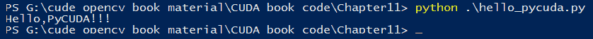

总结来说，本节逐步展示了开发一个简单的 PyCUDA 程序的步骤。 

# 内核调用

使用 ANSI C 关键字以及 CUDA 扩展关键字编写的设备代码被称为 **内核**。它通过一种名为 **内核调用** 的方法从 Python 代码中启动。基本上，内核调用的意义是我们从主机代码中启动设备代码。内核代码与正常 C 函数非常相似；只是这段代码是由多个线程并行执行的。它在 Python 中的语法非常简单，如下所示：

```py
kernel (parameters for kernel,block=(tx,ty,tz) , grid=(bx,by,bz))
```

这从我们要启动的内核函数的指针开始。你应该确保这个内核指针是通过 `get_function` 方法创建的。然后，它可以包括用逗号分隔的内核函数参数。块参数表示要启动的线程数，而网格参数表示网格中的块数。块和网格参数使用一个 1 x 3 的 Python 元组指定，表示三维空间中的块和线程。内核启动启动的线程总数将是这些数字的乘积。

# 从 PyCUDA 程序访问 GPU 设备属性

PyCUDA 提供了一个简单的 API 来查找信息，例如，哪些 CUDA 兼容的 GPU 设备（如果有）存在，以及每个设备支持哪些功能。在编写 PyCUDA 程序之前，了解正在使用的 GPU 设备的属性非常重要，这样就可以使用设备的最佳资源。

使用 PyCUDA 显示系统上所有 CUDA 兼容设备属性的程序如下所示：

```py
import pycuda.driver as drv
import pycuda.autoinit
drv.init()
print("%d device(s) found." % drv.Device.count())
for i in range(drv.Device.count()):
  dev = drv.Device(i)
  print("Device #%d: %s" % (i, dev.name()))
  print(" Compute Capability: %d.%d" % dev.compute_capability())
  print(" Total Memory: %s GB" % (dev.total_memory()//(1024*1024*1024)))

  attributes = [(str(prop), value) 
    for prop, value in list(dev.get_attributes().items())]
    attributes.sort()
    n=0

    for prop, value in attributes:
      print(" %s: %s " % (prop, value),end=" ")
      n = n+1
      if(n%2 == 0):
        print(" ")
```

首先，重要的是要获取系统上存在的 CUDA 兼容设备数量，因为一个系统可能包含多个启用 GPU 的设备。这个数量可以通过 PyCUDA 中驱动类 `drv.Device.count()` 函数确定。系统上所有设备都会被迭代以确定每个设备的属性。使用 `drv.Device` 函数为每个设备创建一个指针对象。这个指针用于确定特定设备的所有属性。

`name` 函数将给出特定设备的名称，而 `total_memory` 将给出设备上可用的 GPU 全局内存的大小。其他属性存储为 Python 字典，可以通过 `get_attributes().items()` 函数检索。这通过 Python 中的列表推导式转换为元组列表。这个列表的所有行都包含一个 2 x 1 的元组，其中包含属性的名称和其值。

使用 `for` 循环迭代此列表以在控制台上显示所有属性。此程序在配备 GeForce 940 GPU 和 CUDA 9 的笔记本电脑上执行。程序输出如下：

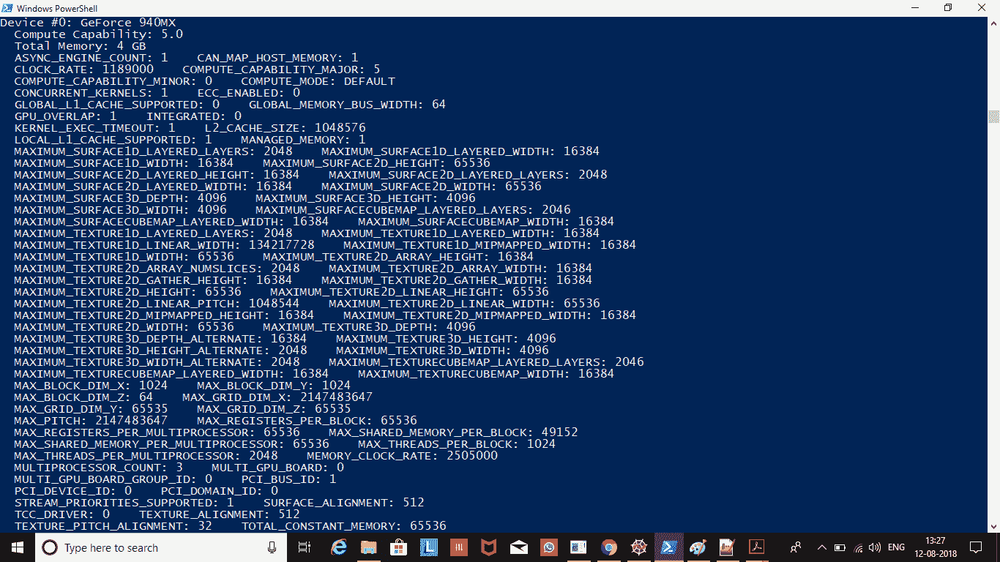

这些属性在本书的早期章节中已经详细讨论过，所以我们不再重复讨论；然而，为了总结，本节展示了从 PyCUDA 程序中访问 GPU 设备属性的方法。

# PyCUDA 中的线程和块执行

我们在 *内核调用* 部分看到，我们可以并行启动多个块和多个线程。那么，这些块和线程以什么顺序开始和结束它们的执行？如果我们想在其他线程中使用一个线程的输出，了解这一点很重要。为了理解这一点，我们修改了前面章节中看到的 `hello,PyCUDA!` 程序中的内核，通过在内核调用中包含一个打印语句来打印块号。修改后的代码如下所示：

```py

import pycuda.driver as drv
import pycuda.autoinit
from pycuda.compiler import SourceModule

mod = SourceModule("""
  #include <stdio.h>
  __global__ void myfirst_kernel()
  {
    printf("I am in block no: %d \\n", blockIdx.x);
  }
""")

function = mod.get_function("myfirst_kernel")
function(grid=(4,1),block=(1,1,1))
```

从代码中可以看出，我们以并行方式启动了 10 个块，每个块有一个线程。在内核代码中，我们正在打印内核执行的块 ID。我们可以将其视为 10 个相同的 `myfirstkernel` 并行开始执行。这些副本中的每一个都将有一个唯一的块 ID，可以通过 `blockIdx.x` 指令访问，以及唯一的线程 ID，可以通过 `threadIdx.x` 访问。这些 ID 将告诉我们哪个块和线程正在执行内核。当你多次运行程序时，你会发现每次块执行的顺序都不同。一个示例输出如下所示：

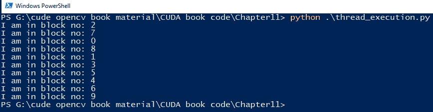

它可以产生 *n* 的阶乘数量的不同输出，其中 *n* 表示并行启动的块的数量。因此，每次你在 PyCUDA 中编写程序时，都应该小心，因为块会以随机顺序执行。

# PyCUDA 中的基本编程概念

在本节中，我们将开始使用 PyCUDA 开发一些有用的功能。本节还将通过一个简单的加法示例展示 PyCUDA 的一些有用的函数和指令。

# PyCUDA 中的加法

Python 提供了一个用于数值运算的非常快速的库，称为 **numpy (Numeric Python)**。它是用 C 或 C++ 开发的，并且对于 Python 中的数组操作非常有用。它在 PyCUDA 程序中经常被用作 PyCUDA 内核函数的参数，这些参数作为 numpy 数组传递。本节解释了如何使用 PyCUDA 添加两个数字。添加两个数字的基本内核代码如下所示：

```py
import pycuda.autoinit
import pycuda.driver as drv
import numpy
from pycuda.compiler import SourceModule
mod = SourceModule("""

  __global__ void add_num(float *d_result, float *d_a, float *d_b)
  {
     const int i = threadIdx.x; 
     d_result[i] = d_a[i] + d_b[i];
  }
""")

```

如前所述，导入 `SourceModule` 类和驱动类。`numpy` 库也被导入，因为它将用于将参数传递给内核代码。`add_num` 内核函数被定义为 `SourceModule` 类的构造函数。该函数接受两个设备指针作为输入，一个设备指针指向加法的结果作为输出。需要注意的是，尽管我们在添加两个数字，但内核函数被定义为可以同时处理两个数组加法。两个单个数字不过是每个只有一个元素的数组。如果没有错误，此代码将被编译并加载到设备上。从 Python 调用此内核代码的代码如下所示：

```py

add_num = mod.get_function("add_num")

h_a = numpy.random.randn(1).astype(numpy.float32)
h_b = numpy.random.randn(1).astype(numpy.float32)

h_result = numpy.zeros_like(h_a)
d_a = drv.mem_alloc(h_a.nbytes)
d_b = drv.mem_alloc(h_b.nbytes)
d_result = drv.mem_alloc(h_result.nbytes)
drv.memcpy_htod(d_a,h_a)
drv.memcpy_htod(d_b,h_b)

add_num(
  d_result, d_a, d_b,
  block=(1,1,1), grid=(1,1))
drv.memcpy_dtoh(h_result,d_result)
print("Addition on GPU:")
print(h_a[0],"+", h_b[0] , "=" , h_result[0])
```

使用 `get_function` 创建内核函数的指针引用。使用 `numpy.random.randn(1)` 函数创建两个随机数，该函数用于创建正态分布中的随机数。这些数字使用 `astype(numpy.float32)` 方法转换为单精度浮点数。用于在主机上存储结果的 numpy 数组被初始化为零。

可以使用 PyCUDA 中驱动类的 `mem_alloc` 函数在设备上分配内存。内存的大小作为函数的参数传递。使用 `h_a.nbytes` 函数找到输入的大小。PyCUDA 在驱动类中提供了一个 `memcpy` 函数，用于从主机内存到设备内存以及相反方向的复制数据。

`drv.memcpy_htod` 函数用于将数据从主机内存复制到设备内存。设备内存的指针作为第一个参数传递，主机内存指针作为第二个参数传递。通过传递设备指针以及指定要启动的块和线程数量的数字作为参数，调用 `add_num` 内核。在前面给出的代码中，使用一个线程启动了一个块。内核计算的结果通过使用 `drv.memcpy_dtoh` 函数复制回主机。结果在控制台上显示，如下所示：

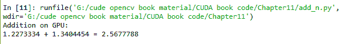

总结来说，本节展示了 PyCUDA 程序的结构。它从内核定义代码开始。然后在 Python 中定义输入。在设备上分配内存并将输入传输到设备内存。接着是内核调用，它将计算结果。然后将结果传输到主机进行进一步处理。PyCUDA 提供了更简单的 API 来执行此操作，这将在下一节中解释。

# 使用驱动类简化加法程序

PyCUDA 提供了一个更简单的内核调用 API，它不需要内存分配和内存复制。这是通过 API 隐式完成的。这可以通过使用 PyCUDA 中驱动类中的 `In` 和 `Out` 函数来实现。修改后的数组加法代码如下所示：

```py
import pycuda.autoinit
import pycuda.driver as drv
import numpy
N = 10
from pycuda.compiler import SourceModule
mod = SourceModule("""

  __global__ void add_num(float *d_result, float *d_a, float *d_b)
 {
    const int i = threadIdx.x; 
    d_result[i] = d_a[i] + d_b[i];
 }
""")
add_num = mod.get_function("add_num")
h_a = numpy.random.randn(N).astype(numpy.float32)
h_b = numpy.random.randn(N).astype(numpy.float32)
h_result = numpy.zeros_like(h_a)
add_num(
  drv.Out(h_result), drv.In(h_a), drv.In(h_b),
  block=(N,1,1), grid=(1,1))
print("Addition on GPU:")
for i in range(0,N):
  print(h_a[i],"+", h_b[i] , "=" , h_result[i])
```

在前面的代码中，数组中的十个元素被添加，而不是单个元素。内核函数与之前看到的代码完全相同。在主机上创建了两个包含十个随机数的数组。现在，不是创建它们的内存并将它们传输到设备，而是直接调用内核。通过指定数据方向使用 `drv.Out` 或 `drv.In` 来修改内核调用。这简化了 PyCUDA 代码并减少了代码的大小。

内核函数使用一个块和每个块 *N* 个线程。这 *N* 个线程并行地添加数组中的 *N* 个元素，从而加速了加法操作。使用 `drv.out` 指令，内核的结果会自动下载到主机内存，因此这个结果可以直接通过 `for` 循环打印到控制台。使用 PyCUDA 进行十个元素加法的结果如下所示：

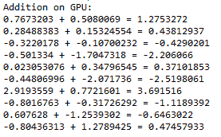

总结来说，本节通过一个简单的数组加法程序介绍了 PyCUDA 的重要概念和函数。使用 PyCUDA 的性能提升可以通过下一节中解释的 CUDA 事件来量化。

# 使用 CUDA 事件测量 PyCUDA 程序的性能

到目前为止，我们还没有明确确定 PyCUDA 程序的性能。在本节中，我们将看到如何使用 CUDA 事件测量程序的性能。这在 PyCUDA 中是一个非常重要的概念，因为它将允许你从许多选项中选择特定应用的性能最佳算法。

# CUDA 事件

我们可以使用 Python 时间测量选项来测量 CUDA 程序的性能，但它不会给出准确的结果。它将包括许多其他因素中的线程延迟在操作系统中的时间开销和调度。使用 CPU 测量的时间也将取决于高精度 CPU 计时器的可用性。很多时候，当 GPU 内核运行时，主机正在执行异步计算，因此 Python 的 CPU 计时器可能不会给出内核执行的正确时间。因此，为了测量 GPU 内核计算的时间，PyCUDA 提供了一个事件 API。

CUDA 事件是在 PyCUDA 程序中指定点记录的 GPU 时间戳。在这个 API 中，GPU 记录时间戳，消除了使用 CPU 计时器测量性能时存在的问题。使用 CUDA 事件测量时间有两个步骤：创建事件和记录事件。我们可以记录两个事件，一个在代码的开始处，一个在结束处。然后我们将尝试计算两个事件之间的时间差，这将给出代码的整体性能。

在 PyCUDA 代码中，可以包含以下行来使用 CUDA 事件 API 测量性能：

```py
import pycuda.driver as drv
start = drv.Event()
end=drv.Event()
#Start Time
start.record()
#The kernel code for which time is to be measured
#End Time
end.record()
end.synchronize()
#Measure time difference
secs = start.time_till(end)*1e-3
```

使用`record`方法来测量当前时间戳。在内核代码前后测量时间戳以测量内核执行时间。可以使用`time_till`方法测量时间戳之间的差异，如前述代码所示。它将以毫秒为单位给出时间，然后将其转换为秒。在下一节中，我们将尝试使用 CUDA 事件来测量代码的性能。

# 使用大数组加法来测量 PyCUDA 的性能

本节将演示如何使用 CUDA 事件来测量 PyCUDA 程序的性能。同时，还描述了 PyCUDA 代码与简单 Python 代码性能的比较。为了准确比较性能，选取了包含一百万个元素的数组。下面展示了用于大数组加法的内核代码：

```py
import pycuda.autoinit
import pycuda.driver as drv
import numpy
import time
import math

from pycuda.compiler import SourceModule
N = 1000000
mod = SourceModule("""

__global__ void add_num(float *d_result, float *d_a, float *d_b,int N)
{
 int tid = threadIdx.x + blockIdx.x * blockDim.x; 
  while (tid < N)
  {
    d_result[tid] = d_a[tid] + d_b[tid];
    tid = tid + blockDim.x * gridDim.x;
  }
}
""")
```

由于元素数量较多，因此会启动多个块和线程。所以，既使用线程 ID 又使用块 ID 来计算线程索引。如果启动的总线程数不等于元素数，则同一线程会添加多个元素。这是通过内核函数内部的`while`循环实现的。同时，它也会确保线程索引不会超出数组元素。除了输入数组和输出数组外，数组的大小也被作为内核函数的参数，因为在`SourceModule`中内核代码无法访问 Python 的全局变量。下面展示了用于添加大数组的 Python 代码：

```py
start = drv.Event()end=drv.Event()
add_num = mod.get_function("add_num")

h_a = numpy.random.randn(N).astype(numpy.float32)
h_b = numpy.random.randn(N).astype(numpy.float32)

h_result = numpy.zeros_like(h_a)
h_result1 = numpy.zeros_like(h_a)
n_blocks = math.ceil((N/1024))
start.record()
add_num(
  drv.Out(h_result), drv.In(h_a), drv.In(h_b),numpy.uint32(N),
  block=(1024,1,1), grid=(n_blocks,1))
end.record()
end.synchronize()
secs = start.time_till(end)*1e-3
print("Addition of %d element of GPU"%N)
print("%fs" % (secs))
```

创建了两个事件`start`和`stop`来测量 GPU 代码的执行时间。使用驱动类中的`Event()`函数来定义事件对象。然后，使用`get_function`创建内核函数的指针引用。使用`numpy`库的`randn`函数初始化两个包含一百万个元素的数组，并使用随机数。由于它们是浮点数，因此将它们转换为单精度数以加快设备上的计算速度。

每个块支持 1,024 个线程，正如我们在设备属性部分所看到的。因此，根据这一点，通过将*N*除以 1,024 来计算总块数。它可能是一个浮点值，因此使用`numpy`库的`ceil`函数将其转换为下一个最高整数值。然后，使用计算出的块数和每个块的 1,024 个线程来启动内核。使用`numpy.uint32`数据类型传递数组的大小。

使用记录函数在调用内核函数前后记录时间，并计算时间差以测量内核函数的执行时间。计算出的时间将打印在控制台上。为了将此性能与 CPU 时间进行比较，程序中添加了以下代码：

```py
start = time.time()
for i in range(0,N):
    h_result1[i] = h_a[i] +h_b[i]
end = time.time()
print("Addition of %d element of CPU"%N)
print(end-start,"s")
```

使用 Python 的时间库来测量 CPU 时间。使用`for`循环遍历数组中的每个元素。（注意：由于两个数组都是 numpy 数组，你也可以使用`h_result1 = h_a + h_b`。）使用`time.time()`函数在`for`循环前后测量时间，并将这两个时间之间的差值打印到控制台。程序的输出如下所示：

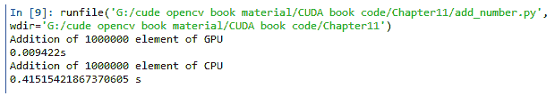

如输出所示，GPU 添加一百万个元素需要 9.4 毫秒，而 CPU 需要 415.15 毫秒，因此使用 GPU 可以实现大约 50 倍的性能提升。

总结来说，本节展示了使用事件来测量 GPU 代码的计时。将 GPU 性能与 CPU 性能进行比较，以量化使用 GPU 时的性能提升。

# PyCUDA 中的复杂程序

到现在为止，PyCUDA 的语法和术语应该已经熟悉了。我们将利用这些知识来开发高级程序，并学习一些 PyCUDA 的高级概念。在本节中，我们将使用 PyCUDA 开发一个程序，使用三种不同的方法对数组的元素进行平方。我们还将学习在 PyCUDA 中进行矩阵乘法的代码。

# PyCUDA 中矩阵的逐元素平方

在本节中，使用三种不同的方法执行矩阵中数字的逐元素平方操作。在这个过程中，详细解释了使用多维线程和块的概念、驱动类中的`inout`指令以及`gpuarray`类。

# 使用多维线程的简单内核调用

本节实现了使用 PyCUDA 对矩阵的每个元素进行平方的简单内核函数。以下是一个 5 x 5 矩阵中每个元素平方的内核函数示例：

```py
import pycuda.driver as drv
import pycuda.autoinit 
from pycuda.compiler import SourceModule
import numpy
mod = SourceModule("""
  __global__ void square(float *d_a)
  {
    int idx = threadIdx.x + threadIdx.y*5;
    d_a[idx] = d_a[idx]*d_a[idx];
  }
""")
```

核函数`square`只接受一个设备指针作为输入，该指针指向矩阵，并将每个元素替换为其平方。随着多维线程的启动，*x*和*y*方向上的线程索引被用来索引矩阵中的值。你可以假设一个 5 x 5 矩阵被展平为一个 1 x 25 的向量，以理解索引机制。请注意，在这个代码中，矩阵的大小是硬编码为`5`的，但它也可以像上一节中的数组大小一样由用户定义。使用此内核函数的 Python 代码如下所示：

```py
start = drv.Event()
end=drv.Event()
h_a = numpy.random.randint(1,5,(5, 5))
h_a = h_a.astype(numpy.float32)
h_b=h_a.copy()

start.record()

d_a = drv.mem_alloc(h_a.size * h_a.dtype.itemsize)
drv.memcpy_htod(d_a, h_a)

square = mod.get_function("square")
square(d_a, block=(5, 5, 1), grid=(1, 1), shared=0)

h_result = numpy.empty_like(h_a)
drv.memcpy_dtoh(h_result, d_a)
end.record()
end.synchronize()
secs = start.time_till(end)*1e-3
print("Time of Squaring on GPU without inout")
print("%fs" % (secs))
print("original array:")
print(h_a)
print("Square with kernel:")
print(h_result)
```

创建了两个事件来测量内核函数的计时。在主机上，一个 5x5 的矩阵通过 `numpy.random` 模块的 `randint` 函数初始化为随机数。这需要三个参数。前两个参数定义了用于生成随机数的数字范围。第一个参数是最小值，第二个参数是用于生成数字的最大值。第三个参数是大小，指定为元组 (5,5)。这个生成的矩阵再次转换为单精度数以加快处理速度。矩阵的内存是在设备上分配的，生成的随机数矩阵被复制到其中。

创建了指向内核函数的指针引用，并通过传递设备内存指针作为参数调用内核。内核调用使用多维线程，*x* 和 *y* 方向上的值为 5。因此，总共启动了 25 个线程，每个线程计算矩阵中单个元素的平方。内核计算的结果被复制回主机并在控制台上显示。内核所需的时间以及输入和输出矩阵都显示在控制台上。

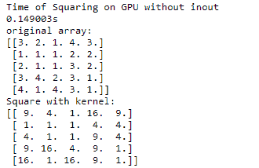

计算一个 5x5 矩阵中每个元素的平方需要 149 毫秒。使用驱动类的 `inout` 指令可以简化相同的计算。这将在下一节中解释。

# 使用 `inout` 与内核调用结合使用

如上一节程序的核心函数所示，相同的数组既用作输入也用作输出。PyCUDA 的驱动模块为这类情况提供了一个 `inout` 指令。它消除了为该数组单独分配内存、上传到设备以及将结果下载回主机的需求。所有操作都在内核调用期间同时进行。这使得代码更简单，更容易阅读。使用驱动类 `inout` 指令的 Python 代码如下所示：

```py
start.record()
start.synchronize()

square(drv.InOut(h_a), block=(5, 5, 1))

end.record()
end.synchronize()

print("Square with InOut:")
print(h_a)
secs = start.time_till(end)*1e-3
print("Time of Squaring on GPU with inout")
print("%fs" % (secs))
```

使用 `inout` 指令初始化 CUDA 事件以测量代码的性能。内核调用与上一节相同，因此在此不再重复。可以看出，在调用平方内核时，通过 `drv.inout` 指令传递了一个变量作为参数。因此，所有与设备相关的操作都在这一步中完成。内核调用使用多维线程，与上一节的情况相同。计算结果和耗时被打印到控制台，如下所示：

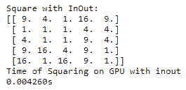

所需时间相对于原始内核来说比较少。因此，通过使用驱动类中的 `inout` 指令，PyCUDA 代码可以变得高效且易于阅读。PyCUDA 还提供了一个用于数组相关操作的 `gpuarray` 类。它也可以用于平方操作，这将在下一节中解释。

# 使用 `gpuarray` 类

Python 提供了一个 `numpy` 库，用于在 Python 中进行数值计算。PyCUDA 提供了一个与 `numpy` 类似的 `gpuarray` 类，该类在 GPU 设备上存储其数据和执行其计算。数组的形状和数据类型与 `numpy` 中完全相同。`gpuarray` 类提供了许多用于计算的算术方法。它消除了使用 `SourceModule` 在 C 或 C++ 中指定内核代码的需要。因此，PyCUDA 代码将只包含 Python 代码。使用 `gpuarray` 类对矩阵的每个元素进行平方的代码如下所示：

```py
import pycuda.gpuarray as gpuarray
import numpy
import pycuda.driver as drv

start = drv.Event()
end=drv.Event()
start.record()
start.synchronize()

h_b = numpy.random.randint(1,5,(5, 5))
d_b = gpuarray.to_gpu(h_b.astype(numpy.float32))
h_result = (d_b**2).get()
end.record()
end.synchronize()

print("original array:")
print(h_b)
print("doubled with gpuarray:")
print(h_result)
secs = start.time_till(end)*1e-3
print("Time of Squaring on GPU with gpuarray")
print("%fs" % (secs))
```

`gpuarray` 类需要在代码中使用，它位于 `pycuda.gpuarray` 模块中。矩阵使用从 1 到 5 的随机整数进行初始化，以便进行计算。这个矩阵通过使用 `gpuarray` 类的 `to_gpu()` 方法上传到设备内存。要上传的矩阵作为参数传递给此方法。矩阵被转换为单精度数字。所有对这个上传矩阵的操作都将在该设备上执行。平方操作以与我们在 Python 代码中执行的方式类似的方式进行，但由于变量是使用 `gpuarray` 存储在设备上的，因此此操作也将在该设备上执行。结果通过使用 `get` 方法下载回主机。以下是在控制台上显示的结果，包括使用 `gpuarray` 进行逐元素平方所需的时间：

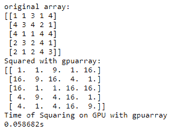

计算平方需要大约 58 毫秒。它完全消除了在 C 语言中定义内核函数的需要，其功能与 `numpy` 库相似，因此 Python 程序员可以轻松地与之一起工作。

总结来说，在本节中，我们使用 PyCUDA 以三种不同的方式开发了一个逐元素平方程序。我们还看到了 PyCUDA 中的多维线程、`inout` 指令和 `gpuarray` 类的概念。

# 使用 GPU 数组进行点积

两个向量之间的点积是各种应用中重要的数学运算。上一节中使用的 `gpuarray` 类可以用来计算两个向量之间的点积。`gpuarray` 方法计算点积的性能与 `numpy` 操作进行了比较。用于使用 `numpy` 计算点积的代码如下所示：

```py
import pycuda.gpuarray as gpuarray
import pycuda.driver as drv
import numpy
import time
import pycuda.autoinit
n=100
h_a=numpy.float32(numpy.random.randint(1,5,(1,n)))
h_b=numpy.float32(numpy.random.randint(1,5,(1,n)))

start=time.time()
h_result=numpy.sum(h_a*h_b)

#print(numpy.dot(a,b))
end=time.time()-start
print("Answer of Dot Product using numpy")
print(h_result)
print("Time taken for Dot Product using numpy")
print(end,"s")
```

初始化了两个各有 100 个元素的向量，并使用随机整数来计算点积。Python 的时间模块用于计算计算点积所需的时间。使用`*`运算符来计算两个向量的逐元素乘积，然后将这些结果相加以计算总的点积。请注意，这里使用的`numpy.dot`方法用于矩阵乘法，不能用于点积。计算出的点积和时间将在控制台上显示。以下是如何使用`gpuarray`在 GPU 上执行相同操作的代码：

```py
d_a = gpuarray.to_gpu(h_a)
d_b = gpuarray.to_gpu(h_b)

start1 = drv.Event()
end1=drv.Event()
start1.record()

d_result = gpuarray.dot(d_a,d_b)
end1.record()
end1.synchronize()
secs = start1.time_till(end1)*1e-3
print("Answer of Dot Product on GPU")
print(d_result.get())
print("Time taken for Dot Product on GPU")
print("%fs" % (secs))
if(h_result==d_result.get()):
  print("The computed dor product is correct")
```

使用`to_gpu`方法将两个向量上传到 GPU 上以计算点积。`gpuarray`类提供了一个点积方法，可以直接用于计算点积。它需要一个 GPU 数组作为参数。使用`get()`方法将计算结果下载回主机。计算结果和通过 CUDA 事件测量的时间将在控制台上显示。程序的结果如下所示：

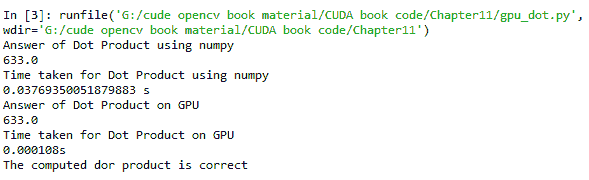

从输出中可以看出，使用`numpy`和`gpuarray`计算点积得到相同的结果。`numpy`库计算点积需要 37 毫秒，而 GPU 只需 0.1 毫秒即可完成相同的操作。这进一步说明了使用 GPU 和 PyCUDA 进行复杂数学运算的优势。

# 矩阵乘法

经常使用的一个重要数学运算是矩阵乘法。本节将演示如何使用 PyCUDA 在 GPU 上执行矩阵乘法。当矩阵的大小非常大时，这是一个非常复杂的数学运算。应记住，对于矩阵乘法，第一个矩阵的列数应等于第二个矩阵的行数。矩阵乘法不是累积操作。为了避免复杂性，在这个例子中，我们使用相同大小的方阵。如果你熟悉矩阵乘法的数学，你可能还记得，第一个矩阵的每一行将与第二个矩阵的所有列相乘。这将对第一个矩阵的所有行重复进行。以下是一个 3x3 矩阵乘法的示例：

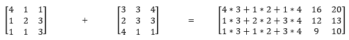

结果矩阵中的每个元素将通过将第一个矩阵的对应行与第二个矩阵的对应列相乘来计算。这个概念被用来开发以下所示的内核函数：

```py

import numpy as np
from pycuda import driver
from pycuda.compiler import SourceModule
import pycuda.autoinit
MATRIX_SIZE = 3 

matrix_mul_kernel = """
__global__ void Matrix_Mul_Kernel(float *d_a, float *d_b, float *d_c)
{
  int tx = threadIdx.x;
  int ty = threadIdx.y;
  float value = 0;

  for (int i = 0; i < %(MATRIX_SIZE)s; ++i) {
    float d_a_element = d_a[ty * %(MATRIX_SIZE)s + i];
    float d_b_element = d_b[i * %(MATRIX_SIZE)s + tx];
    value += d_a_element * d_b_element;
 }

   d_c[ty * %(MATRIX_SIZE)s + tx] = value;
 } """

matrix_mul = matrix_mul_kernel % {'MATRIX_SIZE': MATRIX_SIZE}

mod = SourceModule(matrix_mul)
```

内核函数接受两个输入数组和一个输出数组作为参数。矩阵的大小作为常量传递给内核函数。这样就消除了需要将向量的大小作为内核函数参数之一的需求，正如本章前面所解释的那样。两种方法都是正确的，取决于程序员认为哪种更方便。每个线程计算结果矩阵的一个元素。第一矩阵的行和第二矩阵的列的所有元素在`for`循环内相乘并求和。答案被复制到结果矩阵中的相应位置。内核函数内部计算索引的细节可以在本书的早期章节中找到。以下是如何使用此内核函数的 Python 代码：

```py

h_a = np.random.randint(1,5,(MATRIX_SIZE, MATRIX_SIZE)).astype(np.float32)
h_b = np.random.randint(1,5,(MATRIX_SIZE, MATRIX_SIZE)).astype(np.float32)

d_a = gpuarray.to_gpu(h_a) 
d_b = gpuarray.to_gpu(h_b)
d_c_gpu = gpuarray.empty((MATRIX_SIZE, MATRIX_SIZE), np.float32)

matrixmul = mod.get_function("Matrix_Mul_Kernel")

matrixmul(d_a, d_b,d_c_gpu, 
  block = (MATRIX_SIZE, MATRIX_SIZE, 1),
)
print("*" * 100)
print("Matrix A:")
print(d_a.get())

print("*" * 100)
print("Matrix B:")
print(d_b.get())

print("*" * 100)
print("Matrix C:")
print(d_c_gpu.get())

  # compute on the CPU to verify GPU computation
h_c_cpu = np.dot(h_a, h_b)
if h_c_cpu == d_c_gpu.get() :
    print("The computed matrix multiplication is correct")
```

两个大小为 3 x 3 的矩阵被初始化为从`1`到`5`的随机整数。这些矩阵使用`gpuarray`类的`to_gpu`方法上传到设备内存。创建一个空的 GPU 数组以在设备上存储结果。这三个变量作为参数传递给内核函数。内核函数调用时，矩阵大小作为*x*和*y*方向的维度。结果使用`get()`方法下载回主机。两个输入矩阵和 GPU 计算的结果在控制台上打印。使用`numpy`库的 dot 方法在 CPU 上计算矩阵乘法。结果与内核计算的结果进行比较，以验证内核计算的结果。程序的结果如下所示：

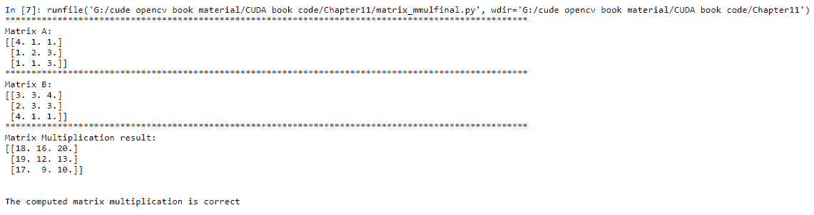

总结来说，我们已经开发了一个简单的内核函数，使用 PyCUDA 执行矩阵乘法。这个内核函数可以通过使用共享内存进一步优化，正如本书前面所解释的那样。

# PyCUDA 中的高级内核函数

到目前为止，我们已经看到了使用`SourceModule`类在 C 或 C++中定义内核函数的使用。我们还使用了`gpuarray`类来进行设备计算，而不需要显式定义内核函数。本节描述了 PyCUDA 中可用的高级内核定义功能。这些功能用于开发各种并行通信模式的内核函数，如映射、归约和扫描操作。

# PyCUDA 中的元素级内核

这个特性允许程序员定义一个内核函数，该函数作用于数组的每个元素。它允许程序员将一个或多个操作数组成的复杂表达式执行为一个单一的计算步骤。以下是这样定义大型数组元素级加法内核函数的方式：

```py
import pycuda.gpuarray as gpuarray
import pycuda.driver as drv
from pycuda.elementwise import ElementwiseKernel
from pycuda.curandom import rand as curand
add = ElementwiseKernel(
  "float *d_a, float *d_b, float *d_c",
  "d_c[i] = d_a[i] + d_b[i]",
  "add")

```

使用`PyCuda.elementwise.ElementwiseKernel`函数来定义元素级核函数。它需要三个参数。第一个参数是核函数的参数列表。第二个参数定义了对每个元素要执行的操作，第三个参数指定了核函数的名称。以下是如何使用此核函数的 Python 代码示例：

```py

n = 1000000
d_a = curand(n)
d_b = curand(n)
d_c = gpuarray.empty_like(d_a)
start = drv.Event()
end=drv.Event()
start.record()
add(d_a, d_b, d_c)
end.record()
end.synchronize()
secs = start.time_till(end)*1e-3
print("Addition of %d element of GPU"%shape)
print("%fs" % (secs))
# check the result
if d_c == (d_a + d_b):
  print("The sum computed on GPU is correct")
```

使用`pycuda.curandom`类中的`curand`函数用随机数初始化两个数组。这又是一个有用的功能，因为它消除了在主机上初始化然后上传到设备内存的需要。创建一个空的 GPU 数组来存储结果。通过将这些三个变量作为参数传递来调用`add`核函数。使用 CUDA 事件计算一百万个元素加法所需的时间，并在控制台上显示。

程序的输出如下所示：

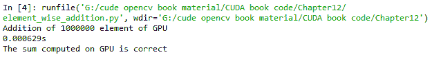

元素级核函数只需要 0.6 毫秒即可完成数组中一百万个元素的加法操作。这种性能优于本章前面看到的程序。因此，当要对向量执行元素级操作时，元素级核定义是一个非常重要的概念需要记住。

# 归约核

归约操作可以通过使用某些表达式将元素集合归约到单个值来定义。它在各种并行计算应用中非常有用。以计算向量点积的例子来展示 PyCUDA 中的归约概念。以下是如何使用 PyCUDA 中归约核功能计算点积的程序示例：

```py
import pycuda.gpuarray as gpuarray
import pycuda.driver as drv
import numpy
from pycuda.reduction import ReductionKernel
import pycuda.autoinit
n=5
start = drv.Event()
end=drv.Event()
start.record()
d_a = gpuarray.arange(n,dtype= numpy.uint32)
d_b = gpuarray.arange(n,dtype= numpy.uint32)
kernel = ReductionKernel(numpy.uint32,neutral="0",reduce_expr="a+b",map_expr="d_a[i]*d_b[i]",arguments="int *d_a,int *d_b")
d_result = kernel(d_a,d_b).get()
end.record()
end.synchronize()
secs = start.time_till(end)*1e-3
print("Vector A")
print(d_a)
print("Vector B")
print(d_b)
print("The computed dot product using reduction:")
print(d_result)
print("Dot Product on GPU")
print("%fs" % (secs))
```

PyCUDA 提供了`pycuda.reduction.ReductionKernel`类来定义归约核。它需要许多参数。第一个参数是输出数据类型。第二个参数是中值，通常定义为`0`。第三个参数是用于归约元素集合的表达式。在前面代码中定义了加法操作。第四个参数定义为归约前操作数之间映射操作的表达式。在代码中定义了元素级乘法。最后一个参数定义了核函数的参数。

计算点积的归约核函数需要两个向量之间的元素级乘法，然后对所有元素进行加法。使用`arange`函数定义了两个向量。它在 Python 中的`range`函数类似，但`arange`会将数组保存在设备上。通过将这些两个向量作为参数传递来调用核函数，并将结果检索到主机。使用 CUDA 事件计算所需的计算时间，并在控制台上与点积的结果一起显示，如下所示：

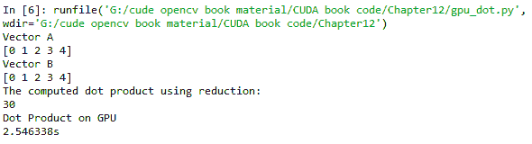

减少内核计算点积大约需要 2.5 秒，与上一节中看到的显式内核相比，这是一个相对较长时间。然而，在需要减少操作的并行计算应用中，它非常有用。

# 扫描内核

扫描操作再次是一个非常重要的并行计算范式。扫描操作符将指定的函数应用于输入的第一个元素。该函数的结果作为输入提供，并带有原始输入的第二个元素。所有中间结果形成输出序列。这个概念可以用于各种应用。以累积加法为例，演示了 PyCUDA 中的扫描内核概念。累积加法不过是将加法应用于向量的每个元素，顺序进行。示例如下：

```py
Input Vector
[7 5 9 2 9]
Scan Operation for cumulative sum
[7,7+5,7+5+9,7+5+9+2,7+2+9+2+7]
```

如所示，前一次加法的结果被添加到当前元素中，以计算当前位置的输出。这被称为**包含扫描**操作。如果输入的当前元素不参与，则称为**排除扫描**。使用包含扫描执行累积求和的程序如下所示：

```py

import pycuda.gpuarray as gpuarray
import pycuda.driver as drv
import numpy
from pycuda.scan import InclusiveScanKernel
import pycuda.autoinit
n=10
start = drv.Event()
end=drv.Event()
start.record()
kernel = InclusiveScanKernel(numpy.uint32,"a+b")
h_a = numpy.random.randint(1,10,n).astype(numpy.int32)
d_a = gpuarray.to_gpu(h_a)
kernel(d_a)
end.record()
end.synchronize()
secs = start.time_till(end)*1e-3
assert(d_a.get() == numpy.cumsum(h_a,axis=0)).all()
print("The input data:")
print(h_a)
print("The computed cumulative sum using Scan:")
print(d_a.get())
print("Cumulative Sum on GPU")
print("%fs" % (secs))
```

PyCUDA 提供了`pycuda.scan.InclusiveScanKernel`类来定义一个包含扫描内核。它需要输出数据类型和用于扫描的操作作为参数。对于累积求和，指定了加法操作。随机整数的数组被应用于这个内核函数的输入。内核输出将与输入具有相同的大小。输入和输出向量以及计算累积和所需的时间将在控制台上显示，如下所示：

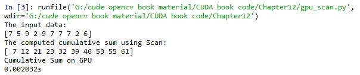

在一个数组的 10 个元素上运行扫描操作大约需要 2 毫秒。总结来说，在本节中，我们看到了定义映射、减少和扫描操作内核的各种特殊方法。

# 摘要

本章展示了 PyCUDA 编程的概念。它从使用 PyCUDA 开发一个简单的 `Hello, PyCUDA` 程序开始。详细讨论了在 C 或 C++ 中定义内核以及在 Python 代码中调用它的概念，以及从 PyCUDA 程序中访问 GPU 设备属性的 API。通过一个简单的程序解释了 PyCUDA 程序中多线程和多块执行机制。使用一个数组加法的简单示例描述了 PyCUDA 程序的基本结构。通过驱动类指令描述了 PyCUDA 代码的简化。详细解释了使用 CUDA 事件来衡量 PyCUDA 程序性能的方法。使用逐元素平方示例解释了驱动类中的 `inout` 指令和 `gpuarray` 类的功能。使用 `gpuarray` 类开发了使用 PyCUDA 计算点积的代码。详细解释了 PyCUDA 中用于矩阵乘法等复杂数学运算的代码。本章的最后部分描述了用于映射、归约和扫描操作的多种内核定义方法。

下一章将在此基础上构建知识，并描述 PyCUDA 中可用的某些高级内核以及使用 PyCUDA 开发计算机视觉应用程序。

# 问题

1.  在 PyCUDA 中使用 `SourceModule` 类定义内核函数时，使用哪种编程语言？将使用哪种编译器来编译这个内核函数？

1.  为本章中使用的 `myfirst_kernel` 函数编写一个内核调用函数，块的数量等于 1024 x 1024，每个块中的线程数等于 512 x 512。

1.  判断对错：PyCUDA 程序内部的块执行是按顺序进行的。

1.  在 PyCUDA 程序中使用 `In`、`Out` 和 `inout` 驱动类原语的优势是什么？

1.  编写一个 PyCUDA 程序，使用 `gpuarray` 类将向量中每个元素的值增加 2，向量的大小是任意的。

1.  使用 CUDA 事件来测量内核执行时间的优势是什么？

1.  判断对错：`gpuarray` 类是 Python 中 `numpy` 库的 GPU 设备版本。
