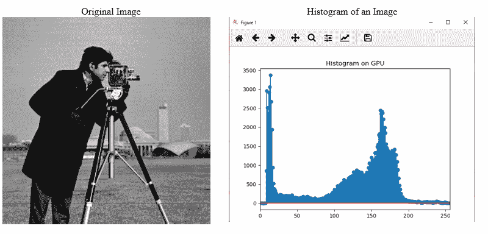
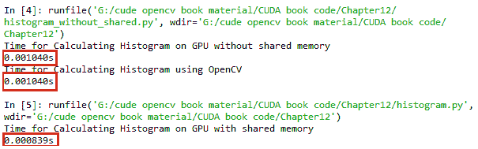
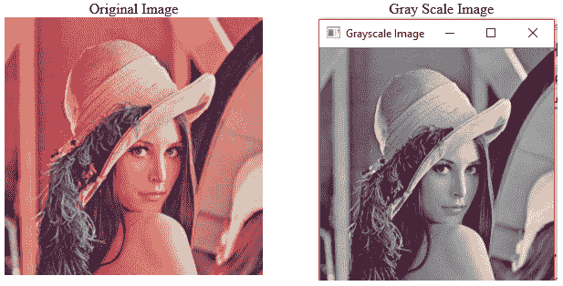
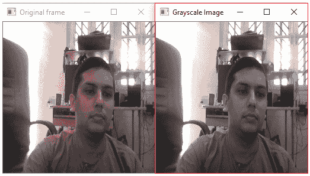
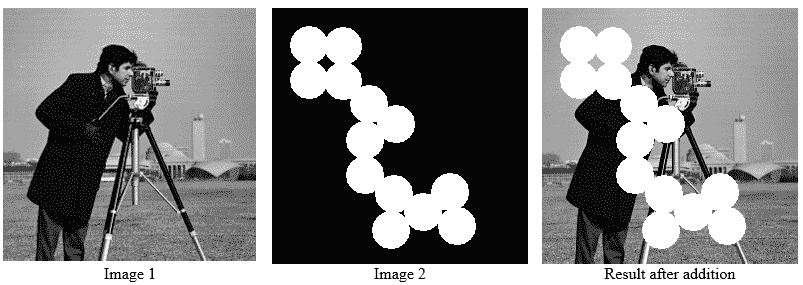
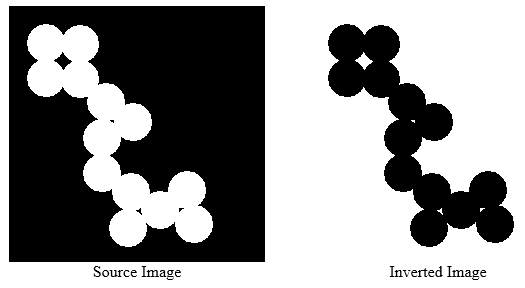

# 第十二章：使用 PyCUDA 的基本计算机视觉应用

在上一章中，我们学习了与 PyCUDA 相关的重要编程概念。我们还学习了如何使用这些编程概念在 PyCUDA 中开发一些程序。本章将在此基础上构建知识，我们将使用 PyCUDA 来开发基本的图像处理和计算机视觉应用。原子操作和共享内存的并行编程概念也将被详细解释。图像直方图传达了与图像对比度相关的信息，它还可以用作计算机视觉任务的图像特征。本章将详细解释使用 PyCUDA 计算直方图的程序。其他基本的计算机视觉应用，如使用 PyCUDA 进行颜色空间转换、图像加法和图像反转，也将被描述。

本章将涵盖以下主题：

+   使用原子操作和共享内存进行直方图计算

+   使用 PyCUDA 的基本计算机视觉应用

+   从网络摄像头进行图像和视频的颜色空间转换

+   图像加法

+   图像反转

# 技术要求

本章要求对 Python 编程语言有良好的理解。它还需要任何带有 Nvidia GPU 的计算机或笔记本电脑。本章中使用的所有代码都可以从以下 GitHub 链接下载：[`github.com/PacktPublishing/Hands-On-GPU-Accelerated-Computer-Vision-with-OpenCV-and-CUDA`](https://github.com/PacktPublishing/Hands-On-GPU-Accelerated-Computer-Vision-with-OpenCV-and-CUDA)。查看以下视频以查看代码的实际运行情况：[`bit.ly/2prC1wI`](http://bit.ly/2prC1wI)

# PyCUDA 中的直方图计算

图像直方图传达了与图像对比度相关的信息，它还可以用作计算机视觉任务的图像特征。直方图表示特定像素值出现的频率。在计算大小为 256 x 256 的 8 位图像的直方图时，65,535 个像素值将在 0-255 的强度值数组上工作。如果为每个像素启动一个线程，那么 65,535 个线程将在 256 个强度值内存位置上工作。

考虑这样一种情况，即大量线程试图修改内存的一小部分。在计算图像直方图时，必须对所有内存位置执行读取-修改-写入操作。这个操作是 `d_out[i] ++`，其中首先从内存中读取 `d_out[i]`，然后增加，最后写回内存。然而，当多个线程在相同的内存位置执行此操作时，可能会给出错误的结果。

假设一个内存位置有一个初始值`0`，线程`a`和`b`尝试递增这个内存位置，那么最终答案应该是`2`。然而，在执行时，可能会发生`a`和`b`线程同时读取这个值的情况，那么这两个线程都将得到值`0`。它们将其递增到`1`，并且两个线程都将这个`1`存储在内存中。所以，计算出的答案是`1`，这是不正确的。

为了理解这可能会多么危险，考虑 ATM 现金取款的例子。假设你在账户中有$50,000 的余额。你有两张同一账户的 ATM 卡。你和你的朋友同时去两个不同的 ATM 取款$40,000。你们同时刷卡；所以，当 ATM 检查余额时，两个都会得到$50,000。如果你俩都取款$40,000，那么两台机器都会查看初始余额，即$50,000。取款金额小于余额，因此两台机器都会给出$40,000。尽管你的余额是$50,000，但你得到了$80,000，这是危险的。为了避免这些情况，在并行编程中使用原子操作，这将在下一节中解释。

# 使用原子操作

CUDA 提供了一个名为`atomicAdd`的 API，用于避免并行访问内存位置时的问题。这是一个阻塞操作，这意味着当多个线程尝试访问相同的内存位置时，一次只能有一个线程可以访问该内存位置。其他线程必须等待此线程完成并将答案写入内存。以下是一个使用`atomicAdd`操作计算直方图的内核函数示例：

```py
import pycuda.autoinit
import pycuda.driver as drv
import numpy
import matplotlib.pyplot as plt
from pycuda.compiler import SourceModule
mod = SourceModule("""          
__global__ void atomic_hist(int *d_b, int *d_a, int SIZE)
{
 int tid = threadIdx.x + blockDim.x * blockIdx.x;
 int item = d_a[tid];
 if (tid < SIZE)
 {
  atomicAdd(&(d_b[item]), 1);
 }
}
""")
```

内核函数有三个参数。第一个参数是计算后存储直方图输出的输出数组。对于 8 位图像，这个数组的大小将是 256。第二个参数是图像强度的展平数组。第三个参数是展平数组的大小。在线程索引处按像素强度索引的直方图数组的内存位置将为每个线程递增。线程的数量等于展平图像数组的大小。

`atomicAdd`函数用于递增内存位置。它接受两个参数。第一个是我们想要递增的内存位置，第二个是这个位置需要递增的值。`atomicadd`函数将增加直方图计算在执行时间上的成本。使用原子操作计算直方图的 Python 代码如下：

```py
atomic_hist = mod.get_function("atomic_hist")
import cv2
h_img = cv2.imread("cameraman.tif",0)

h_a=h_img.flatten()
h_a=h_a.astype(numpy.int)
h_result = numpy.zeros(256).astype(numpy.int)
SIZE = h_img.size
NUM_BIN=256
n_threads= int(numpy.ceil((SIZE+NUM_BIN-1) / NUM_BIN))
start = drv.Event()
end=drv.Event()
start.record()
atomic_hist(
    drv.Out(h_result), drv.In(h_a), numpy.uint32(SIZE),
    block=(n_threads,1,1), grid=(NUM_BIN,1))

end.record()
end.synchronize()
secs = start.time_till(end)*1e-3
print("Time for Calculating Histogram on GPU with shared memory")
print("%fs" % (secs)) 
plt.stem(h_result)
plt.xlim([0,256])
plt.title("Histogram on GPU")
```

使用`get_function()`方法创建指向内核函数的指针引用。图像读取使用 OpenCV 库。如果 Python 中没有安装，您可以从命令提示符执行以下命令：

```py
$pip install opencv-python
```

然后，可以使用`import cv2`命令从任何 Python 程序中导入`OpenCV`库。图像读取函数与本书前面解释过的类似。图像被读取为灰度图像。在 Python 中，图像被存储为一个`numpy`数组。这个数组被展平为一个向量，以便它可以被一维线程和块操作。也可以在不展平的情况下使用二维线程处理图像。`numpy`库提供了一个`flatten()`方法来执行此操作。

块和线程的总数是根据图像的大小和直方图的桶数来计算的。在调用核函数时，将展平的图像数组、空直方图数组和展平数组的大小作为参数传递，同时传递要启动的块和线程数。核函数返回计算出的直方图，可以显示或绘制。

Python 提供了一个包含丰富绘图函数的`matplotlib`库。该库中的`stem`函数用于绘制离散的直方图函数。`xlim`函数用于设置 X 轴的界限。`title`函数用于给图表添加标题。程序的输出如下所示：



如果直方图没有所有强度的均匀分布，则可能导致对比度差的图像。可以通过直方图均衡化来增强对比度，这会将这种分布转换为均匀分布。直方图还传达了关于图像亮度的信息。如果直方图集中在图表的左侧，则图像会太暗；如果集中在右侧，则图像会太亮。再次强调，可以使用直方图均衡化来纠正这个问题。

计算直方图的核函数也可以使用并行编程中共享内存的概念来开发。这将在以下部分中说明。

# 使用共享内存

共享内存可以在 GPU 设备上片上使用，因此它比全局内存快得多。共享内存的延迟大约是全球未缓存内存延迟的 100 倍。来自同一块的线程都可以访问共享内存。这在许多需要线程之间共享结果的场景中非常有用。然而，如果不进行同步，这也可能导致混乱或错误的结果。如果一个线程在另一个线程写入之前从内存中读取数据，可能会导致错误的结果。因此，这种内存访问应该得到适当的控制或管理。这通过`__syncthreads()`指令来完成，它确保在程序继续前进之前，所有对内存的写入操作都已完成。这也被称为**屏障**。屏障的含义是所有线程都将到达这一行并等待其他线程完成。当所有线程都到达这个屏障后，它们可以继续前进。本节将演示如何从 PyCUDA 程序中使用共享内存。

这种共享内存的概念可以用于计算图像的直方图。内核函数如下所示：

```py
import pycuda.autoinit
import pycuda.driver as drv
import numpy
import matplotlib.pyplot as plt
from pycuda.compiler import SourceModule

mod1 = SourceModule("""
__global__ void atomic_hist(int *d_b, int *d_a, int SIZE)
{
 int tid = threadIdx.x + blockDim.x * blockIdx.x;
 int offset = blockDim.x * gridDim.x;
 __shared__ int cache[256];
 cache[threadIdx.x] = 0;
 __syncthreads();

 while (tid < SIZE)
 {
  atomicAdd(&(cache[d_a[tid]]), 1);
  tid += offset;
 }
 __syncthreads();
 atomicAdd(&(d_b[threadIdx.x]), cache[threadIdx.x]);
}
""")
```

对于 8 位图像，bins 的数量是 256，所以我们定义的共享内存大小等于块中的线程数，也就是 bins 的数量。我们将为当前块计算一个直方图，因此共享内存被初始化为零，并按前面讨论的方式计算该块的直方图。但这次，结果存储在共享内存中而不是全局内存中。在这种情况下，只有 256 个线程试图访问共享内存中的 256 个内存元素，而不是之前代码中的所有 65,535 个元素。这将有助于减少原子操作中的开销时间。最后一行的最终原子加操作将一个块的直方图添加到整体直方图值中。由于加法是一个累积操作，我们不必担心每个块执行的顺序。以下是如何使用此内核函数计算直方图的 Python 代码示例：

```py
atomic_hist = mod.get_function("atomic_hist")

import cv2
h_img = cv2.imread("cameraman.tif",0)

h_a=h_img.flatten()
h_a=h_a.astype(numpy.int)
h_result = numpy.zeros(256).astype(numpy.int)
SIZE = h_img.size
NUM_BIN=256
n_threads= int(numpy.ceil((SIZE+NUM_BIN-1) / NUM_BIN))
start = drv.Event()
end=drv.Event()
start.record()
atomic_hist(
 drv.Out(h_result), drv.In(h_a), numpy.uint32(SIZE),
 block=(n_threads,1,1), grid=(NUM_BIN,1),shared= 256*4)

end.record()
end.synchronize()
secs = start.time_till(end)*1e-3
print("Time for Calculating Histogram on GPU with shared memory")
print("%fs" % (secs)) 
plt.stem(h_result)
plt.xlim([0,256])
plt.title("Histogram on GPU")
```

代码几乎与上一节相同。唯一的区别在于内核调用。在调用内核时应该定义共享内存的大小。这可以通过内核调用函数中的共享参数来指定。它被指定为`256*4`，因为共享内存的大小为 256 个整数元素，每个元素需要 4 字节存储。与上一节显示的相同直方图将被显示。

为了检查计算出的直方图的准确性并比较性能，还使用 OpenCV 内置函数`calcHist`计算直方图，如下面的代码所示：

```py
start = cv2.getTickCount()
hist = cv2.calcHist([h_img],[0],None,[256],[0,256])
end = cv2.getTickCount()
time = (end - start)/ cv2.getTickFrequency()
print("Time for Calculating Histogram on CPU")
print("%fs" % (secs))
```

`calcHist` 函数需要五个参数。第一个参数是图像变量的名称。第二个参数在彩色图像的情况下指定通道。对于灰度图像，它为零。第三个参数指定了如果您想计算图像特定部分的直方图，则需要指定掩码。第四个参数指定了箱子的数量，第五个参数指定了强度值的范围。OpenCV 还在 Python 中提供了 `getTickCount` 和 `getTickFrequency` 函数来计算 OpenCV 代码的性能。没有共享内存、使用共享内存以及使用 OpenCV 函数的性能如下所示：



没有共享内存的内核函数耗时 1 毫秒，而使用共享内存时为 0.8 毫秒，这进一步证明了使用共享内存可以提高内核函数性能的观点。总结来说，在本节中，我们看到了在 GPU 上计算直方图的两种不同方法。我们还了解了原子操作和共享内存的概念，以及如何在 PyCUDA 中使用它们。

# 使用 PyCUDA 的基本计算机视觉操作

本节将演示如何使用 PyCUDA 开发简单的计算机视觉应用。在 Python 中，图像不过是二维或三维的 `numpy` 数组，因此在 PyCUDA 中处理和操作图像与处理多维数组类似。本节将为您提供一个基本的概念，帮助您开发一个简单的应用，您可以用它来利用 PyCUDA 开发复杂的计算机视觉应用。

# PyCUDA 中的颜色空间转换

大多数计算机视觉算法都处理灰度图像，因此需要将相机捕获的彩色图像转换为灰度图像。尽管 OpenCV 提供了内置函数来完成此操作，但您也可以通过开发自己的函数来实现。本节将演示如何开发一个 PyCUDA 函数，用于将彩色图像转换为灰度图像。如果已知将图像从一个颜色空间转换为另一个颜色空间的公式，那么本节中显示的函数可以通过替换公式来为任何颜色空间转换编写。

OpenCV 以 BGR 格式捕获和存储图像，其中蓝色是第一个通道，接着是绿色和红色。从 BGR 格式转换为灰度的公式如下：

```py
gray = 0.299*r+0.587*g+0.114*b Where r,g,b are color intensities of red, green and blue channel at a particular location
```

该函数在图像和视频中的实现将在以下两个子节中展示。

# 图像上的 BGR 到灰度转换

在本节中，我们将尝试开发将 BGR 图像转换为灰度图像的内核函数。将彩色图像转换为灰度的内核函数如下所示：

```py
import pycuda.driver as drv
from pycuda.compiler import SourceModule
import numpy as np
import cv2
mod = SourceModule \
  (
    """
#include<stdio.h>
#define INDEX(a, b) a*256+b

__global__ void bgr2gray(float *d_result,float *b_img, float *g_img, float *r_img)
{
 unsigned int idx = threadIdx.x+(blockIdx.x*(blockDim.x*blockDim.y));
 unsigned int a = idx/256;
 unsigned int b = idx%256;
 d_result[INDEX(a, b)] = (0.299*r_img[INDEX(a, b)]+0.587*g_img[INDEX(a, b)]+0.114*b_img[INDEX(a, b)]);

}
 """
)
```

定义了一个小的 `INDEX` 函数来计算一个 256 x 256 大小的二维图像的特定索引值。将彩色图像三个通道的展平图像数组作为核函数的输入，其输出是相同大小的灰度图像。`INDEX` 函数用于将线程索引转换为图像中的特定像素位置。使用所示函数计算该位置的灰度值。以下是将彩色图像转换为灰度图像的 Python 代码示例：

```py
h_img = cv2.imread('lena_color.tif',1)
h_gray=cv2.cvtColor(h_img,cv2.COLOR_BGR2GRAY)
#print a
b_img = h_img[:, :, 0].reshape(65536).astype(np.float32)
g_img = h_img[:, :, 1].reshape(65536).astype(np.float32)
r_img = h_img[:, :, 2].reshape(65536).astype(np.float32)
h_result=r_img
bgr2gray = mod.get_function("bgr2gray")
bgr2gray(drv.Out(h_result), drv.In(b_img), drv.In(g_img),drv.In(r_img),block=(1024, 1, 1), grid=(64, 1, 1))

h_result=np.reshape(h_result,(256,256)).astype(np.uint8)
cv2.imshow("Grayscale Image",h_result)
cv2.waitKey(0)
cv2.destroyAllWindows()
```

使用 OpenCV 的 `imread` 函数读取彩色图像。图像的大小应为 256 x 256，因此如果不是这个大小，则应使用 `cv2.resize` 函数将其转换为该大小。彩色图像以 BGR 格式存储，因此使用 Python 的数组切片将其蓝色、绿色和红色通道分离。这些数组被展平，以便可以将它们传递给核函数。

核函数使用三个颜色通道作为输入和一个用于存储输出灰度图像的数组进行调用。核函数将在每个像素位置计算灰度值，并返回一个灰度图像的展平数组。使用 `numpy` 库的 `reshape` 函数将此结果数组转换回原始图像大小。OpenCV 的 `imshow` 函数需要无符号整数数据类型来显示图像，因此数组也转换为 `uint8` 数据类型。灰度图像显示在屏幕上，如下面的截图所示：



# 在摄像头视频中执行 BGR 到灰度的转换

在上一节中开发的将图像转换为灰度的相同核函数可以用来将来自摄像头的视频转换为灰度。以下是其 Python 代码示例：

```py
cap = cv2.VideoCapture(0)
bgr2gray = mod.get_function("bgr2gray")
while(True):
  # Capture frame-by-frame
  ret, h_img = cap.read()
  h_img = cv2.resize(h_img,(256,256),interpolation = cv2.INTER_CUBIC)

  b_img = h_img[:, :, 0].reshape(65536).astype(np.float32)
  g_img = h_img[:, :, 1].reshape(65536).astype(np.float32)
  r_img = h_img[:, :, 2].reshape(65536).astype(np.float32)
  h_result=r_img

  bgr2gray(drv.Out(h_result), drv.In(b_img), drv.In(g_img),drv.In(r_img),block=(1024, 1, 1), grid=(64, 1, 1))

  h_result=np.reshape(h_result,(256,256)).astype(np.uint8)
  cv2.imshow("Grayscale Image",h_result)

  # Display the resulting frame
  cv2.imshow('Original frame',h_img)
  if cv2.waitKey(50) & 0xFF == ord('q'):
    break

# When everything done, release the capture
cap.release()
cv2.destroyAllWindows()
```

Python 中的 OpenCV 提供了一个 `VideoCapture` 类来从摄像头捕获视频。它需要一个相机设备索引作为参数。对于摄像头，它被指定为零。然后，启动一个连续的 `while` 循环来从摄像头捕获帧。使用捕获对象的 `read` 方法读取这些帧。这些帧使用 `cv2` 库的 `resize` 函数调整大小到 256 x 256。这些帧是彩色图像，因此从它们中分离出三个通道并展平，以便可以将它们传递给核函数。以与上一节相同的方式调用核函数，并将结果重塑以在屏幕上显示。以下是一帧摄像头流的代码输出：



网络摄像头流将一直持续到在键盘上按下 *q* 键。总结一下，我们已经在 PyCUDA 中开发了一个内核函数，用于将 BGR 格式的彩色图像转换为灰度图像，这个函数既可以处理图像也可以处理视频。这些内核函数可以通过替换相同的方程来修改，以用于其他颜色空间的转换。

# PyCUDA 中的图像加法

当两个图像大小相同时，可以执行两个图像的加法。它执行两个图像的逐像素加法。假设在两个图像中，(0,0) 像素的强度值分别为 100 和 150，那么结果图像中的强度值将是 250，这是两个强度值的和，如下所示：

```py
result = img1 + img2 
```

OpenCV 加法是一个饱和操作，这意味着如果加法的结果超过 255，则它将被饱和在 255。因此，相同的函数性作为 PyCUDA 内核函数实现。执行图像加法的代码如下所示：

```py
import pycuda.driver as drv
from pycuda.compiler import SourceModule
import numpy as np
import cv2
mod = SourceModule \
 (
"""
 __global__ void add_num(float *d_result, float *d_a, float *d_b,int N)
{
 int tid = threadIdx.x + blockIdx.x * blockDim.x; 
 while (tid < N)
  {
 d_result[tid] = d_a[tid] + d_b[tid];
 if(d_result[tid]>255)
 {
 d_result[tid]=255;
 }
 tid = tid + blockDim.x * gridDim.x;
}
}
"""
)
img1 = cv2.imread('cameraman.tif',0)
img2 = cv2.imread('circles.png',0)
h_img1 = img1.reshape(65536).astype(np.float32)
h_img2 = img2.reshape(65536).astype(np.float32)
N = h_img1.size
h_result=h_img1
add_img = mod.get_function("add_num")
add_img(drv.Out(h_result), drv.In(h_img1), drv.In(h_img2),np.uint32(N),block=(1024, 1, 1), grid=(64, 1, 1))
h_result=np.reshape(h_result,(256,256)).astype(np.uint8)
cv2.imshow("Image after addition",h_result)
cv2.waitKey(0)
cv2.destroyAllWindows()
```

内核函数与上一章中看到的数组加法内核函数类似。内核函数中添加了饱和条件，表示如果像素强度在加法后超过 255，则它将被饱和在 255。读取两个大小相同的图像，展平，并转换为单精度浮点数据类型。这些展平的图像及其大小作为参数传递给内核函数。内核函数计算的结果被重塑为原始图像大小，并使用 `imshow` 函数转换为无符号整型以显示。结果如下面的截图所示，包括原始图像：



同样的内核函数经过轻微修改后，可以用于其他算术和逻辑运算。

# 使用 gpuarray 在 PyCUDA 中进行图像反转

除了算术运算外，`NOT` 运算也广泛用于图像反转，其中黑色转换为白色，白色转换为黑色。它可以表示为以下方程：

```py
result_image = 255 - input_image
```

在前面的方程中，255 表示 8 位图像的最大强度值。PyCUDA 提供的 `gpuarray` 类用于开发图像反转程序，如下所示：

```py
import pycuda.driver as drv
import numpy as np
import cv2
import pycuda.gpuarray as gpuarray
import pycuda.autoinit

img = cv2.imread('circles.png',0)
h_img = img.reshape(65536).astype(np.float32)
d_img = gpuarray.to_gpu(h_img)
d_result = 255- d_img
h_result = d_result.get()
h_result=np.reshape(h_result,(256,256)).astype(np.uint8)
cv2.imshow("Image after addition",h_result)
cv2.waitKey(0)
cv2.destroyAllWindows()
```

图像被读取为灰度图像，展平并转换为单精度浮点数据类型以进行进一步处理。它使用 `gpuarray` 类的 `to_gpu` 方法上传到 GPU。使用前面的方程在 GPU 上执行反转，然后使用 `get()` 方法将结果下载回主机。结果通过重塑为原始图像大小显示在屏幕上，如下面的截图所示：



总结，本节展示了 PyCUDA 在开发基本计算机视觉操作中的应用，如颜色空间转换、图像加法和图像反转。这个概念可以用于使用 PyCUDA 开发复杂的计算机视觉应用。

# 摘要

本章描述了在开发简单的计算机视觉应用中使用 PyCUDA。它描述了使用 PyCUDA 计算数组直方图的过程。直方图是图像的一个非常重要的统计全局特征，可以用来获取关于图像的重要信息。本章以直方图计算为例，详细解释了原子操作和共享内存的概念。Python 中的图像存储为`numpy`数组，因此在 PyCUDA 中操作图像类似于修改多维`numpy`数组。本章描述了 PyCUDA 在多种基本计算机视觉应用中的使用，例如图像加法、图像反转和颜色空间转换。本章中描述的概念可以用于使用 PyCUDA 开发复杂的计算机视觉应用。

本章也标志着本书的结束，本书描述了使用 CUDA 编程和 GPU 硬件加速计算机视觉应用。

# 问题

1.  判断对错：使用`d_out[i]++`行而不是`atomicadd`操作将在直方图计算中产生准确的结果。

1.  使用原子操作共享内存的优势是什么？

1.  当在内核中使用共享内存时，内核调用函数中的修改是什么？

1.  通过计算图像的直方图可以获得哪些信息？

1.  判断对错：本章开发的将 BGR 转换为灰度的内核函数也将适用于 RGB 转换为灰度。

1.  为什么本章中展示的所有示例都将图像展平？这是一个强制性的步骤吗？

1.  为什么在显示之前将图像从`numpy`库的`uint8`数据类型转换？
