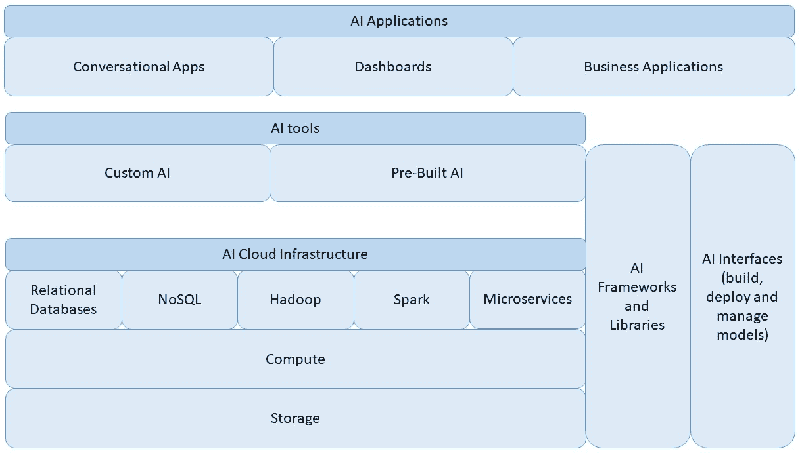
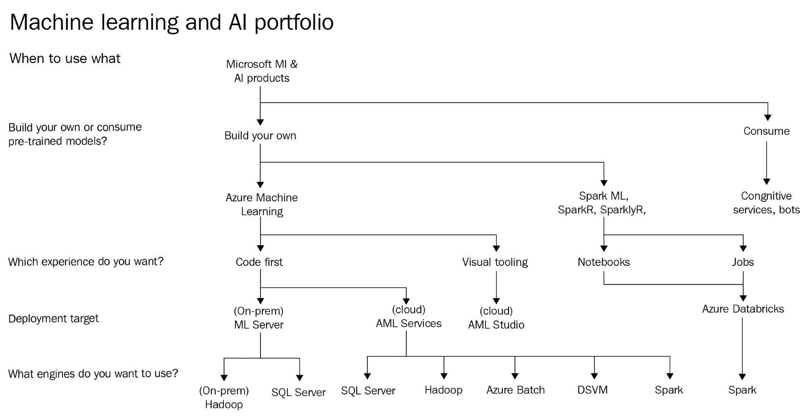

# AI 云基础

现在，每个组织都渴望成为采用最新技术进步的领导者。近年来，这种采用的成功是通过利用企业周围的数据景观实现的。在本章中，我们将讨论如何利用微软的 Azure 平台从数据景观中提取业务价值。Azure 提供数百项服务，选择正确的服务具有挑战性。在本章中，我们将提供一个高层次概述，介绍数据科学家、开发人员或数据工程师为构建和部署其组织的 AI 解决方案所面临的选项。我们将从一个决策树开始，它可以指导技术选择，以便您了解应该选择哪些... 

# 人工智能的重要性

**人工智能**（**AI**）正日益融入我们技术驱动的复杂生活之中。无论我们是否意识到，人工智能正在成为我们更高效完成日常任务的推动者。个人助理如 Siri、Cortana 和 Alexa 是我们经常遇到的最为明显的 AI 工具。不那么明显的 AI 工具包括那些由共享出行公司使用的工具，它们建议司机移动到高密度区域，并根据需求动态调整价格。

在全球范围内，有各种处于 AI 旅程不同阶段的组织。对于某些组织来说，AI 是其商业模式的核心。在其他组织中，他们看到了利用 AI 来竞争和创新业务的潜力。成功的组织认识到，通过 AI 实现的数字化转型是他们长期生存的关键。有时，这可能涉及通过新技术如**物联网**（**IoT**）改变组织的商业模式来融入 AI。在这一 AI 成熟度的范围内，组织在实施 AI 解决方案时面临挑战。这些挑战通常与可扩展性、算法、库、准确性、再培训、管道、与其他系统的集成等相关。

人工智能领域已经存在了几十年，但过去十年其增长和采用率却非常显著。这主要归因于三个主要驱动力：大量数据、大量计算和改进的算法。数据增长主要来自产生数据的实体，或来自人类与这些实体的互动。计算能力的增长可以归因于芯片设计的改进，以及创新计算技术的应用。算法的改进部分得益于开源社区，部分得益于更大数据集和计算能力的可用性。

# 云的出现

在云中开发人工智能解决方案有助于组织跨越其创新，同时缓解这里描述的挑战。第一步之一是将所有数据集中在一起或放在同一个工具中，以便于检索。云是最符合这一要求的最佳着陆区。云提供了几乎无限的存储、轻松访问其他数据源和按需计算。由于有一个统一的控制面板，建立在云上的解决方案更容易维护和更新。只需点击一下按钮即可获得改进或定制的硬件，这在几年前是想都不敢想的。

云中的创新如此迅速，以至于开发者可以构建一个大型多样化...

# 人工智能的云关键组件

任何云人工智能解决方案都将包含不同的组件，所有组件都是模块化的、各自弹性的，并且相互集成。以下图表展示了云人工智能的广泛框架。在最底层是**存储**，它与**计算**是分开的。这种**存储**和**计算**的分离是云的关键优势之一，它允许用户独立扩展。**存储**本身可以根据吞吐量、可用性和其他特性进行分层。直到几年前，**计算**选项仅限于底层 CPU 芯片的速度和代数。现在，我们还有 GPU 和**FPGA**（现场可编程门阵列）芯片的选项。利用**存储**和**计算**，各种服务建立在云基础设施上，这使得使用摄取数据、转换数据和构建模型变得更加容易。基于**关系数据库**、**NoSQL**、**Hadoop**、**Spark**和**微服务**的服务是一些最常用于构建人工智能解决方案的服务：

云人工智能的基本构建块

在最高复杂度级别上，云上提供了各种专注于人工智能的服务。这些服务覆盖了一个光谱，一端是完全可定制的解决方案，另一端是易于构建的解决方案。**定制人工智能**通常是一种允许用户引入自己的库或使用专有库来构建端到端解决方案的解决方案。这通常涉及大量的实际编码，并赋予构建者对解决方案不同部分的完全控制权。**预构建人工智能**通常以 API 的形式存在，这些 API 暴露了一些可以轻松集成到您解决方案中的服务。这些服务的例子包括定制视觉、文本和基于语言的 AI 解决方案。

无论底层 AI 多么复杂，大多数应用的目标都是尽可能使最终用户的使用体验无缝。这意味着 AI 解决方案需要与组织解决方案堆栈中的通用应用程序集成。许多解决方案使用**仪表板**或传统 BI 空间中的报告。这些界面允许用户探索 AI 解决方案生成数据。**对话式应用**通常以智能界面（如机器人）的形式出现，以对话模式与用户互动。

# 微软云 - Azure

微软的使命是让地球上每个人和组织都能实现更多。Microsoft Azure 是一个云平台，旨在帮助客户实现智能云和智能边缘。他们的愿景是帮助客户将 AI 融入每个应用程序，无论是在云中还是在各种形态的计算设备上。考虑到这一点，微软开发了一套广泛的工具，可以帮助客户轻松地将 AI 集成到他们的应用程序中。

以下表格展示了可用于使用 Azure 开发端到端 AI 解决方案的不同工具。Azure 服务列指示由微软拥有和管理的服务（第一方服务）。Azure 市场...

# Azure 上选择 AI 工具

在这本书中，我们假设您对 AI 有一般的知识和经验。这里的目的是不涉及各种 AI 类型的基础知识或选择正确的算法；我们假设您对解决特定商业需求时应选择哪种算法有很好的理解。

以下图表展示了一个决策树，可以帮助您选择正确的 Azure AI 工具。它并非旨在全面覆盖；仅作为正确技术选择的指南。有许多选项相互交叉，这在图表上难以完全展示。同时，请记住，一个高效的 AI 解决方案会结合使用多个工具：

Azure 上选择 AI 工具的决策树指南

上一图表展示了一个决策树，帮助**微软 AI 平台**的用户。从顶部开始，第一个问题是您是否希望**自己构建模型或使用预训练模型**。如果您正在构建自己的模型，那么它涉及到数据科学家、数据工程师和开发者在各个阶段的工作。在某些用例中，开发者更愿意只是**使用预训练模型**。

# 认知服务/机器人

想要使用预训练 AI 模型的开发者通常会使用微软的认知服务。对于正在构建对话应用的人来说，结合 Bot Framework 和认知服务是推荐的方法。我们将在第三章“认知服务”和第四章“Bot Framework”中详细介绍认知服务，但了解何时选择认知服务是很重要的。

认知服务是为了给开发者提供快速构建和部署 AI 应用的工具而构建的。认知服务是预训练的、可定制的 AI 模型，通过 API、配套的 SDK 和网络服务进行暴露。它们执行某些任务，并设计为 ...

# Azure 机器学习工作室

**Azure 机器学习**（**Azure ML**）工作室是主要的工具，纯粹是基于网页的 GUI，用于帮助构建 **机器学习**（**ML**）模型。AzureML Studio 是一个几乎无需代码的环境，允许用户构建端到端的 ML 解决方案。它内置了微软研究部门的专有算法，可以以极大的简单性完成大多数机器学习任务。它还可以嵌入 Python 或 R 代码以增强其功能。Azure ML Studio 的一个最伟大的功能是能够一键创建网络服务。该网络服务以 REST 端点形式暴露，应用程序可以向其发送数据。除了网络服务之外，还会创建一个 Excel 电子表格，它访问相同的网络服务，可以用来测试模型的功能，并方便地与最终用户共享。

在撰写本文时，Azure ML Studio 的主要限制是实验容器的大小限制为 10 GB。这个限制将在第六章“数据科学的可扩展计算”中详细解释，但就目前而言，了解 Azure ML Studio 非常适合训练 2 GB 到 5 GB 范围内的数据集就足够了。此外，ML Studio 中可以包含的 R 和 Python 代码的数量以及其性能也有限制，这些将在稍后详细讨论。

# ML 服务器

对于希望以代码优先的体验，微软的套件中提供了多个工具。如果组织希望在本地上部署（除了云之外），唯一可用的选项是**机器学习服务器**（**ML Server**）。ML Server 是一个企业级平台，支持 R 和 Python 应用程序。它支持 ML 过程中的所有活动。ML Server 之前被称为 **R Server**，是通过微软收购 Revolution Analytics 而产生的。后来，为了满足各种用户偏好，增加了对 Python 的支持。

在 ML Server 中，用户可以使用任何开源库作为他们解决方案的一部分。许多开源工具的挑战在于它们需要 ...

# Azure ML 服务

Azure ML 服务是 Azure 上相对较新的服务，它增强了构建 AI 解决方案过程中的生产力。Azure ML 服务具有不同的组件。在用户端，Azure ML Workbench 是一个工具，允许用户拉取数据，对其进行转换，构建模型，并在各种类型的计算上运行它们。Workbench 是用户在其本地机器上运行的工具，并连接到 Azure ML 服务。Azure ML 服务本身运行在 Azure 上，包括实验和模型管理。实验服务跟踪模型测试、性能以及您在构建模型时希望跟踪的任何其他指标。模型管理服务帮助管理模型的部署，并管理由个人用户或大型团队构建的多个模型的整体生命周期。

当利用 Azure ML 服务时，有多个端点可以作为服务的引擎。在撰写本文时，仅支持基于 Python 的端点。随着内置 Python 服务的引入，SQL Server 可以作为端点。这特别有益，尤其是如果用户的大部分数据都在 SQL 表中，并且希望最小化数据移动。

如果您已经在 ML 服务上利用了用于大规模机器学习的 Spark 库，则可以将它们部署到 Azure 上的基于 Spark 的解决方案。目前，这些可以是 HDInsight 上的 Spark 或任何其他 Apache Spark 的原生实现（Cloudera、Hortonworks 等）。

如果用户已经利用其他基于 Hadoop 的库来构建 ML 服务，则可以将这些库部署到 HDInsight 或 Azure 上可用的任何 Apache Hadoop 实现。

Azure Batch 是一种提供大规模、按需计算的服务，适用于那些需要临时或按计划使用此类资源的应用程序。此用例的典型工作流程包括创建一个虚拟机集群，然后向集群提交作业。作业完成后，集群将被销毁，用户之后不再为任何计算付费。

**数据科学虚拟机**（**DSVM**）是基于 Linux 或 Windows 的高度定制 VM 模板。它预装了大量的精选数据科学工具和库。所有工具和库都配置为无需额外努力即可直接使用。DSVM 有多种应用，我们将在第七章“机器学习服务器”中介绍，包括作为 Azure Batch 的基础镜像 VM 的使用。

Azure ML 服务构建的模型最具有高度可扩展性的目标之一是利用 Docker 容器化和通过 Kubernetes 进行编排。通过利用**Azure Kubernetes 服务**（**AKS**）可以简化这一过程。Azure ML 服务创建了一个 Docker 镜像，有助于将机器学习模型投入运营。该模型本身作为基于 Docker 的容器化 Web 服务进行部署，同时利用 TensorFlow 和 Spark 等框架。应用程序可以通过 REST API 访问这个 Web 服务。可以通过利用 Kubernetes 的扩展功能来增加或减少 Web 服务的规模。关于这个主题的更多细节将在第十章“构建深度学习解决方案”中介绍。

Azure ML 服务的挑战在于它目前仅支持 Python。该平台本身经历了一些变化，对命令行界面的重度依赖使得界面不如一些其他工具用户友好。

# Azure Databricks

Azure Databricks 是 Azure 上可以用来构建自定义 AI 解决方案的新增工具之一。它基于 Apache Spark，但针对 Azure 平台进行了优化。Spark 引擎可以通过基于 Scala、Python、R、SQL 或 Java 的各种 API 进行访问。为了利用 Spark 的可扩展性，用户在处理数据对象及其转换时需要利用 Spark 库。Azure Databricks 在由运行时管理的弹性且可扩展的 Spark 集群之上利用了这些可扩展的库。Databricks 提供了企业级的安全、合规性和协作功能，使其与 Apache Spark 区分开来。能够安排和编排...

# 概述

总结来说，本章简要概述了 Azure 上可用于构建 AI 解决方案的所有不同服务。在创新的云世界中，很难找到一个包含 AI 项目所有期望结果的单一解决方案。本书的目标是指导用户选择适合特定任务的正确工具。成熟的组织意识到，在云中创新的关键在于敏捷性和灵活性。在下一章中，我们将看到 TDSP 阶段及其工具。
