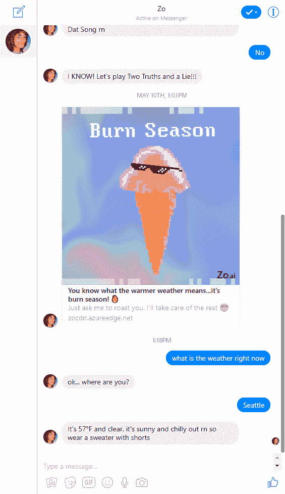
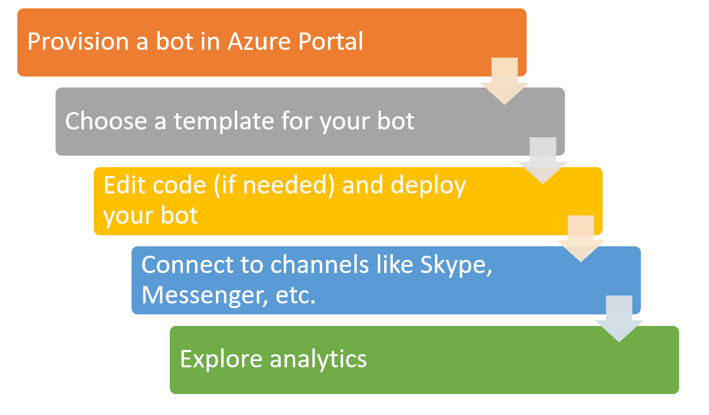
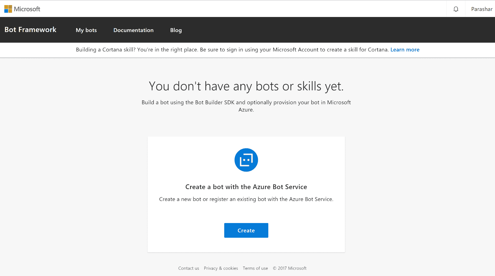
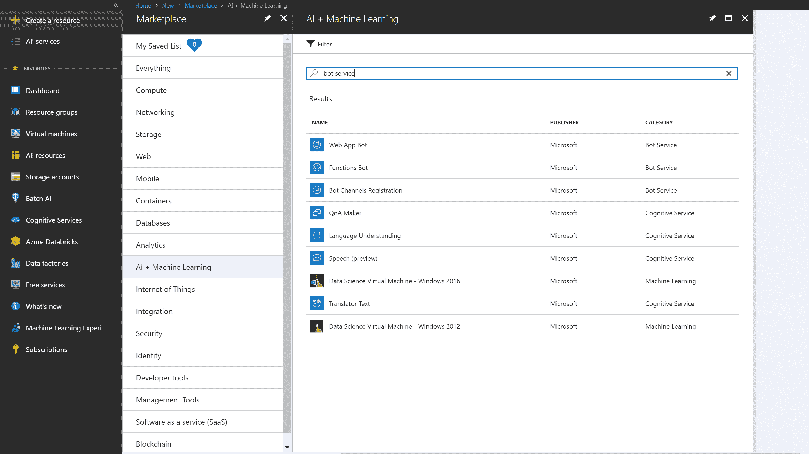
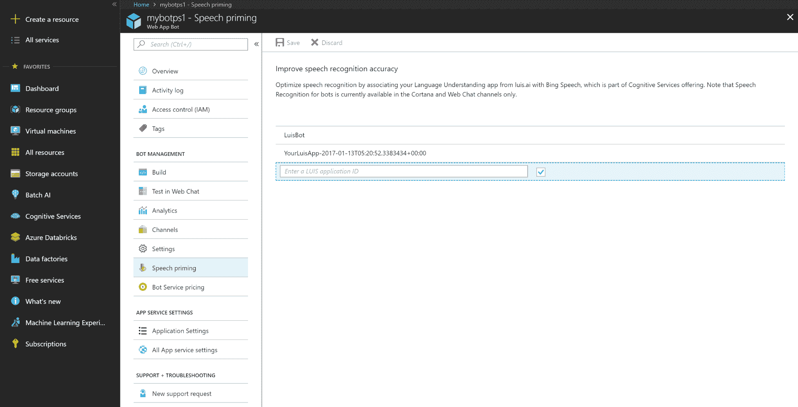

# 第四章：Bot 框架

在上一章中，我们学习了认知服务，它可以帮助我们创建人工智能应用程序。在本章中，我们将学习如何使用各种 Azure 服务构建机器人。微软提供了一个强大的平台，包括以下组件，以帮助构建和部署机器人：

+   机器人构建器 SDK

+   Bot 框架

+   QnA Maker

+   机器人服务

# 什么是机器人？

一个聊天机器人，或机器人，是一种允许你通过文本、图像或语音进行类似人类的对话的应用程序。机器人可以集成到网页应用或移动应用中。不同的应用程序，如 Facebook Messenger、Kik、微信或 Skype，支持各种类型的机器人，可能有助于你找到特定问题的答案、预约沙龙或预订餐厅的桌子。与机器人聊天应该像与客户服务代表或朋友聊天一样。以下是一个在 Facebook Messenger 中帮助回答有关天气问题的示例机器人。这个机器人由微软构建，被称为 Zo 机器人：

机器人可以部署到云端，以根据用户需求扩展其处理流量的能力。为了给你一个创建智能和强大机器人的难易程度的想法，我们将使用 Bot 服务创建一个机器人，这将涵盖上述所有组件。

在以下部分，我们将简要介绍 Azure 中可用于构建机器人的每个组件。

# 机器人构建器 SDK

Bot Builder SDK 允许你创建机器人。它支持 .NET 和 Node.js 语言，以覆盖广泛的开发者。

# Bot 框架

Bot 框架允许你连接机器人到各种社交媒体渠道。你可以连接到任意数量的渠道，包括 Facebook Messenger、Skype、Teams、Kik 或自定义渠道。

除了 SDK 和框架之外，我们还有 Bot 框架模拟器和 Bot 框架渠道模拟器。Bot 框架模拟器是一个桌面应用程序，用于测试你的机器人，而 Bot 框架渠道模拟器帮助你测试你的机器人在不同渠道上的外观和工作方式。

# QnA Maker

QnA Maker 服务帮助我们快速创建基本的对话机器人。它可以与 **语言理解智能服务** (**LUIS**) 集成，以创建更智能的机器人。QnA Maker 和 LUIS 都是我们在第三章，*认知服务*中简要提到的认知服务。

# 机器人服务

Bot 服务通过结合我们之前讨论的 Bot Builder SDK 和 Bot 框架，使得创建机器人变得简单。它支持 .NET 和 Node.js 开发者。有五种模板可以快速创建机器人：

+   基本机器人

+   表单机器人

+   语言理解机器人

+   问答机器人

+   主动机器人

这里是使用 Bot 服务创建和运行机器人的高级步骤：

# 使用 Bot Service 创建机器人

当我们使用 Azure Bot Service 创建机器人时，Azure 会为我们做很多工作。它为机器人提供资源，基于机器人构建器 SDK 创建机器人项目，并发布机器人。您只需要一个 Azure 订阅就可以以这种方式创建机器人。

1.  首先，访问 Bot Framework 网站[`dev.botframework.com`](https://dev.botframework.com)，这将带您进入 Azure 门户：

1.  或者，我们可以直接访问 Azure 门户[`portal.azure.com`](https://portal.azure.com)并搜索`Bot Service`：

1.  对于这个示例，选择...

# LUIS 应用程序

我们的机器人也可以接收音频作为输入，并且门户允许我们集成 LUIS 应用程序。如果您已经有了 LUIS 应用程序，您可以在这里提供相关信息：

# 摘要

在本章中，我们学习了使用各种基于 Azure 的服务，这些服务可以帮助我们快速、轻松地创建可以集成到不同即时通讯服务的机器人。在下一章中，我们将学习关于 Azure Machine Learning Studio 的内容，我们可以使用它来创建自定义机器学习模型。
