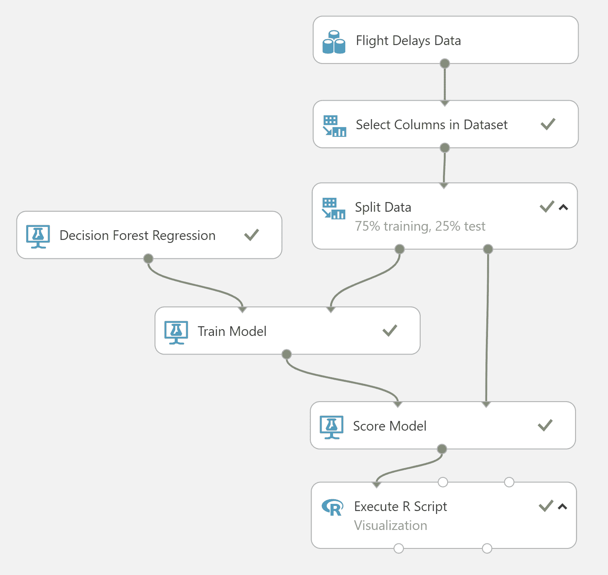
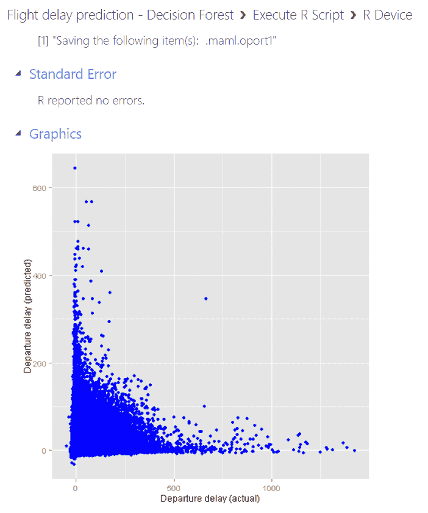
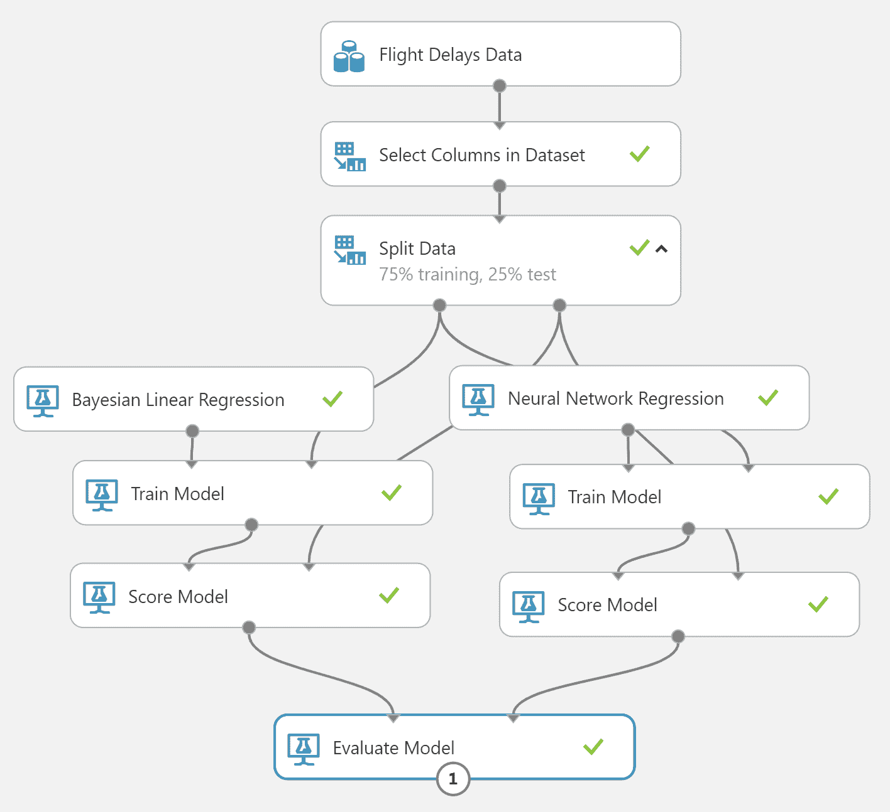
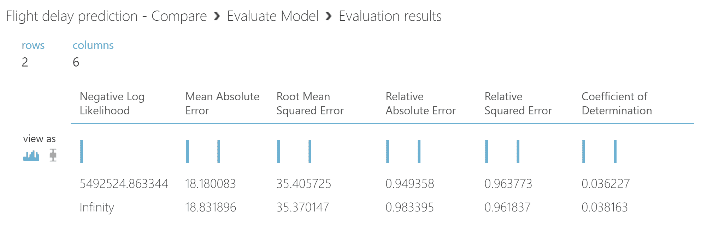
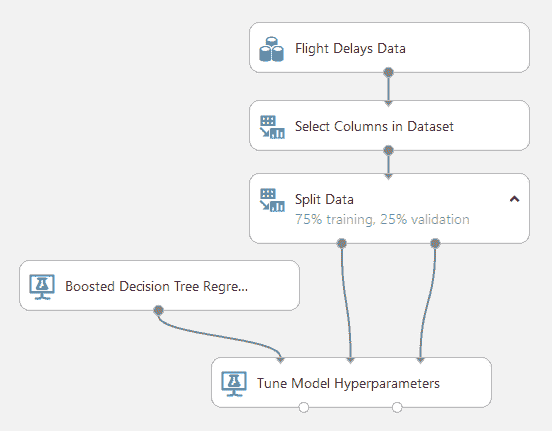
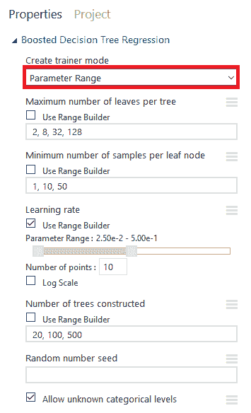
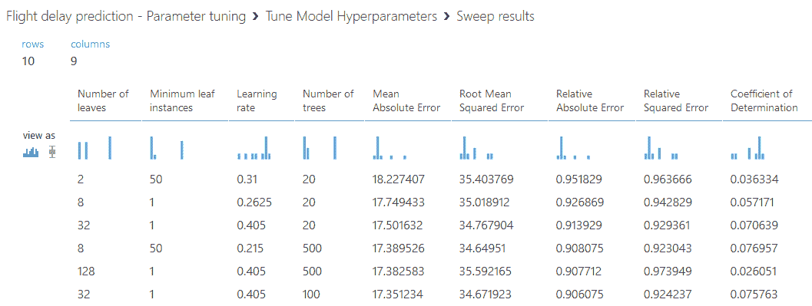
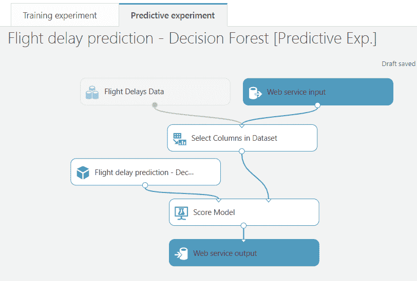
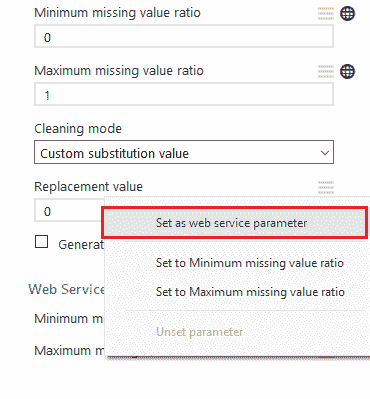

# Azure 机器学习工作室

**Azure 机器学习工作室**是一个机器学习即服务（ML-as-a-Service）平台，用于创建定制的**机器学习**（**ML**）模型。Azure ML Studio 是初学者的一款优秀工具，他们可能有一些使用机器学习模型的经验，并希望更深入地了解训练过程。它比认知服务 API 提供了更多的灵活性，并且拥有易于学习的开发环境。图形用户界面无需任何编程，使用户能够尽可能高效地构建 ML 模型。Azure ML Studio 也是经验丰富的 AI 开发者的一款有用工具，他们手头有一个相对简单的问题，并需要快速得到结果。

Azure ML Studio 由两个独立的服务组成：工作室工作空间和工作室网络服务。这两个服务还包括处理所需的底层计算资源，因此用户无需担心操作系统或硬件的维护。这两个服务之间的区别很明显：工作室工作空间用于训练 ML 模型和尝试不同的配置，而工作室网络服务提供 REST API 接口，用于对从工作空间发布的模型进行评分。

Azure ML Studio 旨在支持协作开发。它集成了 Azure Active Directory，因此可以通过几点击将来自同一组织的用户添加到工作空间。ML Studio 工作空间中的所有 ML 模型对所有工作空间成员都是可见的。工作空间成员还可以编辑他人创建的模型，因此开发者可以迭代地尝试改进彼此的结果。因此，当开发者遵循**团队数据科学流程**（**TDSP**）时，它是一款非常棒的工具。

ML 模型是在*实验*中开发的。一个实验包含生成 ML 模型所需的所有步骤，从输入数据集开始。实验可以用来比较不同的 ML 模型和参数配置。ML Studio 提供了一系列可以添加到实验中的模块，以执行不同的任务，例如预处理数据或评估训练结果。通过组合这些模块，实验逐步构建，最终形成一个可以运行以生成训练 ML 模型的训练管道。ML Studio 还包括广泛的实验模板集合，其中包含来自许多不同领域的可运行示例。在下一节中，我们将展示如何将这些模板部署到 ML Studio 工作空间。

工作空间和网络服务的定价基于计算资源的使用。在 ML Studio 中训练新的 ML 模型时，会消耗工作空间资源。工作空间的计费还基于用户数量，但使用 ML Studio UI 和构建实验不会产生任何额外费用；只有实验运行时间会被计算。

当创建一个新的 ML Studio 工作区时，会自动创建一个新的 Web 服务计划资源。当外部应用程序调用 ML Studio Web 服务 API 时，会消耗 Web 服务资源。在 Azure 门户中创建 Web 服务资源时，必须选择 Web 服务定价层。定价层决定了每月可以处理的最大请求数量。如果超出此限制，每个请求都会在固定月费之外计费。

要使用 Azure ML Studio，您需要一个工作区账户。有两种类型的工作区账户：*免费层*和*标准层*。免费层是一个独立的账户，不与 Azure 订阅相关联。它在使用方面有更多限制，并且不包括标准层那样的生产规模 Web API。标准层需要 Azure 订阅，ML Studio 资源的成本将添加到订阅账单中。工作区和 Web 服务在资源组中作为独立项出现，并且可以在 Azure 门户中像管理任何其他 Azure 资源一样进行管理。

要访问 ML Studio UI，请转到 Azure 门户中的 ML Studio 工作区选项卡并单击启动机器学习工作室。您也可以直接在浏览器中输入门户地址：[`studio.azureml.net/`](https://studio.azureml.net/)。

在本章中，我们将介绍以下主题：

+   部署 Azure AI 画廊模板

+   在 Azure ML Studio 中构建实验

+   在 ML Studio 中将模型作为 Web 服务部署

# 部署 Azure AI 画廊模板

使用 ML Studio 开发模型不必从头开始。Azure AI 画廊包含许多不同场景的模板。这些场景包括许多常见的机器学习用例，例如信用风险预测、需求估计和文本情感分析。只需几步即可将模板导入 Azure ML Studio 工作区，并且它们包含生成工作 ML 模型所需的所有步骤。研究模板是了解不同用例和生成 ML 模型所需步骤的绝佳方式。一些模板由微软准备，但用户也可以将他们自己的实验提交到画廊。

模板画廊可以直接从 ...

# 构建实验

在本节中，我们将展示如何使用自定义数据集从头开始构建实验。使用 GUI，创建新实验非常快，结果可以立即查看。Azure ML Studio 包含所有常见 ML 和数据处理任务的模块，因此它是快速测试和迭代想法的绝佳工具。如果内置模块不足以完成当前任务，可以使用脚本模块进行改进的可扩展性，如下所述。

# 导入和预处理数据

如前所述，Azure ML Studio 是一个完整的机器学习工具，负责机器学习模型开发过程中的每一步。所需输入是 ML Studio 可理解的原始数据集格式；如果原始数据格式不被识别，则需要使用外部工具或 ML Studio 中的自定义脚本模块进行文件转换。对于原始文件，ML Studio 当前识别的数据格式包括 CSV、TSV、ARFF、SvmLight 和 R 对象。数据集也可以以压缩格式保存，以节省存储空间和带宽。

数据集可以通过两种方式导入到 ML Studio：通过从用户的计算机上传本地文件，或者使用 Azure 中的云存储。要从本地导入数据...

# 选择和配置算法

选择合适的模型并调整模型的参数是人工智能应用开发的核心。在大多数情况下，有几个算法适用于该任务，并且一开始可能不清楚哪个算法会表现最好。例如，某些算法可能在小数据集上表现更好，而其他算法在大数据集上表现更出色。通常，还需要考虑其他约束条件，例如运行时间或可用的计算资源量。最佳模型是在最小计算资源量的情况下实现足够准确度的模型。

解决机器学习问题时的第一步是确定应该使用哪种算法系列。算法系列主要取决于预测值的类型，例如，如果预测一个数字，可能使用的算法与预测一个**分类**值时不同。分类值是指可能结果数量有限的情况。最简单的分类值是布尔变量，它可以取两个值（真/假）。可能结果的数量也可能限制可用于问题的算法类型，因为并非所有算法都能很好地处理高维数据。在文本分析中遇到的一个高维分类数据示例是，每个单词可能代表一个不同的类别，而类别的数量等于字典的大小。对于这类高维数据，通常最好使用神经网络模型，这些模型可以处理大量的输出值。

Azure ML Studio 包含一组最常用的机器学习算法，可以拖放到实验画布中。算法在“初始化模型”部分列出，位于机器学习菜单下。算法分为四个类别。异常检测模块旨在检测数据集中大多数值相似但有一些异常值的情况，这些异常值是我们想要识别的。这些模型在预测故障检测中得到了广泛应用，例如在制造和加工行业中，机器通常正常运行，但有时可能会产生异常值，表明机器即将损坏。分类模块用于训练监督算法，以将输入分类到特定的类别。聚类模块提供无监督算法，用于在数据集中找到相似项。回归算法预测数值（但输入也可以是分类变量）。除了这些机器学习算法外，ML Studio 还提供用于其他常见机器学习相关任务的模块，例如**主成分分析**（**PCA**）和文本分词。

在本节中，我们将展示如何训练一个回归模型的示例。输入数据集是来自多个机场的航班延误信息记录，作为 ML Studio 内置数据集可用。该数据集包括航班时间、出发机场和目的地机场以及运营航班的航空公司信息。标签列，我们想要预测的值，是出发延误的分钟数（列`DepDelay`）。`DepDelay`的正值表示航班已延误，负值表示航班提前起飞。这是一个相当大的数据集，包含超过 270 万行和 14 列。要获取更多关于数据集的详细信息，请参阅文档中的完整描述，文档可在[`docs.microsoft.com/en-us/azure/machine-learning/studio/use-sample-datasets`](https://docs.microsoft.com/en-us/azure/machine-learning/studio/use-sample-datasets)找到。

训练过程包括以下步骤：

1.  导入数据

1.  预处理数据（选择要使用的列）

1.  将数据分为训练集和测试集

1.  选择一个机器学习算法并使用训练数据集对其进行训练

1.  使用训练好的模型为测试数据集创建预测

1.  将测试数据集中的预测值与实际值进行比较

输入数据集主要包含数值数据，不需要太多预处理。`Carrier`列包含文本格式的分类值，但 ML Studio 会自动将这些值转换为数值。唯一的预处理步骤是选择用于训练模型的列。在本例中，以下列被选为模型的特征：

| **列** | **描述** |
| --- | --- |
| `Month` | 月份（分类数值，1-12） |
| `DayOfWeek` | 星期几（分类数值，1-7） |
| `OriginAirportID` | 出发机场 ID（分类数值，70 个唯一值） |
| `Carrier` | 航空公司（分类字符串，16 个唯一值） |
| `CRSDepTime` | 白天时间（分类数值，1-2359，1440 个可能值） |

注意，出发时间是以数字格式给出的，例如，数字 101 对应 01:01。可以使用“在数据集中选择列”模块来选择这些列，标签列（`DepDelay`）将在训练过程中使用。

在模型训练之前，必须将数据分为训练集和测试集。这是训练过程中的关键步骤：重要的是要确保模型的准确性是通过在训练过程中模型未曾见过的示例来衡量的。用于此目的的“分割数据”模块。例如，通过将模块的“第一个输出数据集的行数比例”属性设置为`0.75`，模块的第一个输出端口将包含 75%的行，第二个输出将包含 25%，从输入数据集中随机选择。我们将使用这种分割来分别将数据分为训练集和测试集。

一旦数据被处理并分为训练集和测试集，模型将使用训练集进行训练。ML Studio 中的“训练模型”模块需要两个输入：一个未初始化的 ML 模型和训练集。该模块的输出是经过训练的 ML 模型，可用于进行预测。在本例中，目标是预测一个数值变量（分钟的航班延误）。如前所述，这类问题需要回归模型。对于简单的测试，通常最好从线性回归开始。这种模型并不总是产生最佳结果，但它运行速度快，为评估更高级模型提供了准确性的基准。以下是一个完整的训练流程示例：



在这种情况下，决策森林回归模型使用了 75%的输入数据进行训练。该模型可以产生准确的结果，但如果数据集包含许多行，训练时间可能会很长。使用略超过 200 万行的数据集训练此模型大约需要 1 小时，而线性回归模型训练时间不到 1 分钟。尽管某些算法可能在某些情况下表现更好，但通常很难事先预测哪种算法将产生给定问题的最佳结果。最佳方法是尝试不同的算法和参数，以找到最佳模型。我们将展示如何使用 ML Studio 中的模块有组织地进行实验，如下所示。

要获取每个模块的更多信息，请点击模块，以便在画布的右侧显示配置面板。在快速帮助面板底部跟随链接。模块文档包括每个模块的详细信息以及如何配置它。

在将“训练模型”模块与 ML 模块和输入数据集连接后，其输出可以传递到“评分模型”模块进行预测。为了了解我们的模型表现如何，测试数据集被评分，并且模型的预测与真实值（标签）进行比较。评分模型模块将在输出数据中添加一个新列，包含预测值。然后，将预测值与实际值作为散点图绘制，以查看它们之间的匹配程度。

尽管 ML Studio 没有提供任何原生可视化模块，但“执行 R 脚本”模块可以生成 R 图形作为输出。`plot`命令适用于简单的图形，并且在 R 模块中是原生支持的。`ggplot2`库也存在于 R 模块中。这个库被广泛使用，并生成高质量的图片。以下是如何在*x*轴上绘制`DepDelay`（实际值）和在*y*轴上绘制`Scored Label Mean`（预测值）的示例：

```py
# Import ggplot2 library
library(ggplot2)

# Map the first input port to data frame
input1 <- maml.mapInputPort(1)

# Create a graph with ggplot
graph <- ggplot(input1, aes(x=DepDelay, y=`Scored Label Mean`))
graph <- graph + labs(x="Departure delay (actual)",
                      y="Departure delay (predicted)")
graph + geom_point(color="blue");

# Pass the data frame to the output port
maml.mapOutputPort("input1");
```

注意，如果使用了线性回归模型，预测值将位于不同的列（“评分标签”）。

这些都是在单个管道中训练模型和分析结果所需的全部步骤。现在可以通过在 ML Studio 底部的工具栏中点击运行按钮来训练模型。运行完成后，可以通过在第二个输出（R 设备）上右键单击并选择可视化来查看结果。绘图输出可以在图形部分查看，如下面的图示所示：



在理想情况下，每个预测值都应等于实际值，并且从左下角到右上角将是一条直线。因此，前面的截图远非理想。看起来模型在实际值低时预测了一些高值，反之亦然；它无法在应该预测高值时预测。从这张截图我们可以看出，结果的*方差*很高。结论是，提供给模型的特征不足以准确预测延迟。所选特征（见前面的列表）不包含足够的信息来解释标签变量的变化。

由于初始结果似乎并不令人信服，下一步应该做什么？与其继续尝试不同的配置，不如退一步考虑是否有额外的数据可以提供更多关于延误可能发生的信息。例如，天气条件可能与航班延误高度相关，因此将天气数据包含在模型中可能是个好主意。要查看此示例，请导航到 Azure AI 画廊并搜索“二元分类：航班延误预测”模板。

在以下小节中，我们将探讨不同的特征变量如何影响标签变量的变化。我们还将展示如何使用 ML Studio 模块评估不同的模型和探索不同的参数配置。

对于初学者来说，不同机器学习算法的广泛选择可能会感到不知所措。哪种算法能快速得到结果，哪种适合大数据集？为了帮助回答这些问题以及其他问题，微软已发布了一个 Azure ML 算法速查表：[`docs.microsoft.com/en-us/azure/machine-learning/studio/algorithm-cheat-sheet`](https://docs.microsoft.com/en-us/azure/machine-learning/studio/algorithm-cheat-sheet)。速查表可以快速查看每个算法的优缺点。

更高级的用户会知道，ML Studio 中的算法只是所有可用模型的一小部分。可以通过使用创建 R 模型模块来扩展算法选择，使用 R 库。这是在 ML Studio 中开发机器学习模型的基于代码的替代方案。

# 特征选择

在开发机器学习模型时，一个常见的问题是在训练模型时决定应该使用哪些特征。对于监督学习算法，最佳特征是与标签变量高度相关的特征。这意味着，从广义上讲，改变其中一个变量也会导致另一个变量的变化。高度相关的变量示例可以是白天的时间和道路交通量：交通堵塞通常发生在高峰时段，而夜间交通量特别低。

特征选择的总体目标是发现对目标变量影响最大的变量。如果输入数据集包含大量列，那么 ...

# 模型和参数比较

在开发机器学习模型的核心任务之一是选择机器学习算法并配置算法的参数。ML Studio 为这两个任务都提供了模块，允许你在单次运行中比较多个模型或参数值。

要在一个实验中训练多个模型，可以通过将数据集指向多个训练分支来重复使用训练和测试数据集，如下所示：



先前的实验与早期的训练实验类似，不同之处在于有两个不同的算法作为输入的 Train Model 模块。Score Model 模块的结果也指向 Evaluate Model 模块，而不是像之前那样可视化原始预测结果。评估模块接受两个数据集作为输入，每个数据集包含来自评分模块的原始标签和预测值。

评估模块的输出包含预测值的汇总统计信息（第一个输入数据集显示在第一行）：



评估结果的列取决于算法的性质。用于评估回归模型的准确性指标与用于评估分类模型的指标不同，例如。如图所示，评估模块为回归模型计算了几个不同的指标。不同的准确性指标捕捉到错误的不同方面。均方根误差可能是回归模型中最广泛使用的指标。此指标表示包含测试数据集中 95%示例的置信区间。

有时，不同的指标可能会给出矛盾的结果。在先前的例子中，第二个模型的均方根误差较低，而其他指标，如平均绝对误差，在第一个模型中表现更好。因此，在比较不同模型的输出结果时，选择准确的指标非常重要。不同的指标强调错误分布的不同方面，因此最佳指标取决于问题和输入数据。每个指标的性质超出了本书的范围，我们建议读者参考 ML Studio 文档和一般统计学文献，以获取有关准确性指标的详细信息。

如前所述，机器学习算法包括影响模型训练方式的参数。这些参数通常被称为**超参数**。虽然超参数的默认值在大多数情况下都选择得很好，但有时通过选择不同的参数值可以提高模型的准确性。调整模型超参数模块允许您在单次运行中多次使用不同的参数值来训练模型。此模块可以用作替代训练模型模块来创建训练好的模型，如下面的实验所示：



调整模型超参数的输入与训练模型相同，只是前者接受一个验证数据集作为第三个可选输入。使用验证数据集意味着不同参数值之间的准确性是通过未用于训练模型的示例来评估的。

每个算法都有自己的参数集，用于训练的参数必须在算法模块中指定。为了使参数具有多个值，将算法模块的创建训练模式选项切换到参数范围。请注意，某些算法，如线性回归，不允许超参数调整。参数的可能值可以以逗号分隔的列表形式给出，或者通过使用范围构建器指定范围，如下所示：



调整模型超参数模块并不一定尝试所有可能的参数组合。该模块支持以下参数扫描模式：完整网格、随机网格和随机扫描。如果选择完整网格模式，将尝试所有组合。随机网格模式仅使用所有可能组合的子集，随机选择。可以通过将随机扫描的最大运行次数设置为合适的值来控制随机网格扫描中的运行总数。这在组合数量很多且扫描整个参数空间需要非常长时间的情况下特别有用。同样，随机扫描模式也可以用来运行所有可能组合的子集。随机网格和随机扫描模式之间的区别在于，后者在指定范围内随机选择参数值，而前者仅使用算法模块中定义的确切值。

在运行示例之前，将标签列设置得与训练模型类似。还必须定义准确度指标，具体取决于模型的性质（分类或回归）。准确度指标确定在选择最佳模型时使用哪种度量。如前所述，不同的指标可能在最佳模型上产生分歧，因此决定使用哪种指标来评估模型性能是很重要的。

实验完成后，可以在调整模型超参数模块的第一个输出中查看评估结果，如下所示：



结果中的每一行对应一个独立的模型，该模型使用不同的参数进行训练。列显示每个情况下使用的参数值以及相应的准确度指标值。结果按准确度降序排列，按所选指标定义（此处：平均绝对误差）。调整模型超参数模块的第二个输出包含最佳训练模型，也由指标定义。此模型可用于评分，类似于训练模型模块的输出。

总之，Azure ML Studio 包含许多内置模块来评估机器学习模型的准确性，以及测试不同的模型和配置。然而，必须记住，即使是最好的模型在处理差数据时也可能表现不佳。如果要预测的值与特征变量不相关，算法将无法做出良好的预测。此外，产生最佳准确率的算法并不总是实践中最好的模型。特别是对于大型数据集，通常需要考虑训练过程的运行时间。如果训练过程的复杂性随着数据量的增加而无法控制地增长，实际上训练算法可能变得不可能。在选择任何给定问题的机器学习算法时，也必须考虑这些方面。

# 将模型部署为网络服务

Azure ML Studio 最大的优势之一是部署模型到云端的便捷性，以便其他应用程序使用。一旦机器学习模型被训练，如前节所示，只需几点击即可将其导出到 ML Studio 网络服务。部署为模型创建了一个网络 API，可以从任何互联网连接的应用程序调用。模型以特征作为输入数据，并产生预测值作为输出。通过将模型部署到 ML Studio 网络服务，无需担心底层服务器基础设施。计算资源和维护完全由 Azure 处理。

下面的子节将展示如何部署 ...

# 创建预测实验

在将训练好的模型导出为网络服务之前，创建该模型的训练实验必须转换为预测实验。预测实验定义了基于网络服务输入创建预测的评分管道。它不包含任何训练模块，因为模型已经训练好了。相反，模型只是从训练模型列表中加载，并作为输入导入到评分模型模块。

要创建预测实验，打开之前运行过的训练实验，或者运行一次训练实验以创建一个训练好的模型。实验不需要包含评分模型模块——这将在预测实验中自动添加。点击“设置网络服务 | 创建预测实验”。这将引导到一个新视图，显示新的预测实验，如下所示：



本例使用的是之前训练过的相同的航班延误预测实验。请注意，分割数据模块已经从预测实验中移除，并且训练模块现在已经被训练好的模型所取代。分割数据模块仅用于将数据分割成训练集和测试集，因此 ML Studio 推断出它可以与训练模块一起从预测实验中移除。

在部署之前先运行一次实验。在至少运行一次之前，预测性实验不能作为 Web 服务部署。有关如何部署模型的说明，请跳转到下一小节。

在某些情况下，可能有用将一些模块参数作为来自 Web 服务的输入。例如，数据预处理步骤可能取决于输入数据。为此目的，大多数模块配置都可以参数化，以便配置值作为输入在请求中提供。要参数化某个模块参数，请返回到训练实验并点击要配置的模块。在画布右侧的配置面板中，点击要配置的字段旁边的菜单并选择设置为 Web 服务参数，如下所示：



这将把参数添加到模块的 Web 服务参数列表中。如果请求中没有提供值，也可以为该参数设置一个默认值。然而，并非所有模块参数都可以设置为 Web 服务参数。那些不能设置的参数在字段旁边没有上下文菜单（例如，参见前一个截图中的清洁模式）。

有时，部署的模型可能会给出较差的预测，我们可能希望回退到模型的先前版本。可以从运行历史记录中查看以前的运行，该历史记录位于实验的底部面板中。运行历史记录显示了实验的每一次执行，点击实验的某个版本将使用相应的配置和结果打开它。这个版本的实验将被锁定，无法编辑或部署，但可以将其保存为新的训练实验并重新训练以创建新的预测性实验。如果模型已经重新训练多次并且忘记了模型的最佳参数，这很有用。

# 部署和测试 Web 服务

创建预测性实验后的最后一步是将模型部署到云端。打开预测性实验，确保它至少已经成功运行一次，如前所述。从底部面板中选择部署 Web 服务 | 部署 Web 服务 [新建]。这将打开部署配置视图。选择 Web 服务的名称和价格计划。价格计划决定了服务每月可以处理多少请求。价格计划是在 Azure 门户中创建新的 ML Studio Web 服务时创建的。如果没有现有的价格计划，也可以通过从菜单中选择创建新...来创建一个新的价格计划。

当配置 ...

# 摘要

Azure Machine Learning Studio 是一个用于开发机器学习模型的完全托管平台，使用户能够专注于机器学习开发中的关键任务和问题。其图形用户界面易于学习，使用它不需要编程技能。即使是没有任何编程或机器学习经验的用户也可以学会使用它，并且实验模板集合包含许多真实的机器学习模型示例，可以作为起点。ML Studio 是学习开发机器学习模型的好方法，ML Studio 中的样本数据集使得在没有自己的数据开始的情况下开发自己的模型成为可能。

Machine Learning Studio 包含了所有最常见与机器学习相关的任务模块，例如数据预处理、调整超参数以及评估机器学习算法的性能。如果当前任务所需的模块集合不足以满足需求，可以使用 R 和 Python 脚本模块来自定义任务并可视化结果，例如。

Machine Learning Studio 是一个用于开发机器学习模型的完整环境，包括从数据摄取到在云中部署模型的所有步骤。一旦模型在 ML Studio 工作区中训练完成，它们可以被转换为预测实验，并通过几点击部署到 ML Studio 网络服务中进行服务。用户无需担心管理网络服务 API 后面的底层基础设施，因为这完全由服务管理。网络服务门户包含与该服务集成的全面文档和示例，使得从外部应用程序开始消费机器学习模型变得非常容易。在下一章中，我们将看到如何使用 Azure 进行数据科学。
