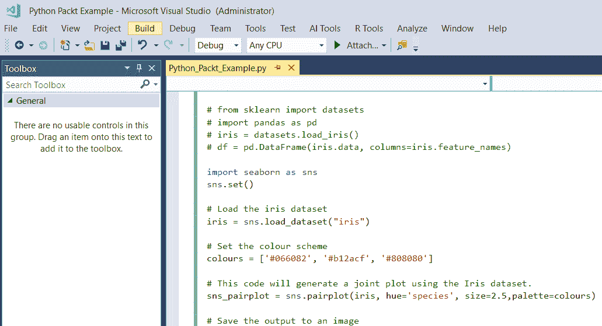
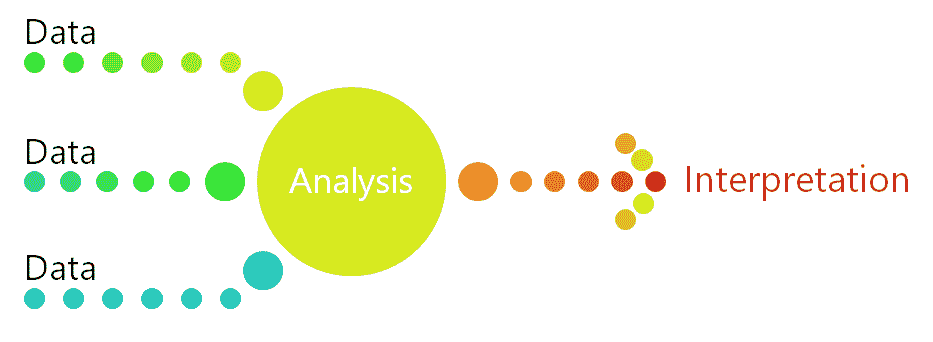

# Machine Learning Server

本章的主题是 Microsoft ML Server 及其在 SQL Server 和 HDInsight 中的功能。此外，本章还将提供 ML Server 使用方法的概述，以展示使用 ML Server 的最佳情况以及如何使用它部署解决方案。

分类算法是监督学习算法，这意味着它们基于一组示例进行预测。

通常，使用数据来预测一个类别是有用的，这被称为分类。以 Andrew Ng 对 YouTube 内容的分类工作为例，将其分类为猫视频或不是猫的视频。正如 Andrew Ng 的著名工作一样，当只有两个选择时，它被称为**双类**或... 

# 什么是 Microsoft ML Server？

Microsoft ML Server 将机器学习和人工智能带到您的数据中。它使您能够在提供开源机会的企业环境中拥有数据驱动的智能应用程序，同时拥有 Microsoft 软件的安全性和可靠性。Microsoft ML Server 提供了一个企业级平台，用于大规模的清洁、建模和分析数据。它允许组织成为洞察驱动的，允许您在 SQL 中分析数据，同时为 Python 和 R 提供全面的企业级支持。

ML Server 满足了所有参与数据分析的人的需求，从商业用户到数据工程师和数据科学家。有了 SQL、Python 和 R，企业可以确保有机会使用世界上最常见和广泛采用的编程语言来分析他们的数据，为企业提供基于数据的创新机会。通过 Microsoft ML Server，R、SQL 和 Python 的结合将开源和专有世界的最佳之处结合起来，带来真正的数据科学。

Microsoft ML Server 曾经被称为 Microsoft R Server。为了继续实现数据民主化的努力，R 支持建立在之前版本的 Microsoft R Server 和 Revolution R Enterprise 产品的基础上。

随着 Microsoft ML Server 的推出，每次发布都显著增强了机器学习和人工智能的能力。在最近的版本中添加了对 Python 的支持。ML Server 支持基于 Python 的分析的完整数据科学生命周期。

此外，ML Server 还提供了操作支持，使您可以将模型部署到可扩展的网格中进行批量处理和实时评分。这意味着您可以通过机器学习过程，然后设置模型供组织中的每个人使用。这是真正为每个人实现数据民主化！

Microsoft ML Server 解决了哪些问题？Microsoft ML Server 可以帮助解决许多不同、真实的业务问题。它可以处理端到端的数据流程。例如，它可以清理和预处理大量数据，以便下游系统可以处理数据以产生洞察。以下是一些 HDInsight 有用的示例：

+   情感分析

+   网站流量模式

+   天气相关性效应

+   销售分析

+   客户分析

+   **物联网（IoT）** 项目

接下来，我们将探讨如何开始使用 Microsoft ML Server。

# 如何开始使用 Microsoft ML Server

要开始使用 Microsoft ML Server，建议使用 Microsoft **数据科学虚拟机**（**DSVM**）。

DSVM 是一种专门构建的定制虚拟机，托管在微软的 Azure 云上。它专门为数据科学设计，旨在帮助学习者快速入门这项新技术。它预装并预配置了 Microsoft ML Server，因此您可以立即开始数据科学项目。

您可以使用 R 和 Python 等语言在 Microsoft DSVM 上直接进行数据分析。这对于原型设计非常出色，并且是很有用的学习工具，使学习者在学习过程中早期就为成功做好准备。

# 配置 DSVM

创建 Microsoft DSVM 的向导需要配置。选项如下：

+   **名称**：为 DSVM 起一个名字。

+   **虚拟机磁盘类型**：选择 SSD 或 HDD。

+   **用户名**：指定管理员帐户 ID 以登录。

+   **密码**：指定管理员帐户密码。

+   **订阅**：如果您有多个订阅，请选择要在其上创建和计费机器的订阅。

+   **资源组**：您可以创建一个新的资源组或使用现有的组。

+   **位置**：选择最合适的数据中心。为了获得最快的网络访问，应选择拥有您大部分数据或离您实际位置最近的数据中心。

+   **大小**：选择满足您功能需求和成本限制的服务器类型之一。若要查看更多虚拟机大小选项，请选择“查看所有”。

+   **设置**：

    +   使用托管磁盘。如果您希望 Azure 为虚拟机管理磁盘，请选择“托管”。如果不这样做，您需要指定一个新的或现有的存储帐户。

    +   其他参数。您可以使用默认值。如果您想使用非默认值，请将鼠标悬停在信息链接上以获取特定字段的帮助。

    +   一旦配置了设置，下一步是检查和验证您输入的所有信息是否正确。然后，选择“创建”，DSVM 将在 Azure 中设置。

现在 DSVM 已经设置好了，让我们看看在 Microsoft ML Server 中使用 Python 的机会。

# 使用 Python 进行机器学习

Python 拥有大量的机器学习功能。Python 中最常用的机器学习库之一是 scikit-learn 库。它用于创建、训练和评估模型。在这本实战书中，我们使用 Python scikit-learn 库在代码中训练和评估模型。

# 开始使用 Python

Python 是一种流行的编程语言，正在迅速获得全球的认可。Python 具有许多优势；它可靠、灵活、易于学习和使用，并且可以在所有操作系统上免费使用。它在开源社区中得到了广泛的应用，并得到了强大的开发者社区的支持。Python 提供了许多免费的库，供您下载和使用在您的数据科学工作中。

Python 与开发者所处的环境相契合；它支持所有不同类型的开发，包括网络应用、迭代开发、网络服务、桌面应用、脚本、科学计算和数学计算。Python 被企业和许多大学、科学家、普通开发者以及专业开发者所使用。

在本章中，Python 编码将使用 Microsoft Visual Studio 完成，该软件在 Windows 上集成了一个强大的 Python IDE。Visual Studio 通过 Python 开发和数据科学工作负载（Visual Studio 2017）以及免费的 **Python Tools for Visual Studio** （**PTVS**）（Visual Studio 2015 及更早版本）为 Python 语言提供开源支持。

使用 DSVM，我们可以使用 Microsoft ML Server 和 Python 清洗、建模、分析和可视化我们的数据，并开发模型。

对于 Python，有许多常见的开发工作室。由于本章将使用 R 和 Python，我们将使用 Visual Studio Community 版本，因为它已经内置了 R 和 Python IDE。对于本章的实战部分，DSVM 已经预先安装了 PTVS 扩展和 R 扩展，因此我们不需要花费时间安装和配置这些附加项。

# 在 Visual Studio 中设置您的 Python 环境

Visual Studio 需要配置，以便使用 Microsoft ML Server 的 Python。这是第一步，并且只需要执行一次。

在 Visual Studio 中，选择视图 | 其他窗口 | Python 环境 菜单命令。

我们将创建一个 `cookiecutter` Python 项目。为此，首先，我们需要安装 `cookiecutter`。

打开命令提示符，输入以下命令：

```py
easy_install --user cookiecutter
```

然后，我们可以继续使用 Visual Studio 中的 `cookiecutter` 功能，以 Python 和 Visual Studio 为起点。

在这个练习中，代码将来自微软的代码库，该代码库存储在 GitHub 上。

1.  在 Visual Studio 中，选择文件 | ...

# 在 Microsoft ML Server 中使用 Python 编写自己的代码

在最后一节中，有一个端到端的示例，展示了在 Microsoft ML Server 中使用 Python 进行机器学习的能力。在本节动手实践中，我们将探索使用 Microsoft ML Server 从头编写 Python 代码。

# 在 Microsoft ML Server 中读取和写入数据的教程

在本节动手实践中，我们将使用相同的 Iris 数据集，以使用熟悉的数据集提供更多示例。代码的目的是展示一个内置数据集，并将其读取到 Python 输出屏幕上。

在本节教程中，我们将从 Microsoft ML Server 中读取和写入数据。最初，代码从 scikit-learn 库中导入 Iris 数据集。初始代码将打印出 Iris 数据集中的数据。数据被分配给`df`变量，该变量被设置为 dataframe。

概括来说，以下是我们将如何进行的高级步骤：

+   它从 scikit-learn 库中导入 Iris 数据集

+   导入了 Pandas 库，... 

# 在 Microsoft ML Server 中使用 Python 介绍回归

在此示例中，再次使用 Iris 数据集，因为它已经作为 Python 安装的一部分可用。在此段 Python 代码中，使用了 Python Seaborn 库来生成图表和图形。Seaborn 是一个 Python 包，它允许我们生成有趣的结果，这些结果可以帮助我们的机器学习工作。

在下一个演示中，代码将进行更改以生成更多图表，并将它们保存到 DSVM 上的 Git 存储库中。

从高层次来看，代码使用了 Iris 数据集，并基于数据生成图表。在最后一个图表中，添加了线性回归线以提高清晰度。

图表显示了三种 Iris 物种的萼片长度与花瓣长度之间的关系。数据按颜色分组，很明显线性回归线穿过每个物种。

在最简单的调用中，Seaborn 的`lmplot`函数绘制两个变量`x`和`y`的散点图，然后拟合回归模型`y` ~ `x`。它绘制了回归线以及该回归的 95%置信区间。在此示例中，它对每个物种都进行了操作。

代码按以下方式进行低级注释：

第一步是加载 Iris 数据集：

```py
iris = sns.load_dataset("iris")
```

然后，设置颜色方案：

```py
colours = ['#066082', '#b12acf', '#808080']
```

此代码将使用 Iris 数据集生成一个联合图：

```py
sns_pairplot = sns.pairplot(iris, hue='species', size=2.5,palette=colours)
```

下一步是将输出保存到图像中，然后生成一个图表：

```py
sns_pairplot.savefig("Packtpairplotoutput.png")
print("Produced Pairplot Image")
```

此代码将使用 Iris 数据集生成一个`jointplot`：

```py
sns_jointplot = sns.jointplot(x="sepal_length", y="petal_length", data=iris);
```

接下来，我们将输出保存到图像中：

```py
sns_jointplot.savefig("Packtjointplotoutput.png")
```

然后，我们将成功反馈给用户：

```py
print("Produced Jointplot Image")
```

此代码将使用 Iris 数据集生成一个线性回归图：

```py
sns_lmplot = sns.lmplot(x='sepal_length', # X-axis name y='petal_length', # Y-axis name data=iris, fit_reg=True, hue='species', # one colour per iris species scatter_kws={"s":100}, size=8, palette=colours)
```

然后将输出保存到图像中：

```py
sns_lmplot.savefig('PacktLinearRegression.jpeg', bbox_inches='tight')
```

然后，我们通过控制台将成功反馈给用户：

```py
print("Produced Linear Regression Image")
```

当脚本执行时，图像文件可以在 Visual Studio 仓库文件夹中找到。这是图像可能在仓库文件夹中找到的一个示例：`C:\Users\myusername\source\repos\Python Packt Example\Python Packt Example`。

# 在 Python 和 Microsoft 机器学习服务中查看更多数据可视化图表

代码还会生成另外两个图表：对数图和联合图。

对数图旨在在一个数据集中绘制成对关系。对数图使用变量，如花瓣宽度、花瓣长度、萼片宽度和萼片长度，并将它们相互关联。输出是通过在 Microsoft ML Server 中使用 Python 快速生成的。可视化允许快速看到数据中的模式。例如，花瓣长度和花瓣宽度之间存在一个有趣的关系，这可以从对数图的下方行中看到。

在 Seaborn 中，联合图绘制了两个变量的双变量和单变量图。这是由 ...

# 使用 Python 和 Microsoft ML Server 进行回归代码演练

我们将通过注释掉现有的 Python 代码来更改文件，并可以将我们的新代码添加到同一个文件中。了解如何注释代码很重要，这样代码才是可读的和可维护的：

1.  通过在每行开头插入井号`#`来注释掉现有的 Python 代码。

1.  代码应该如下所示：

```py
 # from sklearn import datasets
# import pandas as pd
# iris = datasets.load_iris()
# df = pd.DataFrame(iris.data, columns=iris.feature_names)
```

1.  将之前给出的代码复制到文件中。文件应该如图所示，为了清晰起见，只显示了部分代码：



1.  运行代码时，请点击解决方案资源管理器中的文件，使其高亮显示。

1.  点击开始按钮。

1.  代码将执行，Python 解释器将出现。以下是一个示例：


1.  一旦代码执行完成，按照指示按任意键继续。

1.  在 DSVM 上搜索仓库文件夹以查找 Python 代码生成的图像。如果您不清楚仓库位置，搜索`*.png`并将找到完成的文件。

1.  通过在 Visual Studio 菜单栏中转到文件 | 保存所有来保存您的作品。

# 分析机器学习模型的结果

任何数据在没有其上下文的情况下都没有意义。机器学习是理解数据的前进方向，但也需要被解释。在非常高的层面上，这个过程可以描述如下：



需要理解数据；数据需要经过分析过程。在准确性和性能之间可能会有权衡。有时选择一个不太准确但性能更好的算法会更好。选择更近似方法的另一个优点是它们自然倾向于避免过拟合。

解释统计学没有一种唯一最佳的方法 ...

# 测量模型的拟合度

模型的预测实际上与观察数据匹配得有多好？了解给定观察值的预测响应值与该观察值的实际响应值接近的程度至关重要。

在回归中，最常用的度量标准是**均方误差**（**MSE**），它是估计值与实际估计值之间平均平方差的平均值。如果 MSE 很小，那么预测响应非常接近真实响应。如果 MSE 很大，那么预测响应和真实响应差异很大。这是展示模型不适合的第一个步骤。

注意，分析集中在 MSE 测试数据上，而不是训练数据的 MSE。最有趣的结果使用模型之前未见过的测试数据，这是我们分析 MSE 结果的重点。

# 交叉验证

随着我们对模型进行测试和训练，MSE 可以在不同的数据集上广泛变化。因此，交叉验证对于理解真实结果非常重要。交叉验证试图展示模型在实际中的工作方式。问题是：我们的模型能否推广到独立数据集？

为了进行交叉验证，模型会持续训练，然后给出一系列测试数据集。交叉验证结合了度量标准，并平均它们以推导出模型预测性能。

# 方差和偏差

我们所说的方差和偏差的结果是什么意思？方差指的是如果使用不同的训练数据集进行估计，预测值将变化的程度。在整个训练过程中，不同的训练数据集将导致不同的预测，但希望预测值在训练集之间不会变化太大。

偏差是指将现实生活中的问题简化为数据集时引入的错误。通过将数据简化为更简单的模型，可能会引入偏差。当我们观察现实生活的复杂性时，这是一个需要理解和考虑的问题，尤其是在解释结果时。

# 概述

在本章中，我们研究了适用于 Python 的 Visual Studio，并经历了一些有趣的演示。我们学习了使用**团队数据科学流程**（**TDSP**）进行建模的过程。在这个过程中，我们研究了结果建模和分析，以及进行数据可视化以宣传我们的工作。
