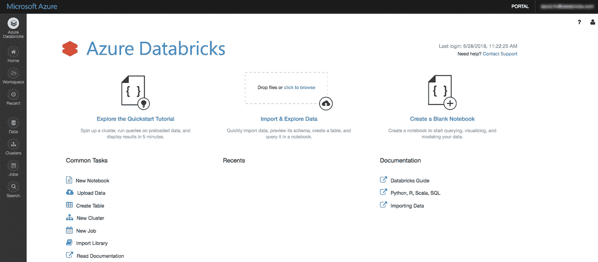
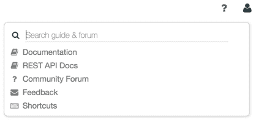
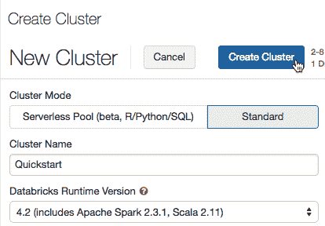
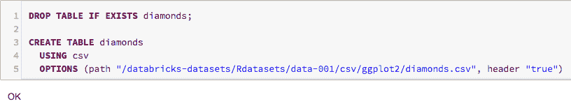
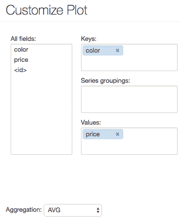
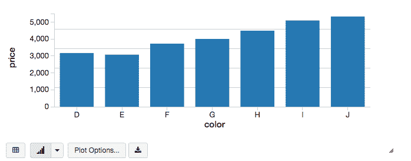
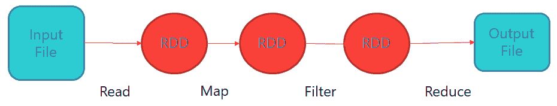
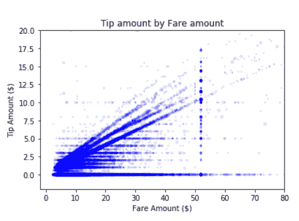
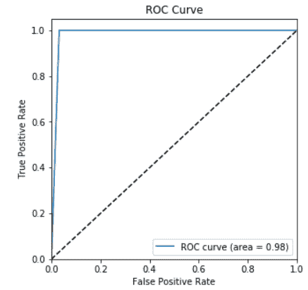
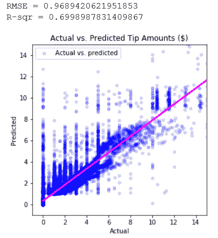

# 使用 Spark 进行机器学习

本章涵盖了 Microsoft 平台上 Spark 的使用，并将提供如何使用 Spark 训练 ML 模型的演练，以及 Azure 中可用于执行基于 Spark 的 ML 训练的选项。

我们将涵盖以下主题：

+   使用 Azure Databricks 的机器学习

+   Azure HDInsight 与 Spark

+   某些实验室的演练，以便您可以看到令人兴奋的技术在实际应用中的表现

# 使用 Azure Databricks 进行机器学习

通过采用机器学习，企业希望改善他们的业务，甚至通过使用数据作为数字化转型生命线的方式彻底改变它。Databricks 使公司能够快速开发他们的数据科学能力，并通过在 Azure 中提供完全集成的统一分析平台将其转化为竞争优势。

企业希望利用他们历史上收集的数据宝库。组织最近开始收集更多数据。这包括各种形式的数据，包括以点击流、网页日志和物联网设备和机器的传感器数据形式的新客户数据，以及音频、图像和视频。

通过分析这些数据，各个垂直领域的企业可以通过多种方式改善业务成果，这些方式影响我们的日常生活。这包括医疗诊断、欺诈检测、检测网络攻击、优化制造流程、客户参与等等。

Databricks 提供了一个统一的分析平台，将数据工程师、数据科学家和业务人员聚集在一起，在整个数据生命周期中进行协作，从 ETL 程序开始，到为生产环境构建分析应用程序。

数据工程师可以使用 Databricks 的 ETL 功能从各种来源创建新的数据集，包括结构化、半结构化和非结构化数据。数据科学家可以选择多种编程语言，如 SQL、R、Python、Scala 和 Java，以及 **机器学习** (**ML**) 框架和库，包括 Scikit-learn、Apache Spark ML、TensorFlow 和 Keras。

Databricks 允许企业以协作的方式探索数据，并使用 Databricks 的笔记本和可视化能力创建和测试他们的模型。交付时间快，将机器学习管道发送到生产的过程也很快。

# Databricks 正在尝试解决哪些挑战？

集成数据始终是困难的。然而，由于需要集成的各种框架和库，集成挑战在机器学习中更为困难。

Databricks 在数据科学平台的安全性和可管理性方面注重企业就绪性。

我们如何开始使用 Apache Spark 和 Azure Databricks？ 第一步是在 Azure 中设置 Azure Databricks 软件。

# 开始使用 Apache Spark 和 Azure Databricks

在本教程中，我们将开始探索 Azure Databricks。过程中的一个关键步骤是设置 Azure Databricks 的一个实例，这在本部分中介绍：

1.  登录到 Azure 门户([`portal.azure.com/`](https://portal.azure.com/))。

1.  选择+创建资源 | 分析 | Azure Databricks。

1.  在 Azure Databricks 服务对话框中，提供工作区配置。

1.  工作区名称：

    +   为您的 Azure Databricks 工作区输入一个名称

1.  订阅：

    +   选择您的 Azure 订阅

1.  资源组：

    +   创建一个新的资源组([`docs.microsoft.com/en-us/azure/azure-resource-manager/resource-group-overview`](https://docs.microsoft.com/en-us/azure/azure-resource-manager/resource-group-overview))或使用现有的一个

1.  位置：

    +   选择一个地理区域([`docs.azuredatabricks.net/administration-guide/cloud-configurations/regions.html`](https://docs.azuredatabricks.net/administration-guide/cloud-configurations/regions.html))

1.  定价层：

    +   选择定价层([`azure.microsoft.com/en-us/pricing/details/databricks/`](https://azure.microsoft.com/en-us/pricing/details/databricks/))。如果您选择**试用（高级 - 14 天免费 DBUs）**，则工作区将免费获得 14 天的高级 Azure Databricks DBUs。

1.  选择**固定到仪表板**，然后点击**创建**。门户将显示“部署进行中”。几分钟后，Azure Databricks 服务页面将显示，如下面的截图所示：



在左侧，您可以访问基本的 Azure Databricks 实体：工作区、集群、表、笔记本、作业和库。

工作区是存储您的 Azure Databricks 资产（如笔记本和库）以及您导入的数据的特殊根文件夹：



# 创建集群

集群是一组 Azure Databricks 计算资源：

1.  要创建集群，请在侧边栏中点击**集群**按钮，然后点击**创建集群**：



1.  在**新建集群**页面，指定集群名称。

1.  在 Databricks 运行时版本下拉列表中选择 4.2（包括 Apache Spark 2.3.1，Scala 11）。

1.  点击创建集群。

# 创建 Databricks 笔记本

笔记本是一组在 Spark 集群上运行计算的单元格。要在工作区中创建笔记本，请按照以下步骤操作：

1.  在侧边栏中，点击工作区按钮。

1.  在`工作区`文件夹中，选择创建笔记本：


1.  在创建笔记本对话框中，输入一个名称并在**语言**下拉列表中选择 SQL。

1.  点击创建。笔记本以顶部一个空单元格打开。

# 在 Azure Databricks 中使用 SQL

在本节中，您可以使用 SQL 语句创建表并使用 SQL 语句处理数据：

1.  将此代码片段复制并粘贴到笔记本单元格中，以查看 Azure Databricks 数据集的列表：

```py
display(dbutils.fs.ls("/databricks-datasets"))
```

1.  代码如下所示：

```py
DROPTABLEIFEXISTS diamonds;CREATETABLE diamondsUSING csvOPTIONS (path "/databricks-datasets/Rdatasets/data-001/csv/ggplot2/diamonds.csv", header "true")
```

1.  按 *Shift* + *Enter*。笔记本会自动连接到你在 *步骤 2* 中创建的集群，创建表格，加载数据，并返回 `OK`：



1.  接下来，你可以运行一个 SQL 语句 ...

# 显示数据

显示按颜色划分的平均钻石价格图表：

1.  点击柱状图图标

1.  点击绘图选项

1.  将颜色拖入键值框

1.  将价格拖入值值框

1.  在聚合下拉菜单中，选择 AVG：



1.  点击应用以显示柱状图：



# 使用 HDInsight 进行机器学习

Apache Spark 是数据处理领域最大的开源项目。自其发布以来，Apache Spark 已被各行各业的企业迅速采用。Apache Spark 是一个快速、内存数据处理的引擎，具有优雅且表达性强的开发 API，允许数据工作者高效地执行流处理。此外，Apache Spark 还简化了需要快速迭代访问数据集的 ML 和 SQL 工作负载。

当前章节的重点是 Apache Spark，它是一个用于快速、大规模数据处理和机器学习的开源系统。

数据科学虚拟机为您提供了 Apache Spark 平台的独立（单节点进程）实例。

# 什么是 Spark？

Spark 被设计为一个高性能、通用计算引擎，用于快速、大规模的大数据处理。Spark 通过在集群的不同节点间分配其工作负载来工作。Spark 可以扩展以处理大量数据。Spark 面向大数据批处理，非常适合使用低延迟、高性能数据作为操作基础进行数据分析。

Apache Spark 由 Spark Core 和一系列库组成。Core 是分布式执行引擎，Java、Scala 和 Python API 为分布式 ETL 应用程序开发提供了一个平台。这使得开发者可以通过在 Java、Scala 或 Python 中编写应用程序来快速取得成功。

Spark 是基于 **弹性分布式数据集**（**RDD**）的概念构建的，自从 Spark 诞生以来，RDD 就一直是 Spark 处理数据的核心概念。RDD 与 R 中的数据框类似。RDD 是对数据进行高级抽象，为数据科学家提供了一种模式来检索和使用数据。RDD 是不可变的数据集集合，代表数据集，并具有内置的可靠性和故障恢复能力。RDD 在任何操作（如转换或操作）上都会创建新的 RDD。它们还存储了 lineage，用于从故障中恢复。例如，可以将数据分离到数据集中的适当字段和列中，这意味着数据科学家可以更直观地与之交互。

Spark 处理过程涉及多个步骤，可能涉及多个 RDD。因此，在处理过程中可能存在多个 RDD。以下是一个示例，展示了 RDD 如何成为不同处理步骤的源和输出：



Apache Spark 允许进行复杂的数据工程，并自带一套超过 80 个高级操作符。除了更长的处理时间外，还可在 shell 中交互式查询数据。除了 Map 和 Reduce 操作外，它还支持 SQL 查询、流数据、机器学习（ML）和图数据处理。

开发者可以使用这些功能独立使用，或者将它们组合起来在单个数据管道用例中运行。

Spark 驱动一系列库，包括 SQL 和 DataFrame（[`spark.apache.org/sql/`](https://spark.apache.org/sql/)）、MLlib（[`spark.apache.org/mllib/`](https://spark.apache.org/mllib/)）用于机器学习、GraphX（[`spark.apache.org/graphx/`](https://spark.apache.org/graphx/)）和 Spark Streaming（[`spark.apache.org/streaming/`](https://spark.apache.org/streaming/)）。您可以在同一应用程序中无缝组合这些库。

在本章中，我们将重点关注机器学习练习中的 RDD。我们将专注于使用 Jupyter Notebooks 进行动手练习。Jupyter Notebooks 可在数据科学虚拟机上使用，并且默认作为服务安装在 Azure HDInsight 部署的 Spark 上。

# HDInsight 和 Spark

Apache Spark 是一个开源的并行处理框架，支持内存处理以提升大数据分析应用的性能。HDInsight 上的 Apache Spark 集群与 Azure 存储（WASB）以及 Azure 数据湖存储兼容。

当开发者在 HDInsight 上创建 Spark 集群时，Azure 计算资源已经创建，并安装了 Spark，并进行了配置。在 HDInsight 中创建 Spark 集群只需大约 10 分钟。要处理的数据存储在 Azure 存储或 Azure 数据湖存储中。

Apache Spark 提供了内存集群计算的原始功能，这意味着它是 HDInsight 的完美伴侣。Apache Spark 作业可以加载和缓存数据 ...

# Apache Spark 中的 YARN 操作系统

YARN 是 Apache 软件基金会开源分布式处理框架 Hadoop 第二代 2.0 版本中的关键特性之一，它在 Hadoop 版本 3 中得到保留并进一步发展。YARN 在 Azure HDInsight 上实现，以促进大数据应用和预测分析的大规模分布式操作系统。

YARN 的效率在于它将 MapReduce 的资源管理和调度能力与数据处理组件解耦。由于 Apache Spark 使用这种方法，它使 Hadoop 能够支持更多样化的处理方法和更广泛的应用程序。

我们如何使用 Spark 进行预测分析？机器学习（ML）侧重于获取数据并应用一个过程到这些数据上，以产生预测输出。我们可以创建和使用许多不同类型的 ML 算法与 Spark 一起。最常见的方法之一是监督式 ML，它通过接收一些数据来实现，这些数据由我们称为特征的向量和一个标签组成。我们这是什么意思？

向量是一组我们用来进行预测的信息。标签是用于预测的特征。

我们将举一个例子。假设我们有一组关于人们的信息，我们想要预测这个群体的一些情况：他们是否有可能无家可归。这些人的特征可能包括他们的年龄、教育水平、收入、军事服务等等。这些人的特征被称为特征，而我们想要预测的东西被称为 **标签**。

在这种情况下，数据科学家会取一些已知他们已经无家可归的数据，因此标签值在那个时刻对研究人员来说是已知的。

使用 Spark，我们会对数据进行处理，并将数据拟合到模型中，以查看其成功程度。模型会告诉我们，为了看到这些个人发生无家可归的可能性，我们需要在特征中看到什么。

模型本质上是一个函数，它指定了我们期望在向量特征中看到什么，以看到结果或预测。

下一步是取之前未见过的、不包含已知标签的新数据，以查看其与模型拟合的情况。这个数据集只包含特征，因为实际的标签或结果并不为人所知。在这个监督学习示例中，使用已知标签的数据来训练模型预测具有已知标签的数据，然后模型面对的是没有已知标签的数据。

在无监督学习中，标签是未知的。无监督学习采取类似的方法，数据科学家将摄取数据并输入它，这仅仅包含特征的向量，没有标签存在。使用这种类型的数据科学方法，我可能只是在查看向量特征中发现的相似性，以查看数据中是否存在任何聚类或共性。

# 在 Spark 环境中处理数据

当数据科学家在 Apache Spark 环境中处理数据时，他们通常使用 RDD 或 DataFrame。在我们之前的例子中，数据可能以 RDD 格式存储，并通过构建一个预测性输入到模型中来输入到模型中。

在这些练习中，Spark 库被称作 `spark.mllib`。MLlib 库是 Spark 最初附带的原生 ML 库。较新的库被称作 **Spark ML**。

# 使用 Jupyter Notebooks

Jupyter Notebook 是一个极其强大的工具，用于协作开发和生产数据科学项目。它将代码、注释和代码输出整合到一个单一文档中，该文档结合了代码、数据可视化、叙述性文本、数学方程式和其他数据科学元素。由于它们鼓励数据科学团队进行迭代和快速开发，笔记本在当今的数据科学工作流程中越来越受欢迎。Jupyter 项目是早期 IPython Notebook 的继承者。在 Jupyter Notebook 中，可以使用许多不同的编程语言，但本章将专注于 Apache Spark。

Jupyter 是免费的、开源的、基于浏览器的。它可以用来创建笔记本，以正常方式处理代码，例如编写和注释代码。Jupyter Notebook 的一个关键特性是它们非常适合与其他团队成员协作，从而提高生产力。Jupyter Notebook 支持多种不同的引擎，也称为内核。Jupyter Notebook 可以用来在 Python 或 Scala 上运行代码。

在本教程中，将使用 Spark ML 教程来介绍 Spark 和 ML 的概念。

# 配置数据科学虚拟机

如果你使用的是 Ubuntu Linux DSVM 版本，需要执行一次设置步骤以启用本地单节点 Hadoop HDFS 和 YARN 实例。默认情况下，Hadoop 服务已安装但未启用。为了启用它，第一次需要以 root 用户运行以下命令：

```py
echo -e 'y\n' | ssh-keygen -t rsa -P '' -f ~hadoop/.ssh/id_rsacat ~hadoop/.ssh/id_rsa.pub >> ~hadoop/.ssh/authorized_keyschmod 0600 ~hadoop/.ssh/authorized_keyschown hadoop:hadoop ~hadoop/.ssh/id_rsachown hadoop:hadoop ~hadoop/.ssh/id_rsa.pubchown hadoop:hadoop ~hadoop/.ssh/authorized_keyssystemctl start hadoop-namenode hadoop-datanode hadoop-yarn
```

你可以停止与 Hadoop 相关的 ...

# 在 Jupyter 中运行 Spark MLib 命令

默认的 Jupyter lab 将展示 Spark MLlib 工具包在 ML 问题上的功能和能力。本教程使用一个示例数据集，该数据集包含来自纽约市出租车真实行程的数据。这些数据包含纽约市出租车行程和费用数据集，以展示 MLlib 在二进制分类和回归问题上的建模功能。

在本实验中，将使用许多不同的 Spark MLib 函数，包括数据摄取、数据探索、数据准备（特征化和转换）、建模、预测、模型持久化和在独立验证数据集上的模型评估。还将使用数据可视化来展示结果。

本实验将重点关注两种学习类型：分类提供了尝试监督学习和无监督学习的机会。第一个示例将使用二进制分类来预测是否会被给小费。在第二个示例中，将使用回归来预测小费的金额。

在 Jupyter 中，代码在单元格中执行。单元格结构是一种简单的方式，使数据科学家能够查询 RDD 数据框，并在 Jupyter Notebook 中交互式地显示信息，包括数据可视化。使用 Spark 进行 ML 的工作方式非常灵活、直观且强大。

# 数据摄取

第一项活动是设置适当的目录路径。

1.  设置训练数据的位置：

```py
taxi_train_file_loc = "../Data/JoinedTaxiTripFare.Point1Pct.Train.csv"taxi_valid_file_loc = "../Data/JoinedTaxiTripFare.Point1Pct.Valid.csv"
```

1.  设置模型存储目录路径。这是模型将被保存的位置：

```py
modelDir = "../Outputs/"; # The last backslash is needed;
```

1.  在 Jupyter 菜单中，将光标放在单元格中，然后从菜单中选择“运行”选项。这将把训练集和测试集分配给`taxi_train_file_loc`和`taxi_valid_file_loc`变量。

1.  接下来，数据将被设置到一个新的数据框中，并进行清理。数据摄入是通过`spark.read.csv`函数完成的，该函数将数据分配到一个新的...

# 数据探索

在下一步中，探索数据非常重要。在 Jupyter 界面中通过绘制目标变量和特征很容易可视化数据。数据使用 SQL 进行总结。然后，使用`matplotlib`绘制数据。为了绘制数据，数据框首先需要转换为 pandas 数据框。此时，matplotlib 可以使用它来生成图表。

由于 Spark 旨在处理大型大数据集，如果 Spark 数据框很大，可以使用数据样本进行数据可视化。

在以下示例中，在将数据转换为数据框格式之前，对 50%的数据进行了采样，然后将其合并到一个 pandas 数据框中。

代码如下所示：

```py
%%sql -q -o sqlResults
SELECT fare_amount, passenger_count, tip_amount, tipped FROM taxi_train

sqlResultsPD = spark.sql(sqlStatement).sample(False, 0.5, seed=1234).toPandas();
%matplotlib inline

# This query will show the tip by payment

ax1 = sqlResultsPD[['tip_amount']].plot(kind='hist', bins=25, facecolor='lightblue')
ax1.set_title('Tip amount distribution')
ax1.set_xlabel('Tip Amount ($)'); ax1.set_ylabel('Counts');
plt.figure(figsize=(4,4)); plt.suptitle(''); plt.show()

# TIP AMOUNT BY FARE AMOUNT, POINTS ARE SCALED BY PASSENGER COUNT

ax = sqlResultsPD.plot(kind='scatter', x= 'fare_amount', y = 'tip_amount', c='blue', alpha = 0.10, s=2.5*(sqlResultsPD.passenger_count))
ax.set_title('Tip amount by Fare amount')
ax.set_xlabel('Fare Amount ($)'); ax.set_ylabel('Tip Amount ($)');
plt.axis([-2, 80, -2, 20])
plt.figure(figsize=(4,4)); plt.suptitle(''); plt.show()
```

这将生成结果的直方图。

车费金额和小费金额之间的关系在以下图表中显示：



# Spark 中的特征工程

在特征工程中，我们可以处理许多数据工程任务，例如创建新特征和分组、转换和清理数据。数据可以进一步进行索引，并通过额外的分类、分组和分类特征的编码来丰富。

在以下示例代码中，我们使用 Spark SQL 将小时分组到交通时间桶中创建一个新特征：

```py
sqlStatement = """ SELECT *, CASEWHEN (pickup_hour <= 6 OR pickup_hour >= 20) THEN "Night"WHEN (pickup_hour >= 7 AND pickup_hour <= 10) THEN "AMRush"WHEN (pickup_hour >= 11 AND pickup_hour <= 15) THEN "Afternoon"WHEN (pickup_hour >= 16 AND pickup_hour <= 19) THEN "PMRush"END as TrafficTimeBinsFROM taxi_train
```

# 使用 Spark 进行预测

在本章的这一部分，练习是使用 Spark 示例代码创建逻辑回归模型，保存模型，并在测试数据集上评估模型的性能。在建模时，使用`RFormula`函数指定特征和类标签。在这个例子中，我们将使用管道公式和逻辑回归估计器来训练模型。这可以从以下代码片段中看出：

```py
logReg = LogisticRegression(maxIter=10, regParam=0.3, elasticNetParam=0.8)
```

下面的代码块设置训练公式并将其分配给`classFormula`变量，这可以从以下代码中看出：

```py
classFormula = RFormula(formula="tipped ~ pickup_hour + weekday + passenger_count + trip_time_in_secs + trip_distance + fare_amount + vendorVec + rateVec + paymentVec + TrafficTimeBinsVec")
```

下面的代码块训练了管道模型：

```py
model = Pipeline(stages=[classFormula, logReg]).fit(trainData)
```

下面的代码块保存了我们创建的模型：

```py
datestamp = str(datetime.datetime.now()).replace(' ','').replace(':','_');
fileName = "logisticRegModel_" + datestamp;
logRegDirfilename = modelDir + fileName;
model.save(logRegDirfilename)
```

下面的代码块使用模型对测试数据进行预测，并使用以下代码块帮助评估模型：

```py
predictions = model.transform(testData)
predictionAndLabels = predictions.select("label","prediction").rdd
metrics = BinaryClassificationMetrics(predictionAndLabels)
print("Area under ROC = %s" % metrics.areaUnderROC)
```

接下来，我们绘制 ROC 曲线：

```py
%matplotlib inline
predictions_pddf = predictions.toPandas()
labels = predictions_pddf["label"]
prob = []
for dv in predictions_pddf["probability"]:
prob.append(dv.values[1])
fpr, tpr, thresholds = roc_curve(labels, prob, pos_label=1);
roc_auc = auc(fpr, tpr)
plt.figure(figsize=(5,5))
plt.plot(fpr, tpr, label='ROC curve (area = %0.2f)' % roc_auc)
plt.plot([0, 1], [0, 1], 'k--')
plt.xlim([0.0, 1.0]); plt.ylim([0.0, 1.05]);
plt.xlabel('False Positive Rate'); plt.ylabel('True Positive Rate');
plt.title('ROC Curve'); plt.legend(loc="lower right");
plt.show()
```

下一个示例显示了回归输出：



ROC 曲线是蓝色曲线，位于图表的左上角非常高的位置。ROC 结果表明模型表现极好。作为一个启发式方法，蓝色线越接近图表左上角顶部，结果就越好。

在本节中，将使用随机森林模型回归方法来预测将给出多少小费。在标准分类树中，数据基于数据的同质性进行分割。决策树从根节点自上而下构建。这个过程涉及将数据分割成包含同质实例的子集。

在回归树中，目标变量是一个实数值。在这种情况下，数据使用每个独立变量拟合到目标变量。对于每个独立变量，数据在几个分割点处被分割。我们在预测值和实际值之间的每个分割边界计算**均方误差（SSE**）。导致最低 SSE 的变量被选为节点。然后，这个过程递归地继续，直到所有数据都被覆盖。

代码如下：

```py
## DEFINE REGRESSION FORMULA
regFormula = RFormula(formula="tip_amount ~ paymentIndex + vendorIndex + rateIndex + TrafficTimeBinsIndex + pickup_hour + weekday + passenger_count + trip_time_in_secs + trip_distance + fare_amount")
```

然后，我们定义分类变量的索引器：

```py
## DEFINE INDEXER FOR CATEGORIAL VARIABLES
featureIndexer = VectorIndexer(inputCol="features", outputCol="indexedFeatures", maxCategories=32)
```

然后，我们设置了随机森林估计器。其值设置为`randForest`变量：

```py
## DEFINE RANDOM FOREST ESTIMATOR
randForest = RandomForestRegressor(featuresCol = 'indexedFeatures', labelCol = 'label', numTrees=20,
featureSubsetStrategy="auto",impurity='variance', maxDepth=6, maxBins=100)
```

下一步是使用定义的公式和相关转换来拟合模型：

```py
## Fit model, with formula and other transformations
model = Pipeline(stages=[regFormula, featureIndexer, randForest]).fit(trainData)
```

下一个关键步骤是保存模型：

```py
## SAVE MODEL
datestamp = str(datetime.datetime.now()).replace(' ','').replace(':','_');
fileName = "RandomForestRegressionModel_" + datestamp;
andForestDirfilename = modelDir + fileName;
model.save(randForestDirfilename)
```

然后，我们需要使用模型对测试数据进行预测，以便我们可以评估其成功：

```py
predictions = model.transform(testData)
predictionAndLabels = predictions.select("label","prediction").rdd
testMetrics = RegressionMetrics(predictionAndLabels)
print("RMSE = %s" % testMetrics.rootMeanSquaredError)
print("R-sqr = %s" % testMetrics.r2)
```

数据可视化没有替代品。在下一个代码块中，数据使用散点图格式进行可视化。代码块后的结果是：

```py
## PLOC ACTUALS VS. PREDICTIONS
predictionsPD = predictions.select("label","prediction").toPandas()ax = predictionsPD.plot(kind='scatter', figsize = (5,5), x='label', y='prediction', color='blue', alpha = 0.15, label='Actual vs. predicted');
fit = np.polyfit(predictionsPD['label'], predictionsPD['prediction'], deg=1)
ax.set_title('Actual vs. Predicted Tip Amounts ($)')
ax.set_xlabel("Actual"); ax.set_ylabel("Predicted");
ax.plot(predictionsPD['label'], fit[0] * predictionsPD['label'] + fit[1], color='magenta')
plt.axis([-1, 15, -1, 15])
plt.show(ax)
```

生成的图表可以在下面找到：



**均方根误差（RMSE**）值越低，绝对拟合越好。RMSE 是残差方差的平方根。它指定了模型对数据的绝对拟合。换句话说，它表示观察到的实际数据点与模型预测值有多接近。作为方差的平方根，RMSE 可以被视为未解释方差的均方差。RMSE 具有有用的属性，即它与响应变量具有相同的单位，因此它直观地有意义。较低的 RMSE 值表示更好的拟合。RMSE 是衡量模型预测响应准确性的良好指标。在本例中，RMSE 是拟合最重要的标准，因为模型的主要目的是预测。

**R-sqr**是直观的。其值范围从零到一，零表示所提出的模型没有比平均模型改善预测，一表示完美预测。回归模型的改进导致 R-sqr 成比例增加。

而 R-sqr 是拟合的相对度量，RMSE 是拟合的绝对度量，这就是为什么它在这里被展示。

# 加载管道模型并评估测试数据

在本例中，我们将加载一个管道模型，然后评估测试数据：

```py
savedModel = PipelineModel.load(logRegDirfilename)predictions = savedModel.transform(testData)predictionAndLabels = predictions.select("label","prediction").rddmetrics = BinaryClassificationMetrics(predictionAndLabels)print("Area under ROC = %s" % metrics.areaUnderROC)
```

在下一步中，我们定义随机森林模型：

```py
randForest = RandomForestRegressor(featuresCol = 'indexedFeatures', labelCol = 'label',featureSubsetStrategy="auto",impurity='variance', maxBins=100)
```

现在，我们将定义一个包含公式、特征转换和估计器的建模管道：

```py
pipeline = Pipeline(stages=[regFormula, ...
```

# 使用 Spark 配置 HDInsight 集群

配置 HDInsight Spark 集群以开始工作至关重要。

# 配置 HDInsight 集群

如果您已经有一个正在运行的 Spark HDInsight 集群，您可以跳过此步骤。

1.  在网页浏览器中，导航到 [`portal.azure.com`](http://portal.azure.com) 并，如果需要，使用与您的 Azure 订阅关联的 Microsoft 账户登录。

1.  在微软 Azure 门户中，在中心菜单中点击新建。然后，在数据 + 分析部分，选择 HDInsight 并创建一个新的 HDInsight 集群，设置如下：

    +   **集群名称**：输入一个唯一的名称（并记下它！）

    +   **订阅**：选择您的 Azure 订阅

    +   **集群类型**：Spark

    +   **集群操作系统**：Linux

    +   **HDInsight 版本**：选择 Spark 的最新版本

    +   **集群等级**：标准

    +   **集群登录用户名**：输入您选择的用户名（并 ...

# 摘要

在本章中，您被介绍到了微软 Azure 中的一些最新大数据分析技术。本章主要关注两种主要技术：带有 Spark 的 Azure HDInsight 和 Azure Databricks。

在本章中，我们探讨了不同的数据建模方式，并提供了有用的技巧来帮助您理解模型的实际含义。通常，这并不是数据科学过程的终点，因为随着您获得新的见解，这可能会提出新的问题。因此，这是一个过程而不是一场竞赛——这正是它的有趣之处！

# 进一步参考

+   在 [`spark.apache.org/docs/latest/ml-guide.html`](https://spark.apache.org/docs/latest/ml-guide.html) 查阅 Spark 机器学习编程指南

+   包括 Spark 集群在内的 Microsoft Azure HDInsight 文档在 [`azure.microsoft.com/en-us/documentation/services/hdinsight`](https://azure.microsoft.com/en-us/documentation/services/hdinsight)

+   Scala 编程的文档和入门指南在 [`www.scala-lang.org/documentation/`](http://www.scala-lang.org/documentation/)

+   Python 编程的文档和入门指南在 [`www.python.org/doc/`](https://www.python.org/doc/)

+   您可以在 [`spark.apache.org/docs/latest/sql-programming-guide.html`](https://spark.apache.org/docs/latest/sql-programming-guide.html) 查看 Spark SQL 和 DataFrame 编程指南

+   分类和回归：[`spark.apache.org/docs/latest/ml-classification-regression.html`](https://spark.apache.org/docs/latest/ml-classification-regression.html)

+   管道：[`spark.apache.org/docs/latest/ml-pipeline.html ...`](https://spark.apache.org/docs/latest/ml-pipeline.html)
