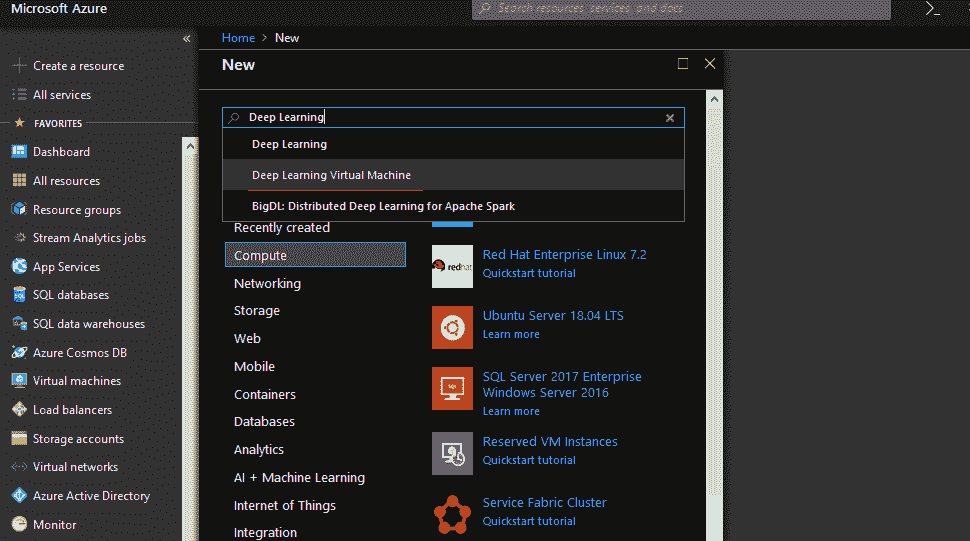

# 构建深度学习解决方案

深度学习是机器学习的一个超集，它结合了受人类大脑设计和功能影响的算法，称为人工智能神经网络。它以监督、半监督和无监督算法的形式表示，其中架构深刻地集中在深度神经网络、深度信念网络和循环神经网络上。如今，深度学习在工业界以及计算机视觉、语音识别、音频合成、图像识别、自然语言处理、社交媒体内容审核等领域的研究与开发（R&D）部门得到了广泛接受和应用。

在本章中，我们将学习以下主题：

+   Microsoft CNTK 和 MMLSpark 框架的概述，以及第三方深度学习工具

+   TensorFlow 和 Keras，以及部署在 Azure 计算上的步骤

# 什么是深度学习？

深度学习是传统机器学习算法的一个子类，它利用一系列非线性处理层进行特征提取、转换，并在前一层输入的连续输出层上进行最终分析。

深度学习神经网络的第一层由输入层、输出层（最外层层）和隐藏层组成，隐藏层位于输入层和输出层之间，是一个复杂的层：


# 传统机器学习和深度学习之间的差异

传统机器学习和深度学习的比较如下：

| **传统机器学习** | **深度学习** |
| --- | --- |
| 传统机器学习需要手动提取/工程化数据特征。 | 深度学习自动从数据特征中学习。 |
| 对于非结构化数据，特征提取很困难。 | 深度学习更新每一层的网络权重和偏置。 |

# 常见的深度学习神经网络（DNNs）

在数据科学平台上，有各种各样的深度学习神经网络可用于解决深度学习问题。以下是一些例子：

+   **深度卷积神经网络**（**DCNN**）：用于提取图像表示

+   **循环神经网络**（**RNN**）：用于提取序列数据表示

+   **深度信念神经网络**（**DBN**）：用于提取层次数据集表示

+   **深度强化学习**（**DRL**）：预测代理行为以最大化未来的累积奖励

在各种深度学习框架和工具上工作的传统方式带来了许多挑战，因为它包含了许多依赖关系...

# Azure Notebook 服务的概述

Azure 笔记本服务是一项托管服务，基本上通过使用 R、Python 和 F#的计算能力，为 Jupyter Notebooks 提供便捷的访问。用户可以利用其众多的可视化库，并以公开或私密的方式通过可分享的链接共享笔记本。

微软的**认知工具包**（**CNTK**）对 Azure 笔记本服务有原生支持，因此基于 Python 的 Jupyter Notebooks 可以使用 CNTK 框架执行。对于在 TensorFlow、Keras 或 Theano 等其他深度学习框架中执行，用户需要通过 Miniconda 或 Pip/wheel 安装相应的框架组件。

Azure 笔记本服务可在[`notebooks.azure.com/`](https://notebooks.azure.com/)获取，并利用免费、基于云的、基于 Web 的 Jupyter Notebook 环境的功能，包括使用 Python 2、Python 3、R 和 F#等数据科学语言创建库和众多交互式图形的设施。您可以创建自己的库并构建交互式笔记本，也可以简单地上传现有的 Jupyter Notebooks：


微软 CNTK 笔记本在 Azure 笔记本中内置了支持。Azure 笔记本中的所有笔记本都可以组织成称为库的单独组，这些库是可分享的但不可编辑的。笔记本也可以从其他存储库克隆。

可以通过数据菜单轻松上传数据到 Azure 笔记本，并使用函数单元格将其加载到内存中。它也可以被下载，如下面的截图所示：


Azure 笔记本服务提供了使用 matplotlib、scikit-learn、scipy、numpy、pandas 等库实现交互式 IPython 笔记本的能力。在以下演示中，实现了关于世界人口增长率分析的交互式 IPython 笔记本：


首先，通过将原始数据导入 DataFrame 来执行数据探索：

```py
import pandas as pd
 df_population_density = pd.read_csv('/home/nbuser/library/World_Population_Growth.csv')
 df_population_density.head(10)
```

然后，我们实现筛选以构建一个更简洁的数据透视表：

```py
filtered_cells_df = df_population_density[['Location','Time','Births','Deaths','GrowthRate']].dropna(how="any")
 filtered_cells_df
```

以下代码片段的输出如下：


# 使用 Azure 笔记本构建数据透视表

可以使用如`pivot_table()`这样的函数来填充数据透视表：

```py
df_population_pivot = filtered_cells_df.pivot_table('GrowthRate','Location','Time') df_population_pivot.head(100)
```

最后，我们可以使用如`matplotlib`、`seaborn`、`pandas`、`folium`等可视化库构建基于 Python 的交互式可视化：

```py
import numpy as np import matplotlib.pyplot as plot plot.figure(figsize=(15,10),dpi = 80) plot.plot(df_population_pivot.ix[:,0:1], label="Net Growth rate, both sexes males and females") plot.plot(df_population_pivot.ix[:,1:2], label="Net migration rate (per 1000 population distribution)") plot.plot(df_population_pivot.ix[:,2:3],label="Population growth rate (%)") plot.xlabel('Location') ...
```

# Azure 深度学习虚拟机工具包概述

**深度学习虚拟机**（**DLVM**）是传统 Azure 数据科学 VM 的超集变体，它由预配置的环境组成，主要用于在 GPU 实例（例如，Azure GPU NC 系列 VM）上开发和部署深度学习模型，并在两个操作系统上提供——Windows Server 2016 和 Ubuntu Linux 版本。

Azure 上的 DSVM 包含了预构建的多个 AI 工具，包括 CNTK、Keras、Caffe2 和 Chainer，用于预处理和提取视觉数据、文本、音频或视频数据。您可以使用 Microsoft R 服务器、Anaconda Python、Jupyter Notebooks for Python/2.x、R、SQL Server 2017、Azure ML 工作台、Julia、F# SDK 等工具进行数据科学建模和使用实现操作。

您可以从 Azure 门户的市场中配置 Deep Learning VM 作为 Azure 资源管理器 (ARM)，并提供各种详细信息，如操作系统类型、用户凭据以及加速在深度学习机器上的 GPU 实例大小：


在市场中的 Azure DLVM 的更多详细信息可以在以下链接中找到：[`azuremarketplace.microsoft.com/en-us/marketplace/apps/microsoft-ads.dsvm-deep-learning`](https://azuremarketplace.microsoft.com/en-us/marketplace/apps/microsoft-ads.dsvm-deep-learning)。

# 开源深度学习框架

以下表格显示了在企业环境中使用的各种开源深度学习框架的详细信息：

| **软件** | **创新者** | **平台** | **软件许可** | **开源？** | **CUDA (GPU) 支持** | **平台接口** |
| --- | --- | --- | --- | --- | --- | --- |
| CNTK | 微软研究院 | Windows 和 Linux | MIT | 是 | 是 | Python、C++、C# 和 CLI 支持 |
| TensorFlow | Google Brain | Linux, macOS, 和 Windows | Apache 2.0 | 是 | 是 | Python(NumPy) 和 C/C++ |
| Theano | 蒙特利尔大学 | 跨平台 | Apache 2.0 | BSD 许可证 | 是 | Python |
| Caffe | 伯克利人工智能 | Linux、macOS 和 Windows | BSD 许可证 | 是 | 是 | Python 和 Matlab |
| Apache MXNet | 分布式机器学习社区 | Ubuntu、macOS、Windows、AWS、Android 和 iOS | Apache 2.0 | 是 | 是 | C++、Python、Matlab 等 |

# 深入分析微软深度学习工具

微软推出了广泛的新的深度学习工具包，可以利用认知工具包 CNTK 加速文本分析、语音/语音识别和图像分类等领域的进步，CNTK 可在本地或 Azure GPU 实例上运行。Azure 认知工具包支持绑定到 BrainScript 和 Python（截至编写时为版本 2.7、3.5 和 3.6），C++ 和 .NET 管理的 C# 平台。

以下是在深度学习中 CNTK 2.0 的功能：

+   CNTK 函数的扩展功能，用于在多种语言（如 Python、C# 和 C++）中提取、特征工程和评分优化器机器学习算法。

+   在 CNTK 中集成 TensorFlow 模型进行可视化。

+   提供了几个预训练模型作为示例。

+   通过在 GPU 实例（例如，Nvidia Tesla CUDA 和 cuDNN）上使用 FAST R-CNN 算法支持图像识别。

+   提供了 Python 和 BrainScript 的性能分析器。

+   在 Azure 上通过运行 kubernetes 集群来实现深度学习项目的自动扩展可行性。Kubernetes 上的自动扩展功能提供了 Pod 级别的扩展（开箱即用）以及节点级别的扩展。**水平 Pod 扩展（HPA**）是运行 CNTK 模型在 AKS 上的一个主要功能，因为它根据您的需求自动扩展集群中的 Pod 数量，并注意指定多个节点指标，如 CPU 利用率百分比和内存可用性百分比，基于扩展或缩减。

+   支持 VS 工具包的 AI，为大多数（如果不是所有）深度学习库提供了易于本地安装的功能（例如，Tensorflow、MXNet、Keras、Caffe2、Theano、Torch、Pytorch、Chainer（具有 GPU cuda 支持作为 cuPy）、XG-Boost、Scikit-learn、LIBSVM、**开放神经网络交换（ONNX**）、Core ML 社区工具（coremltools）、微软 ML 工具、tf2onnx、Netron 等）。

更多关于 Visual Studio 的 AI 工具及其支持的 ML/DL 库的详细信息，可以在以下 GitHub 链接中找到：[`github.com/Microsoft/vs-tools-for-ai/blob/master/docs/`](https://github.com/Microsoft/vs-tools-for-ai/blob/master/docs/prepare-localmachine.md)。

# 微软 CNTK 概述

微软 CNTK 是一个商业级开源工具包，用于深度学习，并将神经网络结构指定为一系列计算有向图。它由微软语音研究人员（董宇等人）于 2012 年推出，2015 年开源，并在 Codeplex 上发布。从 2016 年起，CNTK 的源代码库在 GitHub 上以权限许可的形式可用。CNTK 提供了易用性、快速性和将简单构建块组合成复杂网络的灵活性。这个深度学习工具包 100%适用于生产环境，并提供了最先进的准确性，使其能够高效且可扩展到任何 CPU/GPU 处理平台。它集成了流行的前馈训练模型...

# CNTK 的架构构建块

CNTK 作为第一个深度学习工具包支持**开放神经网络交换（ONNX**）格式，它为框架互操作性和优化提供了一个共享的开源模型表示。ONNX 还扩展了对在 CNTK、Caffe2、Apache MXNet 和 PyTorch 等框架之间移动训练模型的支持。

CNTK 的顶级命令块，即 CNTK 配置文件，定义了要执行的操作以及相关信息的执行。配置参数分类了要实现哪些命令块，以及如果定义了多个命令块，它们的顺序。

从架构角度来看，CNTK 配置参数命令块包括以下内容：

+   **输入读取器块**：指定从语料库加载现有模型来构建网络的基本概念

+   **网络层**：定义要使用的特定训练算法

+   **学习器层**：指定*在哪里*和*如何*加载训练模块和标签：


CNTK 最广泛使用的配置块如下：

+   网络层构建块：

    +   **简单网络构建器**：执行具有约束定制的网络模型之一

    +   **BrainScript 网络构建器**：基于 CNTK 网络描述语言（BrainScript）实现网络，这为网络设计和神经网络配置提供了好处

+   学习者：

    +   **SGD 模型**：主要应用随机梯度下降算法对模型进行训练。

+   输入读取器：

    +   **CNTK 文本格式读取器**：读取合并了多个相同格式输入文本文件的输入文本文件。

    +   **LM 序列读取器**：读取包含单词序列的输入文本文件，用于预测单词序列。

    +   **LU 序列读取器**：接受基于文本的文件作为单词序列，以及其关联的标签。这主要用于构建语言理解 API。

    +   **HTKMLF 读取器**：读取用于语音识别和语音合成应用的 HTK/MLF 格式的输入文件。

# CNTK 概念

CNTK 的输入、输出和参数以*张量*的形式组织，其中秩对每个张量进行分类。秩为 0 的张量关联为标量，秩为*1*的张量指定为向量，秩为*2*的张量定义为矩阵。每个 CNTK 都有一些静态和动态轴可用。静态轴在整个网络生命周期中长度相同。动态网络的静态轴定义为有意义的张量分组，其中 a)它们的轴长度可以不同实例而异，b)它们的轴长度在表示每个小批量之前通常是未知的，c)动态轴是有序的。小批量被称为张量，如果...

# 在 Azure 深度学习虚拟机中开发和部署 CNTK 层以实现神经网络

微软 CNTK 灵活易用，主要应用简单的构建块快速构建复杂层。CNTK 的主要用途之一是它可以作为 Keras 框架的后端。从一些基准测试结果中，我们可以看到 CNTK 通常比谷歌的 TensorFlow 快，并且比循环/LSTM 网络快 5-10 倍。

要开始构建 Azure 深度学习 GPU 实例的 CNTK 构建块，我们需要从支持 GPU 实例的 Azure 门户中配置 DLVM。您可以通过选择“创建资源”|“新建”，然后在搜索栏中键入`深度学习虚拟机`来从 Azure 市场配置 DLVM，如下面的截图所示：



接下来，通过提供适当的虚拟机详细信息，例如操作系统类型（Windows/Linux）、用户凭据和资源组，您可以选择所需的 GPU 实例大小，例如 NV6 或 NV12，或者如果您的 Azure 订阅中有足够的配额，那么您可以尝试实例大小，例如 NC6sv3（例如，6 核心 GPU，112 GB RAM，12 个数据盘）和 NC12sv3（例如，12 核心 GPU，224 GB RAM，24 个数据盘，40k 磁盘 IOPS 可用性）。

Azure 深度学习可以通过远程桌面（RDP）模式（端口`3389`）或 SSH 模式（端口`22`）访问。

# CNTK 输入和变量声明

深度学习框架最显著的特点是其处理输入数据集、声明变量和计算图性能管理的能力。在这个 Azure 深度学习虚拟机上的 CNTK 演示中，将关联三个层，以便它们可以识别手写数字的 MNIST 数据集。

# CNTK 变量部分

在 MNIST 数据集分类问题中，存在一个平铺的 28 x 28 像素值缩放输入及其相关的十个标签用于分类。在 CNTK 中，可以声明变量来捕获数据，如下所示：

```py
import cntk as Cognitive
 from cntk.train import Trainer
 from cntk.io import MinibatchSource, CTFDeserializer, StreamDef, StreamDefs
 from cntk.learners import adadelta, learning_rate_schedule, UnitType
 from cntk.ops import RELU, element_times, constant
 from cntk.layers import Dense, Sequential, For, default_options
 from cntk.losses import cross_entropy_with_softmax
 from cntk.metrics import classification_error
 from cntk.train.training_session import *
 from cntk.logging import ProgressPrinter

 input_dimension = 784
 number_output_classes = 10
 number_hidden_layers = 2
 hidden_layers_dimension=200
 feature_val = Cognitive.input_variable(input_dimension)
 label_val = Cognitive.input_variable(number_output_classes)
```

这些类型的`input_variable`函数被声明，就像 TensorFlow 中的占位符变量一样。然而，微软 CNTK 消除了识别样本/批量大小数量的必要性，用户还可以为每个评估样本提供维度。在卷积神经网络任务的情况下，用户可以为平铺的 28 x 28 = 784 像素输入和 10 个输出标签或类别分配`input_dimension = (1,28,28)`。

# CNTK 的数据读取器

微软 CNTK 提供了一些辅助模块，以帮助将训练数据格式化为可接受的格式，并在小批量上下文中将其读入模型。`CTFDeserializer()`是 CNTK 中的一种函数类型，可以读取特殊 CNTK 格式的输入文本文件（其中数据以每行一个样本的形式出现，使用管道/分隔符）。另一个是`StreamDef()`函数，它类似于字典对象。

使用`CTFDeserializer()`函数，以下方式读取 CNTK 文件格式：

```py
from cntk.io import MinibatchSource, CTFDeserializer, StreamDef, StreamDefspath =  "C:\\Users\\CNTK\\Examples\\Image\\DataSets\\MNIST\Train-28x28_cntk_text.txt"reader_train_val = MinibatchSource(CTFDeserializer(path, StreamDefs( ...
```

# CNTK 中的操作

与 TensorFlow 类似，微软 CNTK 允许操作作为计算图中的节点。这些节点和操作为流程提供支持。CNTK 指定从图乘法和除法到 softmax 和卷积操作的操作。需要通过操作运行时的`eval()`方法显式评估操作代码。尽管大多数这些操作不是显式评估的，但在最终层网络执行期间会隐式评估。

例如，在 MNIST 数据集中，通过简单的 CNTK 操作对输入特征进行缩放。这种缩放是通过使用 1/256 ~ 0.00390625 来实现的：

```py
 # Instantiate the feed forward classification model
 scaled_input = element_times(constant(0.00390625), feature_val)
```

在这里，声明了一个常量 0.00390，以及使用`element_times()`操作将其与输入变量 features 相乘的用法。输入数据集被缩放到 0 到 1 之间。

# 微软 CNTK 的层

微软认知工具包为我们提供了配置神经网络层的能力，这提供了许多层功能，如 Dense、卷积、MaxPooling、递归和 LSTM。例如，在 MNIST 数据集中，标准的神经网络分类器包括一些密集连接的层，如输入层、第一个隐藏层、第二个隐藏层和最终的输出层：


基本上，输入层由 784 个展平的像素输入层组成，这些层由两个大小为 200 的隐藏层和一个激活了 softmax 的最终输出层组成。层...

# CNTK 层配置助手

为了使网络定义更加简洁，CNTK 提供了一些辅助函数/对象类，例如`Sequential()`模块，它类似于 Keras 中的`Sequential( )`范式。它还允许你连续堆叠一层又一层的层，而不需要指定输出，然后这个输出作为下一层的输入传递：

```py
from cntk.layers import Dense, Sequential, For, default_options

with default_options(activation=relu, init=Cognitive.glorot_uniform()):
 z = Sequential([For(range(number_hidden_layers),

lambda i: Dense(hidden_layers_dimension)),
 Dense(number_output_classes, activation=None)])(scaled_input)
```

CNTK 中存在`layers.default_options()`模块，它可以协助简化，并在更复杂的网络中使用。激活函数在这里不再需要，但使用`default_option`来为输出层，因为它允许我们在损失函数中应用 softmax。每个层中指定了相同的`glorot_uniform()`函数的初始化：

```py

 def simple_mnist():
 input_dimension = 784
 number_output_classes = 10
 number_hidden_layers = 2
 hidden_layers_dimension = 200
```

```py
# Instantiate the feedforward classification model
 scaled_input = element_times(constant(0.00390625), feature_val)

with default_options(activation=relu, init=Cognitive.glorot_uniform()):
 z = Sequential([For(range(number_hidden_layers),
 lambda i: Dense(hidden_layers_dimension)),
 Dense(number_output_classes, activation=None)])(scaled_input)
```

# CNTK 的损失和错误处理模块

CNTK 库提供了一套完整的损失函数和错误处理模块来训练模型。这个范围从标准的交叉熵和平方误差到余弦距离如 lambda ranks。对于分类目的，可以应用`cross_entropy_with_softmax`选项：

```py
ce = cross_entropy_with_softmax(z, label_val)
```

在这里，输出层`z`被提供了一个标记的输出变量值，并且使用 softmax 精度在`z`上计算交叉熵损失。

接下来，为了访问测试集中的错误，必须使用训练模型。对于分类任务，必须使用`classification_error()`函数：

```py
pe = classification_error(z, label_val)
```

# CNTK 中的输入训练模型

CNTK 提供了各种进行训练的选项，例如简单地调用一个包含输入和输出训练集的字典：

```py
input_map = {
 feature_val: reader_train_val.streams.features,
 label_val: reader_train_val.streams.labels
 }
```

在这里使用的`MinibatchSource()`对象调用`reader_train`，这是你可以通过点符号访问流/数据的地方。

还需要定义一个`ProgressPrinter`，这是一个对象，允许你设计输出指标，如损失和分类错误。进度编写器也可以实例化：

```py
# Instantiate progress writers.
 progress_writers_val = [ProgressPrinter(
 tag='Training',
 num_epochs=number_sweeps_to_train_with)]
```

`tag` 参数指定了在每次更新中附加到日志中的值的演示。模型训练期间的总周期数由计数器计算，并通过 `num_epochs` 声明。

# 实例化训练器对象

为了设置 `Trainer` 对象，我们需要一个训练模型并将其输入到多个信息层（如输出层和先验层）的模块，先验层用于训练计算图结构。然后，我们需要利用将要用于计算梯度的损失函数，其中可以使用随机下降和 Ada Grad 等优化器：

```py
#Instantiate the trainer object to drive the model training lr = learning_rate_schedule(1, UnitType.sample) trainer = Trainer(z, (ce, pe), [adadelta(z.parameters, lr)], progress_writers_val)  
```

# 定义训练会话对象

CNTK 库有一种奇妙的方式来表示 `training_session()` 对象及其小批量初始化。它关联定义输入数据、记录、`num_sweeps_to_train`、每扫视的样本数等：

```py
# Training config
 minibatch_size_val = 64
 number_samples_per_sweep = 60000
 number_sweeps_to_train_with = 10

training_session(
 trainer=trainer,
 mb_source=reader_train_val,
 mb_size=minibatch_size_val,
 model_inputs_to_streams=input_map,
 max_samples=number_samples_per_sweep * number_sweeps_to_train_with,
 progress_frequency=number_samples_per_sweep
 ).train()
```

在这个 `training_session()` 对象中，所有的优化和参数学习都将发生在源中，并且我们可以从中提取作为 `reader_main` `MinibatchSource` 对象使用的小批量数据。

一旦执行训练，输出将显示在进度写入器中，如下截图所示：


# CNTK 测试模型

为了测试 CNTK 训练模型，我们需要从 MNIST 数据集获取的路径中加载 `Test-28x28_cntk__text.txt`。我们需要设置 `MinibatchSource` 来读取我们的测试数据，并且还需要为测试数据分配输入映射：

```py
# Load test data path = "C:\\Users\\CNTK\\Examples\\Image\\DataSets\\MNIST\\Test-28x28_cntk_text.txt"#Reading of data using MinibatchSourcereader_test_val = MinibatchSource(CTFDeserializer(path, StreamDefs( features=StreamDef(field='features', shape=input_dimension), labels=StreamDef(field='labels', shape=number_output_classes))))#mapping of input dataset using feature & labelinput_map = { feature_val: reader_test_val.streams.features, label_val: reader_test_val.streams.labels }
```

...

# 使用 Azure 容器（Docker）部署 CNTK 工具

要在 Docker 容器上运行 CNTK Jupyter Notebooks 并从 Docker 中拉取 CNTK 镜像，请确保您使用基于 Linux 的虚拟机或 Azure Linux 数据科学/深度学习虚拟机。

可以使用以下命令通过使用 Azure DSVM 的 Docker 容器拉取 CNTK 的最新构建版本：

```py
docker pull microsoft/cntk 
```

`docker pull microsoft/cntk:2.6-gpu-python3.6` 可以用于特定于 GPU 的 Python 版本。执行 CNTK Jupyter Notebooks 的 GPU 版本需要 Nvidia-docker 驱动程序：


要在 Azure 深度学习虚拟机的 Docker 容器中运行 CNTK Jupyter Notebooks，需要创建并启动 CNTK 容器，并在默认端口 `8888:8888` 中以分离模式公开 IP 端口：

```py
docker run -d -p 8888:8888 --name cntk-jupyter-notebooks -t microsoft/cntk
```

然后，以下命令启动并激活了 CNTK for Jupyter Notebooks。您需要在 **网络安全组**（**NSG**）配置设置中的入站网络规则中公开端口 `8888`：

```py
docker exec -it cntk-jupyter-notebooks bash -c "source /cntk/activate-cntk andand jupyter-notebook --no-browser --port=8888 --ip=0.0.0.0 --notebook-dir=/cntk/Tutorials --allow-root"
```

输出截图看起来如下图像所示：


在 Linux 环境中在 Docker 容器上以 GPU 模式执行 CNTK 的更多详细信息可以在以下链接中找到：[`docs.microsoft.com/en-us/cognitive-toolkit/CNTK-Docker-Containers`](https://docs.microsoft.com/en-us/cognitive-toolkit/CNTK-Docker-Containers)。

# Keras 作为 Microsoft CNTK 的后端

Keras 是一个用 Python 编写的用于高级神经网络的 API，它抽象了复杂的配置，并使用矩阵代数构建生产级训练模型。Keras 能够在 Microsoft CNTK、Google TensorFlow 或 Theano 之上执行，并且旨在通过一系列或图中的独立、完全可配置的模块实现快速实验：

+   Keras 支持卷积和循环网络，并在 CPU/GPU 上执行。

+   在 CNTK 激活后，可以通过使用`pip`简单地安装 Keras。`keras.json`文件可以用作 CNTK 的后端。

+   在 Windows 上的`%USERPROFILE%/.keras`或 Linux 上的`$HOME/.keras`更新`keras.json`：

```py
{    "epsilon": 1e-07, "image_data_format": ...
```

# Microsoft Machine Learning Library for Apache Spark (MMLSpark)概述

Microsoft **Machine Learning Library for Apache Spark** (**MMLSpark**)帮助在大数据集上提供可扩展的机器学习模型，特别是用于构建深度学习问题。MMLSpark 与 SparkML 管道协同工作，包括 Microsoft CNTK 和 OpenCV 库，它们为图像输入数据的入口和加工、图像分类以及使用预训练的深度学习算法进行文本分析提供端到端支持。它们还通过应用特征化来训练和检索分类和回归模型的分数。

# MMLSpark 的环境设置

在 Azure 上为深度学习项目设置 MMLSpark 库的以下先决条件是强制性的：

+   可以使用 Azure ML 工作台使用`MMLSpark`库

+   `MMLSpark`也可以集成到 Azure HDInsight Spark 集群中

+   Databricks Cloud 的使用

+   Azure GPU VM 的使用

+   Spark/pyspark/Scala(SBT)包的使用

+   Docker 容器的使用

# 使用 Docker 容器执行 MMLSpark 笔记本

为了通过 Docker 容器执行`MMLSpark` Jupyter Notebooks，你可以在 PowerShell 提示符中运行以下命令：

```py
docker run -d --name my-mmlsparkbook -p 8888:8888 -e ACCEPT_EULA=yes microsoft/MMLSpark
```

在 Docker 容器上运行的 MMLSpark Jupyter Notebooks 的执行输出如下截图所示：


在这里，笔记本被标记为`mmlsparkbook`，默认接受 EULA 协议。接下来，需要启动和激活`mmlsparkbook`的 Docker 容器，这将打开以下 URL 的 MMLSpark 笔记本：`http://localhost:8888`：


# Azure HDInsight Spark 集群设置用于 MMLSpark

可以通过使用现有的 Spark 集群并应用`--packages`选项来安装 MMLSpark 库，如下所示：

+   `spark-shell --packages Azure:MMLSpark:0.13`

+   `pyspark --packages Azure:MMLSpark:0.13`

+   `spark-submit --packages Azure:MMLSpark:0.13 MyMMLSparkApp.jar`

类似地，它也可以应用于 Spark 上下文，这可以通过在`.aztk/spark-default.conf`文件中使用 MMLSpark 来完成。

更多关于 MMLSpark 库的详细信息可以在以下 GitHub 链接中找到：[`github.com/Azure/MMLSpark`](https://github.com/Azure/mmlspark)。

# Azure 上 TensorFlow 概述

TensorFlow 是由 Google 引入的开源深度学习库，用于解决一系列任务。TensorFlow 的引入是为了满足构建和训练复杂神经网络的需求，以便检测和解析模式、识别和相关性，类似于人脑的学习过程。Google 引入了 TPU（Tensor Processing Unit）云平台，用于运行 TensorFlow Python API 并利用 TensorFlow 图单元。

为了在 Azure 上开始使用 TensorFlow，两个最简单的方法如下：

+   **使用数据科学虚拟机（Deep Learning VM）的深度学习工具包**：提供能够在 GPU-NC、N 系列或 FPGA 基础设施上运行的 Windows GPU 版本的 mxnet、CNTK、TensorFlow 和 Keras。

+   **使用 Azure 数据科学虚拟机**：默认安装了对 CNTK、TensorFlow、MXNet、Caffe、Caffe2、DIGITS、H2O、Keras、Theano 和 PyTorch 的支持，并且已经配置好，可以与 NVidia CUDA 和 cuDNN 一起使用。Jupyter Notebooks 和带有 AI 的 VS 工具也已预先配置。

# TensorFlow 上的简单计算图

TensorFlow 库基于计算图，如*a = d * e*、*d = b + c* 和 *e = c+ 2*，因此这个公式可以写成*a = (b+c) * (c+2)*，如下面的图所示：


前面的图计算可以通过执行(*d = b + c* 和 *e = c + 2*)以及将计算在 CPU 和 GPU 上分割来并行化。对于复杂的深度学习问题，特别是在卷积神经网络（CNNs）和**循环神经网络**（**RNNs**）架构中，这是必不可少的。TensorFlow 背后的概念是能够在代码中提供这些计算图的能力，并允许 ...

# TensorFlow 操作

TensorFlow 支持一系列操作，以便可以初始化图的结构：

```py
#Declare few TensorFlow operations
 d = tensorf.add(b, c, name='d')
 e = tensorf.add(c, 2, nname='e')
 a = tensorf.multiply(d, e, nname='a')
```

```py
#setup the initialization of variables
 init_operation = ttensorf.global_variable_initializer()
```

为了在变量之间运行操作，我们需要启动一个 TensorFlow 会话，例如`tensorf.Session`。TensorFlow 会话是一个对象，所有这些操作都可以在其中运行。在 TensorFlow 会话的`run`函数中，操作初始化需要初始化的变量。接下来是一个操作。这需要运行，可以使用`tfsess.run(a)`命令执行。我们可以将输出分配给`a_graphout`，以便可以打印：

```py
#Start the Tensorflow Session
 with tensorf.Session() as tfsess:
 #initialize the variables
 tfsess.run(init_operation)
 #computation of the output from the graph
 a_graphOut = tfsess.run(a)
 print("Variable a is the value of {}".format(a_graphOut))
```

# TensorFlow 占位符的声明

TensorFlow 通过使用如下占位符变量声明来分配数据的基本结构：

```py
def run_simple_tensorGraph_multiple(): #first lets create a constant for TensorFlow constant = tensorf.constant(2.0, name="constant")
```

```py
#Next create those TensorFlow variables b = tensorf.placeholder(tensorf.float32,[None, 1], NameError='b') c = tensorf.Variable(1.0, name='c')
```

# 使用 TensorFlow 构建神经网络

TensorFlow 指定神经网络结构以解决复杂现实生活中的问题，尤其是在 CNN 或 RNN 上。例如，我们可以使用 TensorFlow 的 MNIST 数据集包，其中数据集包含大约 55k 行的 28 x 28 像素的灰度图像，10k 行测试数据和 5k 行验证手写数字数据：

```py
def nn_example():
 mnist = input_data.read_data_sets("MNIST_data/", one_hot=True)
```

```py
# Python optimisation variables
 learning_rate = 0.5
 epochs = 10
 batch_size = 100
```

对于训练数据和参数，可以提供占位符变量：

```py
 # declare the training data placeholders
 # input x - for 28 x 28 pixels = 784
 x = tensorf.placeholder(tensorf.float32, [None, 784])
 # now declare the output data placeholder - 10 digits
 y = tensorf.placeholder(tensorf.float32, [None, 10])
```

在这里，`x` 输入数据层由 28 x 28 = 784 个像素组成，以及 10 个数字节点。此外，对于神经网络，还需要初始化权重和偏差。在 TensorFlow 中，存在 L-1 个权重/偏差张量或图的可能性：

```py
# now declare the weights connecting the input to the hidden layer
 W1 = tensorf.Variable(tensorf.random_normal([784, 300], stddev=0.03), name='W1')
 b1 = tensorf.Variable(tensorf.random_normal([300]), name='b1')
 # and the weights connecting the hidden layer to the output layer
 W2 = tensorf.Variable(tensorf.random_normal([300, 10], stddev=0.03), name='W2')
 b2 = tensorf.Variable(tensorf.random_normal([10]), name='b2') 
```

首先，我们需要为 `W1` 和 `b1` 声明一些变量，用于输入层和隐藏层之间的权重和偏差，其中神经网络在隐藏层将有 300 个节点。权重张量 `W1` 的大小是 `[784, 300]`。同样，TensorFlow 支持 NumPy 随机正态函数，它分配一个给定大小的矩阵，用随机样本填充。以类似的方式，权重变量 `W2` 和偏差变量 `b2` 将隐藏层连接到神经网络的输出。

隐藏层的输出是通过使用 `relu` 函数（应用修正线性单元）来计算的：

```py
# calculate the output of the hidden layer
 hidden_out = tensorf.add(tensorf.matmul(x, W1), b1)
 hidden_out = tensorf.nn.relu(hidden_out)
```

权重与隐藏层输出的乘积，以及 `b2` 偏置值的加和，通过使用输出层的 softmax 激活函数应用。这可以通过 TensorFlow 的 softmax 函数 `tf.nn.softmax` 找到：

```py
 # now calculate the hidden layer output - in this case, let's use a softmax activated
 # output layer
 y_ = tensorf.nn.softmax(tensorf.add(tensorf.matmul(hidden_out, W2), b2))
```

对于优化器，我们需要包含一个成本或损失函数。交叉熵成本函数用于此目的。以下是我们在 TensorFlow 中设置优化器的方式：

```py
# add an optimiser
 optimiser = tensorf.train.GradientDescentOptimizer(learning_rate=learning_rate).minimize(cross_entropy)
```

TensorFlow 提供梯度下降优化器以及一个学习率，用于指定已提供的最小化交叉熵成本操作。该函数将执行以下梯度下降和反向传播：

```py
# finally setup the initialisation operator
 init_operation = tensorf.global_variables_initializer()
# define an accuracy assessment operation
 correct_prediction = tensorf.equal(tensorf.argmax(y, 1), tensorf.argmax(y_, 1))
 accuracy = tensorf.reduce_mean(tensorf.cast(correct_prediction, tensorf.float32))
```

```py
# add a summary to store the accuracy
 tensorf.summary.scalar('accuracy', accuracy)
```

```py
merged = tensorf.summary.merge_all()
 writer = tensorf.summary.FileWriter('c:\\users\\anbasa\\source\\repos')
```

正确预测操作提供 `correct_prediction`，它利用 TensorFlow 的 `tensorf.equal` 提供一个基于布尔值参数的真/假读取。`tensorf.argmax` 与 NumPy 的 `argmax` 函数类似工作，因为它返回特定张量或向量中最大值的索引。

从此以后，`correct_prediction` 操作分配一个大小为 (`mx1`) 的张量，表示是否神经网络正确预测了数字值。

# TensorFlow 训练

对于提供 TensorFlow 训练，首先需要设置 TensorFlow 会话并初始化变量。

它还提供了可以用于神经网络的小批量训练方案的详细信息。它还通过计算每个训练周期和初始化一个 `avg_cost` 变量来计算每个周期需要运行的批次数。TensorFlow 提供了一个具有实用函数（如 `next_batch`）的 MNIST 数据集，这使得提取训练数据批次变得更容易：

```py
# start the session with tensorf.Session() as tfsess: # initialise the variables tfsess.run(init_operation) total_batch = int(len(mnist.train.labels) / batch_size) for epoch in range(epochs): avg_cost = 0 for i ...
```

# 使用 Docker 容器服务在 Azure 上执行 TensorFlow

TensorFlow 可以在 Azure Linux 虚拟机之上使用 Docker 容器服务执行。需要在 NSG 端口 `8888` 上公开端点，并执行以下命令，该命令在 Jupyter Notebook 内初始化运行 TensorFlow 的 Docker 容器：

```py
docker run -d -p 8888:8888 -v /notebook:/notebook xblaster/TensorFlow-jupyter
```


# 在 Azure Kubernetes Cluster (AKS) 上运行 TensorFlow 容器

使用开源工具包 DLWorkspace ([`microsoft.github.io/DLWorkspace/`](https://microsoft.github.io/DLWorkspace/)) 配置了一个示例 Kubernetes 集群在 Azure 容器服务（**AKS**）上。该仓库提供了标准 Azure VMs 在 CPU/GPU 上。可以创建示例 k8 集群和启用 Alluxio-FUSE 的 k8 pods。

示例 pod 配置的 GitHub 链接为：[`github.com/jichang1/TensorFlowonAzure/tree/master/Alluxio`](https://github.com/jichang1/TensorFlowonAzure/tree/master/Alluxio)。

可以使用以下命令在参数服务器 pod 和工作 pod 上执行 TensorFlow 作业：

```py
python tf_cnn_benchmarks.py --local_parameter_device=gpu --num_gpus=2 --batch_size=128 --model=googlenet --variable_update=parameter_server ...
```

# 其他深度学习库

微软在 MNIST 和 CIFAR10 等数据集上提供了 Theano、Caffe、MXNet、Chainer、PyTorch 和 Keras 等深度学习工具的示例。运行这些示例的先决条件如下：

+   您需要安装带有 VS tools for AI 和 MNIST 数据集的 Visual Studio 2017。VS tools for AI 可从“工具”下的“扩展和更新”中下载：


+   根据需要，安装 NVIDIA GPU 驱动程序/CUDA 9.0/cuDNN 7.0 和 Python 3.5/3.6。Python 2.x 仍然不支持（截至编写本文时）。

+   需要安装的深度学习库包括 NumPy、SciPy、Matplotlib、ONNX、CNTK、TensorFlow、Caffe2、MXNet、Keras、theano 和 PyTorch：


+   AI 示例仓库的 GitHub 链接为[`github.com/Microsoft/samples-for-ai`](https://github.com/Microsoft/samples-for-ai)。

+   **Apache MXNet**：Apache MXNet 是一个可扩展的深度学习库，用于训练和部署可在 GPU 或 CPU 上扩展的深度神经网络。MXNet 提供了对 Azure 的支持。有关 MXNet 的更多详细信息，请访问[`mxnet.incubator.apache.org/`](https://mxnet.incubator.apache.org/)。

+   **Caffe**：这个深度学习框架提供了表达式、速度、可扩展性、模块化、开放性和庞大的社区支持，用于构建和训练复杂的神经网络。Caffe 2.0 已预安装在 Azure 深度学习工具包和 DSVM 中。

+   **Theano**：这是一个基于 Python 的深度学习库，它使用 NumPy 式的语法来评估复杂的数学和统计表达式，并通过 CPU/GPU 架构进行编译。

+   **Pytorch**：Pytorch 再次是一个基于 Python 的科学计算框架，用于在 GPU 上执行 Numpy 操作和深度学习交互式研究。Pytorch 允许使用混合高级和低级 API 支持进行交互式调试，具有清晰的动态图。这适用于**人工神经网络**（**ANNs**）、回归和**卷积神经网络**（**CNNs**）。

+   **Chainer**：这是一个基于 Python 的开源深度学习库，它使用 NumPy 和 CuPy `libraries.supports` CUDA 实现，并提供了直观、灵活的深度学习框架，允许使用前馈网络、卷积网络、循环网络和递归网络。更多详细信息请参阅[`chainer.org/`](https://chainer.org/)。

# 摘要

在本章中，我们学习了深度学习方法论以及 Microsoft Azure AI 平台所支持的工具。我们展示了各种 AI 工具，如 CNTK、MMLSpark 和 TensorFlow，以及它们在 Azure 深度学习工具包/数据科学虚拟机上的执行过程，以及其他开源深度学习库和实用工具。

在下一章中，我们将逐步概述如何将其他 Azure 服务与 Microsoft AI 平台集成。
