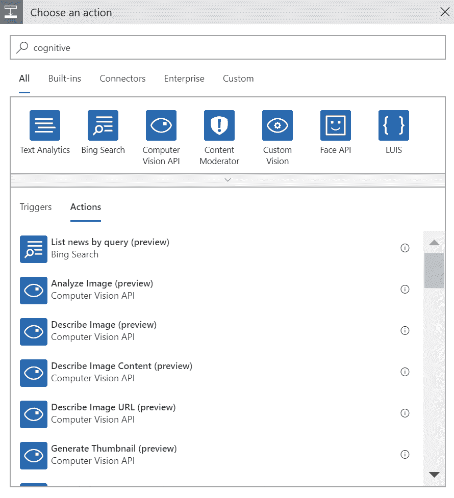
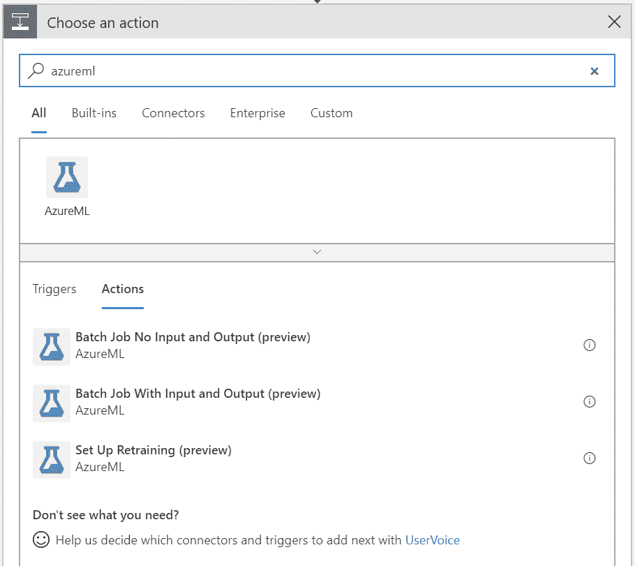
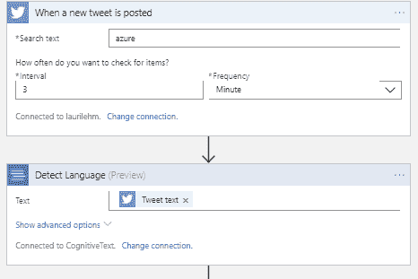
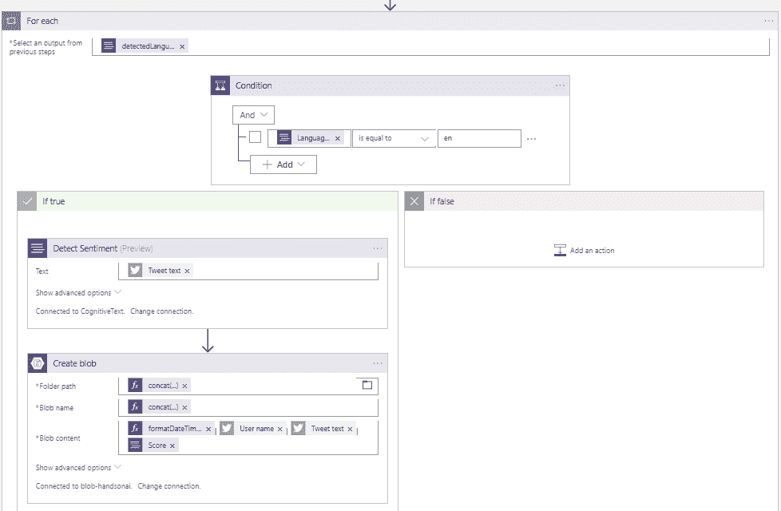
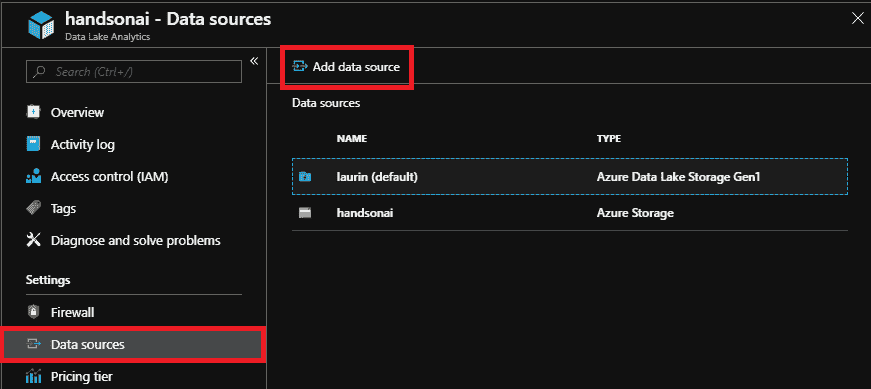
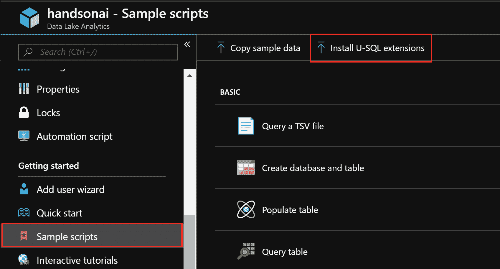
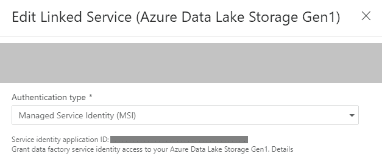
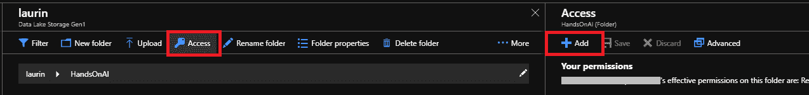
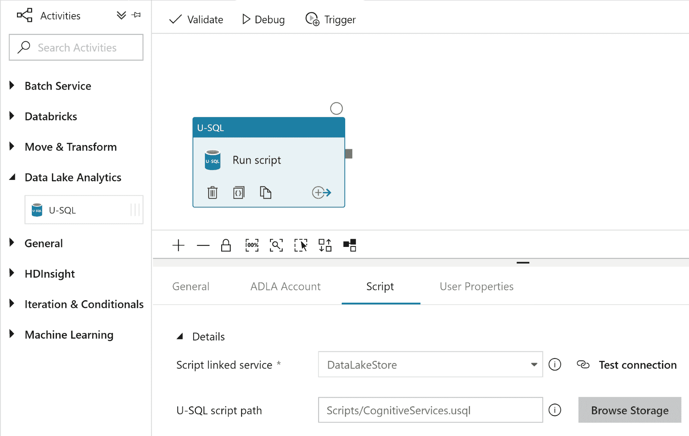

# 与其他 Azure 服务集成

除了直接使用 Azure AI 服务外，Azure 还提供了从其他非 AI 服务使用这些服务的选项。许多 Azure AI 服务提供 REST API 接口，可以从其他服务中消费。因此，AI 服务可以用作其他应用程序的子组件，以提供洞察和预测。Azure 中的许多非 AI 服务都内置了对 AI 服务的集成，因此通常只需点击几下即可将 AI 组件添加到应用程序中。

一些 AI 服务不包含任何自动化功能。重复性任务，如重新训练机器学习模型或运行批量工作负载，需要与其他提供这些功能的服务集成。在接下来的章节中，我们将介绍自动启动 AI 作业的各种选项。除了传统的按时间计划的工作负载外，Azure 服务还提供称为触发器的对象，在发生某些事件后启动任务。触发器允许服务以特定方式对事件做出反应，例如在创建或修改 blob 文件后处理其内容。

在本章中，我们将学习如何将 Azure AI 服务与四个非 AI 服务集成：

+   逻辑应用

+   Azure 函数

+   数据湖分析

+   数据工厂

使用这些服务，可以构建复杂的应用程序管道，其中机器学习模型只是解决方案的一部分。在 Azure 中，不同服务之间的集成尽可能简单，不会牺牲安全性。因此，获取结果既快又高效，开发 Azure 应用程序可以非常有趣！

# 逻辑应用

Azure 逻辑应用是一个用于自动化各种类型任务的图形工具，例如从 Web API 获取数据并将其保存到云存储中。逻辑应用可以在不编写任何代码的情况下进行开发，因此不需要编程技能。然而，逻辑应用为编程语言提供了一些基本功能，例如条件执行和循环。

逻辑应用适用于轻量级任务，这些任务不需要复杂的逻辑或闪电般的性能。这些任务可能包括在 SharePoint 列表被修改时发送电子邮件，或者在 Dropbox 和 OneDrive 之间复制文件（如果文件已被修改）。

对于 AI 开发，逻辑应用提供了一系列基本功能。有一些内置的 ...

# 触发器和操作

逻辑应用基于两个主要概念：触发器和操作。触发器是持续等待特定类型事件的监听器。这些事件可能是在`Blob`文件夹中创建新文件时产生的，或者它们可能每天在同一时间发生以自动化日常任务。操作是在触发器触发时执行的常规程序。操作通常需要一些输入数据，对其进行处理，最后将结果保存或发送到某个地方。

Logic Apps 支持所有 Azure 数据存储服务：数据湖存储、Blob 存储、Cosmos DB 等。例如，**Blob 存储**触发器会在目录中添加新文件或目录中的文件被修改时执行 Logic Apps。然后我们可以将文件作为输入传递给 Logic Apps，处理文件内容，并将结果保存回 Blob。

Logic Apps 设计器包含许多认知服务操作：计算机视觉 API、自定义视觉、文本分析等。要查看完整列表，在创建操作时搜索认知操作，如下所示：



Azure Machine Learning Studio 中也有一些操作。这些操作可以用来评分示例或重新训练 ML 模型，如下所示：



连接器可能自编写时已经更新，因此请检查 Microsoft 官方文档中的最新信息。

# Twitter 情感分析

社交媒体已成为许多组织的日常工具。除了在这些平台上进行自我推广外，监控有关公司品牌的讨论还可以提供有关客户如何看待其产品和公司形象的重要信息。

在本节中，我们将展示如何创建一个应用程序，该应用程序读取包含关键字 *Azure* 的推文，并将这些推文保存到云存储中。这是一个真实的数据收集场景：一旦推文被永久存储在云中，我们就开始收集有关公司品牌的历史数据。作为下一步，我们可以开始基于这些数据创建分析和机器学习模型。这些模型可以包括主题分析或查看...

# 添加语言检测

在上一个示例中，我们创建了一个工作流，该工作流读取包含特定关键字的推文，对这些推文进行情感分析，并将结果保存到 Blob 存储。如果您完成了示例并仔细查看结果，您可能会注意到推文中可能包含许多不同的语言，因为我们的关键字（Azure）并不特定于任何一种语言。在这个示例中，我们将展示如何将语言检测添加到管道中，并过滤掉所有不是特定语言的推文。

1.  要开始示例，请在 Azure 门户中创建一个新的 Logic App，打开 Logic Apps 设计器，并选择与上一个示例相同的触发器作为起点（当出现新的推文时）。

1.  从文本分析 API 添加 Detect Language 模块。对于文本字段，选择要由文本分析 API 分析的 Tweet 文本参数。此模块的输出将包含从推文中检测到的语言列表。请注意，默认检测到的语言数量为 1。如果预期文本包含多种语言，可以在模块的高级选项中更改此设置：



1.  一旦检测到推文语言，我们需要添加一个模块，只选择特定语言的推文。为此，在管道中创建一个新的步骤，搜索`Control`操作并选择`Condition`操作。

1.  当`Condition`模块添加到管道中时，我们必须使用模块中的三个字段指定过滤器条件。第一个字段表示我们想要比较的值，第二个字段指定条件类型，最后一个字段包含要比较的值。对于第一个字段，选择`detectedLanguages`项。请注意，检测语言模块将语言作为列表返回，即使我们只检测一种语言。`detectedLanguages`项指的是列表中的每个项。因此，Logic Apps 设计器将向管道添加一个新的`For each`控制模块，之前创建的`Condition`模块将被放置在`For each`模块内部。`For each`模块遍历`detectedLanguages`列表中的所有值，如果检测到多种语言。

1.  现在，我们的`Condition`模块已经放置在`For each`模块内部，我们可以将`Condition`模块的第一个字段更改为`Language code`。第二个字段应设置为`is equal to`，最后一个字段应包含两位字母语言代码。为了仅保留英语语言的推文，我们将参数设置为`en`。请注意，语言检测模块可能无法检测到所有语言，因此请检查最新微软文档中提供的可用语言列表。

1.  在条件模块之后，管道现在根据条件是否为`true`分支为两个方向。在`true`分支中，我们可以为英语语言推文添加任何处理步骤。在`false`分支中，我们可以指定对剩余推文要执行的操作。在这个例子中，我们使用之前示例中开发的情感检测管道来处理英语语言推文。我们对非英语推文不感兴趣，因此我们可以通过留空`false`分支来忽略它们。完成所有这些步骤后，管道如下所示：



保存应用后，触发器将开始运行，并将推文保存到 Blob 中。由于我们使用了与之前示例中相同的情感检测模块，因此文件格式应相同，唯一不同的是只有英语推文被保存到 Blob 中。

# Azure Functions

虽然 Logic Apps 提供了一种快速自动化任务的方法，但其动作集合仅限于预选选项，无法进行自定义。此外，Logic Apps 的可编程性相当有限，开发更复杂的程序并不一定比编写代码更容易。如果需要更多灵活性，使用 Azure Functions 开发应用程序可能更有效率。函数可以使用熟悉于 Web 开发者的多种编程语言进行开发。

Azure Functions 是一个云中的无服务器编码平台，其中底层操作系统已经被虚拟化。这意味着许多维护任务，例如更新操作系统或语言版本，由 ... 管理。

# 触发器

Azure Functions 触发器的工作原理与上一节中介绍的 Logic Apps 触发器相同：它们监听特定事件，并在事件发生时启动函数。例如，HTTP 触发器会在函数的 Web URL 被调用时执行函数。计划触发器可以定期执行函数，例如，每天执行一次。Azure Functions 最大的优势之一是其触发器集合。触发器集合允许您响应许多不同类型的事件，而基于代码的方法使得能够以编程语言的全部灵活性对这些事件做出反应。

对于数据相关任务，最有用的触发器是存储触发器。类似于 Logic Apps 可以在 blob 事件上触发，Azure Functions 可以在存储服务（如 Blob Storage 或 Cosmos DB）中文件被添加或更新时触发。考虑一种方案，其中原始数据存储在云中，例如，由 Web 应用程序生成的 JSON 文件，我们希望将这些文件转换为列式格式以添加到关系型数据库中，例如。使用 Azure Functions 和 Blob Storage 触发器，这项任务可以完全自动化，无需任何外部服务。因此，Azure Functions 在其他方面提供了执行此类格式转换的另一种方式。

Azure Functions 最有趣的应用之一是处理来自**物联网**（**IoT**）设备的的数据。通过事件中心和 IoT 中心触发器，Azure Functions 可以用作下游处理引擎，处理由 IoT 设备发送的数据。Azure 中的事件中心和 IoT 中心资源是数据摄取服务，能够在短时间内处理大量请求。它们是为连续数据流设计的，其中每个消息的大小很小，但消息的数量可以很大。因此，它们是接收来自大量 IoT 传感器的数据的理想服务，这些传感器在短时间内发送它们的测量值。事件中心和 IoT 中心触发器被设置为在从 IoT 设备接收到新事件时触发，因此我们可以使用 Azure Functions 为每个事件定义一个处理程序。这个程序可以包括对机器学习服务的评分调用并将结果保存到数据库中，例如。

对于大多数触发类型，触发器还会传递一些关于触发事件的详细信息。例如，Blob 存储触发器会传递创建或更改的文件内容，或者 HTTP 触发器会传递 POST 请求的内容。在 Azure Functions 中处理不同类型的输入数据变得非常简单：根据来源，将输入数据的句柄作为参数传递给主函数。在下一节中，我们将展示一个示例，说明如何在 blob 触发器被触发后读取 blob 文件的内容。

# Blob 触发的函数

在本例中，我们将演示如何创建一个简单的函数来读取 blob 文件的内容。我们不会对文件进行任何处理；相反，我们只需将其内容打印到日志文件中。

当你在门户中创建 Azure Functions 服务时，除了函数应用本身，它还会创建一些其他资源。需要一个存储帐户来存储函数应用产生的日志。应用服务计划是一个容器资源，它决定了应用的价格和资源扩展。可选地，你还可以创建一个应用洞察资源来监控你的应用使用情况。这对于错误分析和跟踪你的应用被触发的频率非常有用。

要开始开发，...

# Azure 数据湖分析

**Azure 数据湖**（**ADL**）是微软为大数据提供的存储和分析服务。它能够存储 PB 级的数据，并对存储的数据进行高效的查询。在 Azure 中，存储和分析服务是分开的，ADL 服务实际上由两个不同的产品组成：**Azure 数据湖存储**（**ADLS**）和**Azure 数据湖分析**（**ADLA**）。在本节中，我们将重点关注 ADLA，但也会在适当的地方提及 ADLS。

数据湖存储是一种基于文件的存储，文件被组织到目录中。这种存储类型被称为无模式，因为在数据湖中存储的数据类型没有限制。目录可以包含文本文件和图像，数据类型仅在从数据湖读取数据时指定。这在大数据场景中特别有用，因为写入数据湖的数据量很大，实时运行数据验证步骤会消耗太多资源。数据验证步骤可以在读取数据时在查询中合并，或者可以定期批量运行。

ADLA 是查询引擎，使您能够对 ADLS 进行高效查询。ADLA 帐户始终需要一个 ADLS 帐户作为其后端。此主帐户是查询的默认源。ADLA 查询使用 U-SQL 编写，这是一种类似于 SQL 的语言，它从 C#借用了某些编程功能。以下是一些查询 ADLS 和存储 Blob 的 U-SQL 脚本示例。

除了主要的 ADLS 源之外，ADLA 实例还可以有二级源。您可以从门户的数据源选项卡添加其他 ADLS 帐户或 Azure 存储 Blob，如下所示：



一旦将帐户注册为数据源，就可以像主要 ADLS 帐户一样在查询中使用它。通过使用多个数据源，如果您的数据位于多个存储帐户中，您可以避免将数据移动到单个数据湖。

作为旁注，始终可以创建一个不与 ADLA 帐户关联的 ADL 存储帐户。但在此情况下，ADLS 只能作为文件存储，无法对文件内容进行查询。也不会阻止您创建多个 ADLA 帐户，这些帐户都使用相同的 ADLS 帐户作为其主源。这种灵活性是因为 ADLS 和 ADLA 在 Azure 门户中是独立的产品。

ADL 最大的优势之一是其用户权限控制。可以为每个文件和目录分别设置权限。如果数据湖中的某些数据是机密的，不应对所有用户可见，则可以将其放置在单独的目录中，并且该目录只能对选定用户组可见。数据湖还与 Azure AD 集成，可以将权限分配给 Azure AD 组而不是特定用户。基于角色的访问控制在此不再进一步讨论，因为重点是分析。要将用户添加到 ADLA 帐户，他们应该使用 Azure 门户中 ADLA 实例的添加用户向导授予数据湖分析开发者角色。

本节中的材料涉及数据湖存储 Gen1（数据湖存储）。ADLS Gen2 在撰写本文时处于私有预览阶段。ADLA 与 Gen2 的工作方式可能会有所变化，因此请检查 Microsoft 文档中的最新信息。

# 使用 U-SQL 进行开发

如前所述，ADLA 查询是用 U-SQL 编写的，这是一种由微软专门为大数据开发的查询语言。与其他许多 Azure 服务类似，查询可以在 Azure 门户中编写和执行，这对于小型和快速任务非常有用。对于高级开发，VS Code 和 Visual Studio IDEs 有扩展，提供了更多功能。

虽然在许多方面编写 U-SQL 查询与编写 SQL 查询相似，但也存在一些差异。例如，ADLA 不会像 SQL Server Management Studio 那样将交互式输出到查询编辑器，结果总是被定向到某个特定输出，通常是 ADLS 中的一个文件。要检查查询的结果，...

# U-SQL 数据库

尽管 ADLS 是一个基于文件的存储系统，但它也包含了一些来自关系数据库的熟悉功能，例如表和视图。ADLA 数据库是这些对象的集合。ADLA 数据库对于管理数据湖存储中的数据非常有用，因为它们提供了一些有用的功能，如表索引。另一方面，ADLA 数据库表具有严格的架构，因此必须在将数据输入到表中之前对其进行验证。然后，我们就失去了数据湖最大的优势之一，即在章节开头讨论的无模式存储原则。

当创建 ADLA 资源时，也会创建一个主数据库。这个数据库用作 U-SQL 查询的默认数据库。可以使用`CREATE DATABASE`命令创建新数据库，并使用`USE DATABASE`命令更改数据库。可以在 ADLA 数据探索器中的目录中查看数据库的内容。

U-SQL 数据库中有两种类型的表：托管表和外部分布式表。托管表在很多方面与 SQL 表相似：一个表由元数据（例如，表架构）和数据本身组成。在实践中，数据以结构化文件的形式存储在数据湖存储目录中。托管表强制实施写时模式，这意味着除非数据符合表架构，否则无法向表中输入数据。

外部分布式表在某种程度上类似于 SQL 视图：仅在数据库中存储元数据，但数据本身可以位于数据湖之外。外部分布式表可以引用各种 Azure 服务：Azure SQL 数据库、Azure SQL 数据仓库或虚拟机上的 SQL 服务器。与托管表相比，外部分布式表强制实施读时模式：在定义架构后，底层数据的格式可以更改，因为架构在写入时并未强制实施。如果数据架构发生变化，外部分布式表定义可以修改以匹配新的数据。

使用托管表而不是将数据作为文件存储在目录中有一些优点。例如，如果你的数据存储在一个巨大的 CSV 文件中，可能很难向文件中追加新值。使用`INSERT`语句，托管表可以实现此操作。（注意，托管表是追加只读的，没有更新值的可能性。）托管表还定义了一个聚集索引，可以用来进行更有效的查询。

# 简单的 blob 格式转换

在本节中，我们将演示在 Azure 门户中执行 U-SQL 脚本并与次要数据源（Blob 存储）集成。我们将从 Blob 存储中读取**CSV**（代表**逗号分隔值**）文件并将整个文件内容写入另一个以**TSV**（代表**制表符分隔值**）格式存储的 blob 文件。换句话说，我们将执行从 CSV 到 TSV 的文件格式转换。这种格式转换在数据管理中很常见，因为不同的应用程序通常需要不同格式的数据。

运行此示例的要求是有一个 Blob 存储账户（包含一些数据），以及 ADLS 和 ADLA 账户。

要读取输入数据，必须使用 U-SQL 模块`Extractors` ...

# 与认知服务的集成

在前面的章节中，我们看到了如何将逻辑应用与认知服务集成。我们使用了文本分析 API 来评估每条推文的情感并存储结果到 Blob 存储。在这个例子中，我们将展示如何使用 ADLA 实现相同的步骤。除了获取情感评分，我们还将提取每条推文的关键词以获得更多信息。

完成此示例需要一个认知服务文本分析 API 账户。

在 U-SQL 脚本中使用认知服务之前，必须将 ADLA 实例注册到认知扩展中。这可以通过在 Azure 门户中打开 ADLA 实例并选择示例脚本选项卡来完成，如下所示：



安装成功后，认知扩展就准备好在 U-SQL 脚本中使用。这意味着现在可以使用`REFERENCE ASSEMBLY`语句来导入认知服务模块。

在这个例子中，输入来自一个包含多个文件的目录。查询可以限制为仅匹配目录中的某些文件，根据文件名。在这种情况下，选择了输入目录中的所有 CSV 文件。输入文件具有与之前示例中 Logic App 生成的文件相同的格式：

```py
2018-09-22 11:55:20|Nadeem_ahamed_r|RT @msdev: .@JimBobBennett would like to help you build #Azure #CognitiveServices speech API into your Android app in this three part serie…|1
```

创建一个新的作业并输入以下脚本：

```py
DECLARE @inputFiles string = "HandsOnAI/twitter/2018-09-21/{*}.csv";
DECLARE @sentimentOutput string = "HandsOnAI/twitter/sentiment.csv";

REFERENCE ASSEMBLY [TextSentiment];

@query =
    EXTRACT Timestamp DateTime,
            Username string,
            Text string,
            SentimentScore float
    FROM @inputFiles
    USING Extractors.Text(delimiter:'|', quoting:false, silent:true);

// Extract the sentiment for each tweet
@sentiment =
    PROCESS @query
    PRODUCE Username,
            Text,
            Sentiment string,
            Conf double
    READONLY Username, Text
    USING new Cognition.Text.SentimentAnalyzer();

OUTPUT @sentiment
    TO @sentimentOutput
    USING Outputters.Csv();
```

前面的脚本使用`Extractors.Text()`模块读取输入数据。模块选项表明值由竖线`|`字符分隔，文本值未加引号，并且`Extractor`应忽略所有错误数据而不是抛出错误并退出（静默模式）。最后一个属性在不需要担心错误的情况下非常有用。

通过`PROCESS`命令访问认知服务模块。由于我们在脚本开头引用了`TextSentiment`程序集，因此现在可以使用`Cognition.Text.SentimentAnalyzer`模块进行处理。

最后，用户名、推文文本、推文情感和情感得分被保存到输出（数据湖目录）中。输出文件应如下所示：

```py
"treyjohnson","Delta got me this far.  Waiting on the MARTA train and then a quick UBER to #SQLSatATLBI.  Feels like an episode of the Amazing Race! #Evangelism #Azure #BusinessIntelligence @ZAP_Data","Positive",0.74410326366140189
"LouSimonetti","RT @fincooper: Getting ready for #MSIgnite? Check out my sessions BRK3267 and THR2104 in the schedule builder: https://t.co/NYiEWCAfr5 . I'…","Neutral",0
```

注意，在前面的脚本中，输出模式是在`PRODUCE`语句之后定义的。在这种情况下，输入模式中的一些字段被忽略（`Timestamp`、`SentimentScore`）。输出通过认知服务返回的新情感和置信度值得到丰富。新的置信度分数可以取`-1`到`1`之间的值。

除了情感检测之外，文本分析 API 还包括许多其他功能。我们可以从文本样本中提取最相关的关键词，在这种情况下是推文文本。可以使用`Cognition.Text.KeyPhraseProcessor`模块从`Text`列中提取关键词，如下面的脚本所示：

```py
// Add this to the beginning of the script
DECLARE @keyphrasesOutput string = "HandsOnAI/split_keyphrases.csv";
REFERENCE ASSEMBLY [TextKeyPhrase];

// Extract key phrases for each tweet
@keyphrase =
    PROCESS @query
    PRODUCE Username,
            Text,
            KeyPhrase SQL.ARRAY<string>
    READONLY Username, Text
    USING new Cognition.Text.KeyPhraseProcessor();

// Tokenize the key phrases
@split_keyphrases =
    SELECT Username,
           Text,
           T.KeyPhrase
    FROM @keyphrase
        CROSS APPLY EXPLODE (KeyPhrase) AS T(KeyPhrase);

OUTPUT @split_keyphrases
    TO @keyphrasesOutput
    USING Outputters.Csv();
```

前面的脚本使用`CROSS APPLY`语句为关键词列表中的每个项目生成新行。

通过将前面的脚本与前面的脚本合并，我们创建了一个简单的数据管道，该管道从 CSV 文件中读取推文，调用认知服务文本分析 API 以查找推文情感和关键词，最后将结果保存到 ADLS 中。

# Azure 数据工厂

**Azure 数据工厂**（**ADF**）是一个云数据集成平台，允许您自动化各种数据相关任务，例如在数据存储之间复制数据、运行分析工作负载和重新训练机器学习模型。它支持广泛的不同的数据存储，包括其他供应商的产品。通过其集成运行时模型，ADF 还可以连接到本地位置，例如自托管 SQL 数据库。

ADF 可以利用 Azure 目录中的多种不同类型的计算资源。这包括机器学习工作室、ADLA、Databricks 和 HDInsight。ADF 还可以向任何公开 REST API 的服务发出请求，例如认知服务。

数据工厂是使用 ADF Visual 开发的 ...

# 数据集、管道和链接服务

ADF 中的三个主要概念是数据集、管道和链接服务。数据集代表存储在特定位置的数据，例如 Blob 存储中的文件或 SQL 数据库中的表。管道是用于在数据集之间复制或修改数据的程序。管道由一系列活动组成，这些活动对输入数据集进行转换，并生成输出数据集作为结果。最简单的管道由两个数据集组成，即输入和输出数据集，以及它们之间的复制活动。这个简单的管道可以用来在数据存储之间移动数据，例如，从本地 SQL 数据库到 Azure SQL 数据库。

数据集定义本身只包含有关数据格式和模式的信息，而不包含数据的位置信息。所有连接信息都分离到称为**链接服务**的模块中。链接服务包含所有用于集成的信息，例如连接字符串、服务器地址和密码。每个数据集都必须与一个链接服务相关联，否则 ADF 将不知道数据存储在哪里。链接服务集合定义了 ADF 可以连接的所有数据源。这个集合包括许多 Azure、本地和第三方产品和服务。完整的列表可以在 ADF 文档中找到，如果您喜欢的服务缺失，您也可以通过 Azure 反馈系统请求更多连接器。

活动是在管道内移动和转换数据的任务。这包括控制语句，如循环和条件执行，以及使用各种 Azure 服务的计算任务。计算服务包括 Azure Batch 服务和许多机器学习服务，如 AML Studio、Azure Databricks 和 Azure HDInsight。因此，数据工厂提供了一种自动化许多与 AI 相关的任务的好方法，包括重新训练机器学习模型和运行定期的分析工作负载。与数据集类似，计算活动需要指向 Azure 中现有计算资源的链接服务定义。

还需要注意的是，存储和计算资源的使用不包括在数据工厂的计费模型中。数据工厂的计费仅包括数据管理，数据传输成本和计算成本将作为服务费用附加在数据工厂账单之上。作为一般建议，始终测试使用非常小的数据集的管道，并密切关注随着数据量的增长而产生的成本。

# 文件格式转换

在这里，我们将展示在云中执行文件格式转换的另一种方法。要开始开发数据工厂管道，请打开数据工厂可视化工具门户，并从左侧菜单中选择*作者*标签。创建并配置您的存储账户的链接服务，其中包含输入和输出数据。链接服务创建成功后，创建输入文件和输出文件的数据集，并将这些数据集附加到链接服务。

在创建数据集时，请注意配置与您的数据格式匹配。同时，确保您正确指定了数据模式。

当数据集配置完成后，向数据工厂添加一个新的管道。 ...

# 自动化 U-SQL 脚本

在前面的章节中，我们开发了 U-SQL 脚本来在云中传输和转换数据。ADL 分析引擎本身不包含任何自动化功能，因此我们必须使用外部服务来自动化此类数据工作流。ADF 具有定期触发数据湖分析作业的能力，因此它是自动化 U-SQL 脚本的好选择。

完成此示例需要 ADLS 和 ADLA 账户以及一个要运行的 U-SQL 脚本。第一步是创建 ADLS 链接服务。ADLS 链接服务用于存储要运行的 U-SQL 脚本。U-SQL 脚本应上传到 ADLS，以便在运行时被数据工厂读取。

使用 ADLS 实例进行身份验证有两种方式：**托管服务标识**（**MSI**）和**服务主体**。在本例中，我们将使用 MSI 身份验证。有关使用服务主体身份验证的说明，请参阅文档。在创建链接服务时，请注意服务标识应用程序 ID，它将在屏幕上显示如下：



为了修改数据湖内容，数据工厂实例必须对数据湖拥有正确的访问权限。要授予这些访问权限，请将应用程序 ID 复制到剪贴板，并在 Azure 门户中导航到数据湖存储。从数据资源管理器视图打开您想要存储数据的目录。点击“访问”并使用+添加按钮添加新权限，如下所示：



使用服务标识应用程序 ID 查找数据工厂账户，并授予此账户所有访问权限（`rwx`）。这给数据工厂提供了读取和写入指定目录文件的权限。

除了目标目录外，Data Factory 还需要父目录的权限。在这种情况下，`x` 权限就足够了。授予这些权限的最简单方法是转到根目录并授予根目录及其所有子目录的 `x` 访问权限。这意味着服务帐户可以导航到数据湖中的所有子目录，但除非为这些目录特别授予 `rw` 权限，否则它不能读取或写入这些目录中的任何文件。如果您希望 Data Factory 能够修改数据湖中的所有文件，您可以一次性授予根目录及其所有子目录的 `rwx` 权限。这样，您就无需再担心权限问题，因为 Data Factory 默认具有所有必要的权限。

接下来，创建一个 ADLA 链接服务。有关配置 ADLA 服务主体身份验证的详细信息，请参阅文档。

最后一步是创建一个新的管道并将一个 U-SQL 活动添加到管道中。配置活动以使用之前创建的用于 ADLS 和 ADLA 的链接服务，并指定 U-SQL 脚本可以找到的路径。以下是一个示例配置：



注意，U-SQL 模块没有与之关联的任何数据集。输入数据和输出数据在 U-SQL 脚本中指定，如 *Azure Data Lake Analytics* 部分所述。然而，可以向 U-SQL 脚本传递参数。这些可以在脚本选项卡的高级属性中指定，它们将在 U-SQL 脚本中作为变量可用。这对于传递输入和输出数据的文件名或表名很有用，例如。

# 运行 Databricks 任务

Azure Databricks 是一种基于云的机器学习服务，能够以非常高的效率处理重负载。基于 Apache Spark，它旨在实时处理大数据和高吞吐量流。通过 ADF，可以安排 Databricks 作业定期运行批量工作负载。

要完成此示例，您需要访问 Databricks 工作区。如果您没有现有的 Databricks 账户，请首先在 Azure 门户中创建一个。

一旦您有权访问 Databricks 工作区，请打开 Data Factory 可视化工具并创建一个用于 Databricks 的链接服务。Databricks 链接服务是计算类型。选择要连接的 Databricks 账户并配置链接服务 ...

# 摘要

正如我们在本章中看到的，将 Azure AI 服务与其他非 AI 服务集成很容易，配置这些集成可以通过几个简单步骤完成。对于无代码方法，Logic Apps 和 Data Factory 提供工具来自动化许多数据相关任务。通过利用认知服务或 ML Studio Web 服务等 AI 服务，可以增强传入数据，使其包含 AI 服务生成的见解和预测。

基于触发的事件处理系统允许您对不同类型的事件做出反应，例如当在云存储中创建或修改新文件时。在数据移动不频繁且基于时间的数据处理可能会引入延迟的情况下，可以使用触发器来启动数据处理管道，因为系统必须等待预定时间流逝。基于存储的触发器，每当源数据更新时，数据管道可以自动启动。

数据湖分析是一个批量处理引擎，可以对大量数据进行高效查询。U-SQL 语言结合了 SQL 风格的查询和 C#命令，作为大数据的高度灵活查询语言。虽然数据湖分析引擎本身不包含自动化服务，但可以通过使用 U-SQL 模块从数据工厂启动数据湖分析作业。这样就可以使用数据工厂中所有可用的触发器来自动化数据湖分析作业。

在下一章中，我们将学习由微软推出的 Azure 机器学习服务。
