# 第一章：使用 C++介绍机器学习

计算机解决任务的方法有很多种。其中一种方法是定义一个明确的算法，另一种方法是使用基于数学和统计方法的隐式策略。**机器学习**（**ML**）是使用数学和统计方法解决任务的隐式方法之一。它是一个正在迅速发展的学科，许多科学家和研究人员认为它是向具有人类水平**人工智能**（**AI**）行为的系统迈进的最佳途径之一。

通常，机器学习方法的基本思想是在给定的数据集中寻找模式。考虑一个新闻推送的推荐系统，它根据用户的先前活动或偏好为用户提供个性化的推送。软件收集有关用户阅读的新闻文章类型的资料，并计算一些统计数据。例如，它可能是某些主题在一组新闻文章中出现的频率。然后，它执行一些预测分析，识别一般模式，并使用这些模式来填充用户的新闻推送。这样的系统定期跟踪用户的活动，更新数据集，并为推荐计算新的趋势。

机器学习是一个快速发展的领域，在各个行业中都有广泛的应用。在医疗保健领域，它通过分析医疗数据来检测模式和预测疾病及治疗效果。在金融领域，它有助于信用评分、欺诈检测、风险评估、投资组合优化和算法交易，从而增强决策和运营。电子商务通过基于客户行为的推荐系统来提升销售和满意度。自动驾驶汽车使用机器学习进行环境感知、决策和安全的导航。

客户服务通过聊天机器人和虚拟助手得到改善，它们可以处理查询和任务。网络安全利用机器学习通过分析网络流量和识别威胁来检测和预防网络攻击。语言翻译工具使用机器学习进行准确高效的文字翻译。图像识别，借助计算机视觉算法，在图像和视频中识别对象、人脸和场景，支持人脸识别和内容审核等应用。语音助手如 Siri、Google Assistant 和 Alexa 中的语音识别依赖于机器学习来理解和响应用户指令。这些例子展示了机器学习在塑造我们生活方面的巨大潜力。

本章介绍了机器学习的概念以及哪些任务可以使用机器学习来解决，并讨论了机器学习中使用的不同方法。它旨在展示开始实现机器学习算法所需的最基本的数学知识。它还涵盖了如何执行基本的`Eigen`、`xtensor`、`ArrayFire`、`Blaze`和`Dlib`操作，并以线性回归任务为例进行解释。

本章将涵盖以下主题：

+   理解机器学习的基本原理

+   线性代数概述

+   线性回归示例概述

# 理解机器学习的基本原理

创建和训练机器学习模型有不同的方法。在本节中，我们展示了这些方法是什么以及它们之间的区别。除了我们用来创建机器学习模型的方法之外，还有一些参数管理模型在训练和评估过程中的行为。模型参数可以分为两组，它们应该以不同的方式配置。第一组参数是机器学习算法中的模型权重，用于调整模型的预测。这些权重在训练过程中被分配数值，这些数值决定了模型如何根据新数据做出决策或预测。第二组是模型超参数，它们控制机器学习模型在训练过程中的行为。这些超参数不像模型中的其他参数那样从数据中学习，而是在训练开始之前由用户或算法设置。机器学习过程的最后关键部分是我们用来训练模型的技术。通常，训练技术使用某种数值优化算法来找到目标函数的最小值。在机器学习中，目标函数通常被称为损失函数，用于在训练算法出错时对其进行惩罚。我们将在以下章节中更精确地讨论这些概念。

## 探索机器学习技术

我们可以将机器学习方法分为两种技术，如下所示：

+   **监督学习**是一种基于使用标记数据的方法。标记数据是一组已知数据样本及其对应的已知目标输出。此类数据用于构建一个可以预测未来输出的模型。

+   **无监督学习**是一种不需要标记数据的处理方法，可以在任意类型的数据中搜索隐藏的模式和结构。

让我们详细看看每种技术。

### 监督学习

监督学习算法通常使用有限的一组标记数据来构建可以对新数据进行合理预测的模型。我们可以将监督学习算法分为两个主要部分，即分类和回归技术，具体描述如下：

+   分类模型预测一些有限且不同的类别类型——这可能是标识电子邮件是否为垃圾邮件的标签，或者图像中是否包含人脸的标签。分类模型应用于语音和文本识别、图像中的对象识别、信用评分等领域。创建分类模型的典型算法包括**支持向量机**（**SVM**）、决策树方法、**k-最近邻**（**KNN**）、逻辑回归、朴素贝叶斯和神经网络。以下章节将描述这些算法的一些细节。

+   回归模型预测连续响应，例如温度变化或货币汇率值。回归模型应用于算法交易、电力负荷预测、收入预测等领域。如果给定标记数据的输出是实数，则创建回归模型通常是有意义的。创建回归模型的典型算法包括线性回归和多变量回归、多项式回归模型以及逐步回归。我们也可以使用决策树技术和神经网络来创建回归模型。

以下章节描述了这些算法的一些细节。

### 无监督学习

无监督学习算法不使用标记数据集。它们创建使用数据内在关系来寻找隐藏模式并用于做出预测的模型。最著名的无监督学习技术是**聚类**。聚类涉及根据数据项的一些内在属性将给定的数据集划分为有限数量的组。聚类应用于市场研究、不同类型的探索性分析、**脱氧核糖核酸**（**DNA**）分析、图像分割和目标检测。创建执行聚类模型的典型算法包括 k-means、k-medoids、高斯混合模型、层次聚类和隐马尔可夫模型。本书的以下章节中解释了其中一些算法。

## 处理机器学习模型

我们可以将机器学习模型解释为接受不同类型参数的函数。这些函数根据这些参数的值，为给定的输入提供输出。开发者可以通过调整模型参数来配置机器学习模型的行为，以解决特定问题。训练机器学习模型通常可以被视为寻找其参数最佳组合的过程。我们可以将机器学习模型的参数分为两种类型。第一种类型是模型内部的参数，我们可以从训练（输入）数据中估计它们的值。第二种类型是模型外部的参数，我们无法从训练数据中估计它们的值。模型外部的参数通常被称为**超参数**。

内部参数具有以下特征：

+   它们对于做出预测是必要的

+   它们定义了模型在给定问题上的质量

+   我们可以从训练数据中学习它们

+   通常，它们是模型的一部分

如果模型包含固定数量的内部参数，则称为**参数化**。否则，我们可以将其归类为**非参数化**。

内部参数的例子如下：

+   **人工神经网络**（**ANNs**）的权重

+   SVM 模型的支撑向量值

+   线性回归或逻辑回归的多项式系数

ANNs（人工神经网络）是受人类大脑中生物神经网络的架构和功能启发的计算机系统。它们由相互连接的节点或神经元组成，这些节点处理和传输信息。ANNs 旨在从数据中学习模式和关系，使它们能够根据新的输入进行预测或决策。学习过程涉及调整神经元之间连接的权重和偏差，以提高模型的准确性。

另一方面，超参数具有以下特征：

+   它们用于配置估计模型参数的算法

+   实践者通常指定它们

+   它们的估计通常基于使用启发式方法

+   他们针对具体的建模问题

对于特定问题，很难知道模型超参数的最佳值。此外，从业者通常需要研究如何调整所需的超参数，以便模型或训练算法以最佳方式运行。从业者使用经验法则、从类似项目中复制值以及如网格搜索等特殊技术来进行超参数估计。

超参数的例子如下：

+   用于分类质量配置的 SVM 算法中的 C 和 sigma 参数

+   在神经网络训练过程中用于配置算法收敛的学习率参数

+   在 KNN 算法中用于配置邻居数量的*k*值

## 模型参数估计

**模型参数估计**通常使用某些优化算法。结果模型的速度和质量可能显著取决于所选的优化算法。优化算法的研究在工业界和学术界都是一个热门话题。机器学习（ML）通常使用基于损失函数优化的优化技术和算法。评估模型预测数据好坏的函数称为**损失函数**。如果预测与目标输出非常不同，损失函数将返回一个可以解释为不良的值，通常是一个大数字。这样，损失函数在优化算法向错误方向移动时对其进行惩罚。因此，一般思想是使损失函数的值最小化以减少惩罚。没有单一的通用损失函数适用于优化算法。不同的因素决定了如何选择损失函数。以下是一些这样的因素的例子：

+   给定问题的具体细节——例如，它是一个回归模型还是分类模型

+   计算导数的容易程度

+   数据集中异常值的百分比

在机器学习（ML）中，术语 **优化器** 用于定义一个将损失函数与更新模型参数的技术相连接的算法，该技术是对损失函数值的响应。因此，优化器通过调整模型参数来调整机器学习模型，以最准确的方式预测新数据的目标值。优化器或优化算法在训练机器学习模型中起着至关重要的作用。它们帮助找到模型的最佳参数，这可以提高其性能和准确性。它们在各个领域都有广泛的应用，例如图像识别、自然语言处理和欺诈检测。例如，在图像分类任务中，可以使用优化算法来训练深度神经网络，以准确识别图像中的对象。有许多优化器：梯度下降、Adagrad、RMSProp、Adam 等。此外，开发新的优化器是一个活跃的研究领域。例如，微软（位于雷德蒙德）有一个名为 *ML 和优化* 的研究小组，其研究领域包括组合优化、凸和非凸优化，以及它们在机器学习和人工智能中的应用。该行业中的其他公司也有类似的研究小组；Facebook Research、Amazon Research 和 OpenAI 小组都有许多出版物。

现在，我们将了解机器学习是什么以及它的主要概念部分。因此，让我们学习其数学基础最重要的部分：线性代数。

# 线性代数的概述

线性代数的概念对于理解机器学习背后的理论至关重要，因为它们帮助我们理解机器学习算法在底层是如何工作的。此外，大多数机器学习算法的定义都使用了线性代数的术语。

线性代数不仅是一个实用的数学工具，而且线性代数的概念也可以用现代计算机架构非常有效地实现。机器学习（特别是深度学习）的兴起是在现代 `Cuda` 和 `OpenCL` 显著性能提升之后开始的，一个专门的线性代数库的例子是 `cuBLAS`。此外，使用 **通用图形处理单元**（**GPGPUs**）变得更加普遍，因为这些将现代 GPU 的计算能力转化为强大的通用计算资源。

此外，还有 `AVx`、`SSE` 和 `MMx`。还有 `Eigen`、`xtensor`、`VienaCL` 等术语，它们被用来提高计算性能。

## 学习线性代数的概念

线性代数是一个很大的领域。它是研究线性对象的代数部分：向量（或线性）空间、线性表示和线性方程组。线性代数中使用的工具主要有行列式、矩阵、共轭和张量计算。

要理解机器学习算法，我们只需要一组小的线性代数概念。然而，要研究新的机器学习算法，从业者应该对线性代数和微积分有深入的理解。

以下列表包含了理解机器学习算法最有价值的线性代数概念：

+   **标量**：这是一个单独的数字。

+   **向量**：这是一个有序数字的数组。每个元素都有一个独特的索引。向量的表示法是名称使用粗体小写字母，元素使用带有下标的斜体字母，如下例所示！[](img/B19849_Formula_01.jpg)

+   **矩阵**：这是一个二维数字数组。每个元素都有一个独特的索引对。矩阵的表示法是名称使用粗体大写字母，元素使用带有逗号分隔的索引列表的下标斜体字母，如下例所示：

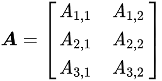

+   **张量**：这是一个以多维规则网格排列的数字数组，代表了矩阵的推广。它就像一个多维矩阵。例如，具有 2 x 2 x 2 维度的张量 *A* 可以看起来像这样：

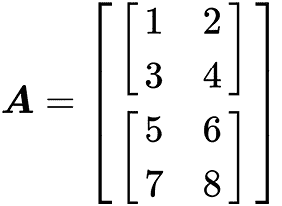

线性代数库和机器学习框架通常使用张量的概念而不是矩阵，因为它们实现的是通用算法，而矩阵只是具有两个维度的张量的特例。此外，我们可以将向量视为大小为 *n* x *1* 的矩阵。

## 基本线性代数操作

编程线性代数算法最常用的操作如下：

+   **逐元素操作**：这些操作以逐元素的方式在相同大小的向量、矩阵或张量上执行。结果元素将是相应输入元素上操作的输出，如下所示：

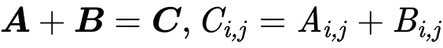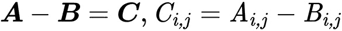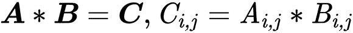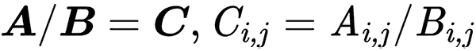

以下示例显示了逐元素求和：

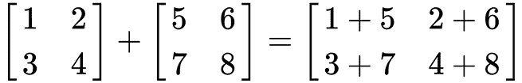

+   **点积**：在线性代数中，张量和矩阵有两种乘法类型——一种是逐元素，另一种是点积。点积处理两个等长数字序列，并返回一个数字。在矩阵或张量上应用此操作要求矩阵或张量 *A* 的列数与矩阵或张量 *B* 的行数相同。以下示例显示了当 *A* 是一个 *n x m* 矩阵且 *B* 是一个 *m x* *p* 矩阵时的点积操作：

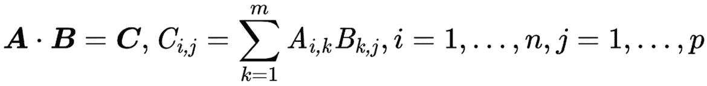

+   **转置**：矩阵的转置是一种翻转矩阵对角线上的操作，这会导致矩阵的列和行索引翻转，从而创建一个新的矩阵。一般来说，它是交换矩阵的行和列。以下示例显示了转置的工作原理：

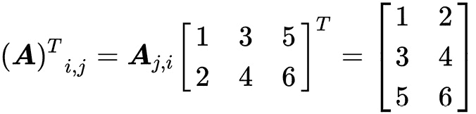

+   **范数**：这个操作计算向量的大小；这个结果是一个非负实数。范数公式如下：

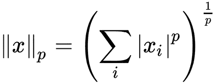

这种范数的通用名称是 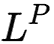 范数，用于 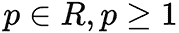。通常，我们使用更具体的范数，例如 *p = 2* 的 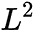 范数，这被称为欧几里得范数，我们可以将其解释为点之间的欧几里得距离。另一种广泛使用的范数是平方  范数，其计算公式为 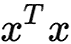。平方  范数比  范数更适合数学和计算操作。平方  范数的每一阶偏导数只依赖于 *x* 的对应元素，而  范数的偏导数则依赖于整个向量；这一特性在优化算法中起着至关重要的作用。另一种广泛使用的范数操作是 *p = 1* 的 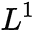 范数，在机器学习中，当我们关注零和非零元素之间的差异时常用。*L¹* 范数也称为**曼哈顿距离**。

+   **求逆**：逆矩阵是这样的矩阵，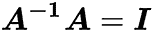，其中 *I* 是单位矩阵。**单位矩阵**是一个当我们用该矩阵乘以一个向量时不会改变该向量的矩阵。

我们已经考虑了主要的线性代数概念及其操作。使用这个数学工具，我们可以定义和编程许多机器学习算法。例如，我们可以使用张量和矩阵来定义训练数据集，标量可以用作不同类型的系数。我们可以使用逐元素操作对整个数据集（矩阵或张量）进行算术运算。例如，我们可以使用逐元素乘法来缩放数据集。我们通常使用转置来改变向量或矩阵的视图，使其适合点积操作。点积通常用于将权重表示为矩阵系数的线性函数应用于向量；例如，这个向量可以是一个训练样本。此外，点积操作也用于根据算法更新表示为矩阵或张量系数的模型参数。

范数操作常用于损失函数的公式中，因为它自然地表达了距离概念，可以衡量目标和预测值之间的差异。逆矩阵是线性方程组解析求解的关键概念。这类系统常出现在不同的优化问题中。然而，计算逆矩阵的计算成本非常高。

## 计算机中的张量表示

我们可以用不同的方式在计算机内存中表示张量对象。最明显的方法是在计算机内存中（**随机存取存储器**，或 **RAM**）使用简单的线性数组。然而，线性数组也是现代 CPU 最有效的计算数据结构。有两种标准做法在内存中使用线性数组组织张量：**行主序排列**和**列主序排列**。

在行主序排列中，我们将一行的连续元素依次线性排列，并且每一行也排在上一行的末尾之后。在列主序排列中，我们以相同的方式处理列元素。数据布局对计算性能有重大影响，因为遍历数组的速度依赖于现代 CPU 架构，它们在处理顺序数据时比处理非顺序数据更有效。CPU 缓存效应是这种行为的理由。此外，连续的数据布局使得可以使用与顺序数据更有效地工作的 SIMD 向量化指令，我们可以将它们用作一种并行处理方式。

不同的库，即使在同一编程语言中，也可以使用不同的排列。例如，`Eigen` 使用列主序排列，但 `PyTorch` 使用行主序排列。因此，开发者应该注意他们使用的库中内部张量表示，并在执行数据加载或从头实现算法时注意这一点。

考虑以下矩阵：

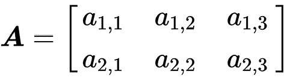

然后，在行主序数据布局中，矩阵的成员在内存中的布局如下：

| **0** | **1** | **2** | **3** | **4** | **5** |
| --- | --- | --- | --- | --- | --- |
| a11 | a12 | a13 | a21 | a22 | a23 |

表 1.1 – 行主序数据布局示例

在列主序数据布局的情况下，顺序布局将紧随其后，如下所示：

| **0** | **1** | **2** | **3** | **4** | **5** |
| --- | --- | --- | --- | --- | --- |
| a11 | a21 | a12 | a22 | a13 | a23 |

表 1.2 – 列主序数据布局示例

## 线性代数 API 示例

让我们考虑一些 C++ 线性代数 **应用程序编程接口**（**API**）并看看我们如何使用它们来创建线性代数原语以及使用它们进行代数运算。

### 使用 Eigen

`Eigen` 是一个通用的线性代数 C++ 库。在 Eigen 中，所有矩阵和向量都是 `Matrix` 模板类的对象，向量是矩阵类型的特化，具有一行或一列。张量对象在官方 API 中没有表示，但作为子模块存在。

我们可以这样定义一个已知 3 x 3 维度和浮点数据类型的矩阵类型：

```py
typedef Eigen::Matrix<float, 3, 3> MyMatrix33f;
```

我们可以这样定义一个列向量：

```py
typedef Eigen::Matrix<float, 3, 1> MyVector3f;
```

Eigen 已经为向量和矩阵对象提供了许多预定义的类型——例如，`Eigen::Matrix3f`（浮点 3 x 3 矩阵类型）或`Eigen::RowVector2f`（浮点 1 x 2 向量类型）。此外，Eigen 并不限于在编译时已知维度的矩阵。我们可以在运行时初始化时定义矩阵类型，它将根据行数或列数动态调整。为了定义此类类型，我们可以使用名为`Eigen::Dynamic`的特殊类型变量作为`Matrix`类模板参数。例如，为了定义一个具有动态维度的双精度矩阵，我们可以使用以下定义：

```py
typedef Eigen::
    Matrix<double, Eigen::Dynamic, Eigen::Dynamic>
        MyMatrix;
```

从我们定义的类型初始化的对象将看起来像这样：

```py
MyMatrix33f a;
MyVector3f v;
MyMatrix m(10,15);
```

要将这些值放入这些对象中，我们可以使用几种方法。我们可以使用特殊预定义的初始化函数，如下所示：

```py
a = MyMatrix33f::Zero(); // fill matrix elements with zeros
a = MyMatrix33f::Identity(); // fill matrix as Identity matrix
v = MyVector3f::Random(); // fill matrix elements with random values
```

我们可以使用*逗号初始化器*语法，如下所示：

```py
a << 1,2,3,
      4,5,6,
      7,8,9;
```

此代码构造以以下方式初始化矩阵值：

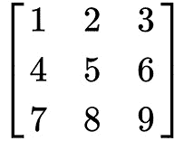

我们可以使用直接元素访问来设置或更改矩阵系数。以下代码示例展示了如何使用`()`运算符进行此类操作：

```py
a(0,0) = 3;
```

我们可以使用`Map`类型的对象将现有的 C++数组或向量包装在`Matrix`类型对象中。此类映射对象将使用底层对象的内存和值，而不会分配额外的内存并复制值。以下代码片段展示了如何使用`Map`类型：

```py
int data[] = {1,2,3,4};
Eigen::Map<Eigen::RowVectorxi> v(data,4);
std::vector<float> data = {1,2,3,4,5,6,7,8,9};
Eigen::Map<MyMatrix33f> a(data.data());
```

我们可以在数学运算中使用初始化的矩阵对象。`Eigen`库中的矩阵和向量算术运算通过标准 C++算术运算符的重载提供，如`+`、`-`、`*`，或者通过方法如`dot()`和`cross()`。以下代码示例展示了如何在 Eigen 中表示通用数学运算：

```py
using namespace Eigen;
auto a = Matrix2d::Random();
auto b = Matrix2d::Random();
auto result = a + b;
result = a.array() * b.array(); // element wise multiplication
result = a.array() / b.array();
a += b;
result = a * b; // matrix multiplication
//Also it's possible to use scalars:
a = b.array() * 4;
```

注意，在 Eigen 中，算术运算符如`+`本身并不执行任何计算。这些运算符返回一个*表达式对象*，它描述了要执行的计算。实际的计算发生在整个表达式评估之后，通常是在`=`算术运算符中。这可能会导致一些奇怪的行为，主要如果开发者频繁使用`auto`关键字的话。

有时，我们只需要对矩阵的一部分执行操作。为此，Eigen 提供了`block`方法，它接受四个参数：`i,j,p,q`。这些参数是块大小`p,q`和起始点`i,j`。以下代码展示了如何使用此方法：

```py
Eigen::Matrixxf m(4,4);
Eigen::Matrix2f b = m.block(1,1,2,2); // copying the middle
                                     //part of matrix
m.block(1,1,2,2) *= 4; // change values in original matrix
```

有两种更多通过索引访问行和列的方法，它们也是一种`block`操作。以下代码片段展示了如何使用`col`和`row`方法：

```py
m.row(1).array() += 3;
m.col(2).array() /= 4;
```

线性代数库的另一个重要特性是广播，Eigen 通过`colwise`和`rowwise`方法支持这一特性。广播可以理解为通过在一个方向上复制矩阵来解释为一个矩阵。以下是一个如何将向量添加到矩阵每一列的示例：

```py
Eigen::Matrixxf mat(2,4);
Eigen::Vectorxf v(2); // column vector
mat.colwise() += v;
```

此操作的结果如下：

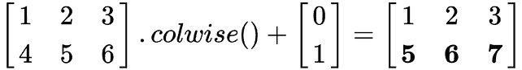

### 使用 xtensor

`xtensor`库是一个用于数值分析的 C++库，具有多维数组表达式。`xtensor`的容器灵感来源于 NumPy，Python 数组编程库。机器学习算法主要使用 Python 和 NumPy 进行描述，因此这个库可以使得将它们移动到 C++更加容易。以下容器类在`xtensor`库中实现了多维数组。

`xarray`类型是一个动态大小的多维数组，如下面的代码片段所示：

```py
std::vector<size_t> shape = { 3, 2, 4 };
xt::xarray<double, xt::layout_type::row_major> a(shape);
```

`xarray`类型的动态大小意味着这个形状可以在编译时改变。

`xtensor`类型是一个在编译时固定范围的多维数组。精确的维度值可以在初始化步骤中配置，如下面的代码片段所示：

```py
std::array<size_t, 3> shape = { 3, 2, 4 };
xt::xtensor<double, 3> a(shape);
```

`xtensor_fixed`类型是一个在编译时固定维度形状的多维数组，如下面的代码片段所示：

```py
xt::xtensor_fixed<double, xt::xshape<3, 2, 4>> a;
```

`xtensor`库还通过 Eigen 等表达式模板技术实现了算术运算符，这是一个在 C++中实现的数学库的常见方法。因此，计算是延迟的，整个表达式评估时才会计算实际结果。

**延迟计算**，也称为**延迟评估**或**按需评估**，是编程中的一种策略，其中表达式的评估被延迟到其实际需要时。

这与即时求值相对立，即时求值是在遇到表达式时立即进行评估。容器定义也是表达式。`xtensor`库中还有一个名为`xt::eval`的函数，用于强制表达式评估。

在`xtensor`库中存在不同种类的容器初始化。`xtensor`数组的初始化可以使用 C++初始化列表来完成，如下所示：

```py
xt::xarray<double> arr1{{1.0, 2.0, 3.0},
{2.0, 5.0, 7.0},
{2.0, 5.0, 7.0}}; // initialize a 3x3 array
```

`xtensor`库还为特殊张量类型提供了构建函数。以下代码片段展示了其中的一些：

```py
std::vector<uint64_t> shape = {2, 2};
auto x = xt::ones(shape); // creates 2x2 matrix of 1s
auto y = xt::zero(shape); // creates zero 2x2 matrix
auto z = xt::eye(shape);  // creates 2x2 matrix with ones
                          //on the diagonal
```

此外，我们可以使用`xt::adapt`函数将现有的 C++数组映射到`xtensor`容器中。此函数返回一个使用底层对象的内存和值的对象，如下面的代码片段所示：

```py
std::vector<float> data{1,2,3,4};
std::vector<size_t> shape{2,2};
auto data_x = xt::adapt(data, shape);
```

我们可以使用`()`运算符直接访问容器元素，以设置或更改张量值，如下面的代码片段所示：

```py
std::vector<size_t> shape = {3, 2, 4};
xt::xarray<float> a = xt::ones<float>(shape);
a(2,1,3) = 3.14f;
```

`xtensor`库通过标准 C++算术运算符（如`+`、`-`和`*`）的重载来实现线性代数算术运算。要使用其他操作，如点积运算，我们必须将应用程序与名为`xtensor-blas`的库链接起来。这些运算符在`xt::linalg`命名空间中声明。

以下代码展示了使用`xtensor`库进行算术运算的用法：

```py
auto a = xt::random::rand<double>({2,2});
auto b = xt::random::rand<double>({2,2});
auto c = a + b;
a -= b;
c = xt::linalg::dot(a,b);
c = a + 5;
```

要获取对 `xtensor` 容器的部分访问权限，我们可以使用 `xt::view` 函数。`view` 函数返回一个新的张量对象，它与原始张量共享相同的基本数据，但具有不同的形状或步长。这允许您以不同的方式访问张量中的数据，而实际上并不改变底层数据本身。以下示例展示了此函数的工作原理：

```py
xt::xarray<int> a{
  {1, 2, 3, 4}, 
  {5, 6, 7, 8}, 
  {9, 10, 11, 12}, 
  {13, 14, 15, 16}
};
auto b = xt::view(a, xt::range(1, 3), xt::range(1, 3));
```

此操作从张量中取一个矩形块，看起来像这样：

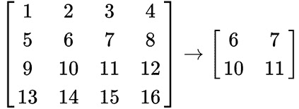

`xtensor` 库在大多数情况下实现了自动广播。当操作涉及不同维度的两个数组时，它会将具有较小维度的数组传输到另一个数组的前导维度，这样我们就可以直接将一个向量加到一个矩阵上。以下代码示例展示了这有多么简单：

```py
auto m = xt::random::rand<double>({2,2});
auto v = xt::random::rand<double>({2,1});
auto c = m + v;
```

### 使用 Blaze

`Blaze` 是一个通用高性能 C++ 库，用于密集和稀疏线性代数。Blaze 中有不同类来表示矩阵和向量。

我们可以定义具有已知维度和浮点数据类型的矩阵类型，如下所示：

```py
typedef blaze::
    StaticMatrix<float, 3UL, 3UL, blaze::columnMajor>
        MyMatrix33f;
```

我们可以以下方式定义一个向量：

```py
typedef blaze::StaticVector<float, 3UL> MyVector3f;
```

此外，Blaze 并不仅限于在编译时已知维度的矩阵。我们可以在运行时初始化期间定义将接受行数或列数的矩阵类型。为了定义此类类型，我们可以使用 `blaze::DynamicMatrix` 或 `blaze::DynamicVector` 类。例如，为了定义具有动态维度的双精度矩阵，我们可以使用以下定义：

```py
typedef blaze::DynamicMatrix<double> MyMatrix;
```

从我们定义的类型初始化的对象将如下所示：

```py
MyMatrix33f a;
MyVector3f v;
MyMatrix m(10, 15);
```

要将这些值放入这些对象中，我们可以使用几种方法。我们可以使用特殊预定义的初始化函数，如下所示：

```py
a = blaze::zero<float>(3UL, 3UL); //  Zero matrix
a = blaze::IdentityMatrix<float>(3UL); //  Identity matrix
blaze::Rand<float> rnd;
v = blaze::generate(3UL, & { return rnd.generate(); }); 
// Random generated vector
// Matrix filled from the initializer list
a = {{1, 2, 3}, {4, 5, 6}, {7, 8, 9}};
// Matrix filled with a single value
a = blaze::uniform(3UL, 3UL, 3.f);
```

此代码构造以以下方式初始化矩阵值：

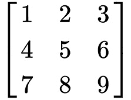

我们可以使用直接元素访问来设置或更改矩阵系数。以下代码示例展示了如何使用 `()` 操作符进行此类操作：

```py
a(0,0) = 3;
```

我们可以使用 `blaze::CustomVector` 类型的对象将现有的 C++ 数组或向量包装到 `Matrix` 或 `Vector` 类型对象中。此类映射对象将使用底层对象的内存和值，而不会分配额外的内存并复制值。以下代码片段展示了如何使用这种方法：

```py
std::array<int, 4> data = {1, 2, 3, 4};
blaze::CustomVector<int,
                    blaze::unaligned,
                    blaze::unpadded,
                    blaze::rowMajor>
    v2(data.data(), data.size());
std::vector<float> mdata = {1, 2, 3, 4, 5, 6, 7, 8, 9};
blaze::CustomMatrix<float,
                    blaze::unaligned,
                    blaze::unpadded,
                    blaze::rowMajor>
    a2(mdata.data(), 3UL, 3UL);
```

我们可以在数学运算中使用初始化的矩阵对象。注意，我们使用了两个参数：`blaze::unaligned`和`blaze::unpadded`。`unpadded`参数可以在某些函数或方法中使用，以控制填充或截断数组的行为。在某些场景中，当您希望在重塑、切片或连接数组等操作中避免不必要的填充或截断数据时，此参数可能很重要。`blaze::unaligned`参数允许用户对未对齐的数据执行操作，这在数据没有对齐到特定内存边界的情况下可能很有用。

在`Blaze`库中，矩阵和向量的算术运算可以通过标准 C++算术运算符的重载来实现，例如`+`、`-`或`*`，或者通过`dot()`和`cross()`等方法。以下代码示例展示了如何在 Blaze 中表达一般的数学运算：

```py
blaze::StaticMatrix<float, 2UL, 2UL> a = {{1, 2}, {3, 4}};
auto b = a;
// element wise operations
blaze::StaticMatrix<float, 2UL, 2UL> result = a % b;
a = b * 4;
// matrix operations
result = a + b;
a += b;
result = a * b;
```

注意，在 Blaze 中，算术运算符如`+`本身并不执行任何计算。这些运算符返回一个*表达式对象*，它描述了要执行的计算。实际的计算发生在整个表达式评估之后，通常是在`=`算术运算符或具体对象的构造函数中。这可能导致一些不明显的行为，主要如果开发者频繁使用`auto`关键字。该库提供了两个函数`eval()`和`evaluate()`来评估给定的表达式。`evaluate()`函数通过`auto`关键字帮助推断操作的精确结果类型，而`eval()`函数应用于显式评估较大表达式中的子表达式。

有时，我们只需要对矩阵的一部分执行操作。为此，Blaze 提供了`blaze::submatrix`和`blaze::subvector`类，这些类可以用模板参数进行参数化。这些参数是一个区域的左上角起始点、宽度和高度。还有具有相同名称的函数，它们接受相同的参数，可以在运行时使用。以下代码展示了如何使用此类：

```py
blaze::StaticMatrix<float, 4UL, 4UL> m = {{1, 2, 3, 4},
                                          {5, 6, 7, 8},
                                          {9, 10, 11, 12},
                                          {13, 14, 15, 16}}
// make a view of the middle part of matrix
auto b = blaze::submatrix<1UL, 1UL, 2UL, 2UL>(m);
// change values in original matrix
blaze::submatrix<1UL, 1UL, 2UL, 2UL>(m) *= 0;
```

有两个额外的函数可以通过索引访问行和列，它们也是一种`block`操作。以下代码片段展示了如何使用`col`和`row`函数：

```py
blaze::row<1UL>(m) += 3;
blaze::column<2UL>(m) /= 4;
```

与 Eigen 相比，Blaze 不支持隐式广播。但有一个`blaze::expand()`函数可以在不实际分配内存的情况下虚拟地扩展矩阵或向量。以下代码展示了如何使用它：

```py
blaze::DynamicMatrix<float, blaze::rowVector> mat = 
  blaze::uniform(4UL, 4UL, 2);
blaze::DynamicVector<float, blaze::rowVector> vec = {1, 2, 3, 4};
auto ex_vec = blaze::expand(vec, 4UL);
mat += ex_vec;
```

此操作的输出结果如下：

```py
( 3 4 5 6 )
( 3 4 5 6 )
( 3 4 5 6 )
( 3 4 5 6 )
```

### 使用 ArrayFire

`ArrayFire`是一个用于并行计算的高性能通用 C++库。

**并行计算**是一种通过将复杂问题分解为更小的任务并在多个处理器或核心上同时执行来解决复杂问题的方法。与顺序计算相比，这种方法可以显著加快处理时间，使其成为数据密集型应用（如机器学习）的必要工具。

它提供了一个单一的 `array` 类型来表示矩阵、体积和向量。这种基于数组的表示法以可读的数学符号表达计算算法，因此用户不需要显式地表达并行计算。它具有广泛的向量化和平行批量操作。此库支持在 CUDA 和 OpenCL 设备上加速执行。`ArrayFire` 库的另一个有趣特性是，它通过执行代码的运行时分析来优化内存使用和算术计算。通过避免许多临时分配，这成为可能。

我们可以这样定义具有已知维度和浮点数据类型的矩阵类型：

```py
af::array a(3, 3, af::dtype::f32);
```

我们可以这样定义一个 64 位浮点向量：

```py
af::array v(3, af::dtype::f64);
```

要将这些值放入这些对象中，我们可以使用几种方法。我们可以使用特殊预定义的初始化函数，如下所示：

```py
a = af::constant(0, 3, 3);  //  Zero matrix
a = af::identity(3, 3);    //  Identity matrix
v = af::randu(3);         // Random generated vector
// Matrix filled with a single value
a = af::constant(3, 3, 3);
// Matrix filled from the initializer list
a = af::array(
    af::dim4(3, 3),
    {1.f, 2.f, 3.f, 4.f, 5.f, 6.f, 7.f, 8.f, 9.f});
```

此代码构造以以下方式初始化矩阵值：

```py
1.0 4.0 7.0
2.0 5.0 8.0
3.0 6.0 9.0
```

注意到矩阵是以列主序格式初始化的。`ArrayFire` 库不支持行主序初始化。

我们可以使用直接元素访问来设置或更改矩阵系数。以下代码示例展示了如何使用 `()` 运算符进行此类操作：

```py
a(0,0) = 3;
```

与我们之前讨论的其他库的一个重要区别是，你不能将现有的 C/C++ 数组数据映射到 ArrayFire 的 `array` 对象，因为它将被复制。以下代码片段展示了这种情况：

```py
std::vector<float> mdata = {1, 2, 3, 4, 5, 6, 7, 8, 9};
a = af::array(3, 3, mdata.data());
```

只有在 CUDA 或 OpenCL 设备上分配的内存将不会被复制，但 ArrayFire 将接管指针的所有权。

我们可以在数学运算中使用初始化的数组对象。`ArrayFire` 库中的算术运算可以通过标准 C++ 算术运算符的重载，如 `+`、`-` 或 `*`，或通过如 `af::matmul` 这样的方法提供。以下代码示例展示了如何在 ArrayFire 中表达通用数学运算：

```py
auto a = af::array(af::dim4(2, 2), {1, 2, 3, 4});
a = a.as(af::dtype::f32);
auto b = a.copy();
// element wise operations
auto result = a * b;
a = b * 4;
// matrix operations
result = a + b;
a += b;
result = af::matmul(a, b);
```

与我们之前讨论的其他库相比，ArrayFire 并不广泛使用模板表达式来连接算术运算。此库使用一个 **即时**（**JIT**）编译引擎，将数学表达式转换为 CUDA、OpenCL 或 CPU 设备的计算内核。此外，此引擎将不同的操作合并在一起，以提供最佳性能。这种操作融合技术减少了内核调用次数，并减少了全局内存操作。

有时，我们只需要对数组的一部分执行操作。为此，ArrayFire 提供了一种特殊的索引技术。有一些特定的类可以用来表示给定维度的索引子范围。它们如下所示：

```py
seq - representing a linear sequence
end - representing the last element of a dimension
span - representing the entire dimension
```

以下代码展示了如何访问矩阵的中央部分的一个示例：

```py
auto m = af::iota(af::dim4(4, 4));
auto center = m(af::seq(1, 2), af::seq(1, 2));
// modify a part of the matrix
center *= 2;
```

要访问和更新数组中的特定行或列，有`row(i)`和`col(i)`方法指定单个行或列。它们可以按以下方式使用：

```py
m.row(1) += 3;
m.col(2) /= 4;
```

此外，为了处理多行或多列，有`rows(first,last)`和`cols(first,last)`方法指定行或列的范围。

ArrayFire 不支持隐式广播，但有一个`af::batchFunc`函数可以用来模拟和并行化此类功能。一般来说，这个函数会找到一个数据批次维度，并将给定的函数并行地应用于多个数据块。以下代码展示了如何使用它：

```py
auto mat = af::constant(2, 4, 4);
auto vec = af::array(4, {1, 2, 3, 4});
mat = af::batchFunc(
    vec,
    mat,
    [](const auto& a, const auto& b) { return a + b; });
```

这个操作的输出将是以下内容：

```py
3.0  3.0  3.0  3.0
4.0  4.0  4.0  4.0
5.0  5.0  5.0  5.0
6.0  6.0  6.0  6.0
```

注意，这个向量是一个列主序的。

### 使用 Dlib

`Dlib`是一个现代的 C++工具包，包含机器学习算法和用于在 C++中创建计算机视觉软件的工具。Dlib 中的大多数线性代数工具都处理密集矩阵。然而，它也有限地支持处理稀疏矩阵和向量。特别是，`Dlib`工具使用 C++ **标准模板库**（**STL**）中的容器来表示稀疏向量。

在 Dlib 中有两种主要的容器类型用于处理线性代数：`matrix`和`vector`类。Dlib 中的矩阵操作是通过表达式模板技术实现的，这允许它们消除通常从表达式如`M = A+B+C+D`返回的临时矩阵对象。

我们可以通过指定模板参数来在编译时创建一个矩阵，如下所示：

```py
Dlib::matrix<double,3,1> y;
```

或者，我们可以创建动态大小的矩阵对象。在这种情况下，我们将矩阵维度传递给构造函数，如下面的代码片段所示：

```py
Dlib::matrix<double> m(3,3);
```

之后，我们可以使用以下方法更改这个矩阵的大小：

```py
m.set_size(6,6);
```

我们可以使用逗号运算符初始化矩阵值，如下面的代码片段所示：

```py
m = 54.2, 7.4, 12.1,
  1, 2, 3,
  5.9, 0.05, 1;
```

如同之前的库一样，我们可以将现有的 C++数组包装到矩阵对象中，如下面的代码片段所示：

```py
double data[] = {1,2,3,4,5,6};
auto a = Dlib::mat(data, 2,3); // create matrix with size 2x3
```

此外，我们可以使用`()`运算符访问矩阵元素以修改或获取特定值，如下面的代码片段所示：

```py
m(1,2) = 3;
```

`Dlib`库提供了一系列预定义函数，用于使用诸如单位矩阵、全 1 矩阵或随机值等值初始化矩阵，如下面的代码片段所示：

```py
auto a = Dlib::identity_matrix<double>(3);
auto b = Dlib::ones_matrix<double>(3,4);
auto c = Dlib::randm(3,4); // matrix with random values
                          //with size 3x3
```

在`Dlib`库中，大多数线性代数算术运算都是通过标准 C++算术运算符的重载实现的，如`+`、`-`或`*`。其他复杂操作由库作为独立函数提供。

以下示例展示了在 `Dlib` 库中如何使用算术运算：

```py
auto c = a + b;
auto e = a * b; // real matrix multiplication
auto d  = Dlib::pointwise_multiply(a, b); // element wise
                                          //multiplication
a += 5;
auto t = Dlib::trans(a); // transpose matrix
```

为了部分访问矩阵，Dlib 提供了一套特殊函数。以下代码示例展示了如何使用其中的一些函数：

```py
a = Dlib::rowm(b,0); // takes first row of matrix
a = Dlib::rowm(b,Dlib::range(0,1));//takes first two rows
a = Dlib::colm(b,0); // takes first column
// takes a rectangular part from center: 
a = Dlib::subm(b, range(1,2), range(1,2)); 
// initialize part of the matrix: 
Dlib::set_subm(b,range(0,1), range(0,1)) = 7; 
// add a value to the part of the matrix:
Dlib::set_subm(b,range(0,1), range(0,1)) += 7;
```

在 `Dlib` 库中，可以使用 `set_rowm()`、`set_colm()` 和 `set_subm()` 函数对 `Dlib` 库中的广播进行建模，这些函数为特定的矩阵行、列或原始矩阵的矩形部分提供修改器对象。从这些函数返回的对象支持所有设置或算术运算。以下代码片段展示了如何将向量添加到列中：

```py
Dlib::matrix<float, 2,1> x;
Dlib::matrix<float, 2,3> m;
Dlib::set_colm(b,Dlib::range(0,1)) += x;
```

在本节中，我们学习了线性代数的主要概念及其在不同 C++ 库中的实现。我们看到了如何创建矩阵和张量，以及如何使用它们执行不同的数学运算。在下一节中，我们将看到我们的第一个完整的机器学习示例——使用线性回归方法解决回归问题。

# 线性回归概述

考虑一个现实世界监督机器学习算法的例子，称为线性回归。一般来说，**线性回归** 是一种基于解释值（独立值）建模目标值（因值）的方法。这种方法用于预测和寻找值之间的关系。我们可以根据输入的数量（独立变量）和输入与输出（因变量）之间关系的类型对回归方法进行分类。

简单线性回归是独立变量数量为 *1* 的情况，独立变量 (*x*) 和因变量 (*y*) 之间存在线性关系。

线性回归在各个领域得到广泛应用，如科学研究，它可以描述变量之间的关系，以及在工业应用中，如收入预测。例如，它可以估计代表股票价格时间序列数据长期运动的趋势线。它说明了特定数据集的兴趣值在给定期间是增加还是减少，如下面的截图所示：

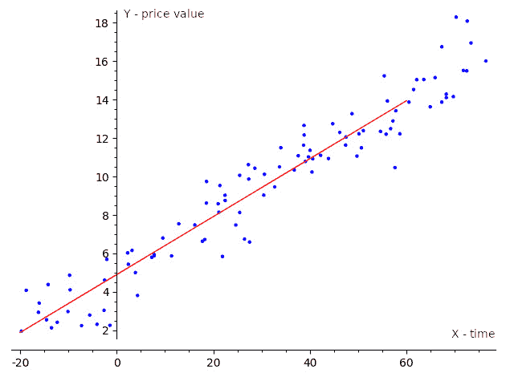

图 1.1 – 线性回归可视化

如果我们有一个输入变量（独立变量）和一个输出变量（因变量），则回归被称为简单，我们用术语 **简单线性回归** 来表示它。对于多个独立变量，我们称之为 **多元线性回归** 或 **多变量线性回归**。通常，当我们处理现实世界问题时，我们有很多独立变量，所以我们用多个回归模型来建模这些问题。多元回归模型有一个通用的定义，涵盖了其他类型，因此即使是简单线性回归也经常使用多元回归的定义来定义。

## 使用不同库解决线性回归任务

假设我们有一个数据集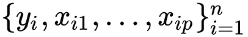，这样我们可以用数学公式以下方式表达*y*和*x*之间的线性关系：

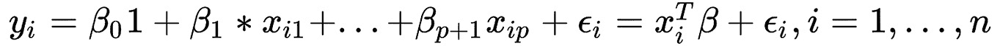

在这里，*p*是自变量的维度，*T*表示转置，因此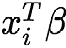是向量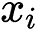和*β*的内积。我们还可以用矩阵表示法重写前面的表达式，如下所示：

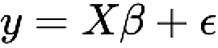

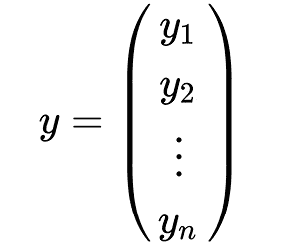

,

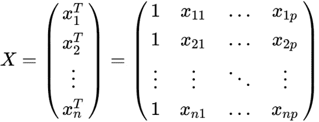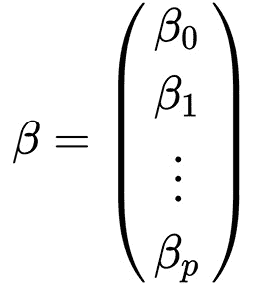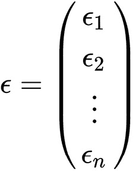

上述矩阵表示可以解释如下：

+   *y*：这是一个观察到的目标值向量。

+   *x*：这是一个行向量的矩阵，，被称为解释变量或独立变量。

+   ß：这是一个(*p+1*)维度的参数向量。

+   ε：这被称为误差项或噪声。这个变量捕捉了除了回归变量之外影响*y*因变量的所有其他因素。

当我们考虑简单线性回归时，*p*等于 1，方程将看起来像这样：

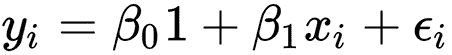

线性回归任务的目标是找到满足前述方程的参数向量。通常，这样的线性方程组没有精确解，因此任务是估计满足这些方程的参数，并基于一些假设。最流行的估计方法之一是基于最小二乘原理：最小化给定数据集中观察到的因变量与由线性函数预测的因变量之间的差的平方和。这被称为**普通最小二乘法**（**OLS**）估计量。因此，任务可以用以下公式表示：

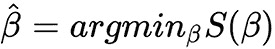

在前面的公式中，目标函数*S*由以下矩阵表示给出：

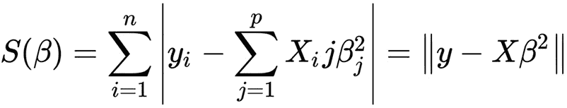

这个最小化问题在*x*矩阵的*p*列线性无关的情况下有一个唯一解。我们可以通过求解**正规方程**来得到这个解，如下所示：

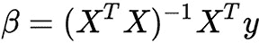

线性代数库可以直接用解析方法解决这样的方程，但它有一个显著的缺点——计算成本。在*y*和*x*维度很大的情况下，对计算机内存量和计算时间的要求太高，以至于无法解决现实世界的问题。

因此，通常，这个最小化任务是通过迭代方法解决的。**梯度下降**（**GD**）就是这类算法的一个例子。GD 是一种基于以下观察的技术：如果函数 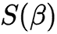 在点 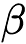 的邻域内定义且可导，那么当它沿着点  处的负梯度方向移动时， 减少最快。

我们可以将我们的 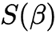 目标函数改变为一个更适合迭代方法的形式。我们可以使用**均方误差**（**MSE**）函数，它衡量估计值与估计值之间的差异，如下所示：

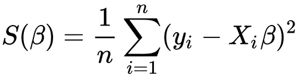

在多元回归的情况下，我们对每个*x*分量对此函数进行偏导数，如下所示：

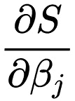

因此，在线性回归的情况下，我们采取以下导数：

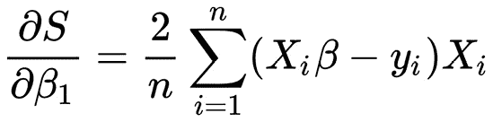

整个算法有以下描述：

1.  将β初始化为零。

1.  为学习率参数定义一个值，该参数控制我们在学习过程中调整参数的程度。

1.  计算以下β的值：

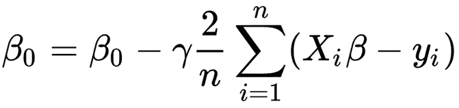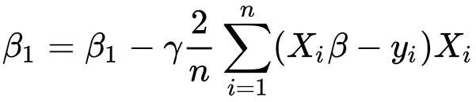

1.  重复步骤 1-3 多次，或者直到 MSE 值达到一个合理的数量。

之前描述的算法是监督机器学习中最简单的算法之一。我们用本章早期引入的线性代数概念来描述它。后来，人们越来越明显地认识到，几乎所有机器学习算法都在底层使用线性代数。线性回归在各个行业中广泛应用于预测分析、预测和决策。以下是一些线性回归在金融、营销和医疗保健中的实际应用案例。线性回归可以根据公司收益、利率和经济指标等历史数据预测股价。这有助于投资者在何时买卖股票时做出明智的决定。可以构建线性回归模型来根据人口统计信息、购买历史和其他相关数据预测客户行为。这使得营销人员能够更有效地定位他们的活动并优化他们的营销支出。线性回归用于分析医疗数据，以识别有助于改善患者结果的模式和关系。例如，它可以用来研究某些治疗方法对病人健康的影响。

以下示例展示了不同线性代数库中用于解决**线性回归**任务的更高级 API，我们提供它们以展示库如何简化底层复杂的数学。我们将在以下章节中详细介绍这些示例中使用的 API。

## 使用 Eigen 解决线性回归任务

`Eigen`库中有几种迭代方法可以解决形式为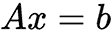的问题。`LeastSquaresConjugateGradient`类是其中之一，它允许我们使用共轭梯度算法解决线性回归问题。共轭梯度算法比常规 GD 更快地收敛到函数的最小值，但要求矩阵*A*是正定的，以保证数值稳定性。《LeastSquaresConjugateGradient》类有两个主要设置：最大迭代次数和一个容忍阈值，它用作停止标准，作为相对残差误差的上限，如下面的代码块所示：

```py
typedef float DType;
using Matrix = Eigen::Matrix<DType, Eigen::Dynamic, Eigen::Dynamic>;
int n = 10000;
Matrix x(n,1);
Matrix y(n,1);
Eigen::LeastSquaresConjugateGradient<Matrix> gd;
gd.setMaxIterations(1000);
gd.setTolerance(0.001) ;
gd.compute(x);
auto b = gddg.solve(y);
```

对于新的`x`输入，我们可以通过矩阵运算预测新的`y`值，如下所示：

```py
Eigen::Matrixxf new_x(5, 2);
new_x << 1, 1, 1, 2, 1, 3, 1, 4, 1, 5;
auto new_y = new_x.array().rowwise() * b.transpose().array();
```

此外，我们还可以通过直接求解*正则方程*来计算参数的`b`向量（线性回归任务解），如下所示：

```py
auto b = (x.transpose() * x).ldlt().solve(x.transpose() * y);
```

## 使用 Blaze 解决线性回归任务

由于 Blaze 只是一个数学库，因此没有专门用于解决线性回归任务的类或函数。然而，正则方程方法可以轻松实现。让我们看看如何使用 Blaze 定义和解决线性回归任务：

假设我们已经有我们的训练数据：

```py
typedef blaze::DynamicMatrix<float,blaze::columnMajor> Matrix;
typedef blaze::DynamicVector<float,blaze::columnVector> Vector;
// the first column of X is just 1 for the bias term
Matrix x(n, 2UL);
Matrix y(n, 1UL);
```

因此，我们可以通过以下方式找到线性回归系数：

```py
// calculate X^T*X
auto xtx = blaze::trans(x) * x;
// calculate the inverse of X^T*X
auto inv_xtx = blaze::inv(xtx);
// calculate X^T*y
auto xty = blaze::trans(x) * y;
// calculate the coefficients of the linear regression
Matrix beta = inv_xtx * xty;
```

然后，我们可以使用估计的系数对新数据进行预测。以下代码片段展示了如何实现：

```py
auto line_coeffs = blaze::expand(
  blaze::row<0UL>(blaze::trans(beta)), new_x.rows());
auto new_y = new_x % line_coeffs;
```

注意，我们实际上扩展了系数向量以执行与 x 数据逐元素相乘。

## 使用 ArrayFire 解决线性回归任务

ArrayFire 也没有专门用于解决此类问题的函数和类。然而，由于它具有所有必要的数学抽象，可以应用正则方程方法。另一种方法是使用 GD 的迭代方法。这种算法在本章的第一节中进行了描述。这种技术消除了计算逆矩阵的必要性，使得它能够应用于更大量的训练数据。计算大矩阵的逆是一个非常耗时的操作。

让我们定义一个 lambda 函数来计算从数据和系数中得出的预测值：

```py
auto predict = [](auto& v, auto& w) {
  return af::batchFunc(v, w, [](const auto& a, const auto& b) {
    return af::sum(a * b, /*dim*/ 1);
  });
};
```

假设我们已经将训练数据定义在`x`和`y`变量中。我们定义`train_weights`变量来保存和更新从训练数据中想要学习的系数：

```py
// the first column is for the bias term
af::dim4 weights_dim(1, 2);
auto train_weights = af::constant(0.f, weights_dim, af::dtype::f32);
```

然后，我们可以定义 GD 循环，其中我们将迭代更新系数。以下代码片段展示了如何实现它：

```py
af::array j, dj;  // cost value and its gradient
float lr = 0.1f;  // learning rate
int n_iter = 300;
for (int i = 0; i < n_iter; ++i) {
  std::cout << "Iteration " << i << ":\n";
  // get the cost
  auto h = predict(x, train_weights);
  auto diff = (y - h);
  auto j = af::sum(diff * diff) / n;
  af_print(j);
  // find the gradient of cost
  auto dm = (-2.f / n) * af::sum(x.col(1) * diff);
  auto dc = (-2.f / n) * af::sum(diff);
  auto dj = af::join(1, dc, dm);
  // update the parameters via gradient descent
  train_weights = train_weights - lr * dj;
}
```

这个循环最重要的部分是计算预测误差：

```py
  auto h = predict(x, train_weights);
  auto diff = (y – h);
```

另一个重要部分是基于与每个系数相关的偏导数计算梯度值：

```py
  auto dm = (-2.f / n) * af::sum(x.col(1) * diff);
  auto dc = (-2.f / n) * af::sum(diff);
```

我们将这些值合并成一个向量，以形成一个更新训练参数的单个表达式：

```py
  auto dj = af::join(1, dc, dm);
  train_weights = train_weights - lr * dj;
```

我们可以在迭代一定次数后或当成本函数值达到某个适当的收敛值时停止此训练循环。成本函数值可以按以下方式计算：

```py
auto j = af::sum(diff * diff) / n;
```

您可以看到，这仅仅是所有训练样本平方误差的总和。

## 使用 Dlib 进行线性回归

`Dlib` 库提供了 `krr_trainer` 类，该类可以获取 `linear_kernel` 类型的模板参数以解决线性回归任务。此类使用核岭回归算法对此类问题进行直接解析求解，如下代码块所示：

```py
std::vector<matrix<double>> x;
std::vector<float> y;
krr_trainer<KernelType> trainer;
trainer.set_kernel(KernelType());
decision_function<KernelType> df = trainer.train(x, y);
```

对于新的 `x` 输入，我们可以按以下方式预测新的 `y` 值：

```py
std::vector<matrix<double>> new_x;
for (auto& v : x) {
    auto prediction = df(v);
    std::cout << prediction << std::endl;
}
```

在本节中，我们学习了如何使用不同的 C++ 库解决线性回归问题。我们了解到其中一些库包含了完整的算法实现，可以轻松应用，并且我们看到了如何仅使用基本的线性代数原语从头实现这种方法。

# 摘要

在本章中，我们学习了机器学习（ML）是什么，它与其他计算机算法有何不同，以及它为何如此受欢迎。我们还熟悉了开始使用机器学习算法所需的必要数学背景。我们查看了一些提供线性代数 API 的软件库，并实现了我们的第一个机器学习算法——线性回归。

C++ 还有其他线性代数库。此外，流行的深度学习框架使用它们自己的线性代数库实现。例如，MXNet 框架基于 `mshadow` 库，而 PyTorch 框架基于 ATen 库。这些库中的一些可以使用 GPU 或特殊的 CPU 指令来加速计算。这些特性通常不会改变 API，但需要一些额外的库初始化设置或显式地将对象转换为不同的后端，如 CPU 或 GPU。

真实的机器学习项目可能具有挑战性和复杂性。常见的问题包括数据质量问题、过拟合和欠拟合、选择错误的模型以及计算资源不足。数据质量差也可能影响模型性能。因此，清理和预处理数据以去除异常值、处理缺失值以及转换特征以获得更好的表示至关重要。模型的选取应根据问题的性质和可用数据来确定。过拟合发生在模型记住训练数据而不是学习一般模式时，而欠拟合则发生在模型无法捕捉数据的基本结构时。为了避免这些陷阱，重要的是要清楚地理解问题，使用适当的数据预处理技术，选择正确的模型，并使用与任务相关的指标来评估性能。机器学习的最佳实践还包括在生产中监控模型性能并根据需要做出调整。本书将讨论这些技术的细节。在接下来的两章中，我们将学习更多关于实现更复杂算法所需的软件工具，以及如何管理机器学习算法的理论背景。

# 进一步阅读

+   *深度学习中的基础线性代数*：[`towardsdatascience.com/linear-algebra-for-deep-learning-f21d7e7d7f23`](https://towardsdatascience.com/linear-algebra-for-deep-learning-f21d7e7d7f23)

+   MIT 出版社的《深度学习》一书：[`www.deeplearningbook.org/contents/linear_algebra.html`](https://www.deeplearningbook.org/contents/linear_algebra.html)

+   *什么是机器学习？*：[`www.mathworks.com/discovery/machine-learning.html`](https://www.mathworks.com/discovery/machine-learning.html)

+   `Eigen` 库文档：[`gitlab.com/libeigen/eigen`](https://gitlab.com/libeigen/eigen)

+   `xtensor` 库文档：[`xtensor.readthedocs.io/en/latest/`](https://xtensor.readthedocs.io/en/latest/)

+   `Dlib` 库文档：[`dlib.net/`](http://dlib.net/)

+   `blaze` 库文档：[`bitbucket.org/blaze-lib/blaze/wiki/Home`](https://bitbucket.org/blaze-lib/blaze/wiki/Home)

+   ArrayFire 库文档：[`arrayfire.org/docs/index.htm`](https://arrayfire.org/docs/index.htm)
