# 3

# 测量性能和选择模型

本章描述了偏差和方差效应及其病理情况，这些情况通常出现在训练**机器学习**（ML）模型时。

在本章中，我们将学习如何通过使用正则化来处理过拟合，并讨论我们可以使用的不同技术。我们还将考虑不同的模型性能估计指标以及它们如何被用来检测训练问题。在本章的末尾，我们将探讨如何通过介绍网格搜索技术和其在 C++ 中的实现来找到模型的最佳超参数。

本章将涵盖以下主题：

+   机器学习模型的性能指标

+   理解偏差和方差特性

+   使用网格搜索技术进行模型选择

# 技术要求

对于本章，你需要以下内容：

+   支持 C++20 的现代 C++ 编译器

+   CMake 构建系统版本 >= 3.10

+   `Dlib` 库

+   `mlpack` 库

+   `Flashlight` 库

+   `Plotcpp` 库

本章的代码文件可以在以下 GitHub 仓库中找到：[`github.com/PacktPublishing/Hands-on-Machine-learning-with-C-Second-Edition/tree/main/Chapter03`](https://github.com/PacktPublishing/Hands-on-Machine-learning-with-C-Second-Edition/tree/main/Chapter03)

# 机器学习模型的性能指标

当我们开发或实施特定的机器学习算法时，我们需要评估其工作效果。换句话说，我们需要评估其解决我们任务的能力。通常，我们使用一些数值指标来估计算法性能。这样的指标可以是针对目标和预测值计算出的**均方误差**（MSE）的值。我们可以使用这个值来估计我们的预测值与用于训练的目标值之间的距离。性能指标的另一个用途是在优化过程中作为目标函数。一些性能指标用于手动观察，而其他指标也可以用于优化目的。

机器学习算法类型的不同性能指标。在*第一章*《使用 C++ 的机器学习入门》中，我们讨论了存在两种主要的机器学习算法类别：**回归算法**和**分类算法**。机器学习学科中还有其他类型的算法，但这两类是最常见的。本节将介绍回归和分类算法最流行的性能指标。

## 回归指标

回归任务指标用于衡量预测值与真实值之间的接近程度。这类测量可以帮助我们评估算法的预测质量。在回归指标下，有四个主要指标，我们将在以下小节中深入探讨。

### MSE 和 RMSE

MSE 是回归算法广泛使用的指标，用于估计其质量。它是预测值与真实值之间平均平方差的度量。这由以下公式给出：

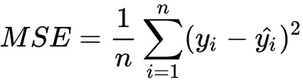

在这里，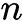是预测和真实项的数量，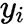是第*i*项的真实值，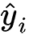是第*i*项的预测值。

MSE 经常用作优化算法的目标损失函数，因为它平滑可微且是凸函数。

**均方根误差**（**RMSE**）指标通常用于估计性能，例如当我们需要给更高的误差更大的权重（以惩罚它们）时。我们可以将其解释为预测值与真实值之间差异的标准差。这由以下公式给出：

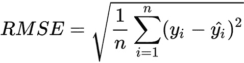

要使用`Dlib`库计算 MSE，存在一个`mean_squared_error`函数，它接受两个浮点向量并返回 MSE。

`mlpack`库提供了具有静态`Evaluate`函数的`MeanSquaredError`类，该函数运行算法预测并计算 MSE。

`Flashlight`库也有`MeanSquaredError`类；该类的对象可以用作损失函数，因此具有前向和后向函数。此外，这个库还有一个`MSEMeter`类，用于测量目标和预测之间的 MSE，可用于性能跟踪。

### 平均绝对误差

**平均绝对误差**（**MAE**）是另一个用于回归算法质量估计的流行指标。MAE 指标是一个具有等权预测误差的线性函数。这意味着它不考虑误差的方向，这在某些情况下可能会出现问题。例如，如果一个模型持续低估或高估真实值，即使模型可能表现不佳，MAE 仍然会给出一个低分。但这个指标比 RMSE 对异常值更稳健。它由以下公式给出：

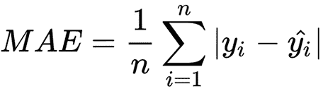

我们可以使用`Flashlight`库中的`MeanSquaredError`类来计算这种类型的误差。`MeanSquaredError`类实现了损失功能，因此具有前向/后向函数。不幸的是，`Dlib`和`mlpack`库中没有专门用于 MAE 计算的函数，但可以使用它们的线性代数后端轻松实现。

### R-squared

R-squared 指标也被称为**确定系数**。它用于衡量我们的独立变量（训练集的特征）如何描述问题并解释因变量的可变性（预测值）。较高的值告诉我们模型足够好地解释了我们的数据，而较低的值告诉我们模型犯了错误。这由以下方程给出：

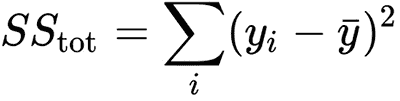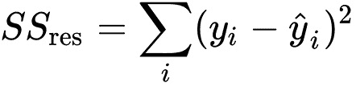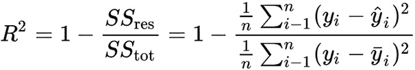

在这里，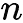是预测和真实值项的数量，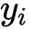是第*i*个项的真实值，而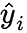是第*i*个项的预测值。

这个指标的唯一问题是添加新的独立变量可能会在某些情况下增加 R-squared，因此考虑这些变量的质量和相关性以及避免过度拟合模型至关重要。这似乎表明模型开始更好地解释数据，但这并不正确——这个值只有在有更多训练项时才会增加。

在`Flashlight`库中没有现成的函数来计算这个指标；然而，使用线性代数函数实现它很简单。

在`Dlib`库中有一个用于计算两个`std::vector`实例匹配元素之间的 R-squared 系数的`r_squared`函数。

`m``lpack`库中的`R2Score`类有一个静态的`Evaluate`函数，该函数运行指定算法的预测并计算 R-squared 误差。

### 调整后的 R-squared

调整后的 R-squared 指标旨在解决之前描述的 R-squared 指标的问题。它与 R-squared 指标相同，但为大量独立变量添加了惩罚。主要思想是，如果新的独立变量提高了模型的质量，这个指标的值会增加；否则，它们会减少。这可以由以下方程给出：

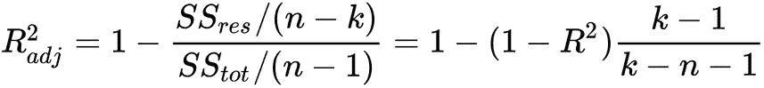

这里，*k*是参数的数量，*n*是样本的数量。

## 分类指标

在我们开始讨论分类指标之前，我们必须介绍一个重要的概念，称为**混淆矩阵**。假设我们有两个类别和一个将这些类别分配给对象的算法。在这里，混淆矩阵将看起来像这样：

|  | 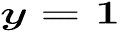 | 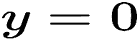 |
| --- | --- | --- |
| 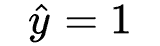 | **True** **positive** (**TP**) | **False** **positive** (**FP**) |
| 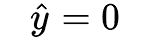 | **False** **negative** (**FN**) | **True** **negative** (**TN**) |

这里，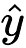是对象的预测类别，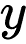是真实标签。混淆矩阵是我们用来计算不同分类指标的抽象。它给出了正确分类和错误分类的项目数量。它还提供了关于错误分类类型的信息。假阴性是我们算法错误地将项目分类为负的项目，而假阳性是我们算法错误地将项目分类为正的项目。在本节中，我们将学习如何使用这个矩阵并计算不同的分类性能指标。

在`mlpack`库中可以使用`ConfusionMatrix`函数创建混淆矩阵；此函数仅适用于离散数据/分类数据。

`Dlib`库也有工具来获取混淆矩阵。有`test_multiclass_decision`函数，它测试多类决策函数并返回一个描述结果的混淆矩阵。它还有一个`test_sequence_labeler`类，该类测试`labeler`对象与给定的样本和标签，并返回一个总结结果的混淆矩阵。

### 准确率

最明显的分类指标之一是准确率：

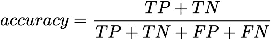

这为我们提供了所有正面预测与所有其他预测的比率。通常，这个指标并不很有用，因为它没有显示在类别数量为奇数的情况下的真实情况。让我们考虑一个垃圾邮件分类任务，并假设我们有 10 封垃圾邮件和 100 封非垃圾邮件。我们的算法正确地将 90 封预测为非垃圾邮件，并且只正确分类了 5 封垃圾邮件。在这种情况下，准确率将具有以下值：

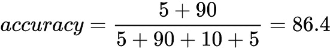

然而，如果算法预测所有字母都不是垃圾邮件，那么其准确率应该如下：

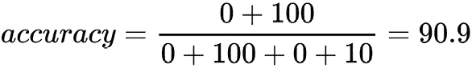

这个例子表明，我们的模型仍然不起作用，因为它无法预测所有垃圾邮件，但准确率值已经足够好。

在`Flashlight`库中计算准确率时，我们使用`FrameErrorMeter`类，该类可以根据用户设置估计准确率或错误率。

`mlpack`库有`Accuracy`类，其中包含静态的`Evaluate`函数，该函数运行指定算法的分类并计算准确率值。

不幸的是，`Dlib`库没有计算准确率值的函数，因此如果需要，该函数应该使用线性代数后端实现。

### 精确度和召回率

为了估计每个分类类的算法质量，我们将介绍两个指标：**精确度**和**召回率**。以下图表显示了在分类中使用的所有对象以及它们根据算法结果是如何被标记的：

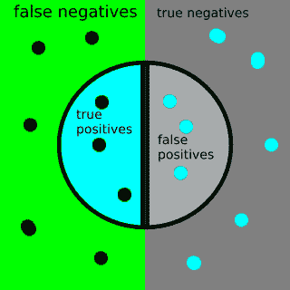

图 3.1 – 精确度和召回率

中心圆圈包含 *选定元素*——我们的算法预测为正的元素。

精度与所选项目中正确分类的项目数量成正比，所选项目如下定义：

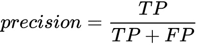

召回率与所有真实正样本中正确分类的项目数量成正比，定义如下：

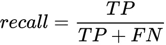

召回率的另一个名称是 **灵敏度**。假设我们感兴趣的是检测正项目——让我们称它们为相关项目。因此，我们使用召回率作为衡量算法检测相关项目能力的指标，使用精度值作为衡量算法区分类别之间差异能力的指标。这些指标不依赖于每个类别中的对象数量，我们可以使用它们进行不平衡数据集分类。

在 `Dlib` 库中，有几种计算这些指标的方法。有 `average_precision` 函数，可以直接用来计算精度值。还有 `test_ranking_function` 函数，它测试给定的排名函数在提供的数据上的表现，并可以返回平均平均精度。另一种方法是使用 `test_sequence_segmenter` 类，它测试一个 `segmenter` 对象与给定样本的匹配，并返回精度、召回率和 F1 分数，其中 `sequence_segmenter` 是一个将对象序列分割成一系列非重叠块的对象。

`mlpack` 库有两个类——`Precision` 和 `Recall`——它们具有静态的 `Evaluate` 函数，这些函数运行指定算法的分类并相应地计算精度和召回率。

`Flashlight` 库没有计算这些值的函数。

### F 分数

在许多情况下，只使用一个指标来展示分类的质量是有用的。例如，使用一些算法来搜索最佳超参数是有意义的，比如后面章节中将要讨论的网格搜索算法。这类算法通常在搜索过程中应用各种参数值后，使用一个指标来比较不同的分类结果。在这种情况下，最流行的指标之一是 F-measure（或 F 分数），它可以表示如下：

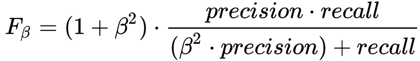

这里，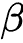 是精度指标权重。通常，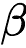 的值等于 *1*。在这种情况下，我们有一个乘数值等于 *2*，如果 *精度* = *1* 且 *召回率* = *1*，则给出 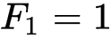。在其他情况下，当精度值或召回率值趋向于零时，F-measure 值也会降低。

`Dlib` 库仅在 `test_sequence_segmenter` 类功能范围内提供 F1 分数的计算，该功能测试 `segmenter` 对象与给定样本，并返回精确度、召回率和 F1 分数。

`mlpack` 库中有一个名为 `F1` 的类，它具有 `Evaluate` 函数，可以通过运行指定算法和数据进行的分类来计算 F1 分数值。

`Flashlight` 库没有计算 F 分数值的功能。

### AUC-ROC

通常，分类算法不会返回具体的类标识符，而是返回一个对象属于某个类的概率。因此，我们通常使用一个阈值来决定一个对象是否属于某个类。最明显的阈值是 0.5，但在数据不平衡的情况下（当我们有一个类有很多值，而另一个类显著较少时），它可能工作不正确。

我们可以使用的一种方法来估计没有实际阈值的模型是 **接收者操作特征曲线下面积**（**AUC-ROC**）的值。这条曲线是 **真正例率**（**TPR**）和 **假正例率**（**FPR**）坐标中的从 (0,0) 到 (1,1) 的线：

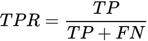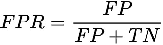

TPR 值等于召回率，而 FPR 值与被错误分类的负类对象的数量成比例（它们应该是正的）。在理想情况下，当没有分类错误时，我们有 `FPR = 0`，`TPR = 1`，并且 `1` 下的面积。在随机预测的情况下，ROC 曲线下方的面积将等于 `0.5`，因为我们会有相等数量的 TP 和 FP 分类：

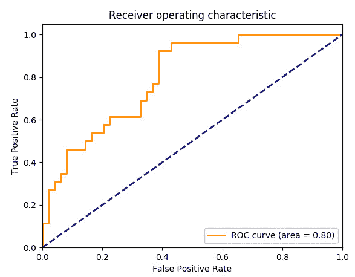

图 3.2 – ROC

曲线上的每个点都对应某个阈值值。请注意，曲线的陡峭程度是一个重要特征，因为我们希望最小化 FPR，所以我们通常希望这条曲线趋向于点 (0,1)。我们也可以在数据不平衡的数据集中成功使用 AUC-ROC 指标。

`Dlib` 库中有一个名为 `compute_roc_curve` 的函数，用于计算给定数据的 ROC 曲线。

不幸的是，`Flashlight` 和 `mlpack` 库没有计算 AUC-ROC 指标的函数。

### Log-Loss

逻辑损失函数值（Log-Loss）用作优化目标的目标损失函数。它由以下方程给出：

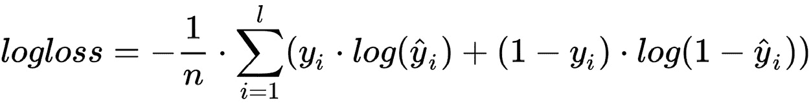

我们可以将 Log-Loss 值理解为经过校正的准确度，但会对错误预测进行惩罚。这个函数对单个错误分类的对象也给予显著的惩罚，因此数据中的所有异常对象都应该单独处理或从数据集中删除。

`Dlib` 库中有一个 `loss_binary_log` 类实现了 Log-Loss，这对于二元分类问题来说是合适的。这个类被设计成用作**神经网络**（**NN**）模块。

`Flashlight` 库中的 `BinaryCrossEntropy` 类可以计算输入张量 `x` 和目标张量 `y` 之间的二进制交叉熵损失。此外，这个类的主要目的是实现神经网络训练中的损失函数。

`mlpack` 库中的 `CrossEntropyError` 类也代表了神经网络构建中的损失函数；它具有前向和后向函数。因此，它被用来根据输入和目标分布之间的交叉熵来衡量网络的表现。

在本节中，我们学习了性能估计指标，这些指标可以为你提供关于模型准确度、精确度以及其他性能特征的更清晰的认识。在下一节中，我们将学习偏差和方差以及如何估计和修复模型预测特征。

# 理解偏差和方差特征

偏差和方差特征用于预测模型行为。例如，高方差效应，也称为**过拟合**，是机器学习中的一种现象，即构建的模型解释了训练集中的示例，但在未参与训练过程的示例上表现相对较差。这是因为当训练模型时，随机模式开始出现，而这些模式通常在一般人群中是缺失的。与过拟合相反的是**欠拟合**，它对应于高偏差效应。这发生在训练模型变得无法预测新数据或训练数据中的模式时。这种效应可能是有限的训练数据集或弱模型设计的后果。

在我们进一步描述它们的意义之前，我们应该考虑**验证**。验证是一种用于测试模型性能的技术。它估计模型在新数据上做出预测的好坏。新数据是我们没有用于训练过程的数据。为了进行验证，我们通常将我们的初始数据集分成两到三个部分。其中一部分应该包含大部分数据，并将用于训练，而其他部分将用于验证和测试模型。通常，验证是在一个训练周期（通常称为**epoch**）之后对迭代算法进行的。或者，我们在整体训练过程之后进行测试。

验证和测试操作评估的是我们从训练过程中排除的数据上的模型，这导致了我们为这个特定模型选择的性能指标值。例如，原始数据集可以分成以下几部分：80%用于训练，10%用于验证，10%用于测试。这些验证指标值可以用来估计模型和预测误差趋势。验证和测试最关键的问题是，它们的数据应该始终来自与训练数据相同的分布。

在本章的剩余部分，我们将使用多项式回归模型来展示不同的预测行为。多项式度数将用作超参数。

## 偏差

偏差是预测特征，它告诉我们模型预测值与真实值之间的距离。通常，我们使用术语*高偏差*或*欠拟合*来说明模型预测值与真实值相差太远，这意味着模型的泛化能力较弱。考虑以下图表：

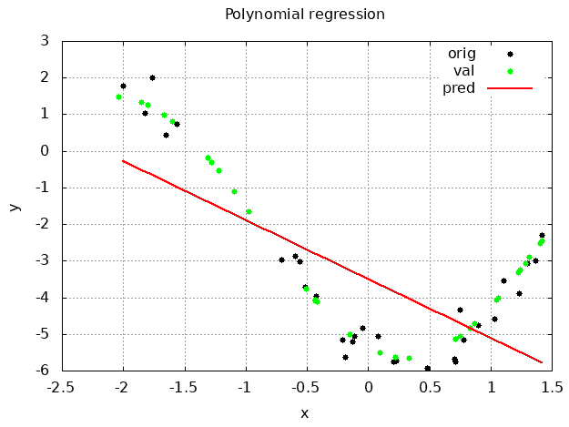

图 3.3 – 多项式度数为 1 的回归模型预测

此图表显示了原始值、用于验证的值以及代表多项式回归模型输出的线条。在这种情况下，多项式度数等于 *1*。我们可以看到，预测值根本无法描述原始数据，因此我们可以说这个模型具有高偏差。此外，我们可以绘制每个训练周期的验证指标，以获取更多关于训练过程和模型行为的详细信息。

以下图表显示了多项式回归模型训练过程的 MAE 指标值，其中多项式度数等于 *1*：

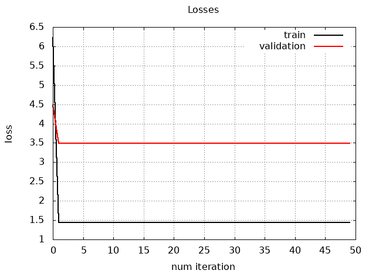

图 3.4 – 训练和验证损失值

我们可以看到，训练数据和验证数据的指标值线条是平行且足够远的。此外，这些线条在多次训练迭代后不会改变方向。这些事实也告诉我们，模型具有高偏差，因为在常规训练过程中，验证指标值应该接近训练值。

为了处理高偏差，我们可以在训练样本中添加更多特征。例如，对于多项式回归模型，增加多项式度数会添加更多特征；这些全新的特征描述了原始训练样本，因为每个额外的多项式项都是基于原始样本值。

## 方差

方差是预测特征，它告诉我们模型预测的变异性；换句话说，输出值范围可以有多大。通常，当模型试图非常精确地包含许多训练样本时，我们使用术语*高方差*或*过拟合*。在这种情况下，模型不能为新数据提供良好的近似，但在训练数据上表现优异。

下图显示了多项式回归模型的行为，多项式次数等于`15`：

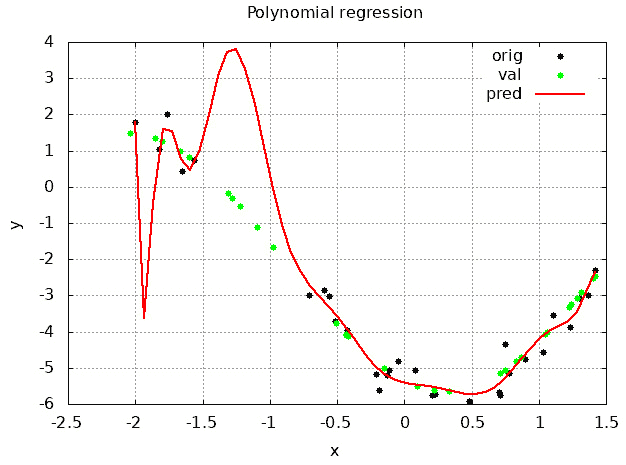

图 3.5 – 多项式次数等于 15 的回归模型预测

我们可以看到，模型几乎包含了所有训练数据。注意，在图表的图例中，训练数据被标记为`orig`，而用于验证的数据被标记为`val`。我们可以看到，这两组数据——训练数据和验证数据——在某种程度上是分离的，并且我们的模型由于缺乏近似而错过了验证数据。以下图表显示了学习过程的 MAE 值：

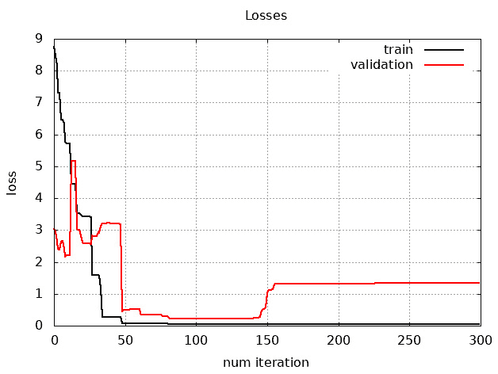

图 3.6 – 验证误差

我们可以看到，在大约 75 次学习迭代后，模型开始更好地预测训练数据，错误值降低。然而，对于验证数据，MAE 值开始上升。为了处理高方差，我们可以使用特殊的正则化技术，我们将在以下章节中讨论。我们还可以增加训练样本的数量并减少一个样本中的特征数量，以降低高方差。

我们在前几段中讨论的性能指标图可以在训练过程的运行时绘制。我们可以使用它们来监控训练过程，以查看高偏差或高方差问题。请注意，对于多项式回归模型，MAE 比 MSE 或 RMSE 是更好的性能特征，因为平方函数过度平均了误差。此外，即使是直线模型，对于此类数据也可以有低 MSE 值，因为线两边的误差相互补偿。MAE 和 MSE 之间的选择取决于特定任务和项目的目标。如果预测的整体准确性很重要，那么 MAE 可能更可取。但 MAE 对所有误差给予相同的权重，无论其大小。这意味着它对异常值不敏感，异常值可能会显著影响整体误差。因此，如果需要最小化大误差，那么 MSE 可以给出更准确的结果。在某些情况下，你可以使用这两个指标来更深入地分析模型的性能。

## 正常训练

考虑这样一个训练过程，其中模型具有平衡的偏差和方差：

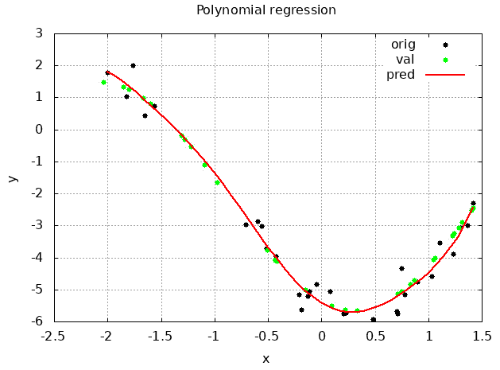

图 3.7 – 模型理想训练时的预测值

在这个图中，我们可以看到多项式回归模型的多项式次数为八。输出值接近训练数据和验证数据。以下图表显示了训练过程中的 MAE 值：

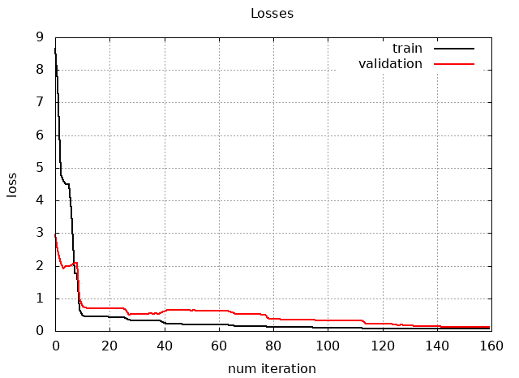

图 3.8 – 模型理想训练时的损失值

我们可以看到 MAE 值持续下降，并且训练数据和验证数据的预测值接近真实值。这意味着模型的超参数足够好，可以平衡偏差和方差。

## 正则化

正则化是一种用于减少模型过拟合的技术。正则化主要有两种方法。第一种被称为训练数据预处理。第二种是损失函数修改。损失函数修改技术的主要思想是在损失函数中添加惩罚算法结果的项，从而引起显著的方差。训练数据预处理技术的思想是添加更多独特的训练样本。通常，在这种方法中，通过增强现有样本来生成新的训练样本。总的来说，这两种方法都将关于任务域的一些先验知识添加到模型中。这些附加信息有助于我们进行方差正则化。因此，我们可以得出结论，正则化是任何导致最小化泛化误差的技术。

### L1 正则化 – Lasso

L1 正则化是损失函数的一个附加项：

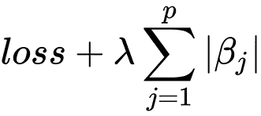

这个附加项将参数大小的绝对值作为惩罚。在这里，*λ* 是正则化系数。这个系数的值越高，正则化越强，可能会导致欠拟合。有时，这种正则化被称为**最小绝对收缩和选择算子**（**Lasso**）正则化。L1 正则化的基本思想是惩罚不那么重要的特征。我们可以将其视为一个特征选择过程，因为在优化过程中，一些系数（例如，在线性回归中）变为零，这表明这些特征没有对模型的性能做出贡献。我们最终得到一个具有较少特征的稀疏模型。

### L2 正则化 – Ridge

L2 正则化是损失函数的一个附加项：

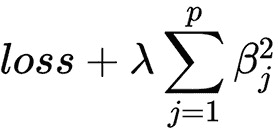

这个附加项将参数幅度的平方值作为惩罚。这种惩罚将参数幅度缩小到零。*λ*也是正则化的系数。其较高值会导致更强的正则化，并可能导致欠拟合，因为模型变得过于约束，无法学习数据中的复杂关系。这种正则化类型的另一个名称是**岭回归**。与 L1 正则化不同，这种类型没有特征选择特性。相反，我们可以将其解释为模型平滑度配置器。此外，对于基于梯度的优化器，L2 正则化在计算上更有效，因为其微分有解析解。

在`Dlib`库中，正则化机制通常集成到算法实现中——例如，`rr_trainer`类代表执行线性岭回归的工具，这是一种正则化的**最小二乘支持向量机**（**LSSVM**）。

在`mlpack`库中有一个`LRegularizer`类，它实现了一种广义 L-正则化器，允许 NN 使用 L1 和 L2 正则化方法。一些算法实现，如`LARS`类，可以训练 LARS/LASSO/Elastic Net 模型，并具有 L1 和 L2 正则化参数。`LinearRegression`类有一个岭回归的正则化参数。

在`Flashlight`库中没有独立的正则化功能。所有正则化都集成到 NN 优化算法实现中。

### 数据增强

数据增强过程可以被视为正则化，因为它向模型添加了一些关于问题的先验知识。这种方法在**计算机视觉**（**CV**）任务中很常见，例如图像分类或目标检测。在这种情况下，当我们看到模型开始过拟合且没有足够的训练数据时，我们可以增强我们已有的图像，以增加数据集的大小并提供更多独特的训练样本。图像增强包括随机图像旋转、裁剪和转换、镜像翻转、缩放和比例变化。但是，数据增强应该谨慎设计，以下是一些原因：

+   如果生成数据与原始数据过于相似，可能会导致过拟合。

+   它可能会向数据集引入噪声或伪影，这可能会降低结果的模型质量。

+   增强的数据可能无法准确反映真实世界数据的分布，导致训练集和测试集之间的领域偏移。这可能导致泛化性能不佳。

### 提前停止

提前停止训练过程也可以被解释为一种正则化形式。这意味着如果我们检测到模型开始过拟合，我们可以停止训练过程。在这种情况下，一旦训练停止，模型将具有参数。

### NN 的正则化

L1 和 L2 正则化在训练神经网络（NNs）时被广泛使用，通常被称为**权重衰减**。数据增强也在神经网络训练过程中发挥着至关重要的作用。在神经网络中还可以使用其他正则化方法。例如，Dropout 是一种特别为神经网络开发的正则化方法。此算法随机丢弃一些神经网络节点；它使得其他节点对其他节点的权重更加不敏感，这意味着模型变得更加鲁棒，并停止过拟合。

在接下来的章节中，我们将看到如何使用自动化算法与手动调整来选择模型超参数。

# 使用网格搜索技术进行模型选择

需要有一组合适的超参数值来创建一个好的机器学习（ML）模型。这是因为随机值会导致有争议的结果和从业者未预期的行为。我们可以遵循几种方法来选择最佳的超参数值集。我们可以尝试使用与我们任务相似的已训练算法的超参数。我们还可以尝试找到一些启发式方法并手动调整它们。然而，这项任务可以自动化。网格搜索技术是一种自动化的方法，用于搜索最佳超参数值。它使用交叉验证技术来估计模型性能。

## 交叉验证

我们已经讨论了验证过程是什么。它用于估计我们尚未用于训练的模型性能数据。如果我们有一个有限的或小的训练数据集，从原始数据集中随机采样验证数据会导致以下问题：

+   原始数据集的大小减小

+   有可能将重要的验证数据留在训练部分

为了解决这些问题，我们可以使用交叉验证方法。其背后的主要思想是以一种方式将原始数据集分割，使得所有数据都将用于训练和验证。然后，对所有分区执行训练和验证过程，并对结果进行平均。

最著名的交叉验证方法是 *K*-折交叉验证，其中 K 指的是用于分割数据集的折数或分区数。其思想是将数据集划分为相同大小的 *K* 个块。然后，我们使用其中一个块进行验证，其余的用于训练。我们重复这个过程 *K* 次，每次选择不同的块进行验证，最后平均所有结果。在整个交叉验证周期中的数据分割方案如下：

1.  将数据集划分为相同大小的 *K* 个块。

1.  选择一个块进行验证，其余 *K*-1 个块用于训练。

1.  重复此过程，确保每个块都用于验证，其余的用于训练。

1.  对每个迭代中计算的验证集性能指标的结果进行平均。

下图显示了交叉验证周期：

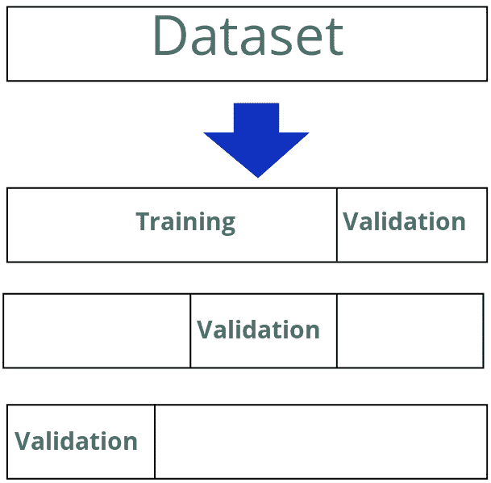

图 3.9 – K 折验证方案

## 网格搜索

网格搜索方法背后的主要思想是创建一个包含最合理超参数值的网格。该网格用于快速生成一定数量的不同参数集。我们应该对任务领域有一些先验知识，以初始化网格生成的最小和最大值，或者我们可以使用一些合理的广泛范围初始化网格。然而，如果选择的范围太广，搜索参数的过程可能需要很长时间，并且需要大量的计算资源。

在每个步骤中，网格搜索算法选择一组超参数值并训练一个模型。之后，训练步骤算法使用 K 折交叉验证技术来估计模型性能。我们还应该定义一个用于模型比较的单个模型性能估计指标，算法将在每个训练步骤为每个模型计算该指标。在完成每个网格单元中每一组参数的模型训练过程后，算法通过比较指标值并选择最佳值来选择最佳的超参数值集。通常，具有最小值的集合是最好的。

考虑在不同库中实现此算法。我们的任务是选择多项式回归模型的最佳超参数集，以获得最佳曲线，该曲线适合给定的数据。本例中的数据是一些带有随机噪声的余弦函数值。

## mlpack 示例

`mlpack` 库包含一个特殊的 `HyperParameterTuner` 类，用于在离散和连续空间中使用不同算法进行超参数搜索。默认搜索算法是网格搜索。此类是一个模板，应该针对具体任务进行特殊化。一般定义如下：

```py
template<typename MLAlgorithm, typename Metric,
    typename CV,...>
class HyperParameterTuner{…};
```

我们可以看到，主要模板参数是我们想要找到的算法、性能度量的超参数以及交叉验证算法。让我们定义一个 `HyperParameterTuner` 对象来搜索线性岭回归算法的最佳正则化值。定义如下：

```py
double validation_size = 0.2;
HyperParameterTuner<LinearRegression, 
  MSE, 
  SimpleCV> parameters_tuner(
    validation_size, samples, labels);
```

在这里，`LinearRegression` 是目标算法类，`MSE` 是计算 MSE 的性能度量类，而 `SimpleCV` 是实现交叉验证的类。它将数据分为两个集合，训练集和验证集，然后在训练集上运行训练，并在验证集上评估性能。此外，我们注意到我们将 `validation_size` 参数传递给构造函数。它的值为 0.2，这意味着使用 80% 的数据进行训练，剩余的 20% 用于使用 MSE 进行评估。接下来的两个构造函数参数是我们的训练数据集；`samples` 只是样本，而 `labels` 是相应的标签。

让我们看看如何为这些示例生成训练数据集。它将包括以下两个步骤：

1.  生成遵循某些预定义模式的数据——例如，二维正态分布的点，加上一些噪声

1.  数据归一化

以下示例展示了如何使用 Armadillo 库生成数据，它是 `mlpack` 数学后端：

```py
std::pair<arma::mat, arma::rowvec> GenerateData(
  size_t num_samples) {
  arma::mat samples = arma::randn<arma::mat>(1, num_samples);
  arma::rowvec labels = samples + arma::randn<arma::rowvec(
    num_samples, arma::distr_param(1.0, 1.5));
  return {samples, labels};
}
...
size_t num_samples = 1000;
auto [raw_samples, raw_labels] = GenerateData(num_samples);
```

注意，对于样本，我们使用了 `arma::mat` 类型，对于标签，我们使用了 `arma::rowvec` 类型。因此，样本被放置在矩阵实体中，标签则相应地放入一维向量中。此外，我们还使用了 `arma::randn` 函数来生成正态分布的数据和噪声。

现在，我们可以按以下方式对数据进行归一化：

```py
data::StandardScaler sample_scaler;
sample_scaler.Fit(raw_samples);
arma::mat samples(1, num_samples);
sample_scaler.Transform(raw_samples, samples);
data::StandardScaler label_scaler;
label_scaler.Fit(raw_labels);
arma::rowvec labels(num_samples);
label_scaler.Transform(raw_labels, labels);
```

我们使用了来自 `mlpack` 库的 `StandardScaler` 类的对象来进行归一化。这个对象应该首先使用 `Fit` 方法在数据上训练以学习均值和方差，然后它可以使用 `Transform` 方法应用于其他数据。

现在，让我们讨论如何准备数据和如何定义超参数调优对象。这样，我们就准备好启动网格搜索以找到最佳的规范化值；以下示例展示了如何进行：

```py
arma::vec lambdas{0.0, 0.001, 0.01, 0.1, 1.0};
double best_lambda = 0;
std::tie(best_lambda) = parameters_tuner.Optimize(lambdas);
```

我们定义了一个包含搜索空间的 `lambdas` 向量，然后调用了超参数调优对象的 `Optimize` 方法。你可以看到返回值是一个元组，我们使用 `std::tie` 函数来提取特定值。`Optimize` 方法根据我们在搜索中使用的机器学习算法的变量数量接受参数，每个参数将为算法中使用的每个超参数定义一个搜索空间。`LinearRegression` 类的构造函数只有一个 `lambda` 参数。搜索完成后，我们可以直接使用搜索到的最佳参数，或者我们可以获取最佳优化的模型对象，如下面的代码片段所示：

```py
LinearRegression& linear_regression =  parameters_tuner.BestModel();
```

我们现在可以尝试在新数据上使用新的模型来查看其效果。首先，我们将生成数据并使用预训练的缩放器对象对其进行归一化，如下面的示例所示：

```py
size_t num_new_samples = 50;
arma::dvec new_samples_values = arma::linspace<
  arma::dvec>(x_minmax.first, x_minmax.second, num_new_samples);
arma::mat new_samples(1, num_new_samples);
new_samples.row(0) = arma::trans(new_samples_values);
arma::mat norm_new_samples(1, num_new_samples);
sample_scaler.Transform(new_samples, norm_new_samples);
```

在这里，我们使用了 `arma::linspace` 函数来获取线性分布的数据范围。这个函数产生一个向量；我们编写了额外的代码将这个向量转换成矩阵对象。然后，我们使用了已经训练好的 `sample_scaler` 对象来归一化数据。

以下示例展示了如何使用网格搜索找到的最佳参数来使用模型：

```py
arma::rowvec predictions(num_new_samples);
linear_regression.Predict(norm_new_samples, predictions);
```

你必须注意的一个重要事项是，用于网格搜索的机器学习算法应该由 `SimpleCV` 或其他验证类支持。如果没有默认实现，你需要自己提供。

## Optuna 与 Flashlight 示例

Flashlight 库中不支持任何超参数调整算法，但我们可以使用一个名为 Optuna 的外部工具来处理我们想要搜索最佳超参数的机器学习程序。主要思想是使用某种 **进程间通信**（**IPC**）方法以不同的参数运行训练，并在训练后获取一些性能指标值。

Optuna 是一个超参数调整框架，旨在与不同的机器学习库和程序一起使用。它使用 Python 编程语言实现，因此其主要应用领域是具有一些 Python API 的工具。但 Optuna 还有一个 **命令行界面**（**CLI**），可以与不支持 Python 的工具一起使用。另一种使用此类工具的方法是从 Python 中调用它们，传递它们的命令行参数并读取它们的标准输出。本书将展示此类 Optuna 使用示例，因为从作者的角度来看，编写 Python 程序比为相同的自动化任务创建 Bash 脚本更有用。

要使用 Optuna 进行超参数调整，我们需要完成以下三个阶段：

1.  定义一个用于优化的目标函数。

1.  创建一个研究对象。

1.  运行优化过程。

让我们看看如何用 Python 编写一个简单的 Optuna 程序来搜索用 Flashlight 库编写的 C++ 多项式回归算法的最佳参数。

首先，我们需要导入所需的 Python 库：

```py
import optuna
import subprocess
```

然后，我们需要定义一个目标函数；这是一个由 Optuna 调优算法调用的函数。它接受一个包含一组超参数分布的 `Trial` 类对象，并应返回一个性能指标值。确切的超参数值应从传递的分布中进行采样。以下示例展示了我们如何实现此类函数：

```py
def objective(trial: optuna.trial.Trial):
  lr = trial.suggest_float("learning_rate", low=0.01, high=0.05)
  d = trial.suggest_int("polynomial_degree", low=8, high=16)
  bs = trial.suggest_int("batch_size", low=16, high=64)
  result = subprocess.run(
    [binary_path, str(d), str(lr), str(bs)],
    stdout=subprocess.PIPE
  )
  mse = float(result.stdout)
  return mse
```

在此代码中，我们使用 `trial` 对象中的一系列函数来采样具体的超参数值。我们通过调用 `suggest_float` 方法采样 `lr` 学习率，并通过 `suggest_int` 方法采样 `d` 多项式度和 `bs` 批处理大小。您可以看到这些方法的签名几乎相同。它们接受超参数的名称、值范围的低和高界限，并且可以接受一个步长值，我们没有使用。这些方法可以从离散空间和连续空间中采样值。`suggest_float` 方法从连续空间中采样，而 `suggest_int` 方法从离散空间中采样。

然后，我们调用了`subprocess`模块的`run`方法；它在系统中启动另一个进程。此方法接受命令行参数的字符串数组和一些其他参数——在我们的案例中，是`stdout`重定向。这种重定向是必要的，因为我们希望将进程的输出作为`run`方法调用返回值的返回值；你可以在最后几行看到`result.stdout`，它被转换为浮点值，并被解释为 MSE。

在拥有目标函数的情况下，我们可以定义一个`study`对象。这个对象告诉 Optuna 如何调整超参数。这个对象的两个主要特性是优化方向和超参数采样算法的搜索空间。以下示例展示了如何为我们的任务定义一个离散的搜索空间：

```py
search_space = {
  "learning_rate": [0.01, 0.025, 0.045],],],
  "polynomial_degree": [8, 14, 16],
  "batch_size": [16, 32, 64],
}
```

在这段 Python 代码中，我们定义了一个包含三个条目的`search_space`字典。每个条目都有一个键字符串和数组值。键是`learning_rate`、`polynomial_degree`和`batch_size`。在定义搜索空间之后，我们可以创建一个`study`对象；以下示例展示了这一点：

```py
study = optuna.create_study(
  study_name="PolyFit",
  direction="minimize",
  sampler=optuna.samplers.GridSampler(search_space),
)
```

我们使用了`optuna`模块中的`create_study`函数，并传递了三个参数：`study_name`、`direction`和`sampler`。我们指定的优化方向将是最小化，因为我们想最小化 MSE。对于`sampler`对象，我们使用了`GridSampler`，因为我们想实现网格搜索方法，并且我们用我们的搜索空间初始化了它。

最后一步是应用优化过程以获取最佳超参数。我们可以用以下方式完成：

```py
study.optimize(objective)
print(f"Best value: {study.best_value}
     (params: {study.best_params})\n")
```

我们使用了`study`对象的`optimize`方法。你可以看到它只接受一个参数——我们的`objective`函数，它调用外部进程尝试采样超参数。优化的结果存储在`study`对象的`best_value`和`best_params`字段中。`best_value`字段包含最佳 MSE 值，而`best_params`字段包含包含最佳超参数的字典。

这是最小化的 Optuna 使用示例。这个框架有各种各样的调整和采样算法，实际应用可能要复杂得多。此外，使用 Python 可以让我们避免为 CLI 方法编写大量的模板代码。

让我们简要地看看使用 Flashlight 库的多项式回归实现。我将只展示最重要的部分；完整的示例可以在以下链接找到：[`github.com/PacktPublishing/Hands-on-Machine-learning-with-C-Second-Edition/blob/main/Chapter03/flashlight/grid_fl.cc`](https://github.com/PacktPublishing/Hands-on-Machine-learning-with-C-Second-Edition/blob/main/Chapter03/flashlight/grid_fl.cc)。

第一个重要部分是，我们的程序应该从命令行参数中获取所有超参数。它可以按以下方式实现：

```py
int main(int argc, char** argv) {
  if (argc < 3) {
    std::cout << "Usage: " << argv[0] <<
    " polynomial_degree learning_rate batch_size" << std::endl;
    return 0;
  } else {
    // Hyper parameters
    int polynomial_degree = std::atoi(argv[1]);
    double learning_rate = std::atof(argv[2]);
    int batch_size = std::atoi(argv[3]);
    // Other code...
  }
}
```

首先，我们通过比较`argc`参数与所需数量来检查我们是否有足够的命令行参数。在失败的情况下，我们打印一条帮助信息。但在成功的情况下，我们从`argv`参数中读取所有超参数，并将它们从字符串转换为适当的类型。

然后，我们的程序生成 2D 余弦函数点并混合噪声。为了用线性回归近似非线性函数，我们可以将简单的 Ax+b 方法转换为更复杂的多项式，如下所示：

`a1*x+a2*x²+a3*x³+...+an*x^n + b`

这意味着我们必须选择某个多项式次数，并通过将`x`元素提升到相应的幂来将单维`x`值转换为多维值。因此，多项式次数是这个算法中最重要的超参数。

Flashlight 库没有为回归算法提供任何特殊的实现，因为这个库是针对 NN 算法的。但是，可以使用梯度下降方法轻松实现回归；以下代码示例显示了如何实现：

```py
// define learnable variables
auto weight = fl::Variable(fl::rand({polynomial_degree, 1}),
                           /*calcGrad*/ true);
auto bias = fl::Variable(fl::full({1}, 0.0),
                         /*calcGrad*/ true);
float mse = 0;
fl::MeanSquaredError mse_func;
for (int e = 1; e <= num_epochs; ++e) {
  fl::Tensor error = fl::fromScalar(0);
  for (auto& batch : *batch_dataset) {
    auto input = fl::Variable(batch[0],
                              /*calcGrad*/ false);
    auto local_batch_size = batch[0].shape().dim(1);
    auto predictions = fl::matmul(fl::transpose(
                             weight), input) + fl::tile(
                             bias, {1, local_batch_size});
    auto targets = fl::Variable(
        fl::reshape(batch[1], {1, local_batch_size}),
        /*calcGrad*/ false);
    // Mean Squared Error Loss
    auto loss = mse_func.forward(predictions, targets);
    // Compute gradients using backprop
    loss.backward();
    // Update the weight and bias
    weight.tensor() -= learning_rate * weight.grad().tensor();
    bias.tensor() -= learning_rate * bias.grad().tensor();
    // Clear the gradients for next iteration
    weight.zeroGrad();
    bias.zeroGrad();
    mse_func.zeroGrad();
    error += loss.tensor();
  }
// Mean Squared Error for the epoch
error /= batch_dataset->size();
mse = error.scalar<float>();
```

首先，我们为 Flashlight 的`autograd`系统定义了可学习的变量；它们是`X`的每个幂的权重和偏置项。然后，我们运行指定数量的 epoch 的循环，以及数据批次的第二个循环，以使计算向量化；这使得计算更有效，并使学习过程对噪声的依赖性降低。对于每个训练数据批次，我们通过获取多项式值来计算预测；请参阅调用`matmul`函数的行。`MeanSquareError`类的目的是获取损失函数值。为了计算相应的梯度，请参阅`mse_func.forward`和`mse_func.backward`调用。然后，我们使用学习率和相应的梯度更新我们的多项式权重和偏置。

所有这些概念将在以下章节中详细描述。下一个重要部分是`error`和`mse`值的计算。`error`值是包含整个 epoch 平均 MSE 的 Flashlight 张量对象，而`mse`值是这个单值张量的浮点值。这个`mse`变量在训练结束时打印到程序的标准化输出流中，如下所示：

```py
std::cout << mse;
```

我们在我们的 Python 程序中读取这个值，并返回给定超参数集的 Optuna 目标函数的结果。

## Dlib 示例

`Dlib`库也包含网格搜索算法的所有必要功能。然而，我们应该使用函数而不是类。以下代码片段显示了`CrossValidationScore`函数的定义。这个函数执行交叉验证并返回性能指标值：

```py
auto CrossValidationScore = & {
  auto degree = std::floor(degree_in);
  using KernelType = Dlib::polynomial_kernel<SampleType>;
  Dlib::svr_trainer<KernelType> trainer;
  trainer.set_kernel(KernelType(gamma, c, degree));
  Dlib::matrix<double> result = Dlib::
    cross_validate_regression_trainer(
      trainer, samples, raw_labels, 10);
  return result(0, 0);
};
```

`CrossValidationScore`函数接收作为参数设置的超参数。在这个函数内部，我们使用`svr_trainer`类定义了一个模型的训练器，该类基于`Shogun`库的示例实现了基于核的岭回归。

在我们定义了模型之后，我们使用`cross_validate_regression_trainer()`函数通过交叉验证方法来训练模型。这个函数自动将我们的数据分割成多个折，其最后一个参数是折数。`cross_validate_regression_trainer()`函数返回一个矩阵，以及不同性能指标的价值。请注意，我们不需要定义它们，因为它们在库的实现中是预定义的。

这个矩阵的第一个值是平均均方误差（MSE）值。我们使用这个值作为函数的结果。然而，对于这个函数应该返回什么值没有强烈的要求；要求是返回值应该是数值型的并且可以比较。另外，请注意，我们将`CrossValidationScore`函数定义为 lambda 表达式，以简化对在外部作用域中定义的训练数据容器的访问。

接下来，我们可以使用`find_min_global`函数搜索最佳参数：

```py
auto result = find_min_global(
    CrossValidationScore,
    {0.01, 1e-8, 5}, // minimum values for gamma, c, and degree
    {0.1, 1, 15}, // maximum values for gamma, c, and degree
    max_function_calls(50));
```

这个函数接收交叉验证函数、参数范围的最小值容器、参数范围的最大值容器以及交叉验证重复次数。请注意，参数范围的初始化值应该按照与在`CrossValidationScore`函数中定义的参数相同的顺序排列。然后，我们可以提取最佳超参数并使用它们来训练我们的模型：

```py
double gamma = result.x(0);
double c = result.x(1);
double degree = result.x(2);
using KernelType = Dlib::polynomial_kernel<SampleType>;
Dlib::svr_trainer<KernelType> trainer;
trainer.set_kernel(KernelType(gamma, c, degree));
auto descision_func = trainer.train(samples, raw_labels)
```

我们使用了与`CrossValidationScore`函数中相同的模型定义。对于训练过程，我们使用了所有的训练数据。使用`trainer`对象的`train`方法来完成训练过程。训练结果是一个函数，它接受一个单独的样本作为参数并返回一个预测值。

# 摘要

在本章中，我们讨论了如何估计机器学习模型的性能以及可以使用哪些指标进行此类估计。我们考虑了回归和分类任务的不同指标以及它们的特征。我们还看到了如何使用性能指标来确定模型的行为，并探讨了偏差和方差特征。我们研究了某些高偏差（欠拟合）和高方差（过拟合）问题，并考虑了如何解决这些问题。我们还了解了正则化方法，这些方法通常用于处理过拟合。然后，我们研究了验证是什么以及它在交叉验证技术中的应用。我们看到交叉验证技术允许我们在训练有限数据的同时估计模型性能。在最后一节中，我们将评估指标和交叉验证结合到网格搜索算法中，我们可以使用它来选择模型的最佳超参数集。

在下一章中，我们将学习可以使用来解决具体问题的机器学习算法。我们将深入讨论的下一个主题是聚类——将原始对象集按属性分成组的程序。我们将探讨不同的聚类方法和它们的特性。

# 进一步阅读

+   *选择评估机器学习模型的正确指标——第一部分*: [`medium.com/usf-msds/choosing-the-right-metric-for-machine-learning-models-part-1-a99d7d7414e4`](https://medium.com/usf-msds/choosing-the-right-metric-for-machine-learning-models-part-1-a99d7d7414e4)

+   *理解回归性能指标*: [`becominghuman.ai/understand-regression-performance-metrics-bdb0e7fcc1b3`](https://becominghuman.ai/understand-regression-performance-metrics-bdb0e7fcc1b3)

+   *分类性能指标*: [`nlpforhackers.io/classification-performance-metrics/`](https://nlpforhackers.io/classification-performance-metrics/)

+   *正则化：机器学习中的一个重要概念*: [`towardsdatascience.com/regularization-for-machine-learning-67c37b132d61`](https://towardsdatascience.com/regularization-for-machine-learning-67c37b132d61)

+   深度学习（DL）中正则化技术的概述（带 Python 代码）：[`www.analyticsvidhya.com/blog/2018/04/fundamentals-deep-learning-regularization-techniques`](https://www.analyticsvidhya.com/blog/2018/04/fundamentals-deep-learning-regularization-techniques)

+   *理解偏差-方差权衡*: [`towardsdatascience.com/understanding-the-bias-variance-tradeoff-165e6942b229`](https://towardsdatascience.com/understanding-the-bias-variance-tradeoff-165e6942b229)

+   DL – 过拟合：[`towardsdatascience.com/combating-overfitting-in-deep-learning-efb0fdabfccc`](https://towardsdatascience.com/combating-overfitting-in-deep-learning-efb0fdabfccc)

+   *k 折交叉验证的温和介绍*: [`machinelearningmastery.com/k-fold-cross-validation/`](https://machinelearningmastery.com/k-fold-cross-validation/)

# 第二部分：机器学习算法

在这部分，我们将向您展示如何使用各种 C++框架实现不同的知名机器学习模型（算法）。

本部分包括以下章节：

+   *第四章*, *聚类*

+   *第五章*, *异常检测*

+   *第六章*, *降维*

+   *第七章*, *分类*

+   *第八章*, *推荐系统*

+   *第九章*, *集成学习*
