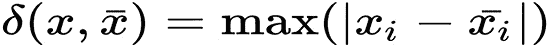

# 4

# 聚类

**聚类**是一种无监督的机器学习方法，用于将原始数据集的对象分割成按属性分类的组。在**机器学习**中，一个对象通常被表示为多维度量空间中的一个点。每个空间维度对应一个对象属性（特征），度量是一个属性值的函数。根据这个空间中维度的类型，这些维度可以是数值的也可以是分类的，我们选择一种聚类算法和特定的度量函数。这种选择取决于不同对象属性类型的本质。

在当前阶段，聚类通常被用作数据分析的第一步。聚类任务在诸如统计学、模式识别、优化和机器学习等科学领域被提出。在撰写本文时，将对象分组划分成聚类的数量方法相当庞大——几十种算法，甚至更多，当你考虑到它们的各种修改时。

本章将涵盖以下主题：

+   聚类中的距离度量

+   聚类算法的类型

+   使用 `mlpack` 库处理聚类任务样本的示例

+   使用 `Dlib` 库处理聚类任务样本的示例

+   使用 C++ 绘制数据

# 技术要求

完成本章需要以下技术和安装：

+   支持 C++17 的现代 C++ 编译器

+   CMake 构建系统版本 >= 3.8

+   `Dlib` 库

+   `mlpack` 库

+   `plotcpp` 库

本章的代码文件可以在本书的 GitHub 仓库中找到：[`github.com/PacktPublishing/Hands-on-Machine-learning-with-C-Second-Edition/tree/main/Chapter04`](https://github.com/PacktPublishing/Hands-on-Machine-learning-with-C-Second-Edition/tree/main/Chapter04)。

# 聚类中的距离度量

在聚类中，度量或距离度量是必不可少的，因为它决定了对象之间的相似性。然而，在将距离度量应用于对象之前，我们必须制作一个对象特征的向量；通常，这是一个数值集合，如人类身高或体重。此外，一些算法可以处理分类对象特征（或特性）。标准做法是对特征值进行归一化。归一化确保每个特征在距离度量计算中具有相同的影响。在聚类任务范围内可以使用许多距离度量函数。最常用的用于数值属性的函数是**欧几里得距离**、**平方欧几里得距离**、**曼哈顿距离**和**切比雪夫距离**。以下小节将详细描述它们。

## 欧几里得距离

欧几里得距离是最常用的距离度量。一般来说，这是一个多维空间中的几何距离。欧几里得距离的公式如下：


## 平方欧几里得距离

平方欧几里得距离具有与欧几里得距离相同的属性，但相对于较近的值，它赋予较远的值更大的重要性（权重）。以下是平方欧几里得距离的公式：


## 曼哈顿距离

曼哈顿距离是坐标的平均差异。在大多数情况下，它的值给出的聚类结果与欧几里得距离相同。然而，它降低了远距离值（异常值）的重要性（权重）。以下是曼哈顿距离的公式：


## 切比雪夫距离

当两个对象仅在坐标中的一个坐标上不同时，切比雪夫距离可能很有用。以下是切比雪夫距离的公式：



下图显示了各种距离之间的差异：


图 4.1 – 不同距离度量之间的差异

在这里，我们可以看到曼哈顿距离是两个维度距离的总和，就像在城市街区中行走一样。欧几里得距离只是直线长度。切比雪夫距离是曼哈顿距离的一个更灵活的替代方案，因为斜对角移动也被考虑在内。

在本节中，我们熟悉了主要的聚类概念，即距离度量。在下一节中，我们将讨论各种类型的聚类算法。

# 聚类算法的类型

我们可以将不同的聚类类型分类为以下几组：**基于划分的**、**基于谱的**、**层次化的**、**基于密度的**和**基于模型的**。基于划分的聚类算法可以逻辑上分为基于距离的方法和基于图论的方法。

在我们介绍不同的聚类算法之前，让我们了解聚类和分类之间的主要区别。这两者之间的主要区别是未定义的目标组集合，该集合由聚类算法确定。目标组（簇）集合是算法的结果。

我们可以将聚类分析分为以下阶段：

+   选择聚类对象

+   确定我们将用于度量的对象属性集合

+   标准化属性值

+   计算度量

+   根据度量值识别不同的对象组

分析聚类结果后，可能需要对所选算法的度量进行一些修正。

我们可以使用聚类来完成各种现实世界的任务，包括以下内容：

+   将新闻分割成几个类别供广告商使用

+   通过市场分析识别客户群体

+   识别用于生物研究的植物和动物群体

+   识别和分类城市规划和管理中的属性

+   检测地震震中簇以确定危险区域

+   对保险政策持有人群体进行分类以进行风险管理

+   对图书馆中的书籍进行分类

+   在数据中寻找隐藏的结构相似性

就这样，让我们深入了解不同的聚类算法类型。

## 基于划分的聚类算法

基于划分的方法使用相似度度量来将对象组合成组。从业者通常根据对问题的先验知识或启发式方法选择此类算法的相似度度量。有时，需要尝试几种度量与同一算法一起使用，以便选择最佳度量。此外，基于划分的方法通常需要显式指定所需簇的数量或调节输出簇数量的阈值。相似度度量的选择可以显著影响生成的簇的质量和准确性，可能导致对数据模式和洞察力的误解。

## 基于距离的聚类算法

这类方法中最著名的代表是 k-means 和 k-medoids 算法。它们接受*k*个输入参数，并将数据空间划分为*k*个簇，使得一个簇中对象的相似度最大。同时，它们最小化不同簇中对象的相似度。相似度值是对象到簇中心的距离。这些方法之间的主要区别在于簇中心定义的方式。

使用 k-means 算法，相似度与对象到簇质心的距离成正比。簇质心是簇对象在数据空间中坐标的平均值。k-means 算法可以简要描述为以下几步。首先，我们选择*k*个随机对象，并将每个对象定义为代表簇质心的簇原型。然后，将剩余的对象附加到具有更高相似度的簇上。之后，重新计算每个簇的质心。对于每个获得的划分，计算一个特定的评估函数，其值在每个步骤形成一个收敛序列。这个过程一直持续到指定的序列收敛到其极限值。

换句话说，当簇保持不变时，将物体从一个簇移动到另一个簇的过程就会结束。最小化评估函数可以使生成的簇尽可能紧凑且分离。当簇是彼此显著分离的紧凑“云”时，k-means 方法效果很好。它适用于处理大量数据，但不适用于检测非凸形状的簇或大小差异很大的簇。此外，该方法容易受到噪声和孤立点的影响，因为即使少量这样的点也会显著影响簇质心的计算。

为了减少噪声和孤立点对聚类结果的影响，与 k-means 算法不同，k-medoids 算法使用簇中的一个对象（称为代表对象）作为簇的中心。与 k-means 方法一样，随机选择*k*个代表对象。每个剩余的对象都与最近的代表对象组合成一个簇。然后，每个代表对象通过迭代地用数据空间中的一个任意非代表对象替换。替换过程继续进行，直到结果簇的质量提高。聚类质量由对象与对应簇的代表对象之间的偏差之和决定，该方法试图最小化这个偏差。因此，迭代继续进行，直到每个簇中的代表对象成为中位数。

**中位数**是距离簇中心最近的对象。该算法在处理大量数据时扩展性较差，但**基于随机搜索的聚类大应用**（**CLARANS**）算法解决了这个问题，它补充了 k-medoids 方法。CLARANS 通过使用随机搜索技术来更有效地找到好的解决方案，试图解决可扩展性问题。这种方法使得能够快速收敛到一个好的解决方案，而无需搜索所有可能的 medoids 组合。对于多维聚类，可以使用**投影聚类**（**PROCLUS**）算法。

## 基于图论的聚类算法

基于图论的算法本质在于将目标对象以图的形式表示。图顶点对应于对象，边权重等于顶点间的距离。图聚类算法的优点在于其卓越的可视性、相对容易的实现以及基于几何考虑的各种改进能力。用于聚类的图论主要概念包括选择连通分量、构建最小生成树和多层图聚类。

选择连通分量的算法基于*R*输入参数，该算法移除图中距离大于*R*的所有边。只有最近的成对对象保持连接。算法的目标是找到使图塌缩为几个连通分量的*R*值。结果形成的分量即为聚类。为了选择*R*参数，通常构建成对距离分布的直方图。对于具有明确定义聚类数据结构的问题，直方图中将出现两个峰值——一个对应于簇内距离，另一个对应于簇间距离。*R*参数通常从这两个峰值之间的最小区域中选择。使用距离阈值管理簇的数量可能会很困难。

最小生成树算法在图上构建最小生成树，然后依次移除权重最高的边。以下图表显示了九个对象的最小生成树：


图 4.2 – 扩展树示例

通过移除 *C* 和 *D* 之间的连接，长度为 6 个单位（最大距离的边），我们得到两个簇：*{A, B, C}* 和 *{D, E, F, G, H, I}*. 通过移除长度为 4 个单位的 *EF* 边，我们可以将第二个簇进一步划分为两个簇。

多层聚类算法基于在对象（顶点）之间某个距离级别上识别图的连通分量。阈值 *C* 定义了距离级别——例如，如果对象之间的距离是 ，则 。

层次聚类算法生成图 *G* 的子图序列，这些子图反映了簇之间的层次关系，，其中以下适用：

+   ：在  级别的子图

+   

+   ：距离的第 *t* 个阈值

+   ：层次级别的数量

+   ，o：当  时，一个空的图边集

+   ：当  时，没有距离阈值的对象图

通过改变  距离阈值，其中 ，可以控制结果簇的层次深度。因此，多层聚类算法可以创建既平坦又分层的分区数据。

## 谱聚类算法

谱聚类指的是所有使用图邻接矩阵或由此派生的其他矩阵的特征向量将数据集划分为簇的方法。邻接矩阵描述了一个完全图，其中对象是顶点，每对对象之间的边具有与这些顶点之间相似度对应的权重。谱聚类涉及将初始对象集转换为空间中的一系列点，其坐标是特征向量的元素。此类任务的正式名称是 **归一化** **切割问题**。

然后使用标准方法对得到的点集进行聚类——例如，使用 k 均值算法。改变由特征向量创建的表示，我们可以更清楚地设置原始簇集的性质。因此，谱聚类可以分离 k 均值方法无法分离的点——例如，当 k 均值方法得到一个凸点集时。谱聚类的主要缺点是其立方计算复杂度和二次内存需求。

## 层次聚类算法

在层次聚类算法中，有两种主要类型：**自底向上**和**基于自顶向下的算法**。自顶向下算法基于的原则是，最初，所有对象都放置在一个簇中，然后将其分割成越来越小的簇。自底向上算法比自顶向下算法更常见。它们在工作的开始时将每个对象放置在一个单独的簇中，然后合并簇以形成更大的簇，直到数据集中的所有对象都包含在一个簇中，构建一个嵌套分区系统。这些算法的结果通常以树形形式呈现，称为**树状图**。此类树的经典例子是*生命之树*，它描述了动物和植物的分类。

层次聚类方法的主要问题是难以确定停止条件，以便隔离自然簇并防止其过度分裂。层次聚类方法的另一个问题是选择簇的分离或合并点。这个选择至关重要，因为在每个后续步骤中分裂或合并簇之后，该方法将仅对新形成的簇进行操作。因此，在任何步骤中错误地选择合并或分裂点可能导致聚类质量较差。此外，由于决定是否分割或合并簇需要分析大量对象和簇，因此层次聚类方法不能应用于大数据集，这导致该方法具有显著的计算复杂性。

层次聚类方法中用于簇合并的几个度量或连接标准：

+   **单连接（最近邻距离）**：在此方法中，两个簇之间的距离由不同簇中两个最近的对象（最近邻）之间的距离确定。得到的簇倾向于链状连接。

+   **完全连接（最远邻居之间的距离）**：在此方法中，簇之间的距离由不同簇中任意两个对象之间的最大距离（即最远邻居）确定。当对象来自不同的组时，此方法通常工作得非常好。如果簇是细长的或其自然类型是*链状*，则此方法不适用。

+   **未加权成对平均链接法**：在此方法中，两个不同簇之间的距离被计算为它们所有对象对之间的平均距离。当对象形成不同的组时，此方法很有用，但在长形（链式）簇的情况下也工作得同样好。

+   **加权成对平均链接法**：这种方法与未加权的成对平均方法相同，只是在计算中使用了相应簇的大小（包含在其中的对象数量）作为权重因子。因此，当我们假设簇的大小不相等时，应使用此方法。

+   **加权质心链接法**：在此方法中，两个簇之间的距离定义为它们质心之间的距离。

+   **加权质心链接法（中位数）**：这种方法与前面的一种相同，只是在计算中使用了测量簇大小之间的距离的权重。因此，如果簇的大小存在显著差异，此方法比前一种方法更可取。

下图显示了一个层次聚类的树状图：


图 4.3 – 层次聚类示例

前面的图显示了层次聚类的树状图示例，你可以看到簇的数量如何取决于对象之间的距离。较大的距离会导致簇的数量减少。

## 基于密度的聚类算法

在基于密度的方法中，簇被认为是多个对象密度高的区域。这是通过具有低密度对象区域来分隔的。

**基于密度的空间聚类应用带噪声（DBSCAN**）算法是第一个创建的密度聚类算法之一。该算法的基础是几个陈述，详细说明如下：

+   对象的  属性是围绕对象的  半径邻域区域。

+   根对象是  包含最小非零对象数量的对象。假设这个最小数量等于一个预定义的值，称为 *MinPts*。

+   如果 *p* 在 *q* 的  属性中，并且 *q* 是根对象，则 *p* 对象可以直接从 *q* 对象中密集访问。

+   如果存在一个  对象的序列，其中  和 ，使得  可以直接从 、 中密集访问，则对于给定的  和 *MinPts*，*p* 对象可以从 *q* 对象中密集访问。

+   对于给定的  和 *MinPts*，如果存在一个 *o* 对象，使得 *p* 和 *q* 都可以从 *o* 中密集访问，则 *p* 对象与 *q* 对象是密集连接的。

DBSCAN 算法检查每个对象的邻域以寻找聚类。如果 *p* 对象的  属性包含比 *MinPts* 更多的点，则创建一个新的聚类，以 *p* 对象作为根对象。然后 DBSCAN 递归地收集直接从根对象可访问的对象，这可能导致几个密集可访问聚类的合并。当无法向任何聚类添加新对象时，过程结束。

与基于划分的方法不同，DBSCAN 不需要预先指定聚类数量；它只需要  和 *MinPts* 值，因为这些参数直接影响聚类的结果。这些参数的最佳值很难确定，尤其是在多维数据空间中。此外，此类空间中的分布式数据通常是不对称的，这使得无法使用全局密度参数进行聚类。对于聚类多维数据空间，有基于 DBSCAN 算法的 **子空间聚类**（**SUBCLU**）算法。

**MeanShift** 方法也属于基于密度的聚类算法类别。它是一种非参数算法，将数据集点向一定半径内最高密度区域的中心移动。算法通过迭代进行这样的移动，直到点收敛到密度函数的局部最大值。这些局部最大值也被称为模式，因此该算法有时被称为模式寻找算法。这些局部最大值代表了数据集中的聚类中心。

## 基于模型的聚类算法

基于模型的算法假设数据空间中存在特定的聚类数学模型，并试图最大化该模型和可用数据的似然性。通常，这使用数学统计学的工具。

**期望最大化**（**EM**）算法假设数据集可以使用多维正态分布的线性组合进行建模。其目的是估计最大化似然函数的分布参数，该函数用作模型质量的度量。换句话说，它假设每个聚类中的数据遵循特定的分布定律——即正态分布。基于这个假设，可以确定分布定律的最佳参数——似然函数最大的均值和方差。因此，我们可以假设任何对象属于所有聚类，但概率不同。在这种情况下，任务将是将分布集拟合到数据中，并确定对象属于每个聚类的概率。对象应分配到概率高于其他聚类的聚类。

EM 算法简单易实现。它对孤立对象不敏感，在成功初始化的情况下可以快速收敛。然而，它要求我们指定*簇数*，这暗示了对数据的先验知识。此外，如果初始化失败，算法可能收敛缓慢，或者我们可能会得到一个质量较差的结果。这类算法不适用于高维空间，因为在这种情况下，假设该空间中数据分布的数学模型是复杂的。

既然我们已经了解了各种聚类算法的类型，让我们看看它们在许多行业中的应用，以将相似的数据点分组到簇中。以下是一些聚类算法如何应用的例子：

+   **客户细分**：聚类算法可以根据客户的购买历史、人口统计信息和其他属性对客户进行细分。然后，这些信息可以用于定向营销活动、个性化产品推荐和客户服务。

+   **图像识别**：在计算机视觉领域，聚类算法根据视觉特征（如颜色、纹理和形状）对图像进行分组。这可以用于图像分类、目标检测和场景理解。

+   **欺诈检测**：在金融领域，聚类算法可以通过根据交易模式中的相似性对交易进行分组来检测可疑交易。这有助于识别潜在的欺诈行为并防止财务损失。

+   **推荐系统**：在电子商务中，聚类算法根据客户偏好对产品进行分组。这使得推荐系统可以向客户推荐相关产品，从而增加销售额和客户满意度。

+   **社交网络分析**：在社交媒体中，聚类算法识别具有相似兴趣或行为的用户组。这使得定向广告、内容创作和社区建设成为可能。

+   **基因组学**：在生物学中，聚类算法分析基因表达数据以识别在特定条件下共同表达的基因组。这有助于理解基因功能和疾病机制。

+   **文本挖掘**：在自然语言处理中，聚类算法根据文档的内容对文档进行分类。这对于主题建模、文档分类和信息检索很有用。

这些只是聚类算法广泛应用的几个例子。具体的应用案例将取决于行业、数据集和商业目标。

在本节中，我们讨论了各种聚类算法及其用途。在接下来的章节中，我们将学习如何在各种真实世界示例中使用它们，并使用各种 C++库。

# 使用 mlpack 库处理聚类任务示例

`mlpack` 库包含基于模型、基于密度和基于划分的聚类方法的实现。基于模型的算法称为**高斯混合模型**（**GMM**），基于 EM，而基于划分的算法是 k-means 算法。我们可以使用两种基于密度的算法：DBSCAN 和 MeanShift 聚类。

## 使用 mlpack 的 GMM 和 EM

GMM 算法假设簇可以拟合到某些高斯（正态）分布；它使用 EM 方法进行训练。有 `GMM` 和 `mlpack` 库实现了这种方法，如下面的代码片段所示：

```py
GMM gmm(num_clusters, /*dimensionality*/ 2);
KMeans<> kmeans;
size_t max_iterations = 250;
double tolerance = 1e-10;
EMFit<KMeans<>, NoConstraint> em(max_iterations, tolerance, kmeans);
gmm.Train(inputs, /*trials*/ 3, /*use_existing_model*/ false, em);
```

注意到 `GMM` 类的构造函数接受所需的簇数和特征维度性作为参数。在 `GMM` 对象初始化后，`EMFit` 类的对象使用最大迭代次数、容差和聚类对象进行初始化。`EMFit` 中的容差参数控制两个点必须多么相似才能被认为是同一簇的一部分。更高的容差值意味着算法将组合更多的点，导致簇数更少。相反，较低的容差值会导致簇数更多，每个簇中的点更少。聚类对象——在我们的案例中，`kmeans`——将被算法用于找到高斯拟合的初始质心。然后，我们将训练特征和 `EM` 对象传递到训练方法中。现在，我们有了训练好的 `GMM` 模型。在 `mlpack` 库中，应该使用训练好的 `gmm` 对象来分类新的特征点，但我们可以用它来显示用于训练的原始数据的簇分配。以下代码片段展示了这些步骤，并绘制了聚类的结果：

```py
arma::Row<size_t> assignments;
gmm.Classify(inputs, assignments);
Clusters plot_clusters;
for (size_t i = 0; i != inputs.n_cols; ++i) {
  auto cluser_idx = assignments[i];
  plot_clusters[cluser_idx].first.push_back(inputs.at(0, i));
  plot_clusters[cluser_idx].second.push_back(inputs.at(1, i));
  }
PlotClusters(plot_clusters, "GMM", name + "-gmm.png");
```

在这里，我们使用了 `GMM::Classify()` 方法来识别我们的对象属于哪个簇。此方法为每个元素填充了一个簇标识符的行向量，该向量对应于输入数据。得到的簇索引被用于填充 `plot_clusters` 容器。此容器将簇索引与输入数据坐标映射，用于绘图。它被用作 `PlotClusters()` 函数的参数，该函数可视化了聚类结果，如下面的图所示：


图 4.4 – mlpack GMM 聚类可视化

在前面的图片中，我们可以看到 GMM 和 EM 算法在不同的人工数据集上是如何工作的。

## 使用 mlpack 的 K-means 聚类

`mlpack` 库中的 k-means 算法是在 `KMeans` 类中实现的。这个类的构造函数接受多个参数，其中最重要的参数是迭代次数和距离度量计算的对象。在下面的示例中，我们将使用默认值，这样构造函数就可以不带参数被调用。一旦我们构建了一个 `KMeans` 类型的对象，我们将使用 `KMeans::Cluster()` 方法来运行算法，并为每个输入元素分配一个簇标签，如下所示：

```py
arma::Row<size_t> assignments;
KMeans<> kmeans;
kmeans.Cluster(inputs, num_clusters, assignments);
```

聚类的结果是带有标签的 `assignments` 容器对象。请注意，我们通过 `Cluster` 方法的参数传递了期望的簇数。以下代码示例展示了如何绘制聚类的结果：

```py
Clusters plot_clusters;
for (size_t i = 0; i != inputs.n_cols; ++i) {
  auto cluser_idx = assignments[i];
  plot_clusters[cluser_idx].first.push_back(inputs.at(0, i));
  plot_clusters[cluser_idx].second.push_back(inputs.at(1, i));
}
PlotClusters(plot_clusters, "K-Means", name + "-kmeans.png");
```

如我们所见，可视化代码与上一个示例相同——它是 `mlpack` 库中统一聚类 API 的结果。我们收到了与之前转换的数据结构相同的 `assignments` 容器，这对于我们使用的可视化库是合适的，并调用了 `PlotClusters` 函数。可视化结果如图所示：


图 4.5 – mlpack K-means 聚类可视化

在前面的图中，我们可以看到 k-means 算法在不同的人工数据集上的工作方式。

## 使用 mlpack 的 DBSCAN

`DBSCAN` 类在 `mlpack` 库中实现了相应的算法。这个类的构造函数接受多个参数，但最重要的两个是 `epsilon` 和最小点数。在下面的代码片段中，我们创建了这个类的对象：

```py
DBSCAN<> dbscan(/*epsilon*/ 0.1, /*min_points*/ 15);
```

在这里，`epsilon` 是范围搜索的半径，而 `min_points` 是形成簇所需的最小点数。在构建了 `BSSCAN` 类型的对象之后，我们可以使用 `Cluster()` 方法来运行算法，并为每个输入元素分配一个簇标签，如下所示：

```py
dbscan.Cluster(inputs, assignments);
```

聚类的结果是带有标签的 `assignments` 容器对象。请注意，对于这个算法，我们没有指定期望的簇数，因为算法自己确定了它们。可视化代码与之前的示例相同——我们将 `assignments` 容器转换为适合我们使用的可视化库的数据结构，并调用 `PlotClusters` 函数。以下图显示了 DBSCAN 聚类可视化结果：


图 4.6 – mlpack DBSCAN 聚类可视化

在前面的图中，我们可以看到 DBSCAN 算法在不同的人工数据集上的工作方式。与之前算法的主要区别是算法找到了更多的簇。从这一点我们可以看出，它们的质心靠近某些局部密度最大值。

## 使用 mlpack 进行 MeanShift 聚类

`MeanShift`类实现了`mlpack`库中相应的算法。此类的构造函数接受几个参数，其中最重要的是密度区域搜索半径。手动找到此参数的适当值相当棘手。然而，库为我们提供了一个非常有用的方法来自动确定它。在以下代码片段中，我们创建了一个`MeanShift`类的对象，而没有明确指定半径参数：

```py
MeanShift<> mean_shift;
auto radius = mean_shift.EstimateRadius(inputs);
mean_shift.Radius(radius);
```

在这里，我们使用了`EstimateRadius`方法来获取自动半径估计，该估计基于具有适当搜索半径值的`MeanShift`对象，我们可以使用`Cluster()`方法运行算法并为每个输入元素分配一个簇标签，如下所示：

```py
arma::Row<size_t> assignments;
arma::mat centroids;
mean_shift.Cluster(inputs, assignments, centroids);
```

聚类的结果是包含标签和包含簇中心坐标的附加矩阵的`assignments`容器对象。对于此算法，我们也没有指定簇的数量，因为算法自行确定了它们。可视化代码与前面的示例相同——我们将`assignments`容器转换为适合我们使用的可视化库的数据结构，并调用`PlotClusters`函数。以下图显示了`MeanShift`聚类可视化结果：


图 4.7 – mlpack MeanShift 聚类可视化

前面的图显示了 MeanShift 算法在不同的人工数据集上的工作方式。我们可以看到，结果与 K-means 聚类的结果在某些方面相似，但簇的数量是自动确定的。我们还可以看到，在其中一个数据集中，算法未能得到正确的簇数量，因此我们必须通过搜索半径值进行实验以获得更精确的聚类结果。

# 使用 Dlib 库处理聚类任务示例

`Dlib`库提供了 k-means、谱系、层次和另外两种图聚类算法——**Newman**和**Chinese Whispers**——作为聚类方法。让我们看看。

## 使用 Dlib 进行 K-means 聚类

`Dlib`库使用核函数作为 k-means 算法的距离函数。此类函数的一个例子是径向基函数。作为第一步，我们定义所需的类型，如下所示：

```py
 typedef matrix<double, 2, 1> sample_type;
 typedef radial_basis_kernel<sample_type> kernel_type;
```

然后，我们初始化一个 `kkmeans` 类型的对象。其构造函数接受一个定义聚类质心的对象作为输入参数。我们可以使用 `kcentroid` 类型的对象来完成这个目的。其构造函数接受三个参数：第一个是定义核（距离函数）的对象，第二个是质心估计的数值精度，第三个是运行时间复杂度的上限（实际上，是 `kcentroid` 对象允许使用的最大字典向量数），如下面的代码片段所示：

```py
kcentroid<kernel_type> kc(kernel_type(0.1), 0.01, 8);
kkmeans<kernel_type> kmeans(kc);
```

作为下一步，我们使用 `pick_initial_centers()` 函数初始化聚类中心。此函数接受聚类数量、中心对象输出容器、训练数据和距离函数对象作为参数，如下所示：

```py
std::vector<sample_type> samples; //training dataset
...
size_t num_clusters = 2;
std::vector<sample_type> initial_centers;
pick_initial_centers(num_clusters,
                     initial_centers,
                     samples,
                     kmeans.get_kernel());
```

当选择初始中心时，我们可以使用它们来调用 `kkmeans::train()` 方法以确定精确的聚类，如下所示：

```py
kmeans.set_number_of_centers(num_clusters);
kmeans.train(samples, initial_centers);
for (size_t i = 0; i != samples.size(); i++) {
  auto cluster_idx = kmeans(samples[i]);
  ...
}
```

我们使用 `kmeans` 对象作为函数对象在单个数据项上执行聚类。聚类结果将是该项的聚类索引。然后，我们使用聚类索引来可视化最终的聚类结果，如下面的图所示：


图 4.8 – Dlib K-means 聚类可视化

在前面的图中，我们可以看到 `Dlib` 库中实现的 k-means 聚类算法在不同的人工数据集上的工作方式。

## 使用 Dlib 进行谱聚类

`Dlib` 库中的谱聚类算法在 `spectral_cluster` 函数中实现。它接受距离函数对象、训练数据集和聚类数量作为参数。结果，它返回一个包含聚类索引的容器，其顺序与输入数据相同。在下面的示例中，使用 `knn_kernel` 类型的对象作为距离函数。你可以在本书提供的示例中找到其实现。这个 `knn_kernel` 距离函数对象估计给定对象的第一个 KNN 对象。这些对象通过使用 KNN 算法确定，该算法使用欧几里得距离作为距离度量，如下所示：

```py
typedef matrix<double, 2, 1> sample_type;
typedef knn_kernel<sample_type> kernel_type;
...
std::vector<sample_type> samples;
...
std::vector<unsigned long> clusters =
spectral_cluster(kernel_type(samples, 15),
                 samples,
                 num_clusters);
```

`spectral_cluster()` 函数调用将 `clusters` 对象填充了聚类索引值，我们可以使用这些值来可视化聚类结果，如下面的图所示：


图 4.9 – Dlib 谱聚类可视化

在前面的图中，我们可以看到 `Dlib` 库中实现的谱聚类算法在不同的人工数据集上的工作方式。

## 使用 Dlib 进行层次聚类

`Dlib`库实现了聚合层次（自下而上）聚类算法。`bottom_up_cluster()`函数实现了此算法。此函数接受数据集对象之间的距离矩阵、聚类索引容器（作为输出参数）和聚类数量作为输入参数。请注意，它返回的容器中的聚类索引顺序与矩阵中提供的距离顺序相同。

在以下代码示例中，我们已将距离矩阵填充为输入数据集中每对元素之间的成对欧几里得距离：

```py
matrix<double> dists(inputs.nr(), inputs.nr());
for (long r = 0; r < dists.nr(); ++r) {
  for (long c = 0; c < dists.nc(); ++c) {
    dists(r, c) = length(subm(inputs, r, 0, 1, 2) -
                         subm(inputs, c, 0, 1, 2));
  }
}
std::vector<unsigned long> clusters;
bottom_up_cluster(dists, clusters, num_clusters);
```

`bottom_up_cluster()`函数调用将`clusters`对象填充了聚类索引值，我们可以使用这些值来可视化聚类结果，如图所示：


图 4.10 – Dlib 层次聚类可视化

在前面的图中，我们可以看到`Dlib`库中实现的层次聚类算法在不同的人工数据集上的工作方式。

## 基于 Dlib 的 Newman 模块性图聚类算法

该算法的实现基于 M. E. J. Newman 所著的*网络中的模块性和社区结构*一文。此算法基于网络或图的模块性矩阵，并且它不是基于特定的图论。然而，它确实与谱聚类有某些相似之处，因为它也使用了特征向量。

`Dlib`库通过`newman_cluster()`函数实现了此算法，该函数接受一个加权图边的向量，并输出每个顶点的聚类索引容器。加权图边的向量表示网络中节点之间的连接，每条边都有一个表示其强度的权重。这些权重用于确定节点之间的相似性，从而影响聚类过程。使用此算法的初始步骤是定义图边。在以下代码示例中，我们正在创建数据集对象几乎每对之间的边。请注意，我们只使用距离大于阈值的对（这是出于性能考虑）。阈值距离可以根据需要调整以达到不同的聚类结果粒度。

此外，此算法不需要预先知道聚类数量，因为它可以自行确定聚类数量。以下是代码：

```py
for (long i = 0; i < inputs.nr(); ++i) {
  for (long j = 0; j < inputs.nr(); ++j) {
    auto dist = length(subm(inputs, i, 0, 1, 2) -
                       subm(inputs, j, 0, 1, 2));
    if (dist < 0.5)
      edges.push_back(sample_pair(i, j, dist));
  }
}
remove_duplicate_edges(edges);
std::vector<unsigned long> clusters;
const auto num_clusters = newman_cluster(edges, clusters);
```

`newman_cluster()`函数调用将`clusters`对象填充了聚类索引值，我们可以使用这些值来可视化聚类结果。请注意，另一种用于计算边权重的方案可能会导致不同的聚类结果。此外，边权重值应根据特定任务进行初始化。边长仅用于演示目的。

结果如下所示：


图 4.11 – Dlib Newman 聚类可视化

在前面的图中，我们可以看到在`Dlib`库中实现的 Newman 聚类算法在不同的人工数据集上的工作方式。

## Chinese Whispers – 基于 Dlib 的图聚类算法

Chinese Whispers 算法是一种用于对加权无向图的节点进行划分的算法。它在 Chris Biemann 撰写的论文《Chinese Whispers – 一种高效的图聚类算法及其在自然语言处理问题中的应用》中进行了描述。此算法也不使用任何独特的图论方法；相反，它使用局部上下文进行聚类的想法，因此它可以被归类为基于密度的方法。

在`Dlib`库中，此算法通过`chinese_whispers()`函数实现，该函数接收加权图边的向量，并为每个顶点输出包含聚类索引的容器。出于性能考虑，我们通过距离阈值限制数据集对象之间的边数。加权图边和阈值参数的含义与新曼算法相同。此外，与 Newman 算法一样，此算法也自行确定结果聚类的数量。代码可以在以下代码片段中查看：

```py
std::vector<sample_pair> edges;
for (long i = 0; i < inputs.nr(); ++i) {
  for (long j = 0; j < inputs.nr(); ++j) {
    auto dist = length(subm(inputs, i, 0, 1, 2) -
                       subm(inputs, j, 0, 1, 2));
    if (dist < 1)
      edges.push_back(sample_pair(i, j, dist));
  }
}
std::vector<unsigned long> clusters;
const auto num_clusters = chinese_whispers(edges,clusters);
```

`chinese_whispers()`函数调用将聚类索引值填充到`clusters`对象中，我们可以使用这些值来可视化聚类结果。请注意，我们使用`1`作为边权重的阈值；另一个阈值值可能导致不同的聚类结果。此外，边权重值应根据特定任务进行初始化。边长仅用于演示目的。

结果可以在以下图中查看：


图 4.12 – Dlib Chinese Whispers 聚类可视化

在前面的图中，我们可以看到在`Dlib`库中实现的 Chinese Whispers 聚类算法在不同的人工数据集上的工作方式。

在本节和前几节中，我们看到了许多显示聚类结果的图像示例。下一节将解释如何使用`plotcpp`库，这是我们用来绘制这些图像的库。

# 使用 C++绘制数据

聚类后，我们使用`plotcpp`库绘制结果，这是一个围绕`gnuplot`命令行工具的轻量级包装器。使用这个库，我们可以在散点图上绘制点或绘制线条。使用这个库开始绘图的第一步是创建`Plot`类的对象。然后，我们必须指定绘图的输出目的地。我们可以使用`Plot::SetTerminal()`方法设置目的地，该方法接受一个包含目的地点缩写的字符串。例如，我们可以使用`qt`字符串值来显示`Plot`类方法。然而，它并不涵盖`gnuplot`所有可能的配置。在需要一些独特选项的情况下，我们可以使用`Plot::gnuplotCommand()`方法直接进行`gnuplot`配置。

我们可以遵循两种绘图方法来在一个图表上绘制一组不同的图形：

1.  我们可以使用`Draw2D()`方法与`Points`或`Lines`类的对象一起使用，但在这个情况下，我们应该在编译前指定所有图形配置。

1.  我们可以使用`Plot::StartDraw2D()`方法获取一个中间绘图状态对象。然后，我们可以使用`Plot::AddDrawing()`方法将不同的绘图添加到一个图表中。在绘制了最后一张图形后，应该调用`Plot::EndDraw2D()`方法。

我们可以使用`Points`类型来绘制点。此类型对象应该使用起始和结束前向迭代器初始化，这些迭代器代表坐标。我们应该指定三个迭代器作为点坐标，两个迭代器用于*x*坐标，即它们的起始和结束位置，以及一个迭代器用于*y*坐标的起始位置。容器中的坐标数量应该相同。最后一个参数是`gnuplot`视觉风格配置。`Lines`类的对象可以以相同的方式进行配置。

一旦我们完成了所有的绘图操作，我们应该调用`Plot::Flush()`方法将所有命令渲染到窗口或文件中，如下面的代码块所示：

```py
// Define helper data types for point clusters coordinates
// Container type for single coordinate values
using Coords = std::vector<DataType>;
// Paired x, y coordinate containers
using PointCoords = std::pair<Coords, Coords>;
// Clusters mapping container
using Clusters = std::unordered_map<index_t, PointCoords>;
// define color values container
const std::vector<std::string> colors{
    "black", "red",    "blue",  "green",
    "cyan",  "yellow", "brown", "magenta"};
...
    // Function for clusters visualization
    void
    PlotClusters(const Clusters& clusters,
                 const std::string& name,
                 const std::string& file_name) {
  // Instantiate plotting object
  plotcpp::Plot plt;
  // Configure plotting object
  plt.SetTerminal("png");
  plt.SetOutput(file_name);
  plt.SetTitle(name);
  plt.SetXLabel("x");
  plt.SetYLabel("y");
  plt.SetAutoscale();
  plt.gnuplotCommand("set grid");
  // Start 2D scatter plot drawing
  auto draw_state =
      plt.StartDraw2D<Coords::const_iterator>();
  for (auto& cluster : clusters) {
    std::stringstream params;
    // Configure cluster visualization color string
    params << "lc rgb '" << colors[cluster.first]
           << "' pt 7";
    // Create cluster name string
    auto cluster_name =
        std::to_string(cluster.first) + " cls";
    // Create points visualization object using "cluster"
    // points
    plotcpp::Points points(cluster.second.first.begin(),
                           cluster.second.first.end(),
                           cluster.second.second.begin(),
                           cluster_name, params.str());
       // Add current cluster visualization to the 2D scatter
    // plot
    plt.AddDrawing(draw_state, points);
  }
  // Finalize 2D scatter plot
  plt.EndDraw2D(draw_state);
  // Render the plot
  plt.Flush();
}
```

在这个例子中，我们学习了如何使用`plotcpp`库绘制我们的聚类结果。我们必须能够配置不同的可视化参数，例如图表类型、点颜色和轴名称，因为这些参数使我们的图表更具信息量。我们还学习了如何将此图表保存到文件中，以便我们以后可以使用它或将它插入到另一个文档中。这个库将在整本书中用于可视化结果。

# 摘要

在本章中，我们考虑了聚类是什么以及它与分类有何不同。我们探讨了不同的聚类方法，例如基于划分、频谱、层次、基于密度和基于模型的方法。我们还观察到基于划分的方法可以分为更多类别，例如基于距离的方法和基于图论的方法。

然后，我们使用了这些算法的实现，包括 k-means 算法（基于距离的方法）、GMM 算法（基于模型的方法）、基于 Newman 模块性的算法以及中国 whispers 算法，用于图聚类。我们还学习了如何在程序中使用层次聚类和谱聚类算法的实现。我们看到了成功聚类的关键问题包括距离度量函数的选择、初始化步骤、分割或合并策略以及关于聚类数量的先验知识。

每个特定算法的组合都是独特的。我们还看到，聚类算法的结果很大程度上取决于数据集的特征，因此我们应该根据这些特征来选择算法。

在本章末尾，我们研究了如何使用`plotcpp`库可视化聚类结果。

在下一章中，我们将学习什么是数据异常以及存在哪些机器学习算法用于异常检测。我们还将看到异常检测算法如何用于解决现实生活中的问题，以及这些算法的哪些属性在不同任务中扮演着更重要的角色。

# 进一步阅读

要了解更多关于本章所涉及主题的信息，请查看以下资源：

+   *数据科学家需要了解的 5 种聚类算法*：[`towardsdatascience.com/the-5-clustering-algorithms-data-scientists-need-to-know-a36d136ef68`](https://towardsdatascience.com/the-5-clustering-algorithms-data-scientists-need-to-know-a36d136ef68)

+   *聚类*：[`scikit-learn.org/stable/modules/clustering.html`](https://scikit-learn.org/stable/modules/clustering.html)

+   *不同类型的聚类* *算法*：[`www.geeksforgeeks.org/different-types-clustering-algorithm/`](https://www.geeksforgeeks.org/different-types-clustering-algorithm/)

+   *聚类及其不同方法的介绍*：[`www.analyticsvidhya.com/blog/2016/11/an-introduction-to-clustering-and-different-methods-of-clustering/`](https://www.analyticsvidhya.com/blog/2016/11/an-introduction-to-clustering-and-different-methods-of-clustering/)

+   图论入门书籍：*图论* (*Graduate Texts in Mathematics*)，作者为 Adrian Bondy 和 U.S.R. Murty

+   *《统计学习的要素：数据挖掘、推理与预测》*，作者为 Trevor Hastie、Robert Tibshirani 和 Jerome Friedman，涵盖了机器学习理论和算法的许多方面。
