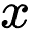

# 5

# 异常检测

**异常检测**是我们在一个给定的数据集中寻找意外值的地方。异常是系统行为或数据值与标准或预期值之间的偏差。异常也被称为异常值、错误、偏差和例外。它们可能由于技术故障、事故、故意黑客攻击等原因，出现在性质和结构多样化的数据中。

我们可以使用许多方法和算法来搜索各种类型数据中的异常。这些方法使用不同的方法来解决相同的问题。有无监督、监督和半监督算法。然而，在实践中，无监督方法是最受欢迎的。**无监督异常检测**技术检测未标记的测试数据集中的异常，假设数据集的大部分是正常的。它是通过寻找不太可能适合其余数据集的数据点来做到这一点的。无监督算法之所以更受欢迎，是因为异常事件的发生频率与正常或预期数据相比显著较低，因此通常很难获得适合异常检测的适当标记的数据集。

从广义上讲，异常检测适用于广泛的领域，如入侵检测、欺诈检测、故障检测、健康监测、事件检测（在传感器网络中）以及环境破坏的检测。通常，异常检测被用作数据准备的前处理步骤，在数据传递给其他算法之前。

因此，在本章中，我们将讨论最流行的无监督异常检测算法及其应用。

本章将涵盖以下主题：

+   探索异常检测的应用

+   异常检测的学习方法

+   使用不同的 C++ 库进行异常检测的示例

# 技术要求

完成本章示例所需的软件列表如下：

+   `Shogun-toolbox` 库

+   `Shark-ML` 库

+   `Dlib` 库

+   `PlotCpp` 库

+   支持 C++17 的现代 C++ 编译器

+   CMake 构建系统版本 >= 3.8

本章的代码文件可以在以下 GitHub 仓库中找到：[`github.com/PacktPublishing/Hands-on-Machine-learning-with-C-Second-Edition/tree/main/Chapter05`](https://github.com/PacktPublishing/Hands-on-Machine-learning-with-C-Second-Edition/tree/main/Chapter05)

# 探索异常检测的应用

数据分析中的两个领域寻找异常：**异常值检测**和**新颖性检测**。

一个 *新对象* 或 *新颖性* 是一个与训练数据集中的对象在属性上不同的对象。与异常不同，新对象本身不在数据集中，但它可以在系统开始工作后的任何时刻出现。它的任务是检测其出现。例如，如果我们分析现有的温度测量值并识别异常高或低的值，那么我们就是在检测异常。另一方面，如果我们创建一个算法，对于每次新的测量，评估温度与过去值的相似性并识别显著异常的值，那么我们就是在检测新颖性。

异常出现的原因包括数据错误、噪声的存在、误分类的对象，以及来自其他数据集或分布的外来对象。让我们解释两种最不为人知的异常类型：数据错误和来自不同分布的数据。数据错误可以广泛地指代测量不准确、舍入误差和不正确的输入。属于不同分布的对象的例子是来自损坏传感器的测量值。这是因为这些值将属于可能与预期不同的范围。

新颖性通常是由于根本新的对象行为而产生的。例如，如果我们的对象是计算机系统行为描述，那么在病毒侵入计算机并从这些描述中删除一些信息后，它们将被视为新颖性。另一个新颖性的例子可能是一群与其他客户行为不同但与其他客户有相似之处的客户。新颖性对象的主要特征是它们是新的，因为在训练集中不可能有关于所有可能的病毒感染或故障的信息。创建这样的训练数据集是一个复杂的过程，通常也没有意义。然而，幸运的是，我们可以通过关注系统或机制的普通（常规）操作来获得足够大的数据集。

通常，异常检测的任务与分类的任务相似，但有一个本质的区别：**类别不平衡**。例如，设备故障（异常）比设备正常工作的情况要罕见得多。

我们可以在不同类型的数据中观察到异常。在下面的图中，我们可以看到一个数值序列中异常的例子：


图 5.1 – 数值序列中异常的例子

在下面的图中，我们可以看到图中存在的异常；这些异常可以是边也可以是顶点（见用较浅颜色标记的元素）：


图 5.2 – 图中的异常

下面的文本展示了字符序列中的异常：

`AABBCCCAABBCCCAACABBBCCCAABB`

可以使用，例如**受试者工作特征曲线下面积**（**AUC-ROC**）来估计异常检测任务的品质或性能，就像分类任务可以一样。

我们已经讨论了什么是异常，那么让我们看看有哪些方法可以用来检测它们。

# 异常检测的学习方法

在本节中，我们将探讨我们用于异常检测的最流行和最直接的方法。

## 使用统计测试检测异常

**统计测试**通常用于捕捉单个特征的极端值。这类测试的通用名称是**极端值分析**。这种测试的一个例子是使用 Z 分数度量：


这里，是数据集的一个样本，*µ*是数据集中所有样本的平均值，是数据集中样本的标准差。一个*Z*分数值告诉我们数据点与平均值有多少个标准差。因此，通过选择适当的阈值值，我们可以过滤掉一些异常值。任何*Z*分数大于阈值的点将被视为异常值或数据集中的异常值。通常，大于`3`或小于`-3`的值被视为异常，但你可以根据你特定的项目需求调整这个阈值。以下图表显示了使用 Z 分数测试可以将哪些来自某种正态分布数据的值视为异常或离群值：


图 5.3 – Z 分数异常检测

我们应该提到的一个重要概念是极端值——给定数据集的最大值和最小值。重要的是要理解，极端值和异常是不同的概念。以下是一个小的数据样本：

`[1, 39, 2, 1, 101, 2, 1, 100, 1, 3, 101, 1, 3, 100, 101,` `100, 100]`

我们可以将`39`视为异常值，但不是因为它是最大或最小值。重要的是要理解，异常不一定是极端值。

虽然极端值通常不是异常，但在某些情况下，我们可以将极端值分析方法适应于异常检测的需求。然而，这取决于具体任务，并且应该由**机器学习**（**ML**）从业者仔细分析。

## 使用局部离群因子方法检测异常

基于距离测量的方法被广泛用于解决不同的机器学习问题，以及用于异常检测。这些方法假设在对象空间中存在一个特定的度量标准，有助于我们找到异常。当我们使用基于距离的方法进行异常检测时的一般假设是，异常值只有少数邻居，而正常点有许多邻居。因此，例如，到第 *k* 个邻居的距离可以作为一个很好的异常值度量，正如在**局部异常因子**（**LOF**）方法中所反映的那样。这种方法基于估计已检查异常的对象密度。位于最低密度区域的对象被认为是异常值或异常。

与其他方法相比，LOF 方法的优势在于它与对象的局部密度相结合。因此，LOF 可以有效地识别异常值，即使在数据集中存在不同类别的对象，这些对象在训练期间可能不被视为异常。例如，假设从对象 *(A)* 到其第 *k* 个最近邻居的距离为 *k*-distance (*A*)。请注意，*k* 个最近邻居的集合包括所有在这个距离内的对象。我们将 *k* 个最近邻居的集合表示为 *N*k*(A)*。这个距离用于确定可达距离：


如果点 *A* 位于点 *B* 的 *k* 个邻居之间，则 *可达距离* 将等于点 *B* 的 *k*-distance。否则，它将等于点 *A* 和 *B* 之间的确切距离，该距离由 `dist` 函数给出。对象 *A* 的局部可达密度定义为以下：


局部可达密度是对象 *A* 从其邻居的平均可达距离的倒数。请注意，这并不是从 *A* 到邻居的平均可达距离（根据定义，应该是 k-distance(*A*)），而是 *A* 可以从其邻居到达的距离。然后比较局部可达密度与邻居的局部可达密度：


提供的公式给出了邻居的平均局部可达密度，除以对象的局部可达密度：

+   大约为 `1` 的值意味着对象可以与其邻居进行比较（因此它不是异常值）

+   小于 `1` 的值表示密集区域（对象有许多邻居）

+   明显大于 `1` 的值表示异常

这种方法的缺点是结果值难以解释。`1`或更小的值表示一个点完全是内部的，但没有明确的规则可以确定一个点是否为异常值。在一个数据集中，`1.1`的值可能表示异常值。然而，在另一个具有不同参数集的数据集中（例如，如果存在具有尖锐局部波动的数据），`2`的值也可能表示内部对象。这些差异也可能由于方法的局部性而在单个数据集中发生。

## 使用独立森林检测异常

独立森林（Isolation Forest）这一想法基于算法的`anomaly_score`值，即构建的树中叶子的深度。以下公式展示了如何计算异常分数：


这里，是观察值的路径长度，，是从一组隔离树中得到的的平均值，是在二叉搜索树中搜索失败的平均路径长度，而是外部节点的数量。

我们假设异常通常出现在深度较低的叶子中，这些叶子靠近根节点，但对于常规对象，树将构建更多几个层级。这种层级的数量与簇的大小成正比。因此，`anomaly_score`与位于其中的点的数量成正比。

这个假设意味着来自小尺寸簇（可能是异常值）的对象将比来自常规数据簇的对象具有更低的`anomaly_score`值：


图 5.4 – 独立森林可视化

独立森林方法被广泛使用并在各种库中得到实现。

## 使用单类支持向量机检测异常

支持向量法是一种基于使用**超平面**将对象划分为类别的二分类方法。超平面的维度总是选择小于原始空间的维度。例如，在中，超平面是一个普通的二维平面。超平面到每个类别的距离应尽可能短。最接近分离超平面的向量被称为支持向量。在实践中，可以通过超平面划分的数据——换句话说，线性情况——相当罕见。在这种情况下，训练数据集的所有元素都嵌入到更高维的空间中，使用特殊的映射。在这种情况下，映射的选择使得在新空间中，数据集是线性可分的。这种映射基于核函数，通常称为核技巧；它将在*第六章*中更详细地讨论。

**单类支持向量机**（**OCSVM**）是对支持向量方法的一种改进，专注于异常检测。OCSVM 与标准版本的支持向量机（**SVM**）的不同之处在于，所得到的优化问题包括对确定一小部分预定的异常值的改进，这使得该方法可用于检测异常。这些异常值位于起点和最优分离超平面之间。属于同一类的所有其他数据都落在最优分离超平面的另一侧。

此外，还有一种 OCSVM 方法，它使用的是球形方法，而不是平面（或线性）方法。该算法在特征空间中获取数据周围的球形边界。通过最小化这个超球体的体积来减少在解中包含异常值的影响。

当数据具有球形形状时，例如数据点均匀分布在原点周围时，**球形映射**是合适的。当数据具有平面形状时，例如数据点位于一条线或平面上时，**平面（或线性）映射**更合适。此外，还可以使用其他核函数将数据映射到更高维的空间，使其线性可分。核函数的选择取决于数据的性质。

OCSVM 分配一个标签，即测试数据点到最优超平面的距离。OCSVM 输出中的正值表示正常行为（值越高表示正常性越强），而负值表示异常行为（值越低表示异常越显著）。

为了分配标签，OCSVM 首先在一个只包含正常或预期行为的数据集上训练。这个数据集被称为**正类**。然后 OCSVM 试图找到一个超平面，该超平面最大化正类与原点之间的距离。这个超平面被称为**决策边界**。

一旦找到决策边界，任何落在这个边界之外的新数据点都被认为是异常或离群值。OCSVM 将这些数据点分配一个`异常`标签。

## 密度估计方法

异常检测中最受欢迎的方法之一是密度估计，它涉及估计正常数据的概率分布，然后如果观察值落在预期范围之外，则将其标记为异常。密度估计背后的基本思想是拟合一个模型来表示正常行为的潜在分布。这个模型可以是一个简单的参数分布，如**高斯**，或者一个更复杂的非参数模型，如**核密度估计**（**KDE**）。一旦模型在正常数据上训练，就可以用它来估计新观察值的密度。密度低的观察值被认为是异常。

使用密度估计方法有几个优点：

+   它是灵活的，可以处理各种数据类型

+   它不需要训练标签数据，这使得它适合于**无监督学习**（**UL**）

+   它可以检测点异常（与其它观察值显著不同的观察值）和上下文异常（在特定上下文中不遵循正常模式的观察值）

然而，这种方法也存在一些挑战：

+   模型和参数的选择可能会影响算法的性能

+   离群值可能会影响估计的密度，导致假阳性

+   算法可能无法检测在训练数据中表征不佳的异常

总体而言，密度估计是异常检测的一个强大工具，可以根据应用的具体需求进行定制。通过仔细选择模型和调整参数，可以在检测异常时实现高准确性和精确度。

## 使用多元高斯分布进行异常检测

假设我们在数据集中有一些样本 ，并且它们被标记并且呈正态分布（高斯分布）。在这种情况下，我们可以使用分布特性来检测异常。假设函数 给出了一个样本为正常的概率。高概率对应于常规样本，而低概率对应于异常。因此，我们可以选择阈值来区分常规值和异常，以下是一个**异常模型公式**：


如果 ![] 和  符合具有均值  和方差  的高斯分布，则表示如下：


以下公式给出了高斯分布中  的概率：


这里， 是均值， 是方差（ 是标准差）。这个公式被称为参数化的**概率密度函数**（**PDF**），它描述了连续随机变量不同结果的相对可能性。它用于模拟随机变量的分布，并提供有关观察特定值或该变量的值范围的概率的信息。

接下来，我们将介绍我们用于高斯分布密度估计异常检测的一般方法的示例：

1.  假设我们得到了一个新的例子，。

1.  选择特征，，它们是规则的，意味着它们决定了异常行为。

1.  调整  和  参数。

1.  使用一个计算  在高斯分布中概率的方程来计算 。

1.  通过将其与阈值  进行比较来确定  是否是异常；参见异常模型公式。

以下图表显示了正态分布数据的 Gaussian 分布密度估计示例：


图 5.5 – 高斯密度估计可视化

在这种方法中，我们假设所选特征是独立的，但在实际数据中，它们之间通常存在一些相关性。在这种情况下，我们应该使用多元高斯分布模型而不是单变量模型。

以下公式给出了多元高斯分布中  的概率：


这里， 是均值， 是相关矩阵， 是矩阵的行列式，：


以下图表显示了具有相关数据的数据集的单变量和多变量高斯分布估计模型之间的差异。注意分布边界如何用较深的颜色覆盖常规数据，而异常用较浅的颜色标记：


图 5.6 – 单变量和多变量高斯分布

我们可以看到，多元高斯分布可以考虑到数据中的相关性，并适应其形状。这一特性使我们能够正确地检测出那些分布形状遵循高斯（正态）分布的数据类型的异常。此外，我们还可以看到这种方法的一个优点：结果可以很容易地在二维或三维中进行可视化，从而对数据有清晰的理解。

在下一节中，我们将探讨另一种异常检测的方法。

### KDE

在 KDE 方法中，我们的目标是将围绕点样本的复杂随机分布近似为一个单一函数。因此，主要思想是在每个数据点处集中一个概率分布函数，然后取它们的平均值。这意味着我们数据集中的每个离散点都被一个扩展的概率分布所取代，称为**核**。在任意给定点的概率密度被估计为所有以每个离散点为中心的核函数的总和。如果点靠近许多其他点，其估计的概率密度将大于如果它远离任何样本点的情况。这种方法可以用来寻找异常点，即估计密度最小的地方。

从数学上讲，我们可以将单变量核的 KDE 函数表述如下：


在这里，Kh 是通过以下公式定义的平滑核：


在这里，h 是带宽参数，它定义了核的宽度。带宽参数控制着核函数的平滑度或粗糙度。较大的带宽会导致更平滑的函数，而较小的带宽则会导致更崎岖的函数。选择合适的带宽对于实现良好的泛化性能至关重要。

K 可以是，例如，高斯核函数，这是最常见的一种：


下面的图表显示了由单个核构成的 Gaussian 分布的 KDE 图：


图 5.7 – Gaussian 分布的 KDE

你可以从这张图中看到，密度值将在值 `3` 附近的点达到最大，因为大多数样本点都位于这个区域。另一个点群位于点 `8` 附近，但它们的密度要小得多。

在训练 KDE 模型之前，预处理数据以确保其适合 KDE 算法是非常重要的。这可能包括对数据进行缩放，以便所有特征具有相似的范围，移除异常值或异常点，以及在必要时转换数据。

由于**维度诅咒**（**CoD**），在 KDE 中有效地处理高维数据可能具有挑战性。一种方法是在应用 KDE 之前使用降维技术，如**主成分分析**（**PCA**）或**t 分布随机邻域嵌入**（**t-SNE**）来减少维度数量。另一种方法是使用稀疏 KDE 算法，在计算给定位置的密度估计时仅考虑数据点的子集。

在下一节中，我们将探讨另一种异常检测方法。

### 密度估计树

**密度估计树**（**DET**）算法也可以通过阈值化某些样本点的密度值来检测异常。这是一种基于决策树构建的非参数技术。该算法的主要优点是在任何给定点的密度估计的快速分析复杂度，其时间复杂度为*O(log n)*，其中 n 是树中点的数量。树是按从上到下的方式迭代构建的。每个叶子节点*t*通过最大化以下定义的残差增益*s*被分为两个子叶子节点*t*l 和*t*r：


这里，*R(t)*是树损失函数：


*N*是*t*叶子节点包含的候选者数量，*V*是叶子节点的体积。然后，叶子节点*t*的实际密度可以按以下方式计算：


因此，为了估计给定点的密度值，我们必须确定它属于哪个叶子节点，然后获取该叶子节点的密度。

在本节中，我们讨论了各种异常检测方法，在接下来的几节中，我们将看到如何使用各种 C++库来处理异常检测任务。

# 使用不同 C++库进行异常检测的示例

在本节中，我们将探讨如何实现我们之前描述的用于异常检测的算法的一些示例。

## C++实现用于异常检测的隔离森林算法

**隔离森林算法**可以很容易地在纯 C++中实现，因为它们的逻辑非常直接。此外，在流行的 C++库中还没有这个算法的实现。让我们假设我们的实现将仅用于二维数据。我们将检测包含相同数量特征的样本范围内的异常。

由于我们的数据集足够大，我们可以定义一个实际数据容器的包装器。这允许我们减少对实际数据执行的复制操作数量：

```py
using DataType = double;
template <size_t Cols>
using Sample = std::array<DataType, Cols>;
template <size_t Cols>
using Dataset = std::vector<Sample<Cols>>;
...
template <size_t Cols>
struct DatasetRange {
  DatasetRange(std::vector<size_t>&& indices,
               const Dataset<Cols>* dataset)
    : indices(std::move(indices)), dataset(dataset) {}
  size_t size() const { return indices.size(); }
  DataType at(size_t row, size_t col) const {
    return (*dataset)[indices[row]][col];
  }
  std::vector<size_t> indices;
  const Dataset<Cols>* dataset;
};
```

`DatasetRange`类型持有对`Sample`类型对象数组的引用，以及对指向数据集中样本的索引容器的引用。这些索引定义了此`DatasetRange`对象指向的确切数据集对象。

接下来，我们定义隔离树元素，第一个是`Node`类型：

```py
struct Node {
  Node() {}
  Node(const Node&) = delete;
  Node& operator=(const Node&) = delete;
  Node(std::unique_ptr<Node> left,
     std::unique_ptr<Node> right, size_t split_col,
     DataType split_value)
    : left(std::move(left)),
      right(std::move(right)),
      split_col(split_col),
      split_value(split_value) {}
  Node(size_t size) : size(size), is_external(true) {}
  std::unique_ptr<Node> left;
  std::unique_ptr<Node> right;
  size_t split_col{0};
  DataType split_value{0};
  size_t size{0};
  bool is_external{false};
};
```

此类型是常规树节点结构。以下成员是隔离树算法特有的：

+   `split_col`：这是算法导致分割的特征列的索引

+   `split_value`：这是算法导致分割的特征值

+   `size`：这是节点的底层项目数量

+   `is_external`：这是一个标志，表示节点是否为叶节点

以`Node`类型为基础，我们可以定义构建隔离树的程序。我们将此程序与辅助`IsolationTree`类型相结合。因为当前算法基于随机分割，辅助数据是随机引擎对象。

我们只需要初始化此对象一次，然后它将在所有树类型对象之间共享。这种方法允许我们在固定种子的情况下使算法的结果可重复。此外，它使随机化算法的调试变得更加简单：

```py
template <size_t Cols>
class IsolationTree {
 public:
  using Data = DatasetRange<Cols>;
  IsolationTree(const IsolationTree&) = delete;
  IsolationTree& operator=(const IsolationTree&) = delete;
  IsolationTree(std::mt19937* rand_engine, Data data, size_t hlim)
      : rand_engine(rand_engine) {
    root = MakeIsolationTree(data, 0, hlim);
  }
  IsolationTree(IsolationTree&& tree) {
    rand_engine = std::move(tree.rand_engine);
    root = td::move(tree.root);
  }
  double PathLength(const Sample<Cols>& sample) {
    return PathLength(sample, root.get(), 0);
  }
 private:
  std::unique_ptr<Node> MakeIsolationTree(const Data& data,
                                          size_t height,
                                          size_t hlim);
  double PathLength(const Sample<Cols>& sample,
                    const Node* node, double height);
 private:
  std::mt19937* rand_engine;
  std::unique_ptr<Node> root;
};
```

接下来，我们将进行`MakeIsolationTree()`方法中最关键的工作，该方法在构造函数中用于初始化根数据成员：

```py
std::unique_ptr<Node> MakeIsolationTree(const Data& data,
                                        size_t height, size_t hlim) {
  auto len = data.size();
  if (height >= hlim || len <= 1) {
    return std::make_unique<Node>(len);
  } else {
    std::uniform_int_distribution<size_t> cols_dist(0, Cols - 1);
    auto rand_col = cols_dist(*rand_engine);
    std::unordered_set<DataType> values;
    for (size_t i = 0; i < len; ++i) {
      auto value = data.at(i, rand_col);
      values.insert(value);
    }
    auto min_max = std::minmax_element(values.begin(), values.end());
    std::uniform_real_distribution<DataType> value_dist(
      *min_max.first, *min_max.second);
    auto split_value = value_dist(*rand_engine);
    std::vector<size_t> indices_left;
    std::vector<size_t> indices_right;
    for (size_t i = 0; i < len; ++i) {
      auto value = data.at(i, rand_col);
      if (value < split_value) {
        indices_left.push_back(data.indices[i]);
      } else {
        indices_right.push_back(data.indices[i]);
      }
    }
    return std::make_unique<Node>(
      MakeIsolationTree(
        Data{std::move(indices_left), data.dataset},
        height + 1, hlim),
      MakeIsolationTree(
        Data{std::move(indices_right), data.dataset},
        height + 1, hlim),
      rand_col, split_value);
  }
}
```

初始时，我们检查终止条件以停止分割过程。如果我们遇到这些条件，我们将返回一个标记为外部叶节点的新的节点。否则，我们开始分割传递的数据范围。对于分割，我们随机选择`feature`列并确定所选特征的唯一值。然后，我们从所有样本的特征值中随机选择一个介于`max`和`min`值之间的值。在我们做出这些随机选择之后，我们将所选分割特征值与输入数据范围中的所有样本进行比较，并将它们的索引放入两个列表中。一个列表用于高于分割值的值，而另一个列表用于低于它们的值。然后，我们返回一个新树节点，该节点初始化为对左右节点的引用，这些节点通过递归调用`MakeIsolationTree()`方法进行初始化。

`IsolationTree`类型的另一个重要方法是`PathLength()`方法。我们使用它进行异常分数计算。它接受样本作为输入参数，并返回从根节点到相应树叶节点的平均路径长度：

```py
double PathLength(const Sample<Cols>& sample, const Node* node,
                  double height) {
  assert(node != nullptr);
  if (node->is_external) {
    return height + CalcC(node->size);
  } else {
    auto col = node->split_col;
    if (sample[col] < node->split_value) {
      return PathLength(sample, node->left.get(), height + 1);
    } else {
      return PathLength(sample, node->right.get(), height + 1);
    }
  }
}
```

`PathLength()` 方法根据样本特征值在树遍历过程中找到叶节点。这些值用于根据当前节点分裂值选择树遍历方向。在每一步中，此方法还会增加结果的高度。此方法的结果是实际树遍历高度和从 `CalcC()` 函数调用返回的值的总和，该函数返回与叶节点等高的二叉搜索树中未成功搜索的平均路径长度。`CalcC()` 函数可以按照原始论文中的公式实现，该公式描述了隔离森林算法（你可以在 *进一步* *阅读* 部分找到参考）：

```py
double CalcC(size_t n) {
  double c = 0;
  if (n > 1)
  c = 2 * (log(n - 1) + 0.5772156649) - (
    2 * (n - 1) / n);
  return c;
}
```

算法实现的最后部分是森林的创建。森林是从原始数据集中随机选择的有限数量的样本构建的树数组。用于构建树的样本数量是该算法的超参数。此外，此实现使用启发式作为停止标准，即它是最大树高度 `hlim` 值。

让我们看看它在树构建过程中的使用。`hlim` 值只计算一次，以下代码展示了这一点。此外，它基于用于构建单个树的样本数量：

```py
template <size_t Cols>
class IsolationForest {
 public:
  using Data = DatasetRange<Cols>;
  IsolationForest(const IsolationForest&) = delete;
  IsolationForest& operator=(const IsolationForest&) = delete;
  IsolationForest(const Dataset<Cols>& dataset,
                  size_t num_trees, size_t sample_size)
      : rand_engine(2325) {
    std::vector<size_t> indices(dataset.size());
    std::iota(indices.begin(), indices.end(), 0);
    size_t hlim = static_cast<size_t>(ceil(log2(sample_size)));
    for (size_t i = 0; i < num_trees; ++i) {
      std::vector<size_t> sample_indices;
      std::sample(indices.begin(), indices.end(),
                  std::back_insert_iterator(sample_indices),
                  sample_size, rand_engine);
      trees.emplace_back(
          &rand_engine,
          Data(std::move(sample_indices), &dataset), hlim);
    }
    double n = dataset.size();
    c = CalcC(n);
  }
  double AnomalyScore(const Sample<Cols>& sample) {
    double avg_path_length = 0;
    for (auto& tree : trees) {
      avg_path_length += tree.PathLength(sample);
    }
    avg_path_length /= trees.size();
    double anomaly_score = pow(2, -avg_path_length / c);
    return anomaly_score;
  }
 private:
  std::mt19937 rand_engine;
  std::vector<IsolationTree<Cols>> trees;
  double c{0};
};
}
```

树森林是在 `IsolationForest` 类的构造函数中构建的。我们还在构造函数中计算了所有样本在二叉搜索树中未成功搜索的平均路径长度。我们在 `AnomalyScore()` 方法中使用此森林来进行实际的异常检测过程。它实现了给定样本的异常分数值的公式。它返回的值可以按以下方式解释：如果返回的值接近 `1`，则样本具有异常特征；如果值小于 `0.5`，则我们可以假设该样本是正常的。

以下代码展示了我们如何使用此算法。此外，它使用 `Dlib` 原语来表示数据集：

```py
void IsolationForest(const Matrix& normal, const Matrix& test) {
  iforest::Dataset<2> dataset;
  auto put_to_dataset = & {
    for (long r = 0; r < samples.nr(); ++r) {
      auto row = dlib::rowm(samples, r);
      double x = row(0, 0);
      double y = row(0, 1);
      dataset.push_back({x, y});
    }
  };
  put_to_dataset(normal);
  put_to_dataset(test);
  iforest::IsolationForest iforest(dataset, 300, 50);
  double threshold = 0.6;  // change this value to see isolation 
                          //boundary
  for (auto& s : dataset) {
    auto anomaly_score = iforest.AnomalyScore(s);
    // std::cout << anomaly_score << " " << s[0] << " " << s[1]
    // << std::endl;
    if (anomaly_score < threshold) {
      // Do something with normal
    } else {
      // Do something with anomalies
    }
  }
}
```

在前面的例子中，我们将适合我们算法的容器中的给定数据集进行了转换和合并。然后，我们初始化了 `IsolationForest` 类的对象，它立即使用以下超参数构建隔离森林：树的数量是 100，用于构建一棵树的样本数量是 50。

最后，我们为数据集中的每个样本调用了 `AnomalyScore()` 方法，以使用阈值检测异常并返回它们的值。在下面的图中，我们可以看到使用隔离森林算法进行异常检测后的结果。标记为 `1 cls` 的点是异常点：


图 5.8 – 使用隔离森林算法进行异常检测

在本节中，我们学习了如何从头实现隔离森林算法。下一节将向您展示如何使用 `Dlib` 库进行异常检测。

## 使用 Dlib 库进行异常检测

`Dlib` 库提供了一些实现算法，我们可以使用它们进行异常检测：OCSVM 模型和多元高斯模型。

### Dlib 中的 OCSVM

`Dlib` 库中直接实现的一个算法是 OCSVM。在这个库中有一个 `svm_one_class_trainer` 类，可以用来训练相应的算法，这应该配置一个核对象，以及 `nu` 参数，它控制解决方案的平滑度（换句话说，它控制泛化与过拟合之间比率的程度）。

最广泛使用的核函数基于高斯分布，被称为 `radial_basis_kernel` 类。通常，我们在 `Dlib` 库中将数据集表示为单独样本的 C++ 向量。因此，在使用此 `trainer` 对象之前，我们必须将矩阵数据集转换为向量：

```py
void OneClassSvm(const Matrix& normal, const Matrix& test) {
  typedef matrix<double, 0, 1> sample_type;
  typedef radial_basis_kernel<sample_type> kernel_type;
  svm_one_class_trainer<kernel_type> trainer;
  trainer.set_nu(0.5);  // control smoothness of the solution
  trainer.set_kernel(kernel_type(0.5));  // kernel bandwidth
  std::vector<sample_type> samples;
  for (long r = 0; r < normal.nr(); ++r) {
    auto row = rowm(normal, r);
    samples.push_back(row);
  }
  decision_function<kernel_type> df = trainer.train(samples);
  Clusters clusters;
  double dist_threshold = -2.0;
  auto detect = & {
    for (long r = 0; r < samples.nr(); ++r) {
      auto row = dlib::rowm(samples, r);
      auto dist = df(row);
      if (p > dist_threshold) {
        // Do something with anomalies
      } else {
        // Do something with normal
      }
    }
  };
  detect(normal);
  detect(test);
}
```

训练过程的结果是 `decision_function<kernel_type>` 类的决策函数对象，我们可以用它进行单样本分类。此类对象可以用作常规函数。决策函数的结果是到正常类边界的距离，因此最远的样本可以分类为异常。以下图表展示了 `Dlib` 库中的 OCSVM 算法的工作示例。注意，标记为 `1 cls` 的点对应于异常：


图 5.9 – 使用 Dlib OCSVM 实现的异常检测

我们可以看到，OCSVM 很好地解决了任务并检测到了非常可解释的异常。在下一节中，我们将看到如何使用多元高斯模型来检测异常。

### Dlib 中的多元高斯模型

使用 `Dlib` 库的线性代数功能（或任何其他库，实际上也是如此），我们可以使用多元高斯分布方法实现异常检测。以下示例展示了如何使用 `Dlib` 线性代数例程实现这种方法：

```py
void multivariateGaussianDist(const Matrix& normal,
                              const Matrix& test) {
  // assume that rows are samples and columns are features
  // calculate per feature mean
  dlib::matrix<double> mu(1, normal.nc());
  dlib::set_all_elements(mu, 0);
  for (long c = 0; c < normal.nc(); ++c) {
    auto col_mean = dlib::mean(dlib::colm(normal, c));
    dlib::set_colm(mu, c) = col_mean;
  }
  // calculate covariance matrix
  dlib::matrix<double> cov(normal.nc(), normal.nc());
  dlib::set_all_elements(cov, 0);
  for (long r = 0; r < normal.nr(); ++r) {
    auto row = dlib::rowm(normal, r);
    cov += dlib::trans(row - mu) * (row - mu);
  }
  cov *= 1.0 / normal.nr();
  double cov_det = dlib::det(cov);  // matrix determinant
  dlib::matrix<double> cov_inv = dlib::inv(cov);  // inverse matrix
  //  define probability function
  auto first_part = 1\. / std::pow(2\. * M_PI, normal.nc() / 2.) /
                    std::sqrt(cov_det);
  auto prob = & {
    dlib::matrix<double> s = sample - mu;
    dlib::matrix<double> exp_val_m =
        s * (cov_inv * dlib::trans(s));
    double exp_val = -0.5 * exp_val_m(0, 0);
    double p = first_part * std::exp(exp_val);
    return p;
  };
  // change this parameter to see the decision boundary
  double prob_threshold = 0.001;
  auto detect = & {
    for (long r = 0; r < samples.nr(); ++r) {
      auto row = dlib::rowm(samples, r);
      auto p = prob(row);
      if (p >= prob_threshold) {
        // Do something with anomalies
      } else {
        // Do something with normal
      }
    }
  };
  detect(normal);
  detect(test);
}
```

这种方法的思路是定义一个函数，该函数返回给定数据集中样本出现的概率。为了实现这样的函数，我们计算训练数据集的统计特征。在第一步中，我们计算每个特征的均值并将它们存储在一个一维矩阵中。然后，我们使用先前理论部分中给出的相关矩阵公式来计算训练样本的协方差矩阵，该部分命名为*密度估计方法*。接下来，我们确定相关矩阵的行列式和逆矩阵。我们定义一个名为`prob`的 lambda 函数，使用*使用多元高斯分布*部分提供的公式来计算单个样本的概率。

对于大数据集，计算协方差矩阵的计算复杂度可以成为机器学习模型整体运行时间中的一个重要因素。此外，优化大数据集的协方差矩阵计算需要结合多种技术，包括稀疏性、并行化、近似和高效算法。

我们还定义一个概率阈值来区分异常值。它决定了正常行为和异常行为之间的边界，并在将样本分类为异常或正常时起着至关重要的作用。工程师必须仔细考虑他们应用程序的要求并相应地调整阈值，以达到所需的灵敏度水平。例如，在安全应用中，误报代价高昂，可能更倾向于选择更高的阈值以最小化误报。相反，在医学诊断中，错过潜在异常可能具有严重后果，因此可能更合适选择较低的阈值以确保没有真正的异常未被检测到。

然后，我们遍历所有示例（包括训练和测试数据集），以找出算法如何将常规样本与异常值分开。在下面的图中，我们可以看到这种分离的结果。标记为`1 cls`的点代表异常值：


图 5.10 – 使用 Dlib 多变量高斯分布进行异常检测

我们看到这种方法找到的异常比之前少，因此你应该意识到某些方法可能不会很好地适用于你的数据，尝试不同的方法是有意义的。在下一节中，我们将看到如何使用`mlpack`库中的多变量高斯模型来完成相同的任务。

### 使用 mlpack 的多变量高斯模型

我们已经在上一章讨论了存在于`mlpack`库中的`GMM`和`EMFit`类。**期望最大化与拟合**（**EMFit**）算法是一种机器学习技术，用于估计**高斯混合模型**（**GMM**）的参数。它通过迭代优化参数以拟合数据来工作。我们不仅可以用它们来解决聚类任务，还可以用于异常检测。唯一的区别是：我们只需要为训练指定一个簇。因此，GMM 类的初始化将如下所示：

```py
GMM gmm(/*gaussians*/ 1, /*dimensionality*/ 2);
```

`KMeans`和`EMFit`算法的初始化将与前一个示例相同：

```py
KMeans<> kmeans;
size_t max_iterations = 250;
double tolerance = 1e-10;
EMFit<KMeans<>, NoConstraint> em(max_iterations,
                                 tolerance,
                                 kmeans);
gmm.Train(normal,
          /*trials*/ 3,
          /*use_existing_model*/ false,
          em);
```

`max_iterations`和收敛容差变量的值会影响训练过程，通过确定算法运行多长时间以及何时停止。更高的试验次数可能会导致更准确的结果，但也会增加计算时间。收敛容差决定了参数在算法停止之前必须接近其先前值有多近。如果容差太低，算法可能永远不会收敛，而如果它太高，它可能收敛到一个次优解。

然后，我们可以使用`gmm`对象的`Probability`方法来测试一些新的数据。我们唯一需要采取的新行动是定义一个概率阈值，该阈值将用于检查新样本是否属于原始数据分布，或者它是否是异常。可以这样做：

```py
double prob_threshold = 0.001;
```

有了这个阈值，`Probability`方法的用法如下：

```py
auto detect = & {
  for (size_t c = 0; c < samples.n_cols; ++c) {
    auto sample = samples.col(c);
    double x = sample.at(0, 0);
    double y = sample.at(1, 0);
    auto p = gmm.Probability(sample);
    if (p >= prob_threshold) {
      plot_clusters[0].first.push_back(x);
      plot_clusters[0].second.push_back(y);
    } else {
      plot_clusters[1].first.push_back(x);
      plot_clusters[1].second.push_back(y);
    }
  }
};
```

在这里，我们定义了一个可以应用于任何以矩阵定义的数据集的 lambda 函数。在这个函数中，我们使用了一个简单的循环，遍历所有样本，并对单个样本应用`Probability`方法，并将返回的值与阈值进行比较。如果概率值太低，我们通过将其坐标添加到`plotting_cluster[1]`对象中来将该样本标记为异常。为了绘制异常检测结果，我们使用了与上一章中描述的相同的方法。以下代码显示了如何使用我们定义的函数：

```py
arma::mat normal;
arma::mat test;
Clusters plot_clusters;
detect(normal);
detect(test);
PlotClusters(plot_clusters, "Density Estimation Tree", file_name);
```

我们将`detect`函数应用于两组数据：用于训练的`normal`数据和新的`test`数据。您可以在以下图表中看到异常检测结果：


图 5.11 – 使用 mlpack 多元高斯分布进行异常检测

两个异常值被检测到。您可以尝试更改概率阈值，看看决策边界将如何改变，以及哪些对象将被分类为异常。

在下一节中，我们将看到如何使用`mlpack`库中的 KDE 算法实现。

### 使用 mlpack 的核密度估计（KDE）

`mlpack`库中的 KDE 算法是在`KDE`类中实现的。这个类可以用几个模板参数进行特殊化；其中最重要的参数是`KernelType`、`MetricType`和`TreeType`。让我们使用高斯核，欧几里得距离作为度量，KD-Tree 作为树类型。使用树数据结构来优化算法的计算复杂度。对于每个查询点，算法将对每个参考点应用核函数，因此，在原始实现中，对于 N 个查询点和 N 个参考点，计算复杂度可以达到*O(N²)*。树优化避免了许多类似的计算，因为核函数值随着距离的增加而减小，但它也引入了一定程度的近似。下面的代码片段展示了如何为我们的样本定义一个`KDE`对象：

```py
using namespace mlpack;
...
KDE<GaussianKernel,
    EuclideanDistance,
    arma::mat,
    KDTree>
  kde(/*rel error*/ 0.0, /*abs error*/ 0.01, GaussianKernel());
```

由于算法中使用了近似，API 允许我们定义相对和绝对误差容限。相对和绝对误差容限控制 KDE 估计中的近似程度。更高的容限允许更多的近似，这可以降低计算复杂度，但也会降低精度。相反，更低的容限需要更多的计算，但可能导致更准确的估计。

**相对误差容限**参数指定了在任何点上真实密度与估计密度之间允许的最大相对误差。它用于确定核的最佳带宽。

**绝对误差容限**参数设置在整个域内真实密度与估计密度之间允许的最大绝对误差。它可以用来确保估计密度在真实密度的某个范围内。

对于我们的样本，我们只定义了绝对误差容限。下一步是用正常数据（无异常）训练我们的算法对象；可以这样做：

```py
arma::mat normal;
...
kde.Train(normal);
```

你可以看到，`mlpack`库中的不同算法主要使用相同的 API。然后，我们可以定义一个函数来将给定的数据分类为正常或异常。下面的代码展示了其定义：

```py
double density_threshold = 0.1;
Clusters plot_clusters;
auto detect = & {
  arma::vec estimations;
  kde.Evaluate(samples, estimations);
  for (size_t c = 0; c < samples.n_cols; ++c) {
    auto sample = samples.col(c);
    double x = sample.at(0, 0);
    double y = sample.at(1, 0);
    auto p = estimations.at(c);
    if (p >= density_threshold) {
      plot_clusters[0].first.push_back(x);
      plot_clusters[0].second.push_back(y);
    } else {
      plot_clusters[1].first.push_back(x);
      plot_clusters[1].second.push_back(y);
    }
  }
};
```

我们定义了一个 lambda 函数，它接受数据矩阵并将其传递给`kde`对象的`Evaluate`方法。此方法评估并分配给给定数据矩阵中的每个样本密度值估计。然后，我们只需将这些估计与`density_threshold`值进行比较，以决定样本是否为正常或异常。密度值低的样本被分类为异常。

为了选择一个最优的阈值，你需要根据你的具体用例在敏感性和特异性之间进行权衡。如果你优先考虑检测所有异常，你可能想要设置一个较低的阈值以增加真阳性的数量，即使这意味着接受更多的假阳性。相反，如果你优先考虑最小化误报，你可能选择一个较高的阈值，这可能会错过一些异常，但会减少假阳性的数量。在实践中，选择最优的密度阈值通常涉及对不同值进行实验，并使用如精确度、召回率和 F1 分数等指标评估结果。此外，领域知识和专家意见可以帮助指导选择过程。

此函数还以我们之前的方式准备绘图数据。以下代码显示了如何绘制包含正常和异常数据的两个数据集：

```py
arma::mat normal;
arma::mat test;
detect(normal);
detect(test);
PlotClusters(plot_clusters, "Density Estimation Tree", file_name);
```

你可以在以下图表中看到异常检测的结果：


图 5.12 – 使用 mlpack 的 KDE 进行异常检测

我们可以看到，使用 KDE 方法，我们可以找到两个异常值，正如我们在前面的章节中检测到的。标记为`1 cls`的点为异常值。通过改变密度阈值，你可以看到决策边界将如何改变。

在下一节中，我们将看到如何使用`mlpack`库中的 DET 算法实现。

### DET with mlpack

`mlpack`库中的 DET 方法在`DTree`类中实现。要开始使用它，我们必须复制训练正常数据，因为`DTree`类的对象会改变输入数据的顺序。数据顺序的改变是因为`mlpack`直接在给定的数据对象上创建树数据结构。以下代码片段显示了如何定义这样的对象：

```py
arma::mat data_copy = normal;
DTree<> det(data_copy);
```

由于输入数据重新排序的算法，API 需要提供一个索引映射，该映射将显示新索引与旧索引之间的关系。这种映射可以初始化如下：

```py
arma::Col<size_t> data_indices(data_copy.n_cols);
for (size_t i = 0; i < data_copy.n_cols; i++) {
  data_indices[i] = i;
}
```

在这里，我们只是存储了数据索引与输入数据之间的原始关系。稍后，这种映射将由算法更新。现在，可以通过调用`Grow`方法来构建 DET，如下所示：

```py
size_t max_leaf_size = 5;
size_t min_leaf_size = 1;
det.Grow(data_copy, data_indices, false, max_leaf_size, 
  min_leaf_size);
```

`Grow`方法的两个主要参数是`max_leaf_size`和`min_leaf_size`。它们应该在一系列实验或对数据集特征的先验知识的基础上手动调整。使用如交叉验证等自动化技术估计这些参数可能会很棘手，因为在异常检测任务中，我们通常没有足够的数据被标记为异常。因此，这个示例中的值是手动选择的。

在初始化了密度估计器（DET）之后，我们可以使用`ComputeValue`方法来估计给定数据样本的密度。如果我们选择一个密度阈值值，只需通过比较这个值就可以检测到异常。我们在其他算法中也使用了相同的方法。以下代码片段展示了如何使用阈值来区分正常和异常数据，并构建用于结果绘制的结构：

```py
double density_threshold = 0.01;
Clusters plot_clusters;
auto detect = & {
  for (size_t c = 0; c < samples.n_cols; ++c) {
    auto sample = samples.col(c);
    double x = sample.at(0, 0);
    double y = sample.at(1, 0);
    auto p = det.ComputeValue(sample);
    if (p >= density_threshold) {
      plot_clusters[0].first.push_back(x);
      plot_clusters[0].second.push_back(y);
    } else {
      plot_clusters[1].first.push_back(x);
      plot_clusters[1].second.push_back(y);
    }
  }
};
```

我们定义了一个`detect`函数，该函数简单地遍历输入数据矩阵的列，并对每个给定的样本应用`ComputeValue`方法以获取密度估计。然后，该函数将一个值与`density_threshold`进行比较，如果密度足够大，则将样本放入第一个绘图簇。否则，样本将被放入第二个绘图簇。我们可以如下应用此函数：

```py
detect(normal);
detect(test);
PlotClusters(plot_clusters, "Density Estimation Tree", file_name);
```

在这里，`normal`和`test`是包含正常和异常数据样本的矩阵。以下图表显示了检测结果的绘制：


图 5.13 – 使用 DET 算法进行异常检测

你可能会注意到，这种方法将比以前的方法更多的数据点分类为异常。要改变这种检测结果，你可以调整三个参数：密度阈值和叶子的`min`和`max`大小。这种方法在数据分布规则（即核形式）未知或难以编写代码的情况下可能很有用。同样，当你有具有不同分布的几个簇的正常数据时也是如此。

# 摘要

在本章中，我们探讨了数据中的异常。我们讨论了几种异常检测方法，并观察了两种类型的异常：离群值和新颖性。我们考虑了异常检测主要是一个无监督学习（UL）问题的事实，尽管如此，一些算法需要标记数据，而另一些则是半监督的。这是因为，在异常检测任务中，通常只有很少的正例（即异常样本）和大量的负例（即标准样本）。

换句话说，我们通常没有足够的正样本来训练算法。这就是为什么一些解决方案使用标记数据来提高算法的泛化能力和精确度。相反，**监督学习（SL**）通常需要大量的正例和负例，并且它们的分布需要平衡。

此外，请注意，检测异常的任务没有单一的公式，并且它通常根据数据的性质和具体任务的目标被不同地解释。此外，选择正确的异常检测方法主要取决于任务、数据和可用的先验信息。我们还了解到，不同的库可以为相同的算法提供略微不同的结果。

在下一章中，我们将讨论降维方法。这些方法帮助我们将高维数据降低到新的低维数据表示，同时保留原始数据中的关键信息。

# 进一步阅读

+   异常检测学习资源：[`github.com/yzhao062/anomaly-detection-resources`](https://github.com/yzhao062/anomaly-detection-resources)

+   *一类 SVMs 的异常检测：黑色素瘤预后应用*：[`www.ncbi.nlm.nih.gov/pmc/articles/PMC3041295/`](https://www.ncbi.nlm.nih.gov/pmc/articles/PMC3041295/)

+   隔离森林：[`feitonyliu.files.wordpress.com/2009/07/liu-iforest.pdf`](https://feitonyliu.files.wordpress.com/2009/07/liu-iforest.pdf)

+   Ram, Parikshit & Gray, Alexander. (2011). *密度估计树*. *ACM SIGKDD 国际知识发现和数据挖掘会议论文集*. 627-635\. 10.1145/2020408.2020507: [`www.researchgate.net/publication/221654618_Density_estimation_trees`](https://www.researchgate.net/publication/221654618_Density_estimation_trees)

+   KDE 教程：[`faculty.washington.edu/yenchic/18W_425/Lec6_hist_KDE.pdf`](https://faculty.washington.edu/yenchic/18W_425/Lec6_hist_KDE.pdf)
