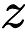
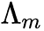
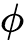
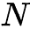
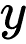
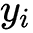
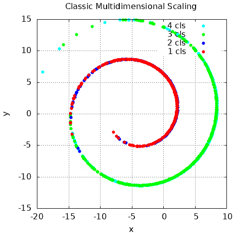

# 6

# 维度缩减

在本章中，我们将讨论多个维度缩减任务。我们将探讨需要维度缩减的条件，并学习如何使用各种库在 C++ 中高效地使用维度缩减算法。维度缩减涉及将高维数据转换成具有较少维度的新的表示形式，同时保留原始数据中最关键的信息。这种转换可以帮助我们可视化多维空间，这在数据探索阶段或识别数据集样本中最相关的特征时可能很有用。如果我们的数据具有较少的特征，某些机器学习（ML）技术可能会表现得更好或更快，因为它们可以消耗更少的计算资源。这种转换的主要目的是保存关键特征——那些在原始数据中包含最关键信息的特征。

本章将涵盖以下主题：

+   维度缩减方法的概述

+   探索用于维度缩减的线性方法

+   探索用于维度缩减的非线性方法

+   使用各种 C++ 库理解维度缩减算法

# 技术要求

本章所需的技术如下：

+   Tapkee 库

+   `Dlib` 库

+   `plotcpp` 库

+   支持 C++20 的现代 C++ 编译器

+   CMake 构建系统，版本 >= 3.24

本章的代码文件可以在以下 GitHub 仓库中找到：[`github.com/PacktPublishing/Hands-on-Machine-learning-with-C-Second-Edition/tree/main/Chapter06`](https://github.com/PacktPublishing/Hands-on-Machine-learning-with-C-Second-Edition/tree/main/Chapter06)。

# 维度缩减方法的概述

维度缩减方法的主要目标是使变换表示的维度与数据的内部维度相对应。换句话说，它应该类似于表达数据所有可能属性所需的最小变量数。降低维度有助于减轻维度诅咒以及其他在高维空间中出现的不可取属性的影响。因此，降低维度可以有效地解决与分类、可视化和压缩高维数据相关的问题。只有在特定数据冗余的情况下才应用维度缩减是有意义的；否则，我们可能会丢失重要信息。换句话说，如果我们能够使用具有相同效率和精度的较小维度数据来解决问题，那么我们的一些数据就是冗余的。维度缩减使我们能够降低解决问题的耗时和计算成本。它还使数据和数据分析的结果更容易解释。

当解决问题所需的信息定性上包含在特定特征子集中时，减少特征的数量是有意义的。非信息性特征是额外噪声的来源，并影响模型参数估计的准确性。此外，具有大量特征的集合可能包含相关变量的组。这种特征组的出现会导致信息重复，这可能会扭曲模型的结果并影响其对参数值的估计能力。

维度约简的方法主要是无监督的，因为我们不知道哪些特征或变量可以从原始数据集中排除而不丢失最重要的信息。

维度约简的一些实际例子包括以下内容：

+   在推荐系统中，维度约简可以用来将用户和项目表示为低维空间中的向量，这使得找到相似的用户或项目变得更容易。

+   在图像识别中，可以应用如**主成分分析**（PCA）之类的维度约简技术，以在保留重要特征的同时减小图像的大小。

+   在文本分析中，维度约简可以用来将大量文档转换为低维表示，这些表示捕获了文档中讨论的主要主题。

维度约简方法可以分为两组：特征选择和创建新的低维特征。这些方法可以根据数据的性质和所使用的数学工具分为**线性**和**非线性**方法。

## 特征选择方法

特征选择方法不会改变变量或特征的初始值；相反，它们从源数据集中移除无关的特征。我们可以使用的某些特征选择方法如下：

+   **缺失值比率**：这种方法基于这样的想法，即缺失许多值的特征应该从数据集中删除，因为它不包含有价值的信息，并且可能扭曲模型性能的结果。因此，如果我们有一些识别缺失值的准则，我们可以计算它们与典型值的比率，并设置一个阈值，我们可以用它来消除具有高缺失值比率的特征。

+   **低方差过滤器**：这种方法用于移除具有低方差的特征，因为这些特征不包含足够的信息来提高模型性能。要应用这种方法，我们需要计算每个特征的方差，按此值升序排序，然后只保留方差值最高的那些特征。

+   **高相关性滤波器**：这种方法基于这样的想法，如果两个特征具有高相关性，那么它们携带相似的信息。此外，高度相关的特征可以显著降低某些机器学习模型的性能，例如线性回归和逻辑回归。因此，这种方法的主要目标是仅保留与目标值高度相关且彼此之间相关性不大的特征。

+   **随机森林**：这种方法可以有效地用于特征选择（尽管它最初并不是为此类任务设计的）。在我们构建森林之后，我们可以通过估计树节点中的不纯度因子来估计哪些特征最重要。这个因子显示了树节点中分裂的独特性度量，并展示了当前特征（随机树仅在节点中使用一个特征来分割输入数据）如何将数据分割成两个不同的桶。然后，这个估计可以跨森林中的所有树进行平均。分割数据比其他特征更好的特征可以被选为最重要的特征。

+   **逆向特征消除和正向特征选择**：这些是用于特征选择的迭代方法。在逆向特征消除中，我们在使用完整特征集训练模型并估计其性能后，逐个移除其特征，并使用减少的特征集重新训练模型。然后，我们比较模型的性能，并决定通过移除特征变化而提高的性能有多少——换句话说，我们正在决定每个特征的重要性。在正向特征选择中，训练过程的方向相反。我们从单个特征开始，然后添加更多。这些方法计算成本非常高，只能用于小型数据集。

## 维度降低方法

维度降低方法将原始特征集转换成新的特征集，通常包含初始数据集中不存在的新特征。这些方法也可以分为两个子类——线性和非线性。非线性方法通常计算成本更高，因此如果我们对特征数据的线性有先验假设，我们可以在初始阶段选择更合适的方法类。

以下章节将描述我们可以用于降维的各种线性和非线性方法。

# 探索降维的线性方法

在本节中，我们将描述用于降维的最流行的线性方法，例如以下内容：

+   PCA

+   **奇异值分解**（**SVD**）

+   **独立成分分析**（**ICA**）

+   **线性判别分析**（**LDA**）

+   因子分析

+   **多维尺度分析**（**MDS**）

## 主成分分析

**主成分分析（PCA**）是将数据降维并投影到特征正交子空间的最直观简单且常用方法之一。在非常一般的形式中，它可以表示为我们所有的观测值看起来都像是原始空间子空间中的某个椭球体。在这个空间中，我们的新基与这个椭球体的轴相一致。这个假设允许我们同时去除强相关特征，因为我们投影它们的空间基向量是正交的。

这个椭球体的维度等于原始空间的维度，但我们的假设是数据位于一个较小维度的子空间中，这使得我们可以丢弃新投影中的其他子空间；即椭球体扩展最少的子空间。我们可以贪婪地这样做，根据我们的新子空间逐个选择新的元素，然后从剩余的维度中依次选择椭球体的最大分散度的轴。

为了将我们的数据维度从降低到，我们需要选择这样一个椭球体的前个轴，并按轴上的分散度降序排列。首先，我们计算原始特征的方差和协方差。这是通过使用**协方差矩阵**来完成的。根据协方差的定义，对于两个符号，和，它们的协方差应该是以下这样：


在这里，是特征的均值。

在这种情况下，我们注意到协方差是对称的，并且向量的协方差等于其分散度。因此，协方差矩阵是一个对称矩阵，其中对应特征的分散度位于对角线上，而对应特征对的协方差位于对角线之外。在矩阵视图中，其中是观测矩阵，我们的协方差矩阵看起来是这样的：


协方差矩阵是多维随机变量中方差的推广——它也描述了随机变量的形状（分布），就像方差一样。矩阵，如线性算子，有特征值和特征向量。它们很有趣，因为当我们对相应的线性空间或用我们的矩阵对其进行变换时，特征向量保持不变，它们只乘以相应的特征值。这意味着它们定义了一个子空间，当我们对它应用线性算子矩阵时，这个子空间保持不变或*进入自身*。形式上，一个特征向量，对于矩阵有一个特征值，被简单地定义为。

我们样本的协方差矩阵！[](img/B19849_Formula_013.png)可以表示为乘积！[](img/B19849_Formula_014.png)。从瑞利关系可以得出，我们的数据集的最大变化可以沿着这个矩阵的特征向量实现，这对应于最大的特征值。对于更高维度的投影也是一样——投影到*m*-维空间上的方差（协方差矩阵）在具有最大特征值的特征向量方向上最大。因此，我们想要将数据投影到的主要成分只是这个矩阵对应于前*k*个特征值的特征向量。

最大的向量方向与回归线相似，通过将我们的样本投影到它上面，我们丢失了信息，类似于回归的残差成员的总和。进行操作！[](img/B19849_Formula_016.png)（向量长度（大小）应等于一），进行投影。如果我们没有单个向量，而是有一个超平面，那么我们不是取向量！[](img/B19849_Formula_017.png)，而是取基向量矩阵！[](img/B19849_Formula_018.png)。得到的向量（或矩阵）是我们观察值的投影数组；也就是说，我们需要将我们的数据矩阵乘以基向量矩阵，我们得到数据的正交投影。现在，如果我们乘以数据矩阵的转置和主成分向量矩阵，我们就可以在将原始样本投影到主成分基上的空间中恢复原始样本。如果成分的数量小于原始空间的维度，我们会丢失一些信息。

## 单值分解

SVD 是一种重要的数据分析方法。从机器学习的角度来看，其结果矩阵分解具有有意义的解释。它还可以用于计算 PCA。SVD 相对较慢。因此，当矩阵太大时，会使用随机算法。然而，SVD 的计算效率比原始 PCA 方法中协方差矩阵及其特征值的计算要高。因此，PCA 通常通过 SVD 来实现。让我们看看。

SVD 的本质很简单——任何矩阵（实数或复数）都可以表示为三个矩阵的乘积：


在这里，是一个阶数为的单位矩阵，而是一个主对角线上的大小为的矩阵，其中包含非负数，称为奇异值（主对角线以外的元素为零——这样的矩阵有时被称为矩形对角矩阵）。是一个阶数为的厄米共轭矩阵。矩阵的列和矩阵的列分别被称为矩阵的左奇异向量和右奇异向量。为了减少维度，矩阵很重要，其元素平方后可以解释为每个成分对联合分布的贡献的方差，并且它们按降序排列：。因此，当我们选择 SVD（如 PCA）中的成分数量时，应该考虑它们的方差之和。

SVD 与 PCA 之间的关系可以用以下方式描述：是给出的协方差矩阵。它是一个对称矩阵，因此它可以被对角化成，其中是一个特征向量矩阵（每一列都是一个特征向量）和是一个对角矩阵，包含特征值，对角线上的值按降序排列。特征向量被称为数据的主轴或主方向。数据在主轴上的投影被称为**主成分**，也称为**主成分得分**。它们是新的变换变量。主成分由的列给出。数据点在新主成分空间中的坐标由的行给出。

通过对执行 SVD，我们得到，其中是一个单位矩阵，而是奇异值对角矩阵，。我们可以观察到，这意味着右奇异向量是主方向，而奇异值与协方差矩阵的特征值通过相关。主成分由给出。

## 独立成分分析

**ICA** 方法被提出作为一种解决**盲信号分离**（**BSS**）问题的方法；也就是说，从混合数据中选择独立信号。让我们看看 BSS 任务的一个例子。假设同一房间里有两人在交谈并产生声波。我们在房间的不同部分放置了两个麦克风，记录声音。分析系统从两个麦克风接收两个信号，每个信号都是两个声波的数字化混合——一个来自说话的人，另一个来自一些其他噪声（例如，播放音乐）。我们的目标是选择来自混合信号的初始信号。从数学上讲，这个问题可以描述如下。我们用线性组合的形式表示进入的混合，其中 表示位移系数， 表示独立成分向量的值：


以矩阵形式，这可以表示如下：


在这里，我们必须找到以下内容：


在这个方程中， 是输入信号值的矩阵， 是位移系数或混合矩阵的矩阵， 是独立成分的矩阵。因此，问题被分为两部分。第一部分是得到原始独立成分变量，，的估计值，。第二部分是找到矩阵，。这种方法的工作原理基于两个原则：

+   独立成分必须是统计独立的（ 矩阵值）。粗略地说，独立成分的一个向量的值不会影响另一个成分的值。

+   独立成分必须具有非高斯分布。

ICA 的理论基础是大数定律，该定律指出， 个独立随机变量的和（平均或线性组合）的分布对于  趋近于高斯分布。特别是，如果  是彼此独立的随机变量，来自具有平均  和方差  的任意分布，那么如果我们把这些变量的均值表示为 ，我们可以说  趋近于均值为 `0` 和方差为 `1` 的高斯分布。为了解决 BSS 问题，我们需要找到矩阵 ，使得 。在这里， 应尽可能接近原始独立源。我们可以将这种方法视为大数定律的逆过程。所有 ICA 方法都基于相同的基本方法——找到一个矩阵 *W*，该矩阵最大化非高斯性，从而最小化  的独立性。

快速 ICA 算法旨在最大化函数 ，其中  是  的组成部分。因此，我们可以将函数的方程重写为以下形式：


在这里， 向量是矩阵 *W* 的第 *i* 行。

ICA 算法执行以下步骤：

1.  它选择 *w* 的初始值。

1.  它计算 ，其中  是函数 *G(z)* 的导数。

1.  它标准化 。

1.  它重复前两个步骤，直到 *w* 停止变化。

为了测量非高斯性，快速 ICA 依赖于一个非二次非线性函数 *G(z)*，它可以采取以下形式：


## 线性判别分析

LDA 是一种多元分析方法，它允许我们同时估计两个或更多组对象之间的差异。判别分析的基础是假设每个 *k* 类对象的描述是服从正态（高斯）分布的多维随机变量的实例，其平均值为 ，协方差矩阵如下：


指数表示特征空间的维度。考虑 LDA 算法在两类情况下的简化几何解释。让判别变量是维欧几里得空间的轴。每个对象（样本）是这个空间中的一个点，其坐标代表每个变量的固定值。如果两个类别在可观察变量（特征）上有所不同，它们可以表示为考虑空间中不同区域的不同点簇，这些区域可能部分重叠。为了确定每个类别的位置，我们可以计算其**质心**，这是一个想象中的点，其坐标是类别中变量（特征）的平均值。判别分析的任务是创建一个额外的轴，它通过点云，使得其投影提供最佳的类别分离（换句话说，它最大化了类别之间的距离）。其位置由一个**线性判别**（**LD**）函数给出，该函数具有权重，这些权重决定了每个初始变量的贡献：


如果我们假设类别 1 和 2 的对象协方差矩阵相等，即，那么 LD（线性判别）的系数向量可以使用公式计算，其中是协方差矩阵的逆，是类别的均值。得到的轴与通过两组类别对象质心的直线方程相一致。广义马氏距离，等于它们在多维特征空间中的距离，估计为。

因此，除了关于类别数据正态（高斯）分布的假设外，这在实践中相当罕见，LDA 对组内散布和协方差矩阵的统计相等性有更强的假设。如果没有显著差异，它们将被组合成一个计算出的协方差矩阵，如下所示：


这个原理可以推广到更多的类别。最终的算法可能看起来像这样：


类间散布矩阵的计算方式如下：


在这里，是所有对象（样本）的平均值，是类别的数量，是第*i*类中的对象数量，是类内均值，是第*i*类的散射矩阵，是一个中心化矩阵，其中是所有 1 的 n x n 矩阵。

基于这些矩阵，计算得到矩阵，其中确定了特征值和相应的特征向量。在矩阵的对角元素中，我们必须选择最大特征值的*s*，并转换矩阵，只留下对应的*s*行。得到的矩阵可以用来将所有对象转换为低维空间。

此方法需要标记数据，这意味着它是一种监督方法。

## 因子分析

**因子分析**用于减少描述数据所使用的变量数量，并确定它们之间的关系。在分析过程中，相互关联的变量被组合成一个因子。结果，组件之间的分散度被重新分配，因子的结构变得更加可理解。在组合变量之后，每个因子内组件之间的相关性高于它们与其他因子组件的相关性。假设已知变量依赖于更少的未知变量，并且我们有一个可以表示为以下形式的随机误差：


在这里，是负荷，是因子。

**因子负荷**的概念至关重要。它用于描述当我们希望从一个新的基中形成特定向量时，因子（变量）所起的作用。因子分析的本质是旋转因子的过程，即根据特定方法重新分配分散度。旋转的目的是定义因子负荷的简单结构。旋转可以是正交的，也可以是斜交的。在旋转的第一种形式中，每个后续因子被确定以最大化从前一个因子中剩余的变异性。因此，因子是相互独立且不相关的。第二种类型是一种因子之间相互关联的转换。大约有 13 种旋转方法在两种形式中都被使用。对新的基的元素有相似影响作用的因子被组合成一个组。然后，从每个组中，建议留下一个代表。一些算法，而不是选择一个代表，通过一些成为该组核心的启发式方法计算一个新的因子。

在过渡到代表群体的因素系统时发生降维，其他因素被丢弃。有几个常用的标准用于确定因素的数量。其中一些标准可以一起使用以相互补充。用于确定因素数量的标准之一是凯撒准则或特征值准则：只选择特征值等于或大于 *一* 的因素。这意味着如果一个因素没有选择至少与一个变量的方差等效的方差，则它被省略。一般的因子分析算法遵循以下步骤：

1.  它计算相关矩阵。

1.  它选择要包含的因素数量，例如，使用凯撒准则。

1.  它提取初始因素集。有几种不同的提取方法，包括最大似然法、主成分分析（PCA）和主轴提取。

1.  它将因素旋转到最终解决方案，该解决方案等于在初始提取中获得的解决方案，但具有最直接的解释。

## 多维尺度分析

当除了相关矩阵外，还可以使用任意类型的对象相似性矩阵作为输入数据时，MDS 可以被视为因子分析的一种替代方法。MDS 不仅仅是一个正式的数学过程，而是一种高效放置对象的方法，从而在新的特征空间中保持它们之间适当的距离。MDS 中新的空间维度总是显著小于原始空间。用于 MDS 分析的数据通常来自对象成对比较矩阵。

主要的 MDS 算法目标是恢复分析特征空间的未知维度，，并按这种方式为每个对象分配坐标，即尽可能使对象之间的计算成对欧几里得距离与指定的成对比较矩阵相吻合。我们谈论的是以正交变换的精度恢复新的降低特征空间的坐标，确保对象之间的成对距离不发生变化。

因此，MDS 方法的目标也可以表述为显示由成对比较矩阵给出的原始多维数据的配置信息。这以低维空间中点的配置形式提供。

经典 MDS 假设未知的坐标矩阵，，可以通过特征值分解，，来表示。可以通过使用双中心化从邻近矩阵 （一个包含样本之间距离的矩阵）计算得出。一般的 MDS 算法遵循以下步骤：

1.  它计算平方邻近矩阵，。

1.  它应用双重中心化，，使用中心化矩阵，，其中是对象的数量。

1.  它确定最大的特征值和相应的特征向量，这些特征向量属于（其中是所需的输出维度数量）。

1.  它计算，其中是的特征向量矩阵，是的特征值对角矩阵。

MDS 方法的缺点是它在计算中使用了欧几里得距离，因此没有考虑到邻近点的分布。如果你发现多维数据位于一个弯曲的流形上，数据点之间的距离可能比欧几里得距离大得多。

既然我们已经讨论了可用于降维的线性方法，让我们来看看存在哪些非线性方法。

# 探索降维的非线性方法

在本节中，我们将讨论广泛使用的非线性方法和算法，这些方法和算法用于降维，例如以下内容：

+   核 PCA

+   Isomap

+   Sammon 映射

+   分布式**随机邻域嵌入**（**SNE**）

+   自动编码器

## 核 PCA

经典的主成分分析（PCA）是一种线性投影方法，当数据线性可分时效果良好。然而，在数据线性不可分的情况下，需要采用非线性方法。处理线性不可分数据的基本思想是将数据投影到一个具有更多维度的空间中，使其变得线性可分。我们可以选择一个非线性映射函数，，使得样本映射，*x*，可以表示为。这被称为**核函数**。术语*核*描述了一个函数，它计算映射（在更高阶空间）样本*x*与的标量积。这个标量积可以解释为新空间中测量的距离。换句话说，函数通过创建原始对象的非线性组合，将原始的*d*-维元素映射到更高维度的*k*-维特征空间。例如，一个在 3D 空间中显示 2D 样本，的函数可能看起来像。

在线性 PCA 方法中，我们关注的是最大化数据集方差的特征成分。我们可以通过根据数据协方差矩阵计算与最大特征值对应的特征向量（主成分）来最大化方差，并将数据投影到这些特征向量上。这种方法可以推广到使用核函数映射到更高维空间的数据。然而，在实践中，多维空间中的协方差矩阵并不是显式计算的，因为我们可以使用一种称为**核技巧**的方法。核技巧允许我们将数据投影到主成分上，而无需显式计算投影，这要高效得多。一般方法如下：

1.  计算等于  的核矩阵。

1.  使其具有零均值值 ，其中  是一个大小为 *N x N* 的矩阵，其元素为 *1/N*。

1.  计算特征值和特征向量 。

1.  按照特征值降序排列特征向量。

1.  选择与最大特征值对应的  个特征向量，其中  是新特征空间的维度数。

这些特征向量是我们数据在对应主成分上的投影。这个过程的主要困难在于选择正确的核函数以及配置其超参数。两种常用的核函数是多项式核  和高斯（径向基函数（RBF））核 。

## Isomap

**Isomap** 算法基于流形投影技术。在数学中，**流形**是一个拓扑空间（通常是一组点及其邻居），在每一点附近局部类似于欧几里得空间。例如，一维流形包括直线和圆，但不包括有自交的图形。二维流形被称为**曲面**；例如，它们可以是球体、平面或环面，但这些曲面不能有自交。例如，圆是一个嵌入到二维空间中的一维流形。在这里，圆的每一段弧在局部上类似于直线段。如果一条三维曲线可以被分成可以嵌入到三维空间中且没有自交的直线段，那么它也可以是一个流形。三维形状如果其表面可以被分成没有自交的平面片，那么它也可以是一个流形。

应用流形投影技术的基本方法是寻找一个接近数据的流形，将数据投影到流形上，然后展开它。用于寻找流形的最流行技术是基于数据点信息构建一个图。通常，这些数据点被放置在图节点中，边模拟数据点之间的关系。

Isomap 算法依赖于两个参数：

+   用于搜索测地距离的邻居数量，

+   最终空间的维度，

简而言之，Isomap 算法遵循以下步骤：

1.  首先，它构建一个表示测地距离的图。对于每个点，我们搜索个最近邻，并从这些最近邻的距离构建一个加权无向图。边权重是到邻居的欧几里得距离。

1.  使用寻找图中最短距离的算法，例如 Dijkstra 算法，我们需要找到每对顶点之间的最短距离。我们可以将这个距离视为流形上的测地距离。

1.  基于我们在上一步中获得的成对测地距离矩阵，训练 MDS 算法。

1.  MDS 算法将维空间中的一组点与初始距离集相关联。

## Sammon 映射

**Sammon 映射**是第一个非线性降维算法之一。与传统降维方法，如 PCA 不同，Sammon 映射并不直接定义数据转换函数。相反，它只确定转换结果（一个较小维度的特定数据集）与原始数据集结构对应的好坏程度。换句话说，它并不试图找到原始数据的最佳转换；相反，它寻找另一个低维数据集，其结构尽可能接近原始数据集。该算法可以描述如下。假设我们有一个维向量，。在这里，向量定义在维空间，，用表示。在维空间中向量的距离将用表示，在维空间中，用表示。为了确定向量之间的距离，我们可以使用任何度量；特别是欧几里得距离。非线性 Sammon 映射的目标是在选择一组向量中搜索，以最小化误差函数，该函数由以下公式定义：


为了最小化误差函数，Sammon 使用了牛顿最小化方法，可以简化如下：


在这里，*η*是学习率。

## 分布式随机近邻嵌入

SNE 问题被表述如下：我们有一个数据集，其中的点由一个多维变量描述，其空间维度远高于三个。有必要获得一个存在于 2D 或 3D 空间的新变量，该变量将最大限度地保留原始数据中的结构和模式。t-SNE 与经典 SNE 之间的区别在于简化寻找全局最小值过程的修改。主要的修改是用 Student 的 t 分布替换低维数据的正态分布。SNE 开始时将点之间的多维欧几里得距离转换为反映点相似性的条件概率。从数学上看，它看起来是这样的：


这个公式显示了点  在以  为中心的正态分布中相对于点  的距离，给定偏差为 。 对于每个点都是不同的。它是这样选择的，使得密度较高的区域中的点比其他区域的点具有更小的方差。

让我们将 (, ) 对的二维或三维映射表示为 (, ) 对。使用相同的公式估计条件概率是必要的。标准差是 :


如果映射点  和  正确模拟了高维原始点  和  之间的相似性，那么相应的条件概率  和  将是等价的。作为一个对  如何反映 、发散或 Kullback-Leibler 距离的明显评估，使用梯度下降法最小化所有映射点之间的这种距离之和。以下公式确定了该方法的损失函数：


它具有以下梯度：


该问题的作者提出了以下物理类比来描述优化过程。让我们想象所有映射点之间都连接着弹簧。连接点  和  的弹簧的刚度取决于多维空间中两点相似性与映射空间中两点相似性之间的差异。在这个类比中，梯度是作用在映射空间中某点的合力。如果我们让系统自由发展，经过一段时间后，它会达到平衡，这就是我们想要的分布。算法上，它会在考虑以下因素的同时寻找平衡：


这里， 是学习率， 是惯性系数。经典 SNE 也允许我们获得良好的结果，但可能会在优化损失函数和拥挤问题时遇到困难。t-SNE 并没有解决这些问题，但使它们更容易管理。

t-SNE 中的损失函数与经典 SNE 的损失函数有两个主要区别。第一个区别是它在多维空间中具有对称的相似性形式和更简单的梯度版本。其次，对于映射空间中的点，不是使用高斯分布，而是使用 t 分布（学生分布）。

## 自编码器

**自编码器**代表一类特定的神经网络，其配置使得自编码器的输出尽可能接近输入信号。在其最直接的表现形式中，自编码器可以被建模为一个多层感知器，其中输出层的神经元数量等于输入的数量。以下图表显示，通过选择一个较小维度的中间隐藏层，我们可以将源数据压缩到较低维度。通常，这个中间层的值是自编码器的一个结果：


图 6.1 – 自编码器架构

现在我们已经了解了可用于降维的线性和非线性方法，并详细探讨了每种方法的组成部分，我们可以借助一些实际示例来增强我们的降维实现。

# 使用各种 C++ 库理解降维算法

让我们看看如何在实践中使用降维算法。所有这些示例都使用相同的数据集，该数据集包含四个经过瑞士卷映射（）转换的通常分布的二维点集，进入三维空间。您可以在本书的 GitHub 仓库中找到数据集和相关细节：[`github.com/PacktPublishing/Hands-on-Machine-learning-with-C-Second-Edition`](https://github.com/PacktPublishing/Hands-on-Machine-learning-with-C-Second-Edition)。以下图表显示了这种映射的结果。


图 6.2 – 瑞士卷数据集

此数据集已标记。每个通常分布的部分都有自己的标签，我们可以在结果中看到这些标签以某种颜色表示。我们使用这些颜色来显示以下示例中我们将使用的每个算法的转换结果。这让我们对算法的工作原理有了概念。以下部分提供了如何使用 `Dlib`、`Tapkee` 和其他库的具体示例。

## 使用 Dlib 库

`Dlib` 库中有三种降维方法——两种线性方法，称为 PCA 和 LDA，以及一种非线性方法，称为 Sammon 映射。

### PCA

PCA 是最受欢迎的降维算法之一，在`Dlib`库中有几个实现。有`Dlib::vector_normalizer_pca`类型，可以用于对用户数据进行 PCA 操作。这种实现也进行了数据归一化。在某些情况下，这种自动归一化是有用的，因为我们总是必须对归一化的数据进行 PCA。这种类型的对象应该用输入数据样本类型进行参数化。在我们实例化这种类型的对象之后，我们使用`train()`方法将模型拟合到我们的数据。`train()`方法接受`std::vector`作为样本，以及`eps`值作为参数。`eps`值控制 PCA 变换后应该保留多少维度。这可以在以下代码中看到：

```py
void PCAReduction(const std::vector<Matrix> &data, double target_dim) {
  // instantiante the PCA algorithm object.
  Dlib::vector_normalizer_pca<Matrix> pca;
  // train the PCA algorithm
  pca.train(data, target_dim / data[0].nr());
  // apply trained algorithm to the new data
  std::vector<Matrix> new_data;
  new_data.reserve(data.size());
  for (size_t i = 0; i < data.size(); ++i) {
    new_data.emplace_back(pca(data[i]));
  }
  // example how to get transformed values
  for (size_t r = 0; r < new_data.size(); ++r) {
    Matrix vec = new_data[r];
    double x = vec(0, 0);
    double y = vec(1, 0);
  }
```

在算法训练完成后，我们使用该对象来转换单个样本。看看代码中的第一个循环，注意`pca([data[i]])`调用是如何执行这种转换的。

以下图表显示了 PCA 变换的结果：


图 6.3 – Dlib PCA 变换可视化

#### PCA 数据压缩

我们可以使用降维算法来完成一个稍微不同的任务——具有信息损失的数据压缩。当将 PCA 算法应用于图像时，这可以很容易地演示。让我们使用 SVD 分解从头实现 PCA，使用`Dlib`库。我们不能使用现有的实现，因为它以我们无法完全控制的方式进行归一化。

首先，我们需要加载一个图像并将其转换为矩阵形式：

```py
void PCACompression(const std::string& image_file, long target_dim) {
  array2d<Dlib::rgb_pixel> img;
  load_image(img, image_file);
  array2d<unsigned char> img_gray;
  assign_image(img_gray, img);
  save_png(img_gray, "original.png");
  array2d<DataType> tmp;
  assign_image(tmp, img_gray);
  Matrix img_mat = Dlib::mat(tmp);
  img_mat /= 255.;  // scale
  std::cout << "Original data size " << img_mat.size() <<
  std::endl;
```

在我们加载 RGB 图像后，我们将其转换为灰度图，并将其值转换为浮点数。下一步是将图像矩阵转换为可用于 PCA 训练的样本。这可以通过使用`Dlib::subm()`函数将图像分割成 8 x 8 大小的矩形块，然后使用`Dlib::reshape_to_column_vector()`函数将它们展平来完成：

```py
std::vector<Matrix> data;
int patch_size = 8;
for (long r = 0; r < img_mat.nr(); r += patch_size) {
  for (long c = 0; c < img_mat.nc(); c += patch_size) {
    auto sm =
      Dlib::subm(img_mat, r, c, patch_size, patch_size);
      data.emplace_back(Dlib::reshape_to_column_vector(sm));
  }
}
```

当我们有了我们的样本后，我们可以通过减去平均值并除以它们的标准差来对它们进行归一化。我们可以通过将我们的样本向量转换为矩阵类型来使这些操作向量化。我们使用`Dlib::mat()`函数来完成这个操作：

```py
// normalize data
auto data_mat = mat(data);
Matrix m = mean(data_mat);
Matrix sd = reciprocal(sqrt(variance(data_mat)));
matrix<decltype(data_mat)::type, 0, 1,
       decltype(data_mat)::mem_manager_type>
    x(data_mat);
for (long r = 0; r < x.size(); ++r)
    x(r) = pointwise_multiply(x(r) - m, sd);
```

在我们准备好的数据样本之后，我们使用`Dlib::covariance()`函数计算协方差矩阵，并使用`Dlib::svd()`函数执行奇异值分解。SVD 的结果是特征值矩阵和特征向量矩阵。我们根据特征值对特征向量进行排序，并只留下对应于最大特征值的小部分特征向量（在我们的例子中，是 10 个）。我们留下的特征向量数量是新特征空间的维度数：

```py
Matrix temp, eigen, pca;
// Compute the svd of the covariance matrix
Dlib::svd(covariance(x), temp, eigen, pca);
Matrix eigenvalues = diag(eigen);
rsort_columns(pca, eigenvalues);
// leave only required number of principal components
pca = trans(colm(pca, range(0, target_dim)));
```

我们的主成分分析转换矩阵被称为`pca`。我们使用它通过简单的矩阵乘法来降低每个样本的维度。看看以下循环并注意`pca * data[i]`操作：

```py
// dimensionality reduction
std::vector<Matrix> new_data;
size_t new_size = 0;
new_data.reserve(data.size());
for (size_t i = 0; i < data.size(); ++i) {
  new_data.emplace_back(pca * data[i]);
  new_size += static_cast<size_t>(new_data.back().size());
}
std::cout << "New data size "
          << new_size + static_cast<size_t>(pca.size())
          << std::endl;
```

我们的数据已经被压缩，我们可以在控制台输出中看到其新的大小。现在，我们可以恢复数据的原始维度以便查看图像。为此，我们需要使用转置的 PCA 矩阵来乘以减少的样本。此外，我们需要对恢复的样本进行反归一化以获取实际的像素值。这可以通过乘以标准差并加上我们从上一步骤中得到的均值来完成：

```py
auto pca_matrix_t = Dlib::trans(pca);
Matrix isd = Dlib::reciprocal(sd);
for (size_t i = 0; i < new_data.size(); ++i) {
    Matrix sample = pca_matrix_t * new_data[i];
    new_data[i] = Dlib::pointwise_multiply(sample, isd) + m;
}
```

在我们恢复像素值后，我们将它们重塑并放置在图像的原始位置：

```py
size_t i = 0;
    for (long r = 0; r < img_mat.nr(); r += patch_size) {
        for (long c = 0; c < img_mat.nc(); c += patch_size)
        {
            auto sm = Dlib::reshape(new_data[i],
                patch_size, patch_size);
                Dlib::set_subm(img_mat, r, c, patch_size,
                    patch_size) = sm;
                    ++i;
        }
    }
    img_mat *= 255.0;
    assign_image(img_gray, img_mat);
    equalize_histogram(img_gray);
    save_png(img_gray, "compressed.png");
}
```

让我们看看压缩在图像处理中广泛使用的标准测试图像的结果。以下是一个 512 x 512 像素的 Lena 图像：


图 6.4 – 压缩前的原始图像

其原始灰度大小为 262,144 字节。在我们仅使用 10 个主成分进行 PCA 压缩后，其大小变为 45,760 字节。我们可以在以下图表中看到结果：


图 6.5 – 压缩后的图像

在这里，我们可以看到，尽管压缩率很高，但大部分重要的视觉信息都被保留了。

### LDA

`Dlib`库也实现了 LDA 算法，可用于降维。它是一个监督算法，因此需要标记的数据。此算法通过`Dlib::compute_lda_transform()`函数实现，该函数接受四个参数。第一个参数是输入/输出参数——作为输入，它用于传递输入训练数据（以矩阵形式），作为输出，它接收 LDA 转换矩阵。第二个参数是均值值的输出。第三个参数是输入数据的标签，第四个参数是期望的目标维度数。以下代码展示了如何使用`Dlib`库中的 LDA 进行降维的示例：

```py
void LDAReduction(const Matrix &data,
                  const std::vector<unsigned long> &labels,
                  unsigned long target_dim) {
  Dlib::matrix<DataType, 0, 1> mean;
  Matrix transform = data;
  // Apply LDA on input data,
  // result with will be in the "transform object"
  Dlib::compute_lda_transform(transform, mean, labels,
                              target_dim);
  // Apply LDA "transform" to the input "data"
  for (long r = 0; r < data.nr(); ++r) {
    Matrix row =
        transform * Dlib::trans(Dlib::rowm(data, r)) - mean;
    double x = row(0, 0);
    double y = row(1, 0);
  }
}x`
```

在算法训练后执行实际的 LDA 转换，我们将样本与 LDA 矩阵相乘。在我们的情况下，我们还对它们进行了转置。以下代码展示了此示例的关键部分：

```py
transform * Dlib::trans(Dlib::rowm(data, r))
```

以下图表显示了在两个组件上使用 LDA 降维的结果：


图 6.6 – Dlib LDA 转换可视化

在以下块中，我们将看到如何使用来自`Dlib`库的 Sammon 映射降维算法实现。

### Sammon 映射

在 `Dlib` 库中，Sammon 映射是通过 `Dlib::sammon_projection` 类型实现的。我们需要创建此类型的实例，然后将其用作功能对象。功能对象调用参数是我们需要转换的数据和新的特征空间维度数。输入数据应以 `std::vector` 的形式提供，其中包含单个 `Dlib::matrix` 类型的样本。所有样本应具有相同数量的维度。使用此功能对象的结果是一个具有减少维度数的新样本向量：

```py
void SammonReduction(const std::vector<Matrix> &data, long target_dim) {
  Dlib::sammon_projection sp;
  auto new_data = sp(data, target_dim);
  for (size_t r = 0; r < new_data.size(); ++r) {
    Matrix vec = new_data[r];
    double x = vec(0, 0);
    double y = vec(1, 0);
  }
}
```

以下图表显示了使用此降维算法的结果：


图 6.7 – Dlib Sammon 映射变换可视化

在下一节中，我们将学习如何使用 Tapkee 库来解决降维任务。

## 使用 Tapkee 库

Tapkee 库包含许多降维算法，包括线性和非线性算法。这是一个仅包含头文件的 C++ 模板库，因此不需要编译，可以轻松集成到您的应用程序中。它有几个依赖项：用于格式化输出的 `fmt` 库和作为数学后端的 Eigen3。

在这个库中没有为算法设置特殊类，因为它提供了一个基于参数的统一 API 来构建降维对象。因此，使用这种方法，我们可以定义一个函数，该函数将接受一组参数和高度数据输入，并执行降维。结果将是一个二维图。以下代码示例展示了其实现：

```py
void Reduction(tapkee::ParametersSet parameters,
               bool with_kernel,
               const tapkee::DenseMatrix& features,
               const tapkee::DenseMatrix& lables,
               const std::string& img_file) {
  using namespace tapkee;
  // define the kernel callback object,
  // that will be applied to the input "features"
  gaussian_kernel_callback kcb(features, 2.0);
  // define distance callback object,
  // that will be applied to the input "features"
  eigen_distance_callback dcb(features);
  // define the feature access callback object
  eigen_features_callback fcb(features);
  // save the initial features indices order
  auto n = features.cols();
  std::vector<int> indices(n);
  for (int i = 0; i < n; ++i) indices[i] = i;
  TapkeeOutput result;
  if (with_kernel) {
    // apply feature transformation with kernel function
    result =
        initialize()
            .withParameters(parameters)
            .withKernel(kcb)
            .withFeatures(fcb)
            .withDistance(dcb)
            .embedRange(indices.begin(), indices.end());
  } else {
    // apply features transformation without kernel
    // //function
    result =
        initialize()
            .withParameters(parameters)
            .withFeatures(fcb)
            .withDistance(dcb)
            .embedRange(indices.begin(), indices.end());
  }
  // create helper object for transformed data
  // //visualization result
  Clusters clusters;
  for (index_t i = 0; i < result.embedding.rows(); ++i) {
    // get a transformed feature
    auto new_vector = result.embedding.row(i);
    // populate visualization helper structure
    auto label = static_cast<int>(lables(i));
    clusters[label].first.push_back(new_vector[0]);
    clusters[label].second.push_back(new_vector[1]);
  }
  // Visualize dimensionality reduction result
  PlotClusters(clusters,
               get_method_name(parameters[method]),
               img_ file);
}
```

这是我们将使用的单个函数，通过它我们可以看到 Tapkee 库中的几个算法。它接受的主要参数是 `tapkee::ParametersSet`；这种类型的对象可以用降维方法类型、目标维度数和一些配置所选方法的特殊参数进行初始化。`with_kernel` 参数指定此函数是否将核变换附加到算法管道中。库 API 允许您为任何算法附加核变换，但它只有在算法实现使用它时才会被使用。在我们的情况下，我们只将其用于 `KernelPCA` 方法。降维函数的最后一个参数是输入数据、绘图标签和输出文件名。

让我们来看看实现。首先，我们定义了一个方法管道的回调函数。有高斯核回调、线性距离回调和特征回调。请注意，所有这些回调对象都是用输入数据初始化的。这样做是为了减少管道中的数据复制。库 API 要求回调对象能够为两个数据索引产生一些结果。这些回调对象应该实现获取访问原始数据的功能。因此，我们所有的回调都是基于库定义的类构建的，并存储对原始数据容器的引用。`tapkee::DenseMatrix`只是 Eigen3 密集矩阵的一个 typedef。另一个重要的事情是索引映射的使用，用于数据访问，例如`indices`变量；它允许您更灵活地使用数据。以下片段显示了降维对象创建和应用：

```py
initialize().
withParameters(parameters).
withKernel(kcb).
withFeatures(fcb).
withDistance(dcb).
embedRange(indices.begin(), indices.end());
```

您可以看到 API 是一致的，执行配置的构建函数以`with`字开头。最初，我们将参数传递给构建函数，然后是三个回调函数，最后调用执行实际降维的`embedRange`方法。`eigen_features_callback`用于通过索引访问特定的数据值，而`eigen_distance_callback`在有些算法中用于测量项目向量的距离；在我们的例子中，它只是欧几里得距离，但您可以定义任何需要的。

在函数的最后部分，`Clusters`对象被填充了新的 2D 坐标和标签。然后，使用此对象来绘制降维结果。应用了之前章节中的绘图方法。

在以下小节中，我们将学习如何使用我们的通用函数来应用不同的降维方法。这些方法如下：

+   PCA

+   核心 PCA

+   MDS

+   Isomap

+   因子分析

+   t-分布 SNEs

### PCA

在拥有降维的一般函数后，我们可以用它来应用不同的方法。以下代码展示了如何创建一个参数集来配置 PCA 方法：

```py
bool with_kernel = false;
Reduction((method = PCA, target_dimension = target_dim),
          with_kernel, input_data, labels_data,
          "pca-tapkee.png");
```

第一个参数是`tapkee::ParametersSet`类型对象的初始化。我们使用了`tapkee::PCA`枚举值并指定了目标维度的数量。此外，我们没有使用核函数。`input_data`和`labels_data`是从文件中加载的输入数据，这些变量具有`tapkee::DenseMatrix`类型，实际上就是 Eigen3 密集矩阵。最后一个参数是用于绘图图像的输出文件名。

以下图表显示了将 Tapkee PCA 实现应用于我们的数据的结果：


图 6.8 – Tapkee PCA 变换可视化

您可以看到这种方法无法在 2D 空间中从空间上分离我们的 3D 数据。

### 核心 PCA

在 Tapkee 库中，PCA 的非线性版本也得到了实现。要使用此方法，我们定义核方法并将其作为回调传递给库 API 的 `withKernel` 构建方法。我们已经在我们的通用函数中做到了这一点，所以我们唯一要做的就是将 `with_kernel` 参数设置为 `true`。我们使用了高斯核，其定义如下：


在这里，*ᵧ* 是销售系数，可以估计为项目差异的中位数，或者手动配置。核回调函数定义如下：

```py
struct gaussian_kernel_callback {
  gaussian_kernel_callback(
      const tapkee::DenseMatrix& matrix,
      tapkee::ScalarType gamma)
      : feature_ matrix(matrix), gamma(gamma){};
  inline tapkee::ScalarType kernel(
      tapkee::IndexType a, tapkee::IndexType b) const {
    auto distance =
        (feature_matrix.col(a) – feature_matrix.col(b))
            .norm();
    return exp(-(distance * distance) * gamma);
  }
  inline tapkee::ScalarType operator()(
      tapkee::IndexType a, tapkee::IndexType b) const {
    return kernel(a, b);
  }
  const tapkee::DenseMatrix& feature_matrix;
  tapkee::ScalarType gamma{1};
}
```

`Tapkee` 要求您定义名为 `kernel` 的方法和函数操作符。我们的实现非常简单；这里的主要特性是将特定数据的引用存储为成员。这样做是因为库将仅使用索引来调用核运算符。对我们通用函数的实际调用如下：

```py
bool with_kernel = true;
Reduction((method = KernelPCA, target_dimension = target_dim), 
                      with_kernel, input_data, labels_data,
                      "kernel-pca-tapkee.png");
```

下面的图表显示了将 Tapkee 核 PCA 实现应用于我们的数据的结果：


图 6.9 – Tapkee 核 PCA 变换可视化

我们可以看到，这种核函数使得数据的一些部分被分离出来，但其他部分也被过度简化了。

### MDS

要使用 MDS 算法，我们只需将方法名称传递给我们的通用降维函数。对于此算法，没有其他可配置的参数。以下示例显示了如何使用此方法：

```py
Reduction((method = MultidimensionalScaling,
                    target_dimension = target_dim),
           false, input_data, labels_data, "mds-tapkee.png";
```

下面的图表显示了将 Tapkee MDS 算法应用于我们的数据的结果：



图 6.10 – Tapkee MDS 变换可视化

您可以看到，结果与 PCA 算法非常相似，并且存在相同的问题，即该方法无法在 2D 空间中空间分离我们的数据。

### Isomap

Isomap 方法可以按以下方式应用于我们的数据：

```py
Reduction((method = Isomap, target_dimension = target_dim,
                            num_neighbors =100),
           false, input_data, labels_data, "isomap-tapkee.png");
```

除了方法名称和目标维度外，还传递了 `num_neighbors` 参数。这是 `Isomap` 算法将使用的最近邻值的数量。

下面的图表显示了将 Tapkee Isomap 实现应用于我们的数据的结果：


图 6.11 – Tapkee Isomap 变换可视化

您可以看到，这种方法可以在 2D 空间中空间分离我们的数据，但簇彼此之间太近。此外，您还可以调整邻居参数的数量以获得另一种分离。

### 因子分析

因子分析方法可以按以下方式应用于我们的数据：

```py
Reduction((method = FactorAnalysis,
           target_dimension = target_dim,
           fa_epsilon = 10e-5, max_iteration = 100),
          false, input_data, labels_data,
          "isomap-tapkee.png");
```

除了方法名称和目标维度外，还可以传递 `fa_epsilon` 和 `max_iteration` 参数。`fa_epsilon` 用于检查算法的收敛性。

下面的图表显示了将 Tapkee 因子分析实现应用于我们的数据的结果：


图 6.12 – Tapkee 因子分析变换可视化

这种方法也未能清楚地在我们数据的 2D 空间中分离我们的数据。

### t-SNE

t-SNE 方法可以按以下方式应用于我们的数据：

```py
Reduction((method = tDistributedStochasticNeighborEmbedding,
           target_dimension = target_dim,
           sne_perplexity = 30),
          false, input_data, labels_data,
          "tsne-tapkee.png");
```

除了方法名称和目标维度外，还指定了`sne_perplexity`参数。此参数调节算法收敛。此外，您还可以更改`sne_theta`值，这是学习率。

下面的图表显示了将 Tapkee t-SNE 实现应用于我们的数据的结果：


图 6.13 – Tapkee t-SNE 变换可视化

您可以看到，这种方法在我们的 2D 空间中给出了最合理的数据分离；所有簇之间都有明显的界限。

# 摘要

在本章中，我们了解到降维是将具有更高维度的数据转移到具有较低维度的数据新表示的过程。它用于减少数据集中相关特征的数量并提取最有信息量的特征。这种转换可以帮助提高其他算法的性能，减少计算复杂度，并生成人类可读的可视化。

我们了解到解决这个任务有两种不同的方法。一种方法是特征选择，它不会创建新的特征，而第二种方法是降维算法，它会创建新的特征集。我们还了解到降维算法有线性和非线性之分，我们应该根据我们的数据选择其中一种类型。我们看到了许多具有不同特性和计算复杂度的不同算法，尝试不同的算法来查看哪些是特定任务的最好解决方案是有意义的。请注意，不同的库对相同的算法有不同的实现，因此即使对于相同的数据，它们的结果也可能不同。

降维算法的领域是一个持续发展的领域。例如，有一个名为**统一流形逼近与投影**（**UMAP**）的新算法，它基于黎曼几何和代数拓扑。它在可视化质量方面与 t-SNE 算法竞争，但在变换完成后也保留了更多原始数据的全局结构。它也具有更高的计算效率，这使得它适合大规模数据集。然而，目前还没有 C++的实现。

在下一章中，我们将讨论分类任务及其解决方法。通常，当我们需要解决一个分类任务时，我们必须将一组对象划分为几个子组。这些子组中的对象具有一些共同属性，这些属性与其他子组的属性不同。

# 进一步阅读

+   维度降低技术综述：[`arxiv.org/pdf/1403.2877.pdf`](https://arxiv.org/pdf/1403.2877.pdf)

+   维度降低的简短教程：[`www.math.uwaterloo.ca/~aghodsib/courses/f06stat890/readings/tutorial_stat890.pdf`](https://www.math.uwaterloo.ca/~aghodsib/courses/f06stat890/readings/tutorial_stat890.pdf)

+   12 种维度降低技术指南（附带 Python 代码）：[`www.analyticsvidhya.com/blog/2018/08/dimensionality-reduction-techniques-python/`](https://www.analyticsvidhya.com/blog/2018/08/dimensionality-reduction-techniques-python/)

+   协方差矩阵的几何和直观解释及其与线性变换的关系，这是理解和使用 PCA 和 SVD 的必要构建块：[`datascienceplus.com/understanding-the-covariance-matrix`](https://datascienceplus.com/understanding-the-covariance-matrix)

+   核技巧：[`dscm.quora.com/The-Kernel-Trick`](https://dscm.quora.com/The-Kernel-Trick)
