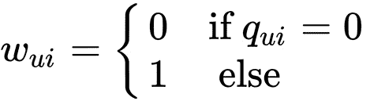
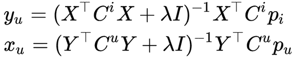
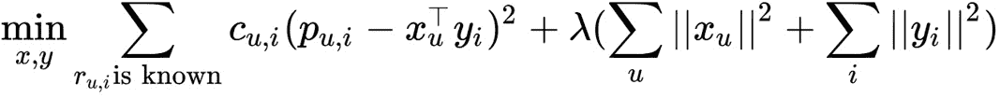

# 8

# 推荐系统

推荐系统是设计用来使用数据预测用户可能感兴趣的对象（商品或服务）的算法、程序和服务。主要有两种类型的推荐系统：*基于内容的*和*协同过滤*。**基于内容的推荐系统**基于从特定产品收集的数据。它们向用户推荐与用户之前获取或表现出兴趣的对象相似的对象。**协同过滤推荐系统**根据其他类似用户的反应历史过滤掉用户可能喜欢的对象。它们通常还会考虑用户的先前反应。

在本章中，我们将学习如何根据内容和协同过滤实现推荐系统算法。我们将讨论实现协同过滤算法的不同方法，使用仅包含线性代数库的系统实现系统，并学习如何使用`mlpack`库解决协同过滤问题。我们将使用明尼苏达大学计算机科学与工程学院一个研究实验室提供的 MovieLens 数据集：`grouplens.org/datasets/movielens/`。

本章将涵盖以下主题：

+   推荐系统算法概述

+   理解协同过滤方法

+   基于 C++的基于物品的协同过滤示例

# 技术要求

为了完成本章，你需要以下内容：

+   `Eigen`库

+   `Armadillo`库

+   `mlpack`库

+   支持 C++20 的现代 C++编译器

+   CMake 构建系统版本 >= 3.10

本章的代码文件可以在本书的 GitHub 仓库中找到：`github.com/PacktPublishing/Hands-On-Machine-Learning-with-C-Second-Edition/tree/main/Chapter08`。

# 推荐系统算法概述

推荐系统的任务是通知用户在特定时间可能对他们最有兴趣的对象。通常，这样的对象是产品或服务，但它也可能是信息——例如，以推荐新闻文章的形式。

在我们深入探讨推荐系统的技术细节之前，让我们看看一些实际场景，在这些场景中，推荐系统被用来改善用户体验并增加销售额。以下是最常见的应用：

+   推荐系统帮助在线零售商根据客户的过去购买、浏览历史和其他数据建议可能感兴趣的产品。这有助于客户更容易地找到相关产品，并增加转换的可能性。

+   音乐和视频流媒体服务使用推荐系统根据用户的收听或观看历史推荐音乐或视频。目标是提供个性化的内容推荐，以保持用户对平台的参与度。

+   社交媒体平台如 Meta 和 Instagram 使用推荐系统向用户展示他们可能感兴趣的朋友和页面内容。这有助于保持用户活跃并花费更多时间在平台上。

+   广告商利用推荐系统，根据他们的兴趣、人口统计和行为，针对特定受众投放广告。这提高了广告活动的有效性。

+   新闻网站、博客和搜索引擎利用推荐系统，根据用户偏好和搜索历史推荐文章、故事或搜索结果。

+   推荐系统可以根据患者数据和医学研究，建议治疗方案、药物或医疗程序。

+   旅行网站和酒店预订平台利用推荐系统，根据旅行者的偏好、预算和旅行历史，推荐旅行目的地、住宿和活动。

+   教育平台和在线课程利用推荐系统，根据学生的表现、兴趣和目标，推荐课程、材料和学习路径，以实现个性化学习体验。

+   视频游戏平台利用推荐系统，根据玩家的偏好、游戏风格和游戏历史推荐游戏。

这些只是推荐系统在实际场景中应用的一些例子。它们已成为企业寻求提高客户参与度、增加销售额和提供个性化体验的必备工具。

尽管存在许多现有算法，我们仍然可以将推荐系统分为几种基本方法。最常见的方法如下：

+   **基于总结**：基于平均产品评分的非个性化模型

+   **基于内容**：基于产品描述与用户兴趣交集的模型

+   **协同过滤**：基于相似用户群体兴趣的模型

+   **矩阵分解**：基于偏好矩阵分解的方法

任何推荐系统的基础是偏好矩阵。它将服务的所有用户放在一个轴上，推荐对象放在另一个轴上。推荐对象通常被称为**项目**。在行和列（用户、项目）的交叉处，这个矩阵填充了表示用户对产品的兴趣的评分，这些评分是在给定的尺度上表达的（例如，从 1 到 5），如下表所示：

|  | **item1** | **item 2** | **item3** |
| --- | --- | --- | --- |
| user1 | 1 |  |  |
| user2 |  | 2 | 4 |
| user3 | 1 | 1 | 1 |
| user4 |  |  | 5 |
| user5 | 3 | 1 |  |
| user6 |  | 4 |  |

表 8.1 – 用户兴趣计数

用户通常只评估目录中少量项目；推荐系统的任务是总结这些信息并预测用户可能对其他项目的态度。换句话说，你需要填写前面表格中的所有空白单元格。

人们的消费模式各不相同，不必总是推荐新产品。您可以在用户需要再次购买某物时展示重复的物品——例如，当用户购买了一些他们将来还会需要的东西时。根据这一原则，存在两类物品：

+   **可重复的**：例如，洗发水或剃须刀，总是需要使用的

+   **不可重复的**：例如，书籍或电影，很少会重复购买

如果产品不能归入这些类别之一，那么确定重复购买的产品类型就很有意义（有人通常只购买特定品牌的产品，但其他人可能会尝试目录中的所有产品）。

确定什么产品会吸引用户也是主观的。一些用户只需要他们最喜欢的类别的物品（保守型推荐），而其他人则对非标准商品（风险型推荐）反应更强烈。例如，一个视频托管服务可能只会推荐他们最喜欢的电视剧的新系列（保守型），但可能会定期推荐新的节目或新的类型。理想情况下，您应该使用客户偏好的泛化信息，为每个客户分别选择显示推荐策略。

用于构建推荐模型的必要数据集部分是用户对不同对象或物品的反应。这些反应通常被称为对象的用户评分。我们可以通过以下方式获取用户评分：

+   **显式评分**：用户对产品进行评分，留下评论，或*点赞*页面。

+   **隐式评分**：用户没有表达他们的态度，但可以从他们的行为中得出间接结论。例如，如果他们购买了一个产品，这意味着他们喜欢它；如果他们长时间阅读描述，这意味着他们有浓厚的兴趣。

当然，显式偏好更好。然而，在实践中，并非所有服务都允许用户清楚地表达他们的兴趣，并非所有用户都有此愿望。这两种评估类型通常同时使用，并且很好地相互补充。

区分术语*预测*（预测兴趣程度）和*推荐*本身（展示推荐）也是非常重要的。如何展示是一个独立于*展示什么*的任务。*如何展示*是一个使用预测步骤中获得的估计的任务，并且可以以不同的方式实现。

在本节中，我们讨论了推荐系统的基础知识。在接下来的章节中，我们将探讨推荐系统的基本构建块。让我们首先看看基于内容的过滤、基于用户和物品的协同过滤以及基于矩阵分解的协同过滤的主要原则。

## 非个性化推荐

对于非个性化推荐，用户的潜在兴趣由产品的平均评分决定：*如果每个人都喜欢它，你也会喜欢它*。根据这个原则，大多数服务在用户未在系统上授权时工作。

## 基于内容的推荐

个人推荐使用关于用户可用的最大信息——主要是他们之前购买的信息。基于内容的过滤是用于个性化推荐最早开发的方法之一。在这种方法中，产品的描述（内容）与用户的兴趣进行比较，这些兴趣是从他们之前的评估中获得的。产品越能满足这些兴趣，用户的潜在兴趣就越高。这里的一个明显要求是，目录中的所有产品都应该有描述。

从历史上看，基于内容的推荐的主题是具有无结构描述的产品：电影、书籍或文章。它们的特征可能是，例如，文本描述、评论或演员阵容。然而，没有任何东西阻止使用常规的数值或分类特征。

无结构特征以文本典型的方式进行描述——词空间中的向量（向量空间模型）。向量的每个元素都是一个特征，它可能表征了用户的兴趣。同样，一个项目（产品）是这个空间中的向量。

当用户与系统互动时（例如，他们购买电影），他们购买的商品的向量描述会合并（求和并归一化）成一个单一的向量，从而形成用户兴趣的向量。使用这个兴趣向量，我们可以找到与它最接近的产品和描述——即，我们可以解决寻找最近邻的问题。

在形成产品展示的向量空间时，你不仅可以使用单个单词，还可以使用 shingles 或 n-grams（连续的单词对、三词组或其他数量的单词）。这种方法使模型更加详细，但需要更多的数据进行训练。

在产品描述的不同位置，关键词的权重可能不同（例如，电影的描述可能包括标题、简短描述和详细描述）。来自不同用户的商品描述可以有不同的权重。例如，我们可以给评分多的活跃用户更多的权重。同样，你也可以按项目来权衡。一个对象的平均评分越高，其权重就越大（类似于 PageRank）。如果产品描述允许链接到外部来源，那么你还可以分析与产品相关的所有第三方信息。

余弦距离常用于比较产品表示向量。这个距离衡量了两个向量之间接近度的值。

在添加新的评估时，兴趣向量会增量更新（仅针对那些发生变化的元素）。在更新过程中，由于用户的偏好可能会改变，因此给予新的估计更多权重是有意义的。你会注意到基于内容的过滤几乎完全重复了搜索引擎如 Google 所使用的查询-文档匹配机制。唯一的区别在于搜索查询的形式——内容过滤系统使用描述用户兴趣的向量，而搜索引擎使用请求文档的关键词。当搜索引擎开始添加个性化时，这种区别被进一步抹去。

## 基于用户的协同过滤

这类系统在 90 年代开始发展。在这种方法下，推荐是基于其他相似用户的兴趣生成的。这种推荐是许多用户**协作**的结果，因此得名该方法。

算法的经典实现基于**k 最近邻**（**kNN**）的原则。对于每个用户，我们寻找与他们最相似的前**k**个（就偏好而言）。然后，我们使用已知的数据补充用户的信息。例如，如果已知你的邻居对一部电影感到非常满意，而你由于某种原因没有看过，这是一个很好的推荐这部电影的理由。

在这种情况下，相似性是兴趣**相关性**的同义词，可以从许多方面考虑——皮尔逊相关系数、余弦距离、Jaccard 距离、汉明距离以及其他类型的距离。

算法的经典实现有一个明显的缺点——由于计算的二次复杂性，它在实践中应用得不好。与任何最近邻方法一样，它需要计算用户之间的所有成对距离（可能有数百万用户）。很容易计算出计算距离矩阵的复杂度是 ，其中  是用户的数量，而  是物品（商品）的数量。

通过购买高性能硬件可以部分缓解这个问题。但如果你明智地处理，那么最好是以下这种方式对算法进行一些修正：

+   不要在每次购买时更新距离，而是以批量（例如，每天一次）更新

+   不要完全重新计算距离矩阵，而是增量更新

+   选择一些迭代和近似算法（例如，**交替最小二乘法**（**ALS**））

满足以下假设可以使算法更加实用：

+   人们的品味不会随时间改变（或者它们会改变，但每个人都是相同的）

+   如果人们的品味相同，那么他们在所有事情上都是相同的

例如，如果两个客户喜欢相同的电影，那么他们也会喜欢相同的书籍。当推荐的产品是同质化的（例如，仅限电影）时，这种假设通常是成立的。如果情况不是这样，那么一对客户可能有相同的饮食习惯，但他们的政治观点可能正好相反；在这种情况下，算法的效率较低。

我们分析以生成新推荐的偏好空间中的用户邻域（用户的邻居），可以选择不同的方式。我们可以与系统中的所有用户一起工作；我们可以设置一个特定的接近度阈值；我们可以随机选择几个邻居；或者我们可以选择**k**个最相似的邻居（这是最流行的方法）。如果我们选择太多的邻居，我们得到更高的随机噪声机会，反之亦然。如果我们选择太少的邻居，我们得到更准确的推荐，但可以推荐的商品更少。

协同过滤方法中的一个有趣的发展是基于信任的推荐，它不仅考虑了人们根据兴趣的接近程度，还考虑了他们之间的社会接近程度以及他们之间的信任程度。例如，如果我们看到在 Facebook 上，一个女孩偶尔访问一个有她朋友音频录音的页面，那么她信任她的音乐品味。因此，在向这个女孩推荐时，你可以添加她朋友播放列表中的新歌曲。

## 基于项目的协同过滤

基于项目的这种方法是之前描述的经典基于用户方法的自然替代品，几乎重复了它，除了一个方面——它适用于转置的偏好矩阵，寻找类似的产品而不是用户。

对于每个客户，基于用户的协同过滤系统会搜索一组与该用户在以往购买方面相似的客户，然后系统平均他们的偏好。这些平均偏好作为对用户的推荐。在基于项目的协同过滤的情况下，使用偏好矩阵的列在各种产品（项目）上搜索最近邻，平均也正好根据这些最近邻进行。

如果某些产品之间在意义上相似，那么用户对这些产品的反应也将相同。因此，当我们看到某些产品在其估计之间存在强烈的关联时，这可能表明这些产品彼此之间是等效的。

与基于用户的方案相比，基于物品的方法的主要优势是计算复杂度更低。当用户数量很多（几乎总是如此）时，找到最近邻的任务变得难以计算。例如，对于 100 万用户，你需要计算和存储大约 5000 亿个距离。如果距离用 8 个字节编码，这仅距离矩阵就需要 4 **太字节**（**TB**）。如果我们采用基于物品的方法，那么计算复杂度将从  降低到 ，并且距离矩阵的维度不再是每 100 万用户就有 100 万，而是根据商品（物品）的数量，是 100 乘以 100。

估计产品的邻近度比评估用户的邻近度要准确得多。这个假设是这样一个事实的直接后果：通常用户比物品多得多，因此计算物品相关性的标准误差显著较小，因为我们有更多的工作信息。

在基于用户的版本中，用户的描述通常具有非常稀疏的分布（有很多商品，但只有少数评价）。一方面，这有助于优化计算——我们只乘那些存在交集的元素。但另一方面，由于用户邻居（具有相似偏好的用户）的数量有限，系统可以向用户推荐的商品列表非常有限。此外，用户偏好可能会随时间变化，但商品的描述则要稳定得多。

算法的其余部分几乎完全重复了基于用户的版本：它使用相同的余弦距离作为距离的主要度量，并且需要相同的数据归一化。由于在更多的观察上考虑了物品的相关性，因此不需要在每次新的评估后重新计算它，这可以通过批量模式定期完成。

现在，让我们看看另一种基于矩阵分解方法来泛化用户兴趣的方法。

## 分解算法

很好，如果能用更广泛的特征来描述用户的兴趣那就更好了——不是用*他们喜欢电影 X、Y 和 Z*这样的格式，而是用*他们喜欢浪漫喜剧*这样的格式。除了增加模型的可泛化性之外，这还能解决数据维度大的问题——毕竟，兴趣不是由物品向量来描述的，而是由一个显著更小的偏好向量来描述的。

这种方法也被称为**谱分解**或**高频滤波**（因为我们去除了噪声，留下了有用的信号）。代数中有许多不同的矩阵分解类型，其中最常用的一种被称为**奇异值分解**（**SVD**）。

最初，奇异值分解（SVD）方法用于选择在意义上相似但在内容上不同的页面。最近，它开始被用于推荐。该方法基于将原始的 *R* 评分矩阵分解为三个矩阵的乘积，，其中矩阵的大小是 ，*r* 是分解的秩，它是描述分解详细程度的参数。

将这种分解应用于我们的偏好矩阵，我们可以得到以下两个因素矩阵（简称为描述）：

+   **U**：对用户偏好的紧凑描述

+   **S**：对产品特性的紧凑描述

当使用这种方法时，我们无法知道哪些特定的特性对应于简化描述中的因素；对我们来说，它们被编码为一些数字。因此，奇异值分解（SVD）是一个未解释的模型。通过乘以因素矩阵，我们可以获得偏好矩阵的近似值。通过这样做，我们得到了所有客户-产品对的评分。

这样的算法族通常被称为**非负矩阵分解**（**NMF**）。通常，这种展开的计算非常耗时。因此，在实践中，他们经常求助于它们的近似迭代变体。交替最小二乘法（ALS）是一种流行的迭代算法，用于将偏好矩阵分解为两个矩阵的乘积：**用户因素**（**U**）和**产品因素**（**I**）。它基于最小化固定评分的**均方根误差**（**RMSE**）。优化是交替进行的——首先通过用户因素，然后通过产品因素。此外，为了避免重新训练，正则化系数被添加到 RMSE 中。

如果我们在偏好矩阵中补充一个包含有关用户或产品信息的新维度，那么我们就可以不与偏好矩阵，而与张量一起工作。因此，我们使用更多可用的信息，并可能得到一个更精确的模型。

在本节中，我们考虑了解决推荐系统任务的不同方法。现在，我们将讨论估计用户偏好相似性的方法。

## 相似性或偏好相关性

我们可以从不同的角度考虑两个用户偏好的相似性或相关性，但通常我们需要比较两个向量。让我们看看一些最流行的向量比较度量。

### 皮尔逊相关系数

这个度量是一个经典的系数，可以在比较向量时应用。它的主要缺点是，当交集被估计为低时，相关性可能会意外地很高。为了对抗意外的过高相关性，你可以乘以 50/min（50，评分交集）或任何其他阻尼因子，其效果随着估计数量的增加而降低。这里有一个例子：


### 斯皮尔曼相关系数

与皮尔逊相关系数相比，主要区别在于排名因素——也就是说，它不与评分的绝对值一起工作，而是与它们的序列号一起工作。一般来说，结果非常接近皮尔逊相关系数。这里有一个例子：


### 余弦距离

余弦距离是另一个经典的测量因素。如果你仔细观察，标准化向量之间的余弦值就是皮尔逊相关系数，相同的公式。这个距离使用余弦性质：如果两个向量是同向的（也就是说，它们之间的角度是 0），那么它们之间角度的余弦值是 1。相反，垂直向量之间角度的余弦值是 0。这里有一个例子：


通过这些，我们已经讨论了我们可以用来估计用户偏好相似性的方法。接下来我们将讨论的一个重要问题是准备数据，以便它可以在推荐系统算法中使用。

## 数据缩放和标准化

所有用户对物品的评估（评分）都不同。如果有人连续给出 5 分，而不是等待别人给出 4 分，那么在计算之前对数据进行归一化会更好——也就是说，将数据转换成单一尺度，以便算法可以正确比较结果。之后，预测估计需要通过逆变换转换回原始尺度（如果需要，四舍五入到最接近的整数）。

有几种方法可以归一化数据：

+   **中心化（均值中心化）**：从用户的评分中减去他们的平均评分。这种归一化类型仅适用于非二元矩阵。

+   **标准化（z 分数）**：除了中心化之外，这个方法还将用户的评分除以用户的标准差。但在这种情况下，在逆变换之后，评分可能会超出尺度（例如，在五点尺度上为六），但这种情况相当罕见，可以通过四舍五入到最近的可接受估计来解决。

+   **双重标准化**：第一次通过用户评分进行数据归一化；第二次，通过项目评分。

这些归一化技术的细节在*第二章*，*数据处理*中提供。下一节将描述推荐系统中已知的问题，称为**冷启动问题**，它出现在系统工作的早期阶段，当系统没有足够的数据来做出预测时。

## 冷启动问题

冷启动是在推荐系统还没有积累足够数据以正确运行时的典型情况（例如，当产品是新的或很少被购买时）。如果只有三个用户的评分来估计平均评分，这样的评估并不可靠，用户也明白这一点。在这种情况下，评分通常会人为调整。

实现这一点的第一种方法是不显示平均值，而是显示平滑平均值（阻尼均值）。在评分数量较少时，显示的评分更倾向于一个特定的安全*平均值*指标，一旦输入足够数量的新评分，*平均*调整就会停止。

另一种方法是计算每个评分的置信区间。从数学上讲，我们拥有的估计值越多，平均值的变异就越小，因此我们对它的准确性就越有信心。

例如，我们可以将区间的下限（低**置信区间**（**CI**）界限）显示为评分。同时，很明显，这样一个系统相当保守，倾向于低估新项目的评分。

由于估计值限制在特定的范围内（例如，从 0 到 1），由于分布尾端延伸到无穷大以及区间的对称性，因此通常用于计算置信区间的常规方法在这里适用性较差。有一种更准确的方法来计算它——威尔逊置信区间（Wilson CI）。

冷启动问题也适用于非个性化推荐。这里的一般方法是使用不同的启发式方法来替换当前无法计算的内容——例如，用平均评分替换，使用更简单的算法，或者直到收集到数据之前根本不使用该产品。

在我们开发推荐系统时，还应考虑的一个问题是推荐的相关性，这考虑了除了用户兴趣之外的因素——例如，可以是出版物的时效性或用户的评分。

## 推荐的相关性

在某些情况下，考虑推荐的*时效性*也是至关重要的。这种考虑对于论坛上的文章或帖子尤为重要。新条目应经常出现在顶部。通常使用校正因子（阻尼因子）来执行此类更新。以下公式用于计算媒体网站上文章的评分。

以下是在*Hacker*新闻杂志中评分计算的示例：


在这里，*U*表示点赞，*D*表示踩，*P*表示惩罚（对其他业务规则实施的额外调整），*T*表示记录时间。

以下方程展示了*Reddit*评分的计算方法：


在这里，*U*表示点赞数，*D*表示踩数，*T*表示记录时间。第一个项评估记录的*质量*，第二个项对时间进行校正。

没有通用的公式，每个服务都会发明一个最佳解决其问题的公式；它只能通过经验来测试。

以下部分将讨论测试推荐系统的现有方法。这不是一项简单的工作，因为通常在没有训练数据集中确切的目标值的情况下很难估计推荐的质量。

## 评估系统质量

测试推荐系统是一个复杂的过程，总是提出许多问题，这主要是因为“质量”概念的不确定性。

通常，在机器学习问题中，有两种主要的测试方法：

+   使用回溯测试在历史数据上进行的离线模型测试

+   使用 A/B 测试（我们运行几个选项，看看哪个给出最好的结果）来测试模型

这两种方法都在开发推荐系统中被积极使用。我们必须面对的主要限制是我们只能评估用户已经评估或评分的产品上的预测准确性。标准的方法是使用交叉验证与**留一法**和**留出法**相结合。重复测试并平均结果提供了一个更稳定的对质量的评估。

*留一法*使用除了一个项目之外所有项目训练的模型，并由用户进行评估。这个被排除的项目用于模型测试。这个程序对所有的*n*个项目都进行，并在获得的*n*个质量估计中计算平均值。

*留出法*的方法相同，但在每一步，会排除个点。

我们可以将所有质量指标分为以下三个类别：

+   **预测准确度**：估计预测评分的准确性

+   **决策支持**：评估推荐的相关性

+   **排名准确度指标**：评估发布的推荐排名的质量

不幸的是，没有适用于所有场合的单一推荐指标，并且所有参与测试推荐系统的人都会选择一个适合他们目标的指标。

在以下部分，我们将形式化协同过滤方法，并展示其背后的数学。

# 理解协同过滤方法

在本节中，我们将形式化推荐系统问题。我们有一组用户，，一组项目，（电影、曲目、产品等），以及一组估计，。每个估计由用户，一个对象，其结果，以及可能的其他特征给出。

我们需要按照以下方式预测偏好：


我们需要按照以下方式预测个人推荐：


我们需要按照以下方式预测相似对象：


记住，协同过滤背后的主要思想是相似的用户通常喜欢相似的对象。让我们从最简单的方法开始：

1.  根据用户对  评分的历史，选择一些条件相似度度量。

1.  将用户分组（聚类）以便相似用户最终会落在同一个簇中：。

1.  预测物品的用户评分为此对象簇的平均评分：


这个算法有几个问题：

+   对于新用户或非典型用户，没有推荐的内容。对于这样的用户，没有合适的类似用户簇。

+   它忽略了每个用户的特殊性。在某种程度上，我们将所有用户划分为类别（模板）。

+   如果簇中没有人为该物品评分，则预测将不起作用。

我们可以改进这种方法，用以下公式替换硬聚类：


对于基于物品的版本，公式将是对称的，如下所示：


这些方法有以下缺点：

+   冷启动问题

+   对新用户或非典型用户或物品的糟糕预测

+   简单推荐

+   资源密集型计算

为了克服这些问题，你可以使用奇异值分解（SVD）。偏好（评分）矩阵可以被分解为三个矩阵的乘积，。让我们用  表示前两个矩阵的乘积，其中 *R* 是偏好矩阵，*U* 是用户参数矩阵，*V* 是物品参数矩阵。

为了预测一个物品的用户评分 *U*，对于物品 ，我们取一个向量 （参数集），对于一个给定的用户和一个给定物品的向量 。它们的标量积是我们需要的预测：。使用这种方法，我们可以通过用户历史来识别物品和用户兴趣的隐藏特征。例如，向量的一阶坐标可能表示每个用户是男孩还是女孩的可能性数值，而第二坐标是一个反映用户大约年龄的数值。在物品中，第一坐标表示对男孩或女孩更有趣，第二坐标表示该物品吸引的用户年龄组。

然而，也存在一些问题。第一个问题是偏好矩阵 *R* 并不完全为我们所知，所以我们不能仅仅取其奇异值分解。其次，奇异值分解不是我们拥有的唯一分解，所以即使我们找到了至少一些分解，它也不太可能是我们任务的最优解。

这里我们需要机器学习。由于我们不知道矩阵本身，所以我们无法找到矩阵的奇异值分解。然而，我们可以利用这个想法，提出一个类似于奇异值分解的预测模型。我们的模型依赖于许多参数——用户和物品的向量。对于给定的参数，为了预测估计值，我们必须取用户向量、物品向量，并得到它们的标量积，。然而，由于我们不知道向量，它们仍然需要被获得。想法是我们有用户评分，我们可以通过这些评分找到最优参数，使得我们的模型可以尽可能准确地使用以下方程预测这些估计值：。我们希望找到这样的参数*θ*值，使得平方误差尽可能小。我们还想在未来犯更少的错误，但我们不知道我们需要什么估计值。因此，我们无法优化参数的*θ*值。我们已经知道用户给出的评分，因此我们可以尝试根据我们已有的估计值来选择参数，以最小化误差。我们还可以添加另一个项，即*正则化器*，如下所示：


为了对抗过拟合，需要正则化。为了找到最优参数，你需要优化以下函数：


有许多参数：对于每个用户和物品，我们都有一个想要优化的向量。优化函数最著名的方法是**梯度下降**（**GD**）。假设我们有一个许多变量的函数，我们想要优化它。我们取一个初始值，然后我们看看我们可以移动到哪个位置以最小化这个值。GD 方法是一个迭代算法——它反复取某个点的参数，查看梯度，并朝着其方向移动，如图所示：


这种方法存在各种问题：它运行得非常慢，并且找到的是局部而不是全局最小值。第二个问题对我们来说不是那么糟糕，因为在我们这个案例中，局部最小值处的函数值接近全局最优值。

然而，GD 方法并不总是必要的。例如，如果我们需要计算抛物线的最小值，就没有必要采取这种方法，因为我们确切地知道它的最小值在哪里。结果证明，我们试图优化的功能——误差平方和加上所有参数平方和——也是一个二次函数，这与抛物线非常相似。对于每个特定的参数，如果我们固定所有其他参数，它就是一个抛物线。对于这些，我们可以准确地确定至少一个坐标。ALS 方法基于这个假设。我们交替在某个坐标或另一个坐标上准确找到最小值，如图所示：


我们固定所有物品的参数，优化用户的参数，然后固定用户的参数，并优化物品的参数。我们按此方式迭代操作，如下所示：


此方法运行得相当快，并且可以并行化每个步骤。然而，由于我们没有完整的用户数据或物品数据，隐式数据仍然存在问题。因此，我们可以在更新规则中对没有评分的物品进行惩罚。通过这样做，我们只依赖于有评分的用户物品，不对未评分的物品做出任何假设。因此，让我们定义一个权重矩阵，，如下所示：



我们试图最小化的成本函数看起来如下：


注意，我们需要正则化项来避免数据过拟合。我们可以为因子向量使用以下解决方案：


在这里， 和  是对角矩阵。

另一种处理隐式数据的方法是引入置信水平。让我们定义一组二元观测变量：


现在，我们可以为每个  值定义置信水平。当  时，我们具有低置信度。这可能是由于用户从未接触过该物品，或者它可能在当时不可用。例如，这可能是由用户为他人购买礼物来解释的。因此，我们将有 *低置信度*。当  更大时，我们应该有更大的置信度。例如，我们可以定义置信度如下：


在这里， 是一个超参数，应该针对给定的数据集进行调整。更新的优化函数如下：


在这里， 是一个具有  值的对角矩阵。以下解决方案用于用户和物品评分：



然而，计算  表达式是一个昂贵的计算问题。然而，它可以以下方式进行优化：


这意味着  可以在每个步骤中预先计算，而  只包含  非零时的非零条目。现在我们已经详细了解了协同过滤，让我们通过考虑一些实现协同过滤推荐系统的示例来进一步了解它。

在以下章节中，我们将学习如何使用不同的 C++ 库来开发推荐系统。

# 基于物品的 C++ 协同过滤示例

让我们看看我们如何实现协同过滤推荐系统。我们将使用由明尼苏达大学计算机科学与工程学院的研究实验室提供的 MovieLens 数据集：`grouplens.org/datasets/movielens/`。他们提供了一个包含 2000 万条电影评分的完整数据集，以及一个包含 10 万条评分的教育用较小数据集。我们建议从较小的数据集开始，因为它允许我们更早地看到结果，并更快地检测实现错误。

此数据集包含多个文件，但我们只对其中两个感兴趣：`ratings.csv`和`movies.csv`。评分文件包含以下格式的行：用户 ID、电影 ID、评分和时间戳。在此数据集中，用户在 5 星评分尺度上进行了评分，以半星递增（0.5 星到 5.0 星）。电影文件包含以下格式的行：电影 ID、标题和类型。电影 ID 在这两个文件中是相同的，这样我们就可以看到用户在评分哪些电影。

## 使用 Eigen 库

首先，让我们学习如何实现基于矩阵分解的协同过滤推荐系统，使用 ALS 和纯线性代数库作为后端。在以下示例中，我们使用`Eigen`库。实现协同过滤推荐系统的步骤如下：

1.  首先，我们必须进行基本类型定义，如下所示：

    ```py
    using DataType = float;
    // using Eigen::ColMajor is Eigen restriction - todense method always returns
    // matrices in ColMajor order
    using Matrix = Eigen::Matrix<DataType,
                                 Eigen::Dynamic,
                                 Eigen::Dynamic,
                                 Eigen::ColMajor>;
    using SparseMatrix =
        Eigen::SparseMatrix<DataType, Eigen::ColMajor>;
    using DiagonalMatrix =
        Eigen::DiagonalMatrix<DataType,
                              Eigen::Dynamic,
                              Eigen::Dynamic>;
    ```

1.  这些定义使我们能够为矩阵类型编写更少的源代码，并快速更改浮点精度。接下来，我们必须定义和初始化评分（偏好）矩阵、电影标题列表和二进制评分标志矩阵，如下所示：

    ```py
    SparseMatrix ratings_matrix; // user-item ratings
    SparseMatrix p; // binary variables
    std::vector<std::string> movie_titles;
    ```

    我们有一个特定的辅助函数`LoadMovies`，它将文件加载到地图容器中，如下面的代码片段所示：

    ```py
    auto movies_file = root_path / "movies.csv";
    auto movies = LoadMovies(movies_file);
    auto ratings_file = root_path / "ratings.csv";
    auto ratings = LoadRatings(ratings_file);
    ```

1.  一旦数据被加载，我们可以初始化矩阵对象，使它们具有正确的大小：

    ```py
    ratings_matrix.resize(
      static_cast<Eigen::Index>(ratings.size()),
      static_cast<Eigen::Index>(movies.size()));
    ratings_matrix.setZero();
    p.resize(ratings_matrix.rows(), ratings_matrix.cols());
    p.setZero();
    movie_titles.resize(movies.size());
    ```

    然而，因为我们已经将数据加载到地图中，所以我们需要将所需的评分值移动到矩阵对象中。

1.  现在，我们必须初始化电影标题列表，将用户 ID 转换为我们的零基顺序，并初始化二进制评分矩阵（在算法中用于处理隐式数据），如下所示：

    ```py
    Eigen::Index user_idx = 0;
    for (auto& r : ratings) {
      for (auto& m : r.second) {
        auto mi = movies.find(m.first);
        Eigen::Index movie_idx =
            std::distance(movies.begin(), mi);
        movie_titles[static_cast<size_t>(movie_idx)] =
            mi->second;
        ratings_matrix.insert(user_idx, movie_idx) =
            static_cast<DataType>(m.second);
        p.insert(user_idx, movie_idx) = 1.0;
      }
      ++user_idx;
    }
    ratings_matrix.makeCompressed();
    ```

1.  一旦初始化了评分矩阵，我们必须定义和初始化我们的训练变量：

    ```py
    auto m = ratings_matrix.rows();
    auto n = ratings_matrix.cols();
    Eigen::Index n_factors = 100;
    auto y = InitializeMatrix(n, n_factors);
    auto x = InitializeMatrix(m, n_factors);
    y matrix corresponds to user preferences, while the x matrix corresponds to the item parameters. We’ve also defined the number of factors we’ll be interested in after decomposition. These matrices are initialized with random values and normalized. Such an approach is used to speed up algorithm convergence. This can be seen in the following code snippet:
    ```

    ```py
    Matrix InitializeMatrix(Eigen::Index rows,
                            Eigen::Index cols) {
      Matrix mat = Matrix::Random(rows, cols).array().abs();
      auto row_sums = mat.rowwise().sum();
      mat.array().colwise() /= row_sums.array();
      return mat;
    }
    ```

1.  然后，我们必须定义和初始化正则化矩阵和单位矩阵，这些矩阵在整个学习周期中是恒定的：

    ```py
    DataType reg_lambda = 0.1f;
    SparseMatrix reg = (reg_lambda * Matrix::Identity(
                        n_factors, n_factors)).sparseView();
    // Define diagonal identity terms
    SparseMatrix user_diag = -1 * Matrix::Identity(
                                 n, n).sparseView();
    SparseMatrix item_diag = -1 * Matrix::Identity(
                                 m, m).sparseView();
    ```

1.  此外，因为我们正在实现一个可以处理隐式数据的算法版本，所以我们需要将我们的评分矩阵转换为另一种格式以降低计算复杂度。我们的算法版本需要以以下形式提供用户评分！[](img/B19849_08_62.png)和每个用户和项目的对角矩阵。相应的矩阵对象的两个容器可以通过以下代码块查看：

    ```py
    std::vector<DiagonalMatrix> user_weights(
        static_cast<size_t>(m));
    std::vector<DiagonalMatrix> item_weights(
        static_cast<size_t>(n));
    {
      Matrix weights(ratings_matrix);
      weights.array() *= alpha;
      weights.array() += 1;
      for (Eigen::Index i = 0; i < m; ++i) {
        user_weights[static_cast<size_t>(i)] =
            weights.row(i).asDiagonal();
      }
      for (Eigen::Index i = 0; i < n; ++i) {
        item_weights[static_cast<size_t>(i)] =
            weights.col(i).asDiagonal();
      }
    }
    ```

    现在，我们已经准备好实现主要的学习循环。如前所述，ALS 算法可以很容易地并行化，所以我们使用 `OpenMP` 编译器扩展来并行计算用户和项目参数。

1.  让我们定义主要的学习周期，它运行指定次数的迭代：

    ```py
    size_t n_iterations = 5;
    for (size_t k = 0; k < n_iterations; ++k) {
      auto yt = y.transpose();
      auto yty = yt * y;
      ...
          // update item parameters
          ... auto xt = x.transpose();
      auto xtx = xt * x;
      ...
          // update users preferences
          ... auto w_mse = CalculateWeightedMse(
              x, y, p, ratings_matrix, alpha);
    }
    ```

1.  以下代码显示了如何更新项目参数：

    ```py
    #pragma omp parallel
    {
      Matrix diff;
      Matrix ytcuy;
      Matrix a, b, update_y;
      #pragma omp for private(diff, ytcuy, a, b, update_y)
      for (size_t i = 0; i < static_cast<size_t>(m); ++i) {
        diff = user_diag;
        diff += user_weights[i];
        ytcuy = yty + yt * diff * y;
        auto p_val =
            p.row(static_cast<Eigen::Index>(i)).transpose();
        a = ytcuy + reg;
        b = yt * user_weights[i] * p_val;
        update_y = a.colPivHouseholderQr().solve(b);
        x.row(static_cast<Eigen::Index>(i)) =
            update_y.transpose();
      }
    }
    ```

1.  以下代码显示了如何更新用户的偏好：

    ```py
    #pragma omp parallel
    {
      Matrix diff;
      Matrix xtcux;
      Matrix a, b, update_x;
      #pragma omp for private(diff, xtcux, a, b, update_x)
      for (size_t i = 0; i < static_cast<size_t>(n); ++i) {
        diff = item_diag;
        diff += item_weights[i];
        xtcux = xtx + xt * diff * x;
        auto p_val = p.col(static_cast<Eigen::Index>(i));
        a = xtcux + reg;
        b = xt * item_weights[i] * p_val;
        update_x = a.colPivHouseholderQr().solve(b);
        y.row(static_cast<Eigen::Index>(i)) =
            update_x.transpose();
      }
    }
    ```

    在这里，循环体中有两个部分几乎是相同的。首先，我们使用冻结的用户选项更新了项目参数，然后我们使用冻结的项目参数更新了用户偏好。请注意，所有矩阵对象都被移到了内部循环体外部，以减少内存分配并显著提高程序性能。另外，请注意，我们分别并行化了用户和项目参数的计算，因为当其中一个被计算时，另一个应该始终被冻结。为了计算用户偏好和项目参数的确切值，我们必须使用以下公式：


*X T X* 和 *Y T Y* 在每一步都是预先计算的。另外，请注意，这些公式是以线性方程系统的形式表达的，*X = AB*。我们使用来自 `Eigen` 库的 `colPivHouseholderQr` 函数来求解它，并得到用户和项目参数的确切值。这个线性方程系统也可以用其他方法求解。选择 `colPivHouseholderQr` 函数是因为它在 `Eigen` 库实现中显示了更好的计算速度和准确性的比率。

1.  为了估计我们系统学习过程的进度，我们可以计算原始评分矩阵与预测矩阵之间的**均方误差**（**MSE**）。为了计算预测评分矩阵，我们必须定义另一个函数：

    ```py
    Matrix RatingsPredictions(const Matrix& x, const Matrix& y) {
            return x * y.transpose();
    }
    ```

1.  为了计算 MSE，我们可以使用我们的优化函数中的  表达式：

    ```py
    DataType CalculateWeightedMse(const Matrix& x,
                                  const Matrix& y,
                                  const SparseMatrix& p,
                                  const SparseMatrix& ratings_matrix,
                                  DataType alpha) {
    Matrix c(ratings_matrix);
      c.array() *= alpha;
      c.array() += 1.0;
      Matrix diff(p - RatingsPredictions(x, y));
      diff = diff.array().pow(2.f);
      Matrix weighted_diff = c.array() * diff.array();
      return weighted_diff.array().mean();
    }
    ```

    请注意，我们必须使用权重和二进制评分来获得一个有意义的误差值，因为在学习过程中使用了类似的方法。直接计算误差会得到错误的结果，因为预测矩阵有非零预测，而原始评分矩阵有零。理解这一点很重要，这个算法并不学习原始评分的尺度（从 0 到 5）；相反，它学习预测值在 0 到 1 的范围内。它从我们优化的函数开始，如下所示：



1.  我们可以使用之前定义的电影列表来显示电影推荐。以下函数显示了用户偏好和系统推荐。为了确定用户喜欢什么，我们将显示用户评分超过 3 的电影标题。我们还将显示系统评分等于或高于 0.8 评分系数的电影，以确定系统通过以下代码向用户推荐的电影：

```py
void PrintRecommendations(
    const Matrix& ratings_matrix,
    const Matrix& ratings_matrix_pred,
    const std::vector<std::string>& movie_titles) {
  // collect recommendations
  auto n = ratings_matrix.cols();
  std::vector<std::string> liked;
  std::vector<std::string> recommended;
  for (Eigen::Index u = 0; u < 5; ++u) {
    for (Eigen::Index i = 0; i < n; ++i) {
      DataType orig_value = ratings_matrix(u, i);
      if (orig_value >= 3.f) {
        liked.push_back(
            movie_titles[static_cast<size_t>(i)]);
      }
      DataType pred_value = ratings_matrix_pred(u, i);
      if (pred_value >= 0.8f && orig_value < 1.f) {
        recommended.push_back(
            movie_titles[static_cast<size_t>(i)]);
      }
    }
    // print recommendations
    std::cout << "\nUser " << u << " liked :";
    for (auto& l : liked) {
      std::cout << l << "; ";
    }
    std::cout << "\nUser " << u << " recommended :";
    for (auto& r : recommended) {
      std::cout << r << "; ";
    }
    std::cout << std::endl;
    liked.clear();
    recommended.clear();
  }
}
```

这个函数可以这样使用：

```py
PrintRecommendations(ratings_matrix,
                     RatingsPredictions(x, y),
                     movie_titles);
```

## 使用 mlpack 库

`mlpack`库是一个通用机器学习库，它提供了许多不同的算法和命令行工具来处理数据并学习这些算法，而无需显式编程。作为基础，这个库使用`Armadillo`线性代数库进行数学计算。我们在前面的章节中使用的一些其他库没有协同过滤算法的实现。

要加载`MovieLens`数据集，使用与上一节中相同的加载辅助函数。一旦数据被加载，将其转换为适合`mlpack::cf::CFType`类型对象的格式。这种类型实现了一个协同过滤算法，并且可以使用不同类型的矩阵分解方法进行配置。这种类型的对象可以使用密集和稀疏的评分矩阵。在密集矩阵的情况下，它应该有三行。第一行对应于用户，第二行对应于项目，第三行对应于评分。这种结构被称为来自`Armadillo`库的`arma::SpMat<DataType>`类型，如下面的代码块所示：

```py
arma::SpMat<DataType> ratings_matrix(ratings.size(),
                                     movies.size());
std::vector<std::string> movie_titles;
{
  // fill matrix with data
  movie_titles.resize(movies.size());
  size_t user_idx = 0;
  for (auto& r : ratings) {
    for (auto& m : r.second) {
      auto mi = movies.find(m.first);
      auto movie_idx = std::distance(movies.begin(), mi);
      movie_titles[static_cast<size_t>(movie_idx)] =
          mi->second;
      ratings_matrix(user_idx, movie_idx) =
          static_cast<DataType>(m.second);
    }
    ++user_idx;
  }
}
```

现在，我们可以初始化`mlpack::cf::CFType`类对象。它在构造函数中接受以下参数：评分矩阵、矩阵分解策略、邻居数量、目标因子数量、迭代次数和学习误差的最小值，之后算法可以停止。

对于这个对象，只需在**H**矩阵上执行最近邻搜索。这意味着你避免了计算完整的评分矩阵，利用观察到的如果评分矩阵是**X = W H**，则以下适用：

```py
distance(X.col(i), X.col(j)) = distance(W H.col(i), W H.col(j))

```

这个表达式可以看作是使用马氏距离在**H**矩阵上的最近邻搜索，如下面的代码块所示：

```py
// factorization rank
size_t n_factors = 100;
size_t neighborhood = 50;
mlpack::NMFPolicy decomposition_policy;
// stopping criterions
size_t max_iterations = 20;
double min_residue = 1e-3;
mlpack::CFType cf(ratings_matrix,
                  decomposition_policy,
                  neighborhood,
                  n_factors,
                  max_iterations,
                  min_residue);
```

注意，作为一个分解策略，使用了`mlpack::NMFPolicy`类型的对象。这展示了如何使用 ALS 方法实现非负矩阵分解算法。`mlpack`库中有几个分解算法。例如，批处理 SVD 分解在`mlpack::BatchSVDPolicy`类型中实现。这个对象的构造函数也执行了完整的训练，因此在其调用完成后，我们可以使用这个对象来获取推荐。推荐可以通过`GetRecommendations`方法检索。此方法获取你想要获取的推荐数量、推荐输出矩阵以及你想要获取推荐的用户的用户 ID 列表，如下面的代码块所示：

```py
arma::Mat<size_t> recommendations;
// Get 5 recommendations for specified users.
arma::Col<size_t> users;
users << 1 << 2 << 3;
cf.GetRecommendations(5, recommendations, users);
for (size_t u = 0; u < recommendations.n_cols; ++u) {
  std::cout << "User " << users(u) <<" recommendations are: ";

  for (size_t i = 0; i < recommendations.n_rows; ++i) {
    std::cout << movie_titles[recommendations(i, u)] << ";";
  }
  std::cout << std::endl;
}
```

注意，`GetRecommendations`方法返回项目 ID 作为其输出。因此，我们可以看到，使用这个库来实现推荐系统比从头开始编写要容易得多。此外，`mlpack`库中还有许多更多配置选项来构建此类系统——例如，我们可以配置邻居检测策略和要使用的距离度量。这些配置可以显著提高你构建的系统质量，因为你可以根据你的特定任务来设置它们。

# 摘要

在本章中，我们讨论了推荐系统是什么以及目前存在的类型。我们研究了构建推荐系统的两种主要方法：基于内容的推荐和协同过滤。我们确定了两种协同过滤类型：基于用户和基于物品。然后，我们探讨了如何实现这些方法，以及它们的优缺点。我们发现，在实现推荐系统时，我们必须纠正的一个重要问题是数据量以及算法相关的大规模计算复杂性。我们考虑了克服计算复杂性问题的方法，例如部分数据更新和近似迭代算法如 ALS。我们发现矩阵分解可以帮助解决不完整数据的问题，提高模型的泛化能力，并加快计算速度。我们还实现了一个基于线性代数库的协同过滤系统，并使用了`mlpack`通用机器学习库。

有必要研究可以应用于推荐系统任务的新方法，例如自动编码器、变分自动编码器或深度协同方法。在最近的研究论文中，这些方法比传统的如 ALS 等经典方法显示出更令人印象深刻的结果。所有这些新方法都是非线性模型，因此它们有可能超越线性因子模型的有限建模能力。

在下一章中，我们将讨论集成学习技术。这些技术的主要思想是将不同类型的机器学习算法结合在一起，或者使用同一类算法的集合以获得更好的预测性能。将几个算法组合成一个集成，使我们能够获得每个算法的最佳特性，从而覆盖单个算法中的缺点。

# 进一步阅读

+   *隐式反馈* *数据集的协同过滤*：`yifanhu.net/PUB/cf.pdf`

+   *ALS 隐式协同* *过滤*：`medium.com/radon-dev/als-implicit-collaborative-filtering-5ed653ba39fe`

+   *协同* *过滤*：`datasciencemadesimpler.wordpress.com/tag/alternating-least-squares/`

+   `mlpack`库的官方网站：`www.mlpack.org/`

+   `Armadillo` 库的官方网站：`arma.sourceforge.net/`

+   *基于变分自编码器的协同过滤*，作者：Dawen Liang, Rahul G. Krishnan, Matthew D. Hoffman, 和 Tony Jebara: `arxiv.org/abs/1802.05814`

+   *基于深度学习的推荐系统：综述与新视角*，作者：Shuai Zhang, Lina Yao, Aixin Sun 和 Yi Tay: `arxiv.org/abs/1707.07435`

+   *基于深度自编码器的协同过滤训练*，作者：Oleksii Kuchaiev 和 Boris Ginsburg: `arxiv.org/abs/1708.01715`
