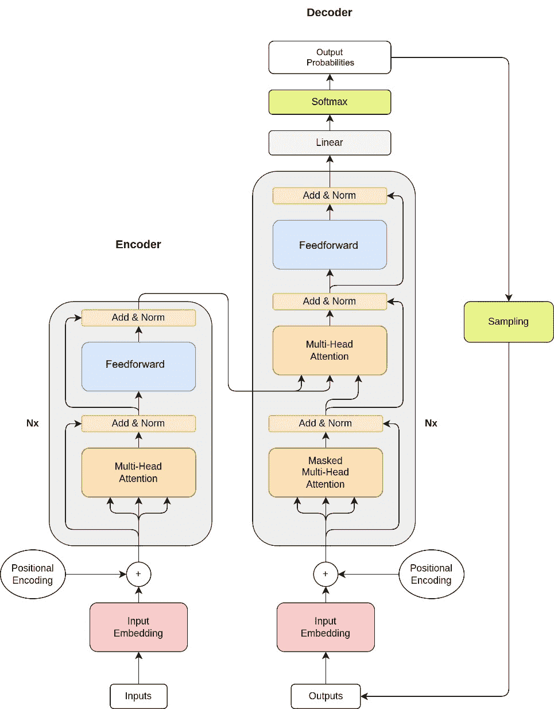

# 11

# 使用 BERT 和迁移学习进行情感分析

**Transformer 架构**是一种**神经网络模型**，在**自然语言处理**（**NLP**）领域获得了显著的流行。它首次在 Vaswani 等人于 2017 年发表的一篇论文中提出。Transformer 的主要优势是其处理并行处理的能力，这使得它比 RNNs 更快。Transformer 的另一个重要优势是它处理序列中长距离依赖的能力。这是通过使用注意力机制实现的，允许模型在生成输出时关注输入的特定部分。

近年来，Transformer 已被应用于广泛的 NLP 任务，包括机器翻译、问答和摘要。其成功可以归因于其简单性、可扩展性和在捕捉长期依赖方面的有效性。然而，像任何模型一样，Transformer 也有一些局限性，例如其高计算成本和对大量训练数据的依赖。尽管存在这些局限性，Transformer 仍然是 NLP 研究人员和从业者的一项强大工具。使其成为可能的一个因素是其能够使用和适应已经预训练的网络，以特定任务以更低的计算资源和训练数据量。

转移学习主要有两种方法，称为**微调**和**迁移学习**。微调是一个进一步调整预训练模型以更好地适应特定任务或数据集的过程。这涉及到解冻预训练模型中的某些或所有层，并在新数据上训练它们。迁移学习的过程通常涉及取一个预训练模型，移除针对原始任务特定的最终层，并添加新层或修改现有层以适应新任务。模型隐藏层的参数通常在训练阶段被冻结。这是与微调的主要区别之一。

本章将涵盖以下主题：

+   Transformer 架构的一般概述

+   对 Transformer 的主要组件及其协同工作方式的简要讨论

+   如何将迁移学习技术应用于构建新的情感分析模型的示例

# 技术要求

本章的技术要求如下：

+   PyTorch 库

+   支持 C++20 的现代 C++ 编译器

+   CMake 构建系统版本 >= 3.22

本章的代码文件可以在以下 GitHub 仓库中找到：[`github.com/PacktPublishing/Hands-On-Machine-Learning-with-C-second-edition/tree/master/Chapter11/pytorch`](https://github.com/PacktPublishing/Hands-On-Machine-Learning-with-C-second-edition/tree/master/Chapter11/pytorch)。

请按照以下文档中描述的说明配置开发环境：[`github.com/PacktPublishing/Hands-on-Machine-learning-with-C-Second-Edition/blob/main/env_scripts/README.md`](https://github.com/PacktPublishing/Hands-on-Machine-learning-with-C-Second-Edition/blob/main/env_scripts/README.md)。

此外，您还可以探索该文件夹中的脚本以查看配置细节。

要构建本章的示例项目，您可以使用以下脚本：[`github.com/PacktPublishing/Hands-on-Machine-learning-with-C-Second-Edition/blob/main/build_scripts/build_ch11.sh`](https://github.com/PacktPublishing/Hands-on-Machine-learning-with-C-Second-Edition/blob/main/build_scripts/build_ch11.sh)。

# Transformer 架构概述

Transformer 是一种神经网络架构，它首次由谷歌研究人员在论文《Attention Is All You Need》中提出。由于其能够处理长距离依赖关系和注意力机制，它已经在 NLP 和其他领域得到广泛应用。以下方案展示了 Transformer 的一般架构：



图 11.1 – Transformer 架构

Transformer 架构有两个主要组件：编码器和解码器。编码器处理输入序列，而解码器生成输出序列。这些 Transformer 组件的常见元素如下：

+   **自注意力机制**：该模型使用自注意力机制来学习输入序列不同部分之间的关系。这使得它能够捕捉到长距离依赖关系，这对于理解自然语言中的上下文非常重要。

+   **交叉注意力机制**：这是一种在处理两个或更多序列时使用的注意力机制。在这种情况下，一个序列的元素关注另一个序列的元素，从而使模型能够学习两个输入之间的关系。它用于编码器和解码器部分之间的通信。

+   **多头注意力**：Transformer 不是使用单个注意力机制，而是使用多个注意力头，每个头都有其自己的权重。这有助于模拟输入序列的不同方面，并提高模型的表示能力。

+   **位置编码**：由于 Transformer 不使用循环或卷积层，它需要一种方法来保留输入序列的位置信息。位置编码用于将此信息添加到输入中。这是通过向嵌入向量添加不同频率的正弦和余弦函数来实现的。

+   **前馈神经网络**：在注意力层之间，存在全连接的前馈神经网络。这些网络有助于将注意力层的输出转换为更有意义的表示。

+   **残差连接和归一化**：与许多深度学习模型一样，Transformer 包含残差连接和批量归一化，以提高训练的稳定性和收敛性。

让我们详细看看编码器和解码器部分解决的主要差异和任务。

## 编码器

Transformer 的 **编码器** 部分负责将输入数据编码为固定长度的向量表示，称为嵌入。这个嵌入捕获了输入中的重要特征和信息，并以更抽象的形式表示它。编码器通常由多层自注意力机制和前馈网络组成。编码器的每一层都有助于细化并改进输入的表示，捕获更复杂的模式和依赖关系。

在内部表示方面，编码器产生的嵌入可以是上下文或位置的。上下文嵌入专注于从文本中捕获语义和句法信息，而位置嵌入编码关于序列中单词的顺序和位置的信息。这两种类型的嵌入都在捕捉句子中单词的上下文和关系方面发挥作用：

+   上下文嵌入允许模型根据上下文理解单词的意义，考虑到周围的单词及其关系

+   位置嵌入另一方面提供关于序列中每个单词位置的信息，帮助模型理解文本的顺序和结构

在编码器中，上下文和位置嵌入共同帮助 Transformer 更好地理解和表示输入数据，使其能够在下游任务中生成更准确和有意义的输出。

## 解码器

Transformer 的 **解码器** 部分以编码表示作为输入并生成最终输出。它由与编码器类似的多层注意力和前馈网络组成。然而，它还包括额外的层，使其能够预测和生成输出。解码器根据输入序列的编码表示及其自己的先前预测来预测序列中的下一个标记。

Transformer 解码器的输出概率代表每个可能的标记作为序列中下一个单词的可能性。这些概率使用 softmax 函数计算，该函数根据标记与上下文的相关性为其分配概率值。

在训练过程中，解码器使用编码嵌入生成预测并将其与真实输出进行比较。预测输出和真实输出之间的差异用于更新解码器的参数并提高其性能。

输出采样是解码器过程的一个重要部分。它涉及根据输出概率选择下一个标记。有许多采样输出的方法。以下列表显示了其中一些流行的方法：

+   **贪婪搜索**：这是最简单的采样方法，在每个步骤根据标记值的 softmax 概率分布选择最可能的标记。虽然这种方法快速且易于实现，但它可能并不总是找到最优解。

+   **Top-k 采样**：Top-k 采样在每个步骤从 softmax 分布中选择概率最高的前*k*个标记，而不是选择最可能的标记。这种方法可以帮助多样化样本，防止模型陷入局部最优。

+   **核采样**：核采样，也称为 top-p 采样，是 top-k 采样的一个变体，它根据概率从 softmax 分布的顶部选择一个子集的标记。通过在概率范围内选择多个标记，核采样可以提高输出的多样性和覆盖率。

您现在已经了解了主要 Transformer 组件的工作原理以及其中使用的元素。但这也留下了在解码器处理之前如何对输入进行预处理的话题。让我们看看如何将输入文本转换为 Transformer 输入。

## 分词

分词是将文本序列分解成更小的单元，称为标记的过程。这些标记可以是单个单词、子词，甚至字符，具体取决于特定任务和模型架构。例如，在句子“我爱吃披萨”中，标记将是“I”，“爱”，“吃”，和“披萨”。

在 Transformer 模型中使用了多种分词方法。最常用的有以下几种：

+   **单词分词**：这种方法将文本分割成单个单词。这是最常见的方法，适用于翻译和文本分类等任务。

+   **子词分词**：在这种方法中，文本被分割成更小的单元，称为**子词**。这可以提高在单词经常拼写错误或截断的任务上的性能，如机器翻译。

+   **字符分词**：这种方法将文本分解成单个字符。对于需要细粒度分析的任务，如情感分析，这可能很有用。

分词方法的选取取决于数据集的特征和任务的需求数据。

在接下来的小节中，我们将使用 BERT 模型，该模型使用`[CLS]`（分类）和`[SEP]`（分隔符）。这些标记在模型架构中具有特定用途。以下是 WordPiece 分词算法的逐步解释：

1.  **初始词汇表**：从一个包含模型使用的特殊标记和初始字母表的小型词汇表开始。初始字母表包含单词开头和 WordPiece 前缀后的所有字符。

1.  `##`（用于 BERT）将每个单词中的每个字符分开，例如将“word”分割成`w ##o ##r ##d`。这将从原始单词中的每个字符创建子词。

1.  `score = (freq_of_pair)/(freq_of_first_element×freq_of_second_element)`。这优先合并那些个体部分在词汇表中出现频率较低的配对。

1.  **合并对**：算法合并得分高的对，这意味着算法将出现频率较低的合并对合并成单个元素。

1.  **迭代合并**：这个过程会重复进行，直到完成所需数量的合并操作或达到预定义的阈值。此时，创建最终的词汇表。

使用词汇表，我们可以以类似于我们在词汇构建过程中之前所做的方式对输入中的任何单词进行标记化。因此，首先我们在词汇表中搜索整个单词。如果我们找不到，我们就从前面带有`##`前缀的子词开始移除一个字符，然后再次搜索。这个过程会一直持续到我们找到一个子词。如果我们在一个词汇表中找不到任何单词的标记，我们通常会跳过这个单词。

词汇表通常表示为一个字典或查找表，将每个单词映射到唯一的整数索引。词汇表大小是 Transformer 性能的一个重要因素，因为它决定了模型的复杂性和处理不同类型文本的能力。

## 单词嵌入

尽管我们使用标记化将单词转换为数字，但这并不为神经网络提供任何语义意义。为了能够表示语义邻近性，我们可以使用嵌入。嵌入是将任意实体映射到特定向量的地方，例如，图中的一个节点，图片中的一个对象，或单词的定义。一组嵌入向量可以被视为向量意义空间。

创建单词嵌入有许多方法。例如，在经典 NLP 中最知名的是 Word2Vec 和 GloVe，它们基于统计分析，实际上是独立的模型。

对于 Transformer，提出了不同的方法。以标记作为输入，我们将它们传递到 MLP 层，该层为每个标记输出嵌入向量。这一层与模型的其他部分一起训练，是内部模型组件。这样，我们可以拥有针对特定训练数据和特定任务的更精细调整的嵌入。

## 分别使用编码器和解码器部分

原始的 Transformer 架构包含编码器和解码器两部分。但最近发现，这些部分可以分别用于解决不同的任务。基于它们的两个最著名的基架构是 BERT 和 GPT。

**BERT**代表**来自变换器的双向编码器表示**。它是一个最先进的 NLP 模型，使用双向方法来理解句子中单词的上下文。与仅考虑一个方向的单词的传统模型不同，BERT 可以查看给定单词之前和之后的单词，以更好地理解其含义。它仅基于编码器变换器部分。这使得它在需要理解上下文的任务中特别有用，例如语义相似度和文本分类。此外，它旨在理解双向上下文，这意味着它可以考虑句子中的前一个和后一个单词。

另一方面，**GPT**，即**生成式预训练变换器**，是一个仅基于解码器变换器部分的生成模型。它通过预测序列中的下一个单词来生成类似人类的文本。

在下一节中，我们将使用 PyTorch 库和 BERT 作为基础模型来开发一个情感分析模型。

# 基于 BERT 的情感分析示例

在本节中，我们将构建一个机器学习模型，该模型可以使用 PyTorch 检测评论情感（检测评论是正面还是负面）。作为训练集，我们将使用大型电影评论数据集，其中包含用于训练的 25,000 条电影评论和用于测试的 25,000 条评论，两者都高度两极分化。

如我们之前所说，我们将使用已经预训练的 BERT 模型。BERT 之所以被选中，是因为它能够理解单词之间的上下文和关系，这使得它在问答、情感分析和文本分类等任务中特别有效。让我们记住，迁移学习是一种机器学习方法，涉及将知识从预训练模型转移到新的或不同的问题域。当特定任务缺乏标记数据时，或者从头开始训练模型过于计算昂贵时，会使用迁移学习。

应用迁移学习算法包括以下步骤：

1.  **选择预训练模型**：应根据任务的相关性来选择模型。

1.  **添加新的任务特定头**：例如，这可能是全连接线性层与最终的 softmax 分类的组合。

1.  **冻结预训练参数**：冻结参数允许模型保留其预学习的知识。

1.  **在新数据集上训练**：模型使用预训练权重和新数据的组合进行训练，使其能够在新的层中学习与新领域相关的特定特征和模式。

我们知道 BERT 类模型用于从输入数据中提取一些语义知识；在我们的案例中，它将是文本。BERT 类模型通常以嵌入向量的形式表示提取的知识。这些向量可以用来训练新的模型头，例如，用于分类任务。我们将遵循之前描述的步骤。

## 导出模型和词汇表

使用 PyTorch 库在 C++中通过某些预训练模型的传统方法是将此模型作为 TorchScript 加载。获取此脚本的一种常见方法是通过追踪 Python 中可用的模型并保存它。在[`huggingface.co/`](https://huggingface.co/)网站上有很多预训练模型。此外，这些模型还提供了 Python API。因此，让我们编写一个简单的 Python 程序来导出基础 BERT 模型：

1.  以下代码片段展示了如何导入所需的 Python 模块并加载用于追踪的预训练模型：

    ```py
    import torch
    from transformers import BertModel, BertTokenizer
    model_name = "bert-base-cased"
    tokenizer =BertTokenizer.from_pretrained(model_name,
                                             torchscript = True)
    bert = BertModel.from_pretrained(model_name, torchscript=True)
    ```

    我们从`transformers`模块中导入了`BertModel`和`BertTokenizer`类，这是 Hugging Face 的库，允许我们使用不同的基于 Transformer 的模型。我们使用了`bert-base-cased`模型，这是在大型文本语料库上训练以理解通用语言语义的原始 BERT 模型，我们还加载了专门针对 BERT 模型的分词器模块——BertTokenizer。注意，我们还使用了`torchscript=True`参数来能够追踪和保存模型。此参数告诉库使用适合 Torch JIT 追踪的操作符和模块。

1.  现在我们有了加载的分词器对象，我们可以按照以下方式对一些样本文本进行分词以进行追踪：

    ```py
    max_length = 128
    tokenizer_out = tokenizer(text,
                              padding = "max_length",
                              max_length = max_length,
                              truncation = True,
                              return_tensors = "pt", )
    attention_mask = tokenizer_out.attention_mask
    input_ids = tokenizer_out.input_ids
    ```

    在这里，我们定义了可以生成的最大标记数，即`128`。我们加载的 BERT 模型一次可以处理最多 512 个标记，因此您应该根据您的任务配置此数字，例如，您可以使用更少的标记数量以满足嵌入式设备上的性能限制。此外，我们告诉分词器截断较长的序列并填充较短的序列到`max_length`。我们还通过指定`return_tensors="pt"`使分词器返回 PyTorch 张量。

    我们使用了分词器返回的两个值：`input_ids`，它是标记值，以及`attention_mask`，它是一个二进制掩码，对于真实标记填充`1`，对于不应处理的填充标记填充`0`。

1.  现在我们有了标记和掩码，我们可以按照以下方式导出模型：

    ```py
    model.eval()
    traced_script_module = torch.jit.trace(model,
                                           [ input_ids,
                                           attention_mask ])
    traced_script_module.save("bert_model.pt")
    ```

    我们将模型切换到评估模式，因为它将被用于追踪，而不是用于训练。然后，我们使用`torch.jit.trace`函数在样本输入上追踪模型，样本输入是我们生成的标记和注意力掩码的元组。我们使用追踪模块的`save`方法将模型脚本保存到文件中。

1.  除了模型之外，我们还需要导出分词器的词汇表，如下所示：

    ```py
    vocab_file = open("vocab.txt", "w")
    for i, j in tokenizer.get_vocab().items():
        vocab_file.write(f"{i} {j}\n")
    vocab_file.close()
    ```

在这里，我们只是遍历了分词器对象中所有可用的令牌，并将它们作为`[value - id]`对保存到文本文件中。

## 实现分词器

我们可以直接使用 PyTorch C++ API 加载保存的脚本模型，但不能对分词器做同样的事情。此外，PyTorch C++ API 中没有分词器的实现。因此，我们必须自己实现分词器：

1.  最简单的分词器实际上可以很容易地实现。它可以为头文件定义以下内容：

    ```py
    #include <torch/torch.h>
    #include <string>
    #include <unordered_map>
    class Tokenizer {
     public:
      Tokenizer(const std::string& vocab_file_path,
                int max_len = 128);
      std::pair<torch::Tensor, torch::Tensor> tokenize(
          const std::string text);
     private:
      std::unordered_map<std::string, int> vocab_;
      int max_len_{0};
    }
    ```

    我们定义了一个`Tokenizer`类，它有一个构造函数，该构造函数接受词汇文件名和要生成的令牌序列的最大长度。我们还定义了一个单独的方法`tokenize`，它接受输入文本作为参数。

1.  构造函数可以如下实现：

    ```py
    Tokenizer::Tokenizer(const std::string& vocab_file_path,
                         int max_len)
        : max_len_{max_len} {
      auto file = std::ifstream(vocab_file_path);
      std::string line;
      while (std::getline(file, line)) {
        auto sep_pos = line.find_first_of(' ');
        auto token = line.substr(0, sep_pos);
        auto id = std::stoi(line.substr(sep_pos + 1));
        vocab_.insert({token, id});
      }
    }
    ```

    我们简单地打开给定的文本文件，逐行读取。我们将每一行分割成两个组件，即令牌字符串值和相应的 ID。这些组件由空格字符分隔。此外，我们将`id`从`string`转换为`integer`值。所有解析的令牌 ID 对都保存到`std::unordered_map`容器中，以便能够有效地搜索令牌 ID。

1.  `tokenize`方法的实现稍微复杂一些。我们定义如下：

    ```py
    std::pair<torch::Tensor, torch::Tensor> Tokenizer::tokenize(const std::string text) {
      std::string pad_token = "[PAD]";
      std::string start_token = "[CLS]";
      std::string end_token = "[SEP]";
      auto pad_token_id = vocab_[pad_token];
      auto start_token_id = vocab_[start_token];
      auto end_token_id = vocab_[end_token];
    ```

    在这里，我们从加载的词汇表中获得了特殊的令牌 ID 值。这些令牌 ID 是 BERT 模型正确处理输入所必需的。

1.  当我们的输入文本太短时，PAD 令牌用于标记空令牌。可以这样做：

    ```py
      std::vector<int> input_ids(max_len_, pad_token_id);
      std::vector<int> attention_mask(max_len_, 0);
      input_ids[0] = start_token_id;
      attention_mask[0] = 1;
    ```

    就像在 Python 程序中一样，我们创建了两个向量，一个用于令牌 ID，另一个用于注意力掩码。我们使用`pad_token_id`作为令牌 ID 的默认值，并用零填充注意力掩码。然后，我们将`start_token_id`作为第一个元素，并在注意力掩码中放入相应的值。

1.  定义了输出容器后，我们现在定义输入文本处理的中间对象，如下所示：

    ```py
      std::string word;
      std::istringstream ss(text);
    ```

    我们将输入文本字符串移动到`stringstream`对象中，以便能够逐词读取。我们还定义了相应的单词字符串对象。

1.  顶层处理周期可以如下定义：

    ```py
      int input_id = 1;
      while (getline(ss, word, ' ')) {
      // search token in the vocabulary and increment input_id
      if (input_id == max_len_ - 1) {
        break;
      }
    }
    ```

    在这里，我们使用了`getline`函数，通过空格字符作为分隔符将输入字符串流分割成单词。这是一种简单的分割输入文本的方法。通常，分词器会使用更复杂的策略进行分割。但对于我们的任务和我们的数据集来说，这已经足够了。此外，我们还添加了检查，如果我们达到最大序列长度，我们就停止文本处理，因此我们截断它。

1.  然后，我们必须识别第一个单词中最长可能的、存在于词汇表中的前缀；它可能是一个完整的单词。实现开始如下：

    ```py
      size_t start = 0;
    while (start < word.size()) {
      size_t end = word.size();
      std::string token;
      bool has_token = false;
      while (start < end) {
        // search the prefix in the vocabulary
        end--;
      }
      if (input_id == max_len_ - 1) {
        break;
      }
      if (!has_token) {
        break;
      }
      start = end;
    }
    ```

    在这里，我们定义了`start`变量来跟踪单词前缀的开始位置，它被初始化为 0，即当前单词的开始位置。我们定义了`end`变量来跟踪前缀的结束位置，它被初始化为当前单词的长度，即单词的最后一个位置。最初，它们指向单词的开始和结束。然后，在内循环中，我们通过递减`end`变量来连续减小前缀的大小。每次递减后，如果我们没有在词汇表中找到前缀，我们就重复这个过程，直到单词的末尾。此外，我们还确保在成功搜索到标记后，交换`start`和`end`变量以分割单词，并继续对单词剩余部分的前缀搜索。这样做是因为一个单词可以由多个标记组成。此外，在这段代码中，我们检查了最大标记序列长度以停止整个标记搜索过程。

1.  下一个步骤是我们对词汇表执行前缀搜索：

    ```py
      auto token = word.substr(start, end - start);
    if (start > 0) 
      token = "##" + token;
    auto token_iter = vocab_.find(token);
    if (token_iter != vocab_.end()) {
      attention_mask[input_id] = 1;
      input_ids[input_id] = token_iter->second;
      ++input_id;
      has_token = true;
      break;
    }
    ```

    在这里，我们使用`substr`函数从原始单词中提取前缀。如果`start`变量不是`0`，我们正在处理单词的内部部分，因此执行了添加`##`特殊前缀的操作。我们使用了无序映射容器中的`find`方法来查找标记（前缀）。如果搜索成功，我们将标记 ID 放置在`input_ids`容器的下一个位置，在`attention_mask`中做出相应的标记，增加`input_id`索引以移动当前序列位置，并中断循环以开始处理下一个单词部分。

1.  在实现填充输入 ID 和注意力掩码的代码之后，我们将它们放入 PyTorch 张量对象中，并按如下方式返回输出：

    ```py
      attention_mask[input_id] = 1;
      input_ids[input_id] = end_token_id;
      auto input_ids_tensor = torch::tensor(
                                 input_ids).unsqueeze(0);
      auto attention_masks_tensor = torch::tensor(
                                      attention_mask).unsqueeze(0);
    return std::make_pair(input_ids_tensor,
                          attention_masks_ tensor);
    ```

    在将输入 ID 和掩码转换为张量之前，我们使用`end_token_id`值最终确定了标记 ID 序列。然后，我们使用`torch.tensor`函数创建张量对象。这个函数可以接受不同的输入，其中之一是只包含数值的`std::vector`。我们还使用了`unsqueeze`函数向张量中添加批处理维度。我们还将最终的张量作为标准对返回。

在以下小节中，我们将使用实现的标记器实现数据集加载器类。

## 实现数据集加载器

我们必须开发解析器和数据加载器类，以便将数据集以适合与 PyTorch 一起使用的方式移动到内存中：

1.  让我们从解析器开始。我们拥有的数据集组织如下：有两个文件夹用于训练集和测试集，每个文件夹中包含两个子文件夹，分别命名为`pos`和`neg`，正负评论文件分别放置在这些子文件夹中。数据集中的每个文件恰好包含一条评论，其情感由其所在的文件夹决定。在下面的代码示例中，我们将定义读取类的接口：

    ```py
    #include <string>
    #include <vector>
    class ImdbReader {
     public:
        ImdbReader(const std::string& root_path);
        size_t get_pos_size() const;
        size_t get_neg_size() const;
        const std::string& get_pos(size_t index) const;
        const std::string& get_neg(size_t index) const;
    private:
    using Reviews = std::vector<std::string>;
    void read_ directory(const std::string& path,
                         Reviews& reviews);
     private:
        Reviews pos_samples_;
        Reviews neg_samples_;
        size_t max_size_{0};
    };
    ```

    我们定义了两个向量`pos_samples_`和`neg_samples_`，它们包含从相应文件夹中读取的评论。

1.  我们将假设这个类的对象应该用放置数据集之一（训练集或测试集）的根文件夹路径进行初始化。我们可以按以下方式初始化：

    ```py
    int main(int argc, char** argv) {
      if (argc > 0) {
        auto root_path = fs::path(argv[1]);
        … ImdbReader train_reader(root_path / "train");
        ImdbReader test_reader(root_path / "test");
      }
    }
    ```

    这个类最重要的部分是`constructor`和`read_directory`方法。

1.  构造函数是主要点，其中我们填充容器`pos_samples_`和`neg_samples_`，以包含来自`pos`和`neg`文件夹的实际评论：

    ```py
    namespace fs = std::filesystem;
    ImdbReader::ImdbReader(const std::string& root_path) {
      auto root = fs::path(root_path);
      auto neg_path = root / "neg";
      auto pos_path = root / "pos";
      if (fs::exists(neg_path) && fs::exists(pos_path)) {
        auto neg = std::async(std::launch::async, [&]() {
          read_directory(neg_path, neg_samples_);
        });
        auto pos = std::async(std::launch::async, [&]() {
          read_directory(pos_path, pos_samples_);
        });
        neg.get();
        pos.get();
      } else {
    throw std::invalid_argument("ImdbReader incorrect 
                                 path");
      }
    }
    ```

1.  `read_directory`方法实现了遍历给定目录中文件的逻辑，并按以下方式读取：

    ```py
    void ImdbReader::read_directory(const std::string& path,
                                    Reviews& reviews) {
      for (auto& entry : fs::directory_iterator(path)) {
        if (fs::is_regular_file(entry)) {
          std::ifstream file(entry.path());
          if (file) {
            std::stringstream buffer;
            buffer << file.rdbuf();
            reviews.push_back(buffer.str());
          }
        }
      }
    }
    ```

    我们使用了标准库目录迭代器类`fs::directory_iterator`来获取文件夹中的每个文件。这个类的对象返回`fs::directory_entry`类的对象，这个对象可以用`is_regular_file`方法来确定它是否是一个常规文件。我们用`path`方法获取了这个条目的文件路径。我们使用`std::ifstream`类型对象的`rdbuf`方法将整个文件读取到一个字符串对象中。

    现在已经实现了`ImdbReader`类，我们可以进一步开始数据集的实现。我们的数据集类应该返回一对项：一个表示标记化文本，另一个表示情感值。此外，我们需要开发一个自定义函数来将批次中的张量向量转换为单个张量。如果我们想使 PyTorch 与我们的自定义训练数据兼容，这个函数是必需的。

1.  让我们定义一个自定义训练数据样本的`ImdbSample`类型。我们将与`torch::data::Dataset`类型一起使用它：

    ```py
    using ImdbData = std::pair<torch::Tensor, torch::Tensor>;
    using ImdbExample = torch::data::Example<ImdbData,
                                             torch::Tensor>;
    ```

    `ImdbData`代表训练数据，包含用于标记序列和注意力掩码的两个张量。`ImdbSample`代表整个样本，包含一个目标值。张量包含`1`或`0`，分别表示正面或负面情感。

1.  以下代码片段展示了`ImdbDataset`类的声明：

    ```py
    class ImdbDataset : public torch::data::Dataset<ImdbDataset, ImdbExample> {
     public:
        ImdbDataset(const std::string& dataset_path,
                    std::shared_ptr<Tokenizer> tokenizer);
        // torch::data::Dataset implementation
        ImdbExample get(size_t index) override;
        torch::optional<size_t> size() const override;
     private:
        ImdbReader reader_;
        std::shared_ptr<Tokenizer> tokenizer_;
    };
    ```

    我们从`torch::data::Dataset`类继承了我们的数据集类，以便我们可以用它来初始化数据加载器。PyTorch 数据加载器对象负责从训练对象中采样随机对象并从中制作批次。我们的`ImdbDataset`类对象应该用`ImdbReader`和`Tokenizer`对象的根数据集路径进行初始化。构造函数的实现很简单；我们只是初始化了读取器并存储了分词器的指针。请注意，我们使用了分词器的指针来在训练集和测试集之间共享它。我们重写了`torch::data::Dataset`类中的两个方法：`get`和`size`方法。

1.  以下代码展示了我们如何实现`size`方法：

    ```py
    torch::optional<size_t> ImdbDataset::size() const {
        return reader_.get_pos_size() + reader_.get_neg_size();
    }
    ```

    `size`方法返回`ImdbReader`对象中的评论数量。

1.  `get`方法的实现比之前的方法更复杂，如下面的代码所示：

    ```py
    ImdbExample ImdbDataset::get(size_t index) {
      torch::Tensor target;
      const std::string* review{nullptr};
      if (index < reader_.get_pos_size()) {
        review = &reader_.get_pos(index);
        target = torch::tensor(1, torch::dtype(torch::kLong));
      } else {
        review =
            &reader_.get_neg(index - reader_.get_pos_size());
        target = torch::tensor(0, torch::dtype(torch::kLong));
      }
      // encode text
      auto tokenizer_out = tokenizer_->tokenize(*review);
      return {tokenizer_out, target.squeeze()};
    }
    ```

    首先，我们从给定的索引（函数参数值）中获取了评论文本和情感值。在 `size` 方法中，我们返回了总的正面和负面评论数量，所以如果输入索引大于正面评论的数量，那么这个索引指向的是一个负面的评论。然后，我们从它中减去正面评论的数量。

    在我们得到了正确的索引后，我们也得到了相应的文本评论，将其地址分配给 `review` 指针，并初始化了 `target` 张量。使用 `torch::tensor` 函数初始化 `target` 张量。这个函数接受任意数值和诸如所需类型等张量选项。

    对于评论文本，我们仅使用分词器对象创建了两个包含标记 ID 和情感掩码的张量。它们被打包在 `tokenizer_out` 对象对中。我们返回了训练张量对和单个目标张量。

1.  为了能够有效地使用批量训练，我们创建了一个特殊的类，这样 PyTorch 就能将我们的非标准样本类型转换为批处理张量。在最简单的情况下，我们将得到训练样本的 `std::vector` 对象而不是单个批处理张量。这是通过以下方式完成的：

    ```py
    torch::data::transforms::Collation<ImdbExample> {
      ImdbExample apply_batch(std::vector<ImdbExample> examples)
          override {
        std::vector<torch::Tensor> input_ids;
        std::vector<torch::Tensor> attention_masks;
        std::vector<torch::Tensor> labels;
        input_ids.reserve(examples.size());
        attention_masks.reserve(examples.size());
        labels.reserve(examples.size());
        for (auto& example : examples) {
          input_ids.push_back(std::move(example.data.first));
          attention_masks.push_back(
              std::move(example.data.second));
          labels.push_back(std::move(example.target));
        }
        return {{torch::stack(input_ids),
                 torch::stack(attention_masks)},
                torch::stack(labels)};
      }
    }
    ```

我们从特殊的 PyTorch `torch::data::transforms::Collation` 类型继承了我们自己的类，并通过 `ImdbExample` 类的模板参数对其进行特殊化。有了这样一个类，我们重写了虚拟的 `apply_batch` 函数，其实现在输入是包含 `ImdbExample` 对象的 `std::vector` 对象，并返回单个 `ImdbExample` 对象。这意味着我们将所有输入 ID、注意力掩码和目标张量合并到三个单独的张量中。这是通过为输入 ID、注意力掩码和目标张量创建三个单独的容器来完成的。它们通过简单地遍历输入样本来填充。然后，我们仅使用 `torch::stack` 函数将这些容器合并（堆叠）成单个张量。这个类将在后续的数据加载器类型对象构建中使用。

## 实现模型

下一步是创建一个 `model` 类。我们已经有了一个将要用作预训练部分的导出模型。我们创建了一个简单的分类头，包含两个线性全连接层和一个 dropout 层用于正则化：

1.  这个类的头文件看起来如下：

    ```py
    #include <torch/script.h>
    #include <torch/torch.h>
    class ModelImpl : public torch::nn::Module {
     public:
        ModelImpl() = delete;
        ModelImpl(const std::string& bert_model_path);
        torch::Tensor forward(at::Tensor input_ids,
                              at::Tensor attention_masks);
     private:
        torch::jit::script::Module bert_;
        torch::nn::Dropout dropout_;
        torch::nn::Linear fc1_;
        torch::nn::Linear fc2_;
    };
    TORCH_MODULE(Model);
    ```

    我们包含了 `torch\script.h` 头文件以使用 `torch::jit::script::Module` 类。这个类的实例将被用作之前导出的 BERT 模型的表示。参见 `bert_` 成员变量。我们还定义了线性层和 dropout 层的成员变量，它们是 `torch::jit::script::Module` 类的实例。我们从 `torch::nn::Module` 类继承了我们的 `ModelImpl` 类，以便将其集成到 PyTorch 自动梯度系统中。

1.  构造函数的实现如下：

    ```py
    ModelImpl::ModelImpl(const std::string& bert_model_path)
        : dropout_(register_module(
              "dropout",
              torch::nn::Dropout(
                  torch::nn::DropoutOptions().p(0.2)))),
          fc1_(register_module(
              "fc1",
              torch::nn::Linear(
                  torch::nn::LinearOptions(768, 512)))),
          fc2_(register_module(
              "fc2",
              torch::nn::Linear(
                  torch::nn::LinearOptions(512, 2)))) {
      bert_ = torch::jit::load(bert_model_path);
    }
    ```

    我们使用了`torch::jit::load`来加载我们从 Python 导出的模型。这个函数接受一个参数——模型文件名。此外，我们还初始化了 dropout 和线性层，并在父`torch::nn::Module`对象中注册了它们。`fc1_`线性层是输入层；它接收 BERT 模型的 768 维输出。`fc2_`线性层是输出层。它将内部 512 维状态处理成两个类别。

1.  主模型功能是在`forward`函数中实现的，如下所示：

    ```py
    torch::Tensor ModelImpl::forward(
        at::Tensor input_ids,
        at::Tensor attention_masks) {
      std::vector<torch::jit::IValue> inputs = {
          input_ids, attention_masks};
      auto bert_output = bert_.forward(inputs);
      auto pooler_output =
          bert_output.toTuple()->elements()[1].toTensor();
      auto x = fc1_(pooler_output);
      x = torch::nn::functional::relu(x);
      x = dropout_(x);
      x = fc2_(x);
      x = torch::softmax(x, /*dim=*/1);
      return x;
    }
    ```

    此函数接收输入标记 ID 以及相应的注意力掩码，并返回一个包含分类结果的二维张量。我们将情感分析视为一个分类任务。`forward`实现有两个部分。一部分是我们使用加载的 BERT 模型对输入进行预处理；这种预处理只是使用预训练的 BERT 模型主干进行推理。第二部分是我们将 BERT 输出通过我们的分类头。这是可训练的部分。要使用 BERT 模型，即`torch::jit:script::Module`对象，我们将输入打包到`torch::jit::Ivalue`对象的`std::vector`容器中。从`torch::Tensor`的转换是自动完成的。

    然后，我们使用了 PyTorch 的标准`forward`函数进行推理。这个函数返回一个`torch::jit`元组对象；返回类型实际上取决于最初被追踪的模型。因此，要从`torch::jit`值对象中获取 PyTorch 张量，我们显式地使用了`toTuple`方法来说明如何解释输出结果。然后，我们通过使用`elements`方法访问第二个元组元素，该方法为元组元素提供了索引操作符。最后，为了获取张量，我们使用了`jit::Ivalue`对象的`toTensor`方法，这是一个元组元素。

    我们使用的 BERT 模型返回两个张量。第一个表示输入标记的嵌入值，第二个是池化输出。池化输出是输入文本的`[CLS]`标记的嵌入。产生此输出的线性层权重是在 BERT 预训练期间从下一个句子预测（分类）目标中训练出来的。因此，这些是在以下文本分类任务中使用的理想值。这就是为什么我们取 BERT 模型返回的元组的第二个元素。

    `forward`函数的第二部分同样简单。我们将 BERT 的输出传递给`fc1_`线性层，随后是`relu`激活函数。在此操作之后，我们得到了`512`个内部隐藏状态。然后，这个状态被`dropout_`模块处理，以向模型中引入一些正则化。最后阶段是使用`fc2_`输出线性模块，它返回一个二维向量，随后是`softmax`函数。`softmax`函数将 logits 转换为范围在`[0,1]`之间的概率值，因为来自线性层的原始 logits 可以具有任意值，需要将它们转换为目标值。

现在，我们已经描述了训练过程所需的所有组件。让我们看看模型训练是如何实现的。

## 训练模型

训练的第一步是创建数据集对象，可以按照以下方式完成：

```py
auto tokenizer = std::make_shared<Tokenizer>(vocab_path);
ImdbDataset train_dataset(dataset_path / "train", tokenizer);
```

我们仅通过传递对应文件的路径就创建了`tokenizer`和`train_dataset`对象。测试数据集也可以用相同的方式创建，使用相同的`tokenizer`对象。现在我们有了数据集，我们创建数据加载器如下：

```py
int batch_size = 8;
auto train_loader = torch::data::make_data_loader(
    train_dataset.map(Stack()),
    torch::data::DataLoaderOptions()
        .batch_size(batch_size)
        .workers(8));
```

我们指定了批大小，并使用`make_data_loader`函数创建了数据加载器对象。此对象使用数据集有效地加载和组织批量训练样本。我们使用`train_dataset`对象的`map`转换函数和一个我们的`Stack`类实例来允许 PyTorch 将我们的训练样本合并成张量批次。此外，我们还指定了一些数据加载器选项，即批大小和用于加载数据和预处理的线程数。

我们创建模型对象如下：

```py
torch::DeviceType device = torch::cuda::is_available()
    ? torch::DeviceType::CUDA
    : torch::DeviceType::CPU;
Model model(model_path);
model->to(device);
```

我们使用了`torch::cuda::is_available`函数来确定系统是否可用 CUDA 设备，并相应地初始化`device`变量。使用 CUDA 设备可以显著提高模型的训练和推理。模型是通过一个构造函数创建的，该构造函数接受导出 BERT 模型的路径。在模型对象初始化后，我们将此对象移动到特定的设备。

训练所需的最后一个组件是一个优化器，我们创建如下：

```py
torch::optim::AdamW optimizer(model->parameters(),
    torch::optim::AdamWOptions(1e-5));
```

我们使用了`AdamW`优化器，这是流行的 Adam 优化器的一个改进版本。为了构建优化器对象，我们将模型参数和学习率选项作为构造函数参数传递。

训练周期可以定义为以下内容：

```py
for (int epoch = 0; epoch < epochs; ++epoch) {
  model->train();
  for (auto& batch : (*train_loader)) {
    optimizer.zero_grad();
    auto batch_label = batch.target.to(device);
    auto batch_input_ids =
        batch.data.first.squeeze(1).to(device);
    auto batch_attention_mask =
        batch.data.second.squeeze(1).to(device);
    auto output =
        model(batch_input_ids, batch_attention_mask);
    torch::Tensor loss =
        torch::cross_entropy_loss(output, batch_label);
    loss.backward();
    torch::nn::utils::clip_grad_norm_(model->parameters(),
                                      1.0);
    optimizer.step();
  }
}
```

有两个嵌套循环。一个是遍历 epoch 的循环，还有一个是内部循环，遍历批次。每个内部循环的开始就是新 epoch 的开始。我们将模型切换到训练模式。这个切换可以只做一次，但通常，你会有一些测试代码将模型切换到评估模式，因此这个切换会将模型返回到所需的状态。在这里，为了简化，我们省略了测试代码。它看起来与训练代码非常相似，唯一的区别是禁用了梯度计算。在内部循环中，我们使用了基于范围的`for`循环 C++语法来遍历批次。对于每个批次，首先，我们通过调用优化器对象的`zero_grad`函数来清除梯度值。然后，我们将批次解耦成单独的张量对象。此外，如果可用，我们将这些张量移动到 GPU 设备上。这是通过`.to(device)`调用完成的。我们使用`squeeze`方法从模型输入张量中移除了一个额外的维度。这个维度是在自动批次创建过程中出现的。

一旦所有张量都准备好了，我们就用我们的模型进行了预测，得到了`output`张量。这个输出被用于`torch::cross_entropy_loss`损失函数，通常用于多类分类。它接受一个包含每个类概率的张量和一个 one-hot 编码的标签张量。然后，我们使用`loss`张量的`backward`方法来计算梯度。此外，我们通过设置一个上限值来使用`clip_grad_norm_`函数剪辑梯度，以防止它们爆炸。一旦梯度准备好了，我们就使用优化器的`step`函数根据优化器算法更新模型权重。

使用我们使用的设置，这个架构可以在 500 个训练 epoch 中实现超过 80%的电影评论情感分析准确率。

# 摘要

本章介绍了 Transformer 架构，这是一个在 NLP 和其他机器学习领域广泛使用的强大模型。我们讨论了 Transformer 架构的关键组件，包括分词、嵌入、位置编码、编码器、解码器、注意力机制、多头注意力、交叉注意力、残差连接、归一化层、前馈层和采样技术。

最后，在本章的最后部分，我们开发了一个应用程序，以便我们可以对电影评论进行情感分析。我们将迁移学习技术应用于使用预训练模型在新模型中学习到的特征，该模型是为我们的特定任务设计的。我们使用 BERT 模型生成输入文本的嵌入表示，并附加了一个线性层分类头以对评论情感进行分类。我们实现了简单的分词器和数据集加载器。我们还开发了分类头的完整训练周期。

我们使用迁移学习而不是微调来利用更少的计算资源，因为微调技术通常涉及在新的数据集上重新训练一个完整的预训练模型。

在下一章中，我们将讨论如何保存和加载模型参数。我们还将查看机器学习库中为此目的存在的不同 API。保存和加载模型参数可能是训练过程中的一个相当重要的部分，因为它允许我们在任意时刻停止和恢复训练。此外，保存的模型参数可以在模型训练后用于评估目的。

# 进一步阅读

+   PyTorch 文档：[`pytorch.org/cppdocs/`](https://pytorch.org/cppdocs/)

+   Hugging Face BERT 模型文档：[`huggingface.co/docs/transformers/model_doc/bert`](https://huggingface.co/docs/transformers/model_doc/bert)

+   详细的 Transformer 解释：[`jalammar.github.io/illustrated-transformer`](https://jalammar.github.io/illustrated-transformer)

+   《注意力即一切》，作者：Ashish Vaswani, Noam Shazeer, Niki Parmar, Jakob Uszkoreit, Llion Jones, Aidan N. Gomez, Lukasz Kaiser, Illia Polosukhin：[`arxiv.org/abs/1706.03762`](https://arxiv.org/abs/1706.03762)

+   一份预训练的 BERT 类似模型列表，用于情感分析：[`huggingface.co/models?other=sentiment-analysis`](https://huggingface.co/models?other=sentiment-analysis)

# 第四部分：生产和部署挑战

C++的关键特性是程序能够在各种硬件平台上编译和运行。你可以在数据中心最快的 GPU 上训练你的复杂**机器学习**（**ML**）模型，并将其部署到资源有限的微型移动设备上。这部分将向你展示如何使用各种 ML 框架的 C++ API 来保存和加载训练好的模型，以及如何跟踪和可视化训练过程，这对于 ML 从业者来说至关重要，因为他们能够控制和检查模型的训练性能。此外，我们将学习如何构建在 Android 设备上使用 ML 模型的程序；特别是，我们将创建一个使用设备摄像头的目标检测系统。

本部分包括以下章节：

+   *第十二章*，*导出和导入模型*

+   *第十三章*，*跟踪和可视化 ML 实验*

+   *第十四章*，*在移动平台上部署模型*
