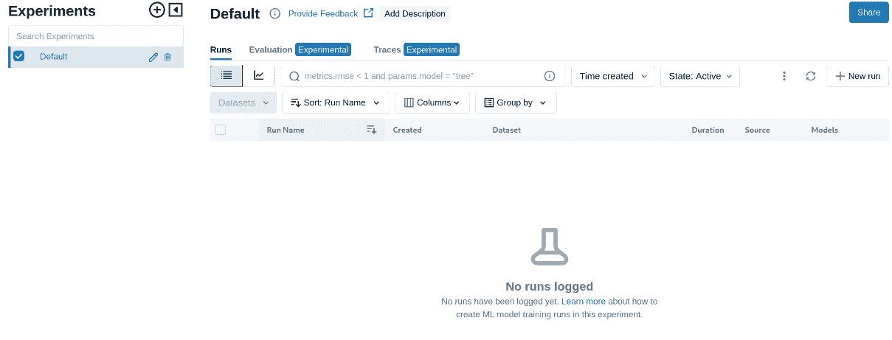
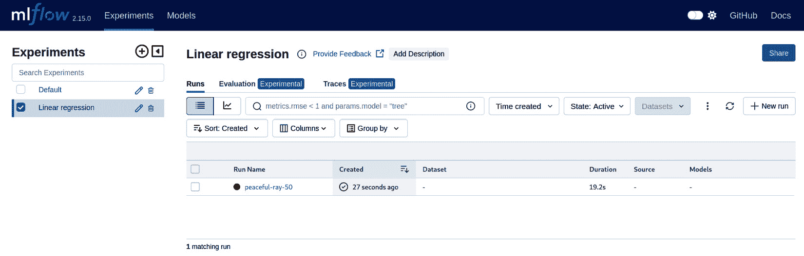
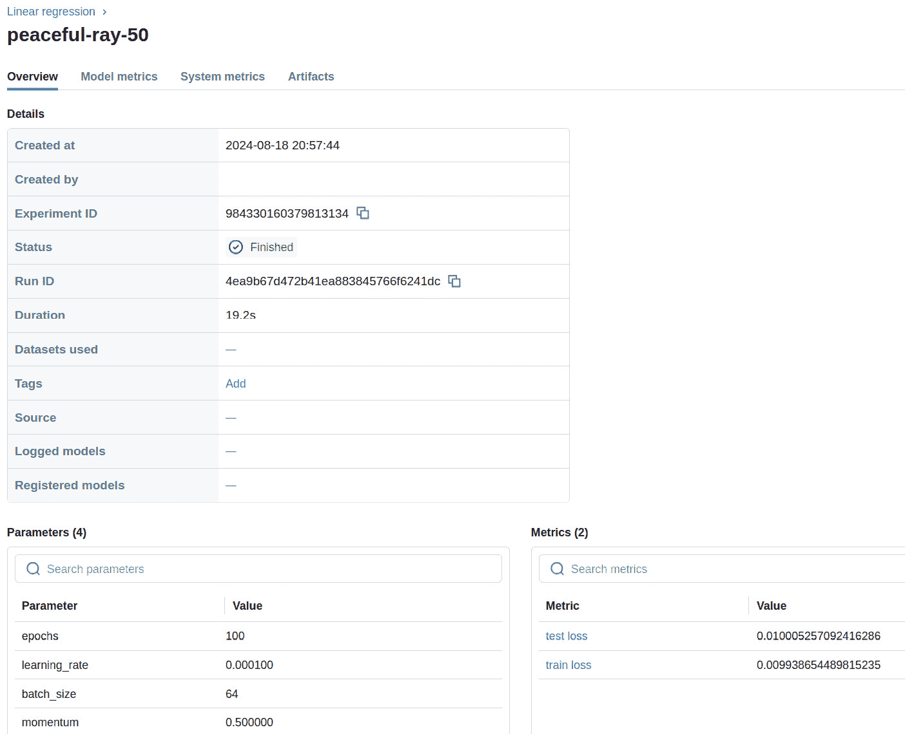
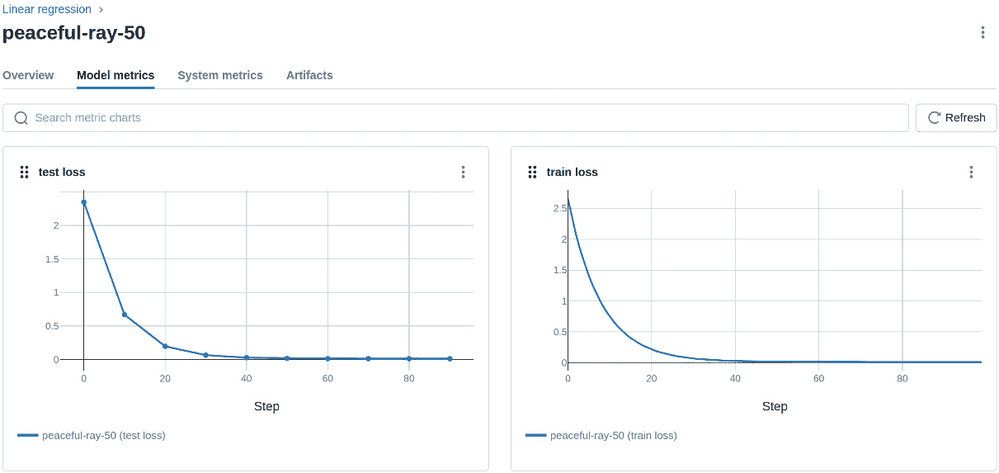
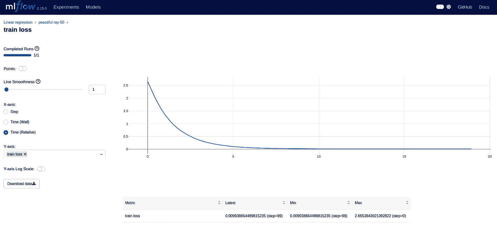
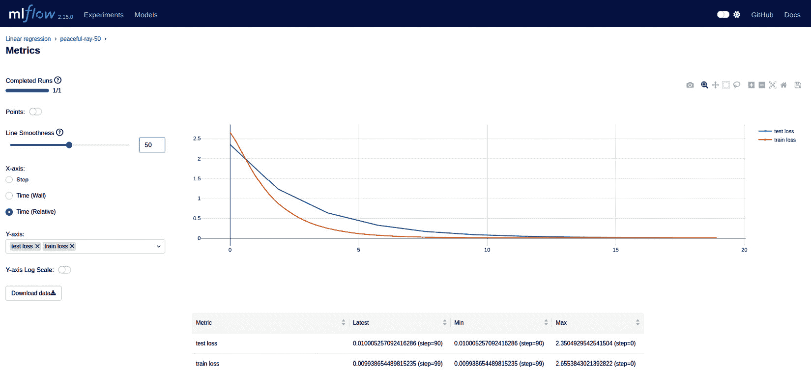
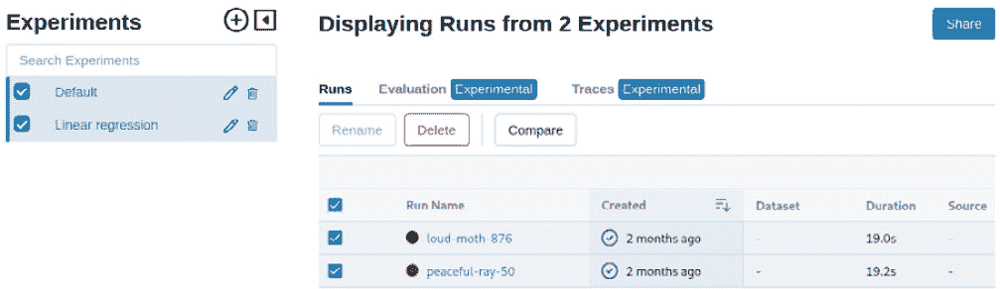
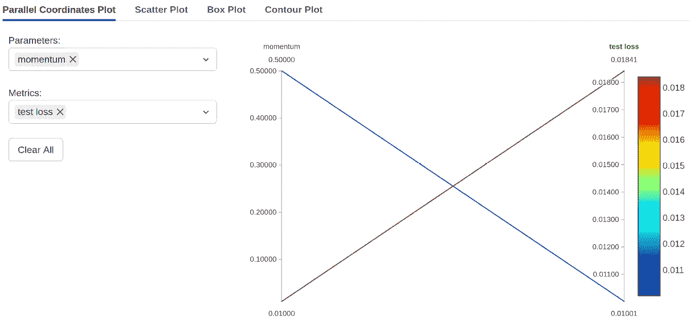
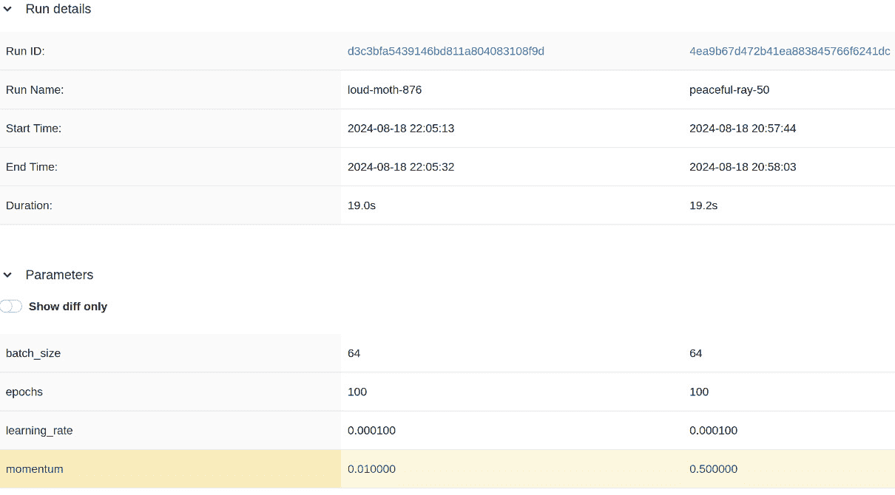

# 第十三章：跟踪和可视化机器学习实验

在**机器学习**（**ML**）的世界里，**可视化**和**实验跟踪系统**扮演着至关重要的角色。这些工具提供了一种理解复杂数据、跟踪实验并就模型开发做出明智决策的方法。

在机器学习中，可视化数据对于理解模式、关系和趋势至关重要。数据可视化工具允许工程师创建图表、图形和图表，帮助他们探索和分析数据。有了合适的可视化工具，工程师可以快速识别模式和异常，这些可以用来提高模型性能。

实验跟踪系统旨在跟踪多个实验的进度。它们允许工程师比较结果、识别最佳实践并避免重复错误。实验跟踪工具还有助于可重复性，确保实验可以准确且高效地重复。

选择合适的可视化与实验跟踪工具至关重要。有许多开源和商业选项可供选择，每个选项都有其优点和缺点。在选择工具时，重要的是要考虑诸如易用性、与其他工具的集成以及项目具体需求等因素。

在本章中，我们将简要讨论**TensorBoard**，这是最广泛使用的实验可视化系统之一。我们还将了解它能够提供哪些类型的可视化以及使用 C++时面临的挑战。至于跟踪系统，我们将讨论**MLflow 框架**，并提供一个使用 C++的实战示例。此示例涵盖了项目设置、定义实验、记录指标以及可视化训练过程，展示了实验跟踪工具在增强机器学习开发过程中的强大功能。

到本章结束时，你应该清楚地了解为什么这些工具对机器学习工程师至关重要，以及它们如何帮助你取得更好的成果。

本章涵盖了以下主题：

+   理解可视化与实验跟踪系统

+   使用 MLflow 的 REST API 进行实验跟踪

# 技术要求

本章的技术要求如下：

+   Flashlight 库 0.4.0

+   MLflow 2.5.0

+   `cpp-httplib` v0.16.0

+   `nlohmann` `json` v3.11.2

+   支持 C++20 的现代 C++编译器

+   CMake 构建系统版本 >= 3.22

本章的代码文件可以在本书的 GitHub 仓库中找到：[`github.com/PacktPublishing/Hands-On-Machine-Learning-with-C-second-edition/tree/master/Chapter13/flashlight`](https://github.com/PacktPublishing/Hands-On-Machine-Learning-with-C-second-edition/tree/master/Chapter13/flashlight)

# 理解实验的可视化和跟踪系统

ML 实验的视觉化和跟踪系统是 ML 开发过程中的关键组件。这些系统共同使工程师能够构建更稳健和有效的 ML 模型。它们还有助于确保开发过程中的可重复性和透明度，这对于科学严谨性和协作至关重要。

可视化工具提供了数据的图形表示，使工程师能够看到在原始数据中可能难以检测到的模式、趋势和关系。这可以帮助工程师深入了解其模型的行为，识别改进领域，并在模型设计和超参数调整方面做出明智的决定。

实验跟踪系统允许工程师记录和组织实验，包括模型架构、超参数和训练数据。这些系统提供了整个实验过程的概述，使得比较不同的模型并确定哪些模型表现最佳变得更加容易。

接下来，我们将探讨 TensorBoard 的一些关键特性，这是一个强大的可视化工具，并了解 MLflow 这一有效实验跟踪系统的基本组件。

## TensorBoard

TensorBoard 是一个用于 ML 模型的可视化工具，它提供了对模型性能和训练进度的洞察。它还提供了一个交互式仪表板，用户可以在其中探索图表、直方图、散点图以及其他与实验相关的可视化。

这里是 TensorBoard 的一些关键特性：

+   `损失`、`准确率`、`精确率`、`召回率`和`F1 分数`。

+   **直方图图**：TensorBoard 还提供了直方图图，以更好地理解模型性能。这些图表可以帮助用户了解层权重和梯度值的分布。

+   **图形**：TensorBoard 中的图形提供了模型架构的视觉表示。用户可以创建图形来分析输入和输出之间的相关性，或比较不同的模型。

+   **图像**：TensorBoard 允许您显示图像数据，并将此类可视化连接到训练时间线。这可以帮助用户分析输入数据、中间输出或卷积滤波器结果的可视化。

+   **嵌入投影仪**：TensorBoard 中的嵌入投影仪允许用户使用如**主成分分析**（PCA）等技术，在较低维度中探索高维数据。此功能有助于可视化复杂的数据集。

+   **比较**：在 TensorBoard 中，比较功能使用户能够并排比较多个模型的性能，从而轻松地识别出表现最佳的模型。

不幸的是，TensorBoard 与 C++ ML 框架的集成并不容易。原生 C++支持仅存在于 TensorFlow 框架中。此外，只有一个第三方开源库允许我们使用 TensorBoard，而且它并没有得到积极维护。

TensorBoard 可以与各种基于 Python 的深度学习框架集成，包括 TensorFlow、PyTorch 等。因此，如果你在 Python 中训练模型，将其视为一个可以帮助你了解模型性能、识别潜在问题并就超参数、数据预处理和模型设计做出明智决策的工具是有意义的。

否则，为了可视化训练数据，你可以使用基于 `gnuplot` 的库，如 `CppPlot`，正如我们在前几章中所做的那样。参见 *第三章* 中的 2D 散点图和线图可视化示例。

## MLflow

MLflow 是一个为 **机器学习操作**（**MLOps**）设计的开源框架，帮助团队管理、跟踪和扩展他们的机器学习项目。它提供了一套用于构建、训练和部署模型以及监控其性能和实验的工具和功能。

MLflow 的主要组件如下：

+   **实验跟踪**：MLflow 允许用户跟踪他们的实验，包括超参数、代码版本和指标。这有助于理解不同配置对模型性能的影响。

+   **代码可重现性**：使用 MLflow，用户可以通过跟踪代码版本和依赖关系轻松重现他们的实验。这确保了实验之间的一致性，并使得识别问题更加容易。

+   **模型注册**：MLflow 提供了一个模型注册组件，用户可以在其中存储、版本控制和管理工作模型。这允许团队内部轻松协作和共享模型。

+   **与其他工具的集成**：MLflow 与流行的数据科学和机器学习工具集成，如 Jupyter Notebook、TensorFlow、PyTorch 等。这实现了与现有工作流程的无缝集成。对于非 Python 环境，MLflow 提供了 REST API。

+   **部署选项**：MLflow 提供了各种部署模型的选择，包括 Docker 容器、Kubernetes 和云平台。这种灵活性使用户能够根据他们的需求选择最佳的部署策略。

内部，MLflow 使用数据库来存储关于实验、模型和参数的元数据。默认情况下，它使用 SQLite，但也支持其他数据库，如 PostgreSQL 和 MySQL。这为存储需求提供了可扩展性和灵活性。MLflow 使用唯一的标识符来跟踪平台内的对象和操作。这些标识符用于将实验的不同组件链接在一起，例如运行及其关联的参数。这使得重现实验和理解工作流程不同部分之间的关系变得容易。它还提供了一个 REST API，用于以编程方式访问模型注册、跟踪和模型生命周期管理等功能。它使用 YAML 配置文件来自定义和配置 MLflow 的行为，并使用 Python API 以便于与 MLflow 组件和工作流程集成。

因此，我们可以总结说，可视化和实验跟踪系统是数据科学家和工程师理解、分析和优化其机器学习模型的重要工具。这些系统允许用户跟踪不同模型的性能，比较结果，识别模式，并在模型开发和部署方面做出明智的决定。

为了说明如何将实验跟踪工具集成到机器学习工作流程中，我们将在下一节提供一个具体的示例。

# 使用 MLflow 的 REST API 进行实验跟踪

让我们考虑一个涉及回归模型的实验示例。我们将使用 MLflow 记录多个实验的性能指标和模型参数。在训练模型时，我们将使用图表可视化结果，以显示准确性和损失曲线随时间的变化。最后，我们将使用跟踪系统比较不同实验的结果，以便我们可以选择性能最佳的模型并进一步优化它。

此示例将演示如何无缝地将实验跟踪集成到 C++ 机器学习工作流程中，提供有价值的见解并提高研究的整体质量。

在您可以使用 MLflow 之前，您需要安装它。您可以使用 `pip` 安装 MLflow：

```py
pip install mlflow
```

然后，你需要启动一个服务器，如下所示：

```py
mlflow server --backend-store-uri file:////samples/Chapter13/mlruns
```

此命令在 `http://localhost:5000` 启动本地跟踪服务器，并将跟踪数据保存到 `/samples/Chapter13/mlruns` 目录。如果您需要从远程机器访问 MLflow 服务器，可以使用 `--host` 和 `--port` 参数启动命令。

启动跟踪服务器后，我们可以使用 REST API 与之通信。此 API 的访问点托管在 `http://localhost:5000/api/2.0/mlflow/`。MLflow 使用 JSON 作为其 REST API 的数据表示。

为了实现与跟踪服务器通信的 `REST` 客户端，我们将使用两个额外的库：

+   `cpp-httplib`：用于实现 HTTP 通信

+   `nlohmann json`：用于实现 REST 请求和响应

注意，基本的线性回归模型将使用 `Flashlight` 库实现。

接下来，我们将学习如何连接所有这些部分。我们将首先介绍实现 REST 客户端。

## 实现 MLflow 的 REST C++客户端

MLflow 有两个主要概念：**实验**和**运行**。它们共同提供了一个结构化的方法来管理和跟踪机器学习工作流程。它们帮助我们组织项目，确保可重复性，并促进团队成员之间的协作。

在 MLflow 中，我们可以组织和跟踪我们的机器学习实验。一个实验可以被视为与特定项目或目标相关的所有运行的一个容器。它允许您跟踪您模型的多个版本，比较它们的性能，并确定最佳版本。

以下是一个实验的关键特性：

+   **名称**：每个实验都有一个独特的名称来标识它。

+   **标签**：您可以为实验添加标签，根据不同的标准对其进行分类。

+   **工件位置**：工件是在实验过程中生成的文件，例如图像、日志等。MLflow 允许您存储和版本化这些工件。

运行代表实验的单次执行或实验内的特定任务。运行用于记录每次执行的详细信息，例如其开始时间、结束时间、参数和指标。

运行的关键特性如下：

+   **开始时间**：运行开始的时间

+   **结束时间**：运行完成的时间

+   **参数**：模型参数，如批量大小、学习率等

+   **模型**：运行期间执行的模型代码

+   **输出**：运行产生的结果，包括指标、工件等

在运行过程中，用户可以记录参数、指标和模型表示。

现在我们已经了解了 MLflow 跟踪结构的主要概念，让我们来实现 MLflow REST 客户端：

1.  首先，我们将`REST`客户端的所有实现细节放在一个单独的`MLFlow`类中。头文件应如下所示：

    ```py
    class MLFlow {
     public:
      MLFlow(const std::string& host, size_t port);
      void set_experiment(const std::string& name);
      void start_run();
      void end_run();
      void log_metric(const std::string& name, float value,
                      size_t epoch);
      void log_param(const std::string& name, 
                     const std::string& value);
      template <typename T>
      void log_param(const std::string& name, T value) {
        log_param(name, std::to_string(value));
      }
     private:
      httplib::Client http_client_;
      std::string experiment_id_;
      std::string run_id_;
    }
    ```

    我们让构造函数接受主机和跟踪服务器的端口以进行通信。然后，我们定义了启动命名实验并在其中运行的方法，以及记录命名指标和参数的方法。之后，我们声明了一个`httplib::Client`类的实例，该实例将用于与跟踪服务器进行 HTTP 通信。最后，我们提供了成员变量，即当前实验和运行的 ID。

1.  现在，让我们学习如何实现这些方法。构造函数的实现如下：

    ```py
    MLFlow::MLFlow(const std::string& host, size_t port)
         : http_client_(host, port) {
    }
    ```

    在这里，我们使用主机和端口值初始化`httplib::Client`实例，以初始化与跟踪服务器的连接。

1.  以下代码显示了`set_experiment`方法的实现：

    ```py
    void MLFlow::set_experiment(const std::string& name) {
      auto res = http_client_.Get(
          "/api/2.0/mlflow/experiments/"
          "get-by-name?experiment_name=" +
          name);
      if (check_result(res, 404)) {
        // Create a new experiment
        nlohmann::json request;
        request["name"] = name;
        res = http_client_.Post(
            "/api/2.0/mlflow/experiments/create",
            request.dump(), "application/json");
        handle_result(res);
        // Remember experiment ID
        auto json = nlohmann::json::parse(res->body);
        experiment_id_ =
            json["experiment_id"].get<std::string>();
      } else if (check_result(res, 200)) {
        // Remember experiment ID
        auto json = nlohmann::json::parse(res->body);
        experiment_id_ = json["experiment"]["experiment_id"]
                             .get<std::string>();
      } else {
        handle_result(res);
      }
    }
    ```

    此方法为以下运行初始化实验。此方法有两个部分——一个用于新实验，另一个用于现有实验：

    1.  首先，我们使用以下代码检查服务器上是否存在具有给定名称的实验：

    ```py
    auto res = http_client_.Get(
        "/api/2.0/mlflow/experiments/get-byname?experiment_name=" + 
        name)
    ```

    通过比较结果与`404`和`202`代码，我们确定不存在这样的实验或它已经存在。

    1.  由于没有现有实验，我们创建了一个基于 JSON 的请求来创建新实验，如下所示：

    ```py
      nlohmann::json request;
      request["name"] = name;
    ```

    1.  然后，我们将它作为 HTTP 请求的正文传递给服务器，如下所示：

    ```py
    res = http_client_.Post("/api/2.0/mlflow/experiments/create",
                            request.dump(), "application/json");
    handle_result(res);
    ```

    1.  使用了`nlohmann::json`对象的`dump`方法将 JSON 转换为字符串表示。在得到结果后，我们使用`handle_result`函数检查错误（此函数将在稍后详细讨论）。在`res`变量中，我们取了`experiment_id`值，如下所示：

    ```py
      auto json = nlohmann::json::parse(res->body);
      experiment_id_ = json["experiment_id"].get<std::string>();
    ```

    在这里，我们使用`nlohmann::json::parse`函数解析服务器返回的字符串，并将`experiment_id`值从 JSON 对象读取到我们的类成员变量中。

    1.  在方法的第二部分，当服务器上存在实验时，我们在 JSON 对象中解析响应并获取`experiment_id`值。

    有两个名为`handle_result`的函数用于检查响应代码，并在需要时报告错误。第一个函数用于检查响应是否包含某些特定代码，其实现如下：

    ```py
    bool check_result(const httplib::Result& res, int code) {
      if (!res) {
        throw std::runtime_error(
          "REST error: " + httplib::to_ string(res.error()));
        }
        return res->status == code;
    }
    ```

    在这里，我们使用布尔转换运算符检查`httplib::Result`对象是否有有效的响应。如果有通信错误，我们抛出运行时异常。否则，我们返回响应代码的比较结果。

    1.  第二个`handle_result`函数用于检查我们是否从服务器获得了成功的答案。以下代码片段显示了其实现方式：

    ```py
    void handle_result(const httplib::Result& res) {
      if (check_result(res, 200))
        return;
      std::ostringstream oss;
      oss << "Request error status: " << res->status << " "
          << httplib::detail::status_message(res->status);
      oss << ", message: " << std::endl
          << res->body;
      throw std::runtime_error(oss.str());
    }
    ```

    我们使用之前的`handle_result`函数来检查响应是否有效，并获得了`200`响应代码。如果是真的，我们就没问题。然而，在失败的情况下，我们必须做出详细的报告并抛出运行时异常。

    这些函数有助于简化响应错误处理代码，并使其更容易调试通信。

1.  我们接下来要讨论的两个方法是`start_run`和`end_run`。这些方法标记了一个单独运行的界限，在此范围内我们可以记录指标、参数和工件。在生产代码中，将此类功能封装到某种 RAII 抽象中是有意义的，但我们为了简单起见创建了两个方法。

    `start_run`方法可以如下实现：

    ```py
    void MLFlow::start_run() {
      nlohmann::json request;
      request["experiment_id"] = experiment_id_;
      request["start_time"] =
          std::chrono::duration_ cast<std::chrono::milliseconds>(
              std::chrono::system_ clock::now().time_since_epoch())
              .count();
      auto res =
          http_client_.Post("/api/2.0/mlflow/runs/create",
                            request.dump(), "application/json");
      handle_result(res);
      auto json = nlohmann::json::parse(res->body);
      run_id_ = json["run"]["info"]["run_id"];
    }
    ```

    在这里，我们发送了一个基于 JSON 的请求来创建一个运行。此请求填充了当前的`experiment_id`值和运行的开始时间。然后，我们向服务器发送请求并获得了响应，我们使用`handle_result`函数检查了它。如果我们收到答案，我们将其解析到`nlohmann::json`对象中，并获取`run_id`值。`run_id`值存储在对象成员中，将在后续请求中使用。在调用此方法后，跟踪服务器将所有指标和参数写入这个新的运行。

1.  要完成运行，我们必须通知服务器。`end_run`方法正是如此：

    ```py
    void MLFlow::end_run() {
      nlohmann::json request;
      request["run_id"] = run_id_;
      request["status"] = "FINISHED";
      request["end_time"] =
          std::chrono::duration_cast<std::chrono::milliseconds>(
              std::chrono::system_clock::now()
                  .time_since_epoch())
              .count();
      auto res = http_client_.Post(
          "/api/2.0/mlflow/runs/update", request.dump(),
          "application/json");
      handle_result(res);
    }
    ```

在这里，我们发送了一个基于 JSON 的请求，该请求包含`run_id`值、完成状态和结束时间。然后，我们将此请求发送到跟踪服务器并检查响应。请注意，我们发送了运行的开始和结束时间，此时服务器使用这些时间来计算运行持续时间。因此，您将能够看到运行持续时间如何取决于其参数。

现在我们有了设置实验和定义运行的方法，我们需要方法来记录指标值和运行参数。

## 记录指标值和运行参数

指标和参数之间的区别在于，指标是在运行期间的一系列值。您可以记录所需数量的单个指标值。通常，这个数字等于纪元或批次，MLflow 将为这些指标显示实时图表。然而，单个参数在每次运行中只能记录一次，通常是一个训练特征，如学习率。

指标通常是一个数值，因此我们使`log_metric`方法接受一个浮点数和一个值参数。请注意，此方法接受指标名称和纪元索引以生成同一指标的多个不同值。方法实现如下代码片段：

```py
void MLFlow::log_metric(const std::string& name,
                        float value, size_t epoch) {
  nlohmann::json request;
  request["run_id"] = run_id_;
  request["key"] = name;
  request["value"] = value;
  request["step"] = epoch;
  request["timestamp"] =
      std::chrono::duration_
      cast<std::chrono::milliseconds>(
          std::chrono::system_clock::now()
              .time_ since_epoch())
          .count();
  auto res = http_client_.Post(
      "/api/2.0/mlflow/runs/log-metric", request.dump(),
      "application/json");
  handle_result(res);
}
```

在这里，我们创建了一个基于 JSON 的请求，该请求包含`run_id`值，将指标名称作为`key`字段，指标值，将纪元索引作为`step`字段，以及时间戳值。然后，我们将请求发送到跟踪服务器并检查响应。

参数值可以具有任意值类型，因此我们使用了 C++模板来编写一个处理不同值类型的方法。这里有两个`log_param`函数——第一个是一个模板函数，它将任何合适的参数值转换为字符串，而第二个只接受参数名称和字符串值作为参数。模板可以像这样实现：

```py
template <typename T>
void log_param(const std::string& name, T value) {
  log_param(name, std::to_string(value));
}
```

此模板简单地将调用重定向到第二个函数，在将值转换为字符串后使用`std::to_string`函数。因此，如果值的类型无法转换为字符串，将发生编译错误。

第二个`log_param`函数的实现可以在以下代码片段中看到：

```py
void MLFlow::log_param(const std::string& name,
                       const std::string& value) {
  nlohmann::json request;
  request["run_id"] = run_id_;
  request["key"] = name;
  request["value"] = value;
  auto res = http_client_.Post("/api/2.0/mlflow/runs/log-parameter", 
                               request.dump(), "application/json");
  handle_result(res);
}
```

在这里，我们创建了一个基于 JSON 的请求，该请求包含当前的`run_id`值，参数名称作为`key`字段，以及值。然后，我们仅发送请求并检查响应。

MLflow 中的 REST API 比这更丰富；我们在这里只介绍了基本功能。例如，它还可以接受 JSON 格式的模型架构，记录输入数据集，管理实验和模型，等等。

既然我们已经了解了与 MLflow 服务器通信的基本功能，让我们学习如何实现回归任务的实验跟踪会话。

## 将实验跟踪集成到线性回归训练中

在本节中，我们将使用`Flashlight`库来实现一个线性回归模型并进行训练。我们的代码从初始化 Flashlight 并连接到 MLflow 服务器开始，如下所示：

```py
fl::init();
MLFlow mlflow("127.0.0.1","5000");
mlflow.set_experiment("Linear regression");
```

在这里，我们假设跟踪服务器已经在本地主机上启动。之后，我们将实验名称设置为`线性回归`。现在，我们可以定义必要的参数并开始运行：

```py
int batch_size = 64;
float learning_rate = 0.0001;
float momentum = 0.5;
int epochs = 100;
mlflow.start_run();
```

配置运行后，我们可以加载用于训练和测试的数据集，定义一个模型，并根据我们之前定义的参数创建一个优化器和损失函数：

```py
// load datasets
auto train_dataset = make_dataset(/*n=*/10000, batch_size);
auto test_dataset = make_dataset(/*n=*/1000, batch_size);
// Define a model
fl::Sequential model;
model.add(fl::View({1, 1, 1, -1}));
model.add(fl::Linear(1, 1));
// define MSE loss
auto loss = fl::MeanSquaredError();
// Define optimizer
auto sgd = fl::SGDOptimizer(model.params(), learning_rate, momentum);
// Metrics meter
fl::AverageValueMeter meter;
```

注意，我们使用了之前定义的所有参数，除了 epoch 编号。现在，我们准备好定义训练周期，如下所示：

```py
for (int epoch_i = 0; epoch_i < epochs; ++epoch_i) {
  meter.reset();
  model.train();
  for (auto& batch : *train_dataset) {
    sgd.zeroGrad();
    // Forward propagation
    auto predicted = model(fl::input(batch[0]));
    // Calculate loss
    auto local_batch_size = batch[0].shape().dim(0);
    auto target =
        fl::reshape(batch[1], {1, 1, 1, local_batch_ size});
    auto loss_value = loss(predicted, fl::noGrad(target));
    // Backward propagation
    loss_value.backward();
    // Update parameters
    sgd.step();
    meter.add(loss_value.scalar<float>());
  }
  // Train metrics logging
  // ...
  // Calculate and log test metrics
  // ...
}
```

训练周期的主体看起来很正常，因为我们已经在之前章节中实现了它。请注意，我们有两个嵌套周期——一个用于 epochs，另一个用于 batches。在训练 epoch 的开始，我们清除了用于平均训练损失指标的平均仪表，并将模型置于训练模式。然后，我们清除了梯度，进行了前向传递，计算了损失值，进行了反向传递，使用优化器步骤更新了模型权重，并将损失值添加到平均值仪表对象中。在内部周期之后，训练完成。在此阶段，我们可以将平均训练损失指标值记录到跟踪服务器，如下所示：

```py
// train metrics logging
auto avr_loss_value = meter.value()[0];
mlflow.log_metric("train loss", avr_loss_value, epoch_i);
```

在这里，我们记录了具有`epoch_i`索引的 epoch 的训练损失值，并将其命名为`train loss`。对于每个 epoch，这种记录将为指标添加一个新值，我们将在 MLflow UI 中看到训练损失随 epoch 变化的实时图表。此图表将在以下小节中展示。

在训练周期之后，对于每个第 10 个 epoch，我们计算测试损失指标，如下所示：

```py
// Every 10th epoch calculate test metric
if (epoch_i % 10 == 0) {
  fl::AverageValueMeter test_meter;
  model.eval();
  for (auto& batch : *test_dataset) {
    // Forward propagation
    auto predicted = model(fl::input(batch[0]));
    // Calculate loss
    auto local_batch_size = batch[0].shape().dim(0);
    auto target =
        fl::reshape(batch[1], {1, 1, 1, local_batch_ size});
    auto loss_value = loss(predicted, fl::noGrad(target));
    // Add loss value to test meter
    test_meter.add(loss_value.scalar<float>());
  }
  // Logging the test metric
  // ...
}
```

一旦我们确认当前 epoch 是第 10 个，我们为测试损失指标定义了一个额外的平均值仪表对象，并实现了评估模式。然后，我们计算每个批次的损失值，并将这些值添加到平均值仪表中。在此阶段，我们可以实现测试数据集的损失计算，并将测试指标记录到跟踪服务器：

```py
// logging the test metric
auto avr_loss_value = test_meter.value()[0];
mlflow.log_metric("test loss", avr_loss_value, epoch_i);
```

在这里，我们记录了具有`epoch_i`索引的每个 epoch 的测试损失值，并将其命名为`test loss`。MLflow 也将为此指标提供图表。我们将能够将此图表与训练指标图表重叠，以检查是否存在诸如过拟合等问题。

现在我们已经完成了训练周期，我们可以结束运行并记录其参数，如下所示：

```py
mlflow.end_run();
mlflow.log_param("epochs", epochs);
mlflow.log_param("batch_size", batch_size);
mlflow.log_param("learning_rate", learning_rate);
mlflow.log_param("momentum", momentum);
```

在这里，我们使用`end_run`调用记录了运行参数。这是使用 MLflow API 时的一个要求。请注意，参数值可以有不同的类型，并且它们只记录了一次。

现在，让我们看看 MLflow 将如何显示具有不同训练参数的程序运行。

## 实验跟踪过程

以下图显示了跟踪服务器启动后的 MLflow UI：



图 13.1 – 无实验和运行的 MLflow UI 概览

如我们所见，没有实验和运行信息。在执行一组参数的程序运行后，UI 将如下所示：



图 13.2 – 单个实验和一个运行下的 MLflow UI 概览

如您所见，**线性回归**出现在左侧面板中。同时，在右侧表格中为运行记录了新的条目。请注意，**peaceful-ray-50**的运行名称是自动生成的。在这里，我们可以看到开始时间和运行所需的时间。点击运行名称将打开运行详情页面，其外观如下：



图 13.3 – MLflow UI 中运行详情概览

在这里，我们可以看到开始时间和日期，与此次运行关联的实验 ID，运行 ID 和其持续时间。请注意，这里可能还会提供其他信息，例如用户名、使用的数据集、标签和模型源。这些附加属性也可以通过 REST API 进行配置。

在底部，我们可以看到**参数**表，其中我们可以找到从我们的代码中记录的参数。还有一个**指标**表，它显示了我们的训练和测试损失值指标的最终值。

如果我们点击**模型指标**标签，将显示以下页面：



图 13.4 – MLflow UI 中的模型指标页面

在这里，我们可以看到训练和测试损失指标图。这些图显示了损失值随时间变化的情况。通常，将训练和测试损失图重叠起来查看一些依赖关系是有用的。我们可以通过点击显示在*图 13**.3*中的页面上的指标名称来实现这一点。点击**训练损失**后，将显示以下页面：



图 13.5 – 训练损失指标图

在这里，我们可以看到单个指标的图。在这个页面上，我们可以为图表配置一些可视化参数，例如平滑度和步长。然而，在这种情况下，我们感兴趣的是**Y 轴**字段，它允许我们将额外的指标添加到同一图表中。如果我们添加**测试损失**指标，我们将看到以下页面：



图 13.6 – 指标图的叠加

现在，我们有两个重叠的训练和测试指标图。在这个可视化中，我们可以看到在前几个时间步中，测试损失大于训练损失，但在第 15 个时间步之后，损失值非常相似。这意味着没有模型过拟合。

在这种情况下，我们查看了 MLflow UI 中单个训练运行的常规区域。对于更复杂的情况，将会有包含工件和模型源的页面，但在这里我们跳过了它们。

接下来，让我们学习如何处理实验中的多个运行。我们再次运行了我们的应用程序，但动量值不同。MLflow 显示我们有两个相同实验的运行，如下所示：


图 13.7 – 具有两个运行的实验

如我们所见，实验中有两个运行。它们之间只有两个细微的差异——名称和持续时间。要比较运行，我们必须点击运行名称前方的两个复选框，如图所示：



图 13.8 – 选择两个运行

在选择两个运行后，**比较**按钮出现在**运行**表的最上方。点击此按钮将打开以下页面：



图 13.9 – 运行比较页面概述

此页面显示了并排的两个运行，并显示了各种指标和参数之间的不同可视化。请注意，运行参数的差异也将被突出显示。从左上角的面板中，您可以选择您想要比较的参数和指标。通过这样做，我们可以看到具有较低动量值的新的运行表现较差。这在上面的图中表示，其中线条连接参数和指标，并且有带有值的刻度。这也可以在底部的指标行中看到，在那里您可以比较最终的指标值。

在本节中，我们学习了如何使用 MLflow 用户界面来探索实验运行行为，以及如何查看指标可视化以及如何比较不同的运行。所有跟踪信息都由跟踪服务器保存，可以在服务器重启后使用，因此它对于机器学习从业者来说是一个非常实用的工具。

# 摘要

可视化和实验跟踪系统是机器学习工程师的必备工具。它们使我们能够了解模型的性能，分析结果，并改进整体流程。

TensorBoard 是一个流行的可视化系统，它提供了关于模型训练的详细信息，包括指标、损失曲线、直方图等。它支持多个框架，包括 TensorFlow，并允许我们轻松比较不同的运行。

MLflow 是一个开源框架，为模型生命周期管理提供端到端解决方案。它包括实验跟踪、模型注册、工件管理以及部署等功能。MLflow 帮助团队协作、重现实验并确保可重复性。

TensorBoard 和 MLflow 都是功能强大的工具，可以根据您的需求一起使用或单独使用。

在理解了 TensorBoard 和 MLflow 之后，我们实现了一个带有实验跟踪的线性回归训练示例。通过这样做，我们学习了如何实现 MLflow 服务器的 REST API 客户端，以及如何使用它来记录实验的指标和参数。然后，我们探索了 MLflow 用户界面，在那里我们学习了如何查看实验及其运行详情，以及如何查看指标图，并学习了如何比较不同的运行。

在下一章中，我们将学习如何在 Android 移动平台上使用 C++为计算机视觉应用机器学习模型。

# 进一步阅读

+   **MLflow REST** API：[`mlflow.org/docs/latest/rest-api.html`](https://mlflow.org/docs/latest/rest-api.html)

+   **MLflow** 文档：[`mlflow.org/docs/latest/index.html`](https://mlflow.org/docs/latest/index.html)

+   **TensorBoard** 文档：[`www.tensorflow.org/tensorboard/get_started`](https://www.tensorflow.org/tensorboard/get_started)

+   *如何使用 PyTorch 与 TensorBoard*：[`pytorch.org/tutorials/recipes/recipes/tensorboard_with_pytorch.html`](https://pytorch.org/tutorials/recipes/recipes/tensorboard_with_pytorch.html)
