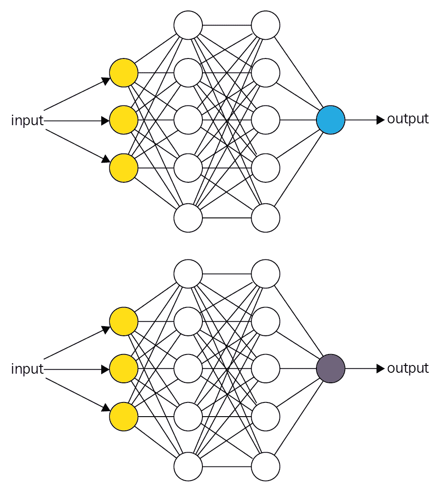
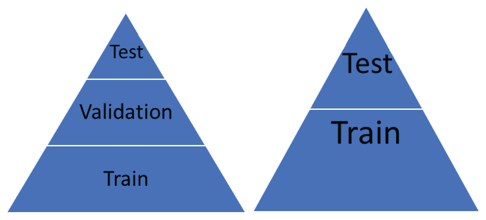
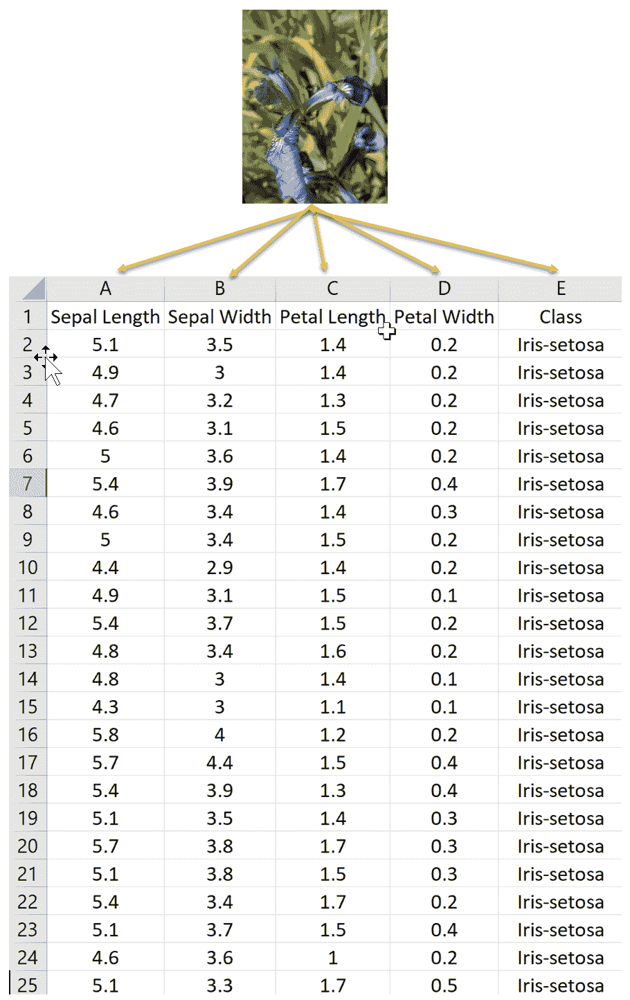
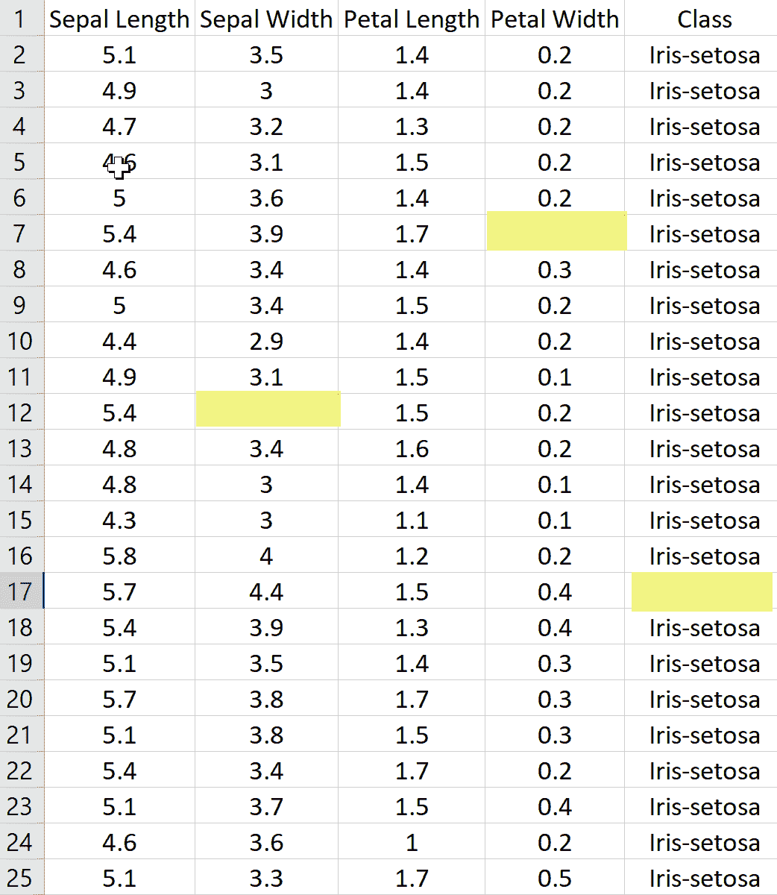
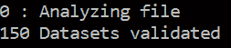
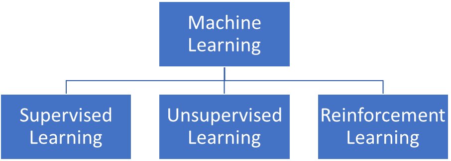
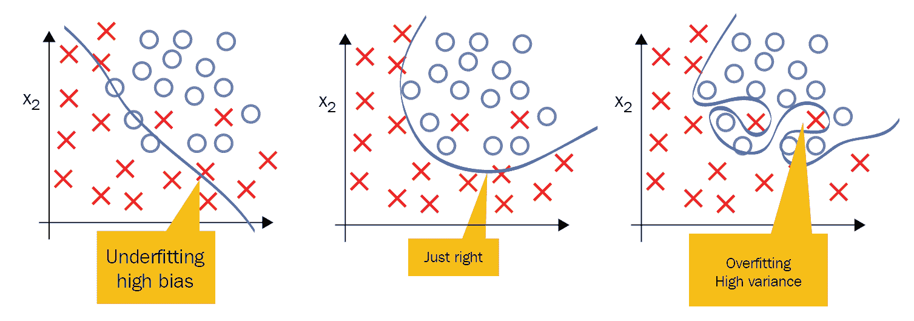
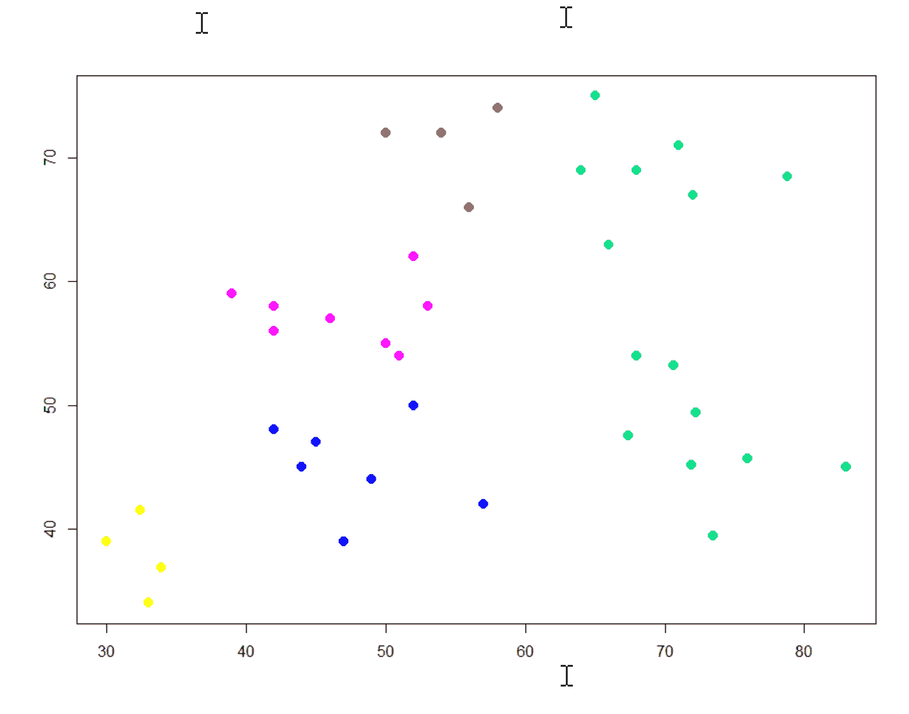
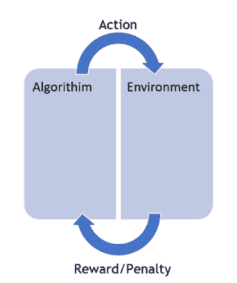

# 第一章：机器学习基础

大家好，欢迎来到《使用 C#和.NET 进行机器学习》。本书的目标是向您，一位经验丰富的 C# .NET 开发者，介绍许多可用的开源机器学习框架，以及如何使用这些包的示例。在这个过程中，我们将讨论日志记录、面部和动作检测、决策树、图像识别、直观的深度学习、量子计算等内容。在许多情况下，你将在几分钟内就能启动并运行。我真诚地希望这个系列中总有一款适合每个人。最重要的是，作为一名已经与开发者打交道 30 年的作者，以下是为什么我写这本书的原因。

作为一名终身微软开发者，我经常看到开发者们为了解决日常问题而苦苦寻找所需的资源。让我们面对现实吧，我们中没有一个人有足够的时间按照自己的方式做事，而且我们中很少有人有幸在一个真正的研发部门工作。然而，多年来我们已经走了很长的路，从那些还记得我们桌上有 C 程序员参考书和 50 多本书的我们，到如今能够快速在谷歌上搜索并找到我们确切（好吧，有时是确切）想要的东西。但现在，随着人工智能时代的到来，事情发生了一些变化。作为 C#开发者，当涉及到机器学习时，谷歌搜索并不总是我们的最佳朋友，因为几乎所有被使用的东西都是 Python、R、MATLAB 和 Octave。我们还必须记住，机器学习已经存在很多年了；只是最近，美国企业才开始拥抱它，我们看到越来越多的人参与其中。现在，计算能力已经可用，学术界在将其推广到世界各地的过程中取得了惊人的进步。但朋友们，正如你们无疑已经听说的那样，世界是一个可怕的地方！C# .NET 开发者该往哪里去呢？让我们在下一节中通过一个简短的故事来回答这个问题，不幸的是，这个故事的真实性就像天空一样。至少在这里阳光明媚的佛罗里达州是这样！

在本章中，我们将学习以下主题：

+   数据挖掘

+   **人工智能**（**AI**）和生物人工智能

+   深度学习

+   概率与统计

+   监督学习

+   无监督学习

+   强化学习

+   是购买、构建还是开源

# 机器学习简介

我曾经有一个老板，我告诉他我正在使用机器学习来发现更多关于我们数据的信息。他的回应是：“你认为你能学到我不知道的东西吗！”如果你在你的职业生涯中没有遇到过这样的人，恭喜你。也请告诉我如果你有任何空缺！但你更有可能已经遇到了，或者将会遇到。下面是如何处理的。而且，我没有辞职！

我说：“目标是了解更多关于我们拥有的基金以及它们可能如何与用户实际意图相关联的信息和细节。”

他：“但我已经知道这一切了。机器学习只是一个时髦词，最终都是数据，我们都是数据管理员。其余的都是时髦词。我们为什么要做这件事，它最终将如何帮助我？”

我：“好吧，让我问你这个问题。你认为你在谷歌上搜索某个东西时会发生什么？”

他：眼神呆滞，带着一丝愤怒。

他：“你是什么意思？显然，谷歌会把我搜索的内容与其他历史上搜索过相同内容的其他搜索进行对比。”

我：“好吧，那它是怎么完成的？”

他：愤怒和挫败感略有加剧。

他：“显然是它的计算机在搜索网络，并将我的搜索条件与其他搜索进行匹配。” 我：“但你有没有想过，这个搜索是如何在数十亿其他搜索中匹配的，以及所有搜索背后的数据是如何不断更新的？显然，人们无法参与其中，否则就无法扩展。”

他：“当然，算法经过精心调整，给出了我们想要的结果，或者至少，推荐。”

我：“没错，这正是机器学习所做的事情。”（不一定总是，但足够接近！）

他：“好吧，我觉得从数据中我学不到更多，让我们看看结果如何。”

所以，让我们坦诚一点，朋友们。有时候，无论逻辑多么严密，都无法克服盲点或对改变的抵抗，但这个故事背后有着截然不同且更为重要的意义，远非一个违背我们生物学所学的一切的老板。在机器学习的世界中，向一个不身处日常开发前线的人证明/展示正在发生的事情，无论事情是否在正常运作，它们是如何运作的，为什么它们（或不）在运作，等等，都要困难得多。即使如此，你也可能很难理解算法正在做什么。

在决定机器学习是否适合你时，以下是一些你应该问自己的问题：

+   你只是在尝试符合时髦词（这可能就是真正被要求的东西）吗，或者你对这种解决方案有真正的需求？

+   你有你需要的数据吗？

+   数据是否足够干净以供使用（关于这一点稍后还会讨论）？

+   你知道你能否获得可能缺失的数据，以及你是否知道数据实际上缺失了吗？

+   你有大量数据还是只有少量数据？

+   是否存在已知且经过验证的解决方案，我们可以用它来代替？

+   你知道你试图实现什么吗？

+   你知道你将如何实现它吗？

+   你将如何向他人解释？

+   当被问及时，你将如何证明引擎盖下正在发生的事情？

这些只是我们在开始机器学习之旅时将共同解决的问题的一部分。这全部关乎培养我所说的机器学习思维模式。

现在，似乎如果有人执行了一个返回多行数据的 SQL 查询，他们就会自称是**数据科学家**。对于简历来说，这是公平的；每个人偶尔都需要得到一些认可，即使这是自我提供的。但我们真的在以数据科学家的身份运作吗？数据科学家究竟是什么意思？我们真的在做机器学习吗？那究竟是什么意思？好吧，到这本书的结尾，我们希望找到所有这些答案，或者至少创造一个环境，让您自己找到答案！

我们中并非所有人都有在研究或学术界工作的奢侈。我们中的许多人每天都在应对各种挑战，而正确的解决方案可能就是一个必须在 2 小时内就位的具体战术解决方案。这就是我们作为 C#开发者所做的事情。我们整天坐在办公桌后面，如果幸运的话，戴着耳机，敲击键盘。但我们真的得到了我们想要或需要的全部时间来以我们喜欢的方式开发项目吗？如果我们做到了，我们的项目中就不会有那么多技术债务，对吧（你真的在跟踪你的技术债务，对吧）？

我们需要聪明地考虑如何超越曲线，有时我们通过思考多于编码来实现这一点，尤其是在一开始。学术方面是无价的；知识根本无法替代。但美国企业中的大多数生产代码并不是用 Python、R、Matlab 和 Octave 这样的学术语言编写的。尽管所有这些学术财富都可用，但它们并不是以最适合我们工作的形式提供的。

同时，让我们停下来赞扬那些为开源社区做出贡献的人。正是因为他们，我们才有一些出色的第三方开源解决方案可以利用，来完成我们的工作。开源社区允许我们利用他们所开发的内容，这是一种特权。本书的目的是向您展示其中的一些工具，并展示您如何使用它们。在这个过程中，我们将尽力为您提供一些基本的后台知识，这样就不会让一切都变得像黑洞一样神秘！

您无处不在都能听到这些热门词汇。我过去每天都要花费 2-4 个小时的时间通勤，我记不清我看到了多少个广告牌上有“机器学习”或 AI 的字样。它们无处不在，但这一切究竟意味着什么呢？AI、机器学习、数据科学、**自然语言处理（NLP**）、数据挖掘、神经元，等等！似乎一旦美国企业介入，曾经精细调校的艺术变成了一个混乱的自由竞争，一个微观管理的项目，有着完全不切实际的目标。我甚至听到一个潜在客户说：“我不确定它是什么意思，但我不想被落下！”

我们必须做的第一件事是学习正确的方法来处理机器学习项目。让我们从一些定义开始：

托马斯·米切尔将机器学习定义为：

“如果一个计算机程序在经验 E 方面对任务 T 和性能度量 P 有所学习，那么它在 T 中的任务性能，按照 P 来衡量，会随着经验 E 的提高而提高。”

我们的定义将会略有不同。希望这能成为你在被要求捍卫你选择的道路时可以用到的东西：

“机器学习是一系列技术，可以以最有效和最有效的方式处理大量数据，从而从数据中为我们提供可操作的结果和洞察。”

现在，关于我们称之为**技巧**的那些东西，不要误解；比如概率、统计学，它们都在那里，只是隐藏在表面之下。而我们用来执行示例的工具也会像 Python、R 和其他类似工具一样隐藏细节！话虽如此，如果我们不至少让你意识到一些基础知识，那将是对你的极大不公，这些基础知识我们稍后会涉及。我并不是要降低任何一项的重要性，因为它们都是同等重要的，但我们的目标是让所有 C#开发者尽可能快地开始使用。我们将提供足够的信息，让你符合行业术语，然后你将知道的不仅仅是块状 API 调用！我鼓励你们每个人都尽可能在这个领域追求更多的学术知识。机器学习和人工智能似乎每天都在变化，所以请始终跟上最新的发展。你知道的越多，你在获得项目认可方面就会越出色。

既然我们提到了**行业术语**，让我们从一开始就澄清一些术语。数据挖掘、机器学习、人工智能，等等。现在我只介绍几个术语，但这里有一个简单的方式来思考它。

你和家人在旅行。假设你有孩子，我们先不考虑“我们到那里了吗”这样的对话！你正在高速公路上驾驶，其中一个孩子（一个非常小的幼儿）大声喊“卡车”并指向窗外的一辆卡车。这个孩子非常小，那么他是怎么知道那辆特定车辆是卡车的（让我们假设它真的是卡车！）他们知道那是卡车，因为每次他们做同样的事情时，你都会说“是的”或“不”。那就是机器学习。然后，当你告诉他们“是的，那是一辆大卡车”时，你就是在为强化学习添加上下文，这让我们进入了深度学习。你有没有注意到你一直在教给你的孩子你甚至不知道的事情？

希望这有所帮助。

# 数据挖掘

数据挖掘涉及在大量数据中搜索非常具体的信息。您正在通过数据寻找特定的事物。例如，信用卡公司会通过分析购买行为及其位置来使用数据挖掘了解买家的习惯。这些信息随后变得非常有用，例如用于定向广告。

另一方面，机器学习专注于使用您提供的算法执行搜索该数据的实际任务。这说得通吗？

现在就说到这里，但这里有一个非常棒的链接，您可以从中了解更多关于数据挖掘的信息：[`blog.udacity.com/2014/12/24-data-science-resources-keep-finger-pulse.html`](https://blog.udacity.com/2014/12/24-data-science-resources-keep-finger-pulse.html)

# 人工智能

人工智能是机器学习的高级形式。有些人将其定义为当机器表现得和人类一样聪明，甚至比人类更聪明的时候。至于我，对这个问题的结论仍然悬而未决。我越看每天的新闻，就越想知道哪一种智能是人工的，以及真正的智能究竟是什么！有如此多的定义在流传，但简而言之，人工智能被认为是做人类能够或应该做的事情的机器，以至于任何合理的人都不可能在机器的响应中将其与人类区分开来。无论如何，人工智能是一个非常广泛的主题，不幸的是，人们对这个术语的理解和定义也各不相同！

# 生物人工智能

生物人工智能指的是将生物成分与计算组件结合在一起。基因型、表型、神经元、镜像神经元、典型神经元、突触……您将在这一类别下听到所有这些提及，**人工神经网络**（**ANNs**）！生物人工智能主要应用于医疗领域。目前，我们不需要担心这一点，但只需知道这个术语存在，并且生物学是其结合的基础。

# 深度学习

多年来，人们认为神经网络（使用一个称为隐藏层概念）只需要一个隐藏层就能解决任何问题。随着计算能力的提高、计算硬件成本的降低和神经网络算法的进步，网络中拥有数百甚至数千个**隐藏层**是很常见的。隐藏层数量的增加，以及其他因素，正是深度学习在非常简短的概念中的核心！这里有一个视觉比较，可能有助于使事情更清晰：

没有隐藏层

如您在下面的表示性图像中可以看到，网络中有几个隐藏层。

许多隐藏层（白色圆圈）

# 概率与统计学

信不信由你，这就是你正在做的事情；只是它从你的视角来看非常抽象。但让我给你一个极其、过于简化的、快速入门指南……以防你生疏了！

你看到一只北极熊在雪地里行走。你好奇它会留下什么样的脚印。这就是概率。接下来，你看到雪地里的脚印，想知道那是不是北极熊的。这就是统计学。砰！现在你准备好了！你可能也在想这位作者有什么问题，所以也许再举一个例子以防万一！

+   概率论涉及预测未来事件的可能性。

+   统计学涉及分析过去事件的发生频率。

# 接近你的机器学习项目

接下来，让我们谈谈我们将如何接近我们的机器学习项目，并在做这件事的同时，继续定义/细化我们的机器学习思维模式。让我们从定义每次我们接近这些项目时需要使用的基本步骤开始。基本上，我们可以将它们分解为以下几类。

# 数据收集

你有无数种类型的数据可供使用，从 SQL 和 NoSQL 数据库、Excel 文件、Access 数据库、文本文件等等。你需要决定你的数据在哪里，它的格式是什么，你将如何导入和精炼它。你需要始终记住，大量测试和训练数据以及其质量是没有替代品的。垃圾输入，垃圾输出在机器学习中可能会变得非常混乱！

# 数据准备

如我们之前所说，数据质量是没有替代品的。有没有缺失、格式不正确或错误的数据？而且别忘了你将熟悉的一个术语，数据离群值。那些是那些与你的其他数据不太匹配的讨厌的小数据片段！你有这些吗？如果有，它们应该在那里吗？如果是，它们将如何被处理？如果你不确定，这里是你绘制数据时可能看到的数据离群值的例子：

在统计学中，离群值是指与其他观察值距离较远的观察点，有时非常远，有时则不然。离群值本身可能是由于测量中的变化引起的，表明实验缺陷，或者实际上可能是有效的。如果你在你的数据中看到离群值，你需要了解原因。它们可能表明某种形式的测量错误，而你使用的算法可能不足以处理这些离群值。

# 模型选择和训练

在创建和训练模型时，这里有几点你需要考虑。

+   你需要为手头的任务选择合适的机器学习算法，这将代表你正在处理的数据。然后你将这个数据分成 2-3 个子集：**训练**、**验证**和**测试**。正确的比例规则取决于你处理的数据量。例如，如果你有 10,000 行数据，那么 20%用于训练和 80%用于测试可能很好。但如果你有 10⁸行数据，可能 5%用于训练和 95%用于测试会更好。

+   有一个规则你必须始终严格遵守。无论你决定为你的测试、训练和验证集使用什么比例，***所有数据必须来自同一个数据集***。这一点非常重要。你永远不希望从某个数据集取一些数据来训练，然后从完全不同的数据集取数据来测试。那样只会导致挫败感。始终积累大量数据集来训练、测试和验证！

+   验证数据可以在使用测试数据集之前用来验证你的测试数据。有些人使用它，有些人不使用。无论你如何划分你的数据，你总会有一个数据集来训练，一个数据集来测试。你的算法的目标必须是足够灵活，能够处理它之前未见过的数据，而你如果用你开发的数据集进行测试，就无法做到这一点。以下有两种数据划分的方法。这两种方法展示了你可以如何分离测试和训练集（一个包含交叉验证集，另一个不包含）：

# 模型评估

一旦你使用了你的训练数据，你将进入使用你之前准备的测试数据集来测试/评估你的模型。这就是我们了解我们的模型在之前未见过的数据上的表现如何。如果我们的模型在这里失败，我们就返回去，不要收集$200，并改进我们的流程！

# 模型调优

当你评估你的模型时，你可能会在某些时候确定你需要选择一个不同的模型或引入更多的特征/变量/超参数来提高你模型的效率和性能。一个减少你暴露的好方法是在*数据收集*部分和*数据准备*部分花更多的时间。正如我们之前所说的，大量的正确数据是没有任何替代品的。

如果你必须调整你的模型，你将会这样做，有许多方法可以做到这一点。这里只列举几个：

+   网格搜索

+   随机搜索

+   贝叶斯优化

+   基于梯度的优化

+   进化优化

让我们看看一个示例数据集——臭名昭著且总是被使用的 Iris 数据集。

# Iris 数据集

爱丽丝数据集是由生物学家罗纳德·费希尔先生在 1936 年引入的花卉数据集。这个数据集包含来自三种鸢尾花（鸢尾花、鸢尾花、鸢尾花）的 50 个样本。每个样本由四个特征组成（萼片长度、花瓣长度、萼片宽度、花瓣宽度）。结合这些数据，可以产生一个线性判别模型，区分不同的物种。

那么，我们如何从花朵转换到数据：

现在，我们需要将我们对我们正在处理的可视表示（花朵）的知识转化为计算机可以理解的东西。我们通过将我们对花朵的所有知识分解为列（特征）和行（数据项）来实现这一点，如下所示：

现在所有的测量值都已经转换成计算机可以理解的形式，我们的第一步应该是确保我们没有缺失或格式不正确的数据，因为这会带来麻烦。如果你查看之前的截图中的黄色高亮部分，你可以看到我们缺少数据。我们需要确保在将其提供给应用程序之前，这些数据得到填充。一旦数据得到适当的准备和验证，我们就可以开始了。如果我们从**Encog3[4]**运行爱丽丝验证器，我们的输出应该反映出我们有`150`个数据集，它确实如此：

# 机器学习的类型

现在，让我们简要地熟悉一下本书中将要讨论的不同类型的机器学习，从下一章开始。重要的是，你至少要熟悉这些术语，因为它们肯定会在某一天出现，而且你知道和理解得越多，你就能更好地处理你的问题并向他人解释。

这里有一个简单的图表，展示了机器学习的三个主要类别：

# 监督学习

这些类型的机器学习模型用于根据呈现给它的数据预测结果。提供的指令是明确和详细的，或者至少应该是，这就是它获得了**监督学习**这一标签的原因。我们基本上是在学习一个函数，该函数根据输入和输出对将输入映射到输出。这个函数是从称为**标记**的训练数据中推断出来的，因为它具体告诉函数它期望什么。在监督学习中，始终有一个输入和相应的输出（或者更准确地说，是一个期望的输出值）。更正式地说，这类算法使用称为**归纳偏差**的技术来实现这一点，这基本上意味着有一组算法将用于预测给定输入的输出的假设。

在监督学习中，我们通常可以访问一组 *X* 特征（*X[1]，X[2]，X[3]，... X[x]*），这些特征是在观察中测量的，以及一个响应 *Y*，也是在相同的 *n* 次观察中测量的。然后我们尝试使用 *X[1]，X[2]，X[3]，... X[n]* 来预测 *Y*。

**支持向量机**（**SVM**）、线性回归、朴素贝叶斯和基于树的算法只是监督学习的一些例子。

接下来，让我们简要讨论一下在监督学习中我们需要关注的一些事情。它们没有特定的顺序：

+   偏差-方差权衡

+   训练数据量

+   输入空间维度

+   不正确的输出值

+   数据异质性

# 偏差-方差权衡

在我们讨论偏差-方差权衡之前，确保你对这些个别术语本身熟悉是很有意义的。

当我们谈论偏差-方差权衡时，偏差指的是学习算法中由于不正确的假设而产生的错误。高偏差会导致所谓的**欠拟合**，这种现象会导致算法在数据中错过相关的特征-输出层关系。

另一方面，方差是对训练集中微小波动的敏感错误。高方差可能导致你的算法模型随机噪声而不是实际预期的输出，这种现象称为**过拟合**。

偏差和方差之间存在权衡，每个机器学习开发者都需要理解。它与数据的欠拟合和过拟合有直接关系。我们说，如果一个学习算法对不同的训练集预测不同的输出结果，那么它就有高方差，这当然是不好的。

一个具有**低偏差**的机器学习算法必须足够灵活，以便它能很好地拟合数据。如果算法设计得太灵活，每个训练和测试数据集都会以不同的方式拟合，从而导致高方差。

你的算法必须足够灵活，可以通过固有的算法知识或用户可调整的参数来调整这种权衡。

下图展示了一个具有高偏差（左侧）的简单模型和一个具有高方差（右侧）的更复杂模型。

# 训练数据量

正如我们反复所说的，拥有足够的数据来完成工作，这是没有替代品的。这直接关联到你的学习算法的复杂性。一个复杂度较低、偏差高、方差低的算法可以从较少的数据中学习得更好。然而，如果你的学习算法复杂（许多输入特征、参数等），那么你需要一个更大的训练集，从中学习以获得低偏差和高方差。

# 输入空间维度

对于每一个学习问题，我们的输入都将以**向量**的形式存在。**特征向量**，即数据本身的特征，可以极大地影响学习算法。如果输入的特征向量非常大，这被称为高维性，那么即使你只需要其中的一小部分特征，学习也可能变得更加困难。有时，额外的维度会混淆你的学习算法，从而导致高方差。反过来，这意味着你将不得不调整你的算法以降低方差并提高偏差。如果适用，有时从你的数据中移除额外的特征会更容易，从而提高你的学习函数准确性。

话虽如此，一种称为**降维**的流行技术被几个机器学习算法所使用。这些算法将识别并移除无关的特征。

# 不正确的输出值

我们在这里问自己的问题是，我们的机器学习算法期望的输出中存在多少错误。如果我们遇到这种情况，学习算法可能正在尝试将数据拟合得太好，从而导致我们之前提到的问题，**过拟合**。过拟合可能源于错误的数据，或者对于当前任务来说过于复杂的学习算法。如果发生这种情况，我们需要调整我们的算法或者寻找一个能够提供更高偏差和更低方差的算法。

# 数据异质性

根据韦伯斯特词典，异质性意味着*由不同或多样化的元素组成的质量或状态：异质性的质量或状态*。对我们来说，这意味着特征向量包括许多不同种类的特征。如果这适用于我们的应用，那么我们可能需要为该任务应用不同的学习算法。一些学习算法还要求我们的数据被缩放到适合某些范围，例如 *[0 - 1]，[-1 - 1]* 等。当我们深入研究利用距离函数作为其基础的学习算法时，例如最近邻和支持向量方法，你会看到它们对此非常敏感。另一方面，像基于树的算法（决策树等）处理这种现象相当好。

我们将以这句话结束这次讨论：我们应该始终从最简单、最合适的算法开始，并确保我们的数据被正确收集和准备。从那里，我们总是可以尝试不同的学习算法，并调整它们以查看哪个最适合我们的情况。不要误解，调整算法可能不是一项简单的任务，最终，它消耗的时间可能比我们可用的还要多。始终确保首先有适当数量的数据！

# 无监督学习

与监督学习相反，无监督学习在确定结果方面通常有更多的灵活性。数据被处理成，对于算法来说，数据集中没有哪个特征比其他特征更重要。这些算法从没有预期输出数据的标签的输入数据集中学习。k-means 聚类（聚类分析）是一个无监督模型的例子。它非常擅长在数据中找到有意义的模式，这些模式与输入数据相关。我们在这里学到的与监督部分学到的最大区别是，我们现在有*x*个特征*X[1]，X[2]，X[3]，... X[x]*在*n*个观察上进行了测量。但我们不再对*Y*的预测感兴趣，因为我们不再有*Y*。我们唯一的兴趣是发现我们拥有的特征上的数据模式：

在之前的图中，你可以看到像这样的数据更适合采用非线性方法，其中数据似乎相对于重要性呈现出聚类状态。它是**非线性**的，因为我们无法得到一条直线来准确地区分和分类数据。无监督学习允许我们用一个几乎没有任何关于结果会是什么样或应该是什么样的想法来处理问题。结构是从数据本身中得出的，而不是应用在输出标签上的监督规则。这种结构通常是通过**聚类**数据之间的关系来得出的。

例如，假设我们从我们的基因组数据科学实验中有 10⁸个基因。我们希望将这些数据分组到相似的片段中，比如发色、寿命、体重等等。

第二个例子是广为人知的**鸡尾酒会效应[3]**，它基本上指的是大脑的听觉能力能够集中注意力在一件事上，并过滤掉它周围的**噪音**。

这两个例子都可以使用聚类来实现它们的目标。

# 强化学习

强化学习是一个案例，其中机器被训练以实现特定的结果，唯一目的是最大化效率和/或性能。算法因做出正确的决策而**奖励**，因做出错误的决策而**惩罚**。持续训练用于不断改进性能。持续学习过程意味着更少的人为干预。马尔可夫模型是强化学习的一个例子，自动驾驶的自主汽车是这样一个应用的绝佳例子。它不断地与它的环境互动，观察障碍物、速度限制、距离、行人等等，以（希望）做出正确的决策。

我们与强化学习最大的不同之处在于我们不处理正确的输入和输出数据。这里的重点是性能，意味着以某种方式在未见数据与算法已经学习到的内容之间找到平衡。

该算法对其环境执行操作，根据其行为获得奖励或惩罚，然后重复，如下面的图像所示。你可以想象一下，在那个可爱的小自动驾驶出租车把你从酒店接走的时候，每秒钟会发生多少次这样的操作。

# 构建、购买或开源

接下来，让我们自问一个始终重要的问题？购买、构建还是开源？

这将是我的一些建议，当然也是我写这本书的原因之一，那就是让你接触开源世界。我意识到许多开发者都患有“这不是在这里建造的”综合症，但在我们走这条路之前，我们应该真的对自己诚实。我们真的认为我们有专业知识做得更好、更快，并且在我们的时间限制内进行测试，与已经存在的相比吗？我们应该首先尝试看看我们能否使用已经存在的。有如此多的开源工具包供我们使用，那些工具包的开发者已经投入了大量的时间和精力来开发和测试它们。显然，开源并不是每次都对每个人都是解决方案，但即使你无法在你的应用程序中使用它，通过使用和实验它们，你肯定可以从中获得大量的知识。

购买通常不是一种选择。如果你足够幸运能找到可以购买的东西，你可能不会得到批准，因为它会花费一大笔钱！如果你需要修改产品以完成你需要的事情，会发生什么？好运，得到访问源代码或让支持团队为了你改变他们的优先级。这不可能发生，至少不会像我们可能需要的那么快！

至于自己构建，嘿，我们是开发者，这是我们所有人都想做的事情，对吧？但在你启动 Visual Studio 并起飞之前，仔细思考一下你将要进入的是什么。

因此，开源应该始终是首选。你可以将其引入内部（假设许可允许你这样做），如果需要的话，适应你的标准（代码联系、更多单元测试、更好的文档等）。

# 额外阅读

尽管代码是用 Python 和 R 编写的，但我鼓励那些对在本章中讨论的内容进行扩展感兴趣的人访问 Jason Brownlee 的网站，[`machinelearningmastery.com/`](https://machinelearningmastery.com/)。他对机器学习的解释和热情无与伦比，你可以从他的网站上获得难以置信的大量信息。解释清晰、充满激情，涵盖了难以置信的深度。我强烈推荐浏览他的博客和网站，尽可能多地学习。

# 摘要

在本章中，我们讨论了使用 C#进行机器学习的许多方面，不同的代码实现策略——如构建、购买或开源——以及简要地触及一些重要定义。我希望这让你为即将到来的章节做好了准备。

在我们深入到源代码和应用之前，我想花些时间与你们讨论一下对我来说非常亲近和重要的事情：日志记录。这是我们每个人（或者应该做）的事情，而且如果你还不知道的话，这里有一个非常出色的工具你需要了解。在这本书中，我们将大量使用它，所以花些时间在前面了解它肯定是有帮助的，从下一章开始。

# 参考文献

+   By Nicoguaro - Own work, CC BY 4.0, [`commons.wikimedia.org/w/index.php?curid=46257808`](https://commons.wikimedia.org/w/index.php?curid=46257808)

+   创用 CC 署名-相同方式共享 3.0 未本地化版本

+   [`en.wikipedia.org/wiki/Cocktail_party_effect`](https://en.wikipedia.org/wiki/Cocktail_party_effect)

+   Encog 框架版权属于 Jeff Heaton/Heaton 研究
