# ReflectInsight – 实时监控

每个开发者都需要一个好的日志工具。不幸的是，我看到的情况往往是开发者们紧跟最新的所有事物，但却没有进行日志记录。从某种意义上说，这是好事，最好的日志框架是你甚至不知道它在工作的框架。然而，如果你之前没有使用过 **ReflectSoftware** 的 **ReflectInsight**，你将喜欢这一章。拥有正确的日志工具非常重要，尤其是在机器学习中，而这个工具提供的丰富、健壮的日志功能无与伦比！

你绝对需要了解你算法内部发生的事情，ReflectSoftware 提供了最丰富的日志功能。特别是当涉及到机器学习算法时，没有任何东西能与之相提并论。当你进入深度学习领域时，你会非常高兴能够看到底层发生的事情。

在算法可能运行数天后，从正确的日志记录中获得的洞察力是无价的：

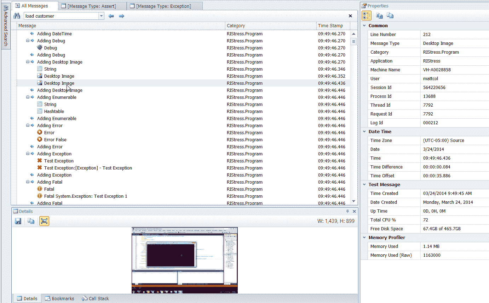

ReflectInsight 由一个 **软件开发工具包** (**SDK**)、一个路由器、一个日志查看器和实时查看器组成。我们将分别介绍每一个，并详细讨论它们。

在本章中，我们将涵盖以下主题：

+   路由器

+   日志查看器

+   实时查看器

    +   消息导航

    +   在你的消息中搜索

    +   时区格式化

    +   自动保存/清除

    +   SDK

    +   配置编辑器

# 路由器

路由器是日志系统的核心部分。所有日志消息都发送到路由器，它可以从那里将消息分发到监听器，如查看器、文本文件、二进制文件、事件日志、数据库等。你通常会将路由器安装在除日志系统之外的其他机器上，但并非必须如此。一旦安装和配置（出厂配置通常适用于大多数情况），路由器作为 Windows 服务运行，没有用户界面，如下面的截图所示：

接下来，我们将讨论日志和实时查看器。

# 日志查看器

日志查看器旨在查看已手动保存或从路由器/查看器配置中保存的历史日志文件。如果你通过系统流式传输大量消息，你无疑会收集到大量的日志文件；它们可能需要被查看。我为一位客户编写了一个企业级微服务系统，该系统以 ReflectInsight 作为其系统的核心，并将消息流式传输到 RabbitMQ 系统中。

平均每天我们大约流式传输了大约一百万条消息（它仍在生产中使用）；当出现问题时，日志查看器的历史日志功能非常有价值。

# 实时查看器

Live Viewer 是您将最常用来查看实时日志的工具。Live Viewer 的功能非常广泛。简而言之，高性能日志记录允许我们通过在 Live Viewer 中显示日志消息来实时监控已配置的应用程序。我们可以记录非常丰富的细节，例如异常、对象、数据集、图像、进程和线程信息，以及格式良好的 XML。我们还可以快速轻松地导航和跟踪我们的应用程序以找到所需的信息。消息详细信息面板显示选定消息的扩展详细信息。这些详细信息可能只是消息本身，也可能是复杂的数据，如对象、数据集、二进制 blob、图像、进程和线程信息，以及集合的内容。对于 SQL、XML 和与 HTML 相关的消息等选定的消息类型，提供语法高亮显示，以及完整的 Unicode 支持，这有助于查看这些类型的消息。

# 消息导航

ReflectInsight 支持多种方式在您的已记录消息中进行导航。

您可以使用以下方法之一进行导航：

+   查找匹配的进入/退出方法块

+   跳转到父级进入/退出方法块

+   从用户定义视图中跳转到所有消息视图

+   通过行号跳转到消息

+   高级搜索

+   快速搜索（仅限活动视图）

+   消息类型浏览导航器

+   书签

# 消息属性

此面板允许我们进一步检查选定的消息。我们可以查看各种日期时间值、时区、进程 ID、线程 ID、请求 ID、类别、机器名称等。我们还可以在日志过程中将用户定义的属性附加到单个或多个消息上，以扩展消息属性面板：

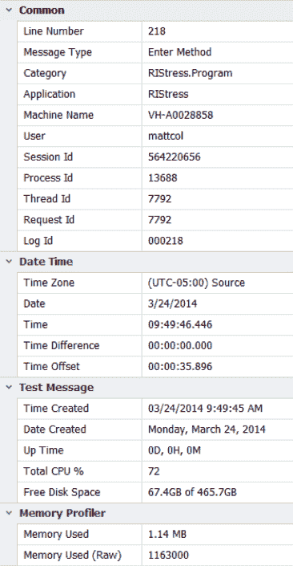

# 监视器

仅在实时查看器中可用，监视器面板允许我们显示非持久信息，以便快速进行数据更改。我们可以直接写入监视器，或者如果使用 ReflectInsight **PostSharp AOP**扩展，我们可以轻松地使用预定义的自定义属性装饰对象属性。

此属性强制 ReflectInsight 在属性值更改时显示其值：

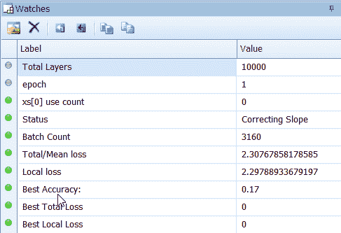

# 书签

书签面板允许我们查看当前日志会话的书签：

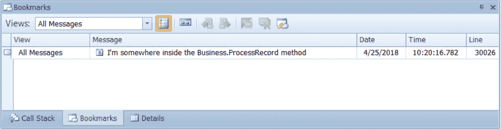

它可以与日志文件一起持久化，以便稍后检索。我们可以过滤活动视图或给定视图的书签，或查看所有视图中的所有书签。我们还可以导航到任何书签，并立即激活视图以选择书签消息的位置：

# 调用栈

调用栈面板显示当前选定消息的调用栈级别。调用栈条目是通过进入/退出方法生成的，或者如果消息包含在`TraceMethod`使用块中。

我们可以通过双击调用堆栈条目轻松导航调用堆栈，带我们到活动消息日志面板中 Enter/Exit 消息块的顶部：

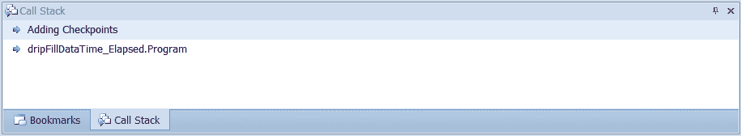

# 在您的消息中进行搜索

Live Viewer 提供两种通过标准搜索消息的方式，如下截图所示。它们是快速搜索和高级搜索：

**快速搜索**主要用于简单、快速、基于文本的搜索。

# 高级搜索

这主要用于搜索需要更复杂搜索标准的消息。搜索标准可以包括以下组合：

+   消息内容

+   消息类型

+   内容 AND 消息类型

+   内容 OR 消息类型

+   除了正则表达式

高级搜索视图提供了导航到搜索结果或将其书签化的能力：

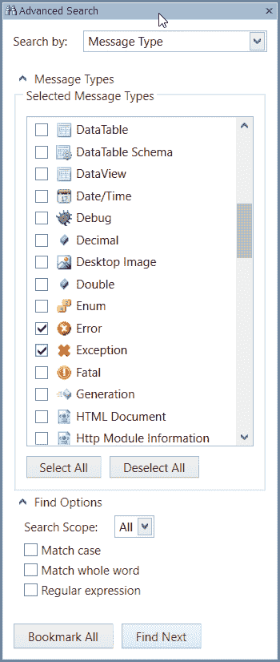

# 时区格式化

我们可以在标准时间格式或军事时间格式中显示我们的时间细节。选择最适合您位置的时区类型，例如源、本地、UTC 或自定义（从可用的系统时区中选择）。

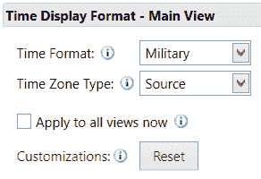

# 自动保存/清除

除了库的自动保存滚动日志文件的能力外，Live Viewer 还具有类似的功能，除了自动清除滚动日志文件的顶部部分。您可以通过应用以下方法之一来配置 Live Viewer 以自动保存或自动清除：

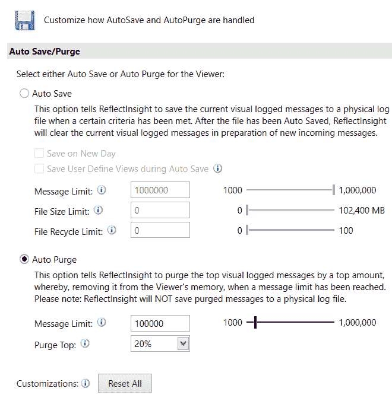

+   自动保存 - 此方法强制 Live Viewer 在满足特定标准（即在新的一天和/或消息限制）时保存文件。

+   自动清除 - 此方法强制 Live Viewer 根据当前日志文件预定义的大小百分比清除日志记录的顶部部分。

仅仅说如果我们查看以下截图，我们可以看到从我们的算法和应用中可能收集到的信息量；它是巨大的：

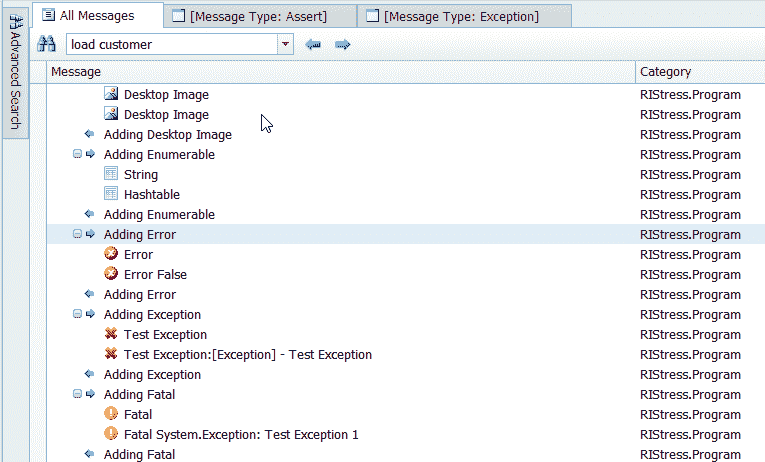

# 示例

我们已经提到，像这样的工具在机器学习方面是多么有价值，因此我们向您展示我们确切的意思是公平的。接下来是一个实际机器学习算法将数据输出到 Live Viewer 的截图。如果没有这些实时信息，我们将无法了解我们应用程序的有效性和性能！

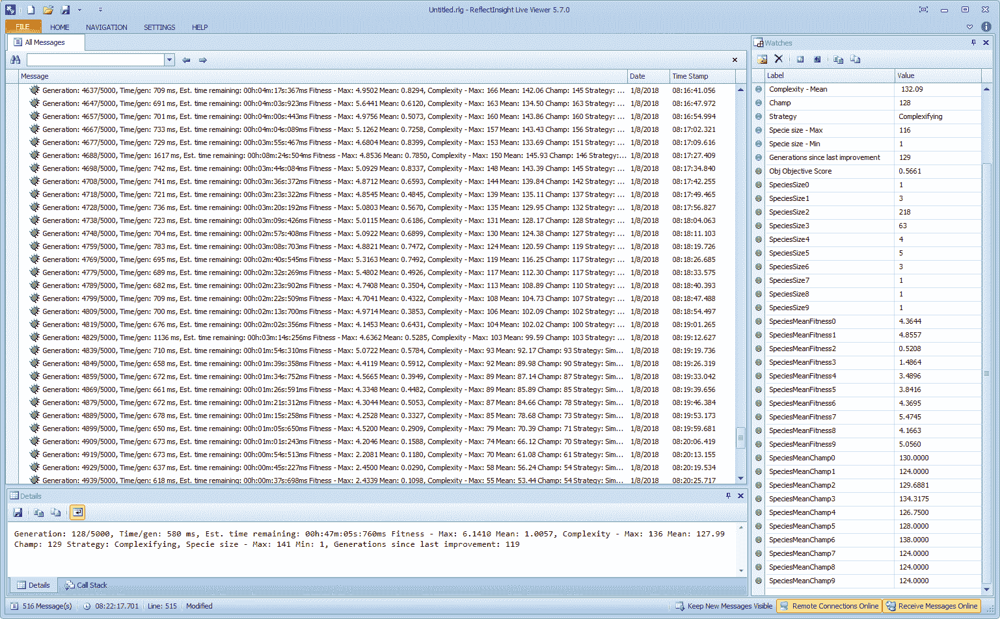

# ReflectInsight 工具：

消息统计可以通过这个极其有价值的工具查看和调整，以满足您的标准。您可以通过名称、类别、用户等多种方式搜索各种类型的消息。从那里您可以看到这些消息的组成。

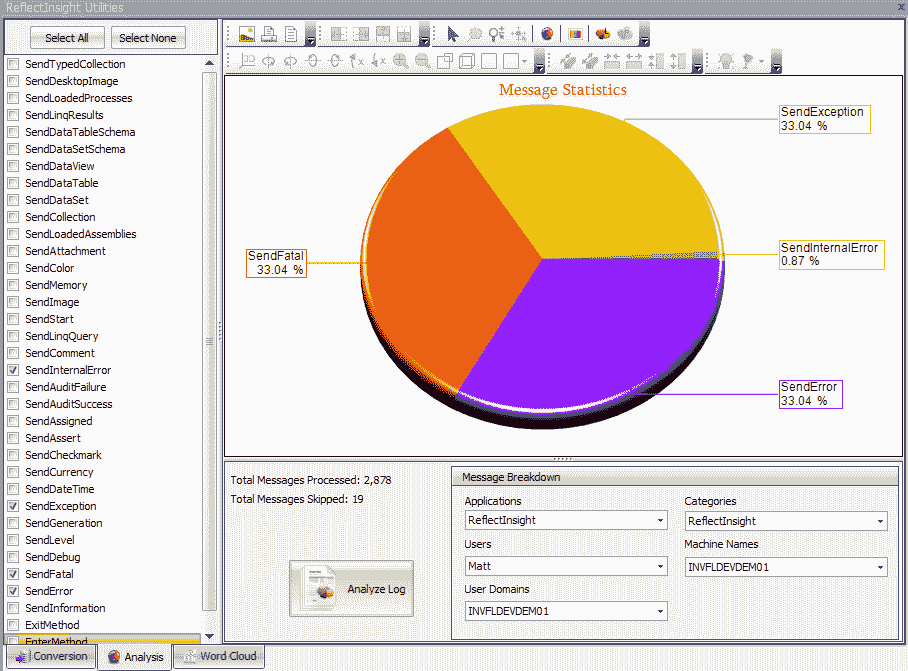

# 监视器

监视器实时观察以下参数和变量。你可以通过编程定义自己的监视器，并定期更新它们的值和/或参数。

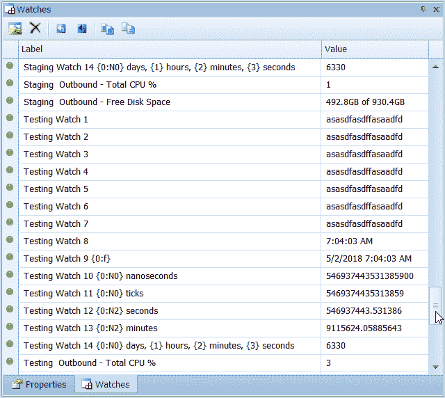

# 软件开发套件

SDK 允许我们将 ReflectInsight 连接到我们的应用程序。随着我们进一步了解，我们将看到这有多么容易。与其它 SDK 相比，这个 SDK 的美丽之处在于为每个消息分配了丰富的图像集。当你每秒有数千条消息流过时，颜色和图像可以帮助你集中注意力，只关注你需要看到的内容。

以下是一个截图，展示了我的确切意思。例如，如果我们使用 SendException 消息，那么红色的*X*将在 Live Viewer/Log Viewer 左侧远端的面板中显示。对于以下截图中的所有其他消息，情况相同： 

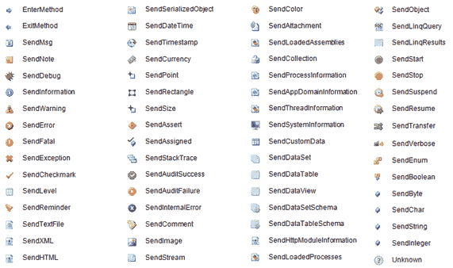

# 配置编辑器

配置编辑器是进入对应用程序配置参数进行更改的能力的可视界面。这使得它比更改文本文件参数更简单、更直观。

# 概览

我们可以使用基于 XML 的配置文件与我们的应用程序配合，使 ReflectInsight 查看器按照我们的意愿运行。可用的配置类别有很多，从自动保存和过滤，到消息着色等等。

# XML 配置

ReflectInsight 使用 XML 配置文件进行配置。配置信息可以嵌入到其他 XML 配置文件中，例如应用程序或`web.config`文件，或者单独的文件。配置易于阅读和更新，同时保持表达所有配置的灵活性。

或者，ReflectInsight 也可以通过编程进行配置。在这本书中，我们将结合使用这两种方法，主要配置通常通过`app.config`文件完成。

# 动态配置

ReflectInsight 会自动监控其配置文件的变化，并在更改时动态应用这些更改。在许多情况下，可以在不终止相关进程的情况下诊断应用程序问题。这可以是我们部署的应用程序中调查问题的非常有价值的工具。

# 主屏幕

ReflectInsight 洞察配置编辑器通过可视化界面帮助用户轻松创建配置文件，但高级用户可以使用 XML 进行操作。

该工具在编辑设置、定义消息模式/格式、定义扩展、定义监听器、将颜色与消息类型关联等方面非常有用：

+   易于理解的布局

+   它会记住最近文件列表

+   预定义选择和动态部分查找

+   关键值弹出编辑器

+   消息模式弹出编辑器

+   方法类型弹出编辑器

+   颜色定义和消息颜色弹出编辑器

以下是对配置编辑器及其参数变化的截图：

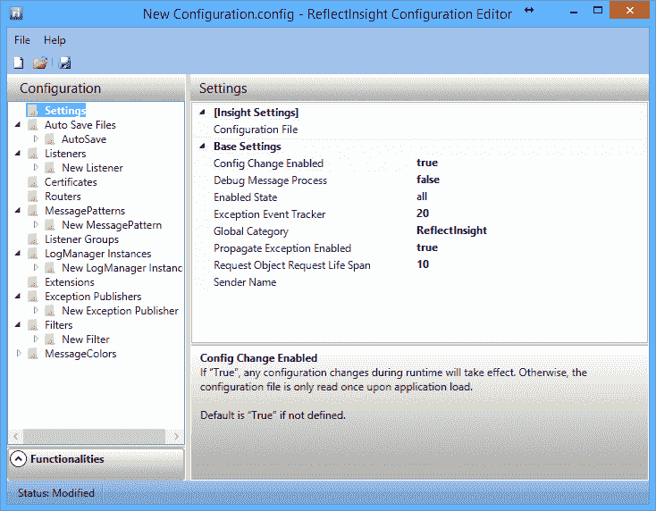

您可以从 [www.reflectsoftware.com](http://www.reflectsoftware.com) 下载 ReflectInsight 的试用版。在购买时提及此书，可享受零售价的大幅折扣！

# 摘要

在本章中，我们了解了 ReflectInsight 以及它能为您带来的惊人好处。我们特别看到了它如何帮助机器学习开发者清楚地看到他们算法内部正在发生什么。我鼓励您下载您的副本并尝试一下。您将永远不会以同样的方式看待日志记录。我们下一章将介绍著名的旅行商问题，我们将首次接触到我的第二生命之爱——神经元，以及与著名的贝叶斯定理一起工作！

ReflectInsight 是 ReflectSoftware 的版权所有。所有图像、文本和标志均经许可使用。
